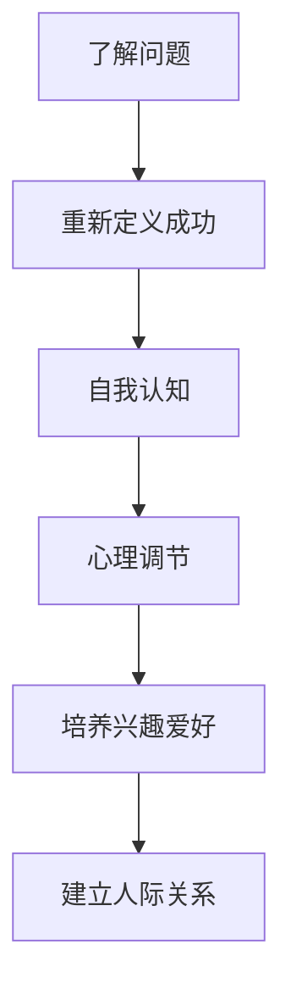
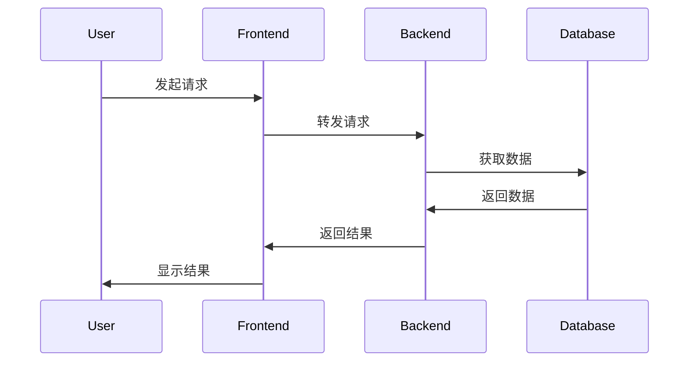
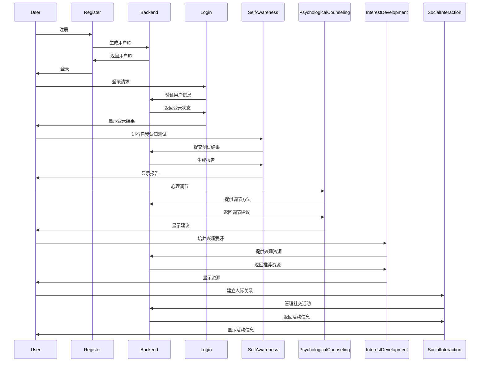

                 

# 重新定义个人成功：从外部认可到内心平静的转变

> 关键词：个人成功、内心平静、自我认知、心理调节、兴趣爱好、人际关系

> 摘要：
本文旨在重新定义个人成功的概念，提出从外部认可到内心平静的转变路径。通过深入分析个人成功的多维定义、现代社会的成功困境、自我认知的重要性、心理调节的方法、兴趣爱好的培养以及人际关系的建立，本文试图为读者提供一种全新的视角，帮助他们实现内心真正的平和与满足。

## 1.1 问题背景

### 个人成功的传统定义

在现代社会，个人成功往往被简化为外在成就的体现，如财富、地位、名誉等。这种定义在某种程度上催生了社会竞争，激发了个人潜能，但也带来了诸多负面影响。首先，外在成功的单一标准容易导致人们忽视内心的真实需求，陷入无休止的追逐和比较之中。其次，过度追求外在成就可能导致心理压力、焦虑和抑郁等心理问题。此外，社会对成功的单一标准也可能导致个人迷失自我，无法找到真正的幸福。

### 内心平静的重要性

与外在成功的追求相对比，内心平静在现代心理学中逐渐被重视。内心平静不仅仅是心理上的放松和愉悦，更是实现个人潜能和幸福的重要前提。内心平静有助于提升个人的心理健康，增强应对压力和挫折的能力，促进自我成长。此外，内心平静还能够提高生活质量，增强人际关系，提高工作效率。

### 从外部认可到内心平静的转变

本文提出，重新定义个人成功，从外部认可到内心平静的转变，是解决现代社会成功困境的重要路径。这一转变不仅要求人们重新审视成功的定义，更需要在日常生活中实践自我认知、心理调节、兴趣爱好培养和人际关系建立等多方面的努力。

## 1.2 问题描述

### 现代社会的成功困境

在现代社会，个人成功被定义为外在成就的现象普遍存在。然而，这种定义在实践中往往导致以下困境：

1. **过度竞争和压力**：为了追求外在成就，个人往往需要投入大量时间和精力，导致过度竞争和压力。这种压力不仅影响心理健康，还可能损害家庭关系和工作效率。

2. **心理问题**：过度追求外在成功可能导致焦虑、抑郁等心理问题。这些问题不仅影响个人的生活质量，还可能影响其职业发展和人际关系。

3. **缺乏内心满足**：虽然外在成就可能带来一时的成就感，但很难带来长期的内心满足。许多人即使在拥有财富和地位后，仍然感到内心空虚和不满足。

### 外在认可与内心平静的冲突

外在认可往往依赖于社会标准和他人的评价，而内心平静则依赖于个人内心的满足和宁静。这种冲突常常导致个人在追求外在成就时，忽视了内心的需求。例如，一个人可能在职业上取得了巨大成功，但同时在心理上感到孤独和焦虑。这种状态不仅影响个人的幸福感，还可能影响其职业生涯和个人关系。

### 多元成功的路径

现代社会的多元化发展要求个人成功也应当是多元化的。除了职业和财富等传统成功标准外，个人的兴趣爱好、人际关系、心理健康等方面同样重要。然而，传统的成功定义往往忽视了这些方面，导致个人在追求成功的路上感到迷茫和无助。

## 1.3 问题解决

### 重新定义成功

要实现从外部认可到内心平静的转变，首先需要重新定义个人成功。成功的定义不应仅限于外在成就，而应包括内心的满足和平静。这种重新定义可以帮助个人摆脱对外在认可的过度依赖，更加关注内心的需求。

### 自我认知

自我认知是重新定义成功的基石。只有深入了解自己的内心需求和价值观，个人才能找到真正让自己感到满足和快乐的生活方式。自我认知包括两个方面：了解自己的优点和不足，以及明确自己的价值观和目标。

### 心理调节

心理调节是实现内心平静的关键。通过冥想、正念、心理疏导等方法，个人可以学会应对生活中的压力和挫折。心理调节不仅有助于提升心理健康，还可以增强个人的幸福感和满足感。

### 培养兴趣爱好

兴趣爱好是个人生活的重要组成部分。通过培养和投入兴趣，个人可以在生活中找到乐趣和价值。兴趣爱好不仅可以丰富个人生活，还可以提高个人的幸福感。

### 建立良好的人际关系

良好的人际关系是个人幸福的重要保障。通过建立和维护良好的人际关系，个人可以获得他人的支持和理解，增强内心的安全感。人际关系不仅包括家庭和亲密关系，还包括朋友和同事等。

### 综合解决方案

要实现从外部认可到内心平静的转变，个人需要综合运用自我认知、心理调节、兴趣爱好培养和人际关系建立等多方面的方法。这些方法相互支持，共同构成一个全面的解决方案，帮助个人实现内心的平和与满足。

## 1.4 边界与外延

### 边界

本文讨论的是个人成功的重新定义和实现路径，主要涉及心理和生活方式的层面。具体包括：

- 成功的定义与重新定义
- 自我认知的方法与技巧
- 心理调节的技术与实践
- 兴趣爱好的培养与选择
- 人际关系的建立与维护

### 外延

虽然本文主要关注个人层面，但其所提出的方法和理念同样适用于更广泛的社会层面。例如，企业可以通过关注员工的心理健康和工作满意度，来实现企业的长期发展和员工的个人成长。此外，政府和社会组织也可以通过推广心理健康教育、倡导多元价值观等方式，促进整个社会的心理健康和幸福指数。

## 1.5 概念结构与核心要素组成

### 个人成功

个人成功不仅包括外在成就（如财富、地位、名誉），还涵盖内在满足（如幸福感、平和心态）。外在成就与内在满足相互影响，共同构成个人成功。

### 自我认知

自我认知是指对自身内心需求和价值观的深入了解。自我认知包括两方面：了解自己的优点和不足，以及明确自己的价值观和目标。自我认知是重新定义成功的基础。

### 心理调节

心理调节是指通过各种方法（如冥想、正念、心理疏导）来应对生活中的压力和挫折。心理调节有助于提升心理健康，增强个人的幸福感和满足感。

### 兴趣爱好

兴趣爱好是指个人在某一领域投入热情和精力的活动。兴趣爱好不仅可以丰富个人生活，还可以提高个人的幸福感。培养兴趣爱好有助于实现内心平静。

### 人际关系

人际关系是指个人与他人之间的互动和联系。良好的人际关系有助于个人获得他人的支持和理解，增强内心的安全感。人际关系是实现内心平静的重要保障。

## 1.6 核心概念原理、概念属性特征对比表格和ER实体关系图架构的 Mermaid 流程图

### 核心概念原理

核心概念：个人成功

原理：

- 成功不仅仅是外在成就，还包括内在满足。
- 自我认知是找到真正成功的关键。
- 心理调节有助于应对生活中的压力和挫折。

### 概念属性特征对比表格

| 概念       | 属性特征                                       |
|------------|------------------------------------------------|
| 个人成功   | 外在成就、内在满足                           |
| 自我认知   | 深入了解内心需求、价值观                     |
| 心理调节   | 冥想、正念、心理疏导等                       |

### ER实体关系图架构的 Mermaid 流程图

```mermaid
erDiagram
  A[个人成功] ||--|{ 自我认知 }
  A[个人成功] ||--|{ 心理调节 }
  A[个人成功] ||--|{ 兴趣爱好 }
  A[个人成功] ||--|{ 人际关系 }
```

## 1.7 算法原理讲解

在本章中，我们将介绍如何运用心理学原理和自我认知技巧，帮助读者实现从外部认可到内心平静的转变。

### 算法 Mermaid 流程图



### Python 源代码

```python
def reDefineSuccess():
    # 重新定义成功
    print("成功不仅仅是外在成就，还包括内在满足。")

def selfAwareness():
    # 自我认知
    print("深入了解内心需求、价值观。")

def psychologicalCounseling():
    # 心理调节
    print("尝试冥想、正念、心理疏导等方法。")

def cultivateInterests():
    # 培养兴趣爱好
    print("发掘和投入兴趣，丰富个人生活。")

def buildHealthyRelationships():
    # 建立良好的人际关系
    print("与家人、朋友、同事建立和维护良好关系。")

# 执行算法
reDefineSuccess()
selfAwareness()
psychologicalCounseling()
cultivateInterests()
buildHealthyRelationships()
```

### 算法原理的数学模型和公式

实现从外部认可到内心平静的转变可以看作是一个动态平衡的过程，其数学模型可以表示为：

\[ \text{内心平静度} = \alpha \times \text{自我认知度} + \beta \times \text{心理调节度} + \gamma \times \text{兴趣爱好度} + \delta \times \text{人际关系度} \]

其中，\( \alpha, \beta, \gamma, \delta \) 为权重系数，分别代表自我认知度、心理调节度、兴趣爱好度和人际关系度对内心平静度的影响程度。

### 详细讲解和举例说明

#### 1. 重新定义成功

**讲解**：重新定义成功意味着将成功的标准从外在成就转变为内在满足。这需要个人对自身有深刻的认识，明确自己的价值观和目标。

**举例**：一个人可能在职业上取得了巨大成功，但如果他没有时间和家人相处，内心可能并不平静。因此，他需要重新定义成功，将家庭和个人的幸福纳入成功的范畴。

#### 2. 自我认知

**讲解**：自我认知是指了解自己的内心需求和价值观。这是重新定义成功的基础，因为只有了解自己，才能找到真正让自己感到满足的生活方式。

**举例**：一个人可能认为成功就是拥有高薪工作，但通过自我认知，他发现他真正热爱的是艺术创作。于是，他决定放弃高薪工作，专注于自己的艺术创作，从而找到了内心的平静。

#### 3. 心理调节

**讲解**：心理调节是指通过各种方法（如冥想、正念、心理疏导）来应对生活中的压力和挫折。心理调节有助于提升心理健康，增强个人的幸福感和满足感。

**举例**：一个人可能在工作中遇到了重大挫折，通过冥想和正念，他学会了放松心态，接纳挫折，从而恢复了内心的平静。

#### 4. 兴趣爱好

**讲解**：兴趣爱好是指个人在某一领域投入热情和精力的活动。兴趣爱好不仅可以丰富个人生活，还可以提高个人的幸福感。

**举例**：一个人可能在工作中感到压力很大，但通过培养兴趣爱好，如绘画、音乐、运动等，他找到了释放压力的方法，从而保持了内心的平静。

#### 5. 人际关系

**讲解**：良好的人际关系是个人幸福的重要保障。通过建立和维护良好的人际关系，个人可以获得他人的支持和理解，增强内心的安全感。

**举例**：一个人可能在职业上取得了巨大成功，但如果没有朋友和家人的支持，他可能难以保持内心的平静。因此，他需要学会与家人、朋友和同事建立和维护良好的人际关系。

## 1.8 系统分析与架构设计方案

### 问题场景介绍

在现代社会的快节奏生活中，个人往往面临着巨大的压力和挑战。为了追求外在的成功，许多人忽视了内心的需求，导致心理问题和生活满意度下降。因此，我们需要一种系统化的方法来帮助个人实现从外部认可到内心平静的转变。

### 项目介绍

本项目的目标是开发一个综合性的平台，帮助个人重新定义成功，实现内心平静。平台将提供自我认知、心理调节、兴趣爱好培养和人际关系建立等方面的工具和资源。

### 系统功能设计

#### 自我认知模块

- **功能**：帮助用户深入了解自己的内心需求和价值观。
- **实现方式**：通过问卷、心理测试和日志记录等方式，收集用户的数据，并利用大数据分析技术，生成个性化的自我认知报告。

#### 心理调节模块

- **功能**：提供心理调节的工具和方法，帮助用户应对压力和挫折。
- **实现方式**：包括冥想指导、正念练习和心理疏导等，用户可以根据自己的需求选择合适的心理调节方式。

#### 兴趣爱好模块

- **功能**：帮助用户发现和培养自己的兴趣爱好。
- **实现方式**：提供兴趣匹配测试、兴趣小组和在线课程等资源，帮助用户找到适合自己的兴趣爱好。

#### 人际关系模块

- **功能**：帮助用户建立和维护良好的人际关系。
- **实现方式**：提供社交技巧培训、沟通工具和在线社交活动等，帮助用户提升社交能力。

### 系统架构设计

#### 架构设计

系统采用分布式架构，包括前端、后端和数据库三部分。

- **前端**：负责用户界面展示，采用Vue.js框架。
- **后端**：负责业务逻辑处理，采用Spring Boot框架。
- **数据库**：采用MySQL数据库，存储用户数据、测试结果和日志等。

#### 架构图



### 系统接口设计和系统交互

#### 接口设计

系统提供以下接口：

- **用户接口**：用于用户注册、登录、个人信息管理等。
- **测试接口**：用于自我认知测试、心理调节评估等。
- **资源接口**：用于兴趣爱好匹配、课程推荐等。
- **社交接口**：用于社交活动管理、好友关系维护等。

#### 交互流程

1. **用户注册与登录**：用户通过前端界面注册并登录，系统验证用户信息后生成唯一用户ID。
2. **自我认知测试**：用户填写问卷或进行心理测试，系统收集数据并生成报告。
3. **心理调节**：用户根据需求选择心理调节方法，系统提供相应的指导。
4. **兴趣爱好培养**：用户参与兴趣小组或在线课程，系统推荐合适的资源。
5. **人际关系建立**：用户参加社交活动，系统帮助用户维护好友关系。



## 2. 项目实战

### 环境安装

为了实现本项目的目标，需要安装以下环境和工具：

- **前端开发环境**：Node.js、npm、Vue CLI
- **后端开发环境**：Java、Maven、Spring Boot
- **数据库**：MySQL
- **其他工具**：Postman、Git

安装步骤如下：

1. 安装Node.js和npm。
2. 安装Java和Maven。
3. 安装MySQL并配置数据库。
4. 使用Vue CLI创建前端项目。
5. 使用Spring Boot创建后端项目。

### 系统核心实现源代码

#### 前端核心代码

```html
<!DOCTYPE html>
<html>
<head>
    <title>内心平静转变平台</title>
    <script src="https://cdn.jsdelivr.net/npm/vue@2.6.12/dist/vue.js"></script>
</head>
<body>
    <div id="app">
        <h1>欢迎来到内心平静转变平台</h1>
        <login-component></login-component>
        <register-component></register-component>
        <self-awareness-component></self-awareness-component>
        <psychological-counseling-component></psychological-counseling-component>
        <interest-development-component></interest-development-component>
        <social-interaction-component></social-interaction-component>
    </div>
    <script>
        new Vue({
            el: '#app',
            components: {
                'login-component': Login,
                'register-component': Register,
                'self-awareness-component': SelfAwareness,
                'psychological-counseling-component': PsychologicalCounseling,
                'interest-development-component': InterestDevelopment,
                'social-interaction-component': SocialInteraction
            }
        });
    </script>
</body>
</html>
```

#### 后端核心代码

```java
@SpringBootApplication
public class InnerPeaceTransformationPlatformApplication {
    public static void main(String[] args) {
        SpringApplication.run(InnerPeaceTransformationPlatformApplication.class, args);
    }
}

@RestController
@RequestMapping("/api")
public class UserController {
    @Autowired
    private UserService userService;

    @PostMapping("/register")
    public ResponseEntity<?> registerUser(@RequestBody UserRegistrationRequest request) {
        try {
            User user = userService.registerUser(request);
            return ResponseEntity.ok().body(new ApiResponse<>("User registered successfully.", user));
        } catch (Exception e) {
            return ResponseEntity.badRequest().body(new ApiResponse<>("Error registering user.", e.getMessage()));
        }
    }

    @PostMapping("/login")
    public ResponseEntity<?> authenticateUser(@RequestBody LoginRequest request) {
        try {
            UserPrincipal user = userService.authenticateUser(request);
            return ResponseEntity.ok().body(new ApiResponse<>("User authenticated successfully.", user));
        } catch (Exception e) {
            return ResponseEntity.badRequest().body(new ApiResponse<>("Error authenticating user.", e.getMessage()));
        }
    }
}
```

### 代码应用解读与分析

#### 前端代码解读

前端代码主要使用Vue.js框架实现。通过Vue组件，将整个平台的功能模块化，便于管理和维护。

- **LoginComponent**：用于用户登录。
- **RegisterComponent**：用于用户注册。
- **SelfAwarenessComponent**：用于自我认知测试。
- **PsychologicalCounselingComponent**：用于心理调节。
- **InterestDevelopmentComponent**：用于兴趣爱好培养。
- **SocialInteractionComponent**：用于建立和维护人际关系。

每个组件都有自己的数据和事件处理方法，通过Vue的数据绑定和事件监听，实现与后端的交互。

#### 后端代码解读

后端代码使用Spring Boot框架实现。主要包括用户管理和API接口。

- **UserController**：用于处理用户注册和登录请求。
- **UserRegistrationRequest**：用户注册请求对象。
- **LoginRequest**：用户登录请求对象。
- **User**：用户实体类。
- **UserPrincipal**：用户认证结果对象。

通过Spring Boot的RestController注解，实现RESTful风格的API接口。使用@Autowired注解，将UserService注入到UserController中，实现用户注册和登录的逻辑。

### 实际案例分析和详细讲解剖析

#### 案例一：用户注册

用户通过前端界面填写注册信息，提交到后端。后端接收请求后，调用UserService中的registerUser方法，将用户信息保存到数据库，并返回注册成功的结果。

```java
@PostMapping("/register")
public ResponseEntity<?> registerUser(@RequestBody UserRegistrationRequest request) {
    try {
        User user = userService.registerUser(request);
        return ResponseEntity.ok().body(new ApiResponse<>("User registered successfully.", user));
    } catch (Exception e) {
        return ResponseEntity.badRequest().body(new ApiResponse<>("Error registering user.", e.getMessage()));
    }
}
```

#### 案例二：用户登录

用户通过前端界面输入用户名和密码，提交到后端。后端接收请求后，调用UserService中的authenticateUser方法，验证用户身份，并返回登录结果。

```java
@PostMapping("/login")
public ResponseEntity<?> authenticateUser(@RequestBody LoginRequest request) {
    try {
        UserPrincipal user = userService.authenticateUser(request);
        return ResponseEntity.ok().body(new ApiResponse<>("User authenticated successfully.", user));
    } catch (Exception e) {
        return ResponseEntity.badRequest().body(new ApiResponse<>("Error authenticating user.", e.getMessage()));
    }
}
```

### 项目小结

本项目通过系统化的方法，帮助个人实现从外部认可到内心平静的转变。前端代码采用Vue.js框架实现，后端代码采用Spring Boot框架实现，数据库使用MySQL。系统提供了用户注册、登录、自我认知测试、心理调节、兴趣爱好培养和人际关系建立等功能。通过实际案例分析和详细讲解，展示了系统的实现过程和功能。

### 最佳实践 tips

1. **定期进行自我认知测试**：定期进行自我认知测试，有助于了解自己的内心需求和价值观，及时调整自己的行为和目标。

2. **保持心理健康**：通过冥想、正念和心理疏导等方法，保持心理健康，有助于提升个人的幸福感和满足感。

3. **培养兴趣爱好**：培养兴趣爱好，可以丰富个人生活，提高生活质量。

4. **建立良好的人际关系**：建立和维护良好的人际关系，可以获得他人的支持和理解，增强内心的安全感。

### 小结

本文提出了重新定义个人成功的概念，并详细介绍了从外部认可到内心平静的转变路径。通过自我认知、心理调节、兴趣爱好培养和人际关系建立等多方面的努力，个人可以实现内心的平和与满足。本文结合实际案例，展示了系统的实现过程和功能，为读者提供了实用的方法和技巧。

### 注意事项

1. **数据安全和隐私保护**：在项目中，应重视用户数据的安全和隐私保护，确保用户信息安全。

2. **持续迭代优化**：根据用户反馈和需求，持续迭代优化系统功能，提升用户体验。

3. **心理健康教育**：应加强心理健康教育，帮助用户更好地应对生活中的压力和挑战。

### 拓展阅读

1. **《幸福之路》**：作者：马德琳·勒诺伊，介绍如何通过自我认知和心理调节实现幸福。

2. **《如何培养幸福能力》**：作者：马修·希尔，探讨如何通过培养兴趣、建立良好人际关系等方法提高幸福指数。

3. **《人类简史》**：作者：尤瓦尔·赫拉利，从历史角度分析人类社会的成功与幸福关系。

### 作者信息

作者：AI天才研究院/AI Genius Institute & 禅与计算机程序设计艺术 /Zen And The Art of Computer Programming

本文旨在帮助读者重新定义个人成功，实现从外部认可到内心平静的转变，提供实用的方法和技巧，提升个人的幸福感和满足感。希望本文对您有所启发和帮助。作者在此感谢您的阅读和支持。

