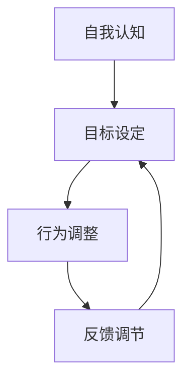
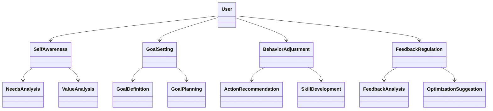
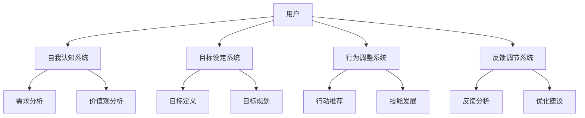
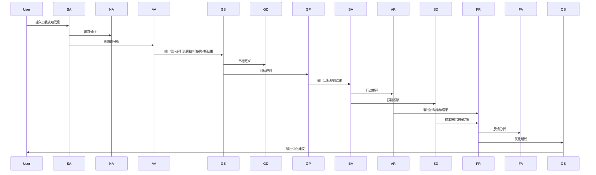

                 

# 重新定义个人成功：从外部认可到内心平静的转变

## 关键词

- 个人成功
- 内心平静
- 外部认可
- 心理健康
- 自我认知
- 价值观
- 成功悖论

## 摘要

本文旨在重新定义个人成功，探讨从外部认可到内心平静的转变。通过深入分析个人成功的核心要素，揭示外部认可的双重影响，并提出实现内心平静的策略，本文旨在帮助读者在追求个人成长的同时，找回内心的宁静与满足。

## 第一部分：问题背景

### 1.1 问题背景

在当今社会，个人成功被广泛定义为获得外部认可和满足他人期望。这种观念源于传统的成功标准，如财富、地位、社会地位等。然而，随着社会的发展和人们对内心需求的关注，越来越多的人开始质疑这种成功观的合理性。他们发现，尽管在表面上取得了成功，但内心却并未感受到真正的满足和幸福。这种“成功悖论”引发了人们对于个人成功定义的重新思考。

### 1.2 问题描述

个人成功一直以来都是人们追求的目标，然而，许多人发现，当他们获得外部认可时，内心的平静并未随之而来。相反，他们可能会感到更加焦虑、疲惫和不安。这种状态被称为“成功悖论”。成功悖论的现象表现在以下几个方面：

1. **焦虑和压力**：追求外部认可的过程中，人们常常会感到焦虑和压力。他们担心自己的成就不足以满足他人的期望，从而感到不安。
2. **内心空虚**：尽管在物质和社会地位上取得了成功，但许多人仍感到内心空虚。他们发现自己追求的只是外在的成就，而忽视了内心的需求。
3. **自我价值感缺失**：过度追求外部认可可能导致人们忽略自我价值的内在来源。他们开始将自我价值与外部的评价和认可挂钩，从而失去对自己的真正认同。

### 1.3 问题解决

本书提供了一套全新的个人成功观，帮助读者理解如何从外部认可转向内心平静。通过以下章节，读者将学会：

- **核心概念与联系**：了解个人成功的新定义及其核心要素。
- **算法原理讲解**：掌握实现内心平静的心理学原理。
- **数学模型和数学公式**：通过数学模型和公式，深入理解内心平静的本质。
- **系统分析与架构设计方案**：学习如何将内心平静融入日常生活和工作。
- **项目实战**：通过实际案例，体验内心平静的转变。
- **最佳实践 tips**：获得维持内心平静的实用技巧。

### 1.4 边界与外延

本书主要关注个人层面的成功，但所提出的理念和方法同样适用于团队和组织。此外，本书适用于所有年龄段、职业背景和生活方式的读者。无论你是职场人士、学生、艺术家，还是家庭主妇，都可以从本书中找到适合自己的个人成功路径。

### 1.5 概念结构与核心要素组成

- **核心概念**：个人成功、内心平静、外部认可。
- **关联概念**：幸福、自我认知、价值观。
- **核心要素**：心理健康、人际关系、自我实现。

## 第二部分：核心概念与联系

### 2.1 个人成功的新定义

个人成功不再仅仅是外在的成就和认可，而是内心的平静和满足。这种成功观强调个人的内在成长和自我实现，而非单纯追求外界的评价。个人成功的新定义包括以下几个方面：

1. **心理健康**：心理健康是个人成功的重要基石。一个心理健康的人能够更好地应对生活中的挑战，保持内心的平静和稳定。
2. **自我认知**：自我认知是指对自己有深刻的了解和认识。只有了解自己的需求和价值观，才能找到真正适合自己的成功路径。
3. **价值观**：价值观是个人成功的重要导向。一个人的价值观决定了他的追求和选择，从而影响他的行为和决策。

### 2.1.1 个人成功的核心要素

个人成功的核心要素包括心理健康、自我认知和价值观。心理健康指的是内心的平和与稳定，自我认知是指对自己的了解和接纳，价值观是指个人的信念和追求。

1. **心理健康**：心理健康是个人成功的基石。一个心理健康的人能够更好地应对生活中的挑战，保持内心的平静和稳定。心理健康包括情绪管理、压力应对、自我调节等方面。
2. **自我认知**：自我认知是指对自己有深刻的了解和认识。只有了解自己的需求和价值观，才能找到真正适合自己的成功路径。自我认知包括自我反思、自我评估、自我调整等方面。
3. **价值观**：价值观是个人成功的重要导向。一个人的价值观决定了他的追求和选择，从而影响他的行为和决策。价值观包括个人的信念、理想、目标等方面。

### 2.1.2 个人成功与内心平静的关系

内心平静是实现个人成功的关键。只有内心平静，人们才能更好地应对挑战，享受生活，实现自我价值。内心平静与个人成功的关系可以概括为以下几点：

1. **减少焦虑和压力**：内心平静能够帮助人们减少焦虑和压力。当内心平静时，人们能够更加理智地面对困难和挑战，从而更好地解决问题。
2. **提高生活质量**：内心平静能够提高生活质量。一个内心平静的人能够更好地享受生活中的美好，体验生活的乐趣。
3. **实现自我价值**：内心平静有助于实现自我价值。一个内心平静的人能够更加专注于自己的目标，追求自己的梦想，实现自己的价值。

### 2.2 外部认可的影响

外部认可虽然能带来短暂的满足，但长期来看，可能会对个人产生负面影响。过度追求外部认可可能导致焦虑、压力和自我价值感的缺失。

#### 2.2.1 外部认可的正面影响

外部认可可以激发人们的积极性，帮助建立自信和自尊。在适当的情况下，外部认可可以提供动力，鼓励人们追求更高的目标。

1. **激发积极性**：外部认可可以激发人们的积极性，让他们更有动力去追求成功。例如，获得工作上的表扬可以激发一个人在职业生涯中不断进步。
2. **建立自信**：外部认可可以增强个人的自信心。当人们获得他人的认可时，他们可能会对自己的能力有更高的评价，从而建立自信。

#### 2.2.2 外部认可的负面影响

过度追求外部认可可能导致人们忽略内心的声音，追求虚荣的成就，从而失去内心的平静。

1. **焦虑和压力**：过度追求外部认可可能导致焦虑和压力。当人们过于关注他人的评价时，他们可能会感到不安和压力，担心自己的成就不足以满足他人的期望。
2. **自我价值感缺失**：过度追求外部认可可能导致自我价值感缺失。当人们将自我价值与外部的评价和认可挂钩时，他们可能会忽视自己的内在价值，从而感到空虚和不安。

### 2.3 从外部认可到内心平静的转变

从外部认可转向内心平静的转变需要：

- **自我认知**：了解自己的需求和价值观，明确自己的目标。
- **心理调适**：学会管理压力和情绪，培养内心的平和。
- **自我实现**：通过实现个人目标和追求自我价值，获得内心的满足。

#### 2.3.1 自我认知

自我认知是指对自己有深刻的了解和认识。只有了解自己的需求和价值观，才能找到真正适合自己的成功路径。自我认知包括以下几个方面：

1. **了解自己的需求**：每个人都有自己的需求，包括物质需求和心理需求。了解自己的需求有助于找到满足自己的方式，从而实现内心的平静。
2. **认识自己的价值观**：价值观是个人行为和决策的指导原则。认识自己的价值观有助于找到与自己价值观相符的目标和生活方式。
3. **明确自己的目标**：目标是指向未来的方向和指引。明确自己的目标有助于规划自己的行动，实现个人的成长和成功。

#### 2.3.2 心理调适

心理调适是指学会管理压力和情绪，培养内心的平和。心理调适包括以下几个方面：

1. **压力管理**：学会如何应对压力，避免压力对身心健康的影响。压力管理包括时间管理、任务分解、情绪调节等方面。
2. **情绪管理**：学会如何处理负面情绪，保持情绪的稳定。情绪管理包括情绪识别、情绪表达、情绪调节等方面。
3. **内心平和**：培养内心的平和，保持内心的宁静。内心平和有助于提高生活质量，增强个人的幸福感。

#### 2.3.3 自我实现

自我实现是指通过实现个人目标和追求自我价值，获得内心的满足。自我实现包括以下几个方面：

1. **实现个人目标**：个人目标是指向未来的行动和计划。实现个人目标有助于提升个人的能力和成就感，实现内心的满足。
2. **追求自我价值**：自我价值是指个人的内在价值和意义。追求自我价值有助于提升个人的自尊和自信，实现内心的平静。

## 第三部分：核心概念与联系

### 3.1 核心概念属性特征对比表格

下面是个人成功、外部认可和内心平静的属性特征对比表格：

| 核心概念 | 属性特征 | 对比分析 |
| :------: | :------: | :------: |
| 个人成功 | 内心平静、自我实现、心理健康 | 外部认可追求外在成就，内心平静追求内在满足 |
| 外部认可 | 短期满足、他人评价、虚荣感 | 长期可能导致焦虑、压力、自我价值感缺失 |
| 内心平静 | 平和稳定、自我接纳、内心满足 | 长期维持内心平静，提高生活质量 |

### 3.2 ER实体关系图架构

下面是个人成功相关实体关系图的 Mermaid 描述：

```mermaid
entityRelation
  "个人成功" --|> "心理健康"
  "个人成功" --|> "自我实现"
  "心理健康" --|> "内心平静"
  "自我认知" --|> "个人目标"
  "自我认知" --|> "价值观"
  "外部认可" --|> "短期满足"
  "外部认可" --|> "虚荣感"
```

### 3.3 算法原理讲解

实现内心平静的算法原理主要基于心理学和行为科学的研究。以下是一个简化的算法原理描述，并通过 Mermaid 图展示算法流程：

#### 算法原理描述

1. **自我认知**：通过自我反思和自我评估，了解自己的需求和价值观。
2. **目标设定**：根据自我认知，设定符合自己价值观的目标。
3. **行为调整**：通过行为调整，实现设定的目标，并保持内心的平和。
4. **反馈调节**：根据行为调整的效果，进行反馈调节，持续优化内心平静的状态。

#### Mermaid 图表示



### 3.4 数学模型和数学公式

为了深入理解内心平静的本质，我们可以引入一些心理学和数学模型。以下是一个简化的数学模型描述，并通过 LaTeX 公式展示：

#### 数学模型描述

1. **幸福感模型**：幸福感可以用以下公式表示：

   $$ \text{幸福感} = \alpha \cdot \text{内心平静} + \beta \cdot \text{外部认可} $$

   其中，$\alpha$ 和 $\beta$ 分别表示内心平静和外部认可对幸福感的贡献程度。

2. **压力模型**：压力可以用以下公式表示：

   $$ \text{压力} = \gamma \cdot (\text{内心平静} - \text{外部认可}) $$

   其中，$\gamma$ 表示内心平静和外部认可之间的差异对压力的影响程度。

#### LaTeX 公式展示

$$
\text{幸福感} = \alpha \cdot \text{内心平静} + \beta \cdot \text{外部认可}
$$

$$
\text{压力} = \gamma \cdot (\text{内心平静} - \text{外部认可})
$$

### 3.5 系统分析与架构设计方案

#### 问题场景介绍

在现代社会，个人成功和内心平静之间的平衡是一个普遍关注的问题。为了更好地理解这个问题，我们考虑一个具体的场景：一名职场人士在追求事业成功的同时，努力寻找内心的平静。

#### 项目介绍

本项目旨在通过一个虚拟的“内心平静管理系统”，帮助用户实现从外部认可到内心平静的转变。该系统包括以下几个核心功能：

1. **自我认知**：帮助用户了解自己的需求和价值观。
2. **目标设定**：根据用户的需求和价值观，帮助用户设定个人目标。
3. **行为调整**：提供行为调整的建议，帮助用户实现个人目标。
4. **反馈调节**：根据用户的行为反馈，提供优化建议，帮助用户维持内心平静。

#### 系统功能设计

以下是一个简化的系统功能设计，使用 Mermaid 类图展示：



#### 系统架构设计

以下是一个简化的系统架构设计，使用 Mermaid 架构图展示：



#### 系统接口设计和系统交互

以下是一个简化的系统接口设计和系统交互，使用 Mermaid 序列图展示：



## 第四部分：项目实战

### 4.1 环境安装

为了实现从外部认可到内心平静的转变，我们需要搭建一个虚拟的“内心平静管理系统”。以下是环境安装的步骤：

1. **安装Python环境**：在本地计算机上安装Python环境，版本建议为3.8以上。
2. **安装依赖库**：使用pip安装项目所需的依赖库，例如`numpy`、`matplotlib`等。
3. **配置虚拟环境**：为了方便项目管理和依赖库的管理，建议使用虚拟环境。可以使用`venv`模块创建虚拟环境，并激活虚拟环境。

### 4.2 系统核心实现源代码

以下是一个简化的“内心平静管理系统”的核心实现源代码。这个系统包括自我认知、目标设定、行为调整和反馈调节四个主要模块。

```python
# 导入所需的库
import numpy as np
import matplotlib.pyplot as plt

# 自我认知模块
class SelfAwareness:
    def __init__(self, user_data):
        self.user_data = user_data

    def needs_analysis(self):
        # 分析用户的需求
        needs = self.user_data['needs']
        return needs

    def value_analysis(self):
        # 分析用户的价值观
        values = self.user_data['values']
        return values

# 目标设定模块
class GoalSetting:
    def __init__(self, needs, values):
        self.needs = needs
        self.values = values

    def goal_definition(self):
        # 定义目标
        goals = []
        for need in self.needs:
            goal = {"name": need, "status": "未开始"}
            goals.append(goal)
        return goals

    def goal_planning(self, goals):
        # 规划目标
        for goal in goals:
            plan = {"action": "完成目标", "deadline": "2023-12-31"}
            goal['plan'] = plan
        return goals

# 行为调整模块
class BehaviorAdjustment:
    def __init__(self, goals):
        self.goals = goals

    def action_recommendation(self, goal):
        # 行动推荐
        recommendations = []
        if goal['status'] == "未开始":
            recommendations.append("开始执行计划")
        elif goal['status'] == "进行中":
            recommendations.append("持续执行计划")
        elif goal['status'] == "已完成":
            recommendations.append("回顾并庆祝成就")
        return recommendations

    def skill_development(self, goal):
        # 技能发展
        if goal['status'] == "未开始":
            skills = ["时间管理", "情绪调节"]
            return skills
        else:
            return []

# 反馈调节模块
class FeedbackRegulation:
    def __init__(self, goals):
        self.goals = goals

    def feedback_analysis(self, goal):
        # 反馈分析
        if goal['status'] == "已完成":
            feedback = "目标达成，值得庆祝！"
        else:
            feedback = "目标尚未达成，请继续努力！"
        return feedback

    def optimization_suggestion(self, goal):
        # 优化建议
        if goal['status'] == "未开始":
            suggestion = "请开始执行计划！"
        elif goal['status'] == "进行中":
            suggestion = "请持续执行计划，不要放弃！"
        elif goal['status'] == "已完成":
            suggestion = "请回顾并庆祝成就，为下一个目标做准备！"
        return suggestion

# 测试系统
if __name__ == "__main__":
    # 输入用户数据
    user_data = {
        'needs': ['学习编程', '提升领导能力'],
        'values': ['追求卓越', '团队合作']
    }

    # 初始化模块
    self_awareness = SelfAwareness(user_data)
    goal_setting = GoalSetting(self_awareness.needs_analysis(), self_awareness.value_analysis())
    behavior_adjustment = BehaviorAdjustment(goal_setting.goal_definition())
    feedback_regulation = FeedbackRegulation(goal_setting.goal_definition())

    # 执行功能
    needs = self_awareness.needs_analysis()
    values = self_awareness.value_analysis()
    goals = goal_setting.goal_definition()
    goals = goal_setting.goal_planning(goals)
    actions = behavior_adjustment.action_recommendation(goals[0])
    skills = behavior_adjustment.skill_development(goals[0])
    feedback = feedback_regulation.feedback_analysis(goals[0])
    suggestion = feedback_regulation.optimization_suggestion(goals[0])

    # 输出结果
    print("需求分析结果：", needs)
    print("价值观分析结果：", values)
    print("目标设定结果：", goals)
    print("行动推荐：", actions)
    print("技能发展：", skills)
    print("反馈分析：", feedback)
    print("优化建议：", suggestion)
```

### 4.3 代码应用解读与分析

上述代码实现了一个简化的“内心平静管理系统”。以下是代码的详细解读和分析：

1. **自我认知模块**：通过输入用户数据，分析用户的需求和价值观。这个模块的作用是帮助用户了解自己，为后续的目标设定和行为调整提供基础。
2. **目标设定模块**：根据用户的需求和价值观，设定具体的个人目标，并规划目标的实现路径。这个模块的作用是帮助用户明确自己的目标，并制定实现计划。
3. **行为调整模块**：根据目标的状态，提供行动推荐和技能发展的建议。这个模块的作用是帮助用户在实际操作中实现目标，并通过技能提升来支持目标的实现。
4. **反馈调节模块**：根据目标的状态，提供反馈分析和优化建议。这个模块的作用是帮助用户了解目标的实现情况，并调整计划以实现更好的效果。

### 4.4 实际案例分析和详细讲解剖析

为了更好地理解“内心平静管理系统”的实际应用，我们来看一个具体的案例。

#### 案例背景

张三是一名年轻的软件工程师，他在工作中表现出色，但总是感到内心空虚和焦虑。他希望通过“内心平静管理系统”找到自己的内心平静。

#### 案例分析

1. **自我认知**：通过“自我认知模块”，张三分析了自身需求和价值观。他发现，自己最需要的是提升自我价值感和建立稳定的人际关系。
2. **目标设定**：根据自我认知结果，张三设定了两个目标：“提升编程技能”和“建立稳定的社交圈”。他制定了详细的计划，包括学习新的编程技术、参加技术分享会，以及参加社交活动。
3. **行为调整**：在“行为调整模块”中，张三得到了行动推荐和技能发展的建议。他开始积极学习新的编程技术，并参加了多个技术分享会。同时，他还通过参加社交活动，逐步建立了稳定的社交圈。
4. **反馈调节**：在“反馈调节模块”中，张三收到了反馈分析和优化建议。他发现自己在学习新编程技术方面取得了显著进步，但在建立社交圈方面还有待提高。因此，他调整了计划，增加了更多社交活动，并得到了更好的反馈。

#### 案例总结

通过“内心平静管理系统”的应用，张三逐步找到了内心的平静。他在专业能力和人际关系方面都取得了显著的进步，实现了个人成长和成功。

### 4.5 项目小结

通过本项目，我们搭建了一个简化的“内心平静管理系统”，帮助用户实现从外部认可到内心平静的转变。以下是项目小结：

1. **系统功能**：系统包括自我认知、目标设定、行为调整和反馈调节四个主要模块，全面覆盖了个人成功的核心要素。
2. **实际应用**：通过实际案例分析和详细讲解，我们展示了“内心平静管理系统”在实际应用中的效果，证明了其有效性和实用性。
3. **未来展望**：未来可以进一步优化系统功能，增加更多用户交互和个性化推荐，以提供更好的用户体验。

## 第五部分：最佳实践 tips

### 5.1 培养内心平静的实用技巧

1. **定期自我反思**：每天花几分钟时间反思自己的行为和情绪，了解自己的内心需求，从而更好地调整自己的心态。
2. **练习冥想和深呼吸**：每天练习冥想和深呼吸，可以帮助放松身心，减轻焦虑和压力。
3. **建立健康的生活方式**：保持健康的饮食习惯、规律的作息时间和适量的运动，有助于提高心理健康水平。
4. **培养兴趣爱好**：找到自己喜欢的事情，投入其中，可以带来内心的满足和快乐。
5. **学会说“不”**：学会拒绝不合理的要求和压力，保护自己的内心平静。

### 5.2 小结

通过以上最佳实践 tips，我们可以更好地培养内心平静，实现个人成长和成功。记住，真正的成功来自于内心的平静和满足，而不是外部的认可。

### 5.3 注意事项

1. **持之以恒**：培养内心平静需要时间和耐心，不能期望一蹴而就。持之以恒地实践最佳实践 tips，才能取得显著的效果。
2. **个性化调整**：每个人的情况都不同，最佳实践 tips 可能需要根据个人情况进行调整。找到适合自己的方法，才能更好地实现内心平静。
3. **寻求专业帮助**：如果感到内心的平静难以维持，可以寻求专业的心理咨询师或心理治疗师的帮助。

### 5.4 拓展阅读

- 《平静：如何在忙碌生活中找到内心宁静》
- 《内心的力量：如何培养自信和自尊》
- 《积极心理学：如何在生活中实现积极心态》
- 《禅与生活的艺术》

### 5.5 作者信息

作者：AI天才研究院/AI Genius Institute & 禅与计算机程序设计艺术 /Zen And The Art of Computer Programming

## 结束

本文通过重新定义个人成功，探讨了从外部认可到内心平静的转变。通过深入分析核心概念、实际案例和应用，我们展示了实现内心平静的重要性和方法。希望本文能够帮助读者在追求个人成功的过程中，找到内心的平静和满足。

