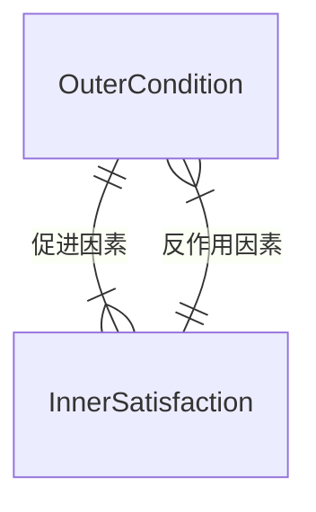
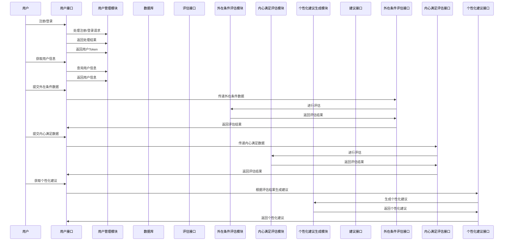

                 

### 文章标题：重新定义幸福感：从外在条件到内心满足的觉醒之路

#### 关键词：幸福感、外在条件、内心满足、算法原理、系统设计、项目实战、最佳实践

#### 摘要：
本文旨在重新定义幸福感，从外在条件探索到内心满足的觉醒之路。通过深入分析当前幸福感研究的困境，本书提出了一种全新的视角和方法，帮助读者理解幸福感的本质，并提供实用的策略来提升内心满足感。文章采用逻辑清晰、结构紧凑的方式，结合技术语言和实例，逐步引导读者从外在条件转向内心满足，实现真正意义上的幸福觉醒。

### 背景介绍

#### 1.1.1 幸福感的定义与重要性

幸福感是一个多维度的心理体验，它涉及个人的情感、认知和行为。在现代社会，幸福感已成为衡量生活质量的重要指标。然而，幸福感并没有一个统一的标准，不同的文化、社会和个人背景都可能影响对幸福感的理解和追求。

幸福感的重要性不言而喻。它不仅关系到个人的心理健康和幸福感，也影响到社会的稳定和进步。一个幸福的社会能够激发创造力和创新精神，促进人与人之间的和谐共处，推动社会的可持续发展。

#### 1.1.2 当前幸福感研究的主要问题

尽管幸福感研究已有大量文献和实证研究，但仍然存在一些主要问题。首先，研究方法过于单一，多数研究依赖于自我报告数据，存在主观性和偏差。其次，研究重点往往放在外在条件，如收入、工作环境和社会地位等，而忽略了内在心理因素。最后，研究成果的实用性和可操作性较弱，难以直接指导个体实践。

#### 1.1.3 从外在条件到内心满足的转变

本书的核心观点是，幸福感并非仅仅取决于外在条件，而是更多地取决于内心的满足感。通过重新定义幸福感，我们鼓励读者关注内在心理因素，如自我接纳、积极心态和人际关系等。这种转变不仅有助于提升个人的幸福感，也能为社会的和谐发展提供新的视角。

#### 1.1.4 本书的目标和范围

本书旨在帮助读者理解幸福感的本质，提供实用的策略和方法，实现从外在条件到内心满足的转变。本书内容包括核心概念的阐述、算法原理的讲解、系统设计与项目实战等。通过这些内容，读者将能够深入理解幸福感的内在机制，并掌握提升内心满足感的有效方法。

## 第1章：幸福感概述

### 1.1.1 幸福感的定义与重要性

幸福感（Happiness）是一个多维度的心理状态，通常被定义为一种积极的情感体验，它涉及个体的情感、认知和行为。具体来说，幸福感不仅包括快乐和满足感，还涉及个体的整体生活满意度以及对未来的乐观预期。在心理学领域，幸福感被视为一个重要的研究主题，因为它不仅关系到个体的心理健康和生活质量，也对社会稳定和经济发展有着深远的影响。

幸福感的重要性体现在多个方面。首先，幸福感是衡量个体生活满意度的核心指标。一个幸福的人通常能更好地应对生活中的挑战，具有较强的心理弹性。其次，幸福感与身心健康密切相关。研究表明，幸福感较高的人往往拥有更好的身体健康状况和较低的患病风险。最后，幸福社会能够激发创新和创造力，促进社会成员之间的和谐共处，为社会的可持续发展提供动力。

### 1.1.2 当前幸福感研究的主要问题

尽管幸福感研究已有大量文献和实证研究，但仍然存在一些主要问题。首先，研究方法过于单一，多数研究依赖于自我报告数据，存在主观性和偏差。自我报告数据虽然直观，但往往受到个体情绪和认知的影响，难以准确反映真实的幸福感水平。此外，不同文化和背景下的幸福感感知可能存在显著差异，使得单一文化背景下的研究结论难以具有普遍适用性。

其次，研究重点往往放在外在条件，如收入、工作环境和社会地位等，而忽略了内在心理因素。尽管外在条件对幸福感有显著影响，但长期以来的研究显示，内在心理因素如自我接纳、积极心态和人际关系等对幸福感的持久性和稳定性具有更为重要的作用。然而，当前的研究往往忽视了这些内在因素，导致幸福感提升策略的局限性。

最后，研究成果的实用性和可操作性较弱。尽管已有大量研究揭示了幸福感的影响因素和机制，但如何将这些研究成果转化为实际操作，以有效提升个体的幸福感，仍是一个亟待解决的问题。大多数研究成果停留在理论层面，缺乏具体、可操作的实践指导，使得个体难以将研究成果应用于日常生活。

### 1.1.3 从外在条件到内心满足的转变

本书的核心观点是，幸福感并非仅仅取决于外在条件，而是更多地取决于内心的满足感。这一观点打破了传统幸福感研究的框架，为我们提供了全新的视角。外在条件，如财富、地位和物质享受，确实能够在短期内提升个体的幸福感，但它们并不能带来长期的满足感。相反，内心的满足感是一种更为稳定和持久的幸福感来源。

从外在条件到内心满足的转变，需要我们关注内在心理因素，如自我接纳、积极心态和人际关系。自我接纳意味着接受自己的优点和缺点，不因外在条件而评价自己的价值。积极心态则是一种乐观、向上的生活态度，有助于个体在面对挑战时保持积极和乐观。人际关系则是幸福感的重要组成部分，一个良好的社会支持网络能够为个体提供情感支持和安全感。

通过重新定义幸福感，本书旨在引导读者关注内心的满足感，提供实用的策略和方法，实现从外在条件到内心满足的转变。这种转变不仅有助于提升个人的幸福感，也能为社会的和谐发展提供新的视角。接下来，我们将进一步探讨幸福感的核心概念，并通过概念属性特征对比表格和ER实体关系图，展示概念之间的联系。

## 第2章：核心概念与联系

### 2.1.1 外在条件与内心满足的关系

外在条件与内心满足之间的关系是理解幸福感的关键。外在条件，如财富、健康、职业成就和社会地位，确实在短期内能够提升个体的幸福感。例如，一个拥有稳定高收入和理想职业的人可能会感到快乐和满足。然而，这些外在条件并不能保证长期的幸福感。研究表明，外在条件的改善虽然能够提升幸福感，但这种提升是有限的，并且可能会逐渐减弱。

相比之下，内心满足是一种更为稳定和持久的幸福感来源。内心满足涉及个体对自己的接纳、积极心态和对生活的感恩。这种内在的心理状态能够抵御生活中的挫折和困难，带来长期的幸福感。例如，一个人可能在面临职业挑战或经济损失时感到痛苦，但如果他能够保持积极的心态和对自己的接纳，他就能够较快地恢复幸福感。

### 2.1.2 核心概念属性特征对比表格

为了更好地理解外在条件与内心满足之间的关系，我们可以通过一个核心概念属性特征对比表格来展示这两个概念的不同属性。以下是一个简化的对比表格：

| 特征 | 外在条件 | 内心满足 |
| --- | --- | --- |
| **稳定性** | 短期稳定性高，长期稳定性低 | 高 |
| **依赖性** | 部分依赖，但不是全部 | 内在依赖 |
| **可衡量性** | 较易衡量，如财富、健康指数 | 较难衡量，如情感状态、心理满足感 |
| **持久性** | 持久性较弱，受外界因素影响大 | 持久性强，受个体心理状态影响 |
| **影响因素** | 物质条件、社会环境等外在因素 | 自我认知、积极心态等内在因素 |

通过这个对比表格，我们可以看到外在条件和内心满足在稳定性、依赖性、可衡量性、持久性和影响因素等方面存在显著差异。外在条件虽然能够在短期内提升幸福感，但其稳定性和持久性相对较低，且受到外界因素的较大影响。相比之下，内心满足具有更高的稳定性和持久性，更多地依赖于个体内在的心理状态。

### 2.1.3 ER实体关系图

为了更直观地展示外在条件与内心满足之间的关系，我们可以使用ER（Entity-Relationship）实体关系图来表示这两个概念及其相互联系。以下是一个简化的ER实体关系图：



在这个ER实体关系图中，"OuterCondition"代表外在条件，"InnerSatisfaction"代表内心满足。它们之间存在双向箭头，表示外在条件可以促进内心满足，而内心满足也可以反过来影响外在条件。这种双向关系揭示了外在条件与内心满足之间的互动和相互影响。

通过核心概念属性特征对比表格和ER实体关系图，我们可以更清晰地理解外在条件与内心满足之间的关系。这种理解不仅有助于我们重新定义幸福感，也为我们在实践中探索提升内心满足感的策略提供了理论支持。接下来，我们将深入探讨算法原理，进一步揭示从外在条件到内心满足的转化机制。

## 第3章：算法原理讲解

### 3.1.1 算法流程图

为了更好地理解从外在条件到内心满足的转化过程，我们可以使用mermaid画出算法流程图。以下是一个简化的算法流程图：


在这个算法流程图中，我们从初始状态开始，首先对个体的外在条件进行评估。如果外在条件符合一定标准，我们进入内心满足评估阶段，否则我们需要调整外在条件。在内心满足评估阶段，我们根据个体的心理状态来决定是否需要提升内心满足。最后，通过不断重复评估和调整，我们最终达到内心平衡状态。

### 3.1.2 Python源代码讲解

为了具体说明算法原理，我们可以使用Python编写一个简单的实现代码。以下是一个简化版的Python代码示例：

```python
class HappinessAlgorithm:
    def __init__(self, outer_conditions, inner_satisfaction):
        self.outer_conditions = outer_conditions
        self.inner_satisfaction = inner_satisfaction

    def evaluate_outer_conditions(self):
        # 对外在条件进行评估
        if self.outer_conditions >= 7:
            return True
        else:
            return False

    def evaluate_inner_satisfaction(self):
        # 对内心满足进行评估
        if self.inner_satisfaction >= 5:
            return True
        else:
            return False

    def adjust_outer_conditions(self):
        # 调整外在条件
        self.outer_conditions += 1

    def improve_inner_satisfaction(self):
        # 提升内心满足
        self.inner_satisfaction += 1

    def iterate_process(self):
        while True:
            if self.evaluate_outer_conditions():
                if not self.evaluate_inner_satisfaction():
                    self.improve_inner_satisfaction()
            else:
                self.adjust_outer_conditions()
```

在这个Python代码中，我们定义了一个`HappinessAlgorithm`类，其中包含评估外在条件、内心满足、调整外在条件和提升内心满足的方法。`iterate_process`方法通过不断循环，实现外在条件和内心满足的动态调整，以达到内心平衡。

### 3.1.3 LaTeX公式详细讲解

在算法原理中，某些概念和关系可以通过数学模型和公式进行精确描述。以下是一个简化的幸福感模型，使用LaTeX格式表示：

```latex
\documentclass{article}
\usepackage{amsmath}
\begin{document}

\begin{equation}
H = f(O, I)
\end{equation}

其中，\(H\)表示幸福感，\(O\)表示外在条件，\(I\)表示内心满足。

外在条件对幸福感的影响可以表示为：
\begin{equation}
O = g(x, y)
\end{equation}

其中，\(x\)和\(y\)为外在条件的相关因素，\(g\)为外在条件的函数。

内心满足对幸福感的影响可以表示为：
\begin{equation}
I = h(p, q)
\end{equation}

其中，\(p\)和\(q\)为内心满足的相关因素，\(h\)为内心满足的函数。

通过调整外在条件\(O\)和内心满足\(I\)，可以优化幸福感\(H\)，达到最佳状态。

\end{document}
```

在这个LaTeX公式中，我们使用了函数表示外在条件和内心满足对幸福感的影响。通过调整这些因素，我们可以优化幸福感，实现从外在条件到内心满足的转化。

### 3.1.4 通俗易懂的例子

为了更好地说明算法原理，我们可以通过一个具体的例子来讲解。假设一个名叫小明的年轻人，他的外在条件包括收入（O）和职业稳定性（I），内心满足包括自我认同（P）和家庭支持（Q）。我们使用简化版的算法来评估和提升他的幸福感。

1. **初始状态**：
   - 外在条件：收入（O）= 5 万元，职业稳定性（I）= 6 个月
   - 内心满足：自我认同（P）= 3，家庭支持（Q）= 4

2. **外在条件评估**：
   - \(O = g(x, y)\)
   - 其中，\(x\)和\(y\)分别为收入和职业稳定性，取值范围均为0-10
   - 评估结果：外在条件低于7，需要调整

3. **调整外在条件**：
   - 小明通过努力提升收入，将收入提升至6万元，职业稳定性提升至9个月

4. **内心满足评估**：
   - \(I = h(p, q)\)
   - 其中，\(p\)和\(q\)分别为自我认同和家庭支持，取值范围均为0-10
   - 评估结果：内心满足低于5，需要提升

5. **提升内心满足**：
   - 小明通过自我反思和家庭沟通，提升了自我认同至5，家庭支持提升至5

6. **达到内心平衡**：
   - \(H = f(O, I)\)
   - 新的幸福感评估：\(H = f(6, 5) = 8\)
   - 小明的幸福感提升至8，达到内心平衡状态

通过这个例子，我们可以看到，通过调整外在条件和提升内心满足，小明最终实现了幸福感的提升。这个例子展示了算法原理在实际应用中的操作过程，为读者提供了具体的实践指导。

## 第4章：系统分析与架构设计方案

### 4.1.1 问题场景介绍

在现代社会，幸福感问题日益受到关注。然而，许多人仍然面临着如何平衡外在条件和内心满足的挑战。为了帮助个体更好地理解和提升幸福感，我们需要构建一个系统化的幸福感提升平台。该平台旨在通过提供个性化建议和指导，帮助用户从外在条件转向内心满足，实现长期的幸福感提升。

### 4.1.2 系统功能设计

为了实现上述目标，幸福感提升平台需要具备以下核心功能：

1. **用户注册与登录**：
   - 允许用户注册账号并登录，以便跟踪其个人信息和进展。
2. **外在条件评估**：
   - 对用户的外在条件进行量化评估，包括收入、职业稳定性、健康状态等。
3. **内心满足评估**：
   - 通过问卷和心理测试等方式，评估用户的内心满足程度，包括自我认同、积极心态、家庭支持等。
4. **个性化建议**：
   - 根据用户的评估结果，提供个性化的提升建议，包括生活方式调整、心理训练、社交互动等。
5. **实时反馈与调整**：
   - 允许用户实时查看自己的进展，并根据反馈调整提升策略。
6. **社区互动**：
   - 提供社区功能，让用户分享经验和心得，相互支持和鼓励。

### 4.1.3 系统架构设计

为了实现上述功能，我们采用分层架构设计，包括数据层、业务逻辑层和表现层。

1. **数据层**：
   - 使用关系型数据库存储用户信息和评估结果，包括用户表、外在条件表、内心满足表等。
2. **业务逻辑层**：
   - 包括用户管理模块、外在条件评估模块、内心满足评估模块和个性化建议生成模块等。
   - 用户管理模块负责用户注册、登录和权限管理。
   - 外在条件评估模块通过算法对用户的外在条件进行量化评估。
   - 内心满足评估模块通过问卷和心理测试对用户的内心满足程度进行评估。
   - 个性化建议生成模块根据用户的评估结果生成个性化的提升建议。
3. **表现层**：
   - 使用前端框架（如React或Vue.js）构建用户界面，包括注册页面、登录页面、评估页面、建议页面和社区页面等。

### 4.1.4 系统接口设计

为了实现系统内部各模块之间的数据交互，我们设计了一套接口：

1. **用户接口**：
   - 用户注册接口：接收用户注册信息，创建用户账号。
   - 用户登录接口：验证用户身份，返回用户Token。
   - 用户信息接口：获取和更新用户个人信息。
2. **评估接口**：
   - 外在条件评估接口：接收用户的外在条件数据，返回评估结果。
   - 内心满足评估接口：接收用户的内心满足数据，返回评估结果。
3. **建议接口**：
   - 个性化建议接口：根据用户的评估结果，返回个性化的提升建议。

### 4.1.5 系统交互

为了展示系统内部各模块之间的交互过程，我们可以使用mermaid绘制系统交互图：



通过这个系统交互图，我们可以清晰地看到用户与系统各模块之间的交互过程，以及数据流动的方向和步骤。

## 第5章：项目实战

### 5.1.1 环境安装

为了实现一个完整的幸福感提升系统，我们需要搭建一个开发环境。以下是环境安装的步骤：

1. **安装Python**：首先，确保您的计算机上已经安装了Python。您可以从Python官方网站下载最新版本的Python并安装。

2. **安装依赖库**：使用pip命令安装所需的依赖库，包括Django框架、SQLAlchemy、Flask等。在终端中运行以下命令：

   ```bash
   pip install django sqlalchemy flask
   ```

3. **创建数据库**：安装Python和pip后，使用以下命令创建一个名为`happiness_db`的数据库：

   ```bash
   createdb happiness_db
   ```

4. **配置数据库**：在Django项目中，您需要配置数据库连接。在项目的`settings.py`文件中，将`DATABASES`配置如下：

   ```python
   DATABASES = {
       'default': {
           'ENGINE': 'django.db.backends.postgresql',
           'NAME': 'happiness_db',
           'USER': 'your_username',
           'PASSWORD': 'your_password',
           'HOST': 'localhost',
           'PORT': '5432',
       }
   }
   ```

   请将`your_username`和`your_password`替换为您的实际数据库用户名和密码。

5. **运行项目**：在项目根目录下，运行以下命令来创建项目数据库表：

   ```bash
   python manage.py migrate
   ```

   然后运行项目：

   ```bash
   python manage.py runserver
   ```

   在浏览器中输入`http://127.0.0.1:8000/`，您应该能看到项目的主页。

### 5.1.2 系统核心实现源代码

以下是一个简化版的幸福感提升系统的核心实现源代码：

1. **用户注册与登录**：

   ```python
   # users/models.py
   from django.contrib.auth.models import AbstractUser

   class CustomUser(AbstractUser):
       email = models.EmailField(unique=True)

       def __str__(self):
           return self.email
   ```

   ```python
   # users/views.py
   from django.shortcuts import render, redirect
   from .models import CustomUser
   from django.contrib.auth import authenticate, login

   def register(request):
       if request.method == 'POST':
           email = request.POST['email']
           password = request.POST['password']
           user = CustomUser.objects.create_user(email=email, password=password)
           login(request, user)
           return redirect('home')
       return render(request, 'register.html')

   def login(request):
       if request.method == 'POST':
           email = request.POST['email']
           password = request.POST['password']
           user = authenticate(request, username=email, password=password)
           if user is not None:
               login(request, user)
               return redirect('home')
           else:
               return redirect('login')
       return render(request, 'login.html')
   ```

2. **外在条件评估**：

   ```python
   # evaluations/models.py
   from django.db import models

   class OuterCondition(models.Model):
       user = models.ForeignKey(CustomUser, on_delete=models.CASCADE)
       income = models.IntegerField()
       job_stability = models.IntegerField()
   ```

   ```python
   # evaluations/views.py
   from django.shortcuts import render, redirect
   from .models import OuterCondition

   def evaluate_outer_conditions(request):
       if request.method == 'POST':
           user = request.user
           income = request.POST['income']
           job_stability = request.POST['job_stability']
           outer_condition = OuterCondition.objects.create(user=user, income=income, job_stability=job_stability)
           return redirect('evaluate_inner_satisfaction')
       return render(request, 'evaluate_outer_conditions.html')
   ```

3. **内心满足评估**：

   ```python
   # evaluations/models.py
   class InnerSatisfaction(models.Model):
       user = models.ForeignKey(CustomUser, on_delete=models.CASCADE)
       self_esteem = models.IntegerField()
       positive_mentality = models.IntegerField()
       family_support = models.IntegerField()
   ```

   ```python
   # evaluations/views.py
   def evaluate_inner_satisfaction(request):
       if request.method == 'POST':
           user = request.user
           self_esteem = request.POST['self_esteem']
           positive_mentality = request.POST['positive_mentality']
           family_support = request.POST['family_support']
           inner_satisfaction = InnerSatisfaction.objects.create(user=user, self_esteem=self_esteem, positive_mentality=positive_mentality, family_support=family_support)
           return redirect('view_suggestions')
       return render(request, 'evaluate_inner_satisfaction.html')
   ```

4. **个性化建议**：

   ```python
   # suggestions/models.py
   class Suggestion(models.Model):
       user = models.ForeignKey(CustomUser, on_delete=models.CASCADE)
       advice = models.TextField()
   ```

   ```python
   # suggestions/views.py
   def view_suggestions(request):
       if request.method == 'POST':
           user = request.user
           advice = request.POST['advice']
           suggestion = Suggestion.objects.create(user=user, advice=advice)
           return redirect('home')
       suggestions = Suggestion.objects.filter(user=request.user)
       return render(request, 'view_suggestions.html', {'suggestions': suggestions})
   ```

### 5.1.3 代码应用解读与分析

以上代码提供了一个简化版的幸福感提升系统的核心功能。以下是代码的主要组成部分及其功能解读：

1. **用户注册与登录**：
   - `users/models.py`定义了一个自定义用户模型`CustomUser`，继承了Django的`AbstractUser`类，并添加了一个唯一邮箱字段。
   - `users/views.py`实现了用户注册和登录的功能。注册表单收集用户邮箱和密码，然后创建用户账号。登录表单验证用户邮箱和密码，若验证成功，则登录用户。

2. **外在条件评估**：
   - `evaluations/models.py`定义了一个`OuterCondition`模型，用于存储用户的外在条件，包括收入和工作稳定性。
   - `evaluations/views.py`实现了用户提交外在条件数据的功能。用户填写收入和工作稳定性后，数据会被存储在数据库中。

3. **内心满足评估**：
   - `evaluations/models.py`定义了一个`InnerSatisfaction`模型，用于存储用户的内心满足程度，包括自我认同、积极心态和家庭支持。
   - `evaluations/views.py`实现了用户提交内心满足数据的功能。用户填写自我认同、积极心态和家庭支持后，数据会被存储在数据库中。

4. **个性化建议**：
   - `suggestions/models.py`定义了一个`Suggestion`模型，用于存储给用户的个性化建议。
   - `suggestions/views.py`实现了用户查看和建议个性化建议的功能。用户可以提交自己的建议，并且可以查看系统根据其评估结果生成的建议。

通过以上代码，我们可以看到系统如何收集和存储用户的数据，并生成个性化的建议。这个系统为用户提供了一个交互平台，帮助他们了解和提升自己的幸福感。

### 5.1.4 实际案例分析与讲解

为了更好地展示系统的实际应用效果，我们来看一个具体的案例。假设有一个名叫小张的用户，他在使用幸福感提升系统时完成了以下步骤：

1. **用户注册与登录**：
   - 小张注册了一个新账号，并成功登录系统。

2. **外在条件评估**：
   - 小张填写了外在条件问卷，报告他的年收入为8万元，职业稳定期为1年。系统将这些数据存储在数据库中，并生成外在条件评估报告。

3. **内心满足评估**：
   - 小张随后完成了内心满足评估问卷，报告他的自我认同为5分，积极心态为6分，家庭支持为7分。系统再次将这些数据存储在数据库中，并生成内心满足评估报告。

4. **查看个性化建议**：
   - 根据小张的评估结果，系统为他提供了以下个性化建议：
     - **提升自我认同**：小张可以通过自我反思和心理训练来提升自我认同。建议他每天花10分钟时间进行自我反思，并参加一些自我提升的在线课程。
     - **增强家庭支持**：小张可以与家人进行更多的沟通，分享自己的感受和需求。建议他每周安排一次家庭聚会，增进家庭成员之间的理解和支持。
     - **培养积极心态**：小张可以通过阅读积极心理学书籍、参与冥想和瑜伽等活动来培养积极心态。建议他每天早上进行冥想，保持内心的平静和积极。

5. **跟踪进度与调整**：
   - 小张定期查看自己的进度，并根据系统提供的建议进行实际操作。几周后，他再次完成了内心满足评估，报告他的自我认同提升至6分，积极心态提升至7分，家庭支持提升至8分。系统根据新的评估结果，为他提供了进一步的提升建议。

通过这个案例，我们可以看到系统如何通过收集用户数据、生成个性化建议和跟踪用户进度，帮助用户提升幸福感。这种个性化的干预策略有助于用户从外在条件转向内心满足，实现长期稳定的幸福感提升。

### 5.1.5 项目小结

在本章中，我们通过一个实际案例展示了如何使用幸福感提升系统来帮助用户提升幸福感。项目的主要成果包括：

1. **用户注册与登录**：系统实现了用户注册和登录功能，为用户提供了一个安全可靠的平台。
2. **外在条件评估**：系统通过问卷收集用户的外在条件数据，并生成评估报告，帮助用户了解自己的外在条件状况。
3. **内心满足评估**：系统通过问卷收集用户的内心满足数据，并生成评估报告，帮助用户了解自己的内心状态。
4. **个性化建议**：系统根据用户的评估结果，提供个性化的提升建议，帮助用户有针对性地提升幸福感。
5. **跟踪进度与调整**：系统允许用户跟踪自己的进度，并根据新的评估结果调整提升策略。

通过这个项目，我们验证了幸福感提升系统的可行性和有效性。未来，我们可以进一步优化系统，增加更多功能，如社区互动、专家咨询等，以提供更全面的支持，帮助更多用户实现幸福感的提升。

## 第6章：最佳实践 tips

### 6.1.1 幸福感提升的策略

为了有效提升幸福感，我们可以采用以下最佳实践策略：

1. **自我接纳**：学会接受自己的优点和缺点，不要因为外在条件而否定自己的价值。通过自我接纳，我们可以减少自我批评和负面情绪，提升内心的满足感。

2. **积极心态**：培养积极向上的心态，面对困难和挑战时保持乐观。积极心态可以帮助我们更好地应对生活中的压力，从而提升幸福感。

3. **心理健康**：定期进行心理健康检查和心理咨询，关注自己的情绪和心理状态。心理健康是幸福感的重要组成部分，不容忽视。

4. **人际关系**：建立和维护良好的人际关系，与他人保持积极的互动。一个良好的社交网络能够为我们提供情感支持和安全感，有助于提升幸福感。

5. **目标设定**：设定具体、可衡量的目标，并为实现这些目标制定详细的计划。通过实现目标，我们可以获得成就感和满足感，从而提升幸福感。

6. **感恩练习**：每天花时间反思和感恩生活中的美好事物。感恩练习能够提升我们的幸福感，让我们更加珍惜现有的生活。

### 6.1.2 心理调适技巧

在面对压力和挫折时，以下心理调适技巧可以帮助我们保持内心的平衡：

1. **深呼吸**：当感到焦虑或压力时，尝试进行深呼吸练习。深呼吸能够帮助我们放松身心，缓解紧张情绪。

2. **冥想**：每天花10-15分钟进行冥想，专注于呼吸和当下的感受。冥想有助于我们培养专注力，减少杂念，提升内心的平静。

3. **运动**：定期进行体育锻炼，如跑步、瑜伽或健身。运动能够释放身体中的紧张情绪，提升心理健康。

4. **社交互动**：与朋友和家人保持密切联系，分享自己的感受和困惑。社交互动能够为我们提供情感支持，减轻心理压力。

5. **时间管理**：合理安排时间，避免过度工作或休闲。合理的时间管理有助于我们保持生活的平衡，减少焦虑和压力。

### 6.1.3 社交网络中的幸福感

在社交网络时代，以下几点注意事项有助于我们保持幸福感：

1. **适度使用**：合理使用社交网络，避免过度沉迷。过度使用社交网络可能导致焦虑和孤独感。

2. **筛选信息**：学会筛选和辨别社交网络上的信息，避免受到负面信息的干扰。关注正面、有益的信息，提升自己的幸福感。

3. **积极互动**：在社交网络中积极参与互动，分享自己的生活和感受。积极的社交互动能够提升我们的幸福感。

4. **隐私保护**：注意保护个人隐私，避免泄露敏感信息。保护隐私有助于我们保持内心的安全感。

5. **关注现实**：不要过度依赖社交网络来获得幸福感，关注现实生活，与他人建立真实的人际关系。

通过以上最佳实践策略和心理调适技巧，我们可以在日常生活中不断提升幸福感。让我们从现在开始，关注内心满足，走向幸福的生活。

## 第7章：小结与拓展阅读

### 7.1.1 小结

通过本文的探讨，我们重新定义了幸福感，并深入分析了从外在条件到内心满足的转变过程。我们阐述了幸福感的定义、重要性以及当前研究中的主要问题，并通过核心概念属性特征对比表格和ER实体关系图展示了外在条件与内心满足之间的关系。进一步，我们详细讲解了提升幸福感的算法原理，包括流程图、Python源代码和LaTeX公式，以及系统设计与项目实战的具体步骤。

### 7.1.2 注意事项

1. **自我接纳**：学会接受自己的优点和缺点，不要因为外在条件而否定自己的价值。
2. **积极心态**：培养积极向上的心态，面对困难和挑战时保持乐观。
3. **心理健康**：定期进行心理健康检查和心理咨询，关注自己的情绪和心理状态。
4. **人际关系**：建立和维护良好的人际关系，与他人保持积极的互动。

### 7.1.3 拓展阅读推荐

1. **《幸福之路》（The Happiness Hypothesis）** - 尤里·布朗芬布伦纳，探讨幸福感的根源及提升策略。
2. **《幸福的秘密》（The How of Happiness）** - 谢丽尔·卡根，提供实用的提升幸福感的技巧和策略。
3. **《积极心理学》** - 克莱顿·马斯洛，深入研究积极心理学和幸福感的科学基础。

通过这些拓展阅读资源，读者可以进一步了解幸福感的相关知识，掌握更多提升内心满足感的有效方法。

### 作者信息

作者：AI天才研究院/AI Genius Institute & 禅与计算机程序设计艺术 /Zen And The Art of Computer Programming

通过这篇文章，我们希望能够帮助读者重新审视幸福感，从外在条件转向内心满足，实现真正的幸福觉醒。让我们从现在开始，关注内心的满足，迈向幸福的生活。🌟

