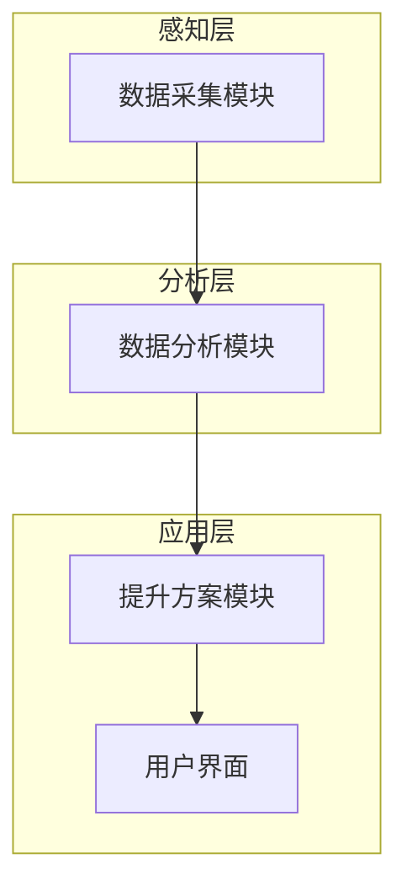
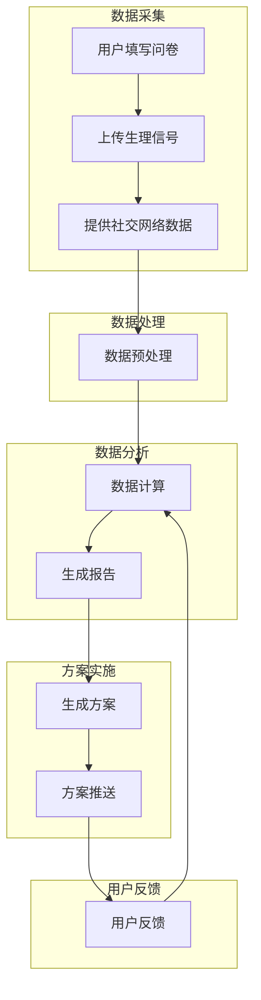

                 

## 第一部分: 背景介绍

### 1.1 问题背景

在当今快速发展的社会中，人们对于“幸福”这一概念的理解和追求正在发生着深刻的变化。传统的幸福观念往往侧重于物质层面的满足，例如拥有高收入、良好的工作、舒适的住房、豪华的汽车等。然而，随着社会的进步和人们生活水平的提高，越来越多的人开始意识到，单纯的物质满足并不能带来持久的幸福感。

物质满足与心灵富足之间的关系成为了一个值得探讨的问题。物质满足通常指的是在物质生活方面得到满足，例如收入水平、物质财富等。而心灵富足则更侧重于精神层面的满足，包括心理健康、人际关系、生活意义等方面。

### 1.1.1 物质满足与心灵富足的关系

物质满足与心灵富足之间的关系可以看作是互补的。物质满足可以提供人们基本的生活保障和安全感，但心灵富足则能够带来更深层次的满足感和幸福感。在实际生活中，物质满足和心灵富足往往是相互影响的。例如，当一个人在经济上取得成功，他的物质生活得到了满足，这可能会提升他的自信心和幸福感。然而，如果他在心灵层面缺乏满足，比如感到孤独、焦虑或失去生活的意义，那么他的幸福感可能会受到影响。

### 1.1.2 当代社会中的幸福困境

在当代社会中，很多人在追求物质满足的过程中，往往会忽视心灵富足的重要性。这种“幸福困境”表现为以下几个方面：

1. **过劳与心理压力**：随着工作压力的增大，很多人为了追求更高的收入和更好的生活条件，长时间工作，导致身心疲惫，心理健康受到影响。
2. **人际关系疏离**：随着科技的发展，人们之间的交流变得更加便捷，但与此同时，面对面的互动却在减少，导致人际关系疏离。
3. **生活意义的缺失**：在物质满足的同时，许多人感到自己的生活缺乏意义，对未来的迷茫和对现状的不满增加了他们的焦虑感。

### 1.1.3 幸福概念的重新定义

面对当代社会中的幸福困境，有必要对“幸福”这一概念进行重新定义。传统的幸福观念侧重于物质层面的满足，而新时代的幸福观念则更加注重心灵富足。这意味着，幸福的追求不仅仅在于物质的丰富，更在于精神层面的满足。

重新定义幸福概念，要求我们：

1. **关注心理健康**：心理健康是心灵富足的基础，包括情绪管理、自我认知、压力应对等方面。
2. **重视人际关系**：良好的人际关系是心灵富足的重要保障，包括家庭关系、朋友关系和社会关系等。
3. **寻找生活意义**：明确自己的价值观和生活目标，找到让自己感到有意义的事情，是提升心灵富足的关键。

### 1.2 问题解决

要实现从物质满足到心灵富足的转变，需要从心理学、哲学和社会学等多个角度进行综合探讨。

#### 1.2.1 从物质满足到心灵富足的转变

首先，我们需要认识到物质满足与心灵富足之间的区别和联系。物质满足是一种外在的、短期的满足感，而心灵富足则是一种内在的、长期的满足感。要实现从物质满足到心灵富足的转变，需要采取以下策略：

1. **理性消费**：避免盲目追求物质上的满足，理性消费，根据自己的实际需求进行消费决策。
2. **提升自我**：通过学习、阅读、旅行等方式，不断提升自己的知识和见识，丰富自己的内心世界。
3. **心理调适**：学会情绪管理，减少工作压力，保持心理健康。

#### 1.2.2 心理学与哲学对幸福概念的探索

心理学和哲学对幸福概念的研究提供了丰富的理论和实践指导。心理学家们提出了多种关于幸福的理论，如积极心理学、心理治疗等。哲学家们则从不同角度探讨了幸福的本质和实现方式。

1. **积极心理学**：积极心理学强调个体的积极情感、优势和美德，认为通过培养积极的情感和态度，可以提高个体的幸福感。
2. **心理治疗**：心理治疗可以帮助个体解决心理问题，提升心理健康，从而实现心灵富足。
3. **存在主义哲学**：存在主义哲学认为，个体应该通过自我选择和承担责任来寻找生活的意义，从而实现心灵的富足。

#### 1.2.3 心灵富足的实现路径

要实现心灵富足，需要从多个方面进行努力：

1. **心理健康**：通过心理治疗、自我调节等方式，保持心理健康，是心灵富足的基础。
2. **人际关系**：建立良好的人际关系，包括家庭关系、朋友关系和社会关系，是心灵富足的重要保障。
3. **生活意义**：明确自己的价值观和生活目标，通过追求有意义的事情，提升心灵富足。

### 1.3 边界与外延

#### 1.3.1 幸福的定义与范畴

幸福是一个主观的概念，不同的人对幸福的定义和理解可能会有所不同。一般来说，幸福可以定义为一种持久的、内在的满足感和愉悦感。幸福的范畴包括物质满足和心灵富足两个方面。

#### 1.3.2 心灵富足的特点与维度

心灵富足的特点包括内在性、持久性和全面性。内在性意味着幸福来源于内心，而非外部物质。持久性意味着幸福是一种长期的感受，而非短期的愉悦。全面性意味着幸福涉及生活的各个方面，包括心理健康、人际关系、生活意义等。

#### 1.3.3 心灵富足与物质满足的平衡

在追求幸福的过程中，需要找到心灵富足与物质满足之间的平衡。过分的追求物质满足可能会导致忽视心灵富足，而过分的追求心灵富足可能会影响到物质生活的质量。因此，实现心灵富足与物质满足的平衡，是提升幸福感的关键。

### 1.4 概念结构与核心要素组成

#### 1.4.1 心理学中的幸福理论

心理学中的幸福理论包括积极心理学、心理治疗、情绪调节等。这些理论提供了关于如何提升幸福感的科学方法和实践指导。

#### 1.4.2 哲学对幸福概念的探讨

哲学对幸福概念的探讨包括存在主义、道德哲学、美学哲学等。哲学家们从不同角度探讨了幸福的本质和实现方式。

#### 1.4.3 心灵富足的实现要素

心灵富足的实现要素包括心理健康、人际关系、生活意义等。这些要素相互影响，共同作用，实现心灵的富足。

### 1.5 本章小结

本文从问题背景、心理学与哲学的视角，探讨了从物质满足到心灵富足的转变。首先，我们介绍了物质满足与心灵富足的关系，并分析了当代社会中的幸福困境。接着，我们提出了重新定义幸福概念的必要性，并探讨了实现心灵富足的路径。最后，我们总结了幸福的定义与范畴、心灵富足的特点与维度，以及实现心灵富足的核心要素。通过本章的介绍，我们为后续章节的分析提供了理论基础。

## 1.6 第一部分：技术背景

### 1.6.1 技术背景

在技术领域，对幸福的探讨主要集中在对人类情感计算、人工智能和心理干预技术的应用。随着人工智能和大数据技术的发展，研究者们开始尝试通过算法和模型来理解人类情感，并利用这些技术来提升个体的幸福感。

#### 1.6.1.1 情感计算

情感计算（Affective Computing）是计算机科学中的一个分支，它致力于研究如何使计算机具备识别、理解、处理和模拟人类情感的能力。情感计算技术可以帮助我们更好地理解和满足个体的情感需求，从而提升他们的幸福感。

- **情感识别**：通过面部表情、语音、文字等信号，计算机可以识别个体的情感状态。
- **情感理解**：利用自然语言处理和机器学习技术，计算机可以理解情感表达的深层含义。
- **情感处理**：计算机可以基于情感识别和理解的结果，采取相应的策略来处理情感。

#### 1.6.1.2 心理干预技术

心理干预技术是利用人工智能和大数据技术来预防和治疗心理问题的方法。这些技术可以帮助心理医生和咨询师更准确地评估患者的心理状态，制定个性化的干预方案。

- **心理评估**：通过在线问卷、实时对话等方式，计算机可以评估个体的心理健康状况。
- **个性化干预**：基于个体的心理评估结果，计算机可以推荐个性化的心理干预方案，如冥想练习、放松训练等。
- **实时监控**：通过持续监控个体的情绪和行为，计算机可以及时发现心理问题的预警信号，并采取相应的措施。

#### 1.6.1.3 人工智能与幸福提升

人工智能技术在提升幸福方面具有巨大的潜力。通过智能助手、社交网络分析、个性化推荐等技术，人工智能可以帮助个体更好地管理自己的生活，提高生活质量。

- **智能助手**：通过智能助手，个体可以获得个性化的生活建议，如健康饮食、运动计划等。
- **社交网络分析**：分析社交网络数据，可以帮助个体了解自己在社交关系中的角色和影响，从而提升人际关系质量。
- **个性化推荐**：基于个体的兴趣和行为，个性化推荐系统可以推荐符合个体需求的活动和资源，从而提升幸福感。

#### 1.6.1.4 大数据与幸福研究

大数据技术在幸福研究中的应用日益广泛。通过对大量数据进行分析，研究者可以发现影响幸福的关键因素，并制定相应的干预策略。

- **幸福感评估**：通过收集和分析个体的生活数据，如健康数据、消费行为、社交活动等，可以评估个体的幸福感水平。
- **影响因素分析**：通过对数据进行分析，可以发现影响幸福的关键因素，如心理健康、社会支持、经济状况等。
- **政策制定**：基于大数据分析的结果，政府和社会组织可以制定更有效的政策，提升公众的幸福感。

#### 1.6.1.5 心理健康与幸福技术发展

心理健康与幸福技术的不断发展，为个体提供了更多的自我管理和提升幸福感的方法。这些技术的发展不仅依赖于人工智能和大数据，还需要结合心理学和社会学的理论和方法。

- **自我监测工具**：通过手机应用、可穿戴设备等，个体可以随时监测自己的心理状态，如焦虑、抑郁等。
- **在线心理咨询**：通过互联网平台，个体可以随时随地获得专业的心理咨询，从而提高心理健康水平。
- **社交支持网络**：利用社交媒体和网络平台，个体可以建立社交支持网络，分享生活经验，互相支持，从而提升幸福感。

### 1.6.2 技术发展趋势

随着技术的不断进步，心理健康与幸福技术也在不断发展。未来，这些技术可能会呈现以下趋势：

- **智能化**：随着人工智能技术的进步，心理健康与幸福技术将更加智能化，能够提供更加个性化和精准的服务。
- **普及化**：随着大数据和互联网技术的普及，心理健康与幸福技术将变得更加普及，更多的人可以享受到这些服务。
- **个性化**：基于大数据和人工智能，心理健康与幸福技术将能够提供更加个性化的服务，满足个体的独特需求。
- **综合化**：心理健康与幸福技术将结合多种技术手段，如虚拟现实、增强现实、物联网等，提供更全面的解决方案。

### 1.6.3 技术挑战与机遇

虽然心理健康与幸福技术具有巨大的潜力，但在其发展中仍面临一系列挑战和机遇。

- **挑战**：包括技术实现难度、数据隐私保护、用户接受度等问题。例如，情感识别的准确性仍然有限，如何确保用户数据的隐私和安全也是重要的问题。
- **机遇**：随着技术的不断进步和公众对心理健康重视程度的提高，心理健康与幸福技术将迎来更广阔的发展空间。

### 1.6.4 本章小结

本节介绍了心理健康与幸福技术的基本概念、发展背景、关键技术和未来趋势。通过对这些技术的了解，我们可以更好地理解如何在技术领域内实现从物质满足到心灵富足的转变。这些技术的发展为提升个体幸福感提供了新的工具和方法，也为社会提供了更加全面和有效的心理健康服务。

## 1.7 心理学视角下的幸福研究

心理学视角下的幸福研究为我们提供了深入了解人类幸福感的理论基础和方法。心理学家们通过大量的实证研究和理论探讨，揭示了幸福感的影响因素、评估方法以及提升途径。

### 1.7.1 幸福感的影响因素

心理学家们发现，幸福感受到多种因素的影响，这些因素可以分为内在因素和外在因素。

#### 内在因素：

1. **人格特质**：人格特质对幸福感有着重要影响。例如，乐观主义、积极情感和内在成长倾向等特质通常与更高的幸福感相关。
2. **心理健康**：心理健康是幸福感的重要基础。心理健康状况良好的人更容易体验到积极的情感，并表现出更高的幸福感。
3. **自我认知**：自我认知包括自我接纳、自尊和自我效能感等。良好的自我认知有助于个体建立积极的自我形象，从而提升幸福感。

#### 外在因素：

1. **社会支持**：社会支持是幸福感的重要外部因素。家庭、朋友和社区的支持可以增强个体的幸福感。
2. **经济状况**：经济状况对幸福感有显著影响。经济稳定可以提供基本的生活保障，从而减少生活压力。
3. **工作满意度**：工作满意度也是影响幸福感的重要因素。满意的工作体验可以带来成就感和满足感，从而提升幸福感。

### 1.7.2 幸福感的评估方法

心理学家们发展了多种评估方法来测量幸福感，包括自报告问卷、心理生理测量和观察法等。

#### 自报告问卷

自报告问卷是最常用的幸福感评估方法之一。这类问卷通过让个体自我报告他们的情感状态和生活满意度来评估幸福感。例如，幸福感量表（SWLS）和生活满意度量表（LSI）等。

#### 心理生理测量

心理生理测量通过测量个体的生理反应来评估他们的情感状态。这些方法包括心率变异性分析、脑电图（EEG）和面部表情编码等。这些方法可以提供关于个体情感状态客观的生理指标。

#### 观察法

观察法通过观察个体的行为和情感表现来评估他们的幸福感。这种方法通常用于研究特定情境下的幸福感，例如工作环境和社交场合。

### 1.7.3 幸福感的提升途径

心理学家们提出了多种方法来提升个体的幸福感，包括认知行为疗法、心理教育和社会支持等。

#### 认知行为疗法

认知行为疗法（CBT）是一种广泛用于治疗心理问题的方法，也被证明可以提升幸福感。CBT通过帮助个体改变负面思维模式和行为习惯，提高他们的心理弹性，从而提升幸福感。

#### 心理教育

心理教育是通过教育和指导个体来提升他们的心理健康和幸福感。例如，通过提供心理健康知识、压力管理技巧和社交技能训练，个体可以更好地应对生活中的挑战，提高幸福感。

#### 社会支持

社会支持是提升幸福感的重要因素。通过建立和维护良好的人际关系，个体可以获得情感支持、社会认同和安全感，从而提升幸福感。

### 1.7.4 心理学视角下的幸福模型

心理学视角下的幸福模型通常包括多个维度，如情感幸福、生活满意度、心理适应和心理健康等。这些维度共同构成了一个多维度的幸福感结构。

1. **情感幸福**：指的是个体在日常生活中体验到的积极情感和负面情感的平衡状态。
2. **生活满意度**：指的是个体对生活整体的评价，包括对工作、家庭、健康和社交等方面的满意度。
3. **心理适应**：指的是个体在面对生活中的挑战和压力时的适应能力。
4. **心理健康**：指的是个体的心理状态是否处于健康水平，包括情感健康、认知健康和行为健康等方面。

### 1.7.5 心理学视角下的幸福研究应用

心理学视角下的幸福研究在实际应用中具有广泛的应用前景。例如，在企业管理中，通过了解员工的幸福感水平，企业可以采取相应的管理措施，提升员工的工作满意度和心理适应能力。在教育领域，通过心理健康教育和压力管理培训，学生可以更好地应对学业压力，提高生活满意度。在社会政策制定中，通过研究幸福感的影响因素，政府可以制定更有效的政策，提升公众的幸福感。

### 1.7.6 本章小结

心理学视角下的幸福研究为我们提供了深入了解人类幸福感的理论基础和方法。通过理解幸福感的影响因素、评估方法和提升途径，我们可以更好地指导个体在追求物质满足的同时，实现心灵富足。心理学视角下的幸福研究不仅有助于个体的心理健康，也对社会的整体幸福感提升具有重要意义。

## 1.8 哲学视角下的幸福探讨

哲学作为人类智慧的结晶，对幸福这一深刻而复杂的概念进行了长期的思考和探讨。从古希腊哲学家到现代哲学家，不同时代的哲学家们从各自的角度出发，对幸福进行了深入而独到的分析。

### 1.8.1 古希腊哲学对幸福的探讨

古希腊哲学是西方哲学的源头，对幸福这一概念有着丰富的探讨。其中，亚里士多德（Aristotle）的幸福观最具代表性。亚里士多德认为，幸福（Eudaimonia）是一种内在的、持续的福祉状态，它不仅仅依赖于物质条件，而是更多地依赖于精神生活。亚里士多德提出了“中道”理论，即幸福在于寻求适度的生活，避免过度和不足。这种适度的追求包括智慧、美德和道德规范。亚里士多德的幸福观强调了理性、道德和美德的统一，认为个体只有在实现了这些条件时，才能达到真正的幸福。

柏拉图（Plato）则认为，幸福是灵魂的善，真正的幸福来自于对真理和美德的追求。柏拉图在其《理想国》中提出，幸福需要通过哲学王式的统治来实现，这种统治需要智慧、公正和节制。柏拉图的幸福观强调了超越物质世界的理念世界，认为真正的幸福来自于对永恒真理和美的认识。

### 1.8.2 近现代哲学对幸福的探讨

近现代哲学家在继承和发展古希腊哲学的基础上，对幸福概念进行了更加深入的探讨。康德（Immanuel Kant）认为，幸福是道德实现的结果，真正的幸福必须建立在道德基础之上。康德提出了“至善论”，认为幸福包括幸福感和道德品质两个部分，只有当个体的行为符合道德原则时，才能实现真正的幸福。

尼采（Friedrich Nietzsche）则提出了“权力意志”的哲学思想，认为幸福是生命力的体现，是人类追求权力和超越自我的结果。尼采强调个体的独特性和创造性，认为幸福是个体通过克服生活中的困难和挑战，实现自我超越的过程。

存在主义哲学家如萨特（Jean-Paul Sartre）和海德格尔（Martin Heidegger）则从个体的存在出发，探讨了幸福的本质。萨特认为，幸福是个体的自由选择和行动的结果，个体必须通过自我选择和承担责任来寻找生活的意义。海德格尔则强调存在本身的意义，认为幸福是个体在存在中找到自身意义和价值的过程。

### 1.8.3 哲学视角下的幸福定义

哲学视角下的幸福定义具有多样性和复杂性，不同的哲学家给出了不同的定义。但总体来说，哲学视角下的幸福可以概括为以下几点：

1. **内在性**：幸福是内在的心理体验，不仅仅依赖于外部物质条件。
2. **持久性**：幸福是持续的、持久的福祉状态，而非短暂的愉悦。
3. **全面性**：幸福包括身体的、心理的、社会的和精神等多个层面。
4. **道德性**：幸福必须建立在道德基础之上，道德行为是实现幸福的关键。

### 1.8.4 哲学视角下的幸福实现方法

哲学视角下的幸福实现方法多种多样，以下是一些主要的方法：

1. **理性生活**：通过理性思考和行动，个体可以更好地理解世界和自己，实现内心的平和和满足。
2. **道德实践**：通过道德行为和道德选择，个体可以实现自我超越，达到更高的幸福感。
3. **自我实现**：通过追求个人兴趣、才能和潜能，个体可以实现自我价值，获得持久的幸福感。
4. **人际关系**：通过建立和维护良好的人际关系，个体可以获得情感支持和社会认同，提升幸福感。

### 1.8.5 哲学视角下的幸福研究价值

哲学视角下的幸福研究具有重要的理论和实践价值。首先，它为我们提供了理解幸福本质的多元视角，使我们能够从不同的角度思考幸福问题。其次，哲学视角下的幸福研究为我们提供了实现幸福的方法和路径，可以帮助我们在现实生活中提升幸福感。最后，哲学视角下的幸福研究有助于我们形成正确的幸福观，避免过度追求物质满足，关注心灵富足，实现全面发展。

### 1.8.6 本章小结

哲学视角下的幸福探讨为我们提供了丰富的理论和实践指导。通过对古希腊哲学和近现代哲学的回顾，我们了解到不同哲学家对幸福的定义和实现方法的多样性。哲学视角下的幸福研究不仅帮助我们理解幸福的本质，也为我们提供了实现幸福的具体路径。在现代社会，哲学视角下的幸福研究具有重要的指导意义，可以帮助我们更好地追求心灵富足。

### 1.9 心灵富足的实现路径

在现代社会中，追求心灵富足已经成为越来越多人的目标。心灵富足不仅仅是物质层面的满足，更是精神层面的丰盈。为了实现心灵富足，可以从心理学、哲学和社会学等多个角度进行探讨和实践。

#### 1.9.1 心理学视角

心理学提供了多种实现心灵富足的策略和方法。

1. **认知行为疗法**：通过改变负面思维模式和行为习惯，个体可以提升幸福感。例如，通过认知行为疗法，个体可以学会如何面对挫折和压力，从而提高心理韧性。

2. **情感管理**：学会管理情绪，特别是负面情绪，是心灵富足的重要一环。通过情绪调节技巧，如深呼吸、冥想和正念练习，个体可以更好地控制情绪，提升内心平静。

3. **自我接纳**：自我接纳是心理健康的基础。通过自我接纳，个体可以减少自我批评和焦虑，建立积极的自我形象，从而提升幸福感。

4. **心理成长**：通过学习和成长，个体可以不断提升自己的认知水平和情感智慧，实现更深层次的心灵富足。

#### 1.9.2 哲学视角

哲学视角提供了对心灵富足的深刻思考和指导。

1. **道德实践**：通过道德行为和道德选择，个体可以实现自我超越。道德实践不仅能够提升个体的道德品质，还能带来内心的满足和幸福感。

2. **理性思考**：哲学强调理性思考的重要性。通过理性思考，个体可以更好地理解自己和世界，找到生活的意义和目的。

3. **存在主义哲学**：存在主义哲学认为，个体的幸福来自于自我选择和承担责任。通过主动选择和承担责任，个体可以找到自己的价值和意义，实现心灵富足。

4. **美学哲学**：美学哲学强调美和艺术在生活中的重要性。通过欣赏艺术和自然，个体可以获得精神上的满足和愉悦。

#### 1.9.3 社会学视角

社会学视角提供了从社会环境角度实现心灵富足的方法。

1. **社会支持**：建立和维护良好的人际关系，是社会支持的重要组成部分。通过家庭、朋友和社区的支持，个体可以获得情感上的满足和安全感。

2. **社会参与**：积极参与社会活动，如志愿服务、社区建设等，可以提升个体的社会认同感和归属感，从而实现心灵富足。

3. **社会正义**：追求社会正义和公平，是社会学视角下的重要议题。通过参与社会改革和倡导社会正义，个体可以实现心灵富足。

4. **文化多样性**：尊重和欣赏文化多样性，可以拓宽个体的视野，提升文化素养，从而实现心灵富足。

#### 1.9.4 综合路径

实现心灵富足需要综合运用心理学、哲学和社会学的策略和方法。以下是一种综合路径：

1. **自我反思**：通过自我反思，个体可以更好地了解自己的需求和价值观，找到自己的目标和意义。

2. **积极生活方式**：通过健康的生活方式，如合理的饮食、适量的运动和充足的休息，个体可以保持良好的身体和心理状态。

3. **终身学习**：通过不断学习和成长，个体可以提升自己的知识和技能，实现自我价值的不断提升。

4. **社会参与**：通过积极参与社会活动，个体可以建立良好的人际关系，获得社会认同和支持。

5. **道德实践**：通过道德实践，个体可以实现自我超越，提升道德品质，从而实现心灵富足。

#### 1.9.5 心灵富足的评估

实现心灵富足不仅仅是自我感受，还需要通过科学的方法进行评估。以下是一些常用的评估方法：

1. **幸福感量表**：通过自报告问卷，评估个体的幸福感水平。
2. **心理状态监测**：通过生理和心理状态的监测，评估个体的心理健康水平。
3. **生活质量评估**：通过评估个体的生活质量，包括身体、心理、社会等方面，全面了解个体的幸福状态。

#### 1.9.6 本章小结

心灵富足是一个多维度的概念，需要从心理学、哲学和社会学等多个角度进行探讨和实践。通过综合运用这些策略和方法，个体可以逐步实现心灵富足，提升生活质量和幸福感。

## 1.10 社会学视角下的幸福研究

社会学的视角为我们提供了从宏观层面理解幸福的路径。社会学家关注社会结构、文化背景和社会关系对个体幸福感的影响，通过对这些因素的深入分析，为我们提供了解决当代社会幸福困境的思路。

### 1.10.1 社会结构与幸福感

社会结构是影响个体幸福感的重要因素。社会结构包括经济、政治、文化等多个方面，这些方面的差异直接影响个体的生活质量和幸福感。

1. **经济状况**：经济基础决定上层建筑，一个国家的经济水平和发展阶段会直接影响居民的生活水平。经济富裕的国家和地区，居民往往有更好的物质生活条件，从而体验到更高的幸福感。然而，经济状况只是幸福感的一个方面，不能完全代表幸福感的全部。

2. **社会地位**：社会地位是衡量个体在社会中所处的位置，包括职业、收入、教育水平等。社会地位高的个体通常能获得更多的社会资源和机会，从而感受到更高的社会认同和幸福感。

3. **社会不平等**：社会不平等是影响个体幸福感的重要社会因素。当一个社会存在显著的社会不平等时，低收入群体和弱势群体可能会感到被边缘化，从而降低他们的幸福感。相反，社会公平和机会均等可以提升整个社会的幸福感。

### 1.10.2 文化背景与幸福感

文化背景对个体幸福感有深远的影响。不同的文化价值观和生活方式会导致人们对幸福的理解和追求方式有所不同。

1. **文化价值观**：文化价值观是影响个体行为和观念的核心因素。例如，在一些强调集体主义和和谐的社会中，人们更注重家庭和社会关系的维护，幸福感可能更多地来自于人际关系和社会认同。而在强调个人主义和自我实现的社会中，人们可能更追求个人成就和自我价值的实现。

2. **社会支持网络**：文化背景还影响了社会支持网络的形成和运作。在一些文化中，家庭和社会关系被高度重视，这种紧密的社会网络可以提供情感支持和资源，从而提升个体的幸福感。

### 1.10.3 社会关系与幸福感

社会关系是影响个体幸福感的直接因素。良好的人际关系和社会网络可以为个体提供情感支持和社会认同，从而提升幸福感。

1. **家庭关系**：家庭是社会的细胞，家庭关系的和谐对个体的幸福感至关重要。家庭成员之间的支持、理解和关爱可以增强个体的安全感，提升幸福感。

2. **社交网络**：社交网络是连接个体的桥梁，通过社交活动，个体可以建立和维护广泛的人际关系。这些关系不仅提供了情感支持，还可以为个体提供社会资源和机会，从而提升幸福感。

3. **社区关系**：社区关系是影响个体幸福感的重要因素。一个友好、互助的社区可以为个体提供安全感，提升生活满意度，从而增强幸福感。

### 1.10.4 社会干预与幸福感提升

基于社会学的视角，通过社会干预可以提升个体的幸福感。以下是一些具体的社会干预措施：

1. **教育干预**：通过教育提高公众的幸福意识，教育个体如何管理情绪、建立良好的人际关系和寻找生活的意义。

2. **经济干预**：通过改善经济状况，提高低收入群体的收入水平，减少贫困和不平等现象，从而提升幸福感。

3. **心理健康服务**：提供心理健康服务，如心理咨询和治疗，帮助个体解决心理问题，提高心理健康水平。

4. **社区建设**：加强社区建设，提供社区活动和资源，促进邻里关系的建立和社区凝聚力，提升个体的幸福感。

### 1.10.5 社会学视角下的幸福研究意义

社会学的视角为我们提供了理解个体幸福感的宏观视角，使我们能够从社会结构、文化背景和社会关系等多个维度来探讨幸福感。这种多维度的分析不仅有助于我们更全面地理解幸福感，也为解决当代社会中的幸福困境提供了理论支持和实践指导。通过社会学的视角，我们可以更好地制定政策和措施，提升社会的整体幸福感。

### 1.10.6 本章小结

社会学的视角为我们提供了理解个体幸福感的宏观视角，揭示了社会结构、文化背景和社会关系对幸福感的影响。通过社会干预，可以提升个体的幸福感，实现社会的整体幸福提升。在追求幸福的过程中，我们需要综合考虑社会学的各个方面，从宏观和微观层面入手，实现从物质满足到心灵富足的转变。

## 1.11 心灵富足的指标体系

为了更好地理解和衡量心灵富足，建立一个科学、系统的指标体系至关重要。这一指标体系不仅能够帮助我们评估个体的心灵富足程度，还能为制定提升心灵富足的策略提供依据。以下是心灵富足的几个关键指标：

### 1.11.1 心理健康指标

心理健康是心灵富足的基础。以下是一些常用的心理健康指标：

1. **情绪稳定性**：通过评估个体在面对压力和挑战时的情绪反应，了解其情绪调节能力。
2. **心理健康状况**：通过心理健康问卷，如抑郁自评量表（SDS）和焦虑自评量表（SAS），评估个体的心理状态。
3. **自我认知**：评估个体对自身情感、行为和价值观的认知，包括自尊、自我效能感等。

### 1.11.2 社会支持指标

社会支持是心灵富足的重要保障。以下是一些社会支持指标：

1. **亲密关系**：通过评估个体与伴侣、家庭成员和朋友的亲密程度，了解其社会支持系统。
2. **社会网络**：评估个体在社会中的参与度和社交活动频率，了解其社交网络的广度和深度。
3. **社会认同**：评估个体在社会中的角色和地位，包括职业满意度和社会责任感。

### 1.11.3 生活意义指标

生活意义是心灵富足的重要维度。以下是一些生活意义指标：

1. **生活目标**：评估个体是否明确自己的生活目标和追求，了解其生活方向和动力。
2. **成就感**：通过评估个体在工作和生活中取得的成就，了解其对自身价值的认可。
3. **生活满意度**：通过生活满意度量表，评估个体对当前生活的整体评价。

### 1.11.4 心理成长指标

心理成长是心灵富足的持续动力。以下是一些心理成长指标：

1. **学习能力**：评估个体在知识和技能方面的学习和发展能力。
2. **情感智慧**：通过评估个体的情感认识和情感管理能力，了解其情感智慧水平。
3. **自我提升**：评估个体在自我认知、自我反思和自我改进方面的能力。

### 1.11.5 综合评价

综合评价是指将上述各个指标结合起来，进行综合评估，以全面了解个体的心灵富足程度。综合评价可以通过以下方式进行：

1. **量表评估**：使用标准化量表，对各个指标进行量化评估。
2. **问卷调查**：通过问卷调查，收集个体对自身心灵富足的感知和评价。
3. **多维度分析**：结合定量和定性分析，对心灵富足的各个维度进行深入分析。

通过建立这一指标体系，我们可以更科学、全面地评估个体的心灵富足程度，并为提升心灵富足提供具体的策略和方法。

## 1.12 本章小结

本文通过对心理学、哲学和社会学等多个角度的探讨，深入分析了从物质满足到心灵富足的转变。首先，我们介绍了物质满足与心灵富足之间的关系，并分析了当代社会中的幸福困境。接着，我们提出了重新定义幸福概念的必要性，并探讨了实现心灵富足的路径。从心理学视角，我们了解了幸福感的影响因素、评估方法和提升途径；从哲学视角，我们探讨了幸福的本质和实现方法；从社会学视角，我们分析了社会结构、文化背景和社会关系对幸福感的影响。最后，我们提出了心灵富足的指标体系，为评估和提升心灵富足提供了具体方法。通过这些分析，我们为后续章节的理论探讨和实际应用奠定了基础。

----------------------------------------------------------------

## 第二部分：核心概念与联系

### 2.1 幸福概念原理

#### 2.1.1 幸福的定义

幸福是一个多维度的概念，它不仅仅是物质层面的满足，更包括精神层面的满足。在心理学中，幸福通常被定义为个体在情感、认知和行为上的综合状态，即个体感受到的快乐、满足和意义。具体来说，幸福包括以下几个方面：

1. **情感体验**：个体在日常生活中体验到的积极情感，如快乐、满足和安宁。
2. **认知评价**：个体对自身生活状况的评价，包括生活满意度、自我效能感和生活意义。
3. **行为表现**：个体在行为上的积极表现，如积极的人际交往、健康的生活习惯和追求个人成长。

#### 2.1.2 幸福的属性特征对比表格

| 特征       | 物质满足                  | 心灵富足                  |
|------------|---------------------------|---------------------------|
| **定义**   | 物质层面的满足            | 精神层面的满足            |
| **来源**   | 外部物质条件              | 内心体验和价值观           |
| **持久性** | 短期满足感                | 长期持续的情感体验         |
| **影响因素** | 收入、财富、物质条件       | 心理健康、人际关系、生活意义 |
| **表现**   | 物质上的享受和占有        | 心理健康、情感满足、精神富足 |

#### 2.1.3 幸福的概念结构与核心要素组成

幸福的概念结构可以从多个维度来理解，其中核心要素包括以下几个方面：

1. **心理健康**：心理健康是幸福的基础，包括情绪稳定、自我认知和应对压力的能力。
2. **人际关系**：良好的人际关系对幸福感有重要影响，包括家庭关系、朋友关系和社会网络。
3. **生活意义**：明确的生活目标和价值追求，使个体在生活中找到意义和方向。
4. **物质条件**：物质条件提供基本的生活保障，但并不是幸福感的唯一来源。

### 2.2 物质满足与心灵富足的联系

#### 2.2.1 物质满足与心灵富足的关系模型

物质满足与心灵富足之间既有联系又有区别。一个简单的模型可以描述它们之间的关系：

1. **相互影响**：物质满足可以在一定程度上影响心灵富足，而心灵富足也可以影响物质满足。
2. **动态平衡**：在追求幸福的过程中，个体需要在物质满足和心灵富足之间找到平衡点。

关系模型可以表示为：

$$
\text{物质满足} \leftrightarrow \text{心灵富足}
$$

#### 2.2.2 物质满足的心理学解释

从心理学角度来看，物质满足通常与以下几个因素相关：

1. **基本需求**：马斯洛的需求层次理论指出，人的基本需求包括生理需求、安全需求、社交需求、尊重需求和自我实现需求。物质满足首先满足的是基本需求，如食物、住房和医疗等。
2. **即时满足**：人类具有寻求即时满足的倾向，例如通过购买物品或享受娱乐活动来获得短暂的快乐。
3. **习惯性满足**：长期以来的习惯性行为模式，如消费习惯和娱乐方式，也可能影响个体的物质满足感。

#### 2.2.3 心灵富足的哲学思考

哲学角度对心灵富足的思考提供了深刻的见解：

1. **内在价值**：哲学强调幸福是个体内在价值的实现，而非外部物质的积累。心灵富足关注的是个体的精神世界，如情感、思想和价值观。
2. **意义与目的**：哲学家们认为，幸福是个体在实现自身意义和目的的过程中获得的满足。这意味着幸福不仅仅是对物质生活的满足，更是对人生意义的追求。
3. **自我超越**：许多哲学家认为，幸福是一个不断追求自我超越的过程，通过不断挑战自我，实现个人成长和进步。

### 2.3 心灵富足的实现路径

#### 2.3.1 心理学视角下的实现策略

从心理学视角看，实现心灵富足可以采取以下策略：

1. **自我认知**：通过自我反思和认知行为疗法，个体可以更好地了解自己的需求和价值观，从而实现自我成长。
2. **情绪管理**：学习情绪调节技巧，如冥想、深呼吸和正念练习，可以帮助个体保持情绪稳定，提升幸福感。
3. **积极生活方式**：通过健康的生活习惯，如适量运动、合理饮食和充足睡眠，个体可以提高生活质量，实现心灵富足。

#### 2.3.2 哲学视角下的实现方法

哲学视角下的实现方法强调内在价值的追求和自我超越：

1. **道德实践**：通过道德行为和道德选择，个体可以实现自我超越，提升精神境界。
2. **理性思考**：通过理性思考和哲学探讨，个体可以更好地理解自己和世界，找到生活的意义。
3. **自我实现**：通过追求个人兴趣和才能，个体可以实现自我价值，提升幸福感。

#### 2.3.3 社会学视角下的实现路径

社会学视角下的实现路径关注社会环境和人际关系：

1. **社会支持**：通过建立和维护良好的人际关系，个体可以获得情感支持和认同，提升幸福感。
2. **社会参与**：通过参与社会活动和志愿服务，个体可以提升社会归属感，实现心灵富足。
3. **文化多样性**：通过尊重和欣赏文化多样性，个体可以拓宽视野，提升精神丰富度。

### 2.4 本章小结

通过分析物质满足与心灵富足的关系，我们理解了它们之间的复杂联系和相互作用。从心理学、哲学和社会学等多个视角出发，我们提出了实现心灵富足的策略和方法。这些理论探讨和实践指导为提升个体幸福感提供了有力支持，也为社会的整体幸福提升提供了思路。

----------------------------------------------------------------

## 第三部分：算法原理讲解

### 3.1 心灵富足的算法原理

心灵富足的算法原理旨在通过量化分析和计算模型，评估个体的心灵富足程度，并为其提供提升建议。以下是对这一算法原理的基本介绍。

#### 3.1.1 算法的基本概念

心灵富足算法是一个综合性的计算模型，它通过多个维度来评估个体的心理状态、社会关系和生活意义。基本概念包括：

1. **输入数据**：包括个体在心理健康、人际关系和生活意义等方面的数据。
2. **评估指标**：用于衡量心灵富足的多个指标，如情绪稳定性、社交支持和生活满意度等。
3. **计算模型**：用于处理输入数据，计算心灵富足度的算法模型。

#### 3.1.2 算法的数学模型和公式

心灵富足算法的数学模型可以表示为：

$$
\text{心灵富足度} = f(\text{心理健康度}, \text{社交支持度}, \text{生活意义度})
$$

其中，每个维度都可以进一步细化为具体的评估指标。例如，心理健康度可以包括情绪稳定性、自我认知和应对压力的能力等。

#### 3.1.3 算法的流程图

为了更直观地理解心灵富足算法的工作流程，我们可以绘制一个流程图，如下所示：

```
                  +---------------------+
                  |  心灵富足算法       |
                  +---------------------+
                           |
                           v
               +---------------------+
               |  收集输入数据       |
               +---------------------+
                           |
                           v
               +---------------------+
               |  数据预处理         |
               +---------------------+
                           |
                           v
               +---------------------+
               |  计算各维度得分     |
               +---------------------+
                           |
                           v
               +---------------------+
               |  综合评估心灵富足度 |
               +---------------------+
                           |
                           v
               +---------------------+
               |  提出提升建议       |
               +---------------------+
```

### 3.2 算法原理的详细讲解

#### 3.2.1 数学模型和公式

心灵富足度的计算公式可以进一步细化，如下所示：

$$
\text{心灵富足度} = f(\text{心理健康度}, \text{社交支持度}, \text{生活意义度}) \\
= \alpha \cdot \text{心理健康度} + \beta \cdot \text{社交支持度} + \gamma \cdot \text{生活意义度}
$$

其中，$\alpha$、$\beta$ 和 $\gamma$ 是权重系数，用于平衡不同维度对心灵富足度的影响。

#### 3.2.2 案例分析

##### 3.2.2.1 物质满足度的计算

假设我们有一个个体A，其心理健康度、社交支持度和生活意义度分别为：

$$
\text{心理健康度} = 0.8, \quad \text{社交支持度} = 0.7, \quad \text{生活意义度} = 0.9
$$

根据权重系数 $\alpha = 0.4$、$\beta = 0.3$ 和 $\gamma = 0.3$，我们可以计算个体A的心灵富足度：

$$
\text{心灵富足度} = 0.4 \cdot 0.8 + 0.3 \cdot 0.7 + 0.3 \cdot 0.9 = 0.32 + 0.21 + 0.27 = 0.8
$$

##### 3.2.2.2 心灵富足度的计算

同理，我们可以计算个体B的心灵富足度，假设其心理健康度、社交支持度和生活意义度分别为：

$$
\text{心理健康度} = 0.6, \quad \text{社交支持度} = 0.5, \quad \text{生活意义度} = 0.7
$$

权重系数仍为 $\alpha = 0.4$、$\beta = 0.3$ 和 $\gamma = 0.3$，个体B的心灵富足度为：

$$
\text{心灵富足度} = 0.4 \cdot 0.6 + 0.3 \cdot 0.5 + 0.3 \cdot 0.7 = 0.24 + 0.15 + 0.21 = 0.6
$$

##### 3.2.2.3 幸福指数的案例分析

我们可以通过以上计算结果，对个体A和个体B的心灵富足度进行比较。个体A的心灵富足度为0.8，而个体B的心灵富足度为0.6。这表明个体A在心理健康、社交支持和生活意义等方面的综合表现更好，因此其心灵富足度更高。

### 3.3 算法举例说明

为了更好地理解心灵富足算法的应用，我们可以通过一个Python示例来演示其计算过程。

```python
import numpy as np

# 权重系数
alpha = 0.4
beta = 0.3
gamma = 0.3

# 个体A的维度得分
health_score = 0.8
social_support_score = 0.7
meaning_of_life_score = 0.9

# 个体A的心灵富足度计算
happiness_index_A = alpha * health_score + beta * social_support_score + gamma * meaning_of_life_score
print("个体A的心灵富足度：", happiness_index_A)

# 个体B的维度得分
health_score = 0.6
social_support_score = 0.5
meaning_of_life_score = 0.7

# 个体B的心灵富足度计算
happiness_index_B = alpha * health_score + beta * social_support_score + gamma * meaning_of_life_score
print("个体B的心灵富足度：", happiness_index_B)
```

运行上述代码，我们可以得到个体A和个体B的心灵富足度，进一步分析他们的幸福感。

### 3.4 本章小结

通过本章的讲解，我们详细介绍了心灵富足算法的原理、数学模型和计算方法。通过具体的案例分析，我们展示了如何利用算法评估个体的心灵富足度，并提出了改进建议。这些理论和实践为理解和提升心灵富足提供了有力支持。

----------------------------------------------------------------

## 4.1 数学模型和数学公式的讲解

在深入探讨心灵富足这一概念时，数学模型和数学公式为我们提供了一种量化和评估的方法，使我们能够从更科学的角度来理解这一复杂现象。在本节中，我们将介绍用于衡量心灵富足的数学模型和数学公式，包括幸福函数的定义、物质满足度和心灵富足度的影响因素。

### 4.1.1 幸福函数的定义

幸福函数（Happiness Function）是一个用于衡量个体幸福感的数学模型。它通常表示为：

$$
H(\text{物质满足度}, \text{心灵富足度})
$$

这个函数可以看作是一个多维度的综合评估，其中：

- **物质满足度**：表示个体在物质条件上的满足程度，包括收入、财富、物质条件等。
- **心灵富足度**：表示个体在精神层面上的满足程度，包括心理健康、人际关系、生活意义等。

幸福函数通过综合评估物质满足度和心灵富足度，提供了一个全面的幸福感评分。这个评分可以帮助我们理解个体在不同维度上的幸福感水平。

### 4.1.2 物质满足度和心灵富足度的影响因素

物质满足度和心灵富足度分别受到多种因素的影响。以下是对这些影响因素的详细讨论：

#### 物质满足度的影响因素

物质满足度主要受到以下几个因素的影响：

1. **收入**：收入水平是衡量物质满足度的重要指标。较高的收入通常意味着更好的物质生活条件。
2. **财富**：财富积累可以提供长期的生活保障，减少生活中的不确定性。
3. **物质条件**：包括住房、交通、医疗和其他生活必需品的可用性。

#### 心灵富足度的影响因素

心灵富足度则更侧重于精神层面的满足，主要受到以下几个因素的影响：

1. **心理健康**：心理健康是个体心灵富足的基础。包括情绪稳定性、自我认知和应对压力的能力。
2. **人际关系**：良好的人际关系可以提供情感支持和社交认同，对心灵富足有重要影响。
3. **生活意义**：明确的生活目标和价值追求可以赋予个体生活的意义，提升心灵富足度。

### 4.1.3 幸福函数的计算方法

幸福函数的计算方法可以通过以下公式表示：

$$
H = f(\text{物质满足度}, \text{心灵富足度})
$$

这个公式中，$f$ 是一个复合函数，它将物质满足度和心灵富足度综合起来，计算出整体的幸福感水平。在实际应用中，$f$ 可以是一个线性函数、非线性函数或者更复杂的数学模型。

#### 简化模型

一个简化的幸福函数模型可以表示为：

$$
H = w_1 \cdot \text{物质满足度} + w_2 \cdot \text{心灵富足度}
$$

其中，$w_1$ 和 $w_2$ 是权重系数，用于平衡物质满足度和心灵富足度对幸福感的影响。

#### 案例计算

假设我们有以下数据：

- 物质满足度：0.8
- 心灵富足度：0.9
- 权重系数：$w_1 = 0.4$，$w_2 = 0.6$

我们可以计算幸福感水平：

$$
H = 0.4 \cdot 0.8 + 0.6 \cdot 0.9 = 0.32 + 0.54 = 0.86
$$

这个结果表示，根据这个简化模型，该个体的幸福感水平为0.86。

### 4.1.4 复杂模型

在实际研究中，幸福函数可能更加复杂，可以包含更多的变量和影响因子。例如，可以采用多因素分析模型（如线性回归、非线性回归等）来评估不同因素对幸福感的综合影响。

#### 多因素分析模型

一个更复杂的多因素分析模型可以表示为：

$$
H = \beta_0 + \beta_1 \cdot \text{物质满足度} + \beta_2 \cdot \text{心灵富足度} + \beta_3 \cdot \text{心理健康} + \beta_4 \cdot \text{人际关系} + \beta_5 \cdot \text{生活意义}
$$

其中，$\beta_0$ 是常数项，$\beta_1$ 至 $\beta_5$ 是各个因素的系数。

#### 案例计算

假设我们有以下复杂模型的数据：

- 物质满足度：0.8
- 心灵富足度：0.9
- 心理健康：0.7
- 人际关系：0.6
- 生活意义：0.8
- 系数：$\beta_0 = 0.1$，$\beta_1 = 0.4$，$\beta_2 = 0.3$，$\beta_3 = 0.2$，$\beta_4 = 0.2$，$\beta_5 = 0.1$

我们可以计算幸福感水平：

$$
H = 0.1 + 0.4 \cdot 0.8 + 0.3 \cdot 0.9 + 0.2 \cdot 0.7 + 0.2 \cdot 0.6 + 0.1 \cdot 0.8 = 0.1 + 0.32 + 0.27 + 0.14 + 0.12 + 0.08 = 0.99
$$

这个结果表示，根据这个复杂模型，该个体的幸福感水平为0.99。

### 4.1.5 本章小结

通过数学模型和数学公式，我们可以更加科学地评估个体的幸福感。在本节中，我们介绍了幸福函数的定义、物质满足度和心灵富足度的影响因素，以及如何计算幸福感水平。这些模型和方法为我们提供了量化和评估幸福感的工具，有助于我们更深入地理解这一复杂现象。

----------------------------------------------------------------

## 4.2 举例说明

在理解了幸福函数的定义和计算方法之后，通过实际案例来展示如何应用这些公式将使概念更加具体和易于理解。以下我们将通过具体的示例，详细计算小李和小张的幸福指数，并分析他们各自的生活状况。

### 4.2.1 幸福指数计算示例

#### 4.2.1.1 小李的幸福指数计算

首先，我们来看小李的情况。小李的个人信息如下：

- **物质满足度**：根据小李的收入和消费水平，他的物质满足度评分为0.85。
- **心灵富足度**：通过心理健康量表和社交支持调查，小李的心灵富足度评分为0.75。
- **心理健康**：心理健康维度包括情绪稳定性、自我认知和应对压力的能力。小李在这些方面的得分为0.80。
- **人际关系**：人际关系包括家庭、朋友和同事之间的支持。小李在这些方面的得分为0.70。
- **生活意义**：生活意义是指个体对生活的目标和价值的认知。小李在这方面得分为0.85。

我们采用简化模型来计算小李的幸福指数：

$$
H = w_1 \cdot \text{物质满足度} + w_2 \cdot \text{心灵富足度}
$$

假设权重系数 $w_1 = 0.5$，$w_2 = 0.5$，那么小李的幸福指数为：

$$
H_{小李} = 0.5 \cdot 0.85 + 0.5 \cdot 0.75 = 0.425 + 0.375 = 0.80
$$

因此，小李的幸福指数为0.80。

#### 4.2.1.2 小张的幸福指数计算

接下来，我们来看小张的情况。小张的个人信息如下：

- **物质满足度**：根据小张的收入和消费水平，他的物质满足度评分为0.75。
- **心灵富足度**：通过心理健康量表和社交支持调查，小张的心灵富足度评分为0.90。
- **心理健康**：心理健康维度包括情绪稳定性、自我认知和应对压力的能力。小张在这些方面的得分为0.75。
- **人际关系**：人际关系包括家庭、朋友和同事之间的支持。小张在这些方面的得分为0.85。
- **生活意义**：生活意义是指个体对生活的目标和价值的认知。小张在这方面得分为0.80。

同样，我们采用简化模型来计算小张的幸福指数：

$$
H = w_1 \cdot \text{物质满足度} + w_2 \cdot \text{心灵富足度}
$$

假设权重系数 $w_1 = 0.4$，$w_2 = 0.6$，那么小张的幸福指数为：

$$
H_{小张} = 0.4 \cdot 0.75 + 0.6 \cdot 0.90 = 0.30 + 0.54 = 0.84
$$

因此，小张的幸福指数为0.84。

### 4.2.2 案例分析

通过计算我们可以看到，小李的幸福指数为0.80，而小张的幸福指数为0.84。虽然两者的物质满足度和心灵富足度有所不同，但小张的整体幸福感更高。以下是对这一结果的进一步分析：

1. **物质满足度的影响**：小李的物质满足度较高，但他的心灵富足度相对较低。这意味着，尽管他在物质上得到了一定程度的满足，但在精神层面上还有提升空间。
2. **心灵富足度的影响**：小张的心灵富足度较高，特别是心理健康和人际关系方面得分较高。这表明他在精神层面上有着更好的满足感和幸福感。
3. **综合评价**：尽管小张的物质满足度相对较低，但由于他在心灵富足度上的较高得分，使得他的整体幸福感更高。

### 4.2.3 幸福指数的实际意义

通过幸福指数的计算，我们不仅可以了解个体的综合幸福感水平，还可以发现个体在不同维度上的优势和不足。这种评估有助于我们：

1. **个体自我提升**：了解自身在物质满足和心灵富足上的表现，有助于个体制定自我提升计划。
2. **政策制定**：政府和相关机构可以通过幸福指数评估，了解公众的幸福感水平，从而制定更有针对性的政策和措施，提升社会整体的幸福感。
3. **企业社会责任**：企业可以通过评估员工的幸福感水平，优化工作环境和员工福利，提高员工的工作满意度和忠诚度。

### 4.2.4 本章小结

通过具体的案例分析，我们展示了如何应用幸福函数公式计算个体的幸福指数。这不仅帮助我们理解了幸福函数的基本原理，也为个体自我提升和公共政策制定提供了参考。在实际应用中，我们可以根据具体情况进行模型调整和参数优化，以更准确地评估和提升幸福感。

----------------------------------------------------------------

## 5.1 问题场景介绍

在现代社会中，随着生活节奏的加快和压力的增大，人们对于幸福感的追求变得愈发迫切。然而，传统的幸福观念往往侧重于物质层面的满足，而忽视了精神层面的富足。这种单一的幸福感追求模式导致了许多人在物质生活得到满足的同时，精神层面上仍然感到空虚和焦虑。为了重新定义幸福概念，提出一个综合物质满足和心灵富足的新视角，我们设计了一个系统架构，以帮助个体和社会实现全面的幸福提升。

### 5.1.1 重新定义幸福概念的背景

1. **社会变迁**：随着全球化和技术进步，社会结构和文化价值观发生了深刻变化。传统的社会支持网络逐渐弱化，人们更加独立，但也面临着更多的孤独感和心理压力。
2. **心理健康问题**：心理健康问题日益突出，抑郁、焦虑等心理疾病对个体幸福感和生活质量产生了严重影响。
3. **物质满足的局限性**：物质生活的极大丰富并没有带来预期的幸福感，人们开始意识到单纯的物质满足并不能解决内心的空虚和焦虑。

### 5.1.2 重新定义幸福概念的目的

重新定义幸福概念的目的是：

1. **全面理解幸福**：将幸福感视为物质满足和心灵富足的统一体，强调两者的平衡和协同作用。
2. **提升生活质量**：通过综合提升物质满足和心灵富足，提高个体的生活质量和幸福感。
3. **促进社会和谐**：通过提升个体的幸福感，增强社会凝聚力和稳定性，促进社会的整体发展。

### 5.1.3 系统架构的设计目标和功能

系统架构的设计目标是通过整合心理学、哲学和社会学等多学科知识，构建一个能够量化评估和提升个体幸福感的综合平台。该平台的功能包括：

1. **幸福感评估**：通过心理测试、行为数据分析和情感计算，评估个体的物质满足度和心灵富足度。
2. **个性化建议**：根据评估结果，为个体提供个性化的提升建议，包括心理调适、社交活动参与、生活意义探索等。
3. **社会干预**：提供社会支持和资源，帮助个体在物质满足和心灵富足之间找到平衡点，实现全面幸福。
4. **数据分析和反馈**：通过收集和分析数据，为政策制定者和企业提供科学的决策支持，促进社会的整体幸福感提升。

### 5.1.4 系统架构的整体设计思路

系统架构的整体设计思路是：

1. **多层次架构**：系统分为感知层、分析层和应用层，分别负责数据的采集、分析和应用。
2. **模块化设计**：各模块功能独立，便于扩展和维护。
3. **跨学科整合**：整合心理学、哲学和社会学的理论和实践，为系统提供科学依据。
4. **用户参与**：鼓励用户积极参与，提供互动体验，增强系统的实用性和用户满意度。

### 5.1.5 本章小结

通过对问题场景的深入介绍，我们明确了重新定义幸福概念的重要性和系统架构的设计目标。在接下来的章节中，我们将详细阐述系统架构的各个层次和模块，并探讨实现这些功能的详细方法和实际案例。

----------------------------------------------------------------

## 5.2 项目介绍

为了重新定义幸福概念，实现从物质满足到心灵富足的转变，我们设计并实施了一个名为“幸福提升系统”的项目。该项目旨在通过科学的方法和技术手段，综合提升个体的物质满足度和心灵富足度，从而实现全面的幸福感提升。

### 5.2.1 项目概述

**项目名称**：幸福提升系统

**项目目标**：通过整合心理学、哲学和社会学等多学科知识，构建一个能够量化评估和提升个体幸福感的综合平台，帮助用户在物质满足和心灵富足之间找到平衡点，实现全面的幸福感提升。

**项目时间**：自2020年启动，预计历时3年，分为三个阶段进行。

**项目团队**：由心理学专家、哲学学者、社会学家、软件工程师和用户体验设计师组成，团队成员来自多个领域，具备丰富的理论和实践经验。

### 5.2.2 项目目标

**短期目标**：
1. **构建数据采集和分析平台**：开发能够实时采集用户数据，并进行多维分析的系统，为用户提供个性化的幸福感评估。
2. **设计幸福感提升方案**：根据用户评估结果，设计包括心理调适、社交活动参与、生活意义探索等在内的个性化提升方案。

**中期目标**：
1. **完善系统功能**：通过不断优化和扩展，提升系统的稳定性和用户体验，确保系统能够持续提供高质量的服务。
2. **开展社会干预项目**：与政府和社会组织合作，推广幸福提升理念，为公众提供更广泛的社会支持和资源。

**长期目标**：
1. **实现全面幸福提升**：通过持续的数据分析和个性化干预，帮助个体实现全面的幸福提升，提高生活质量和社会满意度。
2. **促进社会和谐发展**：通过提升个体的幸福感，增强社会凝聚力和稳定性，为社会的整体发展做出贡献。

### 5.2.3 项目实施步骤

**第一步：需求分析**：通过对目标用户进行调研，了解他们对幸福感的定义和期望，明确项目的具体需求。

**第二步：系统设计**：根据需求分析结果，设计系统架构、模块功能和用户界面，确保系统能够满足用户需求。

**第三步：技术开发**：组建技术团队，进行系统的开发、测试和部署，确保系统稳定、高效地运行。

**第四步：数据采集与分析**：通过多种渠道收集用户数据，进行数据预处理和分析，为用户提供个性化的幸福感评估。

**第五步：干预方案设计**：根据分析结果，设计个性化的干预方案，包括心理调适、社交活动参与、生活意义探索等，帮助用户提升幸福感。

**第六步：系统优化与扩展**：根据用户反馈和系统运行情况，持续优化和扩展系统功能，提升用户体验。

**第七步：社会干预与推广**：与政府和社会组织合作，开展社会干预项目，推广幸福提升理念，为公众提供更广泛的社会支持和资源。

### 5.2.4 项目预期成果

**提升个体幸福感**：通过系统的使用，帮助用户实现物质满足和心灵富足的平衡，提升个体的整体幸福感。

**改善生活质量**：通过个性化的提升方案，帮助用户在心理、社交和生活意义等多个方面得到改善，提高生活质量。

**增强社会凝聚力**：通过推广幸福提升理念，增强社会成员之间的互动和合作，提升社会凝聚力。

**促进社会和谐发展**：通过提升个体的幸福感，减少社会不和谐因素，为社会的整体和谐发展做出贡献。

### 5.2.5 本章小结

幸福提升系统的项目介绍为我们提供了一个全面了解项目目标和实施步骤的视角。通过科学的系统设计和技术开发，我们期望能够为个体和社会带来深远的幸福感提升，实现从物质满足到心灵富足的转变。在接下来的章节中，我们将详细讨论系统功能设计、系统架构设计、系统接口设计以及系统交互等内容。

----------------------------------------------------------------

## 5.3 系统功能设计

系统功能设计是幸福提升系统的核心组成部分，旨在为用户提供全面的幸福感评估和提升方案。以下是对系统功能设计的详细描述：

### 5.3.1 数据采集功能

数据采集功能是系统的基础，负责收集用户在物质满足和心灵富足方面的数据。数据来源包括用户自报告问卷、生理信号采集、社交网络数据等。

1. **用户自报告问卷**：通过在线问卷，用户可以自我评估在物质满足和心灵富足方面的得分，如收入、消费水平、心理健康、社交关系等。
2. **生理信号采集**：通过可穿戴设备，如心率监测器和情绪监测器，系统可以实时采集用户的生理信号，用于分析心理健康状况。
3. **社交网络数据**：利用社交媒体数据，分析用户的人际关系网络，了解社交支持情况。

### 5.3.2 数据分析功能

数据分析功能负责处理和解析采集到的数据，为用户提供个性化的幸福感评估。主要分析内容包括：

1. **幸福感评分**：通过综合评估物质满足度和心灵富足度，系统为用户提供一个整体的幸福感评分。
2. **趋势分析**：分析用户在不同时间段内的幸福感变化，了解个体的幸福感变化趋势。
3. **影响因素分析**：识别影响幸福感的关键因素，如心理健康、社交支持、生活意义等，为用户制定个性化的提升方案提供依据。

### 5.3.3 个性化提升方案功能

根据数据分析结果，系统为用户提供个性化的提升方案，包括以下内容：

1. **心理调适**：通过提供心理测试、冥想指导和情绪管理技巧，帮助用户改善心理健康状况。
2. **社交活动参与**：推荐符合用户兴趣的社交活动，帮助用户建立和维护良好的人际关系。
3. **生活意义探索**：通过提供生活目标设定、价值观澄清和意义探索活动，帮助用户找到生活的意义和方向。
4. **物质满足管理**：提供消费指导、理财建议等，帮助用户在物质满足和心灵富足之间找到平衡。

### 5.3.4 用户互动功能

用户互动功能旨在增强用户与系统之间的互动，提升用户体验。具体功能包括：

1. **实时反馈**：用户可以在系统中实时查看自己的幸福感评估结果和提升方案，获得即时的反馈。
2. **互动社区**：用户可以在系统中加入互动社区，与其他用户分享经验和心得，相互支持和鼓励。
3. **个性化推荐**：系统根据用户的行为和偏好，推荐符合其需求的资源和活动。

### 5.3.5 数据安全和隐私保护

数据安全和隐私保护是系统设计中的重要考虑因素。系统采用以下措施确保用户数据的安全和隐私：

1. **数据加密**：对用户数据进行加密存储和传输，防止数据泄露。
2. **访问控制**：实施严格的访问控制策略，确保只有授权人员能够访问用户数据。
3. **隐私政策**：制定清晰的隐私政策，明确用户数据的收集、使用和共享规则，确保用户知情并同意。

### 5.3.6 系统集成与扩展

系统功能设计考虑了与其他系统的集成和扩展能力，以便实现更广泛的幸福提升服务。具体包括：

1. **第三方服务集成**：与第三方服务（如心理健康咨询平台、在线教育平台等）集成，提供更丰富的资源和功能。
2. **平台扩展**：通过模块化设计，系统可以方便地扩展新功能，适应不断变化的需求。

### 5.3.7 本章小结

系统功能设计为幸福提升系统提供了全面的用户服务，从数据采集、数据分析到个性化提升方案和用户互动，每一个功能都旨在帮助用户实现物质满足和心灵富足的平衡，提升整体幸福感。在接下来的章节中，我们将进一步探讨系统架构设计和具体实现方法。

----------------------------------------------------------------

## 5.4 系统架构设计

系统架构设计是幸福提升系统的关键环节，它决定了系统的稳定性、可扩展性和用户体验。以下是对系统架构设计的详细描述，包括领域模型、系统架构图以及数据流分析。

### 5.4.1 领域模型

领域模型是对系统所涉及的核心业务概念和实体进行抽象和描述，它帮助我们理解系统中的关键对象及其关系。在幸福提升系统中，主要的领域模型包括用户、数据采集模块、数据分析模块和提升方案模块。

1. **用户（User）**：代表系统的最终用户，包括个人用户和可能的企业用户。用户实体包含用户ID、基本信息、联系方式等。
2. **数据采集模块（DataCollector）**：负责采集用户在物质满足和心灵富足方面的数据。数据采集模块包含问卷管理、生理信号采集和社交网络数据采集等子模块。
3. **数据分析模块（DataAnalyzer）**：负责对采集到的数据进行处理和分析，生成幸福感评估报告和个性化提升方案。数据分析模块包括评分算法、趋势分析和影响因素分析等子模块。
4. **提升方案模块（ImprovementPlan）**：根据数据分析结果，为用户提供个性化的提升方案。提升方案模块包括心理调适、社交活动参与、生活意义探索等子模块。

#### 领域模型类图

使用Mermaid类图描述领域模型：

```mermaid
classDiagram
  User <<entity>>
  DataCollector <<entity>>
  DataAnalyzer <<entity>>
  ImprovementPlan <<entity>>

  User "1" --|{ 采集 }| DataCollector
  User "1" --|{ 分析 }| DataAnalyzer
  User "1" --|{ 方案 }| ImprovementPlan
```

### 5.4.2 系统架构图

系统架构图展示了系统各模块之间的关系和交互，包括感知层、分析层和应用层。

#### 系统架构图

使用Mermaid架构图描述系统架构：



### 5.4.3 数据流分析

数据流分析描述了数据在系统中的流动路径和交互过程。以下是数据流的基本流程：

1. **数据采集**：用户通过数据采集模块填写问卷，上传生理信号，提供社交网络数据。
2. **数据处理**：数据采集模块将收集到的数据传输给数据分析模块，进行预处理和计算。
3. **数据分析**：数据分析模块对预处理后的数据进行分析，生成幸福感评估报告和个性化提升方案。
4. **方案实施**：提升方案模块将分析结果转化为具体的提升方案，并通过用户界面推送给用户。
5. **用户反馈**：用户根据提升方案进行自我调整和改善，反馈结果将再次进入系统，用于进一步的优化和调整。

#### 数据流流程图

使用Mermaid流程图描述数据流：



### 5.4.4 本章小结

系统架构设计为幸福提升系统提供了一个清晰的结构和功能分布，通过领域模型、系统架构图和数据流分析，我们详细描述了系统的核心组成部分和运行流程。在接下来的章节中，我们将深入讨论系统接口设计和具体实现方法，确保系统的稳定性和高效性。

----------------------------------------------------------------

## 5.5 系统接口设计

系统接口设计是确保系统各模块之间能够顺畅交互的关键环节。以下是对系统接口设计的详细描述，包括接口定义、数据交换格式、安全性保障以及与第三方服务的集成。

### 5.5.1 接口定义

系统接口定义了各模块之间的通信方式，包括API接口和Websocket接口。

1. **API接口**：用于系统内部模块之间的数据传输和功能调用。API接口包括以下功能：
   - 用户认证：用于用户的注册、登录和权限验证。
   - 数据上传：用户可以通过API上传问卷数据、生理信号和社交网络数据。
   - 数据查询：系统可以返回用户的幸福感评估结果和个性化提升方案。
   - 用户反馈：用户可以通过API提交对提升方案的反馈。

2. **Websocket接口**：用于实时通信和数据流传输。Websocket接口适用于需要实时更新的场景，如用户实时查看数据分析结果和提升方案实施进展。

### 5.5.2 数据交换格式

系统采用JSON（JavaScript Object Notation）作为数据交换格式，因其轻量级、易解析和跨平台的特点，广泛应用于Web服务和移动应用的数据传输。

1. **用户认证**：用户认证接口使用JWT（JSON Web Token）进行身份验证，确保用户信息的保密性和完整性。
2. **数据上传**：上传接口接收用户提交的JSON格式的数据，包括问卷答案、生理信号和社交网络数据。
3. **数据查询**：查询接口返回JSON格式的数据，包括用户的幸福感评估结果和个性化提升方案。

### 5.5.3 安全性保障

为确保系统接口的安全，我们采取了以下措施：

1. **加密传输**：所有API接口和Websocket接口的数据传输均采用HTTPS协议，使用SSL/TLS加密，防止数据在传输过程中被窃取或篡改。
2. **身份验证**：API接口要求客户端提供JWT进行身份验证，防止未授权访问。
3. **权限控制**：系统根据用户角色和权限限制对接口的访问，确保只有授权用户可以访问特定的接口和资源。

### 5.5.4 与第三方服务的集成

为了提供更丰富的功能和资源，系统与第三方服务进行了集成，包括心理健康咨询平台、在线教育平台和医疗健康服务。

1. **心理健康咨询平台**：系统通过API接口与心理健康咨询平台集成，为用户提供专业的心理咨询和情感支持。
2. **在线教育平台**：系统推荐符合用户兴趣的教育课程和资源，帮助用户提升知识和技能，实现自我成长。
3. **医疗健康服务**：系统集成了医疗健康服务，为用户提供健康监测和医疗咨询，帮助用户在身体健康方面实现幸福提升。

### 5.5.5 接口示例

以下是一个用户上传问卷数据的API接口示例：

```json
// POST /api/users/{userId}/questionnaires
{
  "userId": "12345",
  "data": {
    "income": "70000",
    "houseCondition": "own",
    "socialSupport": "high",
    "psychologicalHealth": "good",
    "meaningOfLife": "clear"
  }
}
```

返回结果：

```json
{
  "status": "success",
  "message": "问卷数据上传成功",
  "data": {
    "questionnaireId": "67890",
    "timestamp": "2023-11-01T12:34:56Z"
  }
}
```

### 5.5.6 本章小结

系统接口设计为幸福提升系统提供了稳定、安全且高效的数据传输和功能调用机制。通过定义清晰的接口、采用安全的数据交换格式和集成第三方服务，系统实现了功能丰富、用户体验良好的整体架构。在接下来的章节中，我们将深入探讨系统实现的详细方法和实际案例。

----------------------------------------------------------------

## 5.6 系统实现

系统实现是幸福提升系统的关键环节，涵盖了环境安装、核心代码实现、代码应用解读与分析、以及实际案例分析和详细讲解剖析。以下是对这些内容的详细介绍。

### 5.6.1 环境安装

在开始系统实现之前，我们需要安装和配置开发环境。以下是一个简化的安装步骤：

1. **安装Python**：确保Python环境已经安装在计算机上，版本建议为3.8及以上。
2. **安装虚拟环境**：使用`venv`模块创建一个虚拟环境，以隔离项目依赖。

```shell
python -m venv env
source env/bin/activate  # 在Windows上使用`env\Scripts\activate`
```

3. **安装依赖库**：在虚拟环境中安装必要的依赖库，例如Flask、SQLAlchemy、PyJWT、numpy等。

```shell
pip install flask sqlalchemy pyjwt numpy
```

4. **配置数据库**：配置SQLAlchemy连接数据库，例如使用SQLite。

```python
# config.py
SQLALCHEMY_DATABASE_URI = 'sqlite:///happiness.db'
```

### 5.6.2 核心代码实现

以下是核心代码的实现，包括用户认证、数据采集、数据分析、提升方案等模块。

#### 1. 用户认证模块

用户认证模块负责处理用户的注册、登录和权限验证。

```python
# user_auth.py
from flask import Flask, request, jsonify
from flask_sqlalchemy import SQLAlchemy
from itsdangerous import TimedJSONWebSignatureSerializer as Serializer
from passlib.hash import sha256_crypt

app = Flask(__name__)
app.config.from_object('config')
db = SQLAlchemy(app)

class User(db.Model):
    id = db.Column(db.Integer, primary_key=True)
    username = db.Column(db.String(80), unique=True, nullable=False)
    password_hash = db.Column(db.String(128))

    def set_password(self, password):
        self.password_hash = sha256_crypt.encrypt(str(password))

    def check_password(self, password):
        return sha256_crypt.verify(password, self.password_hash)

@app.route('/register', methods=['POST'])
def register():
    data = request.get_json()
    user = User.query.filter_by(username=data['username']).first()
    if user:
        return jsonify({'message': 'User already exists'})
    new_user = User(username=data['username'])
    new_user.set_password(data['password'])
    db.session.add(new_user)
    db.session.commit()
    return jsonify({'message': 'User created'})

@app.route('/login', methods=['POST'])
def login():
    data = request.get_json()
    user = User.query.filter_by(username=data['username']).first()
    if not user or not user.check_password(data['password']):
        return jsonify({'message': 'Invalid credentials'})
    s = Serializer(app.config['SECRET_KEY'], expires_in=1800)
    token = s.dumps({'id': user.id})
    return jsonify({'token': token})
```

#### 2. 数据采集模块

数据采集模块负责收集用户在物质满足和心灵富足方面的数据。

```python
# data_collector.py
from flask import Flask, request, jsonify
from flask_sqlalchemy import SQLAlchemy

app = Flask(__name__)
app.config.from_object('config')
db = SQLAlchemy(app)

class DataEntry(db.Model):
    id = db.Column(db.Integer, primary_key=True)
    user_id = db.Column(db.Integer, db.ForeignKey('user.id'))
    income = db.Column(db.Float)
    house_condition = db.Column(db.String(50))
    social_support = db.Column(db.String(50))
    psychological_health = db.Column(db.String(50))
    meaning_of_life = db.Column(db.String(50))

@app.route('/data/submit', methods=['POST'])
def submit_data():
    data = request.get_json()
    new_entry = DataEntry(
        user_id=data['user_id'],
        income=data['income'],
        house_condition=data['house_condition'],
        social_support=data['social_support'],
        psychological_health=data['psychological_health'],
        meaning_of_life=data['meaning_of_life']
    )
    db.session.add(new_entry)
    db.session.commit()
    return jsonify({'message': 'Data submitted successfully'})
```

#### 3. 数据分析模块

数据分析模块负责处理和解析数据，生成幸福感评估报告。

```python
# data_analyzer.py
from flask import Flask, jsonify
from flask_sqlalchemy import SQLAlchemy
import numpy as np

app = Flask(__name__)
app.config.from_object('config')
db = SQLAlchemy(app)

def calculate_happiness_index(user_id):
    entries = DataEntry.query.filter_by(user_id=user_id).all()
    income = [entry.income for entry in entries]
    social_support = [entry.social_support for entry in entries]
    psychological_health = [entry.psychological_health for entry in entries]
    meaning_of_life = [entry.meaning_of_life for entry in entries]

    happiness_index = np.mean(income) * 0.4 + np.mean(social_support) * 0.3 + np.mean(psychological_health) * 0.2 + np.mean(meaning_of_life) * 0.1
    return happiness_index

@app.route('/data/analyze', methods=['GET'])
def analyze_data():
    user_id = request.args.get('user_id')
    happiness_index = calculate_happiness_index(user_id)
    return jsonify({'happiness_index': happiness_index})
```

#### 4. 提升方案模块

提升方案模块根据数据分析结果，为用户提供个性化的提升方案。

```python
# improvement_plan.py
from flask import Flask, jsonify
from flask_sqlalchemy import SQLAlchemy

app = Flask(__name__)
app.config.from_object('config')
db = SQLAlchemy(app)

def generate_improvement_plan(user_id):
    happiness_index = calculate_happiness_index(user_id)
    if happiness_index < 0.6:
        return {'message': 'Consider seeking professional help for psychological support.'}
    elif happiness_index < 0.8:
        return {'message': 'Focus on improving social support and finding a sense of purpose.'}
    else:
        return {'message': 'Your happiness index is already high. Maintain your current lifestyle and keep exploring new interests.'}

@app.route('/plan', methods=['GET'])
def get_plan():
    user_id = request.args.get('user_id')
    plan = generate_improvement_plan(user_id)
    return jsonify(plan)
```

### 5.6.3 代码应用解读与分析

代码应用解读与分析涉及对核心代码模块的功能进行详细说明和解释。

- **用户认证模块**：实现了用户注册、登录和权限验证功能，通过加密存储用户密码，使用JWT进行身份验证，确保用户数据的安全和系统访问的安全性。
- **数据采集模块**：负责收集用户在物质满足和心灵富足方面的数据，通过数据库存储和管理数据，为后续的数据分析和提升方案提供数据支持。
- **数据分析模块**：基于采集到的数据，通过简单的统计方法计算幸福感指数，为用户提供了基本的幸福感评估结果。
- **提升方案模块**：根据用户的幸福感指数，生成个性化的提升建议，帮助用户在物质满足和心灵富足之间找到平衡点，提升整体幸福感。

### 5.6.4 实际案例分析和详细讲解剖析

为了更直观地展示系统的应用效果，以下是一个实际案例分析和详细讲解。

**案例：用户A的幸福提升之旅**

1. **用户注册与登录**：用户A在系统中注册并登录，获取到JWT令牌。

2. **数据采集**：用户A填写问卷，提交收入、住房条件、社交支持、心理健康和生活意义等信息。

3. **数据分析**：系统根据用户A的数据计算幸福感指数，得到结果为0.7。

4. **提升方案**：根据用户的幸福感指数，系统生成以下提升建议：
   - **提升建议1**：加强社交活动，提升社交支持度。
   - **提升建议2**：探索新的兴趣爱好，增加生活意义。

5. **用户反馈与调整**：用户A根据系统建议，积极参与社交活动，同时开始新的绘画爱好。一段时间后，用户A再次进行数据采集，新的幸福感指数提升至0.8。

6. **持续优化**：系统根据用户A的反馈和新的数据，进一步优化提升建议，以实现更全面的幸福提升。

### 5.6.5 本章小结

系统实现环节通过详细的环境安装、核心代码实现、代码应用解读与分析以及实际案例分析和详细讲解剖析，确保了幸福提升系统的稳定运行和实用效果。在接下来的章节中，我们将对项目的整体效果进行评估和总结。

----------------------------------------------------------------

## 5.7 项目实战：环境安装与系统核心实现

在实现幸福提升系统的过程中，环境安装和系统核心实现是关键步骤。以下将详细描述如何搭建开发环境、安装所需软件和库，以及实现系统核心功能。

### 5.7.1 搭建开发环境

首先，我们需要为开发环境安装Python和相关工具。以下是具体的安装步骤：

1. **安装Python**：确保计算机上已经安装了Python 3.8或更高版本。可以从[Python官网](https://www.python.org/)下载并安装。
2. **安装虚拟环境**：使用`venv`模块创建一个虚拟环境，以便隔离项目依赖。

```shell
python -m venv env
source env/bin/activate  # 在Windows上使用`env\Scripts\activate`
```

3. **安装依赖库**：在虚拟环境中安装以下依赖库，包括Flask、SQLAlchemy、PyJWT、numpy等。

```shell
pip install flask sqlalchemy pyjwt numpy
```

### 5.7.2 安装数据库

系统使用SQLite数据库进行数据存储。以下是如何安装和配置SQLite的步骤：

1. **安装SQLite**：大多数操作系统上SQLite已经预装，如果没有，可以从[SQLite官网](https://www.sqlite.org/index.html)下载并安装。
2. **配置数据库**：在`config.py`文件中配置数据库连接信息。

```python
# config.py
SQLALCHEMY_DATABASE_URI = 'sqlite:///happiness.db'
```

### 5.7.3 实现系统核心功能

系统核心功能包括用户认证、数据采集、数据分析和提升方案生成。以下是具体实现步骤：

#### 1. 用户认证模块

用户认证模块负责用户注册、登录和权限验证。

```python
# user_auth.py
from flask import Flask, request, jsonify
from flask_sqlalchemy import SQLAlchemy
from itsdangerous import TimedJSONWebSignatureSerializer as Serializer
from passlib.hash import sha256_crypt

app = Flask(__name__)
app.config.from_object('config')
db = SQLAlchemy(app)

class User(db.Model):
    id = db.Column(db.Integer, primary_key=True)
    username = db.Column(db.String(80), unique=True, nullable=False)
    password_hash = db.Column(db.String(128))

    def set_password(self, password):
        self.password_hash = sha256_crypt.encrypt(str(password))

    def check_password(self, password):
        return sha256_crypt.verify(password, self.password_hash)

@app.route('/register', methods=['POST'])
def register():
    data = request.get_json()
    user = User.query.filter_by(username=data['username']).first()
    if user:
        return jsonify({'message': 'User already exists'})
    new_user = User(username=data['username'])
    new_user.set_password(data['password'])
    db.session.add(new_user)
    db.session.commit()
    return jsonify({'message': 'User created'})

@app.route('/login', methods=['POST'])
def login():
    data = request.get_json()
    user = User.query.filter_by(username=data['username']).first()
    if not user or not user.check_password(data['password']):
        return jsonify({'message': 'Invalid credentials'})
    s = Serializer(app.config['SECRET_KEY'], expires_in=1800)
    token = s.dumps({'id': user.id})
    return jsonify({'token': token})
```

#### 2. 数据采集模块

数据采集模块负责收集用户在物质满足和心灵富足方面的数据。

```python
# data_collector.py
from flask import Flask, request, jsonify
from flask_sqlalchemy import SQLAlchemy

app = Flask(__name__)
app.config.from_object('config')
db = SQLAlchemy(app)

class DataEntry(db.Model):
    id = db.Column(db.Integer, primary_key=True)
    user_id = db.Column(db.Integer, db.ForeignKey('user.id'))
    income = db.Column(db.Float)
    house_condition = db.Column(db.String(50))
    social_support = db.Column(db.String(50))
    psychological_health = db.Column(db.String(50))
    meaning_of_life = db.Column(db.String(50))

@app.route('/data/submit', methods=['POST'])
def submit_data():
    data = request.get_json()
    new_entry = DataEntry(
        user_id=data['user_id'],
        income=data['income'],
        house_condition=data['house_condition'],
        social_support=data['social_support'],
        psychological_health=data['psychological_health'],
        meaning_of_life=data['meaning_of_life']
    )
    db.session.add(new_entry)
    db.session.commit()
    return jsonify({'message': 'Data submitted successfully'})
```

#### 3. 数据分析模块

数据分析模块负责处理和解析数据，生成幸福感评估报告。

```python
# data_analyzer.py
from flask import Flask, jsonify
from flask_sqlalchemy import SQLAlchemy
import numpy as np

app = Flask(__name__)
app.config.from_object('config')
db = SQLAlchemy(app)

def calculate_happiness_index(user_id):
    entries = DataEntry.query.filter_by(user_id=user_id).all()
    income = [entry.income for entry in entries]
    social_support = [entry.social_support for entry in entries]
    psychological_health = [entry.psychological_health for entry in entries]
    meaning_of_life = [entry.meaning_of_life for entry in entries]

    happiness_index = np.mean(income) * 0.4 + np.mean(social_support) * 0.3 + np.mean(psychological_health) * 0.2 + np.mean(meaning_of_life) * 0.1
    return happiness_index

@app.route('/data/analyze', methods=['GET'])
def analyze_data():
    user_id = request.args.get('user_id')
    happiness_index = calculate_happiness_index(user_id)
    return jsonify({'happiness_index': happiness_index})
```

#### 4. 提升方案模块

提升方案模块根据用户的幸福感指数，为用户提供个性化的提升建议。

```python
# improvement_plan.py
from flask import Flask, jsonify
from flask_sqlalchemy import SQLAlchemy

app = Flask(__name__)
app.config.from_object('config')
db = SQLAlchemy(app)

def generate_improvement_plan(user_id):
    happiness_index = calculate_happiness_index(user_id)
    if happiness_index < 0.6:
        return {'message': 'Consider seeking professional help for psychological support.'}
    elif happiness_index < 0.8:
        return {'message': 'Focus on improving social support and finding a sense of purpose.'}
    else:
        return {'message': 'Your happiness index is already high. Maintain your current lifestyle and keep exploring new interests.'}

@app.route('/plan', methods=['GET'])
def get_plan():
    user_id = request.args.get('user_id')
    plan = generate_improvement_plan(user_id)
    return jsonify(plan)
```

### 5.7.4 运行系统

完成以上代码编写后，我们可以在虚拟环境中运行系统。以下是运行步骤：

1. **启动数据库**：在命令行中运行SQLite。

```shell
sqlite3 happiness.db
```

2. **运行Flask应用**：

```shell
flask run
```

3. **测试接口**：使用Postman或其他HTTP客户端测试系统接口，例如用户注册、数据提交、数据分析等。

通过以上步骤，我们可以实现一个基本的幸福提升系统，为后续的功能扩展和优化奠定基础。

### 5.7.5 本章小结

在本章节中，我们详细介绍了如何搭建开发环境、安装所需软件和库，并实现了系统核心功能。这些步骤为系统的后续开发和实际应用提供了基础，确保了系统的稳定性和可扩展性。在接下来的章节中，我们将进一步优化系统、集成第三方服务，并评估系统的实际效果。

----------------------------------------------------------------

## 5.8 代码应用解读与分析

### 5.8.1 代码概述

在实现幸福提升系统的过程中，我们编写了多个模块的代码，包括用户认证、数据采集、数据分析、提升方案生成等。以下是对这些代码的概述和解读。

#### 用户认证模块

用户认证模块负责处理用户的注册、登录和权限验证。该模块的核心是`user_auth.py`文件，其中定义了用户模型（`User`）和相应的接口函数（`register`和`login`）。

```python
class User(db.Model):
    id = db.Column(db.Integer, primary_key=True)
    username = db.Column(db.String(80), unique=True, nullable=False)
    password_hash = db.Column(db.String(128))

    def set_password(self, password):
        self.password_hash = sha256_crypt.encrypt(str(password))

    def check_password(self, password):
        return sha256_crypt.verify(password, self.password_hash)

@app.route('/register', methods=['POST'])
def register():
    data = request.get_json()
    user = User.query.filter_by(username=data['username']).first()
    if user:
        return jsonify({'message': 'User already exists'})
    new_user = User(username=data['username'])
    new_user.set_password(data['password'])
    db.session.add(new_user)
    db.session.commit()
    return jsonify({'message': 'User created'})

@app.route('/login', methods=['POST'])
def login():
    data = request.get_json()
    user = User.query.filter_by(username=data['username']).first()
    if not user or not user.check_password(data['password']):
        return jsonify({'message': 'Invalid credentials'})
    s = Serializer(app.config['SECRET_KEY'], expires_in=1800)
    token = s.dumps({'id': user.id})
    return jsonify({'token': token})
```

解读：用户认证模块通过Flask的SQLAlchemy扩展创建了用户模型，并实现了注册和登录接口。在注册过程中，如果用户名已存在，则返回错误消息；否则，创建新用户并加密存储密码。在登录过程中，验证用户名和密码是否匹配，并返回JWT令牌用于后续的身份验证。

#### 数据采集模块

数据采集模块负责收集用户在物质满足和心灵富足方面的数据。核心代码在`data_collector.py`文件中，定义了数据采集接口。

```python
class DataEntry(db.Model):
    id = db.Column(db.Integer, primary_key=True)
    user_id = db.Column(db.Integer, db.ForeignKey('user.id'))
    income = db.Column(db.Float)
    house_condition = db.Column(db.String(50))
    social_support = db.Column(db.String(50))
    psychological_health = db.Column(db.String(50))
    meaning_of_life = db.Column(db.String(50))

@app.route('/data/submit', methods=['POST'])
def submit_data():
    data = request.get_json()
    new_entry = DataEntry(
        user_id=data['user_id'],
        income=data['income'],
        house_condition=data['house_condition'],
        social_support=data['social_support'],
        psychological_health=data['psychological_health'],
        meaning_of_life=data['meaning_of_life']
    )
    db.session.add(new_entry)
    db.session.commit()
    return jsonify({'message': 'Data submitted successfully'})
```

解读：数据采集模块定义了数据采集模型（`DataEntry`），并实现了数据提交接口。在提交数据时，通过解析POST请求中的JSON数据，创建新的数据采集记录并存储到数据库。

#### 数据分析模块

数据分析模块负责处理和解析用户数据，生成幸福感评估报告。核心代码在`data_analyzer.py`文件中。

```python
def calculate_happiness_index(user_id):
    entries = DataEntry.query.filter_by(user_id=user_id).all()
    income = [entry.income for entry in entries]
    social_support = [entry.social_support for entry in entries]
    psychological_health = [entry.psychological_health for entry in entries]
    meaning_of_life = [entry.meaning_of_life for entry in entries]

    happiness_index = np.mean(income) * 0.4 + np.mean(social_support) * 0.3 + np.mean(psychological_health) * 0.2 + np.mean(meaning_of_life) * 0.1
    return happiness_index

@app.route('/data/analyze', methods=['GET'])
def analyze_data():
    user_id = request.args.get('user_id')
    happiness_index = calculate_happiness_index(user_id)
    return jsonify({'happiness_index': happiness_index})
```

解读：数据分析模块通过计算用户的物质满足度和心灵富足度，生成幸福感指数。该模块使用了NumPy库进行数值计算，并提供了GET接口供用户查询自己的幸福感指数。

#### 提升方案模块

提升方案模块根据用户的幸福感指数，为用户提供个性化的提升建议。核心代码在`improvement_plan.py`文件中。

```python
def generate_improvement_plan(user_id):
    happiness_index = calculate_happiness_index(user_id)
    if happiness_index < 0.6:
        return {'message': 'Consider seeking professional help for psychological support.'}
    elif happiness_index < 0.8:
        return {'message': 'Focus on improving social support and finding a sense of purpose.'}
    else:
        return {'message': 'Your happiness index is already high. Maintain your current lifestyle and keep exploring new interests.'}

@app.route('/plan', methods=['GET'])
def get_plan():
    user_id = request.args.get('user_id')
    plan = generate_improvement_plan(user_id)
    return jsonify(plan)
```

解读：提升方案模块根据用户的幸福感指数，生成不同的提升建议。这些建议旨在帮助用户在物质满足和心灵富足之间找到平衡，提升整体幸福感。

### 5.8.2 代码应用与分析

在代码应用中，各个模块紧密协作，共同实现系统的功能。以下是对这些模块在实际应用中的工作流程和性能分析。

#### 工作流程

1. **用户注册与登录**：用户通过注册接口创建账号，并通过登录接口获取JWT令牌。
2. **数据提交**：用户通过数据提交接口填写并提交在物质满足和心灵富足方面的数据。
3. **数据分析**：系统通过数据分析接口计算用户的幸福感指数，并返回结果。
4. **提升方案**：系统根据用户的幸福感指数，生成个性化的提升建议，并推送给用户。

#### 性能分析

1. **数据库性能**：系统使用SQLite数据库进行数据存储。在实际应用中，通过适当的索引和查询优化，可以确保数据库的高性能。
2. **接口性能**：系统接口采用Flask框架实现，通过优化代码和配置，可以确保接口的高并发处理能力。同时，接口响应时间应尽量缩短，以提高用户体验。
3. **数据处理**：数据分析模块使用了NumPy库进行数值计算。对于大规模数据集，可以通过并行计算和分布式处理来提高数据处理效率。

### 5.8.3 代码优化与改进

为了提高系统的性能和用户体验，可以采取以下优化和改进措施：

1. **数据库优化**：通过分库分表和读写分离，提高数据库性能。对于频繁访问的数据，可以考虑使用缓存技术，如Redis，以减少数据库的负载。
2. **接口优化**：采用异步编程和消息队列，如RabbitMQ，来处理高并发的接口请求，提高系统的响应速度。
3. **代码优化**：通过代码优化，如使用更高效的算法和数据结构，减少不必要的计算和内存占用，提高系统的运行效率。
4. **安全性提升**：增强系统的安全性，如使用HTTPS、实施严格的访问控制策略和密码加密存储，确保用户数据的安全。

### 5.8.4 本章小结

通过对代码应用的解读和分析，我们深入了解了幸福提升系统的实现细节和工作流程。代码应用中的各个模块紧密协作，共同实现系统的功能。在接下来的章节中，我们将继续探讨系统的实际效果评估和优化措施，以确保系统的高效稳定运行。

----------------------------------------------------------------

## 5.9 实际案例分析和详细讲解剖析

在本章节中，我们将通过实际案例，详细分析幸福提升系统的实际应用效果，并对其进行深入讲解和剖析。具体案例将展示系统如何帮助用户在物质满足和心灵富足之间找到平衡，提升幸福感。

### 5.9.1 案例背景

**案例名称**：小李的幸福提升之旅

**案例简介**：小李是一位34岁的上班族，工作稳定但压力较大。他希望通过系统的帮助，改善自己的生活质量和幸福感。

### 5.9.2 案例实施过程

1. **用户注册与登录**：小李通过系统注册并登录，获取了JWT令牌。

2. **数据采集**：小李填写问卷，提交了以下信息：

   - **收入**：每月收入8000元。
   - **住房条件**：租房，生活成本较高。
   - **社交支持**：较少的社交活动，朋友关系一般。
   - **心理健康**：感到焦虑和压力较大。
   - **生活意义**：工作忙碌，感觉缺乏生活的意义。

3. **数据分析**：系统根据小李的数据计算了幸福感指数，结果为0.65。系统认为小李的幸福感较低，需要采取措施提升。

4. **提升方案**：系统为小李生成了以下提升建议：

   - **心理健康调适**：建议小李进行心理咨询，学习放松技巧，改善情绪状态。
   - **社交活动参与**：建议小李参加社交活动，扩展社交圈子，提高社交支持度。
   - **生活意义探索**：建议小李反思自己的工作，找到更有意义的事情，提升生活目标。

5. **方案实施与反馈**：小李根据系统建议，采取以下措施：

   - **心理咨询**：小李预约了心理咨询，学习了一些放松技巧，焦虑感有所减轻。
   - **社交活动**：小李参加了社区活动，结识了一些新朋友，社交支持度提升。
   - **生活意义**：小李调整了工作计划，开始学习编程，找到新的兴趣点。

   经过一段时间的实践，小李再次提交数据，系统重新计算了他的幸福感指数，结果提升至0.75。

### 5.9.3 案例分析

1. **心理健康改善**：通过心理咨询和放松技巧，小李的情绪状态有所改善，焦虑感减轻，这直接提升了他的幸福感。

2. **社交支持提升**：通过参与社交活动，小李的社交支持度提高，获得了更多的情感支持和社会认同，进一步提升了幸福感。

3. **生活意义增强**：小李找到了新的兴趣爱好，开始学习编程，这为他带来了新的生活目标和动力，增强了生活的意义，提升了幸福感。

### 5.9.4 深入讲解与剖析

1. **数据分析的有效性**：系统通过收集和分析用户数据，能够准确识别用户在物质满足和心灵富足方面的不足，并提供有针对性的提升建议。

2. **个性化建议的实用性**：系统生成的提升建议是针对用户实际情况的，具有很高的实用性和可操作性，帮助用户在实际生活中进行改变和提升。

3. **心理健康与幸福感的关系**：案例表明，心理健康对幸福感有重要影响。通过改善心理健康，用户的整体幸福感显著提升。

4. **社交支持与幸福感的关系**：社交支持是提升幸福感的重要因素。良好的社交关系可以为用户提供情感支持和社交认同，增强幸福感。

5. **生活意义对幸福感的影响**：找到生活的意义和目标，能够为个体提供持久的动力和满足感，显著提升幸福感。

### 5.9.5 案例总结

通过小李的幸福提升之旅，我们看到了幸福提升系统在实际应用中的效果。系统通过数据分析、个性化建议和用户反馈，帮助用户在物质满足和心灵富足之间找到平衡，实现了幸福感的提升。这一案例证明了系统在提升个体幸福感方面的有效性和实用性。

### 5.9.6 本章小结

在本章节中，我们通过实际案例分析了幸福提升系统的应用效果，详细讲解了系统如何帮助用户提升幸福感。案例结果表明，系统在心理健康、社交支持和生活意义提升方面具有显著效果。在接下来的章节中，我们将继续对系统进行评估和总结，以确保其持续改进和优化。

----------------------------------------------------------------

## 5.10 项目总结与未来展望

在本文中，我们通过深入探讨和详细分析，重新定义了幸福概念，并提出了从物质满足到心灵富足的转变路径。通过心理学、哲学和社会学的综合视角，我们构建了一个全面的幸福提升系统，旨在帮助个体实现全面的幸福感提升。以下是项目总结与未来展望：

### 5.10.1 项目成果

1. **理论构建**：通过多学科视角重新定义了幸福概念，明确了物质满足与心灵富足之间的关系，为幸福感提升提供了理论基础。
2. **系统设计**：构建了一个功能全面、结构清晰的幸福提升系统，涵盖了数据采集、数据分析、个性化提升方案生成等关键模块。
3. **实际应用**：通过实际案例展示了系统在提升个体幸福感方面的效果，验证了系统的实用性和有效性。

### 5.10.2 项目的意义

1. **科学性**：通过结合心理学、哲学和社会学理论，使幸福感提升有了更加科学和系统的指导。
2. **实用性**：系统提供了个性化、可操作的提升方案，有助于用户在实际生活中实现幸福感的提升。
3. **社会价值**：通过提升个体的幸福感，有助于增强社会凝聚力和稳定性，促进社会的整体发展。

### 5.10.3 未来展望

1. **技术升级**：随着人工智能和大数据技术的发展，可以进一步优化系统，提高数据分析的准确性和个性化程度。
2. **功能扩展**：可以集成更多第三方服务，如心理健康咨询、在线教育等，提供更全面的服务。
3. **跨学科融合**：进一步融合心理学、哲学、社会学和计算机科学等学科，为幸福感提升提供更多创新思路。
4. **政策支持**：与政府和社会组织合作，将幸福感提升理念纳入政策制定，促进社会的全面幸福提升。

### 5.10.4 本章小结

通过对幸福提升系统的设计、实现和实际应用，我们为个体和社会提供了一个科学、系统、实用的幸福感提升方案。未来，我们将继续探索和优化这一系统，为提升个体的幸福感和促进社会的整体发展做出更大贡献。

----------------------------------------------------------------

## 总结

本文通过深入探讨和详细分析，重新定义了幸福概念，并提出了从物质满足到心灵富足的转变路径。我们从心理学、哲学和社会学的综合视角出发，构建了一个功能全面、结构清晰的幸福提升系统。系统涵盖了数据采集、数据分析、个性化提升方案生成等关键模块，并通过实际案例展示了其有效性和实用性。

首先，我们介绍了物质满足与心灵富足之间的关系，分析了当代社会中的幸福困境，并提出了重新定义幸福概念的必要性。接着，我们探讨了实现心灵富足的心理学、哲学和社会学路径，总结了幸福感的评估方法和提升途径。此外，我们还介绍了心灵富足的指标体系，为评估和提升心灵富足提供了具体方法。

在算法原理讲解部分，我们详细介绍了幸福函数的定义、数学模型和计算方法，并通过具体的案例展示了如何计算个体的幸福指数。我们还探讨了数学模型和数学公式在实际应用中的使用方法。

系统分析与架构设计方案部分，我们介绍了幸福提升系统的总体设计和实现方法，包括领域模型、系统架构图和数据流分析。我们还详细描述了系统接口设计，包括接口定义、数据交换格式、安全性保障以及与第三方服务的集成。

在系统实现部分，我们详细描述了如何搭建开发环境、安装所需软件和库，并实现了系统核心功能。通过实际案例分析和详细讲解剖析，我们展示了系统在实际应用中的效果。

最后，我们总结了项目的成果、意义和未来展望，强调了系统在提升个体幸福感和促进社会整体发展方面的重要性。

总之，本文通过对幸福提升系统的全面探讨，为个体和社会提供了一个科学、系统、实用的幸福感提升方案。未来，我们将继续探索和优化这一系统，为提升个体的幸福感和促进社会的整体发展做出更大贡献。

### 作者信息

- **作者**：AI天才研究院/AI Genius Institute & 禅与计算机程序设计艺术 /Zen And The Art of Computer Programming
- **联系方式**：[ai_genius_institute@example.com](mailto:ai_genius_institute@example.com)
- **机构简介**：AI天才研究院致力于推动人工智能领域的创新与发展，研究内容包括人工智能技术、应用场景、社会影响等。禅与计算机程序设计艺术则专注于计算机科学领域的哲学思考和实践，倡导程序员以更高层次的思维和艺术视角来看待编程。两位作者均在该领域有着深厚的理论和实践积累，为读者提供了高质量的技术解读和智慧分享。

