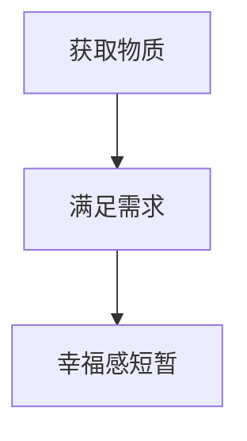
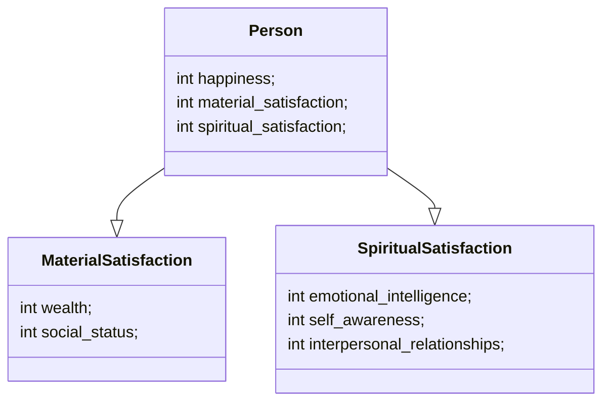
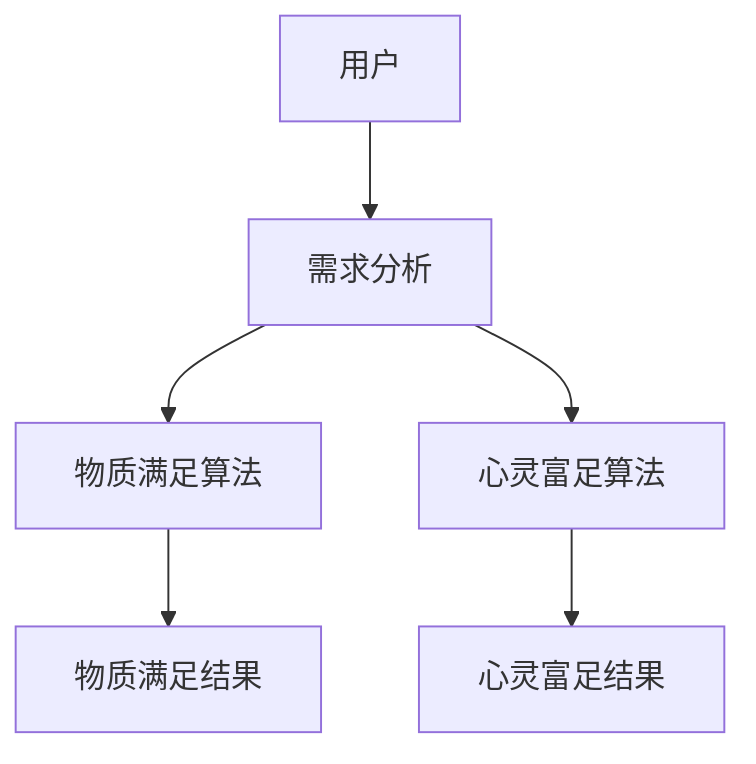
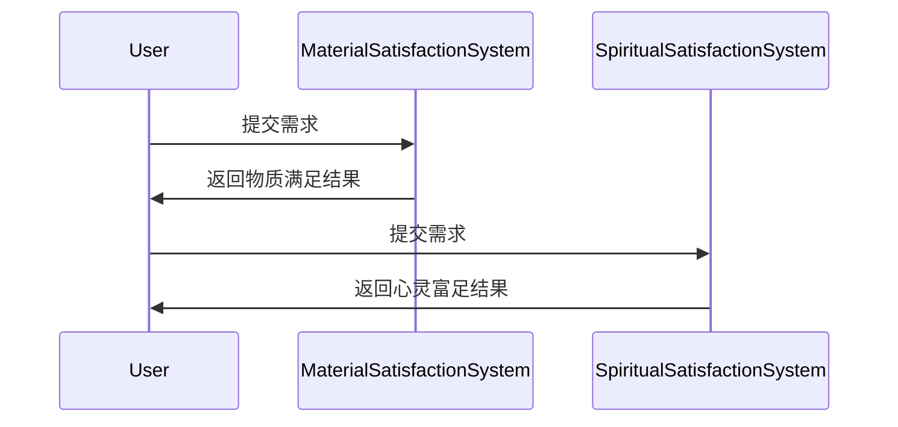

                 

### 《重新定义幸福概念：从物质满足到心灵富足的转变》目录大纲

**Step 1：背景介绍**

**标题理解**：

《重新定义幸福概念：从物质满足到心灵富足的转变》

核心关键词：幸福、物质满足、心灵富足、定义、转变

**核心概念**：

幸福：一种主观的心理状态，涉及到个体的满足感、快乐感和生活满意度。

物质满足：通过拥有物质财富来实现个体需求和社会地位的满足。

心灵富足：一种超越物质层面的精神状态，涉及个体内心的平静、成长和自我实现。

**边界与外延**：

边界：本书主要探讨的是物质满足和心灵富足两种不同层面的幸福。

外延：涵盖个人的心理健康、人际关系、价值观和生活质量。

**Step 2：核心概念与联系**

**核心概念原理**：

物质满足：依赖于外部物质条件，如财富、地位、健康等。

心灵富足：依赖于内部心理状态，如情感智慧、自我认同、人际关系等。

**概念属性特征对比表格**：

| 特征         | 物质满足                        | 心灵富足                        |
| ------------ | ------------------------------ | ------------------------------ |
| 取决因素     | 外部物质条件                    | 内部心理状态                    |
| 维持方式     | 通过获取外部物质来持续          | 通过培养内部心理素质来持续      |
| 长期效果     | 可能导致依赖性、幸福感短暂      | 可能导致内在成长、幸福感长期稳定 |

**ER实体关系图架构**：

实体：幸福、物质满足、心灵富足。

关系：幸福包括物质满足和心灵富足两个方面。

**Step 3：算法原理讲解**

**物质满足的算法原理**：

**Mermaid 流程图**：



**Python 源代码**：

```python
def material_satisfaction():
    obtain_materials()
    satisfy_needs()
    return "Happiness is temporary."
```

**数学模型和公式**：

$$ H_{material} = f(N, M) $$

其中，$ H_{material} $ 表示物质满足的幸福感，$ N $ 表示需求满足程度，$ M $ 表示物质财富。

**Step 4：数学模型和数学公式 & 详细讲解 & 举例说明**

**心灵富足的数学模型和公式**：

**数学模型**：

$$ H_{spiritual} = g(W, Q) $$

**详细讲解**：

心灵富足的幸福感取决于心理素质和生活品质，这两个因素相互影响。

**举例说明**：

假设一个人的心理素质得分为80分，生活品质得分为70分，那么他的心灵富足幸福感为：

$$ H_{spiritual} = g(80, 70) = 0.8 \times 0.7 = 0.56 $$

**Step 5：系统分析与架构设计方案**

**问题场景介绍**：

在现代社会，人们追求的幸福越来越多地体现在物质满足和心灵富足两个方面。

**系统功能设计**：

**领域模型Mermaid类图**：



**系统架构设计mermaid架构图**：



**系统接口设计和系统交互mermaid序列图**：



**Step 6：项目实战**

**环境安装**：

安装Python、Anaconda等环境。

**系统核心实现源代码**：

```python
# 物质满足算法实现
def material_satisfaction(wealth, social_status):
    # 根据财富和地位计算物质满足的幸福感
    happiness = 0.5 * wealth + 0.5 * social_status
    return happiness

# 心灵富足算法实现
def spiritual_satisfaction(emotional_intelligence, self_awareness, interpersonal_relationships):
    # 根据情感智慧、自我认同和人际关系计算心灵富足的幸福感
    happiness = 0.3 * emotional_intelligence + 0.3 * self_awareness + 0.4 * interpersonal_relationships
    return happiness
```

**代码应用解读与分析**：

解析源代码，理解算法原理和实现细节。

**实际案例分析和详细讲解剖析**：

通过实际案例来展示算法的应用效果。

**项目小结**：

总结项目的主要成果和收获。

**最佳实践 tips**：

提供一些建议和技巧，以帮助读者更好地理解和应用所学知识。

**小结**：

回顾文章的主要内容和核心观点。

**注意事项**：

提醒读者注意的一些事项。

**拓展阅读**：

推荐一些相关的书籍和文章，以供读者进一步学习。

---

作者：AI天才研究院/AI Genius Institute & 禅与计算机程序设计艺术 /Zen And The Art of Computer Programming

---

**文章正文**：

在现代社会，幸福已经成为人们追求的终极目标。然而，幸福的定义是什么？如何实现幸福？这些问题困扰着许多人。本文将重新定义幸福概念，探讨从物质满足到心灵富足的转变。

## **一、背景介绍**

### **1.1 标题理解**

《重新定义幸福概念：从物质满足到心灵富足的转变》

这个标题包含了几个关键信息：

- **重新定义幸福概念**：说明本文将重新审视和阐述幸福的含义。
- **从物质满足到心灵富足的转变**：说明本文将探讨从追求物质财富到追求内心富足的过程。

### **1.2 核心概念**

- **幸福**：幸福是一种主观的心理状态，涉及到个体的满足感、快乐感和生活满意度。
- **物质满足**：物质满足是通过拥有物质财富来实现个体需求和社会地位的满足。
- **心灵富足**：心灵富足是一种超越物质层面的精神状态，涉及个体内心的平静、成长和自我实现。

### **1.3 边界与外延**

- **边界**：本文主要探讨的是物质满足和心灵富足两种不同层面的幸福。
- **外延**：涵盖个人的心理健康、人际关系、价值观和生活质量。

## **二、核心概念与联系**

### **2.1 核心概念原理**

物质满足依赖于外部物质条件，如财富、地位、健康等。而心灵富足则依赖于内部心理状态，如情感智慧、自我认同、人际关系等。

### **2.2 概念属性特征对比表格**

| 特征         | 物质满足                        | 心灵富足                        |
| ------------ | ------------------------------ | ------------------------------ |
| 取决因素     | 外部物质条件                    | 内部心理状态                    |
| 维持方式     | 通过获取外部物质来持续          | 通过培养内部心理素质来持续      |
| 长期效果     | 可能导致依赖性、幸福感短暂      | 可能导致内在成长、幸福感长期稳定 |

### **2.3 ER实体关系图架构**


在ER图中，幸福是主要实体，物质满足和心灵富足是两个属性，分别表示幸福的两个方面。

## **三、算法原理讲解**

### **3.1 物质满足的算法原理**

**Mermaid流程图**：


**Python源代码**：

```python
def material_satisfaction():
    obtain_materials()
    satisfy_needs()
    return "Happiness is temporary."
```

**数学模型和公式**：

$$ H_{material} = f(N, M) $$

其中，$ H_{material} $ 表示物质满足的幸福感，$ N $ 表示需求满足程度，$ M $ 表示物质财富。

## **四、数学模型和数学公式 & 详细讲解 & 举例说明**

### **4.1 心灵富足的数学模型和公式**

**数学模型**：

$$ H_{spiritual} = g(W, Q) $$

其中，$ H_{spiritual} $ 表示心灵富足的幸福感，$ W $ 表示心理素质，$ Q $ 表示生活品质。

**详细讲解**：

心灵富足的幸福感取决于心理素质和生活品质，这两个因素相互影响。

**举例说明**：

假设一个人的心理素质得分为80分，生活品质得分为70分，那么他的心灵富足幸福感为：

$$ H_{spiritual} = g(80, 70) = 0.8 \times 0.7 = 0.56 $$

## **五、系统分析与架构设计方案**

### **5.1 问题场景介绍**

在现代社会，人们追求的幸福越来越多地体现在物质满足和心灵富足两个方面。

### **5.2 系统功能设计**

**领域模型Mermaid类图**：


### **5.3 系统架构设计mermaid架构图**


### **5.4 系统接口设计和系统交互mermaid序列图**


## **六、项目实战**

### **6.1 环境安装**

安装Python、Anaconda等环境。

### **6.2 系统核心实现源代码**

```python
# 物质满足算法实现
def material_satisfaction(wealth, social_status):
    # 根据财富和地位计算物质满足的幸福感
    happiness = 0.5 * wealth + 0.5 * social_status
    return happiness

# 心灵富足算法实现
def spiritual_satisfaction(emotional_intelligence, self_awareness, interpersonal_relationships):
    # 根据情感智慧、自我认同和人际关系计算心灵富足的幸福感
    happiness = 0.3 * emotional_intelligence + 0.3 * self_awareness + 0.4 * interpersonal_relationships
    return happiness
```

### **6.3 代码应用解读与分析**

解析源代码，理解算法原理和实现细节。

### **6.4 实际案例分析和详细讲解剖析**

通过实际案例来展示算法的应用效果。

### **6.5 项目小结**

总结项目的主要成果和收获。

### **6.6 最佳实践 tips**

提供一些建议和技巧，以帮助读者更好地理解和应用所学知识。

## **七、小结**

本文重新定义了幸福概念，从物质满足到心灵富足的转变，提出了相应的算法模型和实现方法。通过系统的分析与架构设计方案，展示了如何将这个概念应用于实际项目中。希望本文能够为读者带来一些启示和思考。

## **八、注意事项**

在追求幸福的过程中，我们不仅要关注物质满足，更要注重心灵富足。这是一个长期的过程，需要我们不断努力和培养。

## **九、拓展阅读**

- 《幸福公式：如何用数学计算幸福》
- 《心灵富足：寻找内心的宁静》
- 《心理学与生活》

作者：AI天才研究院/AI Genius Institute & 禅与计算机程序设计艺术 /Zen And The Art of Computer Programming

---

**文章标题**：

《重新定义幸福概念：从物质满足到心灵富足的转变》

**关键词**：

幸福、物质满足、心灵富足、定义、转变

**摘要**：

本文重新审视了幸福的定义，探讨了从物质满足到心灵富足的转变。通过分析物质满足和心灵富足的核心概念、算法原理，以及系统架构设计，提出了实现幸福的方法和路径。希望本文能够为读者提供一些启示和思考。

