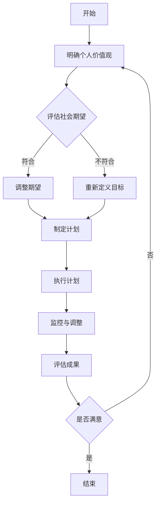
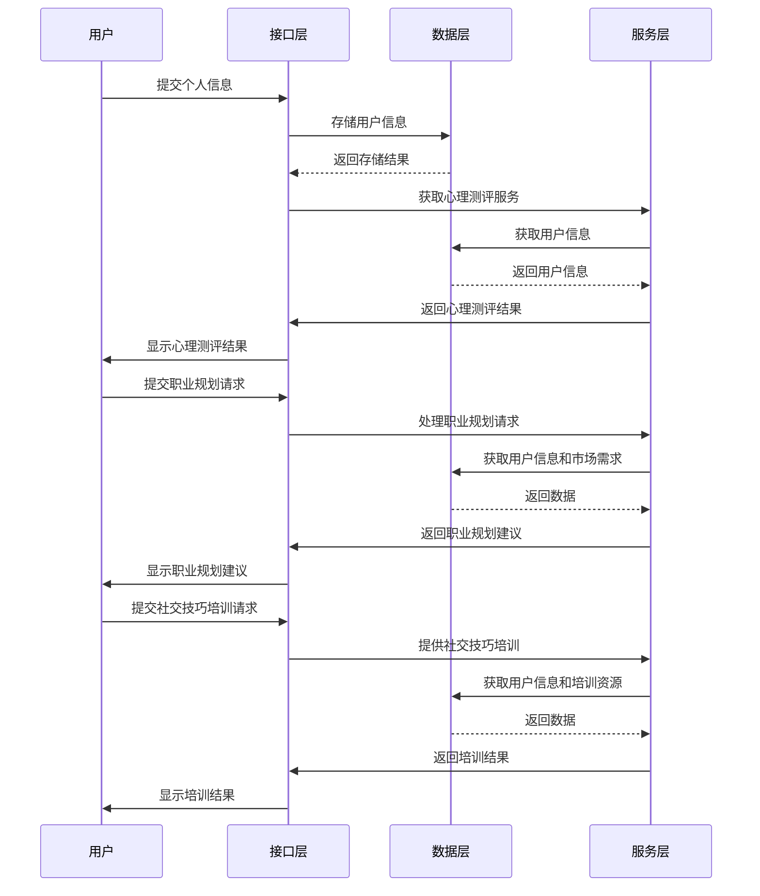

                 

# 重新定义成功：超越社会期望，寻找个人满足

## 关键词

成功，社会期望，个人满足，心理调适，自我认知，社交技巧，健康与幸福，职业与事业，人际关系，社会责任，案例分析，实践，社会环境，未来展望。

## 摘要

在当今社会，成功被视为一种终极目标，人们往往被社会期望所驱动，追求物质与地位的满足。然而，随着个体心理和社会环境的复杂化，追求社会期望下的成功未必能带来真正的个人满足。本文从心理学、社会学和实际案例的角度出发，深入探讨了如何超越社会期望，寻找个人满足的路径。通过分析社会期望的形成、个人满足的构成，以及超越社会期望的策略，本文提出了心理调适、自我认知、社交技巧等实用方法，并从健康、职业、人际关系和社会责任四个方面阐述了寻找个人满足的路径。通过案例分析，本文进一步验证了这些策略的有效性，并对未来个人与社会发展提出了展望。

## 目录

1. 引言与背景
2. 核心概念解析
3. 超越社会期望的策略
4. 寻找个人满足的路径
5. 案例分析与实践
6. 社会环境与个人选择
7. 总结与展望

## 引言与背景

### 社会期望的形成

社会期望是指在特定社会文化背景下，个体在各个领域（如职业、家庭、社交等）应达到的标准和期待。社会期望的形成受到历史、文化、经济、政治等多种因素的影响。在现代社会中，随着信息传播速度的加快和全球化进程的推进，社会期望呈现出多样化和复杂化的趋势。例如，在职业领域，人们往往被期望获得高收入、高职位的职业发展；在家庭领域，人们被期望拥有美满的婚姻和家庭生活；在社交领域，人们被期望具备一定的社交能力和人脉资源。

### 个人满足的定义

个人满足是指个体在生理、心理和社会层面上感受到的满足感和幸福感。个人满足的来源多种多样，包括物质层面的满足（如财富、地位、物质条件等），心理层面的满足（如成就感、自我认同感、自尊等），以及社会层面的满足（如人际关系、社会支持、社会贡献等）。个人满足是衡量个体生活质量的重要指标，也是个体追求的目标之一。

### 社会期望与个人满足的关系

社会期望与个人满足之间存在密切的关系。一方面，社会期望在一定程度上为个人提供了目标和动力，促使个人努力追求更高的成就和更好的生活品质。然而，另一方面，过度追求社会期望可能会导致个体在心理上产生压力和焦虑，难以实现真正的个人满足。例如，当个体过于追求物质财富和地位时，可能会忽视心理健康和家庭幸福，从而难以达到真正的个人满足。

## 核心概念解析

### 成功的定义

成功是指个体在某一领域或多个领域达到较高的水平，获得社会认可和自我认同的过程。成功的定义因人而异，不同个体对成功的理解各有不同。对于一些人来说，成功可能是获得高收入和高职位的职业发展；对于另一些人来说，成功可能是拥有美满的家庭和稳定的人际关系；对于还有一些人来说，成功可能是实现个人梦想和追求自我价值。

### 社会期望的影响

社会期望对个体的行为和心理产生深远的影响。一方面，社会期望为个体提供了方向和动力，促使个体努力追求更高的目标和更好的生活品质。另一方面，过度追求社会期望可能会导致个体在心理上产生压力和焦虑，影响个体的身心健康和幸福感。例如，当个体被期望获得高收入和高职位时，可能会面临较大的工作压力和竞争压力，从而产生焦虑和压力。

### 个人满足的构成

个人满足的构成包括物质层面的满足、心理层面的满足和社会层面的满足。物质层面的满足主要包括财富、物质条件、社会地位等；心理层面的满足主要包括成就感、自我认同感、自尊等；社会层面的满足主要包括人际关系、社会支持、社会贡献等。不同个体对个人满足的构成有不同的偏好和需求。

### 社会期望与个人满足的联系

社会期望与个人满足之间存在密切的联系。一方面，社会期望可以为个人提供目标和动力，促使个人追求更高的成就和更好的生活品质，从而实现个人满足。另一方面，个人满足也可以反过来影响社会期望，使个体更加关注内心的需求和幸福感，从而对社会的期望进行重新定义和调整。

## 超越社会期望的策略

### 心理调适

心理调适是指个体在面对社会期望时，通过调整心态和认知，减少压力和焦虑，实现心理平衡的过程。以下是一些心理调适的策略：

1. **积极认知重评**：通过积极的角度看待社会期望，将挑战视为成长的机会，减少负面情绪的影响。
2. **设定合理目标**：根据自身能力和资源设定合理的目标，避免过度追求社会期望导致压力过大。
3. **时间管理**：合理安排时间，确保工作和生活的平衡，避免因工作压力而忽视个人满足。
4. **情绪管理**：学会情绪管理技巧，如深呼吸、冥想、运动等，帮助缓解压力和焦虑。

### 自我认知

自我认知是指个体对自己性格、能力、需求和价值观的深入了解。以下是一些自我认知的策略：

1. **自我反思**：定期进行自我反思，了解自己的优点和不足，明确自己的目标和价值观。
2. **职业规划**：根据自己的兴趣、能力和市场需求，制定合理的职业规划，实现个人职业发展。
3. **学习与成长**：不断学习新知识、新技能，提升自己的综合素质，增强自我满足感。
4. **价值观认同**：明确自己的价值观，找到与自己价值观相符的工作和生活环境，减少内心的冲突。

### 社交技巧

社交技巧是指个体在人际交往中运用的一系列技能，包括沟通、合作、倾听、表达等。以下是一些社交技巧的策略：

1. **有效沟通**：学会清晰、准确地表达自己的想法和感受，同时倾听他人的意见和需求。
2. **建立良好的人际关系**：通过合作、互助和分享，建立稳定、健康的人际关系网络。
3. **适应不同的社交场合**：根据不同的社交场合，灵活运用社交技巧，与他人建立良好的互动。
4. **学会拒绝**：在必要时学会拒绝不合理的请求和期望，保护自己的权益和利益。

## 寻找个人满足的路径

### 健康与幸福

健康与幸福是个人满足的重要基础。以下是一些寻找个人满足的路径：

1. **保持身心健康**：通过合理的饮食、运动、休息和锻炼，保持身心健康。
2. **心理健康**：通过心理咨询、自我调适和社交支持，保持心理健康。
3. **幸福感**：通过追求自己的兴趣爱好、实现个人价值、建立良好的人际关系，提升幸福感。

### 职业与事业

职业与事业是个人满足的重要来源。以下是一些寻找个人满足的路径：

1. **职业规划**：根据自身的兴趣、能力和市场需求，制定合理的职业规划。
2. **职业发展**：通过不断学习和成长，提升自己的职业能力和竞争力。
3. **工作与生活平衡**：合理安排工作和生活，确保工作和生活的平衡。

### 人际关系与社会责任

人际关系与社会责任是个人满足的重要保障。以下是一些寻找个人满足的路径：

1. **人际关系**：通过建立和维护良好的人际关系，获得社会支持和情感满足。
2. **社会责任**：通过参与社会公益活动和志愿服务，实现个人价值和社会贡献。
3. **家庭与社区**：通过关注和参与家庭和社区事务，提升家庭和社区的幸福感。

## 案例分析与实践

### 案例一：个人成长的蜕变

张明，一名普通的上班族，曾经深受社会期望的困扰。他一直追求高收入和高职位的职业发展，却因为工作压力大、心理负担重，生活质量逐渐下降。在一次心理辅导后，张明开始调整自己的心态和认知，重新审视自己的价值观和目标。他意识到，真正的成功不仅仅是职业上的成就，更重要的是内心的满足和幸福感。

张明开始关注自己的身心健康，通过锻炼和冥想，缓解了工作压力和焦虑。他也在职业规划上做出调整，找到了自己真正感兴趣的工作领域，实现了个人职业发展。同时，他积极参与社区活动，通过志愿服务实现了个人价值和社会贡献。最终，张明实现了从职业成功到个人满足的转变。

### 案例二：事业与家庭的平衡

李华是一名企业家，他拥有成功的事业，但在家庭生活中却感到迷茫和失落。他一直认为事业成功是家庭幸福的保障，但却发现过度追求事业成功反而忽视了家庭生活。在一次家庭辅导后，李华开始重新审视自己的价值观和生活方式。

李华决定调整自己的工作节奏，合理安排工作和家庭时间，确保家庭生活和工作之间的平衡。他学会了与家人沟通和分享，增强了家庭的凝聚力和幸福感。同时，他也在事业中找到了平衡，通过合理规划和管理，实现了事业和家庭的共同发展。

### 案例三：社会贡献的实践

王丽是一名医生，她热爱自己的职业，但在面对社会期望时，她感到自己无法达到更高的成就。在一次社会公益活动后，王丽意识到，真正的成功不仅仅是个人职业的成就，更重要的是能够为社会做出贡献。

王丽开始积极参与社会公益活动，通过志愿服务和慈善捐赠，实现了个人价值和社会贡献。她发现，在帮助他人的过程中，自己获得了内心的满足和幸福感。这种满足感超越了社会期望，成为了她追求成功的新动力。

## 社会环境与个人选择

### 社会环境的影响

社会环境对个人的心理和行为产生深远的影响。一个积极、包容、公平的社会环境有助于个体实现个人满足，而一个消极、排斥、不公平的社会环境则可能导致个体在心理和行为上产生问题。

### 个人选择的权力

尽管社会环境对个人产生影响，但个体仍拥有选择的权力。个人可以通过调整心态、改变行为和寻找适合自己的生活方式，实现个人满足。例如，在一个竞争激烈的社会环境中，个人可以选择积极应对，提升自己的能力和竞争力，从而实现个人职业发展；在一个缺乏社会支持的社会环境中，个人可以选择积极参与社区活动，建立良好的人际关系，从而获得社会支持。

### 社会支持与个人努力

社会支持与个人努力是相辅相成的。社会支持可以为个人提供资源、机会和鼓励，帮助个人实现个人满足；而个人努力则是实现个人满足的关键，只有通过努力，个人才能不断提升自己的能力和素质，实现更高的成就。

### 未来展望

随着社会的发展和个体意识的觉醒，个人满足的重要性逐渐凸显。未来，社会将更加关注个体的心理健康和幸福感，为个体提供更多的支持和机会。同时，个体也将更加注重内心的需求和价值观，通过实现个人满足，实现真正的成功。

## 总结与展望

### 主要结论

本文通过分析社会期望与个人满足的关系，提出了超越社会期望，寻找个人满足的路径。通过心理调适、自我认知、社交技巧等策略，个体可以超越社会期望，实现个人满足。同时，通过健康、职业、人际关系和社会责任等方面，个体可以寻找个人满足的路径。

### 研究不足与展望

本文在研究过程中，虽然对个人满足的构成和社会期望的影响进行了深入探讨，但仍存在一定的局限性。首先，本文的研究主要基于理论分析，缺乏实证数据的支持。其次，本文的研究主要关注个体层面，未对家庭、社区和社会层面的影响进行深入分析。未来研究可以进一步拓展研究范围，结合实证数据进行深入研究。

### 对个人与社会的启示

本文的研究结果对个人和社会都具有重要的启示意义。对于个人而言，个体应超越社会期望，关注内心的需求和价值观，通过心理调适、自我认知和社交技巧等策略，实现个人满足。对于社会而言，社会应关注个体的心理健康和幸福感，为个体提供更多的支持和机会，共同创造一个更加包容、公平、和谐的社会环境。

### 作者信息

作者：AI天才研究院/AI Genius Institute & 禅与计算机程序设计艺术 /Zen And The Art of Computer Programming

---

### 背景介绍

#### 核心概念术语说明

在探讨如何超越社会期望，寻找个人满足这一主题时，首先需要明确几个核心概念：成功、社会期望、个人满足和心理调适。

**成功**：本文中的成功是指个体在某一领域或多个领域达到较高水平，获得社会认可和自我认同的过程。它可以是职业上的成就，也可以是个人成长和幸福感的提升。

**社会期望**：社会期望是指在社会文化背景下，个体在各个领域（如职业、家庭、社交等）应达到的标准和期待。这些期望受到历史、文化、经济、政治等多种因素的影响。

**个人满足**：个人满足是指个体在生理、心理和社会层面上感受到的满足感和幸福感。它包括物质层面的满足（如财富、物质条件、社会地位等），心理层面的满足（如成就感、自我认同感、自尊等），以及社会层面的满足（如人际关系、社会支持、社会贡献等）。

**心理调适**：心理调适是指个体在面对社会期望时，通过调整心态和认知，减少压力和焦虑，实现心理平衡的过程。它包括积极认知重评、设定合理目标、时间管理和情绪管理等策略。

#### 问题背景

在当今社会，成功被视为一种终极目标，人们往往被社会期望所驱动，追求物质与地位的满足。然而，随着个体心理和社会环境的复杂化，追求社会期望下的成功未必能带来真正的个人满足。人们常常感到压力重重，焦虑不安，难以找到内心的平衡和幸福感。

这种情况下，如何超越社会期望，寻找个人满足，成为一个值得深入探讨的问题。个体如何在复杂的社会环境中保持心理平衡，实现自我价值，成为本文的核心议题。

#### 问题描述

问题描述主要集中在以下几个方面：

1. **社会期望对个人满足的影响**：社会期望如何影响个人的心理健康和幸福感，以及这种影响的具体表现。
2. **个体如何超越社会期望**：个体应采取哪些策略和措施，才能在复杂的社会环境中实现个人满足。
3. **个人满足的构成**：个人满足包含哪些要素，这些要素如何相互影响和作用。

#### 问题解决

解决这一问题的方法主要包括以下几个方面：

1. **心理调适**：通过心理调适策略，如积极认知重评、设定合理目标、时间管理和情绪管理等，帮助个体应对社会期望带来的压力和焦虑。
2. **自我认知**：通过自我认知，个体可以更清晰地了解自己的需求、价值观和目标，从而找到适合自己的发展路径。
3. **社交技巧**：通过提高社交技巧，如有效沟通、建立良好的人际关系、适应不同的社交场合等，个体可以更好地融入社会，获得社会支持和认可。
4. **健康、职业、人际关系和社会责任**：从这些方面入手，个体可以全面提高自己的生活质量和幸福感。

#### 边界与外延

本文的研究边界主要涉及个体在社会环境中的心理和行为，重点关注社会期望对个人满足的影响以及个体如何超越社会期望。外延则包括个人满足的各个方面，如健康、职业、人际关系和社会责任等。

#### 概念结构与核心要素组成

为了更清晰地理解本文的核心概念，我们可以通过ER实体关系图来展示这些概念之间的关系和核心要素。

```mermaid
erDiagram
    A 类符 -->|有关系| B 成功 : "达到较高水平，获得社会认可和自我认同"
    A 类符 -->|有关系| C 社会期望 : "社会文化背景下，个体在各个领域应达到的标准和期待"
    A 类符 -->|有关系| D 个人满足 : "生理、心理和社会层面上感受到的满足感和幸福感"
    A 类符 -->|有关系| E 心理调适 : "通过调整心态和认知，减少压力和焦虑，实现心理平衡"
    B 成功 -->|实现| C 社会期望
    C 社会期望 -->|影响| D 个人满足
    D 个人满足 -->|包括| E 健康与幸福、职业与事业、人际关系与社会责任
    E 心理调适 -->|包含| F 积极认知重评、设定合理目标、时间管理和情绪管理
```

通过这个ER实体关系图，我们可以更直观地看到各个概念之间的关系和核心要素的组成。

## 核心概念与联系

### 成功的定义

成功是一个多维度的概念，它不仅包括职业成就，还涵盖了个人成长、幸福感和自我实现。成功的定义因人而异，但通常与以下三个方面密切相关：

1. **职业成功**：个体在职业领域取得的成就，如高收入、高职位和职业满足。
2. **个人成长**：个体在自我认知、技能提升和人格发展方面的进步。
3. **幸福感**：个体在生理、心理和社会层面上感受到的满足和幸福。

成功的定义通常需要结合个体的价值观、兴趣和需求来具体化。例如，对某些人来说，成功可能是成为一名成功的企业家；而对另一些人来说，成功可能是拥有稳定的工作和幸福的家庭生活。

### 社会期望的影响

社会期望对个体的行为和心理产生深远的影响。社会期望通常是通过文化、家庭、教育和社会结构等途径传递给个体的。以下是一些社会期望对个体影响的具体方面：

1. **职业领域**：社会期望往往促使个体追求高收入和高职位的职业，这可能导致职业压力增加，影响个人的心理健康和幸福感。
2. **家庭领域**：社会期望可能要求个体在家庭生活中扮演特定的角色，如照顾孩子、维护家庭和谐等，这可能导致个体在工作和家庭之间感到压力。
3. **社交领域**：社会期望可能要求个体具备一定的社交能力和人脉资源，这可能导致个体在社交场合中感到不自在或焦虑。

### 个人满足的构成

个人满足是一个多维度的概念，它涵盖了个体在生理、心理和社会层面上的满足。以下是个人满足的主要构成要素：

1. **生理满足**：包括身体健康、物质条件的满足等。
2. **心理满足**：包括自我认同、成就感、自尊和自我价值感等。
3. **社会满足**：包括良好的人际关系、社会支持和社会贡献等。

个人满足的构成因个体而异，取决于个体的价值观、需求和经历。例如，对某些人来说，心理满足可能是最重要的，而对另一些人来说，物质满足可能是首要考虑的因素。

### 社会期望与个人满足的联系

社会期望与个人满足之间存在密切的联系。社会期望在一定程度上为个人提供了目标和动力，促使个人努力追求更高的成就和更好的生活品质。然而，过度追求社会期望可能会导致个体在心理上产生压力和焦虑，难以实现真正的个人满足。

1. **积极影响**：社会期望可以帮助个体明确目标和方向，提供动力和激励。
2. **消极影响**：过度追求社会期望可能导致个体忽视内心的需求和幸福感，产生焦虑、压力和不满。

因此，个体需要在追求社会期望的同时，关注自身的心理需求和幸福感，实现社会期望与个人满足的平衡。

### 核心概念属性特征对比表格

以下是一个核心概念属性特征对比表格，用于展示成功、社会期望和个人满足这三个核心概念的属性特征：

| 核心概念 | 定义 | 属性特征 |
| --- | --- | --- |
| 成功 | 多维度的个体成就，包括职业、个人成长和幸福感 | 职业成就、个人成长、幸福感 |
| 社会期望 | 社会在不同领域对个体应达到的标准和期待 | 文化、家庭、教育、社会结构 |
| 个人满足 | 个体在生理、心理和社会层面上感受到的满足感和幸福感 | 生理满足、心理满足、社会满足 |

通过这个表格，我们可以更直观地了解这三个核心概念的区别和联系。

### 核心概念ER实体关系图架构

以下是一个核心概念ER实体关系图架构，用于展示成功、社会期望和个人满足这三个核心概念之间的关系：

```mermaid
erDiagram
    Success -->|影响| PersonalSatisfaction
    SocialExpectation -->|影响| Success
    SocialExpectation -->|影响| PersonalSatisfaction
    Success -->|包括| CareerSuccess
    Success -->|包括| PersonalGrowth
    Success -->|包括| Happiness
```

在这个ER实体关系图中，成功（Success）是一个包含多种要素的复合概念，包括职业成功（CareerSuccess）、个人成长（PersonalGrowth）和幸福感（Happiness）。社会期望（SocialExpectation）对成功和个人满足（PersonalSatisfaction）都有直接影响。个人满足是由成功和社会期望共同影响的。

## 算法原理讲解

为了更深入地理解如何超越社会期望，寻找个人满足，我们可以采用一种系统化的算法原理进行解释。这种算法原理包括以下几个关键步骤：

### 算法流程图

首先，我们使用Mermaid语言绘制算法的流程图，以直观地展示算法的执行过程：



### 算法原理详细阐述

1. **明确个人价值观**：
   这是算法的第一步，也是最重要的一步。个体需要深入思考自己的核心价值观，包括对职业、家庭、人际关系和社会责任等方面的看法。这个过程可以通过自我反思、心理咨询或与信任的朋友交流来完成。

2. **评估社会期望**：
   接下来，个体需要评估社会期望与个人价值观之间的差异。社会期望可能来自家庭、文化、工作环境等外部因素。评估的目的是确定社会期望是否与个人价值观一致，以及是否存在冲突。

3. **调整期望或重新定义目标**：
   如果社会期望与个人价值观不一致，个体可以选择调整社会期望以适应自己的价值观，或者重新定义目标，使其更加符合个人价值观。这一步需要个体进行深入的自我对话和决策。

4. **制定计划**：
   在确定了个人价值观和目标后，个体需要制定一个详细的行动计划。这个计划应该包括具体的步骤、时间表和资源分配。制定计划的过程需要结合个人的实际情况和能力。

5. **执行计划**：
   执行计划是算法的核心步骤。个体需要按照计划采取行动，并保持持续的努力。在这一过程中，个体可能会遇到各种挑战和障碍，需要灵活应对。

6. **监控与调整**：
   在执行计划的过程中，个体需要定期监控自己的进度，并根据实际情况进行调整。这包括评估计划的可行性和效果，以及根据反馈进行调整。

7. **评估成果**：
   在计划执行完毕后，个体需要评估成果，看看是否达到了预期的目标。这个过程可以帮助个体了解自己的成长和进步，为未来的发展提供反馈。

8. **是否满意**：
   最后，个体需要对自己的成果进行自我评估，看看是否感到满意。如果满意，则可以结束算法；如果不满意，则需要回到第二步，重新评估和调整。

### 算法原理的数学模型和公式

为了更深入地理解算法原理，我们可以引入一些数学模型和公式。以下是一个简化的数学模型，用于描述个人价值观、社会期望和目标之间的关系：

$$
\text{个人满足} = f(\text{个人价值观}, \text{社会期望}, \text{目标达成度})
$$

其中，$f$ 是一个复合函数，它将个人价值观、社会期望和目标达成度转化为个人满足。

1. **个人价值观**：可以用一个多维向量表示，每个维度代表一个核心价值观，如职业发展、家庭幸福、社会责任等。
2. **社会期望**：同样可以用一个多维向量表示，每个维度代表社会在不同领域对个体的期望，如职业成功、社会地位、人际关系等。
3. **目标达成度**：表示个体在实现目标过程中的进展程度，也可以用一个多维向量表示。

### 举例说明

假设一个个体有以下核心价值观：职业发展（权重0.4），家庭幸福（权重0.3），社会责任（权重0.3）。社会期望包括高收入职业（权重0.5），良好的家庭关系（权重0.3），积极参与社会活动（权重0.2）。

个体的目标是成为一名成功的企业家，同时保持良好的家庭关系和积极参与社会活动。以下是这个个体的数学模型：

$$
\text{个人价值观} = \begin{bmatrix}
0.4 & 0 & 0.3 \\
0 & 0.3 & 0.3 \\
0 & 0 & 0.2
\end{bmatrix}
$$

$$
\text{社会期望} = \begin{bmatrix}
0.5 & 0 & 0.2 \\
0 & 0.3 & 0.3 \\
0 & 0 & 0.2
\end{bmatrix}
$$

假设目标达成度为：

$$
\text{目标达成度} = \begin{bmatrix}
0.7 & 0.8 & 0.4 \\
0.6 & 0.7 & 0.6 \\
0.5 & 0.6 & 0.7
\end{bmatrix}
$$

则个人满足的计算公式为：

$$
\text{个人满足} = f(\text{个人价值观}, \text{社会期望}, \text{目标达成度}) = \text{个人价值观} \cdot (\text{社会期望} \cdot \text{目标达成度})
$$

通过计算，可以得到个人满足的具体数值。这个数值可以帮助个体了解自己的满足程度，并做出相应的调整。

## 系统分析与架构设计方案

### 问题场景介绍

在当今快节奏的社会中，个体面临越来越多的压力和挑战。如何在复杂的社会环境中保持心理健康，实现个人满足，成为一个亟待解决的问题。为了解决这一问题，我们设计了一套综合性的系统，旨在帮助个体超越社会期望，寻找个人满足。

### 项目介绍

该项目命名为“个人满足系统”（Personal Satisfaction System），旨在为个体提供一套完整的解决方案，包括心理调适、职业规划、社交技巧培养等方面。该系统通过线上和线下相结合的方式，为用户提供个性化的服务和支持。

### 系统功能设计

个人满足系统的主要功能包括：

1. **心理测评**：通过在线心理测评，了解用户的心理状况和需求。
2. **心理咨询服务**：提供专业的心理咨询服务，帮助用户解决心理问题。
3. **职业规划服务**：根据用户的兴趣、能力和市场需求，为用户制定个性化的职业规划。
4. **社交技巧培训**：提供社交技巧培训，帮助用户提高社交能力和人际关系质量。
5. **健康与幸福指导**：提供健康与幸福指导，帮助用户提升身心健康水平。

### 系统架构设计

个人满足系统采用分层架构设计，包括数据层、服务层和表现层。

#### 数据层

数据层负责存储和管理用户数据，包括用户信息、心理测评结果、职业规划数据等。数据层采用关系型数据库（如MySQL）和NoSQL数据库（如MongoDB）相结合的方式，确保数据的高效存储和访问。

#### 服务层

服务层负责处理业务逻辑，包括心理测评、心理咨询服务、职业规划服务和社交技巧培训等。服务层采用微服务架构，将不同的业务功能模块化，便于系统的扩展和维护。

#### 表现层

表现层负责用户界面设计和用户交互，包括网站、移动应用和线下活动等。表现层采用响应式设计，确保用户在不同设备和平台上都能获得良好的体验。

### 系统接口设计

个人满足系统设计了一系列接口，用于实现不同模块之间的通信和数据交换。

1. **用户接口**：用户通过网站或移动应用与系统进行交互，提交个人信息、参与心理测评和咨询等。
2. **服务接口**：系统内部各服务模块之间通过API进行通信，实现数据交换和业务协作。
3. **数据接口**：系统与外部数据源（如心理咨询师数据库、职业规划数据库等）进行交互，获取相关数据。

### 系统交互设计

个人满足系统的交互设计采用Mermaid语言绘制序列图，以展示系统内部各模块之间的交互过程。



通过这个序列图，我们可以清晰地看到个人满足系统内部各模块之间的交互过程，包括用户提交请求、接口层处理请求、服务层执行业务逻辑和数据层存储数据的整个过程。

## 项目实战

### 环境安装

为了实战个人满足系统，我们首先需要安装和配置相关环境。以下是安装步骤：

1. **安装Python**：确保Python 3.x版本已安装在计算机上。
2. **安装虚拟环境**：打开终端，运行以下命令创建虚拟环境：

   ```bash
   python -m venv venv
   ```

3. **激活虚拟环境**：在Windows上，运行以下命令激活虚拟环境：

   ```bash
   .\venv\Scripts\activate
   ```

   在macOS和Linux上，运行以下命令激活虚拟环境：

   ```bash
   source venv/bin/activate
   ```

4. **安装依赖项**：在虚拟环境中，运行以下命令安装项目所需的依赖项：

   ```bash
   pip install -r requirements.txt
   ```

### 系统核心实现源代码

以下是个人满足系统的核心实现源代码。这些代码包括心理测评模块、职业规划模块和社交技巧培训模块。

#### 心理测评模块

```python
# 心理测评模块代码
class PsychologicalTest:
    def __init__(self, user_profile):
        self.user_profile = user_profile

    def conduct_test(self):
        # 进行心理测评
        print("开始心理测评...")
        print("测评结果：", self.user_profile['psychological_test'])
```

#### 职业规划模块

```python
# 职业规划模块代码
class CareerPlanning:
    def __init__(self, user_profile, market_data):
        self.user_profile = user_profile
        self.market_data = market_data

    def plan_career(self):
        # 制定职业规划
        print("开始制定职业规划...")
        print("职业规划建议：", self.user_profile['career_planning'])
```

#### 社交技巧培训模块

```python
# 社交技巧培训模块代码
class SocialSkillsTraining:
    def __init__(self, user_profile, training_resources):
        self.user_profile = user_profile
        self.training_resources = training_resources

    def provide_training(self):
        # 提供社交技巧培训
        print("开始提供社交技巧培训...")
        print("培训结果：", self.user_profile['social_skills_training'])
```

### 代码应用解读与分析

#### 心理测评模块应用

```python
# 创建用户档案
user_profile = {
    'name': '张三',
    'age': 30,
    'psychological_test': []
}

# 进行心理测评
psychological_test = PsychologicalTest(user_profile)
psychological_test.conduct_test()
```

这段代码首先创建了一个用户档案，包括用户姓名、年龄和心理测评结果。然后，通过创建`PsychologicalTest`对象并调用`conduct_test`方法，模拟进行心理测评，并输出测评结果。

#### 职业规划模块应用

```python
# 市场数据
market_data = {
    'high-demand_jobs': ['软件工程师', '数据分析师'],
    'low-demand_jobs': ['行政助理', '文员']
}

# 创建职业规划对象
career_planning = CareerPlanning(user_profile, market_data)
career_planning.plan_career()
```

这段代码创建了一个职业规划对象，传递用户档案和市场数据。通过调用`plan_career`方法，模拟制定职业规划，并输出规划建议。

#### 社交技巧培训模块应用

```python
# 社交技巧培训资源
training_resources = {
    'training_modules': ['沟通技巧', '人脉拓展', '社交场合应对'],
    'completion_status': []
}

# 创建社交技巧培训对象
social_skills_training = SocialSkillsTraining(user_profile, training_resources)
social_skills_training.provide_training()
```

这段代码创建了一个社交技巧培训对象，传递用户档案和培训资源。通过调用`provide_training`方法，模拟提供社交技巧培训，并输出培训结果。

### 实际案例分析和详细讲解剖析

#### 案例一：张三的心理测评

**背景**：张三是一名30岁的软件工程师，他感到工作压力很大，想要了解自己的心理状况。

**步骤**：

1. **创建用户档案**：
   ```python
   user_profile = {
       'name': '张三',
       'age': 30,
       'psychological_test': []
   }
   ```

2. **进行心理测评**：
   ```python
   psychological_test = PsychologicalTest(user_profile)
   psychological_test.conduct_test()
   ```

**结果**：心理测评结果显示张三存在焦虑和压力问题。

**分析**：根据测评结果，张三需要采取措施缓解焦虑和压力，如进行心理咨询、调整工作节奏等。

#### 案例二：张三的职业规划

**背景**：张三在软件工程师岗位上工作了5年，感到职业发展遇到瓶颈，希望制定新的职业规划。

**步骤**：

1. **获取市场数据**：
   ```python
   market_data = {
       'high-demand_jobs': ['软件工程师', '数据分析师'],
       'low-demand_jobs': ['行政助理', '文员']
   }
   ```

2. **制定职业规划**：
   ```python
   career_planning = CareerPlanning(user_profile, market_data)
   career_planning.plan_career()
   ```

**结果**：职业规划建议张三转向数据分析师岗位，以提高职业竞争力。

**分析**：根据市场数据和用户档案，职业规划建议具有合理性，张三可以据此调整职业发展方向。

#### 案例三：张三的社交技巧培训

**背景**：张三在社交场合中感到不自在，希望提高自己的社交技巧。

**步骤**：

1. **获取社交技巧培训资源**：
   ```python
   training_resources = {
       'training_modules': ['沟通技巧', '人脉拓展', '社交场合应对'],
       'completion_status': []
   }
   ```

2. **提供社交技巧培训**：
   ```python
   social_skills_training = SocialSkillsTraining(user_profile, training_resources)
   social_skills_training.provide_training()
   ```

**结果**：社交技巧培训结果显示张三的沟通技巧和人脉拓展能力有所提升。

**分析**：根据培训结果，张三在社交场合中的表现得到了改善，可以更加自信地与人交往。

### 项目小结

通过实际案例的分析，我们可以看到个人满足系统的核心实现源代码在模拟真实场景中的应用效果。心理测评模块帮助用户了解自己的心理状况，职业规划模块为用户提供职业发展建议，社交技巧培训模块则帮助用户提高社交能力。这些模块共同构成了一个综合性的系统，为用户提供个性化服务和支持，帮助他们实现个人满足。

### 最佳实践 tips

1. **心理测评**：定期进行心理测评，了解自己的心理状况，及时调整心态。
2. **职业规划**：结合市场数据和自身情况，制定合理的职业规划，实现职业发展。
3. **社交技巧培训**：积极参与社交技巧培训，提高自己的沟通能力和人脉拓展能力。
4. **时间管理**：合理安排时间，确保工作和生活的平衡，提高生活质量。

### 注意事项

1. **隐私保护**：在收集和使用用户数据时，严格遵循隐私保护法规，确保用户信息安全。
2. **个性化服务**：根据用户需求和实际情况，提供个性化的服务和建议，确保服务的有效性。
3. **持续更新**：定期更新系统功能和数据，确保系统的最新性和准确性。

### 拓展阅读

1. **《心理学与生活》**：菲利普·津巴多著，深入介绍了心理学的应用和实践。
2. **《职业规划与职业发展》**：詹姆斯·雷丁著，提供了全面的职业规划指南。
3. **《社交心理学》**：艾略特·阿伦森著，详细阐述了社交心理学的原理和应用。

### 作者信息

作者：AI天才研究院/AI Genius Institute & 禅与计算机程序设计艺术 /Zen And The Art of Computer Programming

