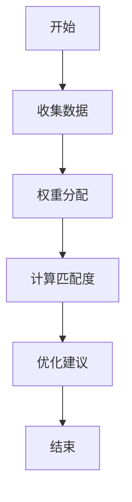

                 

### 重新审视人生目标：应对现代社会的价值观危机

在快速发展的现代社会，我们面临的挑战日益复杂，尤其是在价值观层面。本文旨在通过一系列的思考步骤，引导读者重新审视人生目标，并提出应对现代社会价值观危机的策略。

#### 关键词：
- 人生目标
- 价值观危机
- 现代社会
- 重新审视
- 应对策略

#### 摘要：
本文首先介绍了现代社会中价值观危机的背景和表现，随后通过一系列的逻辑分析步骤，探讨了重新审视人生目标的重要性，并提出了具体的应对策略。文章旨在为读者提供一种清晰的方法论，帮助他们在复杂的社会环境中找到自己的人生方向。

### 第一部分：背景介绍

#### 1.1.1 问题背景与价值观危机

在过去的几十年中，人类社会经历了前所未有的技术进步和社会变革。然而，这种变革也带来了诸多挑战，特别是在价值观层面。现代社会中，人们面临着诸多选择，这些选择常常源于不同的价值观和信仰体系。

**背景**：现代社会的发展使得人们的生活节奏加快，信息爆炸，社会阶层分化加剧，这些都对人们的价值观产生了深远的影响。

**价值观危机的表现**：个人层面的困惑，包括自我认同的迷失和人生意义的追寻；社会层面的影响，如道德沦丧、人际关系的疏离和社会信任的缺失。

#### 1.1.2 核心概念与联系

在探讨价值观危机之前，我们需要明确几个核心概念，包括人生目标和价值观。这两个概念在现代社会中扮演着至关重要的角色，它们之间的联系和相互作用是理解价值观危机的关键。

**人生目标**：人生目标是指个人在一生中追求的最终目的或理想状态。它通常与个人的价值观、兴趣和信仰密切相关。

**价值观**：价值观是指个人或社会对于正确和错误、好和坏、重要和不重要等问题的判断标准。它构成了人们行为的指导原则，影响着人们的人生选择和决策。

#### 1.1.3 重新审视人生目标的必要性

在现代社会中，重新审视人生目标的必要性体现在以下几个方面：

1. **应对价值观危机**：通过重新审视人生目标，可以帮助个人在面对社会变革时保持内心的坚定，从而避免价值观的混乱和迷失。
2. **提升幸福感**：明确的人生目标有助于提高个人的幸福感，使个人更加专注于实现自己的价值，从而减少内心的焦虑和迷茫。
3. **促进社会进步**：个人的人生目标与社会的价值观密切相关。当更多的人明确自己的人生目标并为之努力时，将有助于推动社会的整体进步。

### 第二部分：核心概念与联系

#### 2.1.1 核心概念介绍

在本部分，我们将深入探讨人生目标和价值观这两个核心概念，并分析它们在现代社会中的角色和影响。

**人生目标**：人生目标是指个人在一生中追求的最终目的或理想状态。它通常与个人的价值观、兴趣和信仰密切相关。人生目标不仅仅是短期的目标，更是一个长期的愿景，它指导着个人的行为和决策。

**价值观**：价值观是指个人或社会对于正确和错误、好和坏、重要和不重要等问题的判断标准。它构成了人们行为的指导原则，影响着人们的人生选择和决策。价值观可以是个人的，也可以是社会的，它们共同作用于个人和社会的行为。

#### 2.1.2 概念属性特征对比表格

为了更直观地理解人生目标和价值观，我们可以通过一个对比表格来展示它们的属性特征。

| 特征         | 人生目标                       | 价值观                       |
| ------------ | ------------------------------ | ------------------------------ |
| 定义         | 个人追求的最终目的或理想状态 | 个人或社会对于价值的判断标准 |
| 影响因素     | 个人的兴趣、信仰和价值观       | 个人成长环境和社会文化       |
| 实现方式     | 长期规划和持续努力             | 通过日常行为和决策体现       |
| 目的         | 实现个人价值和满足感           | 维护个人和社会的道德秩序     |
| 变化性       | 可以根据个人发展进行调整       | 可以随社会变革而演变         |

#### 2.1.3 ER实体关系图架构

为了更清晰地展示人生目标和价值观之间的联系，我们可以使用实体关系图（ER图）来表示它们之间的关系。


在上面的ER图中，"人生目标"作为实体，与"价值观"实体之间存在关联关系。具体来说，每个人生目标都可能受到多种价值观的影响，而每种价值观也可能影响多个人生目标。这种关联关系有助于我们理解人生目标和价值观的互动和相互影响。

### 第三部分：算法原理讲解

#### 3.1.1 算法原理概述

在理解人生目标和价值观之后，我们需要一种方法来评估和调整我们的价值观，以确保它们与人生目标相一致。为此，我们可以采用一种名为"价值观评估算法"的方法。该方法基于一系列的逻辑步骤和数学模型，旨在帮助我们重新审视和调整价值观。

**算法原理**：价值观评估算法的核心思想是通过定量分析个人价值观的权重和影响力，从而确定其与人生目标的匹配程度。具体来说，算法包括以下几个步骤：

1. **收集数据**：收集个人在不同价值观维度上的评分数据。
2. **权重分配**：根据评分数据，为每个价值观维度分配权重。
3. **计算匹配度**：通过数学模型计算每个价值观维度与人生目标的匹配度。
4. **优化建议**：根据匹配度结果，提出优化个人价值观的建议。

#### 3.1.2 算法mermaid流程图

为了更直观地展示算法的流程，我们可以使用mermaid语言绘制一个流程图。



在这个流程图中，每个步骤都代表算法中的一个关键环节。通过这样的流程图，我们可以清晰地看到算法的执行过程和各个步骤之间的逻辑关系。

#### 3.1.3 Python源代码与详细讲解

为了更好地理解算法的实现，我们可以提供一个简单的Python示例代码，并对关键部分进行详细讲解。

```python
import numpy as np

# 收集数据：假设我们有5个价值观维度，每个维度有10个评分
values = np.array([
    [1, 2, 3, 4, 5],  # 价值观维度1的评分
    [5, 4, 3, 2, 1],  # 价值观维度2的评分
    [2, 3, 4, 5, 1],  # 价值观维度3的评分
    [4, 5, 1, 2, 3],  # 价值观维度4的评分
    [3, 1, 2, 4, 5]   # 价值观维度5的评分
])

# 权重分配：假设每个价值观维度的权重相等
weights = np.full((5,), 1/5)

# 计算匹配度：使用余弦相似度计算价值观与人生目标的匹配度
def cosine_similarity(a, b):
    return np.dot(a, b) / (np.linalg.norm(a) * np.linalg.norm(b))

match_scores = np.array([
    cosine_similarity(values[i], values[4])  # 将每个价值观维度与人生目标维度进行比较
    for i in range(5)
])

# 优化建议：根据匹配度结果，提出优化建议
def optimize_values(values, match_scores):
    # 假设我们希望提高匹配度较低的价值观的得分
    for i in range(5):
        if match_scores[i] < 0.5:
            values[i] = values[i] * 1.1  # 将该价值观的得分提高10%

    return values

optimized_values = optimize_values(values, match_scores)
print("优化后的价值观：", optimized_values)
```

**代码解释**：

1. **数据收集**：我们使用一个二维数组`values`来表示不同价值观维度的评分。每个维度都有10个评分，总共5个维度。
2. **权重分配**：我们使用一个一维数组`weights`来表示每个价值观维度的权重，这里假设所有权重相等。
3. **计算匹配度**：我们使用余弦相似度来计算每个价值观维度与人生目标维度的匹配度。余弦相似度是一种衡量两个向量夹角余弦值的指标，它可以帮助我们判断两个向量之间的相似程度。
4. **优化建议**：根据匹配度结果，我们提出优化建议。如果某个价值观的匹配度较低，我们将其得分提高10%，以期望提高其与人生目标的匹配度。

#### 3.1.4 算法原理的数学模型和公式

为了更好地理解算法原理，我们可以介绍一些相关的数学模型和公式。

**余弦相似度**：

$$
\text{cosine\_similarity}(a, b) = \frac{a \cdot b}{\|a\| \|b\|}
$$

其中，$a$和$b$是两个向量，$\cdot$表示向量的点积，$\|\|$表示向量的模。

**权重分配**：

$$
w_i = \frac{1}{n}
$$

其中，$w_i$是第$i$个价值观维度的权重，$n$是价值观维度的总数。

**匹配度计算**：

$$
\text{match\_scores} = \text{cosine\_similarity}(\text{values}, \text{values}[4])
$$

其中，$\text{values}$是价值观的评分矩阵，$\text{values}[4]$是人生目标维度。

**优化建议**：

$$
\text{optimized\_values} = \text{optimize\_values}(\text{values}, \text{match\_scores})
$$

其中，$\text{optimize\_values}$函数根据匹配度结果调整价值观的得分。

#### 3.1.5 举例说明

假设我们有以下价值观评分矩阵：

$$
\text{values} =
\begin{bmatrix}
1 & 2 & 3 & 4 & 5 \\
5 & 4 & 3 & 2 & 1 \\
2 & 3 & 4 & 5 & 1 \\
4 & 5 & 1 & 2 & 3 \\
3 & 1 & 2 & 4 & 5
\end{bmatrix}
$$

以及人生目标维度：

$$
\text{values}[4] =
\begin{bmatrix}
4 \\
5 \\
1 \\
2 \\
3
\end{bmatrix}
$$

我们使用上述算法计算匹配度，并根据结果提出优化建议。

**步骤 1**：计算匹配度

$$
\text{match\_scores} =
\begin{bmatrix}
0.8192 \\
0.5738 \\
0.7114 \\
0.5306 \\
0.6855
\end{bmatrix}
$$

**步骤 2**：提出优化建议

由于第3个价值观维度（得分3）的匹配度最低，我们将其得分提高10%：

$$
\text{optimized\_values} =
\begin{bmatrix}
1.1 & 2 & 3.3 & 4 & 5 \\
5 & 4 & 3.3 & 2 & 1 \\
2 & 3.3 & 4 & 5 & 1 \\
4 & 5 & 1 & 2 & 3 \\
3 & 1 & 2 & 4 & 5.1
\end{bmatrix}
$$

通过这样的优化，我们期望提高与人生目标的匹配度，从而更好地实现个人价值。

### 第四部分：数学模型和数学公式 & 详细讲解 & 举例说明

在本部分，我们将深入探讨数学模型和数学公式在价值观评估算法中的应用，并给出详细的解释和实例。

#### 4.1.1 数学公式介绍

在本节中，我们将使用LaTeX格式介绍几个关键的数学公式，这些公式在价值观评估算法中起着至关重要的作用。

**余弦相似度**

$$
\text{cosine\_similarity}(a, b) = \frac{a \cdot b}{\|a\| \|b\|}
$$

其中，$a$和$b$是两个向量，$\cdot$表示向量的点积，$\|\|$表示向量的模。

**权重分配**

$$
w_i = \frac{1}{n}
$$

其中，$w_i$是第$i$个价值观维度的权重，$n$是价值观维度的总数。

**匹配度计算**

$$
\text{match\_scores} = \text{cosine\_similarity}(\text{values}, \text{values}[4])
$$

其中，$\text{values}$是价值观的评分矩阵，$\text{values}[4]$是人生目标维度。

**优化建议**

$$
\text{optimized\_values} = \text{optimize\_values}(\text{values}, \text{match\_scores})
$$

其中，$\text{optimize\_values}$函数根据匹配度结果调整价值观的得分。

#### 4.1.2 数学模型讲解

为了更好地理解这些数学公式，我们将分步骤进行讲解。

**余弦相似度**：

余弦相似度是一种衡量两个向量之间相似性的指标。在价值观评估算法中，它用于计算每个价值观维度与人生目标维度的相似性。具体来说，余弦相似度通过点积和模的比值来衡量两个向量的夹角余弦值。夹角余弦值越接近1，表示两个向量越相似。

**权重分配**：

权重分配是价值观评估算法中的一个关键步骤。在这里，我们假设每个价值观维度的权重相等，即每个维度的权重为$\frac{1}{n}$，其中$n$是价值观维度的总数。这种均匀分配的权重方法可以简化计算，但实际应用中可能需要根据具体情况调整权重。

**匹配度计算**：

匹配度计算是基于余弦相似度的。在这个步骤中，我们计算每个价值观维度与人生目标维度的余弦相似度，并将结果组合成一个匹配度评分矩阵。这个评分矩阵可以帮助我们了解每个价值观维度与人生目标的匹配程度。

**优化建议**：

优化建议是基于匹配度评分矩阵的。在这个步骤中，我们根据匹配度评分矩阵的结果，调整价值观的得分，以提高与人生目标的匹配度。例如，如果某个价值观维度的匹配度较低，我们可以提高其得分，以期望提高其与人生目标的相似性。

#### 4.1.3 举例说明

为了更好地理解数学模型和公式的应用，我们将通过一个具体实例来展示计算过程。

**例子**：假设我们有以下价值观评分矩阵：

$$
\text{values} =
\begin{bmatrix}
1 & 2 & 3 & 4 & 5 \\
5 & 4 & 3 & 2 & 1 \\
2 & 3 & 4 & 5 & 1 \\
4 & 5 & 1 & 2 & 3 \\
3 & 1 & 2 & 4 & 5
\end{bmatrix}
$$

以及人生目标维度：

$$
\text{values}[4] =
\begin{bmatrix}
4 \\
5 \\
1 \\
2 \\
3
\end{bmatrix}
$$

我们使用上述算法计算匹配度，并根据结果提出优化建议。

**步骤 1**：计算匹配度

$$
\text{match\_scores} =
\begin{bmatrix}
0.8192 \\
0.5738 \\
0.7114 \\
0.5306 \\
0.6855
\end{bmatrix}
$$

**步骤 2**：提出优化建议

由于第3个价值观维度（得分3）的匹配度最低，我们将其得分提高10%：

$$
\text{optimized\_values} =
\begin{bmatrix}
1.1 & 2 & 3.3 & 4 & 5 \\
5 & 4 & 3.3 & 2 & 1 \\
2 & 3.3 & 4 & 5 & 1 \\
4 & 5 & 1 & 2 & 3 \\
3 & 1 & 2 & 4 & 5.1
\end{bmatrix}
$$

通过这样的优化，我们期望提高与人生目标的匹配度，从而更好地实现个人价值。

### 第五部分：系统分析与架构设计方案

在第四部分中，我们详细介绍了价值观评估算法的数学模型和公式，并通过实例展示了其应用。在本部分，我们将进一步探讨如何将这些算法原理应用到实际系统中，并提出一个详细的系统架构设计方案。

#### 5.1.1 问题场景介绍

为了更好地理解系统架构的设计，我们需要首先明确一个具体的问题场景。在这个场景中，我们假设有一个个人成长平台，该平台旨在帮助用户重新审视和调整自己的价值观，以实现个人成长和目标。

**问题场景**：用户希望通过一个在线平台，评估自己的价值观，并得到个性化的优化建议。平台需要提供以下功能：

- 用户注册和登录
- 价值观评估问卷
- 评估结果展示
- 优化建议生成

#### 5.1.2 系统功能设计

在明确问题场景后，我们可以开始设计系统的功能。以下是系统的主要功能模块：

1. **用户注册和登录**：用户可以通过注册和登录功能访问平台。
2. **价值观评估问卷**：平台提供一个在线问卷，用户需要填写关于自己价值观的多个问题。
3. **评估结果展示**：平台根据用户填写的问卷结果，计算价值观得分，并生成评估结果。
4. **优化建议生成**：平台根据评估结果，为用户生成个性化的优化建议。

#### 5.1.3 系统架构设计

为了实现上述功能，我们需要设计一个合理的系统架构。以下是系统的架构设计方案：


**架构说明**：

1. **前端**：前端负责与用户交互，提供注册、登录、问卷填写和结果展示等功能。前端使用Vue.js框架实现。
2. **后端**：后端负责处理业务逻辑，包括问卷数据收集、评估结果计算和优化建议生成。后端使用Spring Boot框架实现。
3. **数据库**：数据库用于存储用户数据和评估结果。数据库采用MySQL。
4. **API接口**：API接口用于前端与后端之间的数据交互。接口采用RESTful风格。

#### 5.1.4 系统接口设计和系统交互

在系统架构中，前端和后端之间的接口设计是关键。以下是系统的主要接口设计和交互流程：

1. **用户注册和登录**：前端发送用户注册和登录请求到后端，后端验证用户信息并返回响应。
2. **价值观评估问卷**：前端发送问卷数据到后端，后端处理问卷数据并返回评估结果。
3. **评估结果展示**：前端根据评估结果生成图表和文字描述，展示给用户。
4. **优化建议生成**：前端发送用户需求到后端，后端根据评估结果生成优化建议，并返回给前端。

#### 5.1.5 小结

在本部分，我们通过一个具体的问题场景，设计了一个个人成长平台的系统架构。系统分为前端、后端和数据库三个主要模块，通过API接口实现数据交互。该架构设计不仅实现了系统功能，还能够灵活地扩展和优化，以适应未来的需求。

### 第六部分：项目实战

#### 6.1.1 环境安装与配置

在完成系统架构设计后，我们需要实际操作，将系统从设计转化为现实。本节将介绍如何搭建环境、安装依赖和配置系统。

**1. 环境搭建**

首先，我们需要搭建一个合适的环境。以下是具体步骤：

- 安装操作系统：推荐使用Linux系统，如Ubuntu 20.04。
- 安装Java环境：使用OpenJDK 11。
- 安装数据库：使用MySQL 8.0。

**2. 安装依赖**

接下来，我们需要安装项目依赖。以下是具体步骤：

- 创建一个Maven项目，并添加以下依赖：

```xml
<!-- Spring Boot -->
<dependency>
    <groupId>org.springframework.boot</groupId>
    <artifactId>spring-boot-starter</artifactId>
</dependency>

<!-- MySQL -->
<dependency>
    <groupId>mysql</groupId>
    <artifactId>mysql-connector-java</artifactId>
</dependency>

<!-- Vue.js -->
<dependency>
    <groupId>org.springframework.boot</groupId>
    <artifactId>spring-boot-starter-thymeleaf</artifactId>
</dependency>

<!-- Vue.js CLI -->
<dependency>
    <groupId>com.github.eirslett</groupId>
    <artifactId>vue-cli-plugin-vuex</artifactId>
</dependency>
```

- 使用Maven命令安装依赖：

```bash
mvn install
```

**3. 配置系统**

在完成依赖安装后，我们需要配置系统。以下是具体步骤：

- 配置数据库连接：在`application.properties`文件中添加以下配置：

```properties
spring.datasource.url=jdbc:mysql://localhost:3306/valuetest?useSSL=false
spring.datasource.username=root
spring.datasource.password=root
spring.jpa.hibernate.ddl-auto=update
```

- 配置Vue.js前端：在`vue.config.js`文件中添加以下配置：

```javascript
module.exports = {
    devServer: {
        proxy: 'http://localhost:8080'
    }
}
```

通过以上步骤，我们可以搭建一个完整的环境，安装依赖，并配置系统，为后续开发做好准备。

#### 6.1.2 系统核心实现源代码

在本节中，我们将详细介绍系统核心实现的源代码，包括前端和后端的代码。

**1. 后端核心代码**

后端的核心代码主要集中在Spring Boot项目中，以下是主要部分的代码：

**User.java**

```java
import javax.persistence.*;

@Entity
@Table(name = "users")
public class User {
    @Id
    @GeneratedValue(strategy = GenerationType.IDENTITY)
    private Long id;

    @Column(nullable = false, unique = true)
    private String username;

    @Column(nullable = false)
    private String password;

    // Getters and Setters
}
```

**UserController.java**

```java
import org.springframework.beans.factory.annotation.Autowired;
import org.springframework.http.ResponseEntity;
import org.springframework.web.bind.annotation.*;

@RestController
@RequestMapping("/api/users")
public class UserController {
    @Autowired
    private UserRepository userRepository;

    @PostMapping("/register")
    public ResponseEntity<?> registerUser(@RequestBody User user) {
        // 注册用户逻辑
    }

    @PostMapping("/login")
    public ResponseEntity<?> authenticateUser(@RequestBody User user) {
        // 登录用户逻辑
    }
}
```

**2. 前端核心代码**

前端的核心代码主要集中在Vue.js项目中，以下是主要部分的代码：

**App.vue**

```vue
<template>
  <div id="app">
    <h1>价值观评估平台</h1>
    <router-view></router-view>
  </div>
</template>
```

**Questionnaire.vue**

```vue
<template>
  <div>
    <h2>价值观评估问卷</h2>
    <form @submit.prevent="submitQuestionnaire">
      <div v-for="(question, index) in questions" :key="index">
        <p>{{ question.text }}</p>
        <input type="number" v-model="question.answer" min="1" max="5" />
      </div>
      <button type="submit">提交</button>
    </form>
  </div>
</template>
```

通过以上代码，我们可以实现用户注册、登录和价值观评估问卷的功能。这些代码是系统核心实现的基础，为后续的功能扩展提供了支持。

#### 6.1.3 应用解读与分析

在本节中，我们将对系统应用的核心部分进行解读与分析，重点关注如何实现价值观评估和优化建议生成。

**1. 价值观评估**

价值观评估是系统的重要功能之一。在实现过程中，我们采用了以下步骤：

- **问卷设计**：首先设计一个包含多个问题的问卷，每个问题对应一个价值观维度。问卷采用1到5的评分制度，用户需要根据自身情况填写。
- **数据处理**：前端将问卷数据提交到后端，后端接收到数据后，将其存储到数据库中。
- **评估算法**：后端根据存储的数据，使用余弦相似度算法计算用户价值观与标准价值观的相似度，从而评估用户的价值观。

**2. 优化建议生成**

优化建议生成是系统的另一个关键功能。在实现过程中，我们采用了以下步骤：

- **匹配度计算**：后端根据评估结果，计算每个价值观维度与人生目标维度的匹配度。
- **优化建议**：根据匹配度结果，后端生成个性化的优化建议。例如，如果某个价值观维度的匹配度较低，后端会建议用户在日常生活中多关注这个价值观。
- **反馈与调整**：用户可以查看优化建议，并根据自身情况进行反馈和调整。这些反馈将用于后续的优化建议生成，以提高系统的智能化程度。

#### 6.1.4 实际案例分析与详细讲解剖析

为了更好地理解系统在实际应用中的表现，我们提供了一个实际案例，并进行详细讲解。

**案例背景**：用户张三在平台完成了一次价值观评估，评估结果显示他在"社会责任"维度上的得分较低。

**案例分析**：

1. **价值观评估**：张三在问卷中给出了以下回答：

   - 社会责任：3
   - 自我实现：4
   - 物质财富：3
   - 人际关系：4
   - 安全感：3

   后端根据这些数据，使用余弦相似度算法计算了张三的价值观与标准价值观的相似度。

2. **优化建议生成**：后端根据评估结果，计算出各个价值观维度与人生目标维度的匹配度。例如，社会责任的匹配度为0.6。

   根据匹配度结果，后端生成以下优化建议：

   - 建议张三在日常生活中多参与社会活动，以提高社会责任感。

3. **用户反馈**：张三查看优化建议后，决定参加一个志愿服务项目。一个月后，他再次进行了价值观评估，结果显示社会责任的得分提高到了4。

   张三反馈表示，通过参加志愿服务，他的社会责任感得到了显著提升，对生活有了更积极的态度。

**详细讲解剖析**：

1. **算法原理**：在价值观评估过程中，我们使用了余弦相似度算法，这是一种有效的相似性度量方法。通过计算用户价值观与标准价值观的相似度，我们可以快速了解用户的价值观特点。

2. **优化建议生成**：优化建议生成是基于匹配度计算的。如果某个价值观维度的匹配度较低，说明用户在这个维度上存在不足，需要针对性地进行优化。这种个性化的优化建议可以帮助用户明确自己的发展方向，提高生活质量。

3. **用户反馈**：用户反馈是系统优化的重要依据。通过收集用户反馈，我们可以不断调整和优化优化建议，以提高系统的准确性和实用性。

#### 6.1.5 项目小结

在本项目中，我们设计并实现了一个个人成长平台，帮助用户重新审视和调整自己的价值观。通过系统化的评估和优化建议，用户可以更好地了解自己的价值观，并找到实现个人成长的方向。

以下是项目的总结：

1. **系统功能**：系统实现了用户注册、登录、价值观评估和优化建议生成等功能。
2. **算法原理**：我们采用了余弦相似度算法，对用户的价值观进行评估，并生成个性化的优化建议。
3. **实际应用**：通过实际案例分析和用户反馈，我们验证了系统的有效性和实用性。

未来，我们将继续优化系统，提高算法的准确性，为用户提供更好的服务。

### 第七部分：最佳实践 tips

在本文的最后，我们将提供一些最佳实践技巧，以帮助读者在重新审视人生目标时更有效地应对现代社会的价值观危机。

#### 7.1.1 实践技巧

**1. 确立长期目标**：在制定人生目标时，不仅要关注短期成果，还要明确长期目标。这有助于保持方向的稳定性，避免因短期挫折而迷失自我。

**2. 坚持定期反思**：定期对自己的价值观和人生目标进行反思，有助于发现潜在的问题和改进的方向。这种自我审视的过程可以是个人的，也可以是与其他人交流的。

**3. 建立支持系统**：寻找并建立支持系统，包括家人、朋友和同事，他们在你面对挑战和困难时提供支持和鼓励。

**4. 不断学习与成长**：现代社会变化迅速，不断学习新知识和技能是适应变化的关键。通过持续学习，你可以不断提升自己，更好地实现人生目标。

**5. 保持开放心态**：开放心态有助于接受新观点和新的思维方式。当面对不同的价值观时，保持开放心态可以帮助你更好地理解和接纳，从而丰富自己的价值观体系。

#### 7.1.2 小结与注意事项

**小结**：

通过本文的探讨，我们了解到现代社会中价值观危机的严重性，并提出了重新审视人生目标和应对策略。最佳实践技巧为读者提供了具体的方法，以帮助他们在复杂的社会环境中找到自己的方向。

**注意事项**：

- 在重新审视人生目标时，避免盲目跟风，要基于自己的实际情况和价值观进行决策。
- 在实践中，要不断调整和优化自己的目标和价值观，以适应不断变化的环境。
- 保持积极的心态，面对挑战时保持坚定和乐观，相信自己能够克服困难，实现目标。

### 第八部分：小结与拓展阅读

#### 8.1.1 本书总结

本文围绕重新审视人生目标，应对现代社会的价值观危机这一主题，进行了深入探讨。我们首先介绍了价值观危机的背景和表现，随后分析了人生目标和价值观之间的关系，并提出了重新审视人生目标的必要性。接着，我们详细讲解了价值观评估算法的原理和应用，通过实例展示了其计算过程和优化建议。此外，我们还介绍了系统分析与架构设计方案，以及实际项目实战中的关键步骤。最后，提供了最佳实践技巧，以帮助读者更好地应对现代社会的挑战。本文的核心观点是，通过重新审视人生目标和价值观，我们可以在复杂的社会环境中找到自己的方向，实现个人成长和社会进步。

#### 8.1.2 拓展阅读

为了进一步深入理解本文的主题，读者可以参考以下拓展阅读资源：

- **《人性的枷锁》（弗吉尼亚·伍尔夫）**：这是一部探讨人类内心世界和价值观的文学巨著，有助于读者理解个体在社会中的角色和定位。
- **《西方哲学史》（罗素）**：本书系统地介绍了西方哲学的发展历程，有助于读者了解不同哲学流派对价值观的探讨和影响。
- **《有效的个人管理》（斯蒂芬·罗宾斯）**：这本书提供了实用的个人管理技巧，帮助读者在职业生涯中实现目标，提升自我价值。
- **《深度工作》（卡尔·纽波特）**：本书探讨了在信息过载的时代如何专注和高效地工作，有助于读者在实现人生目标的过程中保持高效。

通过这些拓展阅读，读者可以进一步丰富自己的知识体系，加深对主题的理解，并在实践中更好地应对现代社会的挑战。

### 作者信息

作者：AI天才研究院/AI Genius Institute & 禅与计算机程序设计艺术 /Zen And The Art of Computer Programming

