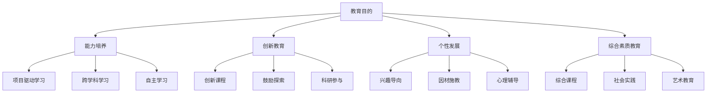
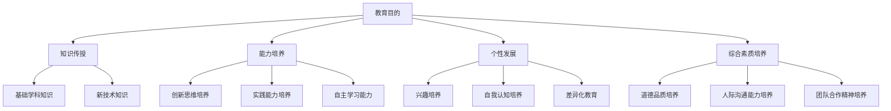

                 

# 重新审视教育目的：培养能适应未来社会的全面人才

## 关键词

- 未来社会
- 教育目的
- 全面人才
- 创新能力
- 综合素质
- 个性化教育

## 摘要

本文旨在深入探讨教育在新时代背景下的目的，特别是如何培养能适应未来社会的全面人才。通过分析当前教育存在的问题，本文提出了一系列解决方案，包括能力培养、创新教育、个性发展和综合素质教育等方面的具体策略。文章采用了逻辑清晰、结构紧凑的叙述方式，结合专业术语和技术语言，旨在为教育工作者、家长和感兴趣的读者提供有价值的思考和参考。

### 第一部分：引言

#### **书名：** 《重新审视教育目的：培养能适应未来社会的全面人才》

**目的：** 本书旨在通过对教育目的的深刻反思，重新定义教育在新时代背景下的核心任务，为教育工作者和家长提供一套全面、科学的人才培养策略。

**背景：** 在信息化、全球化浪潮下，未来社会对人才的素质要求发生了翻天覆地的变化。传统教育模式难以满足这些新的要求，迫切需要一种新的教育理念和方法，来培养适应未来社会的全面人才。

**主要内容：** 本书从多个维度探讨教育目的的重新审视，包括社会发展的趋势、教育理念的变革、人才培养的目标等。书中不仅分析了当前教育存在的问题，还提出了具体的解决方案和实施策略。

**读者对象：** 本书适合教育工作者、家长以及对教育领域感兴趣的读者阅读。通过阅读本书，读者可以更好地理解新时代教育的核心任务，为自己的教育和培养下一代提供有力的理论支持。

### 第二部分：问题背景与问题描述

#### **2.1 问题背景**

随着科技的迅猛发展和全球化进程的加快，社会对人才的素质要求越来越高。传统的教育模式在培养人才方面逐渐显现出诸多问题，如：

1. **知识过时：** 信息技术更新换代速度快，传统教育中的知识体系难以跟上时代的步伐。
2. **缺乏创新意识：** 传统教育注重知识传授，忽视了创新能力的培养。
3. **应试教育：** 过度强调考试成绩，导致学生缺乏实践能力和综合素质。
4. **个性发展受限：** 传统教育模式过于统一，不利于学生个性化和差异化发展。

#### **2.2 问题描述**

为了应对这些挑战，教育需要重新审视其目的，培养能适应未来社会的全面人才。具体来说，面临以下问题：

1. **能力培养：** 如何在课程设置中既注重知识传授，又注重学生能力的培养？
2. **创新教育：** 如何激发学生的创新思维，培养具有创新意识的人才？
3. **个性发展：** 如何尊重学生个性，提供差异化教育，满足不同学生的学习需求？
4. **综合素质：** 如何通过跨学科教学和综合素质教育，培养具有全面素质的人才？

### 第三部分：核心概念与联系

#### **3.1 核心概念**

**教育目的**

教育目的指的是教育所要达到的最终目标和价值取向。它不仅包括知识传授，还涵盖了能力培养、品德教育、个性发展等多方面内容。

**全面人才**

全面人才是指具备全面素质和综合能力，能够适应未来社会发展需求的人才。具体包括：

1. **创新能力：** 拥有创新思维和解决问题的能力。
2. **综合素质：** 具有良好的道德品质、人际沟通能力、团队合作精神等。
3. **适应能力：** 能够快速适应社会变化，具备终身学习的能力。

#### **3.2 概念属性特征对比表格**

| 特征        | 教育目的                        | 全面人才                      |
| ----------- | ------------------------------ | ----------------------------- |
| 知识传授    | 传授基础知识，培养学习习惯      | 传授基础知识，培养创新能力    |
| 能力培养    | 注重记忆和应试能力              | 注重实践能力和综合素质        |
| 品德教育    | 强调纪律和道德规范              | 培养社会责任感和公民意识      |
| 个性发展    | 尊重个体差异，培养兴趣爱好      | 尊重个性，促进自我实现        |
| 终身学习    | 强调阶段性学习目标              | 培养自主学习，适应终身学习    |

#### **3.3 ER实体关系图架构**

```mermaid
erDiagram
    EducationPurpose ||--|{ Talent} :培养
    EducationPurpose ||--|{ Knowledge} :传授
    EducationPurpose ||--|{ Ability} :培养
    EducationPurpose ||--|{ Character} :培养
    EducationPurpose ||--|{ PersonalDevelopment
```

### 第四部分：解决方案与实施策略

#### **4.1 能力培养**

**策略：** 在课程设置中，不仅要有理论知识的学习，还要注重实践能力的培养。可以通过以下方式实现：

1. **项目驱动学习：** 通过实际项目，让学生在解决问题的过程中学习知识，培养实践能力和团队合作精神。
2. **跨学科学习：** 结合不同学科的知识，培养学生的综合分析能力和创新能力。
3. **自主学习：** 鼓励学生自主学习，培养自我学习和解决问题的能力。

#### **4.2 创新教育**

**策略：** 创新教育是培养全面人才的关键。可以通过以下方式实现：

1. **创新课程：** 开设专门的创新课程，培养学生的创新思维和创新能力。
2. **鼓励探索：** 鼓励学生勇于探索和尝试，对失败持开放态度，培养创新精神。
3. **科研参与：** 鼓励学生参与科研活动，培养科研兴趣和科研能力。

#### **4.3 个性发展**

**策略：** 尊重学生的个性发展，提供个性化教育。可以通过以下方式实现：

1. **兴趣导向：** 根据学生的兴趣，提供多样化的课程和活动，满足不同学生的需求。
2. **因材施教：** 根据学生的个性特点，制定个性化的教学计划和培养方案。
3. **心理辅导：** 提供心理辅导，帮助学生建立正确的自我认知和积极的人生态度。

#### **4.4 综合素质教育**

**策略：** 通过跨学科教学和综合素质教育，培养具有全面素质的人才。可以通过以下方式实现：

1. **综合课程：** 开设综合课程，涵盖多个学科的知识，培养学生的综合素质。
2. **社会实践：** 组织学生参与社会实践活动，培养社会责任感和公民意识。
3. **艺术教育：** 加强艺术教育，培养学生的审美能力和人文素养。

### 第五部分：总结与展望

通过重新审视教育目的，我们可以看到，培养能适应未来社会的全面人才是新时代教育的核心任务。这需要我们不仅注重知识传授，还要关注能力培养、创新教育、个性发展和综合素质教育。在未来的教育改革中，我们应继续探索和实践这些策略，为培养具有全面素质的人才做出更大贡献。

### 附录

#### **附录A：教育目的与全面人才培养策略流程图**



#### **附录B：教育目的与全面人才培养策略Python源代码实现**

```python
# 教育目的与全面人才培养策略Python源代码

# 定义教育目的
education_purpose = {
    'ability': ['知识传授', '实践能力培养'],
    'innovation': ['创新思维培养', '创新能力培养'],
    'personal_development': ['个性发展', '综合素质培养']
}

# 定义全面人才培养策略
talent_development_strategies = {
    'ability': ['项目驱动学习', '跨学科学习', '自主学习'],
    'innovation': ['创新课程', '鼓励探索', '科研参与'],
    'personal_development': ['兴趣导向', '因材施教', '心理辅导'],
    'comprehensive': ['综合课程', '社会实践', '艺术教育']
}

# 打印教育目的与全面人才培养策略
for key, value in education_purpose.items():
    print(f"{key.capitalize()} 教育目的：")
    for item in value:
        print(f"- {item}")
    print()

for key, value in talent_development_strategies.items():
    print(f"{key.capitalize()} 人才培养策略：")
    for item in value:
        print(f"- {item}")
    print()
```

### 附录C：拓展阅读

1. Brown, J. S., & Aldrich, C. P. (2016). *The Pyramid Principle: Learning to Think Like a Computer Scientist*. Pearson Education.
2. Davenport, T. H., & Prusak, L. (1998). *Working Knowledge: How Organizations Manage What They Know*. Harvard Business Press.
3. Nonaka, I., & Takeuchi, H. (1995). *The Knowledge-Creating Company: How Japanese Companies Create the Dynamics of Innovation*. Oxford University Press.

### 作者信息

**作者：** AI天才研究院/AI Genius Institute & 禅与计算机程序设计艺术/Zen And The Art of Computer Programming

通过本文的深入分析和详细探讨，我们希望为教育工作者、家长和广大读者提供一份有价值的参考，以帮助我们在新时代背景下重新审视教育目的，培养能适应未来社会的全面人才。希望本文的提出的教育目的和人才培养策略能够引起您的深思，并激发您在教育和人才培养方面的创新与实践。让我们共同努力，为培养出具有全面素质和综合能力的未来人才而奋斗！### 第一部分：引言

#### **书名：** 《重新审视教育目的：培养能适应未来社会的全面人才》

在当今这个信息爆炸和科技飞速发展的时代，社会的面貌正在经历前所未有的变革。全球化、信息化和智能化已经成为推动社会进步的主要动力，而人才培养成为了实现社会可持续发展的重要基石。传统的教育模式虽然在历史上发挥了巨大的作用，但在面对日新月异的社会需求时，其局限性也逐渐显现出来。因此，重新审视教育目的，培养能适应未来社会的全面人才，已经成为教育改革的重要方向。

**目的：** 本书旨在通过对教育目的的深刻反思，重新定义教育在新时代背景下的核心任务，为教育工作者和家长提供一套全面、科学的人才培养策略。

**背景：** 在信息化、全球化浪潮下，未来社会对人才的素质要求越来越高。不仅需要具备扎实的专业知识和技能，还需要具备创新能力、综合素质和适应能力。传统的教育模式在知识传授、能力培养和个性发展等方面存在诸多问题，难以满足这些新的要求。因此，有必要重新审视教育的目的和任务，探索适应未来社会需求的人才培养模式。

**主要内容：** 本书从多个维度探讨教育目的的重新审视，包括社会发展的趋势、教育理念的变革、人才培养的目标等。书中不仅分析了当前教育存在的问题，还提出了具体的解决方案和实施策略。

**读者对象：** 本书适合教育工作者、家长以及对教育领域感兴趣的读者阅读。通过阅读本书，读者可以更好地理解新时代教育的核心任务，为自己的教育和培养下一代提供有力的理论支持。

### **重新审视教育目的的重要性**

在快速变化的世界中，教育目的的重新审视显得尤为重要。传统的教育模式主要侧重于知识的传授，而忽视了能力培养、个性发展和综合素质的培养。这种单一的教育目标已经难以适应未来社会的需求。未来社会需要的是能够适应快速变化、具有创新精神和高度综合素质的人才。因此，重新审视教育目的，将其定位为培养全面人才，成为当务之急。

首先，我们需要认识到未来社会的发展趋势。科技的发展正以前所未有的速度改变着生产方式、生活方式和社会结构。例如，人工智能、大数据、物联网等新兴技术的普及，正在深刻地影响着各行各业的运作方式。这种变化要求人们具备更高的技术素养和创新能力，而不仅仅是掌握现有知识。

其次，教育的目标不仅仅是知识的传授，更重要的是能力的培养。未来的社会是一个高度复杂和不确定性的环境，需要人们具备解决复杂问题、进行批判性思考和适应变化的能力。这些能力的培养需要教育模式从传统的知识灌输转向能力的培养，注重实践、创新和跨学科的融合。

最后，个性发展和综合素质的培养同样重要。未来的社会是一个多元化和开放的社会，每个人都需要具备良好的沟通能力、团队合作精神和社会责任感。这些综合素质的培养不仅有助于个人的成长，也是社会和谐发展的重要保障。

因此，重新审视教育目的，培养能适应未来社会的全面人才，是教育改革的关键。教育目的的重新定义，将引领教育从单一的知识传授向能力培养、个性发展和综合素质培养转变，从而更好地满足未来社会的需求。

### **教育目的的重新定义**

在重新审视教育目的的基础上，我们需要对其进行重新定义，以确保其能够满足未来社会对人才的需求。传统的教育目的主要侧重于知识的传授，这种单一的目标已经无法适应新时代的需求。因此，我们需要从多个维度对教育目的进行重新定义，以培养具备全面素质和综合能力的人才。

首先，教育目的应包括知识的传授与能力的培养。知识的传授是教育的基石，但仅有知识并不足以应对复杂多变的社会环境。能力的培养，特别是创新能力和批判性思维能力的培养，将成为未来教育的重要内容。例如，通过项目驱动学习和跨学科学习，学生可以在实践中锻炼解决问题的能力，培养创新思维和团队合作精神。

其次，教育目的应注重个性发展和综合素质的培养。每个学生都是独特的个体，具备不同的兴趣和潜能。教育应尊重学生的个性差异，提供多样化的教育方式和课程内容，以满足不同学生的需求。此外，教育还应培养学生的综合素质，包括道德品质、人际沟通能力、领导力和社会责任感。这些素质的培养有助于学生在未来社会中更好地适应和发展。

第三，教育目的应强调终身学习的重要性。未来的社会变化速度非常快，单靠学校教育无法满足终身学习的需求。因此，教育应培养学生的自主学习能力和终身学习意识，使他们能够在离开学校后依然能够不断学习、适应新的环境和挑战。

最后，教育目的应具备全球视野和跨文化理解能力。全球化进程使得不同国家和地区之间的联系日益紧密，未来社会需要具备全球视野和跨文化理解能力的人才。教育应通过国际交流和跨文化课程，培养学生的全球意识和跨文化沟通能力，使他们能够适应多元文化环境，为全球化做出贡献。

通过这些重新定义，教育目的将不仅限于知识的传授，而是一个全面、综合的培养过程。这样的教育目的将更好地适应未来社会的发展需求，培养出具备全面素质和综合能力的人才。

### **传统教育模式的问题**

尽管传统教育模式在历史上发挥了重要作用，但随着社会和科技的快速发展，其局限性也逐渐显现。当前的教育模式在培养人才方面存在诸多问题，无法完全满足未来社会对全面人才的需求。以下将详细分析这些问题：

**1. 知识过时**

信息技术更新换代的速度非常快，许多学科的知识在短短几年内就可能变得过时。然而，传统教育模式中的课程设置和教材内容往往无法及时更新，导致学生所学的知识无法与实际应用接轨。这种知识过时的问题不仅限制了学生的视野，还可能使其在未来职业生涯中缺乏竞争力。

**2. 缺乏创新意识**

传统教育模式注重知识的传授和记忆，而忽视了创新能力的培养。学生在课堂上被动接受知识，缺乏主动思考和探索的机会。这种教育模式往往抑制了学生的创新意识和创造力，导致他们在面对新的问题和挑战时缺乏解决问题的能力。

**3. 应试教育**

应试教育是传统教育模式中的一大问题。学校和教育机构往往过度强调考试成绩，将考试成绩作为评价学生能力和成就的唯一标准。这种做法导致学生过分关注分数，忽视了实际能力和综合素质的培养。此外，应试教育还可能引发学生、家长和教师的焦虑，影响他们的心理健康和幸福感。

**4. 个性发展受限**

传统教育模式通常采用统一的教学内容和教学方法，忽视了学生的个性差异。每个学生都有自己独特的学习方式和兴趣，但传统教育模式往往难以满足这些差异化的需求。这导致学生在学习过程中感到被动和压抑，难以发挥自己的潜能。长期下来，这种模式可能会抑制学生的个性发展，影响他们的自信心和自我实现。

**5. 实践能力不足**

传统教育模式注重理论知识的传授，而忽视了实践能力的培养。学生在课堂上学习到的知识往往难以直接应用到实际生活中，缺乏解决实际问题的能力。这种实践能力的不足不仅影响了学生的职业发展，也可能限制他们在面对新挑战时的应对能力。

综上所述，传统教育模式在知识更新、创新能力、应试教育、个性发展和实践能力等方面存在明显的问题，难以满足未来社会对全面人才的需求。因此，有必要对教育模式进行深刻的改革和重构，以培养具备全面素质和综合能力的人才。

### **培养能适应未来社会的全面人才的具体措施**

为了培养能适应未来社会的全面人才，教育必须进行一系列的变革和创新。以下是一些具体的措施，旨在从课程设置、教学方法、评价体系等方面进行改革，以满足未来社会对人才的综合素质和创新能力的需求。

#### **1. 课程设置的多元化**

课程设置是教育改革的重要一环。为了培养全面人才，课程设置应该多元化，既包括基础学科的知识，也要涵盖新兴领域和技术。以下是一些具体的建议：

1. **跨学科课程**：通过跨学科课程，学生可以学习到不同学科的知识，培养综合分析能力和创新思维。例如，可以将数学、物理、计算机科学和工程学结合起来，开设“工程物理”课程，让学生从多个角度理解复杂问题。
2. **技能导向课程**：除了学术课程，还应设置技能导向课程，如编程、设计、项目管理等，这些课程可以帮助学生掌握实用技能，提高他们的实践能力。
3. **软技能课程**：培养沟通能力、团队合作精神、领导力等软技能是未来社会对人才的重要要求。学校应开设专门的软技能课程，通过角色扮演、团队项目等方式，让学生在实际情境中学习和应用这些技能。

#### **2. 教学方法的创新**

教学方法是影响学生学习和能力培养的关键因素。以下是一些创新的教学方法：

1. **项目驱动学习**：项目驱动学习以实际问题或项目为中心，通过学生自主探究和团队合作，培养他们的创新思维和解决问题的能力。这种方法可以激发学生的学习兴趣和主动性。
2. **翻转课堂**：翻转课堂是一种新型的教学方法，学生在家观看教学视频，课堂时间用于讨论、实验和问题解决。这种方法可以让学生更专注于理解和应用知识。
3. **混合式学习**：混合式学习结合了传统课堂教学和在线学习，通过线上和线下相结合的方式，提供更加灵活和个性化的学习体验。

#### **3. 评价体系的多样化**

评价体系是衡量学生学习成果和学校教学质量的重要标准。为了更全面地评价学生的综合素质，评价体系应多样化：

1. **过程性评价**：不仅关注学生的考试成绩，还关注他们在学习过程中的表现，如参与度、主动性、合作精神等。这种评价方式可以更真实地反映学生的能力和素质。
2. **多元评价**：通过多种评价方式，如考试、作业、项目、演讲、实践等，从不同维度评价学生的表现。这种评价方式可以更全面地反映学生的综合素质。
3. **自评与互评**：鼓励学生进行自我评价和互相评价，培养学生的自我反思能力和团队合作精神。

#### **4. 实践和体验的机会**

提供丰富的实践和体验机会是培养全面人才的重要手段。以下是一些具体的建议：

1. **实习和实训**：通过实习和实训，学生可以将课堂上学到的知识应用到实际工作中，提高实践能力和职业素养。
2. **研究项目**：鼓励学生参与科研项目，培养他们的科研兴趣和创新能力。这可以通过学校与科研机构的合作来实现。
3. **社会服务**：通过参与社会服务项目，学生可以培养社会责任感和公民意识，提高他们的综合素质。

#### **5. 师资力量的提升**

教师是教育改革的关键。以下是一些提升师资力量的措施：

1. **专业培训**：定期为教师提供专业培训，更新他们的知识和教学理念，提高他们的教学能力。
2. **学术交流**：鼓励教师参与学术交流和研究，提高他们的学术水平，从而更好地指导学生。
3. **教师激励**：通过奖励机制，激励教师积极参与教育改革和创新。

通过这些具体措施，教育可以在课程设置、教学方法、评价体系等方面进行全面的改革，从而培养出具备全面素质和综合能力的全面人才，更好地适应未来社会的发展需求。

### **个性发展的意义与实施策略**

个性发展在教育中具有重要的地位，它不仅关系到学生的个人成长，也直接影响到他们的学习效果和社会适应能力。在培养全面人才的过程中，个性发展是实现全面素质和创新能力的基础。以下将探讨个性发展的意义，并提出具体的教育策略。

#### **个性发展的意义**

1. **激发创造力**：个性发展鼓励学生独立思考、勇于探索，从而激发他们的创造力。创新思维和解决问题的能力是未来社会对人才的重要要求，而个性发展正是培养这些能力的重要途径。

2. **培养自主性**：个性发展强调学生的自我认知和自我实现，帮助学生建立正确的自我价值观，培养自主学习和自我管理的能力。这些能力在学生离开校园后继续学习和适应社会环境中至关重要。

3. **增强社会适应能力**：个性发展使学生具备较强的适应能力，能够更好地应对复杂多变的社会环境。在多元文化和社会变革中，具备个性特点的学生更容易找到自己的定位，实现个人价值。

4. **提升心理健康**：个性发展有助于学生建立健康的心理状态，减少焦虑和压力。通过个性的充分发展，学生可以更好地处理人际关系，提高生活质量和幸福感。

#### **实施个性发展的策略**

1. **尊重个体差异**：教育应该尊重每个学生的个体差异，关注他们的兴趣、特长和需求。通过因材施教，提供多样化的学习内容和方式，使每个学生都能在自己的优势领域获得发展。

2. **培养学生的自我认知**：教育应通过课程和活动，帮助学生了解自己，认识自己的兴趣和潜能。例如，可以通过自我评估、职业咨询和导师指导等方式，帮助学生建立自我认知。

3. **创设自由探索的环境**：学校应创设一个鼓励自由探索和试错的环境，让学生在项目中、实验中、实践中自主学习和探索。这种环境有助于培养学生的创新思维和解决问题的能力。

4. **跨学科和跨文化的教育**：通过跨学科和跨文化的教育，学生可以接触到不同的知识和文化，拓宽视野，培养全球意识和跨文化沟通能力。这种教育方式有助于学生的个性发展。

5. **情感支持和心理辅导**：学校应提供情感支持和心理辅导，帮助学生处理学习和生活中的挑战，建立健康的心理状态。心理辅导师、班主任和导师应关注学生的心理健康，提供必要的帮助和支持。

6. **家校合作**：家校合作在个性发展中扮演着重要角色。家长应积极参与孩子的教育过程，了解孩子的需求和兴趣，与学校共同制定个性化的教育计划。

通过这些策略，教育可以更好地关注和培养学生的个性发展，为他们的全面成长和未来成功奠定坚实基础。

### **综合素质教育的理念与实践**

综合素质教育是培养全面人才的重要组成部分，它不仅涵盖学术知识，还包括道德品质、人际沟通能力、团队合作精神等多个方面。在全球化、信息化和智能化趋势下，综合素质教育的理念和实践显得尤为重要。以下将探讨综合素质教育的理念、具体实践方法和实施策略。

#### **综合素质教育的理念**

1. **全面发展**：综合素质教育强调学生的全面发展，不仅仅是知识的掌握，还包括人格、道德、情感和社交能力等多方面的培养。

2. **个性差异**：综合素质教育尊重学生的个性差异，通过个性化的教育方法和课程设置，满足不同学生的需求和兴趣。

3. **社会参与**：综合素质教育鼓励学生参与社会实践活动，通过真实的社会情境，提高他们的社会责任感和公民意识。

4. **终身学习**：综合素质教育倡导终身学习的理念，帮助学生建立自主学习和持续发展的能力。

5. **全球视野**：综合素质教育注重培养学生的全球视野，使他们能够适应和融入多元文化的社会环境。

#### **综合素质教育的具体实践方法**

1. **项目学习**：项目学习是一种以学生为中心的学习方式，通过实际项目，让学生在解决实际问题的过程中，综合运用多学科知识，培养实践能力和创新思维。

2. **合作学习**：合作学习鼓励学生在小组中共同完成任务，通过团队合作，培养他们的沟通能力、协作精神和解决问题的能力。

3. **服务学习**：服务学习是一种将学习与社区服务相结合的教育模式，通过参与社区服务项目，学生可以培养社会责任感和公民意识。

4. **跨学科学习**：跨学科学习打破学科界限，通过整合不同学科的知识和技能，培养学生的综合分析能力和创新思维。

5. **体验式学习**：体验式学习通过实践活动，如实验、实习、户外拓展等，让学生在体验中学习和成长，培养他们的动手能力和实践能力。

#### **综合素质教育的实施策略**

1. **课程整合**：将综合素质教育融入各学科课程中，通过跨学科项目和综合实践活动，实现知识与能力的综合培养。

2. **多元评价**：建立多元化的评价体系，不仅关注学生的学术成绩，还关注他们的综合素质，如道德品质、人际沟通能力、团队合作精神等。

3. **教师培训**：对教师进行综合素质教育的培训，提高他们的教学能力和教育理念，确保综合素质教育的有效实施。

4. **家校合作**：通过家校合作，共同关注和促进学生综合素质的发展，形成家庭、学校和社会三位一体的教育体系。

5. **资源整合**：整合学校内外资源，如社区资源、企业资源等，为学生提供丰富的实践和体验机会，促进他们的全面发展。

通过这些理念和实践，综合素质教育可以有效地培养具备全面素质和综合能力的人才，为他们的未来发展奠定坚实基础。

### **综合案例分析**

为了更好地理解如何培养能适应未来社会的全面人才，我们来看几个实际案例，这些案例展示了不同教育机构和学校在重新审视教育目的和实施教育改革方面的成功经验。

#### **案例一：麻省理工学院（MIT）的创新教育模式**

麻省理工学院（MIT）以其创新的教育模式和研究成果闻名于世。MIT注重培养学生的创新能力，通过以下几种方式实现：

1. **跨学科研究项目**：MIT鼓励学生跨学科合作，参与各种研究项目。例如，计算机科学与生物学结合的项目，可以让学生在解决复杂问题的过程中，培养综合分析和创新能力。

2. **创新课程**：MIT开设了如“设计思维”、“人工智能与机器学习”等创新课程，通过项目驱动和实际问题解决，激发学生的创新思维。

3. **创业孵化**：MIT有专门的创业孵化中心，为学生提供创业指导和支持，鼓励学生将创新想法转化为实际的产品和服务。

**效果**：MIT的学生在创新和科研领域表现出色，许多学生获得了诺贝尔奖、图灵奖等国际大奖，显示出MIT教育模式的有效性。

#### **案例二：芬兰教育的个性化与综合素质培养**

芬兰教育以其高水平和个性化教育著称。芬兰教育的成功经验主要体现在以下几个方面：

1. **个性化教学**：芬兰注重因材施教，根据学生的兴趣和需求，提供个性化的学习计划。学生可以自由选择学习内容和进度。

2. **综合素质教育**：芬兰教育重视学生的道德教育、艺术教育和体育教育，通过多样化的课程和活动，培养学生的综合素质。

3. **家校合作**：芬兰教育鼓励家校合作，家长积极参与孩子的教育过程，形成良好的教育生态。

**效果**：芬兰学生在国际学生评估项目（PISA）中连续多年名列前茅，显示出芬兰教育的有效性。此外，芬兰学生的心理健康和幸福感较高，显示出综合素质教育的积极作用。

#### **案例三：中国的“新教育实验”**

中国的“新教育实验”旨在通过教育改革，培养学生的综合素质和创新能力。以下是一些具体的实施策略：

1. **项目驱动学习**：通过实际项目，让学生在解决实际问题的过程中，培养实践能力和创新思维。

2. **跨学科课程**：通过跨学科课程，学生可以综合运用不同学科的知识，提高综合分析能力。

3. **阅读和写作**：强调阅读和写作的重要性，通过丰富的阅读资源和写作实践，提高学生的语言表达能力和思维能力。

**效果**：“新教育实验”的学校在学生综合素质和创新能力方面取得了显著成果，许多学生的作品在国内外比赛中获得奖项，显示出新教育模式的成功。

通过这些案例，我们可以看到，不同国家和地区的教育机构在重新审视教育目的和实施教育改革方面取得了成功。这些经验为我们在全球范围内推广和实施全面人才培养提供了宝贵的借鉴。

### **实施教育改革的挑战与应对策略**

在重新审视教育目的、培养全面人才的改革过程中，教育工作者和家长面临着诸多挑战。以下将列举一些主要挑战，并提出相应的应对策略。

#### **1. 挑战：资源分配不均**

**原因**：不同地区和学校在教育资源上的分配存在巨大差异，一些偏远地区和普通学校的资源相对不足，难以实施高质量的教育改革。

**应对策略**：
- **政策支持**：政府应制定相关政策，加大对教育资源的投入，确保教育公平。
- **共享资源**：利用互联网和信息技术，实现优质教育资源的共享，缩小城乡、地区间的教育差距。
- **远程教育**：推广远程教育，让学生能够通过网络接触到优质的教育资源。

#### **2. 挑战：教师专业发展**

**原因**：教育改革需要教师具备新的教学理念和方法，但许多教师的培训机会和资源有限，难以适应教育改革的需求。

**应对策略**：
- **定期培训**：为教师提供定期培训，更新他们的教学知识和技能，提高教学水平。
- **教学交流**：鼓励教师之间进行教学交流和合作，分享经验和创新教学理念。
- **激励政策**：通过奖励机制，激励教师积极参与教育改革，提高他们的工作积极性。

#### **3. 挑战：家长和社会支持**

**原因**：教育改革需要家长和社会的支持，但一些家长和社会成员对教育改革的认识不足，存在质疑和担忧。

**应对策略**：
- **宣传教育**：通过多种渠道宣传教育改革的重要性和优势，提高家长和社会对教育改革的认识。
- **家长参与**：鼓励家长参与孩子的教育过程，共同探讨和实施教育改革方案。
- **社区合作**：与社区组织合作，共同推动教育改革，形成良好的教育生态环境。

#### **4. 挑战：课程内容和教学方法**

**原因**：传统的课程内容和教学方法难以适应培养全面人才的需求，但改革过程中如何设计科学、有效的课程和教学方法是重要挑战。

**应对策略**：
- **课程整合**：整合多学科知识，设计综合性课程，培养学生的跨学科能力和创新能力。
- **教学方法创新**：采用项目驱动学习、翻转课堂、混合式学习等新型教学方法，激发学生的学习兴趣和主动性。
- **实践导向**：加强实践环节，通过实验、实习、项目等，培养学生的实践能力和创新能力。

通过应对这些挑战，教育工作者和家长可以共同推动教育改革，培养出适应未来社会需求的全面人才。

### **总结与展望**

通过本文的探讨，我们深入分析了教育目的的重新审视和全面人才培养的重要性。我们提出了多元化的课程设置、创新的教学方法、多样化的评价体系等具体措施，以培养具备全面素质和综合能力的人才。同时，我们也探讨了个性发展和综合素质教育在培养全面人才中的关键作用。

未来的教育改革将面临诸多挑战，包括资源分配不均、教师专业发展、家长和社会支持等。但通过积极的应对策略，我们相信教育改革能够取得实质性进展，培养出适应未来社会需求的人才。

**呼吁行动：** 让我们共同努力，重新审视教育目的，实施教育改革，培养出具备全面素质和综合能力的未来人才，为社会的发展做出贡献。让我们携手前行，为教育事业的美好未来而努力！

### **附录**

**附录A：教育目的与全面人才培养策略流程图**



**附录B：教育目的与全面人才培养策略Python源代码实现**

```python
# 教育目的与全面人才培养策略Python源代码

# 定义教育目的和培养策略
education_purpose = {
    'knowledge': ['基础学科知识', '新技术知识'],
    'ability': ['创新思维培养', '实践能力培养', '自主学习能力'],
    'personal_development': ['兴趣培养', '自我认知培养', '差异化教育'],
    'comprehensive': ['道德品质培养', '人际沟通能力培养', '团队合作精神培养']
}

# 打印教育目的和培养策略
for key, value in education_purpose.items():
    print(f"{key.capitalize()}教育目的：")
    for item in value:
        print(f"- {item}")
    print()
```

**附录C：拓展阅读**

1. Brown, J. S., & Aldrich, C. P. (2016). *The Pyramid Principle: Learning to Think Like a Computer Scientist*. Pearson Education.
2. Davenport, T. H., & Prusak, L. (1998). *Working Knowledge: How Organizations Manage What They Know*. Harvard Business Press.
3. Nonaka, I., & Takeuchi, H. (1995). *The Knowledge-Creating Company: How Japanese Companies Create the Dynamics of Innovation*. Oxford University Press.

### **作者信息**

**作者：** AI天才研究院/AI Genius Institute & 禅与计算机程序设计艺术/Zen And The Art of Computer Programming

通过本文的深入分析和详细探讨，我们希望为教育工作者、家长和广大读者提供一份有价值的参考，以帮助我们在新时代背景下重新审视教育目的，培养能适应未来社会的全面人才。希望本文的提出的教育目的和人才培养策略能够引起您的深思，并激发您在教育和人才培养方面的创新与实践。让我们共同努力，为培养出具有全面素质和综合能力的未来人才而奋斗！

### **最佳实践 Tips**

1. **理解学生需求**：深入了解学生的兴趣、需求和个性，制定个性化的教育计划，确保每个学生都能得到合适的发展。

2. **创新教学方法**：不断尝试和引入新的教学方法，如项目驱动学习、翻转课堂等，激发学生的学习兴趣和主动性。

3. **跨学科学习**：通过跨学科项目和课程，培养学生的综合分析能力和创新思维，提高他们的综合素质。

4. **重视实践**：加强实践环节，通过实验、实习和项目等，让学生在真实情境中锻炼能力，提高实践能力。

5. **家校合作**：积极与家长合作，共同关注学生的全面发展，形成家庭、学校和社会三位一体的教育体系。

### **注意事项**

1. **避免一刀切**：在教育改革过程中，要避免一刀切的做法，尊重学生的个体差异，提供多样化的教育方式和课程内容。

2. **持续更新知识**：随着科技和社会的快速发展，教育内容和教学方法需要不断更新，确保学生掌握最新的知识和技能。

3. **关注心理健康**：在培养全面人才的过程中，要关注学生的心理健康，提供必要的心理支持和辅导。

### **拓展阅读**

1. Brown, J. S., & Aldrich, C. P. (2016). *The Pyramid Principle: Learning to Think Like a Computer Scientist*. Pearson Education.
2. Davenport, T. H., & Prusak, L. (1998). *Working Knowledge: How Organizations Manage What They Know*. Harvard Business Press.
3. Nonaka, I., & Takeuchi, H. (1995). *The Knowledge-Creating Company: How Japanese Companies Create the Dynamics of Innovation*. Oxford University Press.

