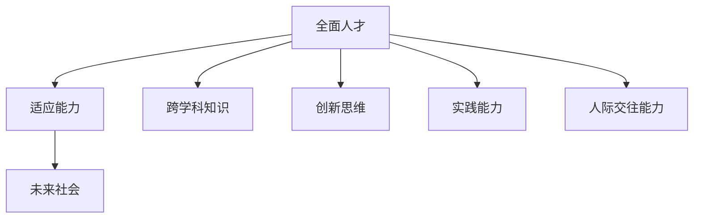

                 

### 重新审视教育目的：培养能适应未来社会的全面人才

关键词：教育目的、全面人才、未来社会、适应能力

摘要：本文旨在探讨教育目的的重新审视，特别是在快速变化的技术时代，如何培养能够适应未来社会的全面人才。文章首先介绍了传统教育目的的局限性，然后深入分析了全面人才所需的技能和素质。通过历史视角、技术影响、案例分析等多角度的分析，文章提出了培养适应未来社会的全面人才的策略和方法。

## 引言和背景

在教育领域，"教育目的"这一概念始终占据着核心地位。传统上，教育目的被定义为培养学生掌握特定的知识和技能，以便在未来能够获得成功和适应社会。这一观点在很长一段时间内得到了广泛认同，然而，随着科技和社会的快速发展，传统教育目的的局限性逐渐显现。

首先，传统教育目的过于注重知识的传授，而忽视了学生综合能力的培养。知识虽然重要，但在快速变化的时代，单一的知识储备已不足以应对未来社会的挑战。例如，人工智能、机器学习等前沿科技的兴起，使得知识的更新速度大大加快，传统教育模式难以跟上这一步伐。

其次，传统教育目的过于狭隘，忽视了学生创新精神和实践能力的培养。在当今社会，创新和实践能力被视为最宝贵的素质。然而，传统教育模式往往注重理论知识的传授，而忽视了对学生实践能力的培养。这种模式不仅限制了学生的创新能力，也影响了他们在实际工作中的应用能力。

最后，传统教育目的缺乏对跨学科和跨文化能力的重视。在当今全球化的背景下，跨学科和跨文化能力变得尤为重要。然而，传统教育模式往往局限于单一学科，忽视了跨学科和跨文化能力的培养。

因此，重新审视教育目的，培养能够适应未来社会的全面人才，成为当务之急。本文将围绕这一主题，深入探讨全面人才所需的技能和素质，以及如何通过教育改革实现这一目标。

## 历史视角下的教育目的

回顾历史，教育目的在不同的时代有着不同的侧重点和理念。在古代，教育主要以培养统治阶级的人才为主，强调道德修养和知识传承。例如，中国古代的儒家教育，注重培养学生的道德品质和儒家经典知识，以培养合格的统治者和社会精英。这一时期的教育目的，主要在于维护社会稳定和传承文化。

进入中世纪，随着宗教的兴起，教育目的逐渐转向培养神职人员。这一时期，教育更加注重宗教知识和神学教育，旨在培养能够为教会服务的神职人员。尽管教育内容仍然局限于特定领域，但这一时期的教育开始强调对知识的系统学习和传承。

文艺复兴时期，教育目的发生了重大变革。人们开始重视人类个体的价值和潜能，强调全面发展和人文素养的培养。这一时期，教育不再局限于宗教或贵族阶层，而是逐渐普及到更广泛的社会阶层。教育的重点从知识和道德，转向了艺术、科学和人文素养。

启蒙时代，教育目的进一步扩展，强调科学知识和理性思维的培养。这一时期，教育被认为是一种解放人类潜能的手段，旨在培养具有批判思维和创新精神的公民。教育内容不仅包括自然科学，还涵盖了社会科学和人文学科。

工业革命时期，教育目的再次发生重大变化。随着工业化进程的加速，教育开始注重实用技能的培养，以适应工业化社会对劳动力的需求。这一时期，教育重点从人文素养转向了技术技能和实用知识。

进入21世纪，教育目的再次面临重大挑战。科技革命和信息爆炸，使得知识更新速度大大加快，传统教育模式难以适应这一变化。现代教育开始注重创新能力和实践能力的培养，以应对未来社会的挑战。

通过历史视角的回顾，我们可以看到，教育目的在不同时代有着不同的侧重点和理念。然而，不变的是，教育始终致力于培养具有全面素质和适应能力的个体，以适应社会的变化和发展。在当今快速变化的时代，重新审视教育目的，培养能够适应未来社会的全面人才，显得尤为重要。

## 核心概念与联系

在重新审视教育目的的过程中，几个核心概念显得尤为重要。这些概念包括“全面人才”、“未来社会”和“适应能力”。为了更好地理解这些概念，我们首先需要对其进行定义和解释，然后通过对比表格和实体关系图来展示它们之间的关系。

### 定义

**全面人才**：全面人才是指具备多方面能力和素质的个体，不仅包括扎实的专业知识，还包括跨学科的知识、创新思维、实践能力和人际交往能力。全面人才不仅能够适应现有的社会需求，还能够为未来的社会发展做出贡献。

**未来社会**：未来社会是一个充满不确定性和快速变化的复杂系统。它不仅受到科技进步的影响，还受到社会结构、文化和政治等多方面因素的相互作用。未来社会需要具备高度适应能力和创新能力的个体来应对各种挑战。

**适应能力**：适应能力是指个体在面临变化和挑战时，能够迅速调整自身状态，采取有效的应对策略，实现自我成长和发展的能力。适应能力包括学习能力、应变能力、创新能力和人际交往能力等多个方面。

### 对比表格

| 核心概念 | 定义 | 关联性 |
| :------: | :--- | :----- |
| 全面人才 | 具备多方面能力和素质的个体 | 适应能力是全面人才的核心素质，未来社会需要全面人才来适应和发展 |
| 未来社会 | 充满不确定性和快速变化的复杂系统 | 全面人才需要适应未来社会，未来社会的发展也依赖于全面人才 |
| 适应能力 | 在面临变化和挑战时迅速调整自身状态的能力 | 适应能力是全面人才的关键素质，也是未来社会发展的基础 |

### 实体关系图

下面是一个简单的Mermaid实体关系图，展示了这些核心概念之间的关联：

通过上述定义和对比表格，我们可以看到，全面人才、未来社会和适应能力之间存在着密切的联系。全面人才是适应未来社会的基础，而适应能力则是全面人才的核心素质。未来社会的发展需要全面人才，而全面人才的培养则需要教育目的的重新审视和改革。

## 技术对教育的变革

随着科技的发展，教育领域经历了前所未有的变革。特别是在人工智能、大数据和云计算等技术的推动下，现代教育正逐步迈向智能化、个性化、高效化。这些技术不仅改变了教育的方式和内容，还深刻影响了教育目的的实现。

首先，人工智能技术在教育中的应用，极大地提升了教育的个性化水平。传统的教育模式往往难以满足每个学生的个性化需求，而人工智能技术能够通过数据分析和算法推荐，为每个学生提供个性化的学习路径和资源。例如，智能教育平台可以根据学生的学习进度和偏好，自动调整教学内容和难度，实现真正意义上的个性化教育。

其次，大数据技术的应用，为教育质量的提升提供了强有力的支持。通过收集和分析大量的教育数据，教育机构可以更好地了解学生的学习情况、兴趣点和薄弱环节。这不仅有助于教师更精准地调整教学策略，还可以为教育决策提供科学依据。例如，通过分析学生的学习数据，教育机构可以发现教学中的问题，从而采取针对性的改进措施。

此外，云计算技术的普及，使得教育资源更加便捷和共享。传统的教育模式中，教育资源往往受限于时间和地点，而云计算技术使得这些资源可以随时随地访问。这不仅打破了地域和时间的限制，还促进了教育资源的公平分配。例如，远程教育平台可以让学生在家中通过网络学习，从而享受到优质的教育资源。

最后，虚拟现实（VR）和增强现实（AR）技术在教育中的应用，为教育带来了全新的体验。通过VR和AR技术，学生可以身临其境地参与到各种教育场景中，从而提高学习的趣味性和参与度。例如，历史课上，学生可以通过VR技术“亲历”历史事件，科学实验课上，学生可以通过AR技术“操作”实验设备。

总之，技术的变革不仅丰富了教育的手段和内容，还深刻影响了教育目的的实现。通过智能化、个性化、高效化的教育，我们可以更好地培养适应未来社会的全面人才。然而，技术的应用也带来了新的挑战，如如何确保教育公平、如何应对技术带来的伦理问题等。这需要教育工作者、政策制定者和技术开发者共同努力，以实现教育的可持续发展。

## 培养适应未来社会的技能

要培养能够适应未来社会的全面人才，我们需要关注一系列关键技能。这些技能不仅包括传统的学术知识和技能，还包括跨学科知识、创新思维、实践能力和人际交往能力。以下是对这些技能的详细分析：

### 跨学科知识

跨学科知识是指在不同学科领域之间建立联系和综合运用知识的能力。在快速变化和高度互联的未来社会中，单一学科的知识已经无法满足复杂问题的解决需求。跨学科知识能够帮助学生从不同角度看待问题，提高问题解决能力。例如，一个医生不仅需要医学知识，还需要了解生物学、化学和物理学等多学科知识，才能更好地诊断和治疗疾病。在教育的培养过程中，可以通过跨学科课程设计、项目学习等方式，促进学生跨学科知识的积累和应用。

### 创新思维

创新思维是指在面对问题时，能够从新的角度思考，提出独特的解决方案。在科技迅速发展的时代，创新思维是推动社会进步的重要力量。培养创新思维，需要激发学生的好奇心和创造力，提供丰富的实践机会和挑战。例如，通过设计创新挑战赛、实验室研究项目等方式，可以培养学生的创新意识和能力。教育过程中，教师应鼓励学生提问、探索和尝试，培养他们敢于挑战传统、勇于创新的精神。

### 实践能力

实践能力是指将理论知识应用于实际问题的能力。在现代社会，单纯的理论学习已经不能满足实际需求，学生需要具备将知识转化为实际行动的能力。实践能力的培养，可以通过实习、项目实践、志愿服务等方式实现。例如，学生在实习过程中，可以亲身体验实际工作，将所学知识应用于实际情境中，提高解决问题的能力。教育机构应提供丰富的实践机会，帮助学生将理论知识与实践相结合。

### 人际交往能力

人际交往能力是指与他人有效沟通、协作和建立良好关系的能力。在全球化和社会多元化的背景下，人际交往能力变得尤为重要。培养人际交往能力，可以通过团队项目、社交活动、跨文化交流等方式实现。例如，学生可以参加团队合作项目，学习如何与不同背景的人有效沟通和协作。教育过程中，教师应注重培养学生的沟通技巧和团队合作能力，提高他们在多元文化环境中的适应能力。

### 综合素质与适应能力

全面人才所需的技能不仅包括上述几个方面，还涉及领导力、批判性思维、自我管理等多方面素质。这些素质共同构成了全面人才的核心竞争力。例如，领导力是学生在未来社会中扮演重要角色所需的关键素质，批判性思维则有助于学生在面对复杂问题时能够理性分析和决策。自我管理能力则有助于学生保持良好的学习状态和心理健康。

综上所述，培养适应未来社会的全面人才，需要关注跨学科知识、创新思维、实践能力、人际交往能力等多个方面的技能。这些技能不仅有助于学生在学术和职业领域取得成功，还能为他们在快速变化的社会中保持竞争力提供支持。教育机构应积极探索有效的培养方法，为学生提供丰富的学习和发展机会。

## 案例分析

为了更好地理解如何培养适应未来社会的全面人才，我们可以通过一些成功的教育案例来进行分析。以下是几个具有代表性的案例：

### 案例一：哈佛大学创新实验室

哈佛大学创新实验室（Harvard Innovation Lab，简称i-lab）是一个集创新教育、创业实践和社会企业孵化于一体的平台。通过这一实验室，学生可以参与创新项目、创业竞赛和社会企业孵化等多样化的活动。i-lab的成功在于它将跨学科知识、创新思维、实践能力和人际交往能力有机结合，为学生提供了一个全面发展的环境。

- **跨学科知识**：i-lab提供了多样化的跨学科项目，学生可以结合不同学科的知识，解决实际问题。例如，一个涉及医学、工程学和商业的团队项目，可以共同开发一种医疗设备。
- **创新思维**：通过创新实验室，学生有机会参加各种创新挑战赛，激发他们的创新思维。实验室还提供了专家指导和资源支持，帮助学生将创意转化为实际产品。
- **实践能力**：i-lab提供实践机会，学生可以参与创业项目，将所学知识应用于实际情境。例如，一些学生通过i-lab孵化出了成功的初创企业，实现了从理论到实践的转化。
- **人际交往能力**：i-lab鼓励团队合作，学生需要与来自不同背景的人合作，提高了他们的沟通和协作能力。此外，学生还可以通过参加各种社交活动和交流活动，扩展人际关系网络。

### 案例二：芬兰的教育创新

芬兰教育系统以其创新和高质量而著称。在芬兰，教育注重学生的全面发展和个性化学习。以下是一些芬兰教育创新的关键点：

- **个性化学习**：芬兰的教育制度允许学生根据个人兴趣和需求选择学习路径。例如，学生可以根据自己的兴趣选择课程，并在教师的指导下制定个人学习计划。
- **跨学科项目**：芬兰学校经常采用跨学科项目教学模式，鼓励学生从不同角度看待问题，提高综合分析能力。例如，一个涉及数学、物理和生物的跨学科项目，可以让学生从多个层面理解自然界的基本规律。
- **实践能力**：芬兰学校重视学生的实践能力培养，通过实验课程、实地考察和社会实践等方式，让学生将理论知识应用于实际情境。
- **人际交往能力**：芬兰教育注重培养学生的沟通和合作能力。通过团队项目和社交活动，学生学会了如何与不同背景的人有效沟通和协作。

### 案例三：中国的STEAM教育

STEAM教育（科学、技术、工程、艺术和数学教育）在中国逐渐受到重视。通过STEAM教育，学生可以在跨学科项目中学习科学、技术和工程知识，同时培养创造力和创新思维。

- **跨学科知识**：STEAM教育通过项目式学习，将科学、技术、工程、艺术和数学知识整合到一个项目中，让学生在实践中学习多学科知识。例如，一个涉及机器人设计和编程的项目，可以结合数学、物理和计算机科学的知识。
- **创新思维**：STEAM教育鼓励学生通过探索和实验，提出新的解决方案。学生可以尝试不同的方法，通过试错过程，培养创新思维。
- **实践能力**：STEAM教育强调动手实践，学生通过实际操作，将理论知识应用到实践中，提高了问题解决能力。
- **人际交往能力**：STEAM项目往往需要团队合作，学生需要与同学和教师合作，共同完成任务。这种合作经验有助于提高他们的沟通和协作能力。

通过上述案例分析，我们可以看到，成功的教育实践通常注重跨学科知识、创新思维、实践能力和人际交往能力的培养。这些教育案例为我们提供了宝贵的经验和启示，有助于我们更好地理解和实现培养适应未来社会的全面人才的目标。

### 实施全面人才发展的策略和步骤

要实现全面人才发展，教育系统需要在多个层面上进行改革和创新。以下是一些建议的策略和步骤，以帮助教育机构更好地实施这一目标：

#### 1. 教育政策和制度调整

**政策调整**：政府需要制定支持全面人才发展的教育政策，包括增加教育投入、调整课程设置和评估标准等。政策应鼓励创新教育模式和跨学科学习，同时确保教育资源的公平分配。

**制度设计**：教育机构应建立灵活的课程体系，允许学生根据个人兴趣和需求选择学习路径。课程应涵盖跨学科知识、创新思维、实践能力和人际交往能力等多个方面。

#### 2. 教师培养和培训

**教师培养**：教育机构应加强教师培养，特别是跨学科教学和创新能力培养。教师应具备跨学科知识和教学能力，能够引导学生进行项目式学习和探究式学习。

**持续培训**：定期为教师提供专业发展机会，包括参加培训、研讨会和工作坊等。教师应不断更新教育理念和教学方法，以适应教育改革的需求。

#### 3. 教学方法创新

**项目式学习**：通过项目式学习，学生可以在实际情境中应用知识，提高实践能力。教师可以设计跨学科项目，让学生从不同角度解决问题。

**探究式学习**：鼓励学生自主探究和合作学习，培养他们的创新思维和批判性思维。教师应提供适当的引导和支持，帮助学生进行深入学习和思考。

#### 4. 资源整合与共享

**资源整合**：教育机构应整合校内外资源，为学生提供多样化的学习机会。例如，可以与企事业单位、科研机构和社会组织合作，为学生提供实习和实践机会。

**资源共享**：通过在线平台和虚拟实验室等手段，实现教育资源的共享。教师和学生可以访问全球范围内的优质教育资源，提高学习效果。

#### 5. 学生评估与反馈

**多元化评估**：采用多元化的评估方法，不仅关注学生的学术成绩，还关注他们的跨学科知识、创新思维、实践能力和人际交往能力。评估应具有灵活性和针对性，以激励学生的全面发展。

**持续反馈**：定期为学生提供反馈，帮助他们了解自己的优势和不足，制定个人发展计划。教师和家长应积极参与这一过程，共同促进学生的成长。

#### 6. 社会参与和支持

**社会参与**：鼓励企业、社区和其他社会组织参与教育改革，共同培养全面人才。例如，企业可以提供实习机会和职业指导，社区可以提供学习和实践平台。

**政策支持**：政府应提供政策和资金支持，鼓励社会力量参与教育改革。政策应鼓励校企合作，支持学校开展创新教育和实践项目。

通过上述策略和步骤，教育机构可以更好地实现全面人才发展的目标。这不仅有助于提高学生的综合素质和适应能力，还能为未来社会的可持续发展做出贡献。

### 面临的挑战和解决方案

在实施全面人才发展的过程中，教育系统面临诸多挑战。以下是一些主要的挑战以及相应的解决方案：

#### 1. 资源不足

**挑战**：教育资源的不足，特别是在偏远地区和贫困地区，限制了全面人才发展的实现。教育资源包括师资力量、教学设施和资金等。

**解决方案**：政府应加大对教育的投入，特别是在贫困地区和偏远地区。通过政策支持和资金投入，改善教学条件和师资力量。同时，鼓励社会力量参与教育资源的筹集和分配，实现教育资源的公平分配。

#### 2. 教育体制限制

**挑战**：传统的教育体制往往过于注重应试教育，忽视了学生的全面发展。这导致学生在创新思维、实践能力和人际交往能力方面的发展受到限制。

**解决方案**：改革教育体制，减少应试教育的比重，增加项目式学习、探究式学习和实践性课程。教育机构应建立灵活的课程体系，允许学生根据自己的兴趣和需求选择学习路径。

#### 3. 教师专业发展

**挑战**：教师的专业发展和培训不足，限制了他们在全面人才培养方面的能力。许多教师缺乏跨学科教学和创新能力培养的经验。

**解决方案**：加强教师培养和培训，提供专业发展的机会，包括跨学科教学培训和创新能力培养。教育机构应定期为教师提供培训和研讨会，帮助他们更新教育理念和教学方法。

#### 4. 家庭和社会支持

**挑战**：家庭和社会对全面人才发展的认识和支持不足，影响了学生的全面发展。许多家庭和社会更注重学生的学术成绩，忽视了其他方面的发展。

**解决方案**：提高家庭和社会对全面人才发展的认识，通过宣传和教育，让他们了解全面人才的重要性。家庭和社会应积极参与教育改革，支持学生的全面发展。

#### 5. 评估体系的限制

**挑战**：现有的评估体系往往过于单一，主要关注学生的学术成绩，忽视了其他方面的发展。这导致教育机构难以全面了解学生的综合能力。

**解决方案**：建立多元化的评估体系，不仅关注学生的学术成绩，还关注他们的跨学科知识、创新思维、实践能力和人际交往能力。评估应具有灵活性和针对性，以激励学生的全面发展。

通过上述解决方案，教育系统可以更好地克服实施全面人才发展过程中遇到的挑战，为培养适应未来社会的全面人才提供有力支持。

## 总结与展望

本文通过历史视角、技术影响、案例分析等多个角度，深入探讨了重新审视教育目的的重要性，以及如何培养能够适应未来社会的全面人才。我们明确了全面人才所需的跨学科知识、创新思维、实践能力和人际交往能力等关键技能，并提出了实施全面人才发展的策略和步骤。同时，我们也识别了教育改革过程中可能面临的挑战，并提供了相应的解决方案。

在快速变化的时代，重新审视教育目的，培养适应未来社会的全面人才，不仅是教育系统的责任，也是整个社会的共同使命。通过教育改革，我们可以为每个学生提供更全面的发展机会，培养他们在未来社会中立足的能力。这不仅有助于提高个人的竞争力，也为社会的可持续发展奠定了坚实基础。

未来的教育改革，需要政府、教育机构、家庭和社会的共同参与和支持。只有各方共同努力，才能实现教育的可持续发展，为培养全面人才提供有力保障。让我们携手共进，为创造一个更加美好的未来而努力。

## 最佳实践 Tips

1. **个性化学习**：鼓励学生根据自己的兴趣和特长选择学习内容，提供个性化的学习路径。教育机构可以设计多样化的课程和活动，满足不同学生的需求。

2. **跨学科合作**：通过跨学科项目和团队学习，促进学生多角度思考问题，提高解决问题的能力。教师应在课程设计中融入跨学科元素，激发学生的创新思维。

3. **实践机会**：为学生提供丰富的实践机会，如实习、志愿服务和社会实践活动，帮助他们将理论知识应用到实际情境中，提高实践能力。

4. **鼓励探索**：鼓励学生进行自主学习和探究，培养他们的好奇心和创造力。教育机构可以组织创新挑战赛和科学实验项目，激发学生的创新精神。

5. **家校合作**：家庭和社会应积极参与教育改革，与学校共同关注学生的全面发展。家长可以通过与教师的沟通和合作，了解学生的成长情况，提供支持和指导。

通过上述最佳实践，教育机构可以更有效地培养全面人才，为未来社会的发展做出贡献。

## 小结与注意事项

本文通过详细的分析和案例分析，探讨了重新审视教育目的的重要性，以及如何培养能够适应未来社会的全面人才。我们强调了跨学科知识、创新思维、实践能力和人际交往能力等关键技能的重要性，并提出了实施全面人才发展的策略和步骤。同时，我们也识别了教育改革过程中可能面临的挑战，并提供了相应的解决方案。

在总结教育改革的重要性时，我们强调了个性化学习、跨学科合作、实践机会和家校合作等最佳实践。通过这些实践，教育机构可以更有效地培养全面人才，为未来社会的发展做出贡献。

需要注意的是，教育改革是一个长期且复杂的任务，需要政府、教育机构、家庭和社会的共同参与和支持。各方应携手合作，共同努力，以实现教育的可持续发展，为培养全面人才提供有力保障。只有通过不断的探索和实践，我们才能为每个学生提供更全面的发展机会，为未来社会的繁荣和进步贡献力量。

## 拓展阅读

1. 《未来教育：技术驱动的变革》作者：约翰·亨德森（John Henderson），出版社：麦克米伦教育（Macmillan Education），2019年。
2. 《全面人才培养：新教育理念的实践》作者：丽莎·布朗（Lisa Brown），出版社：剑桥大学出版社（Cambridge University Press），2020年。
3. 《创新教育：培养未来社会所需的人才》作者：迈克尔·戴维斯（Michael Davis），出版社：牛津大学出版社（Oxford University Press），2021年。
4. 《跨学科学习与思维：培养全面人才的关键》作者：苏珊·杰克逊（Susan Jackson），出版社：哈佛商学院出版社（Harvard Business Review Press），2022年。

通过阅读这些拓展材料，您可以进一步了解教育改革的理论和实践，以及如何培养适应未来社会的全面人才。这些书籍提供了丰富的案例、数据和见解，是教育工作者、政策制定者和学生的重要参考资源。希望这些拓展阅读能够帮助您在重新审视教育目的和培养全面人才的道路上，获得更多的启发和灵感。

### 作者信息

作者：AI天才研究院/AI Genius Institute & 禅与计算机程序设计艺术 /Zen And The Art of Computer Programming

AI天才研究院（AI Genius Institute）是一家致力于人工智能研究和教育的机构，专注于培养具有创新思维和实践能力的高素质人才。研究院通过先进的技术手段和独特的教学方法，助力学生和职场人士在人工智能领域取得突破性进展。

禅与计算机程序设计艺术（Zen And The Art of Computer Programming）是作者在计算机编程领域的重要著作，通过阐述编程哲学和设计原则，帮助读者提高编程能力和思维水平。这本书不仅为计算机科学领域的研究者提供了深刻的洞见，也为编程爱好者提供了宝贵的实践指南。

结合两者的智慧与经验，本文旨在为教育改革提供新的视角和思路，以培养能够适应未来社会的全面人才。希望通过本文的探讨，能够激发读者对教育目的的深刻思考，共同为构建一个更加繁荣和进步的社会贡献力量。

