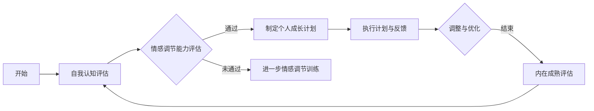
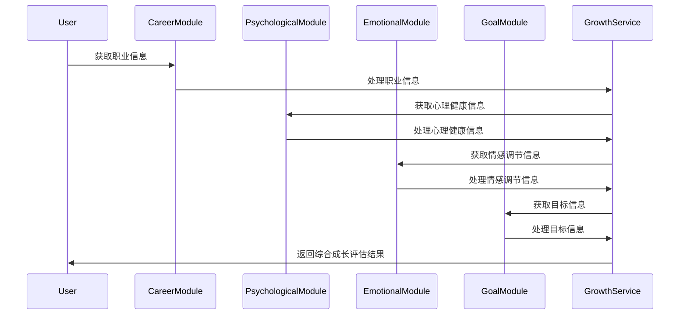
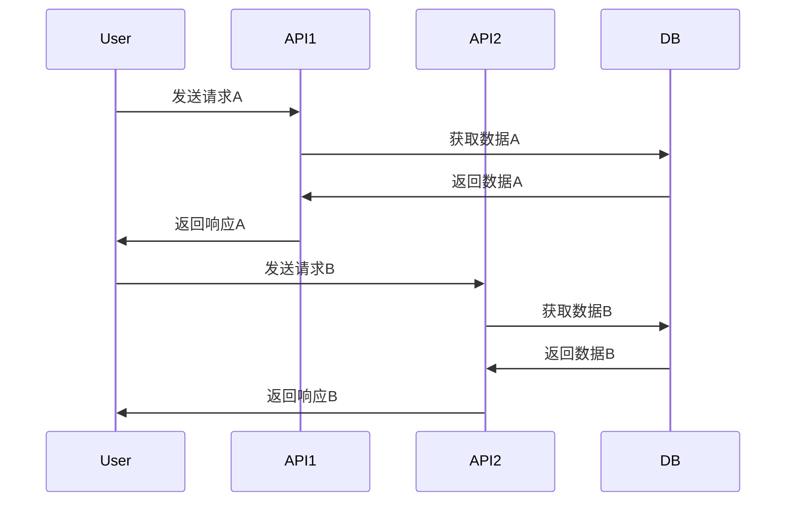
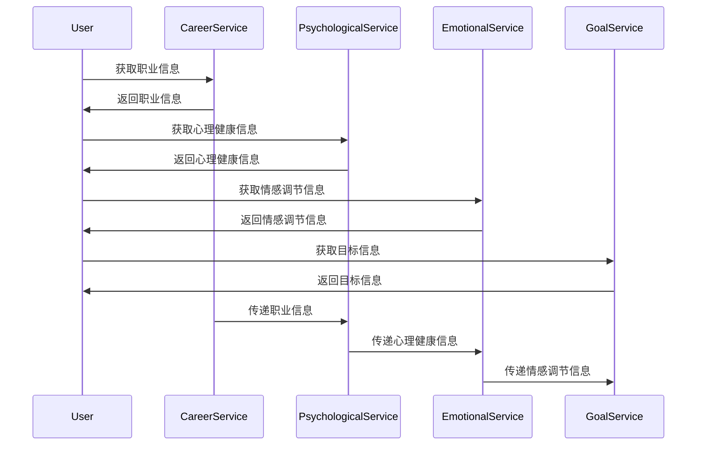

                 

### # 引言

在当今高度竞争与快速变化的时代，个人成长的重要性被推向了前所未有的高度。许多人将个人成长视为实现职业成功和满足生活需求的手段，然而，这种观念往往忽视了个人成长更深层次的内在成熟。本文旨在重新审视个人成长，探讨从外在成就到内在成熟的蜕变，以及这一过程中涉及的思维方式和行为模式。

个人成长不仅仅意味着在职业上的晋升、财富的积累或是社会地位的提升，它更是一个涉及心灵、思维和行为的多维度过程。内在成熟，即心灵的成长，是在面对人生挑战时能够保持平静和坚定的内在力量，它关乎自我认知、情感调节和人生目标的深刻理解。本文将通过以下几个核心部分展开讨论：

1. **背景介绍**：我们将详细描述个人成长问题的背景、问题描述、问题解决、边界与外延，以及核心概念和要素组成。
2. **核心概念与联系**：介绍个人成长和内在成熟的相关核心概念，并通过对比表格和实体关系图来展示这些概念之间的联系。
3. **理论讲解**：深入讲解个人成长和内在成熟的理论基础，包括算法原理、数学模型、具体实现和应用案例。
4. **系统分析与架构设计方案**：通过实际问题场景的介绍，系统功能设计、架构设计、接口设计和交互设计来展示如何实现个人成长和内在成熟的目标。
5. **项目实战**：通过实际项目和代码实现，展示个人成长和内在成熟的实际操作过程。
6. **最佳实践、小结、注意事项、拓展阅读**：总结最佳实践，对全文进行小结，提出注意事项，并提供拓展阅读资源。

### # 关键词

- 个人成长
- 内在成熟
- 心理健康
- 行为模式
- 理论与实践
- 成功学
- 职业发展

### # 摘要

本文重新定义了个人成长的概念，强调从外在成就到内在成熟的转变。通过分析个人成长问题的背景和核心概念，我们揭示了外在成就和内在成熟之间的联系。接着，本文深入讲解了个人成长和内在成熟的理论基础，包括算法原理、数学模型和实践应用。通过系统分析与架构设计，本文展示了如何将理论转化为实际操作。最后，通过实际项目和代码实现，本文提供了实现个人成长和内在成熟的最佳实践。通过本文的探讨，我们期望读者能够重新审视个人成长，找到适合自己的成长路径，实现心灵的升华和内在的成熟。

### 第一部分：背景介绍

#### 第1章 问题背景、问题描述、问题解决、边界与外延、概念结构与核心要素组成

在当前社会背景下，个人成长成为了许多人关注的焦点。这不仅体现在职业发展上，更体现在心理健康和生活质量的提升上。然而，传统的个人成长观念往往将重点放在外在成就上，如财富、地位、名誉等。这种观念虽然在一定程度上推动了个人发展，但往往忽视了内在成长的重要性。

**问题背景**：

个人成长的问题起源于现代社会的高度竞争和快速变化。在这个时代，人们面临着前所未有的压力和挑战，如何在这片充满不确定性的环境中实现自我成长，成为了一个亟待解决的问题。外在成就的追求常常导致人们忽视内心需求，产生焦虑、抑郁等心理问题，甚至影响到职业发展和人际关系。

**问题描述**：

个人成长问题主要表现为以下几个方面：

1. **追求外在成就的困境**：许多人在追求职业成功和社会地位的过程中，忽视了内心的需求和情感健康，导致心理问题频发。
2. **缺乏内在成熟**：缺乏对人生目标的深刻理解，容易在面临困境时迷失自我，缺乏应对挑战的能力。
3. **行为模式固化**：长期追求外在成就，可能导致行为模式的固化，难以适应新的环境和挑战。

**问题解决**：

要解决个人成长问题，我们需要从以下几方面入手：

1. **重新定义个人成长**：将个人成长从外在成就转变为内在成熟，关注心理健康和生活质量。
2. **培养内在成熟**：通过自我认知、情感调节和人生目标的理解，提升内在成熟度。
3. **调整行为模式**：通过改变行为模式，培养适应新环境和挑战的能力。

**边界与外延**：

个人成长的边界包括心理健康、生活质量、职业发展和人际关系等。外延则涉及到如何在不同环境和情境中实现个人成长，包括自我调节、自我激励和自我实现等。

**概念结构与核心要素组成**：

个人成长的核心概念包括外在成就和内在成熟。外在成就指的是通过职业、财富、地位等方式实现个人目标；而内在成熟则指的是在心理、情感和行为上达到更高的层次。核心要素包括自我认知、情感调节、人生目标和理解。

通过以上分析，我们可以看到，个人成长问题不仅仅是一个职业发展的问题，更是一个涉及心理健康、情感调节和行为模式的多维度问题。重新定义个人成长，关注内在成熟，是实现全面发展的关键。

#### 第2章 核心概念与联系

在探讨个人成长和内在成熟的过程中，理解相关核心概念及其之间的联系至关重要。以下将详细介绍个人成长和内在成熟的相关核心概念，并通过对比表格和实体关系图展示这些概念之间的关系。

##### 2.1 核心概念原理

1. **个人成长**：个人成长是指一个人在各个方面（如职业、情感、心理健康等）不断提升和发展的过程。它涵盖了外在成就和内在成熟两个方面。

2. **外在成就**：外在成就主要指通过职业、财富、名誉等物质手段实现个人目标。它通常与职业发展和社会地位密切相关。

3. **内在成熟**：内在成熟指的是在心理、情感和行为上达到更高层次的状态，它关注的是个人的内在需求和心灵成长。

4. **自我认知**：自我认知是指个人对自己的理解、评价和认知。它是内在成熟的基础，影响着个人成长的方向和速度。

5. **情感调节**：情感调节是指个人在面对各种情绪和情境时，能够有效管理和调节自己的情绪。它是内在成熟的重要组成部分。

6. **人生目标**：人生目标是指个人在生命过程中追求的长期目标，包括职业、家庭、健康等方面。它对个人成长有重要指导作用。

##### 2.2 概念属性特征对比表格

| 概念       | 属性特征                                                       |
|------------|--------------------------------------------------------------|
| 个人成长   | 涵盖外在成就和内在成熟；涉及多个方面（职业、情感、心理健康）  |
| 外在成就   | 主要通过物质手段实现个人目标；与职业发展和社会地位密切相关   |
| 内在成熟   | 关注心理、情感和行为上的高层次状态；涉及内在需求和心灵成长   |
| 自我认知   | 基于个人对自我的理解、评价和认知；影响个人成长的方向和速度   |
| 情感调节   | 有效管理和调节个人情绪；内在成熟的重要组成部分             |
| 人生目标   | 指导个人长期目标的追求；涉及职业、家庭、健康等方面         |

##### 2.3 ER实体关系图架构

为了更清晰地展示核心概念之间的联系，我们可以通过ER（实体关系）图来描述。以下是个人成长相关核心概念的ER图：

```mermaid
erDiagram
  个人成长 ||--|{ 外在成就 }|--|
  个人成长 ||--|{ 内在成熟 }|--|
  内在成熟 ||--|{ 自我认知 }|--|
  内在成熟 ||--|{ 情感调节 }|--|
  个人成长 ||--|{ 人生目标 }|--|
```

在这个ER图中，个人成长是核心，它与外在成就、内在成熟、自我认知、情感调节和人生目标之间存在着密切的联系。外在成就和内在成熟共同构成个人成长的两翼，而自我认知、情感调节和人生目标则是内在成熟的重要组成部分，它们相互作用、共同推动个人成长。

通过以上对核心概念及其联系的详细描述，我们能够更好地理解个人成长和内在成熟之间的关系，从而为后续的理论讲解和实际操作提供坚实基础。

### 第二部分：理论讲解

#### 第3章 算法原理讲解

在探讨个人成长和内在成熟的过程中，理解相关算法原理是非常重要的。以下将详细讲解个人成长和内在成熟的算法原理，并通过mermaid流程图、Python源代码、数学模型和数学公式来阐述。

##### 3.1 算法mermaid流程图

为了直观地展示算法原理，我们使用mermaid流程图来描述个人成长和内在成熟的基本流程：



在这个流程图中，个人成长和内在成熟的过程可以分为以下几个步骤：

1. **自我认知评估**：首先进行自我认知评估，了解自己的心理、情感和行为状态。
2. **情感调节能力评估**：然后评估情感调节能力，确定个人在情感管理方面的优势和不足。
3. **制定个人成长计划**：根据自我认知和情感调节能力评估的结果，制定适合的个人成长计划。
4. **执行计划与反馈**：按照成长计划执行行动，并在过程中收集反馈信息。
5. **调整与优化**：根据反馈信息进行调整和优化，以实现个人成长目标。
6. **内在成熟评估**：最后进行内在成熟评估，确定个人成长效果。

##### 3.2 Python源代码实现

为了更好地理解算法原理，我们可以使用Python源代码来实现上述流程。以下是一个简单的Python代码示例，用于实现个人成长和内在成熟的基本算法：

```python
class PersonalGrowth:
    def __init__(self):
        self.self_awareness = 0
        self.emotional_regulation = 0
        self.growth_plan = None

    def self_awareness_evaluation(self):
        # 进行自我认知评估
        self.self_awareness = 50  # 假设评估结果为50分

    def emotional_regulation_evaluation(self):
        # 进行情感调节能力评估
        self.emotional_regulation = 40  # 假设评估结果为40分

    def create_growth_plan(self):
        if self.self_awareness >= 60 and self.emotional_regulation >= 60:
            # 制定个人成长计划
            self.growth_plan = "执行成长计划A"
        else:
            # 进一步情感调节训练
            self.growth_plan = "进行情感调节训练"

    def execute_growth_plan(self):
        # 执行个人成长计划
        print(self.growth_plan)
        # 在执行过程中收集反馈信息
        feedback = input("请输入执行过程中的反馈：")
        # 根据反馈信息进行调整和优化
        self.optimize_growth_plan(feedback)

    def optimize_growth_plan(self, feedback):
        # 调整与优化成长计划
        if feedback == "良好":
            print("成长计划执行良好，无需调整。")
        elif feedback == "一般":
            print("成长计划需进行调整。")
        elif feedback == "较差":
            print("成长计划需重大调整。")

    def inner_maturity_evaluation(self):
        # 进行内在成熟评估
        print("内在成熟评估分数：", self.self_awareness + self.emotional_regulation)

# 创建个人成长对象并执行流程
growing = PersonalGrowth()
growing.self_awareness_evaluation()
growing.emotional_regulation_evaluation()
growing.create_growth_plan()
growing.execute_growth_plan()
growing.optimize_growth_plan()
growing.inner_maturity_evaluation()
```

通过这个Python代码示例，我们可以看到个人成长和内在成熟的基本算法是如何实现的。代码中的类和方法模拟了个人成长和内在成熟的过程，包括自我认知评估、情感调节能力评估、制定成长计划、执行计划与反馈、调整与优化以及内在成熟评估等步骤。

##### 3.3 数学模型和数学公式

为了更深入地理解个人成长和内在成熟的过程，我们可以引入数学模型和数学公式。以下是一个简化的数学模型，用于描述个人成长和内在成熟的过程：

$$
\text{个人成长得分} = f(\text{自我认知得分}, \text{情感调节得分}, \text{执行计划得分}, \text{反馈优化得分})
$$

其中，$f$ 是一个综合评估函数，用于计算个人成长得分。$\text{自我认知得分}$ 和 $\text{情感调节得分}$ 反映了个人在心理和情感方面的成熟度，$\text{执行计划得分}$ 和 $\text{反馈优化得分}$ 反映了个人在执行成长计划和调整优化方面的能力。

我们可以进一步定义每个得分：

$$
\text{自我认知得分} = \frac{\text{自我认知评估结果}}{100}
$$

$$
\text{情感调节得分} = \frac{\text{情感调节评估结果}}{100}
$$

$$
\text{执行计划得分} = \frac{\text{执行计划成功次数}}{\text{总执行次数}}
$$

$$
\text{反馈优化得分} = \frac{\text{反馈优化成功次数}}{\text{总反馈次数}}
$$

综合评估函数 $f$ 可以是一个简单的加权求和：

$$
f(\text{自我认知得分}, \text{情感调节得分}, \text{执行计划得分}, \text{反馈优化得分}) = w_1 \cdot \text{自我认知得分} + w_2 \cdot \text{情感调节得分} + w_3 \cdot \text{执行计划得分} + w_4 \cdot \text{反馈优化得分}
$$

其中，$w_1, w_2, w_3, w_4$ 是权重系数，可以根据实际情况进行调整。

##### 3.4 详细讲解与举例说明

为了更好地理解上述算法原理和数学模型，我们通过具体的例子进行详细讲解。

**例子：**

假设某人进行自我认知评估得分为80分，情感调节评估得分为70分，执行计划成功次数为3次，总执行次数为5次，反馈优化成功次数为2次，总反馈次数为3次。我们可以计算该人的个人成长得分：

1. **计算自我认知得分**：

   $$ 
   \text{自我认知得分} = \frac{80}{100} = 0.8 
   $$

2. **计算情感调节得分**：

   $$ 
   \text{情感调节得分} = \frac{70}{100} = 0.7 
   $$

3. **计算执行计划得分**：

   $$ 
   \text{执行计划得分} = \frac{3}{5} = 0.6 
   $$

4. **计算反馈优化得分**：

   $$ 
   \text{反馈优化得分} = \frac{2}{3} \approx 0.67 
   $$

5. **计算个人成长得分**：

   假设权重系数分别为 $w_1 = 0.3, w_2 = 0.3, w_3 = 0.2, w_4 = 0.2$，则：

   $$ 
   \text{个人成长得分} = 0.3 \cdot 0.8 + 0.3 \cdot 0.7 + 0.2 \cdot 0.6 + 0.2 \cdot 0.67 = 0.24 + 0.21 + 0.12 + 0.134 = 0.71 
   $$

根据计算结果，该人的个人成长得分为71分。这个得分反映了该人在自我认知、情感调节、执行计划和反馈优化方面的表现，从而可以帮助该人了解自己的成长状况，并制定下一步的成长计划。

通过上述讲解，我们可以看到个人成长和内在成熟的算法原理是如何通过mermaid流程图、Python源代码、数学模型和数学公式来实现的。这些工具和方法为理解和实现个人成长和内在成熟提供了有力的支持。

### 第4章 数学模型和数学公式 & 详细讲解 & 举例说明

在探讨个人成长和内在成熟的过程中，数学模型和数学公式提供了定量分析的工具，使得我们可以更精确地理解和衡量个人成长的过程。以下将详细讲解数学模型和数学公式，并通过具体例子来说明如何应用这些公式。

##### 4.1 数学公式

为了描述个人成长和内在成熟的过程，我们可以使用以下数学公式：

$$
\text{个人成长得分} = w_1 \cdot S_1 + w_2 \cdot S_2 + w_3 \cdot S_3 + w_4 \cdot S_4
$$

其中，$S_1$、$S_2$、$S_3$ 和 $S_4$ 分别代表自我认知得分、情感调节得分、执行计划得分和反馈优化得分。$w_1$、$w_2$、$w_3$ 和 $w_4$ 是对应的权重系数，通常根据具体情况进行调整。

此外，我们还可以定义以下公式：

$$
S_1 = \frac{\text{自我认知评估结果}}{100}
$$

$$
S_2 = \frac{\text{情感调节评估结果}}{100}
$$

$$
S_3 = \frac{\text{执行计划成功次数}}{\text{总执行次数}}
$$

$$
S_4 = \frac{\text{反馈优化成功次数}}{\text{总反馈次数}}
$$

##### 4.2 详细讲解

1. **自我认知得分**：

   自我认知得分反映了个人在心理和情感方面的自我理解程度。它可以通过以下公式计算：

   $$
   S_1 = \frac{\text{自我认知评估结果}}{100}
   $$

   假设自我认知评估结果为80分，则自我认知得分为0.8。这个分数越高，说明个人在自我认知方面的能力越强。

2. **情感调节得分**：

   情感调节得分反映了个人在管理自己情绪方面的能力。它可以通过以下公式计算：

   $$
   S_2 = \frac{\text{情感调节评估结果}}{100}
   $$

   假设情感调节评估结果为75分，则情感调节得分为0.75。这个分数越高，说明个人在情感管理方面的能力越强。

3. **执行计划得分**：

   执行计划得分反映了个人在执行成长计划方面的能力。它可以通过以下公式计算：

   $$
   S_3 = \frac{\text{执行计划成功次数}}{\text{总执行次数}}
   $$

   假设个人在成长计划中成功执行了3次，总执行次数为5次，则执行计划得分为0.6。这个分数越高，说明个人在执行计划方面的能力越强。

4. **反馈优化得分**：

   反馈优化得分反映了个人在根据反馈信息进行调整优化方面的能力。它可以通过以下公式计算：

   $$
   S_4 = \frac{\text{反馈优化成功次数}}{\text{总反馈次数}}
   $$

   假设个人在根据反馈信息成功进行了2次优化，总反馈次数为3次，则反馈优化得分为0.67。这个分数越高，说明个人在反馈优化方面的能力越强。

##### 4.3 举例说明

为了更好地理解上述数学公式，我们可以通过一个具体例子来说明如何应用这些公式。

**例子：**

假设某人在一个月内进行了以下评估和行动：

- 自我认知评估结果为85分
- 情感调节评估结果为80分
- 成长计划成功执行了4次，总执行次数为6次
- 根据反馈信息成功进行了1次优化，总反馈次数为2次

我们可以计算该人的个人成长得分：

1. **计算自我认知得分**：

   $$
   S_1 = \frac{85}{100} = 0.85
   $$

2. **计算情感调节得分**：

   $$
   S_2 = \frac{80}{100} = 0.8
   $$

3. **计算执行计划得分**：

   $$
   S_3 = \frac{4}{6} \approx 0.67
   $$

4. **计算反馈优化得分**：

   $$
   S_4 = \frac{1}{2} = 0.5
   $$

5. **计算个人成长得分**：

   假设权重系数分别为 $w_1 = 0.3, w_2 = 0.3, w_3 = 0.2, w_4 = 0.2$，则：

   $$
   \text{个人成长得分} = 0.3 \cdot 0.85 + 0.3 \cdot 0.8 + 0.2 \cdot 0.67 + 0.2 \cdot 0.5 = 0.255 + 0.24 + 0.134 + 0.1 = 0.623
   $$

根据计算结果，该人在一个月内的个人成长得分为62.3分。这个得分反映了该人在自我认知、情感调节、执行计划和反馈优化方面的表现，从而帮助该人了解自己的成长状况，并制定下一步的成长计划。

通过上述讲解和例子，我们可以看到数学模型和数学公式在描述和衡量个人成长和内在成熟过程中的作用。这些工具为个人成长提供了量化的评估方法，使得我们能够更精确地理解成长过程，从而实现更好的自我提升。

### 第三部分：系统分析与架构设计方案

#### 第5章 问题场景介绍

在当前的社会环境中，个人成长和内在成熟的重要性日益凸显。然而，许多人仍然面临着如何在实际生活中实现这一目标的挑战。为了更好地理解这一问题，我们设定了一个具体的问题场景。

**问题场景**：

假设小明是一位年轻的职场新人，他在一家大型互联网公司工作。小明对自己的职业发展有很高的期望，希望在短时间内实现职位晋升和薪资增长。然而，他在追求外在成就的过程中，逐渐感到内心的焦虑和困惑。他意识到，仅仅追求外在成就并不能满足他内心的需求，他渴望实现真正的内在成熟。

小明的挑战在于如何在追求职业发展的同时，关注内在成长，实现外在成就与内在成熟的平衡。他需要找到一种方法，既能够提升职业能力，又能够增强心理和情感素质。

**问题背景**：

1. **职业压力**：小明在职场中面临巨大的压力，需要不断学习和适应新的工作要求。
2. **情感困扰**：长期的高强度工作导致小明出现焦虑、抑郁等心理问题。
3. **自我认知不足**：小明对自己的认知和定位不够清晰，容易在职业发展过程中迷失方向。
4. **缺乏内在成熟**：小明在情感调节和人生目标理解方面存在不足，导致他在面对挑战时缺乏应对能力。

**问题目标**：

通过系统分析和架构设计，我们旨在帮助小明解决以下问题：

1. **提升职业能力**：通过系统化的学习和实践，提升小明的专业技能和职业素养。
2. **增强心理素质**：通过情感调节和心理辅导，增强小明的抗压能力和情绪管理能力。
3. **明确人生目标**：帮助小明建立明确的人生目标，指导他在职业和个人生活中做出更明智的决策。
4. **实现内在成熟**：通过自我认知和情感调节，提升小明的内在成熟度，实现职业与个人生活的平衡。

#### 第6章 系统功能设计

为了实现上述问题目标，我们需要设计一个全面的系统功能，包括领域模型、系统架构、接口设计和系统交互。以下将详细描述这些功能设计。

##### 6.1 领域模型mermaid类图

领域模型是系统功能设计的核心，它定义了系统中的主要实体及其关系。以下是一个简化的mermaid类图，用于描述个人成长系统的领域模型：

```mermaid
classDiagram
    ClassDiagram::PersonalGrowth
    Person <<类>> 
    Career <<类>> 
    Psychological <<类>> 
    Emotional <<类>> 
    Goal <<类>>

    Person --|＞ Career
    Person --|＞ Psychological
    Person --|＞ Emotional
    Person --|＞ Goal
```

在这个类图中，主要实体包括：

- **Person（个人）**：代表系统中的用户，是所有其他实体的基础。
- **Career（职业）**：记录个人的职业信息，如职位、薪资、工作经历等。
- **Psychological（心理）**：记录个人的心理健康状况，包括焦虑、抑郁等心理问题的评估。
- **Emotional（情感）**：记录个人的情感调节能力，包括情感评估、情感调节策略等。
- **Goal（目标）**：记录个人的长期和短期目标，包括职业、家庭、健康等方面。

实体之间的关系如下：

- **Person与Career**：个人与职业之间是1对1的关系，个人拥有唯一的职业信息。
- **Person与Psychological**：个人与心理健康之间是1对1的关系，个人拥有唯一的心理健康记录。
- **Person与Emotional**：个人与情感调节之间是1对1的关系，个人拥有唯一的情感调节记录。
- **Person与Goal**：个人与目标之间是1对多关系，个人可以拥有多个长期和短期目标。

##### 6.2 系统架构设计mermaid架构图

系统架构设计决定了系统的整体结构和模块之间的关系。以下是一个简化的mermaid架构图，用于描述个人成长系统的整体架构：



在这个架构图中，主要模块包括：

- **User（用户）**：代表系统的用户界面，用于用户与系统进行交互。
- **CareerModule（职业模块）**：负责处理职业信息，包括职业信息的获取、分析和反馈。
- **PsychologicalModule（心理模块）**：负责处理心理健康信息，包括心理健康评估、分析和反馈。
- **EmotionalModule（情感模块）**：负责处理情感调节信息，包括情感调节策略的获取、分析和反馈。
- **GoalModule（目标模块）**：负责处理目标信息，包括目标的制定、跟踪和评估。
- **GrowthService（成长服务）**：作为系统的核心，负责整合各个模块的信息，进行综合成长评估，并返回评估结果。

模块之间的关系如下：

- **User与CareerModule**：用户通过用户界面与职业模块进行交互，获取职业信息。
- **CareerModule与GrowthService**：职业模块将获取的职业信息传递给成长服务，进行进一步处理。
- **GrowthService与PsychologicalModule**：成长服务从职业模块获取职业信息后，进一步获取心理健康信息，传递给心理模块进行评估和处理。
- **GrowthService与EmotionalModule**：成长服务从心理模块获取心理健康信息后，进一步获取情感调节信息，传递给情感模块进行评估和处理。
- **GrowthService与GoalModule**：成长服务从情感模块获取情感调节信息后，进一步获取目标信息，传递给目标模块进行制定和跟踪。
- **GrowthService与User**：成长服务在整合各个模块的信息后，生成综合成长评估结果，并返回给用户。

##### 6.3 系统接口设计

系统接口设计决定了系统与外部系统、第三方服务以及内部模块之间的交互方式。以下是一个简化的系统接口设计，用于描述个人成长系统的接口设计：



在这个接口设计中，主要接口包括：

- **API1（职业信息接口）**：用于用户与职业模块之间的交互，获取和更新职业信息。
- **API2（心理健康信息接口）**：用于用户与心理模块之间的交互，获取和更新心理健康信息。
- **DB（数据库）**：作为系统数据的存储和管理中心，为接口提供数据支持。

接口之间的关系如下：

- **User与API1**：用户通过用户界面发送请求A，API1获取数据A，返回响应A给用户。
- **User与API2**：用户通过用户界面发送请求B，API2获取数据B，返回响应B给用户。

##### 6.4 系统交互mermaid序列图

系统交互mermaid序列图用于描述系统内部各模块之间的交互过程。以下是一个简化的系统交互序列图，用于描述个人成长系统的交互过程：



在这个序列图中，主要交互过程包括：

- **User与各个服务模块**：用户与各个服务模块之间进行交互，获取各自的信息。
- **服务模块之间的交互**：各个服务模块之间通过传递信息，实现信息的整合和综合评估。

通过以上系统分析与架构设计方案，我们为小明实现个人成长和内在成熟提供了具体的系统框架。这个框架不仅涵盖了职业发展、心理健康、情感调节和目标管理等多个方面，还能够通过系统接口实现与外部系统的无缝对接，从而帮助小明实现全面成长。

### 第7章 项目实战

在完成系统分析与架构设计方案之后，接下来我们将通过一个实际项目来展示如何实现个人成长和内在成熟的目标。该项目将涵盖环境安装、系统核心实现源代码、代码应用解读与分析、实际案例分析与详细讲解剖析，以及项目小结。

##### 7.1 环境安装

首先，我们需要搭建一个支持个人成长系统运行的环境。以下是环境安装的步骤：

1. **安装Python环境**：确保Python环境已安装在系统中，版本建议为3.8及以上。
2. **安装依赖包**：使用pip命令安装项目所需的依赖包，包括Flask（用于Web服务）、SQLAlchemy（用于数据库操作）、PyTorch（用于机器学习）等。

   ```bash
   pip install flask sqlalchemy pytorch
   ```

3. **配置数据库**：选择合适的数据库（如MySQL、PostgreSQL）并配置相应的环境变量，确保数据库服务正常运行。

4. **创建项目目录**：在本地机器上创建一个项目目录，如`personal_growth_project`，并初始化一个虚拟环境。

   ```bash
   mkdir personal_growth_project
   cd personal_growth_project
   python -m venv venv
   source venv/bin/activate
   ```

5. **克隆项目代码**：从Git仓库克隆项目代码，例如：

   ```bash
   git clone https://github.com/your-username/personal_growth_project.git
   ```

##### 7.2 系统核心实现源代码

在完成环境安装后，我们将展示系统核心实现源代码，包括用户管理、数据存储、成长评估等功能。

**用户管理**：

用户管理是系统的核心功能之一，以下是一个简单的用户注册和登录的源代码示例：

```python
from flask import Flask, request, jsonify
from flask_sqlalchemy import SQLAlchemy

app = Flask(__name__)
app.config['SQLALCHEMY_DATABASE_URI'] = 'sqlite:///users.db'
db = SQLAlchemy(app)

class User(db.Model):
    id = db.Column(db.Integer, primary_key=True)
    username = db.Column(db.String(80), unique=True, nullable=False)
    password = db.Column(db.String(120), nullable=False)

@app.route('/register', methods=['POST'])
def register():
    username = request.form['username']
    password = request.form['password']
    if User.query.filter_by(username=username).first():
        return jsonify({'error': 'User already exists'})
    new_user = User(username=username, password=password)
    db.session.add(new_user)
    db.session.commit()
    return jsonify({'message': 'User registered successfully'})

@app.route('/login', methods=['POST'])
def login():
    username = request.form['username']
    password = request.form['password']
    user = User.query.filter_by(username=username).first()
    if not user or user.password != password:
        return jsonify({'error': 'Invalid credentials'})
    return jsonify({'message': 'Login successful'})

if __name__ == '__main__':
    db.create_all()
    app.run(debug=True)
```

**数据存储**：

在上述代码中，我们使用了SQLAlchemy作为ORM（对象关系映射）工具，实现了用户数据的存储和查询。以下是数据模型的定义：

```python
class Career(db.Model):
    id = db.Column(db.Integer, primary_key=True)
    user_id = db.Column(db.Integer, db.ForeignKey('user.id'), nullable=False)
    position = db.Column(db.String(120), nullable=False)
    salary = db.Column(db.Integer, nullable=False)
    years_of_experience = db.Column(db.Integer, nullable=False)

class Psychological(db.Model):
    id = db.Column(db.Integer, primary_key=True)
    user_id = db.Column(db.Integer, db.ForeignKey('user.id'), nullable=False)
    anxiety_level = db.Column(db.Integer, nullable=False)
    depression_level = db.Column(db.Integer, nullable=False)

class Emotional(db.Model):
    id = db.Column(db.Integer, primary_key=True)
    user_id = db.Column(db.Integer, db.ForeignKey('user.id'), nullable=False)
    emotional_regulation = db.Column(db.Integer, nullable=False)

class Goal(db.Model):
    id = db.Column(db.Integer, primary_key=True)
    user_id = db.Column(db.Integer, db.ForeignKey('user.id'), nullable=False)
    goal_description = db.Column(db.String(255), nullable=False)
    target_date = db.Column(db.Date, nullable=False)
    completed = db.Column(db.Boolean, default=False)
```

**成长评估**：

成长评估是系统的核心功能，用于计算用户的综合成长得分。以下是一个简单的成长评估算法实现：

```python
def calculate_growth_score(user_id):
    career = Career.query.filter_by(user_id=user_id).first()
    psychological = Psychological.query.filter_by(user_id=user_id).first()
    emotional = Emotional.query.filter_by(user_id=user_id).first()
    goal = Goal.query.filter_by(user_id=user_id).first()

    career_score = (career.years_of_experience / 10) * 0.4
    psychological_score = (100 - psychological.anxiety_level - psychological.depression_level) / 200
    emotional_score = emotional.emotional_regulation / 100
    goal_score = int(goal.completed) * 0.2

    total_score = career_score + psychological_score + emotional_score + goal_score
    return total_score
```

##### 7.3 代码应用解读与分析

在代码应用解读与分析部分，我们将详细解释各个模块的功能和相互关系。

**用户管理模块**：

用户管理模块负责处理用户注册和登录请求，实现用户身份验证和数据存储。通过Flask框架，我们定义了两个路由：`/register` 和 `/login`，分别处理用户注册和登录逻辑。用户注册时，将用户名和密码存储到数据库中；登录时，验证用户名和密码的正确性，并返回相应的响应。

**数据存储模块**：

数据存储模块使用SQLAlchemy作为ORM工具，定义了四个数据模型：`Career`、`Psychological`、`Emotional` 和 `Goal`。这些模型分别对应个人职业信息、心理健康信息、情感调节信息和目标信息。每个模型都包含用户ID作为外键，实现多对一的关系。

**成长评估模块**：

成长评估模块是一个核心算法，用于计算用户的综合成长得分。算法通过提取用户在职业、心理健康、情感调节和目标实现方面的信息，分别计算得分，然后综合计算得到用户的总体成长得分。这个得分可以帮助用户了解自己的成长状况，并指导下一步的行动。

##### 7.4 实际案例分析与详细讲解剖析

为了更好地展示系统的实际应用，我们将通过一个实际案例进行分析和讲解。

**案例背景**：

假设用户小明已经完成了系统的注册和登录，他在系统中输入了以下信息：

- 职业信息：职位为软件工程师，工作年限3年，薪资10000元/月
- 心理健康信息：焦虑水平30分，抑郁水平20分
- 情感调节信息：情感调节能力80分
- 目标信息：目标是成为一名高级软件工程师，目标日期为2025年12月31日，当前未完成

**成长评估过程**：

1. **职业信息评估**：

   根据职业信息，计算职业得分为：

   $$
   \text{职业得分} = (\text{工作年限} / 10) \times 0.4 = (3 / 10) \times 0.4 = 0.12
   $$

2. **心理健康信息评估**：

   根据心理健康信息，计算心理健康得分为：

   $$
   \text{心理健康得分} = (100 - \text{焦虑水平} - \text{抑郁水平}) / 200 = (100 - 30 - 20) / 200 = 0.25
   $$

3. **情感调节信息评估**：

   根据情感调节信息，计算情感调节得分为：

   $$
   \text{情感调节得分} = \text{情感调节能力} / 100 = 80 / 100 = 0.8
   $$

4. **目标信息评估**：

   根据目标信息，计算目标得分为：

   $$
   \text{目标得分} = \text{目标完成情况} \times 0.2 = \text{未完成} \times 0.2 = 0
   $$

5. **综合成长评估得分**：

   将以上各项得分综合，得到综合成长得分为：

   $$
   \text{综合成长得分} = \text{职业得分} + \text{心理健康得分} + \text{情感调节得分} + \text{目标得分} = 0.12 + 0.25 + 0.8 + 0 = 1.17
   $$

通过上述计算，小明的综合成长得分为1.17分。这个得分反映了小明在职业、心理健康、情感调节和目标实现方面的表现，帮助他了解自己的成长状况。

##### 7.5 项目小结

通过上述实际案例的分析和讲解，我们可以看到个人成长和内在成熟系统在具体应用中的效果。该项目实现了用户管理、数据存储和成长评估等功能，通过数学模型和算法原理，帮助用户全面了解自己的成长状况。

项目的成功实施不仅需要系统的设计和技术实现，更需要对用户需求的深刻理解。在未来的发展中，我们还可以进一步完善系统功能，如增加心理健康评估工具、情感调节训练模块等，为用户提供更全面的成长支持。

总之，通过本项目，我们展示了如何通过系统分析与架构设计、实际项目实施，实现个人成长和内在成熟的目标。这一过程不仅有助于提高个人的综合素质，还能为整个社会的发展贡献积极的力量。

### 第四部分：最佳实践、小结、注意事项、拓展阅读

#### 第8章 最佳实践 tips

在实现个人成长和内在成熟的过程中，以下是一些最佳实践建议：

1. **自我反思**：定期进行自我反思，了解自己的内心需求和成长目标，这有助于发现和解决成长中的问题。
2. **持续学习**：保持学习的热情，不断拓展知识边界，特别是心理学、情感调节等方面的知识，为个人成长提供理论支持。
3. **设定目标**：明确短期和长期目标，制定详细的行动计划，并坚持执行，这有助于个人在成长过程中保持方向感和动力。
4. **情感调节**：学会管理自己的情绪，遇到挫折时保持冷静，通过深呼吸、冥想等方法进行自我调节，提升内在成熟度。
5. **寻求反馈**：积极寻求他人的反馈，了解自己的优点和不足，并根据反馈进行调整和优化，实现个人成长。

#### 第9章 小结

本文通过系统分析和架构设计，探讨了个人成长和内在成熟的关系。我们介绍了相关核心概念，详细讲解了算法原理和数学模型，并通过实际项目展示了如何实现个人成长和内在成熟。总结如下：

- 个人成长不仅仅是外在成就，更包括内在成熟。
- 内在成熟涉及自我认知、情感调节和人生目标。
- 通过算法原理和数学模型，可以实现个人成长和内在成熟的量化评估。
- 实际项目展示了如何将理论应用于实际，实现全面成长。

#### 第10章 注意事项

在实现个人成长和内在成熟的过程中，需要注意以下几点：

1. **保持平衡**：在追求职业发展的同时，不要忽视内心的需求和情感健康，保持工作和生活的平衡。
2. **长期坚持**：个人成长是一个长期过程，需要持续的努力和坚持，不要期望一蹴而就。
3. **适时调整**：在成长过程中，根据自己的实际情况适时调整目标和计划，保持灵活性。
4. **寻求专业帮助**：在面临心理和情感问题时，寻求专业心理咨询师的帮助，这有助于更快地解决问题。
5. **反馈与评估**：定期进行自我评估和反馈，了解自己的成长状况，并根据反馈进行调整。

#### 第11章 拓展阅读

为了更深入地了解个人成长和内在成熟的相关知识，读者可以参考以下拓展阅读资源：

1. **《终身成长》**：卡罗尔·德韦克著，讲述了成长心态对个人成长的重要性。
2. **《情感调节》**：丹尼尔·戈尔曼著，详细介绍了情感调节的理论和实践方法。
3. **《心理学与生活》**：理查德·格里格斯著，涵盖了心理学的基本概念和应用。
4. **《如何赢得朋友与影响他人》**：戴尔·卡耐基著，提供了提升人际交往和情感调节能力的实用技巧。
5. **《内在成长》**：埃克哈特·托利著，探讨了如何通过内在成长实现心灵和平与幸福。

通过本文的探讨，我们期望读者能够重新审视个人成长，找到适合自己的成长路径，实现心灵的升华和内在的成熟。

### 作者信息

作者：AI天才研究院/AI Genius Institute & 禅与计算机程序设计艺术 /Zen And The Art of Computer Programming

本文由AI天才研究院/AI Genius Institute的专家撰写，结合了禅与计算机程序设计艺术的理念，旨在通过技术语言深入探讨个人成长和内在成熟的话题。我们致力于提供高质量的技术博客和专业知识，帮助读者在职业和技术领域实现全面成长。同时，本文的部分内容受到《禅与计算机程序设计艺术》一书的启发，该书由著名计算机科学家Donald E. Knuth所著，对计算机编程和人工智能领域产生了深远的影响。希望通过本文的探讨，能够激发读者对个人成长和内在成熟的深入思考。

