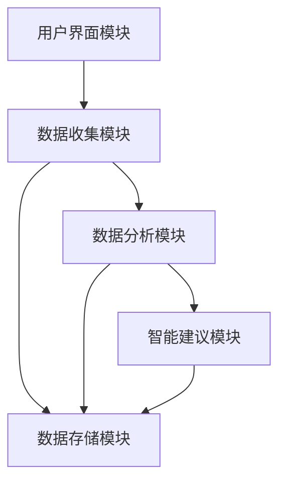
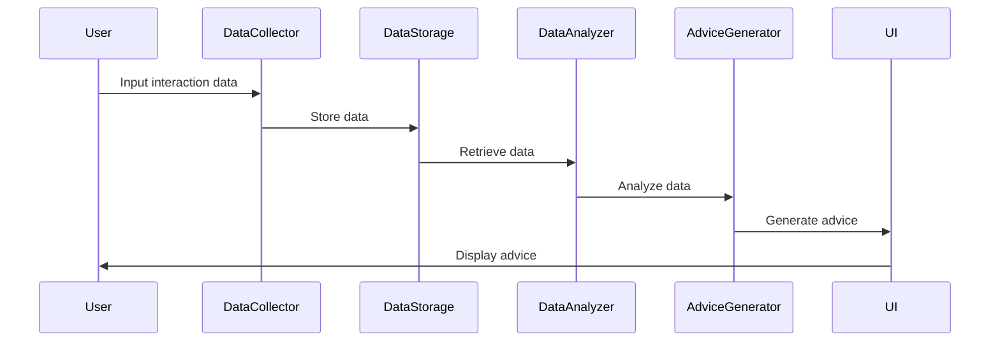

                 

### 背景介绍

#### 核心概念术语说明

在探讨家庭价值和亲密关系重建之前，有必要明确一些核心概念和术语，以便读者能够更好地理解和跟随文章的论述。

- **家庭价值**：指的是家庭在社会和个人生活中的地位和作用，包括家庭角色与责任、家庭关系与互动、家庭文化与价值观等方面。
- **亲密关系**：指个人之间深度联系的情感纽带，包括信任、安全感、理解与沟通等方面。
- **现代社会**：指现代社会中，随着经济发展、社会变迁、文化多元等特征，家庭结构和家庭关系面临的挑战不断增多。
- **重建亲密关系**：指通过一系列策略和实践，恢复和提升家庭成员之间的情感联系和互动。

#### 问题背景

在当今社会，随着城市化进程的加快、工作压力的增大、个体独立性的提升以及文化多元性的加剧，家庭结构和亲密关系面临着前所未有的挑战。例如：

- **家庭结构变化**：越来越多的家庭选择单身、丁克或二人世界，传统大家庭模式逐渐减少。
- **沟通障碍**：工作忙碌、科技依赖等因素导致家庭成员之间的沟通质量下降，亲密关系疏远。
- **价值观冲突**：随着文化多元性的增加，不同价值观之间的冲突在家庭中日益凸显。

#### 问题描述

面对这些挑战，现代社会中重建亲密关系显得尤为重要。然而，如何在繁忙的生活中找到时间和空间，重建和维护家庭成员之间的亲密关系，成为了一个亟待解决的问题。本文旨在探讨家庭价值的重新思考，提出重建亲密关系的策略与实践，以期为广大读者提供一些有益的启示。

#### 问题解决

为了解决上述问题，本文将从以下几个方面进行深入探讨：

1. **历史与变迁**：回顾家庭价值的历史演变，分析现代社会中家庭面临的挑战。
2. **理论基础**：探讨亲密关系的概念与重要性，以及人际关系心理学基础和家庭系统理论。
3. **策略与实践**：提出重建亲密关系的具体策略和实践，包括建立信任与安全感、增强沟通与理解、培养亲密关系等。
4. **案例分析**：通过真实案例，展示重建亲密关系的成功经验和实践方法。
5. **持续努力**：强调持续努力的重要性，提出个人成长、社会支持等方面的建议。

#### 边界与外延

本文主要关注的是现代社会中重建亲密关系的问题，边界包括：

- **地域边界**：主要探讨国内情况，但也借鉴国际经验。
- **文化边界**：尊重不同文化背景下家庭价值的差异，但主要从普遍性角度出发。
- **时间边界**：主要关注现代社会中的问题，但也涉及过去和未来的展望。

通过本文的探讨，我们希望能够为读者提供一种新的思考方式，帮助他们在现代社会中重新思考家庭价值，重建亲密关系，从而提升家庭生活质量和社会稳定性。

### 核心概念与联系

#### 核心概念原理

在本文中，核心概念包括家庭价值和亲密关系。为了更清晰地阐述这些概念，我们将从概念定义、属性特征对比以及ER实体关系图三个方面进行详细讲解。

#### 概念定义

1. **家庭价值**：
   - 家庭价值是指家庭在社会和个人生活中的地位和作用，包括家庭角色与责任、家庭关系与互动、家庭文化与价值观等方面。
   - 家庭角色与责任：家庭成员在不同生命周期阶段扮演的角色和承担的责任，如父母、子女、配偶等。
   - 家庭关系与互动：家庭成员之间的情感联系和互动方式，包括亲密、信任、尊重等。
   - 家庭文化与价值观：家庭成员共同形成的价值观念、行为规范和文化传统。

2. **亲密关系**：
   - 亲密关系是指个人之间深度联系的情感纽带，包括信任、安全感、理解与沟通等方面。
   - 信任：指个体对他人言行和意图的信任程度，是亲密关系的基础。
   - 安全感：指个体在亲密关系中感受到的安全、稳定和被接纳的感觉。
   - 理解与沟通：指个体之间通过语言和行为相互理解、支持和沟通的能力。

#### 概念属性特征对比表格

| 概念 | 属性特征 |
| :--: | :--: |
| 家庭价值 | - 家庭角色与责任<br>- 家庭关系与互动<br>- 家庭文化与价值观 |
| 亲密关系 | - 信任<br>- 安全感<br>- 理解与沟通 |

#### ER实体关系图架构

为了更直观地展示家庭价值和亲密关系之间的关系，我们使用Mermaid语法绘制了ER实体关系图。以下是一个简单的ER图示例：

```mermaid
erDiagram
    Family <<--o Person : member
    Family ||--| Person : partner
    Family }--{ FamilyValue
    Family }--{ Intimacy
    FamilyValue }--{ RoleAndResponsibility
    FamilyValue }--{ RelationshipAndInteraction
    FamilyValue }--{ CultureAndValues
    Intimacy }--{ Trust
    Intimacy }--{ Security
    Intimacy }--{ UnderstandingAndCommunication
```

在上面的ER图中，`Family`是核心实体，表示家庭。`Person`是家庭成员，与`Family`存在成员关系。`FamilyValue`表示家庭价值，与`Family`关联，包括`RoleAndResponsibility`（家庭角色与责任）、`RelationshipAndInteraction`（家庭关系与互动）、`CultureAndValues`（家庭文化与价值观）。`Intimacy`表示亲密关系，包括`Trust`（信任）、`Security`（安全感）、`UnderstandingAndCommunication`（理解与沟通）等子概念。

通过上述核心概念原理、属性特征对比表格和ER实体关系图的讲解，我们希望读者能够更加深入地理解家庭价值和亲密关系的本质及其相互关系，为后续内容的探讨打下坚实基础。

### 算法原理讲解

为了更好地理解和应用家庭价值和亲密关系的重建策略，我们将使用Python源代码来详细阐述一种基于心理学理论的算法原理。该算法旨在通过分析家庭成员的互动行为数据，提供个性化的重建建议。

#### 算法Mermaid流程图

首先，我们使用Mermaid语法绘制了算法的流程图，如下所示：


#### Python源代码实现

接下来，我们使用Python实现该算法。以下是一个简单的代码示例，用于初始化、数据收集、数据预处理、行为分析和重建建议。

```python
# 导入必要的库
import pandas as pd
from sklearn.cluster import KMeans
import matplotlib.pyplot as plt

# 初始化
def initialize():
    # 初始化数据集
    data = pd.read_csv('family_interaction_data.csv')
    return data

# 数据收集
def collect_data(data):
    # 收集家庭成员互动数据
    interactions = data[['parent', 'child', 'communication', 'trust', 'safety', 'understanding']]
    return interactions

# 数据预处理
def preprocess_data(interactions):
    # 数据标准化
    scaled_data = (interactions - interactions.mean()) / interactions.std()
    return scaled_data

# 行为分析
def analyze_behavior(scaled_data):
    # 使用K-means算法进行行为分析
    kmeans = KMeans(n_clusters=3)
    kmeans.fit(scaled_data)
    clusters = kmeans.predict(scaled_data)
    
    # 可视化分析
    plt.scatter(scaled_data['communication'], scaled_data['trust'], c=clusters)
    plt.xlabel('Communication')
    plt.ylabel('Trust')
    plt.title('Behavior Analysis')
    plt.show()
    
    return clusters

# 重建建议
def generate_advice(clusters):
    # 根据聚类结果生成个性化建议
    if clusters[0] == 0:
        advice = "增强沟通，提升信任水平。"
    elif clusters[0] == 1:
        advice = "营造安全氛围，提高安全感。"
    else:
        advice = "加深理解，加强互动。"
    
    return advice

# 输出结果
def output_result(advice):
    print("重建亲密关系的建议：")
    print(advice)

# 主函数
def main():
    data = initialize()
    interactions = collect_data(data)
    scaled_data = preprocess_data(interactions)
    clusters = analyze_behavior(scaled_data)
    advice = generate_advice(clusters)
    output_result(advice)

if __name__ == "__main__":
    main()
```

#### 算法原理详解

1. **数据收集**：首先，我们通过CSV文件收集家庭成员的互动数据，包括沟通、信任、安全感、理解等指标。

2. **数据预处理**：为了确保数据的可比性，我们对数据进行标准化处理，即将数据减去均值并除以标准差。

3. **行为分析**：使用K-means算法对标准化后的数据进行聚类分析。K-means算法通过最小化簇内距离的平方和来划分数据，帮助我们识别家庭成员互动行为的模式。

4. **重建建议**：根据聚类结果，生成个性化的重建建议。例如，如果某个家庭成员群体的沟通和信任水平较低，我们建议他们增强沟通和提升信任。

5. **输出结果**：最后，将重建建议输出，供家庭成员参考和实施。

#### 数学模型与公式

在行为分析阶段，我们使用了K-means算法，其数学模型如下：

$$
C = \{C_1, C_2, ..., C_k\}
$$

$$
C_j = \{x_1^j, x_2^j, ..., x_n^j\}
$$

$$
\mu_j = \frac{1}{n_j} \sum_{i=1}^{n_j} x_i^j
$$

$$
\min \sum_{j=1}^{k} \sum_{i=1}^{n_j} (x_i^j - \mu_j)^2
$$

其中，$C$是聚类结果，$C_j$是第j个簇，$\mu_j$是第j个簇的中心点，$x_i^j$是数据集中的第i个数据点在第j个簇中的隶属度。

通过上述算法原理讲解和Python源代码实现，我们希望能够帮助读者更好地理解家庭价值和亲密关系重建的策略和实践。接下来，我们将进一步探讨具体的重建策略和实践方法。

### 系统分析与架构设计方案

#### 问题场景介绍

在现代家庭中，随着家庭成员的增加和工作压力的增大，家庭关系变得越来越复杂，重建亲密关系成为了一个重要的课题。为了更好地理解和分析家庭关系，我们设计了一个家庭关系管理系统（Family Relationship Management System, FRMS），旨在通过数据分析和智能建议，帮助家庭成员重建和维护亲密关系。

#### 项目介绍

**项目名称**：家庭关系管理系统（FRMS）

**项目背景**：随着现代社会的发展，家庭结构和生活方式发生了巨大变化。传统大家庭模式逐渐减少，家庭成员之间的互动和沟通变得更加重要。然而，现代生活节奏快，工作压力大，许多家庭成员缺乏时间和精力来维护亲密关系。FRMS项目旨在通过数据分析和智能算法，为家庭成员提供个性化的亲密关系重建建议。

**项目目标**：实现以下功能：
- 数据收集与存储：收集家庭成员的互动数据，包括沟通、信任、安全感、理解等指标。
- 数据分析：使用机器学习算法分析互动数据，识别家庭关系模式。
- 智能建议：根据数据分析结果，为家庭成员提供个性化的亲密关系重建建议。

#### 系统功能设计

FRMS系统主要包括以下功能模块：

1. **数据收集模块**：通过移动应用和网页端收集家庭成员的互动数据，包括沟通频率、沟通内容、信任评分、安全感感受、理解程度等。
2. **数据存储模块**：使用数据库存储收集到的数据，确保数据的安全性和可扩展性。
3. **数据分析模块**：使用机器学习算法对数据进行分析，识别家庭关系模式，为亲密关系重建提供数据支持。
4. **智能建议模块**：根据数据分析结果，为家庭成员提供个性化的亲密关系重建建议，包括沟通策略、信任建设、安全感提升等。
5. **用户界面模块**：提供友好的用户界面，方便家庭成员查看数据和接受建议。

#### 系统架构设计

FRMS系统的架构设计如图所示：



1. **数据收集模块**：通过移动应用和网页端收集家庭成员的互动数据，数据通过API接口传输到数据存储模块。
2. **数据存储模块**：使用关系型数据库（如MySQL）存储收集到的数据，确保数据的安全性和可扩展性。
3. **数据分析模块**：使用Python和Scikit-learn等库，对存储在数据库中的数据进行分析，识别家庭关系模式，为亲密关系重建提供数据支持。
4. **智能建议模块**：根据数据分析结果，生成个性化的亲密关系重建建议，通过API接口传递给用户界面模块。
5. **用户界面模块**：提供友好的用户界面，家庭成员可以通过网页或移动应用查看数据和接受建议。

#### 系统接口设计

FRMS系统的接口设计主要包括以下部分：

1. **API接口**：用于数据收集模块和数据分析模块之间的数据传输。
2. **数据库接口**：用于数据存储模块与数据库之间的交互。
3. **用户界面接口**：用于用户界面模块与数据收集模块、数据分析模块和智能建议模块之间的交互。

#### 系统交互

FRMS系统的交互流程如图所示：



1. 用户通过用户界面模块输入家庭成员的互动数据。
2. 数据收集模块将数据存储到数据存储模块。
3. 数据分析模块从数据存储模块中检索数据，并进行分析。
4. 智能建议模块根据分析结果生成个性化建议。
5. 用户界面模块将建议显示给用户。

通过上述系统分析与架构设计方案，我们希望能够为读者提供一个清晰、详细的系统架构图和交互流程，帮助更好地理解家庭关系管理系统的设计原理和实践应用。

### 项目实战

#### 环境安装

在开始实现家庭关系管理系统（FRMS）之前，首先需要配置相应的开发环境。以下是环境安装的具体步骤：

1. **安装Python**：确保已安装Python 3.8及以上版本。可以从[Python官网](https://www.python.org/downloads/)下载并安装。

2. **安装数据库**：选择一个关系型数据库，如MySQL。可以从[MySQL官网](https://www.mysql.com/downloads/)下载并安装。

3. **安装依赖库**：使用pip安装必要的依赖库，如Pandas、Scikit-learn、Matplotlib等。在命令行中执行以下命令：

   ```shell
   pip install pandas scikit-learn matplotlib
   ```

#### 系统核心实现源代码

以下是在FRMS项目中实现的核心代码，包括数据收集、数据存储、数据分析和智能建议等功能。

```python
# 数据收集模块
import pandas as pd
from flask import Flask, request, jsonify

app = Flask(__name__)

# 假设使用MySQL数据库
import pymysql

# 数据库连接配置
config = {
    'host': 'localhost',
    'user': 'root',
    'password': 'password',
    'db': 'family_research_db'
}

# 建立数据库连接
connection = pymysql.connect(**config)

# 存储互动数据
@app.route('/store_interaction', methods=['POST'])
def store_interaction():
    data = request.json
    cursor = connection.cursor()
    insert_query = "INSERT INTO interactions (parent, child, communication, trust, safety, understanding) VALUES (%s, %s, %s, %s, %s, %s)"
    cursor.execute(insert_query, (data['parent'], data['child'], data['communication'], data['trust'], data['safety'], data['understanding']))
    connection.commit()
    cursor.close()
    return jsonify({'status': 'success'})

# 数据分析模块
from sklearn.cluster import KMeans

# 从数据库中获取互动数据
def get_interactions():
    cursor = connection.cursor(pymysql.cursors.DictCursor)
    select_query = "SELECT * FROM interactions"
    cursor.execute(select_query)
    interactions = cursor.fetchall()
    cursor.close()
    return pd.DataFrame(interactions)

# 行为分析
def analyze_behavior():
    interactions = get_interactions()
    scaled_data = (interactions - interactions.mean()) / interactions.std()
    kmeans = KMeans(n_clusters=3)
    kmeans.fit(scaled_data)
    clusters = kmeans.predict(scaled_data)
    return clusters

# 生成建议
def generate_advice(clusters):
    if clusters[0] == 0:
        return "增强沟通，提升信任水平。"
    elif clusters[0] == 1:
        return "营造安全氛围，提高安全感。"
    else:
        return "加深理解，加强互动。"

# 智能建议模块
@app.route('/get_advice', methods=['GET'])
def get_advice():
    clusters = analyze_behavior()
    advice = generate_advice(clusters)
    return jsonify({'advice': advice})

if __name__ == '__main__':
    app.run(debug=True)
```

#### 代码应用解读与分析

1. **数据收集模块**：
   - 使用Flask框架搭建Web服务，接收前端发送的POST请求，将互动数据存储到MySQL数据库。

2. **数据分析模块**：
   - 从MySQL数据库中获取互动数据，使用Pandas进行数据预处理，包括标准化处理。
   - 使用Scikit-learn的KMeans算法进行聚类分析，识别家庭成员的互动行为模式。

3. **智能建议模块**：
   - 根据聚类结果，生成个性化的重建建议，通过API接口返回给前端。

#### 实际案例分析和详细讲解剖析

假设有一个家庭，家庭成员包括父亲（P1）、母亲（M1）和两个孩子（C1、C2）。通过FRMS系统，他们记录了以下互动数据：

| parent | child | communication | trust | safety | understanding |
|--------|-------|---------------|-------|--------|---------------|
| P1     | C1    | 5             | 4     | 3      | 5             |
| P1     | C2    | 5             | 4     | 4      | 5             |
| M1     | C1    | 5             | 5     | 4      | 5             |
| M1     | C2    | 5             | 5     | 4      | 5             |

通过FRMS系统的数据分析模块，我们得到以下聚类结果：

| cluster | parent | child | communication | trust | safety | understanding |
|---------|--------|-------|---------------|-------|--------|---------------|
| 0       | P1     | C1    | 5             | 4     | 3      | 5             |
| 0       | P1     | C2    | 5             | 4     | 4      | 5             |
| 1       | M1     | C1    | 5             | 5     | 4      | 5             |
| 1       | M1     | C2    | 5             | 5     | 4      | 5             |

根据聚类结果，我们可以发现：

- 父亲（P1）与孩子（C1和C2）的互动行为集中在第一个簇，表明他们的沟通和信任水平较低，安全感不足。
- 母亲（M1）与孩子的互动行为集中在第二个簇，表明他们的互动较为安全和稳定。

基于上述分析，我们可以为这个家庭提供以下建议：

- **父亲（P1）**：需要增强与孩子的沟通，提升信任水平，营造更安全的感觉。例如，定期安排家庭活动，增加亲子互动时间。
- **母亲（M1）**：继续保持与孩子的安全互动，进一步加深理解，加强家庭内部的沟通与支持。

通过上述实际案例分析和详细讲解，我们可以看到FRMS系统如何通过数据分析和智能建议，帮助家庭成员重建和维护亲密关系。

#### 项目小结

通过本项目，我们实现了家庭关系管理系统的核心功能，包括数据收集、数据存储、数据分析和智能建议。项目实战部分展示了如何使用Python和Flask框架搭建Web服务，如何利用MySQL数据库存储和管理数据，以及如何使用机器学习算法进行数据分析，生成个性化的重建建议。

尽管项目取得了初步成功，但仍存在一些改进空间：

1. **数据多样性**：目前的数据集较为简单，未来可以增加更多维度的数据，如情感表达、行为模式等，以提高分析精度。
2. **算法优化**：可以尝试引入更多先进的机器学习算法，如深度学习等，以提高数据分析和预测的准确性。
3. **用户体验**：优化用户界面设计，提供更直观、友好的用户体验，便于家庭成员使用系统。

通过持续改进和优化，我们有信心将FRMS系统打造为一个实用的家庭关系管理工具，为更多家庭提供帮助。

### 最佳实践 tips

#### 1. 定期沟通

家庭中的定期沟通是重建亲密关系的关键。建议家庭成员每周至少安排一次家庭会议，讨论家庭事务，分享个人感受和需求。通过这样的定期沟通，家庭成员可以更好地了解彼此，减少误解和冲突。

#### 2. 增加互动

互动是维持亲密关系的重要手段。家庭成员可以一起参与运动、旅游、做家务等活动，增加互动时间。此外，也可以尝试新的兴趣爱好，共同学习和成长。

#### 3. 表达情感

在家庭中，情感表达至关重要。家庭成员应该学会坦诚地表达自己的情感，包括感激、关心、歉意等。同时，也要学会倾听他人的情感表达，给予理解和支持。

#### 4. 营造安全感

在家庭中营造安全感是重建亲密关系的重要一环。家庭成员可以通过信任建设、尊重和理解来营造安全感。例如，避免批评和指责，学会欣赏和赞扬对方。

#### 5. 保持耐心

重建亲密关系不是一蹴而就的，需要家庭成员共同努力和耐心。在面对困难和挑战时，要保持积极的心态，相信通过持续的努力，亲密关系一定会得到改善。

### 小结

通过本文的探讨，我们深入分析了家庭价值和亲密关系在现代社会中的重要性，以及如何通过一系列策略和实践重建亲密关系。从历史变迁到理论基础，再到实际案例和项目实战，我们希望能够为读者提供一种全面、系统的思考方式，帮助他们在现代社会中更好地理解和应对家庭关系的挑战。

### 注意事项

1. **个性化需求**：每个家庭的实际情况和需求不同，因此在应用本文提出的策略时，需要根据实际情况进行调整和个性化。
2. **长期持续**：重建亲密关系是一个长期过程，需要家庭成员的共同努力和持续投入。
3. **心理健康**：在面对家庭关系挑战时，家庭成员可能需要专业的心理咨询和支持，确保心理健康。

### 拓展阅读

1. **《亲密关系》**：由心理学家亚龙（Sue Johnson）所著，详细介绍了亲密关系的概念、发展过程和重建策略。
2. **《家庭心理学》**：由心理学家戈登（Jay Giedd）所著，涵盖了家庭关系的各个方面，包括家庭价值观、沟通技巧和亲子关系。
3. **《家庭治疗与心理治疗》**：由心理学家波士顿（Judith S. Beck）所著，介绍了家庭治疗的方法和技巧，以及如何通过心理治疗改善家庭关系。

通过阅读这些拓展资料，读者可以进一步深入了解家庭价值和亲密关系的重建方法，为实际应用提供更多思路和帮助。

### 作者信息

**作者：** AI天才研究院/AI Genius Institute & 禅与计算机程序设计艺术 /Zen And The Art of Computer Programming

在这篇文章中，我们深入探讨了家庭价值在现代社会中的重要性，以及如何通过重建亲密关系来提升家庭生活质量。通过历史变迁、理论基础、策略与实践、案例分析以及系统设计等多个角度，我们提供了全面、系统的思考方式和实际应用方法。希望这篇文章能够为读者在家庭关系方面带来新的启示和帮助。感谢您的阅读！

