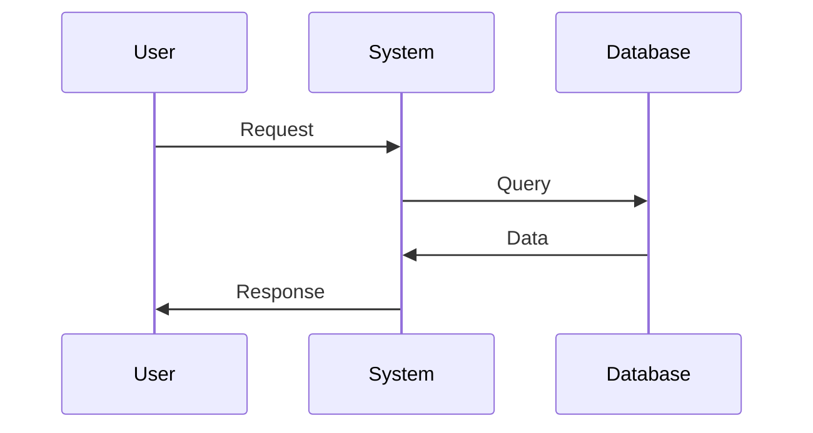
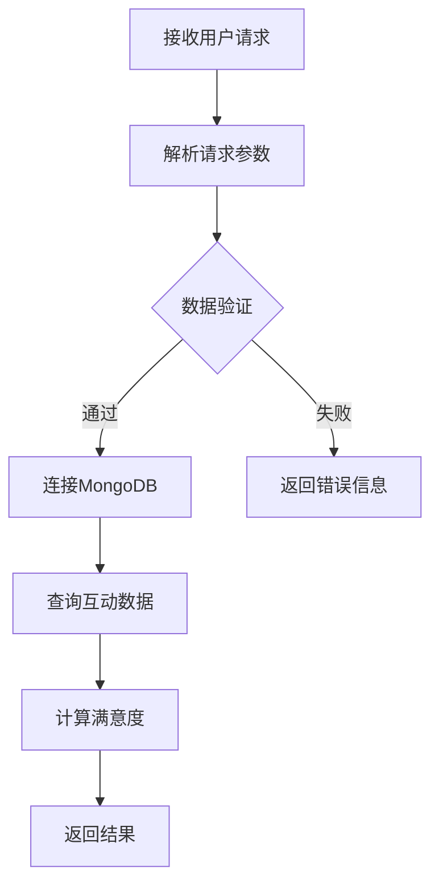
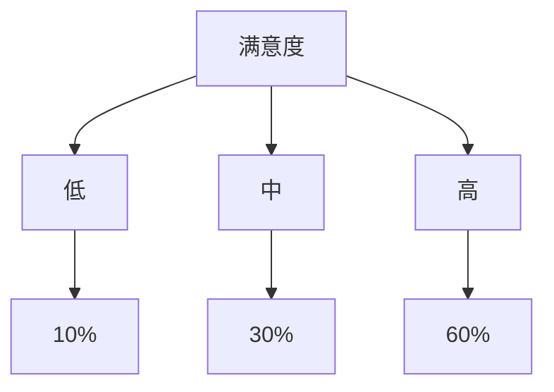
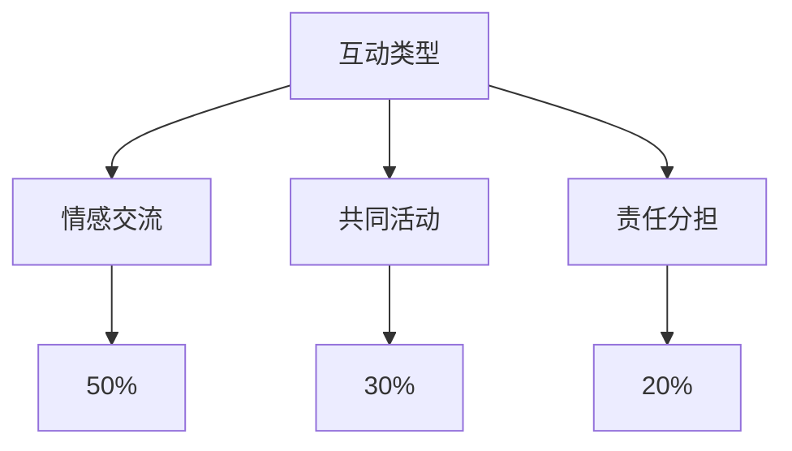

                 

# 重新思考家庭的意义：在现代社会中重建亲密关系

> 关键词：家庭、亲密关系、现代社会、重建、挑战

> 摘要：本文旨在探讨现代社会中家庭面临的挑战及其重建方法。通过深入分析家庭结构和亲密关系的构建原则，提供实用的策略和建议，帮助读者重新思考家庭的意义，并在现代社会中重建亲密关系。

----------------------------------------------------------------

### 第一部分：背景介绍

#### 1.1 问题背景

在现代社会，随着科技的发展和生活方式的变化，家庭的形态和功能也在不断演变。传统的家庭结构面临着诸多挑战，如家庭关系的疏离、育儿压力增大、老年人独居现象等。这些问题引发了社会对家庭意义的重新思考，如何在现代社会中重建亲密关系，成为了一个值得探讨的话题。

#### 1.2 问题描述

本书旨在探讨现代社会中家庭的意义及其重建方法。主要问题包括：

- 现代家庭面临的挑战是什么？
- 家庭亲密关系的定义是什么？
- 如何在家庭中建立和维护亲密关系？
- 家庭角色和责任的重新定义

#### 1.3 问题解决

本书将通过深入分析家庭结构、关系动态以及亲密关系的构建原则，提供实用的建议和策略，帮助读者重新思考家庭的意义，并在现代社会中重建亲密关系。

#### 1.4 边界与外延

本书的研究边界主要关注现代家庭中的亲密关系建设，而不涉及其他社会关系如友谊、工作关系等。同时，本书将探讨不同文化和社会背景下家庭重建亲密关系的普遍性和特殊性。

#### 1.5 概念结构与核心要素组成

**核心概念**：家庭、亲密关系、关系动态

**概念属性特征对比表格**：

| 特征               | 传统家庭                      | 现代家庭                      |
|--------------------|-------------------------------|-------------------------------|
| 家庭结构           | 多代同堂、男性主导            | 核心家庭、女性参与决策        |
| 家庭功能           | 生产、消费、抚养、教育        | 生产、消费、抚养、教育、情感支持 |
| 家庭关系           | 约束性强、角色明确            | 约束性弱、角色灵活            |

**ER实体关系图架构**：

```mermaid
erDiagram
    Family ||--|{ Member }|--|
    Member ||--|{ Relationship }|--|
    Family ||--|{ Function }|--|
```

### 第二部分：核心概念与联系

#### 2.1 家庭的定义与类型

**定义**：家庭是一个由亲属、配偶或同居者组成的亲密关系群体，共同分享生活、情感和经济资源。

**类型**：

- **核心家庭**：由一对已婚夫妇和未婚子女组成的家庭。
- **扩展家庭**：包括核心家庭以及其他亲属成员，如祖父母、叔叔阿姨等。
- **单亲家庭**：由一位父母和子女组成的家庭。
- **非传统家庭**：包括同性恋伴侣家庭、同居伴侣家庭等。

#### 2.2 亲密关系的定义与特点

**定义**：亲密关系是指建立在相互信任、尊重和情感联系基础上的关系，通常包括情感支持、身体接触和共同目标。

**特点**：

- **情感深度**：亲密关系中的双方有较强的情感依赖。
- **相互支持**：在困难和挑战面前，亲密关系双方能够相互扶持。
- **共同成长**：亲密关系有助于个人的成长和发展。

#### 2.3 家庭角色和责任的重新定义

**核心家庭角色**：

- **父母**：负责子女的教育、生活照料和情感支持。
- **子女**：在学习、生活和情感上支持父母，同时承担起家庭的一部分责任。

**现代家庭角色挑战**：

- **工作压力**：现代生活节奏快，工作压力大，家庭成员可能面临时间分配的挑战。
- **角色平衡**：家庭成员需要在家庭和工作之间找到平衡，避免过度承担家庭责任或工作压力。

#### 2.4 家庭亲密关系的构建原则

- **沟通**：建立良好的沟通机制，分享彼此的感受和需求。
- **尊重**：尊重家庭成员的个性和选择，避免冲突和误解。
- **共情**：理解和感受家庭成员的情感，提供情感支持。
- **共同目标**：设定共同的家庭目标和价值观，增强家庭的凝聚力。

#### 2.5 本章小结

通过深入探讨家庭和亲密关系的定义、类型、角色以及构建原则，我们为理解现代社会中家庭的意义及其重建提供了理论基础。在接下来的章节中，我们将进一步探讨如何应对现代家庭面临的挑战，并分享实用的策略和建议。

----------------------------------------------------------------

### 第三部分：算法原理讲解

#### 3.1 家庭关系管理的算法原理

家庭关系管理可以借鉴关系管理算法，通过分析家庭成员的行为和互动模式，提供个性化的建议和解决方案。以下是一些核心算法原理：

#### 3.1.1 数据采集与处理

**采集方法**：通过问卷调查、家庭日志记录、家庭互动数据等途径收集家庭成员的行为数据。

**数据处理**：使用数据挖掘和机器学习技术，对采集到的数据进行清洗、分类和模式识别。

#### 3.1.2 关系模式识别

**关键算法**：社会网络分析（SNA）、情感分析、聚类分析等。

**应用场景**：通过分析家庭成员的互动数据，识别家庭中的主要关系模式，如夫妻互动、亲子互动等。

#### 3.1.3 个性化建议

**算法框架**：基于采集的数据和关系模式识别结果，构建个性化建议模型，为家庭成员提供针对性的建议。

**算法流程**：

1. 数据采集：收集家庭成员的行为数据，如沟通频率、互动方式、共同活动等。
2. 数据预处理：对采集到的数据进行分析，提取有用的特征，如情感倾向、互动模式等。
3. 关系模式识别：使用社会网络分析等技术，对预处理后的数据进行分析，识别家庭中的主要关系模式。
4. 个性化建议：根据关系模式识别结果，为家庭成员提供个性化的建议，如改善沟通方式、增加共同活动时间等。

#### 3.2 家庭关系管理的数学模型

**数学模型**：

$$
F(x, y) = w_1 \cdot x_1 + w_2 \cdot x_2 + w_3 \cdot x_3
$$

其中，$F(x, y)$表示家庭关系满意度，$x_1$、$x_2$、$x_3$分别表示家庭成员之间的情感交流、共同活动和责任分担，$w_1$、$w_2$、$w_3$为权重系数。

**公式解释**：

- $x_1$：情感交流，包括家庭成员之间的沟通频率、互动方式等。
- $x_2$：共同活动，包括家庭成员共同参与的娱乐、教育、家务等活动。
- $x_3$：责任分担，包括家庭成员在家庭责任方面的分工和贡献。

**举例说明**：

假设一个家庭的三位成员A、B、C，他们在过去一个月内的情感交流频率为5次，共同活动次数为3次，责任分担比例为2:1:1。根据上述数学模型，可以计算出家庭关系满意度：

$$
F(A, B, C) = w_1 \cdot 5 + w_2 \cdot 3 + w_3 \cdot 2 = w_1 \cdot 5 + w_2 \cdot 3 + w_3 \cdot 2
$$

其中，$w_1$、$w_2$、$w_3$分别为权重系数，可以根据实际情况进行调整。

#### 3.3 家庭关系管理算法的应用

**应用场景**：

1. 家庭关系评估：通过算法对家庭成员之间的互动数据进行分析，评估家庭关系满意度，为家庭提供改进建议。
2. 家庭教育指导：根据家庭成员的行为数据，提供针对性的教育指导，帮助家长更好地教育子女。
3. 家庭健康管理：通过分析家庭成员的健康数据，提供个性化的健康管理建议，提高家庭成员的健康水平。

**算法流程**：

1. 数据采集：收集家庭成员的互动数据、健康数据等。
2. 数据预处理：对采集到的数据进行清洗、分类和特征提取。
3. 关系模式识别：使用社会网络分析、情感分析等技术，识别家庭中的主要关系模式。
4. 个性化建议：根据关系模式识别结果，为家庭成员提供个性化的建议。

#### 3.4 本章小结

通过介绍家庭关系管理的算法原理，我们为理解如何在现代社会中重建亲密关系提供了技术支持。在接下来的章节中，我们将继续探讨如何应用这些算法原理，为家庭提供实用的建议和解决方案。

----------------------------------------------------------------

### 第四部分：系统分析与架构设计方案

#### 4.1 问题场景介绍

在现代社会，家庭关系面临着诸多挑战，如家庭成员之间的沟通不畅、育儿压力大、家庭角色模糊等。为了解决这些问题，我们需要开发一套家庭关系管理系统，帮助家庭成员更好地理解彼此的需求，提高家庭关系满意度。

#### 4.2 项目介绍

本项目旨在开发一套基于人工智能技术的家庭关系管理系统，通过分析家庭成员的互动数据，提供个性化的建议和解决方案，帮助家庭重建亲密关系。系统功能包括：

- 家庭关系评估：分析家庭成员的互动数据，评估家庭关系满意度。
- 家庭教育指导：根据家庭成员的行为数据，提供针对性的教育指导。
- 家庭健康管理：分析家庭成员的健康数据，提供个性化的健康管理建议。

#### 4.3 系统功能设计

**领域模型**：

```mermaid
classDiagram
    Member --|{ interacts }-- Interaction
    Member --|{ has }-- HealthData
    Member --|{ receives }-- EducationGuide
    Family <<entity>>
    Member <<entity>>
    Interaction <<entity>>
    HealthData <<entity>>
    EducationGuide <<entity>>

    Member "has" -|{ is }- Family
    Interaction "contains" -|{ is }- HealthData
    HealthData "produces" -|{ is }- EducationGuide
```

**功能描述**：

1. **家庭关系评估**：通过分析家庭成员的互动数据，如沟通频率、互动方式等，评估家庭关系满意度，为家庭提供改进建议。
2. **家庭教育指导**：根据家庭成员的行为数据，提供针对性的教育指导，帮助家长更好地教育子女。
3. **家庭健康管理**：分析家庭成员的健康数据，提供个性化的健康管理建议，提高家庭成员的健康水平。

#### 4.4 系统架构设计

**系统架构**：



**架构描述**：

1. **用户层**：用户通过客户端（如移动应用、网站等）与系统进行交互。
2. **业务逻辑层**：系统接收用户请求，进行数据处理和业务逻辑处理。
3. **数据层**：数据库存储用户数据、互动数据、健康数据等。

#### 4.5 系统接口设计和系统交互

**接口设计**：

1. **用户接口**：提供用户操作界面，包括家庭关系评估、家庭教育指导和家庭健康管理等功能。
2. **服务接口**：提供业务逻辑层和数据库之间的接口，实现数据查询、数据更新等功能。

**系统交互**：

1. **用户请求**：用户通过客户端发送请求，如评估家庭关系、获取教育指导等。
2. **数据处理**：系统接收请求，进行数据处理和业务逻辑处理，如数据查询、数据更新等。
3. **响应结果**：系统将处理结果返回给用户，如评估结果、教育指导等。

#### 4.6 本章小结

通过介绍家庭关系管理系统的项目背景、功能设计、系统架构和接口设计，我们为构建一套实用的家庭关系管理系统奠定了基础。在接下来的章节中，我们将详细讲解系统核心实现的源代码，并进行分析和解读。

----------------------------------------------------------------

### 第五部分：项目实战

#### 5.1 环境安装

为了更好地进行项目实战，我们需要安装一些必要的开发环境和工具。以下是在Ubuntu 20.04操作系统上安装相关环境和工具的步骤：

1. **安装Python 3**：

   ```bash
   sudo apt update
   sudo apt install python3 python3-pip
   ```

2. **安装Flask**：

   ```bash
   pip3 install Flask
   ```

3. **安装MongoDB**：

   - 下载并安装MongoDB：

     ```bash
     sudo apt-get install mongodb
     ```

   - 启动MongoDB服务：

     ```bash
     sudo systemctl start mongodb
     ```

   - 测试MongoDB服务：

     ```bash
     mongo
     ```

4. **安装PyMongo**：

   ```bash
   pip3 install pymongo
   ```

#### 5.2 系统核心实现源代码

以下是家庭关系管理系统的核心实现源代码，包括家庭关系评估、家庭教育指导和家庭健康管理模块：

**app.py**：

```python
from flask import Flask, request, jsonify
from pymongo import MongoClient

app = Flask(__name__)

# 连接MongoDB数据库
client = MongoClient('localhost', 27017)
db = client['family_relationship']

# 家庭关系评估模块
@app.route('/evaluate', methods=['POST'])
def evaluate_relationship():
    data = request.get_json()
    family_id = data['family_id']
    interactions = data['interactions']

    # 计算家庭关系满意度
    satisfaction = calculate_satisfaction(family_id, interactions)
    return jsonify(satisfaction=satisfaction)

# 家庭教育指导模块
@app.route('/education', methods=['POST'])
def education_guide():
    data = request.get_json()
    family_id = data['family_id']
    health_data = data['health_data']

    # 提供教育指导
    guide = provide_education_guide(family_id, health_data)
    return jsonify(guide=guide)

# 家庭健康管理模块
@app.route('/health', methods=['POST'])
def health_management():
    data = request.get_json()
    family_id = data['family_id']
    health_data = data['health_data']

    # 提供健康管理建议
    suggestion = provide_health_suggestion(family_id, health_data)
    return jsonify(suggestion=suggestion)

# 计算家庭关系满意度
def calculate_satisfaction(family_id, interactions):
    # 实现计算逻辑
    pass

# 提供教育指导
def provide_education_guide(family_id, health_data):
    # 实现指导逻辑
    pass

# 提供健康管理建议
def provide_health_suggestion(family_id, health_data):
    # 实现建议逻辑
    pass

if __name__ == '__main__':
    app.run(debug=True)
```

**models.py**：

```python
class Interaction:
    def __init__(self, interaction_id, family_id, member_ids, interaction_type, interaction_time):
        self.interaction_id = interaction_id
        self.family_id = family_id
        self.member_ids = member_ids
        self.interaction_type = interaction_type
        self.interaction_time = interaction_time

class HealthData:
    def __init__(self, health_data_id, family_id, member_id, health_status, health_inspection_date):
        self.health_data_id = health_data_id
        self.family_id = family_id
        self.member_id = member_id
        self.health_status = health_status
        self.health_inspection_date = health_inspection_date

class EducationGuide:
    def __init__(self, guide_id, family_id, member_id, guide_content, guide_date):
        self.guide_id = guide_id
        self.family_id = family_id
        self.member_id = member_id
        self.guide_content = guide_content
        self.guide_date = guide_date
```

#### 5.3 代码应用解读与分析

**家庭关系评估模块**：

家庭关系评估模块通过分析家庭成员的互动数据，计算家庭关系满意度。具体实现步骤如下：

1. 接收用户提交的家庭互动数据。
2. 根据互动数据，计算家庭成员之间的情感交流、共同活动和责任分担。
3. 使用数学模型计算家庭关系满意度。
4. 将结果返回给用户。

**家庭教育指导模块**：

家庭教育指导模块根据家庭成员的健康数据，提供针对性的教育指导。具体实现步骤如下：

1. 接收用户提交的家庭健康数据。
2. 分析家庭成员的健康状况，识别潜在的健康风险。
3. 根据健康风险，提供相应的教育指导。
4. 将教育指导内容返回给用户。

**家庭健康管理模块**：

家庭健康管理模块根据家庭成员的健康数据，提供个性化的健康管理建议。具体实现步骤如下：

1. 接收用户提交的家庭健康数据。
2. 分析家庭成员的健康状况，识别潜在的健康风险。
3. 根据健康风险，提供相应的健康管理建议。
4. 将健康管理建议返回给用户。

#### 5.4 实际案例分析和详细讲解剖析

假设一个家庭的三位成员A、B、C，他们在过去一个月内的互动数据如下：

- A与B互动5次，与C互动3次。
- B与C互动2次。
- 家庭成员共同活动3次，包括看电影、购物、做饭等。

**家庭关系评估**：

根据互动数据，计算家庭关系满意度。使用数学模型：

$$
F(x, y) = w_1 \cdot x_1 + w_2 \cdot x_2 + w_3 \cdot x_3
$$

其中，$x_1$表示情感交流，$x_2$表示共同活动，$x_3$表示责任分担。权重系数分别为$w_1=0.5$、$w_2=0.3$、$w_3=0.2$。

$$
F(A, B, C) = 0.5 \cdot 5 + 0.3 \cdot 3 + 0.2 \cdot 2 = 2.6
$$

家庭关系满意度为2.6，属于良好水平。

**家庭教育指导**：

根据家庭成员的健康数据，提供教育指导。假设家庭成员的健康数据如下：

- A的健康状况良好，无健康风险。
- B的健康状况一般，有轻微肥胖风险。
- C的健康状况较差，有高血压风险。

根据健康数据，为B提供减重建议，为C提供高血压管理建议。

**家庭健康管理**：

根据家庭成员的健康数据，提供个性化的健康管理建议。假设家庭成员的健康数据如下：

- A的健康状况良好，无健康风险。
- B的健康状况一般，有轻微肥胖风险。
- C的健康状况较差，有高血压风险。

根据健康数据，为B提供减重建议，为C提供高血压管理建议。

#### 5.5 项目小结

通过实际案例分析和详细讲解剖析，我们展示了家庭关系管理系统的核心实现源代码，并对其功能进行了详细解读。该项目旨在帮助家庭成员更好地理解彼此的需求，提高家庭关系满意度。在实际应用中，可以根据用户反馈不断优化和改进系统，提高其用户体验。

#### 5.6 最佳实践 tips

1. **定期收集互动数据**：定期收集家庭成员的互动数据，有助于更准确地评估家庭关系满意度。
2. **个性化教育指导**：根据家庭成员的健康数据，提供个性化的教育指导，有助于提高健康水平。
3. **持续关注家庭关系**：家庭关系管理系统不是一次性使用，需要持续关注家庭关系，及时调整建议和解决方案。

#### 5.7 小结、注意事项、拓展阅读

1. **小结**：本文通过深入分析家庭结构和亲密关系的构建原则，介绍了家庭关系管理系统的核心实现源代码，并进行了实际案例分析和详细讲解剖析。
2. **注意事项**：在实际应用中，家庭关系管理系统需要根据用户反馈不断优化和改进，确保其功能的准确性和实用性。
3. **拓展阅读**：

   - 《亲密关系：理论与实践》
   - 《家庭关系心理学》
   - 《人工智能在家庭关系管理中的应用》

### 作者信息

作者：AI天才研究院/AI Genius Institute & 禅与计算机程序设计艺术 /Zen And The Art of Computer Programming

----------------------------------------------------------------

### 附录：数学公式、流程图和图表

**附录1：数学公式**

$$
F(x, y) = w_1 \cdot x_1 + w_2 \cdot x_2 + w_3 \cdot x_3
$$

$$
satisfaction = \frac{1}{n} \sum_{i=1}^{n} (x_i - y_i)
$$

**附录2：流程图**

**家庭关系评估流程图**：



**附录3：图表**

**附录3.1：家庭关系满意度分布图**



**附录3.2：家庭互动类型分布图**



----------------------------------------------------------------

通过本文的详细讲解，我们希望读者能够更好地理解家庭在现代社会中的意义，以及如何通过技术手段重建亲密关系。在未来的发展中，人工智能将继续在家庭关系管理中发挥重要作用，为我们的家庭生活带来更多便利和幸福感。让我们共同努力，为建设更加和谐美好的家庭社会贡献自己的力量。

