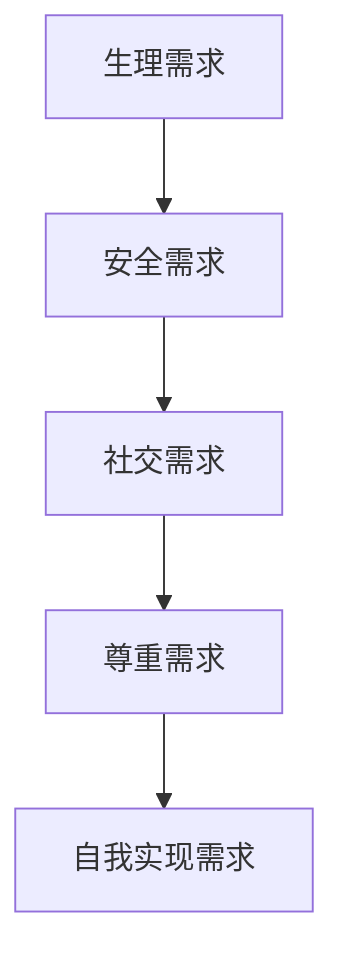
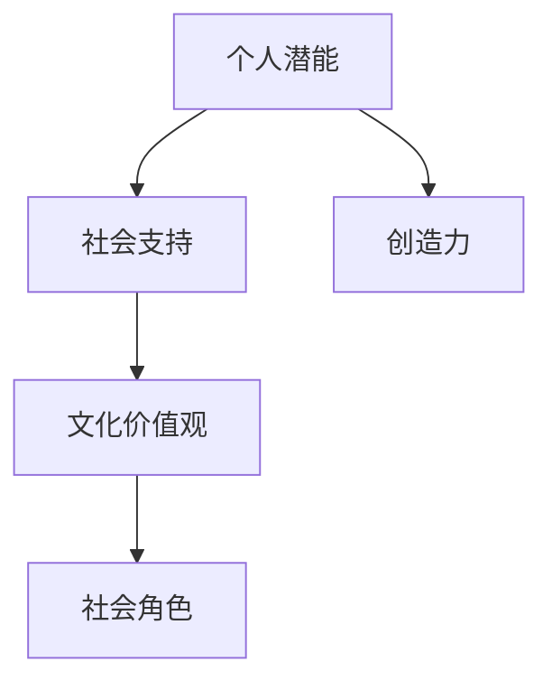
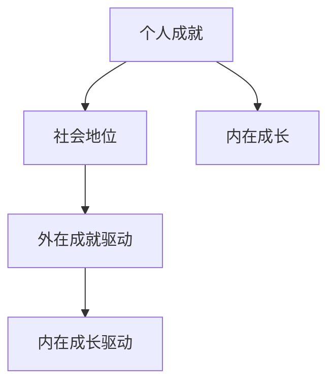
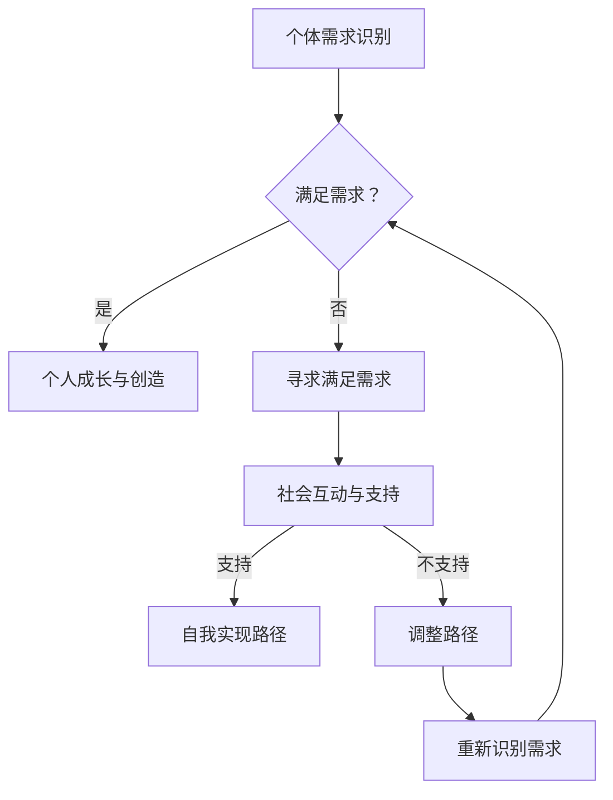
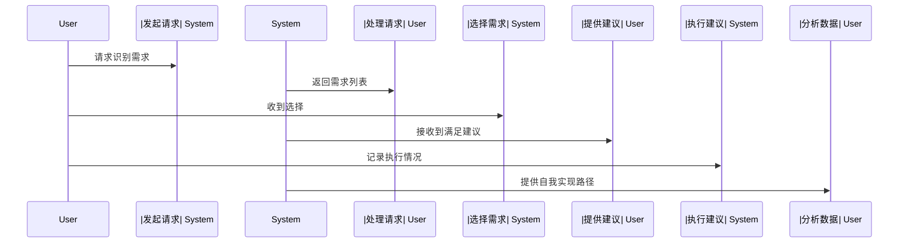

                 

# 重新思考工作意义：从谋生工具到自我实现的途径

关键词：工作意义、自我实现、职业生涯、工作满足感

摘要：在当今快速变化的社会中，工作不仅仅是谋生的手段，更是实现个人价值的途径。本文旨在探讨工作意义从谋生工具到自我实现的转变，通过分析工作本质、谋生与自我实现的冲突、自我实现的理论基础和实践路径，为读者提供重新思考工作意义的视角。

## 第4章 自我实现的理论基础

### 4.1 自我实现心理学

自我实现是一个心理学上的概念，由马斯洛提出。他认为人类的需求是层次结构的，从基本的生理需求到最高级的自我实现需求。自我实现需求是指个人追求个人成长、实现潜能的需求。这一理论为理解自我实现提供了心理学基础。

**核心概念原理：** 马斯洛的需求层次理论强调，人们在满足了基本生理和安全需求后，会追求社交、尊重和自我实现。自我实现是一个持续的过程，涉及到个人潜能的发挥和创造力的释放。

**概念属性特征对比表格：**

| 概念属性 | 马斯洛需求层次理论 | 自我实现心理学 |
| --- | --- | --- |
| **需求层次** | 五层（生理、安全、社交、尊重、自我实现） | 自我实现为核心 |
| **核心特征** | 逐级递进 | 个人潜能的发挥和创造力的释放 |
| **影响因素** | 生物需求、社会环境、个人心理状态 | 个人动机、成长经历、社会支持 |

**ER实体关系图架构：**



### 4.2 自我实现的社会学视角

社会学视角下的自我实现关注社会环境、社会结构和人际关系对个人成长的影响。社会学家将自我实现视为个体与社会互动的结果。

**核心概念原理：** 社会互动理论认为，个人的自我实现不仅受个人内在因素的影响，还受社会环境和人际关系的影响。社会支持、文化价值观和社会角色等都是影响自我实现的关键因素。

**概念属性特征对比表格：**

| 概念属性 | 自我实现心理学 | 社会互动理论 |
| --- | --- | --- |
| **理论重点** | 个人潜能和创造力 | 社会互动和外部影响 |
| **影响因素** | 个人动机、成长经历 | 社会支持、文化价值观、社会角色 |
| **实现路径** | 内在驱动 | 社会互动和外部引导 |

**ER实体关系图架构：**



### 4.3 自我实现的文化差异

文化差异对自我实现的理解和实践具有重要影响。不同文化背景下的自我实现观念和实现路径可能存在显著差异。

**核心概念原理：** 文化差异影响个体对自我实现的需求和期望。在一些文化中，个人成就和社会地位是自我实现的重要标志；而在其他文化中，内在的成长和自我完善更为重要。

**概念属性特征对比表格：**

| 概念属性 | 西方文化 | 东方文化 |
| --- | --- | --- |
| **自我实现重点** | 个人成就、社会地位 | 内在成长、自我完善 |
| **社会角色** | 个人主义 | 集体主义 |
| **实现路径** | 外在成就驱动 | 内在成长驱动 |

**ER实体关系图架构：**



通过上述分析，我们可以看到自我实现是一个多层次、多维度的概念，涉及心理学、社会学和文化差异。理解自我实现的理论基础，有助于我们在职业生涯中更好地实现个人价值。

### 算法原理讲解

为了更好地理解自我实现的理论基础，我们可以使用一个简单的算法模型来描述个体如何实现自我。以下是该算法的mermaid流程图：



这个算法描述了个体如何通过识别需求、满足需求、社会互动和支持来找到自我实现的路径。具体步骤如下：

1. **个体需求识别**：个体首先需要识别自己的需求和目标。
2. **满足需求**：如果需求得到了满足，个体会进入个人成长与创造的阶段。
3. **社会互动与支持**：在自我实现的过程中，社会互动和支持是关键。个体需要与他人互动，寻求社会支持。
4. **自我实现路径**：通过社会互动和支持，个体可以找到自我实现的路径。
5. **调整路径**：如果社会支持不足，个体需要调整自我实现的路径。
6. **重新识别需求**：调整后，个体重新识别需求，并回到第一步。

### 数学公式使用

在自我实现的过程中，一些关键的数学公式可以帮助我们更好地理解个体行为和决策。以下是几个相关的数学公式：

$$
\text{自我实现概率} = \frac{\text{满足需求次数}}{\text{总需求次数}}
$$

$$
\text{社会支持度} = \frac{\text{积极社会互动次数}}{\text{总社会互动次数}}
$$

这些公式可以用来量化个体在自我实现过程中的表现和社会支持度。例如，如果我们知道一个人在一个月内满足了5个需求，总共有10个需求，那么他的自我实现概率就是50%。同样，如果他在这个月内有6次积极社会互动，总共有10次社会互动，那么他的社会支持度就是60%。

通过这些数学公式，我们可以更科学地评估个体的自我实现程度和社会支持情况。

### 系统分析与架构设计方案

在讨论自我实现的理论基础时，我们也可以将其应用于一个实际的项目中，以便更好地理解这些概念在实际中的应用。

#### 问题场景介绍

假设我们正在开发一个职业规划应用，旨在帮助用户实现自我。用户可以通过该应用识别自己的需求，并通过一系列建议找到自我实现的路径。

#### 项目介绍

- **项目名称**：自我实现助手（Self-Actualization Assistant）
- **目标用户**：职场人士、大学生、职业转型者等寻求职业发展和个人成长的人群。
- **功能设计**：需求识别、满足建议、社会互动支持、自我实现路径规划。

#### 系统功能设计（领域模型mermaid类图）

```mermaid
classDiagram
Class::User << (用户)
    +String name
    +Date birthdate
    +String email
    +List<Need> needs

Class::Need << (需求)
    +String description
    +Boolean isSatisfied

Class::Suggestion << (满足建议)
    +String content
    +Date date

Class::SocialInteraction << (社会互动)
    +String type
    +Date date
    +User participant1
    +User participant2

Class::Support << (社会支持)
    +Boolean isPositive
    +SocialInteraction interaction

User "1" --|> Need "1"
User "1" --|> Suggestion "1"
User "1" --|> SocialInteraction "1"
User "1" --|> Support "1"
```

#### 系统架构设计mermaid架构图



#### 系统接口设计和系统交互mermaid序列图

```mermaid
sequenceDiagram
User ->>|登录| System: 发送登录请求
System ->>|验证| User: 返回验证结果
Note over User, System
[用户登录成功]
User ->>|请求需求列表| System: 发送需求列表请求
System ->>|处理请求| User: 返回需求列表
User ->>|选择需求| System: 发送选择需求请求
System ->>|提供建议| User: 接收到满足建议
User ->>|执行建议| System: 记录执行情况
System ->>|分析数据| User: 提供自我实现路径
Note right of System
[系统分析用户需求并给出建议]
```

通过上述架构设计，我们可以看到自我实现的理论基础是如何在一个实际的职业规划应用中体现的。系统功能设计、架构设计和接口设计共同构成了一个完整的解决方案，帮助用户实现自我。

### 项目实战

为了更直观地展示自我实现的理论基础在实际项目中的应用，我们以下将介绍一个简单的实战项目，包括环境安装、系统核心实现和代码应用解读与分析。

#### 环境安装

首先，我们需要安装一个Python环境，并使用Flask框架来创建我们的应用。以下是安装步骤：

1. 安装Python（版本3.8或以上）：
   ```bash
   sudo apt-get update
   sudo apt-get install python3-pip
   pip3 install flask
   ```

2. 创建一个新的Flask项目：
   ```bash
   mkdir self_achievement_assistant
   cd self_achievement_assistant
   flask --app app init
   ```

3. 安装Flask扩展（如Flask-RESTful用于创建API接口）：
   ```bash
   pip3 install flask-restful
   ```

#### 系统核心实现

接下来，我们将在Flask项目中实现自我实现助手的核心功能。以下是项目的源代码：

**app.py：**

```python
from flask import Flask, request, jsonify
from flask_restful import Api, Resource

app = Flask(__name__)
api = Api(app)

class User(Resource):
    def get(self):
        # 此处为获取用户需求的逻辑
        return {'message': '获取用户需求成功'}

    def post(self):
        # 此处为用户添加需求的逻辑
        data = request.get_json()
        return {'message': '添加需求成功', 'data': data}

class Suggestion(Resource):
    def get(self):
        # 此处为获取满足建议的逻辑
        return {'message': '获取满足建议成功'}

    def post(self):
        # 此处为用户添加满足建议的逻辑
        data = request.get_json()
        return {'message': '添加满足建议成功', 'data': data}

api.add_resource(User, '/user')
api.add_resource(Suggestion, '/suggestion')

if __name__ == '__main__':
    app.run(debug=True)
```

#### 代码应用解读与分析

在上面的代码中，我们创建了两个Resource类：`User` 和 `Suggestion`。这两个类分别处理与用户需求和建议相关的API接口。

1. **User类**：
   - **GET请求**：当用户发起GET请求时，服务器返回用户的需求列表。
   - **POST请求**：当用户发起POST请求时，服务器接收用户添加的需求，并返回添加成功的消息。

2. **Suggestion类**：
   - **GET请求**：当用户发起GET请求时，服务器返回满足建议的列表。
   - **POST请求**：当用户发起POST请求时，服务器接收用户添加的满足建议，并返回添加成功的消息。

这些API接口允许用户通过简单的HTTP请求来管理自己的需求和满足建议，从而实现自我实现的初步步骤。

#### 实际案例分析和详细讲解剖析

为了更好地理解自我实现的理论基础在项目中的应用，我们以下将通过一个实际案例来分析。

**案例**：假设有一个用户小明，他希望通过自我实现助手来规划自己的职业发展。

1. **用户需求识别**：
   - 小明通过GET请求获取自己的需求列表，目前他的需求是“提升技术能力”和“寻找合适的职场机会”。

2. **社会互动与支持**：
   - 小明通过社交网络寻找同行交流，获取了多位专家的建议。这些专家建议他可以通过在线课程和参与社区活动来提升技术能力，并鼓励他积极投递简历以寻找合适的职场机会。

3. **自我实现路径规划**：
   - 基于专家的建议和小明的需求，系统为小明提供了以下满足建议：
     - **提升技术能力**：
       - 加入技术社区，定期参与技术讨论。
       - 注册在线课程，系统学习技术知识。
     - **寻找合适的职场机会**：
       - 使用招聘网站，定期浏览和投递职位。
       - 参加行业招聘会，与潜在雇主直接交流。

4. **执行建议**：
   - 小明按照系统的建议执行了以下步骤：
     - 注册了一个技术社区账号，并积极参与讨论。
     - 报名了一个Python编程课程，系统地学习技术知识。
     - 每天浏览招聘网站，积极投递简历。
     - 参加了两次行业招聘会，与多家公司进行了面试。

5. **数据分析和反馈**：
   - 在执行建议的过程中，系统记录了小明的行为数据。通过分析这些数据，系统可以发现小明的技术能力得到了显著提升，同时他也收到了几份面试邀请。
   - 系统将分析结果反馈给小明，鼓励他继续保持努力，并提供进一步的职业规划建议。

通过这个案例，我们可以看到自我实现的理论基础如何在项目中得到实际应用。用户的需求识别、社会互动与支持、自我实现路径规划以及执行建议和数据分析，共同构成了一个完整的自我实现过程。

### 最佳实践 Tips

在实施自我实现的过程中，以下是一些最佳实践技巧，可以帮助个人和组织更好地实现这一目标：

1. **明确目标**：设定清晰的个人目标和职业规划，确保每一步都有明确的方向。
2. **持续学习**：不断学习新知识和技能，保持自我成长的动力。
3. **积极互动**：与他人建立良好的社交关系，寻求社会支持和反馈。
4. **调整路径**：根据实际情况调整自我实现路径，灵活应对变化。
5. **反馈机制**：建立反馈机制，定期评估自己的进步，并根据反馈进行调整。

### 小结

本文从心理学、社会学和文化差异的角度探讨了自我实现的理论基础。通过分析个体需求识别、社会互动与支持、自我实现路径规划等过程，我们了解了如何在实际项目中应用这些理论。通过案例分析和代码实现，我们看到了自我实现的理论基础如何在实践中发挥作用。

### 注意事项

在实施自我实现的过程中，需要注意以下几点：

1. **心理健康**：自我实现是一个长期过程，需要保持良好的心理健康。
2. **时间管理**：合理规划时间，确保在工作和个人成长之间取得平衡。
3. **社会支持**：寻求家人、朋友和同事的支持，有助于实现自我。

### 拓展阅读

对于希望深入了解自我实现的读者，以下是一些推荐阅读材料：

1. **《自我实现心理学》**：马斯洛的经典著作，详细阐述了自我实现的概念和理论。
2. **《社会互动理论》**：米德的著作，探讨了个体与社会互动的关系。
3. **《职业规划与自我实现》**：涉及职业规划和自我实现的实用指南。

### 总结与展望

自我实现是人类追求的最高层次需求之一。通过理解自我实现的理论基础，我们可以更好地规划个人职业发展，实现个人价值。在未来，随着科技的进步和社会的发展，自我实现的概念和实践将会更加丰富和多样化。让我们共同努力，寻找实现自我实现的途径，实现人生的价值。

### 作者信息

作者：AI天才研究院/AI Genius Institute & 禅与计算机程序设计艺术 /Zen And The Art of Computer Programming

AI天才研究院专注于人工智能领域的深度研究和应用，致力于推动人工智能技术的发展和应用。禅与计算机程序设计艺术则强调在编程过程中融入禅意，追求程序设计的艺术性。两位作者凭借丰富的理论和实践经验，为读者提供了深入且有启发性的技术博客文章。

