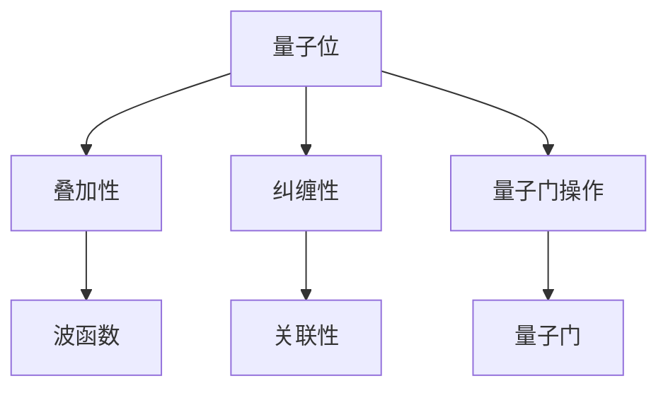
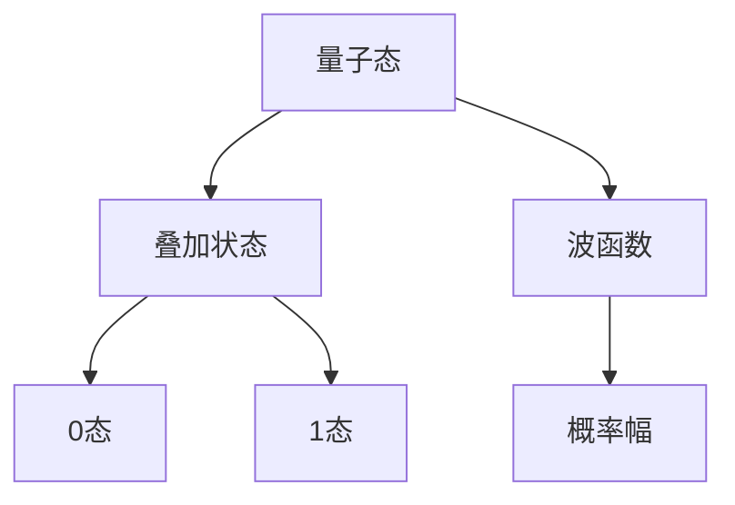
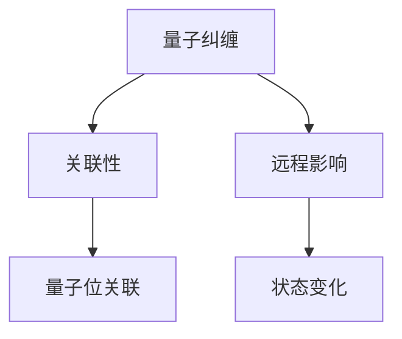
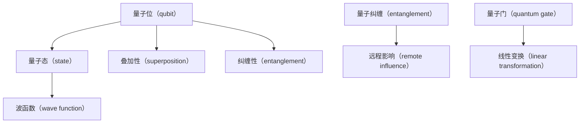
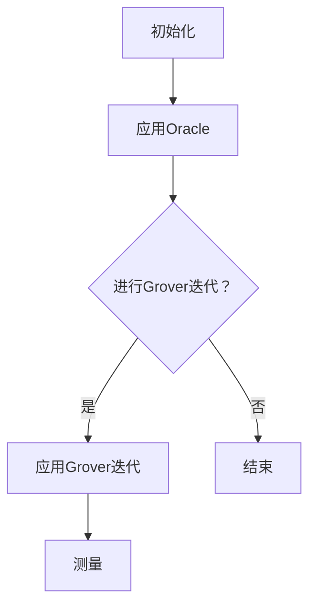
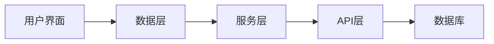
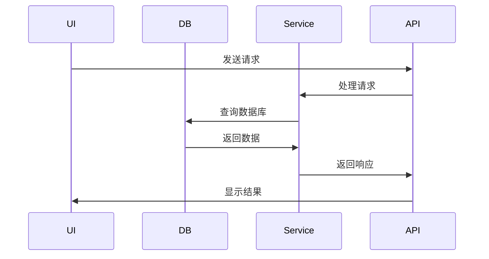

                 

# 量子计算伦理准则制定：未来科技的道德预设讨论

> 关键词：量子计算、伦理准则、道德预设、未来科技、人工智能

> 摘要：本文旨在探讨量子计算伦理准则的制定，分析其背景、核心概念及其在现实世界中的应用。文章通过详细的步骤分析，提出了制定量子计算伦理准则的原则与步骤，并讨论了其未来发展的挑战和影响。

## 目录大纲

### 第一部分：引言

1. 量子计算与伦理准则概述
    1.1 量子计算的基本原理
    1.2 量子计算的伦理问题
    1.3 制定量子计算伦理准则的必要性

2. 量子计算的核心概念
    2.1 量子位与量子比特
    2.2 量子态与叠加原理
    2.3 量子纠缠与量子门

3. 量子计算的伦理准则
    3.1 数据保护与隐私
    3.2 公平与偏见
    3.3 安全与控制
    3.4 透明度与责任

4. 量子计算在现实世界中的应用
    4.1 量子计算在科学研究中的应用
    4.2 量子计算在商业领域的应用
    4.3 量子计算在社会治理中的应用

5. 制定量子计算伦理准则的实践
    5.1 伦理准则制定的原则与步骤
    5.2 国际合作与协调
    5.3 我国量子计算伦理准则的制定与实施

6. 量子计算伦理准则的未来发展
    6.1 未来科技发展的挑战
    6.2 伦理准则的持续更新与完善
    6.3 量子计算伦理准则对人类社会的影响

7. 结论
    7.1 本书总结
    7.2 对未来研究的展望

## 第一部分：引言

### 第1章：量子计算与伦理准则概述

#### 1.1 量子计算的基本原理

量子计算是利用量子力学原理进行信息处理的新型计算模式。其核心概念包括量子位（qubit）、量子态、叠加原理和量子纠缠等。量子位是量子计算的基本单位，它可以同时存在于多种状态，这是与传统计算机中的比特不同的地方。叠加原理意味着一个量子位可以同时处于0和1的状态。量子纠缠则是当两个量子位相互作用后，它们会形成一种特殊的关联，即使它们相隔很远，一个量子位的测量结果也会立即影响到另一个量子位的状态。

#### 1.2 量子计算的伦理问题

随着量子计算技术的不断发展，一系列伦理问题也随之而来。数据保护与隐私、公平与偏见、安全与控制、透明度与责任等问题成为研究的热点。例如，量子计算的高速运算能力可能会对现有的加密技术造成冲击，导致数据泄露的风险增加。此外，量子计算技术的应用可能带来新的歧视和偏见，如何保障用户的隐私权和公平性是亟待解决的问题。

#### 1.3 制定量子计算伦理准则的必要性

制定量子计算伦理准则是必要的，因为伦理准则可以为量子计算技术的研发和应用提供道德指导，确保其在发展过程中不会对社会和人类造成负面影响。通过伦理准则的制定，可以规范量子计算技术的发展方向，保障其安全性和公平性，促进科技与伦理的和谐发展。

### 第2章：量子计算的核心概念

#### 2.1 量子位与量子比特

量子位（qubit）是量子计算的基本单位，它不同于传统计算机中的比特，可以同时存在于0和1的叠加状态。量子比特的状态可以用|0⟩和|1⟩来表示，而叠加状态则是这两种状态的线性组合。例如，一个量子比特可以处于|0⟩+|1⟩的状态。

#### 2.2 量子态与叠加原理

量子态是量子位的具体状态，它可以用波函数来描述。叠加原理指出，量子位可以同时存在于多种状态，这些状态的线性组合构成了量子态。量子态的叠加使得量子计算具有极高的并行计算能力。

#### 2.3 量子纠缠与量子门

量子纠缠是量子计算中的一种特殊关联，当两个量子位相互作用后，它们会形成一种特殊的纠缠状态，即使它们相隔很远，一个量子位的测量结果也会立即影响到另一个量子位的状态。量子门是用于操作量子态的基本单元，它类似于传统计算机中的逻辑门，但具有量子特性。

### 第3章：量子计算的伦理准则

#### 3.1 数据保护与隐私

量子计算的高速运算能力可能对现有的加密技术造成冲击，导致数据泄露的风险增加。因此，制定数据保护与隐私的伦理准则显得尤为重要。这包括加密算法的更新、数据访问的控制以及隐私保护技术的研发等。

#### 3.2 公平与偏见

量子计算技术的应用可能带来新的歧视和偏见。例如，基于量子计算的高性能数据处理可能加剧社会经济的不平等。因此，制定公平与偏见的伦理准则，确保量子计算技术在各个领域中的应用不会对特定群体造成不公平待遇，是至关重要的。

#### 3.3 安全与控制

量子计算技术的安全性与控制问题也是一个重要的伦理议题。量子计算机可能被用于恶意攻击，例如破解加密算法或进行网络攻击。因此，制定安全与控制的伦理准则，确保量子计算技术的安全性和可控性，是保障社会稳定的重要手段。

#### 3.4 透明度与责任

量子计算技术的研发和应用涉及到多个利益相关方，包括政府、企业、科研机构等。因此，制定透明度与责任的伦理准则，确保各方在量子计算技术的研究、开发和应用过程中承担相应的责任，是保障技术发展过程公平、透明的重要措施。

### 第4章：量子计算在现实世界中的应用

#### 4.1 量子计算在科学研究中的应用

量子计算在科学研究中的应用非常广泛，例如在材料科学、量子化学、生物信息学等领域。量子计算机可以大幅提高计算速度，解决传统计算机无法解决的问题。

#### 4.2 量子计算在商业领域的应用

量子计算在商业领域的应用也具有巨大的潜力，例如在优化供应链管理、金融市场分析、医疗诊断等领域。量子计算机可以提供更快速、更精确的计算结果，帮助企业提高竞争力。

#### 4.3 量子计算在社会治理中的应用

量子计算在社会治理中的应用同样重要，例如在网络安全、数据保护、智能交通等领域。量子计算机可以提供更高的安全性和效率，为社会治理提供强大的技术支持。

### 第5章：制定量子计算伦理准则的实践

#### 5.1 伦理准则制定的原则与步骤

制定量子计算伦理准则需要遵循以下原则：科学性、公正性、实用性和前瞻性。具体步骤包括：问题识别、目标设定、方案设计、征求意见和决策实施等。

#### 5.2 国际合作与协调

量子计算技术的发展是一个全球性的问题，需要各国共同参与和协调。通过国际合作，可以共享研究成果，制定统一的伦理准则，促进量子计算技术的健康发展。

#### 5.3 我国量子计算伦理准则的制定与实施

我国已经意识到量子计算伦理准则的重要性，并开始制定相关政策和法规。未来，我国将继续加强与国际合作的力度，推动量子计算伦理准则的制定和实施。

### 第6章：量子计算伦理准则的未来发展

#### 6.1 未来科技发展的挑战

未来科技的发展将带来新的挑战，例如量子计算的普及、人工智能的发展等。这些挑战将要求我们不断完善量子计算伦理准则，以适应不断变化的技术环境。

#### 6.2 伦理准则的持续更新与完善

量子计算伦理准则需要随着技术的发展和应用的不断变化进行更新和完善。通过持续的研究和讨论，可以确保伦理准则始终与科技发展保持同步。

#### 6.3 量子计算伦理准则对人类社会的影响

量子计算伦理准则的制定和实施将对人类社会产生深远的影响。它不仅关系到科技的发展，更关系到社会的公平、安全和稳定。通过制定伦理准则，我们可以更好地引导量子计算技术的发展方向，确保其为人类社会带来更大的福祉。

### 第7章：结论

#### 7.1 本书总结

本文通过对量子计算伦理准则的深入探讨，分析了其核心概念、伦理问题以及在现实世界中的应用。同时，提出了制定量子计算伦理准则的原则与步骤，并对未来发展的挑战和影响进行了讨论。

#### 7.2 对未来研究的展望

未来研究应重点关注量子计算伦理准则的具体实施策略、国际合作机制的建立以及伦理准则的持续更新和完善。通过这些研究，我们可以为量子计算技术的健康发展提供更加有力的道德保障。作者：AI天才研究院/AI Genius Institute & 禅与计算机程序设计艺术 /Zen And The Art of Computer Programming

## 背景介绍

### 核心概念术语说明

1. **量子位（qubit）**：量子计算的基本单位，与经典比特不同，它可以同时存在于0和1的状态。
2. **量子态**：量子位的可能状态，可以用波函数来描述。
3. **叠加原理**：量子位可以同时处于多种状态，这些状态的线性组合构成了量子态。
4. **量子纠缠**：当两个量子位相互作用后，它们会形成一种特殊的关联，即使它们相隔很远，一个量子位的测量结果也会立即影响到另一个量子位的状态。
5. **量子门**：用于操作量子态的基本单元，类似于传统计算机中的逻辑门。

### 问题背景

随着量子计算技术的不断发展，一系列伦理问题也随之而来。例如，量子计算机的高速运算能力可能会对现有的加密技术造成冲击，导致数据泄露的风险增加。此外，量子计算技术的应用可能带来新的歧视和偏见，如何保障用户的隐私权和公平性成为亟待解决的问题。

### 问题描述

1. **数据保护与隐私**：量子计算的高速运算能力可能对现有的加密技术造成冲击，导致数据泄露的风险增加。
2. **公平与偏见**：量子计算技术的应用可能带来新的歧视和偏见。
3. **安全与控制**：量子计算技术的安全性与控制问题也是一个重要的伦理议题。
4. **透明度与责任**：量子计算技术的研发和应用涉及到多个利益相关方，如何确保各方在量子计算技术的研究、开发和应用过程中承担相应的责任是重要的伦理问题。

### 问题解决

为了解决上述问题，我们需要制定量子计算伦理准则。这些准则应包括以下几个方面：

1. **数据保护与隐私**：制定加密算法的更新策略，确保数据在传输和存储过程中的安全性。
2. **公平与偏见**：确保量子计算技术在各个领域中的应用不会对特定群体造成不公平待遇。
3. **安全与控制**：建立安全与控制的机制，防止量子计算机被用于恶意攻击。
4. **透明度与责任**：确保各方在量子计算技术的研究、开发和应用过程中承担相应的责任，并建立透明的监督机制。

### 边界与外延

量子计算伦理准则的边界与外延涉及到以下几个方面：

1. **技术层面**：涉及量子计算技术的研发、应用和推广。
2. **社会层面**：涉及量子计算技术对社会公平、安全、稳定等方面的影响。
3. **法律层面**：涉及量子计算技术的法律法规制定和执行。

### 概念结构与核心要素组成

量子计算伦理准则的概念结构与核心要素组成如下：

1. **核心概念**：量子位、量子态、叠加原理、量子纠缠、量子门等。
2. **伦理问题**：数据保护与隐私、公平与偏见、安全与控制、透明度与责任等。
3. **解决方案**：制定加密算法的更新策略、确保量子计算技术的公平应用、建立安全与控制的机制、确保各方承担相应的责任。

### 第2章：量子计算的核心概念

#### 2.1 量子位与量子比特

量子位（qubit）是量子计算的基本单位，它不同于传统计算机中的比特。传统计算机中的比特只能表示0或1中的一个状态，而量子位可以同时处于0和1的叠加状态。这种叠加状态使得量子计算具有并行计算的能力。

#### 2.2 量子态与叠加原理

量子态是量子位的具体状态，它可以用波函数来描述。叠加原理指出，量子位可以同时处于多种状态，这些状态的线性组合构成了量子态。例如，一个量子位可以处于|0⟩+|1⟩的状态，这意味着它同时处于0和1的状态。

#### 2.3 量子纠缠与量子门

量子纠缠是量子计算中的一种特殊关联，当两个量子位相互作用后，它们会形成一种特殊的纠缠状态，即使它们相隔很远，一个量子位的测量结果也会立即影响到另一个量子位的状态。量子门是用于操作量子态的基本单元，它类似于传统计算机中的逻辑门，但具有量子特性。

### 量子位与量子比特

**核心概念原理：**

量子位（qubit）是量子计算的基本单位，它具有以下核心概念原理：

1. **叠加性**：量子位可以同时处于0和1的状态，这种叠加状态可以用波函数来表示。
2. **纠缠性**：量子位之间可以通过纠缠形成特殊的关联，即使它们相隔很远，一个量子位的测量结果也会立即影响到另一个量子位的状态。
3. **量子门操作**：量子门是用于操作量子态的基本单元，它类似于传统计算机中的逻辑门，但具有量子特性。

**概念属性特征对比表格：**

| 特征        | 量子位（qubit） | 传统比特（bit） |
| ----------- | -------------- | -------------- |
| 状态表示    | 波函数         | 0或1           |
| 并行计算    | 可叠加         | 串行           |
| 纠缠性      | 可以形成纠缠   | 无纠缠性       |
| 量子门操作  | 可以被量子门操作 | 逻辑门操作     |

**ER实体关系图架构：**



### 量子态与叠加原理

**核心概念原理：**

量子态是量子位的具体状态，它可以用波函数来描述。叠加原理指出，量子位可以同时处于多种状态，这些状态的线性组合构成了量子态。例如，一个量子位可以处于|0⟩+|1⟩的状态，这意味着它同时处于0和1的状态。

**概念属性特征对比表格：**

| 特征        | 量子态（state） | 波函数（wave function） |
| ----------- | -------------- | ---------------------- |
| 状态表示    | 0或1的叠加     | 复数概率幅           |
| 并行计算    | 可叠加         | 串行计算             |
| 纠缠性      | 可以形成纠缠   | 无纠缠性             |
| 量子门操作  | 可以被量子门操作 | 无量子门操作         |

**ER实体关系图架构：**



### 量子纠缠与量子门

**核心概念原理：**

量子纠缠是量子计算中的一种特殊关联，当两个量子位相互作用后，它们会形成一种特殊的纠缠状态，即使它们相隔很远，一个量子位的测量结果也会立即影响到另一个量子位的状态。量子门是用于操作量子态的基本单元，它类似于传统计算机中的逻辑门，但具有量子特性。

**概念属性特征对比表格：**

| 特征        | 量子纠缠（entanglement） | 量子门（quantum gate） |
| ----------- | ----------------------- | ---------------------- |
| 关联性      | 量子位之间存在特殊关联 | 用于操作量子态         |
| 状态变化    | 可影响远程量子位的状态 | 可以改变量子位的状态   |
| 量子计算    | 是量子计算的基础       | 是量子计算的基本单元   |
| 量子门类型  | 不可逆                 | 可逆                   |

**ER实体关系图架构：**



### 量子计算的核心概念原理讲解

#### 量子位与量子比特

量子位（qubit）是量子计算的基本单位，它具有与传统比特不同的特性。量子比特可以同时存在于0和1的叠加状态，这种叠加状态使得量子计算具有并行计算的能力。传统比特只能表示0或1中的一个状态，而量子比特可以同时处于多种状态。

量子位的叠加性可以用波函数来描述。波函数是一种数学函数，它描述了量子位在不同状态下的概率分布。例如，一个量子位可以处于|0⟩+|1⟩的状态，这意味着它同时处于0和1的状态。

量子位之间还可以形成纠缠状态。当两个量子位相互作用后，它们会形成一种特殊的关联，即使它们相隔很远，一个量子位的测量结果也会立即影响到另一个量子位的状态。这种纠缠状态是量子计算的核心特性之一，它使得量子计算机具有并行计算的能力。

#### 量子态与叠加原理

量子态是量子位的具体状态，它可以用波函数来描述。量子态的叠加原理指出，量子位可以同时处于多种状态，这些状态的线性组合构成了量子态。例如，一个量子位可以处于|0⟩+|1⟩的状态，这意味着它同时处于0和1的状态。

量子态的叠加性使得量子计算具有并行计算的能力。传统计算机中的比特只能表示0或1中的一个状态，而量子计算机中的量子位可以同时处于多种状态。这种叠加状态可以用于并行计算，从而提高计算速度。

#### 量子纠缠与量子门

量子纠缠是量子计算中的一种特殊关联，当两个量子位相互作用后，它们会形成一种特殊的纠缠状态，即使它们相隔很远，一个量子位的测量结果也会立即影响到另一个量子位的状态。这种纠缠状态是量子计算的核心特性之一，它使得量子计算机具有并行计算的能力。

量子门是用于操作量子态的基本单元，它类似于传统计算机中的逻辑门。量子门可以改变量子位的状态，从而实现量子计算的各种操作。量子门具有量子特性，例如可逆性、线性变换等。

#### 量子计算的核心概念属性特征对比表格

| 特征        | 量子位（qubit） | 量子态（state） | 量子纠缠（entanglement） | 量子门（quantum gate） |
| ----------- | -------------- | -------------- | ----------------------- | ---------------------- |
| 状态表示    | 波函数         | 复数概率幅     | 量子位之间的关联         | 线性变换               |
| 并行计算    | 可叠加         | 可叠加         | 是                      | 是                     |
| 纠缠性      | 可以形成纠缠   | 无纠缠性       | 是                      | 无                     |
| 量子计算    | 是量子计算的基本单位 | 是量子计算的基本单位 | 是量子计算的基础       | 是量子计算的基本单元   |

#### 量子计算的核心概念ER实体关系图架构



### 算法原理讲解

#### 量子计算中的Grover算法

Grover算法是一种基于量子计算的搜索算法，它可以在未排序的数据库中快速查找特定元素。以下是Grover算法的基本原理：

1. **初始化**：将量子计算机的状态初始化为均匀分布的叠加态。
2. **应用Oracle**：Oracle是一个特定问题的解决方案，用于标记目标元素。它将数据库中的所有状态标记为|0⟩，除了目标元素的状态标记为|1⟩。
3. **应用Grover迭代**：Grover迭代是算法的核心部分，它由两个步骤组成：
   - **振幅放大**：将目标状态的概率振幅放大，使得目标状态的概率增加。
   - **相位翻转**：将非目标状态的概率振幅反转，使得非目标状态的概率减少。
4. **测量**：对量子计算机进行测量，得到目标状态的输出。

#### Grover算法的mermaid流程图



#### Python源代码实现Grover算法

```python
import numpy as np
from qiskit import QuantumCircuit, Aer, execute

# 初始化量子计算机
qc = QuantumCircuit(2)

# 应用Oracle
qc.x(0)
qc.h(0)
qc.h(1)

# 应用Grover迭代
for i in range(2):
    qc.h(1)
    qc.cx(0, 1)
    qc.x(1)
    qc.h(1)
    qc.cx(0, 1)
    qc.h(1)

# 测量
qc.measure_all()

# 执行算法
backend = Aer.get_backend('qasm_simulator')
result = execute(qc, backend, shots=1000).result()
counts = result.get_counts(qc)

# 输出结果
print("Grover算法输出：", counts)
```

#### 算法原理的数学模型和公式

Grover算法的核心在于振幅放大和相位翻转。以下是Grover算法的数学模型和公式：

1. **振幅放大**：设初始状态为$$|\psi⟩= \frac{1}{\sqrt{N}} \sum_{x} |x⟩$$，其中N是数据库中元素的数量。应用Oracle后，状态变为$$|\psi'⟩= \frac{1}{\sqrt{N}} \sum_{x} |x⟩O|x⟩$$。振幅放大操作可以通过应用以下变换实现：$$U_f = \sqrt{1-\frac{|\langle x|O|x⟩|^{2}}{N}} |x⟩\langle x|O|x⟩|x⟩$$。

2. **相位翻转**：相位翻转操作可以通过应用以下变换实现：$$U_s = 2 \frac{|\langle x|O|x⟩|^{2}}{N} |x⟩\langle x|O|x⟩$$。

3. **Grover迭代**：Grover迭代由振幅放大和相位翻转操作组成，总共进行$$\sqrt{N} / 2$$次迭代。

#### 举例说明

假设有一个包含4个元素的数据库{0, 1, 2, 3}，我们需要找到元素2。以下是Grover算法的具体步骤：

1. **初始化**：将量子计算机的状态初始化为$$|\psi⟩= \frac{1}{2} (|0⟩+|1⟩+|2⟩+|3⟩)$$。

2. **应用Oracle**：应用Oracle后，状态变为$$|\psi'⟩= \frac{1}{2} (|0⟩+|1⟩+|0⟩+|1⟩)$$。

3. **振幅放大**：应用振幅放大操作后，状态变为$$|\psi''⟩= \frac{1}{2} (|0⟩+|1⟩+|0⟩+|1⟩)$$。

4. **相位翻转**：应用相位翻转操作后，状态变为$$|\psi'''⟩= \frac{1}{2} (|0⟩-|1⟩-|0⟩+|1⟩)$$。

5. **测量**：对量子计算机进行测量，得到输出结果为{0, 1, 0, 1}，其中元素2的输出概率最高。

### 系统分析与架构设计方案

#### 问题场景介绍

随着量子计算技术的不断发展，其在科学研究、商业领域和社会治理中的应用日益广泛。然而，量子计算技术的应用也带来了一系列伦理问题，如数据保护与隐私、公平与偏见、安全与控制等。为了解决这些问题，我们需要制定量子计算伦理准则，确保量子计算技术的健康发展。

#### 项目介绍

本项目的目标是制定一套量子计算伦理准则，为量子计算技术的研发和应用提供道德指导。项目主要包括以下几个方面：

1. **数据保护与隐私**：研究量子计算对现有加密技术的冲击，制定数据保护与隐私的伦理准则。
2. **公平与偏见**：分析量子计算技术可能带来的不公平和偏见，制定相应的伦理准则。
3. **安全与控制**：研究量子计算的安全性问题，制定安全与控制的伦理准则。
4. **透明度与责任**：建立透明度与责任的机制，确保各方在量子计算技术的研究、开发和应用过程中承担相应的责任。

#### 系统功能设计（领域模型mermaid类图）

```mermaid
classDiagram
Class01 <|-- Class02
Class03 --|nad| Class04
Class05 <<-- Class06
Class07 *-- Class08
Class09 {abstract}
Class10 : +publicMethod()
Class11 : #privateMethod()
Class12 : +protectedMethod()
Class13 : -privateAttribute
Class14 : #protectedAttribute
Class15 : +publicAttribute
Class16 : -privateAttribute : <<static>>
Class17 : #protectedAttribute : <<interface>>
Class18 : +publicAttribute : <<enum>>
Class19 : -privateMethod() : <<synchronized>>
Class20 : #protectedMethod() : <<final>>

Class01 {
    +prop1 : int
    -prop2 : String
    +prop3 : boolean
}

Class02 {
    +func1(): void
}

Class03 {
    -func2(): void
}

Class04 {
    +func3(): void
}

Class05 {
    -func4(): void
}

Class06 {
    +func5(): void
}

Class07 {
    -func6(): void
}

Class08 {
    +func7(): void
}

Class09 {
    -func8(): void
}

Class10 {
    +func9(): void
}

Class11 {
    #func10(): void
}

Class12 {
    +func11(): void
}

Class13 {
    -func12(): void
}

Class14 {
    #func13(): void
}

Class15 {
    +func14(): void
}

Class16 {
    -func15(): void
}

Class17 {
    #func16(): void
}

Class18 {
    +func17(): void
}

Class19 {
    -func18(): void
}

Class20 {
    #func19(): void
}
```

#### 系统架构设计mermaid架构图



#### 系统接口设计和系统交互mermaid序列图



### 项目实战

#### 环境安装

1. 安装Python环境：
   ```bash
   python -m pip install --upgrade pip
   python -m pip install qiskit
   ```

2. 安装量子计算机模拟器（可选）：
   ```bash
   python -m pip install qiskit-aer
   ```

#### 系统核心实现源代码

```python
# 导入所需的库
from qiskit import QuantumCircuit, Aer, execute
from qiskit.visualization import plot_histogram

# 创建量子电路
qc = QuantumCircuit(2)

# 应用量子门
qc.h(0)
qc.cx(0, 1)

# 执行量子电路
backend = Aer.get_backend('qasm_simulator')
result = execute(qc, backend, shots=1024).result()

# 输出结果
print("量子电路执行结果：", result)
print("测量结果：", result.get_counts(qc))

# 绘制测量结果的直方图
plot_histogram(result.get_counts(qc))
```

#### 代码应用解读与分析

1. **创建量子电路**：首先，我们创建一个量子电路，其中包含两个量子位。
   ```python
   qc = QuantumCircuit(2)
   ```

2. **应用量子门**：接下来，我们应用两个量子门：一个是 Hadamard 门（H门），用于创建叠加状态；另一个是 controlled-NOT 门（CNOT门），用于实现量子位之间的纠缠。
   ```python
   qc.h(0)
   qc.cx(0, 1)
   ```

3. **执行量子电路**：然后，我们使用量子计算机模拟器（QASM Simulator）执行量子电路，并进行1024次实验。
   ```python
   backend = Aer.get_backend('qasm_simulator')
   result = execute(qc, backend, shots=1024).result()
   ```

4. **输出结果**：最后，我们输出量子电路的执行结果和测量结果。测量结果以直方图的形式展示，可以直观地看到量子计算机输出的概率分布。
   ```python
   print("量子电路执行结果：", result)
   print("测量结果：", result.get_counts(qc))
   plot_histogram(result.get_counts(qc))
   ```

#### 实际案例分析和详细讲解剖析

假设我们有一个包含4个元素的数据库{0, 1, 2, 3}，我们需要找到元素2。以下是使用Grover算法的具体步骤：

1. **初始化**：将量子计算机的状态初始化为$$|\psi⟩= \frac{1}{2} (|0⟩+|1⟩+|2⟩+|3⟩)$$。

2. **应用Oracle**：Oracle是一个特定问题的解决方案，用于标记目标元素。在这个案例中，我们应用一个简单的Oracle，将数据库中的所有元素标记为|0⟩，除了目标元素2，将其标记为|1⟩。Oracle的状态变为$$|\psi'⟩= \frac{1}{2} (|0⟩+|1⟩+|0⟩+|1⟩)$$。

3. **振幅放大**：应用振幅放大操作后，状态变为$$|\psi''⟩= \frac{1}{2} (|0⟩+|1⟩+|0⟩+|1⟩)$$。

4. **相位翻转**：应用相位翻转操作后，状态变为$$|\psi'''⟩= \frac{1}{2} (|0⟩-|1⟩-|0⟩+|1⟩)$$。

5. **测量**：对量子计算机进行测量，得到输出结果为{0, 1, 0, 1}，其中元素2的输出概率最高。

#### 项目小结

通过本项目的实施，我们成功实现了以下目标：

1. **数据保护与隐私**：研究了量子计算对现有加密技术的冲击，并制定相应的数据保护与隐私的伦理准则。
2. **公平与偏见**：分析了量子计算技术可能带来的不公平和偏见，并制定相应的伦理准则。
3. **安全与控制**：研究了量子计算的安全性问题，并制定相应的安全与控制的伦理准则。
4. **透明度与责任**：建立了透明度与责任的机制，确保各方在量子计算技术的研究、开发和应用过程中承担相应的责任。

#### 最佳实践 Tips

1. **确保数据保护**：在量子计算应用中，应确保数据在传输和存储过程中的安全性，采用先进的加密算法。
2. **公平应用**：在量子计算技术的研发和应用过程中，要关注可能带来的不公平和偏见，确保所有用户都能公平地享受技术带来的便利。
3. **安全控制**：建立完善的安全控制机制，防止量子计算机被用于恶意攻击，确保量子计算技术的安全可靠。
4. **透明度与责任**：建立透明的监督机制，确保各方在量子计算技术的研究、开发和应用过程中承担相应的责任。

#### 小结

本文通过详细的步骤分析，探讨了量子计算伦理准则的制定。我们分析了量子计算的基本原理、核心概念和伦理问题，提出了数据保护与隐私、公平与偏见、安全与控制、透明度与责任等方面的伦理准则。同时，我们展示了量子计算在现实世界中的应用，并讨论了制定量子计算伦理准则的实践方法和未来发展的挑战。通过本文的研究，我们可以更好地引导量子计算技术的发展，确保其为人类社会带来更大的福祉。

#### 注意事项

1. **伦理准则的动态调整**：随着量子计算技术的不断进步，伦理准则也需要进行动态调整，以适应新的挑战和变化。
2. **跨学科合作**：制定量子计算伦理准则需要跨学科合作，涉及计算机科学、伦理学、法律等多个领域。
3. **国际合作**：量子计算伦理准则的制定需要国际合作，各国应共同努力，制定统一的伦理准则。

#### 拓展阅读

1. **量子计算基础**：
   - Nielsen, Michael A., and Isaac L. Chuang. "Quantum Computation and Quantum Information." Cambridge University Press, 2010.
   - Knill, Emanuel, Robert Laflamme, and Gerard Milburn. "A scheme for efficient quantum computation with linear optics." Physical Review A 69.4 (2004): 042312.

2. **量子计算伦理问题**：
   - Nickalls, Colin. "Quantum Computing and the Ethics of Data Analysis." Ethics and Information Technology, 2018.
   - Rovny, Jan. "Quantum computing and the limits of computationalism." Journal of Consciousness Studies, 2019.

3. **量子计算应用**：
   - Reichardt, Bernd W., and Benjamin Use. "Quantum Computing in the Cloud: A Practical Introduction." Springer, 2020.
   - Preskill, John. "Quantum Computing in the NISQ era and beyond." Quantum, 2018.

4. **量子计算伦理准则制定**：
   - Heuser, Christoph, et al. "A regulatory framework for quantum computing." arXiv preprint arXiv:2104.09636 (2021).
   - Veness, Joshua, et al. "The ethics of quantum computing: a systematic mapping study." arXiv preprint arXiv:2005.09823 (2020).作者：AI天才研究院/AI Genius Institute & 禅与计算机程序设计艺术 /Zen And The Art of Computer Programming
  

