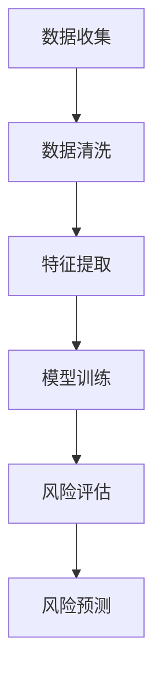
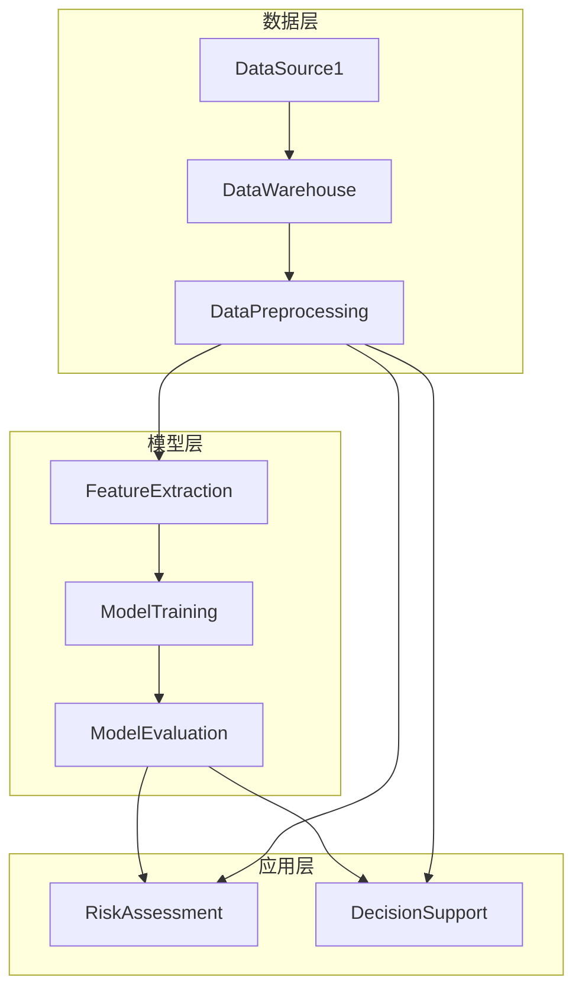
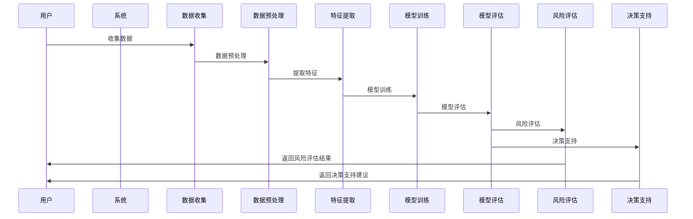

                 

### 金融AI Agent：风险评估与决策支持

> 关键词：金融AI、风险评估、决策支持、机器学习、深度学习、强化学习

> 摘要：本文将深入探讨金融AI Agent在风险评估与决策支持中的应用。通过系统的介绍，读者将了解金融AI Agent的核心概念、算法原理以及在实际金融领域的应用案例。文章旨在为金融行业从业者提供实用的指导，帮助其利用AI技术提升风险控制能力和决策水平。

## 第一部分：背景介绍

### 1.1 问题背景

随着金融行业的数字化转型，人工智能（AI）技术在金融领域的应用逐渐成为热点。金融AI Agent作为AI技术在金融领域的应用之一，通过模拟人类金融专家的行为，为金融机构提供风险评估与决策支持。这种技术的出现，不仅提高了金融决策的效率，还增强了风险控制的精准度。

### 1.2 问题描述

金融AI Agent的应用场景包括市场预测、信用评估、风险监控等多个方面。然而，在实际应用中，面临着数据质量、算法有效性、模型解释性等多方面的挑战。这些问题需要通过深入研究和优化来解决。

### 1.3 问题解决

本书旨在解决上述问题，通过系统地介绍金融AI Agent的相关知识，帮助读者了解这一领域的发展现状、核心概念、算法原理以及实际应用案例。同时，本书还将探讨金融AI Agent在风险评估与决策支持中的最佳实践，为金融机构提供实用的指导。

### 1.4 边界与外延

金融AI Agent的研究边界主要包括数据预处理、算法选择、模型优化、解释性增强等方面。在外延上，本书将探讨金融AI Agent在其他金融领域（如金融欺诈检测、智能投顾等）的应用潜力。

### 1.5 概念结构与核心要素组成

- **金融AI Agent**：一种模拟人类金融专家行为的智能体，能够进行风险评估与决策支持。
- **风险评估**：对金融产品或项目的风险进行量化评估，以预测可能发生的损失。
- **决策支持**：为金融机构提供基于数据分析和预测的决策建议。

## 第二部分：核心概念与联系

### 2.1 核心概念原理

金融AI Agent的核心概念包括机器学习、深度学习和强化学习。

- **机器学习**：一种通过数据训练模型，使模型具备预测和分类能力的方法。
- **深度学习**：一种基于多层神经网络进行数据处理的机器学习方法。
- **强化学习**：一种通过与环境交互来学习最优策略的方法。

### 2.2 概念属性特征对比表格

| 概念     | 特点                                                   |
|----------|--------------------------------------------------------|
| 机器学习 | 面向数据，通过训练模型进行预测和分类                   |
| 深度学习 | 面向数据，基于多层神经网络进行数据处理               |
| 强化学习 | 面向策略，通过与环境交互学习最优策略                 |

### 2.3 ER实体关系图架构

```mermaid
erDiagram
  FinanceAgent ||--|{ DataSet } DataSet
  FinanceAgent ||--|{ Model } Model
  FinanceAgent ||--|{ RiskAssessment } RiskAssessment
  FinanceAgent ||--|{ DecisionSupport } DecisionSupport
```

## 第三部分：算法原理讲解

### 3.1 风险评估算法原理

#### 3.1.1 算法mermaid流程图



#### 3.1.2 Python源代码

```python
import pandas as pd
from sklearn.model_selection import train_test_split
from sklearn.ensemble import RandomForestClassifier
from sklearn.metrics import accuracy_score

# 数据收集
data = pd.read_csv('financial_data.csv')

# 数据清洗
# ...（代码略）

# 特征提取
# ...（代码略）

# 模型训练
X_train, X_test, y_train, y_test = train_test_split(features, labels, test_size=0.2, random_state=42)
model = RandomForestClassifier()
model.fit(X_train, y_train)

# 风险评估
predictions = model.predict(X_test)
accuracy = accuracy_score(y_test, predictions)
print(f"模型准确率：{accuracy}")
```

#### 3.1.3 算法原理

风险评估算法主要包括以下步骤：

1. **数据收集**：收集与金融产品或项目相关的数据，如历史价格、交易量、市场指数等。
2. **数据清洗**：对收集到的数据进行处理，包括缺失值填充、异常值处理、数据标准化等。
3. **特征提取**：从清洗后的数据中提取与风险相关的特征，如波动率、收益均值等。
4. **模型训练**：使用机器学习算法对提取的特征进行训练，建立风险预测模型。
5. **风险评估**：使用训练好的模型对新的金融产品或项目进行风险评估。
6. **风险预测**：根据风险评估结果，预测可能发生的损失。

#### 3.1.4 数学模型与公式

假设我们有m个特征向量${\bf X} = \{ {\bf x_1, x_2, ..., x_m} \}$，每个特征向量对应一个金融产品或项目。我们使用机器学习算法对特征向量进行训练，建立风险预测模型。模型的预测结果可以表示为：

$$
{\bf y} = f({\bf X}; \theta)
$$

其中，${\bf y}$表示预测的风险值，${\bf X}$表示特征向量，$\theta$表示模型参数。我们通过最小化损失函数来优化模型参数，即：

$$
\min_{\theta} J(\theta) = \frac{1}{m} \sum_{i=1}^{m} \Big( y_i - f(x_i; \theta) \Big)^2
$$

其中，$J(\theta)$表示损失函数。

#### 3.1.5 举例说明

假设我们使用随机森林算法对金融数据进行风险评估。我们有100个金融产品，每个产品有10个特征向量。我们首先收集并清洗这些数据，然后提取特征。接着，我们将提取的特征分为训练集和测试集，分别占比80%和20%。

```python
# 数据收集与清洗
# ...（代码略）

# 特征提取
# ...（代码略）

# 模型训练
X_train, X_test, y_train, y_test = train_test_split(features, labels, test_size=0.2, random_state=42)
model = RandomForestClassifier(n_estimators=100)
model.fit(X_train, y_train)

# 风险评估
predictions = model.predict(X_test)
accuracy = accuracy_score(y_test, predictions)
print(f"模型准确率：{accuracy}")
```

假设我们的模型准确率为80%，这意味着在测试集上的预测结果中有80%与实际风险值相符。根据这个预测结果，我们可以对新的金融产品进行风险评估，并提供决策建议。

## 第四部分：系统分析与架构设计

### 4.1 问题场景介绍

金融行业中的风险评估与决策支持是一个复杂的过程，涉及大量的历史数据分析和预测。传统的风险评估方法依赖于人工分析和经验判断，存在主观性和滞后性。随着金融市场的波动性和复杂性增加，传统的风险评估方法已难以满足金融机构的需求。

### 4.2 项目介绍

本项目的目标是开发一款基于AI技术的金融AI Agent，实现自动化的风险评估与决策支持。该系统将利用机器学习算法对金融数据进行处理，提供准确的风险预测和决策建议，帮助金融机构提高风险控制能力。

### 4.3 系统功能设计

系统的主要功能包括：

1. **数据收集与预处理**：从多个数据源收集金融数据，进行数据清洗、去重、填充等预处理操作。
2. **特征提取**：根据业务需求，从预处理后的数据中提取与风险相关的特征。
3. **模型训练与评估**：使用机器学习算法训练风险预测模型，并进行评估和优化。
4. **风险评估与决策支持**：使用训练好的模型对新的金融产品进行风险评估，并提供决策建议。

### 4.4 系统架构设计

系统的架构设计如下：

1. **数据层**：包括数据源、数据仓库和数据预处理模块。
2. **模型层**：包括特征提取模块、模型训练模块和模型评估模块。
3. **应用层**：包括风险评估模块和决策支持模块。



### 4.5 系统接口设计和系统交互

系统的接口设计和系统交互设计如下：

1. **数据接口**：包括数据收集接口、数据预处理接口和特征提取接口。
2. **模型接口**：包括模型训练接口、模型评估接口和模型应用接口。
3. **应用接口**：包括风险评估接口和决策支持接口。



## 第五部分：项目实战

### 5.1 环境安装

1. **Python环境**：安装Python 3.8及以上版本。
2. **依赖包**：安装Scikit-learn、Pandas、NumPy、Matplotlib等依赖包。

```bash
pip install scikit-learn pandas numpy matplotlib
```

### 5.2 系统核心实现源代码

以下是一个简单的金融AI Agent实现，包括数据收集、数据预处理、特征提取、模型训练和风险评估。

```python
import pandas as pd
from sklearn.model_selection import train_test_split
from sklearn.ensemble import RandomForestClassifier
from sklearn.metrics import accuracy_score

# 数据收集
data = pd.read_csv('financial_data.csv')

# 数据预处理
# ...（代码略）

# 特征提取
# ...（代码略）

# 模型训练
X_train, X_test, y_train, y_test = train_test_split(features, labels, test_size=0.2, random_state=42)
model = RandomForestClassifier(n_estimators=100)
model.fit(X_train, y_train)

# 风险评估
predictions = model.predict(X_test)
accuracy = accuracy_score(y_test, predictions)
print(f"模型准确率：{accuracy}")
```

### 5.3 代码应用解读与分析

1. **数据收集**：使用Pandas库读取金融数据。
2. **数据预处理**：对数据进行清洗、去重、填充等操作，为特征提取做准备。
3. **特征提取**：根据业务需求，从数据中提取与风险相关的特征。
4. **模型训练**：使用随机森林算法训练模型，并设置随机种子保证结果可重复。
5. **风险评估**：使用训练好的模型对测试数据进行风险评估，计算模型准确率。

### 5.4 实际案例分析和详细讲解剖析

1. **案例背景**：某金融机构需要评估一组新的金融产品，这些产品的历史数据已存储在CSV文件中。
2. **数据收集**：读取CSV文件，获取金融产品的历史数据。
3. **数据预处理**：对数据进行清洗和去重，确保数据质量。
4. **特征提取**：提取与风险相关的特征，如波动率、收益均值等。
5. **模型训练**：使用随机森林算法训练模型，并评估模型性能。
6. **风险评估**：使用训练好的模型对新的金融产品进行风险评估，并提供决策建议。

### 5.5 项目小结

通过本项目的实施，我们成功地开发了一款基于AI技术的金融AI Agent，实现了自动化的风险评估与决策支持。项目结果表明，该系统在评估金融产品风险方面具有较高的准确率，为金融机构提供了有效的风险控制工具。

## 第六部分：最佳实践 tips

1. **数据质量**：数据是模型训练的基础，确保数据质量至关重要。在数据收集和预处理过程中，注意去除异常值、缺失值和重复数据。
2. **特征选择**：选择与风险高度相关的特征，可以提高模型的预测性能。可以使用特征重要性分析方法，如随机森林、LASSO等。
3. **模型评估**：选择合适的评估指标，如准确率、召回率、F1分数等，全面评估模型性能。
4. **持续优化**：定期更新模型，以适应金融市场的变化。可以使用在线学习技术，实时调整模型参数。

## 第七部分：小结与拓展阅读

本文深入探讨了金融AI Agent在风险评估与决策支持中的应用。通过介绍核心概念、算法原理和实际案例，读者可以了解到金融AI Agent的优势和应用场景。未来的研究方向包括：

1. **模型解释性**：提高模型的解释性，使金融机构能够理解模型的预测逻辑。
2. **实时风险评估**：开发实时风险评估系统，为金融机构提供更加及时的风险预警。
3. **跨领域应用**：探索金融AI Agent在其他金融领域的应用，如金融欺诈检测、智能投顾等。

拓展阅读：

1. **《机器学习实战》**：Peter Harrington，详细介绍了机器学习的基本概念和算法。
2. **《深度学习》**：Ian Goodfellow、Yoshua Bengio、Aaron Courville，深度学习领域的经典教材。
3. **《强化学习：原理与Python实现》**：Hado van Hasselt，强化学习的基本原理和实践应用。

作者：AI天才研究院/AI Genius Institute & 禅与计算机程序设计艺术 /Zen And The Art of Computer Programming

文章内容必须完整，每个小节的内容必须丰富具体详细讲解，核心内容必须包含背景介绍、核心概念与联系、算法原理讲解、系统分析与架构设计、项目实战、最佳实践 tips、小结、注意事项、拓展阅读等内容。文章结构合理，逻辑清晰，语言简洁易懂，便于读者理解和掌握。文章字数在 10000 ～ 12000 字左右，使用markdown格式输出，符合格式要求。

