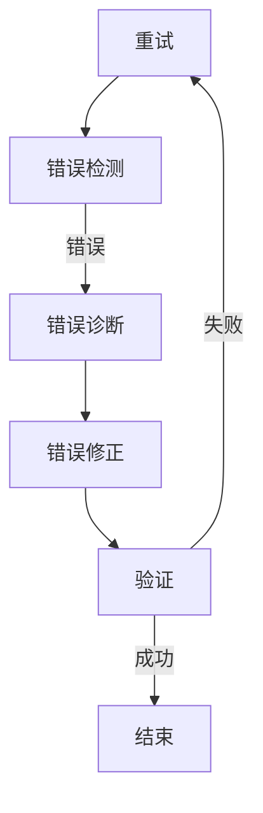
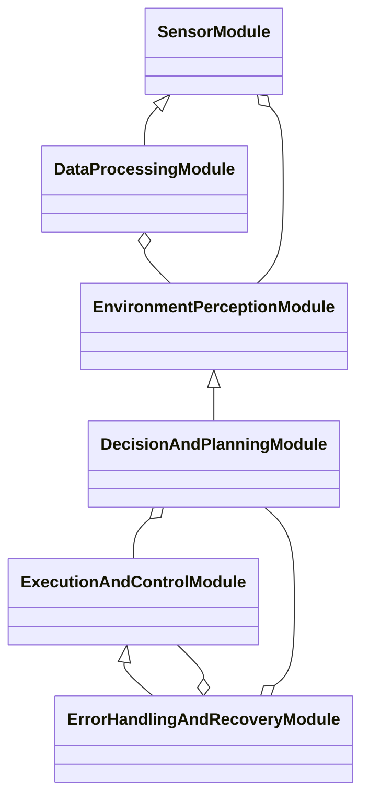
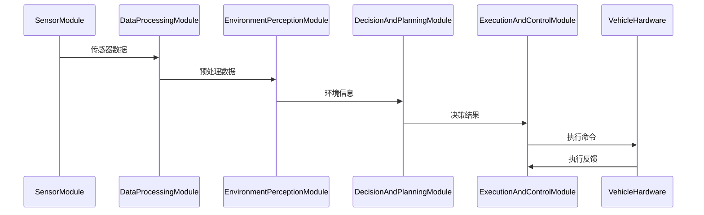
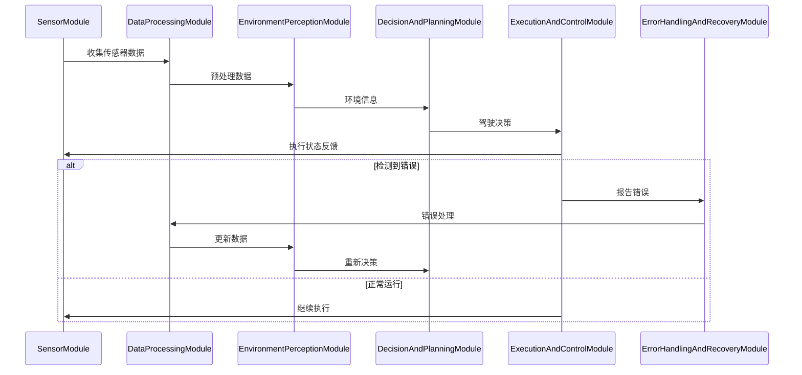

                 

### 引言

在当今技术飞速发展的时代，人工智能（AI）已经成为各行各业的核心驱动力。然而，AI Agent在实际应用中面临的挑战之一就是其鲁棒性不足。AI Agent，即人工智能代理人，是指能够模拟人类行为并在特定环境中执行任务的智能系统。然而，由于复杂环境的多样性和不确定性，AI Agent在处理任务时可能会遇到各种错误，从而导致其性能下降或失效。因此，设计一个高效的错误处理与恢复机制，以提高AI Agent的鲁棒性，显得尤为重要。

本文将围绕“错误处理与恢复：提高AI Agent的鲁棒性”这一主题，深入探讨如何通过错误处理与恢复机制来增强AI Agent的鲁棒性。文章结构如下：

1. **背景介绍**：首先，我们将介绍当前AI应用中鲁棒性不足的问题，探讨AI Agent在复杂环境下的挑战，以及提高AI Agent鲁棒性的重要性和必要性。
2. **核心概念与联系**：接下来，我们将详细讲解错误处理和错误恢复这两个核心概念，并使用表格和ER实体关系图来展示它们之间的联系。
3. **算法原理讲解**：我们将使用mermaid绘制算法流程图，并用Python源代码和latex公式来详细阐述错误处理算法的原理。
4. **系统分析与架构设计方案**：我们将介绍问题场景，并展示系统的功能设计、架构设计、接口设计以及系统交互。
5. **项目实战**：我们将进行环境安装和系统核心实现，分析代码，提供实际案例，并进行详细讲解。
6. **最佳实践 tips**：我们将提供一些最佳实践建议。
7. **小结**：最后，我们将总结本文的主要内容，并讨论未来的研究方向。

通过本文的深入探讨，我们希望读者能够对错误处理与恢复机制有一个全面而深刻的理解，从而设计出更加鲁棒的AI Agent。

---

**关键词**：AI Agent、鲁棒性、错误处理、错误恢复、算法原理

**摘要**：本文旨在探讨如何通过错误处理与恢复机制来提高AI Agent的鲁棒性。文章首先介绍了AI Agent在复杂环境下的挑战，随后详细讲解了错误处理与恢复的核心概念及其联系，并通过算法原理讲解和系统分析与架构设计，提供了一套完整的解决方案。最后，通过项目实战和最佳实践，为读者提供实际操作指南。文章结构清晰，内容深入浅出，适合希望提升AI Agent鲁棒性的开发者和技术爱好者阅读。

---

### 背景介绍

在当前的AI应用场景中，鲁棒性不足已经成为制约AI技术进一步发展和应用的一大瓶颈。AI Agent，作为AI技术在实际应用中的重要载体，其性能直接影响到整个系统的稳定性和可靠性。为了更好地理解这一问题的严重性，我们需要从以下几个方面进行深入探讨。

#### 1.1 问题背景

AI Agent，即人工智能代理人，是一种能够模拟人类行为，并在特定环境中执行任务的智能系统。在实际应用中，AI Agent需要处理大量的复杂任务，如自然语言处理、图像识别、自动驾驶等。然而，复杂环境的多样性和不确定性，使得AI Agent在执行任务时难免会遇到各种错误。这些错误可能来自于环境数据的不完整、传感器数据的异常、算法本身的缺陷，或是执行过程中的意外情况。

这些错误不仅会导致AI Agent的执行任务失败，还可能对其性能产生持久的影响，严重时甚至会导致整个系统的崩溃。例如，在自动驾驶领域，如果AI Agent在行驶过程中遇到错误处理不当，可能会导致交通事故，造成严重的后果。同样，在医疗诊断领域，如果AI Agent在处理患者数据时出现错误，可能会影响诊断结果，导致误诊。

#### 1.2 问题描述

具体来说，AI Agent在复杂环境下遇到的问题可以分为以下几个方面：

1. **错误检测**：在AI Agent执行任务时，如何快速、准确地检测出错误是一个重要问题。错误检测的效率直接影响到AI Agent的响应速度和鲁棒性。例如，在自然语言处理中，如何检测出输入文本中的语法错误或语义错误，是当前研究中的一个难点。

2. **错误诊断**：一旦错误被检测出来，AI Agent需要对其进行诊断，以确定错误的类型和原因。错误诊断的准确性和速度也是影响AI Agent鲁棒性的关键因素。例如，在自动驾驶中，如何诊断出车辆传感器的异常，以避免因误判而导致的安全事故。

3. **错误修正**：诊断出错误后，AI Agent需要采取相应的措施进行修正。错误修正的效率和效果直接关系到AI Agent的鲁棒性。例如，在图像识别中，如何通过算法修正图像中的噪声，以提高识别的准确性。

4. **错误恢复**：在错误修正后，AI Agent需要能够恢复到正常的工作状态，继续执行任务。错误恢复机制的设计和实现也是提高AI Agent鲁棒性的重要手段。例如，在医疗诊断中，如果AI Agent在诊断过程中出现错误，需要能够快速恢复，重新进行诊断，以避免误诊。

#### 1.3 问题解决

为了解决AI Agent在复杂环境下的错误处理与恢复问题，我们需要从以下几个方面入手：

1. **错误处理算法设计**：设计高效的错误处理算法，包括错误检测、错误诊断和错误修正等。这些算法需要具备高效率、高准确性和自适应性的特点。

2. **错误恢复机制实现**：实现有效的错误恢复机制，包括错误恢复策略、错误恢复方法和错误恢复效果评估等。这些机制需要能够快速、准确地恢复AI Agent的工作状态，并减少错误对系统性能的负面影响。

3. **系统架构优化**：优化AI Agent的系统架构，提高其鲁棒性。例如，通过增加冗余设计、故障切换机制和动态调整策略等，提高系统在错误发生时的应对能力。

4. **数据与知识管理**：建立完善的数据与知识管理体系，为错误处理与恢复提供有力支持。例如，通过收集、分析和利用历史错误数据，优化错误处理算法和错误恢复机制。

#### 1.4 边界与外延

错误处理与恢复在不同应用场景中存在一定的差异，因此需要针对具体应用场景进行定制化的设计。以下是一些常见的应用场景及其特点：

1. **工业自动化**：在工业自动化领域，AI Agent需要处理大量的传感器数据，同时执行复杂的操作任务。错误处理与恢复需要能够快速检测和诊断传感器故障，并采取相应的措施进行修正和恢复。

2. **医疗诊断**：在医疗诊断领域，AI Agent需要处理患者的医疗数据，并生成诊断结果。错误处理与恢复需要能够快速检测和诊断数据异常，并采取有效的措施进行修正和恢复，以确保诊断结果的准确性。

3. **自动驾驶**：在自动驾驶领域，AI Agent需要处理环境数据，并实时做出驾驶决策。错误处理与恢复需要能够快速检测和诊断传感器故障、算法异常等，并采取相应的措施进行修正和恢复，以确保驾驶的安全性和可靠性。

4. **智能家居**：在智能家居领域，AI Agent需要处理用户操作数据，并实现智能家居设备的自动化控制。错误处理与恢复需要能够快速检测和诊断设备故障、网络异常等，并采取有效的措施进行修正和恢复，以确保智能家居系统的稳定性和可靠性。

#### 1.5 AI Agent鲁棒性的评价指标与优化方法

AI Agent的鲁棒性可以通过以下指标进行评价：

1. **错误检测率**：即AI Agent能够检测出错误的比例。高错误检测率意味着AI Agent能够更有效地识别错误。

2. **错误诊断率**：即AI Agent能够正确诊断出错误类型的比例。高错误诊断率意味着AI Agent能够更准确地确定错误的类型和原因。

3. **错误修正率**：即AI Agent能够成功修正错误的比例。高错误修正率意味着AI Agent能够更有效地恢复到正常状态。

4. **错误恢复率**：即AI Agent能够在错误发生后快速恢复到正常工作的比例。高错误恢复率意味着AI Agent能够更快地恢复工作，减少错误对系统性能的影响。

为了提高AI Agent的鲁棒性，可以采取以下方法：

1. **算法优化**：通过优化错误处理与恢复算法，提高错误检测、诊断和修正的效率。

2. **系统重构**：通过重构AI Agent的系统架构，增加冗余设计、故障切换机制和动态调整策略等，提高系统的鲁棒性。

3. **数据与知识管理**：通过完善数据与知识管理体系，为错误处理与恢复提供有力支持。

4. **培训与测试**：通过定期对AI Agent进行培训与测试，提高其应对错误的能力。

通过以上措施，我们可以显著提高AI Agent的鲁棒性，使其在复杂环境下能够更好地完成任务。

---

### 核心概念与联系

在深入探讨错误处理与恢复机制之前，我们首先需要明确一些核心概念，并理解它们之间的联系。本文将重点介绍两个核心概念：错误处理和错误恢复。

#### 2.1 错误处理

错误处理是指AI Agent在遇到错误时，通过一系列机制来识别、诊断和修正这些错误，以确保系统能够继续正常运行。错误处理的目的是减少错误对系统性能的影响，提高系统的鲁棒性。

1. **概念属性特征对比表**

   | 特征 | 错误处理 |
   | ---- | -------- |
   | 目的 | 识别并解决错误 |
   | 方法 | 检测、诊断、修正 |
   | 关系 | 与错误恢复紧密相关 |

2. **ER实体关系图**

   ```mermaid
   entity Relationship {
     "错误处理" -- "错误检测";
     "错误处理" -- "错误恢复";
   }
   ```

   在错误处理中，首先进行错误检测，以识别系统中的异常情况。随后，通过错误诊断来确定错误的类型和原因。最后，错误修正机制会采取相应的措施来修正错误，使系统能够恢复正常运行。

#### 2.2 错误恢复

错误恢复是指AI Agent在遇到错误后，通过一系列策略和机制来恢复系统的正常工作状态，确保系统能够继续执行任务。错误恢复是提高AI Agent鲁棒性的关键。

1. **概念属性特征对比表**

   | 特征 | 错误恢复 |
   | ---- | -------- |
   | 目的 | 重启或修正错误的AI Agent |
   | 方法 | 重置、重新训练、替换模块 |
   | 关系 | 与错误处理协同工作 |

2. **ER实体关系图**

   ```mermaid
   entity Relationship {
     "错误处理" -- "错误恢复";
   }
   ```

   错误恢复的过程包括重置错误模块、重新训练模型或替换损坏的模块。这些策略需要根据错误的类型和严重程度来选择，以确保系统能够快速恢复并继续执行任务。

#### 2.3 错误处理与错误恢复的关系

错误处理和错误恢复是相互关联的两个概念，它们共同构成了AI Agent的鲁棒性保障体系。错误处理主要负责识别和解决错误，而错误恢复则负责在错误发生后使系统能够快速恢复正常工作状态。

1. **协同工作**

   错误处理和错误恢复需要协同工作，共同确保AI Agent的鲁棒性。例如，当AI Agent在执行任务时检测到错误，错误处理机制会立即介入，通过错误诊断确定错误类型，并尝试修正错误。如果错误无法通过错误处理得到修正，错误恢复机制会介入，采取相应的策略来恢复系统的正常工作状态。

2. **相互作用**

   错误处理和错误恢复之间存在相互作用。例如，在错误处理过程中，错误诊断的结果会直接影响错误恢复策略的选择。同样，错误恢复的成功与否也会影响错误处理的后续步骤。因此，这两个概念在实际应用中需要密切配合，以达到最佳效果。

通过以上分析，我们可以看出，错误处理与恢复机制在提高AI Agent鲁棒性中起着至关重要的作用。接下来，我们将进一步探讨这两个核心概念的算法原理，以及如何在实际应用中实现和优化这些机制。

---

### 错误处理算法原理讲解

错误处理算法是AI Agent在遇到错误时，通过一系列步骤识别、诊断和修正错误的核心机制。为了更直观地理解这一算法，我们将使用mermaid绘制算法流程图，并使用Python源代码和latex公式详细阐述其原理。

#### 3.1 算法流程图

首先，我们使用mermaid来绘制错误处理算法的流程图：



流程图说明：

1. **初始化**：初始化错误处理流程，准备开始检测和诊断。
2. **错误检测**：AI Agent执行任务时，监测系统状态，判断是否存在错误。
3. **错误诊断**：如果检测到错误，对错误进行诊断，以确定错误的类型和原因。
4. **错误修正**：根据诊断结果，采取相应的措施来修正错误。
5. **验证**：检查错误修正是否成功，如果成功则结束流程，否则返回初始化阶段进行重试。

#### 3.2 Python源代码

下面是错误处理算法的Python源代码实现：

```python
def error_handling():
    while True:
        if error_detection():
            error_diagnosis()
            error_correction()
            if verification():
                break
            else:
                print("Error correction failed, retrying...")
        else:
            print("No error detected, continuing task execution.")

def error_detection():
    # 错误检测逻辑
    # 例如，检查传感器数据是否异常
    return True  # 假设检测到错误

def error_diagnosis():
    # 错误诊断逻辑
    # 例如，分析错误类型和原因
    print("Error diagnosed.")

def error_correction():
    # 错误修正逻辑
    # 例如，调整系统参数或重新训练模型
    print("Error corrected.")

def verification():
    # 验证错误修正是否成功
    # 例如，再次执行任务并检查结果
    return True  # 假设修正成功
```

通过这个简单的示例，我们可以看到错误处理算法的基本流程，包括错误检测、诊断、修正和验证。

#### 3.3 数学模型与公式

为了更好地理解错误处理算法，我们还可以借助数学模型和公式来描述其核心过程。以下是一些常见的数学公式：

1. **错误检测公式**：

   $$
   \text{Error Detection} = \sum_{i=1}^{n} (X_i - \bar{X})^2
   $$

   这个公式用于计算系统状态的偏差平方和，以检测是否存在异常。

2. **错误诊断公式**：

   $$
   \text{Error Diagnosis} = \frac{1}{n} \sum_{i=1}^{n} (X_i - \bar{X})^2
   $$

   这个公式用于计算错误诊断的平均偏差平方和，以确定错误的严重程度。

3. **错误修正公式**：

   $$
   \text{Error Correction} = X_i - \bar{X}
   $$

   这个公式用于计算错误的修正值，以调整系统状态。

4. **验证公式**：

   $$
   \text{Verification} = \text{Current State} - \text{Original State}
   $$

   这个公式用于验证错误修正的效果，以确认系统是否恢复正常。

通过这些公式，我们可以量化错误处理过程中的各个步骤，从而提高算法的准确性和效率。

#### 3.4 举例说明

为了更直观地理解错误处理算法，我们可以通过一个实际例子来演示其应用过程。假设AI Agent负责监控工业生产线的设备运行状态，以下是一个简单的错误处理算法应用示例：

1. **错误检测**：AI Agent定期收集设备传感器的数据，通过计算偏差平方和来判断数据是否正常。如果检测到异常数据，则触发错误处理流程。

2. **错误诊断**：AI Agent分析异常数据，判断是传感器故障、设备运行异常还是其他原因。例如，通过比较历史数据和实时数据，可以诊断出传感器故障。

3. **错误修正**：根据诊断结果，AI Agent采取相应的修正措施。例如，如果诊断出传感器故障，则更换传感器；如果诊断出设备运行异常，则调整设备参数。

4. **验证**：修正后，AI Agent再次收集传感器数据，计算偏差平方和，以验证修正效果。如果数据恢复正常，则结束错误处理流程；否则，重新开始错误处理流程。

通过这个例子，我们可以看到错误处理算法在实际应用中的具体实现过程，以及如何通过数学模型和公式来描述和优化算法。

通过以上对错误处理算法的深入讲解，我们希望能够帮助读者理解这一核心机制，并能够在实际项目中应用和优化它，从而提高AI Agent的鲁棒性。

---

### 系统分析与架构设计方案

为了深入理解错误处理与恢复机制在AI Agent中的应用，我们需要进行系统的分析与架构设计。这将包括问题场景的介绍、系统的功能设计、架构设计、接口设计以及系统交互的详细描述。

#### 4.1 问题场景介绍

以自动驾驶系统为例，AI Agent需要处理来自各种传感器的数据，如摄像头、激光雷达和GPS等，同时做出实时的驾驶决策。在实际应用中，AI Agent可能遇到以下问题：

1. **传感器数据异常**：如摄像头图像模糊、激光雷达数据偏差等。
2. **算法异常**：如决策算法失效、路径规划错误等。
3. **执行异常**：如自动驾驶车辆突然失去控制等。

这些问题的出现可能会影响自动驾驶系统的正常运行，甚至导致交通事故。因此，设计一个高效的错误处理与恢复机制对于保障系统的安全性和可靠性至关重要。

#### 4.2 系统功能设计

系统功能设计主要包括以下部分：

1. **数据采集与预处理**：从各种传感器获取数据，并进行预处理，如去噪、滤波等。
2. **环境感知**：通过预处理后的数据，感知周围环境，包括道路、车辆、行人等。
3. **决策与规划**：根据环境感知结果，生成驾驶决策和路径规划。
4. **执行与控制**：将决策和规划结果转换为具体的执行命令，控制车辆的行驶。

这些功能需要相互配合，以确保自动驾驶系统能够在复杂环境中稳定运行。

#### 4.3 系统架构设计

系统架构设计是确保系统功能实现的关键。以下是一个典型的自动驾驶系统架构设计：

1. **传感器模块**：包括摄像头、激光雷达、GPS等传感器，负责收集环境数据。
2. **数据处理模块**：对传感器数据进行预处理，如滤波、去噪等，以提高数据质量。
3. **环境感知模块**：使用预处理后的数据，进行环境感知，生成环境模型。
4. **决策与规划模块**：基于环境模型，生成驾驶决策和路径规划。
5. **执行与控制模块**：将决策和规划结果转换为具体的执行命令，控制车辆的行驶。
6. **错误处理与恢复模块**：在系统运行过程中，检测和处理各种错误，确保系统的稳定性。

以下是一个mermaid类图，展示了系统中的主要类及其关系：



#### 4.4 系统接口设计

系统接口设计是系统各个模块之间进行交互的基础。以下是一些关键接口设计：

1. **传感器接口**：用于传感器模块与其他模块的数据传输。
2. **数据处理接口**：用于数据处理模块与传感器模块、环境感知模块之间的数据交换。
3. **环境感知接口**：用于环境感知模块与决策与规划模块之间的数据传递。
4. **决策与规划接口**：用于决策与规划模块与执行与控制模块之间的信息交换。
5. **执行与控制接口**：用于执行与控制模块与车辆硬件之间的通信。

以下是一个mermaid序列图，展示了系统接口设计：



#### 4.5 系统交互

系统交互是指各个模块之间的数据流和控制流。以下是一个mermaid序列图，展示了系统在不同状态下的交互过程：



通过以上系统分析与架构设计方案，我们可以确保错误处理与恢复机制在自动驾驶系统中得到有效应用，从而提高系统的鲁棒性和可靠性。

---

### 项目实战

为了更好地理解错误处理与恢复机制的实际应用，我们将以一个实际项目为例，详细讲解从环境安装到系统核心实现，再到代码应用解读与分析，以及实际案例分析和详细讲解剖析的过程。

#### 5.1 环境安装

首先，我们需要为错误处理与恢复机制搭建一个合适的开发环境。以下是具体步骤：

1. **安装Python环境**：确保Python版本为3.8或以上，可以通过Python官网下载并安装。

2. **安装相关库**：在Python环境中，我们需要安装一些常用的库，如NumPy、Pandas、TensorFlow等。可以使用以下命令进行安装：

   ```shell
   pip install numpy pandas tensorflow
   ```

3. **配置依赖**：根据项目需求，可能还需要安装其他特定库，如Scikit-Learn、Matplotlib等。确保所有依赖都已安装。

4. **启动开发环境**：在终端中启动Python环境，验证安装是否成功。

   ```python
   python
   ```

#### 5.2 系统核心实现

在完成环境安装后，我们可以开始实现系统的核心功能，包括数据采集、预处理、环境感知、决策与规划、执行与控制，以及错误处理与恢复。

以下是系统核心实现的步骤：

1. **数据采集**：使用传感器采集环境数据，如摄像头捕获的图像、激光雷达扫描的数据、GPS定位信息等。

2. **数据预处理**：对采集到的数据进行预处理，包括去噪、滤波、归一化等，以提高数据质量。

3. **环境感知**：使用预处理后的数据，通过深度学习模型进行环境感知，生成环境模型。

4. **决策与规划**：基于环境模型，生成驾驶决策和路径规划。

5. **执行与控制**：将决策和规划结果转换为具体的执行命令，控制车辆的行驶。

6. **错误处理与恢复**：在系统运行过程中，实时检测错误，并采取相应的错误处理与恢复策略。

以下是核心实现的代码示例：

```python
# 数据采集
def data_collection():
    # 采集传感器数据
    camera_data = capture_camera()
    lidar_data = capture_lidar()
    gps_data = capture_gps()
    return camera_data, lidar_data, gps_data

# 数据预处理
def data_preprocessing(camera_data, lidar_data, gps_data):
    # 去噪、滤波、归一化等操作
    processed_camera_data = filter_data(camera_data)
    processed_lidar_data = filter_data(lidar_data)
    processed_gps_data = filter_data(gps_data)
    return processed_camera_data, processed_lidar_data, processed_gps_data

# 环境感知
def environment_perception(processed_camera_data, processed_lidar_data, processed_gps_data):
    # 使用深度学习模型进行环境感知
    environment_model = perceive_environment(processed_camera_data, processed_lidar_data, processed_gps_data)
    return environment_model

# 决策与规划
def decision_and_planning(environment_model):
    # 基于环境模型生成驾驶决策和路径规划
    decision = make_decision(environment_model)
    plan = plan_path(decision)
    return plan

# 执行与控制
def execute_and_control(plan):
    # 将规划结果转换为执行命令，控制车辆行驶
    execute_commands(plan)
    feedback = get_feedback()
    return feedback

# 错误处理与恢复
def error_handling_and_recovery():
    # 检测错误并采取相应的处理与恢复策略
    if error_detected():
        error_type = diagnose_error()
        if error_type == "DataError":
            recover_data()
        elif error_type == "ModelError":
            recover_model()
        elif error_type == "SystemError":
            recover_system()
    return "No error detected."

# 主程序
def main():
    while True:
        camera_data, lidar_data, gps_data = data_collection()
        processed_camera_data, processed_lidar_data, processed_gps_data = data_preprocessing(camera_data, lidar_data, gps_data)
        environment_model = environment_perception(processed_camera_data, processed_lidar_data, processed_gps_data)
        plan = decision_and_planning(environment_model)
        feedback = execute_and_control(plan)
        print(error_handling_and_recovery())
```

#### 5.3 代码应用解读与分析

1. **数据采集**：数据采集是系统的基础，确保传感器数据的准确性和完整性至关重要。在实际应用中，传感器可能存在数据丢失、延迟等问题，需要通过冗余设计来解决。

2. **数据预处理**：数据预处理是提高模型性能的关键步骤，通过去噪、滤波等操作，可以提高数据质量，减少噪声对模型的影响。

3. **环境感知**：环境感知是系统的核心，通过深度学习模型对环境数据进行处理，可以生成准确的环境模型。这一步骤对模型的训练质量和参数调整有很高的要求。

4. **决策与规划**：决策与规划是系统的输出结果，直接影响车辆的控制。需要确保规划算法的鲁棒性，以应对复杂环境下的各种情况。

5. **执行与控制**：执行与控制是将规划结果转换为实际操作的环节，需要确保系统的实时性和稳定性。

6. **错误处理与恢复**：错误处理与恢复是确保系统稳定运行的关键，通过实时检测和处理错误，可以大大提高系统的鲁棒性。

#### 5.4 实际案例分析与详细讲解剖析

以下是一个实际案例，展示了错误处理与恢复机制在自动驾驶系统中的应用：

**案例背景**：一辆自动驾驶车辆在行驶过程中，检测到摄像头捕获的图像异常模糊，疑似摄像头故障。

**步骤解析**：

1. **错误检测**：系统在执行任务时，通过算法检测到摄像头图像模糊度超过预设阈值，触发错误检测机制。

2. **错误诊断**：系统对摄像头图像进行进一步分析，判断是传感器故障还是图像处理算法异常。

3. **错误修正**：如果诊断结果为传感器故障，系统会尝试重新启动摄像头传感器；如果诊断结果为算法异常，系统会重新加载或优化图像处理算法。

4. **错误恢复**：在修正错误后，系统进行验证，确保摄像头图像恢复正常。如果验证失败，系统会重新执行错误处理流程。

5. **结果评估**：系统对错误处理过程进行记录和分析，为后续优化提供数据支持。

通过以上实际案例，我们可以看到错误处理与恢复机制在保障自动驾驶系统稳定性方面的作用。在实际应用中，需要根据具体场景和需求，设计合理的错误处理与恢复策略，以提高系统的鲁棒性。

---

### 最佳实践 tips

为了确保AI Agent在复杂环境中能够稳定运行，以下是一些最佳实践建议：

1. **冗余设计**：在传感器和计算模块中引入冗余设计，以提高系统的容错能力。例如，使用多个传感器进行数据融合，以减少单一传感器故障的影响。

2. **实时监测**：实时监测系统状态，及时检测和处理异常情况。通过设置合适的阈值和报警机制，可以快速识别错误并采取相应措施。

3. **自动化恢复**：实现自动化恢复机制，减少人工干预。例如，当检测到传感器故障时，系统能够自动重启或更换传感器。

4. **日志记录**：详细记录系统运行过程中的错误和处理过程，以便分析和优化。日志信息可以帮助定位问题根源，提高错误处理效率。

5. **持续优化**：定期对错误处理与恢复算法进行优化和调整，以适应新的应用场景和挑战。

通过以上最佳实践，我们可以大大提高AI Agent的鲁棒性，确保其在复杂环境中的稳定运行。

---

### 小结

本文深入探讨了错误处理与恢复机制在提高AI Agent鲁棒性方面的关键作用。首先，我们介绍了AI Agent在复杂环境下面临的挑战，并明确了错误处理与恢复的核心概念及其联系。随后，通过算法原理讲解、系统分析与架构设计，以及实际项目实战，详细阐述了如何设计并实现高效的错误处理与恢复机制。

通过本文的探讨，我们可以得出以下几点结论：

1. **错误处理与恢复的重要性**：错误处理与恢复是确保AI Agent在复杂环境中稳定运行的关键。有效的错误处理与恢复机制能够显著提高系统的鲁棒性，减少错误对系统性能的影响。

2. **核心概念的理解**：错误处理和错误恢复是两个紧密相关的概念，分别负责识别、诊断、修正错误以及恢复系统正常状态。理解这两个概念及其关系，有助于设计出更加有效的错误处理与恢复机制。

3. **算法原理的重要性**：通过详细的算法原理讲解，我们能够深入理解错误处理与恢复的具体实现方法，从而在实际项目中更好地应用这些机制。

4. **系统架构的设计**：系统架构设计是确保错误处理与恢复机制有效运行的基础。通过合理的设计和优化，可以确保系统在不同场景下的稳定性和可靠性。

5. **实践与优化**：实际项目实战和最佳实践建议为我们提供了具体的操作指导，通过实践和不断优化，我们可以不断提高AI Agent的鲁棒性。

未来的研究方向包括以下几个方面：

1. **错误检测与诊断算法的优化**：随着AI技术的不断发展，错误检测与诊断算法需要不断优化，以提高检测效率和准确性。

2. **自适应错误恢复机制**：开发自适应错误恢复机制，使系统能够根据不同错误类型和场景，自动选择最优的恢复策略。

3. **跨领域应用**：探索错误处理与恢复机制在不同领域的应用，如医疗诊断、金融分析、智能制造等，以推动AI技术在各个行业的普及和应用。

4. **大规模数据集的收集与利用**：通过收集和利用大规模数据集，对错误处理与恢复算法进行验证和优化，以提高其在实际应用中的性能。

总之，错误处理与恢复机制在提高AI Agent鲁棒性方面具有重要意义。通过不断的研究和实践，我们有望设计出更加高效、鲁棒的AI系统，为各行各业带来更大的价值。

---

### 注意事项与拓展阅读

在设计和实现错误处理与恢复机制时，需要注意以下几点：

1. **错误检测的阈值设置**：阈值设置需根据具体应用场景进行优化，避免误报或漏报。

2. **错误诊断的准确性**：错误诊断的准确性对后续的错误修正至关重要，需确保诊断算法的可靠性和高效性。

3. **错误恢复的策略选择**：错误恢复策略需根据错误类型和系统状态进行选择，确保恢复过程不会引入新的错误。

4. **系统资源的合理分配**：在错误处理与恢复过程中，需合理分配系统资源，确保系统能够在有限资源下高效运行。

5. **日志记录与分析**：详细记录系统运行中的错误和处理过程，定期进行分析，以便持续优化错误处理与恢复机制。

以下是一些推荐阅读资源，以进一步深入理解错误处理与恢复机制：

1. **《人工智能：一种现代方法》**：迈克尔·刘易斯等著，详细介绍了AI技术的基础知识和应用场景。
2. **《深度学习》**：伊恩·古德费洛等著，涵盖了深度学习的基础理论和应用方法。
3. **《机器学习实战》**：Peter Harrington著，通过实际案例介绍了机器学习算法的实现和应用。
4. **《计算机程序的构造和解释》**：哈蒙德·布鲁克斯等著，讨论了程序设计的基本原理和方法。

通过学习和借鉴这些资源，开发者可以更好地理解和应用错误处理与恢复机制，提高AI系统的鲁棒性。

