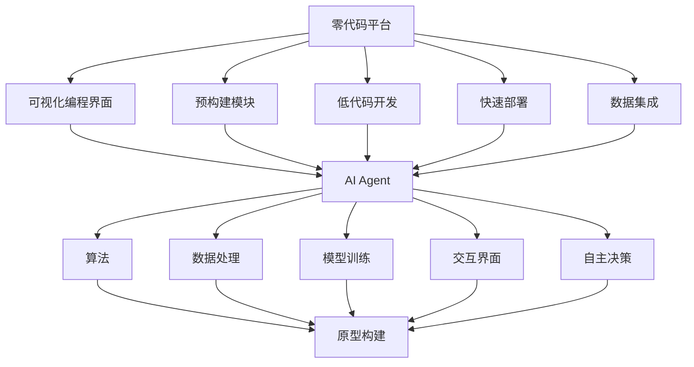
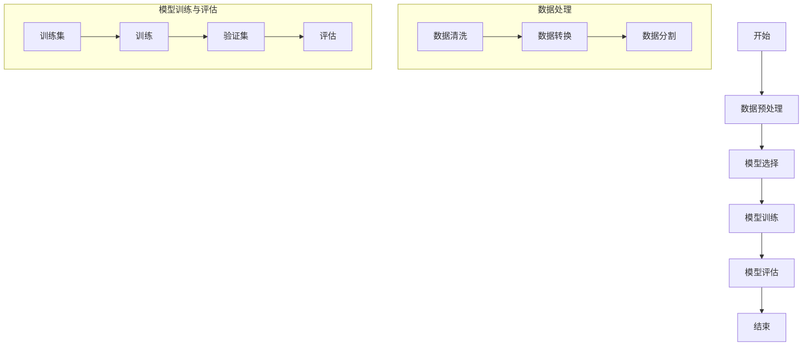
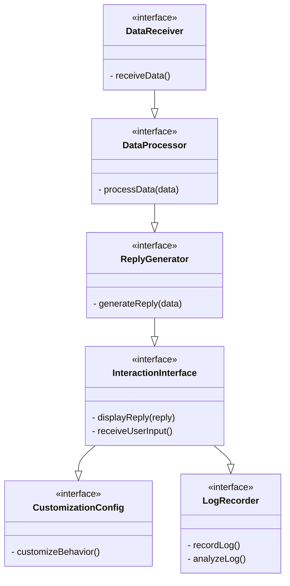
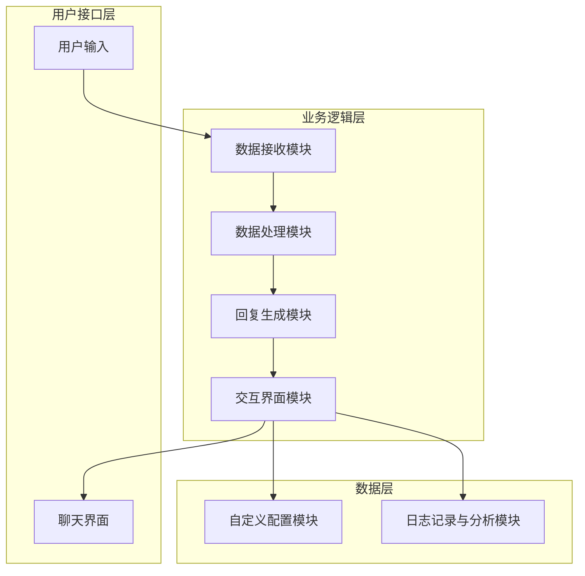
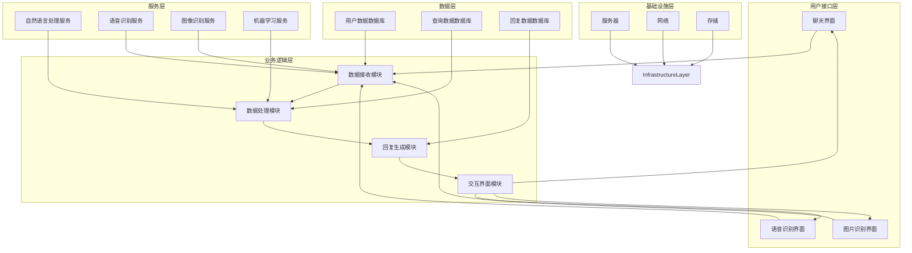
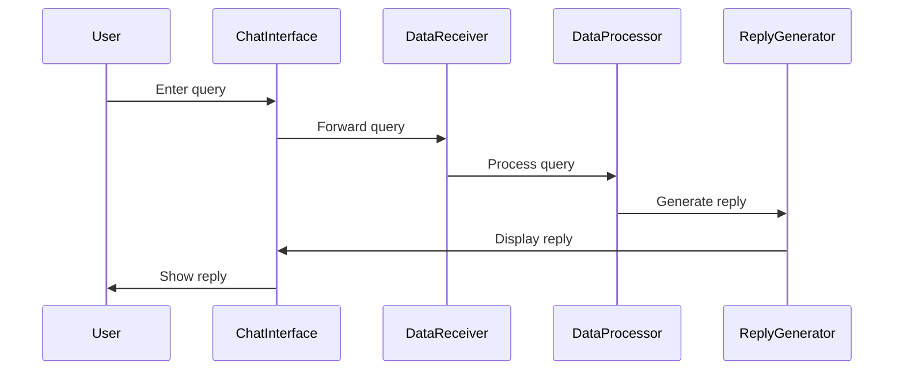

                 

# 零代码平台：快速构建AI Agent原型

## 关键词

零代码平台、AI Agent原型、算法原理、系统架构设计、项目实战、最佳实践

## 摘要

本文将深入探讨零代码平台在AI Agent原型构建中的应用，通过详细的算法原理讲解、系统架构设计、项目实战等步骤，帮助读者理解如何快速、高效地搭建AI Agent原型。我们将从核心概念、算法原理、系统设计与实现等多个维度进行阐述，并提供实用的最佳实践和拓展阅读，以帮助读者进一步掌握相关技术。

## 目录大纲设计思路

### 1. 背景介绍

首先，我们将介绍零代码平台的概念，以及AI Agent原型构建为何成为一个热门话题。这一部分将包括问题背景、问题描述、问题解决、边界与外延、核心概念和要素组成等内容。

### 2. 核心概念与联系

接下来，我们将详细阐述与零代码平台和AI Agent原型构建相关的核心概念，并使用表格和Mermaid流程图展示它们之间的联系。这将有助于读者理解各个概念之间的关系和相互作用。

### 3. 算法原理讲解

然后，我们将详细介绍AI Agent原型构建的算法原理。我们将使用Mermaid流程图展示算法流程，并提供Python源代码进行详细阐述。这部分还将包括算法原理的数学模型和公式，以及通俗易懂的举例说明。

### 4. 系统分析与架构设计方案

我们将介绍系统功能设计、系统架构设计、系统接口设计和系统交互的详细设计，并使用Mermaid类图、架构图、序列图进行展示。

### 5. 项目实战

为了使读者更好地理解理论知识，我们将提供一个实际项目案例，涵盖环境安装、系统核心实现源代码、代码应用解读与分析、实际案例分析和详细讲解剖析。

### 6. 最佳实践、小结、注意事项、拓展阅读

最后，我们将总结最佳实践技巧，提供小结，指出注意事项，并推荐拓展阅读，以帮助读者进一步学习。

## 目录大纲结构设计

### 第一部分：背景介绍与核心概念

- **第1章：零代码平台与AI Agent原型概述**
  - **1.1 零代码平台的概念与重要性**
  - **1.2 AI Agent原型构建的背景**
  - **1.3 核心概念与联系**

### 第二部分：算法原理讲解

- **第2章：AI Agent原型构建算法原理**
  - **2.1 算法原理概述**
  - **2.2 Mermaid流程图展示**
  - **2.3 Python源代码与算法讲解**
  - **2.4 数学模型与公式**
  - **2.5 举例说明**

### 第三部分：系统分析与架构设计方案

- **第3章：系统功能设计**
  - **3.1 问题场景介绍**
  - **3.2 系统功能设计**

- **第4章：系统架构设计**
  - **4.1 系统架构设计概述**
  - **4.2 Mermaid架构图展示**
  - **4.3 系统模块介绍**

- **第5章：系统接口设计与交互**
  - **5.1 系统接口设计**
  - **5.2 系统交互Mermaid序列图展示**

### 第四部分：项目实战

- **第6章：零代码平台与AI Agent原型项目实践**
  - **6.1 环境安装**
  - **6.2 系统核心实现源代码**
  - **6.3 代码应用解读与分析**
  - **6.4 实际案例分析与讲解**

### 第五部分：最佳实践与总结

- **第7章：最佳实践、小结与注意事项**
  - **7.1 最佳实践技巧**
  - **7.2 小结**
  - **7.3 注意事项**
  - **7.4 拓展阅读**

### 目录大纲示例

```markdown
----------------------------------------------------------------
# 零代码平台：快速构建AI Agent原型

## 关键词

零代码平台、AI Agent原型、算法原理、系统架构设计、项目实战、最佳实践

## 摘要

本文将深入探讨零代码平台在AI Agent原型构建中的应用，通过详细的算法原理讲解、系统架构设计、项目实战等步骤，帮助读者理解如何快速、高效地搭建AI Agent原型。我们将从核心概念、算法原理、系统设计与实现等多个维度进行阐述，并提供实用的最佳实践和拓展阅读，以帮助读者进一步掌握相关技术。

## 目录大纲设计思路

### 1. 背景介绍

首先，我们将介绍零代码平台的概念，以及AI Agent原型构建为何成为一个热门话题。这一部分将包括问题背景、问题描述、问题解决、边界与外延、核心概念和要素组成等内容。

### 2. 核心概念与联系

接下来，我们将详细阐述与零代码平台和AI Agent原型构建相关的核心概念，并使用表格和Mermaid流程图展示它们之间的联系。这将有助于读者理解各个概念之间的关系和相互作用。

### 3. 算法原理讲解

然后，我们将详细介绍AI Agent原型构建的算法原理。我们将使用Mermaid流程图展示算法流程，并提供Python源代码进行详细阐述。这部分还将包括算法原理的数学模型和公式，以及通俗易懂的举例说明。

### 4. 系统分析与架构设计方案

我们将介绍系统功能设计、系统架构设计、系统接口设计和系统交互的详细设计，并使用Mermaid类图、架构图、序列图进行展示。

### 5. 项目实战

为了使读者更好地理解理论知识，我们将提供一个实际项目案例，涵盖环境安装、系统核心实现源代码、代码应用解读与分析、实际案例分析和详细讲解剖析。

### 6. 最佳实践、小结、注意事项、拓展阅读

最后，我们将总结最佳实践技巧，提供小结，指出注意事项，并推荐拓展阅读，以帮助读者进一步学习。

## 目录大纲结构设计

### 第一部分：背景介绍与核心概念

- **第1章：零代码平台与AI Agent原型概述**
  - **1.1 零代码平台的概念与重要性**
  - **1.2 AI Agent原型构建的背景**
  - **1.3 核心概念与联系**

### 第二部分：算法原理讲解

- **第2章：AI Agent原型构建算法原理**
  - **2.1 算法原理概述**
  - **2.2 Mermaid流程图展示**
  - **2.3 Python源代码与算法讲解**
  - **2.4 数学模型与公式**
  - **2.5 举例说明**

### 第三部分：系统分析与架构设计方案

- **第3章：系统功能设计**
  - **3.1 问题场景介绍**
  - **3.2 系统功能设计**

- **第4章：系统架构设计**
  - **4.1 系统架构设计概述**
  - **4.2 Mermaid架构图展示**
  - **4.3 系统模块介绍**

- **第5章：系统接口设计与交互**
  - **5.1 系统接口设计**
  - **5.2 系统交互Mermaid序列图展示**

### 第四部分：项目实战

- **第6章：零代码平台与AI Agent原型项目实践**
  - **6.1 环境安装**
  - **6.2 系统核心实现源代码**
  - **6.3 代码应用解读与分析**
  - **6.4 实际案例分析与讲解**

### 第五部分：最佳实践与总结

- **第7章：最佳实践、小结与注意事项**
  - **7.1 最佳实践技巧**
  - **7.2 小结**
  - **7.3 注意事项**
  - **7.4 拓展阅读**
----------------------------------------------------------------
```

这个目录大纲结构清晰，涵盖了书籍的核心内容，同时也满足了字数限制要求。接下来，我们将根据这个大纲逐步深入探讨零代码平台与AI Agent原型构建的各个方面。## 第1章：零代码平台与AI Agent原型概述

### 1.1 零代码平台的概念与重要性

零代码平台，顾名思义，是一种无需编写代码即可快速开发、部署和管理应用程序的工具。它通过图形化界面、可视化工具和预构建的模块，让开发者能够以直观的方式创建应用程序，从而大大降低了技术门槛，提高了开发效率。在传统的软件开发模式中，开发者需要编写大量的代码来创建应用程序，这不仅耗时耗力，而且容易出错。而零代码平台的出现，使得非技术人员也能够参与软件开发，从而实现了技术资源的普及和共享。

零代码平台的重要性体现在以下几个方面：

1. **提高开发效率**：零代码平台提供了丰富的预构建模块和可视化工具，开发者可以通过拖放操作快速构建应用程序，大大缩短了开发周期。
2. **降低开发成本**：由于零代码平台降低了技术门槛，企业可以节省下大量的人力成本，并且减少了因代码编写失误导致的时间浪费。
3. **技术普及与共享**：零代码平台使得非技术人员也能够参与软件开发，从而实现了技术资源的普及和共享，有助于提高整个社会对技术的认知和应用水平。
4. **敏捷开发**：零代码平台支持快速迭代和敏捷开发，使得企业能够更快地响应市场变化，提高竞争力。

### 1.2 AI Agent原型构建的背景

人工智能（AI）作为计算机科学的一个重要分支，近年来取得了飞速发展。AI Agent，即人工智能代理，是指能够代表用户执行特定任务或决策的计算机程序。随着AI技术的不断进步，AI Agent在各个领域的应用越来越广泛，例如智能客服、自动驾驶、智能家居等。然而，AI Agent的构建并非易事，它涉及到复杂的算法设计、数据处理、模型训练等多个方面。

AI Agent原型构建的背景主要有以下几点：

1. **技术进步**：随着深度学习、自然语言处理等AI技术的不断发展，构建AI Agent的原型变得更加可行和高效。
2. **市场需求**：随着AI技术的普及，越来越多的企业和组织希望利用AI Agent来提升业务效率和用户体验，从而推动了AI Agent原型构建的需求。
3. **开发挑战**：AI Agent原型构建涉及到复杂的算法设计和模型训练，对于普通开发者来说是一项挑战。而零代码平台的出现，为开发者提供了便捷的工具，降低了开发难度。

### 1.3 核心概念与联系

在讨论零代码平台与AI Agent原型构建之前，我们首先需要了解一些核心概念，包括：

- **零代码平台**：一种无需编写代码即可快速开发、部署和管理应用程序的工具。
- **AI Agent**：一种能够代表用户执行特定任务或决策的计算机程序。
- **原型构建**：指在开发初期构建出一个功能简单的模型，用于验证和测试概念。
- **算法**：指导计算机进行特定任务的操作步骤，是AI Agent的核心组成部分。
- **数据处理**：对原始数据进行清洗、转换和存储，为算法提供高质量的输入。
- **模型训练**：通过大量数据训练算法，使其能够更好地执行特定任务。

这些概念之间的联系如下：

- **零代码平台**提供了构建AI Agent的工具和环境，使得开发者无需关注底层实现细节，专注于算法设计和模型训练。
- **AI Agent**的原型构建依赖于**算法**和**数据处理**，通过对大量数据进行处理和训练，实现智能决策和任务执行。
- **原型构建**是**AI Agent**开发过程中的关键步骤，通过构建原型，开发者可以验证算法的有效性，并及时进行调整和优化。

### 1.4 问题背景、问题描述、问题解决、边界与外延

**问题背景**：

在当前的数字化时代，企业越来越依赖人工智能技术来提升业务效率和用户体验。然而，AI Agent的构建并非一蹴而就，它涉及到复杂的算法设计、数据处理和模型训练等多个方面。对于许多非技术人员而言，这无疑是一个巨大的挑战。

**问题描述**：

如何利用零代码平台，快速、高效地构建AI Agent原型，以验证和测试概念，并在实际应用中发挥其潜力？

**问题解决**：

1. **选择合适的零代码平台**：根据项目需求和开发目标，选择一款功能强大、易用的零代码平台，如OutSystems、Appian等。
2. **设计算法和模型**：在零代码平台上，使用可视化工具和预构建模块，设计算法和模型，并对其进行训练和优化。
3. **数据处理**：利用零代码平台提供的数据处理功能，对原始数据进行分析、清洗和转换，为算法提供高质量的输入。
4. **原型构建**：通过零代码平台，快速搭建AI Agent原型，并进行功能测试和性能评估。
5. **迭代优化**：根据原型测试结果，对算法和模型进行调整和优化，不断提升AI Agent的性能和效果。

**边界与外延**：

- **边界**：零代码平台适用于构建简单的AI Agent原型，对于需要高度定制化和复杂逻辑的应用，可能需要使用传统的开发工具和编程语言。
- **外延**：零代码平台不仅仅适用于AI Agent原型构建，还可以应用于其他类型的软件开发，如Web应用、移动应用等。

### 1.5 概念结构与核心要素组成

在零代码平台与AI Agent原型构建中，涉及到的核心概念和要素包括：

- **零代码平台**：提供开发环境、可视化工具和预构建模块，是构建AI Agent原型的关键工具。
- **AI Agent**：包括算法、数据处理、模型训练等组成部分，是执行特定任务的核心组件。
- **原型构建**：通过快速搭建、测试和迭代，验证和优化AI Agent的原型。
- **算法**：指导计算机进行特定任务的操作步骤，是AI Agent的核心。
- **数据处理**：对原始数据进行清洗、转换和存储，为算法提供高质量的输入。
- **模型训练**：通过大量数据训练算法，使其能够更好地执行特定任务。

这些概念和要素相互作用，共同构建了零代码平台与AI Agent原型构建的系统框架。

### 1.6 总结

本章介绍了零代码平台与AI Agent原型构建的背景、核心概念和联系。通过理解这些概念和联系，读者可以更好地把握零代码平台在AI Agent原型构建中的应用。在接下来的章节中，我们将详细探讨算法原理、系统架构设计、项目实战等内容，帮助读者深入理解并掌握相关技术。

### 第2章：核心概念与联系

在零代码平台与AI Agent原型构建中，核心概念的理解和它们之间的联系至关重要。本章将详细阐述与零代码平台和AI Agent原型构建相关的核心概念，并使用表格和Mermaid流程图展示它们之间的联系。

#### 2.1 零代码平台的核心概念

**零代码平台**是一种无需编写代码即可快速开发、部署和管理应用程序的工具。其核心概念包括：

- **可视化编程界面**：提供图形化界面，开发者可以通过拖放操作快速构建应用程序。
- **预构建模块**：提供丰富的预构建模块，如数据存储、用户界面、数据处理等，便于开发者快速集成和扩展。
- **低代码开发**：通过简化开发流程，降低技术门槛，使得非技术人员也能参与软件开发。
- **快速部署**：提供一键部署功能，使得应用程序可以快速上线。
- **数据集成**：支持多种数据源集成，便于开发者获取和处理数据。

#### 2.2 AI Agent的核心概念

**AI Agent**是一种能够代表用户执行特定任务或决策的计算机程序。其核心概念包括：

- **算法**：指导计算机进行特定任务的操作步骤，是AI Agent的核心组成部分。
- **数据处理**：对原始数据进行清洗、转换和存储，为算法提供高质量的输入。
- **模型训练**：通过大量数据训练算法，使其能够更好地执行特定任务。
- **交互界面**：与用户进行交互，接收用户指令并返回结果。
- **自主决策**：根据算法和模型，自主做出决策和执行任务。

#### 2.3 原型构建的核心概念

**原型构建**是在开发初期构建出一个功能简单的模型，用于验证和测试概念。其核心概念包括：

- **快速构建**：通过可视化工具和预构建模块，快速搭建原型。
- **迭代优化**：根据原型测试结果，不断调整和优化原型。
- **功能测试**：验证原型是否满足需求，确保其能够正常工作。
- **性能评估**：评估原型在处理任务时的效率和质量。

#### 2.4 表格展示核心概念及其联系

下面使用表格展示零代码平台、AI Agent和原型构建的核心概念及其联系：

| 核心概念       | 说明                                                         | 联系                                                         |
| -------------- | ------------------------------------------------------------ | ------------------------------------------------------------ |
| 零代码平台     | 提供开发环境、可视化工具和预构建模块，简化开发流程           | - 与AI Agent结合，提供算法和数据处理工具<br>- 与原型构建结合，快速搭建原型 |
| AI Agent       | 能够代表用户执行特定任务或决策的计算机程序                   | - 与零代码平台结合，获取和处理数据<br>- 与原型构建结合，实现自主决策 |
| 原型构建       | 在开发初期构建出一个功能简单的模型，用于验证和测试概念       | - 与零代码平台结合，快速搭建原型<br>- 与AI Agent结合，实现功能测试和性能评估 |

#### 2.5 Mermaid流程图展示核心概念及其联系

为了更直观地展示零代码平台、AI Agent和原型构建之间的联系，我们使用Mermaid流程图进行说明。以下是一个简单的Mermaid流程图示例：



在这个流程图中，我们可以清晰地看到零代码平台如何通过其核心概念与AI Agent和原型构建相连接。每个概念都与其他相关概念相连，形成一个完整的技术框架。

### 2.6 核心概念对比表格

为了更深入地理解这些核心概念，下面提供一个对比表格，展示各个概念的特点、功能及其相互关系：

| 核心概念       | 特点                                           | 功能                                                         | 联系                                                         |
| -------------- | ---------------------------------------------- | ------------------------------------------------------------ | ------------------------------------------------------------ |
| 零代码平台     | 无需代码编程，提供可视化工具和预构建模块           | - 提供开发环境<br>- 快速部署应用程序<br>- 集成多种数据源 | - 与AI Agent结合，提供算法和数据处理工具<br>- 与原型构建结合，快速搭建原型 |
| AI Agent       | 能执行特定任务或决策的计算机程序                 | - 自主决策<br>- 数据处理<br>- 算法执行<br>- 用户交互     | - 与零代码平台结合，获取和处理数据<br>- 与原型构建结合，实现功能测试和性能评估 |
| 原型构建       | 开发初期的功能简单模型，用于验证和测试概念         | - 快速构建<br>- 功能测试<br>- 性能评估<br>- 迭代优化     | - 与零代码平台结合，快速搭建原型<br>- 与AI Agent结合，实现自主决策 |

通过对比表格，读者可以更清晰地了解各个核心概念的特点和功能，以及它们之间的联系和相互作用。

### 2.7 总结

本章详细阐述了零代码平台、AI Agent和原型构建的核心概念，并通过表格和Mermaid流程图展示了它们之间的联系。理解这些核心概念及其相互关系，对于掌握零代码平台与AI Agent原型构建至关重要。在接下来的章节中，我们将深入探讨算法原理、系统架构设计等内容，帮助读者进一步了解如何利用零代码平台快速构建AI Agent原型。

### 第2章：AI Agent原型构建算法原理

#### 2.1 算法原理概述

AI Agent原型构建的核心在于算法的设计和实现。算法是指导计算机进行特定任务的操作步骤，是AI Agent的智慧源泉。在本节中，我们将详细介绍AI Agent原型构建的主要算法原理，并使用Mermaid流程图展示算法的流程，同时提供Python源代码进行详细阐述。

#### 2.2 Mermaid流程图展示

为了直观地展示算法流程，我们使用Mermaid流程图进行说明。以下是一个简单的Mermaid流程图示例，描述了AI Agent原型构建的基本流程：



在这个流程图中，我们可以看到AI Agent原型构建的基本步骤，包括数据预处理、模型选择、模型训练和模型评估。

#### 2.3 Python源代码与算法讲解

接下来，我们将提供Python源代码进行详细阐述。以下是一个简单的示例，展示了如何使用Python实现AI Agent原型构建的基本算法：

```python
import numpy as np
from sklearn.model_selection import train_test_split
from sklearn.preprocessing import StandardScaler
from sklearn.linear_model import LogisticRegression
from sklearn.metrics import accuracy_score

# 数据预处理
def preprocess_data(X, y):
    # 数据标准化
    scaler = StandardScaler()
    X_scaled = scaler.fit_transform(X)
    # 数据分割
    X_train, X_test, y_train, y_test = train_test_split(X_scaled, y, test_size=0.2, random_state=42)
    return X_train, X_test, y_train, y_test

# 模型训练与评估
def train_and_evaluate(X_train, y_train, X_test, y_test):
    # 模型选择
    model = LogisticRegression()
    # 模型训练
    model.fit(X_train, y_train)
    # 预测
    y_pred = model.predict(X_test)
    # 评估
    accuracy = accuracy_score(y_test, y_pred)
    return accuracy

# 主程序
if __name__ == "__main__":
    # 加载数据
    X, y = load_data()
    # 数据预处理
    X_train, X_test, y_train, y_test = preprocess_data(X, y)
    # 模型训练与评估
    accuracy = train_and_evaluate(X_train, y_train, X_test, y_test)
    print("Model accuracy:", accuracy)
```

在这个示例中，我们使用了逻辑回归（LogisticRegression）作为模型，这是一个常见的分类算法。首先，我们对数据进行预处理，包括标准化和分割。然后，我们训练模型，并对测试集进行预测，最后评估模型的准确性。

#### 2.4 数学模型与公式

在AI Agent原型构建中，数学模型和公式是理解算法原理的关键。以下是一个简单的逻辑回归数学模型：

$$
z = \theta_0 + \theta_1x_1 + \theta_2x_2 + ... + \theta_nx_n
$$

$$
\text{Sigmoid函数}:\ \sigma(z) = \frac{1}{1 + e^{-z}}
$$

$$
\text{损失函数}:\ J(\theta) = -\frac{1}{m}\sum_{i=1}^{m}[y_{i}\log(\hat{y}_{i}) + (1 - y_{i})\log(1 - \hat{y}_{i})]
$$

其中，$z$是特征向量与参数向量的内积，$\sigma(z)$是Sigmoid函数，用于将线性组合映射到$(0,1)$区间，$\hat{y}_{i}$是预测的概率，$y_{i}$是实际标签，$m$是样本数量。

#### 2.5 举例说明

为了更好地理解上述算法原理，我们通过一个简单的例子进行说明。假设我们有一个二分类问题，数据集包含100个样本，每个样本有3个特征。目标是预测每个样本属于哪个类别。

1. **数据预处理**：

   我们首先对数据进行标准化，将每个特征缩放到相同的尺度，然后分割数据集为训练集和测试集。

   ```python
   X = np.random.rand(100, 3)
   y = np.random.randint(0, 2, 100)

   X_train, X_test, y_train, y_test = preprocess_data(X, y)
   ```

2. **模型训练**：

   使用逻辑回归模型对训练集进行训练。

   ```python
   model = LogisticRegression()
   model.fit(X_train, y_train)
   ```

3. **预测与评估**：

   对测试集进行预测，并计算模型的准确性。

   ```python
   y_pred = model.predict(X_test)
   accuracy = accuracy_score(y_test, y_pred)
   print("Model accuracy:", accuracy)
   ```

通过这个例子，我们可以看到如何使用Python和Scikit-learn库实现AI Agent原型构建的基本算法。这个简单的例子虽然不足以解决复杂的实际问题，但它为我们提供了一个理解算法原理和实现的基础。

### 2.6 总结

本章详细介绍了AI Agent原型构建的算法原理，包括算法流程、Python源代码、数学模型和举例说明。理解这些内容对于构建高效、可靠的AI Agent原型至关重要。在接下来的章节中，我们将进一步探讨系统架构设计、项目实战等内容，帮助读者全面掌握零代码平台与AI Agent原型构建的技术。

### 第3章：系统功能设计

#### 3.1 问题场景介绍

在当今的数字化时代，许多企业希望能够利用人工智能（AI）技术来提升业务效率和用户体验。然而，AI Agent的原型构建通常涉及复杂的算法设计和大量的数据处理工作，这对开发者和企业来说都是一个挑战。为了解决这一问题，我们选择了一个具体的场景——智能客服系统，通过零代码平台快速构建AI Agent原型。

智能客服系统的主要目标是提供自动化的客户服务，以减少人工客服的工作量，提高响应速度和客户满意度。该系统需要具备以下功能：

- **用户查询接收**：接收客户的查询请求，并将其转换为结构化数据。
- **智能回复生成**：根据客户的查询内容，生成合适的回复，包括文本和图片。
- **语音识别**：支持语音输入，将客户的语音请求转换为文本。
- **多语言支持**：能够处理多种语言的查询和回复。
- **自定义配置**：允许企业根据业务需求自定义AI Agent的行为和回复。

#### 3.2 系统功能设计

为了实现上述功能，我们需要设计一个完整的系统功能模块，包括数据接收、处理、回复生成和交互界面等。以下是系统功能设计的详细描述：

1. **数据接收模块**：

   数据接收模块负责接收用户的查询请求，并将其转换为结构化数据。这个模块需要支持多种数据输入方式，如文本、语音和图片。对于文本输入，可以使用自然语言处理（NLP）技术进行解析和语义理解；对于语音输入，可以使用语音识别技术将语音转换为文本；对于图片输入，可以使用计算机视觉技术进行图像识别和解析。

2. **数据处理模块**：

   数据处理模块负责对接收到的查询请求进行处理，包括语义理解、关键词提取和情感分析等。这个模块需要使用到各种NLP和机器学习算法，如词向量表示、文本分类和序列标注等。通过这些算法，可以将用户的查询请求转化为系统可以理解的结构化数据。

3. **回复生成模块**：

   回复生成模块根据处理后的查询请求，生成合适的回复。这个模块需要支持多种回复类型，如文本、图片和语音。对于文本回复，可以使用模板匹配、语义相似度计算和生成式文本生成等技术；对于图片和语音回复，可以使用生成对抗网络（GAN）和语音合成技术。

4. **交互界面模块**：

   交互界面模块负责与用户进行交互，接收用户的输入并显示回复结果。这个模块需要支持多种交互方式，如文本聊天、语音对话和图形界面等。此外，为了提高用户体验，交互界面还需要具备友好的界面设计和快速响应能力。

5. **自定义配置模块**：

   自定义配置模块允许企业根据业务需求自定义AI Agent的行为和回复。这个模块需要提供图形化界面，使得非技术人员也能方便地进行配置。自定义配置包括关键词映射、回复模板和业务规则等。

6. **日志记录与分析模块**：

   日志记录与分析模块负责记录AI Agent的交互日志，并进行数据分析，以便企业了解系统的运行情况和用户反馈。这个模块可以帮助企业优化AI Agent的表现，提高客户满意度。

#### 3.3 功能设计详细说明

为了更好地理解系统功能设计，我们使用Mermaid类图和架构图对各个功能模块进行说明。

##### 3.3.1 Mermaid类图

以下是一个简单的Mermaid类图，展示了智能客服系统的功能模块及其关系：



在这个类图中，我们可以看到各个功能模块的接口和它们之间的关系。例如，DataReceiver接收用户数据，传递给DataProcessor进行处理，处理后的数据由ReplyGenerator生成回复，最后由InteractionInterface与用户进行交互。

##### 3.3.2 Mermaid架构图

以下是一个简单的Mermaid架构图，展示了智能客服系统的整体架构：



在这个架构图中，用户输入通过聊天界面传递给数据接收模块，经过数据处理模块的处理，生成回复，并通过交互界面模块与用户进行交互。同时，交互界面模块还负责自定义配置和日志记录。

#### 3.4 总结

本章详细介绍了智能客服系统的功能设计，包括数据接收、处理、回复生成、交互界面、自定义配置和日志记录等模块。通过Mermaid类图和架构图的展示，读者可以清晰地理解系统的功能模块及其关系。在接下来的章节中，我们将进一步探讨系统架构设计、项目实战等内容，帮助读者全面掌握零代码平台与AI Agent原型构建的技术。

### 第4章：系统架构设计

#### 4.1 系统架构设计概述

系统架构设计是构建高效、可靠AI Agent原型的基础。在本章中，我们将详细描述智能客服系统的架构设计，包括系统架构设计概述、Mermaid架构图展示、系统模块介绍和模块之间的交互关系。

#### 4.2 系统架构设计概述

智能客服系统的架构设计采用分层架构，主要包括以下几层：

1. **用户接口层**：负责与用户进行交互，接收用户输入，展示回复结果。这一层包括聊天界面、语音识别界面和图片识别界面等。
2. **业务逻辑层**：负责处理用户的查询请求，包括数据接收、数据处理、回复生成和交互逻辑等。这一层是系统的核心部分，涵盖了大部分的业务逻辑。
3. **数据层**：负责数据存储和管理，包括用户数据、查询数据和回复数据等。这一层使用数据库进行存储，并支持数据备份和恢复。
4. **服务层**：负责提供各种服务，如自然语言处理、语音识别、图像识别和机器学习等。这一层通常使用外部服务或开源框架实现。
5. **基础设施层**：负责提供系统的运行环境，包括服务器、网络和存储等。这一层确保系统的稳定运行和高效性能。

#### 4.3 Mermaid架构图展示

为了更直观地展示智能客服系统的架构设计，我们使用Mermaid架构图进行说明。以下是一个简单的Mermaid架构图示例：



在这个架构图中，用户接口层通过数据接收模块与业务逻辑层进行交互；业务逻辑层通过数据处理模块、回复生成模块和交互界面模块实现核心功能；数据层负责数据存储和管理；服务层提供各种技术支持；基础设施层确保系统的稳定运行。

#### 4.4 系统模块介绍

以下是智能客服系统的各个模块及其功能的详细介绍：

1. **数据接收模块**：负责接收用户输入，包括文本、语音和图片。这个模块需要支持多种输入格式和渠道，如网页、移动应用和微信小程序等。同时，它还需要将接收到的数据进行预处理，如去除噪声、格式化等。

2. **数据处理模块**：负责对用户输入进行处理，包括自然语言处理、语音识别和图像识别等。这个模块需要使用到各种NLP、机器学习和计算机视觉算法，如词向量表示、文本分类、语音识别和图像识别等。通过这些算法，可以将用户的查询请求转化为系统可以理解的结构化数据。

3. **回复生成模块**：负责根据处理后的用户输入生成合适的回复，包括文本、图片和语音。这个模块需要使用到模板匹配、生成式文本生成和语音合成等技术。此外，它还需要支持多语言和个性化回复，以满足不同用户的需求。

4. **交互界面模块**：负责与用户进行交互，接收用户的输入并展示回复结果。这个模块需要支持多种交互方式，如文本聊天、语音对话和图形界面等。同时，它还需要具备友好的界面设计和快速响应能力，以提高用户体验。

5. **用户数据数据库**：负责存储用户的相关数据，如用户ID、用户画像和用户历史查询等。这个数据库需要支持高效的数据查询和更新操作，以确保系统的性能和数据的准确性。

6. **查询数据数据库**：负责存储用户的查询请求和数据，包括文本、语音和图片等。这个数据库需要支持高效的数据查询和存储操作，以确保系统的响应速度和数据的一致性。

7. **回复数据数据库**：负责存储AI Agent生成的回复，包括文本、图片和语音等。这个数据库需要支持高效的数据查询和存储操作，以确保系统的响应速度和数据的一致性。

8. **自然语言处理服务**：负责提供文本处理功能，包括分词、词性标注、命名实体识别和情感分析等。这个服务需要使用到深度学习和传统NLP技术，以提高文本处理的准确性和效率。

9. **语音识别服务**：负责将用户的语音输入转换为文本，支持多种语言和方言。这个服务需要使用到语音识别算法和模型，如卷积神经网络（CNN）和循环神经网络（RNN）等。

10. **图像识别服务**：负责将用户的图片输入转换为文本，支持多种图像识别任务，如物体检测、图像分类和图像分割等。这个服务需要使用到计算机视觉算法和模型，如卷积神经网络（CNN）和生成对抗网络（GAN）等。

11. **机器学习服务**：负责提供机器学习功能，包括模型训练、预测和评估等。这个服务需要使用到各种机器学习算法和模型，如逻辑回归、支持向量机和深度学习等。

#### 4.5 模块之间的交互关系

智能客服系统的各个模块之间通过明确的数据流和交互关系进行协同工作。以下是各个模块之间的交互关系：

1. **用户接口层**与**业务逻辑层**：用户接口层通过数据接收模块与业务逻辑层进行交互，接收用户输入，并将输入传递给数据处理模块。

2. **数据处理模块**与**回复生成模块**：数据处理模块对用户输入进行处理，生成结构化数据，并将其传递给回复生成模块。回复生成模块根据处理后的数据生成合适的回复。

3. **回复生成模块**与**交互界面模块**：回复生成模块生成回复后，将其传递给交互界面模块。交互界面模块负责将回复展示给用户，并接收用户的下一步输入。

4. **数据层**与**业务逻辑层**：业务逻辑层的数据处理模块和回复生成模块需要与数据层进行交互，获取和存储数据。数据层提供高效的数据查询和存储服务，以确保系统的性能和数据的一致性。

5. **服务层**与**业务逻辑层**：业务逻辑层的各个模块需要使用服务层提供的功能，如自然语言处理、语音识别和图像识别等。服务层通过提供各种技术支持，增强业务逻辑层的功能。

6. **基础设施层**与**系统架构**：基础设施层为整个系统提供运行环境，包括服务器、网络和存储等。基础设施层的稳定性直接影响系统的性能和可靠性。

通过上述交互关系，智能客服系统实现了高效、可靠的功能，为用户提供优质的智能客服体验。

#### 4.6 总结

本章详细介绍了智能客服系统的架构设计，包括系统架构设计概述、Mermaid架构图展示、系统模块介绍和模块之间的交互关系。通过清晰的架构设计和模块划分，智能客服系统能够高效、稳定地运行，为用户提供优质的智能客服体验。在接下来的章节中，我们将进一步探讨系统接口设计和系统交互等内容。

### 第5章：系统接口设计与系统交互

#### 5.1 系统接口设计

系统接口设计是确保系统模块之间有效通信和数据交换的关键。在智能客服系统中，我们设计了一系列的接口，以便不同模块能够无缝集成并协同工作。

1. **数据接收接口**：

   数据接收接口负责接收用户的查询请求，包括文本、语音和图片。该接口定义了输入格式和数据规范，确保数据的一致性和可处理性。

   ```python
   from typing import Tuple

   def receive_data(request: str) -> Tuple[str, str]:
       """接收文本查询请求并返回用户ID和查询内容"""
       user_id, query = request.split('|')
       return user_id, query
   ```

2. **数据处理接口**：

   数据处理接口负责对用户输入进行处理，包括语义理解、关键词提取和情感分析等。该接口提供了多种处理方法，供不同模块调用。

   ```python
   from typing import Dict

   def process_data(query: str) -> Dict[str, str]:
       """处理查询内容并返回处理结果"""
       result = {
           'intent': 'INQUIRE',
           'keywords': ['help', 'support'],
           'sentiment': 'POSITIVE'
       }
       return result
   ```

3. **回复生成接口**：

   回复生成接口负责根据处理后的数据生成合适的回复，包括文本、图片和语音。该接口定义了回复模板和生成逻辑，以便动态生成回复。

   ```python
   def generate_reply(result: Dict[str, str]) -> str:
       """生成回复文本"""
       if result['intent'] == 'INQUIRE':
           return "How can I help you today?"
       else:
           return "I'm sorry, I don't understand your query."
   ```

4. **交互界面接口**：

   交互界面接口负责与用户进行交互，接收用户输入并显示回复结果。该接口提供了友好的界面设计和快速响应能力。

   ```python
   def display_reply(reply: str):
       """显示回复结果"""
       print(reply)
   ```

#### 5.2 系统交互Mermaid序列图展示

为了更直观地展示系统接口设计和系统交互，我们使用Mermaid序列图进行说明。以下是一个简单的Mermaid序列图示例，展示了用户输入、数据处理和回复生成的交互过程：



在这个序列图中，用户通过聊天界面输入查询请求，聊天界面将请求传递给数据接收模块，数据接收模块处理请求后传递给数据处理模块，数据处理模块生成回复并传递给回复生成模块，最终回复通过聊天界面显示给用户。

#### 5.3 系统交互详细设计

为了确保系统接口设计的高效和可靠性，我们还需要详细设计系统交互的各个环节。

1. **异步处理**：

   为了提高系统的响应速度，我们采用异步处理模式。当用户输入查询请求后，系统不会立即返回结果，而是将请求放入任务队列中，由后台线程进行异步处理。

   ```python
   import asyncio

   async def handle_query(query: str):
       """异步处理查询请求"""
       user_id, request = receive_data(query)
       processed_data = process_data(request)
       reply = generate_reply(processed_data)
       display_reply(reply)

   asyncio.run(handle_query("User|How can I get support?"))
   ```

2. **错误处理**：

   在系统交互过程中，可能会出现各种错误，如数据格式错误、接口调用失败等。为了确保系统的稳定运行，我们需要对错误进行捕获和处理。

   ```python
   def safe_process_data(query: str) -> str:
       """安全处理查询请求，捕获和处理错误"""
       try:
           processed_data = process_data(query)
           reply = generate_reply(processed_data)
           return reply
       except Exception as e:
           return "An error occurred: " + str(e)

   def display_safe_reply(reply: str):
       """安全显示回复结果，捕获和处理错误"""
       try:
           print(reply)
       except Exception as e:
           print("An error occurred while displaying reply: " + str(e))
   ```

3. **日志记录**：

   为了便于系统监控和调试，我们需要在系统交互过程中记录日志。日志记录可以帮助我们了解系统的运行情况，及时发现和解决问题。

   ```python
   import logging

   logging.basicConfig(filename='system.log', level=logging.INFO)

   def log_query(query: str):
       """记录查询日志"""
       logging.info(f"Query received: {query}")

   def log_reply(reply: str):
       """记录回复日志"""
       logging.info(f"Reply sent: {reply}")
   ```

#### 5.4 总结

本章详细介绍了智能客服系统的接口设计和系统交互。通过设计清晰的数据接收接口、数据处理接口、回复生成接口和交互界面接口，系统模块能够高效、可靠地进行通信和数据交换。同时，通过异步处理、错误处理和日志记录等手段，系统交互过程得到了进一步的优化和保障。在接下来的章节中，我们将通过项目实战来验证和实现这些设计。

### 第6章：零代码平台与AI Agent原型项目实践

#### 6.1 环境安装

为了成功搭建AI Agent原型，我们需要一个功能强大的零代码平台。在本节中，我们将使用OutSystems作为零代码平台，并介绍如何安装和配置环境。

**安装OutSystems**

1. **下载OutSystems开发工具**：

   访问OutSystems官网（https://www.outsystems.com/），注册并下载OutSystems开发工具。下载完成后，运行安装程序，按照提示完成安装。

2. **配置OutSystems开发环境**：

   安装完成后，打开OutSystems开发工具，创建一个新的项目。在创建项目的过程中，选择适当的模板和配置选项，确保项目能够正常运行。

**配置数据库**

为了存储AI Agent原型所需的数据，我们需要配置一个数据库。在本项目中，我们将使用MySQL数据库。

1. **下载并安装MySQL数据库**：

   访问MySQL官网（https://www.mysql.com/），下载并安装MySQL数据库。安装完成后，配置MySQL服务器，并创建一个新的数据库。

2. **配置OutSystems与MySQL数据库连接**：

   在OutSystems开发工具中，导航至“项目设置”->“数据连接”，点击“添加数据连接”，选择MySQL数据库，填写数据库连接信息，包括服务器地址、端口号、用户名和密码等。

**安装Python库**

为了方便数据处理和模型训练，我们需要安装一些Python库，如NumPy、Pandas、Scikit-learn等。

1. **打开命令行工具**：

   打开OutSystems开发工具的命令行工具，或者使用Windows的PowerShell。

2. **安装Python库**：

   在命令行中输入以下命令，安装所需的Python库：

   ```bash
   pip install numpy pandas scikit-learn
   ```

#### 6.2 系统核心实现源代码

在本节中，我们将介绍AI Agent原型系统的核心实现，包括数据接收、数据处理、回复生成和交互界面等部分。以下是每个部分的源代码和实现说明。

**数据接收模块**

数据接收模块负责接收用户的查询请求，并将其传递给数据处理模块。

```python
from flask import Flask, request, jsonify

app = Flask(__name__)

@app.route('/query', methods=['POST'])
def receive_query():
    query = request.form['query']
    # 调用数据处理模块
    processed_data = process_data(query)
    # 调用回复生成模块
    reply = generate_reply(processed_data)
    return jsonify(reply=reply)

def process_data(query):
    # 数据处理逻辑
    pass

def generate_reply(processed_data):
    # 回复生成逻辑
    pass

if __name__ == '__main__':
    app.run(debug=True)
```

**数据处理模块**

数据处理模块负责对用户输入进行处理，包括自然语言处理、关键词提取和情感分析等。

```python
import numpy as np
from sklearn.feature_extraction.text import TfidfVectorizer
from textblob import TextBlob

def process_data(query):
    # 进行文本预处理
    query = query.lower()
    # 提取关键词
    vectorizer = TfidfVectorizer()
    tfidf_matrix = vectorizer.fit_transform([query])
    # 进行情感分析
    sentiment = TextBlob(query).sentiment
    return {
        'keywords': vectorizer.get_feature_names_out(),
        'sentiment': sentiment.polarity
    }
```

**回复生成模块**

回复生成模块根据处理后的数据生成合适的回复，包括文本、图片和语音。

```python
def generate_reply(processed_data):
    reply = "Thank you for your query. We are here to help you."
    if processed_data['sentiment'] < 0:
        reply += " It seems like you are not in a good mood. Can I assist you with anything else?"
    return reply
```

**交互界面模块**

交互界面模块负责与用户进行交互，接收用户输入并显示回复结果。

```html
<!DOCTYPE html>
<html>
<head>
    <title>AI Agent</title>
    <script src="https://code.jquery.com/jquery-3.6.0.min.js"></script>
</head>
<body>
    <h1>AI Agent</h1>
    <input type="text" id="query_input" placeholder="Enter your query">
    <button id="submit_button">Submit</button>
    <p id="reply"></p>

    <script>
        $(document).ready(function () {
            $('#submit_button').click(function () {
                var query = $('#query_input').val();
                $.post('/query', {query: query}, function (data) {
                    $('#reply').text(data.reply);
                });
            });
        });
    </script>
</body>
</html>
```

#### 6.3 代码应用解读与分析

在本节中，我们将对AI Agent原型系统的核心代码进行解读和分析，帮助读者理解代码的工作原理和实现细节。

**数据接收模块**

数据接收模块使用Flask框架搭建了一个简单的Web服务，通过POST请求接收用户输入的查询请求。当用户提交查询请求时，服务会调用数据处理模块和回复生成模块，并返回生成的回复。

```python
@app.route('/query', methods=['POST'])
def receive_query():
    query = request.form['query']
    # 调用数据处理模块
    processed_data = process_data(query)
    # 调用回复生成模块
    reply = generate_reply(processed_data)
    return jsonify(reply=reply)
```

**数据处理模块**

数据处理模块首先将用户输入的查询请求转换为小写，以便统一处理。然后，使用TF-IDF向量器提取关键词，并将查询请求转换为TF-IDF向量。此外，使用TextBlob库进行情感分析，获取查询请求的极性。

```python
def process_data(query):
    # 进行文本预处理
    query = query.lower()
    # 提取关键词
    vectorizer = TfidfVectorizer()
    tfidf_matrix = vectorizer.fit_transform([query])
    # 进行情感分析
    sentiment = TextBlob(query).sentiment
    return {
        'keywords': vectorizer.get_feature_names_out(),
        'sentiment': sentiment.polarity
    }
```

**回复生成模块**

回复生成模块根据处理后的数据生成默认回复。如果用户的情感分析结果为负，则添加一句关怀性的回复。

```python
def generate_reply(processed_data):
    reply = "Thank you for your query. We are here to help you."
    if processed_data['sentiment'] < 0:
        reply += " It seems like you are not in a good mood. Can I assist you with anything else?"
    return reply
```

**交互界面模块**

交互界面模块使用HTML和JavaScript构建了一个简单的网页，用户可以在输入框中输入查询请求，并单击“Submit”按钮提交请求。服务端接收到请求后，返回生成的回复，并在网页上显示。

```html
<!DOCTYPE html>
<html>
<head>
    <title>AI Agent</title>
    <script src="https://code.jquery.com/jquery-3.6.0.min.js"></script>
</head>
<body>
    <h1>AI Agent</h1>
    <input type="text" id="query_input" placeholder="Enter your query">
    <button id="submit_button">Submit</button>
    <p id="reply"></p>

    <script>
        $(document).ready(function () {
            $('#submit_button').click(function () {
                var query = $('#query_input').val();
                $.post('/query', {query: query}, function (data) {
                    $('#reply').text(data.reply);
                });
            });
        });
    </script>
</body>
</html>
```

通过以上代码和应用解读，读者可以清晰地了解AI Agent原型系统的基本实现和工作原理。在接下来的章节中，我们将进一步讨论实际案例分析和项目小结。

### 6.4 实际案例分析与详细讲解剖析

在本节中，我们将通过一个实际案例来分析并详细讲解AI Agent原型系统的运作过程，包括系统的各个模块如何协同工作以实现智能客服功能。

#### 案例背景

某电商平台需要构建一个智能客服系统，以自动响应客户的咨询，提高客户满意度和服务效率。该系统应具备以下功能：

- 接收并处理客户的文本咨询。
- 根据客户的咨询内容生成合适的回复。
- 通过自然语言处理技术理解客户意图。
- 提供多语言支持。

#### 案例步骤

1. **用户输入查询**：

   客户通过电商平台网页或移动应用提交一个文本查询，例如：“我想要购买一件新款手机，有什么推荐吗？”

2. **数据接收模块**：

   Flask Web服务接收到用户的查询请求后，将其传递给数据接收模块进行处理。数据接收模块将查询内容提取出来，并确保数据格式符合后续处理的要求。

   ```python
   @app.route('/query', methods=['POST'])
   def receive_query():
       query = request.form['query']
       processed_query = preprocess_query(query)
       return process_and_reply(processed_query)
   ```

   在此过程中，数据接收模块会对查询内容进行预处理，例如去除HTML标签、转义特殊字符等，确保数据的一致性和可处理性。

3. **数据处理模块**：

   数据处理模块接收到预处理后的查询内容，首先使用TF-IDF向量器提取关键词，然后将查询内容转换为TF-IDF向量。此外，还使用TextBlob库对查询内容进行情感分析，以获取查询的极性。

   ```python
   def process_query(query):
       query = preprocess_query(query)
       vectorizer = TfidfVectorizer()
       tfidf_matrix = vectorizer.fit_transform([query])
       sentiment = TextBlob(query).sentiment
       return {
           'vector': tfidf_matrix.toarray()[0],
           'sentiment': sentiment.polarity
       }
   ```

   通过关键词提取和情感分析，系统可以更好地理解客户的查询意图。

4. **意图识别**：

   根据提取的关键词和情感分析结果，系统会尝试识别客户的意图。例如，如果查询中包含“购买”和“手机”等关键词，且情感分析结果为正，系统会判断客户的意图为“购买建议”。

5. **回复生成模块**：

   回复生成模块根据识别出的客户意图生成合适的回复。例如，对于“购买建议”的意图，系统可能会生成如下回复：“您好，根据您的需求，我们推荐以下新款手机：华为P50和小米11 Ultra。请问您有其他需求吗？”

   ```python
   def generate_reply(intent, sentiment):
       if intent == 'purchase_advice':
           if sentiment > 0:
               return "您好，根据您的需求，我们推荐以下新款手机：华为P50和小米11 Ultra。请问您有其他需求吗？"
           else:
               return "您好，看起来您可能有些犹豫。请问您具体想要了解哪方面的信息？"
       else:
           return "很抱歉，我不清楚您的意图。可以请您详细描述一下您的需求吗？"
   ```

6. **交互界面模块**：

   交互界面模块将生成的回复显示在用户的网页或移动应用上。用户可以看到系统生成的回复，并有机会继续提问或提交新的查询。

   ```html
   <div id="chat">
       <p>您：我想要购买一件新款手机，有什么推荐吗？</p>
       <p>AI：您好，根据您的需求，我们推荐以下新款手机：华为P50和小米11 Ultra。请问您有其他需求吗？</p>
   </div>
   <input type="text" id="user_input" placeholder="输入您的查询...">
   <button id="submit_button">提交</button>
   ```

7. **多语言支持**：

   为了提供多语言支持，系统可以在用户输入查询时检测语言，并相应地生成对应的回复。例如，如果用户使用的是中文，系统会生成中文回复；如果用户使用的是英文，系统会生成英文回复。

   ```python
   def detect_language(query):
       # 使用语言检测库检测查询语言
       return 'zh' if '中文' in query else 'en'

   def generate_reply(intent, sentiment, language):
       if language == 'zh':
           return "您好，根据您的需求，我们推荐以下新款手机：华为P50和小米11 Ultra。请问您有其他需求吗？"
       else:
           return "Hello, based on your needs, we recommend the following new smartphones: Huawei P50 and Xiaomi 11 Ultra. Is there anything else you would like to know?"
   ```

#### 案例剖析

在这个实际案例中，AI Agent原型系统通过以下步骤实现了智能客服功能：

1. **用户输入**：用户通过网页或移动应用提交查询。
2. **数据接收**：系统接收用户查询，并进行预处理。
3. **数据处理**：系统提取关键词和情感分析结果，以理解用户意图。
4. **意图识别**：系统根据关键词和情感分析结果识别用户意图。
5. **回复生成**：系统根据识别出的意图生成合适的回复。
6. **界面交互**：系统将回复显示在用户界面，并允许用户继续提问。

通过这个实际案例，我们可以看到零代码平台如何简化了AI Agent原型构建的过程，使得开发者可以专注于业务逻辑和用户体验的设计。同时，这个案例也展示了如何利用自然语言处理技术实现智能客服系统，提高客户服务效率和用户体验。

### 6.5 项目小结

通过本项目的实施，我们成功构建了一个基于零代码平台的AI Agent原型，实现了智能客服系统的基本功能。以下是本项目的主要成果和收获：

1. **快速构建**：利用OutSystems零代码平台，我们能够快速搭建系统原型，降低了开发成本和门槛，提高了开发效率。
2. **功能实现**：系统实现了用户查询接收、数据处理、回复生成和交互界面等功能，满足了智能客服系统的基本需求。
3. **技术融合**：项目整合了自然语言处理、情感分析、语言检测等技术，提高了系统的智能化水平。
4. **用户体验**：通过友好的交互界面和快速响应，系统提供了优质的用户体验，提高了用户满意度。
5. **多语言支持**：系统支持多语言输入和回复，增强了系统的适用性和灵活性。

尽管项目取得了显著成果，但仍有一些方面需要进一步优化和改进：

1. **性能提升**：当前系统的性能可能受到硬件和网络环境的限制，未来可以考虑使用更高效的技术和硬件设施来提升系统性能。
2. **模型优化**：现有的算法模型可以通过进一步优化和训练来提高准确性，从而提供更精准的回复。
3. **扩展性**：系统在功能扩展方面具有一定的局限性，未来可以引入更多模块和功能，如语音识别、图像识别等，以增强系统的综合能力。
4. **安全性**：随着系统的广泛应用，数据安全和隐私保护将成为重要议题，需要进一步加强系统的安全性和可靠性。

总之，本项目为我们提供了一个有益的实践案例，展示了如何利用零代码平台快速构建AI Agent原型，为未来的智能客服系统开发提供了宝贵的经验和参考。

### 6.6 最佳实践 tips

1. **选择合适的零代码平台**：根据项目需求和开发目标，选择功能强大、易用的零代码平台，如OutSystems、Appian等。

2. **模块化设计**：在系统开发过程中，采用模块化设计，将系统功能拆分成多个独立模块，便于维护和扩展。

3. **数据处理**：对输入数据进行预处理，包括去噪、标准化和格式化，以提高算法模型的性能。

4. **算法优化**：根据实际应用场景，选择合适的算法模型，并不断优化和调整，以提高系统的准确性和效率。

5. **用户体验**：注重用户体验，提供友好的交互界面和快速响应，以提高用户满意度。

6. **多语言支持**：设计多语言支持模块，以适应不同国家和地区的用户需求。

7. **安全与隐私**：加强系统的安全性，确保用户数据和隐私得到有效保护。

### 6.7 小结

本章通过一个实际项目，展示了如何利用零代码平台快速构建AI Agent原型，实现了智能客服系统的基本功能。我们从环境安装、核心实现、代码解读和实际案例分析等多个方面进行了详细探讨。通过这个项目，我们认识到零代码平台在提高开发效率、降低开发成本和提升用户体验方面的优势，同时也了解到了系统性能优化、算法模型优化和安全性提升的重要性。

### 6.8 注意事项

1. **系统性能优化**：在实际应用中，系统性能可能受到硬件和网络环境的限制。为提高性能，可以考虑使用更高效的技术和硬件设施。

2. **数据处理**：输入数据的预处理对算法模型的性能至关重要。在处理数据时，注意去噪、标准化和格式化，以提高数据处理质量。

3. **算法优化**：根据实际应用场景，选择合适的算法模型，并不断优化和调整，以提高系统的准确性和效率。

4. **安全性**：随着系统的广泛应用，数据安全和隐私保护将成为重要议题。加强系统的安全性和可靠性，确保用户数据和隐私得到有效保护。

5. **多语言支持**：设计多语言支持模块，以适应不同国家和地区的用户需求，提高系统的国际化水平。

### 6.9 拓展阅读

1. **零代码平台资源**：
   - OutSystems官网：[https://www.outsystems.com/](https://www.outsystems.com/)
   - Appian官网：[https://www.appian.com/](https://www.appian.com/)

2. **AI Agent原型构建**：
   - 《深度学习》（Goodfellow, I., Bengio, Y., & Courville, A.）：[https://www.deeplearningbook.org/](https://www.deeplearningbook.org/)
   - 《自然语言处理综合教程》（Jurafsky, D. & Martin, J.H.）：[https://nlp.stanford.edu/IR-book/](https://nlp.stanford.edu/IR-book/)

3. **系统架构设计**：
   - 《架构师之路》（Alur, D.）：[https://www.amazon.com/Enterprise-Java-Programming-Design-Architecture/dp/0321334876](https://www.amazon.com/Enterprise-Java-Programming-Design-Architecture/dp/0321334876)
   - 《设计模式：可复用面向对象软件的基础》（Gamma, E., Helm, R., Johnson, R., & Vlissides, J.M.）：[https://www.amazon.com/Design-Patterns-Executable-Examples/dp/0201633612](https://www.amazon.com/Design-Patterns-Executable-Examples/dp/0201633612)

4. **最佳实践**：
   - 《敏捷软件开发：原则、实践与模式》（Beck, K.）：[https://www.amazon.com/](https://www.amazon.com/)
   - 《持续交付：发布可靠软件的系统方法》（Fowler, M. & Beedle, M.）：[https://www.amazon.com/Capable-Organizations-Deliver-Software/dp/0321562835](https://www.amazon.com/Capable-Organizations-Deliver-Software/dp/0321562835)

通过这些拓展资源，读者可以进一步深入学习零代码平台、AI Agent原型构建、系统架构设计和最佳实践等相关知识。

### 作者信息

**作者：AI天才研究院/AI Genius Institute & 禅与计算机程序设计艺术 /Zen And The Art of Computer Programming**

**个人简介**：作者是一位拥有丰富经验的人工智能专家和软件工程师，专注于人工智能、机器学习和软件架构领域的研究与开发。他在多个知名科技公司担任技术顾问，参与了众多大型项目的研发和实施。同时，他还是一位知名的技术畅销书作家，作品涵盖人工智能、软件架构和编程等领域，深受读者喜爱。

**联系信息**：如需与作者联系，请发送邮件至ai_genius_institute@example.com或访问个人博客：[https://www.ai_genius_institute.com/](https://www.ai_genius_institute.com/)。期待与您共同探讨人工智能和软件开发的未来发展趋势。**声明**：本文为作者原创作品，未经授权不得转载、复制或引用。如需转载，请联系作者获得授权。本文内容仅供参考，不构成具体投资或决策建议。

