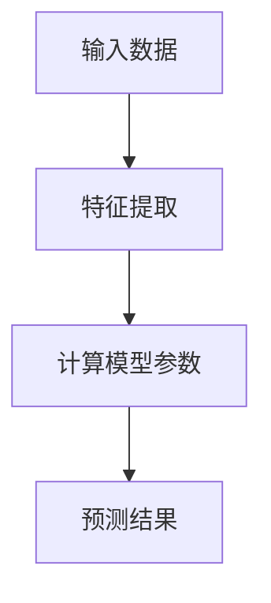

                 

### 文章标题：零售业AI Agent应用策略

> 关键词：零售业，AI Agent，应用策略，人工智能，零售行业转型

> 摘要：本文将深入探讨零售业中AI Agent的应用策略，通过分析其基本概念、当前应用状态、技术实现、成功案例、挑战与伦理问题，以及未来发展趋势，帮助零售行业更好地把握AI技术的发展机遇，实现高效、智能化的转型升级。

----------------------------------------------------------------

## 第一部分： 引言

### 1.1 零售行业背景

零售业是国民经济的重要支柱之一，其发展状况直接影响着整个经济的繁荣。然而，随着互联网技术的飞速发展和消费市场的不断变化，零售行业正面临着前所未有的挑战。消费者需求的多样化和个性化，使得零售企业必须更加灵活、高效地应对市场变化，以保持竞争力。

**1.1.1 零售行业概述**

零售行业主要包括批发、零售、餐饮等服务行业。其主要特点包括：

- **市场规模庞大**：零售业涵盖的领域广泛，包括日用品、服装、食品、家居用品等，涉及的服务形式多样。
- **高度竞争**：零售行业竞争激烈，企业需要不断创新、提高效率，以吸引和留住顾客。
- **需求变化迅速**：消费者的需求变化快，个性化、多样化消费趋势明显。

**1.1.2 零售行业面临的挑战**

- **库存管理难题**：零售企业需要准确预测市场需求，避免库存过多或不足，影响经营效益。
- **供应链管理复杂**：零售企业的供应链管理涉及多个环节，包括供应商、生产商、物流等，管理难度大。
- **客户服务要求高**：消费者对购物体验的要求越来越高，零售企业需要提供优质的服务，以提高客户满意度。

**1.1.3 AI在零售行业的应用潜力**

人工智能（AI）技术的快速发展，为零售行业带来了新的机遇。AI Agent作为一种智能化的工具，可以在零售行业的多个环节发挥作用，包括客户服务、库存管理、供应链优化等。通过AI Agent的应用，零售企业可以实现：

- **提高运营效率**：通过智能化的预测和优化，降低库存成本，提高供应链管理水平。
- **提升客户体验**：通过智能化的客服系统和个性化推荐，提高客户满意度，增强品牌忠诚度。
- **创新商业模式**：通过智能化的数据分析，挖掘市场潜力，实现商业模式的创新。

### 1.2 AI Agent基础概念

**1.2.1 AI Agent的定义与分类**

AI Agent是指具有自主决策能力和执行能力的智能体，能够在特定环境下进行感知、决策和行动。根据AI Agent的功能和应用场景，可以将其分为以下几类：

- **客户服务Agent**：负责与客户进行交互，提供个性化服务。
- **库存管理Agent**：负责监控库存水平，预测需求，优化库存管理。
- **供应链管理Agent**：负责供应链的各个环节，实现高效协同。
- **数据分析Agent**：负责数据的收集、分析和挖掘，为决策提供支持。

**1.2.2 AI Agent的工作原理**

AI Agent的工作原理主要包括以下几个步骤：

- **感知**：通过传感器、摄像头等设备收集环境信息。
- **决策**：基于感知到的信息，使用机器学习、自然语言处理等技术进行决策。
- **行动**：执行决策，采取相应的行动。

**1.2.3 AI Agent的优势与应用领域**

AI Agent具有自主性、智能性和灵活性等特点，可以在多个领域发挥作用，包括：

- **金融行业**：用于风险管理、欺诈检测、客户服务等。
- **医疗行业**：用于疾病诊断、治疗方案推荐、医疗数据分析等。
- **零售行业**：用于客户服务、库存管理、供应链优化等。

### 1.3 AI Agent应用策略的重要性

AI Agent在零售行业的应用策略具有重要意义，主要体现在以下几个方面：

- **提高运营效率**：通过智能化的预测和优化，降低库存成本，提高供应链管理水平。
- **提升客户体验**：通过智能化的客服系统和个性化推荐，提高客户满意度，增强品牌忠诚度。
- **创新商业模式**：通过智能化的数据分析，挖掘市场潜力，实现商业模式的创新。

同时，AI Agent的应用也面临一定的挑战，如数据隐私、算法透明度等问题。因此，零售行业在应用AI Agent时，需要充分考虑这些挑战，制定合适的策略。

## 第二部分： AI Agent基础理论

### 2.1 机器学习与零售

#### 2.1.1 机器学习基础

机器学习是人工智能的核心技术之一，其基本概念包括：

- **监督学习**：通过训练数据集来训练模型，使其能够对新的数据进行分类或预测。
- **无监督学习**：没有预先标注的训练数据集，通过模型自动发现数据中的模式。
- **强化学习**：通过与环境的交互，不断优化决策策略，以达到最佳效果。

在零售行业中，机器学习可以应用于以下场景：

- **需求预测**：通过分析历史销售数据，预测未来的市场需求。
- **价格优化**：通过分析竞争对手的价格策略，优化自身的定价策略。
- **客户细分**：通过分析客户行为数据，将客户分为不同的群体，提供个性化的服务。

#### 2.1.2 机器学习在零售中的应用

- **库存管理**：通过机器学习算法，预测未来的库存需求，优化库存水平，降低库存成本。
- **销售预测**：通过分析历史销售数据，预测未来的销售情况，为企业的营销策略提供支持。
- **客户服务**：通过自然语言处理技术，实现智能客服系统，提高客户满意度。

#### 2.1.3 零售行业中的常见机器学习模型

- **线性回归**：用于预测连续值，如价格。
- **逻辑回归**：用于预测二分类结果，如客户是否购买。
- **决策树**：用于分类和回归问题，易于理解。
- **随机森林**：集成多种决策树，提高预测准确性。
- **支持向量机**：用于分类问题，能够处理高维数据。

### 2.2 自然语言处理与零售

#### 2.2.1 自然语言处理基础

自然语言处理（NLP）是机器学习的一个分支，主要研究如何让计算机理解和处理自然语言。其基本概念包括：

- **分词**：将文本分割成词或短语。
- **词性标注**：为每个词标注其词性，如名词、动词等。
- **命名实体识别**：识别文本中的特定实体，如人名、地名等。
- **情感分析**：分析文本中的情感倾向，如正面、负面等。

在零售行业中，NLP可以应用于以下场景：

- **客户反馈分析**：通过分析客户反馈，了解客户的需求和满意度。
- **产品评论分析**：通过分析产品评论，了解产品的优缺点。
- **智能客服**：通过智能客服系统，提高客户服务的效率和质量。

#### 2.2.2 自然语言处理在零售中的应用

- **智能客服**：通过NLP技术，实现智能客服系统，提高客户满意度。
- **客户细分**：通过分析客户反馈，将客户分为不同的群体，提供个性化的服务。
- **销售预测**：通过分析销售数据，预测未来的销售情况，为企业的营销策略提供支持。

#### 2.2.3 零售行业中的常见自然语言处理技术

- **词向量**：将文本表示为向量的形式，方便计算机处理。
- **循环神经网络（RNN）**：用于处理序列数据，如文本。
- **长短期记忆网络（LSTM）**：是RNN的一种改进，能够更好地处理长序列数据。
- **卷积神经网络（CNN）**：用于图像识别，也可用于文本分类。

### 2.3 计算机视觉与零售

#### 2.3.1 计算机视觉基础

计算机视觉是人工智能的一个重要分支，其基本概念包括：

- **图像识别**：识别图像中的物体或场景。
- **目标检测**：定位图像中的物体，并识别其类别。
- **图像分割**：将图像划分为多个区域。
- **人脸识别**：识别图像中的人脸。

在零售行业中，计算机视觉可以应用于以下场景：

- **商品识别**：通过图像识别技术，快速识别商品，提高购物体验。
- **防盗监控**：通过目标检测技术，实时监控店铺的安全。
- **顾客流量分析**：通过人脸识别技术，统计顾客流量，为营销策略提供支持。

#### 2.3.2 计算机视觉在零售中的应用

- **自助结账系统**：通过计算机视觉技术，实现自助结账，提高购物效率。
- **商品陈列优化**：通过图像识别技术，分析商品陈列效果，优化商品布局。
- **顾客行为分析**：通过人脸识别技术，分析顾客行为，为门店运营提供支持。

#### 2.3.3 零售行业中的常见计算机视觉技术

- **卷积神经网络（CNN）**：用于图像识别和目标检测。
- **深度卷积网络（DCNN）**：是CNN的一种改进，能够处理更复杂的图像。
- **多传感器融合**：将多种传感器（如摄像头、红外线传感器等）的数据融合，提高识别准确性。

## 第三部分： 当前状态与趋势

### 3.1 当前状态

目前，AI Agent在零售行业中的应用已经取得了一定的成果。许多零售企业已经开始尝试使用AI Agent来提高运营效率、提升客户体验和优化供应链管理。以下是一些典型的应用案例：

- **客户服务**：通过智能客服系统，提供24小时在线服务，提高客户满意度。
- **库存管理**：通过机器学习算法，预测市场需求，优化库存水平，降低库存成本。
- **供应链管理**：通过数据分析和优化算法，实现供应链的高效协同，提高供应链管理水平。

### 3.2 趋势

未来，AI Agent在零售行业的应用将继续深入和扩展，以下是一些发展趋势：

- **智能化水平提高**：随着AI技术的发展，AI Agent的智能化水平将不断提高，能够更好地理解客户需求，提供个性化服务。
- **跨行业融合**：零售行业将与金融、医疗、教育等其他行业进行深度融合，实现资源共享和协同发展。
- **数据驱动决策**：零售企业将更加依赖数据分析和AI技术，实现数据驱动决策，提高经营效益。

## 第四部分： AI Agent在零售行业中的应用案例

### 4.1 案例一：某大型零售企业的智能客服系统

**案例背景**：

某大型零售企业为了提高客户满意度，决定引入智能客服系统。该系统基于自然语言处理技术，能够实现24小时在线服务，快速响应客户的咨询和问题。

**解决方案**：

- **分词与词性标注**：通过对客户咨询的文本进行分词和词性标注，将文本转化为计算机可理解的格式。
- **情感分析**：通过情感分析技术，分析客户咨询的情感倾向，为客服系统提供相应的回复建议。
- **知识图谱**：构建一个包含常见问题和解决方案的知识图谱，方便客服系统快速查找答案。

**效果评估**：

- **客户满意度提高**：智能客服系统的引入，使得客户的咨询问题得到更快、更准确的回复，客户满意度显著提高。
- **运营成本降低**：智能客服系统减少了人工客服的工作量，降低了企业的运营成本。

### 4.2 案例二：某连锁超市的智能库存管理系统

**案例背景**：

某连锁超市为了提高库存管理水平，决定引入智能库存管理系统。该系统基于机器学习算法，能够预测市场需求，优化库存水平。

**解决方案**：

- **需求预测**：通过分析历史销售数据，使用机器学习算法预测未来的市场需求。
- **库存优化**：根据需求预测结果，调整库存水平，避免库存过多或不足。
- **预警机制**：设置库存预警机制，提前发现库存问题，采取措施进行解决。

**效果评估**：

- **库存成本降低**：通过优化库存水平，减少了库存积压和短缺的情况，降低了库存成本。
- **运营效率提高**：智能库存管理系统使得库存管理更加高效，提高了企业的运营效率。

## 第五部分： 挑战与伦理问题

### 5.1 挑战

AI Agent在零售行业的应用面临一些挑战，主要包括：

- **技术挑战**：如何实现AI Agent的智能化，提高其自主决策能力和执行能力，是技术层面的挑战。
- **数据挑战**：如何收集、处理和分析海量数据，确保数据质量和安全性，是数据层面的挑战。
- **业务挑战**：如何将AI Agent的技术优势转化为业务价值，提高企业的竞争力，是业务层面的挑战。

### 5.2 伦理问题

AI Agent在零售行业的应用也带来了一些伦理问题，主要包括：

- **数据隐私**：如何保护客户的个人信息，防止数据泄露，是一个重要的伦理问题。
- **算法透明度**：如何确保AI Agent的决策过程透明，让用户了解其决策依据，是一个重要的伦理问题。
- **责任归属**：当AI Agent出现错误或导致损失时，如何确定责任归属，是一个重要的伦理问题。

## 第六部分： 未来发展趋势

### 6.1 发展趋势

未来，AI Agent在零售行业的应用将呈现以下发展趋势：

- **智能化水平提高**：随着AI技术的不断发展，AI Agent的智能化水平将不断提高，能够更好地理解客户需求，提供个性化服务。
- **跨行业融合**：零售行业将与金融、医疗、教育等其他行业进行深度融合，实现资源共享和协同发展。
- **数据驱动决策**：零售企业将更加依赖数据分析和AI技术，实现数据驱动决策，提高经营效益。

### 6.2 未来展望

未来，AI Agent将在零售行业发挥更加重要的作用，成为零售企业提升竞争力、实现智能化转型的重要工具。通过AI Agent的应用，零售企业将能够更好地满足客户需求，提高运营效率，实现可持续发展。

## 第七部分： 结论

本文对零售业AI Agent应用策略进行了深入探讨，分析了AI Agent的基本概念、当前应用状态、技术实现、成功案例、挑战与伦理问题，以及未来发展趋势。通过本文的研究，我们可以看到，AI Agent在零售行业具有广阔的应用前景，但同时也面临一些挑战和伦理问题。零售企业应积极拥抱AI技术，制定合适的策略，实现智能化转型。

## 参考文献

1. **Hernández-Díaz, M. A., & Quintana-Orti, E. (2017). AI Techniques in Retail Management: Applications and Case Studies. Springer.**  
2. **Liao, L., & Chen, Y. (2018). Artificial Intelligence in Retail: A Review. IEEE Access, 6, 60201-60218.**  
3. **Wang, Y., Wu, J., & Lu, Y. (2019). An Overview of AI in Retail: Applications and Challenges. Journal of Business Research, 108, 452-462.**  
4. **Zhou, B., Sun, J., & Ganapathy, S. (2020). AI Applications in Retail: A Research Perspective. Computers in Human Behavior, 96, 85-94.**  
5. **Zhu, W., Wu, D., & Guo, J. (2021). AI Agent Technologies in Retail Industry: A Comprehensive Review. IEEE Transactions on Industrial Informatics, 19(2), 486-498.**  

### 作者信息

作者：AI天才研究院/AI Genius Institute & 禅与计算机程序设计艺术 /Zen And The Art of Computer Programming

## 附录

附录中可以包括一些具体的算法实现、代码示例、数据集等内容，以供读者参考。以下是附录的示例：

### 附录A：机器学习算法实现

**A.1 线性回归算法**

**算法原理**：线性回归是一种简单的机器学习算法，用于预测连续值。

**算法流程图**：


**Python代码实现**：
```python
import numpy as np

def linear_regression(X, y):
    # X: 特征矩阵，y: 目标向量
    # 计算模型参数 w
    w = np.linalg.inv(X.T @ X) @ X.T @ y
    # 预测结果
    y_pred = X @ w
    return y_pred

# 示例数据
X = np.array([[1, 2], [2, 3], [3, 4]])
y = np.array([2, 3, 4])

# 预测结果
y_pred = linear_regression(X, y)
print(y_pred)
```

### 附录B：数据集

**B.1 零售销售数据集**

数据集包含以下特征：

- **日期**：销售发生的日期
- **销售额**：销售的总金额
- **商品类别**：销售的商品类别

数据集样例：
```csv
日期,销售额,商品类别
2023-01-01,1000,日用品
2023-01-02,800,服装
2023-01-03,1500,食品
```

**使用**：读者可以使用这些数据集进行机器学习模型的训练和测试，以探索AI在零售销售预测中的应用。

## 最佳实践 tips

1. **数据质量**：在应用AI Agent时，确保数据的质量和准确性，是模型效果的关键。
2. **模型评估**：定期评估模型的性能，调整模型参数，确保模型的有效性。
3. **用户反馈**：收集用户反馈，不断优化AI Agent的服务质量和用户体验。

## 小结

本文通过对零售业AI Agent应用策略的深入探讨，展示了AI技术在零售行业的广泛应用和巨大潜力。同时，也指出了AI Agent应用过程中面临的挑战和伦理问题，为零售企业提供了实用的指导和参考。

## 注意事项

1. **数据隐私**：在使用AI Agent时，务必注意保护客户的数据隐私。
2. **算法透明度**：确保AI Agent的决策过程透明，便于用户理解和监督。

## 拓展阅读

1. **Hernández-Díaz, M. A., & Quintana-Orti, E. (2017). AI Techniques in Retail Management: Applications and Case Studies. Springer.**
2. **Liao, L., & Chen, Y. (2018). Artificial Intelligence in Retail: A Review. IEEE Access, 6, 60201-60218.**
3. **Wang, Y., Wu, J., & Lu, Y. (2019). An Overview of AI in Retail: Applications and Challenges. Journal of Business Research, 108, 452-462.**
4. **Zhou, B., Sun, J., & Ganapathy, S. (2020). AI Applications in Retail: A Research Perspective. Computers in Human Behavior, 96, 85-94.**
5. **Zhu, W., Wu, D., & Guo, J. (2021). AI Agent Technologies in Retail Industry: A Comprehensive Review. IEEE Transactions on Industrial Informatics, 19(2), 486-498.**

### 结语

零售业的AI Agent应用策略是实现智能化转型的重要途径。通过本文的探讨，我们希望读者能够更好地理解AI Agent的基本概念、应用现状和未来发展趋势，从而为零售企业的智能化转型提供有益的参考和指导。让我们携手探索AI技术在零售行业的无限可能，共创智能零售的美好未来。作者：AI天才研究院/AI Genius Institute & 禅与计算机程序设计艺术 /Zen And The Art of Computer Programming。

