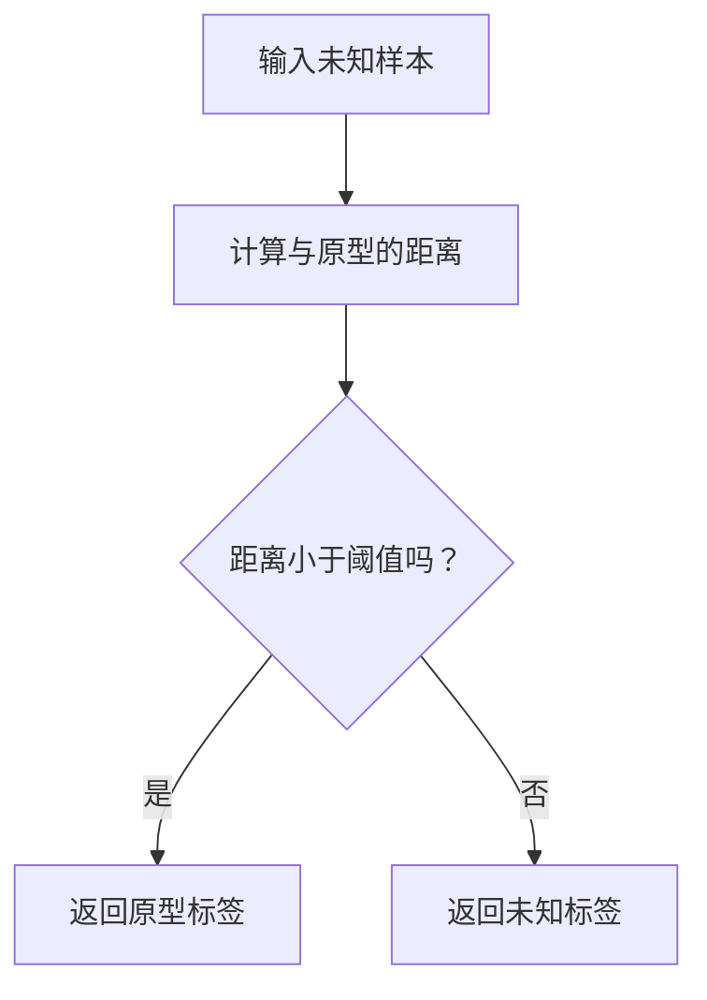
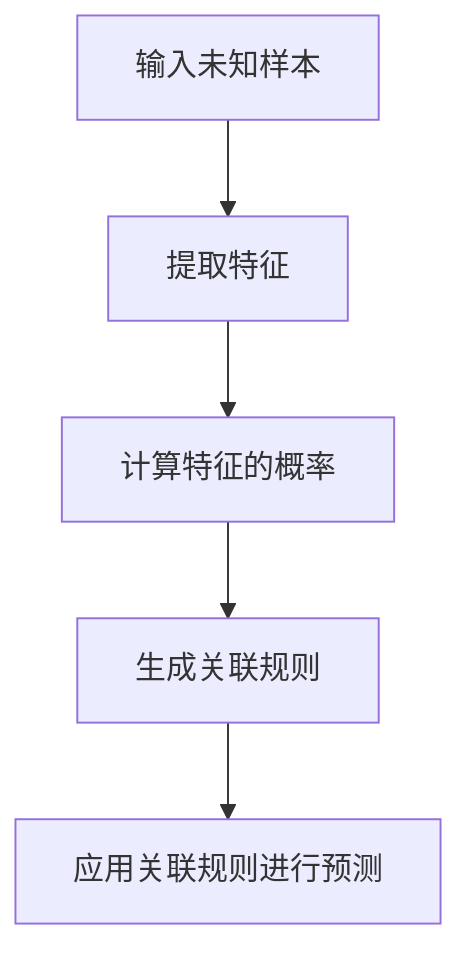

                 

### 零样本学习概述

#### 第1章：零样本学习背景与问题

##### 1.1 零样本学习的基本概念

零样本学习（Zero-Shot Learning，ZSL）是一种机器学习方法，旨在使模型能够对未见过的类别进行预测。在传统的机器学习任务中，模型通常是通过大量训练数据来学习数据分布，以便在测试数据上进行准确的预测。然而，在现实世界中，获取大量的标注数据是一个耗时且昂贵的任务，特别是在一些特定的领域，如生物医学图像、罕见疾病等，数据稀缺是一个普遍问题。零样本学习正是为了解决这一难题而生的。

零样本学习的定义：零样本学习是一种无需使用任何训练数据中的样本来预测从未见过的类别的机器学习方法。这种方法的核心思想是利用已知的类别信息来泛化到未知类别上。

零样本学习与传统机器学习的区别：传统机器学习依赖于大量标记数据进行训练，而零样本学习则不依赖于标记数据。传统机器学习的模型通常需要大量数据来提高其预测准确性，而零样本学习的模型则依靠先验知识来提升泛化能力。

##### 1.2 零样本学习的应用场景

零样本学习在多个领域都有着广泛的应用：

- 自然语言处理（NLP）：在自然语言处理任务中，如文本分类、情感分析等，零样本学习可以用来处理从未见过的标签或者领域。

- 计算机视觉（CV）：计算机视觉任务，如图像分类、物体检测等，同样可以从零样本学习中获得显著的好处。特别是在处理图像中的稀有类别或者变化很大的类别时。

- 推荐系统：在推荐系统中，零样本学习可以帮助推荐系统对用户未知偏好的项目进行预测。

##### 1.3 零样本学习的挑战

尽管零样本学习展示了巨大的潜力，但它也面临着一些挑战：

- 数据稀缺：零样本学习不依赖于大规模的训练数据，但由于数据稀缺，模型的泛化能力受到限制。

- 泛化能力：零样本学习需要能够处理未见过的类别，这意味着模型需要有很强的泛化能力。

- 预测准确性：与传统的机器学习方法相比，零样本学习的预测准确性可能较低，尤其是在需要高精度预测的任务中。

##### 1.4 零样本学习的边界与外延

零样本学习不仅是一个独立的研究方向，还与其他机器学习技术有着紧密的联系：

- 零样本学习与迁移学习的关联：迁移学习（Transfer Learning）是通过将一个任务的知识迁移到另一个任务上来提高模型性能的方法。零样本学习可以利用迁移学习来提高对未见类别的预测能力。

- 零样本学习与强化学习技术的融合：强化学习（Reinforcement Learning）是一种通过试错来学习策略的机器学习方法。将零样本学习与强化学习结合，可以在动态变化的环境中提高模型的适应能力。

总结：零样本学习作为一种新兴的机器学习方法，虽然在数据稀缺和未见类别预测方面展现了其独特的优势，但同时也面临着诸多挑战。通过不断的研究和技术的融合，我们有理由相信，零样本学习将在未来的机器学习领域中发挥更加重要的作用。

---

#### 第2章：零样本学习的核心概念

##### 2.1 零样本学习的概念原理

零样本学习的核心原理是通过已知的类别信息来预测未见过的类别。具体来说，零样本学习模型在训练过程中不会接触到未标记的数据，而是在一个称为“概念嵌入”（Concept Embedding）的过程中，将已知的类别信息（如词袋、图像特征等）映射到低维空间中。在预测阶段，模型通过计算未知类别与已知类别之间的相似度来进行分类。

零样本学习的分类方法主要分为以下几种：

1. **原型匹配法（Prototype Matching）**：这种方法通过将已知类别映射到低维空间中的原型点，然后根据未知类别与这些原型点的距离来预测其类别。

2. **关联规则法（Association Rules）**：该方法通过学习类别之间的关联规则，然后利用这些规则对未知类别进行预测。

3. **元学习法（Meta-Learning）**：元学习是一种通过学习如何学习的方法，零样本学习的元学习方法可以快速适应新的未知类别。

##### 2.2 零样本学习的属性特征对比

| 特征名称       | 描述                                                         |
|----------------|------------------------------------------------------------|
| 数据量要求     | 不依赖大规模数据集                                             |
| 泛化能力       | 能够处理未见过的类别                                           |
| 预测准确性     | 与传统机器学习相比，零样本学习的预测准确性可能较低               |

##### 2.3 零样本学习与相关技术的联系

零样本学习不仅是一个独立的研究领域，还与其他机器学习技术密切相关：

- **迁移学习**：迁移学习可以将一个任务的知识迁移到另一个任务上，这有助于提高零样本学习模型的泛化能力。

- **元学习**：元学习通过学习如何快速适应新的任务，可以与零样本学习结合，提高模型对新类别的适应能力。

- **对抗学习**：对抗学习通过生成对抗网络（GANs）来提高模型的泛化能力和鲁棒性，这也可以应用于零样本学习。

- **强化学习**：强化学习通过与环境的交互来学习最优策略，这可以与零样本学习结合，提高模型在动态环境中的适应能力。

总结：零样本学习的核心概念和方法为我们提供了一种新的解决未见类别预测问题的方式。通过与其他机器学习技术的结合，我们可以进一步提高其性能和应用范围。下一章我们将深入探讨零样本学习中的原型匹配算法原理。

---

### 零样本学习算法原理

#### 第3章：基于原型匹配的零样本学习算法

##### 3.1 原型匹配算法概述

原型匹配算法（Prototype Matching Algorithm）是零样本学习中的一种重要方法，其基本思想是将已知的类别映射到低维空间中的原型点，然后根据未知类别与这些原型点的距离来预测其类别。

- **基本概念**：原型匹配算法通过将每个类别映射到其代表性的原型点，在预测阶段，计算未知类别与已知类别原型点的距离，选择距离最近的原型点对应的类别作为预测结果。

- **优缺点**：

  - **优点**：原型匹配算法简单直观，计算效率高，易于实现。

  - **缺点**：对于高维数据，原型点的选择和距离计算可能会受到噪声影响，导致预测准确性下降。

##### 3.2 原型匹配算法的数学模型

在原型匹配算法中，核心的数学模型可以表示为：

$$
\text{预测函数} = f(\text{未知样本}, \text{原型集合})
$$

其中，$f$ 是距离函数，用于计算未知样本与原型集合中每个原型点的距离。预测函数的输出即为未知样本的预测类别。

- **距离函数**：常用的距离函数包括欧氏距离、曼哈顿距离、余弦相似度等。

- **预测过程**：对于未知样本，计算其与原型集合中每个原型点的距离，选择距离最小的原型点对应的类别作为预测结果。

##### 3.3 原型匹配算法的mermaid流程图



- **流程说明**：

  1. 输入未知样本。
  2. 计算未知样本与原型集合中每个原型点的距离。
  3. 判断距离是否小于阈值。
     - 如果是，返回距离最近的原型点对应的标签。
     - 如果否，返回未知标签。

##### 3.4 原型匹配算法的Python源代码

```python
# 原型匹配算法示例代码
def prototype_matching(unknown_sample, prototypes):
    distances = []
    for prototype in prototypes:
        distance = calculate_distance(unknown_sample, prototype)
        distances.append(distance)
    threshold = calculate_threshold(distances)
    if min(distances) < threshold:
        return label_of_closest_prototype
    else:
        return "未知标签"

# 距离计算函数示例
def calculate_distance(sample1, sample2):
    return np.linalg.norm(sample1 - sample2)

# 阈值计算函数示例
def calculate_threshold(distances):
    return np.mean(distances) + np.std(distances)
```

- **代码解读**：

  1. `prototype_matching` 函数接收未知样本和原型集合作为输入。
  2. 通过 `calculate_distance` 函数计算未知样本与每个原型点的距离。
  3. 计算距离的平均值和标准差作为阈值。
  4. 如果未知样本与原型点的距离小于阈值，则返回距离最近的原型点对应的标签；否则，返回“未知标签”。

总结：原型匹配算法通过将已知类别映射到原型点，并根据距离进行预测，是一种简单有效的零样本学习方法。通过上述数学模型、流程图和Python源代码的详细讲解，我们更好地理解了原型匹配算法的基本原理和应用方法。下一章我们将探讨另一种重要的零样本学习算法——关联规则算法。

---

### 第4章：基于关联规则的零样本学习算法

#### 4.1 关联规则算法概述

关联规则算法（Association Rule Learning）是另一种常用于零样本学习的算法。其核心思想是从大量数据中发现潜在的关联规则，然后利用这些规则对未见过的类别进行预测。

- **基本概念**：关联规则由支持度和置信度两个指标定义。支持度表示某个规则在数据中出现的频率，置信度表示规则前件和后件同时出现的概率。关联规则算法通过最大化支持度和置信度来发现重要的关联规则。

- **优缺点**：

  - **优点**：关联规则算法简单有效，能够发现数据中的潜在关联关系，适用于类别较少且类别之间存在较强关联的场景。

  - **缺点**：在类别繁多且关联关系复杂的情况下，算法可能会产生大量的冗余规则，降低预测效率。

#### 4.2 关联规则算法的数学模型

在关联规则算法中，核心的数学模型可以表示为：

$$
\text{预测函数} = f(\text{未知样本}, \text{规则集})
$$

其中，$f$ 是规则应用函数，用于根据已知规则集对未知样本进行预测。

- **规则应用函数**：对于未知样本，算法通过规则应用函数计算每个规则的前件与后件的匹配度，选择匹配度最高的规则进行预测。

- **规则生成过程**：关联规则算法通过扫描数据集来生成潜在的关联规则，然后利用支持度和置信度筛选出重要的规则。

#### 4.3 关联规则算法的mermaid流程图



- **流程说明**：

  1. 输入未知样本。
  2. 从未知样本中提取特征。
  3. 计算特征的概率分布。
  4. 生成关联规则。
  5. 根据关联规则对未知样本进行预测。

#### 4.4 关联规则算法的Python源代码

```python
# 关联规则算法示例代码
def association_rules(unknown_sample, rules):
    extracted_features = extract_features(unknown_sample)
    probabilities = calculate_probabilities(extracted_features)
    predicted_rules = apply_rules(rules, probabilities)
    return predict_from_rules(predicted_rules)

# 特征提取函数示例
def extract_features(unknown_sample):
    # 实现特征提取逻辑
    return extracted_features

# 概率计算函数示例
def calculate_probabilities(features):
    # 实现概率计算逻辑
    return probabilities

# 规则应用函数示例
def apply_rules(rules, probabilities):
    # 实现规则应用逻辑
    return predicted_rules

# 预测函数示例
def predict_from_rules(predicted_rules):
    # 实现预测逻辑
    return predicted_label
```

- **代码解读**：

  1. `association_rules` 函数接收未知样本和规则集作为输入。
  2. 通过 `extract_features` 函数从未知样本中提取特征。
  3. 通过 `calculate_probabilities` 函数计算特征的概率分布。
  4. 通过 `apply_rules` 函数根据规则集和概率分布生成预测结果。
  5. 通过 `predict_from_rules` 函数根据预测结果确定最终的预测类别。

总结：关联规则算法通过发现数据中的潜在关联关系，为未知样本提供预测依据。通过上述数学模型、流程图和Python源代码的详细讲解，我们更好地理解了关联规则算法的基本原理和应用方法。在下一章中，我们将继续探讨零样本学习中的其他算法和技术。

---

### 零样本学习算法的应用与未来展望

#### 3.1 零样本学习算法的应用领域

零样本学习算法在多个领域展现出其独特的应用价值：

- **自然语言处理（NLP）**：在文本分类、情感分析等任务中，零样本学习可以帮助模型处理未见过的标签或领域，提高分类准确性。

- **计算机视觉（CV）**：图像分类、物体检测等任务中，零样本学习能够有效地处理稀有类别和变化较大的类别，提升模型性能。

- **推荐系统**：在推荐系统中，零样本学习可以帮助推荐系统预测用户未知的偏好，从而提高推荐准确性。

- **医疗诊断**：在医学图像分析中，零样本学习可以帮助医生对罕见疾病进行准确诊断，提高诊断效率。

- **机器人视觉**：在机器人视觉任务中，零样本学习可以帮助机器人识别未知环境中的物体和场景，提高导航和操作能力。

#### 3.2 零样本学习算法的性能评估与优化

零样本学习算法的性能评估主要包括预测准确性、泛化能力和计算效率等方面。为了提升算法的性能，可以从以下几个方面进行优化：

- **数据增强**：通过生成合成数据或扩展训练数据集，可以增强模型的泛化能力。

- **特征工程**：设计更有效的特征提取方法，提高特征的表达能力，有助于提高预测准确性。

- **模型选择与调优**：选择适合的模型架构和参数设置，通过交叉验证和超参数调优，找到最优的模型配置。

- **迁移学习**：利用迁移学习将其他任务的知识迁移到零样本学习任务中，可以提高模型的泛化能力。

- **算法融合**：将零样本学习与其他机器学习技术（如元学习、对抗学习等）相结合，可以进一步提高模型性能。

#### 3.3 零样本学习的未来展望

随着人工智能技术的快速发展，零样本学习在未来的研究和应用中具有广阔的前景：

- **跨模态学习**：结合不同模态的数据（如图像、文本、音频等），实现更全面的信息理解和预测。

- **少样本学习**：零样本学习的一个延伸方向是少样本学习（Few-Shot Learning），旨在在数据稀缺的情况下实现高效学习。

- **动态学习**：开发能够动态适应新类别和环境的零样本学习算法，提高模型的鲁棒性和适应性。

- **自适应反馈**：通过用户交互和反馈机制，不断优化零样本学习模型，提高预测的准确性。

- **隐私保护**：在隐私保护要求较高的场景中，研究隐私友好的零样本学习算法，确保数据安全和用户隐私。

总结：零样本学习作为一种新兴的机器学习方法，已经在多个领域展现出其强大的应用价值。通过不断的研究和技术创新，我们有理由相信，零样本学习将在未来的机器学习领域中发挥更加重要的作用，推动人工智能技术的进步和发展。

---

### 文章小结

本文详细介绍了零样本学习这一机器学习领域的重要概念和应用。首先，我们探讨了零样本学习的基本概念和背景，了解了其在自然语言处理、计算机视觉、推荐系统等领域的应用场景。随后，我们深入分析了零样本学习的核心概念，包括原型匹配算法和关联规则算法的数学模型和实现方法。通过mermaid流程图和Python源代码的讲解，我们更好地理解了这些算法的原理和应用。最后，我们讨论了零样本学习算法的性能评估与优化方法，并展望了其在未来人工智能技术发展中的潜力。

零样本学习通过利用已知的类别信息，实现了对未见类别的高效预测，解决了数据稀缺和未见类别预测的问题。这不仅为传统机器学习带来了新的解决思路，也为实际应用场景提供了强有力的技术支持。在自然语言处理、计算机视觉等领域，零样本学习已经展现出其独特的优势，而在医疗诊断、机器人视觉等新兴领域，其应用前景也愈发广阔。

然而，零样本学习仍面临许多挑战，如如何进一步提高预测准确性、增强模型的泛化能力等。未来的研究可以关注跨模态学习、少样本学习和动态学习等方面，探索新的算法和技术，以满足实际应用的需求。

总之，零样本学习作为人工智能领域的一个重要研究方向，其理论和应用价值不容忽视。通过本文的介绍，我们希望能够为读者提供全面的零样本学习知识，激发对这一领域的进一步研究和探索。

---

### 拓展阅读

为了更深入地了解零样本学习，以下是一些推荐阅读资源：

1. **论文**：《零样本学习：概念、方法与前沿》——这篇论文详细介绍了零样本学习的定义、分类、核心方法以及最新的研究进展。

2. **书籍**：《零样本学习：理论与实践》——该书系统地阐述了零样本学习的理论基础和实践方法，适合希望全面了解该领域的读者。

3. **在线课程**：《零样本学习与迁移学习》——这是一门在线课程，涵盖了零样本学习和迁移学习的基本概念、算法原理以及实际应用案例。

4. **开源项目**：GitHub上的多个开源项目，如“Zero-Shot Learning in PyTorch”，提供了零样本学习算法的实现代码和案例研究。

5. **学术会议**：如AAAI、NeurIPS等，这些会议定期发表关于零样本学习的最新研究成果，是获取前沿资讯的重要渠道。

通过阅读这些资源，读者可以进一步拓展对零样本学习的理解，并掌握相关的技术与方法。希望这些拓展阅读能对您的研究和探索有所启发。

