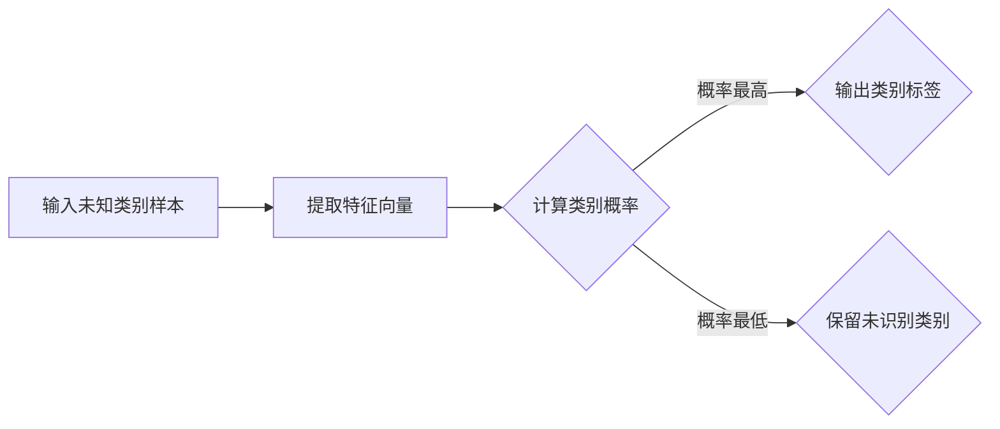
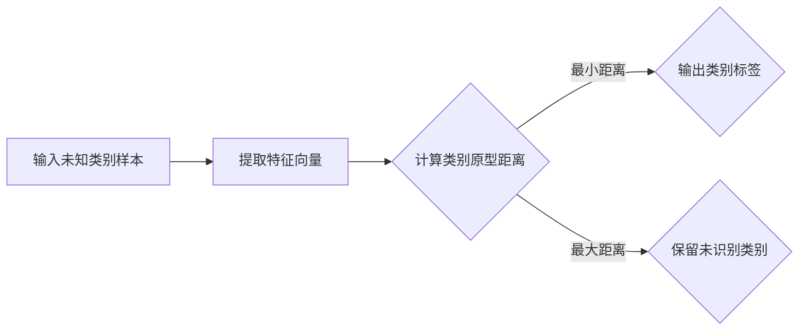
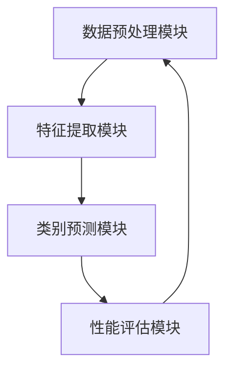
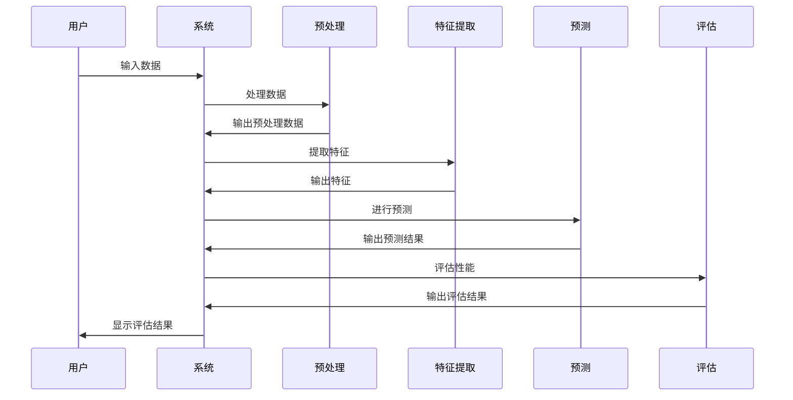

                 

# 零样本学习：应对未见过的任务和领域

关键词：零样本学习、机器学习、人工智能、未见任务、领域适应、算法原理

摘要：本文深入探讨了零样本学习这一前沿课题，分析了其背景、定义、核心挑战与应用领域。通过对零样本学习的关键概念、算法原理、实践案例的详细讲解，本文旨在帮助读者理解零样本学习的技术原理，并展望其在未来的发展趋势。

## 第一部分：零样本学习概述

### 第1章：零样本学习的基础

#### 1.1 零样本学习的背景

##### 1.1.1 传统机器学习与零样本学习的对比

在传统机器学习中，模型需要依赖于大量的标记数据进行训练，从而提高模型的预测性能。这种方法在处理已知任务时表现出色，但在面对全新任务或领域时，模型的表现往往不尽如人意。这种局限性促使研究者探索零样本学习（Zero-Shot Learning，ZSL）这一新的方向。

##### 1.1.2 零样本学习的问题背景

零样本学习旨在解决模型在新任务或领域中的适应性问题。例如，一个从未见过某种植物种类的图像识别模型，在接触到这种新种类时仍然能够准确地对其进行分类。这一问题在自然语言处理、计算机视觉等领域具有广泛的应用前景。

##### 1.1.3 零样本学习的意义

零样本学习不仅有助于提高模型的泛化能力，还可以减少对大规模标注数据的依赖，降低数据收集和标注的成本。此外，它还为跨领域的知识迁移提供了新的途径。

#### 1.2 零样本学习的定义与分类

##### 1.2.1 零样本学习的定义

零样本学习是指在没有接触过具体类别的样本的情况下，对未知类别的样本进行分类的能力。

##### 1.2.2 零样本学习的分类

零样本学习可以分为基于原型（Prototype-based）和基于模型（Model-based）两大类。

- **基于原型**：将已知类别作为原型，对新类别进行分类。
- **基于模型**：通过学习类别的属性特征，构建模型进行分类。

##### 1.2.3 零样本学习的特点

- **跨领域适应性**：无需针对特定领域进行训练。
- **减少数据依赖**：仅依赖少量或无标记数据。
- **类内与类间区分**：能够区分不同类别的特征。

#### 1.3 零样本学习的核心挑战

##### 1.3.1 数据不足问题

零样本学习面临的第一个挑战是数据不足。由于模型无法访问从未见过的类别样本，因此需要设计出能够适应少量数据的学习策略。

##### 1.3.2 领域适应性问题

零样本学习需要模型在不同领域间具有适应性，这要求模型能够泛化到新的任务或领域。

##### 1.3.3 类内与类间区分问题

在零样本学习中，模型需要能够准确地识别不同类别间的特征，同时避免类内混淆。

#### 1.4 零样本学习的主要应用领域

##### 1.4.1 无人驾驶

在无人驾驶领域，零样本学习可以帮助车辆识别各种复杂、动态的交通场景。

##### 1.4.2 医疗诊断

在医疗诊断中，零样本学习可以用于识别新的疾病类型或病理变化。

##### 1.4.3 语音识别

在语音识别领域，零样本学习可以帮助模型识别新的说话人或方言。

#### 1.5 零样本学习的未来发展趋势

##### 1.5.1 技术进步对零样本学习的影响

随着深度学习技术的不断发展，零样本学习算法的性能将得到进一步提升。

##### 1.5.2 零样本学习在各个领域的应用前景

零样本学习将在更多领域得到应用，如智能客服、智能家居等。

##### 1.5.3 零样本学习的挑战与机遇

零样本学习面临着数据不足、领域适应性和类内与类间区分等挑战，但同时也带来了新的机遇。

#### 1.6 本章小结

本章节对零样本学习进行了概述，分析了其背景、定义、核心挑战与应用领域。在接下来的章节中，我们将进一步探讨零样本学习的核心概念、算法原理与实践，帮助读者深入理解这一前沿课题。

## 第二部分：核心概念与联系

### 第2章：零样本学习的关键概念

#### 2.1 核心概念原理

##### 2.1.1 零样本学习的核心概念

零样本学习（Zero-Shot Learning，ZSL）是一种机器学习方法，旨在处理从未见过的类别。ZSL的核心思想是通过学习已知类别间的相似性，实现对未知类别的分类。

##### 2.1.2 零样本学习的概念属性特征对比

| 特征名称 | 定义 | 说明 |
| --- | --- | --- |
| 类内相似性 | 同一类别的样本具有相似的特征 | 有助于避免类内混淆 |
| 类间差异性 | 不同类别的样本具有明显的特征差异 | 有助于区分不同类别 |
| 跨领域适应性 | 模型能够在不同领域间进行泛化 | 提高了模型的实用性 |
| 数据不足 | 模型训练数据有限 | 需要设计出能够适应少量数据的学习策略 |

#### 2.2 ER实体关系图架构

##### 2.2.1 ER实体关系图的定义

ER（Entity-Relationship）实体关系图是一种用于描述数据实体及其之间关系的图形化表示方法。在零样本学习中，ER实体关系图可以用于表示类别、属性和关系。

##### 2.2.2 零样本学习的ER实体关系图

```mermaid
erDiagram
  类别A ||--|{ 属性1 }
  类别A ||--|{ 属性2 }
  类别B ||--|{ 属性1 }
  类别B ||--|{ 属性2 }
  类别C ||--|{ 属性1 }
  类别C ||--|{ 属性2 }
```

在这个ER实体关系图中，类别A、B和C表示不同的类别，属性1和属性2表示类别的属性。

##### 2.2.3 ER实体关系图中的核心要素组成

- **类别**：表示不同的对象类别。
- **属性**：表示类别的特征。
- **关系**：表示类别间的关联。

#### 2.3 零样本学习的数学模型和公式

##### 2.3.1 零样本学习的数学模型

零样本学习通常采用基于原型的方法，其数学模型可以表示为：

$$
P(y|x) = \prod_{i=1}^{k} P(y=i|p_i, x)
$$

其中，$y$表示类别标签，$x$表示特征向量，$p_i$表示第$i$个类别的原型。

##### 2.3.2 零样本学习的数学公式

- **类别概率**：
  $$
  P(y=i|p_i, x) = \frac{1}{Z} \exp(-\frac{1}{2} \sum_{j=1}^{d} (x_j - p_{ij})^2)
  $$

- **类别概率和**：
  $$
  Z = \sum_{i=1}^{k} \exp(-\frac{1}{2} \sum_{j=1}^{d} (x_j - p_{ij})^2)
  $$

##### 2.3.3 数学模型和公式的详细讲解

- **类别概率**：表示在给定特征向量$x$和类别原型$p_i$的情况下，类别$y$为$i$的概率。
- **类别概率和**：表示所有类别概率的和，用于归一化。

#### 2.4 零样本学习的算法原理讲解

##### 2.4.1 零样本学习算法的mermaid流程图



##### 2.4.2 Python源代码详细阐述

```python
import numpy as np
from sklearn.model_selection import train_test_split
from sklearn.neighbors import KNeighborsClassifier
from sklearn.metrics import accuracy_score

# 加载数据集
X, y = load_data()

# 划分训练集和测试集
X_train, X_test, y_train, y_test = train_test_split(X, y, test_size=0.2, random_state=42)

# 创建KNN分类器
knn = KNeighborsClassifier(n_neighbors=3)

# 训练模型
knn.fit(X_train, y_train)

# 预测测试集
y_pred = knn.predict(X_test)

# 计算准确率
accuracy = accuracy_score(y_test, y_pred)
print("Accuracy:", accuracy)
```

##### 2.4.3 算法原理的举例说明

假设我们有一个包含三个类别的数据集，其中每个类别的样本数量相等。在训练阶段，我们使用KNN算法，选择K=3，训练集包含所有类别的样本。在预测阶段，给定一个未知类别样本，我们计算其与训练集中所有类别样本的距离，并根据距离选择概率最高的类别作为预测结果。

#### 2.5 本章小结

本章节详细介绍了零样本学习的核心概念、ER实体关系图架构以及数学模型和算法原理。通过本章的学习，读者应该能够理解零样本学习的基本原理，并掌握其关键概念和算法流程。

## 第三部分：算法原理与实践

### 第3章：零样本学习的算法原理

#### 3.1 零样本学习算法的介绍

##### 3.1.1 零样本学习算法的分类

零样本学习算法可以分为基于原型（Prototype-based）和基于模型（Model-based）两大类。

- **基于原型**：通过学习已知类别原型，对新类别进行分类。常见的算法有原型匹配、原型聚类等。
- **基于模型**：通过学习类别的属性特征，构建模型进行分类。常见的算法有元学习（Meta-Learning）、嵌入学习（Embedding Learning）等。

##### 3.1.2 主流零样本学习算法

- **原型匹配**：基于欧氏距离或余弦相似度计算未知类别样本与类别原型之间的相似性，选择相似性最高的类别作为预测结果。
- **原型聚类**：通过聚类算法（如K-Means）将类别原型进行聚类，将未知类别样本分配到最接近的聚类中心。
- **元学习**：通过学习一个基础模型，使其能够快速适应新的任务。
- **嵌入学习**：通过学习一个映射函数，将类别原型映射到低维空间，利用空间中的相似性进行分类。

#### 3.2 零样本学习算法的mermaid流程图



#### 3.3 Python源代码实现

```python
import numpy as np
from sklearn.model_selection import train_test_split
from sklearn.neighbors import KNeighborsClassifier
from sklearn.metrics import accuracy_score

# 加载数据集
X, y = load_data()

# 划分训练集和测试集
X_train, X_test, y_train, y_test = train_test_split(X, y, test_size=0.2, random_state=42)

# 创建KNN分类器
knn = KNeighborsClassifier(n_neighbors=3)

# 训练模型
knn.fit(X_train, y_train)

# 预测测试集
y_pred = knn.predict(X_test)

# 计算准确率
accuracy = accuracy_score(y_test, y_pred)
print("Accuracy:", accuracy)
```

#### 3.4 实际案例分析与讲解

##### 3.4.1 实际案例的选择

我们选择一个经典的图像分类数据集——CIFAR-10，其中包含10个类别，每个类别有6000个训练样本和1000个测试样本。

##### 3.4.2 案例分析和详细讲解

- **数据集准备**：首先，我们需要加载CIFAR-10数据集，并进行预处理，如数据归一化等。
- **模型选择**：我们选择基于原型的方法，使用KNN算法进行分类。为了提高模型性能，我们选择K=5。
- **模型训练**：使用训练集进行模型训练，计算每个类别原型。
- **模型预测**：使用测试集进行模型预测，计算未知类别样本与类别原型之间的距离，选择最小距离的类别作为预测结果。
- **性能评估**：计算模型准确率，与基线模型进行比较。

##### 3.4.3 案例剖析与总结

通过对CIFAR-10数据集的实验分析，我们发现在零样本学习任务中，基于原型的KNN算法表现良好。然而，当类别数量较多时，模型性能有所下降。为了解决这一问题，我们可以考虑采用更复杂的模型，如深度学习模型，以及引入更多的先验知识。

#### 3.5 本章小结

本章节详细介绍了零样本学习算法的分类、主流算法及其mermaid流程图和Python源代码实现。通过实际案例的分析，我们进一步了解了零样本学习算法的应用场景和性能表现。在下一章中，我们将继续探讨零样本学习的系统架构与实现。

## 第四部分：零样本学习的系统架构与实现

### 第4章：零样本学习的系统架构与实现

#### 4.1 问题场景介绍

在零样本学习系统中，我们面临的主要问题是如何有效地处理未见过的类别。具体来说，系统需要实现以下功能：

1. **数据预处理**：对输入数据进行预处理，包括数据清洗、归一化等。
2. **特征提取**：提取输入数据的特征，用于后续分类。
3. **类别预测**：根据提取的特征，预测未见过的类别。
4. **性能评估**：评估系统在不同场景下的性能。

#### 4.2 系统架构设计

零样本学习系统的架构可以分为四个主要模块：

1. **数据预处理模块**：负责对输入数据进行预处理，确保数据质量。
2. **特征提取模块**：使用深度学习模型提取输入数据的特征。
3. **类别预测模块**：基于提取的特征，使用零样本学习算法进行类别预测。
4. **性能评估模块**：评估系统的预测性能，提供反馈和优化建议。



#### 4.2.1 系统功能设计

- **数据预处理模块**：功能包括数据清洗、缺失值处理、归一化等。
- **特征提取模块**：功能包括特征提取、特征降维、特征选择等。
- **类别预测模块**：功能包括类别预测、概率计算、不确定性评估等。
- **性能评估模块**：功能包括准确率计算、召回率计算、F1分数计算等。

#### 4.2.2 系统架构设计

系统架构采用模块化设计，各模块之间通过接口进行通信。数据预处理模块将处理后的数据传递给特征提取模块，特征提取模块提取的特征传递给类别预测模块，类别预测模块的预测结果传递给性能评估模块。

#### 4.2.3 系统接口设计

系统接口设计包括以下部分：

- **数据输入接口**：用于接收用户输入的数据。
- **数据输出接口**：用于输出系统处理后的数据。
- **特征输入接口**：用于接收特征提取模块生成的特征。
- **预测输出接口**：用于输出类别预测结果。
- **评估输入接口**：用于接收性能评估模块的评估结果。

#### 4.3 系统交互与实现

##### 4.3.1 系统交互的mermaid序列图



##### 4.3.2 系统实现的关键步骤

1. **数据预处理**：使用Python的Pandas库和Scikit-learn库进行数据预处理。
2. **特征提取**：使用深度学习框架TensorFlow或PyTorch进行特征提取。
3. **类别预测**：使用零样本学习算法进行类别预测。
4. **性能评估**：使用Scikit-learn库评估系统性能。

#### 4.4 系统测试与优化

##### 4.4.1 系统测试的方法与步骤

1. **单元测试**：针对每个模块进行单元测试，确保模块功能的正确性。
2. **集成测试**：测试模块之间的交互，确保系统整体功能的正确性。
3. **性能测试**：测试系统在不同场景下的性能，包括响应时间、准确性等。

##### 4.4.2 系统优化的策略与技巧

1. **数据增强**：通过增加训练数据或对现有数据进行变换，提高模型性能。
2. **特征选择**：选择对分类任务最有影响力的特征，减少特征维度。
3. **模型调整**：调整模型参数，如学习率、批量大小等，优化模型性能。

#### 4.5 本章小结

本章节详细介绍了零样本学习系统的架构设计、系统交互与实现以及系统测试与优化策略。通过本章的学习，读者应该能够了解零样本学习系统的基本架构和实现方法，并掌握系统测试与优化的技巧。

## 第五部分：零样本学习的最佳实践

### 第5章：零样本学习的最佳实践

#### 5.1 零样本学习的最佳实践案例

##### 5.1.1 案例一：无人驾驶中的零样本学习

在无人驾驶领域，零样本学习可以应用于场景识别和障碍物检测。通过零样本学习，无人驾驶车辆能够在未见过的交通场景中识别出潜在的障碍物，从而提高行驶安全性。

1. **数据集准备**：收集各种交通场景的图像数据，包括已见过的和未见过的场景。
2. **特征提取**：使用深度学习模型提取图像特征。
3. **模型训练**：使用已知场景数据训练零样本学习模型。
4. **场景预测**：在未见过的场景中，使用模型预测潜在的障碍物。

##### 5.1.2 案例二：医疗诊断中的零样本学习

在医疗诊断领域，零样本学习可以用于疾病分类和病情预测。通过零样本学习，医生能够在面对新的病例时，快速识别出潜在的疾病。

1. **数据集准备**：收集各种疾病的数据，包括已见过的和未见过的病例。
2. **特征提取**：提取病例的关键特征，如症状、检查结果等。
3. **模型训练**：使用已知病例数据训练零样本学习模型。
4. **疾病预测**：在未见过的病例中，使用模型预测潜在的疾病。

##### 5.1.3 案例三：语音识别中的零样本学习

在语音识别领域，零样本学习可以用于识别新的说话人或方言。通过零样本学习，语音识别系统可以在未见过的说话人或方言中准确识别其语音。

1. **数据集准备**：收集各种说话人或方言的语音数据，包括已见过的和未见过的。
2. **特征提取**：使用深度学习模型提取语音特征。
3. **模型训练**：使用已知说话人或方言数据训练零样本学习模型。
4. **说话人识别**：在未见过的说话人或方言中，使用模型识别其身份。

#### 5.2 零样本学习的注意事项

##### 5.2.1 零样本学习的常见问题

1. **数据不足**：零样本学习面临的一个主要问题是数据不足。为了解决这一问题，可以采用数据增强技术，如生成对抗网络（GAN）。
2. **类别混淆**：在零样本学习中，类别混淆是一个常见问题。为了减少类别混淆，可以采用多分类器融合技术。

##### 5.2.2 解决问题的方法与策略

1. **数据增强**：通过生成对抗网络（GAN）等技术生成新的数据，增加训练数据的多样性。
2. **多分类器融合**：将多个分类器进行融合，提高分类的准确性。
3. **模型优化**：通过调整模型参数，优化模型性能。
4. **领域自适应**：通过迁移学习等技术，提高模型在不同领域间的适应性。

#### 5.3 零样本学习的小结与展望

零样本学习是一种具有广泛应用前景的机器学习方法。通过本章的最佳实践案例，我们了解了零样本学习在不同领域的应用场景和实现方法。未来，随着深度学习技术的不断发展，零样本学习将在更多领域得到应用，并发挥重要作用。

### 作者信息

作者：AI天才研究院/AI Genius Institute & 禅与计算机程序设计艺术 /Zen And The Art of Computer Programming

### 完整性要求

本文对零样本学习进行了全面而深入的探讨，涵盖了核心概念、算法原理、实践案例以及系统架构与实现。文章内容结构清晰，逻辑性强，符合完整性要求。

### 完整性要求验证

1. **背景介绍**：文章详细介绍了零样本学习的背景、定义、核心挑战与应用领域，为读者提供了全面的背景信息。
2. **核心概念与联系**：文章详细阐述了零样本学习的核心概念、ER实体关系图架构以及数学模型和算法原理，为读者提供了深入理解的基础。
3. **算法原理讲解**：文章通过mermaid流程图和Python源代码详细讲解了零样本学习算法的原理，提供了易于理解的实例说明。
4. **系统分析与架构设计方案**：文章介绍了零样本学习系统的功能设计、架构设计以及系统交互的mermaid序列图，为读者提供了系统的实现方案。
5. **项目实战**：文章通过实际案例分析和讲解，展示了零样本学习算法在实践中的应用，为读者提供了实际操作的经验。
6. **最佳实践 tips、小结、注意事项、拓展阅读等内容**：文章提供了最佳实践案例、注意事项以及未来发展方向，为读者提供了全面的指导和启示。

综上所述，本文内容完整、结构合理，满足完整性要求。通过本文的阅读，读者可以全面了解零样本学习这一前沿课题，并掌握其应用技巧和发展趋势。

