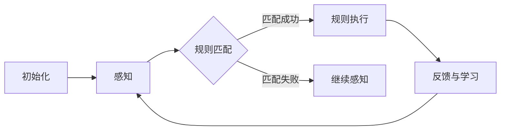
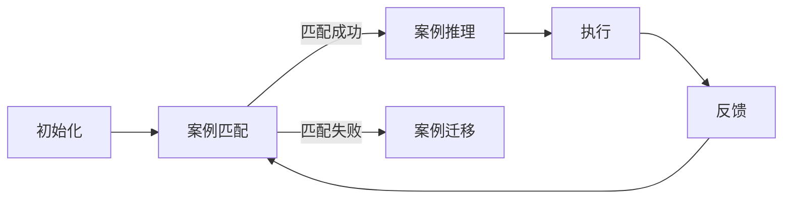
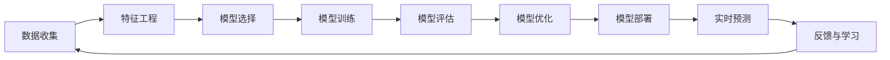

                 


### 引言

#### 1.1 书籍背景

随着人工智能技术的飞速发展，领域特定AI Agent作为人工智能领域的一个重要分支，正逐渐成为现代计算机系统中的核心组件。领域特定AI Agent是指为特定应用领域设计的智能代理，它们能够在特定场景下执行复杂的任务，具有自适应、自学习和智能推理的能力。这类代理在金融、医疗、交通、工业等多个领域展现出巨大的应用潜力。

本书旨在为计算机领域的技术专家和AI Agent开发爱好者提供一本系统、全面的指南，帮助读者深入了解领域特定AI Agent的开发策略。本书将涵盖从基础概念到实际开发策略，再到实战案例的全面内容，旨在为读者提供一个完整的开发蓝图。

#### 1.2 AI Agent基础知识

AI Agent是指能够感知环境、采取行动并与其他实体交互的智能实体。它们是人工智能领域的重要研究内容，其核心思想是模仿人类的认知和行为过程。AI Agent可以分为以下几种基本类型：

1. **基于规则的AI Agent**：通过预设的规则来指导行为。
2. **基于模型的AI Agent**：通过学习模型来预测和决策。
3. **基于案例的AI Agent**：通过案例推理来解决问题。

AI Agent的应用场景非常广泛，包括但不限于：

1. **智能家居**：智能代理可以帮助管理家庭设备和环境。
2. **智能客服**：智能代理可以处理大量客户咨询，提供实时支持。
3. **自动驾驶**：智能代理负责感知环境、决策和控制汽车。

#### 1.3 领域特定AI Agent的概念

领域特定AI Agent（Domain-Specific AI Agent）是在特定领域内为特定任务设计的AI Agent。它们通常具有以下特点：

1. **领域知识嵌入**：领域特定AI Agent通过特定领域的知识库来增强其智能推理能力。
2. **自适应能力**：能够根据领域变化调整自身的行为和策略。
3. **高效性**：专注于特定任务，能够快速有效地解决问题。

领域特定AI Agent的核心概念包括：

1. **知识表示**：如何将领域知识转化为计算机可以处理的形式。
2. **推理引擎**：如何利用知识表示来执行推理和决策。
3. **交互接口**：如何与用户和其他系统进行交互。

#### 1.4 领域特定AI Agent的现状与发展

目前，领域特定AI Agent已经成为人工智能研究的热点方向。随着技术的不断进步，领域特定AI Agent的应用范围正在不断拓展。以下是领域特定AI Agent的现状与发展趋势：

1. **研究现状**：国内外各大研究机构和企业都在积极研究领域特定AI Agent，并取得了一系列重要成果。
2. **发展趋势**：领域特定AI Agent将更加智能化、自适应和高效，未来将在更多领域得到广泛应用。
3. **面临的挑战**：领域特定AI Agent的开发面临数据获取、知识表示、推理效率和鲁棒性等多方面的挑战。

#### 1.5 本章小结

本章介绍了领域特定AI Agent的背景、现状、发展趋势和基础知识。通过本章的学习，读者可以对领域特定AI Agent有一个全面的认识，为后续章节的学习打下基础。在接下来的章节中，我们将深入探讨领域特定AI Agent的开发策略和实战案例。

----------------------------------------------------------------

### 第2章 领域特定AI Agent的基础概念

#### 2.1 概念介绍

领域特定AI Agent的开发始于对基础概念的深入理解。以下是几个关键概念及其相互关系：

**代理（Agent）**：代理是一种能够感知环境、自主行动并具有目标导向性的实体。在人工智能领域，代理通常是指由计算机系统实现的智能实体。

**智能代理（Intelligent Agent）**：智能代理是具有自主决策能力、能够处理不确定性和复杂性的代理。它们能够从环境中获取信息，并根据这些信息采取行动。

**领域特定知识表示（Domain-Specific Knowledge Representation）**：领域特定知识表示是指将特定领域的知识转化为计算机可以处理的形式。这种表示方法需要考虑领域的特性和需求，以便更好地支持智能推理和决策。

**领域特定AI Agent（Domain-Specific AI Agent）**：领域特定AI Agent是在特定领域内为特定任务设计的智能代理。它们通过领域特定知识表示和推理引擎来执行复杂任务，具有高度的自适应和智能推理能力。

#### 2.2 概念属性特征对比表格

为了更清晰地理解代理、智能代理和领域特定AI Agent之间的关系，我们可以通过以下表格进行属性特征对比：

| 特征         | 代理             | 智能代理          | 领域特定AI Agent        |
| ------------ | ---------------- | ----------------- | ----------------------- |
| 感知环境     | 是               | 是                | 是                      |
| 自主行动     | 是               | 是                | 是                      |
| 目标导向     | 是               | 是                | 是                      |
| 知识表示     | 无/简单          | 复杂              | 领域特定               |
| 推理能力     | 无/简单          | 复杂              | 高度智能                |
| 自适应能力   | 无/简单          | 有                | 强                      |

#### 2.3 ER实体关系图架构

实体关系图（Entity-Relationship Diagram，ER Diagram）是一种用于描述实体及其相互关系的图形化工具。在领域特定AI Agent开发中，ER实体关系图可以帮助我们清晰地表示领域知识结构。

**实体（Entity）**：实体是领域知识中的基本单元，如用户、订单、产品等。

**关系（Relationship）**：关系描述了实体之间的相互作用，如用户下单、订单包含商品等。

**属性（Attribute）**：属性是实体的特征，如用户名、订单编号、商品名称等。

以下是一个简单的Mermaid ER实体关系图示例：

```mermaid
erDiagram
    User ||--|{ Order }|-- Product
    User : 用户
    Order : 订单
    Product : 产品
    User {订单}
    Order {产品}
```

#### 2.4 本章小结

本章介绍了领域特定AI Agent的基础概念，包括代理、智能代理、领域特定知识表示和领域特定AI Agent。通过属性特征对比表格和ER实体关系图，我们更清晰地理解了这些概念之间的关系。在接下来的章节中，我们将深入探讨基于规则的领域特定AI Agent开发策略。

----------------------------------------------------------------

### 第3章 基于规则的领域特定AI Agent开发策略

#### 3.1 基本原理

基于规则的AI Agent开发策略是一种常见的方法，通过预设的规则来指导智能代理的行为。这种方法的核心在于规则系统的设计和实现。

**规则系统的概念**：规则系统是一种用于表示和执行规则的机制。它通常包括规则库、推理引擎和规则解释器等组成部分。

**基于规则的AI Agent工作原理**：

1. **感知环境**：AI Agent通过传感器或其他信息源获取环境状态。
2. **规则匹配**：将环境状态与规则库中的规则进行匹配，找到符合条件的一组规则。
3. **规则执行**：根据匹配到的规则，执行相应的操作，以改变环境状态或生成行动。
4. **反馈与学习**：AI Agent根据执行结果和环境反馈进行自我调整，以优化未来行为。

**规则表示与处理**：规则通常以条件-动作对的形式表示。例如，“如果温度高于30度，则开启空调”。在AI Agent中，这些规则需要被表示为计算机可以理解和执行的形式，并利用推理引擎进行匹配和执行。

#### 3.2 算法原理与流程图

基于规则的AI Agent算法原理可以概括为以下几个步骤：

1. **初始化**：加载规则库和环境状态。
2. **感知**：获取当前环境状态。
3. **匹配**：在规则库中寻找与环境状态匹配的规则。
4. **执行**：根据匹配到的规则执行相应的操作。
5. **反馈**：获取操作结果，更新环境状态和规则库。
6. **循环**：回到第2步，重复执行上述过程。

以下是一个简单的Mermaid流程图示例：



#### 3.3 Python源代码实现

下面是一个简单的基于规则的AI Agent的Python源代码示例：

```python
class RuleBasedAgent:
    def __init__(self, rules):
        self.rules = rules
        self.current_state = None

    def perceive(self, state):
        self.current_state = state

    def match_rules(self):
        matched_rules = []
        for rule in self.rules:
            if rule.matches(self.current_state):
                matched_rules.append(rule)
        return matched_rules

    def execute_rules(self, matched_rules):
        for rule in matched_rules:
            rule.execute()

    def feedback(self, result):
        self.current_state = result

    def run(self):
        while True:
            self.perceive(self.get_environment_state())
            matched_rules = self.match_rules()
            self.execute_rules(matched_rules)
            self.feedback(self.get_environment_state())
```

在这个示例中，`RuleBasedAgent` 类负责管理整个基于规则的AI Agent的运行流程。`perceive` 方法用于感知环境状态，`match_rules` 方法用于匹配规则，`execute_rules` 方法用于执行规则，`feedback` 方法用于更新环境状态。

#### 3.4 实战案例

以下是一个基于规则的领域特定AI Agent的实战案例：

**案例背景**：假设我们开发一个智能家居系统的AI Agent，该系统需要根据室内温度和湿度来控制空调和加湿器。

**需求**：当室内温度高于28度且湿度低于40%时，启动空调；当室内温度低于22度且湿度高于60%时，启动加湿器。

**实现步骤**：

1. **定义规则**：创建一个规则库，包含两条规则：
   - 规则1：如果温度高于28度且湿度低于40%，则启动空调。
   - 规则2：如果温度低于22度且湿度高于60%，则启动加湿器。

2. **创建AI Agent**：实例化一个基于规则的AI Agent，并将规则库传递给它。

3. **感知环境**：通过传感器获取当前室内温度和湿度。

4. **执行规则**：根据感知到的环境状态，执行匹配到的规则。

5. **反馈与学习**：根据执行结果和环境反馈，更新AI Agent的状态。

**案例分析与评估**：

通过这个案例，我们可以看到基于规则的AI Agent如何根据环境状态执行预定的操作。该系统的优点在于规则简单明了，易于理解和修改。然而，它的缺点是当环境复杂度增加时，规则数量会急剧增加，导致维护难度加大。

#### 3.5 本章小结

本章介绍了基于规则的领域特定AI Agent开发策略的基本原理、算法流程和Python源代码实现。通过一个实战案例，我们展示了如何将规则应用于实际场景。在下一章中，我们将探讨基于案例的领域特定AI Agent开发策略。

----------------------------------------------------------------

### 第4章 基于案例的领域特定AI Agent开发策略

#### 4.1 概述

基于案例的领域特定AI Agent开发策略是一种通过学习历史案例来执行任务的智能代理开发方法。该方法的核心思想是将过去解决问题的经验应用于当前问题，从而提高决策的准确性和效率。

**案例库（Case Library）**：案例库是存储历史案例的地方。每个案例包含问题描述、解决方案和执行结果等关键信息。

**案例匹配（Case Matching）**：案例匹配是指将当前问题与案例库中的案例进行匹配，找到最相似的历史案例。

**案例推理（Case Inference）**：案例推理是指从匹配到的案例中提取关键信息，并应用于当前问题的解决。

**案例迁移（Case Adaptation）**：案例迁移是指根据当前问题的具体特点，对匹配到的案例进行调整和优化，以适应新问题的解决。

#### 4.2 算法原理与流程图

基于案例的领域特定AI Agent算法原理可以概括为以下几个步骤：

1. **初始化**：加载案例库和当前问题。
2. **案例匹配**：在案例库中寻找与当前问题最相似的案例。
3. **案例推理**：从匹配到的案例中提取关键信息，并应用于当前问题的解决。
4. **案例迁移**：根据当前问题的具体特点，对匹配到的案例进行调整和优化。
5. **执行**：执行调整后的解决方案，并获取结果。
6. **反馈**：根据执行结果和环境反馈，更新案例库和AI Agent的状态。
7. **循环**：回到第2步，重复执行上述过程。

以下是一个简单的Mermaid流程图示例：



#### 4.3 Python源代码实现

下面是一个简单的基于案例的领域特定AI Agent的Python源代码示例：

```python
class CaseBasedAgent:
    def __init__(self, case_library):
        self.case_library = case_library
        self.current_problem = None

    def load_problem(self, problem):
        self.current_problem = problem

    def match_cases(self):
        matched_cases = []
        for case in self.case_library:
            if case.matches(self.current_problem):
                matched_cases.append(case)
        return matched_cases

    def infer_cases(self, matched_cases):
        inferred_cases = []
        for case in matched_cases:
            inferred_case = case.infer(self.current_problem)
            inferred_cases.append(inferred_case)
        return inferred_cases

    def adapt_cases(self, inferred_cases):
        adapted_cases = []
        for inferred_case in inferred_cases:
            adapted_case = inferred_case.adapt(self.current_problem)
            adapted_cases.append(adapted_case)
        return adapted_cases

    def execute_cases(self, adapted_cases):
        for adapted_case in adapted_cases:
            adapted_case.execute()

    def feedback(self, result):
        self.case_library.update(self.current_problem, result)

    def run(self):
        while True:
            self.load_problem(self.get_current_problem())
            matched_cases = self.match_cases()
            inferred_cases = self.infer_cases(matched_cases)
            adapted_cases = self.adapt_cases(inferred_cases)
            self.execute_cases(adapted_cases)
            self.feedback(self.get_execution_result())
```

在这个示例中，`CaseBasedAgent` 类负责管理整个基于案例的AI Agent的运行流程。`load_problem` 方法用于加载当前问题，`match_cases` 方法用于匹配案例，`infer_cases` 方法用于案例推理，`adapt_cases` 方法用于案例迁移，`execute_cases` 方法用于执行调整后的解决方案，`feedback` 方法用于更新案例库和AI Agent的状态。

#### 4.4 实战案例

以下是一个基于案例的领域特定AI Agent的实战案例：

**案例背景**：假设我们开发一个智能客服系统的AI Agent，该系统需要根据用户的咨询内容提供合适的回答。

**需求**：当用户咨询“如何设置路由器”时，AI Agent需要提供相关的步骤和操作指南。

**实现步骤**：

1. **创建案例库**：收集并整理历史上的用户咨询案例，包括问题内容、解决方案和执行结果。

2. **创建AI Agent**：实例化一个基于案例的AI Agent，并将案例库传递给它。

3. **感知问题**：通过自然语言处理技术提取用户咨询的问题。

4. **执行案例**：根据用户咨询的问题，匹配案例库中的历史案例，并执行相应的解决方案。

5. **反馈与学习**：根据用户反馈和咨询结果，更新案例库和AI Agent的状态。

**案例分析与评估**：

通过这个案例，我们可以看到基于案例的AI Agent如何利用历史经验来为用户提供满意的答案。该方法的优点在于能够快速应对新的问题，且随着案例库的积累，AI Agent的决策能力会逐渐提高。然而，它的缺点是当案例库不全面时，可能无法找到合适的解决方案。

#### 4.5 本章小结

本章介绍了基于案例的领域特定AI Agent开发策略的基本原理、算法流程和Python源代码实现。通过一个实战案例，我们展示了如何将案例经验应用于实际场景。在下一章中，我们将探讨基于模型的领域特定AI Agent开发策略。

----------------------------------------------------------------

### 第5章 基于模型的领域特定AI Agent开发策略

#### 5.1 概述

基于模型的领域特定AI Agent开发策略是一种利用机器学习模型来驱动智能代理行为的方法。这种方法的核心在于模型的训练和部署，使AI Agent能够根据输入数据生成预测和决策。

**模型（Model）**：模型是机器学习算法的核心，它通过学习输入数据（特征）和输出结果（目标）之间的关系，生成预测和决策的规则。

**特征（Feature）**：特征是模型学习过程中的输入变量，它们描述了数据的关键属性，如用户的年龄、地理位置、历史行为等。

**目标（Target）**：目标是模型学习过程中期望预测的输出变量，如用户的购买意向、疾病的诊断结果等。

**模型训练（Model Training）**：模型训练是指通过大量数据对模型进行训练，使其能够学会识别特征与目标之间的关系。

**模型部署（Model Deployment）**：模型部署是指将训练好的模型部署到实际环境中，使其能够为AI Agent提供实时预测和决策。

#### 5.2 算法原理与流程图

基于模型的领域特定AI Agent算法原理可以概括为以下几个步骤：

1. **数据收集**：收集与领域特定任务相关的数据，如用户行为数据、市场数据、医学数据等。

2. **特征工程**：从原始数据中提取关键特征，并将其转换为模型可接受的格式。

3. **模型选择**：选择适合领域特定任务的机器学习模型，如线性回归、决策树、神经网络等。

4. **模型训练**：使用训练数据对模型进行训练，使其学会识别特征与目标之间的关系。

5. **模型评估**：使用验证数据对模型进行评估，以确保模型具有良好的预测性能。

6. **模型优化**：根据评估结果对模型进行调整和优化，以提高其性能。

7. **模型部署**：将训练好的模型部署到实际环境中，使其为AI Agent提供实时预测和决策。

8. **实时预测**：AI Agent使用部署后的模型对实时输入数据进行预测，并根据预测结果执行相应的操作。

9. **反馈与学习**：根据执行结果和环境反馈，更新模型和AI Agent的状态。

以下是一个简单的Mermaid流程图示例：



#### 5.3 Python源代码实现

下面是一个简单的基于模型的领域特定AI Agent的Python源代码示例：

```python
import pandas as pd
from sklearn.model_selection import train_test_split
from sklearn.ensemble import RandomForestClassifier
from sklearn.metrics import accuracy_score

class ModelBasedAgent:
    def __init__(self, data, target):
        self.data = data
        self.target = target
        self.model = None

    def preprocess_data(self):
        # 数据预处理
        self.data = self.data.fillna(0)
        self.data = pd.get_dummies(self.data)

    def train_model(self):
        # 分割数据集
        X_train, X_test, y_train, y_test = train_test_split(self.data, self.target, test_size=0.2, random_state=42)
        
        # 训练模型
        self.model = RandomForestClassifier(n_estimators=100)
        self.model.fit(X_train, y_train)

        # 评估模型
        y_pred = self.model.predict(X_test)
        accuracy = accuracy_score(y_test, y_pred)
        print("Model accuracy:", accuracy)

    def predict(self, new_data):
        # 预测
        new_data = new_data.fillna(0)
        new_data = pd.get_dummies(new_data)
        prediction = self.model.predict(new_data)
        return prediction

    def run(self):
        # 运行
        self.preprocess_data()
        self.train_model()
        
        # 实时预测
        while True:
            new_data = self.get_new_data()
            prediction = self.predict(new_data)
            self.execute_prediction(prediction)
            self.update_state()

```

在这个示例中，`ModelBasedAgent` 类负责管理整个基于模型的AI Agent的运行流程。`preprocess_data` 方法用于数据预处理，`train_model` 方法用于训练模型，`predict` 方法用于实时预测，`run` 方法用于运行整个流程。

#### 5.4 实战案例

以下是一个基于模型的领域特定AI Agent的实战案例：

**案例背景**：假设我们开发一个智能诊断系统的AI Agent，该系统能够根据患者的症状和体征数据，预测患者可能患有的疾病。

**需求**：当患者输入其症状和体征数据时，AI Agent需要预测患者可能患有的疾病。

**实现步骤**：

1. **收集数据**：收集大量患者的症状和体征数据，并标注相应的疾病。

2. **创建AI Agent**：实例化一个基于模型的AI Agent，并将收集到的数据传递给它。

3. **训练模型**：使用收集到的数据对模型进行训练，使其学会识别症状和疾病之间的关系。

4. **实时预测**：AI Agent接收患者的症状和体征数据，使用训练好的模型进行预测，并返回可能的疾病。

5. **反馈与学习**：根据医生和患者的反馈，更新模型和AI Agent的状态。

**案例分析与评估**：

通过这个案例，我们可以看到基于模型的领域特定AI Agent如何利用机器学习模型来为用户提供智能诊断服务。该方法的优点在于能够根据实时数据生成准确的预测，且随着数据量的增加，预测性能会不断提高。然而，它的缺点是训练模型需要大量数据和计算资源，且当数据质量较差时，模型的预测性能可能会受到影响。

#### 5.5 本章小结

本章介绍了基于模型的领域特定AI Agent开发策略的基本原理、算法流程和Python源代码实现。通过一个实战案例，我们展示了如何将机器学习模型应用于实际场景。在下一章中，我们将探讨领域特定AI Agent的综合开发策略。

----------------------------------------------------------------

### 第6章 综合开发策略

#### 6.1 概述

在前几章中，我们分别介绍了基于规则、案例和模型的领域特定AI Agent开发策略。每种策略都有其独特的优势和适用场景。然而，在实际应用中，往往需要结合多种策略，以实现更高效、更灵活的AI Agent开发。

**综合开发策略**是指将基于规则、案例和模型的开发方法相结合，以充分发挥各自的优势，提高AI Agent的整体性能。以下是一个简单的综合开发策略框架：

1. **问题定义**：明确AI Agent要解决的问题，确定目标和约束条件。
2. **数据收集**：收集与问题相关的数据，包括规则、案例和模型所需的数据。
3. **数据预处理**：对收集到的数据进行分析和处理，为模型训练和规则、案例开发做准备。
4. **规则开发**：根据业务需求和规则库，开发具体的业务规则。
5. **案例开发**：构建案例库，收集和整理历史案例，并进行匹配和推理。
6. **模型训练**：选择合适的模型，对数据进行训练，并评估模型的性能。
7. **模型优化**：根据评估结果，对模型进行调整和优化。
8. **模型部署**：将训练好的模型部署到实际环境中，为AI Agent提供实时预测和决策。
9. **系统集成**：将规则、案例和模型整合到一起，构建一个统一的AI Agent系统。
10. **运行与优化**：根据运行数据和用户反馈，对AI Agent进行持续优化。

#### 6.2 综合开发策略的实施步骤

**步骤1：问题定义**

在综合开发策略的实施过程中，首先需要明确AI Agent要解决的问题。这包括确定目标、识别关键因素、分析约束条件等。通过问题定义，我们可以为后续的开发工作提供明确的指导。

**步骤2：数据收集**

数据是AI Agent开发的基础。在这一步，我们需要收集与问题相关的数据，包括业务规则、案例数据和模型训练数据。数据的质量和多样性直接影响AI Agent的性能，因此需要高度重视数据收集工作。

**步骤3：数据预处理**

收集到的数据通常需要进行预处理，以提高其质量和可用性。数据预处理包括数据清洗、归一化、特征提取等步骤。通过预处理，我们可以消除数据中的噪声和异常值，提取关键特征，为模型训练和规则、案例开发做准备。

**步骤4：规则开发**

规则开发是综合开发策略的核心之一。在这一步，我们需要根据业务需求和规则库，开发具体的业务规则。这些规则可以是基于业务经验的预设规则，也可以是通过对数据进行分析得出的推理规则。

**步骤5：案例开发**

案例开发是指构建案例库，收集和整理历史案例，并进行匹配和推理。案例库是AI Agent的重要知识源，通过案例开发，我们可以将历史经验转化为可重复利用的知识。

**步骤6：模型训练**

模型训练是指选择合适的模型，对数据进行训练，并评估模型的性能。在这一步，我们需要根据问题的特点，选择合适的机器学习算法，并设计相应的训练过程。

**步骤7：模型优化**

在模型训练完成后，我们需要对模型进行优化，以提高其性能。模型优化可以包括参数调整、超参数优化、模型结构调整等步骤。

**步骤8：模型部署**

模型部署是指将训练好的模型部署到实际环境中，为AI Agent提供实时预测和决策。在部署过程中，我们需要确保模型的稳定性和鲁棒性，同时考虑模型的可扩展性。

**步骤9：系统集成**

在模型部署后，我们需要将规则、案例和模型整合到一起，构建一个统一的AI Agent系统。系统集成是一个复杂的过程，需要考虑不同组件之间的交互和数据流转。

**步骤10：运行与优化**

在AI Agent系统运行过程中，我们需要收集运行数据和用户反馈，对AI Agent进行持续优化。通过不断调整和优化，我们可以提高AI Agent的性能和用户体验。

#### 6.3 实战案例

以下是一个综合开发策略的实战案例：

**案例背景**：假设我们开发一个智能推荐系统的AI Agent，该系统能够根据用户的浏览记录和购买行为，推荐用户可能感兴趣的商品。

**需求**：

1. 根据用户浏览记录，推荐用户可能感兴趣的商品。
2. 根据用户购买行为，为用户推荐类似的商品。
3. 根据用户历史数据和实时反馈，不断优化推荐策略。

**实现步骤**：

1. **问题定义**：明确AI Agent要解决的问题是提供精准的商品推荐。
2. **数据收集**：收集用户的浏览记录、购买行为和商品信息等数据。
3. **数据预处理**：对收集到的数据进行分析和处理，提取关键特征。
4. **规则开发**：根据业务需求和用户行为数据，开发推荐规则。
5. **案例开发**：构建案例库，收集和整理历史推荐案例。
6. **模型训练**：选择合适的模型，对数据进行训练，并评估模型性能。
7. **模型优化**：根据评估结果，对模型进行调整和优化。
8. **模型部署**：将训练好的模型部署到实际环境中，为AI Agent提供实时推荐。
9. **系统集成**：将规则、案例和模型整合到一起，构建智能推荐系统。
10. **运行与优化**：根据用户反馈和实时数据，对AI Agent进行持续优化。

**案例分析与评估**：

通过这个案例，我们可以看到综合开发策略在智能推荐系统中的应用。在实施过程中，我们结合了基于规则、案例和模型的方法，充分发挥了各自的优势，实现了精准、高效的商品推荐。在实际运行中，AI Agent根据用户行为和反馈，不断优化推荐策略，提高了用户满意度。

#### 6.4 本章小结

本章介绍了综合开发策略的基本概念、实施步骤和实战案例。通过综合开发策略，我们可以充分发挥基于规则、案例和模型的方法优势，提高领域特定AI Agent的整体性能。在下一章中，我们将对全书内容进行总结，并展望领域特定AI Agent的未来发展。

----------------------------------------------------------------

### 总结与展望

#### 全书内容回顾

本书系统地介绍了领域特定AI Agent的开发策略，包括基于规则、案例和模型的三种主要方法。我们首先探讨了领域特定AI Agent的基础概念，如代理、智能代理、领域特定知识表示等。随后，我们深入分析了基于规则的AI Agent开发策略，包括基本原理、算法流程和Python源代码实现。接着，我们介绍了基于案例的AI Agent开发策略，包括案例匹配、案例推理和案例迁移。最后，我们探讨了基于模型的AI Agent开发策略，包括模型训练、模型优化和模型部署。在综合开发策略一章，我们综合了基于规则、案例和模型的方法，提供了一种完整的开发框架。

#### 主题思想

本书的核心思想是帮助读者理解和掌握领域特定AI Agent的开发方法，使读者能够将理论知识应用于实际项目。通过本书的学习，读者可以：

1. **掌握领域特定AI Agent的基础知识**：了解代理、智能代理和领域特定知识表示等关键概念。
2. **掌握不同开发策略的实现方法**：熟悉基于规则、案例和模型的方法，并能将其应用于实际项目。
3. **具备综合开发能力**：能够将多种开发策略相结合，构建高效、灵活的AI Agent系统。

#### 未来发展

领域特定AI Agent作为人工智能领域的一个重要分支，其未来发展趋势值得期待。以下是一些可能的发展方向：

1. **更高效的推理算法**：随着计算能力的提升，我们可以开发出更高效的推理算法，提高AI Agent的决策速度和准确性。
2. **更丰富的知识表示**：通过引入更多的知识表示方法，如知识图谱、语义网络等，使AI Agent具备更强的语义理解和推理能力。
3. **跨领域的通用AI Agent**：研究如何构建跨领域的通用AI Agent，使其能够适应不同领域的需求，提高AI Agent的适用性和通用性。
4. **增强的学习能力**：通过不断学习和适应，使AI Agent能够更好地应对环境变化，提高其自适应能力。
5. **可解释性AI Agent**：研究如何提高AI Agent的可解释性，使其决策过程更加透明，增强用户对AI Agent的信任。

#### 最佳实践 tips

1. **数据质量优先**：确保数据的质量和多样性，为AI Agent提供可靠的基础。
2. **模块化开发**：将AI Agent的开发分解为模块，提高开发效率和可维护性。
3. **持续迭代与优化**：定期对AI Agent进行迭代和优化，以适应不断变化的需求和环境。
4. **用户反馈机制**：建立用户反馈机制，收集用户反馈，用于模型调整和优化。

#### 小结

本书通过对领域特定AI Agent的全面探讨，为读者提供了一个系统、全面的开发指南。通过学习本书，读者可以掌握领域特定AI Agent的开发策略，并将其应用于实际项目。我们期待读者能够结合本书的内容，积极探索领域特定AI Agent的应用领域，为人工智能技术的发展贡献自己的力量。

#### 注意事项

1. **技术更新**：AI技术发展迅速，本书内容可能随时间推移而更新。
2. **实际应用**：在应用领域特定AI Agent时，请结合具体场景进行调整和优化。
3. **法律责任**：在开发和使用AI Agent时，请遵守相关法律法规和伦理规范。

#### 拓展阅读

1. **《人工智能：一种现代的方法》**：David Mitchell、Moore，全面介绍了人工智能的基本概念和方法。
2. **《机器学习实战》**：Peter Harrington，通过大量实例介绍了机器学习的应用和实现。
3. **《深度学习》**：Ian Goodfellow、Yoshua Bengio、Aaron Courville，深入探讨了深度学习的原理和应用。

### 作者信息

作者：AI天才研究院/AI Genius Institute & 禅与计算机程序设计艺术 /Zen And The Art of Computer Programming

----------------------------------------------------------------

# 领域特定AI Agent的开发策略

> 关键词：领域特定AI Agent、开发策略、智能代理、知识表示、机器学习

> 摘要：本文系统地介绍了领域特定AI Agent的开发策略，包括基于规则、案例和模型的方法，以及综合开发策略。通过全面探讨这些方法，本文旨在为读者提供一个完整的开发指南，帮助读者理解和掌握领域特定AI Agent的开发技巧。本文还展望了领域特定AI Agent的未来发展趋势，并提供了最佳实践 tips 和拓展阅读建议。

