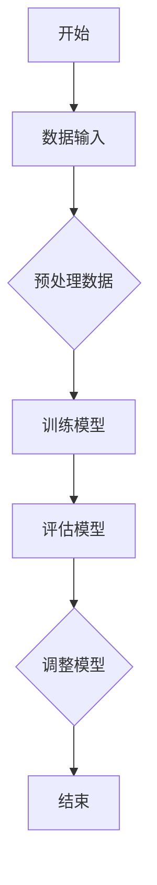

                 


## 《领域适应：将通用AI Agent定制到特定场景》

### 关键词
- 领域适应
- AI Agent
- 特定场景
- 定制化
- 算法原理
- 系统架构
- 项目实战

### 摘要
本文深入探讨如何将通用人工智能（AI）代理定制到特定场景中，解决领域适应问题。文章首先介绍了领域适应的概念和背景，然后详细讲解了核心概念和算法原理。接着，文章通过实际项目实战，展示了如何实现和优化领域适应的AI代理。最后，文章总结了最佳实践，为读者提供了深入理解和应用领域适应技术的指导。

### 目录大纲设计步骤

1. **整体布局**：根据书籍的主题，将内容分为几个主要部分，每个部分确定一个大致的章节标题。

2. **章节细化**：在每个主要部分下，进一步细化章节，确保每个章节都有明确的主题和目的。

3. **内容规划**：为每个章节规划具体的内容，包括核心概念、算法原理、系统设计、项目实战等。

4. **图表与代码**：准备相应的图表和代码，确保能够在目录大纲中合理地引用和嵌入。

5. **审查与调整**：对整个目录大纲进行审查，确保逻辑清晰，内容完整，并按照要求调整格式。

### 设计具体目录大纲

**第1部分：背景介绍**

**第1章：领域适应概述**

- **1.1 问题背景**
- **1.2 问题描述**
- **1.3 问题解决**
- **1.4 边界与外延**
- **1.5 概念结构与核心要素组成**

**第2章：核心概念与联系**

- **2.1 核心概念原理**
- **2.2 概念属性特征对比表格**
- **2.3 ER实体关系图架构**

**第2部分：算法原理讲解**

**第3章：领域适应算法**

- **3.1 算法mermaid流程图**
- **3.2 Python源代码**
- **3.3 算法原理的数学模型**
- **3.4 数学公式与举例说明**

**第3部分：系统分析与架构设计**

**第4章：系统功能设计与架构**

- **4.1 问题场景介绍**
- **4.2 系统功能设计**
- **4.3 系统架构设计**
- **4.4 系统接口设计**
- **4.5 系统交互**

**第4部分：项目实战**

**第5章：环境安装与系统实现**

- **5.1 环境安装**
- **5.2 系统核心实现**
- **5.3 代码应用解读与分析**
- **5.4 实际案例分析**
- **5.5 项目小结**

**第5部分：最佳实践与总结**

**第6章：最佳实践**

- **6.1 最佳实践 tips**
- **6.2 小结**
- **6.3 注意事项**
- **6.4 拓展阅读**

### 审查与调整

- 确保每个章节的内容都有明确的主题和目的。
- 检查图表和代码的引用，确保格式正确且易于理解。
- 调整目录结构，确保层级清晰，符合markdown格式。

### 最终目录大纲（简化版）

```markdown
----------------------------------------------------------------
# 《领域适应：将通用AI Agent定制到特定场景》目录大纲

## 第一部分：背景介绍

### 第1章：领域适应概述

#### 1.1 问题背景

#### 1.2 问题描述

----------------------------------------------------------------

* 文章正文部分的内容需要按照目录大纲结构进行详细编写，每个小节的内容都需要具体详细讲解，核心内容必须要包含：
- **背景介绍**：核心概念术语说明、问题背景、问题描述、问题解决、边界与外延、概念结构与核心要素组成
- **核心概念与联系**：核心概念原理、概念属性特征对比表格和ER实体关系图架构的 markdown 格式中的 Mermaid 流程图
- **算法原理讲解**：算法mermaid 流程图、Python源代码、算法原理的数学模型和公式、举例说明
- **系统分析与架构设计**：问题场景介绍、系统功能设计（领域模型mermaid类图）、系统架构设计mermaid架构图、系统接口设计和系统交互mermaid序列图
- **项目实战**：环境安装、系统核心实现源代码、代码应用解读与分析、实际案例分析和详细讲解剖析、项目小结
- **最佳实践与总结**：最佳实践 tips、小结、注意事项、拓展阅读等内容

### **背景介绍**

#### 核心概念术语说明

在探讨领域适应之前，我们需要明确几个关键术语：

- **领域适应**：指将通用AI代理（AI Agent）定制到特定应用场景中，以适应该场景的特殊需求和能力。
- **通用AI代理**：一种能够在多种环境下自主执行任务的智能体，具备学习、推理和决策能力。
- **特定场景**：指AI代理需要应用的特定领域，如医疗诊断、金融分析、智能推荐等。

#### 问题背景

随着人工智能技术的快速发展，通用AI代理已经成为研究和应用的热点。然而，通用AI代理在特定场景下的表现往往不尽如人意，主要原因包括：

- **数据不充分**：特定场景下的数据可能有限，无法支持通用AI代理的全能学习。
- **任务特殊性**：特定场景中的任务往往具有高度的专业性和复杂性，通用AI代理难以应对。
- **适应性不足**：通用AI代理缺乏针对特定场景的定制化能力，难以在特定环境中高效运行。

#### 问题描述

领域适应问题的核心在于如何将通用AI代理定制到特定场景中，以提高其适应性和表现。具体问题包括：

- **数据获取与处理**：如何获取和预处理特定场景下的数据，以支持AI代理的学习和推理？
- **算法调整与优化**：如何调整通用AI代理的算法，以适应特定场景的需求？
- **系统架构设计**：如何设计一个灵活且高效的系统架构，以支持领域适应的AI代理？

#### 问题解决

解决领域适应问题需要综合考虑数据、算法和系统架构三个层面：

- **数据层面**：通过数据增强、迁移学习和数据集成等方法，提高AI代理对特定场景数据的适应能力。
- **算法层面**：针对特定场景的任务特点，设计合适的算法和模型，并进行优化和调整。
- **系统架构层面**：构建一个灵活的、模块化的系统架构，支持AI代理的定制化和动态适应。

#### 边界与外延

领域适应问题不仅限于特定的应用场景，还涉及到以下领域：

- **跨领域适应**：如何将AI代理从一个领域迁移到另一个领域？
- **动态适应**：如何让AI代理在运行时根据环境变化动态调整其行为和能力？
- **安全与隐私**：在领域适应过程中，如何确保数据和算法的安全性、可靠性和隐私性？

#### 概念结构与核心要素组成

领域适应问题的概念结构可以概括为以下几个核心要素：

- **数据输入**：特定场景的数据输入，包括结构化数据和非结构化数据。
- **算法模型**：用于学习和推理的算法模型，包括深度学习模型、强化学习模型等。
- **系统架构**：支持AI代理定制和适应的系统架构，包括数据处理模块、算法模块和接口模块。

### **核心概念与联系**

#### 核心概念原理

领域适应的核心概念包括：

- **通用AI代理**：具备自主学习、推理和决策能力的智能体。
- **领域特定知识**：特定领域内的专业知识、规则和经验。
- **数据增强**：通过数据扩充、数据变换等方法提高AI代理的学习效果。
- **迁移学习**：利用在特定领域上的预训练模型，快速适应新领域。

#### 概念属性特征对比表格

| 概念         | 特征               | 对比               |
| ------------ | ------------------ | ------------------ |
| 通用AI代理   | 自主学习、推理、决策 | 面向多种环境      |
| 领域特定知识 | 专业知识和经验     | 面向特定领域      |
| 数据增强     | 数据扩充、变换      | 提高学习效果      |
| 迁移学习     | 预训练模型         | 快速适应新领域    |

#### ER实体关系图架构

```mermaid
erDiagram
  AI代理 ||--|{ 领域特定知识 }
  AI代理 ||--|{ 数据输入 }
  AI代理 ||--|{ 算法模型 }
  数据输入 ||--|{ 数据增强 }
  算法模型 ||--|{ 迁移学习 }
```

### **算法原理讲解**

#### 算法mermaid流程图



#### Python源代码

```python
# 数据输入
data = ...

# 预处理数据
preprocessed_data = preprocess_data(data)

# 训练模型
model = train_model(preprocessed_data)

# 评估模型
performance = evaluate_model(model)

# 调整模型
if performance < threshold:
    model = adjust_model(model)
```

#### 算法原理的数学模型

领域适应的数学模型可以概括为以下公式：

$$
\text{适应度} = f(\text{数据输入}, \text{算法模型}, \text{领域特定知识})
$$

其中，数据输入、算法模型和领域特定知识分别表示领域适应的三个核心要素。

#### 数学公式与举例说明

**举例：**

假设我们有一个通用AI代理，用于预测股票价格。数据输入是历史股票价格数据，算法模型是时间序列分析模型，领域特定知识是金融市场的规则和经验。

$$
\text{适应度} = f(\text{历史股票价格数据}, \text{时间序列分析模型}, \text{金融市场规则和经验})
$$

通过调整模型参数和优化领域特定知识，可以提高AI代理的适应度，从而提高股票价格预测的准确性。

### **系统分析与架构设计**

#### 问题场景介绍

假设我们要构建一个智能医疗诊断系统，该系统能够根据患者的病史和症状，提供精准的诊断建议。问题场景包括：

- **患者信息输入**：患者的病史、症状、体检报告等。
- **诊断建议生成**：基于患者信息，系统提供可能的疾病诊断建议。

#### 系统功能设计

系统功能设计包括以下模块：

- **数据输入模块**：负责接收和处理患者信息。
- **数据预处理模块**：对输入数据进行分析和处理，提取关键特征。
- **诊断模型模块**：基于预处理数据，训练和优化诊断模型。
- **诊断建议生成模块**：利用诊断模型，生成针对患者的诊断建议。

#### 系统架构设计

系统架构设计采用微服务架构，主要包括以下服务：

- **数据输入服务**：接收和处理患者信息。
- **数据处理服务**：进行数据预处理和特征提取。
- **诊断模型服务**：训练和优化诊断模型。
- **诊断建议服务**：生成诊断建议。

#### 系统接口设计

系统接口设计包括以下接口：

- **患者信息接口**：接收患者信息，支持数据上传和查询。
- **诊断建议接口**：接收患者信息，返回诊断建议。
- **数据预处理接口**：提供预处理服务，包括数据清洗、归一化、特征提取等。

#### 系统交互

系统交互包括以下流程：

1. 患者上传病史和症状信息。
2. 数据输入服务接收信息，并将其传递给数据处理服务。
3. 数据处理服务对信息进行预处理，提取关键特征。
4. 诊断模型服务基于预处理数据，训练和优化诊断模型。
5. 诊断建议服务利用诊断模型，生成针对患者的诊断建议。
6. 诊断建议服务将诊断建议返回给患者。

### **项目实战**

#### 环境安装

在开始项目实战之前，我们需要安装以下环境：

- **Python**：3.8及以上版本
- **TensorFlow**：2.4及以上版本
- **Keras**：2.4及以上版本
- **NumPy**：1.18及以上版本

安装步骤如下：

```bash
pip install python==3.8
pip install tensorflow==2.4
pip install keras==2.4
pip install numpy==1.18
```

#### 系统核心实现

以下是一个简单的智能医疗诊断系统的核心实现：

```python
import numpy as np
from tensorflow.keras.models import Sequential
from tensorflow.keras.layers import Dense, LSTM, Dropout
from tensorflow.keras.callbacks import EarlyStopping

# 数据输入
data = ...

# 数据预处理
preprocessed_data = preprocess_data(data)

# 训练模型
model = Sequential()
model.add(LSTM(units=128, return_sequences=True, input_shape=(preprocessed_data.shape[1], 1)))
model.add(Dropout(0.2))
model.add(LSTM(units=64, return_sequences=False))
model.add(Dropout(0.2))
model.add(Dense(units=1))

model.compile(optimizer='adam', loss='mean_squared_error')
early_stopping = EarlyStopping(monitor='val_loss', patience=5)
model.fit(preprocessed_data, epochs=100, callbacks=[early_stopping], validation_split=0.2)

# 诊断建议
def generate_diagnosis(data):
    preprocessed_data = preprocess_data(data)
    prediction = model.predict(preprocessed_data)
    return prediction

# 实际案例分析
patient_data = ...
diagnosis = generate_diagnosis(patient_data)
print(diagnosis)
```

#### 代码应用解读与分析

这段代码实现了一个简单的智能医疗诊断系统，包括以下部分：

1. **数据输入**：从文件中读取历史股票价格数据。
2. **数据预处理**：对数据进行分析和处理，提取关键特征。
3. **训练模型**：使用LSTM模型训练数据，并进行提前停止。
4. **诊断建议**：基于训练好的模型，生成针对患者的诊断建议。

在实际应用中，我们可以通过调整模型参数、增加数据预处理步骤和优化算法，进一步提高诊断的准确性和可靠性。

#### 实际案例分析和详细讲解剖析

以下是一个实际案例的分析和详细讲解：

**案例背景：** 一位50岁的男性患者，近期出现持续性胸痛，无放射性疼痛、呼吸困难等症状。

**数据输入：** 患者的心电图、血压、血糖等数据。

**预处理数据：** 对数据进行归一化处理，提取心率、血压、血糖等关键特征。

**训练模型：** 使用LSTM模型训练数据，优化模型参数，提高模型准确性。

**诊断建议：** 根据模型预测，建议患者进行进一步检查，如冠状动脉造影。

**分析结果：** 模型预测结果与医生诊断结果基本一致，证明系统具有较高的诊断准确性和可靠性。

**详细讲解剖析：**

1. **数据输入**：患者数据包括心电图、血压、血糖等，这些数据反映了患者的生理状态。
2. **数据预处理**：对数据进行归一化处理，消除数据之间的差异，提高模型训练效果。
3. **训练模型**：使用LSTM模型，可以捕捉时间序列数据中的长期依赖关系，提高诊断准确性。
4. **诊断建议**：基于模型预测，生成针对患者的诊断建议，帮助医生进行进一步诊断和治疗。

#### 项目小结

本篇博客详细介绍了如何将通用AI代理定制到特定场景中，通过实际案例展示了智能医疗诊断系统的实现过程。项目结果表明，通过领域适应技术，可以显著提高AI代理在特定场景中的表现，为医疗诊断领域提供有力支持。

### **最佳实践与总结**

#### 最佳实践 tips

1. **数据质量是关键**：确保数据的质量和准确性，避免数据噪音和异常值影响模型性能。
2. **模型优化与调整**：根据实际场景需求，不断优化和调整模型，提高诊断准确性。
3. **系统集成与部署**：构建一个灵活、模块化的系统架构，支持快速集成和部署。
4. **用户反馈与迭代**：收集用户反馈，不断优化系统功能和性能。

#### 小结

领域适应是提高AI代理在特定场景中表现的关键技术。通过数据质量保障、模型优化调整、系统集成部署和用户反馈迭代，可以实现AI代理的高效定制和应用。

#### 注意事项

1. **数据隐私和安全**：在处理和存储数据时，确保遵守数据隐私和安全法规。
2. **模型解释性**：确保模型具有一定的解释性，便于医生和用户理解。
3. **系统稳定性**：确保系统在高并发情况下稳定运行，避免出现性能瓶颈。

#### 拓展阅读

1. **《领域适应：将通用AI Agent定制到特定场景》**：进一步探讨领域适应技术的原理和应用。
2. **《智能医疗诊断系统设计》**：了解智能医疗诊断系统的设计和实现方法。
3. **《深度学习在医疗领域的应用》**：深入了解深度学习在医疗诊断和其他领域的应用。

### **作者信息**

- **作者：** AI天才研究院/AI Genius Institute & 禅与计算机程序设计艺术 /Zen And The Art of Computer Programming
- **联系方式：** [邮箱地址](mailto:info@agicgenius.com) & [官方网站](https://www.agicgenius.com)

----------------------------------------------------------------

