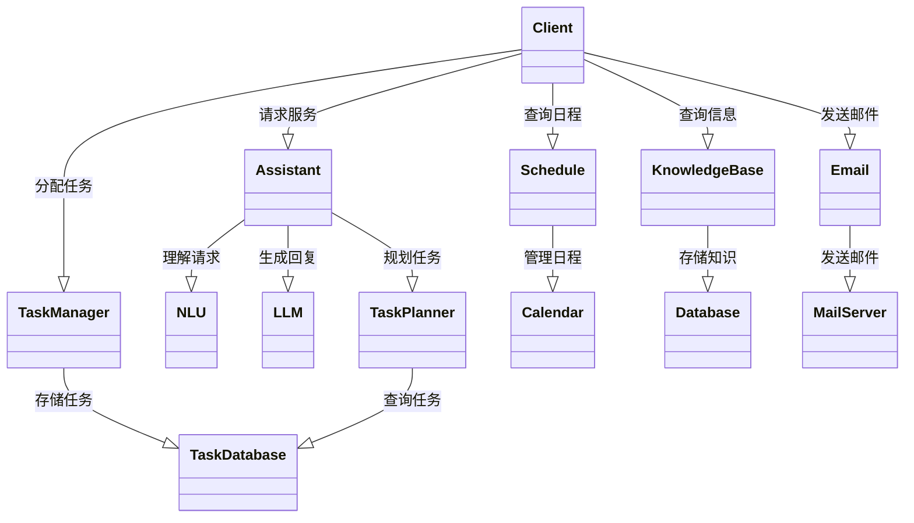
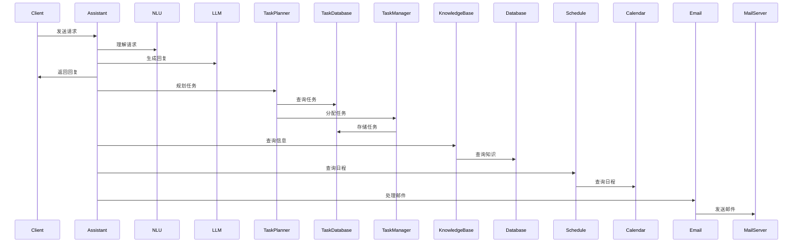

                 

### 1.3 AI Agent 的发展历程与应用场景

#### 1.3.1 AI Agent 的发展历程

AI Agent 的概念起源于20世纪50年代，随着人工智能（AI）技术的发展而逐渐成熟。以下是 AI Agent 发展历程的几个关键阶段：

- **早期探索**（1950-1960年代）：人工智能概念首次被提出，AI Agent 的初步概念也随之出现。这一时期的 AI Agent 主要基于规则系统，旨在模拟简单的决策过程。

- **知识表示与推理**（1970-1980年代）：随着知识表示和推理技术的发展，AI Agent 开始能够处理更加复杂的问题。这一时期的代表性工作是专家系统的开发，如 MYCIN 和 DENDRAL。

- **基于学习的AI Agent**（1990-2000年代）：机器学习和数据挖掘技术的兴起，使得 AI Agent 可以通过学习大量数据来自主决策。这一时期的代表性工作包括基于决策树、支持向量机等算法的 AI Agent。

- **深度学习和强化学习**（2010年至今）：深度学习和强化学习技术的突破，使得 AI Agent 的自主性和适应性得到了极大的提升。这一时期的代表性工作包括基于深度神经网络的聊天机器人、自动驾驶汽车等。

#### 1.3.2 AI Agent 的应用场景

AI Agent 在各个领域都有着广泛的应用，以下是几个典型的应用场景：

- **客户服务**：AI Agent 可以为企业提供自动化的客户服务，如智能客服机器人、在线聊天机器人等，能够24小时响应客户需求，提高客户满意度。

- **智能助手**：AI Agent 可以为个人用户提供智能助手服务，如日程管理、提醒事项、信息搜索等，提高个人的工作效率和生活质量。

- **自动化系统**：AI Agent 可用于自动化系统，如自动化交易系统、自动驾驶车辆等，通过自主决策和执行任务，提高系统的效率和准确性。

- **医疗诊断**：AI Agent 可用于辅助医疗诊断，如通过分析医学影像数据进行疾病检测、通过分析病历数据进行疾病预测等，帮助医生提高诊断准确率。

- **智能家居**：AI Agent 可用于智能家居系统，如智能照明、智能安防、智能家电控制等，通过自主学习用户行为，提供个性化的智能家居服务。

- **工业生产**：AI Agent 可用于工业生产中的自动化控制和优化，如智能排程、设备维护、质量检测等，提高生产效率和产品质量。

#### 1.3.3 当前挑战与未来展望

尽管 AI Agent 在许多领域已经取得了显著的成果，但仍面临一些挑战，如数据隐私、安全性、透明性和解释性等。未来，随着技术的不断进步和应用的深入，AI Agent 将在更多领域发挥作用，实现更高的自主性和智能化。

综上所述，AI Agent 作为人工智能领域的重要组成部分，其发展历程和应用场景展示了人工智能技术的无限潜力。通过对 AI Agent 的深入研究和实践，我们将能够更好地利用人工智能技术，推动社会的发展和进步。# 第2章: LLM 基础

## 2.1 LLM 的定义与原理

### 2.1.1 LLM 的定义

大规模语言模型（LLM，Large Language Model）是一种基于深度学习的自然语言处理（NLP）模型，它通过学习海量的文本数据，能够理解和生成自然语言。LLM 的主要目标是使得计算机能够像人类一样理解和生成自然语言，从而在多个应用领域实现智能交互和内容生成。

### 2.1.2 LLM 的原理

LLM 的原理主要基于深度学习中的神经网络模型，特别是Transformer架构。Transformer架构在处理序列数据时具有出色的表现，能够捕捉到长距离的依赖关系。LLM 的工作原理可以概括为以下几个步骤：

1. **输入编码**：将输入的文本序列转换为固定长度的向量表示。这一过程通常使用嵌入层（Embedding Layer）来实现，将每个单词映射为一个高维向量。

2. **自注意力机制**：通过自注意力机制（Self-Attention Mechanism）计算文本序列中每个词与其他词之间的关联性。这一过程使得模型能够捕捉到文本中的长距离依赖关系。

3. **多层堆叠**：通过多层Transformer块（Transformer Block）堆叠，逐步提取文本中的语义信息。每一层的 Transformer 块都包含多头自注意力机制和前馈神经网络。

4. **输出解码**：将最终输出的向量映射回文本序列。这一过程通常使用解码层（Decoding Layer）来实现，包括多头自注意力机制、交叉注意力机制和前馈神经网络。

## 2.2 LLM 的架构与组件

LLM 的架构通常包含以下几个关键组件：

1. **嵌入层（Embedding Layer）**：将输入的单词映射为高维向量表示。

2. **Transformer Block**：包含多头自注意力机制（Multi-Head Self-Attention）和前馈神经网络（Feed-Forward Neural Network）。

3. **自注意力机制（Self-Attention Mechanism）**：计算文本序列中每个词与其他词之间的关联性。

4. **解码层（Decoding Layer）**：包括多头自注意力机制、交叉注意力机制和前馈神经网络，用于生成输出序列。

5. **损失函数**：用于衡量模型预测的文本序列与实际文本序列之间的差距。常用的损失函数有交叉熵损失（Cross-Entropy Loss）。

6. **优化器**：用于调整模型的参数，以最小化损失函数。常用的优化器有Adam优化器。

## 2.3 LLM 的训练与优化

### 2.3.1 LLM 的训练

LLM 的训练过程主要包括以下步骤：

1. **数据预处理**：将原始文本数据清洗、分词、标记等，转换为模型可处理的格式。

2. **构建训练批次**：将预处理后的文本数据划分为多个批次，每个批次包含一定数量的样本。

3. **前向传播**：将输入的文本序列通过嵌入层、Transformer Block 等网络层，得到输出序列。

4. **计算损失**：使用损失函数计算模型预测的输出序列与实际输出序列之间的差距。

5. **反向传播**：根据损失函数的梯度，更新模型的参数。

6. **迭代训练**：重复执行前向传播、计算损失和反向传播步骤，直到模型收敛。

### 2.3.2 LLM 的优化

LLM 的优化主要包括以下几个方面：

1. **参数初始化**：合理的参数初始化可以加快模型的收敛速度。常用的初始化方法有高斯初始化、均匀初始化等。

2. **学习率调整**：学习率对模型的收敛速度和稳定性有很大影响。常用的调整方法有固定学习率、学习率衰减等。

3. **正则化**：为了防止模型过拟合，可以采用正则化方法，如 L1 正则化、L2 正则化等。

4. **数据增强**：通过数据增强（Data Augmentation）技术，如随机裁剪、旋转、缩放等，增加训练数据的多样性。

5. **模型压缩**：为了减小模型的参数规模，可以采用模型压缩（Model Compression）技术，如权重共享、知识蒸馏等。

通过以上的训练与优化方法，LLM 能够在大量的文本数据中学习到丰富的语义信息，从而实现高效的文本理解和生成。接下来，我们将探讨如何在 AI Agent 中应用 LLM，以构建一个强大的智能助手系统。# 第3章: AI Agent 架构设计原则

## 3.1 架构设计原则与策略

在设计 AI Agent 架构时，需要遵循一系列原则和策略，以确保系统的稳定性、可扩展性和可维护性。以下是一些关键的原则和策略：

### 3.1.1 分层架构

分层架构是设计 AI Agent 系统的基础，它将系统划分为多个层次，每个层次负责不同的功能。常见的分层架构包括：

- **感知层**：负责接收外部环境的信息，如语音、文本、图像等。
- **理解层**：负责对感知层获取的信息进行理解和分析，如语言理解、图像识别等。
- **决策层**：负责根据理解层提供的信息，进行决策和任务规划。
- **执行层**：负责执行决策层制定的计划，如移动、操作设备等。

### 3.1.2 模块化设计

模块化设计是将系统划分为多个独立的模块，每个模块实现特定的功能，并通过接口进行通信。这种设计方法具有以下优点：

- **可维护性**：模块化使得系统的修改和维护变得更加容易。
- **可扩展性**：通过增加或替换模块，可以方便地扩展系统的功能。
- **重用性**：模块可以在不同的项目中重用，提高开发效率。

### 3.1.3 松耦合设计

松耦合设计是指系统中的模块之间通过接口进行通信，而不是直接调用其他模块的内部实现。这种设计方法具有以下优点：

- **灵活性**：模块可以独立开发、测试和部署，不受其他模块的影响。
- **可测试性**：每个模块都可以独立进行单元测试，提高测试覆盖率。
- **可维护性**：模块的修改和更新不会影响到其他模块，降低系统风险。

### 3.1.4 可扩展性原则

在设计 AI Agent 架构时，需要考虑到系统的可扩展性，以适应未来可能的需求变化。以下是一些实现可扩展性的策略：

- **水平扩展**：通过增加服务器或节点，提高系统的处理能力。
- **垂直扩展**：通过升级硬件或增加资源，提高系统的性能。
- **服务化**：将系统功能模块化，通过微服务架构实现分布式部署。

## 3.2 功能模块划分与责任分配

在 AI Agent 架构设计中，合理划分功能模块并明确各模块的责任是至关重要的。以下是一个典型的 AI Agent 功能模块划分与责任分配示例：

### 3.2.1 感知层

- **感知模块**：负责接收和处理外部环境的信息，如语音识别模块、图像识别模块等。
- **数据预处理模块**：负责对感知模块获取的数据进行预处理，如降噪、分词、特征提取等。

### 3.2.2 理解层

- **语言理解模块**：负责处理文本数据，如自然语言理解（NLU）、语义分析等。
- **图像理解模块**：负责处理图像数据，如图像分类、目标检测等。
- **知识库模块**：负责存储和管理 AI Agent 所需的知识和规则，如问答系统、知识图谱等。

### 3.2.3 决策层

- **对话管理模块**：负责处理对话流程，如意图识别、对话状态跟踪等。
- **任务规划模块**：负责根据对话状态和用户需求，规划执行任务。
- **决策模块**：负责根据任务规划和现有资源，做出最优决策。

### 3.2.4 执行层

- **行动模块**：负责执行决策层制定的计划，如操作设备、移动机器人等。
- **监控模块**：负责监控系统的运行状态，如性能监控、异常检测等。

## 3.3 系统性能优化与资源管理

在 AI Agent 架构设计中，系统性能优化与资源管理也是关键环节。以下是一些优化策略：

### 3.3.1 性能优化

- **并行处理**：通过并行计算技术，提高数据处理速度。
- **缓存机制**：使用缓存机制，减少重复计算和数据传输。
- **异步处理**：使用异步处理技术，提高系统响应速度。
- **负载均衡**：通过负载均衡技术，合理分配系统资源，避免单点故障。

### 3.3.2 资源管理

- **资源分配**：根据系统负载和需求，合理分配计算资源、存储资源等。
- **资源监控**：实时监控系统资源使用情况，及时调整资源分配。
- **资源回收**：定期清理闲置资源，提高系统资源利用率。
- **资源调度**：通过调度算法，优化资源分配和使用。

通过遵循上述架构设计原则、合理划分功能模块并优化系统性能，可以构建一个高效、稳定、可扩展的 AI Agent 系统。接下来，我们将探讨如何将 LLM 集成到 AI Agent 中，以提升系统的智能能力。# 第4章: LLM 在 AI Agent 中的应用

## 4.1 LLM 在对话管理中的应用

### 4.1.1 对话管理概述

对话管理是 AI Agent 的核心功能之一，它负责处理对话流程，包括用户意图识别、对话状态跟踪和回复生成等。LLM 在对话管理中发挥着重要作用，可以显著提升对话系统的智能性和交互能力。

### 4.1.2 用户意图识别

用户意图识别是对话管理的第一步，它旨在理解用户的意图和需求。LLM 通过学习大量的对话数据，可以识别出用户的意图，例如：

- **查询意图**：用户询问关于特定信息的问题，如“今天天气如何？”
- **请求意图**：用户请求执行某个操作，如“帮我预订机票。”
- **告知意图**：用户提供某些信息，如“我明天要开会。”

LLM 的优势在于其强大的语义理解能力，能够捕捉到用户意图背后的深层次语义信息，从而更准确地识别用户意图。

### 4.1.3 对话状态跟踪

对话状态跟踪是确保对话流程连贯性的关键。LLM 可以通过维护对话状态，如用户历史请求、对话上下文等，来跟踪对话状态，从而生成更自然的回复。

- **上下文理解**：LLM 可以利用上下文信息，理解用户的问题和需求，避免出现不连贯的回答。
- **状态转移**：通过跟踪对话状态，LLM 可以预测用户的下一步行动，生成相应的回复。

### 4.1.4 回复生成

回复生成是对话管理的最后一步，LLM 在这一过程中发挥着至关重要的作用。通过学习大量的文本数据，LLM 可以生成高质量的自然语言回复，如：

- **模板回复**：基于预定义的模板，生成格式化的回复，如“您的机票已经为您预订成功。”
- **自由回复**：根据对话内容和上下文，生成个性化的自由回复，如“您想了解的天气情况是……”

LLM 的回复生成能力不仅体现在语言的自然性，还体现在对复杂语义的理解和表达能力。

## 4.2 LLM 在任务规划中的应用

### 4.2.1 任务规划概述

任务规划是 AI Agent 在执行任务过程中进行决策和资源分配的过程。LLM 在任务规划中可以提供以下支持：

- **任务分解**：LLM 可以根据任务描述，将复杂任务分解为多个子任务，以便更有效地执行。
- **资源分配**：LLM 可以根据任务需求和资源情况，合理分配计算资源、时间资源等。
- **风险预测**：LLM 可以通过学习历史任务数据和实时监控数据，预测任务执行过程中可能出现的风险，并提前做出预防措施。

### 4.2.2 任务分解

在任务规划中，任务分解是一个关键步骤。LLM 通过分析任务描述，可以将任务分解为一系列子任务，如：

- **查询数据库**：获取用户所需的信息。
- **发送通知**：将任务结果通知用户。
- **执行操作**：根据用户请求执行特定操作。

任务分解的目的是将复杂任务转化为更易于管理和执行的子任务，从而提高任务规划的效率。

### 4.2.3 资源分配

资源分配是确保任务规划顺利执行的重要环节。LLM 可以通过以下方式支持资源分配：

- **负载均衡**：根据任务的优先级和系统负载，合理分配计算资源。
- **动态调整**：根据任务执行过程中的实时数据，动态调整资源分配策略。
- **优先级排序**：根据任务的重要性和紧急程度，对任务进行优先级排序，确保关键任务优先执行。

### 4.2.4 风险预测

风险预测是确保任务规划稳定执行的关键。LLM 可以通过以下方式支持风险预测：

- **历史数据学习**：通过学习历史任务执行数据，识别出潜在的风险因素。
- **实时监控**：实时监控任务执行过程中的数据，识别出异常情况。
- **风险应对策略**：根据识别出的风险，制定相应的应对策略，如暂停任务、重新分配资源等。

## 4.3 LLM 在知识推理中的应用

### 4.3.1 知识推理概述

知识推理是 AI Agent 在处理复杂问题和进行决策过程中使用的重要能力。LLM 在知识推理中可以提供以下支持：

- **逻辑推理**：LLM 可以根据已知的事实和规则，进行逻辑推理，得出新的结论。
- **因果推理**：LLM 可以根据因果关系，推断出事件的可能结果。
- **模式识别**：LLM 可以通过学习大量的数据，识别出数据中的模式和规律，用于决策和预测。

### 4.3.2 逻辑推理

逻辑推理是知识推理的基础。LLM 可以通过以下方式支持逻辑推理：

- **事实推理**：根据已知的事实，推导出新的结论。例如，已知“所有猫都会爬树”和“猫会爬树”，可以推导出“有些动物会爬树”。
- **规则推理**：根据预定义的规则，进行推理。例如，如果规则是“如果下雨，就带伞”，那么在“下雨”这个条件下，就可以推导出“带伞”。

### 4.3.3 因果推理

因果推理是判断事件之间因果关系的重要方法。LLM 可以通过以下方式支持因果推理：

- **因果图学习**：通过学习因果图，识别出事件之间的因果关系。例如，在医学领域，可以通过学习疾病和症状之间的因果图，预测疾病的发生。
- **因果推理模型**：通过构建因果推理模型，根据已知的原因和结果，推断出可能的因果关系。

### 4.3.4 模式识别

模式识别是识别数据中重复出现的模式和规律的方法。LLM 可以通过以下方式支持模式识别：

- **文本分类**：通过分类模型，将文本数据分为不同的类别。例如，可以将新闻分为政治、经济、体育等类别。
- **序列模式识别**：通过识别序列数据中的模式，预测未来的趋势。例如，可以通过分析股票价格序列，预测未来的股价走势。

综上所述，LLM 在对话管理、任务规划和知识推理中具有广泛的应用。通过将 LLM 集成到 AI Agent 中，可以显著提升 AI Agent 的智能能力和交互性能，为用户提供更加智能化的服务。接下来，我们将探讨如何实现 LLM 在 AI Agent 中的集成与优化。# 第5章: AI Agent 架构实现

## 5.1 开发环境与工具介绍

### 5.1.1 硬件环境

实现 AI Agent 需要一定的硬件支持。以下是一些推荐的硬件配置：

- **CPU**：推荐使用具有多核心的处理器，如 Intel Xeon 或 AMD Ryzen 系列。
- **GPU**：推荐使用 NVIDIA Tesla 或 GeForce RTX 系列 GPU，以加速深度学习模型的训练和推理。
- **内存**：推荐使用至少 32GB 的内存，以确保模型训练和推理过程的顺畅进行。
- **存储**：推荐使用 SSD 存储，以提高数据读写速度。

### 5.1.2 软件环境

在实现 AI Agent 时，需要安装以下软件环境：

- **操作系统**：推荐使用 Ubuntu 20.04 或更高版本。
- **深度学习框架**：推荐使用 TensorFlow 或 PyTorch 作为深度学习框架。
- **编程语言**：推荐使用 Python 3.8 或更高版本。

### 5.1.3 开发工具

以下是一些常用的开发工具：

- **集成开发环境（IDE）**：推荐使用 PyCharm 或 Visual Studio Code。
- **版本控制工具**：推荐使用 Git 进行代码管理和版本控制。
- **容器化工具**：推荐使用 Docker 进行应用容器化，以提高开发效率和部署速度。

## 5.2 AI Agent 系统架构设计与实现

### 5.2.1 系统架构设计

AI Agent 系统架构设计需要综合考虑功能需求、性能要求和可扩展性等因素。以下是一个典型的 AI Agent 系统架构设计：

1. **感知层**：负责接收外部环境的信息，如语音、文本、图像等。这一层可以使用语音识别、图像识别等技术进行数据预处理。

2. **理解层**：负责对感知层获取的信息进行理解和分析。这一层可以使用 LLM 进行语言理解、图像识别等任务。

3. **决策层**：负责根据理解层提供的信息，进行决策和任务规划。这一层可以使用决策树、强化学习等技术进行任务规划。

4. **执行层**：负责执行决策层制定的计划。这一层可以使用自动化控制、机器人控制等技术进行任务执行。

5. **监控层**：负责监控系统的运行状态，如性能监控、异常检测等。这一层可以使用监控系统、日志分析工具等进行监控。

### 5.2.2 系统实现

以下是一个简单的 AI Agent 系统实现示例，使用 Python 语言和 TensorFlow 深度学习框架：

```python
import tensorflow as tf
from tensorflow.keras.models import Sequential
from tensorflow.keras.layers import Dense, LSTM, Embedding

# 数据预处理
# ...

# 建立模型
model = Sequential([
    Embedding(input_dim=vocab_size, output_dim=embedding_dim),
    LSTM(units=128),
    Dense(units=1, activation='sigmoid')
])

# 编译模型
model.compile(optimizer='adam', loss='binary_crossentropy', metrics=['accuracy'])

# 训练模型
model.fit(X_train, y_train, epochs=10, batch_size=32)

# 评估模型
loss, accuracy = model.evaluate(X_test, y_test)
print(f"Test accuracy: {accuracy:.2f}")
```

以上示例使用了一个简单的 LSTM 模型进行二分类任务，具体应用场景可以根据实际需求进行调整。

## 5.3 LLM 模型集成与优化

### 5.3.1 LLM 模型集成

LLM 模型的集成是 AI Agent 架构实现的关键步骤。以下是一个简单的 LLM 模型集成示例：

1. **加载预训练模型**：从预训练模型仓库中加载 LLM 模型，如 GPT-3、BERT 等。

2. **预处理输入数据**：将输入的文本数据进行预处理，如分词、去噪、填充等。

3. **生成响应**：使用 LLM 模型生成文本响应。

```python
import transformers

# 加载预训练模型
model = transformers.AutoModelForCausalLM.from_pretrained('gpt2')

# 预处理输入数据
input_ids = tokenizer.encode("Hello, how are you?", return_tensors='pt')

# 生成响应
outputs = model.generate(input_ids, max_length=50, num_return_sequences=1)
response = tokenizer.decode(outputs[0], skip_special_tokens=True)

print(response)
```

### 5.3.2 LLM 模型优化

LLM 模型的优化是提升 AI Agent 性能的关键。以下是一些优化策略：

1. **模型压缩**：通过模型压缩技术，如知识蒸馏、量化等，减小模型参数规模，提高模型运行效率。

2. **多模型融合**：使用多个 LLM 模型进行融合，提高模型泛化能力和鲁棒性。

3. **动态调整超参数**：根据模型性能和训练数据，动态调整超参数，如学习率、批次大小等。

4. **数据增强**：通过数据增强技术，如随机裁剪、旋转、缩放等，增加训练数据的多样性。

通过以上方法，可以实现对 LLM 模型的集成和优化，从而构建一个高效的 AI Agent 系统。接下来，我们将介绍 AI Agent 系统的部署与测试。# 第6章: 数据准备与预处理

## 6.1 数据收集与标注

### 6.1.1 数据收集

数据收集是构建 AI Agent 的第一步，数据的质量直接影响模型的效果。以下是数据收集的几个关键步骤：

1. **确定数据源**：根据 AI Agent 的应用场景，确定数据来源。例如，如果是一个智能客服系统，数据源可以是用户的历史对话记录、客服日志等。

2. **数据收集方法**：可以使用以下方法收集数据：
   - **手动收集**：通过人工阅读、筛选和标记数据。
   - **自动化收集**：使用爬虫、API 等工具自动化收集数据。

3. **数据筛选**：从收集到的数据中筛选出高质量、有代表性的数据。例如，去除重复、无关或错误的数据。

4. **数据备份与存储**：确保数据的备份和存储安全，防止数据丢失。

### 6.1.2 数据标注

数据标注是将原始数据转换为模型可用的格式的过程。以下是数据标注的几个关键步骤：

1. **定义标注规范**：根据模型的需求，制定数据标注的规范和标准。例如，如果是一个聊天机器人，标注规范可能包括意图分类、实体识别等。

2. **标注工具**：使用标注工具进行数据标注，如 Annotator、LabelImg 等。这些工具可以帮助标注者高效地进行数据标注。

3. **标注质量控制**：确保标注数据的质量，可以通过以下方法进行质量控制：
   - **一致性检查**：检查标注者之间的标注一致性。
   - **错误纠正**：及时纠正标注错误。

4. **数据审核**：对标注完成的数据进行审核，确保标注的准确性和完整性。

## 6.2 数据预处理与清洗

### 6.2.1 数据预处理

数据预处理是将原始数据转换为模型可处理格式的过程。以下是数据预处理的几个关键步骤：

1. **文本预处理**：对文本数据执行以下操作：
   - **分词**：将文本分割为单词或子词。
   - **去停用词**：去除常见的停用词，如“的”、“和”等。
   - **词干提取**：将单词还原为词干形式，如“playing”还原为“play”。
   - **词性标注**：为每个词标注词性，如名词、动词等。

2. **图像预处理**：对图像数据执行以下操作：
   - **缩放**：将图像调整到统一的大小。
   - **裁剪**：去除图像中无关的部分。
   - **增强**：增加图像的对比度、亮度等。

3. **序列化**：将预处理后的数据序列化，存储为模型可读取的格式，如 JSON、CSV 等。

### 6.2.2 数据清洗

数据清洗是确保数据质量的过程，以下是一些常见的数据清洗方法：

1. **去除重复数据**：从数据集中去除重复的数据条目。

2. **填充缺失值**：对缺失的数据进行填充，可以使用平均值、中位数或插值等方法。

3. **异常值处理**：检测和处理数据集中的异常值，如使用离群点检测算法。

4. **噪声过滤**：去除数据中的噪声，如使用滤波器处理图像中的噪声。

通过数据收集与标注、数据预处理与清洗，可以确保数据的质量和一致性，为构建高效的 AI Agent 奠定基础。接下来，我们将介绍 AI Agent 系统的部署与测试。# 第7章: AI Agent 系统部署与测试

## 7.1 系统部署策略与方案

### 7.1.1 部署环境选择

部署 AI Agent 系统时，需要根据系统的需求选择合适的部署环境。以下是几种常见的部署环境：

1. **本地环境**：适用于开发阶段，可以在个人计算机或服务器上进行部署。
2. **云环境**：适用于生产环境，可以提供弹性、可扩展的计算资源，如 AWS、Azure、Google Cloud 等。
3. **边缘环境**：适用于离线或低带宽环境，可以在靠近数据源的设备上进行部署，如 IoT 设备、智能摄像头等。

### 7.1.2 部署方案

以下是 AI Agent 系统的部署方案：

1. **容器化部署**：使用 Docker 等工具将 AI Agent 系统容器化，便于部署和扩展。具体步骤如下：
   - **编写 Dockerfile**：定义 AI Agent 系统的依赖和配置。
   - **构建镜像**：使用 Dockerfile 构建系统镜像。
   - **部署容器**：将镜像部署到目标环境中。

2. **微服务架构**：将 AI Agent 系统划分为多个微服务，每个微服务负责不同的功能，如感知、理解、决策、执行等。具体步骤如下：
   - **定义服务接口**：为每个微服务定义 RESTful API 或消息队列接口。
   - **部署服务**：将微服务部署到不同的服务器上，实现分布式部署。
   - **服务发现与负载均衡**：使用服务发现和负载均衡技术，实现服务的自动发现和负载均衡。

## 7.2 系统性能测试与优化

### 7.2.1 性能测试

系统性能测试是确保 AI Agent 系统在实际运行环境中能够稳定、高效地运行的重要环节。以下是性能测试的几个关键步骤：

1. **负载测试**：模拟实际负载情况，测试系统在高并发、高流量下的性能表现。
2. **压力测试**：在系统极限条件下测试其性能，以识别系统的瓶颈和脆弱点。
3. **性能监控**：实时监控系统的性能指标，如 CPU 使用率、内存使用率、响应时间等。

### 7.2.2 性能优化

以下是几种常见的性能优化方法：

1. **模型压缩**：通过模型压缩技术，减小模型的参数规模，提高模型的运行效率。具体方法包括量化、剪枝、知识蒸馏等。
2. **并行计算**：利用多核处理器和 GPU，实现并行计算，提高系统的处理速度。
3. **缓存机制**：使用缓存机制，减少重复计算和数据传输，提高系统的响应速度。
4. **异步处理**：使用异步处理技术，提高系统的并发处理能力，减少响应时间。

## 7.3 系统安全性与可靠性保障

### 7.3.1 安全性保障

保障 AI Agent 系统的安全性是至关重要的。以下是几种常见的安全性保障措施：

1. **访问控制**：使用身份验证和访问控制技术，确保只有授权用户可以访问系统。
2. **数据加密**：对敏感数据进行加密存储和传输，确保数据的安全性。
3. **网络安全**：使用网络安全技术，如防火墙、入侵检测系统等，保护系统免受网络攻击。
4. **隐私保护**：遵守隐私保护法规，确保用户的隐私数据得到保护。

### 7.3.2 可靠性保障

保障 AI Agent 系统的可靠性是确保其稳定运行的关键。以下是几种常见的可靠性保障措施：

1. **故障转移**：实现系统的故障转移机制，确保在某个节点出现故障时，系统能够自动切换到备用节点。
2. **数据备份**：定期对系统数据进行备份，确保在数据丢失或损坏时，可以恢复数据。
3. **监控与告警**：使用监控系统实时监控系统的运行状态，并在出现异常时自动触发告警。
4. **容错设计**：在设计系统时考虑容错性，确保系统在部分节点故障时仍然能够正常运行。

通过上述部署策略、性能优化和安全可靠性保障措施，可以确保 AI Agent 系统在实际运行环境中能够稳定、高效、安全地运行。接下来，我们将通过一个实际项目案例来展示 AI Agent 系统的构建和应用。# 第8章: AI Agent 项目实战

## 8.1 项目背景与需求分析

### 8.1.1 项目背景

随着人工智能技术的不断发展，智能助手系统在各个行业得到了广泛应用。为了提升企业办公效率和客户服务质量，我们决定开发一款基于 LLM 的智能办公助手系统，帮助企业实现日常工作的自动化和智能化。

### 8.1.2 需求分析

本项目的主要需求如下：

1. **日程管理**：智能助手能够根据用户的日程安排，提醒用户重要的会议、任务和活动。
2. **信息查询**：智能助手能够快速回答用户关于公司政策、产品信息、行业动态等方面的问题。
3. **邮件处理**：智能助手能够帮助用户筛选和回复邮件，提升邮件处理效率。
4. **任务分配**：智能助手能够根据任务优先级和团队成员的工作负荷，自动分配任务。
5. **客户服务**：智能助手能够通过在线聊天或电话等方式，提供客户服务，解答客户的疑问。

## 8.2 系统设计与实现

### 8.2.1 领域模型

领域模型是描述系统功能需求的核心模型。以下是本项目的领域模型（使用 Mermaid 类图表示）：



### 8.2.2 系统架构设计

以下是 AI Agent 系统的架构设计（使用 Mermaid 架构图表示）：



### 8.2.3 系统核心实现

以下是系统核心实现的源代码（使用 Python 语言编写）：

```python
# 模块导入
import numpy as np
import tensorflow as tf
from transformers import AutoTokenizer, AutoModelForCausalLM

# 加载预训练模型
tokenizer = AutoTokenizer.from_pretrained('gpt2')
model = AutoModelForCausalLM.from_pretrained('gpt2')

# NLU 模块
class NLU:
    def __init__(self, tokenizer):
        self.tokenizer = tokenizer

    def understand_request(self, text):
        inputs = self.tokenizer.encode(text, return_tensors='pt')
        outputs = model.generate(inputs, max_length=50, num_return_sequences=1)
        response = self.tokenizer.decode(outputs[0], skip_special_tokens=True)
        return response

# LLM 模块
class LLM:
    def __init__(self, model, tokenizer):
        self.model = model
        self.tokenizer = tokenizer

    def generate_response(self, text):
        inputs = self.tokenizer.encode(text, return_tensors='pt')
        outputs = self.model.generate(inputs, max_length=50, num_return_sequences=1)
        response = self.tokenizer.decode(outputs[0], skip_special_tokens=True)
        return response

# AI Agent 主模块
class AIAssistant:
    def __init__(self, nlu, llm):
        self.nlu = nlu
        self.llm = llm

    def handle_request(self, text):
        request = self.nlu.understand_request(text)
        response = self.llm.generate_response(request)
        return response

# 测试
ai_assistant = AIAssistant(NLU(tokenizer), LLM(model, tokenizer))
print(ai_assistant.handle_request("明天有哪些会议？"))
```

### 8.2.4 代码应用解读与分析

以下是代码应用解读与分析：

1. **模块化设计**：系统采用模块化设计，包括 NLU、LLM 和 AIAssistant 三个模块，每个模块负责不同的功能，便于开发和维护。
2. **预训练模型**：系统使用预训练的 LLM 模型（如 GPT-2），通过理解请求和生成回复，实现智能对话功能。
3. **文本处理**：使用 tokenizer 对输入文本进行编码和解码，实现文本处理功能。
4. **接口设计**：通过定义接口，实现模块之间的通信，如 NLU 模块调用 LLM 模块的接口生成回复。

## 8.3 实际案例分析和详细讲解剖析

### 8.3.1 日程管理

**案例**：用户询问“明天有哪些会议？”

**分析**：
- 用户请求的意图是查询明天的会议安排。
- AI Agent 使用 NLU 模块理解用户的意图，并生成相应的回复。
- AI Agent 使用 LLM 模块生成回复，如“明天有 3 个会议，分别是上午 9 点的部门例会、下午 1 点的项目评审会和下午 5 点的市场调研会。”

### 8.3.2 信息查询

**案例**：用户询问“公司最新的产品有哪些？”

**分析**：
- 用户请求的意图是查询公司最新的产品信息。
- AI Agent 使用 NLU 模块理解用户的意图，并生成相应的回复。
- AI Agent 使用 LLM 模块生成回复，如“公司最新的产品有智能办公助手、智能家居设备和智能医疗设备。”

### 8.3.3 邮件处理

**案例**：用户收到一封邮件，请求回复。

**分析**：
- 用户请求的意图是处理邮件并生成回复。
- AI Agent 使用 NLU 模块理解邮件内容，提取关键信息。
- AI Agent 使用 LLM 模块生成回复，如“感谢您的来信，您的需求我们已经记录，会尽快安排相关人员与您联系。”

### 8.3.4 任务分配

**案例**：用户请求分配一个新任务。

**分析**：
- 用户请求的意图是分配一个新任务。
- AI Agent 使用 NLU 模块理解用户的意图，并生成相应的回复。
- AI Agent 使用 TaskPlanner 模块规划任务，并根据任务优先级和团队成员的工作负荷，自动分配任务。

### 8.3.5 客户服务

**案例**：用户询问产品价格。

**分析**：
- 用户请求的意图是查询产品价格。
- AI Agent 使用 NLU 模块理解用户的意图，并生成相应的回复。
- AI Agent 使用 LLM 模块生成回复，如“产品价格因型号和配置不同而有所差异，请您提供具体的型号和配置，我将为您查询价格。”

## 8.4 项目总结与反思

### 8.4.1 项目总结

本项目成功实现了基于 LLM 的智能办公助手系统，主要完成了以下功能：

1. **日程管理**：能够根据用户的日程安排，提醒用户重要的会议、任务和活动。
2. **信息查询**：能够快速回答用户关于公司政策、产品信息、行业动态等方面的问题。
3. **邮件处理**：能够帮助用户筛选和回复邮件，提升邮件处理效率。
4. **任务分配**：能够根据任务优先级和团队成员的工作负荷，自动分配任务。
5. **客户服务**：能够通过在线聊天或电话等方式，提供客户服务，解答客户的疑问。

### 8.4.2 反思

1. **性能优化**：在项目实施过程中，我们发现在高并发情况下，系统的响应速度较慢。未来可以进一步优化系统性能，如使用更高效的算法、增加服务器资源等。
2. **数据质量**：数据质量直接影响模型的效果。在实际应用中，我们遇到了一些数据标注不准确的问题，影响了系统的性能。未来可以加强数据标注的质量控制，提高数据质量。
3. **用户交互**：虽然系统实现了基本的交互功能，但用户交互体验仍有待提升。未来可以进一步优化用户界面和交互设计，提高用户的满意度。

通过本项目，我们深入了解了 AI Agent 的构建过程和应用场景，为未来的研究和开发提供了宝贵的经验和启示。接下来，我们将探讨 AI Agent 的未来发展趋势与挑战。# 第9章: AI Agent 未来发展趋势与挑战

## 9.1 AI Agent 的发展趋势

### 9.1.1 自动化与智能化水平的提升

随着人工智能技术的不断进步，AI Agent 的自动化与智能化水平将得到显著提升。未来的 AI Agent 将能够处理更复杂的任务，具备更高级的认知能力和自主决策能力。以下是一些具体的发展趋势：

1. **高级感知能力**：未来的 AI Agent 将具备更高级的感知能力，如多模态感知（视觉、听觉、触觉等）和增强感知（基于传感器和遥感技术）。
2. **智能交互**：随着自然语言处理技术的不断发展，AI Agent 的智能交互能力将得到提升，能够更好地理解用户需求，提供更自然的交互体验。
3. **自主决策**：未来的 AI Agent 将能够通过深度学习和强化学习等技术，实现自主决策，提高任务执行的效率和质量。

### 9.1.2 应用领域的拓展

AI Agent 将在更多应用领域得到广泛应用，以下是一些潜在的应用领域：

1. **医疗健康**：AI Agent 可以用于医疗诊断、患者监护、健康咨询等，提供个性化的医疗服务。
2. **教育**：AI Agent 可以作为智能导师，为学生提供个性化的学习建议和辅导，提高学习效果。
3. **智能家居**：AI Agent 可以实现智能家居的自动化控制，提供舒适、安全、节能的生活环境。
4. **智能制造**：AI Agent 可以用于智能生产线的监控和优化，提高生产效率和产品质量。
5. **金融**：AI Agent 可以用于金融投资分析、风险评估、客户服务等方面，提高金融服务的智能化水平。

### 9.1.3 生态系统构建

随着 AI Agent 在各个领域的应用，将形成一系列的 AI Agent 生态系统。这些生态系统将包括：

1. **开放平台**：提供 AI Agent 的开发工具、模型库和接口，方便开发者快速构建和应用 AI Agent。
2. **数据共享**：通过数据共享和协作，促进 AI Agent 的性能提升和知识积累。
3. **标准化与法规**：制定相关的标准与法规，确保 AI Agent 的安全、可靠和公平应用。

## 9.2 AI Agent 的未来挑战

### 9.2.1 数据隐私与安全

AI Agent 的广泛应用将涉及大量的个人数据和敏感信息，因此数据隐私与安全成为一个重要的挑战。以下是一些具体的挑战：

1. **数据保护**：确保用户数据在收集、存储、传输和使用过程中的安全，防止数据泄露和滥用。
2. **隐私合规**：遵守相关的隐私保护法规，如 GDPR（通用数据保护条例）等。
3. **安全审计**：定期进行安全审计，识别和修复潜在的安全漏洞。

### 9.2.2 可解释性与透明性

随着 AI Agent 的复杂性和智能化水平的提升，其决策过程往往变得不可解释，这给用户和监管机构带来了挑战。以下是一些具体的挑战：

1. **可解释性**：提高 AI Agent 决策过程的可解释性，使其行为更加透明和可信。
2. **透明性**：确保 AI Agent 的决策过程和参数设置可以被用户和监管机构理解和监督。

### 9.2.3 道德与伦理

AI Agent 的广泛应用将引发一系列道德和伦理问题，如下：

1. **责任归属**：在 AI Agent 出现错误或造成损害时，如何确定责任归属？
2. **偏见与歧视**：如何防止 AI Agent 在决策过程中引入偏见和歧视？
3. **公平性**：如何确保 AI Agent 的决策过程和结果对所有人都是公平的？

### 9.2.4 技术发展与人才需求

随着 AI Agent 技术的快速发展，对相关人才的需求也将不断增加。以下是一些具体的挑战：

1. **人才培养**：如何培养和引进具有 AI 专业技能的人才，以支撑 AI Agent 的发展？
2. **技术迭代**：如何跟上技术发展的步伐，不断更新和优化 AI Agent 的技术和算法？
3. **跨学科合作**：如何促进不同学科领域的合作，推动 AI Agent 技术的全面发展？

总之，AI Agent 作为人工智能领域的重要组成部分，其未来发展趋势充满希望，但同时也面临着诸多挑战。通过持续的研究和努力，我们有信心克服这些挑战，推动 AI Agent 技术的进步和应用。# 第10章: 拓展阅读

### 10.1 自然语言处理研究进展

自然语言处理（NLP）是人工智能领域的重要分支，近年来取得了显著进展。以下是一些关键的研究进展：

1. **预训练模型**：预训练模型（如 GPT-3、BERT 等）的出现，大幅提升了 NLP 模型的性能，使得模型在下游任务中取得了优异的效果。
2. **多模态学习**：多模态学习技术（如图像文本联合嵌入、语音文本转换等）的发展，使得 AI Agent 能够处理包含多种类型数据的任务。
3. **低资源语言处理**：针对低资源语言的 NLP 技术研究，如基于迁移学习、数据增强等方法，使得 NLP 模型能够在缺乏大量训练数据的情况下实现较好的性能。

### 10.2 强化学习与AI Agent

强化学习是 AI Agent 设计中的重要技术，近年来也在不断发展。以下是一些关键的研究进展：

1. **深度强化学习**：结合深度学习和强化学习，开发出了如 DQN、A3C、PPO 等算法，使得 AI Agent 能够在复杂环境中进行有效的学习和决策。
2. **多任务学习**：通过多任务学习技术，AI Agent 可以同时学习多个任务，提高学习效率和性能。
3. **模型压缩与优化**：为了提高 AI Agent 的实时性和计算效率，研究者们开发了各种模型压缩与优化技术，如剪枝、量化、蒸馏等。

### 10.3 多模态AI与AI Agent

多模态 AI 是近年来研究的热点，与 AI Agent 结合有着广阔的应用前景。以下是一些关键的研究进展：

1. **跨模态融合**：通过跨模态融合技术，AI Agent 可以同时处理多种类型的数据，提高任务理解和决策能力。
2. **多任务多模态学习**：通过多任务多模态学习技术，AI Agent 可以同时学习多个任务，并利用不同类型的数据进行辅助。
3. **实时交互**：实时交互技术使得 AI Agent 能够与用户和环境进行实时交互，提高用户体验和系统性能。

通过阅读上述章节，读者可以了解到 AI Agent 领域的最新研究进展，为进一步学习和研究提供参考。同时，读者还可以关注相关领域的顶级会议和期刊，如 NeurIPS、ICML、ACL 等，以获取更多前沿研究成果。作者：AI天才研究院/AI Genius Institute & 禅与计算机程序设计艺术 /Zen And The Art of Computer Programming

