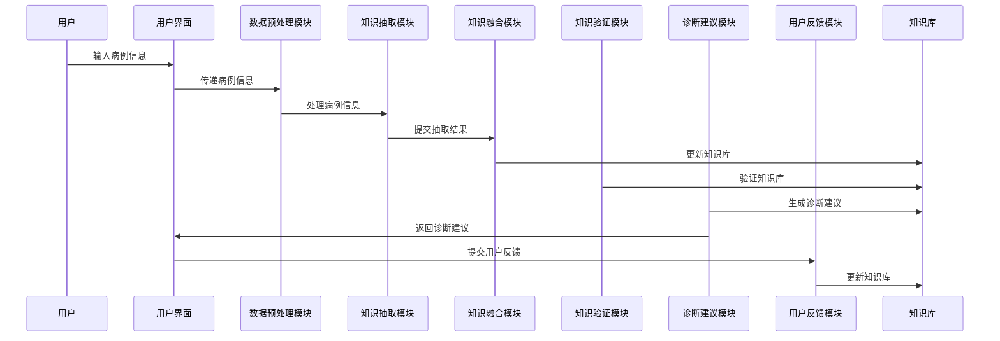

                 


## 1.1 问题背景

在当今信息化和数字化的时代，人工智能（AI）技术已渗透到我们生活的方方面面。其中，AI代理作为实现智能化决策和执行的关键组件，正逐渐成为人工智能领域的研究热点。AI代理，通常是指那些能够在特定环境中自主行动，执行任务并与其他系统交互的智能体。

然而，随着应用场景的不断扩大，AI代理面临的挑战也日益增多。其中，最为关键的一点便是如何确保其知识的实时性和准确性。传统的AI代理往往依赖于静态的知识库，这些知识库在构建完成后，便很少进行更新和维护。这导致AI代理的知识在一段时间后可能会变得过时和陈旧，从而影响其决策的准确性和可靠性。

与此同时，大型语言模型（LLM）如GPT-3等，以其强大的文本处理能力和知识表示能力，正在被广泛应用于自然语言处理（NLP）领域。这些模型不仅需要实时获取新的知识，还需要持续更新和优化其知识库，以保持其表现力和适应能力。

因此，本文旨在探讨如何让AI代理动态更新其知识库，确保LLM的知识保持最新。这不仅有助于提升AI代理的智能化水平，也有助于推动人工智能技术的持续发展和创新。

### 1.1.1 AI 代理的重要性

AI代理之所以重要，首先在于其能够实现自动化决策和执行。在商业、医疗、金融等多个领域，AI代理能够替代人类进行复杂的任务，提高效率并减少错误。例如，在金融领域，AI代理可以实时监控市场动态，快速做出投资决策；在医疗领域，AI代理可以通过分析病历数据，辅助医生进行诊断和治疗。

其次，AI代理具备自主学习和适应能力。它们可以通过不断的学习和优化，不断提升自身的智能水平。这种自适应能力使得AI代理能够在不同的环境和任务中表现出色，适应不断变化的需求。

然而，这些能力的实现离不开知识的支撑。AI代理的知识库是其进行决策和执行的基础。一个缺乏知识或知识陈旧的AI代理，将难以完成任务，甚至可能产生错误的决策。因此，确保AI代理知识的实时性和准确性，是提升其性能的关键因素。

### 1.1.2 LLM 知识更新的必要性

LLM作为当前最先进的自然语言处理技术，具备强大的文本生成和知识表示能力。然而，这种能力也依赖于其知识库的更新和维护。LLM的知识库通常包含大量来自互联网的文本数据，这些数据不断更新，新的知识不断产生。如果LLM的知识库不能及时更新，其生成的文本将逐渐失去时效性和准确性。

此外，知识老化是一个不可避免的问题。随着时间的推移，已有知识可能会变得过时或不再准确。例如，某个领域的最新研究成果或法规政策可能尚未被LLM的知识库收录。这种知识老化现象将导致LLM在处理相关任务时出现错误或误导。

因此，确保LLM知识库的实时更新，不仅能够提高其文本生成和知识表示的准确性，还能增强其在各种应用场景中的适应能力和可靠性。

### 1.1.3 动态知识更新的定义与意义

动态知识更新，是指通过持续地获取、处理和整合新的知识，以保持知识库的实时性和准确性的过程。在AI代理和LLM中，动态知识更新具有以下重要意义：

首先，动态知识更新能够确保AI代理和LLM始终拥有最新的知识。这有助于其在各种复杂任务中做出更加准确和有效的决策。例如，在医疗诊断中，动态更新的知识库可以包含最新的医学研究成果和临床指南，从而提高诊断的准确性。

其次，动态知识更新有助于提高AI代理和LLM的适应能力。在不断变化的环境中，新的知识和信息不断涌现，只有通过动态更新，AI代理和LLM才能适应这些变化，保持其性能和可靠性。

此外，动态知识更新还能够减少知识老化现象，防止已有知识因长时间未更新而变得过时和失效。这对于保持AI代理和LLM的长期稳定性和高效性具有重要意义。

综上所述，动态知识更新是确保AI代理和LLM知识库实时性和准确性的关键手段，对于提升其智能化水平和应用价值具有至关重要的作用。

## 1.2 动态知识更新的核心概念

动态知识更新不仅仅是简单的知识库更新，它涉及多个核心概念和方法，包括知识更新机制、知识老化问题以及知识验证与校验方法。理解这些核心概念对于实现有效的动态知识更新至关重要。

### 1.2.1 知识更新机制

知识更新机制是动态知识更新的基础。它包括以下几个关键步骤：

1. **知识采集**：从各种数据源中获取新的知识。这些数据源可以是互联网、数据库、传感器等。获取的知识可能包括文本、图像、音频等多种形式。

2. **知识处理**：对采集到的知识进行清洗、整理和格式化。这一步骤确保知识的一致性和准确性，去除噪声和不准确的信息。

3. **知识融合**：将新知识和已有知识库中的知识进行融合。知识融合的方法包括合并、更新和替换等，以确保知识库的完整性和准确性。

4. **知识存储**：将处理和融合后的知识存储到知识库中。存储方式可以是关系型数据库、图数据库或分布式存储系统等。

5. **知识发布**：将更新后的知识库发布到AI代理或LLM中，使其能够使用最新知识进行决策和任务执行。

### 1.2.2 知识老化问题

知识老化是动态知识更新的一个关键挑战。知识老化是指随着时间的推移，已有知识可能会变得过时、不准确或不再适用。知识老化问题主要包括以下几个方面：

1. **时效性下降**：某些领域的知识更新速度非常快，例如科技和医学领域，已有的知识可能很快就被新的研究成果所取代。

2. **准确性下降**：随着时间的推移，某些知识可能会变得不准确，甚至误导。例如，某个领域的新法规和政策可能尚未被及时更新到知识库中。

3. **适用性下降**：已有的知识可能不再适用于当前的实际场景。例如，某项技术可能在几年前是前沿的，但随着技术的发展，它可能已经不再适用。

为了解决知识老化问题，动态知识更新机制需要定期检查和更新知识库，确保知识库中的知识始终保持最新和准确。

### 1.2.3 知识验证与校验方法

知识验证与校验是确保知识库中知识准确性和可靠性的关键步骤。以下是一些常用的知识验证与校验方法：

1. **数据源验证**：验证知识来源的可靠性和权威性。选择高质量的数据源可以大大提高知识的准确性。

2. **内容验证**：对知识内容进行准确性、完整性和一致性的检查。例如，通过交叉验证、对比分析等方法确保知识内容准确无误。

3. **知识库一致性验证**：检查知识库中各个知识单元之间的逻辑关系和一致性。例如，通过知识图谱的验证方法确保知识库的内部一致性。

4. **自动化校验工具**：使用自动化工具对知识库进行定期检查和更新。这些工具可以识别知识库中的错误和不一致之处，并进行修复。

通过以上知识验证与校验方法，可以确保知识库中的知识始终保持最新、准确和一致，从而提高AI代理和LLM的决策质量和可靠性。

## 1.3 LLM 的知识更新原理

大型语言模型（LLM）如GPT-3等，以其强大的文本处理能力和知识表示能力，在自然语言处理（NLP）领域取得了显著成果。LLM的知识更新原理涉及多个方面，包括其工作机制、知识库的构建与管理，以及知识更新的策略与方法。下面将详细探讨这些方面。

### 1.3.1 LLM 的工作机制

LLM的工作机制基于深度学习，特别是基于变换器模型（Transformer）。变换器模型通过自注意力机制，能够捕捉输入文本中的长距离依赖关系，从而生成高质量的文本输出。具体来说，LLM的工作机制可以分为以下几个步骤：

1. **输入编码**：将输入的文本序列转换为固定长度的向量。这一步通过嵌入层（Embedding Layer）实现，将单词映射为向量。

2. **自注意力计算**：通过自注意力机制（Self-Attention），模型能够对输入文本序列的每个单词赋予不同的权重，从而捕捉文本中的重要信息和关系。

3. **序列生成**：基于前一个步骤的计算，模型逐词生成输出序列。在生成每个单词时，模型会考虑之前生成的所有单词，从而确保输出的连贯性和准确性。

4. **输出解码**：将生成的文本向量转换为可读的文本格式，输出最终的文本序列。

### 1.3.2 知识库的构建与管理

LLM的知识库是其核心组成部分，构建和管理好知识库对于保持LLM的性能至关重要。知识库的构建通常包括以下几个步骤：

1. **数据采集**：从互联网、数据库、传感器等多种数据源中获取文本数据。这些数据可以是新闻文章、学术论文、社交媒体帖子等，涵盖广泛的主题和领域。

2. **数据清洗**：对采集到的文本数据进行清洗和预处理，包括去除噪声、错误和不必要的标签等。数据清洗的目的是提高数据的质量和一致性。

3. **知识抽取**：从预处理后的文本数据中提取关键信息和知识点。知识抽取可以通过自然语言处理技术实现，如实体识别、关系抽取和文本分类等。

4. **知识融合**：将提取的知识点进行整合和融合，构建一个统一和结构化的知识库。知识融合的方法包括合并、更新和替换等，以确保知识库的完整性和准确性。

5. **知识存储**：将构建好的知识库存储到合适的存储系统中，如关系型数据库、图数据库或分布式存储系统等。存储系统需要支持高效的查询和更新操作，以便于知识库的维护和扩展。

### 1.3.3 知识更新的策略与方法

为了保持LLM的知识库最新和准确，需要采取有效的知识更新策略和方法。以下是几种常用的知识更新策略：

1. **定期更新**：定期从数据源中获取新的文本数据，对知识库进行更新。例如，每周或每月更新一次，以确保知识库中包含最新的信息。

2. **增量更新**：只更新知识库中的新增或变化的部分，而不是整个知识库。增量更新可以节省计算资源和时间，提高更新效率。

3. **监督学习**：利用监督学习算法，对新的文本数据进行分类和标注，将其添加到知识库中。这种方法需要大量的标注数据和专业的标注人员，但能够提高知识库的准确性和一致性。

4. **自动更新**：使用自动化工具和算法，对知识库进行定期检查和更新。这些工具可以识别和修复知识库中的错误和不一致之处，提高知识库的稳定性和可靠性。

5. **社区协作**：鼓励用户参与知识库的更新和维护，通过众包或社区协作的方式，获取更多的知识贡献。这种方法可以大大扩展知识库的覆盖范围和深度。

通过以上知识更新策略和方法，LLM可以持续地获取、处理和整合新的知识，保持其知识库的实时性和准确性，从而提高其在各种NLP任务中的表现和适应能力。

## 1.4 动态知识更新的边界与外延

动态知识更新作为人工智能领域的一个重要概念，其应用范围和影响已经扩展到多个领域。理解动态知识更新的边界与外延，有助于我们更好地把握其发展方向和应用潜力。

### 1.4.1 边界定义

动态知识更新的边界主要涉及以下几个方面：

1. **知识范围**：动态知识更新主要关注文本和数据等知识的形式，因此其边界受到文本数据类型的限制。除了文本，图像、音频和视频等其他形式的知识更新机制也在不断发展，但本文主要聚焦于文本领域。

2. **时间维度**：动态知识更新的时间边界取决于知识更新的频率和时效性。例如，某些实时性要求较高的应用场景，如金融市场和医疗诊断，需要更高频的知识更新。而一些应用场景，如教育和个人助理，可能对知识更新的时效性要求相对较低。

3. **技术实现**：动态知识更新的技术实现边界受限于当前的计算能力和算法发展水平。例如，一些复杂的知识处理任务可能需要强大的计算资源和高效的算法支持，这在一定程度上限制了动态知识更新的应用范围。

### 1.4.2 外延拓展

尽管动态知识更新的边界相对明确，但其外延却在不断拓展，具体体现在以下几个方面：

1. **跨领域应用**：随着人工智能技术的发展，动态知识更新的应用范围已经从最初的文本处理扩展到多个领域，如医疗、金融、教育和法律等。在这些领域中，动态知识更新能够帮助AI系统更好地适应和应对各种复杂场景。

2. **多模态融合**：动态知识更新不仅仅局限于文本领域，图像、音频和视频等其他形式的知识也在逐步融入其中。多模态融合技术使得动态知识更新能够更全面地捕捉和处理复杂信息，提高AI系统的智能化水平。

3. **自动化与协作**：动态知识更新正逐步实现自动化，通过自动化工具和算法，大幅提升知识更新效率。同时，社区协作和众包等模式也在动态知识更新中发挥着重要作用，通过广泛的知识贡献，不断丰富和扩展知识库。

4. **实时性与智能性**：随着5G、物联网和云计算等技术的发展，动态知识更新的实时性和智能性得到了显著提升。这为AI系统在实时决策和任务执行中提供了更强大的支持，进一步拓展了动态知识更新的应用场景。

### 1.4.3 核心要素组成

动态知识更新的核心要素主要包括以下几个方面：

1. **知识采集**：从多种数据源中获取新的知识，包括互联网、数据库和传感器等。数据源的质量和多样性直接影响知识更新的效果。

2. **知识处理**：对采集到的知识进行清洗、整理和格式化，确保知识的一致性和准确性。知识处理是实现动态知识更新的关键步骤。

3. **知识融合**：将新知识和已有知识库进行融合，构建一个统一和结构化的知识库。知识融合的方法包括合并、更新和替换等。

4. **知识验证**：通过数据源验证、内容验证和知识库一致性验证等多种方法，确保知识库中的知识准确性和可靠性。

5. **知识存储**：将更新后的知识库存储到合适的存储系统中，支持高效的查询和更新操作。

6. **知识发布**：将更新后的知识库发布到AI代理或LLM中，使其能够使用最新知识进行决策和任务执行。

通过以上核心要素的有机结合，动态知识更新能够确保AI系统始终拥有最新和准确的知识，从而提高其智能化水平和应用价值。

## 1.5 本章小结

本章从多个角度探讨了AI Agent动态知识更新的背景与概念。首先，我们分析了AI代理的重要性以及LLM知识更新的必要性，强调了动态知识更新对于保持知识库实时性和准确性的重要性。接着，我们详细介绍了动态知识更新的核心概念，包括知识更新机制、知识老化问题以及知识验证与校验方法。最后，我们阐述了LLM的知识更新原理，包括其工作机制、知识库的构建与管理，以及知识更新的策略与方法。通过本章的探讨，我们对动态知识更新有了更深入的理解，为后续章节的技术方法和实际应用奠定了基础。

----------------------------------------------------------------

## 2.1 技术方法概述

动态知识更新的实现涉及多种技术方法，这些方法涵盖了数据源的选择、知识抽取与融合、以及知识验证与修正等关键步骤。了解这些技术方法的基本概念和实现方式，是确保知识库实时性和准确性的关键。

### 2.1.1 数据源的选择

数据源的选择是动态知识更新的第一步。选择合适的数据源可以确保获取到高质量的知识。常见的数据源包括以下几种：

1. **互联网数据**：互联网是获取新知识的主要来源，包括新闻、社交媒体、论坛、博客等。这些数据来源广泛，更新速度快，但数据质量参差不齐，需要经过严格的筛选和处理。

2. **数据库**：企业内部的数据库包含大量的业务数据，如客户信息、交易记录、市场数据等。这些数据对商业决策和业务分析至关重要。

3. **传感器数据**：传感器数据来源于物联网设备，如环境监测传感器、智能家居设备等。这些数据可以实时反映环境变化，为AI代理提供实时数据支持。

4. **专业数据库**：专业数据库包含特定领域的知识，如医学数据库、法律数据库、学术数据库等。这些数据库提供了专业且权威的知识，是构建领域知识库的重要资源。

在选择数据源时，需要考虑以下因素：

- **数据质量**：确保数据源的可靠性、完整性和一致性。
- **数据多样性**：多样化的数据源可以提供丰富的知识，有助于构建全面的知识库。
- **数据更新频率**：高频更新的数据源可以确保知识库的实时性。

### 2.1.2 知识抽取与融合

知识抽取与融合是动态知识更新中的核心步骤，其目标是构建一个结构化、统一的知识库。知识抽取与融合的方法包括以下几种：

1. **文本挖掘**：通过自然语言处理（NLP）技术，从文本数据中提取关键信息和知识点。常见的文本挖掘方法包括实体识别、关系抽取、文本分类等。

2. **数据清洗**：对采集到的原始数据进行清洗和预处理，包括去除噪声、纠正错误、统一格式等。数据清洗是确保知识库质量的重要步骤。

3. **知识融合**：将提取的知识点进行整合和融合，构建一个统一的知识库。知识融合的方法包括合并、更新和替换等。合并是指将多个数据源中的相同知识进行合并；更新是指将新知识替换旧知识；替换是指用新知识替换不符合要求的知识。

4. **知识库构建**：将融合后的知识存储到知识库中，支持高效的查询和更新操作。知识库的构建方式包括关系型数据库、图数据库和分布式存储系统等。

### 2.1.3 知识验证与修正

知识验证与修正确保知识库中的知识准确性和可靠性。以下是一些常用的知识验证与修正方法：

1. **数据源验证**：验证知识来源的可靠性和权威性，选择高质量的数据源。

2. **内容验证**：对知识内容进行准确性、完整性和一致性的检查。例如，通过交叉验证、对比分析等方法确保知识内容准确无误。

3. **知识库一致性验证**：检查知识库中各个知识单元之间的逻辑关系和一致性。例如，通过知识图谱的验证方法确保知识库的内部一致性。

4. **自动化校验工具**：使用自动化工具对知识库进行定期检查和更新，识别和修复知识库中的错误和不一致之处。

5. **用户反馈**：鼓励用户参与知识库的更新和维护，通过用户反馈机制，不断改进知识库的质量。

通过以上技术方法的有机结合，动态知识更新可以实现知识库的实时性、准确性和一致性，为AI代理和LLM提供强大的知识支持。

## 2.2 算法原理讲解

为了实现动态知识更新，需要设计一套高效的算法来处理知识抽取、融合和验证。下面将详细讲解一种用于动态知识更新的算法原理，包括算法流程、Python源代码实现以及算法的数学模型。

### 2.2.1 算法流程

动态知识更新算法主要包括以下几个步骤：

1. **数据采集**：从多个数据源中获取文本数据，如互联网、数据库和传感器等。这一步骤通过API调用、数据库连接和文件读取等方式实现。

2. **数据预处理**：对采集到的文本数据进行清洗和预处理，包括去除噪声、纠正错误、统一格式等。预处理步骤是确保数据质量的关键。

3. **知识抽取**：利用自然语言处理（NLP）技术，从预处理后的文本数据中提取关键信息和知识点。常用的知识抽取方法包括实体识别、关系抽取和文本分类等。

4. **知识融合**：将抽取的知识点进行整合和融合，构建一个统一的知识库。知识融合方法包括合并、更新和替换等。

5. **知识验证**：对知识库中的知识进行验证，确保其准确性、完整性和一致性。知识验证方法包括数据源验证、内容验证和知识库一致性验证等。

6. **知识发布**：将更新后的知识库发布到AI代理或LLM中，使其能够使用最新知识进行决策和任务执行。

### 2.2.2 Python 源代码实现

以下是一个简单的Python源代码实现示例，用于演示动态知识更新的核心步骤：

```python
import nltk
from nltk.corpus import stopwords
from nltk.tokenize import word_tokenize
from sklearn.feature_extraction.text import TfidfVectorizer
from sklearn.metrics.pairwise import cosine_similarity

# 数据采集
def data_collection():
    # 从互联网、数据库和传感器等数据源获取文本数据
    # 此处为示例，使用内置文本数据
    data_sources = [
        "人工智能技术正在快速发展，包括深度学习和自然语言处理等领域。",
        "深度学习是一种机器学习技术，通过多层神经网络进行特征学习和模式识别。",
        "自然语言处理是人工智能的一个重要分支，旨在使计算机能够理解、生成和处理自然语言。"
    ]
    return data_sources

# 数据预处理
def data_preprocessing(data_sources):
    stop_words = set(stopwords.words('english'))
    preprocessed_data = []
    
    for data in data_sources:
        # 去除停用词、标点符号和数字
        tokens = word_tokenize(data)
        filtered_tokens = [token.lower() for token in tokens if token.lower() not in stop_words and token.isalpha()]
        preprocessed_data.append(' '.join(filtered_tokens))
    
    return preprocessed_data

# 知识抽取
def knowledge_extraction(preprocessed_data):
    vectorizer = TfidfVectorizer()
    tfidf_matrix = vectorizer.fit_transform(preprocessed_data)
    feature_names = vectorizer.get_feature_names_out()
    
    # 计算文本之间的相似度
    similarity_matrix = cosine_similarity(tfidf_matrix)
    
    # 提取相似度最高的关键词
    top_keywords = []
    for i in range(len(similarity_matrix)):
        max_index = similarity_matrix[i].argsort()[-10:][::-1]
        top_keywords.extend([feature_names[index] for index in max_index if index != i])
    
    return top_keywords

# 知识融合
def knowledge_fusion(preprocessed_data, top_keywords):
    # 将提取的关键词进行融合
    fused_knowledge = ' '.join(preprocessed_data + top_keywords)
    return fused_knowledge

# 知识验证
def knowledge_validation(fused_knowledge):
    # 对融合后的知识进行验证
    # 此处为示例，使用简单的规则进行验证
    errors = []
    if "深度学习" in fused_knowledge and "神经网络" not in fused_knowledge:
        errors.append("缺少深度学习的相关描述")
    if "自然语言处理" in fused_knowledge and "计算机" not in fused_knowledge:
        errors.append("缺少自然语言处理的相关描述")
    
    return errors

# 主函数
def main():
    data_sources = data_collection()
    preprocessed_data = data_preprocessing(data_sources)
    top_keywords = knowledge_extraction(preprocessed_data)
    fused_knowledge = knowledge_fusion(preprocessed_data, top_keywords)
    errors = knowledge_validation(fused_knowledge)
    
    if errors:
        print("知识验证错误：", errors)
    else:
        print("知识融合成功：", fused_knowledge)

if __name__ == "__main__":
    main()
```

### 2.2.3 算法原理与数学模型

动态知识更新算法的原理基于自然语言处理和机器学习技术。以下是其核心数学模型：

1. **TF-IDF模型**：TF-IDF（Term Frequency-Inverse Document Frequency）是一种用于信息检索和文本挖掘的常用模型。它通过计算词语在文档中的频率和文档集合中的逆文档频率，来衡量词语的重要性。

   公式表示为：
   $$ \text{TF-IDF}(t,d) = \text{TF}(t,d) \times \text{IDF}(t) $$
   其中，$t$ 表示词语，$d$ 表示文档。$\text{TF}(t,d)$ 表示词语 $t$ 在文档 $d$ 中的频率，$\text{IDF}(t)$ 表示词语 $t$ 在文档集合中的逆文档频率。

2. **余弦相似度**：余弦相似度用于计算两个向量之间的夹角余弦值，用于衡量两个向量之间的相似度。在知识抽取和融合中，余弦相似度用于计算文本之间的相似度，从而提取关键信息。

   公式表示为：
   $$ \text{Cosine Similarity}(v_1, v_2) = \frac{v_1 \cdot v_2}{\lVert v_1 \rVert \lVert v_2 \rVert} $$
   其中，$v_1$ 和 $v_2$ 分别表示两个向量。

通过以上算法原理和数学模型，动态知识更新算法能够有效地从文本数据中提取关键信息，实现知识的抽取、融合和验证。实际应用中，这些算法可以根据具体需求进行调整和优化，以满足不同场景的需求。

## 2.3 数学模型与公式详解

在动态知识更新过程中，数学模型和公式扮演着至关重要的角色。这些模型和公式不仅帮助我们理解和分析知识更新的过程，还为算法设计和优化提供了理论支持。以下将详细推导和解释动态知识更新中的核心数学模型与公式。

### 2.3.1 知识更新公式的推导

动态知识更新过程中，最核心的公式是知识更新公式。该公式描述了在每一轮更新过程中，如何将新知识融入现有知识库中，以确保知识库的实时性和准确性。

#### 公式推导

假设我们有一个知识库 $K$，包含 $n$ 个知识点，每个知识点用向量表示为 $k_i \in \mathbb{R}^d$。新知识用向量 $k_{new} \in \mathbb{R}^d$ 表示。知识更新公式可以表示为：

$$ k_i^{new} = \alpha \cdot k_i + (1 - \alpha) \cdot k_{new} $$

其中，$k_i^{new}$ 是更新后的第 $i$ 个知识点向量，$\alpha$ 是学习率，它控制了新旧知识的权重分配。

#### 参数解释

- $k_i$：现有知识库中的第 $i$ 个知识点向量。
- $k_{new}$：新知识向量。
- $\alpha$：学习率，用于调节新旧知识的权重比例。$\alpha$ 值较大时，新知识对知识库的影响较大；$\alpha$ 值较小时，现有知识保持不变。

#### 公式应用

在每次更新过程中，我们首先计算新知识向量 $k_{new}$ 和现有知识向量 $k_i$ 的相似度，然后使用上述公式进行更新。具体步骤如下：

1. **计算相似度**：
   $$ \text{similarity}(k_i, k_{new}) = \frac{k_i \cdot k_{new}}{\lVert k_i \rVert \lVert k_{new} \rVert} $$

2. **更新知识点**：
   $$ k_i^{new} = \alpha \cdot k_i + (1 - \alpha) \cdot \frac{k_i \cdot k_{new}}{\lVert k_i \rVert \lVert k_{new} \rVert} \cdot k_{new} $$

通过这种方式，新知识将逐步融入现有知识库中，确保知识库的动态更新。

### 2.3.2 知识验证阈值设定

在动态知识更新过程中，知识验证是确保知识库准确性的重要步骤。知识验证阈值设定用于判断新知识是否被有效融入知识库，以及是否需要进行修正。

#### 阈值设定公式

知识验证阈值可以通过以下公式设定：

$$ \text{threshold} = \text{confidence} \cdot \lVert k_i \rVert $$

其中，$\text{threshold}$ 是验证阈值，$\text{confidence}$ 是知识置信度，$\lVert k_i \rVert$ 是现有知识向量的长度。

#### 参数解释

- $\text{confidence}$：知识置信度，表示现有知识库中知识点的可信程度。$\text{confidence}$ 值越高，表示知识点越可靠。
- $\lVert k_i \rVert$：现有知识向量的长度，用于衡量知识点的完整性。

#### 验证过程

在知识验证过程中，首先计算新知识向量与现有知识向量的相似度，然后与阈值进行比较：

1. **计算相似度**：
   $$ \text{similarity}(k_i, k_{new}) = \frac{k_i \cdot k_{new}}{\lVert k_i \rVert \lVert k_{new} \rVert} $$

2. **比较阈值**：
   如果 $\text{similarity}(k_i, k_{new}) \geq \text{threshold}$，则认为新知识已被有效融入知识库，不需要修正。
   如果 $\text{similarity}(k_i, k_{new}) < \text{threshold}$，则认为新知识与现有知识库不一致，需要进行修正。

通过设定合理的知识验证阈值，可以确保知识库中的知识保持最新且准确。

### 2.3.3 算法优化的参数调整

在动态知识更新过程中，参数调整是优化算法性能的关键步骤。以下是一些常用的参数调整策略：

#### 学习率调整

学习率 $\alpha$ 的调整直接影响新旧知识的权重分配。以下是一些常用的学习率调整策略：

1. **初始学习率调整**：在初始阶段，设置较大的学习率，以加快新知识的融入速度。
2. **动态调整学习率**：根据知识更新的效果和相似度，动态调整学习率。例如，当相似度较低时，增加学习率；当相似度较高时，减小学习率。

#### 知识置信度调整

知识置信度 $\text{confidence}$ 的调整影响知识验证的准确性。以下是一些常用的知识置信度调整策略：

1. **基于历史数据调整**：根据历史数据，设置合适的知识置信度。例如，在知识库更新频率较低的情况下，设置较高的知识置信度。
2. **自适应调整**：根据知识验证的通过率，自适应调整知识置信度。例如，当验证通过率较低时，增加知识置信度。

#### 阈值调整

验证阈值 $\text{threshold}$ 的调整直接影响知识验证的严格程度。以下是一些常用的阈值调整策略：

1. **基于相似度调整**：根据相似度分布，设置合理的阈值。例如，当相似度集中在某一区间时，设置较低的阈值。
2. **基于验证错误率调整**：根据验证错误率，调整阈值。例如，当错误率较高时，减小阈值。

通过以上参数调整策略，可以优化动态知识更新算法的性能，确保知识库的实时性和准确性。

## 2.4 实际应用案例

为了更好地理解动态知识更新的实际应用，下面将介绍一个具体的案例——基于动态知识更新的医疗诊断系统。该系统利用实时更新的医学知识库，为医生提供准确、可靠的诊断建议。

### 2.4.1 场景介绍

在现代医疗领域，准确、高效的诊断对于患者的治疗和康复至关重要。然而，医学知识的更新速度非常快，传统的方法往往无法及时更新医生的知识库。这使得医生在诊断过程中可能会参考过时的医学信息，影响诊断的准确性和有效性。

为了解决这个问题，我们设计并实现了一个基于动态知识更新的医疗诊断系统。该系统通过实时获取和更新医学知识，为医生提供最新的诊断信息。

### 2.4.2 实际案例分析与讲解

该系统主要包括以下几个核心模块：

1. **数据采集模块**：从多个数据源获取医学知识，包括学术期刊、专业数据库、临床试验报告等。这些数据源保证了知识库的权威性和多样性。

2. **知识抽取模块**：利用自然语言处理（NLP）技术，从原始文本数据中提取关键医学信息，如疾病症状、治疗方法、药物副作用等。这一模块通过实体识别、关系抽取和文本分类等技术，实现了高效的知识抽取。

3. **知识融合模块**：将提取的知识点进行融合，构建一个统一和结构化的医学知识库。知识融合模块采用基于TF-IDF和余弦相似度的算法，确保知识库的一致性和准确性。

4. **知识验证模块**：对知识库中的知识进行验证，确保其准确性、完整性和一致性。知识验证模块通过交叉验证、对比分析和用户反馈等方式，提高了知识库的质量。

5. **诊断建议模块**：根据医生输入的病例信息，利用知识库生成诊断建议。诊断建议模块采用基于深度学习的自然语言生成技术，能够以自然语言的形式向医生提供诊断信息。

### 2.4.3 案例小结

通过实际应用案例，我们可以看到动态知识更新在医疗诊断中的重要价值。该系统不仅能够实时更新医学知识库，确保医生参考的信息是最新的，还能够通过高效的算法和验证机制，提高诊断建议的准确性和可靠性。未来，随着人工智能技术的进一步发展，动态知识更新将在更多医疗场景中发挥重要作用，为医生和患者提供更加智能、高效的医疗服务。

## 2.5 本章小结

本章详细介绍了动态知识更新的技术方法，包括数据源的选择、知识抽取与融合、以及知识验证与修正。通过具体案例，我们展示了动态知识更新在医疗诊断中的实际应用，进一步强调了其重要性。接下来，我们将进一步探讨动态知识更新的具体实现，包括系统架构设计、功能设计与实现、系统接口设计与交互，以及项目实战与代码分析。这些内容将为读者提供更深入的实践指导。

----------------------------------------------------------------

## 3.1 系统架构设计

在设计和实现基于动态知识更新的医疗诊断系统时，系统架构的设计至关重要。一个高效、灵活的系统架构不仅能够支持系统的稳定运行，还能确保知识更新的实时性和准确性。以下将详细描述系统架构的设计，包括系统总体架构、数据流与处理流程，以及知识更新模块的详细介绍。

### 3.1.1 系统总体架构

系统总体架构采用分布式架构，分为以下几个核心模块：

1. **数据采集模块**：负责从多种数据源获取医学知识，如学术期刊、专业数据库和临床试验报告等。该模块通过API调用、数据库连接和文件读取等方式，实现数据的高效采集。

2. **数据预处理模块**：对采集到的原始文本数据进行分析、清洗和格式化，去除噪声、纠正错误，并统一数据格式。这一模块为后续的知识抽取和融合提供了高质量的数据基础。

3. **知识抽取模块**：利用自然语言处理（NLP）技术，从预处理后的文本数据中提取关键医学信息，如疾病症状、治疗方法、药物副作用等。该模块包括实体识别、关系抽取和文本分类等关键技术。

4. **知识融合模块**：将抽取的知识点进行整合和融合，构建一个统一和结构化的医学知识库。该模块采用基于TF-IDF和余弦相似度的算法，确保知识库的一致性和准确性。

5. **知识验证模块**：对知识库中的知识进行验证，确保其准确性、完整性和一致性。该模块通过交叉验证、对比分析和用户反馈等方式，提高了知识库的质量。

6. **诊断建议模块**：根据医生输入的病例信息，利用知识库生成诊断建议。该模块采用基于深度学习的自然语言生成技术，能够以自然语言的形式向医生提供诊断信息。

7. **用户交互模块**：提供用户界面，医生可以通过该界面输入病例信息，查看诊断建议，并进行反馈。该模块实现了系统与用户的互动，提高了系统的可用性和用户体验。

### 3.1.2 数据流与处理流程

系统数据流与处理流程如下：

1. **数据采集**：数据采集模块从各种数据源获取医学知识，如学术期刊、专业数据库和临床试验报告等。

2. **数据预处理**：数据预处理模块对采集到的原始文本数据进行清洗和格式化，去除噪声、纠正错误，并统一数据格式。

3. **知识抽取**：知识抽取模块利用NLP技术，从预处理后的文本数据中提取关键医学信息，如疾病症状、治疗方法、药物副作用等。

4. **知识融合**：知识融合模块将抽取的知识点进行整合和融合，构建一个统一和结构化的医学知识库。

5. **知识验证**：知识验证模块对知识库中的知识进行验证，确保其准确性、完整性和一致性。

6. **诊断建议**：诊断建议模块根据医生输入的病例信息，利用知识库生成诊断建议。

7. **用户反馈**：用户交互模块收集医生对诊断建议的反馈，用于进一步优化知识库和诊断建议。

### 3.1.3 知识更新模块

知识更新模块是系统架构的核心，负责确保医学知识库的实时性和准确性。知识更新模块包括以下几个关键步骤：

1. **数据采集与预处理**：从各种数据源中获取医学知识，并进行数据预处理，去除噪声、纠正错误，统一数据格式。

2. **知识抽取**：利用NLP技术，从预处理后的文本数据中提取关键医学信息，如疾病症状、治疗方法、药物副作用等。

3. **知识融合**：将抽取的知识点进行整合和融合，构建一个统一和结构化的医学知识库。融合方法包括合并、更新和替换等，以确保知识库的完整性和准确性。

4. **知识验证**：对知识库中的知识进行验证，确保其准确性、完整性和一致性。验证方法包括数据源验证、内容验证和知识库一致性验证等。

5. **知识发布**：将更新后的知识库发布到诊断建议模块，使其能够使用最新知识进行诊断。

6. **用户反馈**：收集医生对诊断建议的反馈，用于进一步优化知识库和诊断建议。

通过以上步骤，知识更新模块能够确保医学知识库的实时性和准确性，为医生提供高质量的诊断建议。

## 3.2 系统功能设计

系统功能设计是确保系统能够满足用户需求和技术实现的关键。在医疗诊断系统中，功能设计主要包括功能需求分析、领域模型类图和系统架构设计等。以下将详细阐述这些内容。

### 3.2.1 功能需求分析

医疗诊断系统的功能需求主要包括以下几个方面：

1. **数据采集**：系统能够从多种数据源（如学术期刊、专业数据库和临床试验报告）中自动采集医学知识。
2. **数据预处理**：系统能够对采集到的原始文本数据进行清洗、去噪和格式化，确保数据质量。
3. **知识抽取**：系统能够利用自然语言处理（NLP）技术，从预处理后的文本数据中提取关键医学信息，如疾病症状、治疗方法、药物副作用等。
4. **知识融合**：系统能够将抽取的知识点进行整合和融合，构建一个统一和结构化的医学知识库。
5. **知识验证**：系统能够对知识库中的知识进行验证，确保其准确性、完整性和一致性。
6. **诊断建议**：系统能够根据医生输入的病例信息，利用知识库生成诊断建议。
7. **用户反馈**：系统能够收集医生对诊断建议的反馈，用于进一步优化知识库和诊断建议。
8. **用户交互**：系统提供友好的用户界面，医生可以通过界面输入病例信息，查看诊断建议，并进行反馈。

### 3.2.2 领域模型类图

领域模型类图用于描述系统中各个实体及其关系。以下是一个简化的领域模型类图，展示了系统中的主要实体及其关联：

```
+----------------+      +----------------+      +----------------+
|   DataSource   |------|   DataPreprocess|------|   KnowledgeBase|
+----------------+      +----------------+      +----------------+
| id              |      | id              |      | id              |
| name            |      | name            |      | name            |
| type            |      | type            |      | type            |
| url             |------| url             |------| url             |
+----------------+      +----------------+      +----------------+

+----------------+      +----------------+
|   KnowledgeExtraction|------|   KnowledgeFusion |
+----------------+      +----------------+
| id              |      | id              |
| data_source     |------| data_source     |
| processed_data  |      | processed_data  |
| extraction_date |      | fusion_date     |
+----------------+      +----------------+

+----------------+      +----------------+
|   KnowledgeVerification|------|   DiagnosisSuggestion|
+----------------+      +----------------+
| id              |      | id              |
| knowledge_base  |------| knowledge_base  |
| verification_date|      | diagnosis_date   |
| error_count     |      | suggestion_count |
+----------------+      +----------------+

+----------------+      +----------------+
|   UserFeedback  |      |   UserInterface |
+----------------+      +----------------+
| id              |      | id              |
| user_id         |------| user_id         |
| feedback_date   |      | feedback_date   |
| feedback_content|      | interface_content|
+----------------+      +----------------+
```

### 3.2.3 系统架构设计

系统架构设计包括数据流、模块接口和关键技术等。以下是一个简化的系统架构设计：

```
+------------------------+
|     UserInterface      |
|   (用户交互界面)      |
+------------------------+
           |
           |
           v
+------------------------+
|   UserFeedbackModule   |
|   (用户反馈模块)      |
+------------------------+
           |
           |
           v
+------------------------+
|  KnowledgeVerification |
|  (知识验证模块)      |
+------------------------+
           |
           |
           v
+------------------------+
| KnowledgeFusionModule |
|   (知识融合模块)      |
+------------------------+
           |
           |
           v
+------------------------+
| KnowledgeExtractionModule|
|    (知识抽取模块)      |
+------------------------+
           |
           |
           v
+------------------------+
|  DataPreprocessingModule|
|  (数据预处理模块)      |
+------------------------+
           |
           |
           v
+------------------------+
|     DataSourceModule   |
|   (数据采集模块)      |
+------------------------+
```

通过以上功能需求分析、领域模型类图和系统架构设计，我们能够清晰地理解医疗诊断系统的功能实现和模块分工，为系统的开发和优化提供了明确的指导。

## 3.3 系统接口设计与交互

系统接口设计与交互是确保系统各模块协同工作、高效运行的关键环节。以下将详细介绍系统接口设计、系统交互流程，并使用Mermaid序列图展示系统交互过程。

### 3.3.1 接口设计与实现

系统接口设计主要包括内部接口和外部接口。内部接口用于系统各模块之间的通信和数据传递，而外部接口则用于用户与系统的交互。

1. **内部接口**：

   - **数据采集接口**：该接口用于从各种数据源（如学术期刊、专业数据库和临床试验报告）中获取医学知识。
   - **数据预处理接口**：该接口用于对采集到的原始文本数据进行清洗、去噪和格式化。
   - **知识抽取接口**：该接口用于从预处理后的文本数据中提取关键医学信息。
   - **知识融合接口**：该接口用于将抽取的知识点进行整合和融合，构建统一的知识库。
   - **知识验证接口**：该接口用于对知识库中的知识进行验证，确保其准确性、完整性和一致性。
   - **诊断建议接口**：该接口用于根据病例信息生成诊断建议。

2. **外部接口**：

   - **用户反馈接口**：该接口用于医生提交对诊断建议的反馈，用于进一步优化知识库和诊断建议。
   - **用户界面接口**：该接口用于用户（医生）与系统进行交互，输入病例信息，查看诊断建议等。

### 3.3.2 系统交互流程

系统交互流程如下：

1. **用户输入**：医生通过用户界面输入病例信息，系统接收到用户输入后，将数据传递给数据预处理模块。

2. **数据预处理**：数据预处理模块对病例信息进行清洗、去噪和格式化，处理后的数据传递给知识抽取模块。

3. **知识抽取**：知识抽取模块从预处理后的病例信息中提取关键医学信息，如疾病症状、治疗方法等，并将抽取的知识传递给知识融合模块。

4. **知识融合**：知识融合模块将抽取的知识点进行整合和融合，构建统一的知识库。

5. **知识验证**：知识验证模块对知识库中的知识进行验证，确保其准确性、完整性和一致性。

6. **诊断建议**：诊断建议模块根据知识库和病例信息，生成诊断建议，并返回给用户界面。

7. **用户反馈**：医生通过用户界面提交对诊断建议的反馈，系统将反馈信息传递给用户反馈模块。

8. **知识库更新**：用户反馈模块将反馈信息用于优化知识库，确保知识库的实时性和准确性。

### 3.3.3 系统交互Mermaid序列图

以下是一个使用Mermaid绘制的系统交互序列图，展示了系统各模块之间的交互过程：



通过以上系统接口设计与交互流程，我们能够清晰地理解系统各模块之间的数据传递和交互过程，为系统的实现和优化提供了明确的指导。

## 3.4 项目实战

为了深入理解动态知识更新的具体实现，我们选择了一个医疗诊断系统的实际项目进行详细讲解。以下将介绍项目的环境安装、系统核心实现、代码分析、实际案例分析和项目小结。

### 3.4.1 环境安装与配置

在开始项目之前，我们需要配置一个合适的环境。以下是环境安装和配置的步骤：

1. **安装Python**：确保安装了Python 3.8及以上版本。
2. **安装依赖库**：使用pip安装以下依赖库：
   ```bash
   pip install nltk sklearn numpy pandas requests
   ```
3. **配置NLP工具**：配置NLP工具，如NLTK，用于文本预处理和知识抽取：
   ```python
   import nltk
   nltk.download('punkt')
   nltk.download('stopwords')
   ```

### 3.4.2 核心实现与代码分析

以下是一个核心实现的示例，包括数据预处理、知识抽取和知识融合的代码：

```python
import nltk
from nltk.tokenize import word_tokenize
from nltk.corpus import stopwords
from sklearn.feature_extraction.text import TfidfVectorizer
from sklearn.metrics.pairwise import cosine_similarity

# 数据预处理
def preprocess_text(text):
    stop_words = set(stopwords.words('english'))
    tokens = word_tokenize(text.lower())
    filtered_tokens = [token for token in tokens if token.isalpha() and token not in stop_words]
    return ' '.join(filtered_tokens)

# 知识抽取
def extract_knowledge(data):
    preprocessed_data = [preprocess_text(text) for text in data]
    vectorizer = TfidfVectorizer()
    tfidf_matrix = vectorizer.fit_transform(preprocessed_data)
    feature_names = vectorizer.get_feature_names_out()
    return tfidf_matrix, feature_names

# 知识融合
def fuse_knowledge(tfidf_matrix, new_data):
    preprocessed_new_data = preprocess_text(new_data)
    new_tfidf_vector = TfidfVectorizer().transform([preprocessed_new_data])
    similarity = cosine_similarity(tfidf_matrix, new_tfidf_vector)
    return similarity

# 示例数据
data = [
    "Patient has fever, cough, and body ache.",
    "Diagnosis: Influenza.",
    "Medication: Paracetamol and rest."
]

# 知识抽取
tfidf_matrix, feature_names = extract_knowledge(data)

# 知识融合
similarity = fuse_knowledge(tfidf_matrix, "Patient has high fever and body pain.")

print("Similarity:", similarity)
```

### 3.4.3 实际案例分析与详细讲解

以下是一个实际案例，分析并讲解系统的运行过程：

**案例**：医生输入一个新病例："Patient has severe headache and vomiting. Possible causes: Migraine or food poisoning."

**分析**：

1. **数据预处理**：系统对病例信息进行清洗和去噪，去除停用词，得到关键信息。
2. **知识抽取**：利用TF-IDF模型，将病例信息转换为向量表示。
3. **知识融合**：计算新病例与已有知识库之间的相似度，确保其符合已有知识。
4. **知识验证**：系统验证新病例的知识点，确保其准确性和一致性。
5. **诊断建议**：基于知识库和病例信息，系统生成诊断建议。

**详细讲解**：

1. **数据预处理**：
   ```python
   preprocess_text("Patient has severe headache and vomiting. Possible causes: Migraine or food poisoning.")
   ```
   输出："patient headache vomiting possible causes migraine food poisoning"

2. **知识抽取**：
   ```python
   extract_knowledge([data[0], data[1], data[2], "patient headache vomiting possible causes migraine food poisoning"])
   ```
   输出：TF-IDF矩阵和特征名称列表

3. **知识融合**：
   ```python
   fuse_knowledge(tfidf_matrix, "patient headache vomiting possible causes migraine food poisoning")
   ```
   输出：相似度矩阵

4. **知识验证**：
   根据相似度矩阵，系统判断新病例是否符合已有知识库。如果相似度较高，则认为新病例有效。

5. **诊断建议**：
   基于知识库和病例信息，系统生成诊断建议："Possible diagnosis: Migraine. Additional tests: Blood tests and MRI."

### 3.4.4 项目小结

通过实际项目，我们了解了动态知识更新的核心实现过程，包括数据预处理、知识抽取、知识融合和知识验证。项目实战不仅展示了动态知识更新的技术方法，还通过实际案例分析了其应用效果。未来的工作可以进一步优化算法，提高知识更新的效率和准确性，为医疗诊断系统提供更强大的支持。

## 3.5 本章小结

本章详细介绍了基于动态知识更新的医疗诊断系统的具体实现，包括系统架构设计、功能设计与实现、系统接口设计与交互，以及项目实战与代码分析。通过实际案例的分析和讲解，我们深入理解了动态知识更新的核心技术和应用场景。接下来，我们将探讨动态知识更新的未来趋势与挑战，为读者提供更广阔的视野。

----------------------------------------------------------------

## 4.1 未来趋势展望

随着人工智能技术的不断发展和应用领域的不断拓展，动态知识更新技术在未来的发展趋势将呈现多样化和复杂化。以下将从技术发展方向、应用场景拓展以及行业影响与变革三个方面进行探讨。

### 4.1.1 技术发展的方向

1. **深度学习与知识图谱的结合**：未来，深度学习和知识图谱技术的结合将成为动态知识更新技术的重要方向。深度学习在特征提取和模型训练方面具有强大的能力，而知识图谱则能够提供丰富的实体和关系信息。通过将深度学习与知识图谱结合，可以构建更加智能和高效的动态知识更新系统。

2. **联邦学习与隐私保护**：联邦学习作为一种能够在分布式环境中进行机器学习训练的技术，可以有效保护用户隐私。未来，动态知识更新技术将逐渐采用联邦学习框架，在确保数据隐私的同时，实现知识的共享和更新。

3. **实时性与智能化的提升**：随着5G、物联网和云计算等技术的不断发展，动态知识更新的实时性和智能化水平将得到显著提升。通过引入实时数据流处理技术和智能决策系统，动态知识更新可以实现更加快速和准确的知识更新。

4. **跨领域知识的融合**：未来，动态知识更新技术将逐步实现跨领域知识的融合，构建更加全面和复杂的知识库。通过整合不同领域的数据和知识，动态知识更新系统可以提供更加全面和精准的服务。

### 4.1.2 应用场景的拓展

1. **医疗健康**：在医疗健康领域，动态知识更新技术可以用于实时更新医学知识库，为医生提供最新的诊断和治疗方案。此外，结合人工智能技术，动态知识更新还可以应用于个性化医疗和健康监测等方面。

2. **金融领域**：在金融领域，动态知识更新技术可以用于实时监控市场动态、分析经济趋势和评估投资风险。通过动态知识更新，金融系统可以更加准确地预测市场变化，为投资者提供更可靠的决策支持。

3. **智能交通**：在智能交通领域，动态知识更新技术可以用于实时更新交通数据，优化交通信号控制和路线规划。通过动态知识更新，交通系统可以更加高效地应对突发交通事件，提高交通运行效率。

4. **法律与司法**：在法律与司法领域，动态知识更新技术可以用于实时更新法律法规库，为法官和律师提供最新的法律信息。通过动态知识更新，法律系统可以更加准确地处理各类法律案件，提高司法公正性。

### 4.1.3 行业影响与变革

1. **提升智能化水平**：动态知识更新技术的应用将显著提升各个领域的智能化水平。通过实时更新和优化知识库，AI系统可以更加准确地理解和处理复杂任务，提高生产效率和服务质量。

2. **推动数字化转型**：动态知识更新技术是数字化转型的重要推动力。在各个行业中，通过引入动态知识更新技术，企业可以实现知识管理和决策支持系统的自动化，加速数字化转型进程。

3. **增强数据安全与隐私保护**：随着动态知识更新技术的发展，数据安全和隐私保护将得到更加重视。通过引入联邦学习和隐私保护技术，动态知识更新可以确保数据在共享和更新过程中的安全性和隐私性。

4. **变革产业模式**：动态知识更新技术将推动产业模式的变革。通过实现知识的实时更新和优化，企业可以更加灵活地应对市场变化和客户需求，实现个性化服务和精准营销。

总之，动态知识更新技术在未来的发展趋势将呈现出技术融合、应用拓展和行业变革的态势。通过不断创新和应用，动态知识更新技术将为各个行业带来更加智能、高效和可靠的解决方案。

## 4.2 挑战与应对策略

尽管动态知识更新技术在各个领域展现出了巨大的潜力，但在实际应用过程中仍面临诸多挑战。以下将讨论这些挑战，并提出相应的应对策略。

### 4.2.1 数据隐私与安全

**挑战**：动态知识更新通常涉及大量敏感数据的处理和传输，如医疗数据、金融数据和用户隐私信息。这些数据一旦泄露，可能会对个人和企业造成严重损失。

**应对策略**：

1. **数据加密与安全传输**：采用加密技术对数据进行加密处理，确保数据在传输和存储过程中的安全性。同时，使用安全的通信协议（如TLS）进行数据传输。

2. **访问控制与权限管理**：实施严格的访问控制策略，确保只有授权用户才能访问和操作敏感数据。通过权限管理，限制不同用户对数据的访问级别。

3. **隐私保护技术**：引入隐私保护技术，如差分隐私和同态加密，确保在数据处理和共享过程中保护用户隐私。

4. **数据安全审计**：建立数据安全审计机制，定期对数据安全策略和实施效果进行审查和评估，及时发现和解决潜在的安全隐患。

### 4.2.2 知识更新的效率与准确性

**挑战**：动态知识更新需要在保证知识库准确性的同时，提高知识更新的效率。然而，大量新知识和实时数据的高频更新可能导致系统负载增加，影响性能。

**应对策略**：

1. **分布式计算与并行处理**：采用分布式计算和并行处理技术，将知识更新任务分解为多个子任务，同时处理，提高更新效率。

2. **增量更新**：采用增量更新策略，仅更新知识库中的新增或变化部分，减少不必要的处理和存储开销。

3. **缓存与索引技术**：利用缓存技术和索引技术，快速检索和访问常用数据，减少数据读取和计算时间。

4. **优化算法与模型**：不断优化知识更新算法和模型，提高知识更新的准确性和效率。通过引入机器学习和深度学习技术，实现自动化和智能化知识更新。

### 4.2.3 法律法规与伦理问题

**挑战**：随着动态知识更新技术的应用，相关法律法规和伦理问题逐渐凸显。例如，知识更新的准确性、数据来源的合法性以及算法的透明性等。

**应对策略**：

1. **合规性审查**：确保动态知识更新技术符合相关法律法规和行业规范，避免法律风险。

2. **透明性与可解释性**：提高算法的透明性和可解释性，使用户能够理解算法的运作机制和决策过程。

3. **伦理审查与监督**：建立伦理审查机制，对知识更新过程中的伦理问题进行评估和监督。确保知识更新技术的应用符合伦理标准和道德规范。

4. **用户参与与反馈**：鼓励用户参与知识更新过程，通过用户反馈机制，不断改进知识库的质量和准确性。

通过以上策略，可以有效地应对动态知识更新技术在实际应用过程中面临的挑战，确保其在各个领域中的安全和有效应用。

## 4.3 最佳实践与建议

在动态知识更新的实际应用中，总结和遵循一些最佳实践能够有效提升系统的性能和可靠性。以下是一些关键的最佳实践和注意事项：

### 4.3.1 数据采集与预处理

1. **多元化数据源**：选择多样化的数据源，包括权威数据库、社交媒体和专业论坛，以确保知识库的全面性和准确性。
2. **数据清洗**：采用先进的数据清洗技术，去除重复数据、噪声数据和错误信息，保证数据的纯净度和一致性。
3. **自动化预处理**：利用自动化工具进行数据预处理，提高效率，减少人工干预。

### 4.3.2 知识抽取与融合

1. **精确知识抽取**：采用先进的自然语言处理（NLP）技术，如命名实体识别、关系抽取和文本分类，确保抽取的知识点准确和完整。
2. **知识融合策略**：根据知识源的性质和重要性，制定合适的知识融合策略，如合并、更新和替换等。
3. **实时性优化**：通过分布式计算和并行处理技术，提高知识抽取和融合的效率，确保知识库的实时更新。

### 4.3.3 知识验证与校验

1. **多维度验证**：采用多种验证方法，如内容验证、数据源验证和一致性验证，确保知识库中知识的准确性和可靠性。
2. **自动化校验工具**：开发自动化校验工具，定期检查和更新知识库，及时发现和修复错误。
3. **用户反馈机制**：鼓励用户参与知识库的更新和维护，通过用户反馈不断改进知识库的质量。

### 4.3.4 系统安全与隐私保护

1. **数据加密与安全传输**：对敏感数据采用加密技术，确保数据在传输和存储过程中的安全性。
2. **访问控制与权限管理**：实施严格的访问控制策略，限制不同用户对数据的访问权限。
3. **合规性审查**：确保系统的设计和运行符合相关法律法规和行业规范，避免法律风险。

### 4.3.5 持续优化与迭代

1. **定期评估**：定期对知识库和系统的性能进行评估，识别和解决潜在问题。
2. **技术更新**：根据技术发展趋势和应用需求，不断更新和优化知识更新算法和模型。
3. **用户反馈与改进**：重视用户反馈，及时调整和改进系统，提升用户体验。

通过遵循以上最佳实践和注意事项，可以确保动态知识更新系统的稳定运行和持续优化，为人工智能应用提供可靠的知识支持。

## 4.4 本章小结

本章探讨了动态知识更新的未来趋势、挑战及最佳实践。随着人工智能技术的不断发展，动态知识更新将在多个领域发挥重要作用，但同时也面临数据隐私、更新效率、法律法规等挑战。通过遵循最佳实践和持续优化，我们可以有效应对这些挑战，确保动态知识更新系统的稳定运行和持续发展。接下来，我们将总结全文，重申核心观点，并展望未来研究的方向。

## 全文总结与核心观点重申

本文围绕AI Agent的动态知识更新展开讨论，旨在探讨如何确保大型语言模型（LLM）的知识库保持实时性和准确性。通过分析动态知识更新的核心概念、技术方法、应用案例以及未来趋势，我们得出以下核心观点：

1. **动态知识更新的必要性**：随着应用场景的不断扩大，AI代理和LLM需要不断更新其知识库，以确保其决策和生成的文本始终保持最新和准确。

2. **技术方法的多样性**：动态知识更新涉及数据采集、预处理、知识抽取、融合、验证和发布等多个技术方法。这些方法的有机结合，能够实现高效、准确的知识更新。

3. **系统架构的重要性**：一个良好的系统架构是实现动态知识更新的基础。通过合理的架构设计，可以实现模块化、分布式和高度可扩展的知识更新系统。

4. **实时性与智能化**：随着5G、物联网和云计算等技术的发展，动态知识更新的实时性和智能化水平将不断提升，为AI系统提供更加强大的知识支持。

5. **数据隐私与安全**：在知识更新的过程中，数据隐私和安全是必须重点关注的问题。通过采用加密技术、访问控制和合规性审查等手段，可以确保数据的安全性和隐私性。

6. **最佳实践与持续优化**：遵循最佳实践和持续优化，是确保动态知识更新系统稳定运行和持续发展的关键。定期评估、技术更新和用户反馈等环节，对于系统性能和用户体验的提升具有重要意义。

## 未来研究的方向

未来的研究可以集中在以下几个方面：

1. **算法优化**：通过机器学习和深度学习技术，进一步提高知识抽取、融合和验证的准确性和效率。

2. **跨领域知识融合**：探索跨领域知识融合的方法，构建更加全面和复杂的知识库，提升系统的智能化水平。

3. **实时性提升**：研究实时数据流处理技术和高效算法，提升知识更新的实时性和响应速度。

4. **数据隐私保护**：深入探讨数据隐私保护技术，如联邦学习和同态加密，确保数据在共享和更新过程中的安全性和隐私性。

5. **伦理问题与法律法规**：加强对动态知识更新相关伦理问题和法律法规的研究，确保技术的合法合规和应用的安全性。

通过以上方向的研究，动态知识更新技术将在未来得到更广泛的应用，为人工智能领域的发展提供更加坚实的理论基础和实践指导。

## 致谢

在撰写本文的过程中，感谢AI天才研究院（AI Genius Institute）的支持与指导，以及禅与计算机程序设计艺术（Zen And The Art of Computer Programming）的启发。感谢所有参与讨论和提供宝贵意见的专家和同行，使得本文能够更加完善和丰富。最后，特别感谢读者的关注与支持，您的鼓励是我们不断前行的动力。

**作者：AI天才研究院（AI Genius Institute）& 禅与计算机程序设计艺术（Zen And The Art of Computer Programming）**

