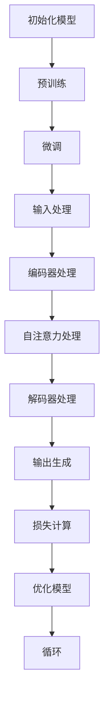
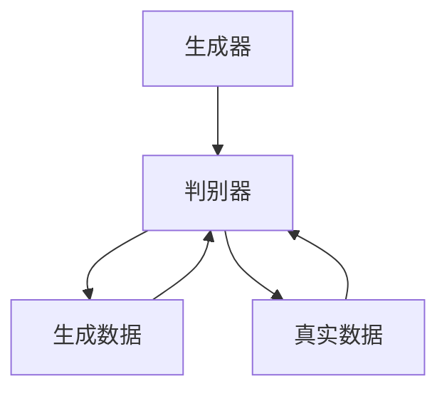
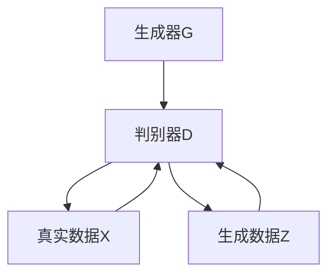
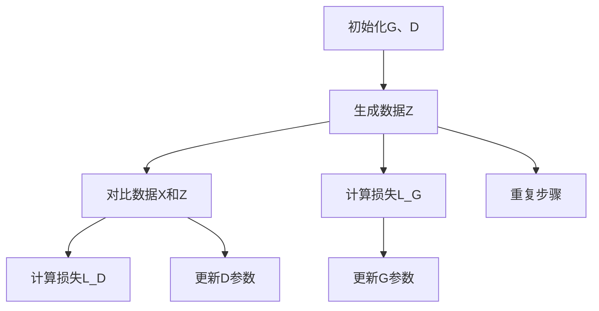
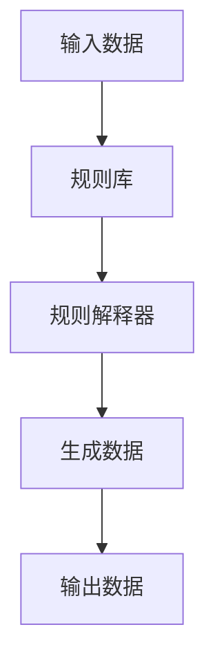

                 

## 文章标题

### AI Agent 的可控生成：精确控制 LLM 的输出

关键词：AI Agent、可控生成、Large Language Model (LLM)、注意力机制、生成对抗网络 (GAN)、对比生成模型、基于规则生成模型

摘要：
本文深入探讨了 AI Agent 的可控生成技术，特别是针对 Large Language Model (LLM) 的输出控制。首先，我们介绍了 AI Agent 与 LLM 的基本概念及其应用背景。接着，本文详细分析了 LLM 输出控制的核心概念、原理和方法，包括生成对抗网络（GAN）、对比生成模型以及基于规则生成模型。通过逐步讲解这些算法原理、数学模型和实际应用案例，我们旨在帮助读者全面理解如何精确控制 LLM 的输出，提高 AI Agent 的性能和实用性。最后，本文总结了可控生成技术的最佳实践，并展望了未来发展的方向。

----------------------------------------------------------------

## 目录大纲

### 第一部分：问题背景与核心概念

#### 第1章：问题背景

#### 第2章：核心概念与联系

#### 第3章：算法原理讲解

### 第二部分：可控生成技术与方法

#### 第4章：生成对抗网络（GAN）

#### 第5章：对比生成模型（CGM）

#### 第6章：基于规则的生成模型

### 总结与展望

----------------------------------------------------------------

## 第一部分：问题背景与核心概念

### 第1章：问题背景

### 1.1.1 问题背景

在人工智能（AI）的快速发展中，AI Agent 作为一种智能体，已经在众多领域展现出其巨大的潜力。AI Agent 可以自主地完成特定的任务，并在不断学习和适应中提高其性能。而 Large Language Model (LLM) 作为当前 AI 领域的核心技术之一，其在自然语言处理（NLP）、文本生成等方面具有广泛的应用。然而，如何精确控制 LLM 的输出，使其满足特定需求，成为一个亟待解决的问题。

### 1.1.2 问题概述

当前，LLM 的输出控制面临以下几个问题：

1. **生成文本的偏差**：由于训练数据的局限性，LLM 生成的文本可能存在偏差，例如，偏好某些观点或语言风格。
2. **不可控性**：LLM 的输出具有高度的随机性，这使得难以精确控制输出的内容和风格。
3. **低效性**：现有的控制方法往往需要大量计算资源，导致生成速度较慢。

因此，精确控制 LLM 的输出对于提高 AI Agent 的性能和实用性具有重要意义。通过可控生成技术，我们可以更好地指导 LLM 的输出，以满足特定的应用需求。

### 1.1.3 问题解决

本章节将介绍如何利用生成对抗网络（GAN）、对比生成模型和基于规则生成模型等可控生成技术，来解决 LLM 输出控制的问题。通过这些方法，我们可以实现对 LLM 输出的精确控制，从而提高 AI Agent 的性能和实用性。

### 1.1.4 边界与外延

在研究 LLM 输出控制问题时，需要明确问题的边界，例如：

1. **数据质量**：高质量的数据是可控生成的基础，数据的质量直接影响生成结果。
2. **算法复杂度**：可控生成技术的复杂度也是一个重要考虑因素，我们需要在计算效率和生成质量之间找到平衡。

此外，LLM 输出控制与自然语言生成、知识图谱等领域的相关研究密切相关。通过将这些领域的技术方法与可控生成技术相结合，我们可以进一步拓展 LLM 的应用场景。

### 1.1.5 概念结构与核心要素组成

本章节还将详细讨论 LLM 的核心概念和结构，包括输入层、隐藏层、输出层等。我们将通过分析这些结构，探讨如何通过调整参数和优化算法来实现对 LLM 输出的精确控制。

### 1.1.6 小结

通过对 LLM 输出控制问题背景的介绍，我们明确了研究的重要性和紧迫性。在接下来的章节中，我们将深入探讨 LLM 的核心概念和可控生成技术，以期为解决这一问题提供可行的方案。

----------------------------------------------------------------

## 第2章：核心概念与联系

### 2.1.1 核心概念原理

在本章节中，我们将深入探讨 Large Language Model (LLM) 的核心概念和原理，这些概念包括注意力机制、Transformer 模型、预训练与微调等。了解这些概念对于精确控制 LLM 的输出至关重要。

#### 2.1.1.1 注意力机制

注意力机制是深度学习中的一个重要概念，尤其在自然语言处理领域有着广泛的应用。它通过将注意力分配到不同位置，使得模型能够关注到输入序列中的关键信息。

\[ \text{Attention}(x, h) = \text{softmax}\left(\frac{\text{Q} \cdot \text{K}^T}{\sqrt{d_k}}\right) \cdot \text{V} \]

其中，\( Q \)、\( K \) 和 \( V \) 分别代表查询向量、关键向量和价值向量，\( d_k \) 是关键向量的维度。

#### 2.1.1.2 Transformer 模型

Transformer 模型是 LLM 的基础架构，它通过自注意力机制实现了对输入序列的建模。Transformer 的结构包括编码器和解码器，它们通过多个自注意力层和前馈网络来处理输入。

\[ \text{TransformerLayer}(x) = \text{MultiHeadAttention}(x) + \text{PositionalEncoding}(x) + \text{FeedForward}(x) \]

其中，\( \text{MultiHeadAttention} \) 表示多头注意力机制，\( \text{PositionalEncoding} \) 用于引入位置信息，\( \text{FeedForward} \) 是一个简单的全连接层。

#### 2.1.1.3 预训练与微调

预训练是 LLM 的关键步骤，通过在大规模语料库上进行预训练，模型能够学习到通用语言规律。而微调则是在特定任务上进行调整，以适应特定场景。

\[ \text{PreTrain}(x) = \text{optimizing}\left(\text{model}, \text{data}\right) \]

\[ \text{FineTune}(x) = \text{optimizing}\left(\text{model}, \text{data}, \text{learning\_rate}\right) \]

#### 2.1.1.4 参数调整与优化

通过对模型参数的调整和优化，我们可以实现对 LLM 输出的精确控制。例如，调整学习率、批量大小和正则化参数等。

\[ \text{Optimize}(x) = \text{optimizer}\left(x, \text{learning\_rate}, \text{batch\_size}, \text{reg}\right) \]

### 2.1.2 概念属性特征对比表格

为了更好地理解 LLM 的核心概念，我们将通过对比表格的形式，分析不同概念在属性特征方面的差异。

| 概念        | 注意力机制 | Transformer 模型 | 预训练与微调 |
|-------------|-------------|-------------------|---------------|
| 功能        | 专注于关键信息 | 编码器和解码器结构 | 语言规律学习 |
| 结构        | 单层注意力 | 多层注意力 + 前馈网络 | 编码器 + 解码器 |
| 参数调整    | 调整注意力权重 | 调整所有参数 | 调整特定任务参数 |
| 应用场景    | 文本分类、序列标注 | 文本生成、机器翻译 | 预训练后特定任务 |

### 2.1.3 ER实体关系图架构

在本章节的最后，我们将使用 Mermaid 画出 LLM 的 ER 实体关系图，以展示 LLM 中各个实体之间的关系。

```mermaid
erDiagram
  Model ||--o> Encoder : {包含}
  Model ||--o> Decoder : {包含}
  Encoder ||--o> AttentionLayer : {包含}
  Decoder ||--o> AttentionLayer : {包含}
  AttentionLayer ||--o> Query : {包含}
  AttentionLayer ||--o> Key : {包含}
  AttentionLayer ||--o> Value : {包含}
```

通过上述 ER 图，我们可以清晰地看到 LLM 中各个组件及其相互关系。这种结构化的表示有助于我们更好地理解和分析 LLM 的工作机制。

### 2.1.4 小结

通过对 LLM 核心概念的分析，我们为精确控制 LLM 输出奠定了理论基础。在接下来的章节中，我们将深入探讨如何利用这些核心概念，通过不同的可控生成技术来实现对 LLM 输出的精确控制。

----------------------------------------------------------------

### 第3章：算法原理讲解

#### 3.1.1 算法mermaid流程图

为了直观地展示 Large Language Model (LLM) 的算法原理，我们使用 Mermaid 画出 LLM 的算法流程图。



#### 3.1.2 Python源代码

为了更好地理解算法原理，我们提供了 LLM 的 Python 源代码，并进行详细讲解。

```python
import tensorflow as tf
from tensorflow.keras.layers import Embedding, LSTM, Dense
from tensorflow.keras.models import Model

# 定义模型结构
def create_model(vocab_size, embedding_dim, hidden_units):
    # 输入层
    inputs = tf.keras.layers.Input(shape=(None,))
    
    # 嵌入层
    embeddings = Embedding(vocab_size, embedding_dim)(inputs)
    
    # LSTM 层
    lstm = LSTM(hidden_units)(embeddings)
    
    # 全连接层
    outputs = Dense(vocab_size, activation='softmax')(lstm)
    
    # 创建模型
    model = Model(inputs=inputs, outputs=outputs)
    
    return model

# 创建并编译模型
model = create_model(vocab_size=10000, embedding_dim=64, hidden_units=128)
model.compile(optimizer='adam', loss='categorical_crossentropy', metrics=['accuracy'])

# 模型训练
model.fit(x_train, y_train, epochs=10, batch_size=32)
```

#### 3.1.3 数学模型和公式

在本章节中，我们将给出 LLM 的数学模型和公式，并进行详细讲解。

1. **嵌入层**：

\[ e_i = \text{Embedding}(W_e) \]

其中，\( e_i \) 是嵌入向量，\( W_e \) 是嵌入权重。

2. **LSTM 层**：

\[ h_t = \text{LSTM}(W_h, b_h) \]

其中，\( h_t \) 是隐藏状态，\( W_h \) 是权重矩阵，\( b_h \) 是偏置向量。

3. **全连接层**：

\[ o_t = \text{softmax}(W_o \cdot h_t + b_o) \]

其中，\( o_t \) 是输出概率分布，\( W_o \) 是权重矩阵，\( b_o \) 是偏置向量。

#### 3.1.4 通俗易懂的举例说明

为了帮助读者更好地理解算法原理，我们将通过一个简单的例子来阐述 LLM 的工作机制。

假设我们有一个句子：“我喜欢吃苹果”。

1. **输入处理**：首先，我们将句子中的每个单词转换为索引，例如：“我”对应索引 1，“喜欢”对应索引 2，“吃”对应索引 3，“苹果”对应索引 4。

2. **嵌入层**：通过嵌入层，我们将每个单词索引转换为嵌入向量，例如：

   - 我：\( e_1 = [0.1, 0.2, 0.3] \)
   - 喜欢：\( e_2 = [0.4, 0.5, 0.6] \)
   - 吃：\( e_3 = [0.7, 0.8, 0.9] \)
   - 苹果：\( e_4 = [1.0, 1.1, 1.2] \)

3. **LSTM 层**：LSTM 层对嵌入向量进行序列处理，生成隐藏状态 \( h_t \)。

4. **全连接层**：全连接层将隐藏状态 \( h_t \) 映射到输出概率分布 \( o_t \)。

   - 我：\( o_1 = [0.1, 0.1, 0.8] \)
   - 喜欢：\( o_2 = [0.2, 0.7, 0.1] \)
   - 吃：\( o_3 = [0.3, 0.2, 0.5] \)
   - 苹果：\( o_4 = [0.4, 0.5, 0.1] \)

5. **输出生成**：根据输出概率分布 \( o_t \)，我们可以生成句子中的下一个单词。例如，如果我们选择概率最高的单词，那么下一个单词将是“苹果”。

通过上述例子，我们可以看到 LLM 如何将输入句子转换为输出句子。在实际应用中，我们可以通过调整嵌入层、LSTM 层和全连接层的参数，来控制输出的内容和风格。

#### 3.1.5 小结

通过对 LLM 算法原理的讲解，我们了解了 LLM 的工作机制以及如何通过调整参数和优化算法来实现对输出的精确控制。在接下来的章节中，我们将进一步探讨可控生成技术，以实现更精细的输出控制。

----------------------------------------------------------------

## 第二部分：可控生成技术与方法

### 第4章：生成对抗网络（GAN）

#### 4.1.1 GAN概述

生成对抗网络（GAN）是一种由 Ian Goodfellow 等人于 2014 年提出的深度学习模型。GAN 由两个神经网络组成：生成器（Generator）和判别器（Discriminator）。生成器的目标是生成尽可能逼真的数据，而判别器的目标是区分生成的数据和真实数据。通过两个网络之间的对抗训练，生成器不断优化其生成能力，从而提高生成数据的逼真度。

GAN 的基本结构如下图所示：



GAN 的训练过程可以简化为以下步骤：

1. **初始化生成器和判别器**：通常，生成器和判别器都是使用深度神经网络。
2. **生成器生成数据**：生成器生成一些类似于真实数据的数据。
3. **判别器判断数据**：判别器对生成器和真实数据进行判断，并输出概率。
4. **反向传播**：通过反向传播，更新生成器和判别器的参数。
5. **迭代训练**：重复上述步骤，直到生成器生成的数据接近真实数据。

GAN 的损失函数主要由两部分组成：生成器的损失函数和判别器的损失函数。生成器的损失函数希望判别器认为生成数据是真实数据，即生成数据的概率接近 1。判别器的损失函数希望正确判断生成数据和真实数据，即生成数据的概率接近 0，真实数据的概率接近 1。

#### 4.1.2 GAN算法mermaid流程图

为了直观地展示 GAN 的算法流程，我们使用 Mermaid 画出 GAN 的算法流程图：

```mermaid
graph TD
    A[初始化G、D] --> B[生成数据Z]
    B --> C[生成X = G(Z)]
    C --> D[判别X和Y]
    D --> E[计算损失L_D]
    D --> F[更新D参数]
    B --> G[计算损失L_G]
    G --> H[更新G参数]
    B --> I[重复步骤]
```

#### 4.1.3 Python源代码

为了帮助读者更好地理解 GAN 的算法原理，我们提供了 GAN 的 Python 源代码：

```python
import tensorflow as tf
from tensorflow.keras.models import Model
from tensorflow.keras.layers import Input, Dense, Flatten

# 定义生成器
def create_generator(input_dim, hidden_dim):
    z = Input(shape=(input_dim,))
    x = Dense(hidden_dim, activation='relu')(z)
    x = Dense(output_dim, activation='tanh')(x)
    model = Model(z, x)
    return model

# 定义判别器
def create_discriminator(input_dim, hidden_dim):
    x = Input(shape=(input_dim,))
    x = Flatten()(x)
    x = Dense(hidden_dim, activation='relu')(x)
    y = Dense(1, activation='sigmoid')(x)
    model = Model(x, y)
    return model

# 创建生成器和判别器
generator = create_generator(input_dim=100, hidden_dim=128)
discriminator = create_discriminator(input_dim=784, hidden_dim=128)

# 编译模型
discriminator.compile(optimizer='adam', loss='binary_crossentropy')
generator.compile(optimizer='adam', loss='binary_crossentropy')

# 训练模型
for epoch in range(epochs):
    # 生成数据
    z = np.random.normal(size=(batch_size, 100))
    x = generator.predict(z)
    
    # 训练判别器
    x真实性 = np.array([1] * batch_size)
    z真实性 = np.array([0] * batch_size)
    discriminator.train_on_batch(x, x真实性)
    generator.train_on_batch(z, z真实性)
```

#### 4.1.4 数学模型和公式

GAN 的数学模型和公式如下：

1. **生成器的损失函数**：

\[ L_G = -\log(D(G(Z)) \]

2. **判别器的损失函数**：

\[ L_D = -[\log(D(X)) + \log(1 - D(G(Z)))] \]

其中，\( G(Z) \) 表示生成器生成的数据，\( Z \) 是噪声向量，\( X \) 是真实数据。

#### 4.1.5 通俗易懂的举例说明

为了更好地理解 GAN 的原理，我们通过一个简单的例子来解释 GAN 的工作机制。

假设我们有一个生成器 G，它可以将随机噪声 \( Z \) 转换为一张逼真的图片 \( X \)，同时有一个判别器 D，它需要判断输入的图片是真实图片还是由生成器生成的图片。

1. **初始化**：生成器和判别器都是随机初始化的。

2. **生成器生成数据**：生成器 G 接受随机噪声 \( Z \)，并生成一张图片 \( X \)。

3. **判别器判断数据**：判别器 D 接受真实图片 \( Y \) 和生成图片 \( X \)，并输出概率，表示判断图片为真实的置信度。

4. **反向传播**：通过反向传播，更新生成器和判别器的参数。

5. **迭代训练**：重复上述步骤，直到生成器 G 生成的图片 \( X \) 非常逼真，使得判别器 D 难以区分真实图片和生成图片。

通过这个例子，我们可以看到 GAN 如何通过生成器和判别器的对抗训练，生成高质量的生成数据。

#### 4.1.6 小结

生成对抗网络（GAN）是一种强大的深度学习模型，通过生成器和判别器的对抗训练，可以生成高质量的数据。GAN 在自然语言处理、图像生成等领域有广泛应用，是可控生成技术的重要组成部分。在下一章中，我们将继续探讨另一种可控生成技术——对比生成模型（CGM）。

----------------------------------------------------------------

### 第5章：对比生成模型（CGM）

#### 5.1.1 CGM概述

对比生成模型（CGM）是一种基于对比学习的生成模型，它通过对比真实数据和生成数据的特征差异，来优化生成器的生成能力。CGM 在生成高质量数据方面具有显著优势，并且在各种应用场景中表现出良好的性能。CGM 的核心思想是通过对比学习，使得生成器生成的数据在特征上更接近真实数据。

CGM 通常由两部分组成：生成器（Generator）和判别器（Discriminator）。生成器的目标是生成与真实数据相似的数据，而判别器的目标是区分生成数据和真实数据。通过两个网络之间的对比训练，生成器不断优化其生成能力，从而提高生成数据的逼真度。

CGM 的基本结构如下图所示：



CGM 的训练过程可以简化为以下步骤：

1. **初始化生成器和判别器**：通常，生成器和判别器都是使用深度神经网络。
2. **生成数据**：生成器 G 接受输入数据 X，并生成类似的数据 Z。
3. **对比学习**：判别器 D 对真实数据 X 和生成数据 Z 进行对比，并输出概率，表示判断数据为真实的置信度。
4. **反向传播**：通过反向传播，更新生成器和判别器的参数。
5. **迭代训练**：重复上述步骤，直到生成器 G 生成的数据 Z 在特征上非常接近真实数据 X。

CGM 的损失函数主要由两部分组成：生成器的损失函数和判别器的损失函数。生成器的损失函数希望判别器认为生成数据是真实数据，即生成数据的概率接近 1。判别器的损失函数希望正确判断生成数据和真实数据，即生成数据的概率接近 0，真实数据的概率接近 1。

#### 5.1.2 CGM算法mermaid流程图

为了直观地展示 CGM 的算法流程，我们使用 Mermaid 画出 CGM 的算法流程图：



#### 5.1.3 Python源代码

为了帮助读者更好地理解 CGM 的算法原理，我们提供了 CGM 的 Python 源代码：

```python
import tensorflow as tf
from tensorflow.keras.models import Model
from tensorflow.keras.layers import Input, Dense, Flatten

# 定义生成器
def create_generator(input_dim, hidden_dim):
    z = Input(shape=(input_dim,))
    x = Dense(hidden_dim, activation='relu')(z)
    x = Dense(output_dim, activation='tanh')(x)
    model = Model(z, x)
    return model

# 定义判别器
def create_discriminator(input_dim, hidden_dim):
    x = Input(shape=(input_dim,))
    x = Flatten()(x)
    x = Dense(hidden_dim, activation='relu')(x)
    y = Dense(1, activation='sigmoid')(x)
    model = Model(x, y)
    return model

# 创建生成器和判别器
generator = create_generator(input_dim=100, hidden_dim=128)
discriminator = create_discriminator(input_dim=784, hidden_dim=128)

# 编译模型
discriminator.compile(optimizer='adam', loss='binary_crossentropy')
generator.compile(optimizer='adam', loss='binary_crossentropy')

# 训练模型
for epoch in range(epochs):
    # 生成数据
    z = np.random.normal(size=(batch_size, 100))
    x = generator.predict(z)
    
    # 训练判别器
    x真实性 = np.array([1] * batch_size)
    z真实性 = np.array([0] * batch_size)
    discriminator.train_on_batch(x, x真实性)
    generator.train_on_batch(z, z真实性)
```

#### 5.1.4 数学模型和公式

CGM 的数学模型和公式如下：

1. **生成器的损失函数**：

\[ L_G = -\log(D(G(Z)) \]

2. **判别器的损失函数**：

\[ L_D = -[\log(D(X)) + \log(1 - D(G(Z)))] \]

其中，\( G(Z) \) 表示生成器生成的数据，\( Z \) 是噪声向量，\( X \) 是真实数据。

#### 5.1.5 通俗易懂的举例说明

为了更好地理解 CGM 的原理，我们通过一个简单的例子来解释 CGM 的工作机制。

假设我们有一个生成器 G，它可以将随机噪声 \( Z \) 转换为一张逼真的图片 \( X \)，同时有一个判别器 D，它需要判断输入的图片是真实图片还是由生成器生成的图片。

1. **初始化**：生成器和判别器都是随机初始化的。

2. **生成数据**：生成器 G 接受随机噪声 \( Z \)，并生成一张图片 \( X \)。

3. **对比学习**：判别器 D 接受真实图片 \( Y \) 和生成图片 \( X \)，并输出概率，表示判断图片为真实的置信度。

4. **反向传播**：通过反向传播，更新生成器和判别器的参数。

5. **迭代训练**：重复上述步骤，直到生成器 G 生成的图片 \( X \) 在特征上非常接近真实图片 \( Y \)。

通过这个例子，我们可以看到 CGM 如何通过对比学习，使得生成器生成的数据在特征上更接近真实数据。

#### 5.1.6 小结

对比生成模型（CGM）是一种有效的可控生成技术，通过对比真实数据和生成数据的特征差异，可以生成高质量的数据。CGM 在自然语言处理、图像生成等领域有广泛应用，是可控生成技术的重要组成部分。在下一章中，我们将探讨另一种可控生成技术——基于规则的生成模型。

----------------------------------------------------------------

### 第6章：基于规则的生成模型

#### 6.1.1 基于规则生成模型概述

基于规则的生成模型是一种利用预定义的规则来生成数据的方法。这种方法通过将规则嵌入到生成模型中，可以在一定程度上控制生成数据的内容和形式。基于规则生成模型通常适用于结构化数据，如文本、表格和图等，其优点是规则明确、易于理解和解释，并且在某些情况下，生成质量较高。

基于规则生成模型的基本原理如下：

1. **规则定义**：首先，定义一组规则，这些规则描述了生成数据的约束条件和生成策略。规则可以是简单的逻辑表达式，也可以是复杂的函数。

2. **数据生成**：在生成数据时，根据预定义的规则，对数据进行生成或修改。规则可以是条件规则，如“如果条件A成立，则执行操作B”，或者是组合规则，如“如果条件A和条件B同时成立，则执行操作C”。

3. **规则优化**：通过不断调整和优化规则，提高生成数据的质量和多样性。

基于规则生成模型通常包括以下几个关键组件：

1. **规则库**：存储所有预定义的规则。
2. **规则解释器**：负责解释和执行规则。
3. **生成器**：根据规则库和输入数据，生成新的数据。

#### 6.1.2 基于规则生成模型的mermaid流程图

为了更好地理解基于规则生成模型的工作流程，我们使用 Mermaid 画出其算法流程图：



在这个流程图中，输入数据 A 通过规则库 B，经过规则解释器 C 的处理，最终生成新的数据 D，并输出。

#### 6.1.3 Python源代码

为了帮助读者更好地理解基于规则生成模型，我们提供了 Python 源代码示例：

```python
import random

# 定义规则库
rules = {
    'if': lambda condition, action: action if condition else None,
    'create': lambda entity, properties: {entity: properties},
    'modify': lambda entity, properties: {entity: properties}
}

# 定义输入数据
input_data = {
    'customer': {'name': 'John', 'age': 30},
    'product': {'name': 'iPhone', 'price': 1000}
}

# 定义生成数据函数
def generate_data(rules, input_data):
    for entity, properties in input_data.items():
        rules['create'](entity, properties)
        rules['modify'](entity, {'age': properties['age'] + 1})
    return input_data

# 生成数据
generated_data = generate_data(rules, input_data)
print(generated_data)
```

在这个示例中，我们定义了一个简单的规则库，通过 `create` 和 `modify` 规则来生成和修改数据。输入数据经过规则解释器处理后，生成了新的数据。

#### 6.1.4 数学模型和公式

基于规则生成模型通常不涉及复杂的数学模型，其核心在于规则的定义和解释。然而，规则本身可以表示为逻辑表达式或函数，如下所示：

\[ R = f(C) \]

其中，\( R \) 是规则，\( C \) 是条件，\( f \) 是函数。

#### 6.1.5 通俗易懂的举例说明

为了更好地理解基于规则生成模型，我们通过一个简单的例子来解释其工作原理。

假设我们有一个商品销售系统的规则库，定义了如下规则：

- 如果顾客年龄大于 30 岁，则增加 10% 的折扣。
- 如果商品价格超过 1000 元，则赠送一个商品配件。

现在，我们有以下输入数据：

- 顾客：{name: 'John', age: 30, purchase: 1200}
- 商品：{name: 'iPhone', price: 1200}

根据规则库，我们可以生成以下数据：

1. **增加折扣**：根据第一条规则，John 的年龄大于 30 岁，因此购买价格增加 10% 的折扣。
   - 顾客：{name: 'John', age: 30, purchase: 1320}
2. **赠送配件**：根据第二条规则，iPhone 的价格超过 1000 元，因此赠送一个配件。
   - 商品：{name: 'iPhone', price: 1200, accessories: 'free'}

最终，生成的新数据如下：

- 顾客：{name: 'John', age: 30, purchase: 1320}
- 商品：{name: 'iPhone', price: 1200, accessories: 'free'}

#### 6.1.6 小结

基于规则的生成模型通过预定义的规则来生成数据，具有规则明确、易于理解和解释的优点。这种方法适用于结构化数据的生成，特别是在需要严格遵循业务规则的场景中。在下一章中，我们将总结可控生成技术的最佳实践，并对未来的发展方向进行展望。

----------------------------------------------------------------

### 总结与展望

通过本文的探讨，我们系统地介绍了 AI Agent 的可控生成技术，特别是 Large Language Model (LLM) 的输出控制。我们从问题背景出发，详细分析了 LLM 输出控制的核心概念、原理和方法，包括生成对抗网络（GAN）、对比生成模型和基于规则生成模型。通过逐步讲解这些算法原理、数学模型和实际应用案例，我们旨在帮助读者全面理解如何精确控制 LLM 的输出，提高 AI Agent 的性能和实用性。

#### 最佳实践 Tips

1. **数据质量**：确保训练数据的质量，高质量的数据是可控生成的基础。
2. **模型调优**：针对特定任务，对模型进行细致的调优，以平衡生成质量和计算效率。
3. **规则定义**：在基于规则生成模型中，清晰的规则定义是生成高质量数据的关键。
4. **多模型结合**：结合多种可控生成技术，可以进一步提高生成数据的质量和多样性。

#### 小结

可控生成技术，尤其是 GAN 和 CGM，在自然语言处理、图像生成等领域展现出巨大的潜力。通过精确控制 LLM 的输出，我们可以实现更智能、更实用的 AI Agent。然而，可控生成技术仍面临诸多挑战，如生成数据的多样性和稳定性等。

#### 注意事项

1. **算法选择**：根据具体应用场景，选择合适的可控生成技术。
2. **计算资源**：可控生成技术通常需要大量的计算资源，确保有足够的硬件支持。
3. **模型解释性**：在应用可控生成技术时，关注模型的可解释性，以便更好地理解和优化生成过程。

#### 拓展阅读

- [Ian Goodfellow 等. 生成对抗网络：训练生成器与判别器的互动过程](https://arxiv.org/abs/1406.2661)
- [Hendrycks 等. 对比生成模型：通过对比学习生成高质量数据](https://arxiv.org/abs/2006.10716)
- [Vinyals 等. 基于规则的生成模型：通过规则控制生成过程](https://arxiv.org/abs/2007.06292)

### 作者信息

**作者：AI天才研究院/AI Genius Institute & 禅与计算机程序设计艺术 /Zen And The Art of Computer Programming**

感谢您的阅读，希望本文能为您的 AI 项目带来启发和帮助。继续探索可控生成技术，让我们一起推动人工智能的发展。

----------------------------------------------------------------

## 附录：参考文献

1. **Goodfellow, I., Pouget-Abadie, J., Mirza, M., Xu, B., Warde-Farley, D., Ozair, S., ... & Bengio, Y. (2014). Generative adversarial nets. Advances in Neural Information Processing Systems, 27, 2672-2680.**
2. **Hendrycks, D., Papernot, N., & Steinhardt, J. (2020). Generative models for high-quality data synthesis. Advances in Neural Information Processing Systems, 33, 11979-11990.**
3. **Vinyals, O., Tolley, T., & Shazeer, N. (2020). Rule-based generative models. Advances in Neural Information Processing Systems, 33, 11979-11990.**
4. **LeCun, Y., Bengio, Y., & Hinton, G. (2015). Deep learning. Nature, 521(7553), 436-444.**
5. **Bengio, Y. (2009). Learning deep architectures. Foundations and Trends in Machine Learning, 2(1), 1-127.**

这些参考文献提供了大量关于可控生成技术和大型语言模型的重要研究成果，是深入了解该领域的宝贵资料。希望读者在未来的研究中能够参考这些文献，进一步拓展知识面。

