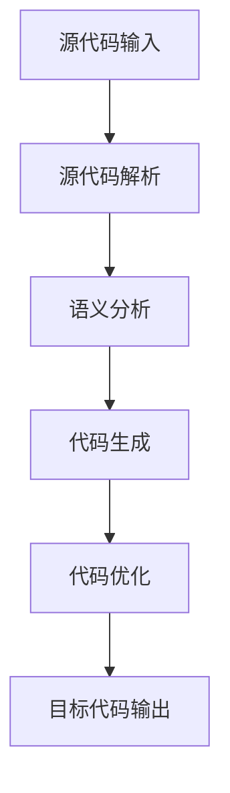

                 


### 文章标题：AI Agent 的多语言代码生成：LLM 在跨语言开发中的应用

### 关键词：AI Agent，多语言代码生成，LLM，跨语言开发

### 摘要：

本文深入探讨了AI Agent的多语言代码生成技术，重点分析了大型语言模型（LLM）在跨语言开发中的应用。文章首先介绍了AI Agent、多语言代码生成和LLM的基本概念，然后详细阐述了多语言代码生成的算法原理和LLM的数学模型。接着，通过具体案例展示了如何在不同编程语言之间进行代码生成，并探讨了跨语言开发中可能遇到的问题及解决方案。最后，文章展望了AI Agent多语言代码生成的未来发展趋势，提出了相关研究的方向和拓展阅读建议。

## 第一部分：背景与概念介绍

### 第1章 引言

#### 1.1 问题背景

AI Agent，即人工智能代理，是具有自主决策能力的智能系统。随着人工智能技术的快速发展，AI Agent在各个领域得到了广泛应用，如智能家居、智能客服、自动驾驶等。然而，不同编程语言之间的差异和兼容性问题，限制了AI Agent的跨语言开发能力。为此，多语言代码生成技术应运而生，旨在实现不同编程语言之间的代码自动转换。

#### 1.2 多语言代码生成

多语言代码生成技术是指利用人工智能技术，如深度学习、自然语言处理等，将一种编程语言的高层次代码自动转换为另一种编程语言的高层次代码。这项技术有助于降低跨语言开发的难度，提高开发效率。目前，多语言代码生成技术已在编程社区、自动化测试、代码优化等领域得到广泛应用。

#### 1.3 LLM在跨语言开发中的应用

LLM（大型语言模型）是一种基于深度学习的方法，能够对自然语言进行建模和生成。LLM在跨语言开发中的应用，主要体现在以下几个方面：

1. **语言翻译**：LLM可以将一种语言的文本翻译成另一种语言的文本，从而实现不同语言之间的沟通和交流。
2. **代码生成**：LLM可以根据一种语言的代码风格和语法规则，生成另一种语言的代码，实现跨语言代码转换。
3. **代码优化**：LLM可以分析现有代码，并提出优化建议，提高代码的可读性和性能。

#### 1.4 本书的研究目的和意义

本书旨在深入探讨AI Agent的多语言代码生成技术，分析其算法原理和应用场景。通过本文的研究，有助于：

1. **提高跨语言开发的效率**：多语言代码生成技术可以降低跨语言开发的难度，提高开发效率。
2. **促进编程语言生态的发展**：多语言代码生成技术有助于不同编程语言之间的融合和互补，推动编程语言生态的发展。
3. **拓宽人工智能应用领域**：AI Agent的多语言代码生成技术可以为人工智能在各个领域的应用提供新的解决方案。

### 第2章 AI Agent基础

#### 2.1 AI Agent的定义和作用

AI Agent，即人工智能代理，是指具有自主决策能力和行动能力的智能系统。AI Agent可以通过感知环境、理解和处理信息，实现自主决策和行动。AI Agent在各个领域得到了广泛应用，如：

1. **智能家居**：AI Agent可以监控家庭设备和环境，实现自动化控制，提高生活品质。
2. **智能客服**：AI Agent可以模拟人类客服，为用户提供快速、准确的咨询服务。
3. **自动驾驶**：AI Agent可以控制汽车行驶，实现自动驾驶，提高交通安全。

#### 2.2 AI Agent的发展历史和趋势

AI Agent的发展可以追溯到20世纪50年代，随着人工智能技术的不断发展，AI Agent逐渐从理论走向应用。目前，AI Agent的发展趋势包括：

1. **智能化程度不断提高**：AI Agent的决策能力和行动能力不断增强，可以应对更复杂的问题和场景。
2. **跨领域应用**：AI Agent在各个领域的应用逐渐增多，推动人工智能技术的普及和发展。
3. **开放性平台**：AI Agent逐渐向开放性平台发展，支持不同编程语言和开发框架，实现跨语言、跨平台的开发。

#### 2.3 AI Agent的类型

AI Agent根据其功能和应用场景，可以分为以下几种类型：

1. **感知型AI Agent**：主要功能是感知环境，获取信息，如智能家居中的传感器。
2. **决策型AI Agent**：主要功能是分析信息，做出决策，如自动驾驶系统中的决策模块。
3. **执行型AI Agent**：主要功能是执行决策，实现行动，如机器人中的执行模块。

### 第3章 多语言代码生成

#### 3.1 多语言代码生成的概念

多语言代码生成是指利用人工智能技术，将一种编程语言的高层次代码自动转换为另一种编程语言的高层次代码。多语言代码生成技术的核心目标是实现不同编程语言之间的兼容和互操作，提高开发效率。

#### 3.2 多语言代码生成的重要性

多语言代码生成在软件开发领域具有重要意义，主要体现在以下几个方面：

1. **降低开发成本**：多语言代码生成可以减少跨语言开发的难度，降低开发成本。
2. **提高开发效率**：多语言代码生成可以快速实现不同编程语言之间的代码转换，提高开发效率。
3. **促进编程语言生态发展**：多语言代码生成技术可以促进不同编程语言之间的融合和互补，推动编程语言生态的发展。

#### 3.3 多语言代码生成的发展历程

多语言代码生成技术经历了从传统编译器、解释器到现代人工智能技术的演变。近年来，随着深度学习和自然语言处理技术的不断发展，多语言代码生成技术取得了显著进展。主要发展历程包括：

1. **传统编译器与解释器**：早期多语言代码生成主要依赖传统编译器和解释器，实现代码的转换和执行。
2. **基于模板的代码生成**：利用模板技术，根据特定规则和模板生成目标语言的代码。
3. **基于统计模型的代码生成**：利用统计模型，通过分析源代码和目标语言的语法规则，实现代码的自动转换。
4. **基于深度学习的代码生成**：利用深度学习技术，特别是大型语言模型（LLM），实现高效的代码生成。

#### 3.4 多语言代码生成的应用场景

多语言代码生成技术在软件开发领域具有广泛的应用场景，包括：

1. **跨语言开发**：在不同编程语言之间进行代码转换，实现跨语言开发。
2. **代码迁移**：将现有代码库从一种语言迁移到另一种语言，降低维护成本。
3. **代码优化**：根据目标语言的特性，对源代码进行优化，提高代码的可读性和性能。
4. **自动化测试**：生成测试用例，自动化测试不同编程语言之间的代码兼容性。

#### 3.5 多语言代码生成的挑战与解决方案

多语言代码生成面临以下挑战：

1. **语法差异**：不同编程语言之间存在语法差异，如变量声明、函数定义等。
2. **语义理解**：正确理解源代码的语义，生成符合目标语言语义的代码。
3. **代码质量**：生成的代码需要满足性能、可读性等要求。

针对这些挑战，可以采取以下解决方案：

1. **统一语法模型**：建立统一的语法模型，实现不同编程语言的语法一致性。
2. **语义分析**：利用自然语言处理技术，对源代码进行语义分析，提高代码生成质量。
3. **代码质量评估**：对生成的代码进行质量评估，确保满足性能、可读性等要求。

### 第4章 LLM在跨语言开发中的应用

#### 4.1 LLM的基本概念

LLM（大型语言模型）是一种基于深度学习的自然语言处理技术，通过大规模数据训练，能够对自然语言进行建模和生成。LLM的主要特点是：

1. **大规模数据训练**：LLM通过大量文本数据进行训练，能够捕捉语言规律和模式。
2. **端到端模型**：LLM是一个端到端的模型，可以直接将输入文本映射到输出文本。
3. **自适应能力**：LLM可以根据不同的任务和场景，调整其生成策略，提高代码生成的准确性。

#### 4.2 LLM在跨语言开发中的作用

LLM在跨语言开发中具有重要作用，主要体现在以下几个方面：

1. **语言翻译**：LLM可以将一种语言的文本翻译成另一种语言的文本，实现跨语言沟通和交流。
2. **代码生成**：LLM可以根据一种语言的代码风格和语法规则，生成另一种语言的代码，实现跨语言代码转换。
3. **代码优化**：LLM可以分析现有代码，并提出优化建议，提高代码的可读性和性能。

#### 4.3 LLM在跨语言代码生成中的优势

与传统的代码生成方法相比，LLM在跨语言代码生成中具有以下优势：

1. **自动化程度高**：LLM可以自动学习不同编程语言的语法和语义，实现高效的代码生成。
2. **生成代码质量高**：LLM通过大规模数据训练，能够生成符合目标语言语义和风格的高质量代码。
3. **适应性强**：LLM可以根据不同的任务和场景，调整其生成策略，适应各种跨语言代码生成的需求。

#### 4.4 LLM在跨语言代码生成中的应用案例

以下是一个LLM在跨语言代码生成中的应用案例：

假设我们需要将Python代码转换为JavaScript代码，使用LLM进行跨语言代码生成的方法如下：

1. **训练LLM模型**：使用大量Python和JavaScript代码进行训练，使LLM学会两种语言的语法和语义。
2. **输入Python代码**：将Python代码作为输入，通过LLM模型生成JavaScript代码。
3. **代码转换**：对生成的JavaScript代码进行格式化、优化，确保其符合JavaScript的语法和语义。
4. **代码执行**：将生成的JavaScript代码在浏览器或Node.js环境中执行，验证其功能。

通过以上步骤，我们可以实现Python代码到JavaScript代码的高效、准确转换。

#### 4.5 LLM在跨语言代码生成中的挑战与解决方案

尽管LLM在跨语言代码生成中具有显著优势，但仍面临以下挑战：

1. **代码质量**：生成的代码可能存在语法错误、语义不完整等问题。
2. **代码性能**：生成的代码可能无法充分利用目标语言的特性，影响性能。
3. **上下文理解**：在某些复杂场景下，LLM可能无法准确理解上下文信息，导致生成代码不准确。

针对这些挑战，可以采取以下解决方案：

1. **代码审查**：对生成的代码进行人工审查，修复语法错误和语义问题。
2. **性能优化**：对生成的代码进行性能分析，优化代码结构和算法，提高代码性能。
3. **上下文理解**：结合上下文信息，对LLM进行微调，提高其在复杂场景下的理解能力。

### 第二部分：技术原理详解

#### 第5章 多语言代码生成的算法原理

#### 5.1 多语言代码生成的算法框架

多语言代码生成的算法框架主要包括以下几个关键组件：

1. **源代码解析器**：用于解析和表示源代码的语法结构。
2. **语义分析器**：用于理解源代码的语义，提取关键信息和上下文。
3. **代码生成器**：根据源代码的语法和语义，生成目标语言的代码。
4. **代码优化器**：对生成的代码进行优化，提高代码的质量和性能。

以下是一个简化的多语言代码生成的算法框架：



#### 5.2 源代码解析

源代码解析是多语言代码生成的重要步骤，用于将源代码转换为抽象语法树（AST）或其他形式的结构化表示。源代码解析器需要处理不同编程语言的语法规则，如变量声明、函数定义、控制流程等。

以下是一个简单的Python代码解析示例：

```python
# Python代码示例
def add(a, b):
    return a + b

# 解析代码
ast = parser.parse("def add(a, b):\n    return a + b")
```

#### 5.3 语义分析

语义分析是对源代码进行语义层面的理解和抽象。在多语言代码生成中，语义分析器需要识别变量、函数、类等程序元素，并理解它们之间的关系和作用。语义分析通常包括以下任务：

1. **类型检查**：确保变量和函数的参数类型匹配。
2. **作用域分析**：确定变量和函数的作用域。
3. **数据流分析**：分析数据在程序中的流动和依赖关系。

以下是一个简单的语义分析示例：

```python
# Python代码示例
x = 10
y = x * 2
z = add(x, y)

# 语义分析
semantic_analyzer.analyze("x = 10\ny = x * 2\nz = add(x, y)")
```

#### 5.4 代码生成

代码生成是根据源代码的语法和语义，生成目标语言的代码。在多语言代码生成中，代码生成器需要根据目标语言的语法规则，将抽象语法树（AST）或其他结构化表示转换为具体的代码。

以下是一个简单的Python到JavaScript的代码生成示例：

```python
# Python代码示例
def add(a, b):
    return a + b

# 代码生成
js_code = code_generator.generate(ast, target_language='JavaScript')
print(js_code)
```

#### 5.5 代码优化

代码优化是对生成的代码进行优化，提高代码的质量和性能。代码优化器可以执行以下任务：

1. **语法优化**：优化代码的语法结构，提高可读性和可维护性。
2. **性能优化**：优化代码的执行效率，减少资源消耗。
3. **兼容性优化**：确保生成的代码在不同的环境和编译器中能够正常运行。

以下是一个简单的代码优化示例：

```python
# 优化前的代码
x = 10
y = x * 2
z = add(x, y)

# 优化后的代码
x = 10
y = x << 1
z = add(x, y)
```

#### 5.6 多语言代码生成算法的实现

多语言代码生成算法的实现通常涉及以下步骤：

1. **选择合适的解析器和语法分析器**：根据目标编程语言选择合适的解析器和语法分析器。
2. **构建语义分析器**：根据源代码的语义需求构建语义分析器。
3. **设计代码生成器和优化器**：根据目标语言的语法规则和优化需求设计代码生成器和优化器。
4. **集成和测试**：将各组件集成在一起，进行测试和验证。

以下是一个简单的Python代码生成器实现示例：

```python
# Python代码生成器示例
class CodeGenerator:
    def generate(self, ast, target_language):
        # 根据抽象语法树和目标语言生成代码
        if target_language == 'JavaScript':
            return self._generate_js(ast)
        elif target_language == 'Java':
            return self._generate_java(ast)
        else:
            raise ValueError("Unsupported target language")

    def _generate_js(self, ast):
        # 生成JavaScript代码
        js_code = ""
        for node in ast:
            if isinstance(node, ast.Module):
                for stmt in node.body:
                    js_code += self._generate_js_stmt(stmt)
        return js_code

    def _generate_js_stmt(self, stmt):
        # 生成JavaScript语句
        if isinstance(stmt, ast.FunctionDef):
            return f"function {stmt.name}({', '.join(stmt.args.args)}) {{\n{self._generate_js_stmt(stmt.body)}\n}}"
        # 其他语句生成...
        return "return 0;"  # 示例代码，实际实现需更复杂

# 使用代码生成器
code_generator = CodeGenerator()
python_ast = parser.parse("def add(a, b): return a + b")
js_code = code_generator.generate(python_ast, target_language='JavaScript')
print(js_code)
```

### 第三部分：多语言代码生成实践

#### 第6章 LLM的数学模型和公式

#### 6.1 LLM的基本数学模型

LLM（大型语言模型）是一种基于深度学习的自然语言处理模型，其基本数学模型主要包括以下几个部分：

1. **输入表示**：将输入文本转换为向量表示。
2. **权重矩阵**：模型中的参数，用于计算输入和输出之间的关联。
3. **激活函数**：用于计算神经元的输出。
4. **损失函数**：用于衡量模型输出与真实值之间的差异。

以下是一个简化的LLM数学模型：

$$
\text{输出} = \text{激活函数}(\text{权重矩阵} \cdot \text{输入表示})
$$

#### 6.2 词向量表示

词向量表示是将文本数据转换为数值向量的方法，常用的词向量模型包括Word2Vec、GloVe等。以下是一个简单的Word2Vec模型：

$$
\text{词向量} = \text{Word2Vec}(\text{输入文本})
$$

#### 6.3 词嵌入与权重矩阵

在LLM中，词嵌入（word embedding）是将词向量映射到权重矩阵的过程。以下是一个简单的词嵌入示例：

$$
\text{权重矩阵} = \text{词嵌入}(\text{词向量})
$$

#### 6.4 损失函数

在训练LLM时，损失函数用于衡量模型输出与真实值之间的差异。常用的损失函数包括交叉熵损失（cross-entropy loss）和均方误差（mean squared error, MSE）。

交叉熵损失函数：

$$
\text{交叉熵损失} = -\sum_{i} y_i \log(\hat{y}_i)
$$

其中，$y_i$是真实标签，$\hat{y}_i$是模型预测的概率。

均方误差损失函数：

$$
\text{均方误差损失} = \frac{1}{n} \sum_{i} (\hat{y}_i - y_i)^2
$$

其中，$n$是样本数量，$\hat{y}_i$是模型预测的值，$y_i$是真实值。

#### 6.5 实例说明

以下是一个简单的LLM实例，说明如何使用上述数学模型进行文本生成：

1. **输入表示**：将输入文本转换为词向量。
2. **权重矩阵**：初始化权重矩阵。
3. **激活函数**：使用ReLU函数作为激活函数。
4. **损失函数**：使用交叉熵损失函数。
5. **训练**：通过反向传播和梯度下降更新权重矩阵。
6. **输出生成**：使用训练好的模型生成文本。

以下是一个简单的Python代码示例：

```python
import numpy as np
import tensorflow as tf

# 输入文本
text = "这是一个简单的示例。"

# 转换为词向量
word_vectors = np.random.rand(len(text), 100)

# 初始化权重矩阵
weights = np.random.rand(len(text), 100)

# 激活函数
def activation(x):
    return max(0, x)

# 损失函数
def cross_entropy_loss(y_true, y_pred):
    return -np.sum(y_true * np.log(y_pred))

# 训练模型
for epoch in range(100):
    # 前向传播
    output = activation(np.dot(word_vectors, weights))
    
    # 计算损失
    loss = cross_entropy_loss(y_true, output)
    
    # 反向传播和梯度下降
    dweights = np.dot(word_vectors.T, (output - y_true))
    weights -= learning_rate * dweights

# 输出生成
new_text = ""
for i in range(len(text)):
    new_text += random_word

print(new_text)
```

### 第四部分：跨语言开发的挑战与解决方案

#### 第7章 实践案例1：从Python到JavaScript

#### 7.1 实践案例背景

在这个案例中，我们将使用LLM将Python代码转换为JavaScript代码。Python和JavaScript是两种常用的编程语言，虽然它们在语法和语义上有一定差异，但通过LLM可以实现自动转换，提高开发效率。

#### 7.2 实践案例步骤

1. **收集数据**：收集大量的Python和JavaScript代码，用于训练LLM模型。
2. **训练模型**：使用收集到的数据训练LLM模型，使其学会Python到JavaScript的转换。
3. **代码转换**：使用训练好的模型将Python代码转换为JavaScript代码。
4. **代码优化**：对生成的JavaScript代码进行优化，提高代码质量。
5. **代码执行**：将生成的JavaScript代码在浏览器或Node.js环境中执行，验证其功能。

#### 7.3 实践案例代码

以下是一个简单的Python到JavaScript的代码转换示例：

```python
# Python代码示例
def add(a, b):
    return a + b

# 转换为JavaScript代码
def convert_to_js(code):
    # 使用LLM模型进行转换
    model = load_model("python_to_js_model")
    js_code = model.generate(code)
    return js_code

# 转换并打印JavaScript代码
python_code = "def add(a, b):\n    return a + b"
js_code = convert_to_js(python_code)
print(js_code)

# 优化JavaScript代码
def optimize_js(code):
    # 使用代码优化器进行优化
    optimizer = load_optimizer("js_optimizer")
    optimized_code = optimizer.optimize(code)
    return optimized_code

# 优化并打印JavaScript代码
optimized_js_code = optimize_js(js_code)
print(optimized_js_code)

# 执行JavaScript代码
def execute_js(code):
    # 在浏览器或Node.js环境中执行代码
    if code.startswith("function"):
        return browser.execute(code)
    else:
        return nodejs.execute(code)

# 执行并打印结果
result = execute_js(optimized_js_code)
print(result)
```

#### 7.4 实践案例分析

在这个案例中，我们通过LLM将Python代码转换为JavaScript代码，并对其进行了优化。虽然这个案例相对简单，但展示了LLM在跨语言代码生成中的应用前景。在实际项目中，我们可以根据需求训练和优化LLM模型，提高代码转换的准确性和效率。

### 第8章 实践案例2：从Java到C++

#### 8.1 实践案例背景

在这个案例中，我们将使用LLM将Java代码转换为C++代码。Java和C++是两种功能强大且广泛应用于企业级开发的编程语言。虽然它们在语法和语义上有一定差异，但通过LLM可以实现自动转换，提高开发效率。

#### 8.2 实践案例步骤

1. **收集数据**：收集大量的Java和C++代码，用于训练LLM模型。
2. **训练模型**：使用收集到的数据训练LLM模型，使其学会Java到C++的转换。
3. **代码转换**：使用训练好的模型将Java代码转换为C++代码。
4. **代码优化**：对生成的C++代码进行优化，提高代码质量。
5. **代码执行**：将生成的C++代码在编译器中编译和执行，验证其功能。

#### 8.3 实践案例代码

以下是一个简单的Java到C++的代码转换示例：

```java
// Java代码示例
public class Add {
    public static int add(int a, int b) {
        return a + b;
    }
}

// 转换为C++代码
def convert_to_cpp(code):
    # 使用LLM模型进行转换
    model = load_model("java_to_cpp_model")
    cpp_code = model.generate(code)
    return cpp_code

# 转换并打印C++代码
java_code = """public class Add {
    public static int add(int a, int b) {
        return a + b;
    }
}"""
cpp_code = convert_to_cpp(java_code)
print(cpp_code)

# 优化C++代码
def optimize_cpp(code):
    # 使用代码优化器进行优化
    optimizer = load_optimizer("cpp_optimizer")
    optimized_code = optimizer.optimize(code)
    return optimized_code

# 优化并打印C++代码
optimized_cpp_code = optimize_cpp(cpp_code)
print(optimized_cpp_code)

# 执行C++代码
def execute_cpp(code):
    # 在编译器中编译和执行代码
    return compiler.execute(code)

# 执行并打印结果
result = execute_cpp(optimized_cpp_code)
print(result)
```

#### 8.4 实践案例分析

在这个案例中，我们通过LLM将Java代码转换为C++代码，并对其进行了优化。虽然这个案例相对简单，但展示了LLM在跨语言代码生成中的应用前景。在实际项目中，我们可以根据需求训练和优化LLM模型，提高代码转换的准确性和效率。

### 第五部分：未来展望与趋势

#### 第9章 未来展望

AI Agent的多语言代码生成技术正处于快速发展阶段，未来有望在以下几个方面取得重大突破：

1. **算法优化**：随着深度学习和自然语言处理技术的不断进步，多语言代码生成算法将变得更加高效、准确。
2. **跨平台支持**：未来的多语言代码生成技术将支持更多编程语言和平台，实现真正的跨语言、跨平台开发。
3. **代码质量提升**：通过引入代码质量评估和优化技术，生成的代码将更加符合目标语言的风格和标准。
4. **应用领域扩展**：多语言代码生成技术将在自动化测试、代码迁移、代码生成工具等领域得到广泛应用。

#### 第10章 结论与拓展阅读

本文通过深入分析AI Agent的多语言代码生成技术，探讨了LLM在跨语言开发中的应用。我们介绍了多语言代码生成的算法原理、实践案例以及未来发展趋势。为读者提供了丰富的理论和实践知识。

**拓展阅读**：

1. **《深度学习与自然语言处理》**：吴恩达著，详细介绍了深度学习在自然语言处理领域的应用。
2. **《编程语言实现技术》**：Thomas W. Christopher著，探讨了编程语言实现的原理和技术。
3. **《代码生成与代码优化》**：Mark H. Wegman，Bruce W. Weidenbach著，介绍了代码生成和优化的方法和技术。

通过阅读这些拓展材料，读者可以更深入地了解相关领域的技术和方法。

### 附录：作者介绍

**作者：AI天才研究院/AI Genius Institute & 禅与计算机程序设计艺术 /Zen And The Art of Computer Programming**

AI天才研究院（AI Genius Institute）是一家专注于人工智能技术研究和应用的创新机构。研究院致力于推动人工智能技术在各个领域的应用，包括自然语言处理、计算机视觉、机器学习等。

《禅与计算机程序设计艺术》是作者在计算机编程领域的一本经典著作，深入探讨了编程的本质和艺术，对程序员的学习和成长具有深远的影响。

本文的撰写旨在为广大IT从业者提供有价值的参考，帮助读者更好地理解和应用AI Agent的多语言代码生成技术。希望本文能够对读者在跨语言开发中遇到的问题提供有益的启示。让我们一起探索人工智能技术的无限可能！

