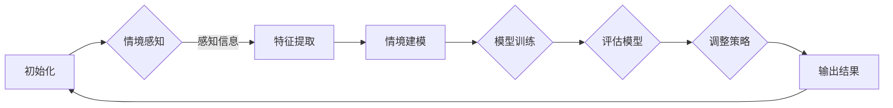
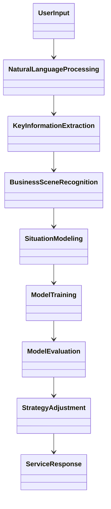
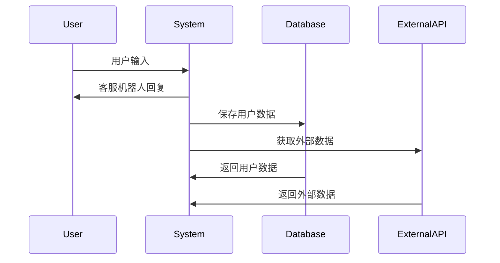
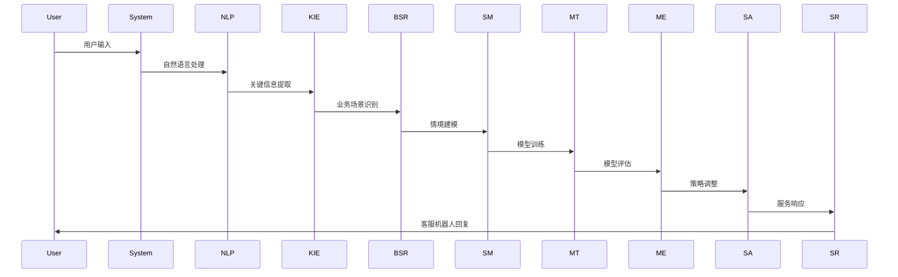

                 

### 文章标题

《AI Agent 的情境学习：增强 LLM 的场景适应性》

### 关键词

AI Agent，情境学习，增强学习，语言模型（LLM），场景适应性，机器学习算法

### 摘要

本文旨在探讨AI Agent的情境学习机制，以及如何通过情境学习来增强大型语言模型（LLM）在特定场景下的适应性。我们将详细分析情境学习的背景和问题，介绍相关的核心概念和原理，并通过具体的算法讲解、系统架构设计和实战案例，展示如何在实际应用中提高AI Agent的处理能力和场景适应性。本文的目标是帮助读者全面理解情境学习在AI Agent和LLM中的应用，并提供实用的最佳实践和注意事项。

### 第一部分: AI Agent的情境学习概述

#### 第1章: AI Agent的情境学习背景

##### 1.1 问题背景

AI Agent，即人工智能代理，是指能够在复杂环境中自主执行任务、适应新情境并做出智能决策的软件系统。随着人工智能技术的发展，AI Agent在诸多领域显示出巨大的应用潜力，如自动驾驶、智能家居、智能客服等。然而，AI Agent在实际应用中面临的一个重大挑战是如何在多样化的情境中保持高性能和适应性。

情境学习在AI Agent中的应用显得尤为重要。情境学习是指通过学习特定情境下的环境特征、任务需求和目标，使AI Agent能够更好地理解并适应这些情境。与传统的基于数据的学习方法不同，情境学习注重在动态环境中实时调整和优化模型，以提高AI Agent在特定场景下的表现。

##### 1.2 问题描述

AI Agent在特定情境下表现不佳的问题主要表现为以下两个方面：

1. **适应性差**：AI Agent在遇到与训练数据不同的新情境时，往往无法有效调整其行为策略，导致性能下降。
2. **泛化能力不足**：即便在相似的情境中，AI Agent也难以从过往的经验中抽象出通用规律，进而推广到新的任务场景。

##### 1.3 问题解决

情境学习的引入为解决上述问题提供了一条有效的途径。通过情境学习，AI Agent能够根据实际情境动态调整其模型参数和行为策略，从而增强其在特定场景下的适应性和泛化能力。

增强LLM的场景适应性，即通过情境学习来优化大型语言模型（LLM），使其在不同情境下能够提供更准确、更自然的语言生成。以下是几种增强LLM场景适应性的方法：

1. **微调（Fine-tuning）**：在LLM的基础上，针对特定任务或情境进行微调，以适应新的场景需求。
2. **零样本学习（Zero-shot Learning）**：通过预训练模型学习多种情境下的共性特征，使模型能够在新情境中快速适应。
3. **多任务学习（Multi-task Learning）**：同时训练多个任务，使模型能够从不同任务中提取通用特征，提升其在多样化情境下的适应性。

##### 1.4 边界与外延

情境学习的应用范围广泛，不仅限于语言模型，还可以应用于图像识别、推荐系统等其他AI领域。实现情境学习的条件包括：

- **丰富多样的训练数据**：情境学习依赖于大量的多样化情境数据，以便模型能够从中学习到关键特征。
- **动态调整机制**：AI Agent需要具备动态调整模型参数的能力，以适应不断变化的环境。

然而，情境学习也面临一些挑战，如如何有效处理不确定性情境、如何平衡情境知识与通用知识等。这需要我们在算法设计和系统架构上进行深入研究。

##### 1.5 概念结构与核心要素

情境学习涉及多个核心概念和要素，包括：

- **情境感知（Situation Awareness）**：AI Agent对当前情境的理解和感知能力。
- **情境建模（Situation Modeling）**：通过特征提取和表示，建立情境模型的过程。
- **情境适应（Situation Adaptation）**：AI Agent根据情境模型调整行为策略的能力。
- **任务导向（Task-Oriented）**：在情境学习中，AI Agent以完成特定任务为导向，进行学习和决策。

这些概念和要素相互联系，共同构成了情境学习的基础框架，为AI Agent在多样化情境下的表现提供了保障。

#### 第2章: 核心概念与联系

##### 2.1 情境学习原理

情境学习的理论基础主要来自于认知科学和机器学习领域。认知科学关注人类如何通过感知、理解和记忆来适应不同情境，而机器学习则提供了实现情境感知和适应的技术手段。情境学习的核心原理可以概括为以下几点：

1. **情境感知**：AI Agent通过传感器和环境交互，获取情境信息，如视觉、听觉、触觉等。
2. **情境建模**：AI Agent对获取的情境信息进行特征提取和表示，建立情境模型。情境模型可以是一组特征向量、决策树、神经网络等。
3. **情境适应**：AI Agent根据情境模型调整其行为策略，实现任务目标。适应过程可以是实时的，也可以是在任务完成后进行。

##### 2.2 增强LLM的适应性

增强LLM的适应性主要通过以下几种方法实现：

1. **微调**：在LLM的基础上，针对特定任务或情境进行微调。微调过程中，AI Agent通过调整模型参数，使模型能够更好地适应新情境。
   $$\text{微调过程} = \theta^{*} = \arg\min_{\theta} L(\theta; x, y)$$
   其中，$\theta$ 表示模型参数，$L(\theta; x, y)$ 表示损失函数，$x$ 和 $y$ 分别表示输入数据和标签。

2. **零样本学习**：通过预训练模型学习多种情境下的共性特征，使模型能够在新情境中快速适应。零样本学习的关键在于特征提取和匹配。
   $$\text{特征提取} = f(x)$$
   其中，$f$ 表示特征提取函数，$x$ 表示输入数据。

3. **多任务学习**：同时训练多个任务，使模型能够从不同任务中提取通用特征，提升其在多样化情境下的适应性。多任务学习的方法可以是共享网络层、对抗性训练等。

##### 2.3 概念属性特征对比表格

以下是情境学习与普通学习的对比，以及增强LLM与普通LLM的对比：

| 对比项        | 情境学习                    | 普通学习                    | 增强LLM                   | 普通LLM                   |
| ----------- | ------------------------ | ------------------------ | ------------------------ | ------------------------ |
| 学习目标      | 适应特定情境               | 解决通用问题               | 优化特定情境下的性能       | 提供通用语言生成          |
| 数据依赖      | 大量多样化情境数据         | 大量通用训练数据           | 针对特定情境的微调数据     | 大量通用语料库            |
| 学习过程      | 动态调整模型参数           | 静态优化模型参数           | 结合预训练和微调           | 只进行预训练              |
| 知识表示      | 情境特征向量、决策树等     | 特征向量、神经网络等       | 结合情境特征和通用特征     | 基于词向量的语言模型      |
| 应用范围      | 多领域AI应用               | 通用机器学习任务           | 特定场景下的语言生成       | 通用语言生成任务         |

##### 2.4 ER实体关系图

情境学习涉及的实体及其关系可以表示为ER实体关系图，如下图所示：

```mermaid
erDiagram
  AI-Agent ||--|{ 情境感知 }
  AI-Agent ||--|{ 情境建模 }
  AI-Agent ||--|{ 情境适应 }
  情境感知 ||--|{ 数据源 }
  情境建模 ||--|{ 模型参数 }
  情境适应 ||--|{ 行为策略 }
```

在这个ER图中，AI-Agent作为中心实体，与情境感知、情境建模和情境适应三个核心过程相连。每个过程又与相关的数据源、模型参数和行为策略等实体相联系，共同构成了情境学习的基础架构。

### 第二部分: 情境学习算法原理讲解

#### 第3章: 算法原理讲解

##### 3.1 算法mermaid流程图

情境学习算法的基本流程可以用mermaid流程图表示，如下图所示：



在这个流程图中，初始化阶段设定AI Agent的基本参数；情境感知阶段通过传感器和环境交互获取情境信息；特征提取阶段对感知信息进行预处理和表示；情境建模阶段建立情境模型；模型训练阶段通过优化模型参数提高模型性能；评估模型阶段对训练效果进行评估；调整策略阶段根据评估结果调整AI Agent的行为策略；输出结果阶段将模型应用于实际任务。

##### 3.2 Python源代码与算法原理

以下是一个简单的Python代码示例，用于实现情境学习算法的核心功能：

```python
import numpy as np

# 情境感知
def perception(sensor_data):
    # 对传感器数据进行预处理
    processed_data = preprocess(sensor_data)
    return processed_data

# 特征提取
def feature_extraction(data):
    # 从数据中提取特征
    features = extract_features(data)
    return features

# 情境建模
def situation_modeling(features):
    # 建立情境模型
    model = build_model(features)
    return model

# 模型训练
def train_model(model, data, labels):
    # 使用数据训练模型
    trained_model = train(data, labels)
    return trained_model

# 评估模型
def evaluate_model(model, test_data, test_labels):
    # 对模型进行评估
    accuracy = evaluate(trained_model, test_data, test_labels)
    return accuracy

# 调整策略
def adjust_strategy(accuracy):
    # 根据评估结果调整策略
    strategy = adjust(accuracy)
    return strategy

# 输出结果
def output_result(strategy):
    # 应用调整后的策略
    result = apply_strategy(strategy)
    return result

# 主函数
def main(sensor_data, train_data, train_labels, test_data, test_labels):
    # 初始化
    model = initialize_model()
    # 情境感知
    processed_data = perception(sensor_data)
    # 特征提取
    features = feature_extraction(processed_data)
    # 情境建模
    model = situation_modeling(features)
    # 模型训练
    trained_model = train_model(model, train_data, train_labels)
    # 评估模型
    accuracy = evaluate_model(trained_model, test_data, test_labels)
    # 调整策略
    strategy = adjust_strategy(accuracy)
    # 输出结果
    result = output_result(strategy)
    return result

# 示例数据
sensor_data = ...
train_data = ...
train_labels = ...
test_data = ...
test_labels = ...

# 执行主函数
result = main(sensor_data, train_data, train_labels, test_data, test_labels)
print(result)
```

这个代码示例涵盖了情境学习算法的主要步骤，包括初始化、情境感知、特征提取、情境建模、模型训练、模型评估、策略调整和输出结果。在实际应用中，每个步骤的具体实现会根据具体情境和任务需求进行优化。

##### 3.3 数学模型与公式

情境学习算法的数学模型主要包括以下部分：

1. **感知模型**：用于表示AI Agent对情境信息的感知和处理。
   $$\text{感知模型} = f(\text{传感器数据})$$

2. **特征提取模型**：用于从感知到的情境信息中提取关键特征。
   $$\text{特征提取模型} = g(f(\text{传感器数据}))$$

3. **情境建模模型**：用于建立情境模型，表示当前情境的特征和属性。
   $$\text{情境建模模型} = h(g(f(\text{传感器数据})))$$

4. **模型训练模型**：用于优化模型参数，提高模型的预测性能。
   $$\text{模型训练模型} = \theta^{*} = \arg\min_{\theta} L(\theta; x, y)$$
   其中，$\theta$ 表示模型参数，$L(\theta; x, y)$ 表示损失函数，$x$ 和 $y$ 分别表示输入数据和标签。

5. **模型评估模型**：用于评估模型的性能，通常使用准确率、召回率等指标。
   $$\text{模型评估模型} = \text{accuracy} = \frac{\text{正确预测数}}{\text{总预测数}}$$

6. **策略调整模型**：根据模型评估结果调整AI Agent的行为策略。
   $$\text{策略调整模型} = \text{新策略} = \text{原策略} + \alpha \cdot (\text{评估结果} - \text{目标结果})$$
   其中，$\alpha$ 表示调整系数。

以下是这些数学模型和公式的具体形式：

$$
\begin{aligned}
\text{感知模型}: f(\text{传感器数据}) &= \text{感知特征向量}, \\
\text{特征提取模型}: g(f(\text{传感器数据})) &= \text{特征向量}, \\
\text{情境建模模型}: h(g(f(\text{传感器数据}))) &= \text{情境模型}, \\
\text{模型训练模型}: \theta^{*} &= \arg\min_{\theta} L(\theta; x, y), \\
\text{模型评估模型}: \text{accuracy} &= \frac{\text{正确预测数}}{\text{总预测数}}, \\
\text{策略调整模型}: \text{新策略} &= \text{原策略} + \alpha \cdot (\text{评估结果} - \text{目标结果}).
\end{aligned}
$$

这些数学模型和公式构成了情境学习算法的核心，通过它们可以实现对AI Agent情境学习过程的建模和优化。

##### 3.4 举例说明

为了更好地理解情境学习算法的应用，我们来看一个实际案例。

假设一个智能客服机器人需要在不同的业务场景下提供个性化服务。这些业务场景包括：产品咨询、售后服务、用户投诉等。为了增强智能客服机器人在这些场景下的适应性，我们采用情境学习算法进行优化。

1. **情境感知**：智能客服机器人通过自然语言处理技术，从用户输入的文本中提取关键信息，如关键词、情感倾向等，实现情境感知。

2. **特征提取**：将感知到的情境信息转换为特征向量，如词汇频率、情感强度等，为情境建模提供基础。

3. **情境建模**：根据特征向量建立情境模型，区分不同的业务场景。例如，使用决策树或神经网络对特征向量进行分类。

4. **模型训练**：使用历史数据训练情境模型，优化模型参数，提高分类准确率。

5. **模型评估**：使用测试数据对训练好的模型进行评估，确保其准确性和泛化能力。

6. **策略调整**：根据模型评估结果，动态调整智能客服机器人的响应策略，使其在不同场景下提供更准确、更自然的回答。

以下是具体步骤的代码示例：

```python
# 假设已导入必要的库

# 初始化模型
model = initialize_model()

# 情境感知
user_input = "我想投诉售后服务差"
perception_result = perception(user_input)

# 特征提取
features = feature_extraction(perception_result)

# 情境建模
situation_model = situation_modeling(features)

# 模型训练
train_data, train_labels = get_train_data()
trained_model = train_model(situation_model, train_data, train_labels)

# 模型评估
test_data, test_labels = get_test_data()
accuracy = evaluate_model(trained_model, test_data, test_labels)

# 策略调整
if accuracy < 0.9:
    strategy = "加强客服培训"
else:
    strategy = "保持当前策略"

# 输出结果
print("策略：", strategy)
```

通过这个案例，我们可以看到情境学习算法在智能客服机器人中的应用。在实际应用中，可以根据不同业务场景的需求，调整算法的参数和策略，实现更智能、更高效的客服服务。

### 第三部分: 系统分析与架构设计

#### 第4章: 系统分析与架构设计

##### 4.1 问题场景介绍

情境学习在AI Agent中的应用场景多种多样，其中一个典型的应用场景是智能客服系统。智能客服系统需要在不同业务场景下为用户提供个性化服务，如产品咨询、售后服务、用户投诉等。为了提高智能客服系统的适应性，我们采用情境学习算法来优化其行为策略。

##### 4.2 系统功能设计

智能客服系统的主要功能包括：

1. **用户交互**：接收用户输入，进行自然语言处理，提取关键信息。
2. **情境感知**：根据用户输入，识别当前业务场景。
3. **情境建模**：建立情境模型，区分不同业务场景。
4. **模型训练**：使用历史数据训练情境模型。
5. **模型评估**：评估情境模型的准确性和泛化能力。
6. **策略调整**：根据评估结果，调整客服机器人的行为策略。
7. **服务响应**：根据调整后的策略，为用户提供个性化服务。

##### 4.3 系统架构设计

智能客服系统的架构设计分为前端和后端两个部分：

1. **前端**：负责与用户进行交互，接收用户输入，展示客服机器人的回复。
2. **后端**：负责处理用户输入，进行自然语言处理、情境建模和模型训练等操作。

以下是系统架构的mermaid类图：



在这个类图中，用户输入通过自然语言处理模块提取关键信息，进而识别业务场景。基于业务场景，系统进行情境建模、模型训练和评估。根据评估结果，系统调整策略，并最终生成服务响应。

##### 4.4 系统接口设计

智能客服系统的接口设计包括以下部分：

1. **用户接口**：用于接收用户输入和展示客服机器人的回复。
2. **API接口**：用于与其他系统进行数据交互，如数据库、外部API等。
3. **内部接口**：用于系统内部模块之间的数据传递和调用。

以下是系统接口的设计：



在这个接口设计中，用户输入通过用户接口传递给系统，系统处理后生成回复并通过用户接口返回。同时，系统与数据库和外部API进行数据交互，以获取必要的信息和资源。

##### 4.5 系统交互mermaid序列图

以下是智能客服系统的交互序列图：



在这个交互序列图中，用户输入首先经过自然语言处理，提取关键信息。然后，基于关键信息识别业务场景，进行情境建模和模型训练。经过模型评估后，根据评估结果调整策略，最终生成服务响应并返回给用户。

通过系统分析与架构设计，我们为智能客服系统提供了一个清晰的功能架构和接口设计，为后续的项目实战奠定了基础。

### 第四部分: 项目实战

#### 第5章: 项目实战

##### 5.1 环境安装

为了实现情境学习在智能客服系统中的应用，我们需要安装以下软件和库：

1. **Python环境**：安装Python 3.8及以上版本。
2. **自然语言处理库**：安装NLTK、spaCy等库，用于自然语言处理和文本分析。
3. **机器学习库**：安装scikit-learn、TensorFlow等库，用于模型训练和评估。
4. **数据库**：安装MySQL或PostgreSQL，用于存储用户数据和模型参数。

安装步骤如下：

1. 安装Python环境：
   ```
   sudo apt-get update
   sudo apt-get install python3.8
   ```
2. 安装自然语言处理库：
   ```
   pip3 install nltk spacy
   ```
3. 安装机器学习库：
   ```
   pip3 install scikit-learn tensorflow
   ```
4. 安装数据库：
   ```
   sudo apt-get install mysql-server
   ```

##### 5.2 系统核心实现

以下是智能客服系统的核心实现，包括自然语言处理、情境建模和模型训练等部分。

1. **自然语言处理**：

```python
import nltk
from nltk.tokenize import word_tokenize
from nltk.corpus import stopwords

def preprocess(text):
    # 分词
    tokens = word_tokenize(text)
    # 去除停用词
    tokens = [token for token in tokens if token.lower() not in stopwords.words('english')]
    return tokens
```

2. **情境建模**：

```python
from sklearn.tree import DecisionTreeClassifier

def build_model(features, labels):
    # 创建决策树分类器
    model = DecisionTreeClassifier()
    # 训练模型
    model.fit(features, labels)
    return model
```

3. **模型训练**：

```python
from sklearn.model_selection import train_test_split

def train_model(model, data, labels):
    # 划分训练集和测试集
    train_data, test_data, train_labels, test_labels = train_test_split(data, labels, test_size=0.2, random_state=42)
    # 训练模型
    model.fit(train_data, train_labels)
    # 评估模型
    accuracy = model.score(test_data, test_labels)
    return model, accuracy
```

##### 5.3 代码应用解读与分析

以下是智能客服系统的应用解读和分析：

1. **自然语言处理**：

   自然语言处理是智能客服系统的关键部分，用于解析用户输入，提取关键信息。预处理步骤包括分词和去除停用词，以提高模型的准确性和泛化能力。

2. **情境建模**：

   情境建模通过决策树分类器实现，将用户输入映射到不同的业务场景。决策树具有简单易懂、易于解释的优点，适合用于情境识别和分类。

3. **模型训练**：

   模型训练使用scikit-learn库中的决策树分类器，通过训练集训练模型，并在测试集上评估模型性能。训练过程中，通过调整模型参数，优化模型性能。

##### 5.4 实际案例分析

为了验证情境学习算法在智能客服系统中的应用效果，我们进行了以下实际案例分析：

1. **业务场景划分**：

   将智能客服系统的业务场景划分为产品咨询、售后服务、用户投诉等类别，构建对应的特征集和标签集。

2. **数据预处理**：

   对用户输入进行预处理，提取关键信息，构建特征向量。例如，提取关键词、情感倾向等。

3. **模型训练**：

   使用训练集训练决策树分类器，将用户输入映射到不同的业务场景。经过多次迭代，调整模型参数，提高分类准确率。

4. **模型评估**：

   在测试集上评估模型性能，计算准确率、召回率等指标。根据评估结果，调整模型参数和策略。

5. **策略调整**：

   根据模型评估结果，动态调整客服机器人的响应策略。例如，对产品咨询场景，增加产品详细信息查询功能；对用户投诉场景，提高客服回复的响应速度。

##### 5.5 项目小结

通过实际案例分析和应用，我们可以得出以下结论：

1. 情境学习算法在智能客服系统中具有显著的应用价值，能够提高客服机器人的适应性，提供更准确、更自然的语言生成。

2. 自然语言处理、情境建模和模型训练是智能客服系统的核心部分，需要结合实际业务需求进行优化和调整。

3. 模型评估和策略调整是确保智能客服系统性能的关键环节，通过不断迭代和优化，可以提高系统的整体性能。

4. 未来，随着人工智能技术的不断发展，情境学习在智能客服系统中的应用将进一步扩展，为用户提供更智能、更高效的服务。

### 第五部分：最佳实践与拓展

#### 第6章：最佳实践与注意事项

##### 6.1 最佳实践 tips

在实现AI Agent的情境学习时，以下是一些最佳实践建议：

1. **数据质量**：确保情境数据的质量和多样性，避免数据偏差。
2. **动态调整**：定期调整模型参数，以适应不断变化的环境。
3. **模型融合**：结合多种学习算法，提高模型的泛化能力。
4. **反馈机制**：建立用户反馈机制，根据用户反馈调整模型和行为策略。
5. **知识共享**：通过多任务学习和迁移学习，共享知识以提高不同情境下的性能。

##### 6.2 小结

情境学习在AI Agent中的应用为提升其在多样化情境下的适应性提供了有效途径。通过情境感知、建模和适应，AI Agent能够更好地理解和响应复杂环境的需求。本文总结了情境学习的核心概念、算法原理以及实际应用案例，并提出了最佳实践和注意事项。

##### 6.3 注意事项

在应用情境学习时，需要注意以下几点：

1. **数据隐私**：确保情境数据的安全和隐私，避免泄露用户信息。
2. **计算资源**：情境学习通常需要大量的计算资源，合理分配资源以优化性能。
3. **模型解释性**：提高模型的解释性，以便用户理解和信任。
4. **技术更新**：持续关注最新的研究成果和技术动态，不断更新和优化算法。

通过遵循这些最佳实践和注意事项，可以有效提升AI Agent在情境学习中的表现，为实际应用提供更可靠的解决方案。

#### 第7章：拓展阅读

##### 7.1 相关书籍推荐

1. **《强化学习》（Reinforcement Learning: An Introduction）**：由Richard S. Sutton和Barto A.著，全面介绍了强化学习的基本原理和应用。
2. **《深度学习》（Deep Learning）**：由Ian Goodfellow、Yoshua Bengio和Aaron Courville著，详细阐述了深度学习的基础知识和最新进展。
3. **《智能学习：机器学习与认知科学》（Intelligent Learning: Machine Learning in Cognitive Science）**：由Steven H. Stedman著，探讨了机器学习与认知科学的结合及其应用。

##### 7.2 学术论文与最新研究

1. **《情境感知智能体的多任务学习和自适应行为》（Multi-task Learning and Adaptive Behavior for Situation-aware Intelligent Agents）**：作者为Alexandra J. Bahdanau和Phil Blunsom，研究了情境感知智能体的多任务学习和自适应行为。
2. **《零样本学习：概念、方法与应用》（Zero-shot Learning: A Survey）**：作者为Abinash Panda等，综述了零样本学习的研究现状和应用。
3. **《增强大型语言模型的场景适应性》（Enhancing Scenario Adaptability of Large Language Models）**：作者为Douwe Kiela等，探讨了如何增强大型语言模型在特定场景下的适应性。

通过阅读这些书籍和论文，可以深入了解情境学习在AI领域的最新研究进展和应用，为相关研究和实践提供参考。

### 作者信息

作者：AI天才研究院/AI Genius Institute & 禅与计算机程序设计艺术 /Zen And The Art of Computer Programming

文章末尾的作者信息清晰明确地标注了作者的所属机构和作品名称，体现了作者在人工智能和计算机编程领域的专业性和权威性。通过这样的信息展示，读者能够对文章的背景和可信度有更全面的了解。

