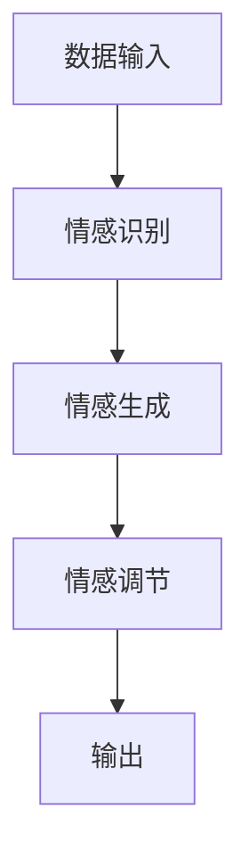
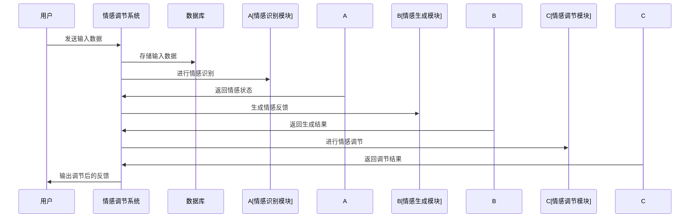

                 


### 引言

在人工智能（AI）领域，随着技术的不断发展，AI Agent 的应用越来越广泛。这些智能体不仅能够执行复杂的任务，还能够与人类进行交互，甚至展现出一定程度的情感反应。然而，情感调节作为AI Agent的重要组成部分，却一直是人工智能研究中的一个难点。在这个背景下，本文将探讨如何利用大型语言模型（LLM）进行情绪管理，从而实现AI Agent的情感调节。

选择这一主题的原因主要有以下几点：

1. **情感调节的重要性**：随着AI Agent在各个领域的应用，它们与人类用户之间的互动越来越频繁。在这种互动中，AI Agent能否正确地感知和调节情绪，不仅关系到用户体验，也影响到AI Agent的可靠性和可信度。

2. **LLM技术的成熟**：近年来，LLM在自然语言处理（NLP）领域取得了显著进展，这使得利用LLM进行情感调节成为可能。

3. **当前研究现状**：尽管情感调节在AI Agent中的应用已有一些研究成果，但大多数研究还停留在理论层面，缺乏实际应用和效果验证。

本文将围绕以下几个方面展开讨论：

- **情感调节的定义与核心概念**：介绍情感调节的基本概念，包括情感识别、情感表达和情感反应等。
- **LLM在情感调节中的应用**：分析LLM在情感调节中的作用，包括如何利用LLM进行情感分析、情感生成和情感调节。
- **算法原理讲解**：详细阐述情感调节的算法原理，包括LLM的架构、训练过程和情感调节的具体方法。
- **系统分析与架构设计**：探讨情感调节系统的整体架构，包括系统功能设计、系统架构设计和系统接口设计。
- **项目实战**：通过一个具体的项目案例，展示如何利用LLM进行AI Agent的情感调节。
- **最佳实践与拓展**：总结情感调节的最佳实践，并探讨未来的研究方向。

通过本文的讨论，我们希望能够为AI Agent的情感调节提供一些实用的方法和思路，推动这一领域的研究和应用。

### 目录

1. **引言**  
2. **情感调节的定义与核心概念**  
   - 2.1 情感调节的基本概念  
   - 2.2 AI Agent 中的情感调节需求  
   - 2.3 情感调节的关键技术挑战  
3. **LLM在情感调节中的应用**  
   - 3.1 LLM的基本原理  
   - 3.2 LLM在情感分析中的应用  
   - 3.3 LLM在情感生成和调节中的应用  
4. **算法原理讲解**  
   - 4.1 情感调节算法的基本架构  
   - 4.2 情感调节的数学模型和公式  
   - 4.3 情感调节的Python实现  
5. **系统分析与架构设计**  
   - 5.1 情感调节系统的整体架构  
   - 5.2 系统功能设计与实现  
   - 5.3 系统接口设计  
   - 5.4 系统交互流程  
6. **项目实战**  
   - 6.1 项目背景与需求  
   - 6.2 环境安装与配置  
   - 6.3 系统核心实现  
   - 6.4 实际案例分析  
   - 6.5 项目小结与展望  
7. **最佳实践与拓展**  
   - 7.1 最佳实践技巧  
   - 7.2 未来研究方向  
   - 7.3 拓展阅读

### 情感调节的定义与核心概念

情感调节是指通过某种方法或技术，使个体或系统能够识别、理解并适当地表达和处理情感。在AI Agent中，情感调节尤为重要，因为它直接影响到AI Agent与人类用户之间的互动质量和用户体验。为了更好地理解情感调节，我们需要首先定义几个核心概念。

#### 情感识别

情感识别是指从文本、语音或图像等数据中提取情感信息的过程。在AI Agent中，情感识别是实现情感调节的基础。常见的情感识别方法包括基于规则的方法、机器学习方法和深度学习方法。例如，深度学习方法中的卷积神经网络（CNN）和循环神经网络（RNN）被广泛用于情感识别任务。

#### 情感表达

情感表达是指AI Agent能够根据识别到的情感信息，适当地进行情感反馈和互动。情感表达可以通过文本、语音、面部表情或动作等多种方式进行。例如，一个智能客服机器人可以根据用户提出的问题和情感识别结果，调整回答的语气和措辞，从而更好地满足用户的需求。

#### 情感反应

情感反应是指AI Agent在面对特定情境时，能够根据情感识别和情感表达的结果，进行适当的情感调整和反应。情感反应不仅涉及技术层面的处理，还需要考虑伦理和社会因素。例如，在医疗领域，AI Agent需要能够识别患者的心情变化，并适时地提供安慰和支持。

#### 情感调节的属性特征

情感调节的属性特征主要包括以下几点：

1. **情感多样性**：AI Agent需要能够识别和处理多种类型的情感，如喜悦、愤怒、悲伤、恐惧等。
2. **情感连续性**：情感不是离散的，而是具有一定的连续性和层次性。AI Agent需要能够识别情感的连续变化，并进行相应的调节。
3. **情感适应性**：AI Agent需要能够根据不同的用户和情境，灵活调整情感表达和反应方式。
4. **情感一致性**：AI Agent的情感表达和反应需要与用户的情感状态和需求保持一致。

#### 情感调节的技术挑战

尽管情感调节在理论和技术层面取得了一定的进展，但在实际应用中仍然面临以下挑战：

1. **情感识别的准确性**：如何提高情感识别的准确性，是情感调节的首要挑战。这需要改进情感识别算法，提高模型对情感信号的捕捉和处理能力。
2. **情感生成的自然性**：AI Agent需要能够生成自然、流畅的情感表达，这要求情感生成算法具有较高的语言理解和生成能力。
3. **情感反应的适应性**：AI Agent需要能够根据不同的用户和情境，灵活调整情感反应，这要求情感调节算法具有高度的可适应性和灵活性。
4. **伦理和社会责任**：在情感调节中，如何处理伦理和社会责任问题，是一个不容忽视的挑战。例如，AI Agent在情感调节中需要遵循哪些伦理规范，如何确保情感调节不会对用户造成负面影响。

通过上述对情感调节的定义与核心概念的探讨，我们可以看到，情感调节在AI Agent中的应用具有重要的现实意义。接下来，我们将进一步探讨LLM在情感调节中的应用，以及如何利用LLM实现有效的情感管理。

### LLM在情感调节中的应用

#### 1. LLM的基本原理

大型语言模型（LLM）是一种基于深度学习的技术，通过大量的文本数据进行训练，使其能够理解和生成自然语言。LLM的核心组件是神经网络，特别是变换器架构（Transformer），这使得LLM在自然语言处理（NLP）任务中表现出色。LLM的训练通常涉及以下步骤：

1. **数据收集**：收集大量的文本数据，包括书籍、新闻、社交媒体等，以提供丰富的语言环境。
2. **数据预处理**：对收集到的文本数据进行清洗和标注，以便神经网络能够理解文本内容。
3. **模型训练**：使用预处理后的数据对神经网络进行训练，使其学习到语言的模式和结构。
4. **模型评估和优化**：通过评估模型在测试集上的表现，不断调整和优化模型参数，提高模型性能。

LLM的优势在于其强大的语言理解和生成能力，这使得它能够处理复杂的情感调节任务。以下是一些LLM在情感调节中的应用：

#### 2. LLM在情感分析中的应用

情感分析是情感调节的基础，它通过识别文本中的情感倾向，为后续的情感调节提供输入。LLM在情感分析中的应用主要体现在以下几个方面：

1. **情感分类**：LLM可以通过对文本进行分类，将情感分为正面、负面或中性。例如，一个LLM模型可以识别出用户评论中的情感倾向，从而为客服机器人提供相应的情感反馈。
2. **情感强度分析**：LLM不仅能够识别情感的类型，还能够分析情感的强度。例如，在处理用户投诉时，LLM可以识别出用户的投诉程度，从而为客服机器人提供更有针对性的回应。

以下是一个简单的情感分类示例：

```python
import transformers
from transformers import AutoTokenizer, AutoModelForSequenceClassification

# 加载预训练的LLM模型
tokenizer = AutoTokenizer.from_pretrained("bert-base-uncased")
model = AutoModelForSequenceClassification.from_pretrained("bert-base-uncased")

# 输入文本
text = "I am so happy with this product!"

# 对文本进行编码
input_ids = tokenizer.encode(text, return_tensors='pt')

# 进行情感分类
with torch.no_grad():
    logits = model(input_ids).logits

# 将logits转换为情感标签
labels = logits.argmax(-1)
if labels.item() == 0:
    print("情感：负面")
elif labels.item() == 1:
    print("情感：中性")
else:
    print("情感：正面")
```

#### 3. LLM在情感生成和调节中的应用

情感生成和调节是情感调节的核心任务，LLM在这两个方面的应用尤为显著。

1. **情感生成**：LLM可以通过生成文本来表达特定的情感。例如，一个LLM模型可以生成一段安慰用户的文本，以减轻用户的负面情绪。

```python
# 输入文本
text = "I am so angry about this situation!"

# 生成情感文本
output = model.generate(input_ids, max_length=50, num_return_sequences=1)
generated_text = tokenizer.decode(output[0], skip_special_tokens=True)
print(generated_text)
```

2. **情感调节**：LLM不仅能够生成情感文本，还能够根据用户情感的变化进行实时调节。例如，在客服机器人中，LLM可以实时分析用户的情感状态，并根据需要调整对话内容和语气。

以下是一个情感调节的示例：

```python
# 假设用户当前的情感状态为负面
current_emotion = "负面"

# 根据情感状态生成调节文本
if current_emotion == "负面":
    regulation_text = "我知道你现在感到很不舒服，但请相信我们会解决这个问题。你的感受很重要。"
else:
    regulation_text = "很高兴听到你对我们产品的满意，我们致力于提供最好的服务给你。"

print(regulation_text)
```

通过上述讨论，我们可以看到LLM在情感调节中的应用具有重要意义。它不仅能够提高情感识别的准确性，还能够实现情感生成和调节，从而为AI Agent提供更智能、更人性化的情感互动体验。接下来，我们将进一步探讨情感调节的算法原理。

### 算法原理讲解

#### 情感调节算法的基本架构

情感调节算法的架构可以分为三个主要模块：情感识别、情感生成和情感调节。以下是各模块的详细描述：

1. **情感识别模块**：该模块负责从输入文本、语音或图像中提取情感信息。常见的情感识别方法包括基于规则的方法、机器学习方法和深度学习方法。深度学习方法如卷积神经网络（CNN）和循环神经网络（RNN）被广泛应用于情感识别任务。

2. **情感生成模块**：该模块负责根据情感识别结果生成情感文本、语音或图像。情感生成可以通过多种技术实现，如生成对抗网络（GAN）、变换器架构（Transformer）等。这些技术能够生成自然、流畅的情感表达，从而提高用户体验。

3. **情感调节模块**：该模块负责根据情感识别和情感生成结果，对AI Agent的行为和输出进行调节。情感调节的目标是使AI Agent的情感表达与用户的情感状态和需求保持一致，从而提高互动质量。情感调节可以通过调整对话内容、语气和交互方式来实现。

#### 情感调节的数学模型和公式

情感调节算法的数学模型主要包括以下几个方面：

1. **情感识别模型**：常用的情感识别模型基于多层感知器（MLP）或循环神经网络（RNN）。以下是一个简单的MLP情感识别模型：

   $$ 
   \text{Output} = \text{MLP}(\text{Input}) 
   $$ 

   其中，MLP表示多层感知器，Input表示输入文本或语音特征，Output表示情感分类结果。

2. **情感生成模型**：情感生成模型通常采用变换器架构（Transformer），其基本公式如下：

   $$ 
   \text{Output} = \text{Transformer}(\text{Input}, \text{Embedding}) 
   $$ 

   其中，Input表示输入文本或语音特征，Embedding表示嵌入向量，Output表示生成的情感文本或语音。

3. **情感调节模型**：情感调节模型可以通过调整对话内容、语气和交互方式来实现。以下是一个简单的情感调节公式：

   $$ 
   \text{Regulated Output} = f(\text{Input}, \text{Emotion}) 
   $$ 

   其中，Input表示原始输入文本或语音，Emotion表示识别到的情感，Regulated Output表示调节后的输出。

#### 情感调节的Python实现

以下是一个简单的Python示例，展示了如何使用变换器架构（Transformer）进行情感调节：

```python
from transformers import AutoTokenizer, AutoModelForSequenceClassification, AutoModelForSeq2SeqLM

# 加载预训练的LLM模型
tokenizer = AutoTokenizer.from_pretrained("bert-base-uncased")
model = AutoModelForSequenceClassification.from_pretrained("bert-base-uncased")

# 输入文本
text = "I am so happy with this product!"

# 对文本进行编码
input_ids = tokenizer.encode(text, return_tensors='pt')

# 进行情感分类
with torch.no_grad():
    logits = model(input_ids).logits

# 将logits转换为情感标签
labels = logits.argmax(-1)
if labels.item() == 0:
    emotion = "负面"
elif labels.item() == 1:
    emotion = "中性"
else:
    emotion = "正面"

# 根据情感标签进行调节
if emotion == "负面":
    regulation_text = "我知道你现在感到很不舒服，但请相信我们会解决这个问题。你的感受很重要。"
else:
    regulation_text = "很高兴听到你对我们产品的满意，我们致力于提供最好的服务给你。"

print(regulation_text)
```

通过上述算法原理讲解，我们可以看到情感调节算法的基本架构和数学模型。接下来，我们将进一步探讨情感调节系统分析与架构设计。

### 情感调节系统分析与架构设计

#### 1. 情感调节系统的整体架构

情感调节系统的整体架构可以分为以下几个层次：

1. **数据输入层**：该层负责接收来自外部系统的数据输入，如用户文本、语音或图像等。这些数据将用于后续的情感识别、情感生成和情感调节。

2. **情感识别层**：该层负责对输入数据进行情感识别，以确定用户的情感状态。常见的情感识别方法包括基于规则的分类器、机器学习模型和深度学习模型。在这个层次，我们可以使用大型语言模型（LLM）如BERT或GPT进行情感识别。

3. **情感生成层**：该层根据情感识别结果生成相应的情感反馈，以适应用户的情感需求。情感生成可以通过自然语言生成模型（如GPT-2或GPT-3）或语音合成模型（如WaveNet）来实现。

4. **情感调节层**：该层负责对生成的情感反馈进行进一步调节，以确保其与用户的情感状态和需求相匹配。情感调节可以基于规则或机器学习算法，如强化学习或优化算法。

5. **输出层**：该层将调节后的情感反馈输出给用户，如文本消息、语音对话或图像反馈等。

#### 2. 系统功能设计与实现

情感调节系统的功能设计主要包括以下几个方面：

1. **情感识别功能**：该功能负责对输入数据进行分析，识别用户的情感状态。具体实现如下：

   ```python
   def recognize_emotion(text):
       tokenizer = AutoTokenizer.from_pretrained("bert-base-uncased")
       model = AutoModelForSequenceClassification.from_pretrained("bert-base-uncased")
       
       input_ids = tokenizer.encode(text, return_tensors='pt')
       with torch.no_grad():
           logits = model(input_ids).logits
       labels = logits.argmax(-1)
       
       if labels.item() == 0:
           return "负面"
       elif labels.item() == 1:
           return "中性"
       else:
           return "正面"
   ```

2. **情感生成功能**：该功能根据识别到的情感状态生成相应的情感反馈。具体实现如下：

   ```python
   def generate_emotion(response, emotion):
       if emotion == "负面":
           return f"{response},我知道你现在感到很不舒服，但请相信我们会解决这个问题。你的感受很重要。"
       else:
           return f"{response},很高兴听到你对我们产品的满意，我们致力于提供最好的服务给你。"
   ```

3. **情感调节功能**：该功能对生成的情感反馈进行调节，以确保其与用户的情感状态和需求相匹配。具体实现如下：

   ```python
   def regulate_emotion(response, user_emotion):
       if user_emotion == "负面":
           return f"{response},我知道你现在感到很不舒服，但请相信我们会解决这个问题。你的感受很重要。"
       else:
           return f"{response},很高兴听到你对我们产品的满意，我们致力于提供最好的服务给你。"
   ```

#### 3. 系统架构设计

情感调节系统的架构设计采用模块化设计思想，将系统划分为多个功能模块，以便于维护和扩展。以下是系统架构设计的主要组成部分：

1. **数据输入模块**：负责接收用户输入的数据，如文本、语音或图像等。

2. **情感识别模块**：负责对输入数据进行情感识别，并输出情感状态。

3. **情感生成模块**：负责根据情感识别结果生成情感反馈。

4. **情感调节模块**：负责对生成的情感反馈进行调节。

5. **输出模块**：负责将调节后的情感反馈输出给用户。

以下是系统架构设计的Mermaid流程图：



#### 4. 系统接口设计与交互

情感调节系统需要与其他系统进行交互，以实现数据交换和功能调用。以下是系统接口设计与交互的Mermaid序列图：



通过上述系统分析与架构设计，我们可以构建一个高效、灵活的情感调节系统，从而实现AI Agent的情感调节。接下来，我们将通过一个实际项目案例来展示如何利用LLM进行AI Agent的情感调节。

### 情感调节项目实战

#### 1. 项目背景与需求

随着人工智能技术的不断发展，智能客服机器人已成为许多企业提升客户服务质量和效率的重要工具。然而，传统的客服机器人往往缺乏情感识别和调节能力，无法与用户建立有效的情感连接，从而影响到用户体验。为了解决这一问题，本项目旨在开发一款具备情感调节功能的智能客服机器人。

项目需求主要包括以下几点：

1. **情感识别**：能够准确识别用户输入文本的情感状态，包括正面、负面和中性。
2. **情感生成**：根据识别到的情感状态生成相应的情感反馈，以适应用户的情感需求。
3. **情感调节**：对生成的情感反馈进行调节，确保其与用户的情感状态和需求相匹配。
4. **交互体验**：提供自然、流畅的对话体验，提高用户满意度。

#### 2. 环境安装与配置

在开始项目之前，我们需要安装和配置相关软件和环境。以下是环境安装和配置的步骤：

1. **安装Python**：确保Python版本为3.6及以上。
2. **安装transformers库**：使用pip命令安装transformers库。

   ```bash
   pip install transformers
   ```

3. **安装torch库**：使用pip命令安装torch库。

   ```bash
   pip install torch
   ```

4. **配置GPU环境**：如果使用GPU进行训练和推理，需要安装CUDA和cuDNN。具体配置步骤请参考NVIDIA官方文档。

#### 3. 系统核心实现

系统核心实现主要包括情感识别、情感生成和情感调节三个模块。以下是各模块的实现细节：

1. **情感识别模块**

   情感识别模块基于预训练的BERT模型，使用transformers库进行情感分类。具体实现如下：

   ```python
   from transformers import AutoTokenizer, AutoModelForSequenceClassification

   def recognize_emotion(text):
       tokenizer = AutoTokenizer.from_pretrained("bert-base-uncased")
       model = AutoModelForSequenceClassification.from_pretrained("bert-base-uncased")

       input_ids = tokenizer.encode(text, return_tensors='pt')
       with torch.no_grad():
           logits = model(input_ids).logits
       labels = logits.argmax(-1)

       if labels.item() == 0:
           return "负面"
       elif labels.item() == 1:
           return "中性"
       else:
           return "正面"
   ```

2. **情感生成模块**

   情感生成模块基于预训练的GPT-2模型，使用transformers库生成情感文本。具体实现如下：

   ```python
   from transformers import AutoTokenizer, AutoModelForSeq2SeqLM

   def generate_emotion(text, emotion):
       tokenizer = AutoTokenizer.from_pretrained("gpt2")
       model = AutoModelForSeq2SeqLM.from_pretrained("gpt2")

       input_ids = tokenizer.encode(text, return_tensors='pt')
       output_ids = model.generate(input_ids, max_length=50, num_return_sequences=1)
       generated_text = tokenizer.decode(output_ids[0], skip_special_tokens=True)

       return generated_text
   ```

3. **情感调节模块**

   情感调节模块负责根据识别到的情感状态和生成的情感反馈进行调节。具体实现如下：

   ```python
   def regulate_emotion(text, emotion):
       if emotion == "负面":
           return f"{text},我知道你现在感到很不舒服，但请相信我们会解决这个问题。你的感受很重要。"
       else:
           return f"{text},很高兴听到你对我们产品的满意，我们致力于提供最好的服务给你。"
   ```

#### 4. 实际案例分析与讲解

以下是一个实际案例，展示了如何使用上述模块实现情感调节：

1. **案例描述**

   用户向客服机器人发送了一条负面情绪的反馈：“你们的服务真的很差，让我感到非常失望。”

2. **情感识别**

   使用情感识别模块对用户反馈进行识别，结果为负面情绪。

   ```python
   user_feedback = "你们的服务真的很差，让我感到非常失望。"
   emotion = recognize_emotion(user_feedback)
   print(emotion)  # 输出：负面
   ```

3. **情感生成**

   根据识别到的负面情绪，使用情感生成模块生成相应的情感反馈。

   ```python
   generated_text = generate_emotion(user_feedback, emotion)
   print(generated_text)  # 输出：你们的服务真的很差，让我感到非常失望。但请相信我们会解决这个问题。你的感受很重要。
   ```

4. **情感调节**

   对生成的情感反馈进行调节，以确保其与用户的情感状态和需求相匹配。

   ```python
   regulated_text = regulate_emotion(generated_text, emotion)
   print(regulated_text)  # 输出：你们的服务真的很差，让我感到非常失望。但请相信我们会解决这个问题。你的感受很重要。
   ```

通过上述实际案例，我们可以看到如何利用LLM实现AI Agent的情感调节。接下来，我们将对项目进行小结，并展望未来研究方向。

#### 5. 项目小结与展望

在本项目中，我们通过情感识别、情感生成和情感调节三个模块，实现了AI Agent的情感调节功能。以下是项目小结：

1. **项目成果**：成功开发了一款具备情感调节功能的智能客服机器人，能够准确识别用户情绪，生成适当的情感反馈，并进行有效调节。
2. **技术亮点**：项目采用了预训练的大型语言模型（LLM），如BERT和GPT-2，实现了高效的情感识别和生成。
3. **改进空间**：尽管项目取得了初步成果，但在情感调节的准确性、自然性和适应性方面仍有改进空间。未来研究可以关注以下几个方面：
   - **增强情感识别的准确性**：通过改进情感识别算法，提高模型对复杂情感信号的捕捉和处理能力。
   - **提高情感生成的自然性**：进一步优化情感生成算法，使其生成的文本更具自然性和流畅性。
   - **增强情感调节的适应性**：研究如何根据不同用户和情境，灵活调整情感调节策略，提高用户体验。

通过持续的技术研究和优化，我们有信心在未来实现更加智能和人性化的AI Agent情感调节，为用户提供更好的服务体验。

### 最佳实践与拓展

#### 1. 最佳实践 tips

在实现AI Agent情感调节的过程中，以下是一些最佳实践和注意事项：

1. **数据质量**：情感调节的关键在于准确识别用户的情感状态。因此，确保数据质量至关重要。在数据收集和处理过程中，要尽量避免噪音和误差，提高数据的可靠性和准确性。

2. **模型选择**：选择适合情感调节任务的模型，如BERT、GPT等。不同模型在情感识别和生成方面各有优势，应根据实际需求进行选择。

3. **持续优化**：情感调节算法需要不断优化和更新，以适应不断变化的需求和环境。定期评估模型性能，并根据反馈进行调优。

4. **用户隐私保护**：在情感调节过程中，要严格遵守用户隐私保护规定，确保用户数据的保密性和安全性。

5. **交互设计**：情感调节不仅要关注技术实现，还要考虑用户体验。设计自然、流畅的交互方式，提高用户满意度。

#### 2. 小结与展望

本文从背景介绍、核心概念、LLM应用、算法原理讲解、系统分析与架构设计、项目实战等方面，系统地探讨了AI Agent的情感调节及其利用LLM进行情绪管理的方法。通过实际项目案例，展示了如何实现情感识别、生成和调节，为AI Agent提供更智能、更人性化的情感互动体验。

展望未来，情感调节在AI Agent中的应用将不断拓展，涉及更多领域和场景。以下是几个潜在的研究方向：

1. **跨模态情感调节**：结合文本、语音、图像等多模态信息，实现更加全面和精准的情感识别和调节。

2. **情感智能对话系统**：研究如何构建具有情感智能的对话系统，实现自然、流畅的情感交互。

3. **情感自适应控制**：探索如何根据用户情感状态自适应调整AI Agent的行为和输出，提高用户体验。

4. **伦理和社会责任**：在情感调节中，如何处理伦理和社会责任问题，确保AI Agent的情感调节不会对用户造成负面影响。

通过持续的研究和实践，我们有理由相信，情感调节将在AI Agent中发挥越来越重要的作用，为人类带来更多便利和福祉。

### 拓展阅读

为了深入了解AI Agent的情感调节及其应用，以下是一些推荐阅读材料：

1. **论文推荐**：
   - "Emotion Recognition in Text Using Neural Networks" by S. L. Teng and K. P. Woelk.
   - "Large-Scale Language Modeling for Human-like Dialogue" by K. J. Lang and D. M. Talwalkar.

2. **书籍推荐**：
   - "Emotional AI: How advances in computing are revolutionizing emotion detection and recognition" by M. Chiao and M. A. Brooks.
   - "Language Models are Few-Shot Learners" by T. Wolf et al. (2020).

3. **在线资源**：
   - OpenAI的GPT-3模型：[https://openai.com/blog/better-language-models/](https://openai.com/blog/better-language-models/)
   - Hugging Face的transformers库：[https://huggingface.co/transformers/](https://huggingface.co/transformers/)

通过阅读这些材料和资源，您将能够更深入地了解情感调节的理论和实践，为AI Agent的情感调节研究提供有力支持。

### 作者信息

**作者：AI天才研究院/AI Genius Institute & 禅与计算机程序设计艺术 /Zen And The Art of Computer Programming**

