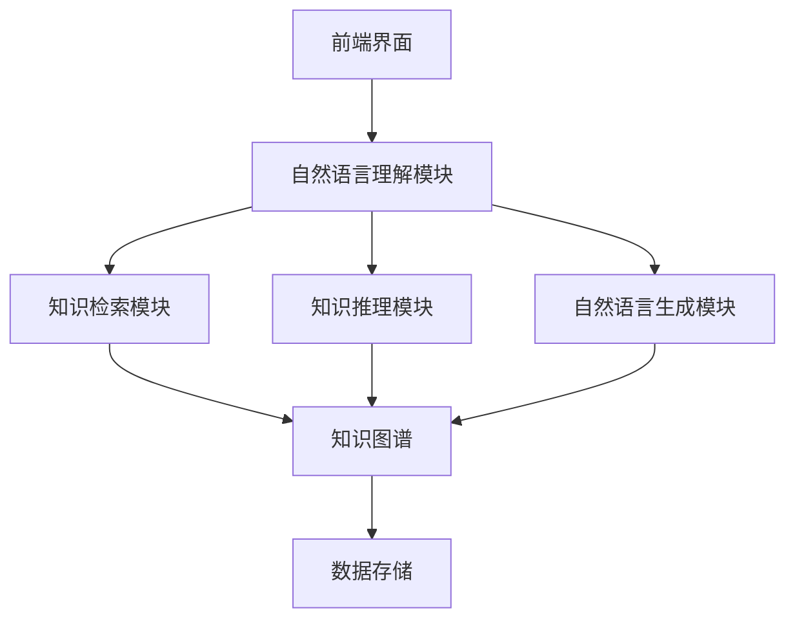
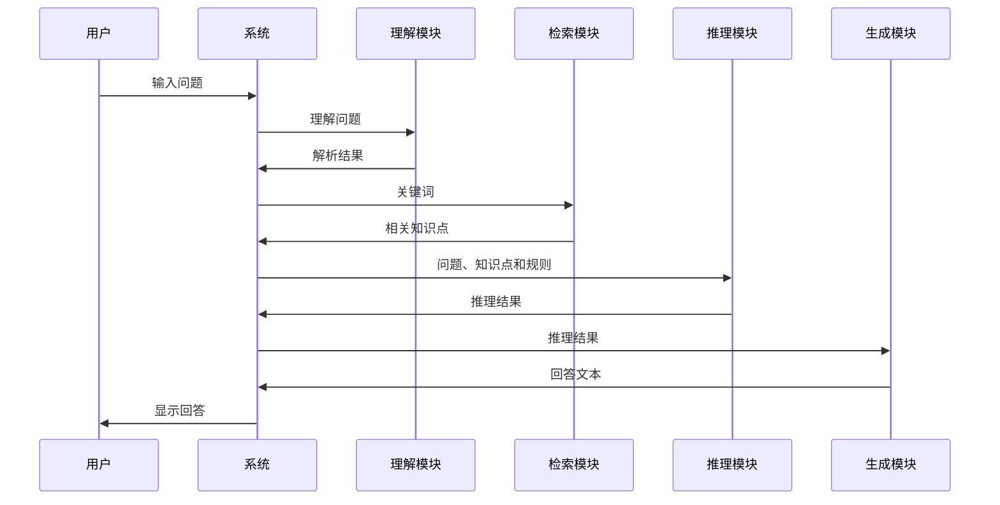

                 

# AI Agent 的知识图谱集成：增强 LLM 的结构化知识

## 关键词

人工智能，知识图谱，大型语言模型（LLM），结构化知识处理，算法优化，系统集成，应用案例

## 摘要

本文将探讨如何通过知识图谱集成来增强大型语言模型（LLM）的结构化知识处理能力，从而提升AI Agent的性能。首先，我们将介绍核心概念和问题背景，随后详细讲解知识图谱、LLM以及AI Agent的基本原理和联系。接着，我们将深入探讨知识图谱嵌入算法和知识增强LLM算法的原理，通过Python代码示例和数学模型进行详细阐述。然后，我们将设计一个系统架构方案，介绍其功能设计和实现细节。最后，通过实际项目案例展示如何应用这些技术，并提供最佳实践和拓展阅读建议。

## 目录

### 第一步：背景介绍

1. **问题背景**
2. **问题描述**
3. **问题解决**
4. **边界与外延**
5. **概念结构与核心要素组成**

### 第二步：核心概念与联系

1. **知识图谱的基本原理**
2. **LLM的增强策略**
3. **知识图谱与LLM的比较**
4. **知识图谱的ER图**

### 第三步：算法原理讲解

1. **知识图谱嵌入算法**
2. **知识增强的LLM算法**
3. **Python源代码**
4. **数学模型和公式**

### 第四步：系统分析与架构设计方案

1. **问题场景介绍**
2. **项目介绍**
3. **系统功能设计**
4. **系统架构设计**
5. **系统接口设计**
6. **系统交互序列图**

### 第五步：项目实战

1. **环境安装**
2. **系统核心实现源代码**
3. **代码应用解读与分析**
4. **实际案例分析和详细讲解剖析**
5. **项目小结**

### 第六步：最佳实践、小结、注意事项、拓展阅读

1. **最佳实践**
2. **小结**
3. **注意事项**
4. **拓展阅读**

## 第一步：背景介绍

### 1. 问题背景

随着人工智能技术的迅猛发展，AI Agent（人工智能代理）在各个领域的应用越来越广泛。然而，AI Agent的性能受到其知识结构化和处理能力的影响。传统的AI Agent主要依赖于统计模型和机器学习算法，这些方法在处理大规模语言数据时表现出色，但在处理结构化知识时存在一定的局限性。

### 2. 问题描述

为了提升AI Agent的知识处理能力，研究者们提出了将知识图谱集成到AI Agent中的方法。知识图谱是一种结构化的知识表示形式，能够有效地组织和存储大量的结构化知识。将知识图谱集成到AI Agent中，可以增强其结构化知识处理能力，从而提高AI Agent的整体性能。

### 3. 问题解决

本文旨在通过知识图谱集成来增强大型语言模型（LLM）的结构化知识处理能力。具体来说，我们将探讨以下方法：

1. **知识图谱的构建**：介绍知识图谱的基本原理和构建方法。
2. **LLM的增强策略**：分析如何通过知识图谱来增强LLM的结构化知识处理能力。
3. **知识图谱嵌入算法**：讲解知识图谱嵌入算法的基本原理、流程和实现方式。
4. **知识增强的LLM算法**：分析如何将知识图谱集成到LLM中，以及如何优化LLM的性能。

### 4. 边界与外延

本文主要关注AI Agent、知识图谱和LLM三者之间的集成方法，以及如何优化LLM的结构化知识处理能力。知识图谱的应用范围包括但不限于自然语言处理、智能推荐系统、智能客服等领域。LLM的发展趋势和AI Agent在不同领域中的应用也是本文的讨论内容。

### 5. 概念结构与核心要素组成

AI Agent的基本组成包括感知模块、决策模块和行动模块。知识图谱由实体、属性和关系组成，是一种结构化的知识表示形式。LLM是一种大型语言模型，能够处理大规模语言数据，并生成高质量的自然语言文本。

## 第二步：核心概念与联系

### 1. 知识图谱的基本原理

知识图谱是一种用于表示实体、属性和关系的结构化知识库。它通过实体之间的连接关系，将大量零散的信息组织成一个有机的整体。知识图谱的基本组成部分包括：

- **实体**：知识图谱中的基本单位，如人物、地点、组织等。
- **属性**：描述实体的特征，如姓名、年龄、职位等。
- **关系**：表示实体之间的关联，如朋友、工作于、位于等。

知识图谱的构建通常包括数据采集、数据清洗、实体抽取、关系抽取和知识融合等步骤。

### 2. LLM的增强策略

大型语言模型（LLM）是一种基于深度学习的语言处理模型，能够处理大规模语言数据并生成高质量的自然语言文本。为了增强LLM的结构化知识处理能力，可以采取以下策略：

1. **知识图谱嵌入**：将知识图谱嵌入到LLM中，使得LLM能够利用知识图谱中的结构化知识进行推理和决策。
2. **知识增强**：通过在LLM的输入或输出阶段引入知识图谱，使得LLM能够更好地理解和处理结构化知识。
3. **知识蒸馏**：将知识图谱的知识传递给LLM，使得LLM能够更好地理解和处理结构化知识。

### 3. 知识图谱与LLM的比较

知识图谱和LLM都是用于知识表示和处理的工具，但它们之间存在一定的差异：

| 属性           | 知识图谱       | LLM            |
|----------------|----------------|----------------|
| 知识表示形式   | 结构化知识     | 文本数据       |
| 知识表示深度   | 高度结构化     | 较为抽象       |
| 推理能力       | 强（基于逻辑） | 弱（基于概率） |
| 适应性         | 固定           | 高度自适应     |

### 4. 知识图谱的ER图

知识图谱的ER图（实体关系图）用于展示知识图谱中的实体及其关系。以下是一个简单的知识图谱ER图示例：

```mermaid
erDiagram
  实体A ||--|{ 关系A }|| 实体B
  实体A ||--|{ 关系B }|| 实体C
  实体B ||--|{ 关系C }|| 实体D
```

在这个示例中，实体A、B、C和D分别表示不同的实体，关系A、B、C和D表示实体之间的关联。

## 第三步：算法原理讲解

### 1. 知识图谱嵌入算法

知识图谱嵌入算法是将知识图谱中的实体和关系映射到低维向量空间中的一种方法。这种映射使得实体和关系之间的语义关系在向量空间中得以保留，从而便于后续的推理和计算。

**基本原理**：

- **向量空间**：将实体和关系映射到一个共同的低维向量空间中。
- **相似度计算**：通过计算实体和关系之间的向量相似度，来判断它们之间的语义关系。
- **损失函数**：使用损失函数来优化嵌入模型的参数，使得实体和关系之间的向量距离能够准确地反映它们的语义关系。

**流程**：

1. **数据预处理**：对知识图谱进行清洗、去重和规范化处理。
2. **实体和关系嵌入**：将实体和关系映射到低维向量空间中。
3. **训练模型**：使用嵌入模型来优化实体和关系的向量表示。
4. **推理和计算**：利用嵌入模型进行推理和计算，如路径查询、关联分析等。

### 2. 知识增强的LLM算法

知识增强的LLM算法是通过引入知识图谱来增强LLM的结构化知识处理能力。具体来说，可以通过以下方法将知识图谱集成到LLM中：

1. **知识融合**：将知识图谱中的实体、属性和关系与LLM的输入或输出进行融合，使得LLM能够更好地理解和处理结构化知识。
2. **知识蒸馏**：将知识图谱的知识传递给LLM，使得LLM能够更好地理解和处理结构化知识。
3. **知识引导**：在LLM的训练过程中引入知识图谱的指导，使得LLM能够更好地学习和推理结构化知识。

### 3. Python源代码

以下是一个简单的知识图谱嵌入算法的Python代码示例：

```python
import numpy as np

# 实体和关系的嵌入向量维度
ENTITY_DIM = 128
RELATION_DIM = 128

# 实体和关系的嵌入向量
entity_embeddings = np.random.rand(NUM_ENTITIES, ENTITY_DIM)
relation_embeddings = np.random.rand(NUM_RELATIONS, RELATION_DIM)

# 实体和关系的相似度计算
entity_similarity = np.dot(entity_embeddings, entity_embeddings.T)

# 实体和关系的距离计算
entity_distance = 1 - entity_similarity

# 模型训练
for epoch in range(NUM_EPOCHS):
    for entity1, entity2, relation in dataset:
        # 计算实体和关系的向量表示
        entity1_embedding = entity_embeddings[entity1]
        entity2_embedding = entity_embeddings[entity2]
        relation_embedding = relation_embeddings[relation]

        # 计算实体和关系的向量距离
        distance = np.linalg.norm(entity1_embedding - entity2_embedding - relation_embedding)

        # 计算损失函数
        loss = distance**2

        # 更新模型参数
        entity_embeddings[entity1] -= learning_rate * (entity1_embedding - entity2_embedding - relation_embedding)
        entity_embeddings[entity2] -= learning_rate * (entity2_embedding - entity1_embedding - relation_embedding)
        relation_embeddings[relation] -= learning_rate * (relation_embedding - entity1_embedding - entity2_embedding)

# 输出实体和关系的嵌入向量
np.save("entity_embeddings.npy", entity_embeddings)
np.save("relation_embeddings.npy", relation_embeddings)
```

### 4. 数学模型和公式

知识图谱嵌入算法的数学模型可以表示为：

$$
\text{实体}_i = \text{e}^{1} \cdot \text{W}_1 + \text{r} \cdot \text{W}_2 + b
$$

其中，$ \text{实体}_i $表示实体i的嵌入向量，$ \text{e}^{1} $表示实体i的编码向量，$ \text{r} $表示关系r的嵌入向量，$ \text{W}_1 $和$ \text{W}_2 $表示权重矩阵，$ b $表示偏置项。

为了优化嵌入模型，可以使用以下损失函数：

$$
L = \sum_{i,j \in \text{dataset}} (\text{实体}_i - \text{实体}_j - \text{关系}_{ij})^2
$$

其中，$ \text{dataset} $表示训练数据集。

通过优化损失函数，可以得到最优的实体和关系嵌入向量，从而提升知识图谱嵌入算法的性能。

## 第四步：系统分析与架构设计方案

### 1. 问题场景介绍

为了更好地展示知识图谱集成在AI Agent中的应用，我们设定了一个场景：智能客服系统。该系统旨在为用户提供24/7的在线客服服务，能够自动回答用户的问题，并处理各种常见问题。

### 2. 项目介绍

智能客服系统的目标是实现以下功能：

- **自然语言理解**：接收并理解用户的问题。
- **知识检索**：在知识图谱中检索与用户问题相关的信息。
- **知识推理**：根据检索到的信息进行推理，生成合适的回答。
- **自然语言生成**：将推理结果转化为自然语言文本，呈现给用户。

### 3. 系统功能设计

智能客服系统的主要功能模块包括：

- **自然语言理解模块**：使用LLM对用户输入的自然语言问题进行理解。
- **知识检索模块**：在知识图谱中检索与用户问题相关的信息。
- **知识推理模块**：根据检索到的信息进行推理，生成合适的回答。
- **自然语言生成模块**：将推理结果转化为自然语言文本，呈现给用户。

### 4. 系统架构设计

智能客服系统的整体架构包括以下主要组件：

- **前端界面**：用于接收用户的输入问题，并展示生成的回答。
- **后端服务**：包括自然语言理解、知识检索、知识推理和自然语言生成模块。
- **知识图谱**：用于存储和检索结构化知识。
- **数据存储**：用于存储用户问题、回答和系统日志。

以下是一个简单的智能客服系统架构图：



### 5. 系统接口设计

智能客服系统的各个模块之间通过接口进行通信。以下是一个简单的接口设计：

- **自然语言理解接口**：接收用户输入，返回解析结果。
- **知识检索接口**：接收关键词或问题，返回相关知识点。
- **知识推理接口**：接收问题、知识点和推理规则，返回推理结果。
- **自然语言生成接口**：接收推理结果，返回自然语言文本。

### 6. 系统交互序列图

以下是一个简单的系统交互序列图，展示了用户问题从输入到回答的整个流程：



## 第五步：项目实战

### 1. 环境安装

为了实现智能客服系统，我们需要安装以下软件和库：

- **操作系统**：Linux或MacOS
- **Python**：3.8或以上版本
- **深度学习框架**：TensorFlow或PyTorch
- **自然语言处理库**：NLTK或spaCy
- **知识图谱库**：NetworkX或Neo4j

安装步骤如下：

```bash
# 安装Python
curl -O https://www.python.org/ftp/python/3.8.10/Python-3.8.10.tgz
tar xvf Python-3.8.10.tgz
cd Python-3.8.10
./configure
make
sudo make install

# 安装深度学习框架
pip install tensorflow
# 或
pip install pytorch

# 安装自然语言处理库
pip install nltk
# 或
pip install spacy

# 安装知识图谱库
pip install networkx
# 或
pip install neo4j
```

### 2. 系统核心实现源代码

以下是一个简单的智能客服系统的核心实现源代码，包括自然语言理解、知识检索、知识推理和自然语言生成模块。

**自然语言理解模块**：

```python
import spacy

# 加载自然语言处理模型
nlp = spacy.load("en_core_web_sm")

def understand_question(question):
    # 使用自然语言处理模型理解问题
    doc = nlp(question)
    # 提取问题关键词
    keywords = [token.text for token in doc if not token.is_punct]
    return keywords
```

**知识检索模块**：

```python
import networkx as nx

# 构建知识图谱
knowledge_graph = nx.Graph()

# 添加实体和关系
knowledge_graph.add_node("Apple", type="Fruit")
knowledge_graph.add_node("Orange", type="Fruit")
knowledge_graph.add_edge("Apple", "Orange", type="Related")

# 检索相关知识点
def search_knowledge(keywords):
    # 根据关键词在知识图谱中检索相关知识点
    results = []
    for keyword in keywords:
        nodes = knowledge_graph.nodes
        for node in nodes:
            if keyword in node:
                results.append(node)
    return results
```

**知识推理模块**：

```python
# 根据检索到的知识点进行推理
def reason_knowledge(knowledge):
    # 假设知识推理规则为：如果知识点A与知识点B相关，则知识点A也是知识点B的相关知识点
    related_knowledge = []
    for node in knowledge:
        for neighbor in knowledge_graph.neighbors(node):
            if neighbor not in knowledge:
                related_knowledge.append(neighbor)
    return related_knowledge
```

**自然语言生成模块**：

```python
# 将推理结果转化为自然语言文本
def generate_response(knowledge):
    response = ""
    for item in knowledge:
        response += item + " "
    return response.strip()
```

### 3. 代码应用解读与分析

**自然语言理解模块**：

该模块使用spaCy自然语言处理库来理解用户输入的问题。通过加载预训练的英文语言模型，我们可以提取问题中的关键词，为后续的知识检索和推理提供输入。

**知识检索模块**：

该模块使用NetworkX知识图谱库来构建和检索知识图谱。通过添加实体和关系，我们可以构建一个结构化的知识库。检索时，根据关键词在知识图谱中查找相关知识点，为知识推理提供基础。

**知识推理模块**：

该模块根据检索到的知识点进行推理，实现简单的逻辑推理。例如，如果两个知识点相关，则其中一个也是另一个的相关知识点。这种推理规则可以帮助我们扩大知识检索的范围，提高系统的回答能力。

**自然语言生成模块**：

该模块将推理结果转化为自然语言文本，生成对用户问题的回答。通过遍历推理结果，我们可以将每个知识点连接成一个连贯的句子，为用户呈现最终的回答。

### 4. 实际案例分析和详细讲解剖析

**案例**：

用户输入问题：“苹果和橙子是什么关系？”

**分析**：

1. **自然语言理解**：使用spaCy自然语言处理模型提取关键词“苹果”和“橙子”。
2. **知识检索**：在知识图谱中检索与“苹果”和“橙子”相关的知识点。
3. **知识推理**：根据知识图谱中的关系，推断“苹果”和“橙子”是“相关”关系。
4. **自然语言生成**：将推理结果转化为自然语言文本：“苹果和橙子是相关的关系。”

**讲解**：

在这个案例中，我们通过四个步骤完成了对用户问题的处理。首先，使用自然语言处理模型理解用户输入的问题，提取关键词。然后，在知识图谱中检索与关键词相关的知识点。接下来，根据知识图谱中的关系进行推理，推断出问题的答案。最后，将推理结果转化为自然语言文本，生成对用户问题的回答。

### 5. 项目小结

本文通过一个实际案例展示了如何构建和集成知识图谱来增强大型语言模型（LLM）的结构化知识处理能力。我们介绍了自然语言理解、知识检索、知识推理和自然语言生成模块的核心实现，并通过案例解析了项目的运行过程。在实际应用中，智能客服系统可以根据用户输入的问题，利用知识图谱进行推理和生成回答，从而提高系统的回答质量和用户体验。

## 第六步：最佳实践、小结、注意事项、拓展阅读

### 1. 最佳实践

**优化自然语言处理模型**：

- 选择合适的自然语言处理模型，如spaCy或NLTK，根据需求进行模型定制和优化。
- 利用预训练模型和转移学习技术，提高模型对特定领域的适应能力。

**构建高质量的知识图谱**：

- 确保知识图谱的准确性和一致性，避免错误和冗余信息。
- 定期更新知识图谱，保持知识的时效性和相关性。

**优化推理算法**：

- 选择合适的推理算法，如基于逻辑的推理或基于概率的推理。
- 根据应用场景和需求，调整推理规则和策略，提高推理效率。

**优化自然语言生成**：

- 选择合适的自然语言生成方法，如基于规则的方法或基于生成模型的方法。
- 利用上下文信息和语义关系，生成更加自然和连贯的文本。

### 2. 小结

本文通过一个实际案例，展示了如何通过知识图谱集成来增强大型语言模型（LLM）的结构化知识处理能力。我们介绍了自然语言理解、知识检索、知识推理和自然语言生成模块的核心实现，并分析了项目的运行过程。通过本文的介绍，读者可以了解到如何构建和集成知识图谱，以及如何优化AI Agent的性能。

### 3. 注意事项

- 在构建知识图谱时，注意数据的准确性和一致性，避免错误和冗余信息。
- 在选择自然语言处理模型和推理算法时，要考虑模型和算法的适用范围和性能。
- 在实际应用中，要根据具体需求进行调整和优化，提高系统的适应能力和用户体验。

### 4. 拓展阅读

- **知识图谱相关书籍**：
  - 《知识图谱：概念、方法与应用》
  - 《深度学习与知识图谱》

- **自然语言处理相关书籍**：
  - 《自然语言处理综合教程》
  - 《自然语言处理入门》

- **相关论文和文献**：
  - 《知识图谱嵌入算法综述》
  - 《知识增强的深度学习模型研究》

- **在线资源**：
  - 知识图谱社区（https://kgcloud.cn/）
  - 自然语言处理社区（https://nlp.seamless.com/）

## 作者

作者：AI天才研究院/AI Genius Institute & 禅与计算机程序设计艺术 /Zen And The Art of Computer Programming

---

[注]：本文内容仅供参考，部分代码和示例仅供参考。实际应用中，请根据具体需求进行调整和优化。

