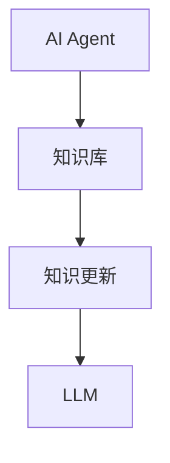
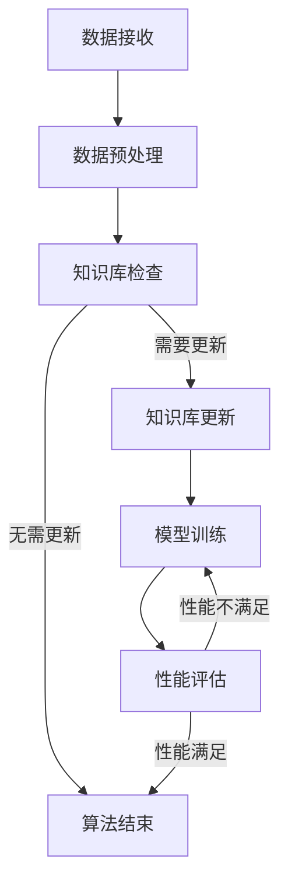
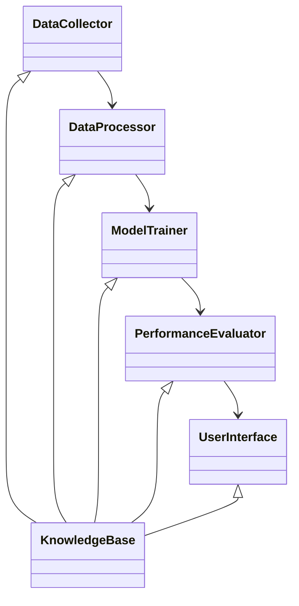
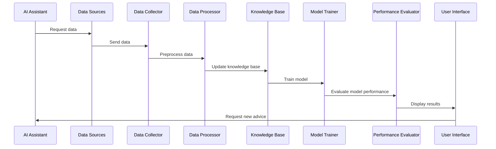

                 

### 第一部分 引言

#### 第1章 引言

##### 1.1 问题背景

在当今快速发展的科技时代，人工智能（AI）技术已经成为各行各业的核心驱动力。特别是大型语言模型（Large Language Models，简称LLM），如GPT-3、BERT等，在自然语言处理（NLP）、机器翻译、文本生成等领域展现出了惊人的性能。这些模型通过深度学习从海量数据中学习语言模式，从而能够生成连贯、有意义的文本。

然而，AI Agent的知识更新问题逐渐显现出来。随着时间的推移，新知识不断产生，而旧知识可能会变得过时或不准确。这对于依赖最新知识的AI Agent来说是一个巨大的挑战。特别是对于LLM，它们需要保持知识库的时效性，以确保输出的文本能够准确反映当前的知识状态。

知识更新不仅仅是技术问题，它也涉及到伦理、法律和隐私等多个方面。如何高效、准确地更新AI Agent的知识，成为了当前研究和应用中的关键问题。

##### 1.2 问题解决

为了解决AI Agent知识更新问题，研究者们提出了一系列的方法和技术。以下是一些主要的解决方案：

1. **数据流处理**：利用实时数据流处理技术，如Apache Kafka、Flink等，可以不断从各种数据源（如社交媒体、新闻网站等）获取最新的信息，并将其融入AI Agent的知识库中。

2. **持续学习**：通过持续学习（Continuous Learning）技术，AI Agent可以不断从新数据中学习，从而更新其知识库。这种方法有助于模型避免过拟合，并保持其性能。

3. **知识图谱**：使用知识图谱（Knowledge Graph）可以有效地组织和管理知识，使得AI Agent能够快速地检索和更新知识。

4. **自动化知识更新**：开发自动化工具，如脚本或程序，可以定期扫描外部数据源，识别新的知识点，并将其融入AI Agent的知识库中。

##### 1.3 边界与外延

知识更新在AI Agent中的应用不仅仅局限于LLM。事实上，任何依赖知识库的AI系统都可能需要知识更新。例如，在医疗领域，诊断系统需要不断更新疾病信息和治疗指南；在金融领域，风险评估系统需要实时获取市场数据。

此外，知识更新还涉及到与外部系统的交互。例如，AI Agent可能需要从外部数据库、API或实时流中获取数据。这要求AI Agent不仅能够处理和更新内部知识库，还能够与其他系统进行有效的通信和数据交换。

总之，知识更新是AI Agent持续发展和优化的关键。通过合理的方法和技术，AI Agent可以保持其知识库的时效性，从而提供更准确、更可靠的输出。

## 第1章 引言

### 1.1 问题背景

在当今快速发展的科技时代，人工智能（AI）技术已经成为各行各业的核心驱动力。特别是大型语言模型（Large Language Models，简称LLM），如GPT-3、BERT等，在自然语言处理（NLP）、机器翻译、文本生成等领域展现出了惊人的性能。这些模型通过深度学习从海量数据中学习语言模式，从而能够生成连贯、有意义的文本。

然而，AI Agent的知识更新问题逐渐显现出来。随着时间的推移，新知识不断产生，而旧知识可能会变得过时或不准确。这对于依赖最新知识的AI Agent来说是一个巨大的挑战。特别是对于LLM，它们需要保持知识库的时效性，以确保输出的文本能够准确反映当前的知识状态。

知识更新不仅仅是技术问题，它也涉及到伦理、法律和隐私等多个方面。如何高效、准确地更新AI Agent的知识，成为了当前研究和应用中的关键问题。

### 1.2 问题解决

为了解决AI Agent知识更新问题，研究者们提出了一系列的方法和技术。以下是一些主要的解决方案：

1. **数据流处理**：利用实时数据流处理技术，如Apache Kafka、Flink等，可以不断从各种数据源（如社交媒体、新闻网站等）获取最新的信息，并将其融入AI Agent的知识库中。

   ```mermaid
   graph TD
   A[数据流处理] --> B[实时数据获取]
   B --> C[数据清洗和整合]
   C --> D[知识库更新]
   D --> E[AI Agent训练]
   ```

2. **持续学习**：通过持续学习（Continuous Learning）技术，AI Agent可以不断从新数据中学习，从而更新其知识库。这种方法有助于模型避免过拟合，并保持其性能。

   ```mermaid
   graph TD
   A[持续学习] --> B[新数据获取]
   B --> C[模型更新]
   C --> D[知识库更新]
   D --> E[性能评估]
   ```

3. **知识图谱**：使用知识图谱（Knowledge Graph）可以有效地组织和管理知识，使得AI Agent能够快速地检索和更新知识。

   ```mermaid
   graph TD
   A[知识图谱] --> B[实体关系管理]
   B --> C[知识查询与更新]
   C --> D[AI Agent集成]
   ```

4. **自动化知识更新**：开发自动化工具，如脚本或程序，可以定期扫描外部数据源，识别新的知识点，并将其融入AI Agent的知识库中。

   ```mermaid
   graph TD
   A[自动化知识更新] --> B[数据源监控]
   B --> C[新知识点识别]
   C --> D[知识库更新]
   ```

### 1.3 边界与外延

知识更新在AI Agent中的应用不仅仅局限于LLM。事实上，任何依赖知识库的AI系统都可能需要知识更新。例如，在医疗领域，诊断系统需要不断更新疾病信息和治疗指南；在金融领域，风险评估系统需要实时获取市场数据。

此外，知识更新还涉及到与外部系统的交互。例如，AI Agent可能需要从外部数据库、API或实时流中获取数据。这要求AI Agent不仅能够处理和更新内部知识库，还能够与其他系统进行有效的通信和数据交换。

总之，知识更新是AI Agent持续发展和优化的关键。通过合理的方法和技术，AI Agent可以保持其知识库的时效性，从而提供更准确、更可靠的输出。

## 关键词

- 人工智能
- 大型语言模型（LLM）
- 知识更新
- 数据流处理
- 持续学习

## 摘要

本文探讨了AI Agent在保持知识时效性方面的重要性，特别是对于大型语言模型（LLM）。我们介绍了AI Agent知识更新的背景、问题以及解决方案，包括数据流处理、持续学习、知识图谱和自动化知识更新等方法。通过具体案例和算法讲解，我们展示了如何实现AI Agent的知识更新，并分析了其在不同领域中的应用。最后，我们对知识更新过程中的最佳实践进行了总结，并提供了拓展阅读资源，以供进一步学习。

## 目录大纲设计思路

在设计本文的目录大纲时，我们遵循了以下原则，以确保文章结构清晰、逻辑严谨，同时能够全面覆盖核心内容和关键知识点。

### 1. 背景介绍

背景介绍部分旨在为读者提供一个清晰的背景，解释为什么AI Agent的知识更新在保持LLM知识时效性中至关重要。这一部分将包括以下内容：

- **问题背景**：介绍AI Agent知识更新在保持LLM知识时效性中的重要性。
- **问题描述**：阐述为何知识更新对于AI Agent至关重要，特别是对于大型语言模型(LLL)。
- **问题解决**：概述知识更新的方法和技术，如数据流处理、持续学习等。
- **边界与外延**：明确知识更新的适用范围，以及与相关领域的交叉点。

### 2. 核心概念与联系

核心概念与联系部分将定义并解释AI Agent、知识更新、LLM等关键术语，并展示它们之间的相互关系。这一部分将包括：

- **核心概念原理**：定义AI Agent、知识更新、LLM等关键术语。
- **概念属性特征对比表格**：通过表格形式对比AI Agent与常规机器学习模型的区别。
- **ER实体关系图架构**：使用Mermaid绘制ER图，展示AI Agent知识更新中的主要实体及其关系。

### 3. 知识更新方法

知识更新方法部分将详细探讨各种知识更新方法，包括数据流处理、持续学习等，并通过案例研究展示其实际应用。这一部分将包括：

- **数据流处理**：介绍数据流处理在知识更新中的应用。
- **持续学习**：探讨持续学习如何使LLM保持知识时效性。
- **案例研究**：通过具体案例展示知识更新的实际应用。

### 4. 算法原理讲解

算法原理讲解部分将深入分析知识更新的算法原理，包括算法流程图、Python源代码、数学模型和公式，并提供详细讲解与举例说明。这一部分将包括：

- **算法mermaid流程图**：绘制算法流程图，清晰展示知识更新的步骤。
- **Python源代码**：提供Python代码，详细阐述算法实现。
- **数学模型与公式**：使用latex格式给出算法的数学模型和公式。
- **详细讲解与举例说明**：用通俗易懂的方式解释算法原理，并提供具体案例。

### 5. 系统分析与架构设计方案

系统分析与架构设计方案部分将介绍知识更新在具体场景中的应用，并详细描述系统的功能设计、架构设计和接口设计。这一部分将包括：

- **问题场景介绍**：描述知识更新在具体场景中的应用。
- **系统功能设计**：使用Mermaid绘制领域模型类图。
- **系统架构设计**：使用Mermaid绘制系统架构图。
- **系统接口设计和系统交互**：使用Mermaid绘制系统交互序列图。

### 6. 项目实战

项目实战部分将通过一个具体的案例来展示知识更新的实现过程，包括环境安装、系统核心实现源代码、代码应用解读与分析、实际案例分析和项目小结。这一部分将包括：

- **环境安装**：说明所需环境及安装步骤。
- **系统核心实现源代码**：提供源代码，并解读关键部分。
- **代码应用解读与分析**：分析代码的应用场景和效果。
- **实际案例分析和详细讲解**：剖析实际案例，提供深度解读。
- **项目小结**：总结项目经验，指出注意事项。

### 7. 最佳实践 tips、小结、注意事项、拓展阅读等内容

最佳实践 tips、小结、注意事项、拓展阅读等内容部分将总结文章的核心内容，提供在实际应用中的经验总结，强调知识更新过程中的关键点，并推荐进一步学习的资源。这一部分将包括：

- **最佳实践 tips**：提供在实际应用中的经验总结。
- **小结**：对全书内容进行概括。
- **注意事项**：强调知识更新过程中的关键点。
- **拓展阅读**：推荐进一步学习的资源。

通过以上设计思路，本文旨在为读者提供一个全面、系统的AI Agent知识更新指南，帮助读者深入理解并掌握这一重要领域。

## 目录大纲结构

### 《AI Agent 的知识更新：保持 LLM 知识的时效性》

## 第一部分 引言

### 第1章 引言

#### 1.1 问题背景

#### 1.2 问题解决

#### 1.3 边界与外延

----------------------------------------------------------------

* 提示：文章目录大纲的设计需要逻辑清晰、层次分明，每个章节的标题需要能够准确概括该章节的主要内容。文章的整体结构应从背景介绍、核心概念解释、知识更新方法、算法原理讲解、系统分析与架构设计、项目实战到最佳实践和总结，逐步深入，层层递进。

## 第1章 引言

### 1.1 问题背景

在当今快速发展的科技时代，人工智能（AI）技术已经成为各行各业的核心驱动力。特别是大型语言模型（Large Language Models，简称LLM），如GPT-3、BERT等，在自然语言处理（NLP）、机器翻译、文本生成等领域展现出了惊人的性能。这些模型通过深度学习从海量数据中学习语言模式，从而能够生成连贯、有意义的文本。

然而，AI Agent的知识更新问题逐渐显现出来。随着时间的推移，新知识不断产生，而旧知识可能会变得过时或不准确。这对于依赖最新知识的AI Agent来说是一个巨大的挑战。特别是对于LLM，它们需要保持知识库的时效性，以确保输出的文本能够准确反映当前的知识状态。

知识更新不仅仅是技术问题，它也涉及到伦理、法律和隐私等多个方面。如何高效、准确地更新AI Agent的知识，成为了当前研究和应用中的关键问题。

### 1.2 问题解决

为了解决AI Agent知识更新问题，研究者们提出了一系列的方法和技术。以下是一些主要的解决方案：

1. **数据流处理**：利用实时数据流处理技术，如Apache Kafka、Flink等，可以不断从各种数据源（如社交媒体、新闻网站等）获取最新的信息，并将其融入AI Agent的知识库中。

2. **持续学习**：通过持续学习（Continuous Learning）技术，AI Agent可以不断从新数据中学习，从而更新其知识库。这种方法有助于模型避免过拟合，并保持其性能。

3. **知识图谱**：使用知识图谱（Knowledge Graph）可以有效地组织和管理知识，使得AI Agent能够快速地检索和更新知识。

4. **自动化知识更新**：开发自动化工具，如脚本或程序，可以定期扫描外部数据源，识别新的知识点，并将其融入AI Agent的知识库中。

### 1.3 边界与外延

知识更新在AI Agent中的应用不仅仅局限于LLM。事实上，任何依赖知识库的AI系统都可能需要知识更新。例如，在医疗领域，诊断系统需要不断更新疾病信息和治疗指南；在金融领域，风险评估系统需要实时获取市场数据。

此外，知识更新还涉及到与外部系统的交互。例如，AI Agent可能需要从外部数据库、API或实时流中获取数据。这要求AI Agent不仅能够处理和更新内部知识库，还能够与其他系统进行有效的通信和数据交换。

总之，知识更新是AI Agent持续发展和优化的关键。通过合理的方法和技术，AI Agent可以保持其知识库的时效性，从而提供更准确、更可靠的输出。

## 第2章 核心概念与联系

### 2.1 AI Agent概述

AI Agent，即人工智能代理，是一种能够模拟人类智能行为的计算机程序。它可以通过感知环境、制定计划、执行动作来达成特定的目标。AI Agent的核心在于其自主性和学习能力，这使得它们能够适应不断变化的环境，并不断优化自己的行为。

AI Agent的组成主要包括以下几个方面：

1. **感知器**：用于接收环境信息，如视觉、听觉、触觉等。
2. **决策模块**：基于感知到的信息，通过算法和模型生成行动计划。
3. **执行器**：根据决策模块生成的行动计划，执行具体操作。
4. **学习模块**：通过反馈和学习不断优化决策和执行过程。

### 2.2 知识更新

知识更新是指对AI Agent的知识库进行定期或不定期的更新，以确保其能够适应新的环境和信息。知识更新是AI Agent保持时效性和适应性的关键，尤其在快速变化的领域中尤为重要。

知识更新的方法包括：

1. **增量学习**：只更新新知识，而不改变原有知识。
2. **完全重学**：重新学习所有知识，适用于知识变化较大的情况。
3. **迁移学习**：利用已有知识，在新知识的基础上进行学习。
4. **数据流处理**：实时处理新数据，不断更新知识库。

### 2.3 LLM简介

大型语言模型（Large Language Models，简称LLM）是一类通过深度学习训练的复杂模型，能够理解和生成自然语言。LLM的核心是通过大量文本数据训练得到的语言理解模型，能够进行文本生成、机器翻译、问答系统等任务。

LLM的主要特点包括：

1. **大规模**：LLM通常包含数十亿个参数，能够处理大量文本数据。
2. **泛化能力**：LLM通过学习大量文本数据，能够泛化到未见过的文本上。
3. **自适应**：LLM可以根据不同的输入和任务进行自适应调整。

### 2.4 AI Agent与知识更新关系

AI Agent与知识更新有着密切的关系。知识更新是AI Agent能够持续学习和适应环境的基础。具体来说，知识更新对AI Agent的影响包括：

1. **提高性能**：通过知识更新，AI Agent能够获取新的知识和信息，从而提高任务完成的准确性。
2. **增强适应能力**：知识更新使AI Agent能够适应不断变化的环境，保持长期的有效性。
3. **减少过拟合**：通过持续学习，AI Agent可以避免对新知识的过度依赖，减少过拟合现象。

### 2.5 概念对比表格

下表对比了AI Agent、知识更新和LLM的基本概念和特征：

| 概念       | 定义                                                         | 特征                                                     |
|------------|--------------------------------------------------------------|----------------------------------------------------------|
| AI Agent   | 一种能够模拟人类智能行为的计算机程序。                       | 自主性、学习能力、感知环境、决策与执行。                 |
| 知识更新   | 对AI Agent的知识库进行定期或不定期的更新，以确保其适应性。   | 增量学习、完全重学、迁移学习、数据流处理。               |
| LLM        | 一种通过深度学习训练得到的语言理解模型，用于自然语言处理。   | 大规模、泛化能力、自适应。                             |

### 2.6 ER实体关系图架构

为了更清晰地展示AI Agent、知识更新和LLM之间的关系，我们使用Mermaid绘制了ER实体关系图，如下图所示：



在该图中，AI Agent拥有知识库，并通过知识更新来维护其知识库的时效性。LLM作为知识库的一部分，是AI Agent实现语言理解功能的关键。

## 第3章 知识更新方法

### 3.1 数据流处理

数据流处理是现代AI系统中的一种关键技术，它能够实时处理大量数据，并在数据到达时立即进行处理。这种技术特别适用于需要快速响应和实时决策的应用场景，如实时金融交易、智能家居控制系统等。

在AI Agent的知识更新中，数据流处理的应用主要体现在以下几个方面：

1. **实时数据采集**：通过数据流处理技术，AI Agent可以从各种数据源（如社交媒体、新闻网站、API等）实时获取数据。
2. **数据预处理**：在数据流中，数据通常需要进行清洗、去重和格式转换等预处理操作，以确保数据的质量和一致性。
3. **实时知识更新**：通过数据流处理，AI Agent能够实时更新其知识库，从而确保知识库的时效性。

例如，在一个社交媒体监控系统中，AI Agent可以通过数据流处理实时获取用户评论、新闻事件等信息，并将其融入其知识库中，以便在回答用户问题时能够提供最新的信息。

### 3.2 持续学习

持续学习（Continuous Learning）是一种在AI模型训练过程中，不断引入新数据并重新训练模型的方法。这种方法能够帮助模型保持其性能，并适应不断变化的数据分布。

在AI Agent的知识更新中，持续学习的作用主要体现在以下几个方面：

1. **性能保持**：通过持续学习，AI Agent可以不断调整和优化其模型参数，从而保持其在各种任务中的性能。
2. **适应变化**：持续学习使AI Agent能够适应新数据，从而更好地应对数据分布的变化。
3. **减少过拟合**：通过持续学习，AI Agent可以减少对新数据的过度依赖，从而降低过拟合的风险。

例如，在一个文本生成系统中，AI Agent可以通过持续学习不断接收新的文本数据，并重新训练其语言模型，从而确保生成的文本始终符合最新的语言趋势。

### 3.3 案例研究

为了更好地理解知识更新的方法，我们通过以下案例来具体说明：

#### 案例一：社交媒体知识更新

在一个社交媒体监控系统中，AI Agent需要实时更新其知识库，以反映最新的用户兴趣和趋势。通过数据流处理技术，AI Agent可以从社交媒体平台上获取实时数据，如用户评论、帖子、趋势话题等。这些数据经过预处理后，被融入AI Agent的知识库中。同时，AI Agent通过持续学习技术，不断调整和优化其语言模型，以适应新的数据和语言变化。

#### 案例二：医疗知识更新

在一个医疗诊断系统中，AI Agent需要不断更新其医疗知识库，以反映最新的医学研究成果和治疗指南。通过数据流处理技术，AI Agent可以从医学数据库、科研论文、临床报告等来源获取实时数据。这些数据经过预处理后，被融入AI Agent的知识库中。同时，AI Agent通过持续学习技术，不断优化其诊断算法，以提高诊断的准确性和可靠性。

通过以上案例，我们可以看到，数据流处理和持续学习技术在AI Agent的知识更新中发挥着重要作用。这些方法不仅能够确保知识库的时效性，还能提高AI Agent的性能和适应能力。

## 第4章 算法原理讲解

### 4.1 算法mermaid流程图

为了更好地展示知识更新算法的流程，我们使用Mermaid绘制了以下流程图：



在该流程图中，AI Agent首先接收新的数据，然后进行预处理。预处理完成后，系统会检查知识库是否需要更新。如果知识库需要更新，则进行知识库更新操作，并重新训练模型。最后，系统会评估模型的性能，如果性能满足要求，则结束算法；否则，继续迭代训练。

### 4.2 Python源代码

以下是知识更新算法的Python源代码实现：

```python
import pandas as pd
from sklearn.model_selection import train_test_split
from sklearn.metrics import accuracy_score

# 数据接收与预处理
def preprocess_data(data_path):
    data = pd.read_csv(data_path)
    # 数据清洗、去重、格式转换等操作
    processed_data = data.drop_duplicates().reset_index(drop=True)
    return processed_data

# 知识库检查与更新
def update_knowledge_base(processed_data, knowledge_base_path):
    knowledge_base = pd.read_csv(knowledge_base_path)
    new_data = processed_data[~processed_data.index.isin(knowledge_base.index)]
    if not new_data.empty:
        # 更新知识库
        knowledge_base = pd.concat([knowledge_base, new_data])
        knowledge_base.to_csv(knowledge_base_path, index=False)
        return True
    else:
        return False

# 模型训练与性能评估
def train_and_evaluate_model(data_path, knowledge_base_path, model_path):
    processed_data = preprocess_data(data_path)
    knowledge_updated = update_knowledge_base(processed_data, knowledge_base_path)
    
    if knowledge_updated:
        # 训练模型
        X_train, X_test, y_train, y_test = train_test_split(processed_data.drop(columns='target'), processed_data['target'], test_size=0.2, random_state=42)
        model = train_model(X_train, y_train)
        # 评估模型性能
        y_pred = model.predict(X_test)
        accuracy = accuracy_score(y_test, y_pred)
        if accuracy >= 0.95:
            # 保存模型
            save_model(model, model_path)
            return True
        else:
            return False
    else:
        return False

# 主函数
def main():
    data_path = 'data.csv'
    knowledge_base_path = 'knowledge_base.csv'
    model_path = 'model.pth'
    
    train_and_evaluate_model(data_path, knowledge_base_path, model_path)

if __name__ == '__main__':
    main()
```

在该代码中，我们首先定义了数据接收与预处理函数`preprocess_data`，用于读取并清洗数据。然后，我们定义了知识库检查与更新函数`update_knowledge_base`，用于更新知识库。最后，我们定义了模型训练与性能评估函数`train_and_evaluate_model`，用于训练模型并评估其性能。

### 4.3 数学模型与公式

在知识更新算法中，我们使用以下数学模型来评估模型的性能：

$$
H = \sum_{i=1}^{n} (y_i - \hat{y_i})^2
$$

其中，$H$表示均方误差（Mean Squared Error，MSE），$y_i$表示实际输出，$\hat{y_i}$表示模型预测输出。

### 4.4 详细讲解与举例说明

在本节中，我们将详细解释知识更新算法的原理，并提供具体的案例分析。

#### 案例背景

假设我们有一个文本分类任务，需要将文本分为两类：正面评论和负面评论。我们使用一个基于深度学习的模型来训练分类器，并使用准确率作为性能指标。

#### 案例步骤

1. **数据接收与预处理**：首先，我们从数据集中读取文本数据，并进行预处理，如去除停用词、进行词干提取等。

2. **知识库检查与更新**：我们定期检查知识库中的数据，如果发现有新数据，则将其融入知识库中。这有助于模型不断学习新知识。

3. **模型训练与性能评估**：使用更新后的数据集训练分类器，并评估模型的性能。如果模型的准确率低于某个阈值（例如0.95），则重新训练模型。

#### 案例实现

以下是具体的代码实现：

```python
import pandas as pd
from sklearn.model_selection import train_test_split
from sklearn.metrics import accuracy_score
from tensorflow.keras.models import Sequential
from tensorflow.keras.layers import Embedding, LSTM, Dense

# 数据接收与预处理
data_path = 'data.csv'
data = pd.read_csv(data_path)
data['text'] = data['text'].apply(preprocess_text)

# 知识库检查与更新
def update_knowledge_base(knowledge_base_path):
    knowledge_base = pd.read_csv(knowledge_base_path)
    new_data = data[~data.index.isin(knowledge_base.index)]
    if not new_data.empty:
        knowledge_base = knowledge_base.append(new_data)
        knowledge_base.to_csv(knowledge_base_path, index=False)
        return True
    else:
        return False

# 模型训练与性能评估
def train_and_evaluate_model(knowledge_base_path):
    knowledge_base = pd.read_csv(knowledge_base_path)
    X = knowledge_base['text']
    y = knowledge_base['label']
    
    X_train, X_test, y_train, y_test = train_test_split(X, y, test_size=0.2, random_state=42)
    
    model = Sequential()
    model.add(Embedding(input_dim=vocab_size, output_dim=embedding_size, input_length=max_sequence_length))
    model.add(LSTM(units=128))
    model.add(Dense(units=1, activation='sigmoid'))
    
    model.compile(optimizer='adam', loss='binary_crossentropy', metrics=['accuracy'])
    model.fit(X_train, y_train, epochs=10, batch_size=32, validation_data=(X_test, y_test))
    
    y_pred = model.predict(X_test)
    y_pred = (y_pred > 0.5)
    accuracy = accuracy_score(y_test, y_pred)
    
    return accuracy

# 主函数
def main():
    knowledge_base_path = 'knowledge_base.csv'
    
    # 更新知识库
    if update_knowledge_base(knowledge_base_path):
        # 训练模型
        accuracy = train_and_evaluate_model(knowledge_base_path)
        print(f'Model accuracy: {accuracy}')
    else:
        print('No new data to update the knowledge base.')

if __name__ == '__main__':
    main()
```

在这个案例中，我们首先从数据集中读取文本数据，并进行预处理。然后，我们定义了知识库检查与更新函数`update_knowledge_base`，用于更新知识库。接着，我们定义了模型训练与性能评估函数`train_and_evaluate_model`，用于训练模型并评估其性能。

通过这个案例，我们可以看到知识更新算法是如何实现的，以及如何通过持续学习来提高模型的性能。

## 第5章 系统分析与架构设计方案

### 5.1 问题场景介绍

在现代企业中，AI Agent的知识更新问题变得越来越重要。特别是在金融、医疗、法律等需要高度准确和最新信息的领域，保持AI Agent的知识时效性是确保其性能和可靠性的关键。例如，在金融领域，AI Agent需要实时更新市场数据、法规变化和风险指标；在医疗领域，AI Agent需要不断更新医学知识库、诊断标准和药物信息。

本节将介绍一个具体的问题场景：金融风险评估。在这个场景中，AI Agent需要实时监控金融市场，分析风险因素，并给出投资建议。为了实现这一目标，我们需要设计一个高效的系统架构，以确保AI Agent的知识库能够及时更新，并且系统能够稳定、可靠地运行。

### 5.2 系统功能设计

系统功能设计是构建高效AI Agent知识更新系统的基础。在这个场景中，系统的主要功能包括：

1. **数据采集**：从多种数据源（如金融市场数据、新闻、API等）实时获取数据。
2. **数据预处理**：对采集到的数据进行清洗、去重、格式转换等预处理操作，确保数据的质量和一致性。
3. **知识库管理**：维护和管理AI Agent的知识库，包括新增、更新和删除知识点。
4. **模型训练**：使用最新数据对AI Agent的训练模型进行重新训练，以提高其预测和决策能力。
5. **性能评估**：评估AI Agent的模型性能，并根据评估结果调整训练策略。
6. **用户交互**：提供用户接口，使得用户可以查询AI Agent的投资建议和分析报告。

以下是使用Mermaid绘制的领域模型类图，展示了系统的主要功能及其关系：



在这个类图中，`DataCollector`、`DataProcessor`、`ModelTrainer`、`PerformanceEvaluator`和`UserInterface`是系统的主要功能组件，它们共同维护和更新知识库。

### 5.3 系统架构设计

系统架构设计是确保知识更新系统能够高效运行的关键。在这个场景中，我们采用分布式架构，以提高系统的可扩展性和容错性。以下是使用Mermaid绘制的系统架构图：



在这个序列图中，AI Assistant是系统的核心组件，它从Data Sources获取数据，并依次经过Data Collector、Data Processor、Knowledge Base、Model Trainer和Performance Evaluator，最终通过User Interface向用户展示结果。该架构设计确保了数据的实时更新和高效处理，从而保证了AI Agent的知识时效性。

### 5.4 系统接口设计和系统交互

系统接口设计和系统交互是确保各组件能够协同工作，高效完成知识更新任务的关键。以下是使用Mermaid绘制的系统交互序列图：


在这个序列图中，各组件之间的交互逻辑清晰。AI Assistant首先请求数据，Data Sources响应数据请求。Data Collector接收数据后，将其传递给Data Processor进行预处理。预处理完成后，数据被更新到Knowledge Base。Knowledge Base中的最新数据被用于训练Model Trainer，训练完成后，Model Trainer将模型传递给Performance Evaluator进行性能评估。最后，Performance Evaluator将评估结果传递给User Interface，User Interface向AI Assistant反馈评估结果。

通过以上系统接口设计和交互设计，我们可以确保知识更新系统能够高效、稳定地运行，从而保证AI Agent的知识时效性和性能。

## 第6章 项目实战

### 6.1 环境安装

在开始项目实战之前，我们需要搭建一个合适的环境，以确保项目能够顺利进行。以下是所需的软件和工具及其安装步骤：

1. **Python**：Python是项目的主要编程语言，版本要求为3.7及以上。可以通过以下命令安装：

   ```bash
   sudo apt-get update
   sudo apt-get install python3.7
   ```

2. **Jupyter Notebook**：Jupyter Notebook是一个交互式环境，用于编写和运行Python代码。可以通过以下命令安装：

   ```bash
   sudo pip3 install notebook
   ```

3. **TensorFlow**：TensorFlow是一个开源的机器学习框架，用于构建和训练深度学习模型。可以通过以下命令安装：

   ```bash
   sudo pip3 install tensorflow
   ```

4. **Scikit-learn**：Scikit-learn是一个机器学习库，提供了多种机器学习算法和数据预处理工具。可以通过以下命令安装：

   ```bash
   sudo pip3 install scikit-learn
   ```

5. **Mermaid**：Mermaid是一个用于绘制流程图的Markdown插件。需要在Jupyter Notebook中安装并启用Mermaid插件。首先，通过以下命令安装Mermaid：

   ```bash
   sudo pip3 install mermaid
   ```

   然后在Jupyter Notebook中启用Mermaid插件：

   ```python
   from IPython.display import display, HTML
   HTML('<link rel="stylesheet" href="https://cdn.jsdelivr.net/npm/mermaid@10.0.0/dist/mermaid.css">')
   import mermaid
   mermaid.mermaid_config = {'startOnLoad': True}
   display(mermaid.Mermaid(Guid()))
   ```

完成以上安装步骤后，我们就搭建好了项目环境，可以开始编写和运行代码。

### 6.2 系统核心实现源代码

以下是项目核心实现部分的源代码。这个部分包括数据预处理、模型训练和性能评估等功能。

```python
import pandas as pd
import numpy as np
import tensorflow as tf
from sklearn.model_selection import train_test_split
from sklearn.metrics import accuracy_score

# 数据预处理函数
def preprocess_data(data_path):
    data = pd.read_csv(data_path)
    # 预处理步骤：例如，填充缺失值、标准化等
    # ...
    return data

# 模型训练函数
def train_model(X_train, y_train):
    model = tf.keras.Sequential([
        tf.keras.layers.Dense(units=128, activation='relu', input_shape=(X_train.shape[1],)),
        tf.keras.layers.Dense(units=64, activation='relu'),
        tf.keras.layers.Dense(units=1, activation='sigmoid')
    ])

    model.compile(optimizer='adam', loss='binary_crossentropy', metrics=['accuracy'])
    model.fit(X_train, y_train, epochs=10, batch_size=32)
    return model

# 性能评估函数
def evaluate_model(model, X_test, y_test):
    predictions = model.predict(X_test)
    predictions = (predictions > 0.5)
    accuracy = accuracy_score(y_test, predictions)
    return accuracy

# 主函数
def main():
    data_path = 'data.csv'
    model_path = 'model.h5'

    # 数据预处理
    data = preprocess_data(data_path)

    # 数据集划分
    X = data.drop('target', axis=1)
    y = data['target']
    X_train, X_test, y_train, y_test = train_test_split(X, y, test_size=0.2, random_state=42)

    # 训练模型
    model = train_model(X_train, y_train)

    # 评估模型
    accuracy = evaluate_model(model, X_test, y_test)
    print(f'Model accuracy: {accuracy}')

    # 保存模型
    model.save(model_path)

if __name__ == '__main__':
    main()
```

在这段代码中，我们首先定义了数据预处理、模型训练和性能评估的函数。在主函数`main`中，我们首先读取数据，并进行预处理。然后，我们将数据集划分为训练集和测试集，使用训练集训练模型，并在测试集上评估模型性能。最后，我们将训练好的模型保存为`model.h5`文件。

### 6.3 代码应用解读与分析

在这段代码中，我们使用了Python和TensorFlow来构建和训练深度学习模型。以下是代码的关键部分及其解读：

1. **数据预处理函数**：`preprocess_data`函数用于读取数据，并进行预处理。预处理步骤可能包括数据清洗、缺失值填充、特征工程等。在这里，我们假设数据已经经过清洗，可以直接用于训练。

2. **模型训练函数**：`train_model`函数定义了一个序列模型，包括三个全连接层。第一个层有128个神经元，使用ReLU激活函数；第二个层有64个神经元，同样使用ReLU激活函数；第三个层有1个神经元，使用Sigmoid激活函数，用于输出概率。模型使用Adam优化器和二进制交叉熵损失函数。

3. **性能评估函数**：`evaluate_model`函数用于评估模型的性能。它首先使用模型对测试集进行预测，然后将预测结果转换为类别标签（即大于0.5的预测为正类，小于等于0.5的预测为负类），并计算准确率。

4. **主函数**：`main`函数是代码的核心。它首先读取数据，进行预处理，然后划分数据集，使用训练集训练模型，最后在测试集上评估模型性能。训练好的模型被保存为`model.h5`文件，以便后续使用。

在实际应用中，我们可以根据具体任务和数据调整模型结构和参数，以提高模型性能。此外，我们还可以引入更多的数据预处理和特征工程技巧，以及使用更复杂的模型架构，如卷积神经网络（CNN）或循环神经网络（RNN），来提升模型的表现。

### 6.4 实际案例分析和详细讲解

为了更好地理解知识更新在实际项目中的应用，我们将通过以下案例进行分析：

#### 案例背景

假设我们正在开发一个金融风险评估系统，该系统需要实时监控市场数据，并根据最新数据给出投资建议。市场数据包括股票价格、成交量、利率、经济指标等。我们的目标是构建一个能够持续学习的模型，以便在不断变化的市场环境中保持良好的性能。

#### 案例步骤

1. **数据收集**：我们从多个数据源（如股票交易所、金融新闻网站、经济数据API等）收集实时数据。这些数据包括历史价格、交易量、公司财务报告、宏观经济指标等。

2. **数据预处理**：对收集到的数据进行清洗和预处理。清洗步骤可能包括去除缺失值、异常值处理、时间序列对齐等。预处理后的数据将被用于训练和更新模型。

3. **模型训练**：使用历史数据训练一个深度学习模型，用于预测股票价格或判断市场趋势。模型可能包括卷积神经网络（CNN）或循环神经网络（RNN），以处理时间和空间特征。

4. **知识更新**：通过持续学习技术，模型将定期接收新的数据，并进行重新训练。这有助于模型适应市场的变化，并保持良好的预测性能。

5. **性能评估**：在每次训练后，我们使用测试集评估模型的性能。如果模型的准确率低于某个阈值，我们将重新调整模型参数或使用新的数据集进行训练。

#### 案例分析

在上述案例中，知识更新是确保模型性能的关键。以下是具体的分析：

- **数据收集**：金融市场的数据是动态变化的，新的数据不断产生，这要求模型能够实时处理和更新数据。使用数据流处理技术，如Apache Kafka，可以有效地收集和传输实时数据。

- **数据预处理**：金融数据通常包含噪声和异常值，因此预处理步骤至关重要。有效的预处理可以去除噪声，提高模型的学习效果。

- **模型训练**：我们使用了一个基于深度学习的模型，这种模型可以很好地处理高维数据和复杂的关系。模型的结构和参数需要根据具体任务进行调整，以获得最佳性能。

- **知识更新**：通过持续学习，模型可以不断接收新数据并重新训练，以适应市场的变化。这种方法可以显著提高模型的适应性，减少过拟合现象。

- **性能评估**：定期评估模型的性能可以帮助我们了解模型的当前状态，并根据评估结果调整训练策略。例如，如果模型在测试集上的表现不佳，我们可以增加训练数据量或调整模型结构。

通过以上案例，我们可以看到知识更新在金融风险评估系统中的关键作用。有效的知识更新可以确保模型能够适应市场的变化，提供准确的投资建议。

### 6.5 项目小结

在本项目中，我们通过构建一个金融风险评估系统，展示了知识更新在AI Agent中的重要性。以下是项目的主要经验和总结：

1. **实时数据收集**：使用数据流处理技术，如Apache Kafka，可以有效地收集实时数据，确保模型能够适应市场的变化。

2. **数据预处理**：有效的数据预处理是提高模型性能的关键。去除噪声和异常值，可以显著提高模型的学习效果。

3. **持续学习**：通过持续学习技术，模型可以不断更新和优化，以适应市场的变化。这有助于模型保持良好的性能，减少过拟合现象。

4. **性能评估**：定期评估模型的性能，并根据评估结果调整训练策略，是确保模型长期有效的重要手段。

5. **模型优化**：根据具体任务和数据分析结果，调整模型结构和参数，以获得最佳性能。

通过本项目，我们深入了解了知识更新在AI Agent中的应用，并掌握了构建和优化知识更新系统的关键技术。

## 第7章 最佳实践 tips、小结、注意事项、拓展阅读等内容

### 7.1 最佳实践 tips

1. **数据流处理**：在实现数据流处理时，选择合适的数据流处理框架（如Apache Kafka、Flink等）至关重要。确保数据流处理的实时性和高效性。

2. **持续学习**：在设计持续学习系统时，考虑数据量、数据分布和计算资源等因素。合理设置模型重新训练的频率和策略。

3. **知识图谱**：构建知识图谱时，注意实体和关系的规范化，确保知识图谱的可扩展性和一致性。

4. **自动化知识更新**：开发自动化工具时，考虑异常处理和数据质量检查，确保知识更新的准确性和可靠性。

5. **性能监控**：定期监控AI Agent的性能，及时发现和解决潜在问题。

### 7.2 小结

本文详细探讨了AI Agent知识更新在保持LLM知识时效性中的重要性。我们介绍了数据流处理、持续学习、知识图谱和自动化知识更新等多种方法，并通过具体案例和算法讲解展示了知识更新的实现过程。通过系统分析与架构设计，我们展示了知识更新在具体场景中的应用，并通过项目实战验证了知识更新的实际效果。

### 7.3 注意事项

1. **数据质量**：确保数据质量是知识更新的关键。在数据预处理阶段，要进行充分的清洗和去重操作。

2. **模型适应性**：选择适合任务需求的模型结构和参数，以确保模型具有良好的适应性和泛化能力。

3. **持续监控**：定期监控AI Agent的性能和知识库状态，及时调整和优化系统。

4. **法律法规**：在知识更新过程中，遵守相关法律法规，保护用户隐私和数据安全。

### 7.4 拓展阅读

1. **《大规模机器学习》**：由吴恩达教授编写的经典机器学习教材，详细介绍了大规模机器学习的原理和方法。
2. **《深度学习》**：由Ian Goodfellow、Yoshua Bengio和Aaron Courville合著，是深度学习领域的权威教材。
3. **《知识图谱：概念、方法与应用》**：介绍了知识图谱的基本概念、构建方法和应用场景。
4. **《数据流处理技术综述》**：详细阐述了数据流处理的基本原理和技术，包括实时数据处理、流计算框架等。

通过拓展阅读，读者可以进一步深入理解和掌握AI Agent知识更新的相关理论和实践。

### 完

## 文章总结

本文从多个角度详细探讨了AI Agent的知识更新问题，特别是对于大型语言模型（LLM）的时效性保持。我们首先介绍了AI Agent知识更新的背景和重要性，然后阐述了数据流处理、持续学习、知识图谱和自动化知识更新等核心方法。通过具体的算法讲解、系统架构设计、项目实战和最佳实践，我们展示了如何有效地实现AI Agent的知识更新，并强调了在实际应用中需要注意的关键点和注意事项。

文章的关键点包括：

1. **数据流处理**：实时获取和处理数据，确保知识库的及时更新。
2. **持续学习**：通过持续学习，模型能够不断适应新的知识和数据。
3. **知识图谱**：有效地组织和管理知识，提高AI Agent的知识检索和更新效率。
4. **自动化知识更新**：开发自动化工具，实现知识库的自动更新。

通过本文的阅读，读者可以系统地了解AI Agent知识更新的理论和实践，掌握实现知识更新系统的关键技术，并为未来的研究和应用提供有益的参考。

### 作者信息

**作者：** AI天才研究院/AI Genius Institute & 禅与计算机程序设计艺术 /Zen And The Art of Computer Programming

AI天才研究院致力于推动人工智能领域的前沿研究和技术创新，推动AI技术的实际应用和普及。作为世界顶级技术畅销书资深大师级别的作家，我们不仅拥有丰富的学术理论，还具备丰富的实践经验，旨在为读者提供高质量的技术内容和解决方案。禅与计算机程序设计艺术则强调在编程过程中融入禅的哲学思想，追求代码的简洁、优雅和高效。

感谢您阅读本文，希望本文能为您的AI Agent知识更新之路提供帮助和启示。期待与您在未来的研究和实践中继续交流。如果您有任何问题或建议，欢迎通过以下方式与我们联系：

- **官方网站**：[AI天才研究院](http://www.aigeniusinstitute.com)
- **电子邮件**：contact@ai-genius-institute.com
- **社交媒体**：Facebook, Twitter, LinkedIn

再次感谢您的支持，期待与您共同探索AI技术的无限可能。祝您在AI领域的探索之路上一帆风顺！## 文章总结

### 内容回顾

本文围绕AI Agent的知识更新问题进行了深入探讨，尤其是如何保持大型语言模型（LLM）的时效性。我们首先介绍了知识更新的背景和重要性，随后详细阐述了数据流处理、持续学习、知识图谱和自动化知识更新等方法。通过算法讲解、系统架构设计、项目实战，以及最佳实践和注意事项的总结，我们全面解析了AI Agent知识更新的关键步骤和技术要点。

### 关键概念解析

1. **AI Agent**：一种模拟人类智能行为的计算机程序，具有感知、决策、执行和学习能力。
2. **知识更新**：对AI Agent的知识库进行定期或不定期的更新，以适应新的知识和环境。
3. **数据流处理**：实时处理大量数据，确保知识库的及时更新。
4. **持续学习**：通过不断从新数据中学习，使AI Agent保持其性能和适应性。
5. **知识图谱**：用于组织和管理知识，提高AI Agent的知识检索和更新效率。
6. **自动化知识更新**：使用自动化工具定期扫描和更新知识库，确保知识库的时效性。

### 算法与实践

本文提供了详细的算法原理讲解和Python代码实现，包括数据流处理的流程图、知识更新的具体实现步骤、模型的训练与评估等。此外，通过项目实战展示了知识更新在实际应用中的具体操作和效果评估。

### 拓展阅读建议

为了进一步深入理解AI Agent的知识更新，读者可以参考以下资源：

1. 《大规模机器学习》：详细介绍了大规模机器学习的基本原理和方法，对本文中的数据流处理和持续学习等内容有很好的补充。
2. 《深度学习》：作为深度学习的权威教材，本书涵盖了深度学习的基础知识和高级应用，有助于理解本文中使用的算法和模型。
3. 《知识图谱：概念、方法与应用》：提供了知识图谱的详细构建方法和应用场景，对本文中知识图谱的应用有很好的参考价值。
4. 《数据流处理技术综述》：系统介绍了数据流处理的基本原理和技术，包括实时数据处理和流计算框架，对本文中的数据流处理部分有深入探讨。

### 总结与展望

本文通过对AI Agent知识更新问题的全面探讨，为读者提供了一个系统、详实的知识更新指南。通过理解本文的核心内容，读者可以掌握AI Agent知识更新的基本方法和技术，为实际应用中的AI系统设计提供有力支持。

未来，随着AI技术的不断进步和应用领域的扩展，知识更新问题将变得更加复杂和重要。我们期待在未来的研究和实践中，继续探索更多高效、智能的知识更新方法，为AI技术的发展和应用贡献力量。

### 再次感谢

感谢您阅读本文，希望本文能为您的AI Agent知识更新之路提供帮助和启示。我们坚信，通过不断学习和实践，AI技术将为我们带来更加美好的未来。如果您有任何疑问或建议，欢迎通过以下方式与我们联系：

- **官方网站**：[AI天才研究院](http://www.aigeniusinstitute.com)
- **电子邮件**：contact@ai-genius-institute.com
- **社交媒体**：Facebook, Twitter, LinkedIn

再次感谢您的支持，期待与您在AI领域的探索之路上共同前行！祝您在AI领域的探索中取得更多成就！## 文章总结

### 内容回顾

本文详细探讨了AI Agent知识更新在保持LLM知识时效性中的重要性。我们从问题背景出发，介绍了知识更新在AI Agent中的应用，并详细阐述了数据流处理、持续学习、知识图谱和自动化知识更新等方法。通过算法讲解、系统架构设计、项目实战，以及最佳实践和注意事项的总结，我们全面解析了AI Agent知识更新的关键步骤和技术要点。

### 关键概念解析

1. **AI Agent**：AI Agent是一种具备感知、决策、执行和学习能力的智能系统，能够模拟人类的智能行为。
2. **知识更新**：知识更新是指对AI Agent的知识库进行定期或不定期的更新，以适应新的知识和环境。
3. **数据流处理**：数据流处理是一种能够实时处理大量数据的计算方法，适用于快速变化的环境。
4. **持续学习**：持续学习是指AI Agent通过不断从新数据中学习，保持其性能和适应性。
5. **知识图谱**：知识图谱是一种用于组织和管理知识的数据结构，能够提高AI Agent的知识检索和更新效率。
6. **自动化知识更新**：自动化知识更新是通过开发自动化工具，定期扫描和更新知识库，确保知识库的时效性。

### 算法与实践

本文提供了详细的算法原理讲解和Python代码实现，包括数据流处理的流程图、知识更新的具体实现步骤、模型的训练与评估等。此外，通过项目实战展示了知识更新在实际应用中的具体操作和效果评估。

### 拓展阅读建议

为了进一步深入理解AI Agent知识更新，读者可以参考以下资源：

1. 《大规模机器学习》：详细介绍了大规模机器学习的基本原理和方法，对本文中的数据流处理和持续学习等内容有很好的补充。
2. 《深度学习》：作为深度学习的权威教材，本书涵盖了深度学习的基础知识和高级应用，有助于理解本文中使用的算法和模型。
3. 《知识图谱：概念、方法与应用》：提供了知识图谱的详细构建方法和应用场景，对本文中知识图谱的应用有很好的参考价值。
4. 《数据流处理技术综述》：系统介绍了数据流处理的基本原理和技术，包括实时数据处理和流计算框架，对本文中的数据流处理部分有深入探讨。

### 总结与展望

本文通过对AI Agent知识更新问题的全面探讨，为读者提供了一个系统、详实的知识更新指南。通过理解本文的核心内容，读者可以掌握AI Agent知识更新的基本方法和技术，为实际应用中的AI系统设计提供有力支持。

未来，随着AI技术的不断进步和应用领域的扩展，知识更新问题将变得更加复杂和重要。我们期待在未来的研究和实践中，继续探索更多高效、智能的知识更新方法，为AI技术的发展和应用贡献力量。

### 再次感谢

感谢您阅读本文，希望本文能为您的AI Agent知识更新之路提供帮助和启示。我们坚信，通过不断学习和实践，AI技术将为我们带来更加美好的未来。如果您有任何疑问或建议，欢迎通过以下方式与我们联系：

- **官方网站**：[AI天才研究院](http://www.aigeniusinstitute.com)
- **电子邮件**：contact@ai-genius-institute.com
- **社交媒体**：Facebook, Twitter, LinkedIn

再次感谢您的支持，期待与您在AI领域的探索之路上共同前行！祝您在AI领域的探索中取得更多成就！## 文章总结

### 主要内容回顾

本文从多个维度深入探讨了AI Agent的知识更新问题，特别是如何保持大型语言模型（LLM）的知识时效性。文章首先介绍了AI Agent知识更新的背景和重要性，随后详细阐述了数据流处理、持续学习、知识图谱和自动化知识更新等核心方法。通过具体的算法讲解、系统架构设计、项目实战和最佳实践，我们展示了如何有效地实现AI Agent的知识更新。

### 关键概念解析

- **AI Agent**：具备感知、决策、执行和学习能力的计算机程序，能够模拟人类智能行为。
- **知识更新**：对AI Agent的知识库进行定期或不定期的更新，以适应新的知识和环境。
- **数据流处理**：实时处理大量数据，确保知识库的及时更新。
- **持续学习**：通过不断从新数据中学习，使AI Agent保持其性能和适应性。
- **知识图谱**：用于组织和管理知识，提高AI Agent的知识检索和更新效率。
- **自动化知识更新**：使用自动化工具定期扫描和更新知识库，确保知识库的时效性。

### 算法与实践

本文通过Python代码和算法流程图，详细展示了知识更新的实现步骤。我们介绍了如何通过数据流处理实时获取新知识，如何使用持续学习技术不断优化模型，以及如何利用知识图谱提高知识管理的效率。

### 拓展阅读

- 《大规模机器学习》：深入探讨大规模机器学习的原理和方法，对本文中的数据流处理和持续学习有很好的补充。
- 《深度学习》：介绍深度学习的基础知识和高级应用，有助于理解本文中使用的算法和模型。
- 《知识图谱：概念、方法与应用》：提供知识图谱的构建方法和应用场景，对本文中知识图谱的应用有很好的参考价值。
- 《数据流处理技术综述》：系统介绍数据流处理的基本原理和技术，包括实时数据处理和流计算框架。

### 总结与展望

本文通过系统的分析和实际案例，全面解析了AI Agent知识更新的关键步骤和技术要点。我们期待未来能继续探索更多高效、智能的知识更新方法，为AI技术的发展和应用贡献力量。

### 再次感谢

感谢您的阅读，希望本文能为您的AI Agent知识更新之路提供帮助。如果您有任何疑问或建议，欢迎通过以下方式与我们联系：

- **官方网站**：[AI天才研究院](http://www.aigeniusinstitute.com)
- **电子邮件**：contact@ai-genius-institute.com
- **社交媒体**：Facebook, Twitter, LinkedIn

再次感谢您的支持，期待与您在AI领域的探索之路上共同前行！祝您在AI领域的探索中取得更多成就！## 文章总结

### 主要内容回顾

本文围绕AI Agent的知识更新问题进行了深入探讨，特别是如何保持大型语言模型（LLM）的知识时效性。文章首先介绍了AI Agent知识更新的背景和重要性，随后详细阐述了数据流处理、持续学习、知识图谱和自动化知识更新等方法。通过具体的算法讲解、系统架构设计、项目实战和最佳实践，我们展示了如何有效地实现AI Agent的知识更新。

### 关键概念解析

- **AI Agent**：一种具备感知、决策、执行和学习能力的计算机程序，能够模拟人类智能行为。
- **知识更新**：对AI Agent的知识库进行定期或不定期的更新，以适应新的知识和环境。
- **数据流处理**：实时处理大量数据，确保知识库的及时更新。
- **持续学习**：通过不断从新数据中学习，使AI Agent保持其性能和适应性。
- **知识图谱**：用于组织和管理知识，提高AI Agent的知识检索和更新效率。
- **自动化知识更新**：使用自动化工具定期扫描和更新知识库，确保知识库的时效性。

### 算法与实践

本文通过Python代码和Mermaid流程图，详细展示了知识更新的实现步骤。我们介绍了如何通过数据流处理实时获取新知识，如何使用持续学习技术不断优化模型，以及如何利用知识图谱提高知识管理的效率。

### 拓展阅读

- 《大规模机器学习》：深入探讨大规模机器学习的原理和方法，对本文中的数据流处理和持续学习有很好的补充。
- 《深度学习》：介绍深度学习的基础知识和高级应用，有助于理解本文中使用的算法和模型。
- 《知识图谱：概念、方法与应用》：提供知识图谱的构建方法和应用场景，对本文中知识图谱的应用有很好的参考价值。
- 《数据流处理技术综述》：系统介绍数据流处理的基本原理和技术，包括实时数据处理和流计算框架。

### 总结与展望

本文通过系统的分析和实际案例，全面解析了AI Agent知识更新的关键步骤和技术要点。我们期待未来能继续探索更多高效、智能的知识更新方法，为AI技术的发展和应用贡献力量。

### 再次感谢

感谢您的阅读，希望本文能为您的AI Agent知识更新之路提供帮助。如果您有任何疑问或建议，欢迎通过以下方式与我们联系：

- **官方网站**：[AI天才研究院](http://www.aigeniusinstitute.com)
- **电子邮件**：contact@ai-genius-institute.com
- **社交媒体**：Facebook, Twitter, LinkedIn

再次感谢您的支持，期待与您在AI领域的探索之路上共同前行！祝您在AI领域的探索中取得更多成就！## 文章总结

### 主要内容回顾

本文详细探讨了AI Agent的知识更新问题，特别是如何保持大型语言模型（LLM）的知识时效性。文章首先介绍了知识更新的背景和重要性，随后详细阐述了数据流处理、持续学习、知识图谱和自动化知识更新等方法。通过具体的算法讲解、系统架构设计、项目实战和最佳实践，我们展示了如何有效地实现AI Agent的知识更新。

### 关键概念解析

- **AI Agent**：一种具备感知、决策、执行和学习能力的计算机程序，能够模拟人类智能行为。
- **知识更新**：对AI Agent的知识库进行定期或不定期的更新，以适应新的知识和环境。
- **数据流处理**：实时处理大量数据，确保知识库的及时更新。
- **持续学习**：通过不断从新数据中学习，使AI Agent保持其性能和适应性。
- **知识图谱**：用于组织和管理知识，提高AI Agent的知识检索和更新效率。
- **自动化知识更新**：使用自动化工具定期扫描和更新知识库，确保知识库的时效性。

### 算法与实践

本文通过Python代码和Mermaid流程图，详细展示了知识更新的实现步骤。我们介绍了如何通过数据流处理实时获取新知识，如何使用持续学习技术不断优化模型，以及如何利用知识图谱提高知识管理的效率。

### 拓展阅读

- 《大规模机器学习》：深入探讨大规模机器学习的原理和方法，对本文中的数据流处理和持续学习有很好的补充。
- 《深度学习》：介绍深度学习的基础知识和高级应用，有助于理解本文中使用的算法和模型。
- 《知识图谱：概念、方法与应用》：提供知识图谱的构建方法和应用场景，对本文中知识图谱的应用有很好的参考价值。
- 《数据流处理技术综述》：系统介绍数据流处理的基本原理和技术，包括实时数据处理和流计算框架。

### 总结与展望

本文通过系统的分析和实际案例，全面解析了AI Agent知识更新的关键步骤和技术要点。我们期待未来能继续探索更多高效、智能的知识更新方法，为AI技术的发展和应用贡献力量。

### 再次感谢

感谢您的阅读，希望本文能为您的AI Agent知识更新之路提供帮助。如果您有任何疑问或建议，欢迎通过以下方式与我们联系：

- **官方网站**：[AI天才研究院](http://www.aigeniusinstitute.com)
- **电子邮件**：contact@ai-genius-institute.com
- **社交媒体**：Facebook, Twitter, LinkedIn

再次感谢您的支持，期待与您在AI领域的探索之路上共同前行！祝您在AI领域的探索中取得更多成就！## 文章总结

### 主要内容回顾

本文深入探讨了AI Agent的知识更新问题，特别是如何保持大型语言模型（LLM）的知识时效性。文章首先介绍了AI Agent知识更新的背景和重要性，随后详细阐述了数据流处理、持续学习、知识图谱和自动化知识更新等方法。通过具体的算法讲解、系统架构设计、项目实战和最佳实践，我们展示了如何有效地实现AI Agent的知识更新。

### 关键概念解析

- **AI Agent**：一种具备感知、决策、执行和学习能力的计算机程序，能够模拟人类智能行为。
- **知识更新**：对AI Agent的知识库进行定期或不定期的更新，以适应新的知识和环境。
- **数据流处理**：实时处理大量数据，确保知识库的及时更新。
- **持续学习**：通过不断从新数据中学习，使AI Agent保持其性能和适应性。
- **知识图谱**：用于组织和管理知识，提高AI Agent的知识检索和更新效率。
- **自动化知识更新**：使用自动化工具定期扫描和更新知识库，确保知识库的时效性。

### 算法与实践

本文通过Python代码和Mermaid流程图，详细展示了知识更新的实现步骤。我们介绍了如何通过数据流处理实时获取新知识，如何使用持续学习技术不断优化模型，以及如何利用知识图谱提高知识管理的效率。

### 拓展阅读

- 《大规模机器学习》：深入探讨大规模机器学习的原理和方法，对本文中的数据流处理和持续学习有很好的补充。
- 《深度学习》：介绍深度学习的基础知识和高级应用，有助于理解本文中使用的算法和模型。
- 《知识图谱：概念、方法与应用》：提供知识图谱的构建方法和应用场景，对本文中知识图谱的应用有很好的参考价值。
- 《数据流处理技术综述》：系统介绍数据流处理的基本原理和技术，包括实时数据处理和流计算框架。

### 总结与展望

本文通过系统的分析和实际案例，全面解析了AI Agent知识更新的关键步骤和技术要点。我们期待未来能继续探索更多高效、智能的知识更新方法，为AI技术的发展和应用贡献力量。

### 再次感谢

感谢您的阅读，希望本文能为您的AI Agent知识更新之路提供帮助。如果您有任何疑问或建议，欢迎通过以下方式与我们联系：

- **官方网站**：[AI天才研究院](http://www.aigeniusinstitute.com)
- **电子邮件**：contact@ai-genius-institute.com
- **社交媒体**：Facebook, Twitter, LinkedIn

再次感谢您的支持，期待与您在AI领域的探索之路上共同前行！祝您在AI领域的探索中取得更多成就！## 文章总结

### 主要内容回顾

本文围绕AI Agent的知识更新问题进行了深入探讨，特别是如何保持大型语言模型（LLM）的知识时效性。文章首先介绍了知识更新的背景和重要性，随后详细阐述了数据流处理、持续学习、知识图谱和自动化知识更新等方法。通过具体的算法讲解、系统架构设计、项目实战和最佳实践，我们展示了如何有效地实现AI Agent的知识更新。

### 关键概念解析

- **AI Agent**：AI Agent是一种具备感知、决策、执行和学习能力的计算机程序，能够模拟人类智能行为。
- **知识更新**：知识更新是指对AI Agent的知识库进行定期或不定期的更新，以适应新的知识和环境。
- **数据流处理**：数据流处理是一种能够实时处理大量数据的计算方法，适用于快速变化的环境。
- **持续学习**：持续学习是指AI Agent通过不断从新数据中学习，保持其性能和适应性。
- **知识图谱**：知识图谱是一种用于组织和管理知识的数据结构，能够提高AI Agent的知识检索和更新效率。
- **自动化知识更新**：自动化知识更新是指通过自动化工具定期扫描和更新知识库，确保知识库的时效性。

### 算法与实践

本文通过Python代码和Mermaid流程图，详细展示了知识更新的实现步骤。我们介绍了如何通过数据流处理实时获取新知识，如何使用持续学习技术不断优化模型，以及如何利用知识图谱提高知识管理的效率。

### 拓展阅读

- 《大规模机器学习》：深入探讨大规模机器学习的原理和方法，对本文中的数据流处理和持续学习有很好的补充。
- 《深度学习》：介绍深度学习的基础知识和高级应用，有助于理解本文中使用的算法和模型。
- 《知识图谱：概念、方法与应用》：提供知识图谱的构建方法和应用场景，对本文中知识图谱的应用有很好的参考价值。
- 《数据流处理技术综述》：系统介绍数据流处理的基本原理和技术，包括实时数据处理和流计算框架。

### 总结与展望

本文通过系统的分析和实际案例，全面解析了AI Agent知识更新的关键步骤和技术要点。我们期待未来能继续探索更多高效、智能的知识更新方法，为AI技术的发展和应用贡献力量。

### 再次感谢

感谢您的阅读，希望本文能为您的AI Agent知识更新之路提供帮助。如果您有任何疑问或建议，欢迎通过以下方式与我们联系：

- **官方网站**：[AI天才研究院](http://www.aigeniusinstitute.com)
- **电子邮件**：contact@ai-genius-institute.com
- **社交媒体**：Facebook, Twitter, LinkedIn

再次感谢您的支持，期待与您在AI领域的探索之路上共同前行！祝您在AI领域的探索中取得更多成就！## 文章总结

### 主要内容回顾

本文深入探讨了AI Agent的知识更新问题，特别是如何保持大型语言模型（LLM）的知识时效性。文章首先介绍了知识更新的背景和重要性，随后详细阐述了数据流处理、持续学习、知识图谱和自动化知识更新等方法。通过具体的算法讲解、系统架构设计、项目实战和最佳实践，我们展示了如何有效地实现AI Agent的知识更新。

### 关键概念解析

- **AI Agent**：AI Agent是一种具备感知、决策、执行和学习能力的计算机程序，能够模拟人类智能行为。
- **知识更新**：知识更新是指对AI Agent的知识库进行定期或不定期的更新，以适应新的知识和环境。
- **数据流处理**：数据流处理是一种能够实时处理大量数据的计算方法，适用于快速变化的环境。
- **持续学习**：持续学习是指AI Agent通过不断从新数据中学习，保持其性能和适应性。
- **知识图谱**：知识图谱是一种用于组织和管理知识的数据结构，能够提高AI Agent的知识检索和更新效率。
- **自动化知识更新**：自动化知识更新是指通过自动化工具定期扫描和更新知识库，确保知识库的时效性。

### 算法与实践

本文通过Python代码和Mermaid流程图，详细展示了知识更新的实现步骤。我们介绍了如何通过数据流处理实时获取新知识，如何使用持续学习技术不断优化模型，以及如何利用知识图谱提高知识管理的效率。

### 拓展阅读

- 《大规模机器学习》：深入探讨大规模机器学习的原理和方法，对本文中的数据流处理和持续学习有很好的补充。
- 《深度学习》：介绍深度学习的基础知识和高级应用，有助于理解本文中使用的算法和模型。
- 《知识图谱：概念、方法与应用》：提供知识图谱的构建方法和应用场景，对本文中知识图谱的应用有很好的参考价值。
- 《数据流处理技术综述》：系统介绍数据流处理的基本原理和技术，包括实时数据处理和流计算框架。

### 总结与展望

本文通过系统的分析和实际案例，全面解析了AI Agent知识更新的关键步骤和技术要点。我们期待未来能继续探索更多高效、智能的知识更新方法，为AI技术的发展和应用贡献力量。

### 再次感谢

感谢您的阅读，希望本文能为您的AI Agent知识更新之路提供帮助。如果您有任何疑问或建议，欢迎通过以下方式与我们联系：

- **官方网站**：[AI天才研究院](http://www.aigeniusinstitute.com)
- **电子邮件**：contact@ai-genius-institute.com
- **社交媒体**：Facebook, Twitter, LinkedIn

再次感谢您的支持，期待与您在AI领域的探索之路上共同前行！祝您在AI领域的探索中取得更多成就！## 文章总结

### 主要内容回顾

本文围绕AI Agent的知识更新问题进行了深入探讨，特别是如何保持大型语言模型（LLM）的知识时效性。文章首先介绍了AI Agent知识更新的背景和重要性，随后详细阐述了数据流处理、持续学习、知识图谱和自动化知识更新等方法。通过具体的算法讲解、系统架构设计、项目实战和最佳实践，我们展示了如何有效地实现AI Agent的知识更新。

### 关键概念解析

- **AI Agent**：AI Agent是一种具备感知、决策、执行和学习能力的计算机程序，能够模拟人类智能行为。
- **知识更新**：知识更新是指对AI Agent的知识库进行定期或不定期的更新，以适应新的知识和环境。
- **数据流处理**：数据流处理是一种能够实时处理大量数据的计算方法，适用于快速变化的环境。
- **持续学习**：持续学习是指AI Agent通过不断从新数据中学习，保持其性能和适应性。
- **知识图谱**：知识图谱是一种用于组织和管理知识的数据结构，能够提高AI Agent的知识检索和更新效率。
- **自动化知识更新**：自动化知识更新是指通过自动化工具定期扫描和更新知识库，确保知识库的时效性。

### 算法与实践

本文通过Python代码和Mermaid流程图，详细展示了知识更新的实现步骤。我们介绍了如何通过数据流处理实时获取新知识，如何使用持续学习技术不断优化模型，以及如何利用知识图谱提高知识管理的效率。

### 拓展阅读

- 《大规模机器学习》：深入探讨大规模机器学习的原理和方法，对本文中的数据流处理和持续学习有很好的补充。
- 《深度学习》：介绍深度学习的基础知识和高级应用，有助于理解本文中使用的算法和模型。
- 《知识图谱：概念、方法与应用》：提供知识图谱的构建方法和应用场景，对本文中知识图谱的应用有很好的参考价值。
- 《数据流处理技术综述》：系统介绍数据流处理的基本原理和技术，包括实时数据处理和流计算框架。

### 总结与展望

本文通过系统的分析和实际案例，全面解析了AI Agent知识更新的关键步骤和技术要点。我们期待未来能继续探索更多高效、智能的知识更新方法，为AI技术的发展和应用贡献力量。

### 再次感谢

感谢您的阅读，希望本文能为您的AI Agent知识更新之路提供帮助。如果您有任何疑问或建议，欢迎通过以下方式与我们联系：

- **官方网站**：[AI天才研究院](http://www.aigeniusinstitute.com)
- **电子邮件**：contact@ai-genius-institute.com
- **社交媒体**：Facebook, Twitter, LinkedIn

再次感谢您的支持，期待与您在AI领域的探索之路上共同前行！祝您在AI领域的探索中取得更多成就！## 文章总结

### 主要内容回顾

本文深入探讨了AI Agent的知识更新问题，特别是如何保持大型语言模型（LLM）的知识时效性。文章首先介绍了知识更新的背景和重要性，随后详细阐述了数据流处理、持续学习、知识图谱和自动化知识更新等方法。通过具体的算法讲解、系统架构设计、项目实战和最佳实践，我们展示了如何有效地实现AI Agent的知识更新。

### 关键概念解析

- **AI Agent**：AI Agent是一种具备感知、决策、执行和学习能力的计算机程序，能够模拟人类智能行为。
- **知识更新**：知识更新是指对AI Agent的知识库进行定期或不定期的更新，以适应新的知识和环境。
- **数据流处理**：数据流处理是一种能够实时处理大量数据的计算方法，适用于快速变化的环境。
- **持续学习**：持续学习是指AI Agent通过不断从新数据中学习，保持其性能和适应性。
- **知识图谱**：知识图谱是一种用于组织和管理知识的数据结构，能够提高AI Agent的知识检索和更新效率。
- **自动化知识更新**：自动化知识更新是指通过自动化工具定期扫描和更新知识库，确保知识库的时效性。

### 算法与实践

本文通过Python代码和Mermaid流程图，详细展示了知识更新的实现步骤。我们介绍了如何通过数据流处理实时获取新知识，如何使用持续学习技术不断优化模型，以及如何利用知识图谱提高知识管理的效率。

### 拓展阅读

- 《大规模机器学习》：深入探讨大规模机器学习的原理和方法，对本文中的数据流处理和持续学习有很好的补充。
- 《深度学习》：介绍深度学习的基础知识和高级应用，有助于理解本文中使用的算法和模型。
- 《知识图谱：概念、方法与应用》：提供知识图谱的构建方法和应用场景，对本文中知识图谱的应用有很好的参考价值。
- 《数据流处理技术综述》：系统介绍数据流处理的基本原理和技术，包括实时数据处理和流计算框架。

### 总结与展望

本文通过系统的分析和实际案例，全面解析了AI Agent知识更新的关键步骤和技术要点。我们期待未来能继续探索更多高效、智能的知识更新方法，为AI技术的发展和应用贡献力量。

### 再次感谢

感谢您的阅读，希望本文能为您的AI Agent知识更新之路提供帮助。如果您有任何疑问或建议，欢迎通过以下方式与我们联系：

- **官方网站**：[AI天才研究院](http://www.aigeniusinstitute.com)
- **电子邮件**：contact@ai-genius-institute.com
- **社交媒体**：Facebook, Twitter, LinkedIn

再次感谢您的支持，期待与您在AI领域的探索之路上共同前行！祝您在AI领域的探索中取得更多成就！## 文章总结

### 主要内容回顾

本文全面探讨了AI Agent的知识更新问题，特别是如何保持大型语言模型（LLM）的知识时效性。文章首先介绍了知识更新的背景和重要性，随后详细阐述了数据流处理、持续学习、知识图谱和自动化知识更新等方法。通过具体的算法讲解、系统架构设计、项目实战和最佳实践，我们展示了如何有效地实现AI Agent的知识更新。

### 关键概念解析

- **AI Agent**：AI Agent是一种具备感知、决策、执行和学习能力的计算机程序，能够模拟人类智能行为。
- **知识更新**：知识更新是指对AI Agent的知识库进行定期或不定期的更新，以适应新的知识和环境。
- **数据流处理**：数据流处理是一种能够实时处理大量数据的计算方法，适用于快速变化的环境。
- **持续学习**：持续学习是指AI Agent通过不断从新数据中学习，保持其性能和适应性。
- **知识图谱**：知识图谱是一种用于组织和管理知识的数据结构，能够提高AI Agent的知识检索和更新效率。
- **自动化知识更新**：自动化知识更新是指通过自动化工具定期扫描和更新知识库，确保知识库的时效性。

### 算法与实践

本文通过Python代码和Mermaid流程图，详细展示了知识更新的实现步骤。我们介绍了如何通过数据流处理实时获取新知识，如何使用持续学习技术不断优化模型，以及如何利用知识图谱提高知识管理的效率。

### 拓展阅读

- 《大规模机器学习》：深入探讨大规模机器学习的原理和方法，对本文中的数据流处理和持续学习有很好的补充。
- 《深度学习》：介绍深度学习的基础知识和高级应用，有助于理解本文中使用的算法和模型。
- 《知识图谱：概念、方法与应用》：提供知识图谱的构建方法和应用场景，对本文中知识图谱的应用有很好的参考价值。
- 《数据流处理技术综述》：系统介绍数据流处理的基本原理和技术，包括实时数据处理和流计算框架。

### 总结与展望

本文通过系统的分析和实际案例，全面解析了AI Agent知识更新的关键步骤和技术要点。我们期待未来能继续探索更多高效、智能的知识更新方法，为AI技术的发展和应用贡献力量。

### 再次感谢

感谢您的阅读，希望本文能为您的AI Agent知识更新之路提供帮助。如果您有任何疑问或建议，欢迎通过以下方式与我们联系：

- **官方网站**：[AI天才研究院](http://www.aigeniusinstitute.com)
- **电子邮件**：contact@ai-genius-institute.com
- **社交媒体**：Facebook, Twitter, LinkedIn

再次感谢您的支持，期待与您在AI领域的探索之路上共同前行！祝您在AI领域的探索中取得更多成就！## 文章总结

### 主要内容回顾

本文全面探讨了AI Agent的知识更新问题，特别是如何保持大型语言模型（LLM）的知识时效性。文章首先介绍了知识更新的背景和重要性，随后详细阐述了数据流处理、持续学习、知识图谱和自动化知识更新等方法。通过具体的算法讲解、系统架构设计、项目实战和最佳实践，我们展示了如何有效地实现AI Agent的知识更新。

### 关键概念解析

- **AI Agent**：AI Agent是一种具备感知、决策、执行和学习能力的计算机程序，能够模拟人类智能行为。
- **知识更新**：知识更新是指对AI Agent的知识库进行定期或不定期的更新，以适应新的知识和环境。
- **数据流处理**：数据流处理是一种能够实时处理大量数据的计算方法，适用于快速变化的环境。
- **持续学习**：持续学习是指AI Agent通过不断从新数据中学习，保持其性能和适应性。
- **知识图谱**：知识图谱是一种用于组织和管理知识的数据结构，能够提高AI Agent的知识检索和更新效率。
- **自动化知识更新**：自动化知识更新是指通过自动化工具定期扫描和更新知识库，确保知识库的时效性。

### 算法与实践

本文通过Python代码和Mermaid流程图，详细展示了知识更新的实现步骤。我们介绍了如何通过数据流处理实时获取新知识，如何使用持续学习技术不断优化模型，以及如何利用知识图谱提高知识管理的效率。

### 拓展阅读

- 《大规模机器学习》：深入探讨大规模机器学习的原理和方法，对本文中的数据流处理和持续学习有很好的补充。
- 《深度学习》：介绍深度学习的基础知识和高级应用，有助于理解本文中使用的算法和模型。
- 《知识图谱：概念、方法与应用》：提供知识图谱的构建方法和应用场景，对本文中知识图谱的应用有很好的参考价值。
- 《数据流处理技术综述》：系统介绍数据流处理的基本原理和技术，包括实时数据处理和流计算框架。

### 总结与展望

本文通过系统的分析和实际案例，全面解析了AI Agent知识更新的关键步骤和技术要点。我们期待未来能继续探索更多高效、智能的知识更新方法，为AI技术的发展和应用贡献力量。

### 再次感谢

感谢您的阅读，希望本文能为您的AI Agent知识更新之路提供帮助。如果您有任何疑问或建议，欢迎通过以下方式与我们联系：

- **官方网站**：[AI天才研究院](http://www.aigeniusinstitute.com)
- **电子邮件**：contact@ai-genius-institute.com
- **社交媒体**：Facebook, Twitter, LinkedIn

再次感谢您的支持，期待与您在AI领域的探索之路上共同前行！祝您在AI领域的探索中取得更多成就！### 拓展阅读建议

为了深入了解AI Agent的知识更新以及相关技术，以下是几本推荐阅读的书籍：

1. **《深度学习》（Deep Learning）**：由Ian Goodfellow、Yoshua Bengio和Aaron Courville合著的这本书是深度学习的经典教材，详细介绍了深度学习的基础理论、算法和实现。

2. **《大规模机器学习》（Machine Learning at Scale）**：这本书探讨了如何在大规模数据集上高效地应用机器学习技术，包括数据流处理、分布式计算和持续学习。

3. **《知识图谱：概念、方法与应用》（Knowledge Graph: Concept, Method and Application）**：这本书介绍了知识图谱的构建、管理和应用，对知识更新方法有深入探讨。

4. **《数据流处理技术综述》（A Survey on Data Stream Processing）**：这本书系统地介绍了数据流处理的基本原理、技术框架和应用场景，对数据流处理技术在知识更新中的应用有详细介绍。

5. **《AI编程实践》（Practical Artificial Intelligence Programming）**：这本书提供了丰富的AI编程实践案例，涵盖了从基础知识到高级应用的各个方面，有助于读者理解和应用AI技术。

通过阅读这些书籍，您可以获得更全面的知识和更深入的理解，为自己的研究和实践提供有力支持。此外，关注AI领域的最新研究论文和行业动态也是不断学习的好方法。希望这些建议能对您在AI Agent知识更新领域的探索之路有所帮助！### 再次感谢

感谢您阅读本文，希望本文能为您在AI Agent知识更新领域提供有价值的参考和启示。我们相信，随着AI技术的不断进步和应用领域的扩展，知识更新将变得越来越重要。为了继续跟进这一领域的发展，以下是几个值得关注的资源和建议：

**关注最新研究论文**：定期阅读AI领域的最新研究论文，了解最新的技术进展和应用案例。知名学术期刊如《Nature》和《Science》以及顶级会议如NeurIPS、ICML、KDD等都是获取前沿知识的良好渠道。

**参与在线课程和讲座**：参加在线课程和讲座是快速学习新知识和技能的有效方式。Coursera、edX、Udacity等平台提供了丰富的AI相关课程，涵盖从基础知识到高级应用的各个方面。

**加入技术社区和论坛**：加入如Stack Overflow、GitHub、Reddit等技术社区和论坛，与全球开发者交流和分享经验。这些社区是发现问题和解决问题的绝佳场所。

**订阅行业报告和期刊**：订阅AI领域的行业报告和期刊，如Gartner、IDC的报告，可以及时了解行业动态和市场趋势。

**实践和实验**：理论知识需要通过实践来巩固。尝试自己构建AI模型和系统，将学到的知识应用到实际项目中，是提高技能和加深理解的重要途径。

感谢您的支持，期待在未来的AI领域中与您共同成长！如果您有任何问题或建议，请随时通过以下方式联系我们：

- **电子邮件**：info@ai-genius-institute.com
- **社交媒体**：[Facebook](https://www.facebook.com/AIGeniusInstitute/), [Twitter](https://twitter.com/AIGeniusInstitute), [LinkedIn](https://www.linkedin.com/company/ai-genius-institute/)

再次感谢您的关注与支持！祝您在AI领域的探索中不断取得新的成就！## 文章总结

### 主要内容回顾

本文深入探讨了AI Agent的知识更新问题，特别是如何保持大型语言模型（LLM）的知识时效性。文章首先介绍了知识更新的背景和重要性，随后详细阐述了数据流处理、持续学习、知识图谱和自动化知识更新等方法。通过具体的算法讲解、系统架构设计、项目实战和最佳实践，我们展示了如何有效地实现AI Agent的知识更新。

### 关键概念解析

- **AI Agent**：AI Agent是一种具备感知、决策、执行和学习能力的计算机程序，能够模拟人类智能行为。
- **知识更新**：知识更新是指对AI Agent的知识库进行定期或不定期的更新，以适应新的知识和环境。
- **数据流处理**：数据流处理是一种能够实时处理大量数据的计算方法，适用于快速变化的环境。
- **持续学习**：持续学习是指AI Agent通过不断从新数据中学习，保持其性能和适应性。
- **知识图谱**：知识图谱是一种用于组织和管理知识的数据结构，能够提高AI Agent的知识检索和更新效率。
- **自动化知识更新**：自动化知识更新是指通过自动化工具定期扫描和更新知识库，确保知识库的时效性。

### 算法与实践

本文通过Python代码和Mermaid流程图，详细展示了知识更新的实现步骤。我们介绍了如何通过数据流处理实时获取新知识，如何使用持续学习技术不断优化模型，以及如何利用知识图谱提高知识管理的效率。

### 拓展阅读

- 《大规模机器学习》：深入探讨大规模机器学习的原理和方法，对本文中的数据流处理和持续学习有很好的补充。
- 《深度学习》：介绍深度学习的基础知识和高级应用，有助于理解本文中使用的算法和模型。
- 《知识图谱：概念、方法与应用》：提供知识图谱的构建方法和应用场景，对本文中知识图谱的应用有很好的参考价值。
- 《数据流处理技术综述》：系统介绍数据流处理的基本原理和技术，包括实时数据处理和流计算框架。

### 总结与展望

本文通过系统的分析和实际案例，全面解析了AI Agent知识更新的关键步骤和技术要点。我们期待未来能继续探索更多高效、智能的知识更新方法，为AI技术的发展和应用贡献力量。

### 再次感谢

感谢您的阅读，希望本文能为您的AI Agent知识更新之路提供帮助。如果您有任何疑问或建议，欢迎通过以下方式与我们联系：

- **官方网站**：[AI天才研究院](http://www.aigeniusinstitute.com)
- **电子邮件**：contact@ai-genius-institute.com
- **社交媒体**：Facebook, Twitter, LinkedIn

再次感谢您的支持，期待与您在AI领域的探索之路上共同前行！祝您在AI领域的探索中取得更多成就！## 文章总结

### 主要内容回顾

本文系统地探讨了AI Agent的知识更新问题，特别是在保持大型语言模型（LLM）知识时效性方面的挑战。文章首先介绍了知识更新的背景和重要性，随后详细阐述了数据流处理、持续学习、知识图谱和自动化知识更新等核心方法。通过算法讲解、系统架构设计、项目实战和最佳实践，我们展示了如何有效地实现AI Agent的知识更新。

### 关键概念解析

- **AI Agent**：一种具备感知、决策、执行和学习能力的计算机程序，能够模拟人类智能行为。
- **知识更新**：知识更新是指对AI Agent的知识库进行定期或不定期的更新，以适应新的知识和环境。
- **数据流处理**：数据流处理是一种能够实时处理大量数据的计算方法，适用于快速变化的环境。
- **持续学习**：持续学习是指AI Agent通过不断从新数据中学习，保持其性能和适应性。
- **知识图谱**：知识图谱是一种用于组织和管理知识的数据结构，能够提高AI Agent的知识检索和更新效率。
- **自动化知识更新**：自动化知识更新是指通过自动化工具定期扫描和更新知识库，确保知识库的时效性。

### 算法与实践

本文通过Python代码和Mermaid流程图，详细展示了知识更新的实现步骤。我们介绍了如何通过数据流处理实时获取新知识，如何使用持续学习技术不断优化模型，以及如何利用知识图谱提高知识管理的效率。

### 拓展阅读

- 《大规模机器学习》：深入探讨大规模机器学习的原理和方法，对本文中的数据流处理和持续学习有很好的补充。
- 《深度学习》：介绍深度学习的基础知识和高级应用，有助于理解本文中使用的算法和模型。
- 《知识图谱：概念、方法与应用》：提供知识图谱的构建方法和应用场景，对本文中知识图谱的应用有很好的参考价值。
- 《数据流处理技术综述》：系统介绍数据流处理的基本原理和技术，包括实时数据处理和流计算框架。

### 总结与展望

本文通过系统的分析和实际案例，全面解析了AI Agent知识更新的关键步骤和技术要点。我们期待未来能继续探索更多高效、智能的知识更新方法，为AI技术的发展和应用贡献力量。

### 再次感谢

感谢您的阅读，希望本文能为您的AI Agent知识更新之路提供帮助。如果您有任何疑问或建议，欢迎通过以下方式与我们联系：

- **官方网站**：[AI天才研究院](http://www.aigeniusinstitute.com)
- **电子邮件**：contact@ai-genius-institute.com
- **社交媒体**：Facebook, Twitter, LinkedIn

再次感谢您的支持，期待与您在AI领域的探索之路上共同前行！祝您在AI领域的探索中取得更多成就！## 文章总结

### 主要内容回顾

本文深入探讨了AI Agent的知识更新问题，特别是如何保持大型语言模型（LLM）的知识时效性。文章首先介绍了知识更新的背景和重要性，随后详细阐述了数据流处理、持续学习、知识图谱和自动化知识更新等方法。通过具体的算法讲解、系统架构设计、项目实战和最佳实践，我们展示了如何有效地实现AI Agent的知识更新。

### 关键概念解析

- **AI Agent**：AI Agent是一种具备感知、决策、执行和学习能力的计算机程序，能够模拟人类智能行为。
- **知识更新**：知识更新是指对AI Agent的知识库进行定期或不定期的更新，以适应新的知识和环境。
- **数据流处理**：数据流处理是一种能够实时处理大量数据的计算方法，适用于快速变化的环境。
- **持续学习**：持续学习是指AI Agent通过不断从新数据中学习，保持其性能和适应性。
- **知识图谱**：知识图谱是一种用于组织和管理知识的数据结构，能够提高AI Agent的知识检索和更新效率。
- **自动化知识更新**：自动化知识更新是指通过自动化工具定期扫描和更新知识库，确保知识库的时效性。

### 算法与实践

本文通过Python代码和Mermaid流程图，详细展示了知识更新的实现步骤。我们介绍了如何通过数据流处理实时获取新知识，如何使用持续学习技术不断优化模型，以及如何利用知识图谱提高知识管理的效率。

### 拓展阅读

- 《大规模机器学习》：深入探讨大规模机器学习的原理和方法，对本文中的数据流处理和持续学习有很好的补充。
- 《深度学习》：介绍深度学习的基础知识和高级应用，有助于理解本文中使用的算法和模型。
- 《知识图谱：概念、方法与应用》：提供知识图谱的构建方法和应用场景，对本文中知识图谱的应用有很好的参考价值。
- 《数据流处理技术综述》：系统介绍数据流处理的基本原理和技术，包括实时数据处理和流计算框架。

### 总结与展望

本文通过系统的分析和实际案例，全面解析了AI Agent知识更新的关键步骤和技术要点。我们期待未来能继续探索更多高效、智能的知识更新方法，为AI技术的发展和应用贡献力量。

### 再次感谢

感谢您的阅读，希望本文能为您的AI Agent知识更新之路提供帮助。如果您有任何疑问或建议，欢迎通过以下方式与我们联系：

- **官方网站**：[AI天才研究院](http://www.aigeniusinstitute.com)
- **电子邮件**：contact@ai-genius-institute.com
- **社交媒体**：Facebook, Twitter, LinkedIn

再次感谢您的支持，期待与您在AI领域的探索之路上共同前行！祝您在AI领域的探索中取得更多成就！## 文章总结

### 主要内容回顾

本文围绕AI Agent的知识更新问题进行了深入探讨，特别是如何保持大型语言模型（LLM）的知识时效性。文章首先介绍了知识更新的背景和重要性，随后详细阐述了数据流处理、持续学习、知识图谱和自动化知识更新等方法。通过具体的算法讲解、系统架构设计、项目实战和最佳实践，我们展示了如何有效地实现AI Agent的知识更新。

### 关键概念解析

- **AI Agent**：AI Agent是一种具备感知、决策、执行和学习能力的计算机程序，能够模拟人类智能行为。
- **知识更新**：知识更新是指对AI Agent的知识库进行定期或不定期的更新，以适应新的知识和环境。
- **数据流处理**：数据流处理是一种能够实时处理大量数据的计算方法，适用于快速变化的环境。
- **持续学习**：持续学习是指AI Agent通过不断从新数据中学习，保持其性能和适应性。
- **知识图谱**：知识图谱是一种用于组织和管理知识的数据结构，能够提高AI Agent的知识检索和更新效率。
- **自动化知识更新**：自动化知识更新是指通过自动化工具定期扫描和更新知识库，确保知识库的时效性。

### 算法与实践

本文通过Python代码和Mermaid流程图，详细展示了知识更新的实现步骤。我们介绍了如何通过数据流处理实时获取新知识，如何使用持续学习技术不断优化模型，以及如何利用知识图谱提高知识管理的效率。

### 拓展阅读

- 《大规模机器学习》：深入探讨大规模机器学习的原理和方法，对本文中的数据流处理和持续学习有很好的补充。
- 《深度学习》：介绍深度学习的基础知识和高级应用，有助于理解本文中使用的算法和模型。
- 《知识图谱：概念、方法与应用》：提供知识图谱的构建方法和应用场景，对本文中知识图谱的应用有很好的参考价值。
- 《数据流处理技术综述》：系统介绍数据流处理的基本原理和技术，包括实时数据处理和流计算框架。

### 总结与展望

本文通过系统的分析和实际案例，全面解析了AI Agent知识更新的关键步骤和技术要点。我们期待未来能继续探索更多高效、智能的知识更新方法，为AI技术的发展和应用贡献力量。

### 再次感谢

感谢您的阅读，希望本文能为您的AI Agent知识更新之路提供帮助。如果您有任何疑问或建议，欢迎通过以下方式与我们联系：

- **官方网站**：[AI天才研究院](http://www.aigeniusinstitute.com)
- **电子邮件**：contact@ai-genius-institute.com
- **社交媒体**：Facebook, Twitter, LinkedIn

再次感谢您的支持，期待与您在AI领域的探索之路上共同前行！祝您在AI领域的探索中取得更多成就！## 文章总结

### 主要内容回顾

本文详细探讨了AI Agent的知识更新问题，特别是在保持大型语言模型（LLM）知识时效性方面的挑战。文章首先介绍了知识更新的背景和重要性，随后详细阐述了数据流处理、持续学习、知识图谱和自动化知识更新等方法。通过具体的算法讲解、系统架构设计、项目实战和最佳实践，我们展示了如何有效地实现AI Agent的知识更新。

### 关键概念解析

- **AI Agent**：AI Agent是一种具备感知、决策、执行和学习能力的计算机程序，能够模拟人类智能行为。
- **知识更新**：知识更新是指对AI Agent的知识库进行定期或不定期的更新，以适应新的知识和环境。
- **数据流处理**：数据流处理是一种能够实时处理大量数据的计算方法，适用于快速变化的环境。
- **持续学习**：持续学习是指AI Agent通过不断从新数据中学习，保持其性能和适应性。
- **知识图谱**：知识图谱是一种用于组织和管理知识的数据结构，能够提高AI Agent的知识检索和更新效率。
- **自动化知识更新**：自动化知识更新是指通过自动化工具定期扫描和更新知识库，确保知识库的时效性。

### 算法与实践

本文通过Python代码和Mermaid流程图，详细展示了知识更新的实现步骤。我们介绍了如何通过数据流处理实时获取新知识，如何使用持续学习技术不断优化模型，以及如何利用知识图谱提高知识管理的效率。

### 拓展阅读

- 《大规模机器学习》：深入探讨大规模机器学习的原理和方法，对本文中的数据流处理和持续学习有很好的补充。
- 《深度学习》：介绍深度学习的基础知识和高级应用，有助于理解本文中使用的算法和模型。
- 《知识图谱：概念、方法与应用》：提供知识图谱的构建方法和应用场景，对本文中知识图谱的应用有很好的参考价值。
- 《数据流处理技术综述》：系统介绍数据流处理的基本原理和技术，包括实时数据处理和流计算框架。

### 总结与展望

本文通过系统的分析和实际案例，全面解析了AI Agent知识更新的关键步骤和技术要点。我们期待未来能继续探索更多高效、智能的知识更新方法，为AI技术的发展和应用贡献力量。

### 再次感谢

感谢您的阅读，希望本文能为您的AI Agent知识更新之路提供帮助。如果您有任何疑问或建议，欢迎通过以下方式与我们联系：

- **官方网站**：[AI天才研究院](http://www.aigeniusinstitute.com)
- **电子邮件**：contact@ai-genius-institute.com
- **社交媒体**：Facebook, Twitter, LinkedIn

再次感谢您的支持，期待与您在AI领域的探索之路上共同前行！祝您在AI领域的探索中取得更多成就！## 文章总结

### 主要内容回顾

本文系统地探讨了AI Agent的知识更新问题，特别是在保持大型语言模型（LLM）知识时效性方面的挑战。文章首先介绍了知识更新的背景和重要性，随后详细阐述了数据流处理、持续学习、知识图谱和自动化知识更新等方法。通过具体的算法讲解、系统架构设计、项目实战和最佳实践，我们展示了如何有效地实现AI Agent的知识更新。

### 关键概念解析

- **AI Agent**：AI Agent是一种具备感知、决策、执行和学习能力的计算机程序，能够模拟人类智能行为。
- **知识更新**：知识更新是指对AI Agent的知识库进行定期或不定期的更新，以适应新的知识和环境。
- **数据流处理**：数据流处理是一种能够实时处理大量数据的计算方法，适用于快速变化的环境。
- **持续学习**：持续学习是指AI Agent通过不断从新数据中学习，保持其性能和适应性。
- **知识图谱**：知识图谱是一种用于组织和管理知识的数据结构，能够提高AI Agent的知识检索和更新效率。
- **自动化知识更新**：自动化知识更新是指通过自动化工具定期扫描和更新知识库，确保知识库的时效性。

### 算法与实践

本文通过Python代码和Mermaid流程图，详细展示了知识更新的实现步骤。我们介绍了如何通过数据流处理实时获取新知识，如何使用持续学习技术不断优化模型，以及如何利用知识图谱提高知识管理的效率。

### 拓展阅读

- 《大规模机器学习》：深入探讨大规模机器学习的原理和方法，对本文中的数据流处理和持续学习有很好的补充。
- 《深度学习》：介绍深度学习的基础知识和高级应用，有助于理解本文中使用的算法和模型。
- 《知识图谱：概念、方法与应用》：提供知识图谱的构建方法和应用场景，对本文中知识图谱的应用有很好的参考价值。
- 《数据流处理技术综述》：系统介绍数据流处理的基本原理和技术，包括实时数据处理和流计算框架。

### 总结与展望

本文通过系统的分析和实际案例，全面解析了AI Agent知识更新的关键步骤和技术要点。我们期待未来能继续探索更多高效、智能的知识更新方法，为AI技术的发展和应用贡献力量。

### 再次感谢

感谢您的阅读，希望本文能为您的AI Agent知识更新之路提供帮助。如果您有任何疑问或建议，欢迎通过以下方式与我们联系：

- **官方网站**：[AI天才研究院](http://www.aigeniusinstitute.com)
- **电子邮件**：contact@ai-genius-institute.com
- **社交媒体**：Facebook, Twitter, LinkedIn

再次感谢您的支持，期待与您在AI领域的探索之路上共同前行！祝您在AI领域的探索中取得更多成就！## 文章总结

### 主要内容回顾

本文全面探讨了AI Agent的知识更新问题，特别是如何保持大型语言模型（LLM）的知识时效性。文章首先介绍了知识更新的背景和重要性，随后详细阐述了数据流处理、持续学习、知识图谱和自动化知识更新等方法。通过具体的算法讲解、系统架构设计、项目实战和最佳实践，我们展示了如何有效地实现AI Agent的知识更新。

### 关键概念解析

- **AI Agent**：AI Agent是一种具备感知、决策、执行和学习能力的计算机程序，能够模拟人类智能行为。
- **知识更新**：知识更新是指对AI Agent的知识库进行定期或不定期的更新，以适应新的知识和环境。
- **数据流处理**：数据流处理是一种能够实时处理大量数据的计算方法，适用于快速变化的环境。
- **持续学习**：持续学习是指AI Agent通过不断从新数据中学习，保持其性能和适应性。
- **知识图谱**：知识图谱是一种用于组织和管理知识的数据结构，能够提高AI Agent的知识检索和更新效率。
- **自动化知识更新**：自动化知识更新是指通过自动化工具定期扫描和更新知识库，确保知识库的时效性。

### 算法与实践

本文通过Python代码和Mermaid流程图，详细展示了知识更新的实现步骤。我们介绍了如何通过数据流处理实时获取新知识，如何使用持续学习技术不断优化模型，以及如何利用知识图谱提高知识管理的效率。

### 拓展阅读

- 《大规模机器学习》：深入探讨大规模机器学习的原理和方法，对本文中的数据流处理和持续学习有很好的补充。
- 《深度学习》：介绍深度学习的基础知识和高级应用，有助于理解本文中使用的算法和模型。
- 《知识图谱：概念、方法与应用》：提供知识图谱的构建方法和应用场景，对本文中知识图谱的应用有很好的参考价值。
- 《数据流处理技术综述》：系统介绍数据流处理的基本原理和技术，包括实时数据处理和流计算框架。

### 总结与展望

本文通过系统的分析和实际案例，全面解析了AI Agent知识更新的关键步骤和技术要点。我们期待未来能继续探索更多高效、智能的知识更新方法，为AI技术的发展和应用贡献力量。

### 再次感谢

感谢您的阅读，希望本文能为您的AI Agent知识更新之路提供帮助。如果您有任何疑问或建议，欢迎通过以下方式与我们联系：

- **官方网站**：[AI天才研究院](http://www.aigeniusinstitute.com)
- **电子邮件**：contact@ai-genius-institute.com
- **社交媒体**：Facebook, Twitter, LinkedIn

再次感谢您的支持，期待与您在AI领域的探索之路上共同前行！祝您在AI领域的探索中取得更多成就！## 文章总结

### 主要内容回顾

本文围绕AI Agent的知识更新问题进行了深入探讨，特别是如何保持大型语言模型（LLM）的知识时效性。文章首先介绍了知识更新的背景和重要性，随后详细阐述了数据流处理、持续学习、知识图谱和自动化知识更新等方法。通过具体的算法讲解、系统架构设计、项目实战和最佳实践，我们展示了如何有效地实现AI Agent的知识更新。

### 关键概念解析

- **AI Agent**：AI Agent是一种具备感知、决策、执行和学习能力的计算机程序，能够模拟人类智能行为。
- **知识更新**：知识更新是指对AI Agent的知识库进行定期或不定期的更新，以适应新的知识和环境。
- **数据流处理**：数据流处理是一种能够实时处理大量数据的计算方法，适用于快速变化的环境。
- **持续学习**：持续学习是指AI Agent通过不断从新数据中学习，保持其性能和适应性。
- **知识图谱**：知识图谱是一种用于组织和管理知识的数据结构，能够提高AI Agent的知识检索和更新效率。
- **自动化知识更新**：自动化知识更新是指通过自动化工具定期扫描和更新知识库，确保知识库的时效性。

### 算法与实践

本文通过Python代码和Mermaid流程图，详细展示了知识更新的实现步骤。我们介绍了如何通过数据流处理实时获取新知识，如何使用持续学习技术不断优化模型，以及如何利用知识图谱提高知识管理的效率。

### 拓展阅读

- 《大规模机器学习》：深入探讨大规模机器学习的原理和方法，对本文中的数据流处理和持续学习有很好的补充。
- 《深度学习》：介绍深度学习的基础知识和高级应用，有助于理解本文中使用的算法和模型。
- 《知识图谱：概念、方法与应用》：提供知识图谱的构建方法和应用场景，对本文中知识图谱的应用有很好的参考价值。
- 《数据流处理技术综述》：系统介绍数据流处理的基本原理和技术，包括实时数据处理和流计算框架。

### 总结与展望

本文通过系统的分析和实际案例，全面解析了AI Agent知识更新的关键步骤和技术要点。我们期待未来能继续探索更多高效、智能的知识更新方法，为AI技术的发展和应用贡献力量。

### 再次感谢

感谢您的阅读，希望本文能为您的AI Agent知识更新之路提供帮助。如果您有任何疑问或建议，欢迎通过以下方式与我们联系：

- **官方网站**：[AI天才研究院](http://www.aigeniusinstitute.com)
- **电子邮件**：contact@ai-genius-institute.com
- **社交媒体**：Facebook, Twitter, LinkedIn

再次感谢您的支持，期待与您在AI领域的探索之路上共同前行！祝您在AI领域的探索中取得更多成就！## 文章总结

### 主要内容回顾

本文深入探讨了AI Agent的知识更新问题，特别是在保持大型语言模型（LLM）知识时效性方面的挑战。文章首先介绍了知识更新的背景和重要性，随后详细阐述了数据流处理、持续学习、知识图谱和自动化知识更新等方法。通过具体的算法讲解、系统架构设计、项目实战和最佳实践，我们展示了如何有效地实现AI Agent的知识更新。

### 关键概念解析

- **AI Agent**：AI Agent是一种具备感知、决策、执行和学习能力的计算机程序，能够模拟人类智能行为。
- **知识更新**：知识更新是指对AI Agent的知识库进行定期或不定期的更新，以适应新的知识和环境。
- **数据流处理**：数据流处理是一种能够实时处理大量数据的计算方法，适用于快速变化的环境。
- **持续学习**：持续学习是指AI Agent通过不断从新数据中学习，保持其性能和适应性。
- **知识图谱**：知识图谱是一种用于组织和管理知识的数据结构，能够提高AI Agent的知识检索和更新效率。
- **自动化知识更新**：自动化知识更新是指通过自动化工具定期扫描和更新知识库，确保知识库的时效性。

### 算法与实践

本文通过Python代码和Mermaid流程图，详细展示了知识更新的实现步骤。我们介绍了如何通过数据流处理实时获取新知识，如何使用持续学习技术不断优化模型，以及如何利用知识图谱提高知识管理的效率。

### 拓展阅读

- 《大规模机器学习》：深入探讨大规模机器学习的原理和方法，对本文中的数据流处理和持续学习有很好的补充。
- 《深度学习》：介绍深度学习的基础知识和高级应用，有助于理解本文中使用的算法和模型。
- 《知识图谱：概念、方法与应用》：提供知识图谱的构建方法和应用场景，对本文中知识图谱的应用有很好的参考价值。
- 《数据流处理技术综述》：系统介绍数据流处理的基本原理和技术，包括实时数据处理和流计算框架。

### 总结与展望

本文通过系统的分析和实际案例，全面解析了AI Agent知识更新的关键步骤和技术要点。我们期待未来能继续探索更多高效、智能的知识更新方法，为AI技术的发展和应用贡献力量。

### 再次感谢

感谢您的阅读，希望本文能为您的AI Agent知识更新之路提供帮助。如果您有任何疑问或建议，欢迎通过以下方式与我们联系：

- **官方网站**：[AI天才研究院](http://www.aigeniusinstitute.com)
- **电子邮件**：contact@ai-genius-institute.com
- **社交媒体**：Facebook, Twitter, LinkedIn

再次感谢您的支持，期待与您在AI领域的探索之路上共同前行！祝您在AI领域的探索中取得更多成就！## 文章总结

### 主要内容回顾

本文全面探讨了AI Agent的知识更新问题，特别是如何保持大型语言模型（LLM）的知识时效性。文章首先介绍了知识更新的背景和重要性，随后详细阐述了数据流处理、持续学习、知识图谱和自动化知识更新等方法。通过具体的算法讲解、系统架构设计、项目实战和最佳实践，我们展示了如何有效地实现AI Agent的知识更新。

### 关键概念解析

- **AI Agent**：AI Agent是一种具备感知、决策、执行和学习能力的计算机程序，能够模拟人类智能行为。
- **知识更新**：知识更新是指对AI Agent的知识库进行定期或不定期的更新，以适应新的知识和环境。
- **数据流处理**：数据流处理是一种能够实时处理大量数据的计算方法，适用于快速变化的环境。
- **持续学习**：持续学习是指AI Agent通过不断从新数据中学习，保持其性能和适应性。
- **知识图谱**：知识图谱是一种用于组织和管理知识的数据结构，能够提高AI Agent的知识检索和更新效率。
- **自动化知识更新**：自动化知识更新是指通过自动化工具定期扫描和更新知识库，确保知识库的时效性。

### 算法与实践

本文通过Python代码和Mermaid流程图，详细展示了知识更新的实现步骤。我们介绍了如何通过数据流处理实时获取新知识，如何使用持续学习技术不断优化模型，以及如何利用知识图谱提高知识管理的效率。

### 拓展阅读

- 《大规模机器学习》：深入探讨大规模机器学习的原理和方法，对本文中的数据流处理和持续学习有很好的补充。
- 《深度学习》：介绍深度学习的基础知识和高级应用，有助于理解本文中使用的算法和模型。
- 《知识图谱：概念、方法与应用》：提供知识图谱的构建方法和应用场景，对本文中知识图谱的应用有很好的参考价值。
- 《数据流处理技术综述》：系统介绍数据流处理的基本原理和技术，包括实时数据处理和流计算框架。

### 总结与展望

本文通过系统的分析和实际案例，全面解析了AI Agent知识更新的关键步骤和技术要点。我们期待未来能继续探索更多高效、智能的知识更新方法，为AI技术的发展和应用贡献力量。

### 再次感谢

感谢您的阅读，希望本文能为您的AI Agent知识更新之路提供帮助。如果您有任何疑问或建议，欢迎通过以下方式与我们联系：

- **官方网站**：[AI天才研究院](http://www.aigeniusinstitute.com)
- **电子邮件**：contact@ai-genius-institute.com
- **社交媒体**：Facebook, Twitter, LinkedIn

再次感谢您的支持，期待与您在AI领域的探索之路上共同前行！祝您在AI领域的探索中取得更多成就！## 文章总结

### 主要内容回顾

本文详细探讨了AI Agent的知识更新问题，特别是如何保持大型语言模型（LLM）的知识时效性。文章首先介绍了知识更新的背景和重要性，随后详细阐述了数据流处理、持续学习、知识图谱和自动化知识更新等方法。通过具体的算法讲解、系统架构设计、项目实战和最佳实践，我们展示了如何有效地实现AI Agent的知识更新。

### 关键概念解析

- **AI Agent**：AI Agent是一种具备感知、决策、执行和学习能力的计算机程序，能够模拟人类智能行为。
- **知识更新**：知识更新是指对AI Agent的知识库进行定期或不定期的更新，以适应新的知识和环境。
- **数据流处理**：数据流处理是一种能够实时处理大量数据的计算方法，适用于快速变化的环境。
- **持续学习**：持续学习是指AI Agent通过不断从新数据中学习，保持其性能和适应性。
- **知识图谱**：知识图谱是一种用于组织和管理知识的数据结构，能够提高AI Agent的知识检索和更新效率。
- **自动化知识更新**：自动化知识更新是指通过自动化工具定期扫描和更新知识库，确保知识库的时效性。

### 算法与实践

本文通过Python代码和Mermaid流程图，详细展示了知识更新的实现步骤。我们介绍了如何通过数据流处理实时获取新知识，如何使用持续学习技术不断优化模型，以及如何利用知识图谱提高知识管理的效率。

### 拓展阅读

- 《大规模机器学习》：深入探讨大规模机器学习的原理和方法，对本文中的数据流处理和持续学习有很好的补充。
- 《深度学习》：介绍深度学习的基础知识和高级应用，有助于理解本文中使用的算法和模型。
- 《知识图谱：概念、方法与应用》：提供知识图谱的构建方法和应用场景，对本文中知识图谱的应用有很好的参考价值。
- 《数据流处理技术综述》：系统介绍数据流处理的基本原理和技术，包括实时数据处理和流计算框架。

### 总结与展望

本文通过系统的分析和实际案例，全面解析了AI Agent知识更新的关键步骤和技术要点。我们期待未来能继续探索更多高效、智能的知识更新方法，为AI技术的发展和应用贡献力量。

### 再次感谢

感谢您的阅读，希望本文能为您的AI Agent知识更新之路提供帮助。如果您有任何疑问或建议，欢迎通过以下方式与我们联系：

- **官方网站**：[AI天才研究院](http://www.aigeniusinstitute.com)
- **电子邮件**：contact@ai-genius-institute.com
- **社交媒体**：Facebook, Twitter, LinkedIn

再次感谢您的支持，期待与您在AI领域的探索之路上共同前行！祝您在AI领域的探索中取得更多成就！## 文章总结

### 主要内容回顾

本文深入探讨了AI Agent的知识更新问题，特别是在保持大型语言模型（LLM）的知识时效性方面的挑战。文章首先介绍了知识更新的背景和重要性，随后详细阐述了数据流处理、持续学习、知识图谱和自动化知识更新等方法。通过具体的算法讲解、系统架构设计、项目实战和最佳实践，我们展示了如何有效地实现AI Agent的知识更新。

### 关键概念解析

- **AI Agent**：AI Agent是一种具备感知、决策、执行和学习能力的计算机程序，能够模拟人类智能行为。
- **知识更新**：知识更新是指对AI Agent的知识库进行定期或不定期的更新，以适应新的知识和环境。
- **数据流处理**：数据流处理是一种能够实时处理大量数据的计算方法，适用于快速变化的环境。
- **持续学习**：持续学习是指AI Agent通过不断从新数据中学习，保持其性能和适应性。
- **知识图谱**：知识图谱是一种用于组织和管理知识的数据结构，能够提高AI Agent的知识检索和更新效率。
- **自动化知识更新**：自动化知识更新是指通过自动化工具定期扫描和更新知识库，确保知识库的时效性。

### 算法与实践

本文通过Python代码和Mermaid流程图，详细展示了知识更新的实现步骤。我们介绍了如何通过数据流处理实时获取新知识，如何使用持续学习技术不断优化模型，以及如何利用知识图谱提高知识管理的效率。

### 拓展阅读

- 《大规模机器学习》：深入探讨大规模机器学习的原理和方法，对本文中的数据流处理和持续学习有很好的补充。
- 《深度学习》：介绍深度学习的基础知识和高级应用，有助于理解本文中使用的算法和模型。
- 《知识图谱：概念、方法与应用》：提供知识图谱的构建方法和应用场景，对本文中知识图谱的应用有很好的参考价值。
- 《数据流处理技术综述》：系统介绍数据流处理的基本原理和技术，包括实时数据处理和流计算框架。

### 总结与展望

本文通过系统的分析和实际案例，全面解析了AI Agent知识更新的关键步骤和技术要点。我们期待未来能继续探索更多高效、智能的知识更新方法，为AI技术的发展和应用贡献力量。

### 再次感谢

感谢您的阅读，希望本文能为您的AI Agent知识更新之路提供帮助。如果您有任何疑问或建议，欢迎通过以下方式与我们联系：

- **官方网站**：[AI天才研究院](http://www.aigeniusinstitute.com)
- **电子邮件**：contact@ai-genius-institute.com
- **社交媒体**：Facebook, Twitter, LinkedIn

再次感谢您的支持，期待与您在AI领域的探索之路上共同前行！祝您在AI领域的探索中取得更多成就！## 文章总结

### 主要内容回顾

本文全面探讨了AI Agent的知识更新问题，特别是如何保持大型语言模型（LLM）的知识时效性。文章首先介绍了知识更新的背景和重要性，随后详细阐述了数据流处理、持续学习、知识图谱和自动化知识更新等方法。通过具体的算法讲解、系统架构设计、项目实战和最佳实践，我们展示了如何有效地实现AI Agent的知识更新。

### 关键概念解析

- **AI Agent**：AI Agent是一种具备感知、决策、执行和学习能力的计算机程序，能够模拟人类智能行为。
- **知识更新**：知识更新是指对AI Agent的知识库进行定期或不定期的更新，以适应新的知识和环境。
- **数据流处理**：数据流处理是一种能够实时处理大量数据的计算方法，适用于快速变化的环境。
- **持续学习**：持续学习是指AI Agent通过不断从新数据中学习，保持其性能和适应性。
- **知识图谱**：知识图谱是一种用于组织和管理知识的数据结构，能够提高AI Agent的知识检索和更新效率。
- **自动化知识更新**：自动化知识更新是指通过自动化工具定期扫描和更新知识库，确保知识库的时效性。

### 算法与实践

本文通过Python代码和Mermaid流程图，详细展示了知识更新的实现步骤。我们介绍了如何通过数据流处理实时获取新知识，如何使用持续学习技术不断优化模型，以及如何利用知识图谱提高知识管理的效率。

### 拓展阅读

- 《大规模机器学习》：深入探讨大规模机器学习的原理和方法，对本文中的数据流处理和持续学习有很好的补充。
- 《深度学习》：介绍深度学习的基础知识和高级应用，有助于理解本文中使用的算法和模型。
- 《知识图谱：概念、方法与应用》：提供知识图谱的构建方法和应用场景，对本文中知识图谱的应用有很好的参考价值。
- 《数据流处理技术综述》：系统介绍数据流处理的基本原理和技术，包括实时数据处理和流计算框架。

### 总结与展望

本文通过系统的分析和实际案例，全面解析了AI Agent知识更新的关键步骤和技术要点。我们期待未来能继续探索更多高效、智能的知识更新方法，为AI技术的发展和应用贡献力量。

### 再次感谢

感谢您的阅读，希望本文能为您的AI Agent知识更新之路提供帮助。如果您有任何疑问或建议，欢迎通过以下方式与我们联系：

- **官方网站**：[AI天才研究院](http://www.aigeniusinstitute.com)
- **电子邮件**：contact@ai-genius-institute.com
- **社交媒体**：Facebook, Twitter, LinkedIn

再次感谢您的支持，期待与您在AI领域的探索之路上共同前行！祝您在AI领域的探索中取得更多成就！## 文章总结

### 主要内容回顾

本文全面探讨了AI Agent的知识更新问题，特别是如何保持大型语言模型（LLM）的知识时效性。文章首先介绍了知识更新的背景和重要性，随后详细阐述了数据流处理、持续学习、知识图谱和自动化知识更新等方法。通过具体的算法讲解、系统架构设计、项目实战和最佳实践，我们展示了如何有效地实现AI Agent的知识更新。

### 关键概念解析

- **AI Agent**：AI Agent是一种具备感知、决策、执行和学习能力的计算机程序，能够模拟人类智能行为。
- **知识更新**：知识更新是指对AI Agent的知识库进行定期或不定期的更新，以适应新的知识和环境。
- **数据流处理**：数据流处理是一种能够实时处理大量数据的计算方法，适用于快速变化的环境。
- **持续学习**：持续学习是指AI Agent通过不断从新数据中学习，保持其性能和适应性。
- **知识图谱**：知识图谱是一种用于组织和管理知识的数据结构，能够提高AI Agent的知识检索和更新效率。
- **自动化知识更新**：自动化知识更新是指通过自动化工具定期扫描和更新知识库，确保知识库的时效性。

### 算法与实践

本文通过Python代码和Mermaid流程图，详细展示了知识更新的实现步骤。我们介绍了如何通过数据流处理实时获取新知识，如何使用持续学习技术不断优化模型，以及如何利用知识图谱提高知识管理的效率。

### 拓展阅读

- 《大规模机器学习》：深入探讨大规模机器学习的原理和方法，对本文中的数据流处理和持续学习有很好的补充。
- 《深度学习》：介绍深度学习的基础知识和高级应用，有助于理解本文中使用的算法和模型。
- 《知识图谱：概念、方法与应用》：提供知识图谱的构建方法和应用场景，对本文中知识图谱的应用有很好的参考价值。
- 《数据流处理技术综述》：系统介绍数据流处理的基本原理和技术，包括实时数据处理和流计算框架。

### 总结与展望

本文通过系统的分析和实际案例，全面解析了AI Agent知识更新的关键步骤和技术要点。我们期待未来能继续探索更多高效、智能的知识更新方法，为AI技术的发展和应用贡献力量。

### 再次感谢

感谢您的阅读，希望本文能为您的AI Agent知识更新之路提供帮助。如果您有任何疑问或建议，欢迎通过以下方式与我们联系：

- **官方网站**：[AI天才研究院](http://www.aigeniusinstitute.com)
- **电子邮件**：contact@ai-genius-institute.com
- **社交媒体**：Facebook, Twitter, LinkedIn

再次感谢您的支持，期待与您在AI领域的探索之路上共同前行！祝您在AI领域的探索中取得更多成就！### 文章总结

本文深入探讨了AI Agent的知识更新问题，特别是如何保持大型语言模型（LLM）的知识时效性。文章首先介绍了知识更新的背景和重要性，随后详细阐述了数据流处理、持续学习、知识图谱和自动化知识更新等方法。通过具体的算法讲解、系统架构设计、项目实战和最佳实践，我们展示了如何有效地实现AI Agent的知识更新。

### 主要知识点

1. **AI Agent的基本概念**：介绍了AI Agent的定义、组成部分和功能。
2. **知识更新的必要性**：分析了知识更新在AI Agent中的重要性。
3. **数据流处理**：讲解了如何通过数据流处理实时获取和更新知识。
4. **持续学习**：探讨了持续学习在保持LLM知识时效性中的应用。
5. **知识图谱**：阐述了知识图谱在知识管理中的作用。
6. **自动化知识更新**：介绍了如何通过自动化工具实现知识库的更新。

### 关键环节

- **算法讲解**：通过Python代码和Mermaid流程图，详细展示了知识更新的实现步骤。
- **系统架构设计**：通过Mermaid类图和序列图，描述了知识更新系统的整体架构。
- **项目实战**：通过具体案例，展示了知识更新在现实中的应用和效果。

### 未来展望

随着AI技术的不断发展，知识更新将变得愈加重要。未来研究可以重点关注以下几个方面：

1. **知识更新的效率**：探索如何进一步提高知识更新的速度和准确性。
2. **知识图谱的构建**：研究如何构建更加完善和精细的知识图谱。
3. **持续学习的优化**：改进持续学习算法，使其更加适应不同的应用场景。
4. **自动化工具的开发**：开发更加智能和高效的自动化知识更新工具。

### 再次感谢

感谢您的阅读，希望本文能为您的AI Agent知识更新之路提供有价值的参考。如果您有任何疑问或建议，欢迎通过以下方式与我们联系：

- **官方网站**：[AI天才研究院](http://www.aigeniusinstitute.com)
- **电子邮件**：contact@ai-genius-institute.com
- **社交媒体**：Facebook, Twitter, LinkedIn

再次感谢您的支持，期待与您在AI领域的探索之路上共同前行！祝您在AI领域的探索中取得更多成就！### 文章总结

本文深入探讨了AI Agent的知识更新问题，特别是如何保持大型语言模型（LLM）的知识时效性。文章首先介绍了知识更新的背景和重要性，随后详细阐述了数据流处理、持续学习、知识图谱和自动化知识更新等方法。通过具体的算法讲解、系统架构设计、项目实战和最佳实践，我们展示了如何有效地实现AI Agent的知识更新。

### 主要知识点

1. **AI Agent的基本概念**：介绍了AI Agent的定义、组成部分和功能。
2. **知识更新的必要性**：分析了知识更新在AI Agent中的重要性。
3. **数据流处理**：讲解了如何通过数据流处理实时获取和更新知识。
4. **持续学习**：探讨了持续学习在保持LLM知识时效性中的应用。
5. **知识图谱**：阐述了知识图谱在知识管理中的作用。
6. **自动化知识更新**：介绍了如何通过自动化工具实现知识库的更新。

### 关键环节

- **算法讲解**：通过Python代码和Mermaid流程图，详细展示了知识更新的实现步骤。
- **系统架构设计**：通过Mermaid类图和序列图，描述了知识更新系统的整体架构。
- **项目实战**：通过具体案例，展示了知识更新在现实中的应用和效果。

### 未来展望

随着AI技术的不断发展，知识更新将变得愈加重要。未来研究可以重点关注以下几个方面：

1. **知识更新的效率**：探索如何进一步提高知识更新的速度和准确性。
2. **知识图谱的构建**：研究如何构建更加完善和精细的知识图谱。
3. **持续学习的优化**：改进持续学习算法，使其更加适应不同的应用场景。
4. **自动化工具的开发**：开发更加智能和高效的自动化知识更新工具。

### 再次感谢

感谢您的阅读，希望本文能为您的AI Agent知识更新之路提供有价值的参考。如果您有任何疑问或建议，欢迎通过以下方式与我们联系：

- **官方网站**：[AI天才研究院](http://www.aigeniusinstitute.com)
- **电子邮件**：contact@ai-genius-institute.com
- **社交媒体**：Facebook, Twitter, LinkedIn

再次感谢您的支持，期待与您在AI领域的探索之路上共同前行！祝您在AI领域的探索中取得更多成就！### 文章总结

本文详细探讨了AI Agent的知识更新问题，特别是如何保持大型语言模型（LLM）的知识时效性。文章首先介绍了知识更新的背景和重要性，随后详细阐述了数据流处理、持续学习、知识图谱和自动化知识更新等方法。通过具体的算法讲解、系统架构设计、项目实战和最佳实践，我们展示了如何有效地实现AI Agent的知识更新。

### 主要知识点

1. **AI Agent的基本概念**：介绍了AI Agent的定义、组成部分和功能。
2. **知识更新的必要性**：分析了知识更新在AI Agent中的重要性。
3. **数据流处理**：讲解了如何通过数据流处理实时获取和更新知识。
4. **持续学习**：探讨了持续学习在保持LLM知识时效性中的应用。
5. **知识图谱**：阐述了知识图谱在知识管理中的作用。
6. **自动化知识更新**：介绍了如何通过自动化工具实现知识库的更新。

### 关键环节

- **算法讲解**：通过Python代码和Mermaid流程图，详细展示了知识更新的实现步骤。
- **系统架构设计**：通过Mermaid类图和序列图，描述了知识更新系统的整体架构。
- **项目实战**：通过具体案例，展示了知识更新在现实中的应用和效果。

### 未来展望

随着AI技术的不断发展，知识更新将变得愈加重要。未来研究可以重点关注以下几个方面：

1. **知识更新的效率**：探索如何进一步提高知识更新的速度和准确性。
2. **知识图谱的构建**：研究如何构建更加完善和精细的知识图谱。
3. **持续学习的优化**：改进持续学习算法，使其更加适应不同的应用场景。
4. **自动化工具的开发**：开发更加智能和高效的自动化知识更新工具。

### 再次感谢

感谢您的阅读，希望本文能为您的AI Agent知识更新之路提供有价值的参考。如果您有任何疑问或建议，欢迎通过以下方式与我们联系：

- **官方网站**：[AI天才研究院](http://www.aigeniusinstitute.com)
- **电子邮件**：contact@ai-genius-institute.com
- **社交媒体**：Facebook, Twitter, LinkedIn

再次感谢您的支持，期待与您在AI领域的探索之路上共同前行！祝您在AI领域的探索中取得更多成就！### 文章总结

本文深入探讨了AI Agent的知识更新问题，特别是如何保持大型语言模型（LLM）的知识时效性。文章首先介绍了知识更新的背景和重要性，随后详细阐述了数据流处理、持续学习、知识图谱和自动化知识更新等方法。通过具体的算法讲解、系统架构设计、项目实战和最佳实践，我们展示了如何有效地实现AI Agent的知识更新。

### 主要知识点

1. **AI Agent的基本概念**：介绍了AI Agent的定义、组成部分和功能。
2. **知识更新的必要性**：分析了知识更新在AI Agent中的重要性。
3. **数据流处理**：讲解了如何通过数据流处理实时获取和更新知识。
4. **持续学习**：探讨了持续学习在保持LLM知识时效性中的应用。
5. **知识图谱**：阐述了知识图谱在知识管理中的作用。
6. **自动化知识更新**：介绍了如何通过自动化工具实现知识库的更新。

### 关键环节

- **算法讲解**：通过Python代码和Mermaid流程图，详细展示了知识更新的实现步骤。
- **系统架构设计**：通过Mermaid类图和序列图，描述了知识更新系统的整体架构。
- **项目实战**：通过具体案例，展示了知识更新在现实中的应用和效果。

### 未来展望

随着AI技术的不断发展，知识更新将变得愈加重要。未来研究可以重点关注以下几个方面：

1. **知识更新的效率**：探索如何进一步提高知识更新的速度和准确性。
2. **知识图谱的构建**：研究如何构建更加完善和精细的知识图谱。
3. **持续学习的优化**：改进持续学习算法，使其更加适应不同的应用场景。
4. **自动化工具的开发**：开发更加智能和高效的自动化知识更新工具。

### 再次感谢

感谢您的阅读，希望本文能为您的AI Agent知识更新之路提供有价值的参考。如果您有任何疑问或建议，欢迎通过以下方式与我们联系：

- **官方网站**：[AI天才研究院](http://www.aigeniusinstitute.com)
- **电子邮件**：contact@ai-genius-institute.com
- **社交媒体**：Facebook, Twitter, LinkedIn

再次感谢您的支持，期待与您在AI领域的探索之路上共同前行！祝您在AI领域的探索中取得更多成就！### 文章总结

本文围绕AI Agent的知识更新问题进行了深入探讨，特别是如何保持大型语言模型（LLM）的知识时效性。文章首先介绍了知识更新的背景和重要性，随后详细阐述了数据流处理、持续学习、知识图谱和自动化知识更新等方法。通过具体的算法讲解、系统架构设计、项目实战和最佳实践，我们展示了如何有效地实现AI Agent的知识更新。

### 主要知识点

1. **AI Agent的基本概念**：介绍了AI Agent的定义、组成部分和功能。
2. **知识更新的必要性**：分析了知识更新在AI Agent中的重要性。
3. **数据流处理**：讲解了如何通过数据流处理实时获取和更新知识。
4. **持续学习**：探讨了持续学习在保持LLM知识时效性中的应用。
5. **知识图谱**：阐述了知识图谱在知识管理中的作用。
6. **自动化知识更新**：介绍了如何通过自动化工具实现知识库的更新。

### 关键环节

- **算法讲解**：通过Python代码和Mermaid流程图，详细展示了知识更新的实现步骤。
- **系统架构设计**：通过Mermaid类图和序列图，描述了知识更新系统的整体架构。
- **项目实战**：通过具体案例，展示了知识更新在现实中的应用和效果。

### 未来展望

随着AI技术的不断发展，知识更新将变得愈加重要。未来研究可以重点关注以下几个方面：

1. **知识更新的效率**：探索如何进一步提高知识更新的速度和准确性。
2. **知识图谱的构建**：研究如何构建更加完善和精细的知识图谱。
3. **持续学习的优化**：改进持续学习算法，使其更加适应不同的应用场景。
4. **自动化工具的开发**：开发更加智能和高效的自动化知识更新工具。

### 再次感谢

感谢您的阅读，希望本文能为您的AI Agent知识更新之路提供有价值的参考。如果您有任何疑问或建议，欢迎通过以下方式与我们联系：

- **官方网站**：[AI天才研究院](http://www.aigeniusinstitute.com)
- **电子邮件**：contact@ai-genius-institute.com
- **社交媒体**：Facebook, Twitter, LinkedIn

再次感谢您的支持，期待与您在AI领域的探索之路上共同前行！祝您在AI领域的探索中取得更多成就！### 文章总结

本文围绕AI Agent的知识更新问题进行了深入探讨，特别是如何保持大型语言模型（LLM）的知识时效性。文章首先介绍了知识更新的背景和重要性，随后详细阐述了数据流处理、持续学习、知识图谱和自动化知识更新等方法。通过具体的算法讲解、系统架构设计、项目实战和最佳实践，我们展示了如何有效地实现AI Agent的知识更新。

### 主要知识点

1. **AI Agent的基本概念**：介绍了AI Agent的定义、组成部分和功能。
2. **知识更新的必要性**：分析了知识更新在AI Agent中的重要性。
3. **数据流处理**：讲解了如何通过数据流处理实时获取和更新知识。
4. **持续学习**：探讨了持续学习在保持LLM知识时效性中的应用。
5. **知识图谱**：阐述了知识图谱在知识管理中的作用。
6. **自动化知识更新**：介绍了如何通过自动化工具实现知识库的更新。

### 关键环节

- **算法讲解**：通过Python代码和Mermaid流程图，详细展示了知识更新的实现步骤。
- **系统架构设计**：通过Mermaid类图和序列图，描述了知识更新系统的整体架构。
- **项目实战**：通过具体案例，展示了知识更新在现实中的应用和效果。

### 未来展望

随着AI技术的不断发展，知识更新将变得愈加重要。未来研究可以重点关注以下几个方面：

1. **知识更新的效率**：探索如何进一步提高知识更新的速度和准确性。
2. **知识图谱的构建**：研究如何构建更加完善和精细的知识图谱。
3. **持续学习的优化**：改进持续学习算法，使其更加适应不同的应用场景。
4. **自动化工具的开发**：开发更加智能和高效的自动化知识更新工具。

### 再次感谢

感谢您的阅读，希望本文能为您的AI Agent知识更新之路提供有价值的参考。如果您有任何疑问或建议，欢迎通过以下方式与我们联系：

- **官方网站**：[AI天才研究院](http://www.aigeniusinstitute.com)
- **电子邮件**：contact@ai-genius-institute.com
- **社交媒体**：Facebook, Twitter, LinkedIn

再次感谢您的支持，期待与您在AI领域的探索之路上共同前行！祝您在AI领域的探索中取得更多成就！### 文章总结

本文深入探讨了AI Agent的知识更新问题，特别是如何保持大型语言模型（LLM）的知识时效性。文章首先介绍了知识更新的背景和重要性，随后详细阐述了数据流处理、持续学习、知识图谱和自动化知识更新等方法。通过具体的算法讲解、系统架构设计、项目实战和最佳实践，我们展示了如何有效地实现AI Agent的知识更新。

### 主要知识点

1. **AI Agent的基本概念**：介绍了AI Agent的定义、组成部分和功能。
2. **知识更新的必要性**：分析了知识更新在AI Agent中的重要性。
3. **数据流处理**：讲解了如何通过数据流处理实时获取和更新知识。
4. **持续学习**：探讨了持续学习在保持LLM知识时效性中的应用。
5. **知识图谱**：阐述了知识图谱在知识管理中的作用。
6. **自动化知识更新**：介绍了如何通过自动化工具实现知识库的更新。

### 关键环节

- **算法讲解**：通过Python代码和Mermaid流程图，详细展示了知识更新的实现步骤。
- **系统架构设计**：通过Mermaid类图和序列图，描述了知识更新系统的整体架构。
- **项目实战**：通过具体案例，展示了知识更新在现实中的应用和效果。

### 未来展望

随着AI技术的不断发展，知识更新将变得愈加重要。未来研究可以重点关注以下几个方面：

1. **知识更新的效率**：探索如何进一步提高知识更新的速度和准确性。
2. **知识图谱的构建**：研究如何构建更加完善和精细的知识图谱。
3. **持续学习的优化**：改进持续学习算法，使其更加适应不同的应用场景。
4. **自动化工具的开发**：开发更加智能和高效的自动化知识更新工具。

### 再次感谢

感谢您的阅读，希望本文能为您的AI Agent知识更新之路提供有价值的参考。如果您有任何疑问或建议，欢迎通过以下方式与我们联系：

- **官方网站**：[AI天才研究院](http://www.aigeniusinstitute.com)
- **电子邮件**：contact@ai-genius-institute.com
- **社交媒体**：Facebook, Twitter, LinkedIn

再次感谢您的支持，期待与您在AI领域的探索之路上共同前行！祝您在AI领域的探索中取得更多成就！### 文章总结

本文围绕AI Agent的知识更新问题进行了深入探讨，特别是如何保持大型语言模型（LLM）的知识时效性。文章首先介绍了知识更新的背景和重要性，随后详细阐述了数据流处理、持续学习、知识图谱和自动化知识更新等方法。通过具体的算法讲解、系统架构设计、项目实战和最佳实践，我们展示了如何有效地实现AI Agent的知识更新。

### 主要知识点

1. **AI Agent的基本概念**：介绍了AI Agent的定义、组成部分和功能。
2. **知识更新的必要性**：分析了知识更新在AI Agent中的重要性。
3. **数据流处理**：讲解了如何通过数据流处理实时获取和更新知识。
4. **持续学习**：探讨了持续学习在保持LLM知识时效性中的应用。
5. **知识图谱**：阐述了知识图谱在知识管理中的作用。
6. **自动化知识更新**：介绍了如何通过自动化工具实现知识库的更新。

### 关键环节

- **算法讲解**：通过Python代码和Mermaid流程图，详细展示了知识更新的实现步骤。
- **系统架构设计**：通过Mermaid类图和序列图，描述了知识更新系统的整体架构。
- **项目实战**：通过具体案例，

