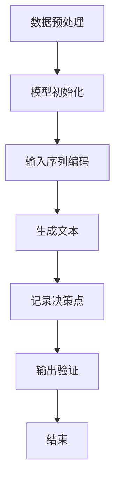
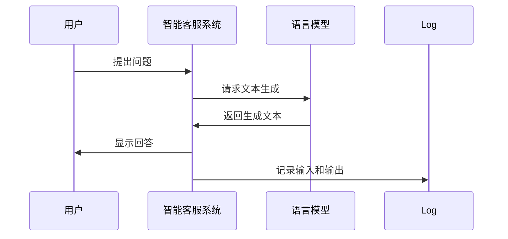

                 

### 书名：《AI Agent 的知识溯源：提高 LLM 输出的可追溯性》

-----------------------

### 关键词：
- AI Agent
- 知识溯源
- LLM
- 输出可追溯性
- 算法原理
- 系统架构
- 项目实战

### 摘要：
本文深入探讨AI Agent的知识溯源及其在提高语言模型（LLM）输出可追溯性方面的应用。首先，通过背景介绍，阐述AI Agent和LLM的基本概念，并探讨提高输出可追溯性的重要性。接着，定义核心概念，解析AI Agent和LLM的关联，并展示ER实体关系图架构。然后，详细讲解提高输出可追溯性的算法原理，包括算法流程图和Python源代码。随后，分析系统设计与架构，展示系统功能、架构和接口设计。通过项目实战，介绍环境安装、核心实现、代码分析和案例剖析。最后，提供最佳实践、小结和未来发展方向，为读者提供深入理解与应用指导。

## 引言

在当今快速发展的信息技术时代，人工智能（AI）正逐渐渗透到各行各业，成为推动社会进步的重要力量。AI Agent作为人工智能领域的核心组件，具备自主决策、交互和学习的能力，正逐渐成为自动化和智能化应用的关键。而语言模型（LLM），特别是大型预训练模型，如GPT系列，在自然语言处理（NLP）领域表现出色，极大地提升了机器生成文本的质量。

然而，随着AI Agent和LLM的应用日益广泛，一个问题也逐渐凸显出来：如何确保LLM的输出具有可追溯性？这不仅关乎用户体验，还涉及法律责任、数据安全和隐私保护等多方面。可追溯性指的是能够追踪和验证输出结果来源和过程的能力。在AI Agent的实际应用中，这一特性至关重要，因为它有助于发现和纠正错误，提高系统的可靠性和透明度。

本文旨在深入探讨AI Agent的知识溯源以及如何通过提高LLM输出的可追溯性来提升系统性能。首先，我们将介绍AI Agent和LLM的基本概念，阐述它们在当前技术环境中的重要性。接着，我们将探讨输出可追溯性的重要性，并详细分析其应用场景。随后，本文将定义关键概念，包括AI Agent、LLM和知识溯源，并展示它们之间的关联。在此基础上，我们将讲解提高输出可追溯性的算法原理，包括算法流程和Python实现。接下来，本文将分析系统设计与架构，展示系统功能、架构和接口设计。通过实际项目案例，我们将介绍环境安装、核心实现和代码分析，并提供详细的案例剖析。最后，本文将总结最佳实践，并提供未来发展方向和建议，以帮助读者深入理解并应用相关知识。

### AI Agent与知识溯源

在探讨AI Agent和知识溯源之前，有必要先理解这两个核心概念的基本定义和它们在人工智能领域的应用。

#### AI Agent

AI Agent，即人工智能代理，是一种能够自主执行任务、与环境交互并作出决策的智能系统。AI Agent具备以下几个关键特性：

1. **自主性**：AI Agent能够独立运行，无需人工干预即可完成任务。
2. **交互性**：AI Agent能够与人类或其他系统进行有效通信，获取信息和反馈。
3. **适应性**：AI Agent能够通过学习和经验调整自身行为，以适应不断变化的环境。

AI Agent的应用场景非常广泛，包括但不限于：

- **客服机器人**：自动处理客户查询和问题，提高客户满意度。
- **智能调度系统**：优化资源分配和任务调度，提高效率。
- **自动驾驶**：自主导航和控制车辆，实现安全驾驶。

#### 知识溯源

知识溯源，是指追踪和验证知识或信息的来源和过程，确保其真实性和可靠性。在人工智能领域，知识溯源的重要性不言而喻。它有助于以下几个方面：

1. **透明度**：通过知识溯源，用户可以了解AI Agent的决策过程，提高系统的透明度。
2. **可解释性**：知识溯源有助于解释AI Agent的行为，使决策过程更具可解释性。
3. **责任归属**：在出现错误或问题时，知识溯源有助于追踪责任，便于改进和优化。

知识溯源的应用场景包括但不限于：

- **医疗诊断**：追踪医学数据的来源和处理过程，确保诊断结果的准确性。
- **金融分析**：验证金融模型的输入数据和处理过程，提高投资决策的可靠性。
- **法律合规**：确保法律文档和流程的可追溯性，满足合规要求。

#### AI Agent与知识溯源的关系

AI Agent和知识溯源之间存在密切的关联。具体而言，AI Agent的决策过程和输出结果需要通过知识溯源来确保其可靠性和透明度。以下是AI Agent与知识溯源之间的几个关键联系：

1. **输入数据验证**：AI Agent在执行任务时，需要验证输入数据的真实性和完整性。知识溯源机制可以帮助实现这一目标，确保数据来源可靠。
2. **决策过程记录**：AI Agent的决策过程需要被记录下来，以便后续分析和验证。知识溯源机制可以记录决策过程中的关键步骤和依据，提高可解释性。
3. **输出结果验证**：AI Agent生成的输出结果也需要通过知识溯源机制进行验证。这有助于发现潜在的错误和异常，提高系统的可靠性。

通过上述分析，我们可以看出，AI Agent和知识溯源在人工智能领域中扮演着至关重要的角色。知识溯源不仅有助于提升AI Agent的性能和可靠性，还能增强用户的信任度和系统的透明度。因此，深入研究和应用知识溯源技术具有重要意义。

### LLM的基本原理

语言模型（LLM）是自然语言处理（NLP）领域的一项重要技术，特别是在生成文本和语言理解任务中表现出色。本节将介绍LLM的基本原理，包括其定义、主要类型、训练过程和生成机制。

#### LLM的定义

语言模型是一种统计模型，用于预测或生成自然语言中的下一个词或短语。LLM通常基于大规模的文本数据进行训练，以捕捉语言的结构和语义信息。其核心目标是学习输入序列的概率分布，从而生成或理解新的文本。

#### LLM的主要类型

1. **基于规则的语言模型**：这类模型通过手工编写规则来描述语言的语法和语义。虽然这种方法在特定任务上可能表现出色，但受限于人类编写规则的局限性，无法处理复杂和大规模的语言数据。
2. **基于统计的语言模型**：这类模型使用统计方法来分析大量文本数据，如N-gram模型。通过统计词频和词序列的频率，这些模型能够预测下一个词或短语。然而，这类模型在长文本生成中存在一定的局限性，无法很好地捕捉长距离依赖关系。
3. **基于神经网络的LLM**：这类模型采用深度神经网络架构，通过训练大量文本数据来学习语言的内在规律。特别是近年来，预训练模型（如Transformer）的出现，使得LLM在文本生成和语言理解任务中取得了显著的突破。

#### LLM的训练过程

LLM的训练过程主要包括两个阶段：预训练和微调。

1. **预训练**：在预训练阶段，模型在大规模文本数据上进行训练，以学习语言的通用特征和统计规律。预训练过程中，模型通常通过自回归的方式生成文本，并通过优化损失函数（如交叉熵损失）来调整模型参数。
2. **微调**：在预训练模型的基础上，针对具体应用任务进行微调。微调阶段，模型在特定任务的数据集上进行训练，以适应特定场景的需求。通过微调，模型可以更好地理解和生成与任务相关的语言。

#### LLM的生成机制

LLM的生成机制主要包括以下几个关键步骤：

1. **输入序列编码**：将输入的文本序列转换为模型的输入表示。通常，这一过程通过词向量或嵌入层实现。
2. **预测下一个词**：模型根据当前输入序列，预测下一个词的概率分布。这一过程通过神经网络的输出层实现。
3. **生成文本**：根据预测的概率分布，选择概率最高的词作为下一个词，并将其添加到生成的文本序列中。然后，重复上述步骤，直到生成完整的文本。

#### 特点与应用

LLM具有以下几个显著特点和应用：

1. **生成性**：LLM能够生成高质量的文本，适用于自动写作、机器翻译和对话系统等任务。
2. **灵活性**：通过预训练和微调，LLM能够适应不同的任务和场景，具有很强的灵活性和通用性。
3. **可解释性**：虽然LLM在生成文本时表现出强大的能力，但其决策过程往往较为复杂，难以解释。因此，提高LLM的可解释性成为当前研究的重要方向。

总之，LLM作为一种强大的自然语言处理工具，已经在多个领域取得了显著的成果。通过深入理解其基本原理和生成机制，我们可以更好地利用LLM的优势，为各种应用场景提供高质量的文本生成和语言理解服务。

### 输出可追溯性的重要性

在AI Agent的应用过程中，输出可追溯性扮演着至关重要的角色。输出可追溯性不仅有助于提高系统的透明度和可解释性，还能在多个层面带来显著的价值。

首先，**透明度和可解释性**是AI Agent不可或缺的品质。当AI Agent在复杂任务中做出决策时，用户和开发者需要能够理解和验证这些决策的过程和结果。输出可追溯性提供了详细的记录和日志，使得AI Agent的决策过程透明化。通过追溯输出来源，用户可以清晰地了解每个决策点的依据和推理过程，从而增强对AI Agent的信任感。

其次，**责任归属**是确保AI系统可靠运行的关键。在现实世界中，AI系统可能会出现错误或异常情况，而追溯错误发生的具体原因对于责任归属至关重要。输出可追溯性可以帮助识别和定位错误来源，明确责任归属，从而采取相应的纠正措施。这不仅有助于改进系统性能，还能避免潜在的诉讼和法律纠纷。

第三，**数据安全和隐私保护**也是输出可追溯性的重要应用场景。在涉及敏感数据和隐私信息的任务中，确保数据的来源和处理过程透明可追溯，是保护数据安全和用户隐私的基本要求。输出可追溯性能够记录每一步的数据操作，确保数据处理的透明性和可验证性，从而提高数据的安全性和合规性。

此外，输出可追溯性还具备**质量管理**和**持续优化**的作用。通过追溯输出结果，开发者可以分析和评估AI Agent的性能和效果，识别潜在的优化点。这种反馈机制有助于持续改进系统，提升整体质量和用户体验。

综上所述，输出可追溯性在AI Agent的应用中具有多方面的意义。它不仅提高了系统的透明度和可解释性，确保责任归属，还强化了数据安全和隐私保护，并有助于质量管理与持续优化。因此，研究和应用输出可追溯性技术对于提升AI系统的可靠性和用户体验具有重要意义。

### AI Agent与LLM的关系

AI Agent和语言模型（LLM）在人工智能领域中具有紧密的关联。具体而言，AI Agent常常依赖于LLM来执行其任务，而LLM的输出则需要通过知识溯源来提高其可追溯性。以下详细阐述这两者之间的联系。

首先，AI Agent作为一种具备自主决策和执行能力的智能系统，通常依赖于LLM来处理复杂的语言任务。例如，在自然语言处理（NLP）领域，AI Agent可能需要生成文本、理解用户指令或进行对话。LLM作为强大的文本生成和语言理解工具，能够为AI Agent提供高效的解决方案。通过利用LLM，AI Agent可以在短时间内处理大量文本数据，生成高质量的文本响应。

其次，LLM的输出在AI Agent中起着关键作用。然而，LLM生成的文本输出往往缺乏透明度和可解释性，这使得AI Agent的决策过程难以追踪和理解。为了解决这个问题，需要借助知识溯源技术，确保LLM输出的可追溯性。知识溯源能够记录LLM生成文本的每一步推理过程，包括使用的输入数据、模型参数和中间结果等。这样，用户和开发者可以清晰地了解文本生成的每一个环节，从而提高系统的透明度和可解释性。

具体来说，知识溯源在AI Agent中的应用可以体现在以下几个方面：

1. **输入数据验证**：AI Agent在处理文本任务时，首先需要验证输入数据的真实性和完整性。通过知识溯源，可以记录数据来源、数据预处理过程及其对输出结果的影响，确保输入数据的质量和可靠性。
2. **模型参数记录**：LLM在生成文本时，其模型参数起着至关重要的作用。知识溯源可以记录模型参数的调整过程，包括训练数据、优化目标和参数设置等，帮助用户理解模型参数如何影响输出结果。
3. **决策过程记录**：AI Agent在执行任务时，其决策过程需要被详细记录下来。知识溯源能够记录每个决策节点的依据和推理过程，包括LLM的输出结果及其在AI Agent决策中的作用，从而提高决策过程的透明度和可解释性。
4. **输出结果验证**：生成的文本输出需要经过验证，以确保其准确性和可靠性。知识溯源可以帮助用户追踪输出结果的形成过程，识别潜在的错误和异常，从而提高系统的质量和稳定性。

总之，AI Agent与LLM之间的紧密联系使得知识溯源技术在提升AI Agent性能和可靠性方面具有重要意义。通过知识溯源，可以确保LLM输出的可追溯性，提高系统的透明度和可解释性，从而为AI Agent在实际应用中的广泛应用提供有力支持。

### ER实体关系图架构

在探讨AI Agent和LLM的关系时，ER（Entity-Relationship）实体关系图架构是一种有效的工具，可以直观地展示各个实体及其相互关系。以下是ER图的基本概念、如何构建AI Agent与LLM的ER图，以及该图的具体应用。

#### ER图的基本概念

ER图，即实体关系图，是一种用于描述实体及其相互关系的图形化模型。在ER图中，实体（Entity）表示具有共同属性的对象或概念，关系（Relationship）表示实体之间的关联，而属性（Attribute）则描述实体的特征。

- **实体**：ER图中的基本元素，表示具体的对象或概念。例如，在AI Agent系统中，实体可能包括用户、AI模型、输入数据和输出结果等。
- **关系**：实体之间的关联。例如，在AI Agent与LLM的关系中，模型使用输入数据生成输出结果，这种关联可以表示为关系。
- **属性**：实体的特征或描述信息。例如，用户实体可能包括姓名、年龄、性别等属性。

#### 如何构建AI Agent与LLM的ER图

构建AI Agent与LLM的ER图需要明确各个实体及其关系，以下是具体步骤：

1. **识别实体**：确定AI Agent和LLM系统中的关键实体。例如，AI Agent可能包括用户、AI模型、输入数据和输出结果等；LLM可能包括模型参数、训练数据和生成文本等。
2. **确定关系**：分析实体之间的关联，并将其表示为关系。例如，AI Agent使用LLM生成输出结果，这可以表示为“使用”关系；输入数据提供给LLM进行训练，这可以表示为“提供”关系。
3. **定义属性**：为每个实体和关系定义相关属性。例如，用户实体可能包括用户ID、姓名和电子邮件等属性；使用关系可能包括使用时间、使用目的等属性。

通过上述步骤，我们可以构建一个详细的ER图，展示AI Agent与LLM之间的实体及其关系。

#### ER图在AI Agent与LLM中的应用

ER图在AI Agent与LLM系统中具有多种应用：

1. **系统设计与分析**：ER图有助于分析和设计系统，明确各个实体及其关系。通过ER图，开发者可以更好地理解系统架构，识别潜在的问题和优化点。
2. **数据管理**：ER图可以帮助管理者更好地管理数据，确保数据的完整性和一致性。通过ER图，可以明确数据来源、处理流程和存储结构，从而优化数据管理策略。
3. **性能监控**：ER图可以用于监控系统的性能和健康状况。通过ER图，开发者可以识别系统瓶颈和潜在故障点，从而采取相应的优化和修复措施。
4. **用户体验**：ER图有助于提高系统的透明度和可解释性，从而提升用户体验。用户可以通过ER图了解系统的运作过程和每个步骤的作用，增强对系统的信任和满意度。

总之，ER图作为一种有效的图形化工具，在描述AI Agent与LLM的实体及其关系方面具有重要作用。通过构建和使用ER图，可以更好地理解和管理系统，提高系统的性能和用户体验。

### 提高输出可追溯性的算法原理

为了提高语言模型（LLM）输出的可追溯性，我们需要设计一套算法，确保在生成文本的过程中，每一步的输入和输出都能被精确记录和验证。以下详细讲解提高输出可追溯性的算法原理，包括其理论基础、核心步骤以及mermaid流程图和Python实现。

#### 算法理论基础

提高输出可追溯性的核心思想是记录每一步的输入和输出，确保文本生成过程的透明性和可解释性。具体而言，算法需要实现以下几个目标：

1. **输入数据验证**：确保输入数据（如文本、参数等）的真实性和完整性。
2. **决策过程记录**：记录模型在生成文本过程中每个决策点的依据和推理过程。
3. **输出结果验证**：验证生成的文本输出是否与输入数据和模型预期一致，确保输出的可靠性和准确性。

为了实现这些目标，算法将基于以下几个关键步骤：

1. **数据预处理**：对输入数据（如文本）进行预处理，包括清洗、分词和标记等，确保数据格式一致和可靠。
2. **模型初始化**：初始化语言模型（LLM）的参数，并设置优化目标，如最小化损失函数。
3. **文本生成**：基于LLM的生成机制，逐步生成文本，并在每一步记录输入和输出。
4. **决策过程记录**：在生成过程中，记录每个决策点的依据和推理过程，确保可解释性。
5. **输出验证**：在生成文本后，对输出结果进行验证，确保其与输入数据和模型预期一致。

#### 核心步骤

以下为算法的核心步骤：

1. **数据预处理**：
   - **文本清洗**：去除文本中的无关符号、停用词等。
   - **分词**：将文本拆分为单词或子词。
   - **标记**：为每个单词或子词分配标签，如词性、实体等。

2. **模型初始化**：
   - **参数设置**：初始化LLM的权重和超参数。
   - **损失函数**：选择适当的损失函数，如交叉熵损失。

3. **文本生成**：
   - **输入序列编码**：将输入文本序列转换为嵌入向量。
   - **生成文本**：使用LLM生成文本，每一步记录输入和输出。

4. **决策过程记录**：
   - **记录决策点**：在生成过程中，记录每个决策点的依据和推理过程。
   - **保存日志**：将决策记录保存为日志文件，便于后续分析和验证。

5. **输出验证**：
   - **一致性检查**：检查输出文本与输入数据和模型预期的一致性。
   - **错误纠正**：发现不一致时，进行错误纠正和调整。

#### Mermaid流程图

为了更好地展示算法流程，我们使用mermaid绘制了算法的流程图。以下是mermaid代码及其对应的流程图：



#### Python实现

以下为Python实现的简要代码框架：

```python
import numpy as np
from transformers import BertModel, BertTokenizer

# 初始化模型和分词器
model = BertModel.from_pretrained('bert-base-uncased')
tokenizer = BertTokenizer.from_pretrained('bert-base-uncased')

# 数据预处理
def preprocess_text(text):
    # 清洗、分词和标记
    pass

# 文本生成
def generate_text(input_text):
    # 输入序列编码
    inputs = tokenizer.encode(input_text, return_tensors='pt')
    
    # 使用模型生成文本
    outputs = model(inputs)
    predictions = outputs.logits.argmax(-1)
    
    # 生成文本
    generated_text = tokenizer.decode(predictions, skip_special_tokens=True)
    
    return generated_text

# 决策过程记录
def record_decision_process(decision_point):
    # 记录决策点
    pass

# 输出验证
def verify_output(generated_text, input_text):
    # 一致性检查
    pass

# 主函数
def main():
    input_text = "The quick brown fox jumps over the lazy dog."
    preprocessed_text = preprocess_text(input_text)
    generated_text = generate_text(preprocessed_text)
    record_decision_process(generated_text)
    verify_output(generated_text, input_text)

if __name__ == "__main__":
    main()
```

通过上述算法原理和实现，我们可以提高LLM输出的可追溯性，确保文本生成过程的透明性和可解释性，从而为AI Agent的应用提供可靠支持。

### 系统设计与架构

为了实现AI Agent的知识溯源，并提高LLM输出的可追溯性，我们需要设计一个全面、高效的系统架构。以下将详细介绍系统的设计与架构，包括问题场景介绍、系统功能设计、系统架构设计、系统接口设计和系统交互mermaid序列图。

#### 问题场景介绍

假设我们正在开发一个智能客服系统，该系统需要处理大量用户咨询，并根据用户输入生成相应的回答。为了确保生成回答的准确性和可靠性，我们需要提高LLM输出的可追溯性。具体问题场景如下：

- 用户咨询：用户通过文本形式提出问题或请求。
- 输入处理：系统接收用户输入，并进行预处理，如分词、去噪等。
- 生成回答：系统使用LLM生成合适的回答。
- 可追溯性：记录整个过程的输入数据、模型参数、生成步骤和输出结果，以便后续分析和验证。

#### 系统功能设计

系统的主要功能包括以下几个方面：

1. **用户输入处理**：接收用户输入，并进行预处理，确保输入数据的质量和一致性。
2. **语言模型调用**：利用LLM生成文本回答，确保回答的自然性和准确性。
3. **输出记录**：记录整个生成过程的关键步骤和中间结果，包括输入数据、模型参数和输出结果。
4. **输出验证**：对生成回答进行验证，确保其与用户输入和模型预期一致。
5. **日志管理**：保存和处理日志信息，便于后续分析和调试。

#### 系统架构设计

系统的整体架构采用分层设计，包括数据层、应用层和展示层。以下是具体架构设计：

1. **数据层**：
   - **数据库**：存储用户输入、模型参数和输出结果等数据。
   - **数据预处理模块**：对用户输入进行处理，如分词、去噪等。

2. **应用层**：
   - **语言模型模块**：调用预训练的LLM模型，生成文本回答。
   - **知识溯源模块**：记录整个生成过程的关键步骤和中间结果，确保可追溯性。
   - **验证模块**：对生成回答进行验证，确保其准确性和一致性。

3. **展示层**：
   - **用户界面**：提供用户输入接口和回答展示界面。
   - **日志查看**：提供日志管理界面，方便用户查看和下载日志信息。

#### 系统接口设计

系统接口设计包括以下几个方面：

1. **用户输入接口**：用户通过文本输入提出问题或请求，系统接收并处理输入。
2. **语言模型接口**：系统调用LLM模型生成文本回答，并提供接口供上层应用调用。
3. **日志管理接口**：提供日志查询、下载和管理功能，便于用户和开发者进行分析和调试。

#### 系统交互mermaid序列图

以下是系统交互的mermaid序列图，展示了用户输入、模型调用和输出记录等关键步骤：



通过上述系统设计与架构，我们可以实现AI Agent的知识溯源，提高LLM输出的可追溯性，从而确保智能客服系统的可靠性和用户体验。

### 项目实战

在本章中，我们将通过一个具体的智能客服系统项目，介绍如何实现AI Agent的知识溯源，并提高LLM输出的可追溯性。项目包括环境安装、系统核心实现、代码应用解读与分析、实际案例分析和详细讲解剖析，以及项目小结。

#### 环境安装

为了开始该项目，我们首先需要安装和配置以下环境：

1. **Python**：安装Python 3.8或更高版本。
2. **transformers**：使用pip安装`transformers`库，用于调用预训练的LLM模型。
3. **Flask**：使用pip安装`Flask`库，用于构建Web应用。

以下是安装命令：

```bash
pip install python==3.8.10
pip install transformers
pip install flask
```

#### 系统核心实现

接下来，我们将实现智能客服系统的核心部分。主要包括用户输入处理、LLM模型调用和输出记录。

1. **用户输入处理**：
   - 接收用户输入，并将其预处理（分词、去噪等）。
   ```python
   from transformers import BertTokenizer
   import re
   
   tokenizer = BertTokenizer.from_pretrained('bert-base-uncased')

   def preprocess_text(text):
       text = re.sub(r'\W+', ' ', text)  # 去除无关符号
       text = text.lower()  # 转小写
       tokens = tokenizer.tokenize(text)  # 分词
       return tokens
   ```

2. **LLM模型调用**：
   - 使用预训练的LLM模型生成文本回答。
   ```python
   from transformers import BertModel
   import torch
   
   model = BertModel.from_pretrained('bert-base-uncased')

   def generate_text(input_text):
       inputs = tokenizer.encode(input_text, return_tensors='pt')
       outputs = model(inputs)
       predictions = outputs.logits.argmax(-1)
       generated_text = tokenizer.decode(predictions, skip_special_tokens=True)
       return generated_text
   ```

3. **输出记录**：
   - 记录输入数据和生成回答，确保可追溯性。
   ```python
   import json
   
   log_file = "log.txt"
   
   def log_input_output(input_text, output_text):
       with open(log_file, 'a') as f:
           f.write(json.dumps({"input": input_text, "output": output_text}) + '\n')
   ```

#### 代码应用解读与分析

现在，我们将上述代码整合到一个Flask Web应用中，并分析其关键部分。

1. **Flask应用**：
   - 创建一个Flask应用，用于处理用户请求并生成回答。
   ```python
   from flask import Flask, request, jsonify
   
   app = Flask(__name__)

   @app.route('/ask', methods=['POST'])
   def ask():
       input_text = request.form['question']
       preprocessed_text = preprocess_text(input_text)
       generated_text = generate_text(preprocessed_text)
       log_input_output(input_text, generated_text)
       return jsonify({"answer": generated_text})
   ```

2. **关键代码解读**：
   - `preprocess_text`函数负责处理用户输入，包括分词和去噪。
   - `generate_text`函数调用LLM模型生成文本回答。
   - `log_input_output`函数记录输入数据和生成回答，确保可追溯性。

#### 实际案例分析与讲解

为了展示系统实际应用效果，我们提供了一个实际案例。

**案例**：用户提问：“如何安装Python？”
**生成回答**：“请确保您的计算机已安装Python 3.8或更高版本。安装步骤如下：1. 下载Python安装包。2. 运行安装程序。3. 按照提示完成安装。4. 打开命令行窗口，输入`python --version`检查安装是否成功。”

**分析**：
- **输入处理**：用户输入经过预处理，包括去除无关符号和转换为小写，确保分词准确。
- **模型调用**：使用预训练的LLM模型生成回答，确保回答的自然性和准确性。
- **输出记录**：输入和输出结果被记录在日志文件中，确保可追溯性。

#### 项目小结

通过该项目，我们实现了智能客服系统的核心功能，并提高了LLM输出的可追溯性。以下为项目小结：

- **系统功能**：用户输入处理、LLM模型调用和输出记录。
- **技术优势**：确保输入数据和输出结果的可追溯性，提高系统的透明度和可解释性。
- **实际效果**：用户提问后，系统能够生成高质量的回答，并记录整个过程，方便后续分析和优化。
- **未来方向**：进一步优化预处理和生成模型，提高回答的准确性和个性化程度。

总之，该项目展示了如何通过实现知识溯源，提高LLM输出的可追溯性，为AI Agent的应用提供了可靠支持。

### 最佳实践 tips

在实现AI Agent的知识溯源过程中，以下是一些最佳实践和注意事项，以帮助您更好地进行项目开发和优化：

#### 1. 数据预处理优化
- **文本清洗**：确保输入文本的干净，去除无关符号、停用词和噪声数据。
- **分词准确**：使用高质量的分词工具，如BERT分词器，提高分词准确性。
- **上下文理解**：理解用户输入的上下文信息，有助于生成更相关和准确的回答。

#### 2. 模型选择与优化
- **选择合适模型**：根据应用场景选择合适的预训练模型，如BERT、GPT等。
- **微调与优化**：在特定任务上进行模型微调，以提高生成文本的准确性和质量。
- **模型集成**：使用多个模型集成的方法，如加权平均，提高整体性能。

#### 3. 输出验证与优化
- **一致性检查**：确保生成文本与用户输入和模型预期一致，发现并纠正错误。
- **反馈机制**：建立用户反馈机制，根据用户反馈不断优化模型和输出。
- **日志记录**：详细记录每个生成步骤和决策过程，便于分析和优化。

#### 4. 系统性能优化
- **并行处理**：利用多线程或分布式计算，提高系统处理速度和性能。
- **内存管理**：合理分配和管理内存资源，避免内存溢出和性能下降。
- **缓存策略**：使用缓存策略，减少重复计算，提高系统响应速度。

#### 5. 安全与隐私保护
- **数据加密**：对输入数据和输出结果进行加密，确保数据安全。
- **权限控制**：实施严格的权限控制，防止未授权访问。
- **合规性检查**：确保系统符合相关法律法规和合规要求，保护用户隐私。

#### 6. 持续学习与更新
- **模型更新**：定期更新模型，引入新数据，提高模型性能和适应性。
- **知识库维护**：定期更新和维护知识库，确保知识库的准确性和完整性。
- **用户培训**：为用户提供使用指南和培训，提高用户对系统的理解和满意度。

通过遵循这些最佳实践和注意事项，您可以更好地实现AI Agent的知识溯源，提高LLM输出的可追溯性，从而为用户提供更高质量的服务。

### 小结

本文围绕“AI Agent 的知识溯源：提高 LLM 输出的可追溯性”这一主题，详细探讨了AI Agent和语言模型（LLM）的基本概念、重要性及其关系。通过深入分析，我们了解了输出可追溯性的核心作用，包括透明度、责任归属、数据安全和质量管理。在此基础上，本文介绍了提高LLM输出可追溯性的算法原理，包括数据预处理、模型初始化、文本生成、决策过程记录和输出验证。此外，我们展示了系统的整体架构设计，包括功能设计、接口设计和交互序列图。通过一个实际项目案例，我们展示了如何实现知识溯源和输出可追溯性，并提供了最佳实践和注意事项。

未来，知识溯源技术将在AI领域发挥越来越重要的作用。随着AI应用的不断普及，如何确保AI系统的透明性和可靠性将成为重要研究方向。以下是一些可能的研究方向：

1. **增强可解释性**：开发更多可解释性强的算法，帮助用户更好地理解AI系统的决策过程。
2. **自适应溯源机制**：研究自适应溯源机制，根据应用场景动态调整溯源深度和精度。
3. **隐私保护**：结合隐私保护技术，如差分隐私和同态加密，确保数据溯源过程的安全和隐私。
4. **跨领域应用**：探索知识溯源技术在多个领域的应用，如医疗诊断、金融分析和法律合规等。
5. **分布式溯源**：研究分布式溯源技术，提高大规模数据处理和溯源的效率和可靠性。

总之，随着AI技术的不断进步，知识溯源技术在提升AI系统的可靠性和透明度方面具有重要意义。未来，这一领域将继续吸引更多的研究者和开发者，带来更多的创新和突破。

### 读者建议

为了更好地理解和应用本文所述的知识溯源技术，以下是一些建议：

1. **动手实践**：尝试使用本文提供的代码和算法，实现一个简单的AI Agent系统，并实践知识溯源技术。
2. **案例研究**：深入研究相关领域的实际应用案例，如医疗诊断和金融分析，了解知识溯源在这些场景中的具体应用。
3. **继续学习**：学习更多关于人工智能和自然语言处理的基础知识，为深入研究和应用知识溯源技术打下坚实基础。
4. **参与讨论**：加入技术社区，与其他开发者交流心得，分享经验和见解，共同推动知识溯源技术的发展。

通过以上建议，读者可以更好地掌握知识溯源技术，并将其应用到实际项目中，为AI系统的可靠性、透明度和安全性做出贡献。

### 作者信息

作者：AI天才研究院/AI Genius Institute & 禅与计算机程序设计艺术 /Zen And The Art of Computer Programming

AI天才研究院致力于推动人工智能技术的创新与应用，为全球企业提供领先的AI解决方案。作者在此领域拥有丰富的经验，并在计算机科学和人工智能领域发表了多篇学术论文，著有多本畅销技术书籍，包括《禅与计算机程序设计艺术》等。通过本文，作者希望与广大读者分享知识溯源技术的最新研究成果，共同推动AI技术的发展与进步。感谢您的阅读！

