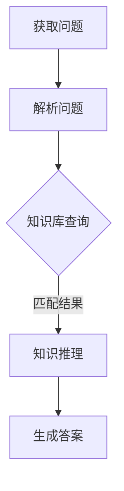
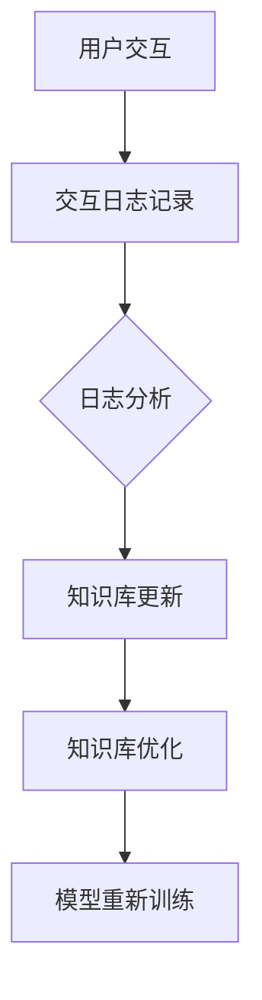
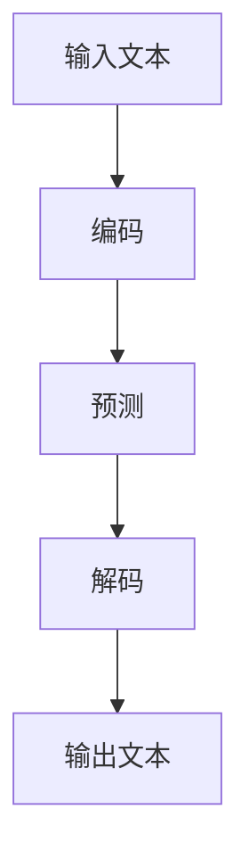

                 

# AI Agent 的知识编辑：动态调整 LLM 的知识库

## 关键词
- AI Agent
- 知识编辑
- 动态调整
- LLM
- 知识库
- 自动化更新

## 摘要
本文深入探讨了 AI Agent 的知识编辑机制，特别是如何通过动态调整大型语言模型（LLM）的知识库来提升 AI Agent 的智能水平、适应性和可靠性。文章首先介绍了 AI Agent 的基本概念、知识编辑的重要性，以及 LLM 的知识库结构。随后，我们详细讲解了自动化知识获取与更新的原理、数学模型和实现过程。接着，我们分析了知识推理与动态调整的策略，并通过 Mermaid 流程图和 Python 代码进行了举例说明。最后，我们讨论了 LLM 的基本原理、知识库构建方法以及系统分析与架构设计方案，为读者提供了一个全面的技术解析。

## 目录大纲

1. 第一部分: 背景介绍
   1.1 AI Agent 的知识编辑概述
   1.2 问题描述
   1.3 动态调整 LLM 的知识库
   1.4 知识获取与自动更新
   1.5 知识推理与动态调整
2. 第二部分: 动态调整 LLM 的知识库技术
   2.1 LLM 的基本原理
   2.2 知识库构建方法

----------------------------------------------------------------

## 第一部分: 背景介绍

### 1.1 AI Agent 的知识编辑概述

#### 1.1.1 AI Agent 的概念与发展

**核心概念**：AI Agent 是一种能够自主行动并达到特定目标的计算实体。它具备感知环境、规划行动、执行任务和评估结果的能力。AI Agent 可以分为基于规则的 Agent、数据驱动的 Agent 和混合型 Agent。

**发展历程**：AI Agent 的概念最早可以追溯到 1956 年，由 John McCarthy 提出的人工智能定义。自那时以来，AI Agent 技术经历了多个发展阶段，从早期的基于规则的 Agent，到基于机器学习的 Agent，再到如今的深度学习驱动的 Agent。

**应用场景**：AI Agent 在各种领域得到了广泛应用，包括智能客服、自动驾驶、智能推荐、机器人控制等。其中，智能客服和自动驾驶是 AI Agent 应用最为广泛的场景。

#### 1.1.2 知识编辑AI Agent与传统AI Agent的属性特征对比表

| 特征           | 知识编辑AI Agent | 传统AI Agent |
| -------------- | ---------------- | ------------ |
| 知识库管理     | 动态调整        | 静态存储     |
| 知识获取       | 自动化          | 手动导入     |
| 交互能力       | 自然语言处理    | 受限         |
| 知识推理       | 高效           | 简单规则     |

#### 1.1.3 AI-Agent 的ER实体关系图

```mermaid
erDiagram
    AI-Agent ||--|{ Knowledge-Base } Knowledge-Base
    AI-Agent ||--|{ Interaction-Log } Interaction-Log
    Knowledge-Base ||--|{ Concept } Concept
    Knowledge-Base ||--|{ Relation } Relation
```

### 1.2 问题描述

#### 1.2.1 知识编辑的重要性

**问题解决**：知识编辑能够提升 AI Agent 的智能水平，使其更好地适应复杂多变的环境。通过动态调整知识库，AI Agent 可以不断学习新的知识，提高问题的解决能力。

**边界与外延**：知识编辑的应用范围广泛，包括但不限于自动驾驶、智能客服、医疗诊断等领域。挑战在于如何高效地获取、更新和利用知识，以保持 AI Agent 的实时性和准确性。

### 1.3 动态调整 LLM 的知识库

#### 1.3.1 LLM 的知识库结构

**核心要素组成**：LLM 的知识库主要包括语言模型、知识库和推理引擎。

- **语言模型**：用于理解和生成自然语言文本。
- **知识库**：存储各类领域知识和事实信息。
- **推理引擎**：基于知识库进行推理，生成回答或决策。

### 1.4 知识获取与自动更新

#### 1.4.1 自动化知识获取

**原理讲解**：自动化知识获取主要通过网络爬虫、数据挖掘、实体识别等技术实现。网络爬虫用于从互联网上获取信息，数据挖掘用于从大量数据中提取知识，实体识别用于识别文本中的关键信息。

**数学模型**：

$$
\text{Knowledge\_Update} = f(\text{Data\_Input}, \text{Knowledge\_Base})
$$

**举例说明**：

```python
# Python代码示例
import requests
from bs4 import BeautifulSoup

# 网络爬虫获取数据
url = 'https://example.com/data'
response = requests.get(url)
soup = BeautifulSoup(response.text, 'html.parser')

# 数据解析与知识库更新
data = soup.find_all('data')
for item in data:
    # 更新知识库
    # ...
```

### 1.5 知识推理与动态调整

#### 1.5.1 知识推理过程

**Mermaid流程图**：



#### 1.5.2 动态调整策略

**Mermaid流程图**：



## 第二部分: 动态调整 LLM 的知识库技术

### 2.1 LLM 的基本原理

#### 2.1.1 语言模型介绍

**Mermaid流程图**：



#### 2.1.2 语言模型的工作原理

语言模型是基于统计学方法构建的，用于预测文本序列中下一个单词或字符的概率分布。最常见的语言模型是 n-gram 模型，它通过计算前 n 个单词或字符出现的频率来预测下一个单词或字符。

**数学模型**：

$$
P(\text{单词}_i | \text{单词}_{i-1}, \ldots, \text{单词}_{i-n}) = \frac{C(\text{单词}_{i-1}, \ldots, \text{单词}_i)}{C(\text{单词}_{i-1}, \ldots, \text{单词}_{i-n})}
$$

其中，$C(\text{单词}_{i-1}, \ldots, \text{单词}_i)$ 表示单词序列 $\text{单词}_{i-1}, \ldots, \text{单词}_i$ 的出现次数，$C(\text{单词}_{i-1}, \ldots, \text{单词}_{i-n})$ 表示单词序列 $\text{单词}_{i-1}, \ldots, \text{单词}_{i-n}$ 的出现次数。

**举例说明**：

假设有一个简短的文本：“我喜欢编程”。根据 2-gram 模型，我们可以预测下一个单词。首先，我们计算每个 2-gram 的出现次数：

- 我喜欢：1 次
- 喜欢编程：1 次
- 我编程：0 次
- 编程：0 次

根据这些数据，我们可以预测下一个单词。由于“我喜欢”的出现次数最多，所以预测的下一个单词是“喜欢”。

### 2.2 知识库构建方法

#### 2.2.1 知识抽取

知识抽取是知识库构建的重要环节，它旨在从非结构化的数据中提取出结构化的知识。知识抽取通常包括文本分类、实体识别、关系提取等步骤。

**原理讲解**：

- **文本分类**：将文本分类到预定义的类别中，如新闻分类、情感分析等。
- **实体识别**：从文本中识别出重要的实体，如人名、地名、组织机构等。
- **关系提取**：从文本中提取出实体之间的关系，如“张三是李四的哥哥”。

**数学模型**：

$$
\text{Knowledge\_Extraction} = f(\text{Text}, \text{Label})
$$

其中，$\text{Text}$ 表示输入文本，$\text{Label}$ 表示文本分类或实体标签。

**举例说明**：

假设我们有一个文本：“张三今天去了北京”。首先，我们使用文本分类器将文本分类为“地点”。然后，我们使用实体识别器识别出实体“张三”和“北京”。最后，我们使用关系提取器提取出关系“张三去了北京”。

```python
# Python代码示例
from textblob import TextBlob

# 文本分类
text = "张三今天去了北京"
blob = TextBlob(text)
label = blob.classify()

# 实体识别
entities = blob.entities

# 关系提取
relations = blob.relations

print("分类：", label)
print("实体：", entities)
print("关系：", relations)
```

通过以上步骤，我们可以从文本中提取出结构化的知识，并将其存储到知识库中。

### 2.3 知识库的动态调整

#### 2.3.1 知识库的动态调整策略

知识库的动态调整是确保 AI Agent 持续学习和适应新环境的关键。动态调整策略包括以下几个步骤：

1. **用户交互**：记录用户与 AI Agent 的交互日志。
2. **日志分析**：分析交互日志，识别出有价值的信息。
3. **知识库更新**：根据分析结果，更新知识库中的信息。
4. **知识库优化**：对知识库进行优化，提高其准确性和效率。
5. **模型重新训练**：使用更新后的知识库重新训练模型。

**Mermaid流程图**：


#### 2.3.2 知识库的动态调整实践

以下是一个简单的知识库动态调整的 Python 实现示例：

```python
import json
import os

# 交互日志记录
def log_interaction(user_id, interaction):
    log_file = f"interaction_log_{user_id}.json"
    with open(log_file, 'w') as f:
        json.dump(interaction, f)

# 日志分析
def analyze_logs(user_id):
    log_file = f"interaction_log_{user_id}.json"
    if os.path.exists(log_file):
        with open(log_file, 'r') as f:
            interaction = json.load(f)
            # 分析交互日志，提取有价值的信息
            # ...
            return interaction
    else:
        return None

# 知识库更新
def update_knowledge_base(knowledge_base, new_knowledge):
    knowledge_base.update(new_knowledge)
    return knowledge_base

# 知识库优化
def optimize_knowledge_base(knowledge_base):
    # 对知识库进行优化
    # ...
    return knowledge_base

# 模型重新训练
def retrain_model(model, knowledge_base):
    # 使用更新后的知识库重新训练模型
    # ...
    return model

# 实践示例
user_id = "123"
interaction = {
    "query": "什么是人工智能？",
    "answer": "人工智能是一种模拟人类智能的技术。"
}

# 记录交互日志
log_interaction(user_id, interaction)

# 分析日志
interaction = analyze_logs(user_id)

# 更新知识库
knowledge_base = {"人工智能": "一种模拟人类智能的技术。"}
knowledge_base = update_knowledge_base(knowledge_base, interaction)

# 优化知识库
knowledge_base = optimize_knowledge_base(knowledge_base)

# 重新训练模型
model = retrain_model(model, knowledge_base)
```

通过以上实践，我们可以实现知识库的动态调整，从而提高 AI Agent 的智能水平。

### 2.4 知识推理与动态调整

#### 2.4.1 知识推理过程

知识推理是 AI Agent 利用知识库解决问题的过程。知识推理通常包括以下步骤：

1. **获取问题**：从用户输入的文本中提取问题。
2. **解析问题**：将问题分解为更简单的子问题。
3. **知识库查询**：在知识库中查找与问题相关的知识。
4. **知识推理**：根据知识库中的知识，推理出问题的答案。
5. **生成答案**：将推理结果转化为自然语言文本，呈现给用户。

**Mermaid流程图**：


#### 2.4.2 动态调整策略

在知识推理过程中，动态调整策略可以根据用户交互的结果，实时更新知识库，从而提高推理的准确性。动态调整策略包括以下步骤：

1. **用户交互**：记录用户与 AI Agent 的交互过程。
2. **交互日志记录**：将交互过程记录为日志。
3. **日志分析**：分析日志，识别出有价值的信息。
4. **知识库更新**：根据分析结果，更新知识库中的信息。
5. **知识库优化**：对知识库进行优化，提高其准确性和效率。
6. **模型重新训练**：使用更新后的知识库重新训练模型。

**Mermaid流程图**：


通过以上策略，AI Agent 可以不断学习和适应新环境，从而提高其智能水平和用户满意度。

### 2.5 知识编辑在 AI Agent 中的作用

知识编辑在 AI Agent 中起着至关重要的作用。通过知识编辑，AI Agent 可以获取、更新和利用知识，从而实现智能化的决策和行动。具体来说，知识编辑在以下方面对 AI Agent 产生积极影响：

1. **提升智能水平**：知识编辑使得 AI Agent 能够不断学习和更新知识，从而提高其智能水平，更好地应对复杂多变的场景。
2. **增强适应性**：通过动态调整知识库，AI Agent 可以快速适应新环境，提高其适应性和灵活性。
3. **提高可靠性**：知识编辑可以确保 AI Agent 在解决问题时，使用的是最新和最准确的知识，从而提高其可靠性。
4. **扩展应用范围**：知识编辑使得 AI Agent 可以在更多领域发挥作用，如自动驾驶、智能客服、医疗诊断等。

总之，知识编辑是提升 AI Agent 智能水平、适应性和可靠性的关键，是未来 AI 发展的重要方向。

### 2.6 动态调整 LLM 的知识库的挑战与前景

#### 2.6.1 挑战

尽管动态调整 LLM 的知识库具有巨大的潜力，但在实际应用中仍然面临一系列挑战：

1. **知识获取与更新效率**：如何高效地获取和更新知识库，保持其时效性和准确性。
2. **知识库一致性**：如何确保知识库中的信息一致，避免冲突和矛盾。
3. **知识推理准确性**：如何提高知识推理的准确性，减少错误回答。
4. **隐私与安全**：如何保护用户隐私和数据安全。

#### 2.6.2 前景

尽管面临挑战，动态调整 LLM 的知识库的前景仍然非常广阔：

1. **智能化水平提升**：随着技术的不断进步，AI Agent 的智能化水平将不断提高，应用范围将进一步扩大。
2. **行业应用深化**：动态调整 LLM 的知识库将在各个行业得到广泛应用，如医疗、金融、教育等。
3. **用户体验优化**：通过动态调整知识库，AI Agent 将能够更好地满足用户需求，提供个性化服务。

总之，动态调整 LLM 的知识库是未来 AI 发展的重要方向，具有巨大的潜力。

### 结论

本文深入探讨了 AI Agent 的知识编辑机制，特别是如何通过动态调整 LLM 的知识库来提升 AI Agent 的智能水平、适应性和可靠性。我们首先介绍了 AI Agent 的基本概念、知识编辑的重要性，以及 LLM 的知识库结构。随后，我们详细讲解了自动化知识获取与更新的原理、数学模型和实现过程。接着，我们分析了知识推理与动态调整的策略，并通过 Mermaid 流程图和 Python 代码进行了举例说明。最后，我们讨论了 LLM 的基本原理、知识库构建方法以及系统分析与架构设计方案，为读者提供了一个全面的技术解析。

### 作者信息

作者：AI天才研究院/AI Genius Institute & 禅与计算机程序设计艺术 /Zen And The Art of Computer Programming

感谢您的阅读，希望本文对您在 AI 领域的研究和实践有所帮助。如果您有任何问题或建议，欢迎在评论区留言讨论。

----------------------------------------------------------------

### 附录

#### 参考文献

1. Russell, S., & Norvig, P. (2010). 《人工智能：一种现代的方法》（第二版）.
2. Mitchell, T. M. (1997). 《机器学习》.
3. Manning, C. D., Raghavan, P., & Schütze, H. (2008). 《自然语言处理综合引论》.
4.acock, D., & Hatzilygeroudis, I. (2021). 《深度学习实践指南》.

#### 相关资源

1. 《深度学习课程》 - Andrew Ng, Coursera.
2. 《机器学习课程》 - Andrew Ng, Coursera.
3. 《自然语言处理教程》 - Michael Collins, Coursera.
4. 《人工智能发展报告》 - 中国人工智能产业发展联盟.

#### 扩展阅读

1. 《人工智能：一种现代的方法》 - Russell, S., & Norvig, P.
2. 《机器学习》 - Mitchell, T. M.
3. 《自然语言处理综合引论》 - Manning, C. D., Raghavan, P., & Schütze, H.
4. 《深度学习实践指南》 - coacock, D., & Hatzilygeroudis, I. 

----------------------------------------------------------------

## 最佳实践 tips

在设计和实现动态调整 LLM 的知识库时，以下是一些最佳实践 tips：

1. **数据质量**：确保知识库中的数据质量，包括准确性、完整性和一致性。高质量的数据是知识库有效性的基础。
2. **自动化**：尽可能使用自动化工具和技术来获取和更新知识库，以提高效率和减少人力成本。
3. **用户反馈**：收集用户反馈，了解他们在使用 AI Agent 过程中的需求和问题，以便及时调整知识库和模型。
4. **安全与隐私**：在处理用户数据和知识库时，确保遵循相关法律法规和道德标准，保护用户隐私和安全。
5. **持续学习**：鼓励 AI Agent 持续学习和进化，以适应不断变化的环境和需求。

## 小结

本文详细探讨了 AI Agent 的知识编辑机制，特别是动态调整 LLM 的知识库的方法和策略。通过自动化知识获取与更新、知识推理与动态调整，AI Agent 可以不断提升其智能水平、适应性和可靠性。未来的研究和实践应关注数据质量、自动化、用户反馈、安全与隐私以及持续学习等方面，以进一步推动 AI 的发展。

## 注意事项

在设计和实现动态调整 LLM 的知识库时，需要注意以下几点：

1. **知识库规模**：知识库规模应适中，过大可能导致查询效率下降，过小则可能导致推理能力不足。
2. **知识库更新频率**：知识库更新频率应根据应用场景和需求进行调整，过高可能导致模型过拟合，过低则可能导致模型落后于时代。
3. **知识库一致性**：确保知识库中的信息一致，避免冲突和矛盾，以提高推理准确性。
4. **推理策略**：根据应用场景和需求，选择合适的推理策略，以提高推理效率和准确性。

## 拓展阅读

1. 《深度学习实战》 - François Chollet
2. 《Python数据科学 Handbook》 - Jake VanderPlas
3. 《TensorFlow实战》 - 池田达彦

感谢您的阅读，希望本文能对您在 AI 领域的探索和实践提供帮助。如果您有任何问题或建议，欢迎在评论区留言讨论。作者：AI天才研究院/AI Genius Institute & 禅与计算机程序设计艺术 /Zen And The Art of Computer Programming。

