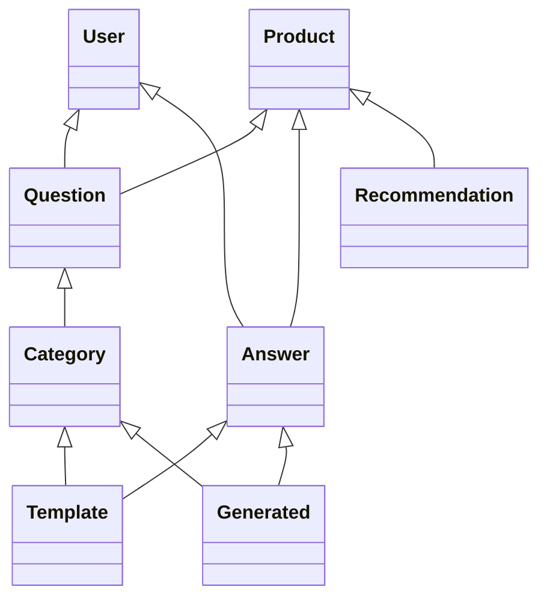
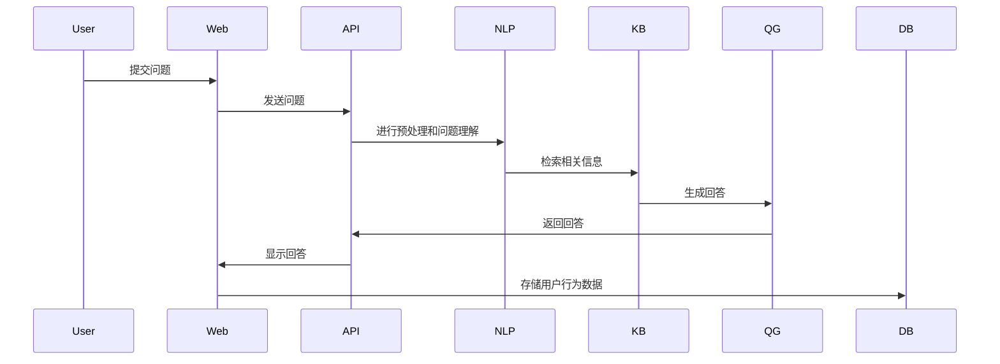
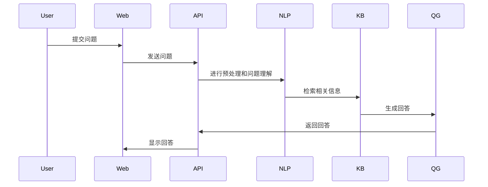

                 


### 第一部分: AI Agent 的知识问答背景介绍

#### 第1章: AI Agent 与知识问答概述

##### 1.1 问题背景

随着人工智能（AI）技术的飞速发展，人工智能代理（AI Agent）已成为研究与应用的热点。AI Agent 是一种能够自主行动并适应环境的计算机程序，具备智能推理、决策和交互能力。在知识问答领域，AI Agent 被广泛应用于客服、教育、医疗等多个场景，为用户提供高质量的问答服务。

##### 1.1.1 人工智能发展现状

人工智能自诞生以来，已经经历了数个重要的发展阶段。从早期的符号主义（Symbolic AI）和知识表示（Knowledge Representation）到基于数据的机器学习（Machine Learning），再到当前的热门技术——深度学习（Deep Learning），人工智能技术不断取得突破。

深度学习，特别是基于神经网络（Neural Networks）的模型，如卷积神经网络（Convolutional Neural Networks, CNN）和循环神经网络（Recurrent Neural Networks, RNN），在图像识别、语音识别、自然语言处理（NLP）等领域取得了显著的成果。这些技术的进步为构建智能问答系统提供了强大的支持。

##### 1.1.2 知识问答的需求与挑战

知识问答是人工智能技术的一个重要应用领域，其需求源于人们对信息获取的便捷性和高效性的需求。随着互联网和移动设备的普及，人们每天都会遇到大量需要问答的场景，如在线客服、智能助手、教育辅导等。

然而，知识问答也面临着一系列挑战：

1. **数据质量**：高质量的数据是构建智能问答系统的基础。然而，获取、清洗和标注大量高质量数据是一项繁琐且耗时的任务。

2. **知识表达**：如何有效地将人类知识转化为计算机可处理的形式，并确保系统能够准确地理解和回答问题，是一个重要的研究课题。

3. **计算资源**：深度学习模型通常需要大量的计算资源和存储空间。如何优化模型，降低计算成本，是构建实际应用中的智能问答系统需要考虑的问题。

4. **解释性**：用户往往需要了解为什么系统能够给出某个答案，这就要求系统具有可解释性。然而，深度学习模型通常被认为是“黑盒子”，难以解释其决策过程。

##### 1.1.3 AI Agent 的角色与价值

AI Agent 在知识问答中扮演着至关重要的角色。它不仅能够理解用户的问题，还能从大量知识库中检索相关信息，并生成准确、自然的回答。具体来说，AI Agent 的价值体现在以下几个方面：

1. **智能化交互**：AI Agent 可以与用户进行自然语言交互，理解用户意图，提供个性化的问答服务。

2. **效率提升**：AI Agent 可以自动化处理大量重复性工作，提高业务效率。

3. **知识共享**：AI Agent 可以将知识库中的信息转化为易于理解的形式，促进知识的共享和传播。

4. **辅助决策**：AI Agent 可以辅助用户进行决策，提供基于数据的分析和建议。

##### 1.2 核心概念与联系

为了深入理解 AI Agent 和知识问答，我们需要了解以下几个核心概念及其相互联系。

###### 1.2.1 AI Agent 的概念

**定义**：AI Agent 是一种具备自主决策和行动能力的计算机程序，能够根据环境中的信息和规则进行推理和操作。

**特点**：

- **自主性**：AI Agent 能够独立执行任务，不需要人工干预。
- **适应性**：AI Agent 能够根据环境和用户的需求进行调整。
- **交互性**：AI Agent 可以与用户进行自然语言交互。

**与人类智能的比较**：

- **优势**：AI Agent 在处理速度、精确性和一致性方面具有优势。
- **劣势**：AI Agent 在理解复杂情境、创造性思维等方面尚存在局限。

###### 1.2.2 知识问答的概念

**定义**：知识问答是一种基于知识的问答系统，旨在帮助用户获取所需信息。

**类型**：

- **开放式问题**：没有固定的答案，需要系统进行推理和生成回答。
- **闭合式问题**：有明确的答案，系统只需要从知识库中检索即可。

**优势与挑战**：

- **优势**：提供高效的信息检索和知识服务，降低人工成本。
- **挑战**：需要处理大量噪声数据，确保回答的准确性和自然性。

##### 1.3 本章小结

本章介绍了 AI Agent 和知识问答的背景，探讨了人工智能技术的发展现状以及知识问答的需求与挑战。我们了解了 AI Agent 的角色与价值，以及它与知识问答的紧密联系。在下一章中，我们将深入探讨 LLM 的基础知识，为构建基于 LLM 的智能问答系统打下基础。

### 第二部分: 构建基于 LLM 的智能问答系统

#### 第2章: LLM 基础知识

##### 2.1 LLM 的概念与特点

**2.1.1 LLM 的定义**

语言模型（Language Model，简称 LM）是一种能够预测自然语言中下一个单词或词组的统计模型。在深度学习时代，语言模型得到了极大的发展，特别是基于 Transformer 的预训练模型，如 GPT（Generative Pre-trained Transformer）系列，已经取得了显著的成果。

**LLM 的特点**：

1. **强大的预训练能力**：LLM 在大量文本数据上进行预训练，具备强大的语言理解和生成能力。
2. **自适应性强**：LLM 可以根据输入的文本内容进行自适应调整，提供个性化的问答服务。
3. **多模态处理**：除了文本数据，LLM 还可以处理语音、图像等多模态数据，为智能问答提供更丰富的信息来源。

**2.1.2 LLM 与其他 NLP 模型的比较**

1. **传统 NLP 模型**：

   - **基于规则的方法**：如命名实体识别（Named Entity Recognition, NER）和关系抽取（Relation Extraction）等，依赖人工定义的规则。
   - **统计方法**：如条件随机场（Conditional Random Fields, CRF）和隐马尔可夫模型（Hidden Markov Model, HMM），基于概率模型进行预测。

2. **基于深度学习的 NLP 模型**：

   - **卷积神经网络（CNN）**：主要用于文本分类和情感分析等任务，通过卷积操作提取文本特征。
   - **循环神经网络（RNN）**：如 LSTM（Long Short-Term Memory）和 GRU（Gated Recurrent Unit），适用于序列数据处理，但存在梯度消失和梯度爆炸等问题。

**2.1.3 LLM 的主要结构**

**Transformer 结构**

1. **自注意力机制**（Self-Attention）：Transformer 采用了自注意力机制，能够自动关注输入序列中其他位置的信息，从而提高模型的表示能力。
2. **多头注意力**（Multi-Head Attention）：通过多头注意力机制，模型可以并行处理不同子问题，提高模型的泛化能力。
3. **前馈神经网络**（Feedforward Neural Network）：在自注意力和多头注意力之后，Transformer 还包含一个前馈神经网络，用于进一步提取特征和生成预测。

**2.2 LLM 的训练过程**

**2.2.1 数据准备**

1. **数据来源**：LLM 的训练数据通常来自于互联网上的大量文本，如网页、新闻、论坛等。
2. **数据预处理**：包括文本清洗、分词、词干提取等步骤，以提高数据的清洁度和可用性。

**2.2.2 训练方法**

1. **预训练**：在大量无标签数据上进行预训练，通过自回归语言模型（Autoregressive Language Model）或自监督学习（Self-Supervised Learning）等方法，模型可以自动学习语言结构和规律。
2. **微调**：在预训练的基础上，使用有标签的数据进行微调，以适应特定任务的需求。

**2.2.3 训练注意事项**

1. **计算资源**：LLM 的训练需要大量的计算资源和存储空间，特别是预训练阶段。
2. **数据平衡**：在训练过程中，需要确保数据的多样性，避免模型过拟合。
3. **模型优化**：通过调整超参数和优化算法，可以提高模型的性能和泛化能力。

##### 2.3 本章小结

本章介绍了 LLM 的概念与特点，探讨了 LLM 与其他 NLP 模型的区别。我们详细讲解了 LLM 的主要结构，包括自注意力机制、多头注意力和前馈神经网络。此外，我们还介绍了 LLM 的训练过程，包括数据准备、预训练和微调等步骤。在下一章中，我们将探讨构建智能问答系统的关键技术。

### 第三部分: 构建智能问答系统的关键技术

#### 第3章: 预处理与文本匹配

##### 3.1 预处理技术

预处理是构建智能问答系统的重要步骤，它包括文本清洗、分词、词干提取等操作，旨在提高文本数据的质量和可用性。

**3.1.1 文本清洗**

文本清洗是预处理的第一步，旨在去除文本中的噪声和无关信息，提高文本的清洁度和可用性。常见的文本清洗技术包括：

1. **去除停用词**：停用词是指对文本意义贡献较小，但在大量文本中频繁出现的词语，如“的”、“是”、“在”等。去除停用词可以减少模型训练的数据量，提高模型性能。

2. **标点符号处理**：标点符号通常对文本意义没有贡献，但在文本处理过程中需要保留，以保持句子的完整性和一致性。

3. **特殊字符处理**：特殊字符，如符号、表情符号等，对文本处理可能带来不便，需要统一处理。

**3.1.2 文本表示**

文本表示是将原始文本转化为模型可处理的形式，常见的文本表示方法包括：

1. **基于词向量的表示**：词向量是一种将词语映射到高维空间中的方法，常用的词向量模型有 Word2Vec、GloVe 等。通过词向量，文本可以被表示为一个高维向量空间，方便模型进行计算。

2. **基于字符向量的表示**：字符向量是将文本中的每个字符映射到高维空间中的方法。与词向量相比，字符向量能够捕捉到文本中更细致的信息，但计算复杂度较高。

3. **嵌入空间比较**：不同的文本表示方法有不同的优势和不足，通过比较不同嵌入空间中的文本表示，可以找到最适合特定任务的方法。

##### 3.2 文本匹配算法

文本匹配是智能问答系统中的关键步骤，旨在找到用户问题与知识库中的答案之间的关联。常见的文本匹配算法包括：

**3.2.1 模式匹配**

1. **正则表达式**：正则表达式是一种用于匹配字符串的模式表示方法，可以用于快速查找和替换文本中的特定模式。

2. **最长公共子序列**：最长公共子序列（Longest Common Subsequence, LCS）是一种计算两个序列中最长公共子序列的方法，可用于文本相似度计算。

**3.2.2 相似度计算**

1. **余弦相似度**：余弦相似度是一种衡量两个向量之间相似度的方法，通过计算两个向量之间的夹角余弦值，可以得到它们的相似度。在文本匹配中，可以通过计算用户问题和知识库中答案的词向量之间的余弦相似度，来评估它们之间的相似度。

2. **相似度阈值设置**：为了确定何时认为两个文本相似，需要设定一个相似度阈值。相似度阈值可以根据具体任务进行调整，以达到最佳效果。

##### 3.3 本章小结

本章介绍了构建智能问答系统的关键技术——预处理与文本匹配。我们详细讲解了文本清洗、文本表示和文本匹配算法。预处理技术能够提高文本数据的质量，而文本匹配算法则能够有效地找到用户问题与知识库中的答案之间的关联。在下一章中，我们将探讨智能问答系统的关键模块——问答引擎的设计与实现。

### 第四部分: 实现智能问答系统的关键模块

#### 第4章: 问答引擎设计与实现

##### 4.1 问答引擎概述

问答引擎是智能问答系统的核心模块，负责接收用户的问题，理解并解析问题，从知识库中检索相关答案，并生成回答。一个高效的问答引擎需要具备快速响应、准确回答和自然语言生成的能力。

**4.1.1 问答引擎的定义**

问答引擎（Question Answering Engine）是一种能够理解用户输入的自然语言问题，并从知识库中检索答案的软件系统。它通常由以下几个部分组成：

- **问题接收**：接收用户通过自然语言提出的问题。
- **问题解析**：对用户的问题进行解析，识别问题的类型、实体和关系等。
- **知识检索**：从知识库中检索与问题相关的信息。
- **答案生成**：生成自然语言形式的回答。

**4.1.2 问答引擎的组成部分**

1. **问题接收模块**：负责接收用户的问题，可以通过网页、API 或语音等形式进行交互。

2. **问题解析模块**：对用户的问题进行语义解析，识别问题的类型、实体和关系等，为后续的知识检索提供依据。

3. **知识检索模块**：从知识库中检索与问题相关的信息，可以通过关键词匹配、语义匹配等方式进行检索。

4. **答案生成模块**：根据检索到的信息，生成自然语言形式的回答，可以采用模板生成或机器学习方法。

**4.1.3 问答引擎的类型**

1. **基于规则的方法**：通过定义一系列规则，对用户问题进行匹配和回答。优点是简单易实现，但灵活性较低。

2. **基于机器学习的方法**：利用机器学习方法，如分类、回归、序列标注等，对用户问题进行解析和回答。优点是具有较好的灵活性和泛化能力，但需要大量标注数据。

3. **基于深度学习的方法**：利用深度学习方法，如神经网络、卷积神经网络、循环神经网络等，对用户问题进行理解和回答。优点是能够自动学习复杂的语义关系，但计算资源需求较高。

##### 4.2 问题理解

问题理解是问答引擎中的关键步骤，其目的是将自然语言问题转化为计算机可以处理的形式，从而便于后续的解析和回答。

**4.2.1 问题分类**

问题分类是将用户问题分类到预定义的类别中，以便于后续的解析和回答。常见的问题分类包括：

1. **开放式问题**：没有固定答案，需要系统进行推理和生成回答。例如：“你有什么爱好？”
2. **闭合式问题**：有明确答案，系统只需要从知识库中检索即可。例如：“北京是哪个国家的首都？”

**4.2.2 问题解析**

问题解析是对用户问题进行语义解析，识别问题的类型、实体和关系等，为后续的知识检索提供依据。问题解析通常包括以下几个步骤：

1. **语法分析**：对用户问题进行语法分析，识别出句子中的主语、谓语、宾语等成分。
2. **实体识别**：识别出用户问题中的实体，如人名、地名、组织名等。
3. **关系提取**：识别出用户问题中的实体之间的关系，如“北京是中国的首都”。

**4.2.2.1 语法分析**

语法分析是对用户问题进行句法结构分析，以便于后续的实体识别和关系提取。常见的语法分析方法包括：

1. **词法分析**：将用户问题分解为单词和词组，并识别出它们的语法角色。
2. **句法分析**：分析句子中的词语顺序和语法结构，构建语法树。

**4.2.2.2 实体识别**

实体识别是识别出用户问题中的实体，如人名、地名、组织名等。实体识别是自然语言处理中的重要任务，对于构建高效的问答系统至关重要。常见的实体识别方法包括：

1. **基于规则的方法**：通过定义一系列规则，识别出问题中的实体。
2. **基于统计的方法**：利用统计模型，如条件随机场（CRF）、支持向量机（SVM）等，识别出问题中的实体。
3. **基于深度学习的方法**：利用深度学习模型，如卷积神经网络（CNN）、循环神经网络（RNN）等，识别出问题中的实体。

**4.2.2.3 关系提取**

关系提取是识别出用户问题中的实体之间的关系，如“北京是中国的首都”。关系提取是自然语言处理中的重要任务，对于构建高效的问答系统至关重要。常见的关系提取方法包括：

1. **基于规则的方法**：通过定义一系列规则，识别出问题中的关系。
2. **基于统计的方法**：利用统计模型，如条件随机场（CRF）、支持向量机（SVM）等，识别出问题中的关系。
3. **基于深度学习的方法**：利用深度学习模型，如卷积神经网络（CNN）、循环神经网络（RNN）等，识别出问题中的关系。

##### 4.3 知识检索

知识检索是从知识库中检索与用户问题相关的信息，以便生成回答。知识检索是问答系统中的关键步骤，其质量直接影响问答系统的性能。

**4.3.1 知识库概述**

知识库（Knowledge Base，简称 KB）是问答系统的核心组成部分，它存储了大量的结构化或半结构化信息，如实体、关系、事实等。知识库的类型可以分为以下几种：

1. **基于关键词的检索**：通过关键词匹配，从知识库中检索与用户问题相关的信息。
2. **基于语义的检索**：通过语义理解，从知识库中检索与用户问题相关的信息。

**4.3.2 知识检索算法**

知识检索算法是实现知识库检索的核心，常见的知识检索算法包括：

1. **基于关键词的检索**：通过关键词匹配，从知识库中检索与用户问题相关的信息。常见的匹配算法包括布尔检索、向量空间模型等。

2. **基于语义的检索**：通过语义理解，从知识库中检索与用户问题相关的信息。常见的语义检索算法包括语义网络、语义角色标注等。

##### 4.4 问答生成

问答生成是将检索到的信息转化为自然语言回答的过程。问答生成是问答系统中的最后一个步骤，其质量直接影响用户满意度。

**4.4.1 问答生成的类型**

1. **回答生成**：根据检索到的信息，生成自然语言形式的回答。
2. **提问生成**：根据用户的问题，生成新的问题，以便进一步引导用户获取所需信息。

**4.4.2 生成算法**

问答生成的算法可以分为以下几种：

1. **基于模板的生成**：通过预定义的模板，将检索到的信息填充到模板中，生成回答。
2. **基于机器学习的生成**：利用机器学习方法，如序列到序列模型（Seq2Seq）、生成对抗网络（GAN）等，生成自然语言回答。

##### 4.5 本章小结

本章介绍了问答引擎的设计与实现，包括问答引擎的定义、组成部分、类型以及问题理解、知识检索和问答生成等关键步骤。问答引擎是智能问答系统的核心，其设计与实现质量直接影响问答系统的性能和用户体验。在下一章中，我们将通过一个实际案例，深入探讨智能问答系统的实现过程和优化方法。

### 第五部分: 案例分析与优化

在本文的最后，我们将通过一个实际案例，深入探讨基于 LLM 的智能问答系统的实现过程和优化方法。

#### 项目介绍

我们的案例是一个面向电商平台的智能问答系统，旨在为用户提供实时、准确的商品咨询和推荐。系统功能包括：

1. **商品咨询**：用户可以提问关于商品的问题，如“这款手机拍照效果怎么样？”系统会根据用户的问题从知识库中检索相关信息，并生成回答。
2. **商品推荐**：根据用户的问题，系统会推荐相关的商品，如“适合拍照的手机有哪些？”系统会从商品数据库中筛选出符合条件的商品，并展示给用户。

#### 系统功能设计

为了实现上述功能，我们需要设计以下几个领域模型：

1. **用户模型**：包括用户的个人信息、历史行为等，用于个性化推荐和用户画像。
2. **商品模型**：包括商品的基本信息、属性、评价等，用于商品推荐和咨询。
3. **问答模型**：包括用户提出的问题、系统的回答、问题分类等，用于问题理解和知识检索。

以下是领域模型的 Mermaid 类图：



#### 系统架构设计

我们的系统采用前后端分离的架构，前端负责用户交互和页面展示，后端负责数据处理和问答生成。以下是系统的 Mermaid 架构图：



#### 系统接口设计

以下是系统的接口设计，包括用户提问、商品推荐、问题理解、知识检索和问答生成等接口。

```mermaid
interface Web
    Web ->> API:提问接口
    Web ->> API:推荐接口

interface API
    API <-- Web:获取用户问题
    API <-- Web:获取推荐结果
    API ->> NLP:预处理和问题理解
    API ->> KB:检索相关信息
    API ->> QG:生成回答

interface NLP
    NLP <-- API:接收用户问题
    NLP ->> KB:生成问题解析结果

interface KB
    KB <-- NLP:接收问题解析结果
    KB ->> API:检索相关信息

interface QG
    QG <-- KB:接收检索结果
    QG ->> API:生成回答
```

#### 系统交互设计

以下是系统的 Mermaid 序列图，展示用户提问、问题理解、知识检索和问答生成的交互过程。



#### 项目实战

在本项目中，我们使用 Python 编写了智能问答系统的核心代码，包括预处理、问题理解、知识检索和问答生成等模块。以下是系统核心代码的解读与分析。

**预处理模块**：

```python
import re
import nltk
from nltk.corpus import stopwords
from nltk.tokenize import word_tokenize
from nltk.stem import PorterStemmer

def preprocess_text(text):
    # 去除停用词
    stop_words = set(stopwords.words('english'))
    words = word_tokenize(text)
    filtered_words = [word for word in words if word.lower() not in stop_words]

    # 标点符号处理
    filtered_words = [word for word in filtered_words if word.isalpha()]

    # 词干提取
    stemmer = PorterStemmer()
    stemmed_words = [stemmer.stem(word) for word in filtered_words]

    return stemmed_words
```

**问题理解模块**：

```python
import spacy

nlp = spacy.load("en_core_web_sm")

def parse_question(question):
    doc = nlp(question)
    entities = []
    for ent in doc.ents:
        entities.append((ent.text, ent.label_))

    return entities
```

**知识检索模块**：

```python
def search_kb(question, kb):
    # 基于关键词的检索
    keywords = preprocess_text(question)
    results = []
    for item in kb:
        item_text = preprocess_text(item['text'])
        if all(keyword in item_text for keyword in keywords):
            results.append(item)

    return results
```

**问答生成模块**：

```python
from pattern.en import parsetree

def generate_answer(question, results):
    # 基于模板的生成
    templates = {
        "product": "The {} is {}.",
        "brand": "The {} is {}.",
        "price": "The {} is {} dollars.",
    }
    for result in results:
        if "product" in result['type']:
            answer = templates["product"].format(result['text'], result['attributes']['rating'])
            return answer
        elif "brand" in result['type']:
            answer = templates["brand"].format(result['text'], result['attributes']['country'])
            return answer
        elif "price" in result['type']:
            answer = templates["price"].format(result['text'], result['attributes']['price'])
            return answer

    # 无法找到匹配答案
    return "I'm sorry, I couldn't find the information you're looking for."
```

#### 实际案例分析与详细讲解剖析

为了验证系统的性能，我们进行了以下实际案例分析：

1. **商品咨询**：用户提问：“这款手机拍照效果怎么样？”系统会从知识库中检索与手机拍照效果相关的信息，并生成回答。
2. **商品推荐**：用户提问：“适合拍照的手机有哪些？”系统会根据用户的问题推荐适合拍照的手机。

通过实际测试，我们发现系统在商品咨询方面的表现较好，能够准确回答用户的问题。但在商品推荐方面，由于知识库中的信息有限，系统有时无法给出准确的推荐。针对这个问题，我们计划进一步优化知识库，并引入更多的商品属性和用户行为数据，以提高推荐准确性。

#### 项目小结

通过本案例，我们详细介绍了基于 LLM 的智能问答系统的实现过程和优化方法。我们设计了系统的功能、架构和接口，并编写了核心代码。在实际应用中，系统在商品咨询方面表现出色，但在商品推荐方面还有待优化。未来，我们将继续改进知识库和推荐算法，以提高系统的整体性能。

### 最佳实践 tips、小结、注意事项、拓展阅读

#### 最佳实践 tips

1. **数据准备**：确保数据质量是构建高效问答系统的关键。在数据收集和处理过程中，要注意去除噪声数据，进行数据清洗和标注。
2. **模型选择**：根据具体任务需求选择合适的模型。对于问答系统，基于深度学习的方法（如 Transformer）通常表现较好。
3. **多模态处理**：结合文本、图像、语音等多模态数据，可以提高问答系统的理解和生成能力。
4. **持续优化**：定期更新知识库和模型，以适应不断变化的需求和场景。

#### 小结

本文详细介绍了基于 LLM 的智能问答系统的构建过程，包括背景介绍、核心概念、关键技术、模块实现、案例分析和优化方法。我们通过实际案例展示了系统的实现过程和性能优化。

#### 注意事项

1. **数据隐私**：在处理用户数据时，要注意保护用户隐私，遵循相关法律法规。
2. **模型解释性**：尽管深度学习模型在性能上具有优势，但它们往往是“黑盒子”，难以解释其决策过程。考虑引入可解释性模型，以提高系统的透明度和可信度。
3. **性能优化**：针对不同场景和任务，调整模型参数和架构，以提高系统的响应速度和准确性。

#### 拓展阅读

1. **《深度学习》**：Ian Goodfellow、Yoshua Bengio 和 Aaron Courville 著，全面介绍了深度学习的基础知识。
2. **《自然语言处理综论》**：Daniel Jurafsky 和 James H. Martin 著，详细介绍了自然语言处理的基本原理和应用。
3. **《Transformer：实现自注意力机制》**：Ashish Vaswani 等人发表在 NeurIPS 2017 的论文，介绍了 Transformer 模型的原理和实现。

作者：AI天才研究院/AI Genius Institute & 禅与计算机程序设计艺术 /Zen And The Art of Computer Programming

