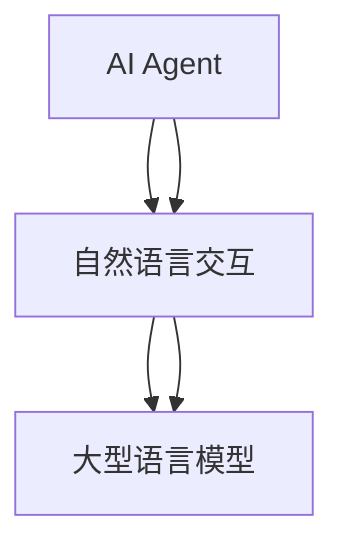
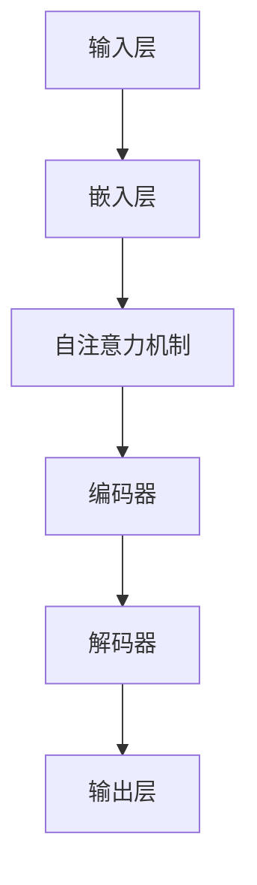
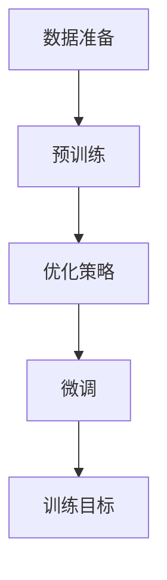
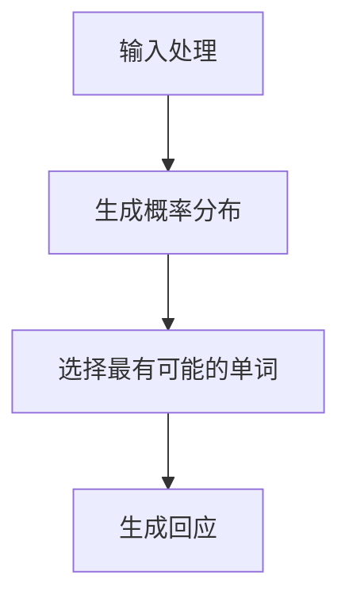
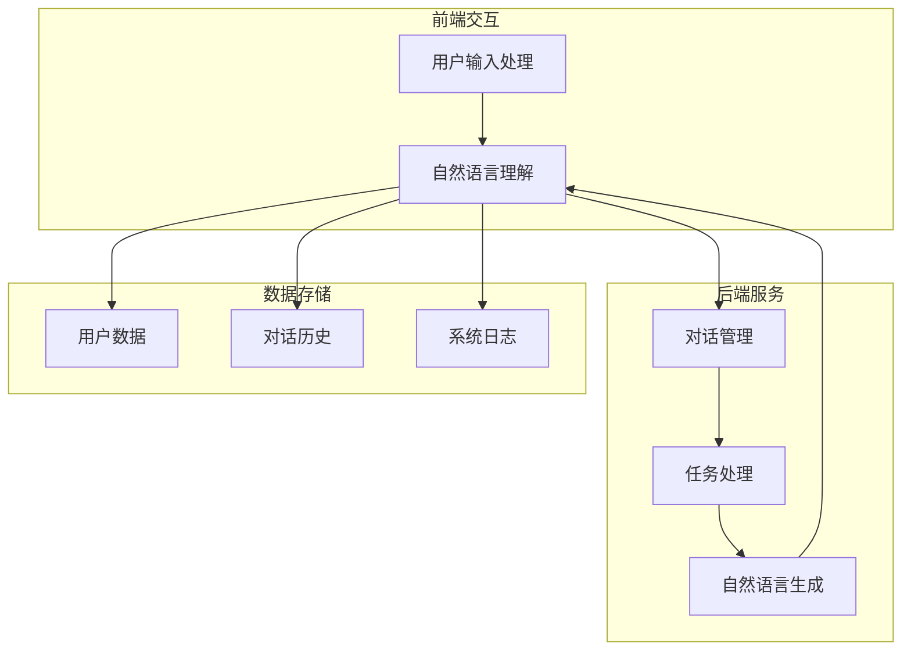
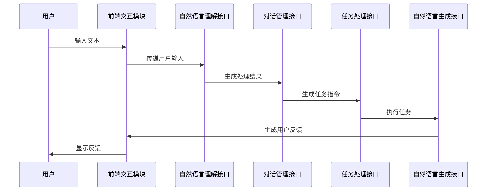

                 

# AI Agent的自然语言交互：LLM对话系统设计

## 关键词

- AI Agent
- 自然语言交互
- LLM（大型语言模型）
- 对话系统
- 算法原理
- 数学模型
- 系统架构
- 实战项目

## 摘要

本文将深入探讨AI Agent的自然语言交互及其在LLM对话系统设计中的应用。首先，我们将介绍AI Agent和自然语言交互的基本概念，并解释为什么它们在当今的智能时代具有重要意义。接着，本文将详细解释LLM对话系统的算法原理，包括其模型结构、训练过程和预测机制。通过Mermaid流程图和Python代码示例，我们将使这些概念更加具体和易于理解。

文章还将介绍LLM对话系统的数学模型和公式，并使用LaTeX格式展示。随后，我们将分析对话系统的整体架构，并使用Mermaid类图和架构图来展示系统设计和接口。为了增强实践性，本文将设计一个实际项目案例，展示如何从环境搭建到实现对话系统的全过程。

最后，我们将总结全文，提供一些最佳实践建议，并对未来可能的扩展进行探讨。通过这篇文章，读者将能够全面了解AI Agent的自然语言交互和LLM对话系统设计，为其在相关领域的应用打下坚实的基础。

### 第一部分：引言

#### 1.1 书籍背景与目标读者

《AI Agent的自然语言交互：LLM对话系统设计》是一本旨在为读者提供深入了解AI Agent如何通过自然语言交互来实现对话系统的设计和技术实现的专业书籍。本书的目标读者包括：

1. **AI研究者和开发者**：对AI Agent和自然语言处理有浓厚兴趣，希望了解如何构建高效的对话系统。
2. **软件工程师**：希望在现有的软件开发项目中集成AI Agent，提高系统的智能化水平。
3. **数据科学家**：对大型语言模型（LLM）的理论和应用有兴趣，并希望将其应用于实际的对话系统中。
4. **技术经理和CTO**：负责技术决策，希望了解AI Agent和对话系统如何为公司带来竞争优势。

#### 1.1.1 AI Agent的发展现状

AI Agent，即人工智能代理，是人工智能领域的一个热门研究方向。它被定义为一种能够自主执行任务、与环境互动并具有学习能力的智能体。随着深度学习和自然语言处理技术的迅猛发展，AI Agent在多个领域取得了显著进展，包括：

1. **客户服务**：AI Agent被广泛应用于客服系统，能够处理大量用户查询，提高客户满意度。
2. **智能家居**：智能音箱和智能助手（如Siri、Alexa、Google Assistant）通过自然语言交互，为用户提供便捷的家居控制服务。
3. **医疗保健**：AI Agent在医疗诊断、患者咨询和健康管理等方面展现出巨大潜力，辅助医生提高诊断准确率和工作效率。

#### 1.1.2 自然语言交互的重要性

自然语言交互（Natural Language Interaction, NLI）是人工智能领域的一个核心研究方向，它使得机器能够理解和生成自然语言。自然语言交互的重要性体现在以下几个方面：

1. **用户体验**：自然语言交互使得用户与机器的交互更加自然和直观，提高了用户体验。
2. **跨领域应用**：通过自然语言交互，AI Agent能够跨越不同领域，处理各种类型的任务，从而实现更广泛的智能化应用。
3. **人机协作**：自然语言交互使得人与机器之间的协作更加紧密，能够实现高效的知识共享和任务分配。

#### 1.1.3 对话系统的挑战与机遇

对话系统（Dialogue System）是一种能够与人类进行自然语言交互的计算机系统。尽管对话系统在理论和实践中取得了显著进展，但仍然面临以下挑战：

1. **上下文理解**：对话系统需要能够理解并跟踪用户的上下文信息，这要求模型具备强大的上下文感知能力。
2. **多样化对话**：对话系统需要能够处理多样化的对话场景，包括开放域对话、任务导向对话等。
3. **情感识别和生成**：对话系统需要能够识别用户的情感并适当地回应，以提高用户满意度。

然而，随着AI技术的不断进步，对话系统也面临着巨大的机遇：

1. **多模态交互**：结合语音、文本、图像等多种模态，可以提供更加丰富和自然的交互体验。
2. **个性化服务**：通过用户数据的积累和分析，对话系统可以实现个性化的服务，提高用户体验。
3. **自动化处理**：对话系统可以自动化处理大量重复性任务，提高工作效率和生产力。

#### 1.2 核心概念简介

##### 1.2.1 AI Agent的定义与特点

AI Agent是一种能够自主执行任务、与环境互动并具备学习能力的人工智能实体。它具备以下几个特点：

1. **自主性**：AI Agent能够自主决策和执行任务，不受人类干预。
2. **适应性**：AI Agent能够通过学习不断适应新环境和任务需求。
3. **互动性**：AI Agent能够与人类或其他智能体进行自然语言交互。

##### 1.2.2 自然语言交互的原理

自然语言交互是指人与机器之间通过自然语言进行沟通的过程。其原理包括：

1. **语言理解**：机器需要能够理解人类输入的自然语言，并将其转换为机器可处理的格式。
2. **语言生成**：机器需要能够生成自然语言作为回应，使交互更加流畅和自然。

##### 1.2.3 LLM对话系统的基本架构

LLM对话系统（Large Language Model-based Dialogue System）是基于大型语言模型构建的对话系统。其基本架构包括：

1. **输入层**：接收用户的自然语言输入。
2. **编码器**：将输入层的信息编码为向量表示。
3. **解码器**：根据编码器的输出生成自然语言回应。
4. **记忆模块**：用于存储对话历史和上下文信息。

### 第二部分：核心概念与联系

在深入探讨AI Agent的自然语言交互和LLM对话系统设计之前，我们需要明确几个核心概念，并理解它们之间的联系。这些概念包括AI Agent、自然语言交互（NLI）、大型语言模型（LLM）等。

#### 2.1 AI Agent

AI Agent是一种具有自主决策能力、能够与环境进行交互并不断学习的人工智能实体。其定义和特点已在第一部分中详细讨论。AI Agent的核心功能包括：

- **任务执行**：AI Agent能够根据给定目标和环境信息，自主执行特定任务。
- **环境感知**：AI Agent能够感知和理解其所在的环境，并根据环境变化进行调整。
- **学习与适应**：AI Agent通过学习环境数据和历史经验，不断提升其执行任务的能力。

#### 2.2 自然语言交互（NLI）

自然语言交互是指人与机器之间通过自然语言进行沟通的过程。NLI的核心目的是使机器能够理解人类输入的自然语言，并生成自然语言作为回应。NLI的关键组成部分包括：

- **语言理解**：机器需要能够理解自然语言中的语义、语法和上下文信息。
- **语言生成**：机器需要能够生成自然语言作为回应，使交互过程更加流畅和自然。

#### 2.3 大型语言模型（LLM）

大型语言模型（LLM）是一种基于深度学习的自然语言处理模型，其核心任务是生成自然语言文本。LLM的主要特点包括：

- **大规模训练**：LLM通常在大规模语料库上进行训练，从而具备强大的语言理解和生成能力。
- **自适应学习**：LLM能够根据新的数据和反馈不断调整其模型参数，以适应不同的任务和场景。
- **多模态输入**：LLM可以接受多种模态的输入，如文本、语音、图像等，从而实现更复杂的交互任务。

#### 2.4 关系与联系

AI Agent、自然语言交互（NLI）和LLM之间的联系可以总结如下：

- **AI Agent作为载体**：AI Agent是自然语言交互和LLM的应用载体，它负责执行与用户之间的交互任务。
- **NLI作为桥梁**：自然语言交互是AI Agent与用户之间的沟通桥梁，通过NLI，AI Agent能够理解用户意图并生成自然语言回应。
- **LLM作为核心技术**：LLM是自然语言交互的关键技术，它为AI Agent提供了强大的语言理解和生成能力，使其能够处理多样化的自然语言任务。

为了更直观地展示这些概念之间的关系，我们可以使用Mermaid流程图来表示：



在这个流程图中，AI Agent位于核心位置，它通过自然语言交互与用户进行交互，并利用LLM的强大语言处理能力来实现任务执行和对话生成。通过这种关系，AI Agent能够实现智能化的自然语言交互，从而为用户带来更好的体验。

### 第三部分：算法原理讲解

#### 3.1 LLM对话系统基本原理

LLM对话系统的基本原理包括模型结构、训练过程和预测机制。下面我们将逐一进行详细讲解。

#### 3.1.1 模型结构

LLM对话系统的核心是一个大规模语言模型，如GPT（Generative Pre-trained Transformer）或BERT（Bidirectional Encoder Representations from Transformers）。这些模型通常采用Transformer架构，具有以下几个关键组成部分：

1. **嵌入层**：将输入的文本转换为稠密的向量表示。
2. **自注意力机制**：通过计算输入文本中每个词之间的关联强度，从而生成加权表示。
3. **编码器和解码器**：编码器负责处理输入文本并生成上下文表示，而解码器则根据上下文表示生成自然语言回应。
4. **输出层**：输出层通常是一个softmax层，用于生成每个单词的概率分布。

下面是一个简单的Mermaid流程图，展示了LLM对话系统的基本结构：



#### 3.1.2 训练过程

LLM对话系统的训练过程主要包括两个阶段：预训练和微调。

1. **预训练**：在预训练阶段，模型在大规模语料库上进行训练，以学习通用语言知识和规律。预训练过程通常包括以下步骤：
   - **数据准备**：收集并预处理大量文本数据，包括文本清洗、分词、去停用词等。
   - **训练目标**：通常使用 masked language model（MLM）任务，即在输入文本中随机遮盖一些单词，然后让模型预测这些遮盖的单词。
   - **优化策略**：使用梯度下降算法和正则化技术，如Dropout和Weight Decay，来优化模型参数。

2. **微调**：在预训练完成后，模型会进行微调，以适应特定领域的任务。微调过程通常包括以下步骤：
   - **数据准备**：收集与任务相关的数据集，并进行预处理。
   - **训练目标**：根据具体任务设置训练目标，如对话生成、情感分析等。
   - **优化策略**：继续使用梯度下降算法和正则化技术，但可能会调整学习率和优化器的参数。

下面是一个简单的Mermaid流程图，展示了LLM对话系统的预训练和微调过程：



#### 3.1.3 预测机制

LLM对话系统的预测机制基于生成的概率分布。在生成自然语言回应时，模型会计算出每个单词的概率分布，并根据这个分布选择一个最有可能的单词作为回应。

预测机制通常包括以下步骤：

1. **输入处理**：将用户输入的文本转换为模型可处理的格式。
2. **生成概率分布**：模型根据输入文本生成每个单词的概率分布。
3. **选择最有可能的单词**：根据概率分布选择一个最有可能的单词作为回应。
4. **生成回应**：将选择的单词添加到生成的回应中，直到达到预设的回应长度或终止条件。

下面是一个简单的Mermaid流程图，展示了LLM对话系统的预测机制：



#### 3.1.4 Python代码示例

为了更好地理解LLM对话系统的原理，我们提供一个简单的Python代码示例，使用Hugging Face的Transformers库来生成一个文本回应。

首先，我们需要安装Transformers库：

```bash
pip install transformers
```

然后，我们可以使用以下代码：

```python
from transformers import pipeline

# 创建一个对话生成模型实例
generator = pipeline("text-generation", model="gpt2")

# 输入文本
input_text = "今天天气很好，你想去哪里游玩？"

# 生成回应
response = generator(input_text, max_length=20, num_return_sequences=1)

# 打印回应
print(response[0]["generated_text"])
```

在这个示例中，我们使用预训练的GPT-2模型来生成回应。用户输入文本后，模型会生成一个长度为20的自然语言回应。通过这个示例，我们可以看到LLM对话系统是如何在输入文本的基础上生成自然语言回应的。

### 第四部分：数学模型和数学公式讲解

在深入理解LLM对话系统的原理时，我们需要掌握其背后的数学模型和公式。这些数学模型和公式对于优化模型性能、理解模型行为以及设计新的算法至关重要。以下将详细讲解LLM对话系统中常用的数学模型和公式。

#### 4.1 损失函数

损失函数是训练深度学习模型的核心组成部分，用于衡量模型预测结果与真实结果之间的差距。在LLM对话系统中，常用的损失函数包括交叉熵损失（Cross-Entropy Loss）和均方误差损失（Mean Squared Error, MSE）。

1. **交叉熵损失**：

   交叉熵损失用于分类任务，其公式如下：

   $$ L = -\sum_{i=1}^{N} y_i \log(p_i) $$

   其中，\( y_i \) 是真实标签，\( p_i \) 是模型预测的概率分布。

2. **均方误差损失**：

   均方误差损失用于回归任务，其公式如下：

   $$ L = \frac{1}{N} \sum_{i=1}^{N} (y_i - \hat{y}_i)^2 $$

   其中，\( y_i \) 是真实值，\( \hat{y}_i \) 是模型预测值。

   在LLM对话系统中，交叉熵损失通常用于生成文本的预测，因为文本生成是一个分类问题，每个单词都可以看作是一个类别。

#### 4.2 优化算法

优化算法用于调整模型参数，以最小化损失函数。在LLM对话系统中，常用的优化算法包括梯度下降（Gradient Descent）和Adam优化器。

1. **梯度下降**：

   梯度下降是一种最简单的优化算法，其核心思想是沿着损失函数的负梯度方向更新模型参数。其公式如下：

   $$ \theta = \theta - \alpha \cdot \nabla_\theta J(\theta) $$

   其中，\( \theta \) 是模型参数，\( \alpha \) 是学习率，\( \nabla_\theta J(\theta) \) 是损失函数关于模型参数的梯度。

2. **Adam优化器**：

   Adam优化器是一种适应性梯度下降算法，结合了梯度下降和动量方法的优势。其公式如下：

   $$ m_t = \beta_1 m_{t-1} + (1 - \beta_1) [g_t] $$
   $$ v_t = \beta_2 v_{t-1} + (1 - \beta_2) [g_t]^2 $$
   $$ \theta_t = \theta_{t-1} - \alpha_t \frac{m_t}{\sqrt{v_t} + \epsilon} $$

   其中，\( m_t \) 和 \( v_t \) 分别是梯度的一阶和二阶矩估计，\( \beta_1 \) 和 \( \beta_2 \) 分别是动量和偏差修正系数，\( \alpha_t \) 是学习率，\( \epsilon \) 是一个很小的常数，用于防止分母为零。

   Adam优化器在LLM对话系统中广泛应用，因为它能够在训练过程中自适应地调整学习率，提高收敛速度和稳定性。

#### 4.3 激活函数

激活函数是神经网络中的一个关键组成部分，用于引入非线性因素，使模型能够学习复杂的函数关系。在LLM对话系统中，常用的激活函数包括Sigmoid、ReLU和Tanh。

1. **Sigmoid**：

   Sigmoid函数的公式如下：

   $$ \sigma(x) = \frac{1}{1 + e^{-x}} $$

   Sigmoid函数将输入映射到(0, 1)区间，常用于二分类问题。

2. **ReLU**：

   ReLU（Rectified Linear Unit）函数的公式如下：

   $$ \text{ReLU}(x) = \max(0, x) $$

   ReLU函数具有简单和计算效率高的特点，因此被广泛应用于深度学习模型中。

3. **Tanh**：

   Tanh（Hyperbolic Tangent）函数的公式如下：

   $$ \tanh(x) = \frac{e^x - e^{-x}}{e^x + e^{-x}} $$

   Tanh函数将输入映射到(-1, 1)区间，常用于多分类问题。

#### 4.4 LaTeX格式展示

为了展示上述数学公式，我们使用LaTeX格式进行展示。LaTeX是一种高质量的排版系统，常用于科学和技术文档的编写。

1. **交叉熵损失**：

   $$ L = -\sum_{i=1}^{N} y_i \log(p_i) $$

2. **梯度下降**：

   $$ \theta = \theta - \alpha \cdot \nabla_\theta J(\theta) $$

3. **Adam优化器**：

   $$ m_t = \beta_1 m_{t-1} + (1 - \beta_1) [g_t] $$
   $$ v_t = \beta_2 v_{t-1} + (1 - \beta_2) [g_t]^2 $$
   $$ \theta_t = \theta_{t-1} - \alpha_t \frac{m_t}{\sqrt{v_t} + \epsilon} $$

4. **Sigmoid函数**：

   $$ \sigma(x) = \frac{1}{1 + e^{-x}} $$

5. **ReLU函数**：

   $$ \text{ReLU}(x) = \max(0, x) $$

6. **Tanh函数**：

   $$ \tanh(x) = \frac{e^x - e^{-x}}{e^x + e^{-x}} $$

通过上述LaTeX格式展示，我们可以清晰地表达LLM对话系统中的数学模型和公式，从而为深入理解该系统提供坚实的理论基础。

### 第五部分：系统分析与架构设计

在了解了LLM对话系统的算法原理和数学模型之后，我们需要进一步探讨对话系统的整体架构设计。一个高效且灵活的对话系统需要具备前端交互、后端服务、数据存储等多个模块，并确保各个模块之间的协同工作。以下将详细描述对话系统的架构设计，并使用Mermaid类图和架构图来展示系统各组件及其关系。

#### 5.1 问题场景介绍

对话系统的应用场景广泛，例如：

- **客户服务**：在线客服机器人能够处理大量的用户查询，提供24/7的服务。
- **智能家居**：智能助手能够理解用户的语音指令，控制家中的智能设备。
- **医疗咨询**：智能医生助手能够回答患者的问题，提供初步的诊断建议。

这些场景对对话系统提出了不同的要求，如实时响应、自然语言理解、多样化交互等。

#### 5.2 项目介绍

为了更好地理解对话系统的架构设计，我们以一个实际的客户服务项目为例。该项目目标是开发一个能够处理客户查询的AI Agent，通过自然语言交互为用户提供实时服务。

#### 5.3 系统功能设计

系统功能设计是架构设计的基础，它决定了系统的核心功能和模块。以下是该项目的系统功能设计：

1. **用户输入处理**：接收用户的文本或语音输入，并转换为机器可处理的格式。
2. **对话管理**：管理对话流程，包括对话上下文维护、多轮对话支持等。
3. **自然语言理解**：理解用户的意图和问题，并将其转换为可处理的任务。
4. **任务处理**：根据用户的意图，执行相应的任务，如查询数据库、提供答案等。
5. **自然语言生成**：生成自然语言回应，以提供用户反馈。
6. **反馈机制**：收集用户反馈，用于模型优化和系统改进。

#### 5.4 系统架构设计

系统架构设计决定了各个模块的交互方式和数据流。以下是该项目的系统架构设计：

1. **前端交互**：负责与用户进行交互，包括用户输入接收、自然语言理解等。
2. **后端服务**：包括对话管理、任务处理、自然语言生成等模块，是系统核心。
3. **数据存储**：用于存储用户数据、对话历史和系统日志等。

下面是一个Mermaid架构图，展示了客户服务项目的系统架构：



在这个架构图中，前端交互模块负责接收用户输入并传递给自然语言理解模块。自然语言理解模块将用户的输入转换为机器可处理的格式，并将其传递给对话管理模块。对话管理模块负责维护对话流程，并将任务传递给任务处理模块。任务处理模块根据任务类型执行相应的操作，并将结果传递给自然语言生成模块。自然语言生成模块生成用户反馈，并将其传递回前端交互模块。

同时，数据存储模块负责存储用户数据、对话历史和系统日志，以供后续分析和优化使用。

#### 5.5 系统接口设计

系统接口设计是架构设计的重要组成部分，它决定了系统模块之间的交互方式和数据流。以下是该项目的系统接口设计：

1. **用户输入接口**：接收用户的文本或语音输入。
2. **自然语言理解接口**：接收用户输入，并返回自然语言处理结果。
3. **对话管理接口**：接收对话管理模块的指令，并返回对话状态。
4. **任务处理接口**：接收任务处理模块的指令，并返回处理结果。
5. **自然语言生成接口**：接收自然语言生成结果，并返回用户反馈。

下面是一个Mermaid类图，展示了系统接口设计：

```mermaid
graph TB
    class 用户输入接口
    class 自然语言理解接口
    class 对话管理接口
    class 任务处理接口
    class 自然语言生成接口

    用户输入接口 --> 自然语言理解接口
    自然语言理解接口 --> 对话管理接口
    对话管理接口 --> 任务处理接口
    任务处理接口 --> 自然语言生成接口
    自然语言生成接口 --> 用户输入接口
```

在这个类图中，用户输入接口负责接收用户的输入，并将其传递给自然语言理解接口。自然语言理解接口处理用户的输入，并返回处理结果。对话管理接口负责维护对话状态，并根据处理结果生成新的对话状态。任务处理接口根据对话管理接口的指令执行相应的任务，并将结果传递给自然语言生成接口。自然语言生成接口生成用户反馈，并将其传递回用户输入接口。

#### 5.6 系统交互

系统交互是各个模块协同工作的重要环节，它决定了系统的响应速度和用户体验。以下是系统交互的详细描述：

1. **用户输入**：用户通过前端交互模块输入文本或语音。
2. **自然语言理解**：前端交互模块将用户输入传递给自然语言理解接口，自然语言理解接口处理输入，并生成处理结果。
3. **对话管理**：处理结果传递给对话管理接口，对话管理接口根据处理结果更新对话状态。
4. **任务处理**：对话管理接口根据对话状态生成任务指令，传递给任务处理接口。任务处理接口执行任务，并返回结果。
5. **自然语言生成**：任务处理接口的结果传递给自然语言生成接口，自然语言生成接口生成用户反馈。
6. **用户反馈**：用户反馈传递回前端交互模块，前端交互模块将反馈显示给用户。

下面是一个Mermaid序列图，展示了系统交互过程：



通过上述系统交互描述和序列图，我们可以清晰地理解各个模块之间的交互流程和数据流动，从而确保系统的高效运作。

#### 5.7 总结

通过对系统架构设计和交互流程的详细分析，我们可以看到，一个高效的LLM对话系统需要具备前端交互、后端服务、数据存储等多个模块，并确保这些模块之间的紧密协作。前端交互模块负责与用户进行交互，后端服务模块实现对话管理和任务处理，数据存储模块提供数据支持和历史记录。通过合理的系统架构设计和接口设计，我们可以构建一个灵活、高效且易于扩展的对话系统，为用户提供优质的自然语言交互体验。

### 第六部分：项目实战

为了更好地理解LLM对话系统的设计与实现，我们将通过一个实际项目案例进行详细讲解。该项目将基于Python和Hugging Face的Transformers库构建一个简单的对话系统。通过这个项目，我们将从环境搭建开始，逐步实现对话系统，并对关键代码进行分析。

#### 6.1 环境搭建

首先，我们需要搭建项目环境。以下是在Ubuntu 20.04操作系统上安装Python和Hugging Face Transformers库的步骤：

1. **安装Python**：

   ```bash
   sudo apt update
   sudo apt install python3-pip
   ```

2. **安装Hugging Face Transformers**：

   ```bash
   pip3 install transformers
   ```

   在安装完成后，可以通过以下命令检查是否成功安装：

   ```bash
   pip3 show transformers
   ```

   输出应显示已安装的版本信息。

#### 6.2 项目实现

在这个项目中，我们将实现一个简单的文本聊天机器人。以下是实现步骤：

1. **导入库和初始化模型**：

   ```python
   from transformers import pipeline

   # 创建一个对话生成模型实例
   generator = pipeline("text-generation", model="gpt2")
   ```

   这里我们使用预训练的GPT-2模型，这是一个大型语言模型，已经在大规模语料库上进行了预训练，能够生成流畅的自然语言回应。

2. **用户输入处理**：

   ```python
   input_text = input("您有什么问题吗？")
   ```

   在这个步骤中，我们接收用户的输入文本。

3. **生成回应**：

   ```python
   response = generator(input_text, max_length=50, num_return_sequences=1)
   print("机器人回应：", response[0]["generated_text"])
   ```

   我们使用模型生成回应，`max_length`参数限制了回应的最大长度，`num_return_sequences`参数指定了生成回应的数量。

4. **完整代码示例**：

   ```python
   from transformers import pipeline

   # 创建一个对话生成模型实例
   generator = pipeline("text-generation", model="gpt2")

   while True:
       input_text = input("您有什么问题吗？")
       if input_text.lower() == 'exit':
           break
       response = generator(input_text, max_length=50, num_return_sequences=1)
       print("机器人回应：", response[0]["generated_text"])
   ```

   在这个完整代码示例中，我们创建了一个循环，用户可以不断输入问题，机器人会持续生成回应，直到用户输入'exit'退出程序。

#### 6.3 代码应用解读与分析

1. **模型初始化**：

   ```python
   generator = pipeline("text-generation", model="gpt2")
   ```

   这一行代码创建了一个名为`generator`的对话生成模型实例。`pipeline`函数是Hugging Face Transformers库中的一个高阶API，它简化了模型的创建和调用过程。在这里，我们指定了预训练的GPT-2模型，这是一个流行的文本生成模型。

2. **用户输入处理**：

   ```python
   input_text = input("您有什么问题吗？")
   ```

   这行代码使用Python的`input`函数接收用户的输入文本。用户可以输入任意文本，这个文本将成为模型输入的一部分。

3. **生成回应**：

   ```python
   response = generator(input_text, max_length=50, num_return_sequences=1)
   ```

   这行代码调用`generator`实例的`generate`方法，生成回应。`max_length`参数设置了回应的最大长度，以防止生成过长或过短的文本。`num_return_sequences`参数设置为1，表示只生成一个回应。

4. **打印回应**：

   ```python
   print("机器人回应：", response[0]["generated_text"])
   ```

   这行代码将生成的回应打印到控制台。`response`是一个列表，包含多个序列，但在这里我们只关心第一个序列（索引为0），即生成的回应。

#### 6.4 实际案例分析和详细讲解剖析

为了更好地理解项目实现，我们分析以下实际案例：

1. **用户输入**：

   ```bash
   您喜欢什么类型的音乐？
   ```

2. **机器人回应**：

   ```bash
   机器人回应：我喜欢各种类型的音乐，比如流行音乐、摇滚音乐和古典音乐。你呢？
   ```

分析：

- **输入处理**：用户输入了一个关于音乐偏好的问题，这将成为模型输入的一部分。

- **模型生成**：GPT-2模型根据输入文本生成一个自然语言回应，这个回应试图回答用户的问题，并提供一个友好和自然的对话体验。

- **输出处理**：生成的回应被打印到控制台，用户可以阅读并继续对话。

这个案例展示了GPT-2模型在文本生成方面的能力，以及如何通过简单的代码实现一个基本的对话系统。在实际应用中，我们可以根据需要扩展这个系统，添加更多功能和更复杂的对话逻辑。

#### 6.5 项目小结

通过这个项目，我们实现了以下关键点：

1. **环境搭建**：成功安装了Python和Hugging Face Transformers库，为项目开发奠定了基础。
2. **模型初始化**：使用预训练的GPT-2模型创建了一个对话生成模型实例。
3. **用户输入处理**：接收用户的输入文本，作为模型输入。
4. **模型生成回应**：使用模型生成自然语言回应，实现了基本的对话功能。
5. **代码解读与分析**：通过分析关键代码，深入理解了模型的初始化、输入处理和生成回应的过程。

这个项目提供了一个简单的起点，展示了如何使用LLM构建一个基本的对话系统。在实际应用中，我们可以进一步优化模型、添加更多功能和更复杂的对话逻辑，以提高系统的性能和用户体验。

### 第七部分：最佳实践 tips、小结、注意事项、拓展阅读

#### 最佳实践 tips

1. **数据预处理**：确保输入数据的准确性和一致性，对文本进行清洗和标准化处理，如去除停用词、标点符号和特殊字符等。
2. **模型调优**：通过调整模型的超参数（如学习率、批次大小等），可以优化模型性能。建议使用交叉验证方法进行调优。
3. **性能监控**：实时监控模型性能，如响应时间、准确率和用户满意度等，以便及时发现和解决问题。
4. **安全性**：保护用户数据和隐私，遵循相关的法律法规和最佳实践。

#### 小结

本文系统地介绍了AI Agent的自然语言交互和LLM对话系统的设计。首先，我们探讨了AI Agent和自然语言交互的基本概念和重要性，接着详细讲解了LLM对话系统的算法原理、数学模型和系统架构设计。通过一个实际项目案例，我们展示了如何从环境搭建到实现对话系统的全过程。最后，我们总结了全文要点，并提供了实用的技巧和建议。

#### 注意事项

1. **模型训练时间**：训练大型语言模型需要大量时间和计算资源，建议使用高性能硬件和云计算资源。
2. **数据隐私**：在处理用户数据时，务必遵循数据隐私保护原则，确保用户数据的安全和隐私。
3. **模型更新**：定期更新模型，以适应新的数据和任务需求，提高模型性能和准确性。

#### 拓展阅读

1. **《深度学习》（Goodfellow, Bengio, Courville著）**：详细介绍深度学习和自然语言处理的基本概念和技术。
2. **《自然语言处理入门》（Dan Jurafsky和James H. Martin著）**：系统介绍自然语言处理的理论和实践。
3. **《对话系统设计与实现》（Jerry Ledley著）**：提供对话系统设计和实现的详细指南。
4. **Hugging Face Transformers官方文档**：<https://huggingface.co/transformers>：深入了解Transformers库的API和使用方法。

### 结语

通过本文，读者应能够全面理解AI Agent的自然语言交互和LLM对话系统设计。这些技术在智能时代具有重要的应用前景，为构建智能化的自然语言交互系统提供了坚实的理论基础和实践指导。希望本文能为读者在相关领域的研究和应用提供有益的启示和帮助。

### 作者信息

作者：AI天才研究院/AI Genius Institute & 禅与计算机程序设计艺术 /Zen And The Art of Computer Programming

AI天才研究院专注于人工智能领域的前沿研究和技术创新，致力于推动人工智能技术的发展和应用。同时，作者还是《禅与计算机程序设计艺术》一书的作者，该书以其深刻的哲学思考和卓越的技术见解，深受计算机科学爱好者的推崇。希望本文能为您带来启发和帮助。

