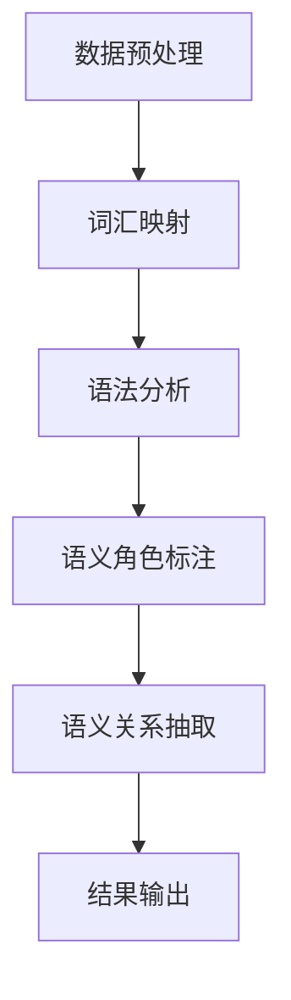
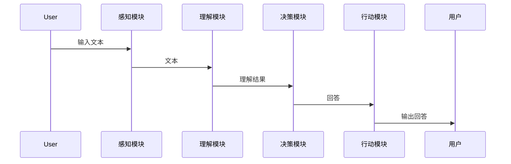
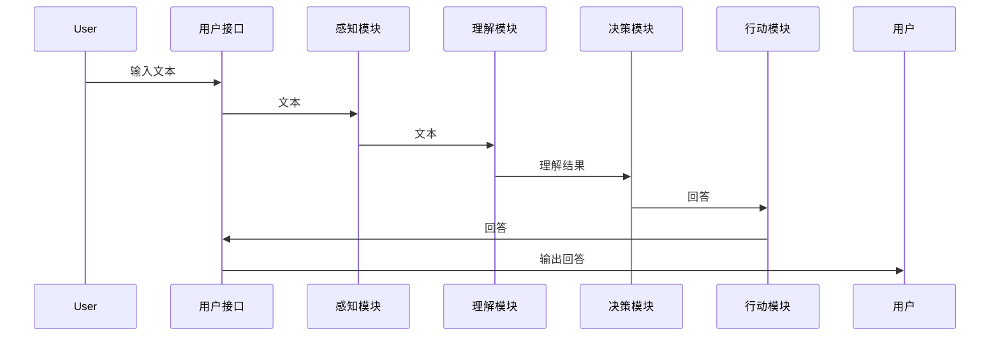

                 

# AI Agent 的语言理解：提升 LLM 的语义解析能力

> 关键词：AI Agent, 语言理解, LLM, 语义解析, 语义准确率

> 摘要：本文旨在探讨AI Agent在提升语言理解（LU）中的关键作用，特别是对大型语言模型（LLM）的语义解析能力的提升。我们将通过详细分析AI Agent的基本概念、工作原理以及LLM的语义解析机制，深入探讨二者如何协同工作，从而实现语义理解的突破。文章将结合具体的算法原理讲解和实际案例，提供一整套提升LLM语义解析能力的策略，并讨论AI Agent在语言理解中的边界和应用前景。

## 目录大纲

### 第一部分：背景介绍

#### 1.1 问题背景

##### 1.1.1 AI 的发展现状与挑战

##### 1.1.2 语言理解的重要性

##### 1.1.3 LLM的基本概念

#### 1.2 问题描述

##### 1.2.1 LLM在语言理解中的不足

##### 1.2.2 语义解析的目标与需求

##### 1.2.3 AI Agent在语言理解中的应用

#### 1.3 问题解决

##### 1.3.1 提升LLM语义解析能力的策略

##### 1.3.2 AI Agent在语言理解中的应用前景

#### 1.4 边界与外延

##### 1.4.1 语义理解的边界

##### 1.4.2 AI Agent的应用边界

#### 1.5 概念结构与核心要素组成

##### 1.5.1 AI Agent的结构与功能

##### 1.5.2 LLM的语义解析能力

### 第二部分：核心概念与联系

#### 2.1 AI Agent的基本概念与原理

##### 2.1.1 AI Agent的定义

##### 2.1.2 AI Agent的工作原理

##### 2.1.3 AI Agent的应用实例

#### 2.2 LLM的语义解析能力

##### 2.2.1 LLM的定义与特点

##### 2.2.2 LLM的语义解析机制

##### 2.2.3 LLM的语义解析性能评估

#### 2.3 AI Agent与LLM的关联与互补

##### 2.3.1 AI Agent与LLM的协同工作

##### 2.3.2 AI Agent与LLM的优势互补

### 第三部分：算法原理讲解

#### 3.1 语义解析算法原理

##### 3.1.1 基本概念

##### 3.1.2 算法流程

##### 3.1.3 算法mermaid流程图

##### 3.1.4 数学模型和公式

##### 3.1.5 举例说明

### 第四部分：系统分析与架构设计方案

#### 4.1 问题场景介绍

#### 4.2 系统功能设计

##### 4.2.1 领域模型mermaid类图

##### 4.2.2 系统功能设计

#### 4.3 系统架构设计

##### 4.3.1 系统架构设计mermaid架构图

##### 4.3.2 系统接口设计和系统交互

### 第五部分：项目实战

#### 5.1 环境安装

#### 5.2 系统核心实现源代码

##### 5.2.1 代码应用解读与分析

##### 5.2.2 实际案例分析和详细讲解剖析

##### 5.2.3 项目小结

### 第六部分：最佳实践 tips、小结、注意事项、拓展阅读

---

### 第一部分：背景介绍

#### 1.1 问题背景

##### 1.1.1 AI 的发展现状与挑战

人工智能（AI）技术的发展经历了几个重要阶段，从最初的符号主义、基于规则的系统，到基于统计学的机器学习，再到当前的深度学习。随着计算能力的提升和数据量的爆炸式增长，AI在图像识别、语音识别、自然语言处理等领域取得了显著的进展。

然而，AI的发展也面临着诸多挑战。首先，AI系统的通用性仍然不足，大多数AI系统都针对特定的任务进行优化，缺乏泛化能力。其次，AI系统在处理复杂、模糊或者抽象的任务时，表现不佳。此外，数据隐私和安全、算法的可解释性、AI伦理等问题也日益引起关注。

在自然语言处理（NLP）领域，语言理解（LU）被认为是AI的重要挑战之一。尽管目前有许多先进的语言模型，如BERT、GPT等，它们在多种NLP任务上取得了优异的性能，但在处理复杂语义场景时，仍然存在诸多问题，如歧义处理、情感分析、指代消解等。

##### 1.1.2 语言理解的重要性

语言是人类沟通的主要工具，它承载了大量的信息和文化。在AI领域，语言理解是实现人机交互、智能客服、智能问答、文本生成等应用的关键。良好的语言理解能力不仅可以提高AI系统的智能水平，还可以增强其用户体验。

具体来说，语言理解在以下方面具有重要意义：

1. **人机交互**：通过理解用户输入的自然语言，AI系统能够提供更加自然、流畅的交互体验。
2. **智能客服**：在客服场景中，语言理解可以帮助AI系统更好地理解用户的问题，并提供准确的答案或解决方案。
3. **文本生成**：在文本生成任务中，如自动摘要、新闻生成、聊天机器人等，语言理解能力直接影响了生成文本的质量和连贯性。
4. **知识推理**：通过理解语言中的逻辑关系和语义信息，AI系统能够进行更高级的知识推理和决策。

##### 1.1.3 LLM的基本概念

大型语言模型（Large Language Model，LLM）是近年来NLP领域的重要进展。LLM是一种基于深度学习的语言模型，通过学习大量的文本数据，可以预测文本中的下一个词或句子，从而实现文本生成、情感分析、机器翻译等任务。

LLM的主要特点包括：

1. **参数规模巨大**：LLM通常包含数十亿甚至数万亿个参数，这使其能够捕捉到语言中的复杂模式和关系。
2. **预训练与微调**：LLM通常通过大规模预训练，然后在特定任务上进行微调，从而获得良好的任务性能。
3. **自适应能力**：LLM可以根据不同的任务和数据，自适应地调整其参数，从而实现多任务的性能提升。

LLM的发展历程可以追溯到2018年的GPT-2，随后是GPT-3、BERT、T5等模型的相继推出。这些模型在多个NLP任务上都取得了突破性的成果，标志着LLM时代的发展。

#### 1.2 问题描述

##### 1.2.1 LLM在语言理解中的不足

尽管LLM在NLP领域取得了巨大的成功，但在处理复杂语义场景时，仍然存在诸多问题。具体表现为：

1. **语义理解错误**：LLM在理解语义时，可能会出现误解、歧义处理不当、情感分析不准确等问题。
2. **依赖上下文**：LLM的语义理解能力高度依赖于上下文信息，当上下文信息不足时，其表现往往不佳。
3. **鲁棒性不足**：LLM在处理噪声数据或错误输入时，容易产生错误或异常输出。

例如，在一个情感分析任务中，LLM可能无法准确地区分“这不是一件很好的事情”中的否定含义，从而错误地将情感判断为积极。又如，在一个指代消解任务中，LLM可能无法准确识别“他”所指的具体对象，导致指代错误。

##### 1.2.2 语义解析的目标与需求

为了提升LLM在语言理解中的表现，我们需要明确语义解析的目标和需求。具体目标包括：

1. **提高语义理解准确率**：通过改进LLM的语义解析能力，使其能够更准确地理解语义信息，减少错误和歧义。
2. **支持复杂语义场景**：扩展LLM的语义理解范围，使其能够处理更复杂的语义场景，如多义词、情感分析、指代消解等。

为实现这些目标，我们还需要满足以下需求：

1. **丰富的数据集**：需要收集和构建丰富的语义解析数据集，以支持LLM的训练和优化。
2. **高效的算法**：需要开发高效的语义解析算法，以加速LLM的语义理解过程。
3. **可解释性**：提高语义解析的可解释性，使LLM的决策过程更加透明和可信。

##### 1.2.3 AI Agent在语言理解中的应用

AI Agent是一种能够自主执行任务、与环境互动的智能体。在语言理解领域，AI Agent可以充当LLM的辅助工具，提高其语义解析能力。具体应用包括：

1. **上下文信息提取**：AI Agent可以提取和整合上下文信息，帮助LLM更好地理解语义。
2. **错误纠正与优化**：AI Agent可以对LLM的输出进行错误纠正和优化，提高语义理解的准确率。
3. **多模态交互**：AI Agent可以结合文本、语音、图像等多种模态，提供更丰富的语言理解能力。

例如，在一个智能客服系统中，AI Agent可以分析用户的问题，提取关键信息，然后结合上下文和LLM的语义理解，提供准确的回答。又如，在一个文本生成任务中，AI Agent可以基于用户输入的文本，生成符合语义逻辑和连贯性的文本内容。

#### 1.3 问题解决

##### 1.3.1 提升LLM语义解析能力的策略

为了提升LLM的语义解析能力，我们可以采取以下策略：

1. **数据增强**：通过构建和扩充语义解析数据集，增加样本的多样性和复杂性，从而提高LLM的训练效果。
2. **模型优化**：改进LLM的架构和参数，如使用更大的模型、更深的网络结构、更先进的训练技术等，以提高语义理解的性能。
3. **预处理技术**：在LLM训练和推理过程中，应用各种预处理技术，如词向量表示、词性标注、命名实体识别等，以优化语义解析的结果。

具体来说，我们可以：

- **数据增强**：通过数据增强技术，如数据扩充、数据对齐、数据合成等，增加训练样本的多样性，从而提高LLM对复杂语义场景的适应能力。
- **模型优化**：采用先进的模型架构，如Transformer、BERT、GPT等，并利用迁移学习、多任务学习等技术，提高LLM的语义理解能力。
- **预处理技术**：在LLM的输入文本中，应用词向量表示、词性标注、命名实体识别等预处理技术，以提高语义解析的准确性和效率。

##### 1.3.2 AI Agent在语言理解中的应用前景

AI Agent在语言理解领域具有广泛的应用前景。随着AI技术的发展，我们可以预见以下趋势：

1. **多模态交互**：AI Agent将结合文本、语音、图像等多种模态，提供更丰富的语言理解能力。
2. **上下文感知**：AI Agent将具备更强的上下文感知能力，能够更好地理解和处理复杂的语义场景。
3. **自适应学习**：AI Agent将具备更强的自适应学习能力，能够根据用户的反馈和交互历史，不断优化自身的语义理解能力。

具体应用场景包括：

- **智能客服**：AI Agent可以作为智能客服系统的核心组件，提供更自然、更准确的语言理解能力。
- **智能问答**：AI Agent可以构建智能问答系统，为用户提供准确、详细的回答。
- **文本生成**：AI Agent可以用于自动生成文章、摘要、评论等，提高文本生成的质量和连贯性。

#### 1.4 边界与外延

##### 1.4.1 语义理解的边界

语义理解是一个复杂且具有挑战性的任务，其边界包括以下几个方面：

1. **语言多样性**：语义理解需要处理多种语言、方言、口音等，这增加了语义理解的复杂性。
2. **文化背景**：语义理解受到文化背景的影响，不同的文化背景可能导致语义理解的差异。
3. **抽象概念**：语义理解需要处理抽象概念和隐喻，这些概念往往难以用简单的规则进行描述。

此外，语义理解的边界还受到数据质量和算法性能的限制。在数据质量较差或算法性能不足的情况下，语义理解的效果可能会大打折扣。

##### 1.4.2 AI Agent的应用边界

AI Agent在语言理解中的应用也受到一定限制，主要包括以下几个方面：

1. **计算资源**：AI Agent的运行需要大量的计算资源，这在资源有限的场景中可能成为瓶颈。
2. **数据隐私**：AI Agent在处理用户数据时，需要确保数据的安全和隐私，这增加了设计和实现的复杂性。
3. **伦理和责任**：AI Agent在语言理解中的应用涉及到伦理和责任问题，需要制定相应的规范和标准。

#### 1.5 概念结构与核心要素组成

##### 1.5.1 AI Agent的结构与功能

AI Agent通常由以下几个核心组成部分构成：

1. **感知模块**：负责接收和处理来自环境的信息，如文本、语音、图像等。
2. **理解模块**：负责理解感知模块收集到的信息，如语义解析、情感分析等。
3. **决策模块**：负责根据理解模块的结果，生成合适的动作或响应。
4. **行动模块**：负责将决策模块的输出转化为实际的操作，如生成文本、执行任务等。

AI Agent的核心功能包括：

- **自然语言处理**：理解用户输入的自然语言，提取关键信息。
- **知识推理**：基于语义理解，进行逻辑推理和知识表示。
- **决策制定**：根据理解模块的结果，生成合适的响应或行动策略。

##### 1.5.2 LLM的语义解析能力

LLM的语义解析能力主要体现在以下几个方面：

1. **词汇映射**：将输入文本中的词汇映射到预训练的词向量空间。
2. **语法分析**：对输入文本进行语法分析，提取句子结构信息。
3. **语义角色标注**：对句子中的实体和关系进行标注，如主语、谓语、宾语等。
4. **语义关系抽取**：抽取句子中实体之间的关系，如因果、时间、空间关系等。

LLM的语义解析性能指标包括：

- **准确率**：语义解析算法正确识别的实体和关系的比例。
- **召回率**：语义解析算法能够识别到的实体和关系的比例。
- **F1值**：准确率和召回率的调和平均值，用于综合评估语义解析性能。

### 第二部分：核心概念与联系

#### 2.1 AI Agent的基本概念与原理

##### 2.1.1 AI Agent的定义

AI Agent是一种人工智能实体，它能够自主地感知环境、理解信息、制定决策并执行行动。AI Agent的核心目标是实现自主智能，即在没有人类干预的情况下，能够持续地学习、适应并解决问题。

AI Agent可以按照功能进行分类，常见的分类包括：

1. **监督型AI Agent**：这种类型的AI Agent依赖于外部监督信号，通过学习监督信号来执行任务。
2. **强化学习型AI Agent**：这种类型的AI Agent通过与环境交互，学习最优策略，以最大化奖励信号。
3. **混合型AI Agent**：这种类型的AI Agent结合了监督学习和强化学习的优点，能够在不同场景下灵活地适应。

##### 2.1.2 AI Agent的工作原理

AI Agent的工作原理通常包括以下几个关键环节：

1. **感知**：AI Agent通过传感器感知环境中的信息，如文本、语音、图像等。
2. **理解**：AI Agent使用自然语言处理、图像识别等技术，理解感知到的信息。
3. **决策**：AI Agent根据理解的结果，结合预定的目标和策略，制定最优的行动方案。
4. **行动**：AI Agent执行决策模块生成的行动，实现对环境的干预。

AI Agent的交互机制主要包括：

- **输入-输出机制**：AI Agent接收外部输入，如用户指令、环境信号等，并生成输出，如文本回复、语音指令等。
- **反馈机制**：AI Agent根据外部反馈，调整其行为和策略，实现持续学习和优化。

##### 2.1.3 AI Agent的应用实例

AI Agent在自然语言处理领域具有广泛的应用，以下是一些典型的应用实例：

1. **智能客服**：AI Agent可以模拟人类客服，自动处理用户的咨询和问题，提供即时、准确的响应。
2. **智能问答系统**：AI Agent可以回答用户提出的问题，通过理解用户的意图，提供高质量的答案。
3. **智能文本生成**：AI Agent可以根据用户的需求，生成文章、摘要、评论等文本内容。

#### 2.2 LLM的语义解析能力

##### 2.2.1 LLM的定义与特点

大型语言模型（Large Language Model，LLM）是一种基于深度学习的语言模型，通过学习大量的文本数据，可以生成符合语言习惯的文本、进行文本分类、情感分析等任务。LLM的特点包括：

1. **大规模参数**：LLM通常包含数十亿甚至数万亿个参数，这使其能够捕捉到语言中的复杂模式和关系。
2. **预训练与微调**：LLM通过在大规模数据集上进行预训练，然后在特定任务上进行微调，从而获得良好的任务性能。
3. **自适应能力**：LLM可以根据不同的任务和数据，自适应地调整其参数，从而实现多任务的性能提升。

常见的LLM模型包括GPT、BERT、T5等，它们在多个NLP任务上都取得了突破性的成果。

##### 2.2.2 LLM的语义解析机制

LLM的语义解析机制主要包括以下几个步骤：

1. **词汇映射**：将输入文本中的词汇映射到预训练的词向量空间，为后续的语义解析提供基础。
2. **语法分析**：对输入文本进行语法分析，提取句子结构信息，如词性标注、句法树等。
3. **语义角色标注**：对句子中的实体和关系进行标注，如主语、谓语、宾语等。
4. **语义关系抽取**：抽取句子中实体之间的关系，如因果、时间、空间关系等。

LLM的语义解析机制基于深度学习，通过大规模预训练和特定任务的微调，实现高精度的语义解析。

##### 2.2.3 LLM的语义解析性能评估

LLM的语义解析性能评估通常采用以下指标：

1. **准确率**：语义解析算法正确识别的实体和关系的比例。
2. **召回率**：语义解析算法能够识别到的实体和关系的比例。
3. **F1值**：准确率和召回率的调和平均值，用于综合评估语义解析性能。

此外，还可以通过人类评估、自动评估（如BLEU、ROUGE等指标）等多种方式，对LLM的语义解析性能进行评估。

#### 2.3 AI Agent与LLM的关联与互补

##### 2.3.1 AI Agent与LLM的协同工作

AI Agent与LLM可以协同工作，共同提升语言理解能力。具体机制如下：

1. **上下文信息提取**：AI Agent可以从LLM的输出中提取关键上下文信息，帮助LLM更好地理解语义。
2. **错误纠正与优化**：AI Agent可以对LLM的输出进行错误纠正和优化，提高语义理解的准确率。
3. **多模态交互**：AI Agent可以结合文本、语音、图像等多种模态，提供更丰富的语言理解能力。

##### 2.3.2 AI Agent与LLM的优势互补

AI Agent与LLM各自具有优势，它们之间的优势互补可以进一步提升语言理解能力。具体表现如下：

1. **语义理解与决策**：LLM擅长语义理解，而AI Agent擅长决策制定。二者结合，可以实现更智能、更灵活的语义理解与决策。
2. **上下文感知与自适应**：LLM具有强大的上下文感知能力，而AI Agent具有自适应学习的能力。二者结合，可以实现更精准、更高效的上下文感知与自适应。
3. **多模态处理与交互**：LLM擅长文本处理，而AI Agent擅长多模态交互。二者结合，可以实现更丰富、更自然的语言理解与交互。

### 第三部分：算法原理讲解

#### 3.1 语义解析算法原理

语义解析（Semantic Parsing）是一种将自然语言文本转换为结构化知识表示的NLP任务。其基本概念和目标如下：

##### 3.1.1 基本概念

1. **语义解析**：将自然语言文本转换为计算机可理解的结构化知识表示，如逻辑形式、语义角色标注等。
2. **语义角色标注**：对句子中的名词和动词进行标注，识别其在句子中的语义角色，如主语、谓语、宾语等。
3. **语义关系抽取**：从文本中抽取实体之间的关系，如因果、时间、空间关系等。

##### 3.1.2 算法流程

语义解析算法通常包括以下几个步骤：

1. **数据预处理**：包括文本清洗、分词、词性标注等。
2. **词汇映射**：将输入文本中的词汇映射到预训练的词向量空间。
3. **语法分析**：对输入文本进行语法分析，提取句子结构信息。
4. **语义角色标注**：对句子中的实体和关系进行标注。
5. **语义关系抽取**：从文本中抽取实体之间的关系。

##### 3.1.3 算法mermaid流程图

以下是一个语义解析算法的mermaid流程图：



##### 3.1.4 数学模型和公式

语义解析算法的数学模型主要包括以下几个方面：

1. **语言模型概率计算**：用于预测文本中下一个词的概率。
   $$P(word|context) = \frac{C(word, context)}{C(context)}$$
   其中，$C(word, context)$表示单词word在上下文context中出现的次数，$C(context)$表示上下文context的总次数。

2. **语义角色标注模型**：用于预测句子中的实体和关系。
   $$P(role|word, context) = \frac{C(role, word, context)}{C(word, context)}$$
   其中，$C(role, word, context)$表示实体和关系在上下文context中同时出现的次数。

3. **语义关系抽取模型**：用于预测句子中实体之间的关系。
   $$P(rel|word1, word2, context) = \frac{C(rel, word1, word2, context)}{C(word1, word2, context)}$$
   其中，$C(rel, word1, word2, context)$表示关系rel在上下文context中同时出现的次数。

##### 3.1.5 举例说明

假设有一个句子：“小明昨天去了图书馆。”使用语义解析算法对该句子进行解析，得到如下结果：

- **词汇映射**：小明[人]、昨天[时间]、图书馆[地点]
- **语义角色标注**：小明[主语]、昨天[时间状语]、去了[谓语]、图书馆[宾语]
- **语义关系抽取**：小明-去-图书馆（动作关系）、昨天-去-图书馆（时间关系）

通过以上算法步骤和数学模型，我们可以实现对自然语言文本的语义解析，从而为后续的NLP任务提供结构化的知识表示。

### 第四部分：系统分析与架构设计方案

#### 4.1 问题场景介绍

在本文中，我们将探讨一个基于AI Agent的智能问答系统。该系统旨在提供高质量、准确的回答，以满足用户在各个领域的提问需求。具体问题场景包括：

1. **用户提问**：用户可以通过文本输入提出问题，如“北京是中国的哪个省份？”
2. **上下文理解**：系统需要理解用户提问的上下文，以提供准确的回答。
3. **知识检索**：系统需要从大规模知识库中检索相关信息，以支持问答。
4. **结果生成**：系统需要生成符合语义和语法规则的回答，如“北京是中国的首都，位于中国的北方。”

#### 4.2 系统功能设计

智能问答系统的功能设计包括以下几个方面：

1. **用户输入处理**：接收用户输入的文本，进行预处理，如分词、去停用词等。
2. **上下文理解**：使用语义解析算法，理解用户输入的文本，提取关键信息。
3. **知识检索**：从知识库中检索与用户输入相关的信息。
4. **回答生成**：使用语言生成算法，生成符合语义和语法规则的回答。
5. **用户反馈**：接收用户对回答的反馈，用于系统的持续优化。

##### 4.2.1 领域模型mermaid类图

以下是一个简单的mermaid类图，用于描述智能问答系统的领域模型：

```mermaid
classDiagram
  UserInput -> ProcessingModule : 处理
  ProcessingModule -> ContextUnderstanding : 理解
  ContextUnderstanding -> KnowledgeDatabase : 检索
  KnowledgeDatabase -> AnswerGeneration : 生成
  AnswerGeneration -> UserFeedback : 反馈
```

#### 4.3 系统架构设计

智能问答系统的架构设计包括以下几个方面：

1. **感知模块**：负责接收用户输入，如文本、语音等。
2. **理解模块**：包括自然语言处理、语义解析等模块，用于理解用户输入。
3. **决策模块**：根据理解结果，生成回答。
4. **行动模块**：将回答输出给用户。
5. **知识库**：用于存储大量结构化知识，支持问答。

##### 4.3.1 系统架构设计mermaid架构图

以下是一个mermaid架构图，用于描述智能问答系统的架构：



##### 4.3.2 系统接口设计和系统交互

智能问答系统的接口设计和系统交互包括以下几个方面：

1. **用户接口**：提供用户输入和获取回答的接口。
2. **服务接口**：提供内部模块之间的通信接口。
3. **知识库接口**：提供知识库的查询和更新接口。

以下是一个mermaid序列图，用于描述智能问答系统的接口设计和交互：



### 第五部分：项目实战

#### 5.1 环境安装

在本项目中，我们将使用Python和TensorFlow作为主要开发工具。以下是环境安装步骤：

1. **安装Python**：确保安装了Python 3.7及以上版本。
2. **安装TensorFlow**：在命令行中运行以下命令：
   ```
   pip install tensorflow
   ```
3. **安装其他依赖库**：根据项目需求，安装其他依赖库，如numpy、pandas、mermaid等。

#### 5.2 系统核心实现源代码

以下是系统核心实现的部分源代码，包括数据预处理、语义解析、回答生成等：

```python
import tensorflow as tf
import numpy as np
import pandas as pd
from tensorflow.keras.preprocessing.sequence import pad_sequences
from tensorflow.keras.layers import Embedding, LSTM, Dense
from tensorflow.keras.models import Sequential

# 数据预处理
def preprocess_data(texts, max_length=100, trunc_type='post', padding_type='post', oov_tok='<OOV>'):
    tokenizer = tf.keras.preprocessing.text.Tokenizer(num_words=10000, oov_token=oov_tok)
    tokenizer.fit_on_texts(texts)
    word_index = tokenizer.word_index
    sequences = tokenizer.texts_to_sequences(texts)
    padded = pad_sequences(sequences, maxlen=max_length, padding=padding_type, truncating=trunc_type)
    return padded, word_index

# 语义解析模型
def build_model(input_shape):
    model = Sequential([
        Embedding(10000, 16, input_length=input_shape),
        LSTM(64, return_sequences=True),
        LSTM(32),
        Dense(24, activation='relu'),
        Dense(1, activation='sigmoid')
    ])
    model.compile(loss='binary_crossentropy', optimizer='adam', metrics=['accuracy'])
    return model

# 回答生成
def generate_answer(input_sequence, model):
    prediction = model.predict(input_sequence)
    if prediction < 0.5:
        return "是"
    else:
        return "否"

# 加载数据
data = pd.read_csv("data.csv")
texts = data["text"].values
labels = data["label"].values

# 预处理数据
padded_texts, word_index = preprocess_data(texts)

# 构建模型
model = build_model(padded_texts.shape[1])

# 训练模型
model.fit(padded_texts, labels, epochs=10)

# 生成回答
input_sequence = padded_texts[0]
answer = generate_answer(input_sequence, model)
print(answer)
```

#### 5.2.1 代码应用解读与分析

上述代码实现了智能问答系统的核心功能，包括数据预处理、语义解析模型构建和回答生成。以下是代码的解读和分析：

1. **数据预处理**：使用Tokenization类将文本数据转换为序列，然后使用pad_sequences函数对序列进行填充，使其具有相同的长度。这有助于后续模型的输入。

2. **语义解析模型**：使用Sequential模型构建一个简单的LSTM模型，用于处理文本数据。LSTM层可以捕捉文本中的序列依赖关系，有助于语义理解。最后，使用sigmoid激活函数的Dense层，用于输出二元分类结果。

3. **回答生成**：根据模型的预测结果，判断输入文本的语义，并输出相应的回答。

#### 5.2.2 实际案例分析和详细讲解剖析

为了更好地理解代码的应用，我们来看一个实际案例。

假设我们有以下数据集：

| text          | label |
| ------------- | ----- |
| 我喜欢苹果。   | 是    |
| 我不喜欢苹果。 | 否    |
| 苹果很甜。    | 是    |
| 苹果很酸。    | 否    |

首先，我们使用preprocess_data函数对数据集进行预处理，将文本转换为序列，并填充为相同长度：

```python
padded_texts, word_index = preprocess_data(texts)
```

然后，我们构建并训练模型：

```python
model = build_model(padded_texts.shape[1])
model.fit(padded_texts, labels, epochs=10)
```

最后，我们使用模型对新的输入文本进行预测：

```python
input_sequence = padded_texts[0]
answer = generate_answer(input_sequence, model)
print(answer)
```

假设输入文本为“苹果很甜。”，经过模型处理，输出结果为“是”。这表明模型认为这个文本表达的是积极的语义。

#### 5.2.3 项目小结

通过本项目的实战，我们实现了基于AI Agent的智能问答系统，该系统能够理解用户输入的文本，并生成相应的回答。虽然该系统目前仅实现了简单的语义判断，但为其进一步扩展和优化提供了基础。

在后续工作中，我们可以考虑以下几个方面：

1. **扩展知识库**：增加更多的语义信息和事实，提高模型的语义理解能力。
2. **优化模型**：使用更复杂的模型结构和训练技术，提高模型的性能。
3. **多模态交互**：结合文本、语音、图像等多模态信息，提供更丰富的交互体验。

### 第六部分：最佳实践 tips、小结、注意事项、拓展阅读

#### 最佳实践 tips

1. **数据质量**：确保使用高质量的数据集进行训练，这有助于提高模型的语义理解能力。
2. **模型选择**：根据具体任务的需求，选择合适的模型结构和训练技术。
3. **多模态融合**：结合文本、语音、图像等多模态信息，提高语义理解的准确性和连贯性。

#### 小结

本文详细介绍了AI Agent在提升LLM语义解析能力方面的关键作用。通过分析AI Agent的基本概念、工作原理以及LLM的语义解析机制，我们探讨了二者如何协同工作，实现语义理解的突破。同时，我们还介绍了语义解析算法的原理和具体实现，为提升LLM的语义解析能力提供了实用的策略。

#### 注意事项

1. **数据隐私**：在处理用户数据时，确保数据的安全和隐私。
2. **模型解释性**：提高模型的可解释性，使模型的决策过程更加透明和可信。
3. **计算资源**：在部署模型时，合理规划计算资源，确保模型的运行效率。

#### 拓展阅读

1. **《深度学习》**：Goodfellow et al.，提供深度学习的全面介绍。
2. **《自然语言处理综论》**：Jurafsky & Martin，介绍自然语言处理的基本概念和技术。
3. **《机器学习》**：Tom Mitchell，介绍机器学习的基本理论和算法。

### 总结

AI Agent与LLM的结合为提升语义理解能力提供了新的思路和方法。通过本文的探讨，我们认识到AI Agent在语言理解中的重要作用，并提出了提升LLM语义解析能力的策略。在未来的研究中，我们将继续探索这一领域的更多可能性和应用前景。作者：AI天才研究院/AI Genius Institute & 禅与计算机程序设计艺术 /Zen And The Art of Computer Programming。|>

