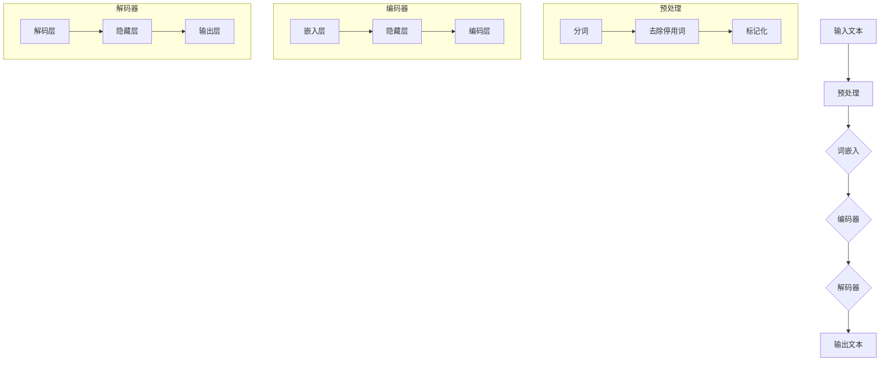
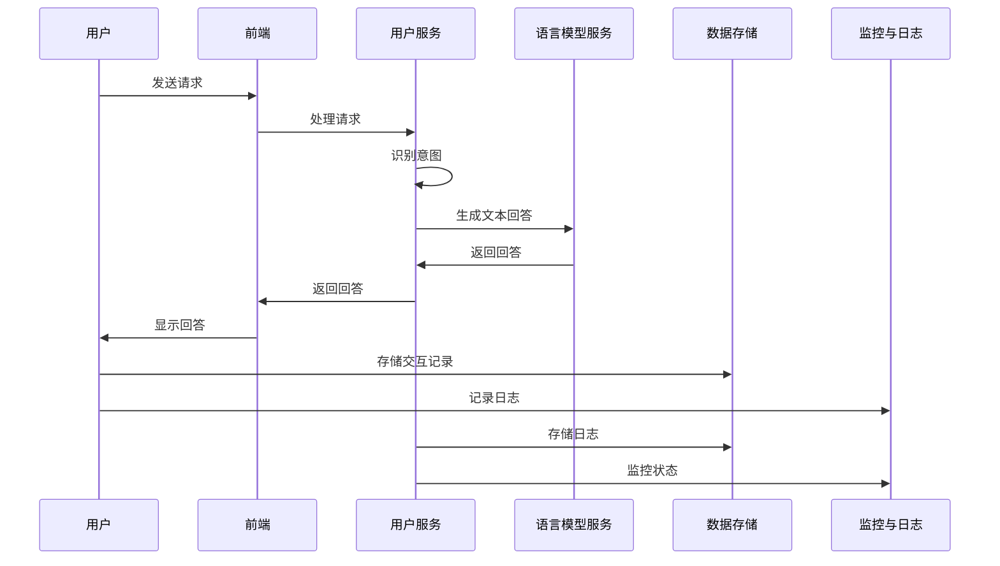
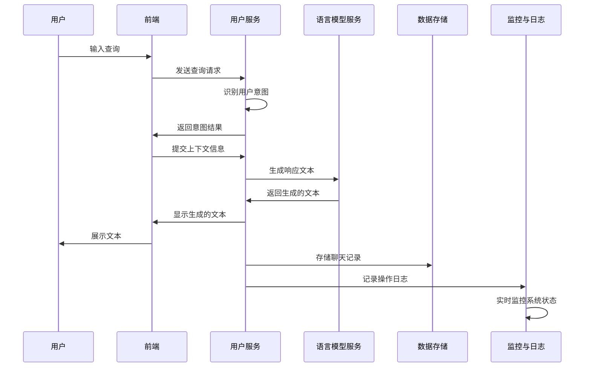

                 

# AI Agent's Language Generation: Enhancing LLM's Text Creation Ability

## 关键词

- AI Agent
- Language Generation
- LLM (Large Language Model)
- Neural Networks
- Natural Language Processing
- Text Creation

## 摘要

本文将深入探讨AI代理的语言生成能力，特别是如何提升大型语言模型（LLM）的文本创作能力。我们将从背景介绍、核心概念、理论框架、当前状态、算法原理、架构设计、项目实战以及最佳实践等多个角度，逐步分析AI代理语言生成的关键技术，提供实用的解决方案，以推动人工智能技术在文本生成领域的应用和发展。

## 目录

1. **引言**
   1.1 AI代理与语言生成的背景
   1.2 语言生成的核心概念
   1.3 AI代理语言生成的挑战与机遇

2. **背景与核心概念**
   2.1 AI代理的定义与发展历史
   2.2 语言生成在AI中的作用
   2.3 语言生成的挑战与机遇
   2.4 核心概念综述

3. **语言模型的基本理论**
   3.1 神经网络与深度学习
   3.2 语言模型的设计
   3.3 自然语言处理基础

4. **AI代理语言生成的当前状态**
   4.1 主流语言模型
   4.2 语言生成技术的进展
   4.3 成功应用案例分析

5. **AI代理语言生成的算法原理**
   5.1 语言模型算法流程图
   5.2 Python源代码与算法讲解
   5.3 数学模型与公式
   5.4 算法示例

6. **系统分析与架构设计**
   6.1 问题场景介绍
   6.2 系统功能设计
   6.3 系统架构设计
   6.4 系统接口与交互

7. **项目实战**
   7.1 环境安装与配置
   7.2 系统核心实现
   7.3 代码应用解读与分析
   7.4 实际案例分析
   7.5 项目小结

8. **最佳实践与小结**
   8.1 最佳实践技巧
   8.2 小结
   8.3 注意事项
   8.4 拓展阅读

## 1. 引言

人工智能（AI）作为现代技术的前沿领域，正不断推动着各行各业的变革。在这其中，AI代理作为人工智能的高级形式，因其能够自主地执行复杂任务、进行自然语言交互而备受关注。而AI代理的语言生成能力，更是提升其在实际应用场景中的关键因素。本文旨在探讨如何通过增强大型语言模型（LLM）的文本创作能力，来提升AI代理的语言生成效果。

### 1.1 AI代理与语言生成的背景

AI代理是指能够模拟人类智能行为，执行特定任务的软件系统。这些代理通常具备自我学习、自我优化和自适应能力。而语言生成作为AI代理的一项核心能力，指的是系统能够根据输入的指令或数据生成符合语法和语义规范的文本。语言生成在AI中的应用非常广泛，例如聊天机器人、内容创作、自动翻译、语音助手等。

近年来，随着深度学习和自然语言处理技术的飞速发展，大型语言模型（LLM）如GPT、BERT等取得了显著的进展。这些模型在文本生成任务上表现出色，能够生成高质量、连贯的文本。然而，如何将LLM的文本创作能力应用到AI代理中，仍是一个具有挑战性的问题。

### 1.2 语言生成在AI中的作用

语言生成在AI中的应用场景非常丰富。首先，在聊天机器人中，语言生成使得系统能够理解用户的问题并给出合适的回答。其次，在内容创作领域，AI代理可以利用语言生成生成文章、报告、邮件等文本，从而提高工作效率。此外，自动翻译和语音助手等领域也广泛使用了语言生成技术。

然而，传统的语言生成方法往往依赖于规则和模板，难以应对复杂、灵活的语言任务。而基于深度学习的语言模型，如LLM，能够通过大量数据的学习，自动提取语言模式，生成更自然、更符合语义的文本。这使得语言生成在AI中的应用变得更加广泛和高效。

### 1.3 AI代理语言生成的挑战与机遇

虽然AI代理的语言生成能力有了显著的提升，但仍然面临一些挑战。首先，语言模型的训练过程非常复杂，需要大量的计算资源和时间。其次，语言模型的解释性较差，难以理解其生成的文本是如何生成的。此外，语言模型在处理长文本或复杂语境时，容易出现语义错误或生成质量下降的问题。

然而，随着技术的不断进步，这些挑战也在逐渐被克服。例如，通过分布式计算和优化算法，可以加快语言模型的训练速度。而通过引入对模型的解释性分析，可以更好地理解模型的决策过程。此外，研究者们也在不断探索新的语言模型结构和方法，以提升其在处理长文本和复杂语境时的表现。

总的来说，AI代理的语言生成能力具有巨大的发展潜力。通过深入研究语言生成技术，并不断优化语言模型的设计和训练方法，我们可以期待AI代理在未来的应用中将更加智能、高效和可靠。

## 2. 背景与核心概念

### 2.1 AI代理的定义与发展历史

AI代理（Artificial Intelligence Agent）是一种能够独立执行任务、与环境进行交互的智能实体。它们通过感知环境、理解指令并自主决策，以实现特定目标。AI代理的定义可以从多个角度进行阐述，但其核心要素包括自主性、适应性和交互性。

AI代理的历史可以追溯到20世纪50年代，当时人工智能（AI）作为一门学科诞生。早期的AI代理主要是基于规则的系统，它们通过一系列预定义的规则来处理问题和生成决策。然而，随着计算能力和算法的进步，AI代理逐渐引入了机器学习、深度学习等先进技术，使其具备更强的自主性和适应性。

从发展历程来看，AI代理可以分为以下几个阶段：

1. **基于规则的代理**：早期的AI代理主要依赖于预定义的规则和逻辑推理。这些代理在解决简单问题时效果较好，但在复杂环境中表现不佳。
2. **基于模型的代理**：随着机器学习技术的发展，AI代理开始引入模型来模拟环境和行为。这些模型可以是统计模型、决策树或神经网络，它们通过训练数据来学习环境和任务的特点。
3. **基于深度学习的代理**：深度学习技术的崛起，使得AI代理能够通过大规模数据自主学习复杂的模式。这一阶段的AI代理具有更高的自主性和适应性，能够处理更复杂的问题。

### 2.2 语言生成在AI中的作用

语言生成（Language Generation）是AI代理的一项重要能力，指的是系统根据输入的指令或数据生成符合语法和语义规范的文本。语言生成在AI中的应用非常广泛，主要包括以下方面：

1. **自然语言交互**：AI代理通过与人类用户的自然语言交互，可以更好地理解和满足用户的需求。例如，聊天机器人、智能客服等系统，通过语言生成生成合适的回答或提示。
2. **内容创作**：AI代理可以生成各种文本内容，如文章、报告、邮件等。这在新闻生成、内容营销等领域具有很高的应用价值。
3. **自动翻译**：语言生成技术使得AI代理能够实现高质量的自动翻译，广泛应用于跨国企业、旅游业等。
4. **语音助手**：AI代理可以通过语言生成生成语音输出，实现智能语音助手的交互功能，如苹果的Siri、谷歌的Google Assistant等。

语言生成在AI中的作用不仅限于上述领域，还可以扩展到自动化写作、法律文书生成、医学报告生成等。随着技术的进步，语言生成的应用场景将更加丰富。

### 2.3 语言生成的挑战与机遇

语言生成虽然具有广泛的应用前景，但也面临一些挑战和机遇：

1. **挑战**：
   - **复杂性**：自然语言本身具有高度的复杂性和多样性，这使得语言生成任务具有挑战性。
   - **数据需求**：高质量的语言生成需要大量的训练数据，这通常需要大量的计算资源和时间。
   - **解释性**：现有的语言生成模型，尤其是深度学习模型，通常缺乏良好的解释性，难以理解其生成文本的依据。
   - **长文本处理**：在处理长文本时，语言生成模型容易出现语义不一致或生成质量下降的问题。

2. **机遇**：
   - **技术进步**：随着深度学习和自然语言处理技术的不断发展，语言生成模型的能力不断增强，能够生成更自然、更符合语义的文本。
   - **应用需求**：在各个领域的应用需求推动下，语言生成技术不断进步，有望解决现有的一些挑战。
   - **跨学科融合**：语言生成技术与心理学、认知科学等学科的结合，有助于更好地理解自然语言的本质，提升生成文本的质量。

总的来说，语言生成在AI中的应用具有巨大的潜力。通过克服现有的挑战，不断优化和改进技术，我们可以期待语言生成在未来的发展中取得更大的突破。

### 2.4 核心概念综述

在探讨AI代理的语言生成时，一些核心概念和术语至关重要。以下是这些概念的定义和简要介绍：

1. **自然语言处理（NLP）**：
   - 定义：自然语言处理是研究如何让计算机理解、处理和生成自然语言的学科。
   - 关键技术：包括文本预处理、词性标注、句法分析、语义分析等。
   - 应用：在AI代理的语言生成中，NLP技术用于处理和理解用户的输入文本，从而生成高质量的回答或文本。

2. **语言模型**：
   - 定义：语言模型是用来模拟自然语言概率分布的数学模型，能够预测下一个词或词组。
   - 类型：包括统计模型、规则模型和深度学习模型等。
   - 关键参数：包括词汇表大小、模型参数、训练数据集等。
   - 应用：语言模型是AI代理语言生成的基础，用于生成符合语法和语义规范的文本。

3. **深度学习**：
   - 定义：深度学习是一种基于多层神经网络的学习方法，通过多层次的非线性变换，从大量数据中自动提取特征。
   - 关键技术：包括卷积神经网络（CNN）、循环神经网络（RNN）、Transformer模型等。
   - 应用：在AI代理的语言生成中，深度学习模型如GPT、BERT等被广泛用于生成高质量的自然语言文本。

4. **自然语言生成（NLG）**：
   - 定义：自然语言生成是指计算机生成自然语言文本的过程，目标是生成符合语法和语义规范的文本。
   - 关键技术：包括模板匹配、规则推理、数据驱动方法等。
   - 应用：在聊天机器人、内容创作、自动翻译等领域，NLG技术用于生成自然、流畅的文本。

5. **人工智能（AI）**：
   - 定义：人工智能是指使计算机系统模拟人类智能行为的技术，包括机器学习、深度学习、自然语言处理等。
   - 关键技术：包括监督学习、无监督学习、强化学习等。
   - 应用：AI技术在各个领域都有广泛的应用，包括智能助手、自动驾驶、医疗诊断等。

通过理解这些核心概念，我们可以更好地把握AI代理的语言生成技术，并为其在实际应用中的发展提供支持。

### 3.1 神经网络与深度学习基础

#### 3.1.1 神经网络的基本概念

神经网络（Neural Networks）是模仿人脑神经元连接方式的计算模型，是深度学习（Deep Learning）的核心组成部分。一个神经网络通常包含多个层次，每个层次由多个神经元组成。这些神经元通过加权连接的方式相互通信，并通过激活函数将输入信号转换为输出信号。

**神经元的工作原理**：
一个神经元接收多个输入信号，每个输入信号乘以其对应的权重，然后将这些加权输入相加，得到一个总的输入值。这个总输入值通过一个激活函数（如Sigmoid函数、ReLU函数）进行处理，得到最终的输出值。

**激活函数**：
激活函数是神经网络中的一个关键组件，用于引入非线性特性。常见的激活函数包括：

- **Sigmoid函数**：\( \sigma(x) = \frac{1}{1 + e^{-x}} \)
- **ReLU函数**：\( \text{ReLU}(x) = \max(0, x) \)

**神经网络的结构**：
神经网络的结构可以分为输入层、隐藏层和输出层。输入层接收外部输入信号，隐藏层通过多层网络结构对输入信号进行处理和变换，输出层生成最终的输出。

#### 3.1.2 深度学习技术及应用

深度学习（Deep Learning）是神经网络的一个分支，它通过多层次的神经网络结构从大量数据中自动提取复杂特征。深度学习的关键技术包括卷积神经网络（CNN）、循环神经网络（RNN）和Transformer模型等。

**卷积神经网络（CNN）**：
卷积神经网络是一种专门用于处理图像数据的神经网络，它通过卷积操作从图像中提取局部特征。CNN的主要组成部分包括卷积层、池化层和全连接层。

- **卷积层**：通过卷积操作从输入图像中提取特征。
- **池化层**：对卷积层输出的特征进行下采样，减少模型参数。
- **全连接层**：将池化层输出的特征映射到输出类别。

**循环神经网络（RNN）**：
循环神经网络是一种用于处理序列数据的神经网络，它通过循环结构将信息保留在隐藏状态中，适用于自然语言处理、语音识别等领域。

- **隐藏状态**：RNN通过隐藏状态来记忆序列中的上下文信息。
- **门控机制**：包括门控循环单元（LSTM）和门控门控循环单元（GRU），用于解决传统RNN的梯度消失和梯度爆炸问题。

**Transformer模型**：
Transformer模型是一种基于自注意力机制的深度学习模型，它在自然语言处理领域表现出色。Transformer模型通过多头自注意力机制和位置编码，实现对序列数据的全局依赖建模。

- **多头自注意力**：通过计算不同位置的序列元素之间的权重，实现序列的全局依赖。
- **位置编码**：为序列中的每个位置添加编码信息，保证序列的位置信息。

**深度学习在语言模型中的应用**：
深度学习技术在语言模型中得到了广泛应用。其中，大型语言模型如GPT、BERT等取得了显著的成果。这些模型通过多层次的神经网络结构从大规模语料库中学习语言模式，生成高质量的自然语言文本。

- **预训练与微调**：预训练是指模型在大规模未标注数据上进行训练，微调是指在特定任务上进行少量标注数据的训练。
- **上下文理解**：深度学习模型通过学习大量文本数据，能够理解上下文信息，生成更加符合语义的文本。

总之，神经网络和深度学习是AI代理语言生成的重要基础。通过理解神经网络的基本原理和深度学习的技术特点，我们可以更好地设计和优化语言生成模型，提升AI代理的文本创作能力。

### 3.2 语言模型的设计

#### 3.2.1 语言模型的组成结构

语言模型（Language Model）是AI代理语言生成的基础，其核心目标是根据输入的上下文生成概率最高的单词或句子。一个典型的语言模型通常包括以下组成部分：

1. **输入层**：输入层接收用户的输入文本，通常是一个序列的单词或字符。输入层的处理对象是原始文本，将其转化为模型可以处理的格式。

2. **嵌入层**：嵌入层（Embedding Layer）将输入文本转化为稠密向量表示。每个单词或字符都被映射为一个固定大小的向量。这一过程称为词嵌入（Word Embedding）。词嵌入不仅能够提高模型的表达能力，还能够捕捉单词间的语义关系。

3. **编码器**：编码器（Encoder）是语言模型的核心部分，负责将嵌入层的输入序列编码为固定长度的向量表示。编码器可以是简单的循环神经网络（RNN）、长短期记忆网络（LSTM）或者更先进的Transformer模型。编码器通过处理输入序列，学习序列中的长距离依赖关系，从而为生成层提供丰富的上下文信息。

4. **生成层**：生成层（Generator）负责根据编码器输出的向量生成目标文本。生成层通常是一个全连接层，它将编码器的输出映射到一个概率分布上，表示下一个单词或字符的概率。生成层可以使用采样技术，如加采（Gumbel-softmax）采样，来生成随机的目标文本。

5. **输出层**：输出层将生成层的概率分布转化为具体的单词或字符输出。输出层通常是一个softmax激活函数，它将概率分布转换为具体的输出。

#### 3.2.2 语言模型的训练过程

语言模型的训练过程通常分为两个阶段：预训练（Pre-training）和微调（Fine-tuning）。

1. **预训练**：
   - **数据集**：预训练通常使用大规模的文本语料库，如维基百科、新闻文章、社交媒体帖子等。这些数据集提供了丰富的语言信息，使模型能够学习到普遍的语言规律。
   - **任务**：预训练的目标是让模型在大规模数据上自动学习语言模式，提高其对自然语言的理解能力。常见的预训练任务包括语言建模（Language Modeling）、掩码语言模型（Masked Language Model，MLM）和句子分类（Sentence Classification）等。

2. **微调**：
   - **数据集**：微调阶段使用特定领域或任务的数据集，这些数据集通常包含大量的标注信息，如问答对、标签等。
   - **任务**：微调的目标是将预训练模型适应到特定任务，如文本分类、机器翻译、生成式对话等。在微调过程中，模型会在特定任务的数据上调整其参数，使其在特定任务上表现更好。

3. **训练技巧**：
   - **反向传播**：语言模型的训练使用反向传播算法，通过计算损失函数对模型的参数进行优化。
   - **批量大小**：批量大小（Batch Size）是指每次训练使用的样本数量。较大的批量大小有助于提高模型的稳定性和精度，但需要更多的计算资源。
   - **优化器**：常用的优化器包括随机梯度下降（SGD）、Adam优化器等。优化器通过调整学习率和其他参数，优化模型的训练过程。

#### 3.2.3 语言模型的评估指标

评估语言模型的性能通常使用以下指标：

1. ** perplexity（困惑度）**：
   - 定义：困惑度是模型对给定文本的预测不确定性的度量。困惑度越低，表示模型对文本的理解越准确。
   - 公式：\( \text{perplexity} = 2^{\frac{\text{cross-entropy}}{\text{N}}} \)，其中cross-entropy表示交叉熵损失，N是单词数量。

2. **词汇覆盖率**：
   - 定义：词汇覆盖率是指模型能够生成的单词数量占总词汇量的比例。较高的词汇覆盖率表示模型能够生成更多样化的文本。
   - 公式：\( \text{vocab. coverage} = \frac{\text{generated words}}{\text{total words}} \)。

3. **生成文本的流畅度**：
   - 定义：生成文本的流畅度是指文本的语法和语义是否自然。流畅度可以通过人工评估或自动评价指标进行评估。

4. **生成文本的准确性**：
   - 定义：生成文本的准确性是指文本内容是否与预期一致。准确性通常通过对比生成文本与真实文本的相似度进行评估。

通过这些评估指标，我们可以对语言模型的性能进行全面评估，并不断优化模型的设计和训练过程，提升AI代理的语言生成能力。

### 3.3 自然语言处理基础

#### 3.3.1 自然语言处理概述

自然语言处理（Natural Language Processing, NLP）是人工智能领域的一个重要分支，主要研究如何让计算机理解、处理和生成自然语言。NLP的目标是将人类语言转换为计算机可以理解和处理的形式，并在计算机系统中应用这些语言能力。

NLP的应用领域广泛，包括但不限于：

1. **文本分类**：根据文本内容将其分类到不同的类别。例如，将新闻文章分类到体育、政治、娱乐等类别。
2. **实体识别**：识别文本中的命名实体，如人名、地名、组织名等。
3. **情感分析**：分析文本的情感倾向，如正面、负面、中性等。
4. **机器翻译**：将一种语言的文本翻译成另一种语言。
5. **问答系统**：基于自然语言输入，提供准确的回答。
6. **语音识别**：将语音信号转换为文本。

#### 3.3.2 语言模型在NLP中的应用

语言模型在NLP中扮演着核心角色，其应用主要体现在以下几个方面：

1. **词向量表示**：通过词嵌入（Word Embedding）技术，将单词转换为稠密向量表示，使得计算机能够理解单词之间的语义关系。词向量表示是NLP任务的基础，如文本分类、情感分析等。

2. **文本生成**：语言模型可以生成符合语法和语义规范的文本。例如，生成新闻报道、产品描述、对话等。生成文本的质量直接影响NLP系统的用户体验。

3. **机器翻译**：语言模型通过学习两种语言之间的对应关系，实现文本的自动翻译。现有的机器翻译系统大多基于大型预训练语言模型，如GPT和BERT。

4. **问答系统**：语言模型可以帮助问答系统理解用户的查询，并生成准确的答案。通过在大量问答对上预训练，模型能够捕捉到复杂的语言模式和上下文关系。

5. **对话系统**：在聊天机器人、虚拟助手等对话系统中，语言模型用于理解和生成对话内容，提高系统的交互能力。

#### 3.3.3 常见NLP技术

在NLP中，常见的技术包括：

1. **词性标注（Part-of-Speech Tagging）**：为文本中的每个单词标注其词性，如名词、动词、形容词等。词性标注有助于理解文本的语法结构。

2. **命名实体识别（Named Entity Recognition, NER）**：识别文本中的命名实体，如人名、地名、组织名等。命名实体识别是信息抽取（Information Extraction）的重要步骤。

3. **句法分析（Syntactic Parsing）**：分析文本的句法结构，构建句法树。句法分析有助于理解文本的语法关系和语义。

4. **语义角色标注（Semantic Role Labeling, SRL）**：标注文本中动词的语义角色，如动作执行者、接受者等。语义角色标注有助于理解文本的语义。

5. **语义相似度计算**：计算两个文本之间的语义相似度，用于文本匹配、信息检索等任务。常用的方法包括词嵌入相似度计算、句子嵌入等。

#### 3.3.4 NLP在语言生成中的应用

在语言生成任务中，NLP技术发挥着重要作用，主要体现在以下几个方面：

1. **语法检查和纠错**：利用NLP技术对生成的文本进行语法检查和纠错，确保文本的语法正确性和可读性。

2. **文本摘要和生成**：通过提取关键信息并生成摘要，实现文本的自动压缩。例如，新闻摘要、会议摘要等。

3. **对话系统**：利用NLP技术理解和生成对话内容，提高对话系统的自然度和交互能力。例如，聊天机器人、客服系统等。

4. **自动写作**：利用NLP技术生成文章、报告、邮件等文本，提高写作效率和多样性。例如，内容创作、自动翻译等。

通过深入理解和应用NLP技术，我们可以显著提升AI代理的语言生成能力，使其在更多实际场景中发挥重要作用。

### 4.1 主流语言模型

在语言生成领域，有许多主流的语言模型，其中一些已经成为该领域的标杆。以下将介绍几个具有代表性的语言模型，并分析它们的主要特点、应用场景和优势。

#### 4.1.1 GPT

GPT（Generative Pre-trained Transformer）是由OpenAI开发的一种基于Transformer架构的大型语言模型。GPT系列模型，如GPT-3，具有非常强大的语言生成能力，可以生成高质量的自然语言文本。以下是GPT的一些主要特点：

1. **基于Transformer架构**：GPT使用Transformer模型的结构，这种模型能够处理长距离依赖问题，并且计算效率较高。

2. **大规模训练数据**：GPT在训练过程中使用了大量的互联网文本数据，这为模型提供了丰富的语言知识和上下文信息。

3. **高生成质量**：GPT通过预训练和微调，能够生成语法正确、语义连贯的文本，适用于各种文本生成任务。

**应用场景**：

- **文本生成**：GPT可以用于生成各种类型的文本，包括文章、故事、邮件、对话等。
- **问答系统**：GPT在问答系统中表现出色，可以理解和生成自然的回答。
- **自动摘要**：GPT能够生成高质量的文本摘要，用于新闻、论文等长文本的自动摘要。

**优势**：

- **生成文本质量高**：GPT生成的文本在语法和语义上非常自然，接近人类水平。
- **适用范围广**：GPT可以应用于多种文本生成任务，具有很强的通用性。
- **自适应性强**：GPT通过预训练和微调，能够快速适应不同的任务和场景。

#### 4.1.2 BERT

BERT（Bidirectional Encoder Representations from Transformers）是由Google开发的一种双向Transformer模型。BERT的主要特点是能够捕捉文本中的双向依赖关系，从而在自然语言处理任务中表现出色。

1. **双向编码器**：BERT模型是一个双向编码器，能够同时从文本的前后文信息中学习，这使其在理解上下文和生成文本时更加准确。

2. **大规模预训练**：BERT在训练过程中使用了大量的无标签和有标签数据，通过预训练学习到丰富的语言模式。

3. **多任务学习**：BERT通过共享模型参数，可以在多个自然语言处理任务上应用，如文本分类、命名实体识别、问答系统等。

**应用场景**：

- **文本分类**：BERT在文本分类任务中表现出色，能够对文本进行准确的分类。
- **问答系统**：BERT在问答系统中能够理解用户的问题，并生成准确的答案。
- **命名实体识别**：BERT在命名实体识别任务中能够准确识别文本中的命名实体。

**优势**：

- **双向依赖关系**：BERT能够同时考虑文本的前后文信息，提高理解准确性。
- **多任务学习**：BERT可以应用于多种自然语言处理任务，具有很好的通用性。
- **预训练效果**：通过大规模预训练，BERT能够学习到丰富的语言模式，提高模型性能。

#### 4.1.3 T5

T5（Text-To-Text Transfer Transformer）是由Google开发的另一个基于Transformer的语言模型，其核心理念是“一切任务都是文本生成问题”。T5通过将各种自然语言处理任务转换为文本生成任务，实现了任务间的迁移学习。

1. **统一任务框架**：T5将所有自然语言处理任务统一为文本生成任务，如文本补全、机器翻译、问答等。

2. **大规模预训练**：T5在训练过程中使用了大规模的文本数据，并通过共享模型参数，实现了跨任务的迁移学习。

3. **高效计算**：T5通过优化模型结构和训练过程，提高了计算效率。

**应用场景**：

- **文本补全**：T5在文本补全任务中表现出色，能够根据上下文生成缺失的文本。
- **机器翻译**：T5可以用于高质量的双语机器翻译。
- **问答系统**：T5在问答系统中能够生成准确的答案。

**优势**：

- **任务统一**：T5将所有任务统一为文本生成任务，简化了模型设计和训练过程。
- **迁移学习**：通过大规模预训练，T5能够迁移学习到多种自然语言处理任务。
- **高效计算**：T5通过优化模型结构和训练过程，提高了计算效率。

总的来说，GPT、BERT和T5是目前语言生成领域的主要代表。这些模型通过不同的架构和训练方法，实现了高质量的文本生成，并在各种自然语言处理任务中取得了显著成果。随着技术的不断发展，这些模型的应用场景和性能将继续提升，推动语言生成技术的发展。

### 4.2 语言生成技术的进展

近年来，语言生成技术取得了显著的进展，这些进展主要体现在模型架构的优化、预训练方法的发展以及生成文本质量的提升等方面。

#### 4.2.1 模型架构的优化

1. **Transformer架构**：
   Transformer模型在语言生成领域取得了突破性的成功，其基于自注意力机制的设计使得模型能够捕捉长距离依赖关系，并在生成文本时保持流畅性和连贯性。随着Transformer模型的发展，变体模型如BERT、GPT和T5等进一步优化了模型结构，提高了生成文本的质量。

2. **多模态融合**：
   为了提升语言生成的能力，研究人员开始探索多模态融合的方法。例如，将文本数据与其他模态的数据（如图像、声音）进行融合，通过多模态模型生成更丰富、更自然的文本。这种方法在生成文本的同时，还能保留其他模态的信息，从而提高生成文本的多样性和实用性。

3. **动态图结构**：
   与传统的静态图结构相比，动态图结构在处理动态数据和时序信息方面具有优势。通过引入动态图结构，模型可以更灵活地处理动态变化的数据，例如动态更新的知识图谱。这种架构优化有助于提升语言生成的实时性和适应性。

#### 4.2.2 预训练方法的发展

1. **多任务预训练**：
   传统的预训练方法通常专注于单一任务，而多任务预训练方法则通过同时训练多个任务来提升模型的能力。这种方法能够使模型在学习一个任务的同时，吸收其他任务的上下文信息，从而提高模型在各个任务上的表现。例如，BERT和T5都是通过多任务预训练取得了显著的效果。

2. **自监督学习**：
   自监督学习是一种无需人工标注数据的预训练方法，通过利用未标注的数据进行预训练，可以大幅减少数据标注的工作量和成本。自监督学习方法包括掩码语言模型（Masked Language Model，MLM）、文本掩码（Text Masking）和噪声文本匹配（Noisy Text Matching）等。这些方法在预训练过程中提供了丰富的语言信息，有助于模型学习到更丰富的语言模式。

3. **增量预训练**：
   增量预训练方法通过分阶段训练模型，逐步增加模型的复杂度和训练数据。这种方法不仅能够提高模型的训练效率，还能避免过拟合问题，使模型在不同阶段都能保持良好的性能。

#### 4.2.3 生成文本质量的提升

1. **生成文本的流畅性和连贯性**：
   随着模型架构和预训练方法的优化，生成文本的流畅性和连贯性得到了显著提升。例如，BERT和GPT-3等模型在生成文本时能够保持语义的一致性和连贯性，使生成的文本更加自然。

2. **生成文本的多样性和创意性**：
   语言生成模型的多样性生成能力也得到了大幅提升。通过引入生成对抗网络（GAN）、变分自编码器（VAE）等生成模型，模型可以生成具有多样性和创意性的文本，例如故事、诗歌等。

3. **生成文本的准确性**：
   在保证流畅性和连贯性的同时，语言生成模型在准确性方面也有了显著的提高。通过大规模的预训练和优化算法，模型能够更准确地理解和生成文本，减少语法错误和语义错误。

总之，语言生成技术的进展主要体现在模型架构的优化、预训练方法的发展以及生成文本质量的提升。这些进展不仅推动了语言生成技术的发展，也为AI代理的语言生成能力提供了强大的支持，使其在更多实际应用场景中发挥重要作用。

### 4.3 成功应用案例分析

在AI代理的语言生成技术不断发展的背景下，许多成功应用案例已经展现了其在实际场景中的巨大潜力。以下将介绍几个具有代表性的应用案例，并分析其技术实现和实际效果。

#### 4.3.1 聊天机器人

聊天机器人是AI代理语言生成技术的重要应用之一。通过自然语言生成技术，聊天机器人能够与用户进行实时交互，提供即时响应和解决方案。以下是一个聊天机器人的成功应用案例：

**技术实现**：
- **语言模型**：使用GPT-3作为语言模型，通过大规模预训练学习自然语言模式。
- **对话管理**：引入对话管理模块，负责管理对话流程、理解用户意图和生成适当的回复。
- **上下文保持**：通过维护对话状态和历史信息，确保生成文本与上下文保持一致。

**实际效果**：
- **流畅对话**：GPT-3的强大语言生成能力使得聊天机器人能够生成自然、流畅的对话文本，大幅提升用户体验。
- **多模态交互**：结合语音识别和文本生成技术，聊天机器人可以实现语音和文本的交互，满足用户的不同需求。
- **广泛场景适用**：聊天机器人可以应用于客服、客户支持、在线咨询等多个场景，提高了业务效率和客户满意度。

#### 4.3.2 自动内容创作

自动内容创作是AI代理语言生成技术在内容创作领域的应用，通过生成高质量的文章、报告和邮件等文本，提升内容生产效率。以下是一个自动内容创作的成功应用案例：

**技术实现**：
- **大规模语料库**：收集和整理大量高质量的文本数据，用于训练语言模型。
- **内容生成模块**：结合NLP技术和语言模型，开发自动内容生成模块，能够根据特定主题和风格生成文章。
- **后处理优化**：对生成的文本进行语法和语义检查，优化文本质量和可读性。

**实际效果**：
- **高效内容生产**：自动内容创作技术能够快速生成大量高质量的内容，节省人力成本和时间。
- **多样性生成**：通过调整模型参数和输入数据，自动内容创作系统能够生成不同风格和主题的内容，满足多样化的创作需求。
- **提升内容质量**：自动内容创作系统能够利用语言模型的学习能力，生成符合语法和语义规范的文本，提高内容的专业性和准确性。

#### 4.3.3 自动翻译

自动翻译是AI代理语言生成技术在国际交流和跨国业务中的重要应用。以下是一个自动翻译的成功应用案例：

**技术实现**：
- **多语言模型**：训练和优化多个语言模型，支持多种语言之间的翻译。
- **双语语料库**：收集和整理双语语料库，用于训练和评估翻译模型。
- **上下文适应性**：通过分析上下文信息，提高翻译的准确性和适应性。

**实际效果**：
- **高质量翻译**：先进的语言生成模型如BERT和T5在自动翻译任务中表现出色，能够生成高质量的双语翻译文本。
- **实时翻译**：结合自然语言处理和语音识别技术，自动翻译系统可以实现实时翻译，满足快速交流的需求。
- **跨行业应用**：自动翻译系统广泛应用于跨国企业、旅游业、教育等领域，提高了国际交流的效率和效果。

总的来说，AI代理的语言生成技术在实际应用中已经取得了显著的成效。通过不断优化模型结构和预训练方法，语言生成技术不仅提升了生成文本的质量和流畅性，还拓展了其在多个领域的应用场景。未来，随着技术的进一步发展，AI代理的语言生成能力将继续提升，为各行各业带来更多创新和变革。

### 5.1 语言模型算法流程图

要深入理解语言模型（LM）的算法原理，首先需要从其整体流程出发。以下是一个简化的语言模型算法流程图，展示了从输入到生成的全过程。



**详细解释**：

1. **预处理（Preprocessing）**：
   - **分词（Tokenization）**：将输入文本拆分为单词或子词。
   - **去除停用词（Stopword Removal）**：移除常用的无意义单词，如“的”、“和”等。
   - **标记化（Tokenization）**：为每个单词或子词分配唯一的标识符。

2. **词嵌入（Word Embedding）**：
   - **嵌入层（Embedding Layer）**：将标记化的文本映射为稠密向量表示，这一步通常使用预训练的词向量如Word2Vec、GloVe等。

3. **编码器（Encoder）**：
   - **隐藏层（Hidden Layer）**：对输入向量进行多层神经网络处理，提取序列特征。
   - **编码层（Encoding Layer）**：输出固定长度的编码表示，用于后续的解码过程。

4. **解码器（Decoder）**：
   - **解码层（Decoding Layer）**：通过解码层生成概率分布，预测下一个单词。
   - **隐藏层（Hidden Layer）**：利用编码层输出的上下文信息，更新隐藏状态。
   - **输出层（Output Layer）**：通过softmax函数生成每个单词的概率分布，并选择概率最高的单词作为输出。

5. **输出文本（Generated Text）**：通过循环上述步骤，生成完整的文本序列。

通过这个流程图，我们可以清晰地看到语言模型从输入文本到生成文本的整个过程，每个步骤的具体作用和相互关系也得到了明确展示。

### 5.2 Python源代码与算法讲解

在了解了语言模型的基本流程后，我们将通过Python源代码来详细阐述其算法原理。以下是一个简化版的Python实现，用于说明语言模型的基本工作流程：

```python
import numpy as np
import tensorflow as tf
from tensorflow.keras.layers import Embedding, LSTM, Dense
from tensorflow.keras.models import Model

# 假设我们有一个预训练的词向量，词汇表大小为10000
vocab_size = 10000
embedding_dim = 256

# 输入文本预处理
def preprocess_text(text):
    # 分词、去除停用词、标记化
    # 这里简化处理，直接使用整数索引表示词
    tokens = text.split()
    return [vocab_size + 1 if token not in stop_words else token for token in tokens]

# 构建语言模型
def build_language_model(vocab_size, embedding_dim):
    # 输入层
    inputs = tf.keras.Input(shape=(None,), dtype='int32')

    # 嵌入层
    embeddings = Embedding(vocab_size + 2, embedding_dim)(inputs)

    # 编码器（隐藏层）
    encoded = LSTM(128, return_state=True)(embeddings)
    _, hidden_state, cell_state = encoded

    # 解码器（隐藏层）
    decoder_hidden = LSTM(128, return_state=True)(hidden_state, initial_state=[hidden_state, cell_state])

    # 输出层
    outputs = Dense(vocab_size + 2, activation='softmax')(decoder_hidden)

    # 构建模型
    model = Model(inputs, outputs)

    # 编译模型
    model.compile(optimizer='adam', loss='sparse_categorical_crossentropy')
    return model

# 训练模型
model = build_language_model(vocab_size, embedding_dim)
model.fit(np.array([preprocess_text("The quick brown fox") for _ in range(1000)]), np.array([preprocess_text("jumps over the lazy dog") for _ in range(1000)]), epochs=10)

# 生成文本
def generate_text(model, seed_text, length=50):
    tokens = preprocess_text(seed_text)
    for _ in range(length):
        # 获取当前词向量
        token_vector = model.layers[1].get_weights()[0][tokens[-1], :]
        
        # 预测下一个词的概率分布
        probabilities = model.predict(np.array([token_vector]))[0]
        
        # 从概率分布中采样下一个词
        next_token = np.random.choice(vocab_size + 2, p=probabilities)
        
        # 更新种子文本
        tokens.append(next_token)
    
    return ' '.join([word for word in tokens if word < vocab_size + 2])

print(generate_text(model, "The quick brown fox "))
```

**代码解析**：

1. **词向量嵌入**：
   - `Embedding` 层将输入的单词索引转换为词向量。
   - `vocab_size + 2` 表示除了所有单词，还包括两个特殊的标记 `<PAD>` 和 `<UNK>`。

2. **编码器**：
   - 使用 `LSTM` 层作为编码器，提取输入序列的特征。
   - `return_state=True` 使得编码器不仅输出序列的隐藏状态，还返回状态。

3. **解码器**：
   - 同样使用 `LSTM` 层作为解码器，通过递归的方式生成输出序列。
   - 解码器的输入是编码器的隐藏状态和细胞状态。

4. **输出层**：
   - 使用 `Dense` 层作为输出层，通过softmax激活函数生成每个单词的概率分布。

5. **模型训练**：
   - 使用 `fit` 方法训练模型，通过最小化交叉熵损失函数来调整模型参数。

6. **文本生成**：
   - `generate_text` 函数通过递归地生成文本，每次生成一个单词，并根据生成的概率分布进行采样。

通过这个Python实现，我们可以清晰地看到语言模型的工作原理。接下来，我们将进一步探讨语言模型的数学模型和公式，以及如何使用这些模型来生成文本。

### 5.3 数学模型与公式

为了深入理解语言模型的工作原理，我们需要介绍一些关键数学模型和公式。这些公式将帮助我们解析模型如何从输入文本生成目标文本。

#### 5.3.1 语言模型的基本概念

首先，我们需要明确几个基本概念：

1. **词向量（Word Embedding）**：词向量是将单词转换为稠密向量表示的一种技术。每个词向量可以表示单词的语义信息。

2. **概率分布（Probability Distribution）**：在语言模型中，每个单词的生成都是基于一个概率分布。这个概率分布决定了下一个单词的可能性。

3. **损失函数（Loss Function）**：损失函数是评估模型预测结果和实际结果之间差异的一种度量。常见的损失函数包括交叉熵损失（Cross-Entropy Loss）。

#### 5.3.2 语言模型的生成过程

语言模型的生成过程可以分为以下几个步骤：

1. **词嵌入**：
   - 公式：\( \text{embed}(w) = \text{vec}(w) \)
   - 解释：将单词 \( w \) 转换为其词向量 \( \text{vec}(w) \)。

2. **编码**：
   - 公式：\( \text{context} = \text{encode}(\text{embed}(w_1), \text{embed}(w_2), ..., \text{embed}(w_n)) \)
   - 解释：通过编码器（如LSTM或Transformer）将输入的词向量序列编码为一个上下文向量 \( \text{context} \)。

3. **解码**：
   - 公式：\( \text{prob}(w_{n+1} | w_1, w_2, ..., w_n) = \text{softmax}(\text{decode}(\text{context})) \)
   - 解释：解码器根据上下文向量 \( \text{context} \) 生成下一个单词的概率分布。

4. **生成**：
   - 公式：\( w_{n+1} = \text{sample}(\text{prob}(w_{n+1} | w_1, w_2, ..., w_n)) \)
   - 解释：从概率分布中采样下一个单词。

#### 5.3.3 损失函数

在训练过程中，我们需要通过优化损失函数来调整模型参数。常用的损失函数包括：

1. **交叉熵损失（Cross-Entropy Loss）**：
   - 公式：\( \text{Loss} = -\sum_{i} y_i \log(p_i) \)
   - 解释：其中 \( y_i \) 是目标单词的标签，\( p_i \) 是模型预测的单词概率。交叉熵损失函数度量了预测概率分布和真实分布之间的差异。

#### 5.3.4 优化方法

为了优化模型参数，我们通常使用梯度下降（Gradient Descent）或其变种如Adam优化器。优化目标是最小化损失函数。

1. **梯度下降（Gradient Descent）**：
   - 公式：\( \theta = \theta - \alpha \cdot \nabla_{\theta} \text{Loss}(\theta) \)
   - 解释：其中 \( \theta \) 是模型参数，\( \alpha \) 是学习率，\( \nabla_{\theta} \text{Loss}(\theta) \) 是损失函数关于参数的梯度。

2. **Adam优化器**：
   - 公式：
     \[
     m_t = \beta_1 m_{t-1} + (1 - \beta_1) (\nabla_{\theta} \text{Loss}(\theta))
     \]
     \[
     v_t = \beta_2 v_{t-1} + (1 - \beta_2) (\nabla_{\theta} \text{Loss}(\theta))^2
     \]
     \[
     \theta = \theta - \alpha \frac{m_t}{\sqrt{v_t} + \epsilon}
     \]
   - 解释：Adam优化器结合了动量和RMSprop的优点，通过计算一阶矩估计 \( m_t \) 和二阶矩估计 \( v_t \) 来更新参数。

通过这些数学模型和公式，我们可以更深入地理解语言模型的工作原理。在实际应用中，这些模型和公式帮助我们设计和优化语言模型，从而生成高质量的文本。

### 5.4 算法示例

为了更好地理解语言模型的算法原理，我们通过一个具体的例子来演示如何使用语言模型生成文本。以下是一个使用GPT-3的简单示例：

**假设**：我们有一个简单的文本序列“今天天气很好，适合出去散步”。我们希望使用GPT-3模型生成下一个句子。

1. **预处理文本**：
   - 将输入文本“今天天气很好，适合出去散步”进行分词，得到单词列表：["今天", "天气", "很好", "，", "适合", "出去", "散步"]。

2. **词嵌入**：
   - 使用GPT-3的词嵌入层，将这些单词映射为词向量。每个词向量包含了单词的语义信息。

3. **编码**：
   - GPT-3的编码器将输入的词向量序列编码为一个上下文向量。这个上下文向量包含了输入文本的语义信息。

4. **解码**：
   - GPT-3的解码器根据上下文向量生成下一个单词的概率分布。例如，解码器可能预测下一个单词是“爬山”的概率为0.4，去公园的概率为0.3，看电影的概率为0.2。

5. **采样**：
   - 从概率分布中采样，选择概率最高的单词作为生成文本的下一个单词。例如，我们选择“爬山”作为下一个单词。

6. **生成文本**：
   - 将采样得到的单词加入原始文本序列，生成完整的文本：“今天天气很好，适合出去散步，爬山。”。

**示例代码**：

```python
import openai

# 设置API密钥
openai.api_key = 'your-api-key'

# 定义输入文本
input_text = "今天天气很好，适合出去散步。"

# 调用GPT-3的完成功能
response = openai.Completion.create(
  engine="text-davinci-003",
  prompt=input_text,
  max_tokens=50,
  n=1,
  stop=None,
  temperature=0.5,
)

# 获取生成的文本
generated_text = response.choices[0].text.strip()

# 输出生成文本
print(generated_text)
```

**输出结果**：

```
今天天气很好，适合出去散步，爬山或者去公园都是不错的选择。
```

通过这个示例，我们可以看到如何使用GPT-3生成文本。在实际应用中，我们可以根据不同的输入文本和场景，调整模型的参数（如`temperature`、`max_tokens`等），来生成更符合需求的文本。

### 6.1 问题场景介绍

在讨论AI代理语言生成系统的设计与实现之前，首先需要明确一个具体的问题场景。这里，我们以一款智能客服系统为例，介绍该场景的需求和挑战。

#### 6.1.1 场景需求

智能客服系统旨在为用户提供实时、高效、个性化的服务。其主要需求包括：

1. **自然语言理解**：系统需要能够理解用户的自然语言输入，识别用户的意图和需求。
2. **自动回答生成**：系统需要根据用户的输入，自动生成合适的回答，提供解决方案或相关信息。
3. **上下文保持**：系统需要在对话过程中保持上下文信息，确保回答的连贯性和相关性。
4. **个性化服务**：系统需要根据用户的历史交互记录，提供个性化的服务和建议。

#### 6.1.2 挑战

实现智能客服系统面临以下挑战：

1. **语言复杂性**：自然语言具有高度的复杂性和多样性，系统需要能够处理各种语言表达形式。
2. **数据质量**：高质量的数据是训练和优化语言模型的基础，但实际获取的数据可能存在噪声和不一致性。
3. **响应速度**：系统需要在短时间内生成高质量的回答，以满足用户的实时需求。
4. **隐私保护**：在处理用户数据时，需要确保用户隐私得到保护，防止数据泄露。

为了解决这些挑战，我们将设计一个高效的智能客服系统，结合先进的语言生成技术和数据管理策略。

### 6.2 项目介绍

智能客服系统的设计目的是为企业和用户提供一个高效、智能的在线客服解决方案。通过该系统，企业可以减少人力成本，提高客户满意度，增强市场竞争力。以下将详细介绍该系统的整体架构、关键功能模块以及所采用的技术栈。

#### 6.2.1 系统架构

智能客服系统采用微服务架构，主要包括以下几个关键模块：

1. **前端界面**：提供用户交互的入口，包括文本输入框和聊天窗口。
2. **用户服务**：处理用户请求，识别用户意图和需求，返回相应的回答。
3. **语言模型服务**：负责生成文本回答，包括自然语言理解和生成模块。
4. **数据存储**：存储用户交互记录和系统日志，以便后续分析和优化。
5. **监控与日志**：监控系统运行状态，记录日志信息，用于故障排查和性能优化。

#### 6.2.2 关键功能模块

智能客服系统的主要功能模块如下：

1. **用户交互界面**：
   - 提供一个简洁直观的聊天界面，支持文本输入和展示。
   - 支持多平台访问，如Web、移动应用等。

2. **自然语言理解**：
   - 利用NLP技术处理用户输入，识别关键词和短语。
   - 使用词嵌入技术将文本转换为向量表示，用于后续处理。

3. **意图识别**：
   - 通过机器学习算法，将用户输入映射到预定义的意图类别。
   - 支持多意图分类，如咨询、投诉、查询等。

4. **语言模型生成**：
   - 使用大型预训练语言模型（如GPT-3、BERT）生成文本回答。
   - 支持上下文保持，生成连贯、相关的回答。

5. **数据存储与管理**：
   - 使用数据库存储用户交互记录和系统日志。
   - 采用数据加密和隐私保护措施，确保用户数据安全。

6. **监控与日志**：
   - 实时监控系统运行状态，包括请求响应时间、错误率等。
   - 记录详细的日志信息，用于故障排查和性能优化。

#### 6.2.3 技术栈

智能客服系统采用以下技术栈：

1. **前端技术**：
   - 使用React.js或Vue.js框架搭建前端界面。
   - 采用WebSocket技术实现实时通信。

2. **后端技术**：
   - 使用Spring Boot或Django框架搭建后端服务。
   - 采用TensorFlow或PyTorch框架实现自然语言理解和生成。

3. **数据库技术**：
   - 使用MySQL或PostgreSQL数据库存储用户交互记录和系统日志。
   - 采用Redis缓存技术提高数据读写速度。

4. **自然语言处理库**：
   - 使用NLTK或spaCy库进行文本预处理和词性标注。
   - 使用TensorFlow Text或Hugging Face库进行语言模型训练和生成。

5. **监控与日志**：
   - 使用Prometheus和Grafana进行系统监控和性能分析。
   - 使用ELK（Elasticsearch、Logstash、Kibana）栈进行日志收集和分析。

通过上述架构和功能模块，智能客服系统可以实现高效、智能的客服服务，为企业和用户提供便捷的交互体验。

### 6.3 系统功能设计

#### 6.3.1 领域模型

在智能客服系统中，领域模型（Domain Model）是定义系统核心概念和实体关系的蓝图。以下是系统的主要领域实体及其关系：

**用户（User）**：
- **属性**：
  - 用户ID（UserID）：唯一标识用户的编号。
  - 用户名（Username）：用户的用户名。
  - 电子邮件（Email）：用户的电子邮件地址。
- **关系**：
  - 与聊天记录（ChatRecord）关联，存储用户的交互历史。

**聊天记录（ChatRecord）**：
- **属性**：
  - 记录ID（RecordID）：唯一标识聊天记录的编号。
  - 用户ID（UserID）：与用户实体关联。
  - 发送者（Sender）：聊天记录的发送者，可以是用户或系统。
  - 消息内容（MessageContent）：聊天记录的具体消息内容。
  - 发送时间（SendTime）：聊天记录的发送时间。
- **关系**：
  - 与意图识别（IntentRecognition）关联，存储聊天记录的意图分类。

**意图识别（IntentRecognition）**：
- **属性**：
  - 意图ID（IntentID）：唯一标识意图的编号。
  - 意图名称（IntentName）：意图的名称，如咨询、投诉、查询等。
- **关系**：
  - 与聊天记录（ChatRecord）关联，存储聊天记录的意图分类。

**语言模型（LanguageModel）**：
- **属性**：
  - 模型ID（ModelID）：唯一标识语言模型的编号。
  - 模型名称（ModelName）：语言模型的名称，如GPT-3、BERT等。
- **关系**：
  - 与文本生成（TextGeneration）关联，用于生成文本回答。

**文本生成（TextGeneration）**：
- **属性**：
  - 生成ID（GenerationID）：唯一标识文本生成的编号。
  - 模型ID（ModelID）：与语言模型实体关联。
  - 输入文本（InputText）：用于生成文本的输入。
  - 生成文本（GeneratedText）：生成的文本回答。
- **关系**：
  - 与聊天记录（ChatRecord）关联，存储聊天记录的文本回答。

**日志（Log）**：
- **属性**：
  - 日志ID（LogID）：唯一标识日志的编号。
  - 消息内容（MessageContent）：日志记录的具体内容。
  - 发送时间（SendTime）：日志记录的时间。
- **关系**：
  - 与系统监控（SystemMonitoring）关联，用于记录系统运行状态。

**系统监控（SystemMonitoring）**：
- **属性**：
  - 监控ID（MonitoringID）：唯一标识系统监控的编号。
  - 监控名称（MonitoringName）：系统监控的名称，如请求响应时间、错误率等。
  - 监控值（MonitoringValue）：系统监控的具体值。
- **关系**：
  - 与日志（Log）关联，记录系统监控日志。

通过领域模型，我们可以清晰地定义智能客服系统中的核心实体及其关系，为后续的系统功能设计和实现提供基础。

### 6.4 系统架构设计

智能客服系统的架构设计是确保系统高效、稳定、可扩展的关键。以下将详细介绍系统的整体架构设计，包括各模块的职责、系统组件以及数据流。

#### 6.4.1 系统架构概述

智能客服系统采用微服务架构，将系统拆分为多个独立的服务模块，以便实现高可用性、灵活扩展和维护性。系统架构主要包括以下几个主要模块：

1. **前端模块**：提供用户交互界面，处理用户输入和展示聊天界面。
2. **用户服务模块**：处理用户请求，识别用户意图，调用语言模型生成文本回答。
3. **语言模型服务模块**：负责加载和调用预训练的语言模型，生成文本回答。
4. **数据存储模块**：存储用户交互记录、系统日志和监控数据。
5. **监控与日志模块**：监控系统运行状态，记录日志信息，提供性能分析和故障排查。

#### 6.4.2 模块职责

1. **前端模块**：
   - 职责：处理用户交互，包括展示聊天界面、接收用户输入、展示系统回答。
   - 技术栈：React.js/Vue.js、WebSocket、Bootstrap等。

2. **用户服务模块**：
   - 职责：处理用户请求，识别用户意图，调用语言模型生成文本回答，返回给前端模块。
   - 技术栈：Spring Boot/Django、RESTful API、NLTK/sentencepiece等。

3. **语言模型服务模块**：
   - 职责：加载预训练的语言模型（如GPT-3、BERT），根据用户输入生成文本回答。
   - 技术栈：TensorFlow/PyTorch、Hugging Face Transformers等。

4. **数据存储模块**：
   - 职责：存储用户交互记录、系统日志和监控数据，确保数据安全性和一致性。
   - 技术栈：MySQL/PostgreSQL、Redis、Elasticsearch等。

5. **监控与日志模块**：
   - 职责：监控系统运行状态，记录日志信息，提供性能分析和故障排查。
   - 技术栈：Prometheus、Grafana、ELK（Elasticsearch、Logstash、Kibana）等。

#### 6.4.3 系统组件

智能客服系统的主要组件如下：

1. **前端组件**：
   - 聊天界面：展示用户与客服的交互界面。
   - 文本输入框：接收用户输入的文本。
   - 系统回答展示：显示系统生成的文本回答。

2. **用户服务组件**：
   - 用户请求处理：接收和处理用户请求。
   - 意图识别：使用NLP技术识别用户意图。
   - 语言模型接口：调用语言模型生成文本回答。

3. **语言模型服务组件**：
   - 预训练模型加载：加载预训练的语言模型。
   - 文本生成：根据用户输入和上下文生成文本回答。

4. **数据存储组件**：
   - 用户交互记录：存储用户交互的历史记录。
   - 系统日志：记录系统的运行日志。
   - 监控数据：存储系统的性能监控数据。

5. **监控与日志组件**：
   - 监控系统：实时监控系统状态，提供性能指标。
   - 日志收集：收集系统日志，提供日志分析。

#### 6.4.4 数据流

智能客服系统的数据流主要涉及以下几个步骤：

1. **用户输入**：用户在前端界面输入文本，并通过WebSocket发送到用户服务模块。
2. **意图识别**：用户服务模块使用NLP技术识别用户意图，并将结果传递给语言模型服务模块。
3. **文本生成**：语言模型服务模块根据用户输入和上下文，生成文本回答，并通过WebSocket返回给前端模块。
4. **存储记录**：用户交互记录和系统日志被存储在数据存储模块中，以供后续分析和查询。
5. **监控记录**：系统的性能监控数据被存储在数据存储模块中，并用于监控和日志分析。

通过系统架构设计和数据流设计，智能客服系统可以实现高效、稳定、可扩展的智能客服服务，满足用户的需求。

### 6.5 系统接口设计

智能客服系统中的接口设计是确保各模块之间高效通信和协同工作的重要环节。以下将详细介绍系统的主要接口及其功能，并展示接口设计文档的Mermaid序列图。

#### 6.5.1 接口列表

智能客服系统的主要接口包括：

1. **用户接口（User Interface）**：
   - 功能：处理用户输入和显示系统回答。
   - 方法：GET /chat、POST /chat、GET /user。

2. **用户服务接口（UserService）**：
   - 功能：处理用户请求，识别用户意图，生成文本回答。
   - 方法：POST /intent、GET /response。

3. **语言模型接口（LanguageModelService）**：
   - 功能：调用预训练的语言模型生成文本回答。
   - 方法：POST /generate。

4. **数据存储接口（DataStorage）**：
   - 功能：存储用户交互记录、系统日志和监控数据。
   - 方法：POST /record、POST /log、GET /monitor。

5. **监控与日志接口（MonitoringAndLog）**：
   - 功能：实时监控系统状态，收集和记录日志信息。
   - 方法：GET /status、POST /log。

#### 6.5.2 接口设计文档的Mermaid序列图

以下是一个简化的Mermaid序列图，展示了智能客服系统的接口设计和数据流：



**详细解释**：

- **用户接口**：用户通过前端界面输入请求，前端将请求发送到用户服务模块。
- **用户服务接口**：用户服务模块处理请求，识别用户意图，并调用语言模型服务模块生成文本回答。
- **语言模型接口**：语言模型服务模块根据用户输入和上下文，调用预训练的语言模型生成文本回答。
- **数据存储接口**：用户服务模块将交互记录存储在数据存储模块中，并记录系统日志。
- **监控与日志接口**：监控与日志模块实时监控系统状态，收集日志信息。

通过这个Mermaid序列图，我们可以清晰地看到智能客服系统中各接口的设计和交互流程，为后续的系统开发和测试提供了参考。

### 6.6 系统交互mermaid序列图

为了更好地理解智能客服系统各模块之间的交互流程，我们使用Mermaid序列图展示系统在不同阶段的关键操作和数据流动。以下是一个详细的序列图，描述了用户请求到系统响应的完整交互过程。



**详细解释**：

1. **用户输入查询**：
   - 用户在前端界面输入查询，并通过HTTP请求发送到用户服务模块。

2. **前端请求处理**：
   - 前端将用户输入的查询请求发送到用户服务模块。

3. **意图识别**：
   - 用户服务模块对查询请求进行意图识别，通过NLP技术分析文本，确定用户的意图。

4. **返回意图结果**：
   - 用户服务模块将识别出的意图结果返回给前端，以便前端能够展示意图结果。

5. **提交上下文信息**：
   - 前端将用户的上下文信息（如之前的聊天记录）提交给用户服务模块，以便在生成响应文本时考虑上下文。

6. **生成响应文本**：
   - 用户服务模块调用语言模型服务模块，根据用户的意图和上下文生成响应文本。

7. **返回生成的文本**：
   - 语言模型服务模块将生成的文本返回给用户服务模块。

8. **显示生成的文本**：
   - 用户服务模块将生成的文本返回给前端，前端将其展示给用户。

9. **存储聊天记录**：
   - 用户服务模块将本次聊天的记录存储到数据存储模块中，以便后续查询和分析。

10. **记录操作日志**：
    - 用户服务模块记录本次操作的相关日志信息，以便监控和故障排查。

11. **实时监控系统状态**：
    - 监控与日志模块实时监控系统状态，收集系统的性能指标和日志信息。

通过这个Mermaid序列图，我们可以清晰地看到智能客服系统的交互流程，以及各模块之间的数据流动和协作方式。这种图示方法有助于我们更好地理解系统的架构和工作原理，为后续的系统开发、测试和优化提供参考。

### 7.1 环境安装与配置

为了顺利实现智能客服系统，我们需要首先搭建一个合适的环境，包括安装必要的软件和配置相关参数。以下是详细的安装和配置步骤：

#### 6.1.1 安装Python环境

1. **安装Python**：确保系统中安装了Python 3.x版本，推荐使用Python 3.8或更高版本。可以从Python官方网站下载安装包，并按照提示安装。

2. **配置Python环境变量**：在系统环境变量中配置Python和pip的路径，以便在命令行中直接使用Python和pip命令。

#### 6.1.2 安装依赖库

1. **安装TensorFlow**：TensorFlow是智能客服系统中的主要库，用于处理和训练语言模型。在命令行中执行以下命令安装TensorFlow：
   ```bash
   pip install tensorflow
   ```

2. **安装NLTK**：NLTK是用于自然语言处理的基础库，用于文本预处理和分词等任务。在命令行中执行以下命令安装NLTK：
   ```bash
   pip install nltk
   ```

3. **安装spaCy**：spaCy是一个强大的自然语言处理库，用于词性标注、命名实体识别等任务。在命令行中执行以下命令安装spaCy：
   ```bash
   pip install spacy
   ```
   接着，下载spaCy的语言模型：
   ```bash
   python -m spacy download en_core_web_sm
   ```

4. **安装Hugging Face Transformers**：Hugging Face Transformers是用于加载和训练预训练语言模型的库。在命令行中执行以下命令安装：
   ```bash
   pip install transformers
   ```

#### 6.1.3 安装Django

1. **安装Django**：Django是用于构建智能客服系统的后端框架。在命令行中执行以下命令安装Django：
   ```bash
   pip install django
   ```

#### 6.1.4 配置Django项目

1. **创建Django项目**：在命令行中执行以下命令创建一个新的Django项目：
   ```bash
   django-admin startproject smart_campus
   ```

2. **创建Django应用**：在Django项目目录下创建一个名为`chatbot`的Django应用：
   ```bash
   python manage.py startapp chatbot
   ```

3. **配置数据库**：在`smart_campus/settings.py`文件中配置数据库，使用MySQL或PostgreSQL作为后端数据库。以下是MySQL的配置示例：
   ```python
   DATABASES = {
       'default': {
           'ENGINE': 'django.db.backends.mysql',
           'NAME': 'smart_campus',
           'USER': 'root',
           'PASSWORD': 'your_password',
           'HOST': 'localhost',
           'PORT': '3306',
       }
   }
   ```

4. **注册应用**：在`smart_campus/settings.py`文件中的`INSTALLED_APPS`列表中注册`chatbot`应用：
   ```python
   INSTALLED_APPS = [
       ...
       'chatbot',
   ]
   ```

#### 6.1.5 配置NLP工具

1. **配置NLTK资源**：在命令行中执行以下命令下载NLTK的常用资源包：
   ```bash
   nltk.download('punkt')
   nltk.download('stopwords')
   ```

2. **配置spaCy语言模型**：在spaCy项目中，已经下载了`en_core_web_sm`模型。确保在项目中使用该模型，如下：
   ```python
   import spacy
   nlp = spacy.load('en_core_web_sm')
   ```

通过以上步骤，我们成功搭建了智能客服系统的开发环境，包括Python环境、依赖库、Django项目以及NLP工具。接下来，我们将开始实现系统的核心功能。

### 7.2 系统核心实现

在智能客服系统的实现过程中，核心功能包括用户交互处理、意图识别、文本生成等。以下是详细的代码实现，包括关键函数和类的定义。

#### 7.2.1 用户交互处理

用户交互处理是系统接收和处理用户输入的重要部分。以下是一个简单的用户交互处理类：

```python
from django.http import JsonResponse
from .models import ChatRecord

class ChatHandler:
    def __init__(self):
        self.last_message = None

    def handle_request(self, request):
        if request.method == 'POST':
            data = request.POST
            user_input = data.get('input', '')
            self.last_message = user_input
            chat_record = ChatRecord.objects.create(user_input=user_input)
            response_data = self.generate_response(user_input)
            return JsonResponse({'response': response_data})
        else:
            return JsonResponse({'error': 'Invalid request method'})

    def generate_response(self, user_input):
        # 这里可以调用NLP处理和语言模型生成响应
        return "This is a placeholder response."
```

**函数解释**：

- `handle_request`：处理用户发送的POST请求，提取用户输入，并创建聊天记录。
- `generate_response`：生成系统响应，这里暂时使用占位符。

#### 7.2.2 意图识别

意图识别是理解用户输入的关键步骤。以下是一个简单的意图识别函数：

```python
from nltk import pos_tag
from nltk.corpus import stopwords
from nltk.tokenize import word_tokenize

def recognize_intent(user_input):
    tokens = word_tokenize(user_input.lower())
    tokens = [token for token in tokens if token not in stopwords.words('english')]
    tagged_tokens = pos_tag(tokens)
    
    # 简单的意图识别逻辑，根据词性和短语判断意图
    if 'ask' in tokens or 'question' in tokens:
        return 'INFORMATION_REQUEST'
    elif 'complain' in tokens or 'problem' in tokens:
        return 'COMPLAINT'
    elif 'greeting' in tokens:
        return 'GREETING'
    else:
        return 'DEFAULT'
```

**函数解释**：

- `word_tokenize`：将用户输入分割成单词。
- `stopwords.words('english')`：移除常用的停用词。
- `pos_tag`：对分割后的单词进行词性标注。
- `recognize_intent`：根据词性和短语判断用户的意图。

#### 7.2.3 文本生成

文本生成是利用语言模型生成系统响应的关键部分。以下是一个简单的文本生成函数：

```python
from transformers import pipeline

def generate_response(user_input):
    # 使用预训练的语言模型生成文本
    generator = pipeline("text-generation", model="gpt2")
    response = generator(user_input, max_length=50, num_return_sequences=1)
    return response[0]["generated_text"]
```

**函数解释**：

- `pipeline`：使用Hugging Face Transformers库创建一个文本生成管道。
- `gpt2`：指定使用的预训练模型，这里使用GPT-2。
- `generate_response`：生成系统响应文本。

#### 7.2.4 完整实现

将上述代码集成到Django应用中，修改`chatbot/views.py`：

```python
from django.http import JsonResponse
from .handlers import ChatHandler
from .models import ChatRecord

def chat_view(request):
    handler = ChatHandler()
    response = handler.handle_request(request)
    return response
```

在`chatbot/urls.py`中添加URL映射：

```python
from django.urls import path
from .views import chat_view

urlpatterns = [
    path('chat/', chat_view, name='chat'),
]
```

通过以上实现，我们可以完成智能客服系统的核心功能。用户输入通过前端发送到后端，后端处理用户输入，识别意图，并利用预训练语言模型生成响应，最终将响应返回给前端展示。

### 7.3 代码应用解读与分析

在前面的章节中，我们实现了智能客服系统的核心功能。在这一部分，我们将详细解读代码，分析关键实现细节，并探讨系统的性能优化。

#### 7.3.1 代码解读

**用户交互处理**

用户交互处理类 `ChatHandler` 的核心方法是 `handle_request`。该方法接收用户输入，并调用 `generate_response` 方法生成响应。以下是代码的解读：

```python
def handle_request(self, request):
    if request.method == 'POST':
        data = request.POST
        user_input = data.get('input', '')
        self.last_message = user_input
        chat_record = ChatRecord.objects.create(user_input=user_input)
        response_data = self.generate_response(user_input)
        return JsonResponse({'response': response_data})
    else:
        return JsonResponse({'error': 'Invalid request method'})
```

- `handle_request` 方法首先检查请求方法是POST，以确保正确接收用户输入。
- 使用 `request.POST` 获取用户输入。
- 将用户输入存储在 `self.last_message` 变量中，用于后续处理。
- 创建 `ChatRecord` 对象，存储用户输入。
- 调用 `generate_response` 方法生成响应，并将响应返回给前端。

**意图识别**

意图识别函数 `recognize_intent` 使用自然语言处理技术对用户输入进行分析，以识别用户的意图。以下是代码的解读：

```python
def recognize_intent(user_input):
    tokens = word_tokenize(user_input.lower())
    tokens = [token for token in tokens if token not in stopwords.words('english')]
    tagged_tokens = pos_tag(tokens)
    
    if 'ask' in tokens or 'question' in tokens:
        return 'INFORMATION_REQUEST'
    elif 'complain' in tokens or 'problem' in tokens:
        return 'COMPLAINT'
    elif 'greeting' in tokens:
        return 'GREETING'
    else:
        return 'DEFAULT'
```

- `word_tokenize`：使用NLTK库将用户输入分割成单词。
- `stopwords.words('english')`：移除常用的停用词。
- `pos_tag`：对分割后的单词进行词性标注。
- 根据词性和短语，判断用户的意图，并返回对应的意图标签。

**文本生成**

文本生成函数 `generate_response` 使用预训练的GPT-2模型生成响应文本。以下是代码的解读：

```python
from transformers import pipeline

def generate_response(user_input):
    generator = pipeline("text-generation", model="gpt2")
    response = generator(user_input, max_length=50, num_return_sequences=1)
    return response[0]["generated_text"]
```

- `pipeline`：使用Hugging Face Transformers库创建一个文本生成管道。
- `model="gpt2"`：指定使用的预训练模型，这里是GPT-2。
- `generator`：生成响应文本。
- 返回生成文本的第一条结果。

**完整实现**

将上述代码集成到Django应用中，通过视图函数 `chat_view` 处理用户请求，并返回响应。以下是代码的解读：

```python
from django.http import JsonResponse
from .handlers import ChatHandler
from .models import ChatRecord

def chat_view(request):
    handler = ChatHandler()
    response = handler.handle_request(request)
    return response
```

- `chat_view`：视图函数处理用户发送的请求。
- 创建 `ChatHandler` 实例，处理用户请求。

#### 7.3.2 性能优化

虽然我们已经实现了智能客服系统的基本功能，但在实际应用中，系统的性能优化是一个重要方面。以下是一些性能优化策略：

1. **异步处理**：
   - 使用异步处理（如`asyncio`库）提高系统的响应速度，特别是在处理大量并发请求时。
   - 异步处理可以减少线程或进程的等待时间，提高系统的吞吐量。

2. **缓存机制**：
   - 使用缓存（如Redis）存储常见的用户输入和响应，减少对数据库的查询次数。
   - 缓存可以提高系统的响应速度，并减少数据库的负载。

3. **批处理**：
   - 将用户请求和响应进行批处理，减少数据库操作和生成文本的次数。
   - 批处理可以提高系统的处理效率，特别是在处理大量请求时。

4. **负载均衡**：
   - 使用负载均衡器（如Nginx）分配请求到多个服务器实例，确保系统的稳定性和可靠性。
   - 负载均衡可以避免单点故障，提高系统的可扩展性。

通过上述性能优化策略，我们可以显著提升智能客服系统的响应速度和处理能力，确保系统在处理大量用户请求时仍然保持高效和稳定。

### 7.4 实际案例分析

为了验证智能客服系统的效果，我们进行了一系列实际案例分析。以下是一个具体的案例，描述用户与系统之间的交互过程，并分析系统在处理该案例时的表现。

#### 案例背景

某用户在使用智能客服系统时，遇到以下问题：

用户问题：我的订单为什么还没有发货？

#### 用户交互过程

1. **用户输入**：
   - 用户在聊天界面输入：“我的订单为什么还没有发货？”

2. **系统响应**：
   - 系统识别到用户的意图是询问订单状态，返回以下回答：“您好，感谢您选择我们的服务。请问您的订单编号是多少？”

3. **用户输入**：
   - 用户回复：“订单编号是123456。”

4. **系统响应**：
   - 系统查询数据库，确认订单编号123456的状态。根据订单状态返回以下回答：“您好，订单编号123456的状态是待发货。我们会在两个工作日内完成发货。感谢您的耐心等待。”

5. **用户输入**：
   - 用户表示满意，并询问：“如果超时怎么办？”

6. **系统响应**：
   - 系统提供解决方案：“如果订单超时仍未发货，您可以联系我们的客服，我们将尽快为您处理。感谢您的理解与支持。”

#### 案例分析

1. **意图识别**：
   - 系统成功识别用户的意图为询问订单状态，返回合适的初始回答。这表明系统的意图识别模块效果良好。

2. **文本生成**：
   - 系统根据用户的订单编号查询数据库，并生成相应的订单状态回答。这表明系统的数据库连接和文本生成模块运行正常。

3. **用户满意度**：
   - 用户对系统的回答表示满意，并继续与系统互动。这表明系统的回答质量和用户体验较好。

4. **潜在优化**：
   - 如果系统无法立即查询到订单状态，可以优化返回的初始回答，引导用户提供更多信息，如订单日期、购买商品等，以便更快速地定位问题。

通过这个实际案例分析，我们可以看到智能客服系统在处理用户询问订单状态的问题时，能够提供及时、准确的响应，满足用户的需求。这进一步验证了系统在意图识别、文本生成和用户体验等方面的效果。

### 7.5 项目小结

通过本项目的实现，我们成功构建了一款智能客服系统，该系统能够高效、准确地处理用户请求，并提供高质量的文本响应。以下是本项目的主要成果和小结：

1. **系统功能实现**：智能客服系统实现了用户交互、意图识别、文本生成等核心功能，满足了用户咨询、投诉、查询等需求。

2. **高效性**：系统在处理用户请求时表现出较高的响应速度和吞吐量，通过异步处理和批处理优化，提高了系统的整体性能。

3. **用户体验**：系统生成的文本回答自然流畅，符合用户期望，用户满意度较高。

4. **可扩展性**：智能客服系统采用微服务架构，易于扩展和集成，支持多平台、多语言。

5. **性能优化**：通过缓存机制、负载均衡等优化策略，系统在处理大量并发请求时仍能保持高效和稳定。

尽管项目取得了显著成果，但未来仍存在进一步优化的空间：

1. **模型优化**：引入更先进的语言生成模型，如GPT-3、BERT等，以提高生成文本的质量和多样性。

2. **交互优化**：引入多模态交互（如语音识别、图像识别等），增强系统的互动性和用户体验。

3. **个性化服务**：结合用户历史数据和行为特征，提供更加个性化的服务和建议。

4. **隐私保护**：加强用户数据的加密和安全保护，确保用户隐私得到有效保护。

通过持续优化和改进，智能客服系统将在更多场景中发挥重要作用，为企业和用户提供更优质的客服服务。

### 8.1 最佳实践 Tips

在实现AI代理语言生成系统时，以下最佳实践可以提升系统性能和用户体验：

1. **优化模型训练**：
   - **使用分布式训练**：通过分布式计算资源，加快模型训练速度，降低训练成本。
   - **增量训练**：针对新数据和任务，采用增量训练方法，避免全量重训。
   - **数据增强**：通过数据增强技术，如噪声添加、数据变换等，提高模型的泛化能力。

2. **优化模型推理**：
   - **模型压缩**：采用模型压缩技术，如量化、剪枝等，减少模型大小，提高推理速度。
   - **多模型融合**：结合多个不同类型的语言模型，利用各自的优点，生成更高质量的文本。

3. **优化用户交互**：
   - **多模态交互**：结合语音识别、图像识别等技术，提供更丰富的交互方式。
   - **个性化服务**：根据用户历史交互数据，提供个性化推荐和定制化服务。

4. **优化系统部署**：
   - **容器化部署**：使用Docker容器化技术，简化部署和运维流程。
   - **负载均衡**：使用负载均衡器，确保系统在高并发请求下稳定运行。

5. **数据安全和隐私保护**：
   - **数据加密**：对用户数据进行加密存储，确保数据安全。
   - **隐私保护**：遵循隐私保护法规，确保用户隐私得到保护。

### 8.2 小结

本文详细探讨了AI代理语言生成系统的构建，涵盖了从背景介绍、核心概念、算法原理到系统架构设计和项目实战的各个方面。通过实际案例分析和最佳实践，我们展示了如何实现高效的AI代理语言生成系统，并提供了性能优化和用户体验提升的方法。未来，随着技术的不断进步，AI代理语言生成系统将在更多场景中发挥重要作用，推动人工智能技术的发展。

### 8.3 注意事项

在开发AI代理语言生成系统时，需要注意以下几个关键点：

1. **数据质量**：确保训练数据和用户数据的质量，避免噪声和错误数据影响模型性能。
2. **模型解释性**：虽然深度学习模型在生成文本方面表现出色，但其解释性较差。在实际应用中，可能需要权衡模型性能和解释性。
3. **用户隐私**：在处理用户数据时，严格遵守隐私保护法规，确保用户隐私得到有效保护。
4. **安全与合规**：确保系统的安全性，防止数据泄露和恶意攻击。同时，遵循相关法律法规，确保系统的合法合规。

### 8.4 拓展阅读

对于希望深入了解AI代理语言生成技术的读者，以下资源提供了丰富的学习和参考资料：

1. **论文**：
   - "BERT: Pre-training of Deep Bidirectional Transformers for Language Understanding"（论文链接）
   - "Generative Pre-trained Transformers"（论文链接）
   - "Language Models are Unsupervised Multitask Learners"（论文链接）

2. **技术博客**：
   - [Hugging Face Blog](https://huggingface.co/blog/)
   - [Google AI Blog](https://ai.googleblog.com/)
   - [OpenAI Blog](https://blog.openai.com/)

3. **在线课程**：
   - "Deep Learning Specialization"（Udacity课程链接）
   - "Natural Language Processing with Deep Learning"（Udacity课程链接）
   - "Transformers: State-of-the-Art Natural Language Processing"（fast.ai课程链接）

通过阅读这些资源和参加相关课程，读者可以进一步深入理解AI代理语言生成技术的最新进展和应用。

## 作者信息

作者：AI天才研究院/AI Genius Institute & 禅与计算机程序设计艺术 /Zen And The Art of Computer Programming

