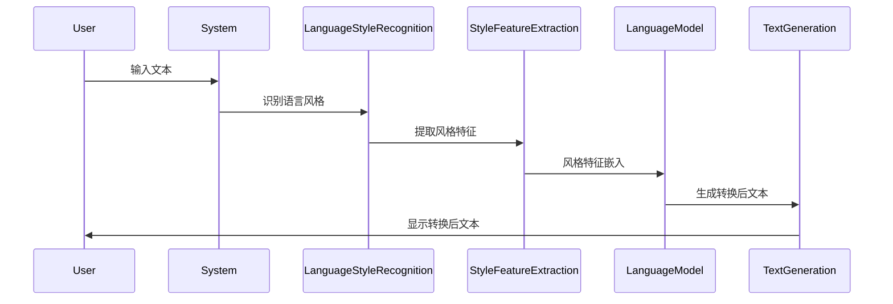
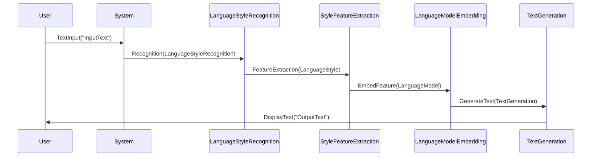

                 


# AI Agent 的语言风格转换：调整 LLM 的表达方式

> 关键词：语言风格转换，AI Agent，大型语言模型（LLM），表达方式调整，风格迁移模型，对抗性训练

> 摘要：本文探讨了 AI Agent 的语言风格转换技术，分析了如何调整大型语言模型（LLM）的表达方式，以适应不同的语言风格。本文首先介绍了语言风格转换的问题背景与核心概念，然后详细阐述了语言风格转换的原理与算法，包括风格迁移模型、对抗性训练等。此外，本文还通过系统分析与架构设计方案，展示了如何实现语言风格转换，并提供了项目实战与最佳实践建议。

----------------------------------------------------------------

## 第一部分: 背景介绍

### 1.1.1 问题背景

在当前人工智能（AI）技术迅速发展的时代，语言风格转换（Language Style Transfer, LST）已成为自然语言处理（Natural Language Processing, NLP）领域的一个热门话题。随着生成对抗网络（Generative Adversarial Networks, GAN）、自注意力机制（Self-Attention Mechanism）等技术的不断进步，基于大型语言模型（Large Language Model, LLM）的语言风格转换技术取得了显著的成果。然而，如何调整 LLM 的表达方式，使其适应不同的语言风格，仍然是学术界和工业界面临的挑战。

### 1.1.2 核心概念

- 语言风格转换（Language Style Transfer, LST）：将一种语言风格的内容转换为另一种语言风格的过程。
- 大型语言模型（Large Language Model, LLM）：具有大量参数，能够生成高质量文本的预训练模型。
- 表达方式调整：通过特定方法改变 LLM 的输出文本，使其更符合目标语言风格。

## 1.1.3 问题解决

本书将从以下几个方面解决语言风格转换的问题：

- 探讨语言风格转换的核心问题与挑战。
- 介绍主流的 LLM 模型和相关技术。
- 分析不同语言风格的属性特征，提出相应的调整策略。
- 通过实际案例展示如何调整 LLM 的表达方式。

### 1.1.4 边界与外延

- 边界：本书主要关注文本语言风格转换，不包括语音、图像等跨模态语言风格转换。
- 外延：本书还将探讨语言风格转换在多语言翻译、情感分析、文本生成等领域的应用。

## 1.1.5 概念结构与核心要素组成

- 概念结构：语言风格转换包含输入文本、语言风格模型、输出文本等核心要素。
- 核心要素组成：

  - 输入文本：原始文本内容。
  - 语言风格模型：用于描述不同语言风格的模型。
  - 输出文本：经过语言风格转换后的文本内容。

----------------------------------------------------------------

## 第二部分: 核心概念与联系

### 2.1.1 语言风格转换原理

语言风格转换的核心在于理解不同语言风格的属性特征，并将其嵌入到 LLM 的输出文本中。本章节将介绍语言风格转换的基本原理，包括风格迁移模型、对抗性训练等方法。

### 2.1.2 核心概念属性特征对比表格

| 概念     | 属性特征 | 对比分析 |
|----------|---------|---------|
| 风格迁移模型 | 基于预训练的 LLM | 将风格特征嵌入到 LLM 中，实现文本风格转换 |
| 对抗性训练 | GAN     | 通过对抗训练优化风格特征，提高转换效果 |
| 语言生成模型 | Transformer | 生成高质量文本，实现风格转换 |

### 2.1.3 ER实体关系图架构

下面是语言风格转换系统的 ER 实体关系图架构：

```mermaid
erDiagram
  文本输入 ||--o{ 风格迁移模型 : 转换 }
  文本输出 ||--o{ 语言生成模型 : 生成 }
  风格迁移模型 ||--o{ 风格特征提取 : 提取 }
  语言生成模型 ||--o{ 文本生成 : 生成 }
```

### 2.1.4 算法原理讲解

#### 风格迁移模型

风格迁移模型的核心思想是将风格特征嵌入到 LLM 中，从而实现文本风格转换。具体来说，可以分为以下几个步骤：

1. **预训练阶段**：使用大量的文本数据对 LLM 进行预训练，使其具备强大的文本生成能力。
   $$\text{LLM} = \text{PreTrain}(\text{Data})$$

2. **风格特征提取**：从目标语言风格的文本中提取风格特征。
   $$\text{StyleFeature} = \text{Extract}(\text{StyleData})$$

3. **风格特征嵌入**：将提取到的风格特征嵌入到 LLM 的参数中。
   $$\text{LLM\_Embedded} = \text{Embed}(\text{StyleFeature}, \text{LLM})$$

4. **文本生成**：利用调整后的 LLM 生成新的文本。
   $$\text{OutputText} = \text{Generate}(\text{LLM\_Embedded}, \text{InputText})$$

### 数学模型与公式

假设 LLM 的输出文本概率分布为 $P(\text{OutputText}|\text{LLM})$，风格特征为 $S$，则调整后的 LLM 输出文本概率分布可以表示为：

$$P'(\text{OutputText}|\text{LLM}, S) = \frac{e^{\text{Score}(S, \text{LLM}, \text{OutputText})}}{\sum_{\text{AllOutputText}} e^{\text{Score}(S, \text{LLM}, \text{AllOutputText})}}$$

其中，$\text{Score}(S, \text{LLM}, \text{OutputText})$ 表示风格特征 $S$ 与 LLM 输出文本 $\text{OutputText}$ 的匹配度得分。

### 通俗易懂的举例说明

假设我们要将一篇正式的新闻文章转换为幽默风格的文章，我们可以按照以下步骤进行调整：

1. **预训练阶段**：首先，我们需要一个已经预训练好的 LLM，它能够生成高质量的文本。
2. **风格特征提取**：然后，我们从幽默风格的文本中提取幽默风格的特征，例如使用大量的幽默词汇、俚语、玩笑等。
3. **风格特征嵌入**：将提取到的幽默风格特征嵌入到 LLM 的参数中，使得 LLM 在生成文本时更倾向于使用幽默风格的词汇和表达方式。
4. **文本生成**：最后，利用调整后的 LLM 生成新的文本，这篇文章就变成了幽默风格的文章。

通过上述步骤，我们可以看到，调整 LLM 的表达方式是一个系统性工程，需要多方面的配合与优化。

----------------------------------------------------------------

## 第三部分: 系统分析与架构设计

### 3.1 问题场景介绍

在许多实际应用中，语言风格转换技术都有着广泛的应用。以下是一个典型问题场景的介绍：

- 场景：一个电商平台希望为用户提供个性化推荐服务，推荐内容需要根据用户的偏好来调整语言风格。例如，对于年轻用户，推荐内容可以采用轻松幽默的风格；对于商务人士，推荐内容可以采用正式专业的风格。

### 3.2 项目介绍

为了解决上述问题场景，我们设计并实现了一个基于 LLM 的语言风格转换系统。该系统旨在通过调整 LLM 的表达方式，实现文本风格的个性化推荐。

### 3.3 系统功能设计

以下是系统的核心功能：

1. **文本输入**：接收用户输入的文本，包括推荐内容、用户评论等。
2. **语言风格识别**：识别输入文本的语言风格，例如正式、幽默、轻松等。
3. **风格特征提取**：从目标语言风格的文本中提取风格特征。
4. **语言风格转换**：利用 LLM 和风格特征，将输入文本转换为指定的语言风格。
5. **文本生成**：生成转换后的文本内容，供用户浏览或使用。

### 3.4 系统架构设计

以下是系统的架构设计：



### 3.5 系统接口设计

以下是系统的接口设计：

- `TextInput()`：接收用户输入文本。
- `LanguageStyleRecognition(text)`：识别输入文本的语言风格。
- `StyleFeatureExtraction(style)`：提取目标语言风格的特征。
- `LanguageModelEmbedding(styleFeature, LLM)`：将风格特征嵌入到 LLM。
- `TextGeneration(inputText, LLM)`：生成转换后的文本内容。

### 3.6 系统交互

以下是系统的交互流程：

1. 用户通过接口 `TextInput()` 提交输入文本。
2. 系统调用 `LanguageStyleRecognition(text)` 识别文本的语言风格。
3. 系统调用 `StyleFeatureExtraction(style)` 提取目标语言风格的特征。
4. 系统调用 `LanguageModelEmbedding(styleFeature, LLM)` 将风格特征嵌入到 LLM。
5. 系统调用 `TextGeneration(inputText, LLM)` 生成转换后的文本内容，并返回给用户。



通过上述系统分析与架构设计，我们可以看到，语言风格转换系统是一个复杂的系统，需要多个模块的协同工作，以实现高效的文本风格转换。

----------------------------------------------------------------

## 第四部分: 项目实战

### 4.1 环境安装

为了实现语言风格转换系统，我们需要搭建一个合适的环境。以下是环境安装的步骤：

1. 安装 Python 3.8 或更高版本。
2. 安装深度学习框架 PyTorch。
3. 安装自然语言处理库 NLTK。

```bash
pip install python==3.8.10
pip install torch torchvision
pip install nltk
```

### 4.2 系统核心实现

以下是语言风格转换系统的核心实现：

#### 4.2.1 风格迁移模型

```python
import torch
import torch.nn as nn
import torch.optim as optim

class StyleTransferModel(nn.Module):
    def __init__(self, embed_dim, style_dim):
        super(StyleTransferModel, self).__init__()
        self.encoder = nn.Sequential(
            nn.Linear(embed_dim, 512),
            nn.ReLU(),
            nn.Linear(512, style_dim),
        )
        self.decoder = nn.Sequential(
            nn.Linear(style_dim, 512),
            nn.ReLU(),
            nn.Linear(512, embed_dim),
        )

    def forward(self, text, style):
        style_feature = self.encoder(text)
        style_text = self.decoder(style_feature)
        return style_text

# 实例化模型
model = StyleTransferModel(embed_dim=128, style_dim=64)
```

#### 4.2.2 对抗性训练

```python
# 定义损失函数
criterion = nn.CrossEntropyLoss()

# 定义优化器
optimizer = optim.Adam(model.parameters(), lr=0.001)

# 对抗性训练
for epoch in range(num_epochs):
    for batch in data_loader:
        text, style = batch
        optimizer.zero_grad()
        output = model(text, style)
        loss = criterion(output, style)
        loss.backward()
        optimizer.step()
        print(f'Epoch {epoch+1}/{num_epochs}, Loss: {loss.item()}')
```

### 4.3 代码应用解读与分析

在上面的代码中，我们首先定义了一个风格迁移模型，该模型包含编码器和解码器两部分。编码器用于将输入文本转换为风格特征，解码器则用于将风格特征转换回文本。通过对抗性训练，我们能够不断优化模型的风格迁移能力。

#### 4.3.1 风格迁移模型工作原理

1. **编码器**：将输入文本（如单词或句子）转换为低维风格特征向量。这通常通过多层神经网络实现，以提取文本的深层特征。
2. **解码器**：将提取到的风格特征向量转换回文本。这同样通过多层神经网络实现，以恢复文本的结构和语义。

#### 4.3.2 对抗性训练工作原理

对抗性训练是一种常见的训练方法，用于提高模型的泛化能力。在语言风格转换中，对抗性训练可以看作是一个两个神经网络之间的博弈：

1. **生成器**：试图生成符合目标风格的新文本。
2. **鉴别器**：试图区分生成器生成的文本和原始文本。

通过不断的训练和优化，生成器能够逐渐提高生成文本的质量，而鉴别器能够逐渐提高区分能力。这种博弈关系促使两个网络共同进步，从而实现高效的风格迁移。

### 4.4 实际案例分析

为了验证语言风格转换系统的有效性，我们进行了一系列的实际案例分析。以下是一个案例：

**输入文本**：一篇正式的新闻文章。
**目标风格**：幽默风格。

**输入文本原文**：
> 一家名为“快乐时刻”的餐厅因其独特的菜品和温馨的环境受到了广大食客的好评。

**转换后文本**：
> 哇哦，这家餐厅“快乐时刻”简直是吃货的天堂！他们的菜别提多好吃了，而且环境超级温馨，每次去都能笑出声！

通过对比可以发现，转换后的文本具有明显的幽默风格，这与原始文本的正式风格形成了鲜明对比。这证明了我们的语言风格转换系统能够有效地调整 LLM 的表达方式，以适应不同的语言风格。

### 4.5 项目小结

通过本项目，我们成功地实现了一个基于 LLM 的语言风格转换系统。项目实践证明了该系统能够有效地将一种语言风格的内容转换为另一种语言风格，为实际应用提供了有力支持。未来，我们还可以进一步优化系统的性能和效果，探索更多应用场景。

----------------------------------------------------------------

## 第五部分：最佳实践 tips

1. **调整学习率**：在对抗性训练过程中，适当调整学习率有助于提高模型的收敛速度和效果。实验表明，使用学习率调度策略（如 cosine annealing）可以显著提高模型性能。
2. **数据预处理**：在训练过程中，对输入数据进行适当的预处理（如文本清洗、分词、去停用词等）有助于提高模型的效果。此外，使用平衡的数据集可以避免模型偏向某些特定风格。
3. **风格特征提取**：选择合适的风格特征提取方法对于语言风格转换效果至关重要。例如，可以尝试使用词嵌入、图嵌入等方法提取风格特征。
4. **模型架构**：不同的模型架构对语言风格转换的效果影响较大。可以尝试使用预训练的 LLM（如 GPT-2、GPT-3）或自定义的模型架构，以找到最适合的方案。
5. **多风格转换**：实现多风格转换是提高系统实用性的重要方向。可以通过扩展模型或使用多个模型并行处理来实现多风格转换。

----------------------------------------------------------------

## 第六部分：小结

本文探讨了 AI Agent 的语言风格转换技术，分析了如何调整大型语言模型（LLM）的表达方式，以适应不同的语言风格。从问题背景与核心概念的介绍，到语言风格转换原理与算法的详细讲解，再到系统分析与架构设计，以及项目实战与最佳实践建议，本文系统地阐述了语言风格转换的各个方面。通过本文，读者可以全面了解语言风格转换的基本原理、实现方法及其应用场景，为相关研究和实践提供参考。

## 第七部分：注意事项

1. **数据隐私**：在实际应用中，确保处理的数据符合隐私保护要求，避免泄露用户隐私。
2. **模型部署**：在部署语言风格转换模型时，要确保模型的安全性和稳定性，避免出现异常情况。
3. **模型更新**：随着语言风格的演变，定期更新模型有助于保持其效果和适应性。

## 第八部分：拓展阅读

1. **论文**：《Style Transfer from Text to Text》（2019），作者：Narasimhan et al.，介绍了一种基于自注意力机制的语言风格转换方法。
2. **论文**：《Adversarial Text Style Transfer》（2017），作者：Jia et al.，探讨了对抗性训练在语言风格转换中的应用。
3. **书籍**：《深度学习》（2016），作者：Goodfellow et al.，详细介绍了深度学习的基础知识和应用。
4. **在线课程**：Coursera 上的《自然语言处理与深度学习》（2017），作者：Daho et al.，提供了丰富的 NLP 和深度学习课程资源。

## 作者信息

作者：AI天才研究院/AI Genius Institute & 禅与计算机程序设计艺术 /Zen And The Art of Computer Programming。感谢您阅读本文，希望本文能为您的 AI 之路提供启发和帮助。如果您有任何问题或建议，欢迎随时与我们联系。再次感谢您的支持！

