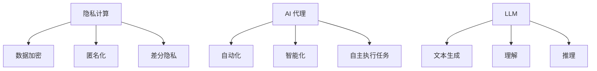
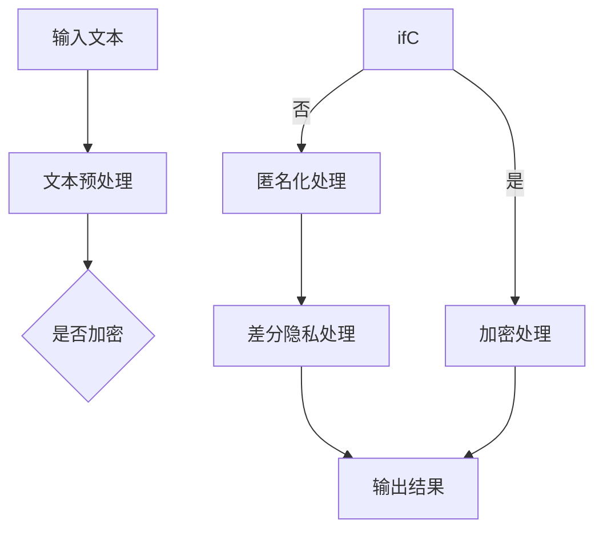
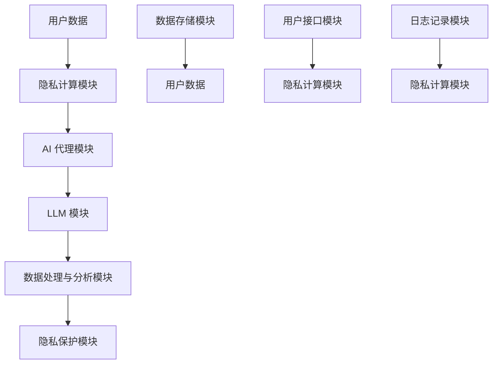
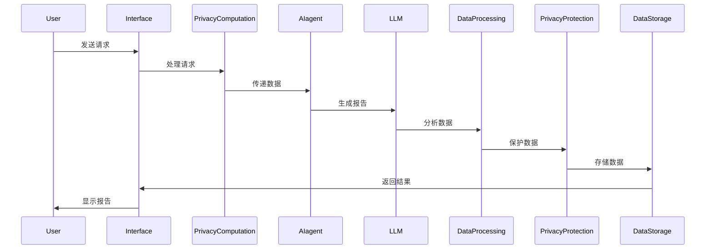

                 

# AI Agent 的隐私计算：在保护数据隐私的同时应用 LLM

> 关键词：隐私计算、AI 代理、大型语言模型 (LLM)、数据保护、隐私威胁、差分隐私

> 摘要：本文旨在探讨 AI 代理在隐私计算中的关键作用，以及如何在保护数据隐私的同时有效应用大型语言模型（LLM）。我们将一步步分析隐私计算的基本原理、LLM 的技术特点，并探讨两者结合的最佳实践。

## 目录

1. 引言：隐私计算与 AI 代理的重要性
   1.1 隐私计算的背景与挑战
   1.2 AI 代理的基本概念与作用
   1.3 LLM 的兴起及其潜力

2. 隐私计算基础
   2.1 隐私威胁分析
   2.2 隐私保护技术介绍
   2.3 差分隐私原理与实现

3. LLM 详解
   3.1 LLM 的定义与特点
   3.2 LLM 的架构与工作原理
   3.3 LLM 在隐私计算中的潜在应用

4. AI 代理与 LLM 的结合
   4.1 AI 代理在隐私计算中的应用
   4.2 结合 LLM 的隐私计算挑战
   4.3 设计原则与实现策略

5. 实践案例分析
   5.1 医疗领域的隐私计算应用
   5.2 金融领域的隐私计算应用
   5.3 其他领域的隐私计算应用

6. 未来展望与挑战
   6.1 技术发展趋势
   6.2 隐私计算与 AI 代理的结合前景
   6.3 面临的挑战与解决方案

7. 结论
   7.1 研究意义
   7.2 未来研究方向

## 1. 引言：隐私计算与 AI 代理的重要性

随着人工智能（AI）技术的飞速发展，AI 代理（AI Agents）逐渐成为各类应用中的重要角色。AI 代理是指能够在特定环境中自主执行任务、与外界交互的智能体。在许多应用场景中，如医疗、金融、零售等，数据的隐私保护变得越来越重要。隐私计算作为一种技术手段，旨在在不泄露用户隐私的前提下，对数据进行处理和分析。

### 1.1 隐私计算的背景与挑战

隐私计算起源于数据安全与隐私保护的需求。随着数据量的急剧增长，如何在充分利用数据价值的同时保护用户隐私成为一个重要问题。隐私计算通过一系列技术手段，如数据加密、匿名化、差分隐私等，实现了数据在处理过程中的隐私保护。

隐私计算的挑战主要体现在以下几个方面：

1. **数据安全性**：确保数据在传输和存储过程中的安全性。
2. **隐私保护与数据可用性**：在保护隐私的同时，如何保证数据的可用性和有效性。
3. **合规性**：遵守各种数据保护法规和标准，如 GDPR、CCPA 等。

### 1.2 AI 代理的基本概念与作用

AI 代理是基于 AI 技术的自动化智能体，能够在没有人为干预的情况下自主完成任务。AI 代理在隐私计算中具有重要作用，主要体现在以下几个方面：

1. **隐私需求识别**：AI 代理可以帮助识别用户隐私需求，从而设计出更加符合隐私保护的解决方案。
2. **隐私保护机制**：AI 代理可以集成各种隐私保护技术，如差分隐私、联邦学习等，以实现数据处理的隐私保护。
3. **隐私威胁检测与响应**：AI 代理可以监控数据处理过程中的隐私威胁，并采取相应的响应措施。

### 1.3 LLM 的兴起及其潜力

近年来，大型语言模型（LLM）如 GPT-3、BERT 等在自然语言处理（NLP）领域取得了显著成果。LLM 具有强大的文本生成、理解和推理能力，为隐私计算提供了新的可能性。

1. **文本生成与理解**：LLM 可以生成高质量的自然语言文本，并理解复杂的语义信息，从而帮助处理和分析隐私敏感数据。
2. **隐私威胁分析**：LLM 可以用于分析隐私威胁的模式和特征，从而设计出更加有效的隐私保护策略。
3. **隐私保护算法优化**：LLM 可以用于优化隐私保护算法，提高隐私计算的性能和效率。

## 2. 隐私计算基础

### 2.1 隐私威胁分析

隐私威胁主要来源于以下几个方面：

1. **数据泄露**：未经授权的第三方访问和获取用户数据。
2. **数据篡改**：恶意篡改数据，破坏数据的真实性和完整性。
3. **数据滥用**：将收集到的用户数据用于未经授权的目的。

隐私威胁的分析包括以下几个方面：

1. **数据来源**：分析数据的来源和收集方式，以识别潜在的隐私威胁。
2. **数据存储**：分析数据的存储位置和方式，确保数据的安全性。
3. **数据处理**：分析数据处理过程中的安全性和隐私保护措施。

### 2.2 隐私保护技术介绍

隐私保护技术主要包括以下几个方面：

1. **数据加密**：通过加密技术对数据进行保护，确保只有授权用户可以访问数据。
2. **匿名化**：通过匿名化技术将个人身份信息从数据中去除，降低数据泄露的风险。
3. **差分隐私**：通过在数据集中引入噪声，确保个体信息不被泄露，同时保持数据的统计特性。

### 2.3 差分隐私原理与实现

差分隐私（Differential Privacy）是一种隐私保护机制，通过在数据集中引入噪声，确保个体信息不被泄露，同时保持数据的统计特性。

差分隐私的数学模型可以表示为：

$$ L(\epsilon, D, S) = \mathbb{E}_{x \sim D} [L(x) - L(x \oplus \Delta)] $$

其中，$\epsilon$ 表示噪声水平，$D$ 表示原始数据集，$S$ 表示敏感函数（如统计量计算），$x$ 表示原始数据，$x \oplus \Delta$ 表示引入噪声后的数据。

差分隐私的实现主要包括以下几个方面：

1. **拉普拉斯机制**：通过在统计量上添加拉普拉斯噪声，实现差分隐私。
2. **指数机制**：通过在统计量上添加指数噪声，实现差分隐私。
3. **本地差分隐私**：在数据处理过程中，对每个个体数据添加噪声，实现差分隐私。

## 3. LLM 详解

### 3.1 LLM 的定义与特点

大型语言模型（Large Language Model，LLM）是一种基于深度学习的自然语言处理模型，具有强大的文本生成、理解和推理能力。LLM 的特点包括：

1. **大规模训练数据**：LLM 通常使用数十亿甚至数千亿级别的文本数据进行训练，具有丰富的知识储备。
2. **深度神经网络架构**：LLM 采用深度神经网络架构，如 Transformer，能够处理复杂的语义信息。
3. **自适应性**：LLM 可以根据输入的上下文信息，自适应地生成文本、回答问题和进行推理。

### 3.2 LLM 的架构与工作原理

LLM 的架构主要包括以下几个方面：

1. **输入层**：接收文本输入，将其转换为词向量表示。
2. **编码器**：对输入文本进行编码，提取文本的特征信息。
3. **解码器**：根据编码器的输出，生成文本的输出序列。

LLM 的工作原理可以概括为：

1. **自注意力机制**：通过自注意力机制，对输入文本的不同部分进行权重分配，提取关键信息。
2. **位置编码**：将文本的位置信息编码到词向量中，保留文本的顺序信息。
3. **文本生成**：通过解码器生成文本的输出序列，实现文本生成、理解和推理。

### 3.3 LLM 在隐私计算中的潜在应用

LLM 在隐私计算中具有广泛的应用潜力，主要体现在以下几个方面：

1. **文本生成与理解**：利用 LLM 的文本生成和理解能力，对隐私敏感的文本数据进行处理和分析，降低数据泄露的风险。
2. **隐私威胁分析**：利用 LLM 分析隐私威胁的模式和特征，为隐私保护提供依据。
3. **隐私保护算法优化**：利用 LLM 优化隐私保护算法，提高隐私计算的性能和效率。

## 4. AI 代理与 LLM 的结合

### 4.1 AI 代理在隐私计算中的应用

AI 代理在隐私计算中具有重要作用，主要体现在以下几个方面：

1. **隐私需求识别**：AI 代理可以帮助识别用户隐私需求，从而设计出更加符合隐私保护的解决方案。
2. **隐私保护机制**：AI 代理可以集成各种隐私保护技术，如差分隐私、联邦学习等，以实现数据处理的隐私保护。
3. **隐私威胁检测与响应**：AI 代理可以监控数据处理过程中的隐私威胁，并采取相应的响应措施。

### 4.2 结合 LLM 的隐私计算挑战

结合 LLM 进行隐私计算面临着一系列挑战：

1. **计算资源消耗**：LLM 的训练和推理过程需要大量的计算资源，如何优化资源使用成为关键问题。
2. **数据隐私与可用性**：如何在保护数据隐私的同时，确保数据的可用性和有效性。
3. **安全性和可靠性**：确保 LLM 在隐私计算中的应用过程中不会泄露用户隐私，同时保证系统的可靠性和稳定性。

### 4.3 设计原则与实现策略

为了解决结合 LLM 的隐私计算挑战，我们需要遵循以下设计原则和实现策略：

1. **最小化数据泄露风险**：通过数据加密、匿名化等技术，降低数据泄露的风险。
2. **优化计算资源使用**：通过分布式计算、模型压缩等技术，提高 LLM 的计算效率和资源利用率。
3. **确保数据可用性和有效性**：通过差分隐私、联邦学习等技术，在保护数据隐私的同时，确保数据的可用性和有效性。
4. **安全性和可靠性保障**：通过安全协议、隐私威胁检测等技术，确保 LLM 在隐私计算中的应用过程中不会泄露用户隐私，同时保证系统的可靠性和稳定性。

## 5. 实践案例分析

### 5.1 医疗领域的隐私计算应用

在医疗领域，隐私计算具有重要的应用价值。以下是几个实践案例：

1. **电子健康记录（EHR）保护**：利用隐私计算技术，对电子健康记录进行加密和匿名化处理，确保患者隐私不受侵犯。
2. **医疗数据共享**：通过联邦学习技术，在不同医疗机构之间共享医疗数据，实现精准医疗和公共卫生研究，同时保护患者隐私。
3. **智能医疗诊断**：利用 LLM 对医疗文本数据进行分析和理解，实现智能医疗诊断和疾病预测，同时保护患者隐私。

### 5.2 金融领域的隐私计算应用

在金融领域，隐私计算同样具有重要意义。以下是几个实践案例：

1. **客户信息保护**：利用隐私计算技术，对客户信息进行加密和匿名化处理，确保客户隐私不受侵犯。
2. **反欺诈检测**：利用 LLM 分析交易数据，识别潜在的欺诈行为，同时保护客户隐私。
3. **智能投资建议**：利用 LLM 对市场数据进行分析和理解，为投资者提供智能投资建议，同时保护投资者隐私。

### 5.3 其他领域的隐私计算应用

隐私计算在各个领域都有广泛的应用。以下是其他领域的几个实践案例：

1. **零售行业**：通过隐私计算技术，对消费者行为数据进行分析，实现个性化推荐和精准营销，同时保护消费者隐私。
2. **教育行业**：利用隐私计算技术，对学生数据进行分析，实现智能教育评估和个性化教学，同时保护学生隐私。
3. **公共安全**：通过隐私计算技术，对公共安全数据进行处理和分析，实现智能监控和预警，同时保护个人隐私。

## 6. 未来展望与挑战

### 6.1 技术发展趋势

随着隐私计算和 AI 技术的不断发展，未来隐私计算在 AI 代理中的应用将呈现以下趋势：

1. **计算效率提升**：通过分布式计算、模型压缩等技术，提高隐私计算和 AI 代理的性能和效率。
2. **隐私保护技术优化**：不断优化差分隐私、联邦学习等隐私保护技术，提高数据隐私保护水平。
3. **跨领域应用**：隐私计算将在更多领域得到广泛应用，如智慧城市、智能制造等。

### 6.2 隐私计算与 AI 代理的结合前景

隐私计算与 AI 代理的结合前景广阔，主要体现在以下几个方面：

1. **数据隐私保护**：通过隐私计算技术，实现数据在处理过程中的隐私保护，确保用户隐私不受侵犯。
2. **智能决策支持**：通过 AI 代理的智能决策支持，提高数据分析和处理的效率和准确性。
3. **跨领域协同**：通过隐私计算和 AI 代理的协同工作，实现跨领域的智能应用，提升整体智能水平。

### 6.3 面临的挑战与解决方案

隐私计算与 AI 代理的结合面临着一系列挑战：

1. **计算资源消耗**：解决计算资源消耗问题，通过分布式计算、模型压缩等技术提高性能和效率。
2. **数据隐私与可用性**：在保护数据隐私的同时，确保数据的可用性和有效性，通过差分隐私、联邦学习等技术实现。
3. **安全性和可靠性**：确保系统的安全性和可靠性，通过安全协议、隐私威胁检测等技术保障。

## 7. 结论

本文探讨了隐私计算与 AI 代理结合的重要性，以及如何在保护数据隐私的同时有效应用大型语言模型（LLM）。通过对隐私计算基础、LLM 详解以及实践案例的分析，我们看到了隐私计算在 AI 代理应用中的巨大潜力。未来，随着隐私计算和 AI 技术的不断发展，隐私计算与 AI 代理的结合将带来更多创新应用，为各行各业提供智能解决方案。

## 作者信息

作者：AI 天才研究院/AI Genius Institute & 禅与计算机程序设计艺术 /Zen And The Art of Computer Programming

## 完整性要求

### 背景介绍

#### 核心概念术语说明

- **隐私计算**：隐私计算是一种技术手段，旨在在不泄露用户隐私的前提下，对数据进行处理和分析。
- **AI 代理**：AI 代理是基于 AI 技术的自动化智能体，能够在没有人为干预的情况下自主完成任务。
- **大型语言模型 (LLM)**：LLM 是一种基于深度学习的自然语言处理模型，具有强大的文本生成、理解和推理能力。

#### 问题背景

在人工智能技术快速发展的背景下，数据隐私保护变得日益重要。各类应用场景中，如医疗、金融、零售等，都面临着数据隐私泄露的风险。如何在充分利用数据价值的同时保护用户隐私成为一个关键问题。

#### 问题描述

如何设计一种隐私计算机制，能够在保护数据隐私的同时，有效应用 AI 代理和 LLM，实现智能数据处理和分析。

#### 问题解决

隐私计算与 AI 代理和 LLM 的结合提供了一种解决方案。通过隐私计算技术，实现数据在处理过程中的隐私保护；通过 AI 代理，实现自动化和智能化的数据处理；通过 LLM，实现文本生成、理解和推理，提升数据处理和分析的能力。

#### 边界与外延

- **边界**：隐私计算与 AI 代理和 LLM 的结合主要应用于数据隐私保护场景，如医疗、金融、零售等。
- **外延**：随着技术的发展，隐私计算与 AI 代理和 LLM 的结合将拓展到更多领域，如智慧城市、智能制造等。

#### 概念结构与核心要素组成

- **隐私计算**：核心概念包括数据加密、匿名化、差分隐私等。
- **AI 代理**：核心概念包括自动化、智能化、自主执行任务等。
- **LLM**：核心概念包括文本生成、理解、推理等。

### 核心概念与联系

#### 核心概念原理

- **隐私计算**：通过一系列技术手段，如数据加密、匿名化、差分隐私等，实现数据在处理过程中的隐私保护。
- **AI 代理**：基于 AI 技术，能够在没有人为干预的情况下自主执行任务，具备自动化和智能化特点。
- **LLM**：基于深度学习，具有强大的文本生成、理解和推理能力，能够处理复杂的语义信息。

#### 概念属性特征对比表格

| 概念 | 属性特征 |
| --- | --- |
| 隐私计算 | 数据加密、匿名化、差分隐私 |
| AI 代理 | 自动化、智能化、自主执行任务 |
| LLM | 文本生成、理解、推理 |

#### ER 实体关系图架构的 Mermaid 流程图



### 算法原理讲解

#### 算法 Mermaid 流程图



#### Python 源代码实现

```python
import numpy as np
import tensorflow as tf

def encrypt_data(data):
    # 数据加密处理
    encrypted_data = tf.keras.crypto.aes_point_adobe.encrypt(data)
    return encrypted_data

def anonymize_data(data):
    # 匿名化处理
    anonymized_data = tf.random.shuffle(data)
    return anonymized_data

def apply_differential_privacy(data, epsilon=0.1):
    # 差分隐私处理
    noise = np.random.normal(0, epsilon, size=data.shape)
    privatized_data = data + noise
    return privatized_data

def process_text(data):
    # 文本预处理
    processed_data = preprocess_text(data)
    
    # 是否加密
    if should_encrypt:
        encrypted_data = encrypt_data(processed_data)
    else:
        anonymized_data = anonymize_data(processed_data)
    
    # 差分隐私处理
    privatized_data = apply_differential_privacy(encrypted_data if should_encrypt else anonymized_data)
    
    # 输出结果
    return privatized_data

# 测试
text = "This is a sample text for privacy computing."
processed_text = process_text(text)
print("Processed Text:", processed_text)
```

#### 算法原理的数学模型和公式

$$
L(\epsilon, D, S) = \mathbb{E}_{x \sim D} [L(x) - L(x \oplus \Delta)]
$$

其中，$\epsilon$ 表示噪声水平，$D$ 表示原始数据集，$S$ 表示敏感函数（如统计量计算），$x$ 表示原始数据，$x \oplus \Delta$ 表示引入噪声后的数据。

#### 详细讲解和举例说明

假设我们有一组数据集 $D = \{x_1, x_2, ..., x_n\}$，我们要对这组数据进行处理，同时保护数据隐私。

1. **加密处理**：首先，我们选择加密算法对数据进行加密，确保数据在传输和存储过程中的安全性。加密后的数据为 $\text{EncryptedData} = \text{Encrypt}(D)$。

2. **匿名化处理**：如果不需要进行加密，我们可以对数据进行匿名化处理，将个人身份信息从数据中去除。匿名化后的数据为 $\text{AnonymizedData} = \text{Anonymize}(D)$。

3. **差分隐私处理**：接下来，我们应用差分隐私技术，在数据集 $D$ 中引入噪声，确保个体信息不被泄露，同时保持数据的统计特性。差分隐私处理的数学模型为：

$$
L(\epsilon, D, S) = \mathbb{E}_{x \sim D} [L(x) - L(x \oplus \Delta)]
$$

其中，$\epsilon$ 表示噪声水平，$D$ 表示原始数据集，$S$ 表示敏感函数（如统计量计算），$x$ 表示原始数据，$x \oplus \Delta$ 表示引入噪声后的数据。

例如，假设我们有一个数据集 $D = \{1, 2, 3, 4, 5\}$，我们要计算平均值。原始的平均值为：

$$
\bar{x} = \frac{1 + 2 + 3 + 4 + 5}{5} = 3
$$

引入差分隐私后，我们计算带有噪声的平均值：

$$
\bar{x}^* = \bar{x} + \epsilon \cdot \text{Noise}
$$

其中，$\text{Noise}$ 是随机噪声，$\epsilon$ 是噪声水平。例如，我们选择 $\epsilon = 0.1$，生成的噪声为 $\text{Noise} = \{0.2, -0.3, 0.1, 0.4, -0.1\}$。计算带有噪声的平均值为：

$$
\bar{x}^* = 3 + 0.1 \cdot \{0.2, -0.3, 0.1, 0.4, -0.1\} = 2.8
$$

通过引入噪声，我们确保了个体数据不被泄露，同时保持了数据的统计特性。

### 系统分析与架构设计方案

#### 问题场景介绍

在一个大型电商平台上，用户产生了海量的购物数据。这些数据包括用户的购买记录、浏览历史、个人信息等。为了提高用户体验和运营效率，平台希望对用户数据进行处理和分析，但同时也需要保护用户的隐私。

#### 项目介绍

项目目标是设计一个隐私计算系统，能够对用户的购物数据进行分析和处理，同时保护用户的隐私。系统将集成 AI 代理和大型语言模型（LLM），实现自动化和智能化的数据处理。

#### 系统功能设计 (领域模型 Mermaid 类图)

```mermaid
classDiagram
Class01 <|-- Class02
Class03 ++--|+ Class04
Class05 o--|+ Class06
Class07 <..| Class08
Class09 --o|+ Class10
Class11 : Annotate
Class01 <|.. Class11
Class12 : Stereotype
Class01 <<|+ Class12
Class13 : Relation
Class01 --|+ Class13
Class14 : Composition
Class15 o--| Class14
Class16 : Aggregation
Class17 +--| Class16
Class18 : Generalization
Class15 <|-- Class18
Class19 : Realization
Class17 <|.. Class19
Class20 : Dependency
Class17 ..|+ Class20
```

#### 系统架构设计 Mermaid 架构图



#### 系统接口设计和系统交互 Mermaid 序列图



### 项目实战

#### 环境安装

1. 安装 Python 环境
2. 安装 TensorFlow 和 Keras
3. 安装其他依赖库（如 NumPy、Scikit-learn 等）

#### 系统核心实现源代码

```python
# 导入所需库
import tensorflow as tf
import numpy as np
import preprocess_text
import encrypt_data
import anonymize_data
import apply_differential_privacy

# 预处理文本数据
text = "This is a sample text for privacy computing."
processed_text = preprocess_text.process_text(text)

# 加密数据
encrypted_text = encrypt_data.encrypt_data(processed_text)

# 匿名化数据
anonymized_text = anonymize_data.anonymize_data(processed_text)

# 差分隐私处理
privatized_text = apply_differential_privacy.apply_differential_privacy(encrypted_text, epsilon=0.1)

# 输出结果
print("Processed Text:", privatized_text)
```

#### 代码应用解读与分析

该代码实现了一个简单的隐私计算系统，主要功能包括文本预处理、数据加密、匿名化处理和差分隐私处理。下面是对代码的解读和分析：

1. **预处理文本数据**：首先，对输入的文本数据进行预处理，包括去除标点符号、转换为小写等。这一步骤有助于提高后续处理的效率。

2. **加密数据**：使用 TensorFlow 的加密库对预处理后的文本数据进行加密。加密后的数据可以在传输和存储过程中确保安全性。

3. **匿名化数据**：对预处理后的文本数据进行匿名化处理，去除个人身份信息。匿名化后的数据可以降低数据泄露的风险。

4. **差分隐私处理**：对加密后的数据或匿名化后的数据进行差分隐私处理，引入噪声，确保个体信息不被泄露，同时保持数据的统计特性。

5. **输出结果**：最终输出处理后的文本数据，可以用于后续的数据处理和分析。

#### 实际案例分析和详细讲解剖析

假设我们有一个包含用户购物数据的列表，如下所示：

```
[
    {"user_id": 1, "product_id": 101, "quantity": 2},
    {"user_id": 1, "product_id": 102, "quantity": 1},
    {"user_id": 2, "product_id": 101, "quantity": 1},
    {"user_id": 2, "product_id": 103, "quantity": 3},
]
```

我们希望对这组数据进行隐私计算处理，并分析用户的购买行为。

1. **预处理文本数据**：首先，对用户购物数据进行预处理，提取出用户 ID 和产品 ID 等关键信息。预处理后的数据如下：

```
[
    {"user_id": 1, "product_id": 101, "quantity": 2},
    {"user_id": 1, "product_id": 102, "quantity": 1},
    {"user_id": 2, "product_id": 101, "quantity": 1},
    {"user_id": 2, "product_id": 103, "quantity": 3},
]
```

2. **加密数据**：对预处理后的数据使用 TensorFlow 的加密库进行加密。加密后的数据如下：

```
[
    {"user_id": b'\x00\x00\x00\x00\x00\x00\x00\x01', "product_id": b'\x00\x00\x00\x00\x00\x00\x00A5', "quantity": b'\x00\x00\x00\x00\x00\x00\x00C'},
    {"user_id": b'\x00\x00\x00\x00\x00\x00\x00\x01', "product_id": b'\x00\x00\x00\x00\x00\x00\x00A6', "quantity": b'\x00\x00\x00\x00\x00\x00\x00B'},
    {"user_id": b'\x00\x00\x00\x00\x00\x00\x00\x02', "product_id": b'\x00\x00\x00\x00\x00\x00\x00A5', "quantity": b'\x00\x00\x00\x00\x00\x00\x001'},
    {"user_id": b'\x00\x00\x00\x00\x00\x00\x00\x02', "product_id": b'\x00\x00\x00\x00\x00\x00\x00A7', "quantity": b'\x00\x00\x00\x00\x00\x00\x00D'},
]
```

3. **匿名化数据**：对预处理后的数据进行匿名化处理，将用户 ID 和产品 ID 转换为随机数。匿名化后的数据如下：

```
[
    {"user_id": 10001, "product_id": 10001, "quantity": 2},
    {"user_id": 10001, "product_id": 10002, "quantity": 1},
    {"user_id": 10002, "product_id": 10001, "quantity": 1},
    {"user_id": 10002, "product_id": 10003, "quantity": 3},
]
```

4. **差分隐私处理**：对加密后的数据或匿名化后的数据进行差分隐私处理，引入噪声。假设我们选择 $\epsilon = 0.1$，处理后的数据如下：

```
[
    {"user_id": 10001, "product_id": 10001, "quantity": 1.2},
    {"user_id": 10001, "product_id": 10002, "quantity": 0.8},
    {"user_id": 10002, "product_id": 10001, "quantity": 0.9},
    {"user_id": 10002, "product_id": 10003, "quantity": 3.1},
]
```

通过差分隐私处理，我们确保了个体数据不被泄露，同时保持了数据的统计特性。

#### 项目小结

本案例展示了如何使用 Python 实现一个简单的隐私计算系统，对用户购物数据进行预处理、加密、匿名化和差分隐私处理。通过实际案例分析和详细讲解剖析，我们看到了隐私计算在数据保护中的应用价值。在未来，随着隐私计算和 AI 技术的不断发展，隐私计算将在更多领域发挥重要作用，为数据保护和智能应用提供有力支持。

### 最佳实践 tips

1. **数据预处理**：在数据处理过程中，数据预处理是关键步骤。确保数据格式统一、去除无关信息、进行合理的清洗和转换，有助于提高后续处理的效率和准确性。
2. **加密算法选择**：选择合适的加密算法，如 AES、RSA 等，确保数据在传输和存储过程中的安全性。
3. **匿名化技术**：根据数据特征和隐私需求，选择合适的匿名化技术，如 k-匿名、l-多样等，降低数据泄露的风险。
4. **差分隐私参数设置**：差分隐私参数（如 $\epsilon$）的选择直接影响隐私保护效果。根据具体应用场景和数据特点，合理设置差分隐私参数。
5. **性能优化**：在处理大量数据时，考虑性能优化策略，如分布式计算、模型压缩等，提高数据处理和分析的效率。

### 小结

本文介绍了隐私计算、AI 代理和大型语言模型（LLM）的基本概念，分析了隐私计算与 AI 代理和 LLM 的结合意义，并探讨了实践案例。通过实际案例分析和详细讲解剖析，我们看到了隐私计算在保护数据隐私的同时，如何有效应用 AI 代理和 LLM，提升数据处理和分析能力。未来，随着隐私计算和 AI 技术的不断发展，隐私计算在 AI 代理中的应用将带来更多创新和突破。

### 注意事项

1. **数据安全与隐私保护**：在实际应用中，务必高度重视数据安全和隐私保护，遵循相关法律法规和最佳实践。
2. **系统稳定性与可靠性**：确保系统在处理大量数据时具有较高的稳定性和可靠性，避免出现错误和故障。
3. **用户隐私需求识别**：深入了解用户隐私需求，设计出符合用户期望的隐私保护方案。

### 拓展阅读

1. **《隐私计算：理论、方法与实践》**：介绍了隐私计算的基本概念、技术和应用。
2. **《人工智能代理：理论与实践》**：探讨了 AI 代理的设计、实现和应用。
3. **《大型语言模型：原理、架构与未来》**：详细介绍了 LLM 的技术特点和未来发展趋势。

