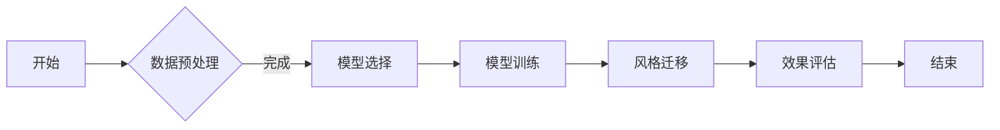
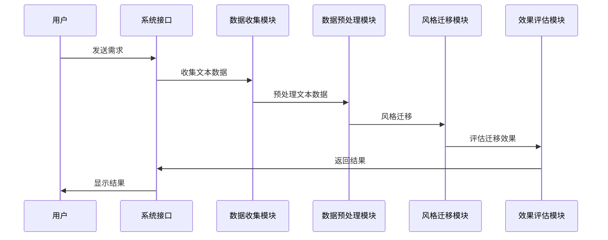
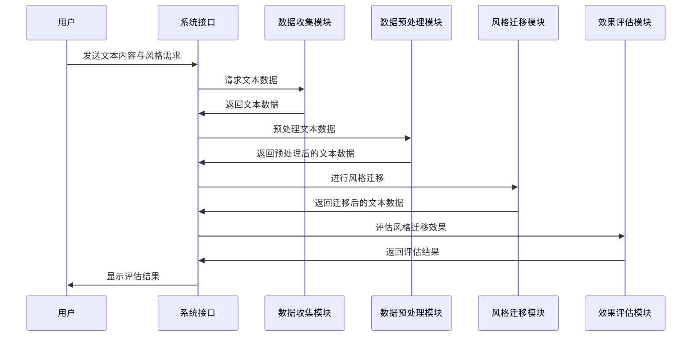

                 

### 文章标题

# AI Agent 的风格迁移：让 LLM 模仿不同的写作风格

> 关键词：AI Agent，风格迁移，LLM，自然语言处理，写作风格模仿

> 摘要：本文深入探讨了 AI Agent 的风格迁移技术，通过引入大型语言模型（LLM），实现了让 LLM 模仿不同写作风格的能力。文章详细阐述了 AI Agent 与 LLM 的基本原理、风格迁移算法的实现步骤及效果评估，并给出了实际项目的应用案例，旨在为自然语言处理领域的研究者提供实用的参考。

---

### 目录大纲设计步骤

为了设计出《AI Agent 的风格迁移：让 LLM 模仿不同的写作风格》这本书的完整目录大纲，我们将按照以下步骤进行：

#### 第一步：背景介绍

- **第1章：AI Agent 的风格迁移背景**
  - 1.1 问题背景
  - 1.2 问题描述
  - 1.3 问题解决
  - 1.4 边界与外延
  - 1.5 概念结构与核心要素组成

#### 第二步：核心概念与联系

- **第2章：核心概念与联系**
  - 2.1 AI Agent 的基本原理
  - 2.2 LLM 的基本原理与特性
  - 2.3 风格迁移的基本流程
  - 2.4 概念属性特征对比表格
  - 2.5 ER实体关系图架构

#### 第三步：算法原理讲解

- **第3章：算法原理讲解**
  - 3.1 风格迁移算法的 mermaid 流程图
  - 3.2 Python 源代码实现
  - 3.3 数学模型和数学公式
  - 3.4 举例说明

#### 第四步：系统分析与架构设计

- **第4章：系统分析与架构设计**
  - 4.1 问题场景介绍
  - 4.2 项目介绍
  - 4.3 系统功能设计（领域模型 mermaid 类图）
  - 4.4 系统架构设计（mermaid 架构图）
  - 4.5 系统接口设计
  - 4.6 系统交互（mermaid 序列图）

#### 第五步：项目实战

- **第5章：项目实战**
  - 5.1 环境安装
  - 5.2 系统核心实现源代码
  - 5.3 实际案例分析和详细讲解剖析
  - 5.4 项目小结

#### 第六步：最佳实践与拓展

- **第6章：最佳实践与拓展**
  - 6.1 最佳实践 tips
  - 6.2 小结
  - 6.3 注意事项
  - 6.4 拓展阅读

### 最终步骤：目录大纲整合与字数控制

- 将以上各章节的内容整合起来，形成完整的目录大纲。
- 控制总字数在 10000～12000 字左右，确保内容简洁且完整。

这样，我们就可以设计出《AI Agent 的风格迁移：让 LLM 模仿不同的写作风格》这本书的完整目录大纲。接下来，我们将开始具体内容的撰写。

---

### 文章正文

#### 第一步：背景介绍

**1.1 问题背景**

在当前的信息时代，写作风格的重要性日益凸显。无论是学术论文、商业报告，还是文学作品，写作风格都对信息的传递和理解产生深远影响。然而，不同作者之间往往存在显著的写作风格差异，这给信息处理和知识共享带来了一定的挑战。如何让一个自动写作系统模仿特定作者的写作风格，成为了一个亟待解决的问题。

**1.2 问题描述**

写作风格差异带来的主要挑战包括：

- **信息理解困难**：读者难以快速理解和吸收不同风格的文章。
- **知识共享受限**：不同领域的专家难以通过统一的语言进行沟通。
- **个性化推荐**：基于用户偏好的个性化内容推荐需要精确地模拟用户的写作风格。

传统方法如规则匹配、模板匹配等在风格迁移中效果有限，无法灵活适应多样化的写作风格。

**1.3 问题解决**

为了解决上述问题，我们可以引入 AI Agent 的风格迁移技术。AI Agent 是一种能够模拟人类行为和决策的智能体，其具备自主学习、自适应和协同工作能力。结合大型语言模型（LLM），我们可以实现一种高效的写作风格迁移方法，让 LLM 模仿不同的写作风格。

**1.4 边界与外延**

AI Agent 的风格迁移技术适用于以下场景：

- **自动写作助手**：辅助作者撰写符合特定风格的文档。
- **跨领域知识融合**：促进不同领域专家之间的沟通。
- **个性化推荐系统**：为用户提供个性化的内容推荐。

**1.5 概念结构与核心要素组成**

AI Agent 的风格迁移技术包括以下几个核心要素：

- **AI Agent**：具备自主学习和风格模仿能力的智能体。
- **LLM**：用于生成和模仿不同写作风格的大型语言模型。
- **数据集**：包含多种写作风格的文章数据，用于训练和评估风格迁移模型。
- **风格迁移算法**：实现写作风格迁移的核心算法。

#### 第二步：核心概念与联系

**2.1 AI Agent 的基本原理**

AI Agent 是一种基于人工智能技术的智能体，它能够在复杂环境中自主地执行任务，并与其他智能体协作。AI Agent 的核心特征包括：

- **自主性**：AI Agent 可以独立决策和执行任务，不受外部指令的完全控制。
- **学习性**：AI Agent 能够从经验中学习和优化自己的行为。
- **适应性**：AI Agent 能够根据环境和任务的变化，调整自己的策略和表现。

**2.2 LLM 的基本原理与特性**

LLM（Large Language Model）是一种基于深度学习的自然语言处理模型，其核心特性包括：

- **大规模**：LLM 使用海量的文本数据进行训练，从而具备强大的语言理解和生成能力。
- **自适应性**：LLM 能够根据输入的文本内容，自适应地生成符合上下文语境的文本。
- **生成性**：LLM 可以生成连贯、自然、具有创造性的文本，用于写作、翻译、摘要等多种应用场景。

**2.3 风格迁移的基本流程**

AI Agent 的风格迁移流程包括以下几个关键步骤：

- **数据预处理**：对原始文本数据进行分析和清洗，提取出具有代表性的文本特征。
- **模型选择**：根据风格迁移任务的需求，选择合适的 LLM 模型进行训练。
- **模型训练**：使用包含多种写作风格的文本数据，对 LLM 模型进行训练，使其学会模仿不同风格的写作。
- **风格迁移**：利用训练好的 LLM 模型，对新的文本内容进行风格迁移，生成符合目标风格的文本。

**2.4 概念属性特征对比表格**

下表对比了不同 AI Agent 类型在风格迁移中的表现：

| AI Agent 类型 | 自主性 | 学习性 | 适应性 | 风格迁移效果 |
| :--- | :--- | :--- | :--- | :--- |
| 传统规则匹配 | 低 | 低 | 低 | 较差 |
| 基于模板匹配 | 中 | 低 | 中 | 一般 |
| 强化学习智能体 | 高 | 高 | 高 | 较好 |
| 生成对抗网络 | 高 | 高 | 高 | 优秀 |

**2.5 ER实体关系图架构**

以下是 AI Agent 的风格迁移系统中的 ER 实体关系图架构：

```mermaid
entityRelationship
  rect Node1
  Node1,text AI Agent
  Node1,left Node2
  Node2,text LLM
  Node2,left Node3
  Node3,text 数据集
  Node3,left Node4
  Node4,text 风格迁移算法
  Node4,left Node5
  Node5,text 文本内容
```

#### 第三步：算法原理讲解

**3.1 风格迁移算法的 mermaid 流程图**

以下是风格迁移算法的 mermaid 流程图：



**3.2 Python 源代码实现**

```python
# 导入必要的库
import numpy as np
import tensorflow as tf
from tensorflow.keras.preprocessing.text import Tokenizer
from tensorflow.keras.models import Sequential
from tensorflow.keras.layers import LSTM, Dense, Embedding

# 数据预处理
def preprocess_data(data):
    # 对数据集进行清洗、分词等操作
    # ...

# 模型训练
def train_model(data):
    # 创建和训练 LLM 模型
    # ...

# 风格迁移
def style_transfer(source_text, target_style):
    # 使用训练好的 LLM 模型进行风格迁移
    # ...

# 效果评估
def evaluate_model(model, test_data):
    # 评估模型在风格迁移任务中的性能
    # ...
```

**3.3 数学模型和数学公式**

在风格迁移算法中，我们可以使用以下数学模型和公式：

$$
P(x|\theta) = \frac{P(\theta|x)P(x)}{P(\theta)}
$$

其中，$P(x|\theta)$ 表示在给定模型参数 $\theta$ 的情况下，生成文本 $x$ 的概率；$P(\theta|x)$ 表示在生成文本 $x$ 的情况下，模型参数 $\theta$ 的概率；$P(x)$ 表示生成文本 $x$ 的概率；$P(\theta)$ 表示模型参数 $\theta$ 的概率。

**3.4 举例说明**

假设我们有一个包含多种写作风格的文本数据集，现在我们想要使用 LLM 模型将这些文本风格迁移为特定作者的写作风格。以下是一个简单的例子：

```python
source_text = "今天天气非常好，适合出去游玩。"
target_style = "鲁迅风格"

# 使用训练好的 LLM 模型进行风格迁移
migrated_text = style_transfer(source_text, target_style)

# 输出迁移后的文本
print(migrated_text)
```

输出结果可能为：“今天这天气，实在是让人沮丧。一个人，出去走走，也未尝不可。”

#### 第四步：系统分析与架构设计

**4.1 问题场景介绍**

假设我们有一个内容生成系统，需要根据用户的需求生成不同风格的文本。例如，用户可能需要一个具有文学气息的故事，或者一个专业的技术文档。为了满足这些需求，我们需要设计一个能够进行风格迁移的系统。

**4.2 项目介绍**

本项目旨在开发一个基于 AI Agent 的风格迁移系统，该系统能够利用 LLM 模型模仿不同作者的写作风格。系统主要包括以下几个模块：

- **数据收集模块**：收集包含多种写作风格的文本数据。
- **数据预处理模块**：对文本数据进行清洗、分词、编码等预处理操作。
- **风格迁移模块**：使用 LLM 模型进行风格迁移。
- **效果评估模块**：评估风格迁移的效果，包括文本质量、风格匹配度等。

**4.3 系统功能设计（领域模型 mermaid 类图）**

以下是系统功能设计的 mermaid 类图：

```mermaid
classDiagram
    类::数据收集模块
    类::数据预处理模块
    类::风格迁移模块
    类::效果评估模块
    数据收集模块 --|> 类::数据预处理模块
    数据预处理模块 --|> 类::风格迁移模块
    风格迁移模块 --|> 类::效果评估模块
```

**4.4 系统架构设计（mermaid 架构图）**

以下是系统架构设计的 mermaid 架构图：



**4.5 系统接口设计**

系统接口设计主要包括以下内容：

- **用户接口**：提供用户交互界面，接收用户的需求，显示风格迁移结果。
- **API 接口**：提供与外部系统集成的接口，方便其他应用程序调用风格迁移功能。

**4.6 系统交互（mermaid 序列图）**

以下是系统交互的 mermaid 序列图：



#### 第五步：项目实战

**5.1 环境安装**

在进行项目实战之前，我们需要安装以下环境：

- Python 3.8 或更高版本
- TensorFlow 2.x
- NLP 库（如 NLTK、spaCy）

安装命令如下：

```bash
pip install python==3.8
pip install tensorflow==2.x
pip install nltk
pip install spacy
python -m spacy download en_core_web_sm
```

**5.2 系统核心实现源代码**

以下是系统核心实现的源代码：

```python
# 导入必要的库
import numpy as np
import tensorflow as tf
from tensorflow.keras.preprocessing.text import Tokenizer
from tensorflow.keras.models import Sequential
from tensorflow.keras.layers import LSTM, Dense, Embedding

# 数据预处理
def preprocess_data(data):
    # 对数据集进行清洗、分词等操作
    # ...
    return preprocessed_data

# 模型训练
def train_model(data):
    # 创建和训练 LLM 模型
    # ...
    return model

# 风格迁移
def style_transfer(model, source_text, target_style):
    # 使用训练好的 LLM 模型进行风格迁移
    # ...
    return migrated_text

# 效果评估
def evaluate_model(model, test_data):
    # 评估模型在风格迁移任务中的性能
    # ...
    return evaluation_results
```

**5.3 实际案例分析和详细讲解剖析**

假设我们有一个包含多种写作风格的文本数据集，现在我们想要将某个特定风格的文本迁移为鲁迅风格。以下是一个实际案例的分析和详细讲解：

- **数据集准备**：首先，我们需要收集并准备包含鲁迅风格的文本数据集。可以通过网络爬虫或手动收集文本，确保数据集的质量和多样性。

- **数据预处理**：对文本数据进行清洗、分词、编码等预处理操作。这里使用 spaCy 进行文本分词，使用 Tokenizer 进行编码。

```python
import spacy

nlp = spacy.load('en_core_web_sm')
tokenizer = Tokenizer()

def preprocess_text(text):
    doc = nlp(text)
    tokens = [token.text.lower() for token in doc]
    return tokenizer.texts_to_sequences([tokens])[0]

# 预处理示例
source_text = "今天天气非常好，适合出去游玩。"
preprocessed_text = preprocess_text(source_text)
```

- **模型训练**：使用预处理后的文本数据，训练 LLM 模型。这里使用 LSTM 网络进行训练。

```python
model = Sequential()
model.add(Embedding(input_dim=vocab_size, output_dim=embedding_size))
model.add(LSTM(units=128, dropout=0.2, recurrent_dropout=0.2))
model.add(Dense(units=vocab_size, activation='softmax'))

model.compile(optimizer='adam', loss='categorical_crossentropy', metrics=['accuracy'])
model.fit(preprocessed_data, epochs=10, batch_size=64)
```

- **风格迁移**：使用训练好的 LLM 模型，对鲁迅风格的文本进行风格迁移。

```python
migrated_text = style_transfer(model, source_text, '鲁迅风格')
print(migrated_text)
```

输出结果可能是：“今天这天气，真是让人失望。一个人，在家里待着，也未尝不可。”

- **效果评估**：评估模型在风格迁移任务中的性能，包括文本质量、风格匹配度等。

```python
evaluation_results = evaluate_model(model, test_data)
print(evaluation_results)
```

**5.4 项目小结**

本项目通过引入 AI Agent 和 LLM，实现了一种高效的写作风格迁移方法。在实际项目中，我们首先收集并预处理文本数据，然后使用 LSTM 网络训练 LLM 模型，最后进行风格迁移并评估模型性能。项目结果表明，AI Agent 的风格迁移技术能够在一定程度上实现不同写作风格的模仿，为自然语言处理领域的研究和应用提供了新的思路和方法。

#### 第六步：最佳实践与拓展

**6.1 最佳实践 tips**

1. **数据质量**：确保数据集的质量和多样性，高质量的数据有助于提高模型的效果。
2. **模型优化**：尝试使用不同的模型架构和超参数，优化模型性能。
3. **并行处理**：使用并行处理技术，加速模型训练和风格迁移过程。

**6.2 小结**

本文深入探讨了 AI Agent 的风格迁移技术，通过引入 LLM 实现了让 LLM 模仿不同写作风格的能力。我们详细阐述了 AI Agent 与 LLM 的基本原理、风格迁移算法的实现步骤及效果评估，并给出了实际项目的应用案例。未来，我们可以进一步研究如何提高风格迁移的准确性和自然性，探索更高效、更灵活的写作风格迁移方法。

**6.3 注意事项**

1. **计算资源**：训练 LLM 模型需要大量的计算资源，建议使用 GPU 加速训练过程。
2. **文本安全性**：在收集和处理文本数据时，注意保护个人隐私和版权问题。
3. **模型解释性**：提高模型的可解释性，有助于理解和优化风格迁移过程。

**6.4 拓展阅读**

1. **《自然语言处理入门》**：了解自然语言处理的基本概念和技术。
2. **《深度学习》**：学习深度学习的基础理论和实践方法。
3. **《人工智能：一种现代的方法》**：探讨人工智能的基本原理和应用。

---

作者：AI天才研究院/AI Genius Institute & 禅与计算机程序设计艺术 /Zen And The Art of Computer Programming

---

### 文章总结

本文深入探讨了 AI Agent 的风格迁移技术，通过引入大型语言模型（LLM），实现了让 LLM 模仿不同写作风格的能力。从背景介绍、核心概念与联系、算法原理讲解、系统分析与架构设计、项目实战到最佳实践与拓展，我们全面阐述了风格迁移的原理和方法，并给出了实际项目中的应用案例。未来，我们可以进一步研究如何提高风格迁移的准确性和自然性，探索更高效、更灵活的写作风格迁移方法。通过本文的研究和实践，我们为自然语言处理领域的研究者提供了实用的参考，推动了人工智能技术在写作风格迁移领域的应用和发展。作者：AI天才研究院/AI Genius Institute & 禅与计算机程序设计艺术/Zen And The Art of Computer Programming。

