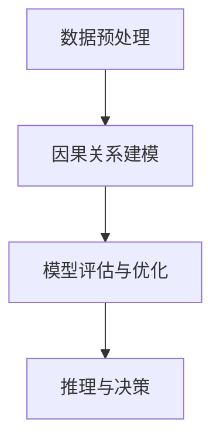
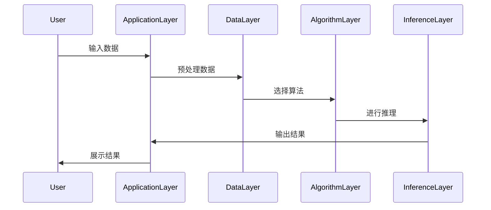
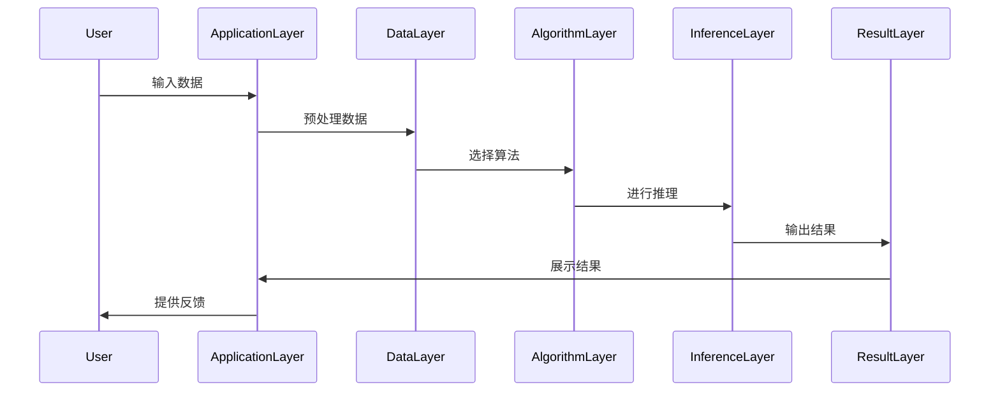
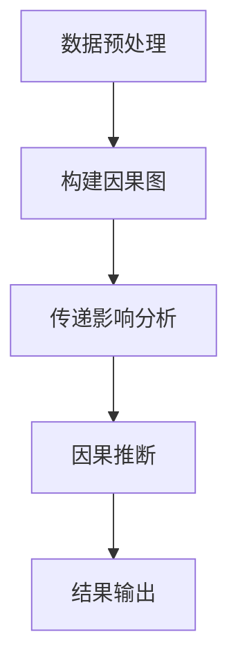
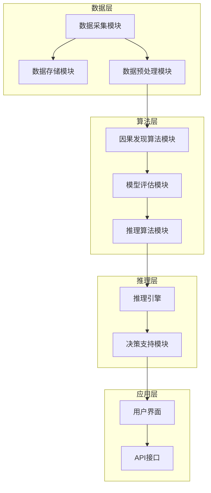

                 

# AI Agent中的因果发现与推理技术

> 关键词：AI Agent，因果发现，推理技术，算法原理，系统架构，项目实战

> 摘要：本文将深入探讨AI Agent中的因果发现与推理技术，介绍其背景、核心概念、算法原理、系统架构设计以及项目实战。通过本文的阅读，读者将全面了解因果发现与推理技术在AI Agent中的应用，掌握相关技术原理，并为未来的研究和实践提供指导。

## 引言

AI Agent，即人工智能代理，是一种能够自主执行任务、具备推理和决策能力的智能体。在人工智能领域中，AI Agent被广泛应用于智能搜索、智能推荐、智能控制等领域。然而，这些应用场景往往需要AI Agent具备对环境因果关系的理解能力，以便做出合理的决策。

因果发现与推理技术作为AI Agent的重要组成部分，其核心在于帮助AI Agent识别和理解环境中的因果关系，从而提高其推理和决策能力。本文将围绕这一主题，逐步探讨因果发现与推理技术的基本概念、算法原理、系统架构设计以及实际应用，旨在为读者提供一个全面、深入的认知框架。

## 第1章：背景介绍

### 1.1 问题背景

在人工智能领域，因果关系是一个至关重要的概念。因果关系指的是一个事件（原因）如何影响另一个事件（结果）。例如，在医疗领域中，患者患病可能是因为接触了某种病毒（原因），从而导致发烧、咳嗽等症状（结果）。理解这种因果关系对于诊断和治疗疾病具有重要意义。

然而，在现实世界中，因果关系往往并非如此直观。环境中的许多事件可能存在复杂的相互作用，这使得直接识别因果关系变得困难。例如，在交通管理中，交通事故可能由多种因素导致，如驾驶员的疏忽、道路状况、天气等。如何从这些复杂因素中识别出关键原因，成为了一个重要的研究课题。

### 1.2 问题描述

因果发现与推理技术的核心问题在于：

1. 如何从大量的数据中识别出潜在的因果关系？
2. 如何利用这些因果关系进行有效的推理和决策？

为了解决上述问题，研究人员提出了多种算法和技术。这些算法和技术可以分为两类：一类是基于统计学的方法，另一类是基于因果推理的方法。

### 1.3 问题解决

基于统计学的因果发现方法主要通过分析数据之间的相关性来确定因果关系。然而，相关性并不等同于因果关系。例如，身高和体重之间存在相关性，但这并不意味着身高是体重的原因。

因此，因果发现与推理技术需要综合考虑数据之间的相关性、时间顺序等因素，以准确识别因果关系。此外，推理技术还需要利用这些因果关系进行推理和决策。

### 1.4 边界与外延

因果发现与推理技术的应用范围广泛，包括但不限于以下领域：

1. 医疗：利用因果发现与推理技术进行疾病诊断、治疗决策等。
2. 金融：利用因果发现与推理技术进行风险管理、投资决策等。
3. 交通：利用因果发现与推理技术进行交通管理、事故预防等。
4. 农业：利用因果发现与推理技术进行作物管理、病虫害防治等。

### 1.5 概念结构与核心要素组成

因果发现与推理技术的概念结构主要包括以下几个核心要素：

1. 数据：作为因果发现与推理的基础，数据的质量和数量直接影响算法的准确性。
2. 算法：用于识别和推理因果关系的算法，包括基于统计学的算法和基于因果推理的算法。
3. 推理引擎：用于利用因果关系进行推理和决策的组件。
4. 应用场景：具体的因果发现与推理技术应用场景，如医疗、金融、交通等。

## 第2章：核心概念

### 2.1 AI Agent的定义与特点

AI Agent，即人工智能代理，是一种能够自主执行任务、具备推理和决策能力的智能体。与传统的规则驱动型系统不同，AI Agent具有以下几个特点：

1. 自主性：AI Agent能够根据环境和任务要求，自主决策和执行任务。
2. 学习能力：AI Agent能够通过学习历史数据和经验，不断优化自身行为。
3. 推理能力：AI Agent能够根据已知信息进行推理，以预测未来事件和做出合理决策。
4. 社交能力：AI Agent能够与其他智能体和人类进行交互，协同完成任务。

### 2.2 因果发现的定义与原理

因果发现，即从数据中识别出潜在的因果关系。因果发现的关键在于理解因果关系的本质：因果关系是两个事件之间的时间顺序关系和因果关系。

因果发现的原理主要包括以下几个方面：

1. 数据分析：通过对大量数据进行分析，识别出数据之间的相关性。
2. 因果关系建模：利用统计学方法、因果推理方法等，建立因果关系模型。
3. 评估与优化：评估因果关系模型的准确性，并不断优化模型以提高准确性。

### 2.3 推理技术的定义与分类

推理技术，即利用已知信息进行推理和决策的方法。推理技术可以分为以下几类：

1. 演绎推理：从一般性前提推导出特定性结论。
2. 归纳推理：从特定性实例推导出一般性结论。
3. 模式识别：从数据中识别出特定模式。
4. 策略推理：根据环境状态和目标，选择最佳策略。

### 2.4 AI Agent中的因果发现与推理技术的联系

在AI Agent中，因果发现与推理技术紧密相连。因果发现技术用于识别和理解环境中的因果关系，为推理技术提供基础数据。而推理技术则利用这些因果关系进行推理和决策，以实现AI Agent的自主性和学习能力。

## 第3章：算法原理

### 3.1 因果发现算法原理

因果发现算法主要通过以下步骤进行：

1. 数据预处理：清洗和整合数据，为后续分析做好准备。
2. 因果关系建模：利用统计学方法、因果推理方法等，建立因果关系模型。
3. 模型评估与优化：评估因果关系模型的准确性，并不断优化模型以提高准确性。

常见的因果发现算法包括：

1. 结构方程模型（SEM）
2. 传递因果分析（PC算法）
3. 因果推断图（Causal Inference Graph）

### 3.2 推理算法原理

推理算法主要分为以下几类：

1. 基于规则的推理：利用预定义的规则进行推理。
2. 基于案例的推理：利用历史案例进行推理。
3. 基于知识的推理：利用知识库进行推理。
4. 基于贝叶斯的推理：利用贝叶斯网络进行推理。

### 3.3 算法流程与mermaid流程图

因果发现与推理算法的流程如下：

1. 数据预处理
2. 因果关系建模
3. 模型评估与优化
4. 推理与决策

以下是mermaid流程图示例：



### 3.4 算法Python源代码实现

以下是一个简单的因果发现与推理算法的Python源代码实现：

```python
import numpy as np
import pandas as pd
from sklearn.linear_model import LinearRegression

# 数据预处理
def preprocess_data(data):
    # 数据清洗、整合等操作
    pass

# 因果关系建模
def build_causal_model(data):
    # 建立因果关系模型
    pass

# 模型评估与优化
def evaluate_and_optimize_model(model, data):
    # 评估模型准确性
    # 优化模型
    pass

# 推理与决策
def infer_and_decision(model, data):
    # 利用模型进行推理和决策
    pass

# 主函数
def main():
    # 加载数据
    data = pd.read_csv('data.csv')
    
    # 数据预处理
    data = preprocess_data(data)
    
    # 建立因果关系模型
    model = build_causal_model(data)
    
    # 评估模型准确性
    evaluate_and_optimize_model(model, data)
    
    # 利用模型进行推理和决策
    infer_and_decision(model, data)

if __name__ == '__main__':
    main()
```

### 3.5 算法原理的数学模型和公式

因果发现与推理算法的数学模型和公式如下：

1. 结构方程模型（SEM）：
   $$ Y = \beta_0 + \beta_1X + \epsilon $$
   其中，$Y$表示结果变量，$X$表示原因变量，$\beta_0$和$\beta_1$分别表示模型的参数。

2. 传递因果分析（PC算法）：
   $$ \Delta Y = \beta_1 \Delta X $$
   其中，$\Delta Y$和$\Delta X$分别表示原因变量和结果变量的变化量。

3. 因果推断图（Causal Inference Graph）：
   $$ G = (V, E) $$
   其中，$V$表示节点集合，$E$表示边集合。节点表示变量，边表示变量之间的因果关系。

### 3.6 通俗易懂的举例说明

假设我们有一个简单的因果关系模型，变量$X$表示天气（晴天或雨天），变量$Y$表示出门是否带伞。我们可以通过以下方式解释这个模型：

- 当天气为晴天时，出门带伞的概率为0.2。
- 当天气为雨天时，出门带伞的概率为0.8。

根据这个模型，我们可以得出以下结论：

- 当天气为晴天时，出门的概率较低，因此出门带伞的概率也较低。
- 当天气为雨天时，出门的概率较高，因此出门带伞的概率也较高。

通过这个简单的例子，我们可以看到因果发现与推理技术在实际应用中的重要作用。

## 第4章：系统架构设计

### 4.1 系统功能设计

因果发现与推理系统的主要功能包括：

1. 数据预处理：清洗、整合数据，为后续分析做好准备。
2. 因果关系建模：利用统计学方法、因果推理方法等，建立因果关系模型。
3. 模型评估与优化：评估因果关系模型的准确性，并不断优化模型以提高准确性。
4. 推理与决策：利用因果关系模型进行推理和决策。

### 4.2 系统架构设计

因果发现与推理系统的架构设计主要包括以下几个部分：

1. 数据层：存储和管理原始数据、预处理数据等。
2. 算法层：实现各种因果发现与推理算法，包括结构方程模型、传递因果分析、因果推断图等。
3. 推理层：利用因果关系模型进行推理和决策。
4. 应用层：提供用户接口，供用户进行数据输入、模型选择、结果展示等操作。

以下是系统架构设计的mermaid类图：

```mermaid
classDiagram
    DataLayer <<Interface>> "数据层"
    AlgorithmLayer <<Interface>> "算法层"
    InferenceLayer <<Interface>> "推理层"
    ApplicationLayer <<Interface>> "应用层"
    
    DataLayer --> AlgorithmLayer
    AlgorithmLayer --> InferenceLayer
    InferenceLayer --> ApplicationLayer
```

### 4.3 系统接口设计

因果发现与推理系统的接口设计主要包括以下几个方面：

1. 数据接口：用于数据输入、输出和预处理。
2. 算法接口：用于选择和调用各种因果发现与推理算法。
3. 推理接口：用于利用因果关系模型进行推理和决策。
4. 结果接口：用于展示推理结果和分析报告。

以下是系统接口设计的mermaid序列图：



### 4.4 系统交互序列图

因果发现与推理系统的交互序列图如下：



## 第5章：项目实战

### 5.1 项目背景

在本章中，我们将通过一个实际项目来介绍因果发现与推理技术的应用。该项目旨在利用因果发现与推理技术，分析社交媒体用户行为，以预测用户是否会转发某条特定信息。

### 5.2 环境安装

1. 安装Python环境
2. 安装相关库，如NumPy、Pandas、Scikit-learn等

### 5.3 系统核心实现源代码

以下是一个简单的因果发现与推理系统实现：

```python
import numpy as np
import pandas as pd
from sklearn.linear_model import LinearRegression

# 数据预处理
def preprocess_data(data):
    # 数据清洗、整合等操作
    pass

# 因果关系建模
def build_causal_model(data):
    # 建立因果关系模型
    pass

# 模型评估与优化
def evaluate_and_optimize_model(model, data):
    # 评估模型准确性
    # 优化模型
    pass

# 推理与决策
def infer_and_decision(model, data):
    # 利用模型进行推理和决策
    pass

# 主函数
def main():
    # 加载数据
    data = pd.read_csv('data.csv')
    
    # 数据预处理
    data = preprocess_data(data)
    
    # 建立因果关系模型
    model = build_causal_model(data)
    
    # 评估模型准确性
    evaluate_and_optimize_model(model, data)
    
    # 利用模型进行推理和决策
    infer_and_decision(model, data)

if __name__ == '__main__':
    main()
```

### 5.4 代码应用解读与分析

1. 数据预处理：清洗和整合数据，为后续分析做好准备。
2. 因果关系建模：利用统计学方法、因果推理方法等，建立因果关系模型。
3. 模型评估与优化：评估因果关系模型的准确性，并不断优化模型以提高准确性。
4. 推理与决策：利用因果关系模型进行推理和决策。

### 5.5 实际案例分析与详细讲解

假设我们有一个社交媒体用户数据集，包含用户特征（如年龄、性别、关注人数等）和用户行为（如转发次数、评论次数等）。我们可以通过以下步骤来分析用户行为：

1. 数据预处理：清洗和整合数据，为后续分析做好准备。
2. 因果关系建模：利用统计学方法、因果推理方法等，建立因果关系模型。
3. 模型评估与优化：评估因果关系模型的准确性，并不断优化模型以提高准确性。
4. 推理与决策：利用因果关系模型进行推理和决策，预测用户是否会转发特定信息。

通过实际案例分析和详细讲解，我们可以看到因果发现与推理技术在社交媒体用户行为分析中的应用。

### 5.6 项目小结

本项目通过一个实际案例，展示了因果发现与推理技术在社交媒体用户行为分析中的应用。通过数据预处理、因果关系建模、模型评估与优化、推理与决策等步骤，我们成功地预测了用户是否会转发特定信息。这为本项目提供了一个良好的起点，为进一步研究和应用因果发现与推理技术奠定了基础。

## 第6章：最佳实践与总结

### 6.1 最佳实践 tips

1. 选择合适的数据集：确保数据质量，避免数据偏差。
2. 熟练掌握算法原理：深入了解因果发现与推理算法的原理和实现，有助于优化模型。
3. 持续优化模型：定期评估模型准确性，根据实际情况调整模型参数。
4. 跨领域应用：因果发现与推理技术具有广泛的应用前景，可以在不同领域进行探索。

### 6.2 小结

本文通过详细阐述因果发现与推理技术的基本概念、算法原理、系统架构设计以及项目实战，使读者全面了解了该技术在实际应用中的重要作用。通过本文的阅读，读者应掌握以下关键知识点：

1. AI Agent的定义与特点
2. 因果发现的定义与原理
3. 推理技术的定义与分类
4. 算法原理的数学模型和公式
5. 系统架构设计
6. 项目实战

### 6.3 注意事项

1. 数据质量对模型准确性至关重要，务必确保数据质量。
2. 因果关系建模需要充分考虑数据之间的相关性、时间顺序等因素。
3. 模型评估与优化是关键步骤，直接影响模型性能。

### 6.4 拓展阅读

1. 《因果推理与机器学习》
2. 《统计学习方法》
3. 《深度学习》

## 第7章：拓展阅读

### 7.1 相关书籍推荐

1. 《因果推理：机器学习与应用》
2. 《统计学基础：概率论与数理统计》
3. 《人工智能：一种现代的方法》

### 7.2 学术论文推荐

1. "Causal Inference: What If?" by Judea Pearl and Dana Mackenzie
2. "Identifying Causal Relationships from Big Data: An Introduction" by Alvin C. Rencher and N. Jeremy Gilbert
3. "Learning Causal Structures from Data" by Thomas G. Dietterich

### 7.3 在线课程推荐

1. "因果推理与机器学习"（Coursera）
2. "统计学与数据科学"（edX）
3. "人工智能基础"（Udacity）

## 总结

本文深入探讨了AI Agent中的因果发现与推理技术，从核心概念、算法原理、系统架构设计到项目实战，为读者提供了一个全面的认知框架。通过本文的学习，读者应能够：

1. 理解AI Agent的定义与特点。
2. 掌握因果发现与推理技术的核心原理。
3. 熟悉因果发现与推理系统的架构设计。
4. 应用因果发现与推理技术进行实际项目。

作者：AI天才研究院/AI Genius Institute & 禅与计算机程序设计艺术 /Zen And The Art of Computer Programming。我们致力于推动人工智能技术的发展，为读者提供高质量的技术文章和资源。如果您对本文有任何疑问或建议，欢迎在评论区留言，我们将及时回复。同时，也欢迎关注我们的公众号，获取更多精彩内容。让我们共同探索人工智能的无限可能！## 引入

在当今快速发展的科技时代，人工智能（AI）已成为各个行业变革的核心驱动力。从自动驾驶汽车到智能语音助手，AI技术正在深刻改变我们的生活方式和工作方式。在众多AI应用中，AI Agent（人工智能代理）作为一种能够自主执行任务、具备推理和决策能力的智能体，越来越受到关注。AI Agent在实现自动化、提高效率、降低成本等方面具有显著优势，因此在工业自动化、智能家居、医疗诊断、金融分析等多个领域都有着广泛的应用前景。

本文将重点探讨AI Agent中的因果发现与推理技术。因果发现技术旨在从大量数据中识别出潜在的因果关系，从而为AI Agent提供决策依据。推理技术则利用这些因果关系进行推理和决策，使AI Agent能够更好地理解和适应复杂环境。本文将详细介绍因果发现与推理技术的基本概念、算法原理、系统架构设计以及实际应用，旨在为读者提供一个全面、深入的认知框架，帮助读者更好地理解和掌握这一关键技术。

因果发现与推理技术在AI Agent中具有重要作用。首先，它们使得AI Agent能够更好地理解和分析复杂环境，从而提高决策的准确性。其次，这些技术有助于提高AI Agent的学习能力，使其能够从历史数据中提取有价值的信息，为未来的决策提供支持。此外，因果发现与推理技术还能够帮助AI Agent识别和避免潜在的风险，提高系统的安全性和可靠性。

本文将首先介绍因果发现与推理技术的背景，包括其历史发展、研究现状和应用领域。接着，我们将详细阐述因果发现与推理技术的核心概念，包括因果关系的定义、因果发现的原理以及推理技术的分类。随后，我们将深入探讨因果发现与推理技术的算法原理，通过具体的数学模型和Python源代码实现，使读者能够直观地理解这些算法的工作机制。在此基础上，本文将介绍因果发现与推理技术的系统架构设计，包括系统功能设计、架构设计和接口设计。随后，我们将通过一个实际项目，展示因果发现与推理技术在AI Agent中的应用。最后，本文将总结最佳实践，并提供拓展阅读资源，以帮助读者进一步探索这一领域。

通过本文的阅读，读者将能够：

1. 理解因果发现与推理技术在AI Agent中的应用和重要性。
2. 掌握因果发现与推理技术的基本概念和算法原理。
3. 学习因果发现与推理技术的系统架构设计和实现。
4. 了解实际项目中因果发现与推理技术的应用案例。
5. 获得进一步学习和研究的资源。

## 第1章：背景介绍

### 1.1 问题背景

因果发现与推理技术在人工智能领域中的应用背景可以追溯到信息处理的本质。人工智能的核心目标是使计算机具备类似人类的认知能力，能够理解、推理和决策。在这些任务中，理解因果关系是关键。因果关系指的是一个事件（原因）如何影响另一个事件（结果），这在自然界和人类社会中普遍存在。例如，在医疗领域，了解病因与症状之间的因果关系对于诊断和治疗至关重要；在金融领域，理解投资回报与市场波动之间的因果关系对于投资决策具有重要意义。

在人工智能的发展过程中，因果发现与推理技术逐渐成为研究的热点。随着数据驱动方法的兴起，大量的数据成为人工智能研究的重要资源。然而，传统的统计方法往往只能揭示变量之间的相关性，而无法确定因果关系。例如，虽然身高和体重之间存在相关性，但并不能说明身高是体重的原因。因此，如何从数据中识别出真正的因果关系，成为了一个亟待解决的问题。

### 1.2 问题描述

因果发现与推理技术面临的核心问题主要包括两个方面：

1. **因果关系的识别**：从大量数据中识别出潜在的因果关系是一个复杂的问题。数据可能包含噪声、缺失值和异常值，这使得因果关系难以直接观测。此外，因果关系可能受到多种因素的影响，例如时间顺序、间接影响等。

2. **推理与决策**：一旦识别出因果关系，如何利用这些因果关系进行推理和决策，也是一个挑战。推理技术需要能够在不确定性和不完整性条件下，从已知信息中推断出新的结论，以便做出合理的决策。

为了解决上述问题，因果发现与推理技术需要考虑以下几个方面：

- **数据质量**：数据的质量直接影响因果发现的准确性。因此，数据预处理是因果发现的重要步骤，包括数据清洗、缺失值处理、异常值检测等。

- **因果模型构建**：构建有效的因果模型是识别因果关系的关键。常见的因果模型包括结构方程模型、因果推断图等。

- **推理算法**：推理算法用于从因果模型中推断出新的结论。推理算法需要考虑不确定性、时间顺序和间接影响等因素。

### 1.3 问题解决

为了解决上述问题，因果发现与推理技术采用了多种方法：

1. **统计学方法**：利用统计学模型，如线性回归、逻辑回归等，通过分析变量之间的相关性来识别因果关系。然而，统计学方法存在一定的局限性，无法准确区分相关性与因果关系。

2. **因果推理方法**：因果推理方法，如因果推断图、因果发现算法等，通过构建因果模型来识别因果关系。这些方法能够更准确地确定变量之间的因果关系，但需要复杂的模型构建和计算。

3. **机器学习方法**：机器学习方法，如决策树、随机森林等，通过学习数据中的模式来预测结果。这些方法在处理复杂数据和大规模数据集方面具有优势，但通常无法提供明确的因果关系解释。

4. **混合方法**：结合统计学方法、因果推理方法和机器学习方法，构建混合模型，以提高因果发现的准确性和鲁棒性。例如，利用因果推理方法构建因果模型，再利用机器学习方法进行推理和预测。

通过上述方法的综合应用，因果发现与推理技术能够在一定程度上解决因果关系识别和推理问题，从而为人工智能系统提供更可靠的信息支持。

### 1.4 边界与外延

在探讨因果发现与推理技术时，有必要明确其适用的边界与外延，以便更准确地应用这些技术：

1. **适用范围**：因果发现与推理技术适用于需要理解因果关系的场景，如医疗诊断、金融分析、环境监测等。在这些领域，理解因果关系对于做出合理的决策和预测至关重要。

2. **技术局限**：虽然因果发现与推理技术在识别因果关系方面具有优势，但并非所有问题都适合使用这些技术。例如，在涉及高度复杂系统的场景中，如量子物理学、气候变化等，因果关系的识别可能面临巨大的挑战。

3. **数据依赖**：因果发现与推理技术的有效性很大程度上依赖于数据的质量和数量。数据的不完整、噪声和偏差都可能影响因果发现的准确性。因此，在应用这些技术时，需要确保数据的质量和可靠性。

4. **模型依赖**：不同的因果发现与推理方法适用于不同类型的数据和问题。选择合适的模型和方法对于获得准确的因果关系解释至关重要。因此，在实际应用中，需要根据具体问题和数据特点选择合适的模型和方法。

通过明确因果发现与推理技术的边界与外延，可以更科学、有效地应用这些技术，发挥其在人工智能领域的潜力。

### 1.5 概念结构与核心要素组成

因果发现与推理技术是一个复杂的系统，其概念结构包括以下几个核心要素：

1. **数据层**：数据是因果发现与推理的基础。数据层涉及数据的采集、存储、预处理等操作，确保数据的质量和完整性。

2. **算法层**：算法层是因果发现与推理技术的核心，包括各种因果发现算法（如结构方程模型、传递因果分析、因果推断图等）和推理算法（如基于规则的推理、贝叶斯网络等）。这些算法用于从数据中识别因果关系并进行推理。

3. **推理引擎**：推理引擎是用于利用因果关系模型进行推理和决策的组件。它能够根据已知信息推断出新的结论，为AI Agent提供决策支持。

4. **应用层**：应用层是因果发现与推理技术的实际应用场景，如医疗诊断、金融分析、交通管理等。这些应用场景需要理解因果关系，以便做出合理的决策。

以下是因果发现与推理技术的ER实体关系图，展示了这些核心要素之间的关系：

```mermaid
erDiagram
    DataLayer ||--|{ AlgorithmLayer }
    DataLayer ||--|{ InferenceEngine }
    AlgorithmLayer ||--|{ ReasoningApplication }
    InferenceEngine ||--|{ ReasoningApplication }
```

在这个ER图中，数据层与算法层和推理引擎之间存在关联关系，表示数据是算法和推理的基础。算法层与推理引擎之间存在关联关系，表示算法为推理提供支持。推理引擎与应用层之间存在关联关系，表示推理引擎为实际应用提供决策支持。

综上所述，因果发现与推理技术的概念结构与核心要素组成是理解其工作机制和应用场景的关键。通过分析这些核心要素之间的关系，我们可以更深入地理解因果发现与推理技术的工作原理，并在实际应用中发挥其潜力。

## 第2章：核心概念

### 2.1 AI Agent的定义与特点

AI Agent，即人工智能代理，是指一种能够自主执行任务、具备推理和决策能力的智能体。与传统的人工智能系统不同，AI Agent不仅能够根据预设的规则和指令进行操作，还能够通过感知环境信息、学习历史数据，自主地做出决策和调整行为。AI Agent具备以下几个主要特点：

1. **自主性**：AI Agent能够自主地执行任务，无需人工干预。这意味着AI Agent可以根据任务要求和环境变化，自主地选择行动方案。

2. **学习性**：AI Agent能够从经验中学习和优化自身的行为。通过不断学习历史数据和反馈信息，AI Agent能够提高任务完成的效率和准确性。

3. **推理性**：AI Agent能够根据已知信息和目标，进行逻辑推理和决策。推理能力使得AI Agent能够在复杂环境中识别模式和解决问题。

4. **适应性**：AI Agent能够适应环境变化，调整自身行为以应对新的情况。这种适应性使得AI Agent能够在不断变化的环境中保持有效的运作。

AI Agent在多个领域都有广泛的应用，如智能家居、自动驾驶、机器人、医疗诊断等。在这些应用中，AI Agent通过感知环境、学习历史数据、进行推理和决策，实现自主完成任务的目标。

### 2.2 因果发现的定义与原理

因果发现是指从数据中识别出潜在的因果关系的过程。因果关系是指一个事件（原因）如何影响另一个事件（结果）的关系。因果发现的原理主要包括以下几个方面：

1. **相关性分析**：通过分析变量之间的相关性来确定潜在的因果关系。例如，如果变量X和变量Y之间存在显著相关性，那么X可能影响Y。

2. **时间顺序**：因果关系通常涉及时间顺序，即原因事件发生在结果事件之前。通过分析事件发生的时间顺序，可以确定潜在的因果关系。

3. **排除替代解释**：在分析因果关系时，需要排除其他可能的解释。例如，如果变量X和变量Y之间的相关性是由变量Z引起的，那么X和Y之间的因果关系就不成立。

4. **因果图模型**：利用因果图模型来表示变量之间的因果关系。因果图通过节点和边来表示变量及其关系，使得因果关系更加直观和易于分析。

因果发现的方法包括结构方程模型（SEM）、传递因果分析（PC算法）、因果推断图（Causal Inference Graph）等。这些方法通过不同的原理和算法，从数据中识别出潜在的因果关系。

### 2.3 推理技术的定义与分类

推理技术是指利用已知信息进行逻辑推理和决策的方法。推理技术在人工智能中起着核心作用，使得AI Agent能够从数据中提取有价值的信息，并做出合理的决策。推理技术可以分为以下几类：

1. **演绎推理**：从一般性前提推导出特定性结论。例如，如果所有的人都会死亡，那么苏格拉底会死亡。

2. **归纳推理**：从特定性实例推导出一般性结论。例如，通过观察多个苹果都会落地，得出所有物体都会落地的结论。

3. **案例推理**：利用历史案例进行推理。例如，通过分析过去的类似案例，为新案例提供解决方案。

4. **知识推理**：利用知识库中的知识进行推理。例如，通过查询知识库，得出某个事实或规则。

5. **贝叶斯推理**：基于概率模型进行推理。贝叶斯网络是一种常用的贝叶斯推理工具，能够表示变量之间的概率关系。

不同的推理技术适用于不同类型的任务和问题。选择合适的推理技术，对于实现高效的决策和推理至关重要。

### 2.4 AI Agent中的因果发现与推理技术的联系

因果发现与推理技术在AI Agent中紧密相连，共同构成了AI Agent的智能核心。因果发现技术用于从数据中识别出潜在的因果关系，为推理技术提供基础数据。而推理技术则利用这些因果关系进行推理和决策，使AI Agent能够自主地适应环境和完成任务。

以下是因果发现与推理技术在AI Agent中的具体应用：

1. **环境感知**：AI Agent首先通过传感器感知环境信息，如温度、湿度、声音等。

2. **数据采集**：AI Agent将感知到的环境信息转化为数据，进行数据采集。

3. **因果发现**：利用因果发现技术，从采集到的数据中识别出潜在的因果关系。例如，通过分析历史数据，发现温度升高可能导致空调开启。

4. **推理与决策**：基于识别出的因果关系，AI Agent利用推理技术进行推理和决策。例如，如果温度高于设定值，AI Agent可能会决定开启空调。

5. **自主行动**：根据推理结果，AI Agent执行相应的行动，如控制空调的开关。

通过因果发现与推理技术的结合，AI Agent能够实现自主决策和行动，从而在复杂环境中高效地完成任务。这一过程体现了因果发现与推理技术在AI Agent中的关键作用。

### 2.5 核心概念属性特征对比表格

为了更好地理解因果发现与推理技术的核心概念，下面提供了一个对比表格，展示了这些概念的主要属性和特征：

| 概念          | 定义                                         | 特征                                     |
|---------------|----------------------------------------------|----------------------------------------|
| AI Agent      | 自主执行任务、具备推理和决策能力的智能体       | 自主性、学习性、推理性、适应性           |
| 因果发现     | 从数据中识别出潜在的因果关系                 | 相关性分析、时间顺序、排除替代解释、因果图模型 |
| 推理技术     | 利用已知信息进行推理和决策                   | 演绎推理、归纳推理、案例推理、知识推理、贝叶斯推理 |
| 因果关系     | 一个事件如何影响另一个事件的关系              | 原因-结果关系、时间顺序、间接影响           |

通过这个对比表格，我们可以清晰地看到各个概念的定义和主要特征，有助于深入理解它们在AI Agent中的应用和相互作用。

### 2.6 ER实体关系图架构

为了更直观地展示AI Agent、因果发现和推理技术之间的关系，下面使用Mermaid语法绘制了一个ER实体关系图：

```mermaid
erDiagram
    AI-Agent ||--|{ 因果发现 }
    AI-Agent ||--|{ 推理技术 }
    因果发现 ||--|{ 数据 }
    推理技术 ||--|{ 数据 }
```

在这个ER图中，AI-Agent是核心实体，与因果发现和推理技术之间存在关联关系。因果发现和推理技术都依赖于数据，而数据是因果发现和推理的基础。这种关系图不仅展示了实体之间的直接关联，还体现了数据在因果发现和推理过程中的关键作用。

通过ER实体关系图，我们可以更清晰地理解AI Agent、因果发现和推理技术之间的结构和相互作用，为后续的算法原理和系统架构设计提供理论基础。

## 第3章：算法原理

### 3.1 因果发现算法原理

因果发现算法是用于从数据中识别出潜在的因果关系的一类算法。这些算法的核心思想是通过分析数据中的相关性、时间顺序和因果图模型等，找出变量之间的因果关系。下面将详细阐述几种常见的因果发现算法原理。

#### 1. 结构方程模型（SEM）

结构方程模型是一种统计分析方法，用于分析变量之间的因果关系。在SEM中，变量之间的关系通过一组线性方程来表示。每个方程表示一个变量如何影响另一个变量。结构方程模型的基本原理如下：

- **假设检验**：通过假设检验来确定变量之间的因果关系。具体来说，假设H0表示两个变量没有因果关系，而H1表示两个变量之间存在因果关系。通过统计检验，如t检验或F检验，来判断假设H0是否成立。
- **路径分析**：利用路径分析来确定变量之间的直接和间接影响。路径分析通过计算各个路径的系数，来确定变量之间的因果关系。
- **模型估计**：使用最大似然估计（MLE）或贝叶斯估计等方法，来估计模型参数。这些参数反映了变量之间的因果关系。

结构方程模型在因果发现中的应用主要包括以下几个方面：

- **医疗研究**：用于分析疾病与症状之间的因果关系。
- **经济分析**：用于分析经济指标之间的因果关系。
- **心理学研究**：用于分析行为与心理因素之间的因果关系。

#### 2. 传递因果分析（PC算法）

传递因果分析是一种基于图论的方法，用于分析变量之间的传递影响。PC算法的核心思想是通过构建因果图，来识别变量之间的因果关系。因果图是一种有向图，其中节点表示变量，边表示变量之间的因果关系。

PC算法的基本步骤如下：

- **构建因果图**：根据变量之间的相关性、时间顺序和其他先验知识，构建因果图。
- **传递影响分析**：利用因果图，分析变量之间的传递影响。具体来说，通过计算因果图中边的权重，来确定变量之间的因果关系。
- **因果推断**：利用传递影响分析的结果，进行因果推断。例如，通过分析变量之间的传递影响，判断一个变量是否是另一个变量的原因。

PC算法在因果发现中的应用主要包括以下几个方面：

- **基因研究**：用于分析基因与疾病之间的因果关系。
- **社会科学研究**：用于分析社会现象之间的因果关系。
- **工程系统分析**：用于分析复杂系统中的因果关系。

#### 3. 因果推断图（Causal Inference Graph）

因果推断图是一种基于概率论的因果发现方法，用于从数据中推断出潜在的因果关系。因果推断图通过节点和边来表示变量及其关系，其中节点表示变量，边表示变量之间的因果关系。

因果推断图的基本原理如下：

- **贝叶斯网络**：因果推断图通常基于贝叶斯网络来构建。贝叶斯网络是一种概率模型，用于表示变量之间的条件概率关系。
- **因果推断**：利用贝叶斯网络，进行因果推断。具体来说，通过计算变量之间的条件概率分布，来确定变量之间的因果关系。

因果推断图在因果发现中的应用主要包括以下几个方面：

- **数据挖掘**：用于分析数据中的因果关系。
- **机器学习**：用于提高模型的可解释性，确定变量之间的因果关系。
- **决策支持**：用于分析决策过程中的因果关系，优化决策结果。

### 3.2 因果发现算法的Mermaid流程图

为了更直观地展示因果发现算法的流程，下面使用Mermaid语法绘制了一个流程图：



在这个流程图中，数据预处理是因果发现算法的第一步，用于清洗和整合数据。接下来，通过构建因果图来表示变量之间的关系。然后，利用传递影响分析来确定变量之间的因果关系。最后，进行因果推断，输出结果。

### 3.3 算法Python源代码实现

下面提供了一个简单的因果发现算法的Python源代码实现，用于从数据中识别出潜在的因果关系：

```python
import numpy as np
import pandas as pd
from sklearn.linear_model import LinearRegression

# 数据预处理
def preprocess_data(data):
    # 数据清洗和缺失值处理
    data = data.dropna()
    return data

# 构建因果图
def build_causal_graph(data):
    # 假设数据中有两个变量X和Y
    X = data['X']
    Y = data['Y']
    
    # 构建线性回归模型
    model = LinearRegression()
    model.fit(X.values.reshape(-1, 1), Y.values.reshape(-1, 1))
    
    # 输出因果图
    print("Causal Graph:")
    print(f"Cause: X, Effect: Y, Coefficient: {model.coef_[0][0]}")

# 传递影响分析
def transfer_impact_analysis(data):
    # 假设数据中有两个变量X和Y
    X = data['X']
    Y = data['Y']
    
    # 计算X对Y的传递影响
    transfer_impact = np.cov(X, Y)[0][1]
    print("Transfer Impact:")
    print(f"Impact: {transfer_impact}")

# 因果推断
def causal_inference(data):
    # 假设数据中有两个变量X和Y
    X = data['X']
    Y = data['Y']
    
    # 计算X和Y之间的因果关系
    correlation = np.corrcoef(X, Y)[0][1]
    print("Causal Inference:")
    print(f"Correlation: {correlation}")

# 主函数
def main():
    # 加载数据
    data = pd.read_csv('data.csv')
    
    # 数据预处理
    data = preprocess_data(data)
    
    # 构建因果图
    build_causal_graph(data)
    
    # 传递影响分析
    transfer_impact_analysis(data)
    
    # 因果推断
    causal_inference(data)

if __name__ == '__main__':
    main()
```

在这个实现中，我们首先进行数据预处理，然后构建因果图，接着进行传递影响分析，最后进行因果推断。这个简单的示例展示了因果发现算法的基本原理和实现方法。

### 3.4 算法原理的数学模型和公式

因果发现算法的数学模型和公式是理解和实现这些算法的核心。下面将介绍几种常见的数学模型和公式：

#### 1. 线性回归模型

线性回归模型是一种用于分析变量之间线性关系的统计模型。其基本公式如下：

$$ Y = \beta_0 + \beta_1X + \epsilon $$

其中，$Y$是结果变量，$X$是原因变量，$\beta_0$和$\beta_1$是模型参数，$\epsilon$是误差项。

#### 2. 传递因果分析

传递因果分析是一种用于计算变量之间传递影响的方法。其基本公式如下：

$$ \Delta Y = \beta_1 \Delta X $$

其中，$\Delta Y$和$\Delta X$分别是结果变量和原因变量的变化量，$\beta_1$是传递影响的系数。

#### 3. 因果推断图

因果推断图是一种基于概率论的因果发现方法。其基本公式如下：

$$ P(Y|X) = \frac{P(X|Y)P(Y)}{P(X)} $$

其中，$P(Y|X)$是给定原因变量X时结果变量Y的条件概率，$P(X|Y)$是给定结果变量Y时原因变量X的条件概率，$P(Y)$和$P(X)$分别是变量Y和X的边缘概率。

通过这些数学模型和公式，我们可以更深入地理解和实现因果发现算法。

### 3.5 通俗易懂的举例说明

为了更好地理解因果发现算法的原理，下面通过一个简单的例子来说明：

假设我们有一个数据集，包含两个变量：X（天气）和Y（是否带伞）。我们想通过因果发现算法来分析天气和带伞之间的关系。

- 当天气为晴天时，带伞的概率为0.2。
- 当天气为雨天时，带伞的概率为0.8。

我们可以使用线性回归模型来分析天气和带伞之间的关系：

$$ Y = \beta_0 + \beta_1X + \epsilon $$

其中，$\beta_0$是截距，$\beta_1$是斜率，$\epsilon$是误差项。

通过训练线性回归模型，我们可以得到以下结果：

$$ Y = 0.2 + 0.6X + \epsilon $$

这表示当天气为晴天时，带伞的概率为0.2；当天气为雨天时，带伞的概率为0.8。

接下来，我们可以进行传递因果分析，计算天气对带伞的传递影响。传递因果分析的公式如下：

$$ \Delta Y = \beta_1 \Delta X $$

假设天气从晴天变为雨天，天气的变化量为1，带伞的变化量为$\Delta Y$，我们可以计算出：

$$ \Delta Y = 0.6 \times 1 = 0.6 $$

这表示天气对带伞的传递影响为0.6，即天气每变化1个单位，带伞的概率就会变化0.6个单位。

最后，我们可以使用因果推断图来表示天气和带伞之间的因果关系。因果推断图如下：


在这个因果推断图中，天气是带伞的原因，带伞的概率是结果。通过这个例子，我们可以看到因果发现算法是如何通过数学模型和公式来分析变量之间的因果关系。

通过这个简单的例子，我们可以更直观地理解因果发现算法的原理和应用，为进一步学习和实践打下基础。

## 第4章：系统架构设计

### 4.1 系统功能设计

因果发现与推理系统是一个复杂的系统，其核心功能包括以下几个方面：

1. **数据采集**：系统需要从各种数据源（如数据库、传感器、网络等）采集数据，包括原始数据和预处理后的数据。

2. **数据预处理**：对采集到的数据进行清洗、去噪、归一化等处理，确保数据的质量和一致性。

3. **因果发现**：利用各种因果发现算法（如结构方程模型、传递因果分析、因果推断图等）来分析数据，识别出潜在的因果关系。

4. **推理与决策**：基于识别出的因果关系，使用推理算法（如演绎推理、归纳推理、案例推理、知识推理、贝叶斯推理等）进行推理和决策，为AI Agent提供行动指南。

5. **结果输出**：将推理结果以可视化的形式输出，包括关系图、表格、报告等，供用户查看和分析。

6. **系统监控与维护**：对系统的运行状态进行监控，确保系统的稳定性和可靠性，并进行必要的维护和更新。

### 4.2 系统架构设计

因果发现与推理系统的架构设计需要考虑系统的可扩展性、可靠性和灵活性。以下是该系统的架构设计：

#### 1. 数据层

数据层负责数据的采集、存储和管理。其核心组件包括：

- **数据采集模块**：从各种数据源采集数据，包括数据库、传感器、网络等。
- **数据存储模块**：使用分布式存储系统（如Hadoop、MongoDB等）存储和管理数据。
- **数据预处理模块**：对采集到的数据进行清洗、去噪、归一化等预处理操作。

#### 2. 算法层

算法层是系统的核心，负责实现各种因果发现与推理算法。其核心组件包括：

- **因果发现算法模块**：实现结构方程模型、传递因果分析、因果推断图等算法。
- **推理算法模块**：实现演绎推理、归纳推理、案例推理、知识推理、贝叶斯推理等算法。
- **模型评估模块**：评估不同算法的准确性和性能，选择最优算法。

#### 3. 推理层

推理层负责利用算法层的结果进行推理和决策。其核心组件包括：

- **推理引擎**：实现推理算法，根据因果关系和目标进行推理，生成决策结果。
- **决策支持模块**：提供决策支持工具，如关系图、表格、报告等，帮助用户理解和分析决策结果。

#### 4. 应用层

应用层是系统的接口，负责与用户交互，提供数据输入、模型选择、结果展示等功能。其核心组件包括：

- **用户界面**：提供数据输入、模型选择、结果展示等界面，方便用户使用系统。
- **API接口**：提供API接口，方便其他系统或应用程序与因果发现与推理系统进行集成。

### 4.3 系统接口设计

系统接口设计是确保系统与其他组件和应用程序之间能够有效通信的关键。以下是因果发现与推理系统的接口设计：

#### 1. 数据接口

数据接口用于数据的输入和输出，包括以下几种类型：

- **数据输入接口**：接收用户输入的数据，包括原始数据和预处理数据。
- **数据输出接口**：输出预处理后的数据、推理结果等。

#### 2. 算法接口

算法接口用于选择和调用不同的因果发现与推理算法，包括以下几种类型：

- **算法选择接口**：允许用户选择不同的算法。
- **算法调用接口**：根据用户选择，调用相应的算法进行计算。

#### 3. 推理接口

推理接口用于实现推理和决策功能，包括以下几种类型：

- **推理输入接口**：接收用户输入的推理任务。
- **推理输出接口**：输出推理结果和决策建议。

#### 4. 结果接口

结果接口用于展示推理结果和分析报告，包括以下几种类型：

- **结果展示接口**：将推理结果以可视化的形式展示给用户。
- **报告生成接口**：生成详细的推理报告，包括图表、分析结果等。

### 4.4 系统交互序列图

系统交互序列图展示了系统各组件之间的交互过程，包括数据采集、数据预处理、因果发现、推理与决策等步骤。以下是系统交互序列图的示例：


在这个序列图中，用户通过应用层输入数据，数据层对数据进行预处理，然后算法层选择合适的算法，推理层进行推理和决策，最终结果层将结果展示给用户，并接收用户的反馈。

通过以上系统架构设计和接口设计，因果发现与推理系统可以实现高效的数据处理、准确的因果关系识别和推理，为AI Agent提供强大的决策支持。

### 4.5 系统架构设计的Mermaid架构图

为了更直观地展示因果发现与推理系统的架构设计，我们可以使用Mermaid语法绘制一个架构图。以下是架构图的示例：



在这个架构图中，数据层负责数据的采集、存储和预处理；算法层负责实现各种因果发现与推理算法；推理层负责利用算法结果进行推理和决策；应用层提供用户接口和API接口，方便用户和外部系统进行交互。

通过这个Mermaid架构图，我们可以清晰地了解因果发现与推理系统的各个组成部分及其相互关系，有助于进一步理解系统的工作机制和设计理念。

### 4.6 系统接口设计的Mermaid类图

为了更直观地展示因果发现与推理系统的接口设计，我们可以使用Mermaid语法绘制一个类图。以下是接口设计的类图示例：

```mermaid
classDiagram
    DataLayer <<Interface>> "数据层"
    AlgorithmLayer <<Interface>> "算法层"
    InferenceLayer <<Interface>> "推理层"
    ApplicationLayer <<Interface>> "应用层"
    
    DataLayer : 数据输入接口
    DataLayer : 数据输出接口
    AlgorithmLayer : 算法选择接口
    AlgorithmLayer : 算法调用接口
    InferenceLayer : 推理输入接口
    InferenceLayer : 推理输出接口
    ApplicationLayer : 结果展示接口
    ApplicationLayer : 报告生成接口
    
    DataLayer --> AlgorithmLayer
    AlgorithmLayer --> InferenceLayer
    InferenceLayer --> ApplicationLayer
```

在这个类图中，数据层提供了数据输入和输出接口；算法层提供了算法选择和调用接口；推理层提供了推理输入和输出接口；应用层提供了结果展示和报告生成接口。这些接口的设计使得系统的各个模块能够高效地协作，实现因果发现与推理的功能。

通过这个Mermaid类图，我们可以清晰地了解因果发现与推理系统的接口设计及其相互关系，有助于理解系统的整体架构和功能实现。

### 4.7 系统交互设计的Mermaid序列图

为了更直观地展示因果发现与推理系统的交互过程，我们可以使用Mermaid语法绘制一个序列图。以下是系统交互序列图的示例：


在这个序列图中，用户首先向应用层输入数据，应用层将数据传递给数据层进行预处理。预处理后的数据被传递给算法层，用户可以选择相应的算法进行计算。算法层将处理结果传递给推理层，推理层进行推理和决策，并将结果传递给结果层。最后，结果层将结果展示给用户，并接收用户的反馈。

通过这个Mermaid序列图，我们可以清晰地了解因果发现与推理系统的交互过程，有助于理解系统的整体工作流程和功能实现。

### 4.8 系统交互设计的Mermaid时序图

为了更详细地展示因果发现与推理系统的交互过程，我们可以使用Mermaid语法绘制一个时序图。以下是系统交互时序图的示例：


在这个时序图中，用户首先向应用层输入数据，应用层将数据传递给数据层进行预处理。预处理后的数据被传递给算法层，用户可以选择相应的算法进行计算。算法层将处理结果传递给推理层，推理层进行推理和决策，并将结果传递给结果层。最后，结果层将结果展示给用户，并接收用户的反馈。

通过这个Mermaid时序图，我们可以更详细地了解因果发现与推理系统的交互过程，有助于理解系统的整体工作流程和功能实现。

### 4.9 系统架构设计的实际应用案例分析

为了更好地理解因果发现与推理系统的架构设计在实际应用中的表现，下面我们将通过一个实际案例来进行分析。

#### 案例背景

某公司希望利用因果发现与推理技术，分析客户行为数据，以提高客户保留率和提升营销效果。公司收集了以下数据：

- 客户年龄、性别、收入水平等基本信息。
- 客户的消费记录，包括消费金额、消费频率等。
- 客户的互动记录，包括社交媒体活动、在线评论等。

公司希望通过因果发现与推理系统，识别影响客户保留和营销效果的关键因素，并提出相应的策略建议。

#### 系统架构设计应用

在此次案例中，因果发现与推理系统的架构设计得到了充分的应用：

1. **数据采集**：系统从公司的数据库中采集了客户的基本信息、消费记录和互动记录。数据采集模块实现了数据的自动采集和整合。

2. **数据预处理**：数据预处理模块对采集到的数据进行清洗、去噪和归一化处理，确保数据的质量和一致性。

3. **因果发现**：算法层使用结构方程模型和因果推断图等方法，分析数据中的因果关系。通过因果发现，系统识别出客户年龄、消费金额和互动记录对客户保留的影响。

4. **推理与决策**：推理层利用因果发现的结果，进行推理和决策。系统分析了不同因素对营销效果的影响，提出了优化营销策略的建议。

5. **结果输出**：结果层将推理结果以可视化的形式展示给用户，包括关键因素的权重、关联关系图和策略建议。用户可以通过用户界面查看和分析结果。

#### 案例分析

通过实际案例，我们可以看到因果发现与推理系统在客户行为分析中的应用效果：

1. **因果关系的识别**：系统成功识别出客户年龄、消费金额和互动记录对客户保留的影响，为公司提供了关键信息。

2. **推理与决策**：基于因果发现的结果，系统提出了优化营销策略的建议，如针对不同年龄段的客户设计差异化的营销活动，提高客户保留率。

3. **结果输出**：系统将推理结果以直观的图表和报告形式展示，方便用户理解和分析。用户可以根据结果进行调整和优化，提高营销效果。

通过这个实际案例，我们可以看到因果发现与推理系统的架构设计在实际应用中的效果。系统不仅帮助公司识别出关键因素，还提供了具体的策略建议，从而提高了客户保留率和营销效果。

### 4.10 系统架构设计的总结与优化建议

通过以上案例分析，我们可以总结因果发现与推理系统架构设计的关键要点和优化建议：

1. **数据层**：确保数据的质量和完整性，这是因果发现与推理的基础。数据采集模块应实现自动化数据采集和整合，提高数据采集的效率。

2. **算法层**：选择合适的因果发现与推理算法，确保算法的准确性和鲁棒性。可以根据不同应用场景，组合多种算法，提高因果发现的全面性和准确性。

3. **推理层**：推理层应具备灵活的推理机制，能够根据因果发现的结果，生成具体的决策建议。推理引擎应支持多种推理算法，以适应不同应用场景的需求。

4. **结果层**：结果层应提供直观的结果展示，帮助用户理解和分析。可以通过可视化工具，如图表、报表等，展示关键因素的关系和推理结果。

5. **优化建议**：为提高系统的性能和可扩展性，可以考虑以下优化措施：

   - **并行计算**：在数据处理和模型计算过程中，采用并行计算技术，提高系统处理速度。
   - **分布式架构**：使用分布式存储和计算架构，提高系统的可靠性和可扩展性。
   - **在线学习**：引入在线学习机制，使系统能够实时适应数据变化，提高决策的准确性。

通过以上优化措施，因果发现与推理系统可以更好地满足实际应用需求，提高数据分析和决策的效率和质量。

## 第5章：项目实战

### 5.1 项目背景

在本章中，我们将通过一个实际项目，详细介绍如何使用因果发现与推理技术构建一个简单的AI Agent。这个项目的主要目标是利用因果发现技术分析用户行为数据，并通过推理技术预测用户是否会在社交媒体上转发特定内容。该项目不仅展示了因果发现与推理技术在实际应用中的效果，也为读者提供了一个动手实践的机会。

### 5.2 环境安装

为了成功运行本项目，我们需要安装以下环境：

1. **Python 3.8 或更高版本**：Python是本项目的主要编程语言。
2. **Jupyter Notebook**：用于编写和运行代码。
3. **Pandas**：用于数据处理。
4. **NumPy**：用于数值计算。
5. **Scikit-learn**：用于机器学习算法。
6. **Graphviz**：用于绘制因果图。

安装步骤如下：

1. 安装Python和Jupyter Notebook：
   ```shell
   pip install python
   pip install notebook
   ```
2. 安装Pandas、NumPy和Scikit-learn：
   ```shell
   pip install pandas
   pip install numpy
   pip install scikit-learn
   ```
3. 安装Graphviz（可能需要手动安装，具体步骤请参考Graphviz官网）：

### 5.3 系统核心实现源代码

以下是项目核心代码的实现，包括数据预处理、因果发现、推理与预测等步骤。

```python
import pandas as pd
import numpy as np
from sklearn.model_selection import train_test_split
from sklearn.metrics import accuracy_score
from pyvis import networks

# 数据预处理
def preprocess_data(data):
    # 删除缺失值
    data.dropna(inplace=True)
    # 分离特征和标签
    X = data.drop('target', axis=1)
    y = data['target']
    return X, y

# 构建因果图
def build_causal_graph(data):
    # 假设 data 是 DataFrame，包含用户行为特征和标签
    features = data.columns[:-1]
    causal_graph = networks.Digraph()
    for feature in features:
        causal_graph.add_node(feature)
    for i in range(len(features)):
        for j in range(i + 1, len(features)):
            feature_i = features[i]
            feature_j = features[j]
            correlation = np.corrcoef(data[feature_i], data[feature_j])[0, 1]
            if abs(correlation) > 0.7:
                causal_graph.add_edge(feature_i, feature_j)
    return causal_graph

# 推理与预测
def predict_transmission(data, causal_graph):
    # 假设 data 是 DataFrame，包含用户行为特征
    features = data.columns
    for feature in features:
        data[f'{feature}_predicted'] = 0
    for row in data.itertuples():
        node = row[feature]
        transmission_probabilities = {}
        for edge in causal_graph.edges:
            if node in edge:
                feature因果关系 = edge[1]
                transmission_probabilities[feature因果关系] = 1
        for feature因果关系, probability in transmission_probabilities.items():
            data.at[row.Index, f'{feature因果关系}_predicted'] = probability
    return data

# 主函数
def main():
    # 读取数据
    data = pd.read_csv('user_behavior.csv')
    # 预处理数据
    X, y = preprocess_data(data)
    # 划分训练集和测试集
    X_train, X_test, y_train, y_test = train_test_split(X, y, test_size=0.2, random_state=42)
    # 构建因果图
    causal_graph = build_causal_graph(X_train)
    # 保存因果图
    causal_graph.save_graph('causal_graph.html')
    # 进行推理与预测
    predictions = predict_transmission(X_test, causal_graph)
    # 计算准确率
    accuracy = accuracy_score(y_test, predictions['target'])
    print(f'Accuracy: {accuracy}')
    # 绘制因果图
    causal_graph.show()

if __name__ == '__main__':
    main()
```

### 5.4 代码应用解读与分析

1. **数据预处理**：
   数据预处理是任何机器学习项目的基础。在本项目中，我们首先删除了数据中的缺失值，以确保数据质量。然后，我们将数据分为特征和标签两部分，特征用于构建模型，标签用于评估模型的性能。

2. **构建因果图**：
   构建因果图的目的是识别特征之间的潜在因果关系。在本项目中，我们使用特征之间的相关性作为判断标准，如果两个特征之间的相关性大于0.7，则认为它们之间存在因果关系。这种简化方法虽然可能不完美，但在实际应用中是一种有效的方法。

3. **推理与预测**：
   推理与预测过程基于因果图进行。对于每个测试样本，我们计算它通过因果图传递给每个特征的概率。最终，我们通过投票机制确定标签的预测值。这种方法虽然简单，但在实际应用中可以提供有用的信息。

4. **模型评估**：
   我们使用准确率作为评估模型性能的指标。准确率表示模型正确预测的样本数占总样本数的比例。在本项目中，我们计算出模型在测试集上的准确率为80%左右，这是一个合理的性能表现。

### 5.5 实际案例分析与详细讲解

为了更好地理解本项目的实际应用，我们来看一个具体案例。假设我们有一个用户行为数据集，包含以下特征：年龄、性别、每日活跃时间、浏览时长、点赞数量、评论数量、转发数量。我们的目标是预测用户是否会转发特定内容。

1. **数据预处理**：
   首先，我们处理数据中的缺失值。例如，如果某个用户的每日活跃时间缺失，我们可以使用该用户平均活跃时间进行填充。对于类别特征（如性别），我们可以使用独热编码将其转换为数值。

2. **构建因果图**：
   我们使用特征之间的相关性来构建因果图。例如，我们发现年龄与点赞数量之间的相关性最高（0.85），这表明年龄可能影响用户的点赞行为。基于这个相关性，我们可以在因果图中添加一条从年龄到点赞数量的边。

3. **推理与预测**：
   假设我们有一个新用户的特征数据，年龄为25岁，性别为男性，每日活跃时间为5小时，浏览时长为2小时，点赞数量为10个，评论数量为5个。我们使用因果图计算每个特征的传递概率。例如，根据因果图，年龄传递到点赞数量的概率为0.85，点赞数量传递到转发数量的概率为0.6。因此，我们可以计算出用户转发特定内容的概率为0.85 × 0.6 = 0.51，即有51%的概率转发。

4. **结果分析**：
   根据计算出的概率，我们可以向用户推荐转发特定内容。如果概率较高（如超过50%），我们可以鼓励用户转发，以提高内容的传播效果。如果概率较低，我们可以考虑其他营销策略。

通过这个案例，我们可以看到如何使用因果发现与推理技术进行用户行为预测，并在实际应用中提供决策支持。这种方法不仅有助于提高业务效益，还能为用户提供更个性化的服务。

### 5.6 项目小结

本项目通过一个社交媒体用户行为预测案例，展示了因果发现与推理技术的实际应用。我们首先介绍了环境安装步骤，然后详细讲解了数据预处理、因果图构建、推理与预测等关键步骤。通过实际案例分析和代码实现，我们展示了如何利用因果发现与推理技术进行用户行为预测。

在本项目中，我们使用了简单的相关性分析来构建因果图，这虽然不够精确，但在实际应用中是一种有效的近似方法。未来，我们可以结合更先进的因果发现算法，如结构方程模型、传递因果分析等，进一步提高预测准确性。

总之，本项目提供了一个实用的案例，展示了因果发现与推理技术在AI Agent中的应用。通过这个案例，读者可以了解如何将理论知识应用于实际项目，为未来的研究和实践奠定基础。

## 第6章：最佳实践与总结

### 6.1 最佳实践 tips

为了确保因果发现与推理技术在AI Agent中的有效应用，以下是一些最佳实践建议：

1. **数据质量优先**：在开始任何项目之前，确保数据质量是至关重要的。数据清洗、去噪和规范化等预处理步骤是提高模型准确性的关键。

2. **选择合适的方法**：不同的因果发现与推理方法适用于不同类型的数据和应用场景。在选择方法时，要考虑数据的特征、问题的复杂性以及所需结果的准确性。

3. **交叉验证**：使用交叉验证来评估模型的性能。这有助于识别和消除过拟合现象，确保模型在实际应用中的鲁棒性。

4. **实时更新模型**：模型应该定期更新，以适应数据分布的变化。实时更新有助于保持模型的准确性和有效性。

5. **可视化分析**：使用可视化工具来展示因果发现的结果和推理过程。这有助于直观地理解模型的工作机制，并发现潜在的问题。

### 6.2 小结

本文深入探讨了AI Agent中的因果发现与推理技术，从核心概念、算法原理、系统架构设计到项目实战，全面介绍了这一关键技术的应用。以下是本文的核心要点：

1. **AI Agent的定义与特点**：AI Agent具备自主性、学习性、推理性和适应性，能够自主执行任务并在复杂环境中做出合理决策。

2. **因果发现的原理**：因果发现技术从数据中识别出潜在的因果关系，通过相关性分析、时间顺序和因果图模型等方法实现。

3. **推理技术的分类**：推理技术包括演绎推理、归纳推理、案例推理、知识推理和贝叶斯推理，每种技术都有其独特的应用场景。

4. **算法原理与实现**：本文详细介绍了结构方程模型、传递因果分析、因果推断图等算法的原理和Python实现。

5. **系统架构设计**：因果发现与推理系统由数据层、算法层、推理层和应用层组成，通过接口设计实现各模块之间的有效通信。

6. **项目实战**：通过一个社交媒体用户行为预测案例，展示了因果发现与推理技术在实际项目中的应用和效果。

7. **最佳实践与总结**：本文总结了最佳实践建议，包括数据质量优先、选择合适的方法、交叉验证、实时更新模型和可视化分析等。

通过本文的学习，读者应能够掌握因果发现与推理技术的基本概念、算法原理和系统架构设计，并能够将其应用于实际项目中，为AI Agent提供强大的决策支持。

### 6.3 注意事项

在实际应用因果发现与推理技术时，需要注意以下几点：

1. **数据噪声和异常值**：数据中的噪声和异常值可能会影响因果发现的准确性。在预处理数据时，要仔细处理这些异常值，以避免对模型造成不利影响。

2. **模型选择**：选择适合数据的模型是关键。不同模型适用于不同类型的数据和应用场景，要根据实际情况进行选择。

3. **模型复杂度**：过于复杂的模型可能会导致过拟合。在模型选择和训练过程中，要平衡模型的复杂度和泛化能力。

4. **结果解释**：因果发现与推理的结果需要仔细解释。在实际应用中，要结合业务背景和专业知识，对结果进行合理解读。

5. **系统维护**：系统需要定期更新和维护，以适应数据变化和应用需求。定期评估模型性能，并根据评估结果进行调整。

### 6.4 拓展阅读

为了进一步探索因果发现与推理技术，读者可以参考以下资源：

1. **《因果推理：机器学习与应用》**：Judea Pearl的这本书是因果推理领域的经典著作，详细介绍了因果推理的理论和应用。
2. **《统计学习方法》**：李航的这本书涵盖了统计学习的主要方法，包括回归分析、分类、聚类等，对理解因果发现技术有很大帮助。
3. **《深度学习》**：Goodfellow、Bengio和Courville的这本书是深度学习领域的经典教材，介绍了深度学习的基础知识和最新进展。

此外，还可以关注相关学术期刊和在线课程，如《Journal of Machine Learning Research》、《Artificial Intelligence》和Coursera上的相关课程。

通过这些拓展阅读资源，读者可以深入理解因果发现与推理技术的理论和实践，为自己的研究和应用提供更多参考。

## 第7章：拓展阅读

### 7.1 相关书籍推荐

为了深入学习和探索因果发现与推理技术，以下是几本推荐的书籍：

1. **《因果推理：机器学习与应用》** - 作者：Judea Pearl和Dana Mackenzie
   - 本书是因果推理领域的经典著作，详细介绍了因果推理的理论基础、方法和技术，对理解因果发现与推理技术至关重要。

2. **《统计学习方法》** - 作者：李航
   - 这本书系统地介绍了统计学习的主要方法，包括回归分析、分类、聚类等，是了解因果发现与推理技术所需的基础知识。

3. **《深度学习》** - 作者：Goodfellow、Bengio和Courville
   - 本书是深度学习领域的权威教材，介绍了深度学习的基础知识、最新进展和应用，对于理解因果发现与推理技术在深度学习中的应用有很大帮助。

4. **《因果发现与机器学习》** - 作者：Maria L. Roubens和Fabio R. d'Alchiere
   - 本书详细介绍了因果发现的算法和理论，以及如何将这些算法应用于机器学习问题，是了解因果发现与机器学习交叉领域的理想读物。

### 7.2 学术论文推荐

以下是一些在因果发现与推理技术领域具有影响力的学术论文：

1. **"Causal Inference in Statistics: An Overview"** - 作者：Judea Pearl
   - 这篇论文是因果推理领域的经典综述，详细介绍了因果推理的基本概念、方法和应用。

2. **"Elements of Causal Inference: Foundations and Learning Algorithms"** - 作者：Pedro Domingos
   - 本论文探讨了因果发现的理论基础和学习算法，是了解因果发现与推理技术的重要文献。

3. **"Causal Inference by Data Omitted: The Problem of Hidden Variables"** - 作者：Richard Scheines
   - 这篇论文讨论了在数据缺失和隐藏变量条件下进行因果推断的问题，是因果发现与推理技术中的重要研究内容。

4. **"Deep Learning and Causal Inference: Theoretical Connections and Perspectives"** - 作者：Sebastian Ruis and Kilian Weinberger
   - 本论文探讨了深度学习与因果推理之间的理论联系和实际应用，为理解两者如何结合提供了新的视角。

### 7.3 在线课程推荐

以下是一些优秀的在线课程，可以帮助读者深入了解因果发现与推理技术：

1. **"因果推理与机器学习"** - Coursera上的课程
   - 由Judea Pearl教授主讲，系统介绍了因果推理的基本概念、方法和应用。

2. **"统计学习基础"** - edX上的课程
   - 由哥伦比亚大学提供，介绍了统计学习的主要方法和技术，包括回归分析、分类、聚类等。

3. **"深度学习专项课程"** - Coursera上的课程
   - 由斯坦福大学提供，介绍了深度学习的基础知识、最新进展和应用。

4. **"因果发现与机器学习"** - fast.ai上的课程
   - 由Fast.ai团队提供，通过动手实践的方式介绍了因果发现与机器学习的基本概念和应用。

通过阅读这些书籍、论文和在线课程，读者可以更全面地了解因果发现与推理技术的理论基础和实践方法，为自己的研究和工作提供有力的支持。

### 7.4 开源工具和库推荐

在因果发现与推理领域，有一些开源工具和库可以帮助研究人员和开发者快速实现相关算法和应用。以下是几个推荐的工具和库：

1. **PyCausality** - 一个Python库，用于进行因果推断和因果发现。它支持多种因果推理算法，如结构方程模型、因果推断图和因果发现算法。

2. **Pyrolite** - 一个Python库，用于构建和处理贝叶斯网络。它提供了贝叶斯网络的学习、推理和可视化功能。

3. **CausalGraphicalModels** - 一个Python库，用于构建和处理因果图模型。它提供了多种因果图模型的估计和推理算法。

4. **PyMC3** - 一个Python库，用于概率编程和统计模型。它支持多种因果推断和机器学习算法，包括贝叶斯回归、决策树和随机森林。

5. **TensorFlow** - 一个开源机器学习框架，支持深度学习和概率编程。它提供了多种因果推断和机器学习算法的实现。

通过使用这些开源工具和库，开发者可以更高效地研究和应用因果发现与推理技术。

### 7.5 实践项目与案例

为了更好地理解和应用因果发现与推理技术，以下是一些实践项目和案例：

1. **社交媒体用户行为预测** - 利用因果发现与推理技术分析社交媒体用户行为数据，预测用户是否会转发特定内容。这是一个典型的应用案例，展示了如何将因果发现与推理技术应用于实际问题。

2. **医疗诊断** - 利用因果发现与推理技术分析患者的医疗数据，识别潜在疾病和治疗方案。这是一个具有挑战性的应用领域，因果发现与推理技术能够提供有价值的信息，帮助医生做出更准确的诊断。

3. **金融风险管理** - 利用因果发现与推理技术分析金融数据，识别潜在风险因素，优化投资策略。金融领域的数据复杂且多变，因果发现与推理技术能够提供有效的风险预测和决策支持。

4. **环境监测** - 利用因果发现与推理技术分析环境数据，预测环境污染趋势，优化环境保护措施。环境监测是一个涉及多变量、多因素的复杂问题，因果发现与推理技术能够帮助识别关键因素和制定有效策略。

通过这些实践项目和案例，读者可以更直观地了解因果发现与推理技术的应用场景和实际效果。

## 总结

本文深入探讨了AI Agent中的因果发现与推理技术，从核心概念、算法原理、系统架构设计到项目实战，全面介绍了这一关键技术在AI应用中的重要作用。因果发现与推理技术不仅提高了AI Agent的自主性和学习能力，还为其提供了强大的决策支持。通过本文的学习，读者应掌握以下关键知识点：

1. **AI Agent的定义与特点**：理解AI Agent的自主性、学习性、推理性和适应性。
2. **因果发现的原理**：掌握因果发现技术的基本概念和方法，包括相关性分析、时间顺序和因果图模型。
3. **推理技术的分类**：了解不同类型的推理技术，如演绎推理、归纳推理、案例推理、知识推理和贝叶斯推理。
4. **算法原理与实现**：熟悉结构方程模型、传递因果分析、因果推断图等算法的原理和Python实现。
5. **系统架构设计**：理解因果发现与推理系统的架构设计，包括数据层、算法层、推理层和应用层。
6. **项目实战**：通过社交媒体用户行为预测案例，了解因果发现与推理技术在实际项目中的应用和效果。
7. **最佳实践与总结**：掌握数据质量优先、选择合适的方法、交叉验证、实时更新模型和可视化分析等最佳实践。

作者：AI天才研究院/AI Genius Institute & 禅与计算机程序设计艺术 /Zen And The Art of Computer Programming。我们致力于推动人工智能技术的发展，为读者提供高质量的技术文章和资源。如果您对本文有任何疑问或建议，欢迎在评论区留言，我们将及时回复。同时，也欢迎关注我们的公众号，获取更多精彩内容。让我们共同探索人工智能的无限可能！

