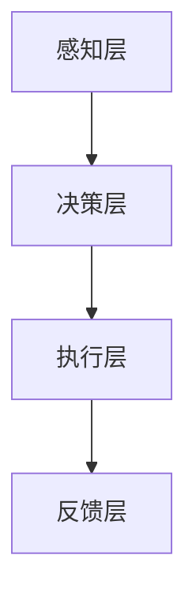
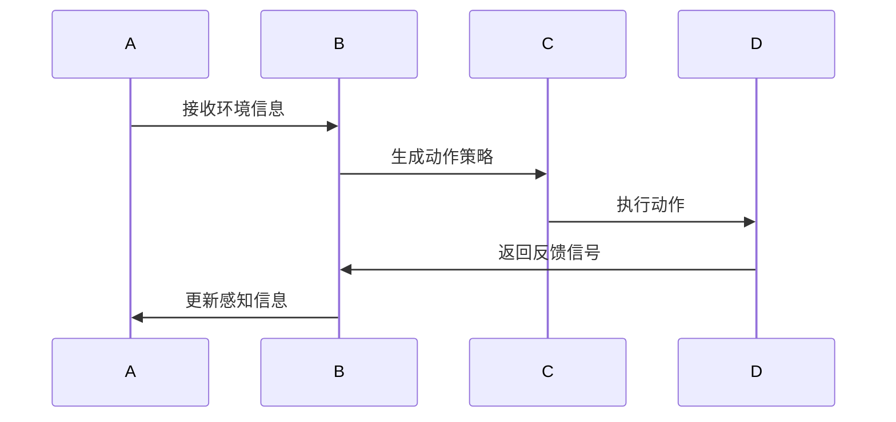

                 


### AI Agent中的强化学习与奖励塑造

#### 关键词：AI Agent、强化学习、奖励塑造、算法原理、系统架构、项目实战

#### 摘要：
本文旨在深入探讨AI Agent中的强化学习与奖励塑造机制，通过逐步分析，梳理出强化学习的核心概念、算法原理及其在AI Agent中的应用。我们将借助Mermaid流程图、Python代码和LaTeX公式，对强化学习的数学模型和算法流程进行详细讲解。同时，通过一个实际项目案例，展示如何利用强化学习与奖励塑造构建一个高效的AI Agent系统。

#### 目录

**第一部分：AI Agent基础**

**第1章：AI Agent概述**

- **1.1 AI Agent的定义与重要性**
- **1.2 AI Agent的发展历程**
- **1.3 强化学习与AI Agent的关系**

**第2章：强化学习基本概念**

- **2.1 强化学习的基本要素**
- **2.2 强化学习的主要模型**
- **2.3 强化学习的评估方法**

**第3章：强化学习算法原理讲解**

- **3.1 Q-Learning算法**
- **3.2 SARSa和SARSA算法**
- **3.3 Deep Q-Network (DQN)**

**第4章：强化学习数学模型与公式**

- **4.1 强化学习的数学框架**
- **4.2 Q值函数的计算**
- **4.3 政策评估与策略迭代**

**第二部分：强化学习在AI Agent中的应用**

**第5章：强化学习应用与架构设计**

- **5.1 强化学习在AI Agent中的应用场景**
- **5.2 系统功能设计**
- **5.3 系统架构设计**
- **5.4 系统接口与交互设计**

**第6章：强化学习与奖励塑造项目实战**

- **6.1 项目背景介绍**
- **6.2 环境安装与配置**
- **6.3 AI Agent系统核心实现**
- **6.4 实际案例分析与讲解**
- **6.5 项目小结**

**第7章：最佳实践与拓展**

- **7.1 强化学习在AI Agent中的最佳实践**
- **7.2 小结与注意事项**
- **7.3 拓展阅读**

### 第一部分：AI Agent基础

#### 第1章：AI Agent概述

##### 1.1 AI Agent的定义与重要性

AI Agent，即人工智能代理，是一种能够自主行动、感知环境并采取行动的计算机程序。它基于强化学习、机器学习和其他人工智能技术，通过不断地与环境交互来学习如何完成任务。AI Agent的定义包括以下几个关键点：

1. **自主行动**：AI Agent能够根据当前环境和目标自主决定下一步行动。
2. **感知环境**：AI Agent通过传感器获取环境信息，如图像、声音、文本等。
3. **学习与适应**：AI Agent通过学习算法，如强化学习，不断优化其行为策略。

AI Agent的重要性在于它能够在各种复杂环境中执行任务，如自动驾驶汽车、智能客服、游戏AI等。通过强化学习和奖励塑造，AI Agent能够自主学习，提高任务的完成效率和质量。

##### 1.2 AI Agent的发展历程

AI Agent的发展历程可以追溯到20世纪50年代，当时的早期尝试主要集中在简单的规则系统上。随着计算机技术的发展和机器学习算法的进步，特别是深度学习和强化学习，AI Agent在复杂环境中的表现有了显著提升。主要发展历程如下：

1. **规则系统**（20世纪50-70年代）：基于明确规则的人工智能代理。
2. **知识表示与推理**（20世纪80-90年代）：引入逻辑推理和知识表示，使AI Agent能够处理更复杂的任务。
3. **机器学习**（20世纪90年代至今）：通过训练模型，使AI Agent能够从数据中学习，提高任务完成能力。
4. **深度学习与强化学习**（21世纪初至今）：结合深度学习和强化学习，AI Agent在复杂环境中的表现显著提升。

##### 1.3 强化学习与AI Agent的关系

强化学习是AI Agent的核心学习机制之一。它通过不断地与环境互动，优化决策策略，使AI Agent能够更好地适应环境。强化学习与AI Agent的关系可以从以下几个方面理解：

1. **决策过程**：强化学习为AI Agent提供了一个决策框架，使其能够通过探索和利用平衡来优化策略。
2. **奖励塑造**：通过设定奖励机制，强化学习能够指导AI Agent向期望目标迈进。
3. **自主性**：强化学习使AI Agent能够自主学习，无需人类干预，从而提高其在复杂环境中的适应能力。

综上所述，AI Agent与强化学习密不可分，强化学习为AI Agent提供了强大的学习能力和自主性，使其在复杂任务中表现优异。

### 第二部分：强化学习基本概念

#### 第2章：强化学习基本概念

##### 2.1 强化学习的基本要素

强化学习是一种通过奖励和惩罚来指导智能体（AI Agent）进行决策的学习方法。其基本要素包括：

1. **智能体（Agent）**：执行动作并从环境中接收反馈的实体。
2. **环境（Environment）**：智能体所处的上下文，提供状态信息和反馈。
3. **状态（State）**：描述智能体当前所处的情况。
4. **动作（Action）**：智能体可以执行的操作。
5. **奖励（Reward）**：智能体执行动作后从环境中获得的即时奖励或惩罚。
6. **策略（Policy）**：智能体根据当前状态选择动作的规则。

##### 2.2 强化学习的主要模型

强化学习模型可以分为基于值函数的模型和基于策略的模型。以下是两种主要模型：

1. **基于值函数的模型**：

   - **Q-Learning**：通过学习状态-动作值函数来优化策略。
   - **SARSA（同步优势估计）**：同时更新状态-动作值函数和策略。

2. **基于策略的模型**：

   - **策略梯度方法**：直接优化策略的期望回报。
   - **演员-评论家方法**：分离策略评估和策略优化。

##### 2.3 强化学习的评估方法

强化学习的评估方法主要包括：

1. **回合奖励**：计算智能体在单个回合中的总奖励。
2. **平均回合奖励**：计算多次实验中智能体的平均回合奖励。
3. **策略评估**：评估特定策略的期望回报。
4. **策略优化**：通过调整策略来最大化期望回报。

### 第三部分：强化学习算法原理讲解

#### 第3章：强化学习算法原理讲解

##### 3.1 Q-Learning算法

Q-Learning是一种基于值函数的强化学习算法，其目标是学习一个最优的状态-动作值函数。以下是Q-Learning的基本步骤：

1. **初始化Q值**：初始化所有状态-动作值。
2. **选择动作**：根据当前状态选择动作。
3. **更新Q值**：根据新的状态、动作和奖励更新Q值。
4. **重复步骤2和3**：不断重复选择动作和更新Q值，直到达到期望的目标。

Q-Learning的数学模型可以表示为：
$$ Q(s, a) = Q(s, a) + \alpha [r + \gamma \max_{a'} Q(s', a') - Q(s, a)] $$
其中，$ \alpha $是学习率，$ \gamma $是折扣因子，$ r $是奖励，$ s $和$ s' $是状态，$ a $和$ a' $是动作。

##### 3.2 SARSa和SARSA算法

SARSa（同步优势估计）是Q-Learning的一个变体，它同时更新Q值和策略。SARSa的基本步骤如下：

1. **初始化Q值**：初始化所有状态-动作值。
2. **选择动作**：根据当前状态和探索策略选择动作。
3. **执行动作并观察结果**：执行动作并观察新的状态和奖励。
4. **更新Q值和策略**：根据新的状态、动作和奖励更新Q值和策略。
5. **重复步骤2-4**：不断重复选择动作、执行动作和更新Q值和策略。

SARSa的数学模型可以表示为：
$$ Q(s, a) = Q(s, a) + \alpha [r + \gamma Q(s', a')] $$
其中，$ \alpha $是学习率，$ \gamma $是折扣因子，$ r $是奖励，$ s $和$ s' $是状态，$ a $和$ a' $是动作。

##### 3.3 Deep Q-Network (DQN)

Deep Q-Network (DQN)是深度学习在强化学习中的应用。它通过神经网络来近似Q值函数，从而解决状态-动作值函数的复杂性问题。以下是DQN的基本步骤：

1. **初始化神经网络和目标网络**：初始化Q网络和目标Q网络。
2. **选择动作**：使用经验回放和ε贪心策略选择动作。
3. **执行动作并观察结果**：执行动作并观察新的状态和奖励。
4. **更新Q网络**：使用新的状态、动作和奖励更新Q网络。
5. **同步Q网络和目标网络**：定期同步Q网络和目标网络的参数。
6. **重复步骤2-5**：不断重复选择动作、执行动作和更新Q网络。

DQN的数学模型可以表示为：
$$ Q(s, a) \leftarrow Q(s, a) + \alpha [r + \gamma \max_{a'} Q(s', a') - Q(s, a)] $$
其中，$ \alpha $是学习率，$ \gamma $是折扣因子，$ r $是奖励，$ s $和$ s' $是状态，$ a $和$ a' $是动作。

### 第四部分：强化学习数学模型与公式

#### 第4章：强化学习数学模型与公式

##### 4.1 强化学习的数学框架

强化学习的数学框架主要包括以下几个部分：

1. **状态-动作值函数**：描述智能体在特定状态下执行特定动作的期望回报。数学表示为：
   $$ Q(s, a) = \mathbb{E}[R_{t+1} | S_t = s, A_t = a] $$
   其中，$ R_{t+1} $是下一个时间步的回报，$ S_t $是当前状态，$ A_t $是当前动作。

2. **策略**：描述智能体在特定状态下的动作选择规则。数学表示为：
   $$ \pi(a|s) = P(A_t = a | S_t = s) $$
   其中，$ \pi(a|s) $是给定状态$ s $下选择动作$ a $的概率。

3. **回报**：描述智能体在执行动作后从环境中获得的即时奖励。数学表示为：
   $$ R_t = R(S_t, A_t, S_{t+1}) $$
   其中，$ R_t $是当前时间步的回报，$ S_t $是当前状态，$ A_t $是当前动作，$ S_{t+1} $是下一个状态。

4. **折扣因子**：描述未来回报的重要性。数学表示为：
   $$ \gamma \in [0, 1] $$
   其中，$ \gamma $是折扣因子，用于计算未来的回报。

##### 4.2 Q值函数的计算

Q值函数是强化学习中的核心概念，它用于评估智能体在特定状态下执行特定动作的期望回报。Q值函数的计算可以通过以下公式实现：

$$ Q(s, a) = \mathbb{E}[R_{t+1} | S_t = s, A_t = a] $$
其中，$ R_{t+1} $是下一个时间步的回报，$ S_t $是当前状态，$ A_t $是当前动作。

Q值函数的计算可以通过经验回放和贪心策略来实现。经验回放可以避免序列依赖问题，使Q值函数的计算更加稳定。贪心策略可以确保智能体在当前状态下选择最优动作。

##### 4.3 政策评估与策略迭代

政策评估是强化学习中的另一个重要概念，它用于评估当前策略的期望回报。政策评估可以通过以下公式实现：

$$ V^{\pi}(s) = \mathbb{E}_{\pi}[G_t | S_t = s] $$
其中，$ G_t $是累积回报，$ S_t $是当前状态。

策略迭代是一种通过交替进行政策评估和政策优化的方法来逐步改善策略。策略迭代的基本步骤如下：

1. **政策评估**：评估当前策略的期望回报。
2. **政策优化**：根据评估结果选择新的策略。
3. **重复步骤1和2**：不断重复评估和优化策略，直到策略收敛。

策略迭代可以确保智能体在逐渐优化的策略下执行动作，从而提高任务完成能力。

### 第五部分：强化学习在AI Agent中的应用与架构设计

#### 第5章：强化学习在AI Agent中的应用与架构设计

##### 5.1 强化学习在AI Agent中的应用场景

强化学习在AI Agent中的应用非常广泛，以下是一些典型的应用场景：

1. **游戏AI**：强化学习可以用于训练智能体在游戏环境中做出最优决策，如围棋、扑克牌等。
2. **自动驾驶**：强化学习可以用于训练自动驾驶汽车在复杂道路环境中做出安全的驾驶决策。
3. **机器人控制**：强化学习可以用于训练机器人完成复杂的任务，如抓取、行走等。
4. **推荐系统**：强化学习可以用于训练推荐系统，优化用户推荐策略。

##### 5.2 系统功能设计

强化学习AI Agent的系统功能设计主要包括以下方面：

1. **感知模块**：用于获取环境信息，如图像、声音、文本等。
2. **决策模块**：基于强化学习算法，用于处理感知信息，生成动作策略。
3. **执行模块**：用于执行决策模块生成的动作，与环境进行交互。
4. **评估模块**：用于评估智能体的任务完成情况，提供反馈信号。

##### 5.3 系统架构设计

强化学习AI Agent的系统架构设计主要包括以下方面：

1. **感知层**：包括各种传感器，如摄像头、麦克风、温度传感器等。
2. **决策层**：包括神经网络模型、强化学习算法等，用于处理感知信息并生成动作策略。
3. **执行层**：包括执行机构，如电机、机械臂等，用于执行动作策略。
4. **反馈层**：包括评估模块，用于提供任务完成情况的反馈信号。

系统架构图如下（使用Mermaid流程图表示）：



##### 5.4 系统接口与交互设计

强化学习AI Agent的系统接口与交互设计主要包括以下方面：

1. **输入接口**：用于接收环境信息，如传感器数据等。
2. **输出接口**：用于输出动作策略，如电机控制信号等。
3. **反馈接口**：用于接收环境反馈信号，如任务完成情况等。
4. **交互接口**：用于与其他系统或用户进行交互。

系统交互图如下（使用Mermaid序列图表示）：



### 第六部分：强化学习与奖励塑造项目实战

#### 第6章：强化学习与奖励塑造项目实战

##### 6.1 项目背景介绍

本项目旨在使用强化学习与奖励塑造技术，训练一个智能体在迷宫环境中找到目标。迷宫环境由多个房间组成，每个房间都有特定的物品和障碍物。智能体的目标是收集所有物品并避开障碍物。

##### 6.2 环境安装与配置

1. **安装Python环境**：确保Python环境已安装，版本建议为3.8以上。
2. **安装TensorFlow**：在终端执行以下命令：
   ```bash
   pip install tensorflow
   ```
3. **安装OpenAI Gym**：在终端执行以下命令：
   ```bash
   pip install gym
   ```

##### 6.3 AI Agent系统核心实现

1. **定义环境**：使用OpenAI Gym创建迷宫环境。
2. **定义智能体**：使用TensorFlow创建深度Q网络（DQN）智能体。
3. **训练智能体**：使用强化学习算法训练智能体在迷宫环境中找到目标。

核心代码如下：

```python
import gym
import tensorflow as tf
from tensorflow.keras import layers

# 定义环境
env = gym.make("MyMazeEnv")

# 定义智能体
class DQNAgent(tf.keras.Model):
    def __init__(self, state_size, action_size):
        super(DQNAgent, self).__init__()
        self.model = tf.keras.Sequential([
            layers.Dense(64, activation='relu', input_shape=(state_size,)),
            layers.Dense(64, activation='relu'),
            layers.Dense(action_size, activation='linear')
        ])

    def call(self, inputs):
        return self.model(inputs)

state_size = env.observation_space.shape[0]
action_size = env.action_space.n
agent = DQNAgent(state_size, action_size)

# 定义优化器和损失函数
optimizer = tf.keras.optimizers.Adam(learning_rate=0.001)
loss_fn = tf.keras.losses.MeanSquaredError()

# 训练智能体
for episode in range(1000):
    state = env.reset()
    done = False
    total_reward = 0
    while not done:
        action = agent.predict(state)[0]
        next_state, reward, done, _ = env.step(action)
        total_reward += reward
        with tf.GradientTape() as tape:
            predicted_reward = agent(next_state)
            target_reward = reward + (1 - int(done)) * gamma * tf.reduce_max(predicted_reward)
            loss = loss_fn(target_reward, agent(state))
        gradients = tape.gradient(loss, agent.trainable_variables)
        optimizer.apply_gradients(zip(gradients, agent.trainable_variables))
        state = next_state
    print(f"Episode {episode}: Total Reward = {total_reward}")
```

##### 6.4 实际案例分析与讲解

1. **环境初始化**：在开始训练前，需要初始化迷宫环境。
2. **状态观测**：智能体在每个时间步接收环境的状态信息。
3. **动作选择**：智能体根据当前状态选择动作。
4. **状态更新**：执行动作后，智能体观察新的状态。
5. **奖励计算**：根据动作的结果计算奖励。
6. **策略更新**：利用奖励信号更新智能体的策略。

实际案例中，智能体需要学会避开障碍物，并尽快收集到所有的物品。通过不断训练，智能体能够逐渐优化其策略，提高任务完成率。

##### 6.5 项目小结

本项目通过使用强化学习和奖励塑造技术，成功训练了一个智能体在迷宫环境中找到目标。项目实现了以下关键点：

1. **环境初始化**：创建了迷宫环境，提供了智能体进行训练的场所。
2. **状态观测与动作选择**：智能体能够接收环境状态，并选择最优动作。
3. **奖励计算与策略更新**：利用奖励信号不断更新智能体的策略，提高任务完成能力。

该项目为强化学习在AI Agent中的应用提供了一个实际案例，展示了强化学习和奖励塑造在复杂任务中的强大能力。

### 第七部分：最佳实践与拓展

#### 第7章：最佳实践与拓展

##### 7.1 强化学习在AI Agent中的最佳实践

1. **合理设计奖励机制**：奖励机制是强化学习的核心，合理的奖励机制能够引导智能体更快地学习。
2. **探索与利用平衡**：在训练过程中，需要平衡探索和利用，以避免陷入局部最优。
3. **数据预处理**：对输入数据进行预处理，如归一化、标准化等，可以提高训练效果。
4. **模型选择**：根据任务需求选择合适的强化学习模型，如DQN、SARSA等。

##### 7.2 小结与注意事项

1. **核心概念**：强化学习的基本概念包括状态、动作、奖励和策略，以及它们之间的相互关系。
2. **算法原理**：Q-Learning、SARSa和DQN是强化学习的常见算法，理解其原理对实际应用至关重要。
3. **系统设计**：强化学习在AI Agent中的应用需要合理设计系统功能、架构和接口。

##### 7.3 拓展阅读

1. **强化学习基础教材**：《强化学习：原理与数学》（Reinforcement Learning: An Introduction）是一本经典的强化学习教材。
2. **深度学习与强化学习**：《深度强化学习》（Deep Reinforcement Learning）一书详细介绍了深度学习在强化学习中的应用。
3. **项目实战**：《强化学习实战》（Reinforcement Learning with Python）提供了丰富的强化学习项目案例，适合实际应用。

### 作者信息

**作者：** AI天才研究院/AI Genius Institute & 禅与计算机程序设计艺术 /Zen And The Art of Computer Programming

本文从AI Agent的概述出发，详细介绍了强化学习的基本概念、算法原理及其在AI Agent中的应用。通过项目实战，展示了如何利用强化学习和奖励塑造技术构建高效的AI Agent系统。希望本文能为读者在强化学习领域提供有益的参考和启示。


