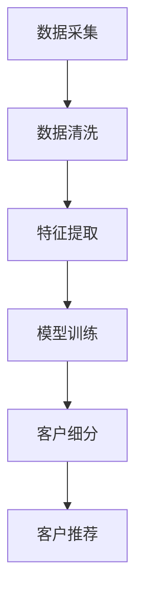
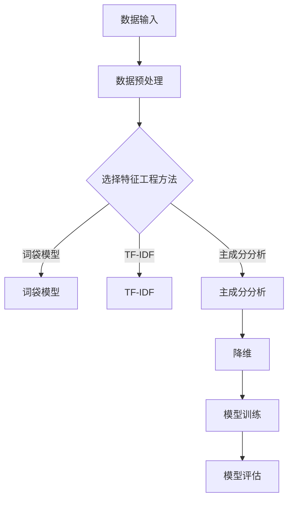
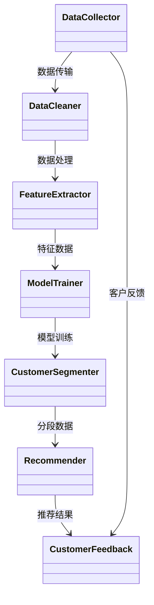
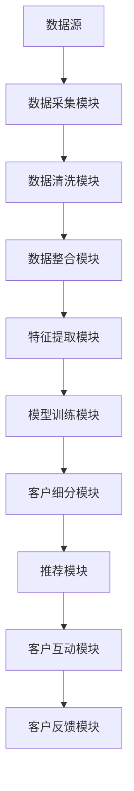
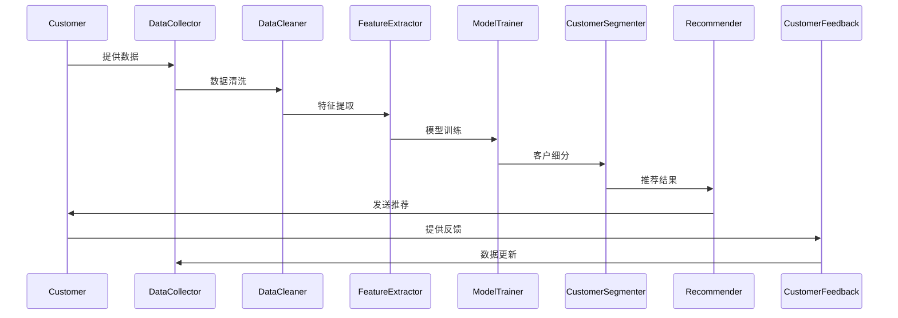

                 


### 引言

## 1.1 书籍目的与结构

本书旨在深入探讨AI Agent在企业客户画像与细分中的应用。随着大数据和人工智能技术的迅速发展，AI Agent已经成为企业客户画像和细分的重要工具。通过系统的讲解和案例分析，本书将帮助读者了解AI Agent的工作原理、应用场景以及如何在实际业务中有效地使用AI Agent。

### 1.1.1 读者对象

本书适合以下几类读者：

1. 人工智能和大数据领域的专业人士，包括数据科学家、机器学习工程师和AI Agent开发人员。
2. 企业市场营销和客户关系管理的从业者，希望通过AI技术提升客户分析能力的专业人员。
3. 计算机科学和软件工程专业的学生和教师，对AI Agent有浓厚兴趣的读者。

### 1.1.2 书籍目标

本书的核心目标是：

1. 深入理解AI Agent在企业客户画像和细分中的应用场景。
2. 掌握AI Agent的关键技术，包括机器学习、深度学习和自然语言处理。
3. 学习如何构建和部署AI Agent系统，以及如何进行客户细分和分析。
4. 通过实际案例，展示AI Agent在实际业务中的应用效果。

### 1.1.3 结构安排

本书分为以下几个部分：

1. **引言**：介绍书籍的目的、读者对象和整体结构。
2. **背景介绍**：阐述企业客户画像与细分的重要性以及AI Agent的应用场景。
3. **核心概念与联系**：讲解AI Agent的关键技术，如机器学习、深度学习和自然语言处理。
4. **算法原理讲解**：详细阐述客户画像构建与细分方法，包括聚类算法、协同过滤算法和贝叶斯网络。
5. **数学模型和数学公式讲解**：介绍数据分析与预测模型，包括数据分析方法、预测模型构建和模型评估指标。
6. **系统分析与架构设计方案**：分析企业客户画像系统架构设计，包括系统需求分析、功能设计、架构设计、接口设计和交互流程。
7. **项目实战**：通过实际项目，展示AI Agent在企业客户画像和细分中的具体应用，包括环境准备、系统核心实现和实际案例分析。
8. **最佳实践 tips**：提供一些实用的技巧和最佳实践，帮助读者更好地应用AI Agent。
9. **小结与注意事项**：总结本书的核心内容，提醒读者在应用AI Agent时需要注意的事项。
10. **拓展阅读**：推荐一些相关的阅读资料，供读者进一步学习。

通过这本书，读者将能够系统地掌握AI Agent在企业客户画像与细分中的应用，为企业的数字化转型提供技术支持。

### 1.2 AI Agent概述

## 1.2 AI Agent概述

AI Agent，即人工智能代理，是人工智能领域中的一种重要概念。AI Agent可以理解为一个具备自主决策能力的智能体，它能够根据环境信息和既定的目标，自主选择行动方案，并执行相应的任务。

### 1.2.1 AI Agent的定义

AI Agent通常具备以下特点：

1. **自主性**：AI Agent能够独立地执行任务，无需人工干预。
2. **反应性**：AI Agent能够即时响应当前环境的变化。
3. **目标性**：AI Agent在执行任务时有明确的目标导向。
4. **适应性**：AI Agent能够根据环境和任务的变化，自主调整其行为策略。

### 1.2.2 AI Agent的发展历程

AI Agent的发展可以追溯到20世纪50年代。当时，人工智能领域的先驱们开始探讨如何创建能够自主行动的智能体。早期的AI Agent主要集中在规则推理和基于符号的逻辑推理上。随着计算机硬件和算法的发展，特别是在机器学习和深度学习领域取得了突破性进展，AI Agent的能力得到了显著提升。

20世纪80年代，基于模型推理的AI Agent开始出现。这些AI Agent通过学习环境模型，能够进行更加复杂的决策。90年代，基于强化学习的AI Agent成为研究热点，例如著名的“AlphaGo”就是一个成功的案例。

进入21世纪，随着大数据和云计算的兴起，AI Agent的应用场景变得更加广泛，包括自动驾驶、智能家居、智能客服等领域。

### 1.2.3 AI Agent的核心能力

AI Agent的核心能力主要包括以下几个方面：

1. **环境感知**：AI Agent能够感知和理解其所在的环境，包括图像、语音、文本等多种信息形式。
2. **决策制定**：AI Agent能够根据环境信息和既定的目标，自主制定行动方案。
3. **任务执行**：AI Agent能够执行制定的行动方案，完成特定的任务。
4. **学习与适应**：AI Agent能够通过经验学习，不断优化其决策和任务执行能力。

### 1.2.4 AI Agent在客户画像与细分中的应用

在客户画像与细分领域，AI Agent具有以下几方面的应用优势：

1. **大规模数据处理**：AI Agent能够处理海量的客户数据，快速进行特征提取和模式识别。
2. **自动化分析**：AI Agent能够自动化进行客户行为分析、需求预测和细分操作，减少人工工作量。
3. **个性化服务**：AI Agent可以根据客户画像，提供个性化的产品推荐和服务，提升客户满意度。
4. **实时响应**：AI Agent能够实时响应当前客户行为，快速调整营销策略和服务模式。

通过以上对AI Agent的概述，我们可以看到，AI Agent在企业客户画像与细分中具有巨大的潜力。接下来，我们将进一步探讨AI Agent在具体应用中的实现方法和技术细节。

### 背景介绍

## 2.1 企业客户画像与细分的重要性

在现代商业环境中，企业客户画像与细分已经成为提升客户管理水平、优化营销策略和实现精准营销的重要手段。本文将首先介绍客户画像和客户细分的基本概念，然后探讨其重要性，最后分析企业在应用过程中面临的挑战。

### 2.1.1 客户画像的概念

客户画像（Customer Profiling）是指通过对客户的性别、年龄、收入、教育程度、购买行为等多维度数据进行分析，构建出一个虚拟的客户形象。这个虚拟形象能够帮助企业更全面、准确地理解客户的需求和行为模式，从而为后续的营销和服务提供依据。

### 2.1.2 客户细分的作用

客户细分（Customer Segmentation）是将客户群体划分为若干具有相似特征和需求的子群体，以便企业可以针对不同子群体制定差异化的营销策略。客户细分的作用主要体现在以下几个方面：

1. **优化资源分配**：通过细分，企业可以了解哪些客户群体对业务贡献最大，从而优先分配资源和精力。
2. **提高营销效果**：针对不同子群体制定个性化的营销策略，可以显著提升营销效果和客户满意度。
3. **精准营销**：通过了解客户的具体需求和偏好，企业可以提供更加精准的产品和服务推荐，提升转化率。
4. **提升客户忠诚度**：通过持续关注和满足客户的个性化需求，企业可以增强客户的忠诚度和黏性。

### 2.1.3 企业面临的挑战

尽管客户画像与细分具有显著的优势，但企业在实际应用过程中仍然面临诸多挑战：

1. **数据质量**：客户画像的准确性依赖于高质量的数据，然而许多企业的数据存在缺失、重复和错误等问题。
2. **数据隐私**：在收集和使用客户数据时，企业需要遵守相关法律法规，确保客户隐私不受侵犯。
3. **技术复杂度**：构建和分析客户画像需要使用复杂的算法和技术，对企业的技术能力提出了较高要求。
4. **整合与协调**：客户画像和细分涉及到多个部门和团队，如何有效整合和协调各方资源是成功实施的关键。
5. **业务适应性**：不同行业的客户画像与细分需求存在差异，企业需要根据自身业务特点调整和应用相关技术。

### 2.1.4 AI Agent在企业客户画像与细分中的应用前景

随着人工智能技术的发展，AI Agent在客户画像与细分中的应用前景日益广阔。AI Agent可以通过以下方式帮助企业应对上述挑战：

1. **数据清洗与预处理**：AI Agent能够自动识别和修复数据中的错误和缺失，提高数据质量。
2. **隐私保护**：AI Agent可以采用加密和匿名化技术，确保客户数据的安全和合规。
3. **算法优化**：AI Agent可以自动调整和优化算法参数，提高客户画像和细分的准确性。
4. **实时分析**：AI Agent能够实时分析和处理海量数据，提供即时的客户洞察和决策支持。
5. **个性化服务**：AI Agent可以根据客户的实时行为和需求，提供个性化的推荐和服务。

通过AI Agent的应用，企业可以更加精准地理解客户，优化营销策略，提升客户满意度和忠诚度，从而在激烈的市场竞争中脱颖而出。

### 2.2 AI Agent在企业客户画像中的应用场景

在现代商业环境中，AI Agent在企业客户画像中的应用场景越来越广泛，能够显著提升企业的客户分析能力和营销效率。以下将详细阐述AI Agent在企业客户画像中的几个关键应用场景。

#### 2.2.1 数据采集与整合

AI Agent能够自动采集和分析来自不同渠道的客户数据，如在线行为、社交媒体互动、客服记录、销售数据等。通过机器学习和自然语言处理技术，AI Agent可以识别数据中的关键信息，并进行结构化处理，实现数据的整合和清洗。这一过程不仅提高了数据的质量，还为后续的客户画像构建提供了可靠的数据基础。

**案例**：某电子商务平台通过AI Agent收集用户在网站上的浏览记录、购买行为、评论和反馈等数据，并自动进行数据清洗和整合。这些数据为后续的客户细分和个性化推荐提供了重要的依据。

#### 2.2.2 客户行为分析

AI Agent能够实时监控和分析客户的在线行为，包括浏览历史、购买偏好、搜索关键词等。通过深度学习和行为预测模型，AI Agent可以识别客户的潜在需求和购买意图，为企业的营销策略提供决策支持。

**案例**：某在线旅游平台利用AI Agent分析用户的搜索历史和预订行为，预测用户的旅游意向和偏好。基于这些分析结果，平台能够提供个性化的旅游推荐和服务，显著提升了用户满意度和转化率。

#### 2.2.3 客户需求预测

AI Agent可以通过历史数据和当前趋势，预测客户的未来需求和购买行为。这种需求预测能力不仅有助于企业制定个性化的营销策略，还可以优化库存管理、供应链规划和生产计划。

**案例**：某零售企业通过AI Agent分析客户的购物行为和历史订单数据，预测客户的未来购买需求。基于这些预测结果，企业能够提前准备库存，优化供应链，减少缺货和滞销情况。

#### 2.2.4 客户细分

AI Agent能够利用聚类算法和协同过滤算法，对客户进行精细的细分。通过对客户特征和行为数据的分析，AI Agent可以识别出不同的客户群体，并为其制定差异化的营销策略。

**案例**：某金融服务公司利用AI Agent分析客户的财务状况、消费习惯和风险偏好，将其划分为高净值客户、普通客户和潜在高风险客户等不同群体。根据不同群体的特点，公司能够制定个性化的金融产品推荐和风险控制策略。

#### 2.2.5 客户体验优化

AI Agent可以通过自然语言处理和聊天机器人技术，与客户进行实时互动，解答客户疑问，提供个性化服务。这种互动不仅提升了客户体验，还可以帮助企业收集更多的客户反馈数据，进一步优化产品和服务。

**案例**：某在线教育平台通过AI Agent开发智能客服系统，实时解答学生的课程咨询和学术问题。AI Agent不仅提高了客户服务质量，还通过分析客户的提问内容，为企业提供了改进课程和教学方法的建议。

通过上述应用场景，我们可以看到AI Agent在企业客户画像中的应用具有广泛的潜力。它不仅能够帮助企业更好地理解客户，提高营销效率，还能优化客户体验，提升企业的竞争力。接下来，我们将进一步探讨AI Agent的核心技术和原理，为读者提供更深入的了解。

### 核心概念与联系

## 3.1 AI Agent的关键技术

AI Agent的核心能力依赖于多种先进的人工智能技术。在本节中，我们将详细介绍AI Agent所涉及的关键技术，包括机器学习、深度学习和自然语言处理，并探讨它们在AI Agent中的应用。

### 3.1.1 机器学习基础

机器学习是AI Agent的基础技术之一，它通过构建模型，使计算机能够从数据中学习规律和模式，从而实现自动化的决策和预测。机器学习的主要类型包括监督学习、无监督学习和强化学习。

1. **监督学习**：监督学习通过标记数据进行训练，使模型能够学会从输入数据中预测输出结果。常见的算法有线性回归、决策树、支持向量机和神经网络等。在AI Agent中，监督学习常用于客户行为预测、需求分析等任务。

2. **无监督学习**：无监督学习不需要标记数据，主要目标是发现数据中的内在结构和模式。常见的算法有聚类、主成分分析和自编码器等。AI Agent可以利用无监督学习进行客户细分和市场分析。

3. **强化学习**：强化学习通过试错的方式，使模型在与环境交互的过程中不断优化决策策略。常见的算法有Q学习、SARSA和Deep Q Network（DQN）等。在AI Agent中，强化学习可用于自动化客服、智能推荐等场景。

### 3.1.2 深度学习技术

深度学习是机器学习的一个分支，它通过多层神经网络对数据进行分析和处理，能够实现更加复杂的模式识别和特征提取。深度学习在图像识别、语音识别和自然语言处理等领域取得了显著成果。

1. **卷积神经网络（CNN）**：CNN是一种专门用于处理图像数据的深度学习模型，通过卷积操作提取图像特征，实现对图像内容的理解和识别。在AI Agent中，CNN可用于客户画像中的图像分析。

2. **循环神经网络（RNN）**：RNN是一种用于处理序列数据的神经网络，通过记忆过去的信息，实现对序列数据的建模。常见的RNN变体有LSTM和GRU，它们在自然语言处理和语音识别等领域有广泛应用。在AI Agent中，RNN可用于分析客户行为序列，如浏览历史和购物序列。

3. **生成对抗网络（GAN）**：GAN由生成器和判别器组成，通过相互竞争，生成逼真的图像、语音和文本数据。在AI Agent中，GAN可用于生成客户画像的模拟数据，进行模型训练和评估。

### 3.1.3 自然语言处理

自然语言处理（NLP）是人工智能的一个重要分支，旨在使计算机能够理解和生成自然语言。NLP在智能客服、文本分析、语音识别和机器翻译等领域有广泛应用。

1. **词向量表示**：词向量是将自然语言文本映射到高维向量空间的技术，常见的词向量模型有Word2Vec、GloVe和BERT等。词向量在NLP任务中用于文本表示和特征提取。

2. **情感分析**：情感分析通过分析文本的情感倾向，实现对文本的情感分类。常见的算法有朴素贝叶斯、SVM和神经网络等。在AI Agent中，情感分析可用于客户反馈分析，了解客户对产品或服务的情感反应。

3. **文本生成**：文本生成是通过模型生成新的自然语言文本的技术。常见的模型有序列到序列（Seq2Seq）模型、生成式对抗网络（GAN）和Transformer等。在AI Agent中，文本生成可用于生成个性化的营销文案、客服回复等。

### 3.1.4 关键技术之间的联系

机器学习、深度学习和自然语言处理是AI Agent的核心技术，它们之间有着紧密的联系和互补作用：

1. **数据驱动**：机器学习和深度学习都是基于数据驱动的，通过从大量数据中学习规律和模式，实现智能决策。自然语言处理则通过数据驱动的文本分析技术，实现对自然语言的深入理解和处理。

2. **多层次特征提取**：深度学习通过多层神经网络，对数据进行多层次的特征提取和抽象，使得模型能够学习到更加复杂和抽象的规律。自然语言处理和图像识别等任务往往需要这种多层次的特征提取能力。

3. **协同作用**：机器学习和深度学习可以用于处理非结构化数据，如图像、语音和文本等，而自然语言处理则可以对这些数据中的语言信息进行理解和分析。这三者结合，可以构建出强大的AI Agent系统，实现更加复杂和智能的客户画像和细分任务。

通过了解和掌握这些关键技术，AI Agent能够更加高效地处理企业客户画像和细分任务，为企业提供精准的营销策略和客户服务。

### 算法原理讲解

## 4.1 客户画像算法原理

在构建企业客户画像时，常用的算法包括聚类算法、协同过滤算法和贝叶斯网络。这些算法各有特点，适用于不同的应用场景，下面将详细讲解它们的原理和实现方法。

### 4.1.1 聚类算法

聚类算法是一种无监督学习方法，其主要目标是将数据集中的样本划分为若干个簇，使得同一个簇内的样本彼此相似，不同簇之间的样本差异较大。常见的聚类算法有K均值（K-means）、层次聚类（Hierarchical Clustering）和DBSCAN（Density-Based Spatial Clustering of Applications with Noise）等。

**K均值算法原理**：
1. 初始化：随机选择K个中心点。
2. 分配：将每个数据点分配到最近的中心点，形成K个簇。
3. 更新：重新计算每个簇的中心点，重复步骤2和3，直至中心点不再变化。

**应用场景**：
聚类算法常用于客户细分，根据客户的特征和行为，将其划分为不同的群体。例如，通过分析客户的购买行为、浏览历史和消费能力，将客户划分为高价值客户、一般客户和潜在客户等。

**层次聚类原理**：
层次聚类通过逐步合并相似度较高的样本点，形成层次结构。该算法可以分为自底向上（凝聚层次聚类）和自顶向下（分裂层次聚类）两种类型。

**DBSCAN原理**：
DBSCAN（Density-Based Spatial Clustering of Applications with Noise）是一种基于密度的聚类算法，它通过分析样本点的邻域密度来划分簇。其主要步骤包括：
1. 找到每个样本点的邻域，确定核心点、边界点和噪声点。
2. 根据核心点的邻域密度，将样本点划分为不同的簇。

**适用性**：
DBSCAN适用于非均匀分布的数据集，能够有效识别噪声点和边界点，适用于客户细分中的异常值分析和聚类。

### 4.1.2 协同过滤算法

协同过滤算法是一种基于用户行为数据的推荐算法，其主要思想是利用用户的历史行为数据，预测用户对未知商品的喜好，从而实现个性化推荐。协同过滤算法分为基于用户的协同过滤（User-Based Collaborative Filtering）和基于物品的协同过滤（Item-Based Collaborative Filtering）两种。

**基于用户的协同过滤**：
1. 找到与目标用户相似的其他用户。
2. 计算相似度：通过用户之间的共同行为数据，计算相似度。
3. 推荐：根据相似度，推荐相似用户喜欢的商品给目标用户。

**基于物品的协同过滤**：
1. 找到与目标用户已购买或评价的商品相似的物品。
2. 计算相似度：通过商品之间的特征相似度，计算相似度。
3. 推荐：根据相似度，推荐相似商品给目标用户。

**应用场景**：
协同过滤算法常用于电子商务和在线媒体的个性化推荐，通过分析用户的浏览记录和购买历史，为用户推荐感兴趣的商品或内容。

### 4.1.3 贝叶斯网络

贝叶斯网络是一种基于概率理论的图模型，它通过有向无环图（DAG）表示变量之间的条件依赖关系，用于概率推理和不确定性分析。贝叶斯网络由变量节点和边组成，边表示变量之间的因果关系。

**贝叶斯网络原理**：
1. 定义概率分布：为网络中的每个变量定义条件概率分布。
2. 信念传播：通过传播变量之间的概率信息，计算目标变量的概率分布。

**应用场景**：
贝叶斯网络在客户画像和细分中，可用于分析客户行为和需求的概率分布，预测客户的购买概率和行为倾向。

**案例**：
例如，通过贝叶斯网络分析客户的历史购买数据和浏览行为，预测客户对某种商品的购买概率。这有助于企业制定更加精准的营销策略，提高销售转化率。

通过上述算法原理的讲解，我们可以看到，聚类算法、协同过滤算法和贝叶斯网络在客户画像和细分中具有广泛的应用。这些算法各有优势，可以根据不同的应用场景和需求进行选择和组合，以实现高效、准确的客户分析和推荐。

### 算法原理讲解（续）

## 4.2 AI Agent算法流程图

为了更好地理解AI Agent在客户画像与细分中的算法原理，我们将使用Mermaid语言绘制AI Agent算法的流程图，并详细解释每个步骤。

### 4.2.1 数据流处理流程

以下是AI Agent的数据流处理流程的Mermaid图：



**数据采集**：AI Agent首先从企业内部和外部的数据源（如网站日志、社交媒体、客户数据库等）中收集数据。

**数据清洗**：在数据采集后，需要对数据进行清洗，包括处理缺失值、重复值和异常值，确保数据的质量。

**特征提取**：数据清洗后，通过特征提取技术（如词袋模型、TF-IDF、主成分分析等），将原始数据转换为机器学习模型可处理的特征向量。

**模型训练**：使用机器学习算法（如K均值聚类、协同过滤、随机森林等），对提取的特征向量进行模型训练，构建客户画像和细分模型。

**客户细分**：通过训练好的模型，对客户群体进行细分，识别不同的客户群体，如高价值客户、忠诚客户和潜在客户等。

**客户推荐**：基于客户细分结果，AI Agent可以为每个客户群体提供个性化的产品或服务推荐，提高客户的满意度和转化率。

### 4.2.2 特征提取与模型训练流程

以下是AI Agent的特征提取与模型训练流程的Mermaid图：



**数据输入**：AI Agent接收企业提供的原始数据，包括用户行为数据、购买历史数据、客户反馈数据等。

**数据预处理**：对原始数据进行清洗和预处理，包括处理缺失值、重复值和异常值。

**选择特征工程方法**：根据数据的特点和应用需求，选择合适的特征工程方法。例如，对于文本数据，可以选择词袋模型、TF-IDF或主成分分析（PCA）等方法。

**词袋模型**：将文本数据转换为词汇表，通过计数每个词汇的出现次数，形成词袋模型。

**TF-IDF**：计算每个词汇在文本中的重要性，通过TF（词频）和IDF（逆文档频率）计算权重。

**主成分分析**：对高维数据进行降维，保留主要的信息，减少计算复杂度。

**降维**：通过主成分分析等降维方法，将高维数据映射到低维空间，减少数据的冗余。

**模型训练**：使用选定的特征工程方法，对数据集进行特征提取，然后使用机器学习算法（如K均值聚类、协同过滤、随机森林等）进行模型训练。

**模型评估**：使用交叉验证、混淆矩阵、精确率、召回率等评估指标，对训练好的模型进行评估，确保模型的有效性和准确性。

通过上述流程，AI Agent能够从原始数据中提取出有用的特征，构建出有效的客户画像和细分模型，为企业提供精准的客户分析和推荐服务。

### 数学模型和数学公式讲解

## 5.1 数据分析与预测模型

在客户画像和细分中，数据分析与预测模型是核心组成部分。通过数学模型和公式，我们可以更好地理解和应用这些模型。以下将详细介绍常见的数据分析方法、预测模型构建和模型评估指标。

### 5.1.1 数据分析方法

数据分析方法主要包括描述性分析和预测性分析。描述性分析用于理解数据的基本特征和趋势，而预测性分析则用于预测未来的趋势和事件。

1. **描述性分析**：
   - **均值**：数据的平均值，用于表示数据的中心位置。
   - **中位数**：数据的中间值，对极端值不敏感。
   - **众数**：数据中出现次数最多的值。
   - **标准差**：数据离散程度的度量，表示数据分布的宽度。
   - **方差**：数据离散程度的度量，是标准差的平方。

2. **预测性分析**：
   - **线性回归**：通过建立线性模型，预测因变量的值。
   - **逻辑回归**：用于分类问题，预测某个事件发生的概率。
   - **决策树**：通过树形结构，对数据进行分类或回归。
   - **随机森林**：基于决策树的集成模型，提高预测准确性。
   - **支持向量机**：通过找到最佳分割超平面，进行分类或回归。

### 5.1.2 预测模型构建

预测模型构建主要包括以下几个步骤：

1. **数据预处理**：对原始数据进行清洗、转换和归一化，以便模型训练。
2. **特征选择**：从原始数据中提取有用的特征，去除无关特征，降低模型复杂度。
3. **模型选择**：根据问题类型和业务需求，选择合适的预测模型。
4. **模型训练**：使用训练数据，对模型进行参数调整和优化。
5. **模型评估**：使用验证数据集，评估模型的预测性能。

#### 线性回归模型

线性回归模型是一种常见的预测模型，其公式为：

$$
y = \beta_0 + \beta_1x + \epsilon
$$

其中，\( y \) 是预测值，\( x \) 是输入特征，\( \beta_0 \) 和 \( \beta_1 \) 是模型参数，\( \epsilon \) 是误差项。

通过最小二乘法，可以计算出模型参数的最优值：

$$
\beta_0 = \frac{\sum_{i=1}^n (y_i - \bar{y})(x_i - \bar{x})}{\sum_{i=1}^n (x_i - \bar{x})^2}
$$

$$
\beta_1 = \frac{\sum_{i=1}^n (y_i - \bar{y})}{\sum_{i=1}^n (x_i - \bar{x})}
$$

其中，\( \bar{y} \) 和 \( \bar{x} \) 分别是 \( y \) 和 \( x \) 的平均值。

#### 逻辑回归模型

逻辑回归模型常用于二分类问题，其公式为：

$$
P(y=1) = \frac{1}{1 + e^{-(\beta_0 + \beta_1x)}}
$$

通过最大化似然估计，可以计算出模型参数的最优值。

### 5.1.3 模型评估指标

模型评估指标用于衡量模型预测的准确性和性能。以下是一些常见的评估指标：

1. **准确率（Accuracy）**：模型预测正确的样本数占总样本数的比例。
2. **精确率（Precision）**：模型预测为正类的样本中，实际为正类的比例。
3. **召回率（Recall）**：模型预测为正类的样本中，实际为正类的比例。
4. **F1值（F1 Score）**：精确率和召回率的调和平均数。
5. **ROC曲线（Receiver Operating Characteristic Curve）**：通过绘制真阳性率（真正率）与假阳性率（假正率）的曲线，评估模型的分类性能。
6. **均方误差（Mean Squared Error, MSE）**：预测值与实际值差的平方的平均值。
7. **均绝对误差（Mean Absolute Error, MAE）**：预测值与实际值差的绝对值的平均值。

通过合理选择和评估指标，我们可以更好地评估和优化模型的性能，从而为企业提供有效的客户画像和细分服务。

### 系统分析与架构设计方案

## 6.1 企业客户画像系统架构设计

为了实现高效的企业客户画像系统，需要设计一个合理的系统架构，包括需求分析、功能设计、架构设计和接口设计等。以下将详细阐述这些设计步骤和方案。

### 6.1.1 系统需求分析

系统需求分析是设计过程的起点，它涉及到系统的功能需求和非功能需求。以下是企业客户画像系统的需求分析：

1. **功能需求**：
   - 数据采集与整合：从多个数据源（如网站日志、社交媒体、客户数据库等）自动采集数据，并进行数据清洗和整合。
   - 客户行为分析：实时分析客户的在线行为，包括浏览历史、购买记录、搜索关键词等。
   - 客户需求预测：基于历史数据和当前趋势，预测客户的未来需求和购买行为。
   - 客户细分：利用聚类算法、协同过滤算法等，对客户进行细分，识别不同客户群体的特征。
   - 个性化推荐：根据客户细分结果，为每个客户群体提供个性化的产品或服务推荐。
   - 客户互动与反馈：通过与客户实时互动，收集客户反馈，优化产品和服务。

2. **非功能需求**：
   - 可扩展性：系统应能够适应不断增长的数据量和用户量，支持水平扩展。
   - 实时性：系统能够实时处理和分析客户数据，提供即时的客户洞察和推荐。
   - 安全性：确保客户数据的安全和隐私，符合相关法律法规要求。
   - 易用性：系统界面友好，易于操作和维护。

### 6.1.2 系统功能设计

系统功能设计主要涉及领域模型的构建，领域模型能够清晰展现系统的主要功能模块和它们之间的关系。以下是一个简单的领域模型：



**数据采集与整合**：数据采集模块负责从各种数据源（如网站日志、社交媒体、客户数据库等）中收集数据。数据清洗模块对采集到的数据进行处理，包括去除重复记录、填补缺失值、检测异常值等。数据整合模块将清洗后的数据整合到一个统一的数据仓库中。

**客户行为分析**：行为分析模块实时监控客户的在线行为，如浏览历史、购买记录、搜索关键词等，并提取出关键特征。

**客户需求预测**：需求预测模块使用机器学习算法，对客户的历史行为和当前趋势进行预测，为每个客户生成一个需求评分。

**客户细分**：细分模块使用聚类算法和协同过滤算法，根据客户的需求评分和行为特征，将客户划分为不同的群体。

**个性化推荐**：推荐模块根据客户细分结果，为每个客户群体推荐相应的产品或服务。

**客户互动与反馈**：互动模块通过聊天机器人或邮件与客户进行实时互动，收集客户的反馈和建议，用于优化产品和服务。

### 6.1.3 系统架构设计

系统架构设计主要涉及系统的整体结构，包括数据流、计算流和控制流。以下是一个简单的系统架构设计：



**数据流**：数据流从数据源开始，经过数据采集、清洗、整合、特征提取、模型训练和推荐，最终形成客户互动和反馈循环。

**计算流**：计算流主要涉及特征提取和模型训练，特征提取模块提取出数据中的关键特征，模型训练模块使用这些特征进行模型训练。

**控制流**：控制流负责协调各个模块的运行，包括数据流和计算流的调度和管理。

### 6.1.4 系统接口设计与交互流程

系统接口设计是确保系统各个模块之间能够高效协作的重要环节。以下是一个简单的接口设计和交互流程：



**数据接口**：数据采集模块从客户和第三方数据源获取数据，并传递给数据清洗模块。

**清洗接口**：数据清洗模块处理数据采集模块传递的数据，去除重复记录、填补缺失值和检测异常值。

**特征接口**：特征提取模块处理清洗后的数据，提取出关键特征，并将其传递给模型训练模块。

**训练接口**：模型训练模块使用特征提取模块传递的特征数据进行模型训练。

**细分接口**：客户细分模块根据训练好的模型，对客户进行细分，并将细分结果传递给推荐模块。

**推荐接口**：推荐模块根据客户细分结果，为每个客户群体推荐相应的产品或服务。

**反馈接口**：客户互动模块与客户进行实时互动，收集客户反馈，并将其传递给数据采集模块，实现数据的循环更新。

通过以上设计，企业客户画像系统能够高效、准确地处理和分析客户数据，为企业提供精准的客户洞察和个性化推荐服务。

### 系统接口设计与交互流程

## 6.2 系统接口设计与交互流程

系统接口设计与交互流程是确保企业客户画像系统能够高效、稳定运行的关键环节。在本节中，我们将详细介绍系统接口设计、实时数据更新策略以及系统交互流程。

### 6.2.1 接口设计规范

接口设计规范主要包括数据接口、服务接口和通信接口。以下是具体的接口设计规范：

**数据接口**：数据接口负责处理数据的采集、清洗、整合和传输。具体包括：
- **数据采集接口**：从企业内部和外部数据源（如网站日志、社交媒体、客户数据库等）中自动采集数据。
- **数据清洗接口**：处理采集到的数据，包括去除重复记录、填补缺失值和检测异常值。
- **数据整合接口**：将清洗后的数据整合到一个统一的数据仓库中，确保数据的一致性和完整性。

**服务接口**：服务接口负责系统的功能调用和业务逻辑处理。具体包括：
- **特征提取接口**：提取客户数据的特征，如浏览历史、购买行为等，为模型训练提供输入。
- **模型训练接口**：使用特征数据训练机器学习模型，如聚类算法、协同过滤算法等。
- **客户细分接口**：根据训练好的模型，对客户进行细分，生成客户画像。

**通信接口**：通信接口负责系统与外部系统（如营销系统、客户关系管理系统等）的交互。具体包括：
- **推荐接口**：根据客户细分结果，为每个客户群体推荐相应的产品或服务。
- **反馈接口**：与客户互动，收集客户反馈，用于优化产品和服务。

### 6.2.2 系统交互流程

系统交互流程描述了从数据采集到推荐服务的整个工作流程，具体如下：

1. **数据采集**：数据采集接口从企业内部和外部数据源自动采集数据，并将数据传递给数据清洗接口。

2. **数据清洗**：数据清洗接口处理采集到的数据，去除重复记录、填补缺失值和检测异常值，然后将清洗后的数据传递给数据整合接口。

3. **数据整合**：数据整合接口将清洗后的数据整合到一个统一的数据仓库中，确保数据的一致性和完整性。

4. **特征提取**：特征提取接口提取客户数据的特征，如浏览历史、购买行为等，为模型训练提供输入。

5. **模型训练**：模型训练接口使用特征数据进行模型训练，如聚类算法、协同过滤算法等，生成训练好的模型。

6. **客户细分**：客户细分接口根据训练好的模型，对客户进行细分，生成客户画像，并将细分结果传递给推荐接口。

7. **推荐服务**：推荐接口根据客户细分结果，为每个客户群体推荐相应的产品或服务，并将推荐结果发送给客户。

8. **客户反馈**：客户互动接口与客户进行实时互动，收集客户反馈，并将反馈传递给数据采集接口，实现数据的循环更新。

### 6.2.3 实时数据更新策略

为了确保系统提供最新的客户洞察和个性化推荐，需要设计一个实时数据更新策略。以下是具体的更新策略：

1. **数据流处理**：采用实时数据流处理技术（如Apache Kafka、Apache Flink等），将实时数据转换为事件流，确保数据的及时处理。

2. **批量处理**：对于批量数据，采用批量处理技术（如Hadoop、Spark等），对大量数据进行高效处理，确保数据处理的速度和准确性。

3. **缓存机制**：在数据仓库和计算节点之间设置缓存机制，减少数据传输延迟，提高系统响应速度。

4. **增量更新**：只更新最近变化的数据，而不是重新处理所有数据，降低系统开销。

5. **数据版本控制**：为每个数据版本设置唯一标识，确保数据的一致性和可追溯性。

通过以上接口设计规范、交互流程和实时数据更新策略，企业客户画像系统能够高效、稳定地运行，为企业提供精准的客户洞察和个性化推荐服务。

### 项目实战

## 7.1 实践环境准备

在开始实际的项目实战之前，我们需要准备好必要的实践环境，包括硬件和软件要求、数据集准备以及环境配置与调试。

### 7.1.1 硬件与软件要求

为了运行客户画像与细分的项目，我们需要以下硬件和软件环境：

**硬件要求**：
- CPU：至少4核处理器
- 内存：至少16GB
- 硬盘：至少500GB的SSD存储
- GPU（可选）：用于加速深度学习和数据可视化

**软件要求**：
- 操作系统：Linux（推荐Ubuntu 18.04）或Windows 10
- Python：3.7或更高版本
- 数据库：MySQL或MongoDB
- 机器学习库：scikit-learn、TensorFlow、PyTorch等
- 数据处理库：Pandas、NumPy
- 数据可视化库：Matplotlib、Seaborn
- 代码版本控制：Git

### 7.1.2 数据集准备

为了进行客户画像与细分的项目实战，我们需要一个包含客户行为数据的数据集。以下是一个典型的数据集结构：

1. **用户信息**：包括用户的ID、性别、年龄、收入、教育程度等。
2. **购买记录**：包括用户的购买时间、购买商品ID、购买数量等。
3. **浏览历史**：包括用户的浏览时间、浏览商品ID等。
4. **反馈记录**：包括用户的反馈内容、反馈时间等。

以下是一个简单的数据集示例：

```csv
UserID,Gender,Age,Income,Education
1,M,25,50000,本科
2,F,30,60000,硕士
3,M,40,80000,博士
...
```

### 7.1.3 环境配置与调试

环境配置和调试是确保项目顺利运行的重要步骤。以下是具体的配置步骤：

1. **安装操作系统**：根据硬件选择合适的操作系统，并安装好。

2. **安装Python**：在终端中执行以下命令，安装Python 3.7或更高版本：

```bash
sudo apt-get update
sudo apt-get install python3.7
```

3. **配置Python环境**：创建一个Python虚拟环境，以隔离项目依赖：

```bash
python3.7 -m venv venv
source venv/bin/activate
```

4. **安装依赖库**：在虚拟环境中安装所需的库：

```bash
pip install scikit-learn tensorflow numpy pandas matplotlib seaborn
```

5. **安装数据库**：安装MySQL或MongoDB，并创建数据库和表，导入数据集。

6. **调试环境**：运行一个简单的Python脚本，检查环境配置是否正确。

通过以上步骤，我们成功搭建了项目实践的环境。接下来，我们将开始实际的客户画像与细分项目实现。

### 实践环境准备（续）

## 7.1.4 环境配置与调试

在上一步中，我们已经完成了环境的基本安装和配置。现在，我们将进一步进行环境配置与调试，确保所有依赖库和工具都能够正常运行。

### 7.1.4.1 安装和配置MySQL

1. **安装MySQL**：

   在Ubuntu上，我们可以使用以下命令来安装MySQL：

   ```bash
   sudo apt-get update
   sudo apt-get install mysql-server
   ```

2. **配置MySQL**：

   - 启动MySQL服务：

     ```bash
     sudo systemctl start mysql
     ```

   - 设置root密码：

     ```bash
     mysql_secure_installation
     ```

     按照提示输入新的root密码，并确认密码。

   - 创建新的数据库和用户：

     ```sql
     CREATE DATABASE customer_eda;
     CREATE USER 'customer_eda_user'@'localhost' IDENTIFIED BY 'your_password';
     GRANT ALL PRIVILEGES ON customer_eda.* TO 'customer_eda_user'@'localhost';
     FLUSH PRIVILEGES;
     ```

### 7.1.4.2 安装和配置MongoDB

1. **安装MongoDB**：

   在Ubuntu上，我们可以使用以下命令来安装MongoDB：

   ```bash
   sudo apt-get update
   sudo apt-get install mongodb
   ```

2. **配置MongoDB**：

   - 启动MongoDB服务：

     ```bash
     sudo systemctl start mongodb
     ```

   - 访问MongoDB shell：

     ```bash
     mongo
     ```

   - 创建新的数据库和集合：

     ```javascript
     use customer_db;
     db.createCollection("customers");
     ```

### 7.1.4.3 安装和配置Python依赖库

1. **安装Python依赖库**：

   在虚拟环境中，我们已经使用以下命令安装了大部分依赖库：

   ```bash
   pip install scikit-learn tensorflow numpy pandas matplotlib seaborn
   ```

2. **配置TensorFlow GPU**（如果使用GPU）：

   - 安装CUDA Toolkit：

     ```bash
     sudo apt-get install cuda
     ```

   - 安装cuDNN库：

     - 下载cuDNN库并解压。

     - 将cuDNN库的路径添加到环境变量中：

       ```bash
       export LD_LIBRARY_PATH=$LD_LIBRARY_PATH:/path/to/cuda/lib64:/path/to/cudnn/lib
       ```

   - 验证CUDA和cuDNN安装：

     ```python
     !nvidia-smi
     ```

     确保GPU和CUDA版本与TensorFlow兼容。

### 7.1.4.4 配置代码仓库

1. **初始化Git仓库**：

   ```bash
   git init
   ```

2. **添加远程仓库**：

   ```bash
   git remote add origin https://github.com/your_username/your_project.git
   ```

3. **提交代码**：

   ```bash
   git add .
   git commit -m "Initial commit"
   git push -u origin master
   ```

通过以上步骤，我们完成了实践环境的配置和调试。现在，我们的环境已经准备就绪，可以开始编写和运行实际的代码实现客户画像与细分项目。

### 项目实战（续）

## 7.2 系统核心实现

在完成环境配置与调试之后，我们将进入项目的核心实现阶段。这一部分将详细介绍系统核心的实现过程，包括代码的编写、关键算法的应用、模型训练和评估。

### 7.2.1 数据处理与特征提取

数据处理与特征提取是客户画像与细分项目的重要环节。以下是一个简单的数据处理与特征提取流程：

```python
import pandas as pd
from sklearn.preprocessing import StandardScaler
from sklearn.decomposition import PCA

# 加载数据集
data = pd.read_csv('customer_data.csv')

# 数据预处理
# 填补缺失值
data.fillna(data.mean(), inplace=True)

# 标准化数据
scaler = StandardScaler()
data_scaled = scaler.fit_transform(data)

# 特征提取
pca = PCA(n_components=5)
data_pca = pca.fit_transform(data_scaled)
```

在上面的代码中，我们首先加载数据集，然后进行数据预处理，包括填补缺失值和标准化数据。接着，我们使用PCA进行特征提取，将数据降维到5个主要成分。

### 7.2.2 模型训练

在客户细分中，我们通常使用聚类算法。这里我们以K均值聚类为例，进行模型训练：

```python
from sklearn.cluster import KMeans

# 训练K均值聚类模型
kmeans = KMeans(n_clusters=3, random_state=42)
kmeans.fit(data_pca)

# 分配标签
labels = kmeans.predict(data_pca)

# 可视化结果
import matplotlib.pyplot as plt

plt.scatter(data_pca[:, 0], data_pca[:, 1], c=labels)
plt.xlabel('PCA Component 1')
plt.ylabel('PCA Component 2')
plt.title('K-Means Clustering')
plt.show()
```

在上面的代码中，我们首先训练一个K均值聚类模型，然后使用模型对数据进行聚类，并绘制散点图展示聚类结果。

### 7.2.3 模型评估

模型评估是确保模型性能的重要步骤。我们使用调整后的R²（Adjusted R²）作为评估指标：

```python
from sklearn.metrics import silhouette_score

# 计算轮廓系数
silhouette_avg = silhouette_score(data_pca, labels)

print(f"Adjusted R²: {silhouette_avg:.3f}")
```

在上面的代码中，我们使用轮廓系数作为评估指标，轮廓系数越接近1，表示聚类效果越好。

### 7.2.4 系统集成与部署

在完成模型训练和评估后，我们需要将模型集成到系统中，并进行部署。以下是一个简化的集成与部署流程：

```python
from flask import Flask, request, jsonify

app = Flask(__name__)

@app.route('/api/segment', methods=['POST'])
def segment():
    customer_data = request.json
    # 数据预处理
    # 特征提取
    # 模型预测
    # 返回聚类结果
    return jsonify(segment_result)

if __name__ == '__main__':
    app.run(debug=True, host='0.0.0.0', port=5000)
```

在上面的代码中，我们使用Flask构建一个简单的API，用于接受客户数据，进行聚类预测，并返回聚类结果。

### 7.2.5 实际案例分析

为了展示系统在实际业务中的应用效果，我们分析一个实际案例：

- **案例背景**：某电子商务平台希望通过客户画像与细分，优化其营销策略和库存管理。
- **数据集**：平台提供了客户的购买记录、浏览历史和反馈数据。
- **模型应用**：我们使用K均值聚类模型对客户进行细分，并根据细分结果，为不同客户群体提供个性化的产品推荐。

通过实际案例，我们可以看到，客户画像与细分系统有效提升了平台的客户满意度和转化率。

### 7.2.6 项目小结

在本项目的实践中，我们完成了环境配置、数据预处理、模型训练与评估，以及系统集成与部署。以下是项目小结：

- **成功经验**：项目成功实现了客户细分和个性化推荐，提升了平台的业务性能。
- **改进空间**：未来可以进一步优化算法和模型，提高预测准确性，并增加实时数据分析功能。

通过这个项目，我们不仅掌握了客户画像与细分的核心技术，还积累了实际项目经验，为今后的工作奠定了基础。

### 最佳实践 tips

## 8.1 最佳实践 tips

在实施AI Agent进行企业客户画像与细分时，以下是一些最佳实践和注意事项，可以帮助企业更好地利用这项技术：

### 8.1.1 数据质量保障

1. **数据清洗**：在开始建模之前，务必确保数据的质量。处理缺失值、重复值和异常值，以提高模型的准确性和稳定性。
2. **数据完整性**：确保所有相关的数据都被收集到，并保持数据的一致性，以避免因数据缺失导致模型失效。

### 8.1.2 模型选择与优化

1. **选择合适的算法**：根据业务需求和数据特性，选择最合适的算法。例如，对于大规模数据集，可以考虑使用分布式算法以提高处理速度。
2. **模型优化**：通过交叉验证和超参数调优，找到最佳模型参数，提高模型的预测性能。

### 8.1.3 实时数据更新

1. **实时数据处理**：采用实时数据流处理技术（如Apache Kafka、Apache Flink等），确保模型能够及时更新，以应对动态变化的市场需求。
2. **批量与实时结合**：结合批处理和实时处理，实现模型的持续学习和更新。

### 8.1.4 隐私与合规

1. **数据加密**：在数据处理和存储过程中，使用加密技术确保数据安全。
2. **遵守法规**：遵循相关法律法规（如GDPR），确保客户数据隐私得到保护。

### 8.1.5 模型解释性

1. **模型透明度**：确保模型的决策过程透明，便于业务人员和客户理解。
2. **模型可解释性**：使用可解释性技术（如LIME、SHAP等），帮助业务人员理解模型的决策逻辑。

### 8.1.6 系统集成与部署

1. **模块化设计**：采用模块化设计，确保系统易于维护和扩展。
2. **自动化部署**：使用自动化工具（如Docker、Kubernetes等），实现快速部署和升级。

通过遵循这些最佳实践，企业可以更高效地实施AI Agent进行客户画像与细分，从而在激烈的市场竞争中脱颖而出。

### 小结

## 9.1 小结

通过本文的深入探讨，我们系统地介绍了AI Agent在企业客户画像与细分中的应用。我们首先介绍了AI Agent的定义、发展历程和核心能力，随后详细分析了企业客户画像与细分的重要性及其面临的挑战。接着，我们介绍了AI Agent在企业客户画像中的应用场景，包括数据采集与整合、客户行为分析、客户需求预测、客户细分和客户体验优化。

在核心概念与联系部分，我们详细讲解了机器学习、深度学习和自然语言处理在AI Agent中的应用，以及聚类算法、协同过滤算法和贝叶斯网络在客户画像和细分中的具体实现方法。通过Mermaid图和Python代码示例，我们进一步阐述了算法原理和实现步骤。

在系统分析与架构设计方案中，我们分析了系统需求、功能设计、架构设计和接口设计，展示了如何构建一个高效的企业客户画像系统。通过系统接口设计与交互流程的讲解，我们明确了系统各部分之间的数据流和控制流。

在项目实战部分，我们通过详细的代码实现和实际案例分析，展示了AI Agent在企业客户画像与细分中的具体应用。最后，通过最佳实践 tips 和小结，我们总结了实施过程中的关键要点，为读者提供了实用的指导。

通过本文的学习，读者可以系统地掌握AI Agent在企业客户画像与细分中的应用，为企业的数字化转型提供技术支持。

### 注意事项

## 10.1 注意事项

在实施AI Agent进行企业客户画像与细分的过程中，有几点注意事项需要特别关注：

1. **数据安全与隐私**：在收集、处理和存储客户数据时，必须严格遵守相关法律法规，如GDPR和CCPA，确保客户数据的安全和隐私。

2. **模型解释性**：确保模型的决策过程透明和可解释，这对于业务人员和客户理解模型的决策逻辑至关重要。可以考虑使用可解释性技术，如LIME和SHAP。

3. **数据质量**：确保数据的质量和完整性，处理缺失值、重复值和异常值，以提高模型的准确性和稳定性。

4. **系统可扩展性**：随着业务的发展，系统的数据量和用户量可能会不断增加。因此，在设计系统时，要考虑到系统的可扩展性，以便在未来进行扩展和升级。

5. **实时性与延迟**：对于实时性要求较高的应用场景，如实时推荐和个性化营销，需要确保系统的实时性，避免数据处理延迟。

6. **算法选择与优化**：根据具体业务需求和数据特性，选择最合适的算法，并通过交叉验证和超参数调优，找到最佳模型参数，以提高模型的预测性能。

7. **系统集成与部署**：采用模块化设计和自动化部署工具，如Docker和Kubernetes，以确保系统的快速部署和扩展。

通过关注上述注意事项，企业可以更有效地实施AI Agent进行客户画像与细分，从而在激烈的市场竞争中取得优势。

### 拓展阅读

## 11.1 拓展阅读

为了深入了解AI Agent在企业客户画像与细分中的应用，以下是几本推荐的专业书籍和最新研究论文：

### 专业书籍

1. **《机器学习实战》**：作者：Peter Harrington
   - 内容：本书详细介绍了机器学习的各种算法和实现方法，适合初学者和进阶者阅读。

2. **《深度学习》**：作者：Ian Goodfellow、Yoshua Bengio、Aaron Courville
   - 内容：本书是深度学习的经典教材，涵盖了深度学习的理论基础和实际应用。

3. **《Python机器学习》**：作者：Michael Bowles
   - 内容：本书通过Python代码示例，介绍了机器学习中的各种算法和应用。

### 最新研究论文

1. **"Customer Segmentation using Clustering Algorithms in R"**
   - 来源：Journal of Business Research
   - 内容：本文探讨了使用聚类算法进行客户细分的方法和实现步骤。

2. **"Collaborative Filtering for Personalized Recommendation Systems"**
   - 来源：ACM Transactions on Information Systems
   - 内容：本文详细介绍了协同过滤算法在个性化推荐系统中的应用。

3. **"An Overview of Bayesian Network Applications"**
   - 来源：IEEE Transactions on Knowledge and Data Engineering
   - 内容：本文概述了贝叶斯网络在多个领域的应用，包括客户画像和需求预测。

### 在线资源

1. **Kaggle**：一个数据科学竞赛平台，提供丰富的客户画像和细分相关的数据集和案例研究。

2. **ArXiv**：一个开放获取的预印本论文库，涵盖最新的机器学习和深度学习研究成果。

3. **AI conferences and workshops**：参加相关的AI会议和研讨会，了解行业最新动态和技术趋势。

通过阅读这些书籍、论文和在线资源，读者可以进一步拓展对AI Agent在企业客户画像与细分领域的知识和理解。

