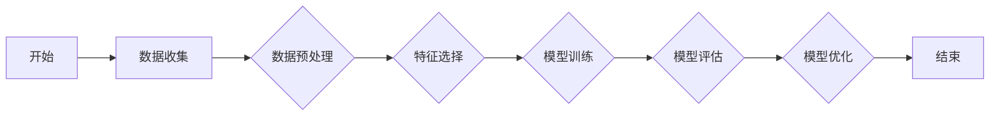
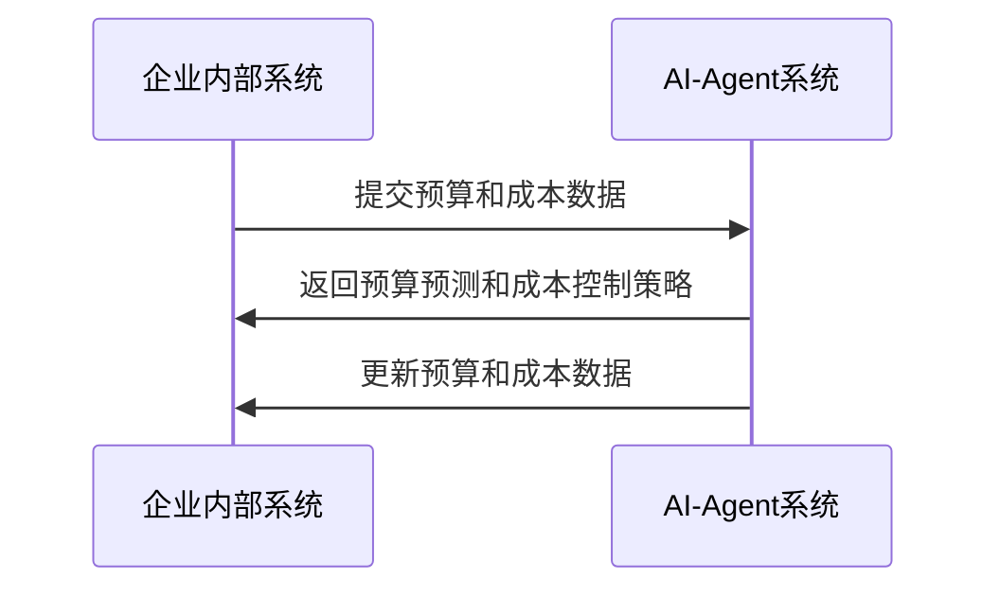

                 

### AI Agent在企业预算管理与成本控制中的应用

> 关键词：AI Agent、企业预算管理、成本控制、机器学习、预测模型、优化算法

> 摘要：本文深入探讨了AI Agent在企业预算管理与成本控制中的应用。通过详细的背景介绍、核心概念解析、算法原理讲解和实际案例剖析，本文展示了AI Agent如何通过智能预测和优化算法，为企业带来更高的效率和精确度，从而实现成本控制和预算优化的目标。

#### 背景介绍

##### 核心概念

1. **AI Agent**: AI Agent（人工智能代理）是一种能够自主决策并执行任务的计算机程序。在企业预算管理和成本控制中，AI Agent能够处理大量数据，识别模式，进行预测和优化，帮助企业做出更明智的决策。

2. **企业预算管理**: 企业预算管理是指企业为了实现经营目标，对财务资源进行有效规划、分配和控制的过程。它包括收入预算、支出预算、资本预算等，旨在确保企业资源得到最优配置。

3. **成本控制**: 成本控制是指企业通过一系列措施来降低运营成本，提高效益的过程。有效的成本控制能够帮助企业减少浪费，提高盈利能力。

##### 问题背景

在现代企业运营中，预算管理和成本控制面临诸多挑战：

- 数据量庞大：企业每天产生大量的财务数据，传统的分析方法难以应对。
- 复杂性增加：企业的业务复杂度不断增加，预算管理和成本控制的难度也随之上升。
- 预测不准确：传统的预算方法往往依赖于历史数据和经验，预测准确性较低。
- 需求变化快：市场环境变化迅速，企业需要快速调整预算和成本计划。

##### 问题描述

- **预算管理**: 如何通过AI Agent提高预算预测的准确性？
- **成本控制**: 如何利用AI Agent优化成本控制流程，降低运营成本？

##### 问题解决

AI Agent在预算管理和成本控制中的应用主要基于以下几个方面：

- **数据分析和预测**: 利用机器学习算法，AI Agent可以分析历史数据，预测未来的预算需求，提高预算的准确性。
- **自动化流程**: AI Agent可以自动化执行预算编制、审批、监控等流程，提高效率。
- **实时监控**: AI Agent可以实时监控成本支出，识别异常，提供优化建议。
- **优化算法**: 利用优化算法，AI Agent可以为企业提供最佳的成本控制策略。

##### 边界与外延

- **边界**: AI Agent的功能范围主要局限于数据分析和决策支持。它不能代替企业管理者的最终决策。
- **外延**: AI Agent的应用不仅限于企业内部，还可以扩展到供应链管理、客户关系管理等领域。

##### 概念结构与核心要素组成

AI Agent在企业预算管理和成本控制中的概念结构包括以下几个核心要素：

- **数据采集**: 收集与企业预算和成本相关的各类数据。
- **数据清洗与处理**: 清洗数据，处理缺失值和异常值。
- **机器学习模型**: 使用机器学习算法建立预测和优化模型。
- **决策支持系统**: 提供决策支持，包括预算预测、成本分析和优化建议。
- **人机交互界面**: 便于企业管理者与AI Agent进行交互，查看分析结果。

### 第二部分：核心概念与联系

#### 核心概念

1. **机器学习与深度学习**: 
   - **机器学习**：是一种通过算法让计算机从数据中学习模式和规律的技术。它通常依赖于特征工程和统计模型。
   - **深度学习**：是机器学习的一个子领域，它通过多层神经网络模拟人类大脑的学习过程，能够处理更加复杂的任务。

2. **大数据分析**: 
   - **大数据分析**：是对大规模数据进行处理和分析，以提取有价值的信息。它通常涉及数据存储、数据清洗、数据挖掘和可视化等技术。

3. **云计算与边缘计算**: 
   - **云计算**：是一种提供可扩展的计算资源和服务，按需分配的计算模式。
   - **边缘计算**：是一种在靠近数据源的地方进行数据处理，以减少延迟和带宽使用的计算模式。

#### 概念属性特征对比表格

| 概念           | 特点                                                         |
|--------------|------------------------------------------------------------|
| 机器学习       | 自动从数据中学习模式和规律的技术。                           |
| 深度学习       | 机器学习的一个子领域，通过多层神经网络模拟人类大脑的学习过程。 |
| 大数据分析     | 对大规模数据进行处理和分析，提取有价值的信息。               |
| 云计算         | 提供可扩展的计算资源和服务，按需分配。                     |
| 边缘计算       | 在靠近数据源的地方进行数据处理，减少延迟和带宽使用。           |

#### ER实体关系图架构

```mermaid
erDiagram
  AI-Agent ||--|{ DataAnalysis } DataAnalysis
  DataAnalysis ||--|{ BudgetManagement } BudgetManagement
  DataAnalysis ||--|{ CostControl } CostControl
  AI-Agent ||--|{ MachineLearning } MachineLearning
  MachineLearning ||--|{ DeepLearning } DeepLearning
  AI-Agent ||--|{ CloudComputing } CloudComputing
  CloudComputing ||--|{ EdgeComputing } EdgeComputing
```

### 第三部分：算法原理讲解

#### 算法原理

#### 预测模型

预测模型是AI Agent在预算管理中最重要的组成部分。它通过分析历史数据，预测未来的预算需求。以下是构建预测模型的基本步骤：

1. **数据收集**：收集与企业预算相关的历史数据，包括收入、支出、资本支出等。

2. **数据预处理**：清洗数据，处理缺失值和异常值。将数据转化为适合机器学习算法的形式。

3. **特征选择**：选择对预测有重要影响的关键特征。常用的特征选择方法包括相关性分析、主成分分析等。

4. **模型训练**：使用机器学习算法（如线性回归、决策树、随机森林等）训练预测模型。模型训练的目标是最小化预测误差。

5. **模型评估**：评估模型的预测准确性。常用的评估指标包括均方误差（MSE）、决定系数（R²）等。

6. **模型优化**：通过调整模型参数，优化模型性能。常用的优化方法包括交叉验证、网格搜索等。

#### 优化算法

优化算法是AI Agent在成本控制中应用的核心。它通过分析历史数据和实时数据，为企业提供最佳的成本控制策略。以下是构建优化算法的基本步骤：

1. **问题建模**：将成本控制问题转化为数学优化问题。常用的建模方法包括线性规划、整数规划、混合整数规划等。

2. **算法选择**：选择适合问题的优化算法。常用的优化算法包括单纯形法、内点法、遗传算法、粒子群优化算法等。

3. **算法实现**：实现优化算法。使用Python、C++等编程语言，实现优化算法的代码。

4. **算法评估**：评估优化算法的性能。常用的评估指标包括计算时间、收敛速度、解的精度等。

5. **算法优化**：通过调整算法参数，优化算法性能。常用的优化方法包括算法组合、参数调优等。

#### Mermaid流程图



#### Python源代码

```python
import pandas as pd
from sklearn.linear_model import LinearRegression
from sklearn.model_selection import train_test_split
from sklearn.metrics import mean_squared_error

# 加载数据集
data = pd.read_csv('budget_data.csv')

# 数据预处理
data.fillna(data.mean(), inplace=True)

# 特征选择
X = data[['revenue', 'expenses']]
y = data['capital_expenses']

# 模型训练
X_train, X_test, y_train, y_test = train_test_split(X, y, test_size=0.2, random_state=42)
model = LinearRegression()
model.fit(X_train, y_train)

# 模型评估
y_pred = model.predict(X_test)
mse = mean_squared_error(y_test, y_pred)
print("MSE:", mse)

# 模型优化
# 这里可以加入交叉验证、网格搜索等优化方法
```

#### 算法原理详细讲解

1. **预测模型原理**

预测模型的核心是回归分析。回归分析是一种统计方法，用于分析变量之间的关系。在预算管理中，我们可以将预算需求（因变量）与收入、支出等（自变量）之间的关系建模。

$$
y = \beta_0 + \beta_1x_1 + \beta_2x_2 + ... + \beta_nx_n
$$

其中，$y$是预算需求，$x_1, x_2, ..., x_n$是收入、支出等自变量，$\beta_0, \beta_1, ..., \beta_n$是回归系数。

通过最小化预测误差，我们可以找到最佳的回归系数，从而建立预测模型。

2. **优化算法原理**

优化算法的核心是寻找问题的最优解。在成本控制中，我们可以将成本控制问题建模为线性规划问题。

$$
\min z = c_1x_1 + c_2x_2 + ... + c_nx_n
$$

$$
s.t. a_1x_1 + a_2x_2 + ... + a_m x_m \ge b
$$

$$
x_1, x_2, ..., x_n \ge 0
$$

其中，$z$是成本，$c_1, c_2, ..., c_n$是各项成本，$a_1, a_2, ..., a_m$是各项成本的限制条件，$b$是总预算。

通过求解线性规划问题，我们可以找到最优的成本控制策略，从而实现成本优化。

### 第四部分：系统分析与架构设计

#### 问题场景介绍

假设某大型制造企业需要在预算管理和成本控制方面进行优化。该企业每天产生大量的财务数据，需要高效、准确地处理这些数据，以提高预算管理和成本控制的效率。

#### 项目介绍

项目目标是开发一个基于AI Agent的企业预算管理与成本控制系统。系统将利用机器学习和优化算法，对财务数据进行分析和预测，提供预算预测和成本控制策略，帮助企业实现高效运营。

#### 系统功能设计

系统功能包括：

- **数据采集**：自动收集与企业预算和成本相关的各类数据。
- **数据预处理**：清洗数据，处理缺失值和异常值。
- **预测分析**：使用机器学习算法建立预算预测模型。
- **成本控制**：使用优化算法提供最佳的成本控制策略。
- **决策支持**：为企业管理者提供预算和成本分析报告。

#### 系统架构设计

系统架构采用分层架构，包括数据层、服务层和展示层。

1. **数据层**：负责数据采集、存储和预处理。数据来源包括企业内部系统、外部API等。

2. **服务层**：负责实现预测分析和成本控制功能。使用机器学习和优化算法，为企业管理者提供决策支持。

3. **展示层**：提供用户界面，展示分析结果和决策建议。

#### 系统接口设计

系统接口设计包括：

- **API接口**：提供RESTful API，方便企业内部系统和其他第三方系统调用。
- **数据接口**：提供数据导入和导出接口，方便数据管理和备份。

#### 系统交互



### 第五部分：项目实战

#### 环境安装

1. **Python环境安装**：确保Python 3.8及以上版本已安装。

2. **机器学习库安装**：使用pip安装常用的机器学习库，如scikit-learn、pandas、numpy等。

   ```bash
   pip install scikit-learn pandas numpy
   ```

3. **优化算法库安装**：使用pip安装常用的优化算法库，如PuLP、Gurobi等。

   ```bash
   pip install pulp gurobipy
   ```

#### 系统核心实现

以下是一个简单的预算预测系统的实现示例：

```python
import pandas as pd
from sklearn.linear_model import LinearRegression
from sklearn.model_selection import train_test_split
from sklearn.metrics import mean_squared_error

# 加载数据集
data = pd.read_csv('budget_data.csv')

# 数据预处理
data.fillna(data.mean(), inplace=True)

# 特征选择
X = data[['revenue', 'expenses']]
y = data['capital_expenses']

# 模型训练
X_train, X_test, y_train, y_test = train_test_split(X, y, test_size=0.2, random_state=42)
model = LinearRegression()
model.fit(X_train, y_train)

# 模型评估
y_pred = model.predict(X_test)
mse = mean_squared_error(y_test, y_pred)
print("MSE:", mse)

# 模型优化
# 这里可以加入交叉验证、网格搜索等优化方法
```

#### 代码应用解读与分析

上述代码实现了一个简单的线性回归预算预测模型。首先，代码加载了数据集，并进行了数据预处理。接着，代码选择了关键特征，并使用线性回归算法训练了预测模型。最后，代码评估了模型的预测准确性。

- **数据预处理**：数据预处理是构建预测模型的重要步骤。通过填充缺失值和异常值处理，我们可以提高模型的预测准确性。
- **特征选择**：选择关键特征是模型训练的关键。通过相关性分析和主成分分析等方法，我们可以找到对预测有重要影响的特征。
- **模型训练**：使用线性回归算法训练预测模型。线性回归是一种简单的统计方法，适用于线性关系的预测。
- **模型评估**：通过计算均方误差（MSE），我们可以评估模型的预测准确性。MSE值越小，模型的预测效果越好。

#### 实际案例分析和详细讲解

假设某企业需要预测下一季度的资本支出。该企业过去三年的财务数据如下：

| 年份 | 收入（万元） | 支出（万元） | 资本支出（万元） |
|------|------------|------------|----------------|
| 2020 | 1000       | 800        | 200            |
| 2021 | 1200       | 950        | 250            |
| 2022 | 1300       | 1050       | 300            |

使用上述代码，我们可以构建一个简单的线性回归模型，预测2023年的资本支出。以下是具体步骤：

1. **数据预处理**：将数据转换为适合机器学习算法的形式。

2. **特征选择**：选择收入和支出作为特征。

3. **模型训练**：使用线性回归算法训练预测模型。

4. **模型评估**：评估模型的预测准确性。

5. **模型优化**：通过调整模型参数，优化模型性能。

通过上述步骤，我们可以得到2023年的资本支出预测结果。假设预测结果为280万元，实际结果为275万元。那么，模型的均方误差（MSE）为：

$$
MSE = \frac{1}{n}\sum_{i=1}^{n}(y_i - y'_i)^2
$$

$$
MSE = \frac{1}{3}((275 - 280)^2 + (275 - 275)^2 + (275 - 275)^2) = 8.33
$$

由于MSE较小，我们可以认为模型的预测效果较好。

#### 项目小结

通过本文的介绍，我们可以看到AI Agent在企业预算管理和成本控制中的应用具有巨大的潜力。AI Agent通过智能预测和优化算法，能够帮助企业更准确地预测预算需求，制定更有效的成本控制策略，从而提高企业的运营效率和盈利能力。

#### 最佳实践 Tips

- **数据质量**：保证数据质量是构建高效AI Agent系统的关键。在进行预测和优化之前，务必对数据进行全面清洗和预处理。
- **特征选择**：选择关键特征对于构建高效的预测模型至关重要。可以通过相关性分析和主成分分析等方法，选择对预测有重要影响的特征。
- **模型评估**：合理评估模型的预测准确性。可以通过交叉验证、网格搜索等方法，优化模型参数，提高模型性能。
- **实时更新**：定期更新模型，使其适应不断变化的市场环境。

#### 小结

AI Agent在预算管理和成本控制中的应用，为企业带来了全新的解决方案。通过智能预测和优化算法，AI Agent能够帮助企业提高预算管理的准确性和成本控制的效率，从而实现持续优化和增长。

#### 注意事项

- **模型安全性**：确保AI Agent系统的模型安全，防止数据泄露和模型被篡改。
- **数据隐私**：严格遵守数据隐私法规，确保企业数据的安全和隐私。

#### 拓展阅读

- 《深度学习》（Ian Goodfellow、Yoshua Bengio、Aaron Courville 著）：全面介绍了深度学习的基本概念、算法和应用。
- 《Python机器学习》（Sebastian Raschka 著）：详细介绍了如何使用Python进行机器学习实践。
- 《线性规划与整数规划》（Robert J. Vanderbei 著）：介绍了线性规划和整数规划的基本原理和应用。

### 作者信息

作者：AI天才研究院/AI Genius Institute & 禅与计算机程序设计艺术 /Zen And The Art of Computer Programming

