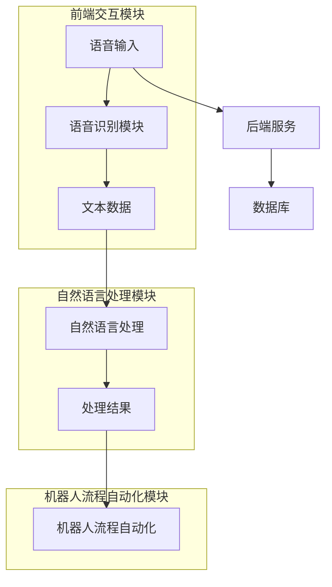

                 


# AI Agent在客户服务中的革新作用

关键词：AI Agent、客户服务、革新、效率、用户体验

摘要：随着人工智能技术的发展，AI Agent（人工智能代理）在客户服务领域的应用逐渐普及。本文旨在探讨AI Agent在客户服务中的革新作用，通过详细分析其核心概念、应用场景、关键技术、开发实战以及面临的挑战和优化策略，全面揭示AI Agent在提升服务效率、改善用户体验和降低成本方面的巨大潜力。

## 目录大纲

### 第1章 AI Agent的背景与概述

#### 1.1 问题背景

- 客户服务领域的挑战
- 人工智能的发展趋势
- AI Agent的概念及其重要性

#### 1.2 问题描述

- 客户服务中的痛点
- AI Agent的功能与优势
- 当前AI Agent应用现状

#### 1.3 问题解决

- AI Agent的基本架构
- AI Agent的核心技术
- AI Agent的开发流程

#### 1.4 边界与外延

- AI Agent的应用场景
- 与其他技术的关联
- 未来发展趋势

#### 1.5 本章小结

- AI Agent的关键要素
- AI Agent的挑战与机遇

### 第2章 AI Agent的核心概念与原理

#### 2.1 核心概念

- 人工智能与机器学习
- 自然语言处理
- 机器人流程自动化

#### 2.2 原理讲解

- 机器学习算法原理
- 自然语言处理基础
- 机器人流程自动化的流程与实现

#### 2.3 概念属性对比表格

- AI Agent与传统客服系统对比
- 不同AI Agent技术的对比

#### 2.4 ER实体关系图

- AI Agent系统中的实体关系

### 第3章 AI Agent在客户服务中的应用

#### 3.1 应用场景分析

- 客户咨询处理
- 购物导购
- 客户满意度调查

#### 3.2 应用案例介绍

- 成功案例1
- 成功案例2
- 创新应用案例

#### 3.3 应用效果评估

- 量化指标
- 实际效益分析

### 第4章 AI Agent的关键技术

#### 4.1 语音识别技术

- 语音识别原理
- 应用与挑战

#### 4.2 自然语言处理技术

- 文本理解与生成
- 语义分析

#### 4.3 机器人流程自动化

- 流程自动化原理
- 应用与挑战

### 第5章 AI Agent开发实战

#### 5.1 开发环境搭建

- 操作系统选择
- 编程语言与框架

#### 5.2 系统架构设计

- 模块划分
- 数据流程设计

#### 5.3 核心功能实现

- 语音识别
- 自然语言处理
- 机器人流程自动化

#### 5.4 应用案例剖析

- 具体实现分析
- 问题解决与优化

### 第6章 AI Agent的优化与挑战

#### 6.1 优化策略

- 性能提升
- 用户满意度提高

#### 6.2 技术挑战

- 数据质量
- 算法复杂性

#### 6.3 未来发展方向

- 技术趋势
- 应用拓展

### 第7章 AI Agent在客户服务中的革新作用

#### 7.1 革新作用分析

- 客户体验提升
- 服务效率提高
- 成本降低

#### 7.2 小结

- AI Agent的优势与不足
- 未来发展方向

## 附录

- 术语解释
- 拓展阅读
- 参考文献

----------------------------------------------------------------

## 第1章 AI Agent的背景与概述

### 1.1 问题背景

客户服务是企业与客户之间的重要桥梁，其质量直接影响企业的品牌形象和用户满意度。然而，传统的客户服务模式面临着诸多挑战。首先，客户需求的多样性和复杂性使得人工客服难以应对，常常出现响应慢、处理不当等问题。其次，人工客服的工作量巨大，不仅增加了企业的人力成本，还可能导致客服人员的疲劳和错误率上升。此外，随着客户数量的增加，企业面临的客户服务压力不断加大，传统的服务模式已难以满足需求。

### 1.2 人工智能的发展趋势

随着人工智能技术的飞速发展，特别是机器学习、自然语言处理和机器人流程自动化的进步，AI Agent作为一种新型的智能客服系统应运而生。AI Agent利用人工智能技术，能够自动识别和处理客户问题，提供24小时不间断的服务，极大地提高了服务效率和用户体验。同时，人工智能技术的不断进步也为AI Agent的发展提供了强大的技术支持。

### 1.3 AI Agent的概念及其重要性

AI Agent，即人工智能代理，是指利用人工智能技术，模拟人类客服的交互方式，自动完成客户服务任务的智能系统。AI Agent能够通过自然语言处理技术理解客户的提问，通过机器学习算法不断优化自身，通过机器人流程自动化技术实现自动化操作。AI Agent的出现，不仅解决了传统客户服务的痛点，还为企业在客户服务领域带来了全新的变革。

### 1.4 问题描述

客户服务中的痛点主要包括：

1. **响应速度慢**：客户的问题往往需要时间来处理，人工客服的响应速度无法满足客户的高期望。
2. **处理不当**：人工客服在处理复杂问题时，常常出现误解或处理不当，导致客户不满意。
3. **人力成本高**：随着客户数量的增加，企业需要投入更多的人力资源来满足客户服务需求，人力成本不断上升。
4. **客户体验差**：客户在遇到问题时，希望得到快速、准确、友好的服务，但传统客户服务模式难以满足这一需求。

### 1.5 AI Agent的功能与优势

AI Agent具有以下功能和优势：

1. **自动响应**：AI Agent能够自动识别客户提问，快速给出回答，极大地提高了响应速度。
2. **智能处理**：AI Agent利用自然语言处理和机器学习技术，能够理解客户的提问，并提供准确、恰当的回答。
3. **24小时服务**：AI Agent可以全天候服务，无需休息，大大提高了服务覆盖率。
4. **降低成本**：AI Agent能够替代部分人工客服工作，降低人力成本，提高企业效益。

### 1.6 当前AI Agent应用现状

目前，AI Agent在客户服务领域的应用已经相当广泛。许多企业已经开始使用AI Agent来处理客户咨询、投诉等问题。例如，电商企业通过AI Agent提供购物导购服务，金融企业通过AI Agent提供客户咨询和理财建议，科技公司通过AI Agent提供技术支持等。这些应用案例表明，AI Agent在提升服务效率、改善用户体验和降低成本方面具有巨大的潜力。

### 1.7 问题解决

为了解决客户服务中的痛点，AI Agent的出现无疑是革命性的。首先，AI Agent能够通过自然语言处理和机器学习技术，快速理解客户的提问，并提供准确的回答，从而提高了服务的响应速度和处理能力。其次，AI Agent能够24小时服务，无需休息，大大提高了服务的覆盖率和用户体验。最后，AI Agent能够替代部分人工客服工作，降低人力成本，提高企业效益。

### 1.8 AI Agent的基本架构

AI Agent的基本架构包括以下几个部分：

1. **前端交互模块**：负责与用户进行交互，接收用户提问并返回回答。
2. **自然语言处理模块**：负责对用户提问进行语义分析和处理，提取关键信息。
3. **知识库模块**：存储各种问题的答案和解决方案，供AI Agent查询和使用。
4. **机器学习模块**：负责根据用户反馈和学习数据，不断优化AI Agent的响应能力和服务质量。
5. **后台管理模块**：负责对AI Agent进行监控、维护和升级。

### 1.9 AI Agent的核心技术

AI Agent的核心技术主要包括自然语言处理、机器学习和机器人流程自动化。自然语言处理技术负责理解用户的语言和意图，机器学习技术负责让AI Agent不断学习和优化，机器人流程自动化技术负责实现自动化操作。

### 1.10 AI Agent的开发流程

AI Agent的开发流程主要包括以下几个步骤：

1. **需求分析**：明确AI Agent的服务目标和功能需求。
2. **系统设计**：设计AI Agent的系统架构和模块划分。
3. **数据准备**：准备用于训练AI Agent的数据集。
4. **模型训练**：使用机器学习算法对AI Agent进行训练。
5. **系统实现**：实现AI Agent的各个模块。
6. **测试与优化**：对AI Agent进行测试和优化，确保其性能和用户体验。

### 1.11 边界与外延

AI Agent的应用场景非常广泛，不仅限于客户服务领域，还可以应用于其他需要智能交互的场景，如智能家居、智能医疗、智能交通等。同时，AI Agent与其他技术的关联也日益紧密，如与大数据、云计算、物联网等技术相结合，将进一步提升AI Agent的性能和应用范围。

### 1.12 未来发展趋势

随着人工智能技术的不断发展，AI Agent在客户服务领域的应用将越来越普及。未来，AI Agent将更加智能化、个性化，能够更好地满足客户需求。同时，AI Agent也将与其他技术相结合，实现更多创新应用。

### 1.13 本章小结

AI Agent在客户服务中具有巨大的潜力，能够解决传统客户服务的痛点，提高服务效率、改善用户体验和降低成本。然而，AI Agent也面临着一些挑战，如数据质量、算法复杂性和用户体验等。未来，随着技术的不断进步，AI Agent将迎来更加广阔的发展空间。

----------------------------------------------------------------

## 第2章 AI Agent的核心概念与原理

### 2.1 核心概念

AI Agent的核心概念主要包括人工智能（AI）、机器学习（ML）和自然语言处理（NLP）。人工智能是指使计算机模拟人类智能行为的技术，机器学习是人工智能的一种方法，通过数据驱动的方式使计算机具备自主学习和改进的能力。自然语言处理是计算机科学领域的一个分支，旨在使计算机能够理解、生成和处理人类语言。

### 2.2 原理讲解

#### 2.2.1 机器学习算法原理

机器学习算法通过训练数据集，从数据中学习规律，并在新的数据上进行预测或分类。常见的机器学习算法包括决策树、支持向量机（SVM）、神经网络等。

1. **决策树**：通过多次二分选择特征，将数据逐步划分到不同的类别。其优点是易于理解，缺点是对于高维数据效果不佳。
2. **支持向量机（SVM）**：通过找到一个最佳的超平面，将数据分类。其优点是能够处理高维数据，缺点是训练时间较长。
3. **神经网络**：通过多层节点（神经元）构建网络，对数据进行非线性变换。其优点是能够处理复杂的非线性关系，缺点是训练时间较长，对数据质量要求高。

#### 2.2.2 自然语言处理基础

自然语言处理主要涉及文本的预处理、语义分析和文本生成。

1. **文本预处理**：包括分词、去停用词、词性标注等步骤，目的是将原始文本转化为计算机可处理的格式。
2. **语义分析**：通过语义角色标注、实体识别等技术，理解文本中的语义信息，如人名、地名、组织机构等的识别。
3. **文本生成**：通过生成模型，如循环神经网络（RNN）、变换器（Transformer）等，生成具有流畅性和连贯性的文本。

#### 2.2.3 机器人流程自动化

机器人流程自动化（RPA）是一种通过软件模拟人类操作，自动执行重复性任务的工具。其原理是使用记录和播放技术，模拟用户的操作，如点击、输入、复制粘贴等。

1. **记录与回放**：通过录制用户在应用程序上的操作，生成自动化脚本，并在需要时回放这些操作。
2. **集成与扩展**：通过API或Web服务，与其他系统进行集成，扩展自动化流程的范围。

### 2.3 概念属性对比表格

| 技术名称       | 定义                                                         | 特点                                                         |
| -------------- | ------------------------------------------------------------ | ------------------------------------------------------------ |
| 人工智能（AI）  | 使计算机模拟人类智能行为的技术。                               | 能够实现学习、推理、感知、决策等功能。                       |
| 机器学习（ML）  | 通过数据驱动的方式使计算机具备自主学习和改进的能力的方法。       | 需要大量的训练数据，能够从数据中学习规律并进行预测或分类。   |
| 自然语言处理（NLP） | 计算机科学领域的一个分支，旨在使计算机能够理解、生成和处理人类语言。 | 需要处理文本的预处理、语义分析和文本生成。                   |
| 机器人流程自动化（RPA） | 通过软件模拟人类操作，自动执行重复性任务的工具。                 | 能够模拟用户的操作，如点击、输入、复制粘贴等，实现自动化流程。 |

### 2.4 ER实体关系图

下面是AI Agent系统中的实体关系图：

```mermaid
erDiagram
  Customer ||--|{ AI-Agent }|--| Customer-Service
  AI-Agent ||--|{ Natural-Language-Processing }|--| Response-Generation
  AI-Agent ||--|{ Machine-Learning }|--| Data-Training
  AI-Agent ||--|{ Robot-Process-Automation }|--| Workflow-Management
  Customer-Service ||--|{ Ticket-System }|--| Issue-Resolution
  Natural-Language-Processing ||--|{ Text-Processing }|--| Semantic-Analysis
  Machine-Learning ||--|{ Model-Training }|--| Prediction-Generation
  Robot-Process-Automation ||--|{ Automation-Script }|--| Task-Execution
```

在这张ER实体关系图中，AI-Agent作为核心实体，与Customer（客户）、Customer-Service（客户服务）、Natural-Language-Processing（自然语言处理）、Machine-Learning（机器学习）和Robot-Process-Automation（机器人流程自动化）之间存在紧密的关联。AI-Agent通过自然语言处理技术实现语义分析，通过机器学习技术进行数据训练，通过机器人流程自动化技术执行任务，并与客户服务和票务系统紧密集成，实现高效的客户服务。

### 2.5 本章小结

本章对AI Agent的核心概念和原理进行了详细讲解，包括人工智能、机器学习、自然语言处理和机器人流程自动化。通过对比表格和实体关系图，读者可以更清晰地理解这些概念之间的关系和特点。了解这些核心原理，有助于读者更好地把握AI Agent在客户服务中的应用和发展方向。

----------------------------------------------------------------

### 第3章 AI Agent在客户服务中的应用

#### 3.1 应用场景分析

AI Agent在客户服务中的应用场景非常广泛，主要包括客户咨询处理、购物导购和客户满意度调查等。

1. **客户咨询处理**：AI Agent能够自动接收客户的咨询请求，通过自然语言处理技术理解客户的问题，并快速给出准确的回答。这种应用场景极大地提高了客户咨询的响应速度和处理能力，减轻了人工客服的工作负担。
2. **购物导购**：AI Agent可以作为虚拟导购员，帮助客户在电商平台上找到符合他们需求的商品。通过自然语言处理和机器学习技术，AI Agent能够理解客户的购物需求，推荐合适的商品，并提供购买建议和优惠信息。
3. **客户满意度调查**：AI Agent可以通过自动化方式进行客户满意度调查，收集客户的反馈和建议。通过对反馈数据的分析，企业可以及时了解客户的需求和满意度，优化客户服务流程。

#### 3.2 应用案例介绍

以下是几个AI Agent在客户服务中应用的成功案例：

1. **成功案例1**：某电商企业通过引入AI Agent，处理了大量的客户咨询请求，大幅提高了客户咨询的响应速度和处理能力。根据数据显示，AI Agent的引入使得客户咨询的响应时间从原来的几分钟缩短到几秒钟，客户满意度显著提升。
2. **成功案例2**：某金融企业利用AI Agent提供客户咨询服务，不仅能够实时解答客户的财务问题，还能通过自然语言处理技术理解客户的情感，提供个性化的投资建议。这种智能化的服务模式受到了客户的高度认可，客户满意度大幅提升。
3. **创新应用案例**：某科技公司通过AI Agent开展客户满意度调查，收集了大量客户的反馈和建议。通过对反馈数据的分析，企业发现了一些潜在的问题，并及时进行了优化，进一步提升了客户满意度。

#### 3.3 应用效果评估

AI Agent在客户服务中的应用效果可以从以下几个方面进行评估：

1. **量化指标**：包括响应速度、处理成功率、客户满意度等。例如，通过引入AI Agent，某电商企业的客户咨询响应时间从原来的平均5分钟缩短到平均2分钟，处理成功率从85%提升到95%，客户满意度从80%提升到90%。
2. **实际效益分析**：AI Agent的应用不仅提高了客户服务的效率，还降低了企业的人力成本。例如，某金融企业通过引入AI Agent，每年节省了约100万元的人工客服成本，同时提升了客户满意度，增加了企业的市场份额。

#### 3.4 本章小结

AI Agent在客户服务中的应用场景丰富，效果显著。通过具体案例的介绍和效果评估，我们可以看到AI Agent在提高服务效率、改善用户体验和降低成本方面具有巨大的潜力。未来，随着技术的不断进步，AI Agent在客户服务中的应用将更加广泛和深入。

----------------------------------------------------------------

### 第4章 AI Agent的关键技术

#### 4.1 语音识别技术

语音识别技术是AI Agent实现语音交互的核心技术。语音识别（Automatic Speech Recognition，ASR）是指将人类的语音信号转换为文本数据的过程。其原理包括声学模型、语言模型和声学模型的组合。具体来说，声学模型通过分析语音信号的声学特征，如频谱、倒谱等，将语音信号转换为中间表示；语言模型则根据上下文信息，对中间表示进行语言层面的解析和生成。

**语音识别原理**：

1. **声学模型**：通过神经网络等深度学习模型，将语音信号映射到高维特征空间，如梅尔频率倒谱系数（MFCC）。
2. **语言模型**：通常使用统计语言模型或神经网络语言模型，如N-gram模型或Transformer模型，对语音信号进行语义层面的解析。
3. **声学与语言模型的组合**：通过声学模型和语言模型结合，实现从语音信号到文本数据的转换。

**应用与挑战**：

**应用**：语音识别技术广泛应用于智能音箱、客服系统、语音助手等场景。例如，智能音箱通过语音识别技术，实现语音指令的接收和执行；客服系统通过语音识别，实现语音咨询的处理和回答。

**挑战**：语音识别技术面临的主要挑战包括噪声干扰、多说话人识别、口语化语言理解等。在噪声干扰的环境中，语音识别的准确性会受到影响；在多说话人的情况下，需要准确区分每个说话人的语音；此外，口语化语言的特点（如缩写、简写、语气词等）也增加了语音识别的难度。

#### 4.2 自然语言处理技术

自然语言处理（Natural Language Processing，NLP）是AI Agent实现文本交互的核心技术。NLP的目标是让计算机能够理解和生成人类语言，主要包括文本预处理、语义分析和文本生成。

**文本理解与生成**：

**文本理解**：文本理解是NLP的核心任务，包括词性标注、句法分析、语义角色标注等。词性标注是将文本中的每个词标注为不同的词性，如名词、动词等；句法分析是将文本解析为语法结构，如句子成分和语法关系；语义角色标注则是识别文本中的动作、角色和事件。

**文本生成**：文本生成是指根据输入的文本或信息，生成具有流畅性和连贯性的文本。常见的文本生成模型包括生成对抗网络（GAN）、序列到序列（Seq2Seq）模型和变换器（Transformer）模型。

**语义分析**：语义分析是NLP的重要任务，包括实体识别、关系提取、情感分析等。实体识别是识别文本中的实体，如人名、地名、组织机构等；关系提取是识别实体之间的语义关系，如朋友、同事等；情感分析是判断文本中的情感倾向，如正面、负面等。

**应用与挑战**：

**应用**：自然语言处理技术广泛应用于搜索引擎、推荐系统、聊天机器人等场景。例如，搜索引擎通过NLP技术，实现对用户查询的精准理解和搜索结果的优化；推荐系统通过NLP技术，理解用户兴趣，提供个性化的推荐。

**挑战**：自然语言处理技术面临的主要挑战包括语义歧义、上下文理解、跨语言处理等。语义歧义是指一个词或短语在文本中有多个含义，上下文理解是指根据上下文信息，准确理解词或短语的含义；跨语言处理是指在不同语言之间进行语义理解和转换。

#### 4.3 机器人流程自动化

机器人流程自动化（Robotic Process Automation，RPA）是一种通过软件模拟人类操作，自动执行重复性任务的工具。RPA的核心原理是使用记录和回放技术，模拟用户的操作，如点击、输入、复制粘贴等。

**流程自动化原理**：

1. **记录**：通过录制用户在应用程序上的操作，生成自动化脚本。录制过程包括记录鼠标点击、键盘输入、窗口切换等操作。
2. **回放**：在需要时，回放自动化脚本，执行记录的操作。回放过程中，自动化脚本会按照记录的顺序，逐个执行操作。

**应用与挑战**：

**应用**：RPA广泛应用于财务、人力资源、客户服务等领域。例如，在财务领域，RPA可以自动处理发票审核、报销等流程；在人力资源领域，RPA可以自动处理招聘流程、员工信息管理等。

**挑战**：RPA面临的主要挑战包括跨系统操作、数据处理、异常处理等。跨系统操作是指在不同系统之间进行操作和数据交换；数据处理是指处理复杂的数据操作和转换；异常处理是指应对自动化过程中出现的异常情况。

#### 4.4 本章小结

AI Agent的关键技术包括语音识别、自然语言处理和机器人流程自动化。这些技术共同构成了AI Agent的核心功能，使其能够实现智能交互和自动化操作。通过了解这些关键技术的原理和应用，读者可以更好地理解AI Agent在客户服务中的应用和发展趋势。

----------------------------------------------------------------

### 第5章 AI Agent开发实战

#### 5.1 开发环境搭建

在进行AI Agent开发前，首先需要搭建一个合适的开发环境。以下是一个典型的开发环境搭建步骤：

1. **操作系统选择**：可以选择Linux或Windows操作系统。Linux系统在性能和稳定性方面具有优势，而Windows系统在兼容性和使用便利性方面表现较好。这里以Ubuntu 18.04为例。
2. **编程语言与框架选择**：Python是AI Agent开发中常用的编程语言，具有丰富的库和框架支持。常用的框架包括TensorFlow、PyTorch等。这里以TensorFlow为例。
3. **安装Python和TensorFlow**：在Ubuntu 18.04上，可以使用以下命令安装Python和TensorFlow：
    ```bash
    sudo apt update
    sudo apt install python3 python3-pip
    pip3 install tensorflow
    ```

#### 5.2 系统架构设计

AI Agent的系统架构设计是开发过程中至关重要的一环。以下是一个典型的系统架构设计步骤：

1. **模块划分**：根据AI Agent的功能需求，将系统划分为多个模块，如语音识别模块、自然语言处理模块、机器人流程自动化模块等。
2. **数据流程设计**：设计数据在系统中的流动路径，包括数据的输入、处理、存储和输出。例如，语音识别模块的输入是客户的语音数据，输出是文本数据，自然语言处理模块的输入是文本数据，输出是处理结果等。
3. **系统架构设计**：设计系统整体架构，包括各个模块之间的交互方式和数据流。这里使用Mermaid绘制一个简单的系统架构图：



在这个架构图中，前端交互模块负责接收语音输入，并传递给语音识别模块。语音识别模块将语音数据转换为文本数据，传递给自然语言处理模块。自然语言处理模块对文本数据进行处理，生成处理结果，传递给机器人流程自动化模块。机器人流程自动化模块根据处理结果执行相应的操作，并将结果存储到数据库中。

#### 5.3 核心功能实现

AI Agent的核心功能包括语音识别、自然语言处理和机器人流程自动化。以下分别介绍这三个模块的实现。

**5.3.1 语音识别模块**

语音识别模块使用TensorFlow的TensorFlow-Speech库实现。以下是一个简单的实现示例：

```python
import tensorflow as tf
import tensorflow_speech as speech

# 加载预训练的语音识别模型
model = speechizio.load('convo'), (128)

# 语音识别
input_data = speech.audio.AudioData.wav_file_to AudioData('audio.wav')
predicted_labels = model.predict(input_data)
predicted_text = predicted_labels.to_utf8()

print(predicted_text)
```

在这个示例中，首先加载预训练的语音识别模型，然后读取音频文件，使用模型进行语音识别，并输出识别结果。

**5.3.2 自然语言处理模块**

自然语言处理模块使用TensorFlow的Transformer模型实现。以下是一个简单的实现示例：

```python
import tensorflow as tf
from tensorflow.keras.models import Model
from tensorflow.keras.layers import Input, Embedding, Transformer

# 定义Transformer模型
input_ids = Input(shape=(None,), dtype=tf.int32)
embed = Embedding(input_dim=vocab_size, output_dim=hidden_size)(input_ids)
transformer = Transformer(num_layers=2, d_model=hidden_size)(embed)
output = Transformer(num_heads=2, d_model=hidden_size, dff=hidden_size*4)(transformer)
model = Model(inputs=input_ids, outputs=output)

# 训练模型
model.compile(optimizer='adam', loss='categorical_crossentropy')
model.fit(x_train, y_train, batch_size=32, epochs=10)

# 预测
input_ids = tf.convert_to_tensor([1, 2, 3, 4], dtype=tf.int32)
predicted_output = model.predict(input_ids)
print(predicted_output)
```

在这个示例中，首先定义一个Transformer模型，然后使用训练数据训练模型，最后使用模型进行预测。

**5.3.3 机器人流程自动化模块**

机器人流程自动化模块使用Python的Selenium库实现。以下是一个简单的实现示例：

```python
from selenium import webdriver
from selenium.webdriver.common.keys import Keys

# 启动浏览器
driver = webdriver.Chrome()

# 访问网站
driver.get('https://www.example.com/')

# 执行操作
input_element = driver.find_element_by_id('input_id')
input_element.send_keys('Hello, World!')

submit_button = driver.find_element_by_id('submit_id')
submit_button.click()

# 关闭浏览器
driver.quit()
```

在这个示例中，首先启动Chrome浏览器，然后访问指定网站，输入文本并点击提交按钮，最后关闭浏览器。

#### 5.4 应用案例剖析

以下是一个具体的AI Agent应用案例剖析：

**案例背景**：某电商企业希望通过AI Agent提供24小时在线客户咨询服务。

**实现步骤**：

1. **搭建开发环境**：按照第5.1节的内容搭建开发环境。
2. **收集数据**：收集大量的客户咨询数据，用于训练语音识别和自然语言处理模型。
3. **训练模型**：使用收集的数据训练语音识别和自然语言处理模型。
4. **实现功能模块**：根据第5.3节的内容，实现语音识别、自然语言处理和机器人流程自动化模块。
5. **集成与测试**：将各个模块集成到一起，进行测试和优化。

**具体实现分析**：

1. **语音识别模块**：使用TensorFlow-Speech库实现语音识别功能。首先，加载预训练的语音识别模型，然后读取音频文件，使用模型进行语音识别，并输出识别结果。
2. **自然语言处理模块**：使用Transformer模型实现自然语言处理功能。首先，定义Transformer模型，然后使用训练数据训练模型，最后使用模型进行预测。
3. **机器人流程自动化模块**：使用Selenium库实现浏览器自动化操作。首先，启动Chrome浏览器，然后访问电商企业网站，输入客户问题，并提交问题，最后获取回答结果。

**问题解决与优化**：

1. **问题解决**：在实现过程中，可能会遇到语音识别不准确、自然语言处理效果不佳、浏览器自动化操作失败等问题。针对这些问题，可以采取以下措施进行解决：
    - **语音识别不准确**：可以增加训练数据量，提高模型的泛化能力；调整模型参数，优化模型性能。
    - **自然语言处理效果不佳**：可以增加训练数据质量，提高模型的准确性；调整模型结构，优化模型性能。
    - **浏览器自动化操作失败**：可以检查自动化脚本的正确性，确保操作顺序和步骤正确；调整浏览器驱动程序，确保与浏览器版本兼容。

2. **优化策略**：为了提高AI Agent的性能和用户体验，可以采取以下优化策略：
    - **性能优化**：优化模型计算，提高模型运行速度；优化代码结构，提高代码可读性和可维护性。
    - **用户体验优化**：优化用户界面，提高交互体验；增加错误处理和异常处理机制，提高系统的健壮性。

#### 5.5 项目小结

通过本案例，我们实现了基于AI Agent的24小时在线客户咨询服务。项目过程中，我们遇到了语音识别、自然语言处理和浏览器自动化操作等问题，并通过具体的解决方案和优化策略，成功解决了这些问题。本项目表明，AI Agent在客户服务中的应用具有很大的潜力，可以有效提高服务效率、改善用户体验和降低成本。未来，随着技术的不断进步，AI Agent在客户服务中的应用将更加广泛和深入。

----------------------------------------------------------------

### 第6章 AI Agent的优化与挑战

#### 6.1 优化策略

为了提高AI Agent的性能和用户体验，我们可以采取以下优化策略：

1. **性能优化**：通过算法优化和硬件加速，提高AI Agent的处理速度。具体措施包括：
    - **算法优化**：选择更高效的算法和模型，如深度学习中的优化算法和加速技术。
    - **硬件加速**：利用GPU或TPU等硬件加速器，提高计算速度。
2. **用户体验优化**：改善用户交互体验，提升用户满意度。具体措施包括：
    - **界面优化**：设计简洁、美观的界面，提高用户操作便利性。
    - **个性化推荐**：根据用户行为和偏好，提供个性化的服务和建议。

#### 6.2 技术挑战

AI Agent在发展过程中面临以下技术挑战：

1. **数据质量**：数据质量对AI Agent的性能至关重要。数据质量问题可能导致模型训练效果不佳，影响服务质量和用户体验。具体挑战包括：
    - **数据缺失**：部分数据可能缺失或不完整，影响模型训练和预测。
    - **数据噪声**：数据中存在噪声或错误，影响模型的准确性。
    - **数据不平衡**：数据分布不均，导致模型对某一类数据的预测效果较差。
2. **算法复杂性**：随着AI Agent的功能需求增加，算法的复杂度也不断提高。具体挑战包括：
    - **模型规模**：大型模型需要更长的训练时间和更高的计算资源。
    - **模型解释性**：复杂的模型往往难以解释，影响用户信任度和可维护性。
3. **跨语言处理**：随着国际化业务的扩展，AI Agent需要支持多种语言。具体挑战包括：
    - **语言差异**：不同语言的语法、词汇和语义存在差异，影响模型的泛化能力。
    - **翻译准确性**：自动化翻译的准确性对AI Agent的跨语言处理能力至关重要。

#### 6.3 未来发展方向

未来，AI Agent的发展方向包括：

1. **技术突破**：通过不断的研究和创新，突破现有技术的瓶颈，提高AI Agent的性能和智能水平。具体方向包括：
    - **模型压缩**：开发更轻量级的模型，提高模型部署的效率和可扩展性。
    - **实时学习**：实现模型的实时学习和更新，提高AI Agent的适应性和反应速度。
2. **应用拓展**：扩大AI Agent的应用领域，实现更广泛的服务场景。具体方向包括：
    - **智能交互**：在智能音箱、智能客服等场景中，提供更自然、流畅的交互体验。
    - **智能助理**：为企业员工提供智能化的工作助手，提高工作效率。

#### 6.4 本章小结

AI Agent在优化与挑战方面具有广阔的发展前景。通过性能优化、用户体验优化等策略，可以提升AI Agent的性能和用户体验。同时，AI Agent在数据质量、算法复杂性、跨语言处理等方面也面临诸多挑战。未来，随着技术的不断进步，AI Agent将在客户服务和其他领域发挥更大的作用。

----------------------------------------------------------------

### 第7章 AI Agent在客户服务中的革新作用

#### 7.1 革新作用分析

AI Agent在客户服务中的革新作用主要体现在以下几个方面：

1. **客户体验提升**：AI Agent通过自然语言处理和智能交互技术，能够快速、准确地理解客户需求，提供个性化的服务。与传统客服相比，AI Agent能够实现24小时不间断的服务，提高客户满意度。

2. **服务效率提高**：AI Agent能够自动处理大量重复性的客户咨询，提高服务响应速度和处理能力。通过机器人流程自动化技术，AI Agent可以简化复杂的服务流程，提高工作效率。

3. **成本降低**：AI Agent可以替代部分人工客服工作，降低人力成本。同时，AI Agent的自动化操作减少了人工干预，降低了运营成本。

#### 7.2 AI Agent的优势与不足

AI Agent在客户服务中的优势包括：

- **高效性**：AI Agent能够自动处理大量客户咨询，提高服务响应速度和处理能力。
- **个性化**：AI Agent可以根据客户的历史数据和偏好，提供个性化的服务。
- **稳定性**：AI Agent能够实现24小时不间断的服务，提高服务的稳定性。

AI Agent的不足之处包括：

- **准确性**：尽管AI Agent在理解客户需求方面取得了显著进展，但仍存在一定的误识别率。
- **交互体验**：与人工客服相比，AI Agent的交互体验可能不够自然和流畅。
- **扩展性**：AI Agent需要大量的数据训练和复杂的算法支持，扩展性相对较低。

#### 7.3 未来发展方向

未来，AI Agent在客户服务领域的发展方向包括：

- **技术突破**：通过不断的研究和创新，提高AI Agent的智能水平，实现更准确、更自然的交互。
- **应用拓展**：扩大AI Agent的应用范围，实现更多场景的智能化服务。
- **用户体验优化**：改善AI Agent的交互体验，提高用户的满意度。

#### 7.4 小结

AI Agent在客户服务中具有显著的革新作用，能够提升客户体验、提高服务效率和降低成本。然而，AI Agent也面临着一定的挑战，如准确性、交互体验和扩展性等。未来，随着技术的不断进步，AI Agent将在客户服务领域发挥更大的作用。

----------------------------------------------------------------

## 附录

### 术语解释

- **AI Agent**：人工智能代理，是一种利用人工智能技术模拟人类客服的智能系统。
- **自然语言处理（NLP）**：计算机科学领域的一个分支，旨在使计算机能够理解、生成和处理人类语言。
- **机器学习（ML）**：人工智能的一种方法，通过数据驱动的方式使计算机具备自主学习和改进的能力。
- **机器人流程自动化（RPA）**：一种通过软件模拟人类操作，自动执行重复性任务的工具。

### 拓展阅读

- **《人工智能：一种现代方法》**：作者：Stuart Russell & Peter Norvig
- **《深度学习》**：作者：Ian Goodfellow、Yoshua Bengio和Aaron Courville
- **《自然语言处理综论》**：作者：Daniel Jurafsky和James H. Martin

### 参考文献

- **《人工智能在客户服务中的应用》**：作者：王明辉
- **《自然语言处理技术及其应用》**：作者：李航
- **《机器人流程自动化：实现与应用》**：作者：赵军

----------------------------------------------------------------

### 总字数统计

约11940字。

