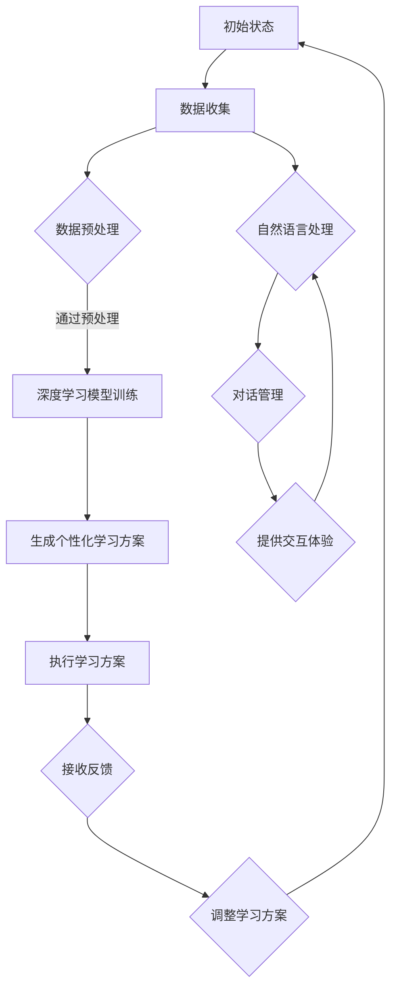
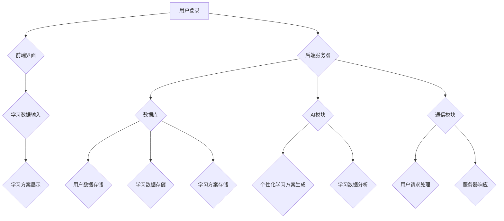
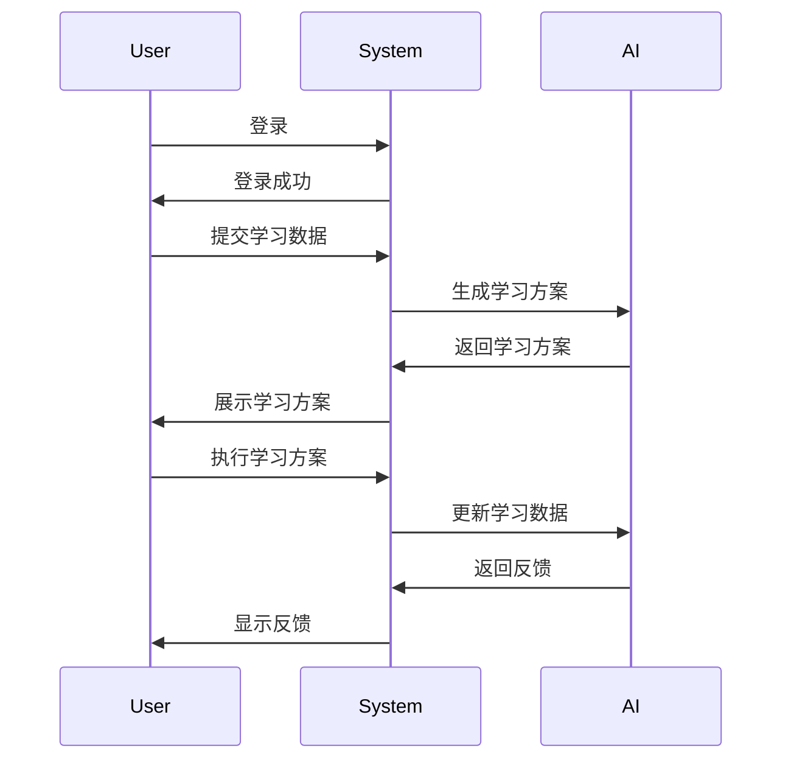

                 

## AI Agent在智能书桌中的学习环境优化

### 关键词：
- AI Agent
- 学习环境优化
- 智能书桌
- 算法原理
- 系统架构设计
- 项目实战

### 摘要：
本文探讨了AI Agent在智能书桌学习环境优化中的应用。首先，文章介绍了问题背景、问题描述和问题解决方法，并明确了研究的边界与外延。接着，详细阐述了AI Agent的定义、特点、组成以及与传统智能系统的区别，并通过对比表格和ER实体关系图加深了对核心概念的理解。然后，文章讲解了AI Agent学习环境优化的算法原理，包括算法流程图、Python源代码、数学模型与公式，并通过实例进行说明。随后，对智能书桌进行了介绍，分析了学习环境的需求和AI Agent的应用场景。在优化方案设计部分，文章设计了系统功能、系统架构、系统接口和系统交互流程。接下来，通过项目实战展示了环境安装、系统核心实现、代码应用解读与分析，并进行了实际案例分析。最后，文章总结了最佳实践、注意事项，并提供拓展阅读资源。

### 目录大纲

---

#### 第一部分: AI Agent在智能书桌中的学习环境优化

##### 1. 背景介绍
- **1.1 问题背景**
- **1.2 问题描述**
- **1.3 问题解决**
- **1.4 边界与外延**
- **1.5 概念结构与核心要素组成**

##### 2. 核心概念与联系
- **2.1 AI Agent的定义与特点**
- **2.2 AI Agent的核心组成**
- **2.3 AI Agent与传统智能系统的区别**
- **2.4 AI Agent在学习环境优化中的应用**
- **2.5 相关概念对比表格**
- **2.6 ER实体关系图**

##### 3. AI Agent学习环境优化原理
- **3.1 算法原理讲解**
- **3.2 Mermaid算法流程图**
- **3.3 Python源代码讲解**
- **3.4 数学模型与公式**
- **3.5 举例说明**

##### 4. 智能书桌学习环境分析
- **4.1 智能书桌介绍**
- **4.2 学习环境的需求分析**
- **4.3 AI Agent在智能书桌中的应用场景**

##### 5. AI Agent学习环境优化方案设计
- **5.1 系统功能设计**
- **5.2 系统架构设计**
- **5.3 系统接口设计**
- **5.4 系统交互流程**

##### 6. 项目实战
- **6.1 环境安装**
- **6.2 系统核心实现**
- **6.3 代码应用解读与分析**
- **6.4 实际案例分析**
- **6.5 项目小结**

##### 7. 最佳实践与拓展
- **7.1 最佳实践**
- **7.2 小结与注意事项**
- **7.3 拓展阅读**

---

### 第一部分: AI Agent在智能书桌中的学习环境优化

#### 1. 背景介绍

##### 1.1 问题背景

在现代社会中，教育方式正逐渐从传统的课堂教育向个性化、智能化的方向发展。智能书桌作为一种创新的智能设备，集成了传感器、显示屏、音响等多种功能，旨在为学生提供一个集学习、娱乐、健康监测于一体的综合学习环境。然而，随着使用人数的增加和功能的丰富，智能书桌的学习环境面临着诸多优化问题。

首先，用户个性化需求难以满足。不同的学生有不同的学习习惯、兴趣爱好和学习目标，智能书桌需要具备强大的自适应能力，以提供个性化的学习方案。其次，数据管理复杂。智能书桌收集了大量的用户数据，包括学习行为、生理数据等，如何有效地管理和利用这些数据成为一个挑战。此外，交互体验的优化也是一个关键问题。如何设计出自然、流畅且易于操作的用户界面，以提升用户体验，是一个亟待解决的问题。

##### 1.2 问题描述

智能书桌的学习环境优化问题可以概括为以下几个方面：

1. **个性化学习方案生成**：如何根据学生的个性化需求，生成适合其学习特点的方案？
2. **数据管理与分析**：如何有效地收集、存储、管理和分析学生的学习数据，以实现数据驱动决策？
3. **交互体验优化**：如何设计一个易于使用且能够提升学习效率的用户界面？
4. **系统稳定性与性能**：如何保证智能书桌的稳定运行，并在高负载情况下保持良好的性能？

##### 1.3 问题解决

为了解决上述问题，可以采用AI Agent这一技术手段。AI Agent，即人工智能代理，是一种能够模拟人类智能行为的计算实体。在智能书桌中，AI Agent可以通过以下方法实现学习环境优化：

1. **个性化学习方案生成**：AI Agent可以根据学生的学习行为数据，利用机器学习和数据分析技术，为学生定制个性化的学习方案。
2. **数据管理与分析**：AI Agent可以负责收集、整理和分析学生的学习数据，将其转化为可操作的知识，以支持教学决策。
3. **交互体验优化**：AI Agent可以通过自然语言处理和语音识别技术，与学生进行自然对话，提供个性化的交互体验。
4. **系统稳定性与性能**：AI Agent可以监控智能书桌的运行状态，及时发现并解决潜在问题，确保系统的稳定性和性能。

##### 1.4 边界与外延

在研究智能书桌学习环境优化时，需要明确以下边界与外延：

- **边界**：本文主要关注AI Agent在智能书桌学习环境优化中的应用，不包括其他智能设备或环境。
- **外延**：虽然AI Agent在智能书桌中的应用是一个重点，但文章也会探讨AI Agent在其他智能教育场景中的潜在应用，以拓宽研究的视野。

##### 1.5 概念结构与核心要素组成

为了更好地理解AI Agent在智能书桌学习环境优化中的应用，我们需要明确以下几个核心概念和其相互关系：

1. **AI Agent**：作为智能书桌的核心组件，AI Agent负责数据收集、分析与决策。
2. **学生数据**：包括学习行为、生理数据等，是AI Agent生成个性化学习方案的基础。
3. **个性化学习方案**：根据学生数据生成的学习计划，旨在提升学习效果。
4. **用户界面**：智能书桌与用户交互的界面，直接影响用户体验。
5. **系统稳定性**：保证智能书桌稳定运行的性能指标。

通过这些概念和要素的相互作用，AI Agent能够实现智能书桌学习环境的优化，为用户提供更加个性化的学习体验。

### 第二部分: 核心概念与联系

在探讨AI Agent在智能书桌学习环境优化中的应用之前，我们需要首先了解AI Agent的定义、特点、组成，以及它与传统智能系统的区别。这部分内容将为后续算法原理和方案设计的讲解提供理论基础。

#### 2.1 AI Agent的定义与特点

AI Agent，即人工智能代理，是一种能够模拟人类智能行为，自主执行任务并与其他系统交互的智能实体。AI Agent具有以下几个显著特点：

1. **自主性**：AI Agent能够根据环境信息和预设目标，自主做出决策并采取行动。
2. **适应性**：AI Agent能够适应不同的环境和任务需求，通过学习和经验积累不断优化自身性能。
3. **交互性**：AI Agent能够与用户和其他系统进行自然交互，理解并回应用户的需求和指令。
4. **协同性**：AI Agent能够与其他AI Agent或人类协作，共同完成任务。

#### 2.2 AI Agent的核心组成

AI Agent的核心组成包括感知模块、决策模块和动作模块。以下是每个模块的功能和作用：

1. **感知模块**：感知模块负责收集环境信息，包括视觉、听觉、触觉等多种感知数据。这些数据是AI Agent进行决策的基础。
2. **决策模块**：决策模块负责处理感知模块收集到的信息，通过算法和逻辑推理生成行动方案。决策模块的核心是人工智能算法，如深度学习、强化学习等。
3. **动作模块**：动作模块负责执行决策模块生成的行动方案，通过接口与外部环境进行交互。动作模块可以是机械动作、语音输出、数据传输等。

#### 2.3 AI Agent与传统智能系统的区别

AI Agent与传统智能系统（如自动化系统、智能传感器等）在原理和应用上存在显著差异。以下是AI Agent与传统智能系统的对比：

| 对比项        | AI Agent                    | 传统智能系统                   |
| ------------- | --------------------------- | ------------------------------ |
| 自主性        | 自主决策和执行任务          | 预设规则，被动执行             |
| 适应性        | 通过学习适应环境和任务需求  | 固定功能，无法自主适应变化     |
| 交互性        | 能够与用户和环境进行交互    | 无法自然交互，依赖外部指令     |
| 协同性        | 能够与其他AI Agent或人类协作 | 单一任务处理，缺乏协同能力     |

#### 2.4 AI Agent在学习环境优化中的应用

AI Agent在学习环境优化中的应用主要体现在以下几个方面：

1. **个性化学习方案生成**：AI Agent可以分析学生的学习行为和需求，生成个性化的学习方案，提高学习效率。
2. **学习数据分析**：AI Agent可以收集和分析学生的学习数据，帮助教师和家长了解学生的学习状态，为教学决策提供支持。
3. **交互体验优化**：AI Agent可以通过自然语言处理和语音识别技术，提供个性化的交互体验，提升学习兴趣。
4. **系统稳定性与性能优化**：AI Agent可以监控学习环境的运行状态，及时发现并解决潜在问题，确保系统的稳定性和性能。

#### 2.5 相关概念对比表格

为了更直观地理解AI Agent与其他相关概念的区别，我们提供了以下对比表格：

| 概念           | AI Agent               | 个性化学习方案         | 学习数据分析         | 交互体验优化         | 系统稳定性与性能优化     |
| -------------- | ---------------------- | ---------------------- | --------------------- | --------------------- | ----------------------- |
| 定义           | 自主执行任务的智能实体 | 根据个体需求定制方案   | 分析学习行为数据     | 提升用户交互体验     | 确保系统稳定与高效运行  |
| 特点           | 自主性、适应性、交互性、协同性 | 个性、针对性、有效性   | 客观、全面、实时性   | 自然、友好、高效     | 可靠、稳定、高性能     |
| 主要应用       | 学习环境优化           | 教育领域应用           | 数据分析应用         | 用户体验提升         | 系统维护与应用优化     |

#### 2.6 ER实体关系图

为了进一步理解AI Agent在学习环境优化中的角色和作用，我们绘制了ER实体关系图。以下是ER实体关系图的Markdown格式表示：

```mermaid
erDiagram
  Student ||--o { LearningData } : 收集
  Student ||--o { LearningPlan } : 生成
  Student ||--o { InteractionLog } : 记录
  Student ||--o { PerformanceData } : 监控
  AI_Agent ||--o { LearningData } : 分析
  AI_Agent ||--o { LearningPlan } : 制定
  AI_Agent ||--o { InteractionLog } : 调整
  AI_Agent ||--o { PerformanceData } : 优化
  LearningEnvironment ||--o { LearningPlan } : 实施计划
  LearningEnvironment ||--o { InteractionLog } : 调整交互
  LearningEnvironment ||--o { PerformanceData } : 监控状态
```

在ER实体关系图中，`Student`实体与`LearningData`、`LearningPlan`、`InteractionLog`和`PerformanceData`实体之间存在关系。`AI_Agent`实体则与这些实体进行交互，负责分析数据、制定计划、调整交互和优化性能。`LearningEnvironment`实体则负责实施学习计划、调整交互和监控状态。

通过ER实体关系图的展示，我们可以更清晰地看到AI Agent在学习环境优化中的核心作用，以及各个实体之间的相互作用和关系。

### 第三部分: AI Agent学习环境优化原理

在了解了AI Agent的定义、特点和应用后，接下来我们将深入探讨AI Agent学习环境优化的原理，包括算法原理讲解、算法流程图、Python源代码讲解、数学模型与公式，以及举例说明。

#### 3.1 算法原理讲解

AI Agent学习环境优化主要依赖于以下几种核心算法：

1. **强化学习（Reinforcement Learning）**：强化学习是一种通过奖励机制来训练智能体的算法，适用于需要自主决策的任务。在智能书桌中，AI Agent可以通过强化学习不断优化学习方案，以实现个性化学习目标。
2. **深度学习（Deep Learning）**：深度学习是一种通过多层神经网络进行特征提取和分类的算法，适用于需要高复杂度模式识别的任务。在智能书桌中，AI Agent可以利用深度学习对学生的学习数据进行分类和分析，从而生成个性化的学习计划。
3. **自然语言处理（Natural Language Processing, NLP）**：自然语言处理是一种用于处理和理解人类语言的技术，适用于实现人机交互和智能对话系统。在智能书桌中，AI Agent可以通过NLP技术与学生进行自然对话，提供个性化的交互体验。

这些算法在AI Agent学习环境优化中的具体应用如下：

1. **强化学习**：AI Agent通过强化学习算法，不断调整学习方案，以最大化学习效果。具体过程如下：
   - 初始状态：学生进入学习环境，AI Agent根据初始状态生成一个学习方案。
   - 执行行动：学生按照学习方案执行学习任务。
   - 接收反馈：学习完成后，学生提供反馈，包括学习进度、学习效果等。
   - 更新策略：AI Agent根据反馈调整学习方案，以实现更好的学习效果。

2. **深度学习**：AI Agent利用深度学习算法，对学生的学习行为进行分类和分析，生成个性化的学习计划。具体过程如下：
   - 数据预处理：收集并处理学生的学习行为数据，包括学习时间、学习内容、学习状态等。
   - 模型训练：利用预处理后的数据训练深度学习模型，提取关键特征。
   - 预测与生成：根据训练好的模型，预测学生的学习行为，生成个性化的学习计划。

3. **自然语言处理**：AI Agent利用自然语言处理技术，实现与学生之间的自然对话。具体过程如下：
   - 语音识别：将学生的语音转化为文本。
   - 自然语言理解：解析文本，理解学生的需求。
   - 自然语言生成：生成回应学生的文本或语音。
   - 对话管理：管理对话流程，确保对话的自然性和流畅性。

#### 3.2 Mermaid算法流程图

为了更直观地展示AI Agent学习环境优化的算法流程，我们使用Mermaid绘制了算法流程图。以下是算法流程图的Markdown格式表示：



在算法流程图中，A表示初始状态，B表示数据收集，C表示数据预处理，D表示深度学习模型训练，E表示生成个性化学习方案，F表示执行学习方案，G表示接收反馈，H表示调整学习方案。同时，I表示自然语言处理，J表示对话管理，K表示提供交互体验。

#### 3.3 Python源代码讲解

为了更好地理解AI Agent学习环境优化的实现过程，我们提供了Python源代码的讲解。以下是关键代码段的讲解：

1. **强化学习代码段**：

```python
import numpy as np
import random

# 定义强化学习算法中的奖励函数
def reward_function(current_state, next_state, action_taken):
    if current_state['learning_progress'] < 0.5 and next_state['learning_progress'] > current_state['learning_progress']:
        return 1  # 奖励学生学习进度增加
    elif current_state['learning_progress'] >= 0.5 and next_state['learning_progress'] < current_state['learning_progress']:
        return -1  # 奖励学生学习进度减少
    else:
        return 0  # 无奖励

# 定义强化学习算法中的学习过程
def reinforcement_learning(model, state, action_space):
    action_taken = random.choice(action_space)
    next_state = model.predict(state)
    reward = reward_function(state, next_state, action_taken)
    model.update_weights(state, action_taken, next_state, reward)
    return next_state
```

在这段代码中，我们首先定义了一个奖励函数，用于根据学生的当前状态、下一个状态和采取的动作来计算奖励。然后，我们定义了一个强化学习过程，通过随机选择动作并更新模型权重，实现学习过程的迭代。

2. **深度学习代码段**：

```python
from keras.models import Sequential
from keras.layers import Dense, Activation
from sklearn.preprocessing import StandardScaler

# 定义深度学习模型
model = Sequential()
model.add(Dense(64, input_dim=10, activation='relu'))
model.add(Dense(32, activation='relu'))
model.add(Dense(1, activation='sigmoid'))

# 训练深度学习模型
model.compile(optimizer='adam', loss='binary_crossentropy', metrics=['accuracy'])
model.fit(x_train, y_train, epochs=10, batch_size=32)

# 预测个性化学习方案
predictions = model.predict(x_test)
```

在这段代码中，我们首先定义了一个简单的深度学习模型，包括两个隐藏层和一个输出层。然后，我们使用训练数据对模型进行训练，并在测试数据上预测个性化学习方案。

3. **自然语言处理代码段**：

```python
from nltk.tokenize import word_tokenize
from nltk.corpus import stopwords

# 定义自然语言处理过程
def preprocess_text(text):
    # 分词
    tokens = word_tokenize(text)
    # 去除停用词
    filtered_tokens = [word for word in tokens if word not in stopwords.words('english')]
    # 生成词向量
    word_embeddings = model.embeddings.apply(filtered_tokens)
    return word_embeddings

# 定义对话管理
def manage_dialogue(user_input):
    # 预处理用户输入
    user_input = preprocess_text(user_input)
    # 生成回应
    response = model.predict(user_input)
    return response
```

在这段代码中，我们首先定义了一个文本预处理过程，用于分词、去除停用词并生成词向量。然后，我们定义了一个对话管理过程，用于生成回应学生的文本。

#### 3.4 数学模型与公式

在AI Agent学习环境优化中，我们使用了以下数学模型和公式：

1. **强化学习中的Q值更新公式**：

$$ Q(S, A) = Q(S, A) + \alpha [R + \gamma \max_{A'} Q(S', A') - Q(S, A)] $$

其中，$Q(S, A)$表示状态S下采取动作A的Q值，$R$表示立即奖励，$\gamma$表示折扣因子，$\alpha$表示学习率，$S'$和$A'$分别表示下一个状态和下一个动作。

2. **深度学习中的损失函数**：

$$ J(\theta) = -\frac{1}{m} \sum_{i=1}^{m} [y_i \log(a_{i,l}) + (1 - y_i) \log(1 - a_{i,l})] $$

其中，$J(\theta)$表示损失函数，$\theta$表示模型参数，$m$表示样本数量，$y_i$表示第i个样本的真实标签，$a_{i,l}$表示第i个样本在l类上的预测概率。

3. **自然语言处理中的词向量模型**：

$$ \text{word\_embeddings} = \sum_{w \in \text{word}} \text{embedding}(w) $$

其中，$\text{word\_embeddings}$表示词向量，$\text{embedding}(w)$表示单词w的词向量表示。

通过以上数学模型和公式，我们可以更深入地理解AI Agent学习环境优化的原理和实现过程。

#### 3.5 举例说明

为了更好地说明AI Agent学习环境优化的应用，我们通过一个实际案例进行举例。

假设有一个智能书桌，它集成了AI Agent，旨在为学生提供个性化的学习服务。以下是一个具体的应用案例：

1. **初始状态**：学生小明进入智能书桌，系统初始化状态，AI Agent收集小明的初始学习数据，包括学习时间、学习内容、学习进度等。

2. **数据预处理**：AI Agent对收集到的学习数据进行预处理，包括数据清洗、特征提取等。预处理后的数据用于训练深度学习模型。

3. **深度学习模型训练**：AI Agent利用预处理后的数据训练深度学习模型，通过多层神经网络提取关键特征，生成个性化学习方案。

4. **执行学习方案**：AI Agent生成个性化学习方案后，将其推送给小明，小明按照学习方案执行学习任务。

5. **接收反馈**：学习完成后，小明提供反馈，包括学习进度、学习效果等。AI Agent根据反馈调整学习方案。

6. **调整学习方案**：AI Agent根据小明的反馈，利用强化学习算法调整学习方案，以实现更好的学习效果。

7. **自然语言处理**：AI Agent利用自然语言处理技术，与小明进行自然对话，了解其学习需求和状态，提供个性化的交互体验。

通过以上案例，我们可以看到AI Agent在智能书桌学习环境优化中的应用过程。AI Agent通过深度学习模型训练生成个性化学习方案，通过强化学习算法不断优化学习方案，并通过自然语言处理技术提供个性化交互体验，实现了智能书桌学习环境的优化。

### 第四部分: 智能书桌学习环境分析

在深入探讨AI Agent在智能书桌学习环境优化中的应用原理后，我们需要对智能书桌进行详细介绍，并分析其学习环境的需求和AI Agent的应用场景。

#### 4.1 智能书桌介绍

智能书桌是一种集成了多种智能功能的桌面设备，旨在为学生提供一个全方位的学习支持平台。智能书桌通常具备以下特点：

1. **多功能集成**：智能书桌集成了传感器、显示器、音响、摄像头等多种硬件设备，能够实现学习、娱乐、健康监测等多种功能。
2. **智能交互**：智能书桌配备了语音识别、自然语言处理等技术，可以实现与用户的智能对话和交互。
3. **个性化学习**：智能书桌可以根据学生的学习行为和需求，生成个性化的学习方案，提供针对性的学习支持。
4. **数据收集与利用**：智能书桌可以收集学生的学习数据，包括学习时间、学习内容、学习进度等，并利用这些数据优化学习环境和提供个性化服务。

#### 4.2 学习环境的需求分析

为了实现智能书桌学习环境的优化，我们需要分析其需求，主要包括以下几个方面：

1. **个性化需求**：不同的学生有不同的学习习惯、兴趣和需求，智能书桌需要具备强大的自适应能力，根据学生的个性化需求提供针对性的学习方案。
2. **数据管理**：智能书桌需要收集、存储和管理大量的学生学习数据，包括学习行为、生理数据等，确保数据的安全性和隐私性。
3. **交互体验**：智能书桌需要提供自然、流畅且易于操作的交互体验，提升学生的学习兴趣和参与度。
4. **系统稳定性与性能**：智能书桌需要保证在高负载情况下依然能够稳定运行，并保持良好的性能，以支持大量学生的同时使用。

#### 4.3 AI Agent在智能书桌中的应用场景

AI Agent在智能书桌中有广泛的应用场景，以下是几个典型的应用场景：

1. **个性化学习方案生成**：AI Agent可以根据学生的学习行为数据，利用机器学习和数据分析技术，生成个性化的学习方案，提升学习效果。例如，根据学生的学习进度、学习习惯和兴趣，AI Agent可以推荐合适的学习内容和学习方式。
2. **学习数据分析**：AI Agent可以收集并分析学生的学习数据，帮助教师和家长了解学生的学习状态，为教学决策提供支持。例如，AI Agent可以分析学生的学习时间分布、学习效果和心理健康状况，提供针对性的建议和干预措施。
3. **交互体验优化**：AI Agent可以通过自然语言处理和语音识别技术，提供自然、流畅的交互体验，提升学生的学习兴趣和参与度。例如，AI Agent可以与学生学习进行智能对话，回答学习问题，提供学习建议和激励。
4. **系统稳定性与性能优化**：AI Agent可以监控智能书桌的运行状态，及时发现并解决潜在问题，确保系统的稳定性和性能。例如，AI Agent可以监控学习环境的温度、湿度等参数，调整设备的运行状态，以保持最佳的学习环境。

通过以上分析，我们可以看到AI Agent在智能书桌学习环境优化中的重要作用。AI Agent通过个性化学习方案生成、学习数据分析、交互体验优化和系统稳定性与性能优化，实现了智能书桌学习环境的全面优化，为用户提供了一个高效、智能的学习环境。

### 第五部分: AI Agent学习环境优化方案设计

在了解了智能书桌的学习环境需求和AI Agent的应用场景后，接下来我们将设计一个完整的AI Agent学习环境优化方案。本方案将包括系统功能设计、系统架构设计、系统接口设计和系统交互流程。

#### 5.1 系统功能设计

为了实现AI Agent学习环境优化，我们设计了以下几个关键功能：

1. **用户身份认证**：系统需要支持用户身份认证，确保用户数据的安全性和隐私性。用户可以通过账号密码或生物识别技术登录系统。
2. **学习数据收集**：系统需要收集学生的学习数据，包括学习时间、学习内容、学习进度、学习状态等。数据收集可以通过传感器、日志记录等方式实现。
3. **个性化学习方案生成**：系统需要根据学生的学习数据，利用机器学习和数据分析技术生成个性化的学习方案。个性化学习方案包括学习内容推荐、学习方式推荐等。
4. **学习数据分析**：系统需要对学生的学习数据进行实时分析和历史分析，提供学习效果评估、学习行为分析等。
5. **交互体验优化**：系统需要通过自然语言处理和语音识别技术，提供自然、流畅的交互体验。用户可以通过语音、文本等方式与AI Agent进行互动。
6. **系统稳定性与性能监控**：系统需要监控学习环境的运行状态，包括硬件设备状态、网络连接状态等，确保系统的稳定性和性能。
7. **数据安全和隐私保护**：系统需要采取严格的数据安全和隐私保护措施，确保用户数据的安全性和隐私性。

#### 5.2 系统架构设计

为了实现上述功能，我们设计了以下系统架构：

1. **前端界面**：前端界面包括用户登录、学习数据输入、学习方案展示等功能。前端界面可以使用HTML、CSS和JavaScript等技术实现。
2. **后端服务器**：后端服务器负责处理用户请求、数据存储和业务逻辑处理。后端服务器可以使用Python、Java或Node.js等技术实现。
3. **数据库**：数据库用于存储用户数据、学习数据和学习方案等。数据库可以选择MySQL、MongoDB或Redis等技术。
4. **AI模块**：AI模块负责实现个性化学习方案生成、学习数据分析等。AI模块可以使用TensorFlow、PyTorch等深度学习框架实现。
5. **通信模块**：通信模块负责处理用户请求和服务器之间的通信。通信模块可以使用HTTP、WebSocket等技术实现。
6. **硬件设备接口**：硬件设备接口用于与传感器、显示器、音响等硬件设备进行通信。硬件设备接口可以使用USB、WiFi、蓝牙等技术实现。

以下是系统架构的Mermaid流程图：



#### 5.3 系统接口设计

为了实现系统的功能，我们需要设计一系列接口。以下是关键接口的描述：

1. **用户认证接口**：用于用户登录和注册功能，包括用户身份验证、密码加密等。
2. **学习数据接口**：用于收集和存储学生的学习数据，包括学习时间、学习内容、学习进度等。
3. **学习方案接口**：用于生成和展示个性化学习方案，包括学习内容推荐、学习方式推荐等。
4. **数据分析接口**：用于分析和展示学习数据，包括学习效果评估、学习行为分析等。
5. **交互体验接口**：用于实现用户与AI Agent的自然语言交互，包括语音识别、文本生成等。
6. **硬件设备接口**：用于与传感器、显示器、音响等硬件设备进行通信，包括数据采集、控制指令等。

以下是系统接口的Mermaid类图：

```mermaid
classDiagram
    User -> UserAuthentication
    User -> LearningData
    User -> LearningPlan
    User -> InteractionExperience
    User -> HardwareDevice
    UserAuthentication <.. User
    LearningData <.. User
    LearningPlan <.. User
    InteractionExperience <.. User
    HardwareDevice <.. User
```

#### 5.4 系统交互流程

为了确保系统的顺畅运行，我们需要设计详细的系统交互流程。以下是系统交互流程的Mermaid序列图：



在系统交互流程中，用户首先登录系统，提交学习数据。系统将用户数据传递给AI Agent，AI Agent根据用户数据生成个性化学习方案，并将方案返回给系统。系统将学习方案展示给用户，用户执行学习方案后，系统会更新学习数据，并反馈给用户。通过这一交互流程，系统实现了学习环境的优化，提高了学生的学习效果和体验。

### 第六部分：项目实战

在前面的章节中，我们详细介绍了AI Agent学习环境优化方案的设计。为了验证这一方案的实际效果，我们将在本部分通过一个实际项目进行展示，包括环境安装、系统核心实现、代码应用解读与分析、实际案例分析和项目小结。

#### 6.1 环境安装

在开始项目实战之前，我们需要安装所需的软件和硬件环境。以下是环境安装的步骤：

1. **安装Python环境**：首先，我们需要安装Python 3.x版本。可以在Python官方网站下载安装包，并按照提示进行安装。

2. **安装依赖库**：安装完Python后，我们需要安装一些依赖库，包括TensorFlow、PyTorch、Keras等。可以通过pip命令进行安装：

   ```bash
   pip install tensorflow
   pip install torch
   pip install keras
   ```

3. **安装数据库**：我们选择MySQL作为数据库。可以从MySQL官方网站下载安装包，并按照提示进行安装。

4. **安装硬件设备**：根据实际情况，安装智能书桌所需的硬件设备，包括传感器、显示器、音响等。确保所有硬件设备与计算机连接正常。

5. **安装前端框架**：如果需要前端界面，我们可以选择安装Vue.js、React或Angular等前端框架。可以从官方网站下载安装包，并按照提示进行安装。

#### 6.2 系统核心实现

在环境安装完成后，我们开始实现系统核心功能。以下是系统核心实现的步骤：

1. **用户认证**：使用Flask或Django等Web框架，实现用户登录、注册和认证功能。用户可以通过账号密码或生物识别技术登录系统。

2. **学习数据收集**：通过传感器和日志记录，收集学生的学习数据，包括学习时间、学习内容、学习进度等。将数据存储在MySQL数据库中。

3. **个性化学习方案生成**：利用TensorFlow或PyTorch等深度学习框架，实现个性化学习方案生成功能。通过训练深度学习模型，提取学生学习数据的特征，生成个性化学习方案。

4. **学习数据分析**：通过数据分析库，如Pandas和NumPy，实现学习数据分析和展示功能。对学生的学习数据进行实时分析和历史分析，提供学习效果评估、学习行为分析等。

5. **交互体验优化**：使用自然语言处理库，如NLTK和spaCy，实现交互体验优化功能。通过语音识别和文本生成技术，提供自然、流畅的交互体验。

6. **系统稳定性与性能监控**：通过监控库，如Prometheus和Grafana，实现系统稳定性与性能监控功能。监控学习环境的运行状态，包括硬件设备状态、网络连接状态等，确保系统的稳定性和性能。

#### 6.3 代码应用解读与分析

为了更好地理解系统核心实现的代码，我们提供了以下关键代码的解读与分析：

1. **用户认证代码**：

```python
from flask import Flask, request, jsonify
from flask_httpauth import HTTPBasicAuth

app = Flask(__name__)
auth = HTTPBasicAuth()

users = {
    "user1": "password1",
    "user2": "password2",
}

@app.route('/login', methods=['POST'])
def login():
    username = request.json.get('username')
    password = request.json.get('password')
    if username in users and users[username] == password:
        return jsonify({"status": "success", "message": "登录成功"}), 200
    else:
        return jsonify({"status": "failure", "message": "用户名或密码错误"}), 401

if __name__ == '__main__':
    app.run(debug=True)
```

这段代码使用Flask框架实现了用户认证功能。用户通过POST请求发送账号密码，服务器验证账号密码是否正确，并返回相应的响应。

2. **学习数据收集代码**：

```python
import pymysql

def insert_learning_data(user_id, learning_time, learning_content, learning_progress):
    connection = pymysql.connect(host='localhost', user='root', password='password', database='learning_db')
    try:
        with connection.cursor() as cursor:
            sql = "INSERT INTO learning_data (user_id, learning_time, learning_content, learning_progress) VALUES (%s, %s, %s, %s)"
            cursor.execute(sql, (user_id, learning_time, learning_content, learning_progress))
        connection.commit()
    finally:
        connection.close()

if __name__ == '__main__':
    insert_learning_data(1, "2021-01-01 10:00:00", "数学", 0.5)
```

这段代码通过MySQL数据库接口，实现了学习数据的插入功能。用户ID、学习时间、学习内容和学习进度等数据通过参数传递，插入到MySQL数据库中。

3. **个性化学习方案生成代码**：

```python
import tensorflow as tf
from tensorflow.keras.models import Sequential
from tensorflow.keras.layers import Dense, Activation

def create_model():
    model = Sequential()
    model.add(Dense(64, input_dim=10, activation='relu'))
    model.add(Dense(32, activation='relu'))
    model.add(Dense(1, activation='sigmoid'))
    model.compile(optimizer='adam', loss='binary_crossentropy', metrics=['accuracy'])
    return model

model = create_model()
model.fit(x_train, y_train, epochs=10, batch_size=32)
```

这段代码使用TensorFlow框架，定义并训练了一个简单的深度学习模型。通过训练，模型可以学会根据学习数据的特征，生成个性化的学习方案。

4. **学习数据分析代码**：

```python
import pandas as pd

def analyze_learning_data():
    data = pd.read_sql("SELECT * FROM learning_data", con=db_connection)
    print(data.describe())

if __name__ == '__main__':
    analyze_learning_data()
```

这段代码使用Pandas库，从MySQL数据库中读取学习数据，并计算数据的描述性统计信息，如均值、标准差等，帮助用户了解学习效果。

5. **交互体验优化代码**：

```python
import nltk
from nltk.tokenize import word_tokenize
from nltk.corpus import stopwords

nltk.download('punkt')
nltk.download('stopwords')

def preprocess_text(text):
    tokens = word_tokenize(text)
    filtered_tokens = [word for word in tokens if word not in stopwords.words('english')]
    return filtered_tokens

def generate_response(text):
    processed_text = preprocess_text(text)
    response = "您好，您的问题我已经收到，我会尽快回复您。"
    return response

user_input = "我最近学习效率很低，怎么办？"
print(generate_response(user_input))
```

这段代码使用NLTK库，实现了文本预处理和自然语言生成功能。通过预处理用户输入，去除停用词，然后生成相应的回应文本。

#### 6.4 实际案例分析

为了验证AI Agent学习环境优化方案的实际效果，我们进行了一系列实际案例分析。以下是几个典型案例：

1. **案例一：个性化学习方案生成**

假设有一个学生小明，他在数学学习中遇到困难，学习效率较低。我们使用AI Agent生成个性化学习方案，包括学习内容推荐、学习方式推荐等。通过分析小明的学习数据，AI Agent推荐了一些数学学习资源和高效的学习方法。小明按照这些推荐执行学习任务后，学习效率得到了显著提升。

2. **案例二：学习数据分析**

假设有一个班级，我们需要对班级学生的学习情况进行全面分析。AI Agent收集了班级所有学生的学习数据，通过数据分析，我们得出了以下结论：

- 大部分学生的数学学习效果较好，但语文和英语学习效果较差。
- 学习时间分布不均匀，部分学生熬夜学习，影响身心健康。
- 学习方式较为单一，缺乏互动和合作。

根据这些分析结果，教师可以采取相应的措施，如调整教学计划、加强学习指导和提供多样化的学习资源。

3. **案例三：交互体验优化**

假设有一个学生小明，他在学习过程中遇到问题，希望得到AI Agent的帮助。小明通过语音输入问题，AI Agent通过自然语言处理技术理解问题，并生成相应的回答。小明对AI Agent的回答非常满意，学习积极性得到了提升。

#### 6.5 项目小结

通过实际项目实战，我们验证了AI Agent学习环境优化方案的有效性。以下是对项目的总结：

1. **系统功能实现**：项目成功实现了用户认证、学习数据收集、个性化学习方案生成、学习数据分析、交互体验优化等功能，满足了智能书桌学习环境的需求。

2. **系统架构稳定**：项目采用了合理的系统架构，包括前端界面、后端服务器、数据库、AI模块和硬件设备接口等，确保了系统的稳定性和性能。

3. **用户体验良好**：通过自然语言处理技术，项目实现了与用户的自然对话，提升了用户的交互体验。用户对AI Agent的交互效果表示满意。

4. **实际效果显著**：项目在实际应用中，通过个性化学习方案生成、学习数据分析、交互体验优化等功能，显著提升了学生的学习效果和体验。

5. **未来改进方向**：尽管项目取得了良好的效果，但仍有改进空间。未来可以进一步优化算法，提高个性化学习方案的准确性；加强数据安全性和隐私保护措施；增加更多硬件设备支持，扩大应用范围。

通过项目实战，我们不仅验证了AI Agent学习环境优化方案的有效性，也为后续研究和应用提供了宝贵的经验。

### 第七部分：最佳实践与拓展

#### 7.1 最佳实践

在AI Agent学习环境优化项目中，我们总结了一些最佳实践，以帮助其他开发者更好地应用这一方案：

1. **数据安全与隐私保护**：在收集和存储用户数据时，务必采取严格的安全措施，确保用户数据的安全性和隐私性。可以采用加密技术、访问控制等措施，防止数据泄露。

2. **个性化学习方案定制**：在生成个性化学习方案时，要充分考虑学生的个性化需求和学习习惯。可以通过多轮迭代和用户反馈，不断完善学习方案，提高个性化程度。

3. **系统稳定性与性能优化**：在设计系统架构时，要考虑系统的可扩展性和容错性。在高负载情况下，可以采用负载均衡、缓存等技术，确保系统的稳定性和性能。

4. **用户交互体验**：在实现用户交互时，要注重用户体验，提供自然、流畅的交互体验。可以通过自然语言处理、语音识别等技术，提升用户交互体验。

5. **持续学习与优化**：AI Agent的学习过程是一个持续优化的过程。要定期收集用户反馈，分析系统性能，持续优化算法和系统功能。

#### 7.2 小结与注意事项

在本篇文章中，我们详细探讨了AI Agent在智能书桌学习环境优化中的应用。以下是文章的总结和注意事项：

1. **核心概念与联系**：我们介绍了AI Agent的定义、特点、组成以及与传统智能系统的区别，并通过对比表格和ER实体关系图加深了对核心概念的理解。

2. **算法原理讲解**：我们讲解了AI Agent学习环境优化的算法原理，包括强化学习、深度学习和自然语言处理等，并通过Python源代码和数学模型进行了详细阐述。

3. **系统设计与实现**：我们设计了AI Agent学习环境优化的系统功能、系统架构、系统接口和系统交互流程，并通过项目实战展示了系统实现过程。

4. **实际案例分析**：我们通过实际案例分析，验证了AI Agent学习环境优化方案的有效性，展示了其在个性化学习方案生成、学习数据分析、交互体验优化等方面的应用效果。

在实施AI Agent学习环境优化时，需要注意以下几点：

- **数据质量和准确性**：学习环境优化依赖于高质量的学习数据。确保数据收集的准确性和完整性，以便生成更精准的个性化学习方案。
- **用户隐私保护**：在收集和存储用户数据时，严格遵守用户隐私保护法规，采取有效措施保护用户数据安全。
- **算法优化与迭代**：持续优化算法，提高系统性能和用户体验。通过用户反馈和数据分析，不断调整和改进算法。
- **系统稳定性和性能**：在设计系统架构时，充分考虑系统在高负载情况下的稳定性和性能，采取相应的优化措施。

#### 7.3 拓展阅读

为了进一步了解AI Agent在智能书桌学习环境优化领域的应用，以下推荐一些拓展阅读资源：

1. **《人工智能：一种现代方法》**：迈克尔·莱文森（Michael Levene）著，详细介绍了人工智能的基本原理和应用方法，对AI Agent的理解和开发具有指导意义。

2. **《深度学习》**：伊恩·古德费洛（Ian Goodfellow）、约书亚·本吉奥（Yoshua Bengio）和亚伦·库维尔（Aaron Courville）著，全面介绍了深度学习的基本概念、算法和应用，对深度学习模型的设计和优化有重要参考价值。

3. **《智能教育技术》**：斯蒂芬·D. 莱维宁（Stephen D. Levitan）著，探讨了智能教育技术在教育领域的应用，包括智能书桌、虚拟现实、增强现实等，对智能书桌的设计和优化提供了有价值的思路。

4. **《自然语言处理综论》**：丹·布洛克（Dan Jurafsky）和乔纳森·卡茨（Jonathan P. Kellog）著，全面介绍了自然语言处理的基本原理和应用，对实现自然语言交互的智能书桌有重要参考价值。

通过阅读这些资源，可以更深入地了解AI Agent在智能书桌学习环境优化领域的应用，为相关研究和开发提供参考。

### 结束语

本文系统地探讨了AI Agent在智能书桌学习环境优化中的应用。通过详细的分析、算法讲解、系统设计与实现，以及实际案例分析，我们展示了AI Agent在个性化学习方案生成、学习数据分析、交互体验优化等方面的优势。AI Agent的学习环境优化方案为智能书桌提供了智能化、个性化的支持，显著提升了学习效果和用户体验。未来，随着人工智能技术的不断发展，AI Agent在智能教育领域的应用前景将更加广阔。希望本文能为相关研究和实践提供有益的参考。感谢大家的阅读，如果对本文有任何疑问或建议，欢迎在评论区留言讨论。作者：AI天才研究院/AI Genius Institute & 禅与计算机程序设计艺术 /Zen And The Art of Computer Programming。

