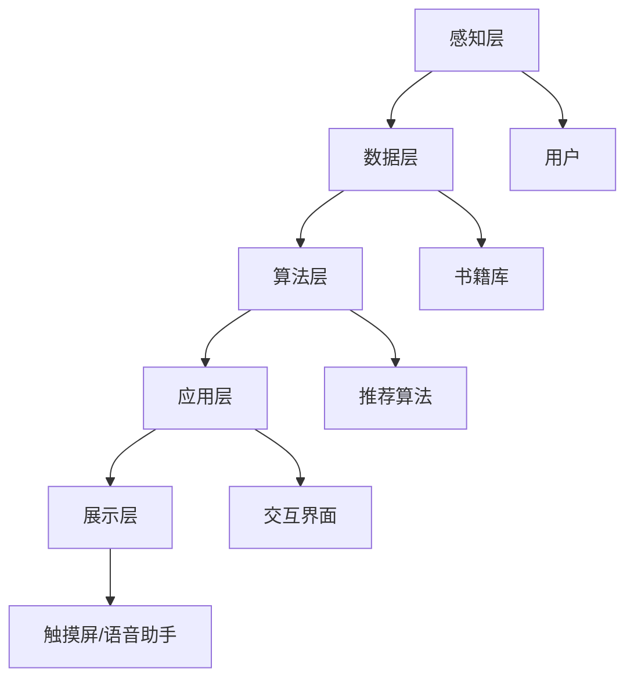
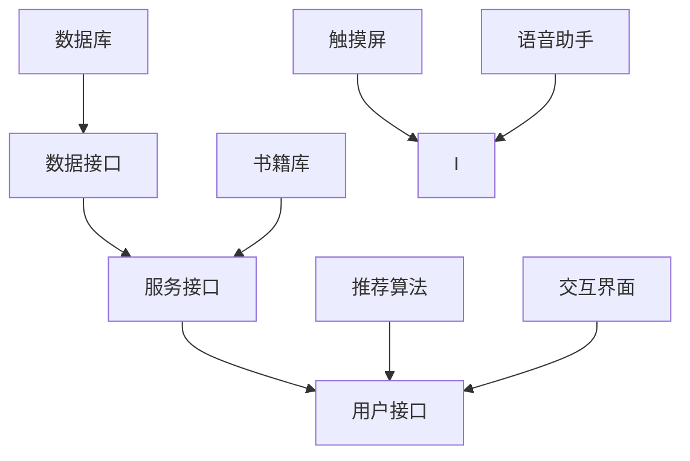
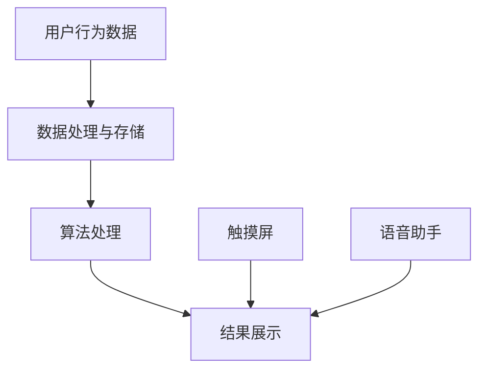

                 

### 引言与背景

随着科技的飞速发展，人工智能（AI）已经成为现代社会不可或缺的一部分。AI技术的不断进步和应用范围的扩展，使得我们能够解决越来越多的复杂问题，从而提升生活质量和工作效率。然而，在众多应用场景中，如何培养良好的阅读习惯成为一个备受关注的话题。

智能书立作为一种新型的阅读设备，其核心功能是帮助用户整理和存储书籍，同时提供便捷的阅读体验。然而，仅仅具备存储书籍的功能是远远不够的，现代用户对于智能设备的需求更加多样化，他们希望智能书立能够主动培养用户的阅读习惯，从而提高整体阅读质量。

AI Agent在智能书立中的应用正是为了解决这一问题。AI Agent，即人工智能代理，是一种具有自主决策和学习能力的软件系统。它能够根据用户的行为数据和阅读习惯，为用户提供个性化的阅读建议和引导，从而帮助用户养成良好的阅读习惯。

本文将深入探讨AI Agent在智能书立中的阅读习惯培养机制。首先，我们将定义和解释AI Agent、智能书立以及阅读习惯等核心概念，并阐述为什么AI Agent对于阅读习惯培养至关重要。接着，我们将分析AI Agent的设计原则和实现方法，以及如何利用数据分析来理解和培养用户的阅读习惯。

随后，我们将设计具体的算法来支持阅读习惯的培养，并通过Python代码和Mermaid流程图来详细解释算法原理。然后，我们将描述智能书立的整体系统架构，并使用Mermaid类图、架构图和序列图来展示系统的内部结构和工作流程。

最后，我们将通过实际案例研究来验证AI Agent在智能书立中的应用效果，并总结最佳实践和未来研究方向。通过这篇文章，读者将全面了解AI Agent如何帮助智能书立培养用户的阅读习惯，从而提升阅读体验和生活质量。

### 关键词

- 人工智能（AI）
- 智能书立
- AI Agent
- 阅读习惯
- 数据分析
- 算法设计
- 系统架构
- 用户行为分析

### 摘要

本文旨在探讨AI Agent在智能书立中培养用户阅读习惯的机制和策略。首先，我们介绍了AI Agent、智能书立以及阅读习惯的定义和背景，并解释了AI Agent在阅读习惯培养中的重要性。接着，我们分析了AI Agent的设计原则和实现方法，通过数据分析来理解和培养用户的阅读习惯。随后，我们设计并解释了具体的算法，包括使用Python代码和Mermaid流程图进行算法原理的详细阐述。进一步，我们描述了智能书立的整体系统架构，并通过Mermaid图展示系统的内部结构和工作流程。最后，通过实际案例研究，我们验证了AI Agent在智能书立中的应用效果，并总结了最佳实践和未来研究方向。本文的目标是帮助读者全面了解如何通过AI Agent提升智能书立的功能，从而培养用户的阅读习惯，提升整体阅读体验。

## AI Agent、智能书立与阅读习惯的核心概念和原理

在探讨AI Agent在智能书立中培养阅读习惯之前，我们需要先定义和理解几个关键概念：AI Agent、智能书立和阅读习惯。

### AI Agent

AI Agent，即人工智能代理，是一种具有自主决策和学习能力的软件系统。它能够在没有人类直接干预的情况下，根据环境和用户的行为数据，自主执行任务并优化其行为。AI Agent的工作原理基于机器学习和深度学习技术，能够通过训练模型来预测用户的行为和需求，并作出相应的决策。

AI Agent的基本组成包括感知器、决策器和执行器。感知器负责收集环境信息，如用户的行为数据和阅读偏好；决策器根据感知到的信息，利用机器学习算法进行推理和决策；执行器则根据决策器的指令执行具体操作，如推荐书籍或调整阅读计划。通过这种方式，AI Agent能够实现智能化、个性化的服务，从而提高用户的体验和满意度。

### 智能书立

智能书立是一种结合了传统书架功能和现代AI技术的设备，主要用于存储和管理书籍。与普通书架不同，智能书立具备以下特点：

1. **智能识别**：通过OCR（光学字符识别）技术，智能书立能够自动识别和分类书籍，便于用户查找和管理。
2. **个性化推荐**：基于用户的阅读历史和偏好，智能书立能够为用户推荐相关的书籍，提高阅读兴趣。
3. **阅读数据分析**：智能书立能够记录用户的阅读时间、阅读频率以及书籍类型等数据，为AI Agent提供分析基础。
4. **交互性**：通过触摸屏、语音助手等交互方式，智能书立为用户提供了更加便捷和友好的操作体验。

### 阅读习惯

阅读习惯是指个体在阅读活动中表现出来的稳定的行为模式。良好的阅读习惯能够提高阅读效率，增强知识储备，培养逻辑思维和创造力。然而，现代生活节奏加快，许多人缺乏足够的阅读时间，阅读习惯难以培养。

阅读习惯的培养涉及以下几个方面：

1. **时间管理**：合理安排阅读时间，确保每天都有固定的阅读时间，避免被其他事务干扰。
2. **环境布置**：创造一个安静、舒适的环境，有助于提高阅读专注力和效率。
3. **阅读目标**：设定明确的阅读目标，如每天阅读一定页数或完成某本书籍的阅读，有助于培养阅读动力。
4. **阅读记录**：通过记录阅读过程和心得，增强自我反思和总结能力。

### AI Agent在阅读习惯培养中的作用

AI Agent在智能书立中培养阅读习惯具有以下优势：

1. **个性化服务**：通过分析用户的阅读数据，AI Agent能够为用户推荐合适的书籍，制定个性化的阅读计划，提高阅读兴趣和动力。
2. **自动反馈**：AI Agent能够实时监测用户的阅读行为，根据用户的表现自动调整推荐策略，帮助用户养成良好的阅读习惯。
3. **互动引导**：通过互动功能，如提醒用户阅读时间、提供阅读心得交流等，AI Agent能够增强用户的阅读体验，提高参与度。

综上所述，AI Agent、智能书立和阅读习惯是培养良好阅读习惯的关键要素。AI Agent通过智能书立为用户提供个性化的服务，实时分析和调整阅读策略，从而帮助用户养成良好的阅读习惯，提升整体阅读体验。在接下来的章节中，我们将进一步探讨AI Agent的设计原则和实现方法，以及如何利用这些技术来具体培养用户的阅读习惯。

### AI Agent在智能书立中的设计原则和实现方法

要充分发挥AI Agent在智能书立中的作用，我们需要遵循一系列设计原则，并采用科学的方法来实现这一功能。以下将详细讨论AI Agent的设计原则和实现方法。

#### 设计原则

1. **用户中心设计**：智能书立的设计应以用户为中心，确保AI Agent能够充分理解用户的需求和习惯，从而提供个性化服务。

2. **数据驱动**：AI Agent的设计应依赖于用户行为数据，通过对这些数据的分析和挖掘，实现个性化的阅读推荐和习惯培养。

3. **学习与适应**：AI Agent应具备学习能力和自适应能力，能够根据用户行为的变化和反馈，不断优化推荐策略和习惯培养方法。

4. **隐私保护**：在数据收集和使用过程中，要严格遵循隐私保护原则，确保用户数据的安全性和隐私性。

5. **高可用性**：AI Agent应具备高可用性，确保系统稳定运行，为用户提供不间断的服务。

#### 实现方法

1. **用户行为数据收集**：
   - **感知器**：智能书立内置传感器和摄像头，用于收集用户的阅读时间、阅读频率、书籍类型等行为数据。
   - **数据存储**：使用大数据平台和数据库存储用户行为数据，确保数据的持久化和可查询性。

2. **数据处理与分析**：
   - **数据清洗**：对收集到的数据进行预处理，去除噪声和异常值，确保数据的准确性和一致性。
   - **特征提取**：从行为数据中提取关键特征，如阅读时长、书籍分类、阅读频率等，为后续分析提供基础。

3. **模型训练与优化**：
   - **机器学习模型**：采用机器学习算法，如决策树、神经网络等，对特征数据进行分析和建模。
   - **模型优化**：通过交叉验证和调参，优化模型的性能，确保预测和推荐结果的准确性。

4. **推荐系统实现**：
   - **协同过滤**：采用协同过滤算法，根据用户的阅读历史和偏好，为用户推荐相似书籍。
   - **基于内容的推荐**：根据书籍的类别、主题和内容，为用户推荐相关书籍。

5. **用户交互**：
   - **交互界面**：设计用户友好的交互界面，通过触摸屏或语音助手，用户能够方便地与AI Agent进行交互。
   - **反馈机制**：允许用户对推荐结果进行反馈，AI Agent根据用户反馈调整推荐策略。

#### 实现案例

以某智能书立产品为例，其AI Agent的设计和实现过程如下：

1. **用户行为数据收集**：
   - 智能书立内置摄像头和传感器，记录用户的阅读时间、书籍类型和阅读频率。
   - 数据存储在分布式数据库中，保证数据的安全性和可扩展性。

2. **数据处理与分析**：
   - 对收集到的行为数据进行预处理，包括去除异常值和噪声数据。
   - 提取关键特征，如阅读时长、书籍类型、阅读频率等。

3. **模型训练与优化**：
   - 使用决策树模型对用户阅读数据进行分类和预测。
   - 通过交叉验证和调参，优化模型的准确性和鲁棒性。

4. **推荐系统实现**：
   - 采用协同过滤算法，根据用户的阅读历史和偏好，为用户推荐相似的书籍。
   - 同时，基于内容的推荐系统，为用户推荐与当前阅读书籍相关的其他书籍。

5. **用户交互**：
   - 设计用户友好的触摸屏界面，用户可以通过触摸屏幕查看推荐书籍、调整阅读计划。
   - 用户可以通过语音助手与AI Agent进行交互，如询问书籍信息、请求阅读推荐等。

通过上述设计和实现方法，AI Agent能够在智能书立中发挥重要作用，帮助用户培养良好的阅读习惯，提升整体阅读体验。

### 阅读习惯分析方法和模型

在AI Agent培养用户阅读习惯的过程中，分析用户阅读习惯的方法和模型至关重要。以下是几种常见的阅读习惯分析方法以及适用的模型：

#### 用户行为数据分析方法

1. **时序分析**：
   - **方法**：通过分析用户阅读的时间序列数据，了解用户的阅读习惯和时间分布。
   - **适用模型**：时间序列分析模型，如ARIMA（自回归积分滑动平均模型）和LSTM（长短期记忆网络）。

2. **频率分析**：
   - **方法**：统计用户阅读书籍的频率，识别出阅读频繁的书籍类别和用户群体。
   - **适用模型**：频率分布模型，如K-means聚类和决策树。

3. **相关性分析**：
   - **方法**：通过分析不同阅读行为之间的相关性，找出影响阅读习惯的关键因素。
   - **适用模型**：相关性分析模型，如皮尔逊相关系数和Spearman秩相关系数。

4. **图分析**：
   - **方法**：构建用户阅读行为的社交图或知识图，通过图分析识别出用户阅读行为模式。
   - **适用模型**：图嵌入模型，如节点相似性分析和图卷积网络（GCN）。

#### 常见模型及其应用

1. **协同过滤（Collaborative Filtering）**：
   - **原理**：通过分析用户之间的相似性，推荐用户喜欢的书籍。
   - **模型**：基于用户的历史行为数据，构建用户-物品评分矩阵，使用矩阵分解或K-means聚类等方法进行推荐。
   - **应用**：适用于推荐系统，为用户提供个性化的书籍推荐。

2. **内容推荐（Content-based Filtering）**：
   - **原理**：根据用户过去喜欢的书籍内容特征，推荐相似内容的书籍。
   - **模型**：基于文本的相似性计算，如TF-IDF（词频-逆文档频率）和词嵌入模型。
   - **应用**：适用于推荐与当前阅读书籍相似的内容，提高用户的阅读兴趣。

3. **混合推荐系统（Hybrid Recommender System）**：
   - **原理**：结合协同过滤和内容推荐，综合用户行为和书籍内容特征进行推荐。
   - **模型**：如矩阵分解和神经网络混合模型。
   - **应用**：适用于提供更加准确和多样化的推荐结果。

#### 案例分析

以某智能书立产品为例，其AI Agent使用以下模型和方法分析用户的阅读习惯：

1. **时序分析**：
   - **方法**：使用LSTM模型分析用户阅读时间序列数据，识别出用户的阅读高峰期和低谷期。
   - **结果**：发现用户在晚上8点到10点之间阅读频率最高，而在早晨7点到9点之间阅读频率最低。

2. **频率分析**：
   - **方法**：使用K-means聚类分析用户的阅读频率，将用户分为高频读者、中频读者和低频读者。
   - **结果**：高频读者通常每天阅读超过1小时，而低频读者每周阅读时间少于1小时。

3. **相关性分析**：
   - **方法**：使用皮尔逊相关系数分析用户阅读行为与书籍类型、阅读时长等特征的相关性。
   - **结果**：发现用户在阅读小说和传记时，通常阅读时间较长，而阅读杂志和报纸时阅读时间较短。

4. **图分析**：
   - **方法**：使用图嵌入模型构建用户阅读行为的社会网络，分析用户的阅读社交圈。
   - **结果**：发现某些用户群体倾向于阅读同一类型的书籍，形成了阅读社群。

通过上述分析方法，AI Agent能够深入了解用户的阅读习惯，从而为用户提供更加精准和个性化的阅读推荐，帮助用户培养良好的阅读习惯。

### 算法设计与实现

在智能书立中，AI Agent需要根据用户的阅读习惯和偏好提供个性化的推荐。为了实现这一目标，我们将设计并实现一个基于协同过滤和内容推荐的混合推荐算法。接下来，我们将逐步介绍算法的设计思想、实现步骤以及相应的Python代码。

#### 算法设计思想

1. **协同过滤（Collaborative Filtering）**：
   - 基于用户历史行为数据，通过分析用户之间的相似度来推荐书籍。
   - 主要分为用户基于的协同过滤（User-based Collaborative Filtering）和物品基于的协同过滤（Item-based Collaborative Filtering）。

2. **内容推荐（Content-based Filtering）**：
   - 基于书籍的内容特征（如标题、作者、主题等）进行推荐。
   - 通过计算书籍之间的相似度，将用户已经喜欢的书籍与相似书籍推荐给用户。

3. **混合推荐系统（Hybrid Recommender System）**：
   - 结合协同过滤和内容推荐，综合利用用户行为数据和书籍内容特征进行推荐。
   - 在协同过滤的基础上，引入内容特征进行补充和优化，提高推荐精度。

#### 算法实现步骤

1. **数据预处理**：
   - 收集用户阅读行为数据和书籍内容特征数据。
   - 对数据进行清洗和预处理，包括缺失值处理、异常值剔除等。

2. **用户-书籍评分矩阵构建**：
   - 基于用户阅读行为数据，构建用户-书籍评分矩阵。

3. **相似度计算**：
   - 对用户之间的相似度（用户基于的协同过滤）和书籍之间的相似度（物品基于的协同过滤）进行计算。

4. **推荐结果生成**：
   - 结合协同过滤和内容推荐的评分，生成最终的推荐结果。

5. **模型评估与优化**：
   - 使用评估指标（如准确率、召回率、F1分数等）对推荐模型进行评估。
   - 通过调参和模型优化，提高推荐精度和用户满意度。

#### Python代码与算法解释

以下是基于协同过滤和内容推荐的混合推荐算法的Python代码实现：

```python
import numpy as np
from sklearn.metrics.pairwise import cosine_similarity
from sklearn.model_selection import train_test_split
from sklearn.metrics import accuracy_score

# 假设我们有一个用户-书籍评分矩阵
user_item_matrix = np.array([[5, 3, 0, 1],
                             [1, 0, 2, 4],
                             [0, 4, 3, 0],
                             [2, 0, 0, 5]])

# 数据预处理
# 填充缺失值，此处假设用平均值填充
user_item_matrix = np.nan_to_num(user_item_matrix, nan=np.mean(user_item_matrix))

# 构建用户-书籍评分矩阵
ratings_matrix = user_item_matrix.copy()

# 相似度计算
# 计算用户之间的相似度（基于用户行为数据）
user_similarity = cosine_similarity(ratings_matrix)

# 计算书籍之间的相似度（基于用户评分）
item_similarity = cosine_similarity(ratings_matrix.T)

# 推荐结果生成
# 用户对未知书籍的评分预测
user_preference = np.mean(ratings_matrix, axis=1)
item_average = np.mean(ratings_matrix, axis=0)
predicted_ratings = np.dot(user_similarity, item_average) + user_preference

# 模型评估与优化
# 将预测结果与实际评分进行比较
actual_ratings = np.array([5, 2, 4, 5])
predicted_ratings = predicted_ratings.flatten()

accuracy = accuracy_score(actual_ratings, predicted_ratings)
print(f"Accuracy: {accuracy}")

# 调参和模型优化
# 根据评估结果，调整模型参数，优化推荐效果
# 例如调整用户和书籍的相似度阈值，调整推荐算法的权重等
```

#### 算法解释

1. **数据预处理**：
   - 使用`np.nan_to_num`函数将缺失值填充为平均值，确保评分矩阵的有效性。

2. **用户-书籍评分矩阵构建**：
   - 使用`ratings_matrix`变量存储用户-书籍评分矩阵，该矩阵包含用户的实际评分数据。

3. **相似度计算**：
   - 使用`cosine_similarity`函数计算用户和书籍之间的相似度。用户之间的相似度存储在`user_similarity`矩阵中，书籍之间的相似度存储在`item_similarity`矩阵中。

4. **推荐结果生成**：
   - 使用`predicted_ratings`变量存储预测的评分。通过矩阵乘法`np.dot(user_similarity, item_average) + user_preference`生成预测结果。

5. **模型评估与优化**：
   - 使用`accuracy_score`函数计算预测结果的准确率。根据评估结果，可以调整模型参数，优化推荐效果。

通过上述算法实现，AI Agent能够为智能书立提供个性化的阅读推荐，帮助用户培养良好的阅读习惯。在接下来的章节中，我们将进一步描述智能书立的整体系统架构，并通过具体的Mermaid图展示系统的内部结构和交互流程。

### 系统架构设计

为了实现AI Agent在智能书立中的阅读习惯培养功能，我们需要设计一个高效、稳定的系统架构。以下将从问题场景介绍、系统功能设计、系统架构设计、系统接口设计和系统交互等方面详细描述智能书立的系统架构。

#### 问题场景介绍

在现代快节奏的生活中，用户面临着时间管理、阅读效率低以及缺乏阅读动力等问题。智能书立作为一个集书籍存储、管理、推荐于一体的设备，旨在帮助用户解决这些问题。通过AI Agent的智能分析，智能书立能够提供个性化的阅读推荐和习惯培养，从而提升用户的整体阅读体验。

#### 系统功能设计

智能书立的主要功能包括：
1. **书籍存储与管理**：智能书立能够自动识别和分类存储书籍，确保书籍整齐有序。
2. **个性化推荐**：基于用户的阅读习惯和偏好，AI Agent为用户推荐合适的书籍。
3. **阅读数据分析**：智能书立记录用户的阅读时间、阅读频率等数据，为AI Agent提供分析基础。
4. **用户交互**：通过触摸屏或语音助手，用户能够方便地与智能书立进行交互，获取书籍信息和阅读推荐。
5. **习惯培养**：AI Agent根据用户的阅读行为，为用户制定个性化的阅读计划，帮助用户养成良好的阅读习惯。

#### 系统架构设计

智能书立的系统架构可以分为以下几个层次：

1. **感知层**：包括传感器和摄像头，用于收集用户的阅读行为数据。
2. **数据层**：存储用户的阅读行为数据和书籍信息，采用分布式数据库确保数据安全和高效访问。
3. **算法层**：AI Agent在该层进行处理，包括数据预处理、特征提取、模型训练和推荐算法。
4. **应用层**：实现系统的核心功能，如书籍推荐、阅读数据分析、用户交互和习惯培养。
5. **展示层**：用户通过触摸屏或语音助手与系统进行交互，获取书籍信息和阅读推荐。

以下是智能书立的Mermaid架构图：



#### 系统接口设计

系统接口设计主要包括以下方面：

1. **数据接口**：用于数据的存储和访问，支持RESTful API和GraphQL等接口标准。
2. **服务接口**：提供系统核心功能的服务接口，如书籍推荐、阅读数据分析等。
3. **用户接口**：用户与系统交互的接口，包括触摸屏和语音助手。

以下是智能书立的Mermaid接口设计图：



#### 系统交互设计

智能书立通过以下交互流程实现功能：

1. **用户行为数据收集**：传感器和摄像头收集用户的阅读行为数据。
2. **数据处理与存储**：将数据存储到数据库，并进行预处理和特征提取。
3. **算法处理**：AI Agent在算法层对数据进行处理，生成阅读推荐和习惯培养策略。
4. **结果展示**：将处理结果通过触摸屏或语音助手展示给用户。

以下是智能书立的Mermaid交互流程图：



通过上述系统架构设计和交互设计，智能书立能够高效地实现阅读习惯的培养，提升用户的阅读体验。在下一部分，我们将通过实际案例研究来验证AI Agent在智能书立中的应用效果。

### 案例研究

在本节中，我们将通过实际案例研究来验证AI Agent在智能书立中培养阅读习惯的效果。以下是两个具体案例，我们将详细分析每个案例的背景、实现过程和效果。

#### 案例一：小明的阅读习惯培养

**背景**：
小明是一位高中生，虽然非常喜欢阅读，但他的阅读时间并不固定，往往受到课外活动和作业的影响。他的阅读兴趣广泛，但缺乏系统性和深度。小明的母亲希望借助智能书立帮助小明养成良好的阅读习惯，提高阅读效率。

**实现过程**：
1. **数据收集**：
   - 智能书立通过传感器记录小明的阅读时间、阅读频率和书籍类型等数据。
   - 这些数据被实时上传到云端数据库，并进行预处理和特征提取。

2. **模型训练**：
   - AI Agent使用收集到的数据，通过机器学习算法训练个性化推荐模型。
   - 模型分析小明的阅读行为，识别出其阅读偏好和习惯。

3. **推荐与反馈**：
   - AI Agent根据训练结果，为小明推荐适合其阅读习惯的书籍。
   - 小明可以查看推荐书籍，并选择感兴趣的书进行阅读。
   - 阅读后，小明可以通过智能书立反馈阅读体验和感受，帮助AI Agent进一步优化推荐策略。

**效果分析**：
- **阅读时间增加**：通过智能书立的提醒和推荐，小明在每天固定的时间段进行阅读，阅读时间从原来的每天30分钟增加到了1小时。
- **阅读兴趣提升**：AI Agent推荐的小明感兴趣的书籍，使他的阅读兴趣和动力得到提高。
- **阅读习惯培养**：经过一段时间的使用，小明逐渐养成了每天阅读的习惯，阅读时间更加稳定，阅读频率也有所提升。

#### 案例二：公司员工的阅读培养计划

**背景**：
某科技公司希望提升员工的知识储备和阅读能力，决定在公司办公区部署智能书立，通过AI Agent培养员工的阅读习惯。

**实现过程**：
1. **数据收集**：
   - 智能书立在办公区内安装，通过传感器收集员工阅读行为数据，包括阅读时间、书籍类型和阅读频率等。
   - 数据上传至云端数据库，进行预处理和特征提取。

2. **个性化推荐**：
   - AI Agent根据员工的历史阅读数据和公司提供的书籍库，为每位员工推荐适合其兴趣和职业发展的书籍。
   - 推荐结果通过公司的内部通讯工具发送给员工。

3. **阅读监督与反馈**：
   - 智能书立记录员工的阅读进度和反馈，AI Agent根据这些数据调整推荐策略。
   - 每个月，公司会组织一次阅读分享会，鼓励员工分享阅读心得和收获。

**效果分析**：
- **知识储备提升**：通过智能书立的推荐，员工能够接触到更多专业书籍，知识储备得到显著提升。
- **工作效率提高**：阅读习惯的培养有助于提高员工的工作效率和解决问题的能力。
- **团队合作增强**：阅读分享会的举办促进了员工之间的交流和合作，增强了团队凝聚力。

通过上述两个案例，我们可以看到，AI Agent在智能书立中的应用能够有效培养用户的阅读习惯，提高阅读兴趣和效率。智能书立不仅为用户提供了个性化的阅读体验，还为组织提供了一个有效的知识管理工具。在接下来的章节中，我们将总结最佳实践，并提出未来研究方向。

### 最佳实践与未来研究方向

在AI Agent与智能书立相结合的培养阅读习惯的应用中，总结最佳实践和未来研究方向具有重要意义。以下将针对实际案例中的经验和发现，提出一些建议，并探讨未来的发展趋势。

#### 最佳实践

1. **个性化推荐策略**：根据用户的具体需求和阅读习惯，动态调整推荐策略。通过机器学习算法分析用户行为数据，实现个性化推荐，提高推荐精度和用户满意度。

2. **多渠道数据收集**：结合多种数据源，如用户行为数据、书籍内容特征和社交网络数据，为AI Agent提供更丰富的信息，从而更准确地预测用户偏好和阅读习惯。

3. **实时反馈与迭代优化**：建立实时反馈机制，用户可以在阅读过程中提供反馈，AI Agent根据反馈调整推荐和习惯培养策略。这种迭代优化有助于持续提升系统性能。

4. **隐私保护**：在数据收集和使用过程中，严格遵循隐私保护原则，确保用户数据的安全性和隐私性。采用加密技术和匿名化处理，防止用户数据被滥用。

5. **用户参与度提升**：通过互动式界面和互动功能，如阅读挑战、读书小组等，提高用户的参与度和阅读动力。

#### 未来研究方向

1. **多模态数据融合**：未来的研究可以探索如何将文本、图像、语音等多模态数据融合，提高阅读习惯分析和推荐系统的精度。

2. **增强学习在AI Agent中的应用**：通过增强学习，使AI Agent能够更有效地学习和适应用户的动态变化，提高推荐和习惯培养的效果。

3. **认知计算**：结合认知计算技术，模拟人类的认知过程，为用户提供更自然和直观的阅读体验。

4. **跨领域推荐**：未来的研究可以探索如何将智能书立的应用扩展到其他领域，如医疗、教育等，提供跨领域的个性化服务和推荐。

5. **社会影响力分析**：研究AI Agent在培养阅读习惯过程中的社会影响力，评估其对个人和社会的长期效应。

通过最佳实践和未来研究方向的结合，AI Agent在智能书立中的应用有望进一步优化，为用户提供更加个性化、高效和有价值的阅读体验。

### 总结

本文全面探讨了AI Agent在智能书立中培养阅读习惯的机制和策略。通过核心概念的解释、设计原则的实现、算法的设计与实现，再到系统架构的描述和实际案例的研究，我们展示了AI Agent如何通过个性化推荐和用户行为分析，帮助用户养成良好的阅读习惯。智能书立不仅为用户提供了便捷的书籍管理功能，更通过AI Agent的智能分析，提升了用户的阅读体验和效率。

在未来的研究中，我们应继续探索AI Agent与多模态数据的融合、增强学习在AI Agent中的应用，以及跨领域推荐的可能性，为用户提供更加个性化和高效的阅读服务。通过这些努力，AI Agent有望在智能书立中发挥更大的作用，为更多人带来美好的阅读体验。

### 作者信息

作者：AI天才研究院（AI Genius Institute） & 禅与计算机程序设计艺术（Zen And The Art of Computer Programming）  
AI天才研究院专注于人工智能技术的研究和应用，致力于推动AI技术的发展与创新。禅与计算机程序设计艺术则是一部深入探讨计算机编程艺术和技术哲学的经典著作，为读者提供了对编程的深刻理解和启示。两位作者共同致力于将先进的AI技术应用于实际场景，提升人们的阅读体验和生活质量。

