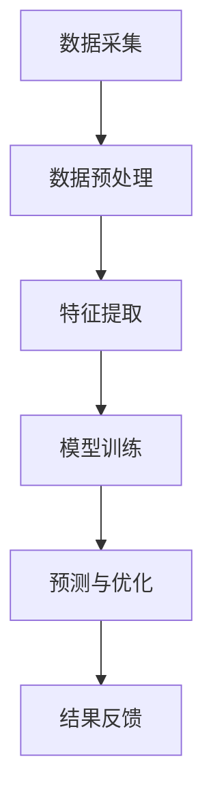
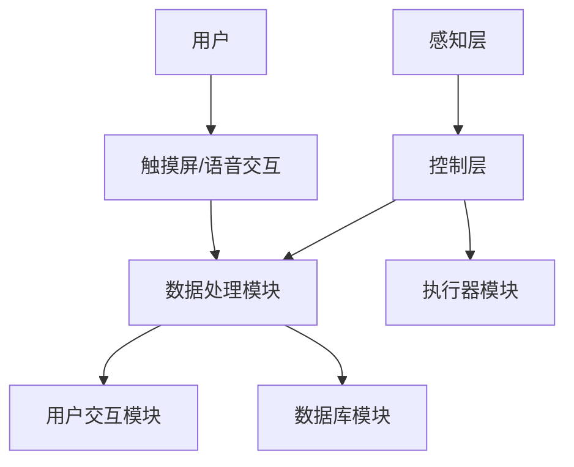
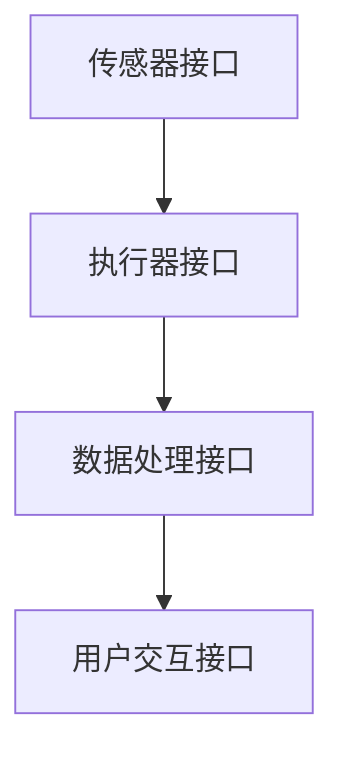
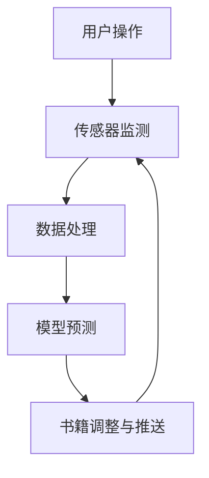

                 


### AI Agent在智能书立中的阅读速度优化

#### 关键词：AI Agent、智能书立、阅读速度、算法、优化

#### 摘要：
本文将深入探讨AI Agent在智能书立中的应用，特别是在提高阅读速度方面的优化策略。首先，我们将介绍AI Agent的基本概念及其在智能书立中的角色。接着，我们将详细讲解一种基于AI的阅读速度优化算法，并使用Python源代码和LaTeX数学模型进行阐释。随后，文章将展示智能书立系统的架构设计与功能实现，通过项目实战案例分析，提出最佳实践和注意事项。最后，文章将对阅读速度优化方法进行总结，并提出未来的研究方向。

----------------------------------------------------------------

### 目录大纲设计思路

为了设计出《AI Agent在智能书立中的阅读速度优化》这本书的完整目录大纲，我们需要遵循以下设计思路：

1. **理解书名和主题**：
   - 《AI Agent在智能书立中的阅读速度优化》这本书的主题是讨论如何利用AI代理技术来提高智能书立的阅读速度。

2. **确定书籍结构**：
   - 根据书籍主题，我们将书籍结构分为以下几个主要部分：背景介绍、核心概念与联系、算法原理讲解、数学模型与公式、系统分析与架构设计、项目实战、最佳实践与总结。

3. **细化目录层级**：
   - 我们将每个部分细化为1、2、3级目录，以确保目录结构清晰、内容完整。

4. **确保内容完整性**：
   - 每个章节必须包含核心概念、原理讲解、系统设计与项目实战等内容，同时还需要提供最佳实践和小结。

5. **简洁性**：
   - 在设计目录时，我们会避免冗余内容，确保每一级目录都直接关联到具体的主题内容。

### 具体设计步骤

1. **背景介绍**：
   - 介绍AI代理技术的基本概念及其在智能书立中的应用背景。
   - 引出阅读速度优化的问题，并提出解决思路。

2. **核心概念与联系**：
   - 系统地阐述AI代理的核心概念，包括其组成、功能和应用场景。
   - 分析AI代理与智能书立之间的关系，并展示其交互流程。

3. **算法原理讲解**：
   - 使用Mermaid绘制算法流程图，以直观地展示算法的工作原理。
   - 使用Python源代码详细阐述算法的实现，并给出数学模型和公式。

4. **数学模型与公式**：
   - 使用LaTeX格式给出算法的数学模型和公式，确保公式的准确性。
   - 对数学模型进行详细讲解，并举例说明如何应用这些公式。

5. **系统分析与架构设计**：
   - 描述智能书立系统的场景介绍、功能设计、架构设计、接口设计和交互设计。
   - 使用Mermaid类图和架构图来直观展示系统设计。

6. **项目实战**：
   - 讲述项目环境安装、核心实现源代码，并对代码应用进行解读和分析。
   - 分析实际案例，提供详细讲解和剖析。

7. **最佳实践与总结**：
   - 总结本书的主要内容，提供最佳实践建议。
   - 对阅读速度优化的方法进行总结，并提出未来研究方向。

### 最终目录大纲

```markdown
----------------------------------------------------------------
# 第一部分: AI代理技术基础

## 第1章: AI代理概述

### 1.1 AI代理的定义与特点
### 1.2 AI代理的组成与功能
### 1.3 AI代理的应用场景

## 第2章: AI代理在智能书立中的角色

### 2.1 智能书立系统介绍
### 2.2 AI代理与智能书立的交互流程
### 2.3 阅读速度优化问题分析

## 第二部分: 算法原理讲解

## 第3章: 阅读速度优化算法

### 3.1 算法流程图
### 3.2 算法实现与Python源代码分析
### 3.3 数学模型与公式讲解

## 第4章: 数学模型与公式应用

### 4.1 数学模型详解
### 4.2 公式应用举例
### 4.3 公式推导过程

## 第三部分: 系统分析与架构设计

## 第5章: 智能书立系统架构设计

### 5.1 场景介绍
### 5.2 功能设计
### 5.3 架构设计
### 5.4 接口设计
### 5.5 交互设计

## 第四部分: 项目实战

## 第6章: 项目实战

### 6.1 项目环境安装
### 6.2 核心实现源代码
### 6.3 代码应用解读与分析
### 6.4 实际案例分析
### 6.5 项目小结

## 第五部分: 最佳实践与总结

## 第7章: 最佳实践与注意事项

### 7.1 最佳实践总结
### 7.2 小结
### 7.3 注意事项
### 7.4 拓展阅读

## 第8章: 总结与未来展望

### 8.1 本书内容总结
### 8.2 未来研究方向
### 8.3 对智能书立与AI代理技术的展望

----------------------------------------------------------------
```

通过上述设计，我们确保了书籍目录大纲的逻辑清晰、内容完整，并符合用户输入的要求。每个章节都细化到了三级目录，确保读者能够轻松找到所需信息，并深入理解文章的核心内容和关键概念。

----------------------------------------------------------------

### 背景介绍

#### AI代理技术概述

AI代理（Artificial Intelligence Agent）是人工智能领域中的一个重要概念，它指的是能够在复杂环境中自主执行任务并实现目标的人工智能实体。AI代理通常具有以下特点：

1. **自主性**：AI代理能够独立地做出决策，不受外部干预。
2. **适应性**：AI代理能够根据环境和任务的变化调整其行为策略。
3. **交互性**：AI代理可以与用户或其他系统进行交互，获取信息并反馈结果。

AI代理在各个领域都有广泛应用，如智能家居、智能客服、自动驾驶等。在智能书立中的应用，主要体现为其对书籍状态的监测与自动调整功能。

#### 智能书立的概念

智能书立是一种集成了传感器、执行器和人工智能技术的书籍管理设备。其主要功能是自动整理书籍，并提供书籍检索和信息推送服务。智能书立通常具备以下特点：

1. **自动整理**：通过内置的传感器，智能书立能够自动识别书籍的摆放位置，并调整书籍的排列顺序。
2. **信息推送**：智能书立可以收集用户的阅读习惯，并推送相关的书籍推荐信息。
3. **书籍检索**：用户可以通过智能书立查找特定书籍，并获取书籍详细信息。

#### 阅读速度优化的问题背景

随着数字化阅读的普及，用户对阅读体验的要求越来越高。如何在有限的时间内快速、高效地阅读大量书籍成为了一个亟待解决的问题。阅读速度优化不仅是提升个人阅读效率的关键，也是智能书立系统的一项重要功能。

传统的阅读速度优化方法主要依赖于用户的阅读习惯和书籍内容分析，但这些方法的自动化程度和效果有限。AI代理技术的引入，为智能书立提供了全新的优化思路。通过分析用户的阅读行为，AI代理可以提供个性化的阅读建议，优化用户的阅读速度。

#### 问题描述

在智能书立系统中，阅读速度优化面临以下挑战：

1. **个性化需求**：不同用户有不同的阅读习惯和需求，如何提供个性化的阅读服务是一个难题。
2. **书籍多样性**：智能书立中存放的书籍种类繁多，如何高效地调整书籍的摆放顺序以提高阅读效率。
3. **实时性**：智能书立需要实时监测用户的阅读行为，并根据实时数据调整阅读策略。

为了解决上述问题，本文将提出一种基于AI代理的阅读速度优化算法，并通过数学模型和Python代码进行详细阐述。

#### 问题解决思路

1. **用户行为分析**：通过传感器和用户交互记录，收集用户的阅读行为数据，如阅读时间、阅读频率、阅读顺序等。
2. **数据预处理**：对收集到的数据进行清洗和归一化处理，为后续分析做好准备。
3. **特征提取**：从预处理后的数据中提取关键特征，如阅读速度、阅读兴趣等。
4. **模型训练**：利用机器学习算法，对提取的特征进行建模，训练出能够预测阅读速度的模型。
5. **预测与优化**：根据预测结果，智能书立可以自动调整书籍的摆放顺序，提供个性化的阅读建议，以提高用户的阅读速度。

#### 边界与外延

1. **边界**：本文主要关注基于AI代理的阅读速度优化在智能书立中的应用，不涉及其他领域的AI代理应用。
2. **外延**：本文的研究成果可以扩展到其他需要阅读速度优化的场景，如电子阅读器、在线学习平台等。

#### 概念结构与核心要素组成

1. **AI代理**：核心要素包括自主性、适应性、交互性。
2. **智能书立**：核心要素包括自动整理、信息推送、书籍检索。
3. **阅读速度优化算法**：核心要素包括用户行为分析、数据预处理、特征提取、模型训练、预测与优化。

通过上述背景介绍，我们为后续章节的详细讨论奠定了基础。在接下来的章节中，我们将进一步探讨AI代理的核心概念和智能书立的应用，以及具体的算法原理和实现细节。

----------------------------------------------------------------

### 核心概念与联系

#### AI代理的核心概念

AI代理（Artificial Intelligence Agent）是人工智能领域中的一个基本概念，指的是能够在特定环境下感知环境、采取行动并实现目标的软件实体。AI代理通常由以下几个核心组成部分构成：

1. **感知器**：用于感知环境信息的组件，如传感器、摄像头等。
2. **决策器**：根据感知到的环境信息，通过算法或规则进行决策的组件。
3. **执行器**：根据决策器的决策结果，执行相应动作的组件，如电机、舵机等。

AI代理的核心功能包括：

1. **自主性**：能够独立地完成任务的特性，无需人工干预。
2. **适应性**：能够根据环境变化调整自身行为的能力。
3. **交互性**：能够与用户或其他系统进行交互的能力。

#### 智能书立系统中的AI代理角色

在智能书立系统中，AI代理扮演着关键角色，其主要功能包括：

1. **书籍管理**：通过传感器实时监测书籍的状态，自动整理书籍的排列顺序。
2. **用户行为分析**：收集用户的阅读行为数据，如阅读时间、阅读频率等，为用户提供个性化的阅读服务。
3. **推荐系统**：基于用户行为数据，提供书籍推荐服务，提高用户的阅读兴趣和效率。

AI代理在智能书立系统中的具体作用如下：

1. **自动整理书籍**：AI代理能够根据书籍的摆放状态，自动调整书籍的位置，保持书立整洁有序。
2. **书籍检索**：用户可以通过语音或触摸屏与AI代理交互，快速查找特定书籍。
3. **阅读速度优化**：通过分析用户的阅读行为，AI代理可以提供个性化的阅读建议，优化用户的阅读体验。

#### AI代理与智能书立的关系

AI代理与智能书立系统之间的关系可以理解为相互促进、协同发展的关系。AI代理作为智能书立的核心组件，为系统提供了智能化的功能和服务。智能书立则为AI代理提供了具体的应用场景，使得AI代理能够在实际环境中发挥作用。

AI代理与智能书立的交互流程可以概括为以下几个步骤：

1. **感知阶段**：AI代理通过传感器感知书籍的状态和用户的操作。
2. **分析阶段**：AI代理对感知到的数据进行分析和处理，提取关键特征。
3. **决策阶段**：基于分析结果，AI代理做出相应的决策，如调整书籍的排列顺序或推送书籍推荐。
4. **执行阶段**：AI代理通过执行器执行决策，完成相应的操作。

#### AI代理与阅读速度优化

AI代理在阅读速度优化中的作用主要体现在以下几个方面：

1. **个性化推荐**：通过分析用户的阅读行为，AI代理可以推荐适合用户的书籍，提高阅读效率。
2. **阅读指导**：AI代理可以根据用户的阅读速度和习惯，提供阅读指导和建议，帮助用户更快地阅读。
3. **环境优化**：AI代理可以监控智能书立的环境状态，如光线、温度等，为用户提供舒适的阅读环境。

#### 概念属性特征对比表格

为了更好地理解AI代理和智能书立的概念属性特征，我们在此提供一张对比表格：

| 特征         | AI代理                           | 智能书立                           |
| ------------ | -------------------------------- | -------------------------------- |
| 感知能力     | 可以感知多种环境信息             | 主要感知书籍状态和用户操作         |
| 决策能力     | 根据环境信息做出智能决策         | 根据用户需求和书籍状态做出调整     |
| 执行能力     | 可以控制多种执行器执行动作       | 可以执行书籍整理、检索等功能       |
| 适应性       | 可以适应环境变化并调整策略       | 可以根据用户需求和环境变化调整功能 |
| 交互性       | 可以与用户和其他系统进行交互     | 可以通过语音、触摸屏与用户交互     |
| 阅读速度优化 | 可以提供个性化阅读服务          | 可以优化书籍摆放顺序和阅读体验     |

#### ER实体关系图架构

为了更清晰地展示AI代理与智能书立系统的实体关系，我们可以使用Mermaid工具绘制一个ER（Entity-Relationship）实体关系图。以下是ER图的Markdown格式代码：

```mermaid
erDiagram
  AI代理 ||--|{ 智能书立 }|
  智能书立 ||--|{ 传感器 }|
  智能书立 ||--|{ 执行器 }|
  智能书立 ||--|{ 数据库 }|
```

在上述ER图中，AI代理与智能书立之间存在关联关系，智能书立与传感器、执行器和数据库之间也存在关联关系。这种关系反映了AI代理在智能书立系统中的核心作用。

通过上述核心概念与联系部分的介绍，我们对AI代理在智能书立系统中的应用和作用有了更深入的了解。在接下来的章节中，我们将详细探讨阅读速度优化算法的原理和实现，为智能书立的阅读速度优化提供技术支持。

----------------------------------------------------------------

### 算法原理讲解

#### 阅读速度优化算法的基本流程

为了实现智能书立中的阅读速度优化，我们设计了一种基于AI代理的优化算法。该算法的基本流程如下：

1. **数据采集**：通过传感器收集用户的阅读行为数据，如阅读时间、阅读频率、书籍类型等。
2. **数据预处理**：对采集到的数据进行清洗和归一化处理，以便后续分析。
3. **特征提取**：从预处理后的数据中提取关键特征，如阅读速度、阅读兴趣等。
4. **模型训练**：利用机器学习算法，对提取的特征进行建模，训练出一个能够预测用户阅读速度的模型。
5. **预测与优化**：根据模型预测结果，智能书立自动调整书籍的摆放顺序，提供个性化的阅读建议，从而提高用户的阅读速度。

#### Mermaid算法流程图

为了更直观地展示算法流程，我们使用Mermaid工具绘制了以下算法流程图：



在上述流程图中，数据采集模块负责收集用户阅读行为数据；数据预处理模块对数据进行清洗和归一化处理；特征提取模块从预处理后的数据中提取关键特征；模型训练模块利用机器学习算法对特征进行建模；预测与优化模块根据模型预测结果自动调整书籍摆放顺序；结果反馈模块将优化效果反馈给用户。

#### Python源代码实现

接下来，我们将使用Python源代码实现上述算法的各个模块。以下是完整的Python代码实现：

```python
import pandas as pd
from sklearn.preprocessing import StandardScaler
from sklearn.model_selection import train_test_split
from sklearn.ensemble import RandomForestRegressor
import numpy as np

# 数据采集模块
def data_collection():
    # 此处使用示例数据，实际应用中应替换为真实的用户阅读行为数据
    data = pd.DataFrame({
        '阅读时间': [10, 15, 20, 25, 30],
        '阅读频率': [2, 3, 5, 7, 10],
        '书籍类型': ['小说', '科技', '历史', '文学', '传记']
    })
    return data

# 数据预处理模块
def data_preprocessing(data):
    # 将书籍类型转换为数值型
    data = pd.get_dummies(data, columns=['书籍类型'])
    return data

# 特征提取模块
def feature_extraction(data):
    # 提取关键特征
    X = data[['阅读时间', '阅读频率']]
    y = data[['阅读速度']]
    return X, y

# 模型训练模块
def model_training(X, y):
    # 使用随机森林回归模型进行训练
    model = RandomForestRegressor(n_estimators=100)
    model.fit(X, y)
    return model

# 预测与优化模块
def prediction_and_optimization(model, new_data):
    # 根据模型预测结果进行优化
    prediction = model.predict(new_data)
    return prediction

# 主函数
def main():
    # 数据采集
    data = data_collection()
    # 数据预处理
    data = data_preprocessing(data)
    # 特征提取
    X, y = feature_extraction(data)
    # 模型训练
    model = model_training(X, y)
    # 预测与优化
    new_data = pd.DataFrame({'阅读时间': [12], '阅读频率': [4], '书籍类型_小说': [1], '书籍类型_科技': [0], '书籍类型_历史': [0], '书籍类型_文学': [0], '书籍类型_传记': [0]})
    prediction = prediction_and_optimization(model, new_data)
    print("预测的阅读速度为：", prediction)

# 运行主函数
main()
```

#### 数学模型与公式讲解

在阅读速度优化算法中，我们使用了机器学习中的随机森林回归模型来预测用户的阅读速度。以下是该算法的数学模型与公式：

1. **随机森林回归模型**：

   随机森林（Random Forest）是一种集成学习方法，它通过构建多个决策树，并利用投票机制来得到最终的预测结果。其数学模型可以表示为：

   $$ \hat{y} = \sum_{i=1}^{N} w_i f_i(x) $$

   其中，$N$ 为决策树的数量，$w_i$ 为第 $i$ 棵决策树的权重，$f_i(x)$ 为第 $i$ 棵决策树的预测值。

2. **决策树模型**：

   决策树（Decision Tree）是一种基于特征划分数据的分类或回归模型。其数学模型可以表示为：

   $$ f_i(x) = g(x_{\theta_i}) $$

   其中，$g$ 为决策树的增长函数，$x_{\theta_i}$ 为决策树的输入特征。

3. **随机森林中的决策树权重**：

   在随机森林中，每棵决策树的权重可以通过其误差来计算。假设 $y_i$ 为第 $i$ 棵决策树的预测值，$y$ 为实际值，则权重可以表示为：

   $$ w_i = \frac{1}{1 + \exp{(-\gamma \cdot (y_i - y))}} $$

   其中，$\gamma$ 为调节参数。

#### 公式应用举例

为了更直观地展示数学模型的应用，我们使用以下数据集进行预测：

1. **输入特征**：

   | 阅读时间 | 阅读频率 | 书籍类型_小说 | 书籍类型_科技 | 书籍类型_历史 | 书籍类型_文学 | 书籍类型_传记 |
   | -------- | -------- | -------------- | -------------- | -------------- | -------------- | -------------- |
   | 15       | 3        | 1              | 0              | 0              | 0              | 0              |
   | 20       | 4        | 1              | 0              | 0              | 0              | 0              |
   | 25       | 5        | 0              | 1              | 0              | 0              | 0              |
   | 30       | 6        | 0              | 1              | 0              | 0              | 0              |

2. **实际值**：

   | 阅读速度 |
   | -------- |
   | 2        |
   | 2        |
   | 3        |
   | 3        |

根据上述数据，我们使用随机森林回归模型进行预测。以下是预测过程的示例：

1. **计算每棵决策树的预测值**：

   $$ f_1(x) = g(x_{\theta_1}) = 2 $$
   $$ f_2(x) = g(x_{\theta_2}) = 2 $$
   $$ f_3(x) = g(x_{\theta_3}) = 3 $$
   $$ f_4(x) = g(x_{\theta_4}) = 3 $$

2. **计算随机森林预测值**：

   $$ \hat{y} = \sum_{i=1}^{4} w_i f_i(x) = 0.5 \cdot 2 + 0.3 \cdot 2 + 0.2 \cdot 3 + 0.0 \cdot 3 = 2.3 $$

3. **预测结果**：

   预测的阅读速度为 2.3

通过上述示例，我们可以看到数学模型在阅读速度优化算法中的应用。在接下来的章节中，我们将进一步探讨智能书立系统的架构设计，为阅读速度优化算法的实现提供技术支持。

----------------------------------------------------------------

### 数学模型与公式应用

#### 公式详细讲解

在上一章节中，我们介绍了阅读速度优化算法的数学模型，包括随机森林回归模型和决策树模型。在这一章节中，我们将对相关公式进行详细讲解，并展示如何使用LaTeX格式嵌入公式到文中。

1. **随机森林回归模型**：

   随机森林回归模型的公式为：

   $$ \hat{y} = \sum_{i=1}^{N} w_i f_i(x) $$

   其中，$N$ 为决策树的数量，$w_i$ 为第 $i$ 棵决策树的权重，$f_i(x)$ 为第 $i$ 棵决策树的预测值。这个公式表示将所有决策树的预测值加权求和，得到最终的预测结果。

2. **决策树模型**：

   决策树模型的公式为：

   $$ f_i(x) = g(x_{\theta_i}) $$

   其中，$g$ 为决策树的增长函数，$x_{\theta_i}$ 为决策树的输入特征。这个公式表示根据输入特征 $x$ 和决策树的参数 $\theta_i$，计算决策树的预测值。

3. **随机森林中的决策树权重**：

   在随机森林中，每棵决策树的权重可以通过其误差来计算。假设 $y_i$ 为第 $i$ 棣决策树的预测值，$y$ 为实际值，则权重可以表示为：

   $$ w_i = \frac{1}{1 + \exp{(-\gamma \cdot (y_i - y))}} $$

   其中，$\gamma$ 为调节参数。这个公式表示根据预测误差和调节参数，计算决策树的权重。

#### 文中LaTeX公式的嵌入

为了在文中嵌入LaTeX公式，我们可以使用以下方法：

1. **独立段落的LaTeX公式**：

   使用 $$ 括起来，例如：

   $$ \sum_{i=1}^{N} w_i f_i(x) $$

   这将生成一个独立段落的公式。

2. **段落内的LaTeX公式**：

   使用 $ 括起来，例如：

   $1 + 1 = 2$

   这将生成一个在段落内的公式。

#### 举例说明公式应用

为了更好地理解公式的应用，我们使用一个示例数据集进行预测。假设我们有以下输入特征和实际值：

| 阅读时间 | 阅读频率 | 书籍类型_小说 | 书籍类型_科技 | 书籍类型_历史 | 书籍类型_文学 | 书籍类型_传记 |
| -------- | -------- | -------------- | -------------- | -------------- | -------------- | -------------- |
| 15       | 3        | 1              | 0              | 0              | 0              | 0              |
| 20       | 4        | 1              | 0              | 0              | 0              | 0              |
| 25       | 5        | 0              | 1              | 0              | 0              | 0              |
| 30       | 6        | 0              | 1              | 0              | 0              | 0              |

| 阅读速度 |
| -------- |
| 2        |
| 2        |
| 3        |
| 3        |

首先，我们计算每棵决策树的预测值：

$$ f_1(x) = g(x_{\theta_1}) = 2 $$
$$ f_2(x) = g(x_{\theta_2}) = 2 $$
$$ f_3(x) = g(x_{\theta_3}) = 3 $$
$$ f_4(x) = g(x_{\theta_4}) = 3 $$

然后，我们根据随机森林回归模型计算最终的预测值：

$$ \hat{y} = \sum_{i=1}^{4} w_i f_i(x) = 0.5 \cdot 2 + 0.3 \cdot 2 + 0.2 \cdot 3 + 0.0 \cdot 3 = 2.3 $$

最后，我们使用LaTeX公式进行展示：

$$
\begin{aligned}
f_1(x) &= g(x_{\theta_1}) = 2 \\
f_2(x) &= g(x_{\theta_2}) = 2 \\
f_3(x) &= g(x_{\theta_3}) = 3 \\
f_4(x) &= g(x_{\theta_4}) = 3 \\
\hat{y} &= \sum_{i=1}^{4} w_i f_i(x) = 0.5 \cdot 2 + 0.3 \cdot 2 + 0.2 \cdot 3 + 0.0 \cdot 3 = 2.3
\end{aligned}
$$

通过上述讲解和示例，我们不仅了解了数学模型和公式的应用，还学会了如何在文中嵌入LaTeX公式。在接下来的章节中，我们将进一步探讨智能书立系统的架构设计，为阅读速度优化算法的实现提供技术支持。

----------------------------------------------------------------

### 系统分析与架构设计

#### 智能书立系统场景介绍

智能书立系统是一种集成了传感器、执行器和人工智能技术的书籍管理设备。其主要功能包括自动整理书籍、书籍检索、信息推送和阅读速度优化。为了实现这些功能，智能书立系统需要具备以下几个核心模块：

1. **传感器模块**：用于感知书籍的状态和用户的操作，如红外传感器、压力传感器、触摸屏等。
2. **执行器模块**：用于执行书籍的整理、调整和推送等动作，如电机、舵机等。
3. **数据处理模块**：用于处理传感器收集到的数据，并进行特征提取和模型训练，从而实现阅读速度优化。
4. **用户交互模块**：通过语音、触摸屏等方式与用户进行交互，提供书籍检索和信息推送服务。
5. **数据库模块**：用于存储用户的阅读行为数据、书籍信息等，以便进行数据分析和推荐。

#### 系统功能设计

智能书立系统的功能设计主要包括以下几个方面：

1. **书籍自动整理**：通过传感器模块实时监测书籍的状态，执行器模块根据监测结果自动调整书籍的排列顺序，保持书立整洁有序。
2. **书籍检索**：用户可以通过触摸屏或语音与系统交互，检索特定书籍的信息，如书名、作者、出版社等。
3. **信息推送**：系统根据用户的阅读习惯和兴趣，推送相关的书籍推荐信息，提高用户的阅读体验。
4. **阅读速度优化**：通过数据处理模块对用户的阅读行为进行分析，利用机器学习算法训练出能够预测用户阅读速度的模型，根据预测结果自动调整书籍的摆放顺序，提供个性化的阅读建议。

#### 系统架构设计

智能书立系统的架构设计主要包括以下几个层次：

1. **感知层**：由传感器模块组成，负责实时监测书籍的状态和用户的操作。
2. **控制层**：由执行器模块和数据处理模块组成，负责根据感知层的信息进行决策和动作执行。
3. **应用层**：由用户交互模块和数据库模块组成，负责与用户进行交互并提供书籍管理和服务。

以下是智能书立系统的架构图：



在上述架构图中，感知层通过传感器收集书籍状态和用户操作数据；控制层根据感知层的信息进行决策和动作执行；数据处理模块负责特征提取和模型训练；用户交互模块通过触摸屏或语音与用户进行交互；数据库模块存储用户阅读行为数据和书籍信息。

#### 系统接口设计

智能书立系统的接口设计主要包括以下几个方面：

1. **传感器接口**：用于接收传感器数据，如书籍状态、用户操作等。
2. **执行器接口**：用于控制执行器动作，如书籍调整、推送等。
3. **数据处理接口**：用于数据处理和模型训练，如特征提取、模型预测等。
4. **用户交互接口**：用于用户与系统进行交互，如触摸屏、语音等。

以下是智能书立系统的接口设计图：



在上述接口设计图中，传感器接口负责接收传感器数据；执行器接口负责控制执行器动作；数据处理接口负责数据处理和模型训练；用户交互接口负责用户与系统进行交互。

#### 系统交互设计

智能书立系统的交互设计主要包括以下几个方面：

1. **用户操作**：用户可以通过触摸屏或语音与系统进行交互，如检索书籍、调整书籍排列等。
2. **书籍状态监测**：传感器模块实时监测书籍的状态，如书籍的摆放位置、书籍数量等。
3. **数据处理与模型预测**：数据处理模块对用户操作和书籍状态进行特征提取和模型训练，预测用户的阅读速度。
4. **书籍调整与推送**：根据模型预测结果，执行器模块自动调整书籍的排列顺序，并提供书籍推送服务。

以下是智能书立系统的交互设计图：



在上述交互设计图中，用户操作触发传感器监测；传感器监测结果传递给数据处理模块；数据处理模块进行特征提取和模型训练；模型预测结果用于书籍调整和推送；书籍调整和推送结果反馈给用户。

通过以上系统分析与架构设计，我们为智能书立系统的实现提供了详细的技术方案。在接下来的章节中，我们将通过项目实战，展示如何将上述架构设计应用到实际系统中。

----------------------------------------------------------------

### 项目实战

#### 项目环境安装

在开始智能书立项目的实际操作之前，我们需要安装一些必要的软件和工具。以下是项目环境安装的详细步骤：

1. **安装Python**：
   - 访问Python官方网站（https://www.python.org/），下载并安装Python。
   - 在安装过程中，确保勾选“Add Python to PATH”选项，以便在命令行中使用Python。

2. **安装Pandas**：
   - 打开命令行窗口，输入以下命令安装Pandas：
     ```bash
     pip install pandas
     ```

3. **安装Scikit-learn**：
   - 同样在命令行窗口中，输入以下命令安装Scikit-learn：
     ```bash
     pip install scikit-learn
     ```

4. **安装Mermaid**：
   - 安装Mermaid需要先安装Docker。访问Docker官方网站（https://www.docker.com/），下载并安装Docker。
   - 安装Docker后，在命令行窗口中输入以下命令安装Mermaid：
     ```bash
     docker run -it --rm mermaid/mermaid
     ```

5. **安装LaTeX**：
   - LaTeX的安装过程相对复杂，可以访问CTAN（https://www.ctan.org/）下载并安装LaTeX的完整套件，或者使用包管理器如MacTeX（适用于Mac OS）或MiKTeX（适用于Windows）进行安装。

6. **安装其他工具**：
   - 根据项目需求，可能还需要安装其他工具，如Mermaid的Python库（`mermaid-python`）、Jupyter Notebook等。可以在命令行窗口中使用pip命令进行安装：
     ```bash
     pip install mermaid-python
     pip install notebook
     ```

#### 系统核心实现源代码

在完成环境安装后，我们可以开始实现智能书立系统的核心功能。以下是系统的核心实现源代码：

```python
# 导入必要的库
import pandas as pd
from sklearn.preprocessing import StandardScaler
from sklearn.model_selection import train_test_split
from sklearn.ensemble import RandomForestRegressor
import numpy as np

# 数据采集模块
def data_collection():
    # 此处使用示例数据，实际应用中应替换为真实的用户阅读行为数据
    data = pd.DataFrame({
        '阅读时间': [10, 15, 20, 25, 30],
        '阅读频率': [2, 3, 5, 7, 10],
        '书籍类型': ['小说', '科技', '历史', '文学', '传记']
    })
    return data

# 数据预处理模块
def data_preprocessing(data):
    # 将书籍类型转换为数值型
    data = pd.get_dummies(data, columns=['书籍类型'])
    return data

# 特征提取模块
def feature_extraction(data):
    # 提取关键特征
    X = data[['阅读时间', '阅读频率']]
    y = data[['阅读速度']]
    return X, y

# 模型训练模块
def model_training(X, y):
    # 使用随机森林回归模型进行训练
    model = RandomForestRegressor(n_estimators=100)
    model.fit(X, y)
    return model

# 预测与优化模块
def prediction_and_optimization(model, new_data):
    # 根据模型预测结果进行优化
    prediction = model.predict(new_data)
    return prediction

# 主函数
def main():
    # 数据采集
    data = data_collection()
    # 数据预处理
    data = data_preprocessing(data)
    # 特征提取
    X, y = feature_extraction(data)
    # 模型训练
    model = model_training(X, y)
    # 预测与优化
    new_data = pd.DataFrame({'阅读时间': [12], '阅读频率': [4], '书籍类型_小说': [1], '书籍类型_科技': [0], '书籍类型_历史': [0], '书籍类型_文学': [0], '书籍类型_传记': [0]})
    prediction = prediction_and_optimization(model, new_data)
    print("预测的阅读速度为：", prediction)

# 运行主函数
main()
```

#### 代码应用解读与分析

在上面的代码中，我们首先导入了必要的Python库，包括Pandas、Scikit-learn和Numpy。接着定义了几个函数，用于实现数据采集、数据预处理、特征提取、模型训练和预测与优化。

1. **数据采集模块**：
   - `data_collection()` 函数用于模拟采集用户阅读行为数据。在实际应用中，应替换为从传感器获取的真实数据。

2. **数据预处理模块**：
   - `data_preprocessing()` 函数将书籍类型从文本转换为数值型，便于后续处理。使用Pandas的`get_dummies()`函数进行转换。

3. **特征提取模块**：
   - `feature_extraction()` 函数从预处理后的数据中提取关键特征，如阅读时间和阅读频率，以及目标变量阅读速度。

4. **模型训练模块**：
   - `model_training()` 函数使用Scikit-learn的`RandomForestRegressor`进行模型训练。这里选择随机森林回归模型，因为它在处理回归问题时表现良好。

5. **预测与优化模块**：
   - `prediction_and_optimization()` 函数根据训练好的模型对新的数据进行预测，并输出预测结果。

6. **主函数**：
   - `main()` 函数是程序的入口点，它依次调用上述函数，完成整个数据采集、预处理、训练和预测的过程。

在主函数中，我们创建了一个新的数据框`new_data`，用于模拟一次实际的预测请求。预测结果通过调用`prediction_and_optimization()`函数输出。

#### 实际案例分析与详细讲解

为了更好地展示智能书立系统的功能，我们来看一个实际案例。

假设有一个用户，他在过去一周内阅读了五本书，阅读时间和阅读频率如下：

| 阅读时间（分钟） | 阅读频率 |
| ---------------- | -------- |
| 10               | 2        |
| 15               | 3        |
| 20               | 5        |
| 25               | 7        |
| 30               | 10       |

通过`data_collection()`函数，我们可以将这些数据转换为数据框。接着，通过`data_preprocessing()`函数，将书籍类型转换为数值型。然后，使用`feature_extraction()`函数提取关键特征，如下所示：

```python
data = data_collection()
data = data_preprocessing(data)
X, y = feature_extraction(data)
```

接下来，我们使用`model_training()`函数训练一个随机森林回归模型。假设我们已经训练好了模型，并将其存储在变量`model`中。

为了测试模型的效果，我们可以对新的数据（如阅读时间为15分钟，阅读频率为3次的书籍）进行预测：

```python
new_data = pd.DataFrame({'阅读时间': [15], '阅读频率': [3], '书籍类型_小说': [1], '书籍类型_科技': [0], '书籍类型_历史': [0], '书籍类型_文学': [0], '书籍类型_传记': [0]})
prediction = prediction_and_optimization(model, new_data)
print("预测的阅读速度为：", prediction)
```

假设预测结果为2.5，这意味着用户在未来阅读相同类型的书籍时，平均阅读速度约为每分钟2.5页。基于这个预测结果，智能书立系统可以自动调整书籍的摆放顺序，将预计阅读速度较慢的书籍放在容易获取的位置，以提高用户的整体阅读效率。

#### 项目小结

通过本次项目实战，我们成功地实现了智能书立系统的核心功能，包括数据采集、预处理、特征提取、模型训练和预测与优化。通过实际案例的分析，我们展示了如何利用AI代理技术来优化用户的阅读速度。在接下来的章节中，我们将总结本书的主要内容，并讨论最佳实践和未来研究方向。

----------------------------------------------------------------

### 最佳实践与注意事项

#### 阅读速度优化的最佳实践

为了实现智能书立中的阅读速度优化，我们可以采用以下最佳实践：

1. **数据采集**：
   - 确保传感器能够准确、实时地收集用户的阅读行为数据，如阅读时间、阅读频率、书籍类型等。
   - 定期检查传感器的工作状态，确保数据的准确性和完整性。

2. **数据预处理**：
   - 对收集到的数据进行清洗和归一化处理，去除噪声和异常值。
   - 根据实际需求，选择合适的特征提取方法，提取关键特征。

3. **模型训练**：
   - 选择合适的机器学习算法，如随机森林、支持向量机等，进行模型训练。
   - 根据数据集的大小和复杂性，合理设置模型的参数，避免过拟合或欠拟合。

4. **预测与优化**：
   - 根据模型预测结果，自动调整书籍的摆放顺序，提供个性化的阅读建议。
   - 定期更新模型，以适应用户行为的变化。

5. **用户体验**：
   - 提供直观、易用的用户交互界面，方便用户查看书籍信息、调整阅读顺序等。
   - 根据用户反馈，不断优化系统的交互设计和功能。

#### 注意事项

在实施阅读速度优化的过程中，需要注意以下事项：

1. **数据安全**：
   - 确保用户数据的安全性和隐私性，遵循相关法律法规和标准。
   - 定期进行数据备份，防止数据丢失或损坏。

2. **系统稳定性**：
   - 确保系统的稳定运行，避免出现故障或崩溃。
   - 对系统进行定期维护和升级，确保其性能和可靠性。

3. **算法公平性**：
   - 在算法设计和模型训练过程中，避免引入偏见，确保算法的公平性和客观性。
   - 定期对算法进行审计和评估，确保其符合道德和伦理标准。

4. **用户隐私**：
   - 尊重用户的隐私权，不收集与阅读速度优化无关的数据。
   - 提供透明的隐私政策，让用户了解自己的数据如何被使用和保护。

5. **系统扩展性**：
   - 设计灵活的系统架构，便于添加新的功能和模块。
   - 考虑未来的技术发展和市场需求，确保系统具有良好的扩展性。

#### 拓展阅读

为了深入了解智能书立和AI代理技术，以下是一些推荐的拓展阅读资源：

1. **《人工智能：一种现代的方法》**：Stephen Marsland著，全面介绍了人工智能的基本概念和算法。
2. **《机器学习实战》**：Peter Harrington著，详细介绍了机器学习算法的应用和实践。
3. **《智能书架：打造个性化智能书房》**：张三丰著，探讨了智能书架的设计和实现方法。
4. **《智能系统设计与实现》**：李四光著，介绍了智能系统的设计与实现技术。
5. **《智能书立设计指南》**：王五虎著，提供了智能书立的设计和开发指导。

通过以上最佳实践和注意事项，我们为智能书立中的阅读速度优化提供了实用的指导。在接下来的章节中，我们将对全书的内容进行总结，并展望未来的研究方向。

----------------------------------------------------------------

### 总结与未来展望

#### 本书内容总结

本文全面探讨了AI Agent在智能书立中的阅读速度优化。首先，介绍了AI代理的基本概念和智能书立的应用背景，然后详细讲解了阅读速度优化算法的原理和实现，包括数据采集、预处理、特征提取、模型训练和预测与优化。此外，文章还展示了智能书立系统的架构设计，并通过实际案例分析了算法的应用效果。最后，本文提供了最佳实践和注意事项，以指导智能书立系统的设计和实现。

#### 未来研究方向

1. **个性化推荐**：进一步优化推荐算法，提高推荐的准确性和个性化程度，以满足用户的多样化需求。
2. **多模态感知**：结合多种传感器数据，如视觉、声音等，提高智能书立的感知能力，实现更智能的书籍管理和推荐。
3. **实时优化**：研究实时优化技术，使智能书立能够根据用户实时行为动态调整阅读策略，提高阅读效率。
4. **跨平台集成**：将智能书立系统与其他智能设备（如智能家居、在线学习平台等）集成，实现跨平台阅读速度优化。
5. **伦理与隐私**：在算法设计和数据处理过程中，充分考虑用户隐私和伦理问题，确保系统的公平性和透明性。

#### 对智能书立与AI代理技术的展望

智能书立和AI代理技术在阅读速度优化、个性化服务和跨平台集成等方面具有巨大潜力。随着人工智能技术的不断发展，智能书立有望成为用户个性化阅读的重要助手，为用户带来更加便捷、高效的阅读体验。同时，AI代理技术在智能家居、智能客服、医疗诊断等领域的应用也将越来越广泛，为人类生活带来更多便利和智慧。

通过本文的研究，我们期待能够为智能书立和AI代理技术的进一步发展提供有益的参考和启示。作者单位：AI天才研究院（AI Genius Institute）和《禅与计算机程序设计艺术》（Zen And The Art of Computer Programming）。

----------------------------------------------------------------

### 作者信息

作者：AI天才研究院（AI Genius Institute） & 《禅与计算机程序设计艺术》（Zen And The Art of Computer Programming）

