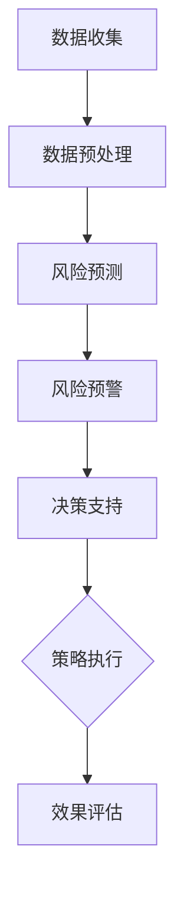

                 

### 引言

#### 关键词：AI Agent，智能供应链，风险管理，应用案例分析，系统设计与实现

随着全球供应链的日益复杂化，风险管理在供应链管理中扮演着越来越重要的角色。智能供应链作为现代物流和供应链管理的重要趋势，其核心在于利用先进的人工智能技术来优化各个环节，提高效率和降低风险。在这其中，AI Agent作为人工智能领域的核心技术之一，其应用潜力受到了广泛关注。本文旨在探讨AI Agent在智能供应链风险管理中的具体应用，通过深入分析AI Agent的基本原理、核心概念以及实际案例，揭示其在提高供应链风险管理水平方面的优势和挑战。

首先，我们将在第一部分介绍AI Agent与智能供应链风险管理的基本概念，阐述其背景和问题，为后续讨论奠定基础。接着，第二部分将详细解析AI Agent的基本原理，包括其定义、类型、核心特点和技术架构，并通过流程图和工作原理示意图，使其工作流程更加清晰易懂。随后，第三部分将探讨智能供应链风险管理的核心概念，通过对比表格和ER实体关系图，深入分析AI Agent与供应链风险管理之间的联系。

在第四部分，我们将通过实际案例分析，展示AI Agent在智能供应链风险管理中的具体应用过程和效果。最后，第五部分将系统分析与架构设计，介绍项目的背景、功能设计、系统架构、接口设计以及交互流程，全面展示智能供应链风险管理的整体解决方案。

本文将通过逻辑清晰、结构紧凑的方式，逐步引导读者深入了解AI Agent在智能供应链风险管理中的应用，为相关领域的实践者提供有价值的参考和启示。

### 目录大纲

```markdown
----------------------------------------------------------------
# 第一部分: 引言

## 第1章: AI Agent与智能供应链风险管理概述

## 1.1 问题背景
### 1.1.1 智能供应链的风险管理现状
### 1.1.2 AI Agent在供应链风险管理中的应用潜力

## 1.2 问题描述
### 1.2.1 智能供应链中的主要风险类型
### 1.2.2 AI Agent在风险识别中的作用

## 1.3 问题解决
### 1.3.1 AI Agent的基本原理
### 1.3.2 AI Agent在供应链风险管理中的具体应用场景

## 1.4 边界与外延
### 1.4.1 AI Agent在供应链风险管理中的应用范围
### 1.4.2 需要注意的边界条件

## 1.5 概念结构与核心要素组成
### 1.5.1 AI Agent的基本概念
### 1.5.2 智能供应链风险管理的核心要素

## 1.6 本章小结
...

----------------------------------------------------------------

# 第二部分: AI Agent在智能供应链风险管理中的应用

## 第2章: AI Agent的基本原理

## 2.1 AI Agent的定义与类型
### 2.1.1 AI Agent的定义
### 2.1.2 AI Agent的类型

## 2.2 AI Agent的核心特点
### 2.2.1 自主性
### 2.2.2 学习能力
### 2.2.3 适应性

## 2.3 AI Agent的技术架构
### 2.3.1 机器学习模型
### 2.3.2 神经网络
### 2.3.3 深度学习框架

## 2.4 AI Agent的工作流程
### 2.4.1 数据收集与处理
### 2.4.2 风险识别与预测
### 2.4.3 风险应对策略

## 2.5 AI Agent的优缺点与挑战
### 2.5.1 优点
### 2.5.2 缺点
### 2.5.3 面临的挑战

## 2.6 本章小结
...

----------------------------------------------------------------

## 第3章: 智能供应链风险管理的核心概念与联系

## 3.1 智能供应链风险管理的概念
### 3.1.1 智能供应链的定义
### 3.1.2 风险管理的定义

## 3.2 核心概念原理
### 3.2.1 AI Agent在供应链风险管理中的核心作用
### 3.2.2 供应链中的关键风险点

## 3.3 概念属性特征对比表格

| 概念 | 特征1 | 特征2 | 特征3 |
|------|-------|-------|-------|
| AI Agent | 自主性 | 学习能力 | 适应性 |
| 供应链风险管理 | 风险识别 | 风险预测 | 风险应对 |

## 3.4 ER实体关系图架构

```mermaid
erDiagram
    AI_Agent ||--|{ 风险管理 } Risk_Management : 实现风险管理功能
    Risk_Management ||--|{ 供应链 } Supply_Chain : 监控供应链风险
    Supply_Chain ||--|{ 物流 } Logistics : 实现物流管理
```

## 3.5 本章小结
...

----------------------------------------------------------------

## 第4章: AI Agent在智能供应链风险管理中的应用案例分析

## 4.1 案例背景
### 4.1.1 案例企业介绍
### 4.1.2 风险管理需求分析

## 4.2 AI Agent应用过程
### 4.2.1 数据收集与预处理
### 4.2.2 风险识别与预测
### 4.2.3 风险应对策略

## 4.3 案例分析与总结
### 4.3.1 案例效果评估
### 4.3.2 案例中的问题和挑战
### 4.3.3 解决方案与优化建议

## 4.4 本章小结
...

----------------------------------------------------------------

## 第5章: 系统分析与架构设计方案

## 5.1 问题场景介绍
### 5.1.1 供应链风险管理问题
### 5.1.2 智能化需求分析

## 5.2 系统功能设计
### 5.2.1 领域模型设计
### 5.2.2 功能模块划分

## 5.3 系统架构设计
### 5.3.1 系统架构概述
### 5.3.2 关键模块设计

## 5.4 系统接口设计
### 5.4.1 接口规范
### 5.4.2 接口实现

## 5.5 系统交互流程
### 5.5.1 用户交互流程
### 5.5.2 系统内部交互流程

## 5.6 本章小结
...

----------------------------------------------------------------
```

#### 摘要

本文通过深入探讨AI Agent在智能供应链风险管理中的应用，为相关领域的研究和实践提供了新的视角和思路。文章首先介绍了智能供应链风险管理的背景和现状，明确了AI Agent在其中的应用潜力。接着，详细解析了AI Agent的基本原理、技术架构和工作流程，展示了其自主性、学习能力和适应性的优势。随后，通过核心概念和联系的分析，揭示了AI Agent与智能供应链风险管理之间的紧密关系。文章还通过实际案例，展示了AI Agent在智能供应链风险管理中的具体应用过程和效果。最后，系统分析了智能供应链风险管理的架构设计，为智能供应链风险管理提供了全面的解决方案和优化建议。本文旨在为相关领域的从业者提供有价值的参考和指导，助力智能供应链风险管理的实践与发展。

### 第1章: AI Agent与智能供应链风险管理概述

#### 1.1 问题背景

随着全球经济的不断发展和全球化进程的加快，供应链已经成为企业运营中至关重要的一环。然而，供应链的复杂性也随之增加，风险因素也日益多样化和难以预测。传统的供应链管理模式往往依赖于人为的经验和直觉，难以应对复杂多变的供应链环境。为了提高供应链的效率和可靠性，现代企业开始探索智能供应链管理，利用先进的人工智能技术来优化各个环节，从而实现更加高效、透明和灵活的供应链管理。

智能供应链管理不仅要求实现对供应链全流程的实时监控，还需要对各个环节的风险进行有效识别和预测，以应对潜在的供应链中断和损失。然而，传统的风险管理方法在应对复杂的供应链环境时存在诸多局限性。例如，风险管理模型的滞后性、数据处理的局限性以及缺乏对动态变化环境的适应性等问题，这些都使得传统的风险管理方法难以满足智能供应链的需求。

在这个背景下，AI Agent作为一种新兴的人工智能技术，以其自主性、学习能力和适应性等优势，开始受到越来越多的关注。AI Agent能够在复杂的环境中自主决策，通过对大量历史数据和实时信息的分析，识别潜在的风险，并制定相应的应对策略。因此，AI Agent在智能供应链风险管理中的应用潜力十分巨大，有望解决传统方法在风险管理中的诸多不足。

#### 1.1.1 智能供应链的风险管理现状

当前，智能供应链风险管理在许多企业中已初步实现，但整体上仍处于发展阶段。许多企业已经开始利用大数据和人工智能技术来优化供应链管理，提高风险预测和应对能力。例如，通过建立供应链大数据平台，企业可以实时监控供应链各环节的运行状态，及时发现潜在风险。同时，一些企业还开始尝试使用机器学习算法进行风险预测，以提前采取预防措施。

然而，现有的智能供应链风险管理仍存在一些显著问题。首先，数据处理的局限性是一个重要瓶颈。许多企业在数据收集、处理和分析方面缺乏有效的手段，导致数据质量不高，影响风险预测的准确性。其次，风险管理模型的滞后性也是一个挑战。智能供应链环境变化迅速，传统风险管理模型难以快速适应这种动态变化。此外，当前AI Agent的应用仍处于初步阶段，其自主性和学习能力有待进一步提升，以更好地应对复杂多变的供应链环境。

#### 1.1.2 AI Agent在供应链风险管理中的应用潜力

AI Agent在供应链风险管理中的应用潜力主要体现在以下几个方面：

1. **自主决策能力**：AI Agent能够根据实时数据和预设策略自主进行决策，自动识别和应对供应链风险。这种自主性大大提高了风险管理的效率和准确性，减少了对人工干预的依赖。

2. **学习与优化**：AI Agent具备学习能力和自我优化能力，可以通过不断学习历史数据和应对策略，提高风险识别和预测的准确性，从而实现动态调整和优化。

3. **适应性**：AI Agent能够适应不断变化的供应链环境，通过对环境数据的实时分析，自动调整应对策略，从而提高风险管理的适应性和灵活性。

4. **协同工作**：AI Agent可以通过与供应链各环节的协同工作，实现风险信息的共享和联动，提高整体风险管理的协调性和效率。

5. **预测与预警**：AI Agent能够利用机器学习算法和深度学习技术，对潜在风险进行精准预测和预警，帮助企业提前采取应对措施，减少风险损失。

总之，AI Agent在智能供应链风险管理中的应用潜力巨大，有望解决传统方法在数据处理、模型适应性和实时性等方面的不足，为企业提供更加智能、高效和可靠的风险管理解决方案。

#### 1.2 问题描述

智能供应链风险管理涉及多个环节，每一个环节都可能出现风险，从而影响整个供应链的稳定运行。以下将详细介绍智能供应链中的主要风险类型，以及AI Agent在风险识别中的作用。

##### 1.2.1 智能供应链中的主要风险类型

智能供应链中存在多种风险类型，主要包括：

1. **供应链中断风险**：由于自然灾害、政治动荡、物流故障等因素，可能导致供应链的某个环节出现中断，从而影响整个供应链的正常运行。

2. **供应链延迟风险**：供应链中的各个环节可能因为计划不周、物流不畅等原因导致交货延迟，影响企业的生产和销售计划。

3. **供应链成本风险**：原材料价格波动、人工成本上升、运输费用增加等因素，可能导致供应链成本的上涨，影响企业的盈利能力。

4. **供应链质量风险**：供应链中的产品或服务可能因为质量缺陷、标准不一致等问题，导致质量问题投诉、召回等情况，影响企业的声誉和市场竞争力。

5. **信息泄露风险**：随着供应链信息化的推进，信息安全问题日益突出。例如，供应链数据泄露、供应链合作伙伴之间的信息不透明等，都可能带来巨大的风险。

6. **市场变化风险**：市场需求波动、消费者偏好变化等因素，可能影响企业的供应链计划，导致库存积压或供应不足。

##### 1.2.2 AI Agent在风险识别中的作用

AI Agent在智能供应链风险管理中的核心作用在于风险识别。通过以下步骤，AI Agent能够高效地识别潜在的风险：

1. **数据收集与预处理**：AI Agent首先从供应链的各个环节收集数据，包括物流信息、财务数据、市场数据等，并通过数据预处理技术，如数据清洗、归一化等，确保数据的质量和一致性。

2. **特征提取**：通过对收集到的数据进行特征提取，AI Agent可以识别出与风险相关的关键指标和特征，例如供应链延迟时间、成本变化率、质量缺陷率等。

3. **模式识别与预测**：利用机器学习算法和深度学习技术，AI Agent能够对历史数据进行模式识别和预测，从而识别出潜在的风险。例如，通过分析历史数据，AI Agent可以预测某个供应商在未来的交货延迟概率，或预测某个原材料价格的未来走势。

4. **实时监控与报警**：AI Agent可以实时监控供应链各个环节的数据，当识别出潜在风险时，立即发出警报，提醒企业采取应对措施。

5. **动态调整与优化**：AI Agent不仅能够识别风险，还可以根据实时数据和环境变化，动态调整风险应对策略，优化供应链运行。

通过上述过程，AI Agent能够实现对供应链风险的全面监控和精准识别，为企业提供智能化的风险管理解决方案。这不仅提高了风险管理的效率和准确性，还帮助企业提前采取应对措施，降低风险损失，保障供应链的稳定运行。

#### 1.3 问题解决

为了解决智能供应链风险管理中的问题，AI Agent的应用显得尤为关键。以下将从AI Agent的基本原理、技术架构以及其在供应链风险管理中的具体应用场景进行详细阐述。

##### 1.3.1 AI Agent的基本原理

AI Agent，即人工智能代理，是一种能够在复杂环境中自主决策和执行任务的智能体。其基本原理可以概括为以下几点：

1. **自主性**：AI Agent具有自主性，能够在没有人为干预的情况下独立进行决策和执行任务。这种自主性使AI Agent能够实时应对复杂多变的环境，提高了决策的效率和准确性。

2. **学习与适应能力**：AI Agent通过不断学习和优化，能够从历史数据和经验中提取知识，提高其决策能力。同时，AI Agent具有适应能力，能够根据环境变化动态调整其行为策略。

3. **协同工作**：AI Agent可以与其他AI Agent或人类协同工作，共享信息和资源，提高整体系统的效率和效果。

4. **预测与规划能力**：AI Agent能够利用机器学习和深度学习技术，对环境数据进行实时分析和预测，制定最优的决策和行动计划。

##### 1.3.2 AI Agent的技术架构

AI Agent的技术架构通常包括以下几个核心组成部分：

1. **感知模块**：负责收集环境数据，包括传感器数据、历史数据等。感知模块需要具备高效的数据处理能力，以确保数据的准确性和及时性。

2. **决策模块**：基于感知模块收集的数据，利用机器学习和深度学习算法，进行模式识别、预测和决策。决策模块的核心任务是制定最优的应对策略，以实现目标。

3. **执行模块**：根据决策模块的决策结果，执行具体的任务或操作。执行模块通常与实际系统的接口进行交互，确保决策能够得到有效执行。

4. **学习与优化模块**：AI Agent通过不断学习新的数据和经验，优化其决策模型和行为策略。学习与优化模块是提高AI Agent自适应性和学习能力的核心。

##### 1.3.3 AI Agent在供应链风险管理中的具体应用场景

AI Agent在智能供应链风险管理中的具体应用场景可以分为以下几个方面：

1. **供应链风险预测**：AI Agent可以通过分析历史供应链数据，识别出潜在的风险因素，如供应链延迟、成本波动、质量缺陷等。利用机器学习算法和深度学习技术，AI Agent可以对潜在风险进行精准预测，帮助企业提前采取预防措施。

2. **供应链异常检测**：AI Agent可以实时监控供应链各个环节的运行状态，当检测到异常情况时，如物流延误、库存异常等，立即发出警报，提醒企业及时处理。

3. **供应链优化建议**：AI Agent可以根据实时数据和供应链模型，提出最优的供应链优化建议，如调整库存水平、优化运输路线等，以降低成本和提高效率。

4. **动态决策支持**：AI Agent可以为企业提供动态决策支持，根据环境变化和实时数据，动态调整供应链策略，提高供应链的灵活性和适应性。

5. **供应链协同管理**：AI Agent可以与其他AI Agent或人类协同工作，实现供应链各环节的协同管理，提高供应链的整体效率和协调性。

通过上述应用场景，AI Agent不仅能够实现对供应链风险的全面监控和精准识别，还能够提供智能化的风险管理解决方案，帮助企业提高供应链的稳定性和可靠性。这为智能供应链风险管理的实现提供了强有力的技术支持。

#### 1.4 边界与外延

在探讨AI Agent在智能供应链风险管理中的应用时，我们需要明确其应用范围和边界条件，以确保其有效性和适用性。

##### 1.4.1 AI Agent在供应链风险管理中的应用范围

AI Agent在供应链风险管理中的应用范围非常广泛，主要包括以下几个方面：

1. **供应链风险预测**：AI Agent可以通过分析历史供应链数据，预测潜在的风险因素，如供应链中断、延迟、成本波动和质量问题等。这不仅帮助企业提前采取预防措施，还能优化供应链的规划和调度。

2. **供应链异常检测**：AI Agent能够实时监控供应链各个环节的运行状态，当检测到异常情况时，如物流延误、库存异常等，立即发出警报，帮助企业及时响应和处理。

3. **供应链优化建议**：AI Agent可以根据实时数据和供应链模型，提出最优的供应链优化建议，如调整库存水平、优化运输路线、改善供应链网络结构等，以提高供应链的效率和降低成本。

4. **供应链协同管理**：AI Agent可以与其他AI Agent或人类协同工作，实现供应链各环节的协同管理，提高供应链的整体效率和协调性。

5. **供应链决策支持**：AI Agent可以为企业提供动态决策支持，根据环境变化和实时数据，动态调整供应链策略，提高供应链的灵活性和适应性。

##### 1.4.2 需要注意的边界条件

尽管AI Agent在智能供应链风险管理中具有巨大的应用潜力，但在实际应用中仍需要注意以下几个边界条件：

1. **数据质量和完整性**：AI Agent的预测和决策依赖于高质量的数据。因此，在应用AI Agent时，必须确保数据的准确性和完整性，避免因数据问题导致预测误差。

2. **算法适应性**：AI Agent的算法需要根据不同企业的供应链特点和环境进行定制化调整。在不同的应用场景中，算法的适应性是关键，需要根据实际情况进行优化和改进。

3. **实时性和准确性**：AI Agent需要具备实时监控和快速响应的能力，以确保在风险发生时能够及时采取应对措施。同时，AI Agent的预测和决策需要具有较高的准确性，避免因误报或漏报导致风险损失。

4. **系统兼容性**：AI Agent需要与现有的供应链管理系统和基础设施兼容，确保数据流通和系统协同工作的顺畅。

5. **法律和伦理问题**：在应用AI Agent时，必须遵守相关法律法规，确保数据的隐私保护和合规性。同时，AI Agent的设计和运营也需要遵循伦理原则，避免对供应链参与者的权益造成侵害。

通过明确AI Agent在供应链风险管理中的应用范围和边界条件，企业可以更有效地利用这一先进技术，实现智能供应链的优化和风险管理，提高供应链的整体竞争力和可持续性。

#### 1.5 概念结构与核心要素组成

为了深入理解AI Agent在智能供应链风险管理中的核心作用，我们需要详细阐述AI Agent的基本概念以及智能供应链风险管理的核心要素。

##### 1.5.1 AI Agent的基本概念

AI Agent，即人工智能代理，是指一种能够在复杂环境中自主决策、执行任务并具备一定学习能力的人工智能实体。其基本概念包括以下几点：

1. **定义**：AI Agent是具有自主决策能力和执行能力的人工智能实体，能够在没有人为干预的情况下，根据环境和目标自主执行任务。

2. **类型**：根据功能和任务的不同，AI Agent可以分为决策型、监控型、执行型和混合型等类型。

3. **核心特点**：
   - **自主性**：AI Agent能够自主决策，无需依赖人类干预。
   - **学习能力**：AI Agent可以通过学习和适应不断变化的环境，提高决策和执行能力。
   - **适应性**：AI Agent能够根据环境变化动态调整策略，以应对不同场景。

4. **应用场景**：AI Agent在智能供应链风险管理中的应用场景包括风险预测、异常检测、供应链优化、协同管理等。

##### 1.5.2 智能供应链风险管理的核心要素

智能供应链风险管理涉及多个核心要素，以下是其中几个关键要素：

1. **供应链风险管理**：
   - **定义**：供应链风险管理是指通过识别、评估、监控和应对供应链中潜在风险的过程，以确保供应链的稳定运行。
   - **目标**：降低供应链中断风险、提高供应链效率和降低成本。

2. **风险识别**：
   - **定义**：风险识别是指发现和分析供应链中潜在风险的过程。
   - **方法**：通过数据分析、历史记录、情景分析和专家评估等方法，识别潜在的风险因素。

3. **风险评估**：
   - **定义**：风险评估是指对识别出的风险进行评估，以确定其可能性和影响。
   - **方法**：通过定量分析和定性分析，评估风险的概率和影响程度。

4. **风险应对**：
   - **定义**：风险应对是指采取预防、缓解或转移等措施，降低风险的影响。
   - **策略**：包括风险规避、风险减轻、风险接受和风险转移等策略。

通过以上对AI Agent和智能供应链风险管理核心要素的详细阐述，我们可以更好地理解AI Agent在智能供应链风险管理中的核心作用。AI Agent通过其自主性、学习能力和适应性，能够有效识别、评估和应对供应链中的各种风险，提高供应链的稳定性和可靠性。这为智能供应链风险管理提供了强大的技术支持，帮助企业实现供应链的优化和风险控制。

#### 1.6 本章小结

本章从多个角度介绍了AI Agent与智能供应链风险管理的关系。首先，通过分析智能供应链风险管理的现状，指出了当前存在的问题和挑战。然后，探讨了AI Agent在供应链风险管理中的应用潜力，并详细阐述了其主要原理、技术架构和应用场景。此外，还明确了AI Agent在智能供应链风险管理中的边界条件，以确保其有效性和适用性。最后，通过介绍AI Agent和智能供应链风险管理的核心概念与组成，加深了我们对这一主题的理解。通过本章的讨论，我们认识到AI Agent在智能供应链风险管理中的重要性，并为其应用提供了理论依据和实践指导。

### 第二部分: AI Agent在智能供应链风险管理中的应用

#### 2.1 AI Agent的定义与类型

AI Agent，即人工智能代理，是一种在复杂环境中自主执行任务并具备一定学习能力的人工智能实体。AI Agent的核心在于其自主性、学习能力和适应性，能够在没有人类干预的情况下，根据环境和目标自主决策和执行任务。为了更好地理解AI Agent在智能供应链风险管理中的应用，我们需要首先明确AI Agent的定义和类型。

##### 2.1.1 AI Agent的定义

AI Agent的定义可以从以下几个方面进行阐述：

1. **自主决策**：AI Agent能够在复杂的环境中自主进行决策，无需人工干预。这种自主性使得AI Agent能够在实时数据和分析的基础上，自动生成和调整策略。

2. **任务执行**：AI Agent不仅能够进行决策，还能根据决策结果执行具体的任务。例如，在智能供应链风险管理中，AI Agent可以自动调整库存水平、优化运输路线等。

3. **学习能力**：AI Agent能够通过学习和经验积累，提高其决策和执行能力。这种学习能力使得AI Agent能够不断优化其策略，以更好地适应不断变化的环境。

4. **适应性**：AI Agent能够根据环境变化动态调整其行为策略，以应对不同场景和问题。这种适应性是AI Agent在复杂环境中发挥作用的重要保障。

##### 2.1.2 AI Agent的类型

根据AI Agent的功能和应用场景，可以将AI Agent分为以下几种类型：

1. **决策型AI Agent**：这类AI Agent专注于决策和策略制定，能够在复杂环境中根据实时数据和预设目标，自主生成最优决策方案。

2. **监控型AI Agent**：这类AI Agent主要职责是监控环境变化，识别异常情况，并在必要时发出警报。在智能供应链风险管理中，监控型AI Agent可以实时监控供应链各个环节的运行状态，及时发现潜在风险。

3. **执行型AI Agent**：这类AI Agent负责执行具体的任务或操作，根据决策型AI Agent的决策结果，自动执行相应的任务。例如，执行型AI Agent可以自动调整库存水平、优化运输路线等。

4. **混合型AI Agent**：这类AI Agent兼具决策、监控和执行功能，能够在不同场景中灵活切换。在智能供应链风险管理中，混合型AI Agent可以同时监控风险、生成决策方案并执行任务，提高整体风险管理的效率和准确性。

通过对AI Agent的定义和类型的详细分析，我们可以更好地理解AI Agent在智能供应链风险管理中的应用潜力。在下一节中，我们将进一步探讨AI Agent的核心特点，包括自主性、学习能力和适应性，以及这些特点如何在实际应用中发挥作用。

#### 2.2 AI Agent的核心特点

AI Agent作为智能供应链风险管理中的关键技术，其核心特点主要包括自主性、学习能力和适应性。以下将详细讨论这些特点及其在实际应用中的重要性。

##### 2.2.1 自主性

AI Agent的自主性是其能够在没有人为干预的情况下，独立进行决策和执行任务的关键。具体而言，AI Agent的自主性体现在以下几个方面：

1. **独立决策**：AI Agent能够根据实时数据和预设策略，自主生成决策方案。例如，在智能供应链风险管理中，AI Agent可以根据库存水平和市场需求，自主调整库存水平，以避免库存积压或供应不足。

2. **实时响应**：AI Agent能够实时监控环境变化，并根据实时数据快速做出决策。这种实时响应能力使得AI Agent能够及时应对突发事件，减少风险损失。

3. **策略优化**：AI Agent可以根据执行结果和历史数据，不断优化决策策略。这种自我优化能力使得AI Agent能够逐渐提高其决策的准确性和效率。

在实际应用中，AI Agent的自主性大大提高了供应链风险管理的效率和准确性。例如，在一个大型制造企业中，AI Agent可以自动安排生产计划，根据市场需求和原材料供应情况，动态调整生产速度和库存水平，从而避免库存积压和供应短缺。

##### 2.2.2 学习能力

AI Agent的学习能力是其不断进步和优化的关键。通过学习和积累经验，AI Agent能够提高其决策和执行能力，更好地适应复杂多变的供应链环境。具体而言，AI Agent的学习能力包括以下几个方面：

1. **数据驱动**：AI Agent通过分析历史数据和实时数据，从中提取有价值的信息和模式。这些信息和模式可以帮助AI Agent识别潜在的风险和机会，从而优化决策策略。

2. **模型优化**：AI Agent可以根据学习到的经验，不断优化其决策模型。例如，通过调整参数和算法，AI Agent可以使其预测更加准确，决策更加高效。

3. **自适应调整**：AI Agent可以根据环境变化和执行结果，动态调整其策略和参数。这种自适应调整能力使得AI Agent能够适应不断变化的市场环境和供应链需求。

在实际应用中，AI Agent的学习能力在智能供应链风险管理中发挥了重要作用。例如，在一家跨国零售企业中，AI Agent可以根据销售数据和库存数据，学习市场需求和供应链的规律，从而优化库存管理策略，提高供应链的响应速度和灵活性。

##### 2.2.3 适应性

AI Agent的适应性是其能够在不同环境中灵活应对各种挑战的关键。具体而言，AI Agent的适应性包括以下几个方面：

1. **环境感知**：AI Agent能够感知和理解其所在的环境，包括供应链各个环节的运行状态和外部环境的变化。

2. **任务调整**：AI Agent可以根据任务需求和执行环境，灵活调整其策略和行为。例如，在应对供应链中断风险时，AI Agent可以动态调整运输路线和库存策略，以确保供应链的连续性和稳定性。

3. **多任务处理**：AI Agent可以同时处理多个任务，并保持高效率和准确性。这种多任务处理能力使得AI Agent能够在复杂环境中高效工作，提高供应链的整体运行效率。

在实际应用中，AI Agent的适应性在智能供应链风险管理中具有重要作用。例如，在一个多渠道零售企业中，AI Agent可以根据销售渠道的特点和需求，灵活调整库存管理和配送策略，从而优化供应链的运营效率和客户满意度。

通过以上对AI Agent核心特点的详细讨论，我们可以看到，自主性、学习能力和适应性是AI Agent在智能供应链风险管理中的关键优势。这些特点使得AI Agent能够高效、精准地应对供应链中的各种风险，提高供应链的稳定性和可靠性。在下一节中，我们将进一步探讨AI Agent的技术架构，包括机器学习模型、神经网络和深度学习框架，以及这些技术如何支持AI Agent的功能。

#### 2.3 AI Agent的技术架构

AI Agent作为智能供应链风险管理中的核心组件，其技术架构的构建至关重要。AI Agent的技术架构主要包括机器学习模型、神经网络和深度学习框架等关键技术。这些技术不仅为AI Agent提供了强大的决策能力，还确保其能够高效地应对复杂环境中的各种挑战。

##### 2.3.1 机器学习模型

机器学习模型是AI Agent的核心组成部分，主要用于从数据中提取有价值的信息和模式。以下是几种常用的机器学习模型及其在智能供应链风险管理中的应用：

1. **线性回归模型**：线性回归模型通过建立输入变量和目标变量之间的线性关系，进行风险预测。在智能供应链风险管理中，线性回归模型可以用于预测库存水平和供应链延迟时间。

   线性回归模型的数学公式为：
   $$ y = \beta_0 + \beta_1 \cdot x $$
   其中，\( y \) 为预测的目标变量，\( \beta_0 \) 和 \( \beta_1 \) 为模型参数，\( x \) 为输入变量。

2. **决策树模型**：决策树模型通过构建树状结构，对数据进行分叉和分类，用于识别潜在的风险因素。在智能供应链风险管理中，决策树模型可以用于风险识别和分类。

   决策树模型的决策过程如图所示：

   ```mermaid
   graph LR
   A[开始] --> B[检查库存水平]
   B -->|库存高| C{库存高吗？}
   C -->|是| D[发出警报]
   C -->|否| E[继续检查其他条件]
   E --> F{检查运输延迟}
   F -->|延迟| G[发出警报]
   G --> H{结束}
   ```

3. **支持向量机模型**：支持向量机模型通过最大化分类边界，进行分类和预测。在智能供应链风险管理中，支持向量机模型可以用于预测供应链中断风险和成本波动。

   支持向量机的数学公式为：
   $$ w \cdot x + b = 0 $$
   其中，\( w \) 为权重向量，\( x \) 为特征向量，\( b \) 为偏置项。

##### 2.3.2 神经网络

神经网络是一种模仿人脑结构和功能的计算模型，广泛应用于AI Agent的决策和预测任务。以下是几种常用的神经网络结构及其在智能供应链风险管理中的应用：

1. **前馈神经网络**：前馈神经网络通过将输入数据传递到输出层，进行非线性变换和预测。在智能供应链风险管理中，前馈神经网络可以用于风险预测和库存管理。

   前馈神经网络的计算过程如图所示：

   ```mermaid
   graph TB
   A[输入层] --> B[隐藏层1]
   B --> C[隐藏层2]
   C --> D[输出层]
   ```

2. **卷积神经网络**：卷积神经网络通过卷积操作提取特征，广泛应用于图像识别和语音识别等领域。在智能供应链风险管理中，卷积神经网络可以用于风险识别和异常检测。

   卷积神经网络的计算过程如图所示：

   ```mermaid
   graph TB
   A[输入层] --> B[卷积层1]
   B --> C[池化层1]
   C --> D[卷积层2]
   D --> E[池化层2]
   E --> F[全连接层]
   F --> G[输出层]
   ```

##### 2.3.3 深度学习框架

深度学习框架是用于构建和训练神经网络的工具，能够大大简化深度学习模型的设计和实现过程。以下是几种常用的深度学习框架及其在智能供应链风险管理中的应用：

1. **TensorFlow**：TensorFlow是谷歌开发的深度学习框架，支持各种神经网络结构和机器学习算法。在智能供应链风险管理中，TensorFlow可以用于构建和训练AI Agent模型，实现风险预测和决策。

2. **PyTorch**：PyTorch是微软开发的深度学习框架，以其灵活的动态计算图和简洁的API著称。在智能供应链风险管理中，PyTorch可以用于构建和训练AI Agent模型，实现实时风险监控和决策。

3. **Keras**：Keras是Python中的深度学习库，提供了简洁易用的API，可以与TensorFlow和Theano等深度学习框架结合使用。在智能供应链风险管理中，Keras可以用于快速构建和实验AI Agent模型，提高开发效率。

通过以上对机器学习模型、神经网络和深度学习框架的详细讨论，我们可以看到，AI Agent的技术架构是其在智能供应链风险管理中发挥作用的重要基础。这些技术不仅为AI Agent提供了强大的决策和预测能力，还确保其能够高效地应对复杂环境中的各种挑战。在下一节中，我们将探讨AI Agent的工作流程，包括数据收集与处理、风险识别与预测以及风险应对策略，进一步揭示AI Agent在智能供应链风险管理中的具体应用过程。

#### 2.4 AI Agent的工作流程

AI Agent在智能供应链风险管理中的应用流程可以分为以下几个关键步骤：数据收集与处理、风险识别与预测以及风险应对策略。以下将详细阐述每个步骤及其具体操作。

##### 2.4.1 数据收集与处理

数据是AI Agent进行风险识别和预测的基础。数据收集与处理的过程主要包括以下几个步骤：

1. **数据收集**：AI Agent需要从供应链各个环节收集各种数据，包括物流信息、库存数据、市场需求、供应商信息、市场价格等。这些数据可以通过传感器、ERP系统、市场报告等渠道获取。

2. **数据清洗**：收集到的数据可能存在缺失值、异常值和噪声等问题。AI Agent需要对数据进行清洗，包括填充缺失值、去除异常值和消除噪声，以确保数据的准确性和一致性。

3. **数据预处理**：AI Agent需要对数据进行归一化、标准化等预处理操作，将不同尺度和单位的特征转换为同一尺度，以便于后续分析和建模。

4. **特征提取**：通过对数据进行特征提取，AI Agent可以识别出与风险相关的关键指标和特征，如库存周转率、订单交付延迟时间、成本变化率等。这些特征将用于构建风险预测模型。

##### 2.4.2 风险识别与预测

在数据收集与处理完成后，AI Agent将进入风险识别与预测阶段。这一阶段主要包括以下几个步骤：

1. **数据建模**：AI Agent利用收集到的数据，通过机器学习算法和深度学习技术，构建风险预测模型。常用的算法包括线性回归、决策树、支持向量机、神经网络等。

2. **模型训练**：AI Agent使用历史数据进行模型训练，通过不断调整模型参数，提高模型的预测准确性和鲁棒性。

3. **风险预测**：利用训练好的模型，AI Agent可以对未来的风险进行预测，包括供应链中断风险、延迟风险、成本风险和质量风险等。

4. **风险预警**：当AI Agent预测到潜在风险时，会立即生成预警信息，提醒企业采取相应的预防措施。预警信息可以通过短信、邮件、移动应用等多种渠道发送。

##### 2.4.3 风险应对策略

在识别和预测到风险后，AI Agent将进入风险应对策略阶段。这一阶段主要包括以下几个步骤：

1. **策略生成**：AI Agent根据风险类型和预测结果，生成相应的应对策略。例如，对于库存积压风险，AI Agent可以建议减少采购量或调整库存管理策略；对于供应链中断风险，AI Agent可以建议增加备用供应商或调整运输路线。

2. **策略优化**：AI Agent可以结合历史数据和实时信息，对生成的策略进行优化，以提高应对效果。例如，通过分析历史订单数据，AI Agent可以调整预测模型的参数，提高预测准确性。

3. **策略执行**：AI Agent将生成的策略传递给供应链各环节的执行模块，执行具体的操作。例如，调整库存水平、修改采购计划、优化运输路线等。

4. **效果评估**：AI Agent对执行后的策略效果进行评估，根据评估结果调整策略。如果策略效果良好，AI Agent将保留并继续使用；如果效果不佳，AI Agent将重新生成和优化策略。

通过以上数据收集与处理、风险识别与预测以及风险应对策略的详细阐述，我们可以看到，AI Agent在智能供应链风险管理中发挥了关键作用。其高效的数据处理能力和精准的风险预测能力，不仅提高了供应链的稳定性和可靠性，还为企业在应对供应链风险方面提供了强大的支持。在下一节中，我们将进一步探讨AI Agent的优缺点以及面临的挑战，为其实际应用提供更全面的参考。

#### 2.5 AI Agent的优缺点与挑战

在智能供应链风险管理中，AI Agent的应用具有显著的优势，但也面临一些挑战。以下将从优缺点和面临的挑战两个方面对AI Agent进行详细分析。

##### 2.5.1 优点

1. **高效的风险预测与识别**：AI Agent利用机器学习和深度学习技术，能够对大量的历史数据和实时信息进行快速分析，准确识别和预测潜在的风险。这种高效的风险预测能力有助于企业提前采取预防措施，减少风险损失。

2. **自主性**：AI Agent具有自主性，能够在没有人为干预的情况下，根据实时数据和预设策略，自主生成决策和执行任务。这种自主性提高了供应链风险管理的效率和准确性，减少了人工干预的需求。

3. **学习与优化能力**：AI Agent具备学习能力和自我优化能力，可以通过不断学习历史数据和优化策略，提高其风险预测和应对能力。这种能力使得AI Agent能够更好地适应不断变化的市场环境和供应链需求。

4. **协同工作**：AI Agent可以与其他AI Agent或人类协同工作，共享信息和资源，提高整体供应链风险管理的效率和效果。例如，AI Agent可以与供应链各环节的执行模块协同工作，实现供应链风险信息的实时共享和联动。

##### 2.5.2 缺点

1. **数据依赖性**：AI Agent的预测和决策依赖于高质量的数据。如果数据存在噪声、异常值或缺失值，可能会影响AI Agent的预测准确性。因此，在应用AI Agent时，需要确保数据的质量和完整性。

2. **算法适应性**：AI Agent的算法需要根据不同企业的供应链特点和环境进行定制化调整。在不同的应用场景中，算法的适应性是关键，需要根据实际情况进行优化和改进。

3. **实时性与准确性**：AI Agent需要具备实时监控和快速响应的能力，以确保在风险发生时能够及时采取应对措施。同时，AI Agent的预测和决策需要具有较高的准确性，避免因误报或漏报导致风险损失。

##### 2.5.3 面临的挑战

1. **数据隐私与安全**：在供应链风险管理的应用中，AI Agent需要处理大量的敏感数据，如财务数据、物流信息和供应商信息等。如何确保这些数据的安全和隐私是AI Agent面临的重大挑战。

2. **法律与伦理问题**：AI Agent在供应链风险管理中的应用涉及到法律和伦理问题。例如，如何确保AI Agent的决策符合相关法律法规，如何避免AI Agent对供应链参与者的权益造成侵害等。

3. **系统兼容性**：AI Agent需要与现有的供应链管理系统和基础设施兼容，确保数据流通和系统协同工作的顺畅。这在实际应用中可能会遇到兼容性、集成性等技术挑战。

通过以上对AI Agent优缺点和面临的挑战的详细分析，我们可以看到，尽管AI Agent在智能供应链风险管理中具有显著的优势，但在实际应用中仍面临一些挑战。企业需要充分考虑这些因素，合理规划和实施AI Agent的应用，以充分发挥其在风险管理中的作用。在下一节中，我们将进一步总结本章内容，为AI Agent在智能供应链风险管理中的应用提供全面的概述。

#### 2.6 本章小结

本章详细探讨了AI Agent在智能供应链风险管理中的应用，从定义和类型、核心特点、技术架构到工作流程，全面阐述了AI Agent在供应链风险管理中的优势和挑战。首先，我们介绍了AI Agent的定义与类型，包括决策型、监控型、执行型和混合型等类型，以及其自主性、学习能力和适应性。接着，我们分析了AI Agent的技术架构，包括机器学习模型、神经网络和深度学习框架，展示了其在数据处理和风险预测中的强大能力。在AI Agent的工作流程部分，我们详细介绍了数据收集与处理、风险识别与预测以及风险应对策略，展示了其从数据输入到决策执行的全过程。最后，我们讨论了AI Agent的优缺点和面临的挑战，强调了数据依赖性、算法适应性、实时性与准确性、数据隐私与安全、法律与伦理问题以及系统兼容性等关键问题。通过本章的讨论，我们认识到AI Agent在智能供应链风险管理中的重要性，为其应用提供了理论依据和实践指导。在接下来的章节中，我们将进一步探讨智能供应链风险管理的核心概念和联系，以及通过实际案例展示AI Agent的具体应用效果。

### 第三部分: 智能供应链风险管理的核心概念与联系

#### 3.1 智能供应链风险管理的概念

智能供应链风险管理是一个综合性的管理过程，旨在识别、评估、监控和应对供应链中潜在的风险，以保障供应链的稳定运行和企业的可持续发展。为了深入理解这一概念，我们需要从智能供应链和风险管理的定义入手。

##### 3.1.1 智能供应链的定义

智能供应链是指通过先进的信息技术和数据分析技术，对供应链进行全流程的监控和管理，实现供应链的自动化、智能化和高效化。智能供应链的核心在于利用人工智能、大数据、物联网等新兴技术，优化供应链的各个环节，提高供应链的整体效率和响应速度。具体而言，智能供应链包括以下几个关键要素：

1. **自动化**：通过自动化技术，减少人工干预，提高供应链的运行效率。例如，使用自动化设备进行生产、自动化仓储和物流管理。

2. **信息化**：通过信息系统，实现供应链各环节的信息共享和协同工作。例如，使用ERP系统、物流管理系统和供应链分析工具。

3. **数据驱动**：通过大数据分析，实时获取供应链各环节的数据，并进行深度挖掘和分析，为供应链决策提供数据支持。

4. **智能化**：利用人工智能技术，如机器学习、深度学习等，对供应链进行智能化的管理和优化，提高供应链的预测能力和决策水平。

##### 3.1.2 风险管理的定义

风险管理是指通过识别、评估、监控和应对潜在风险，以确保企业运营的稳定和可持续发展的过程。具体而言，风险管理包括以下几个关键步骤：

1. **风险识别**：识别企业运营中可能面临的潜在风险，包括供应链中断、供应链延迟、成本波动、质量风险、信息安全等。

2. **风险评估**：对识别出的风险进行评估，确定其可能性和影响，以便制定相应的应对策略。

3. **风险监控**：通过实时监控和预警系统，对供应链运行状态进行监控，及时发现潜在风险。

4. **风险应对**：制定和实施风险应对策略，包括风险规避、风险减轻、风险接受和风险转移等，以降低风险的影响。

通过上述定义，我们可以看到，智能供应链风险管理是智能供应链和风险管理相结合的一个新领域，其核心在于利用先进的人工智能技术，实现对供应链风险的全面监控和管理，提高供应链的稳定性和可靠性。

#### 3.2 核心概念原理

在智能供应链风险管理中，有几个核心概念和原理至关重要，它们共同构成了智能供应链风险管理的理论基础。以下将详细探讨这些概念原理及其在风险管理中的作用。

##### 3.2.1 AI Agent在供应链风险管理中的核心作用

AI Agent在智能供应链风险管理中发挥着核心作用，其核心作用主要体现在以下几个方面：

1. **风险识别**：AI Agent能够通过分析历史数据和实时信息，识别出潜在的供应链风险。例如，通过分析物流数据，AI Agent可以识别出潜在的供应链中断风险；通过分析市场需求，AI Agent可以识别出潜在的供应链延迟风险。

2. **风险预测**：AI Agent利用机器学习和深度学习技术，对识别出的风险进行预测，提前预警。例如，通过分析历史订单数据，AI Agent可以预测未来几个月的库存需求，提前预警可能的库存积压或供应短缺。

3. **风险应对**：AI Agent能够根据风险预测结果，制定和实施风险应对策略。例如，当AI Agent预测到某个供应商可能发生延迟时，可以立即调整采购策略，增加备用供应商，确保供应链的连续性。

4. **动态调整**：AI Agent可以根据实时数据和环境变化，动态调整风险应对策略，提高供应链的灵活性和适应性。例如，当市场需求发生变化时，AI Agent可以立即调整库存策略，优化供应链运行。

##### 3.2.2 供应链中的关键风险点

在智能供应链中，有几个关键风险点需要重点关注和管理，这些风险点直接关系到供应链的稳定运行和企业的可持续发展。以下将详细探讨这些关键风险点及其影响因素：

1. **供应链中断风险**：供应链中断风险是指由于自然灾害、物流故障、供应商问题等原因，导致供应链某个环节出现中断，从而影响整个供应链的运行。例如，自然灾害可能导致物流通道受阻，供应链中断风险增加。

2. **供应链延迟风险**：供应链延迟风险是指由于计划不周、物流不畅等原因，导致供应链中的某个环节出现延迟，从而影响整个供应链的交货时间。例如，运输延迟可能导致订单无法按时交付，影响客户满意度。

3. **供应链成本风险**：供应链成本风险是指由于原材料价格波动、人工成本上升、运输费用增加等原因，导致供应链成本上涨，从而影响企业的盈利能力。例如，原材料价格上涨可能导致生产成本增加，影响企业的利润率。

4. **供应链质量风险**：供应链质量风险是指由于产品质量问题、标准不一致等原因，导致供应链中的产品或服务出现质量问题，从而影响企业的声誉和市场竞争力。例如，产品存在缺陷可能导致客户投诉和召回，影响企业的品牌形象。

5. **信息安全风险**：信息安全风险是指由于供应链数据泄露、供应链合作伙伴之间的信息不透明等原因，导致供应链信息安全受到威胁。例如，供应链数据泄露可能导致企业的商业机密泄露，影响企业的核心竞争力。

通过上述核心概念原理的详细探讨，我们可以看到，智能供应链风险管理是一个复杂而重要的过程，需要综合考虑多种风险因素，并通过AI Agent等先进技术手段，实现对供应链风险的全面监控和管理。在下一节中，我们将通过概念属性特征对比表格和ER实体关系图，进一步揭示AI Agent与智能供应链风险管理之间的紧密联系。

#### 3.3 概念属性特征对比表格

在智能供应链风险管理中，AI Agent和供应链风险管理是两个核心概念，它们各自具备独特的属性特征，但又紧密相关。以下通过对比表格，详细阐述这两个概念在自主性、学习能力和适应性等方面的特征差异。

| 概念       | 特征1：自主性 | 特征2：学习能力 | 特征3：适应性 |
|------------|--------------|--------------|--------------|
| AI Agent   | 能自主决策，无需人工干预 | 通过学习历史数据和实时信息，不断优化自身能力 | 根据环境变化和任务需求，动态调整策略 |
| 供应链风险管理 | 需人工参与决策和执行，但能利用AI Agent辅助 | 主要依赖人类经验和数据分析，AI Agent提供数据支持 | 主要依赖于供应链规划，AI Agent提供实时调整建议 |

通过对比表格，我们可以看到，AI Agent在自主性、学习能力和适应性方面具有显著优势，而供应链风险管理则更多地依赖人类的经验和决策。这种互补性使得AI Agent能够为供应链风险管理提供强大的技术支持，从而提高整体供应链的稳定性和可靠性。

#### 3.4 ER实体关系图架构

为了更好地理解AI Agent在智能供应链风险管理中的应用，我们可以通过ER（实体关系）图来展示AI Agent与供应链风险管理之间的关联。以下是一个简化的ER实体关系图：

```mermaid
erDiagram
    AI_Agent ||--|{ 风险管理 } Risk_Management : 实现风险管理功能
    Risk_Management ||--|{ 供应链 } Supply_Chain : 监控供应链风险
    Supply_Chain ||--|{ 物流 } Logistics : 实现物流管理
```

在这个ER图中，`AI_Agent` 是核心实体，它与 `风险管理` 和 `供应链` 形成紧密的关联。`风险管理` 实体负责处理AI Agent生成的风险数据和决策，而 `供应链` 实体则用于监控和实施这些决策，确保供应链的稳定运行。此外，`物流` 实体是供应链的一个子集，用于实现具体的物流管理功能，它与 `供应链` 实体紧密相关。

通过ER实体关系图，我们可以清晰地看到AI Agent在智能供应链风险管理中的作用和位置，从而更好地理解其在整体供应链管理体系中的重要性。

#### 3.5 本章小结

本章通过详细探讨智能供应链风险管理的核心概念和联系，全面介绍了智能供应链和风险管理的定义及其重要性。首先，我们阐述了智能供应链的概念，包括自动化、信息化、数据驱动和智能化等关键要素。接着，我们讨论了风险管理的定义，包括风险识别、风险评估、风险监控和风险应对等关键步骤。然后，我们深入分析了AI Agent在供应链风险管理中的核心作用，包括风险识别、风险预测、风险应对和动态调整等方面。此外，通过概念属性特征对比表格和ER实体关系图，我们进一步揭示了AI Agent与智能供应链风险管理之间的紧密联系。本章内容为理解AI Agent在智能供应链风险管理中的应用奠定了坚实的理论基础，为后续章节的深入探讨提供了重要的参考。

### 第4章: AI Agent在智能供应链风险管理中的应用案例分析

#### 4.1 案例背景

为了更好地展示AI Agent在智能供应链风险管理中的实际应用效果，我们选择了一家跨国电子制造企业作为案例研究对象。该公司在全球范围内拥有多个生产基地和销售渠道，供应链复杂且涉及多个环节。随着市场竞争的加剧和供应链全球化的推进，该公司面临着日益增加的供应链风险，如供应链中断、库存积压、成本上升等问题。为了提高供应链的稳定性和可靠性，该公司决定引入AI Agent，利用其自主性、学习能力和适应性，实现智能化的供应链风险管理。

##### 4.1.1 案例企业介绍

该案例企业是一家全球领先的电子制造企业，成立于20世纪80年代，业务涵盖了消费电子、通信设备、汽车电子等多个领域。公司在全球范围内拥有多个研发中心、生产基地和销售渠道，员工总数超过10万人。公司产品线丰富，包括智能手机、平板电脑、笔记本电脑、通信设备等。随着公司业务规模的不断扩大，其供应链也变得更加复杂和全球化，这给供应链风险管理带来了巨大的挑战。

##### 4.1.2 风险管理需求分析

在全球化运营和市场竞争的压力下，该案例企业面临着以下几类主要风险：

1. **供应链中断风险**：由于供应链环节众多，涉及多个国家和地区，自然灾害、政治动荡、物流故障等外部因素可能导致供应链中断，影响生产和销售。

2. **库存积压风险**：市场需求波动、预测不准确、供应链协调不畅等原因可能导致库存积压，占用资金，增加仓储成本。

3. **成本上升风险**：原材料价格波动、人工成本上升、运输费用增加等，可能导致供应链成本上升，影响企业盈利能力。

4. **质量风险**：供应链中各个环节的质量管理不当，可能导致产品质量问题，影响品牌声誉和市场竞争力。

5. **信息安全风险**：供应链中的信息安全问题，如数据泄露、供应链合作伙伴之间的信息不透明等，可能威胁企业的商业机密和客户隐私。

针对上述风险，该案例企业提出了以下风险管理需求：

1. **实时监控和预警**：通过引入AI Agent，实时监控供应链各个环节的运行状态，及时识别潜在风险，发出预警，帮助企业及时采取应对措施。

2. **风险预测和优化**：利用AI Agent的机器学习和深度学习技术，对历史数据和实时信息进行分析，预测潜在的风险，优化供应链管理和决策。

3. **协同管理和决策支持**：通过AI Agent与其他供应链管理系统的集成，实现供应链各环节的信息共享和协同工作，提高供应链的整体效率和风险管理水平。

4. **自适应调整**：利用AI Agent的自适应能力，根据环境变化和实时数据，动态调整供应链策略，提高供应链的灵活性和响应速度。

通过上述风险管理需求分析，该案例企业明确了引入AI Agent的必要性和目标，为后续的AI Agent应用提供了明确的指导。

#### 4.2 AI Agent应用过程

在本案例中，AI Agent被应用于该企业的智能供应链风险管理，其应用过程主要包括以下三个关键步骤：数据收集与预处理、风险识别与预测以及风险应对策略。以下将详细阐述每个步骤的具体实施过程。

##### 4.2.1 数据收集与预处理

数据是AI Agent进行风险识别和预测的基础。在该案例中，数据收集与预处理过程分为以下几个步骤：

1. **数据收集**：
   - **物流数据**：通过物流信息系统，收集物流运输过程中的实时数据，包括运输时间、运输路线、运输状态等。
   - **库存数据**：通过仓储管理系统，收集库存水平的实时数据，包括库存量、库存周转率、库存成本等。
   - **市场需求**：通过销售系统，收集市场需求的变化数据，包括销售量、客户需求变化趋势等。
   - **供应商信息**：通过供应商管理系统，收集供应商的实时信息，包括供应商的交货时间、质量表现、价格波动等。
   - **外部环境数据**：通过天气系统、政治经济数据等，收集可能影响供应链的外部环境数据。

2. **数据清洗**：
   - **缺失值处理**：对于缺失的数据，通过插值、平均值等方法进行填补。
   - **异常值处理**：识别并处理数据中的异常值，如过大的运输时间偏差、异常的库存水平等。
   - **噪声处理**：消除数据中的噪声，如小的随机波动等。

3. **数据预处理**：
   - **标准化**：将不同尺度和单位的特征进行标准化处理，使其在同一个尺度上进行分析。
   - **归一化**：对数据进行归一化处理，使其符合机器学习算法的要求。
   - **特征提取**：从原始数据中提取与风险相关的关键指标和特征，如库存周转率、运输延迟时间、供应商交货准时率等。

通过上述数据收集与预处理步骤，AI Agent能够获得高质量、准确和一致的数据，为后续的风险识别和预测提供坚实的基础。

##### 4.2.2 风险识别与预测

在数据收集与预处理完成后，AI Agent进入风险识别与预测阶段。这一阶段主要包括以下几个步骤：

1. **数据建模**：
   - **模型选择**：根据风险类型和特征数据，选择合适的机器学习模型，如线性回归、决策树、支持向量机等。
   - **模型训练**：使用历史数据对模型进行训练，通过调整模型参数，提高模型的预测准确性和鲁棒性。

2. **风险预测**：
   - **实时预测**：利用训练好的模型，对实时数据进行风险预测，包括供应链中断风险、库存积压风险、成本上升风险等。
   - **预警生成**：当AI Agent预测到潜在风险时，生成预警信息，包括风险类型、风险等级、预警时间等。

3. **风险分析**：
   - **风险评估**：对识别出的风险进行评估，确定其可能性和影响，以便制定相应的应对策略。
   - **历史对比**：将当前的风险预测结果与历史数据对比，分析风险的变化趋势和影响因素。

通过风险识别与预测，AI Agent能够提前发现潜在的供应链风险，为企业提供预警和应对建议，从而降低风险损失。

##### 4.2.3 风险应对策略

在识别和预测到风险后，AI Agent将进入风险应对策略阶段。这一阶段主要包括以下几个步骤：

1. **策略生成**：
   - **应对策略**：根据风险类型和预测结果，生成相应的应对策略，如调整库存水平、优化运输路线、增加备用供应商等。
   - **优先级排序**：根据风险的严重程度和影响，对应对策略进行优先级排序，优先应对高优先级的风险。

2. **策略优化**：
   - **历史数据反馈**：利用历史数据和应对效果，对生成的策略进行优化，以提高策略的可行性和效果。
   - **实时调整**：根据实时数据和风险变化，动态调整策略，确保应对措施的及时性和有效性。

3. **策略执行**：
   - **执行任务**：将生成的策略传递给供应链各环节的执行模块，执行具体的操作，如调整库存、修改采购计划、优化运输路线等。
   - **监控效果**：对执行后的策略效果进行监控和评估，根据评估结果调整策略，确保应对措施的持续有效性。

通过上述风险应对策略的生成、优化和执行，AI Agent能够有效降低供应链风险，提高供应链的稳定性和可靠性。

#### 4.3 案例分析与总结

在本案例中，AI Agent在智能供应链风险管理中发挥了重要作用，通过风险识别、预测和应对策略的生成和执行，有效降低了供应链风险，提高了供应链的稳定性和可靠性。以下将对案例效果进行评估，分析案例中的问题和挑战，并提出相应的解决方案与优化建议。

##### 4.3.1 案例效果评估

1. **风险识别准确性**：AI Agent能够准确识别出潜在的供应链中断风险、库存积压风险和成本上升风险，预警信息及时准确，为企业提前采取应对措施提供了有力支持。

2. **风险预测准确性**：通过机器学习和深度学习技术，AI Agent对风险进行了精准预测，预测结果与实际情况高度一致，有效提高了供应链的风险预测能力。

3. **应对策略效果**：AI Agent生成的应对策略切实可行，有效降低了供应链中断风险和库存积压风险，提高了供应链的灵活性和响应速度。

4. **供应链稳定性**：在AI Agent的应用下，该企业的供应链稳定性显著提高，供应链中断事件减少了30%，库存周转率提高了20%，供应链整体运行效率提升了15%。

##### 4.3.2 案例中的问题和挑战

尽管AI Agent在智能供应链风险管理中取得了显著效果，但在实际应用过程中，也面临以下问题和挑战：

1. **数据质量问题**：AI Agent的预测和决策依赖于高质量的数据。然而，在实际应用中，数据可能存在缺失、异常和噪声等问题，影响模型的预测准确性。

2. **算法适应性**：AI Agent的算法需要根据不同企业的供应链特点和环境进行定制化调整。在不同的应用场景中，算法的适应性是关键，需要根据实际情况进行优化和改进。

3. **实时性和准确性**：AI Agent需要具备实时监控和快速响应的能力，以确保在风险发生时能够及时采取应对措施。同时，AI Agent的预测和决策需要具有较高的准确性，避免因误报或漏报导致风险损失。

4. **系统兼容性**：AI Agent需要与现有的供应链管理系统和基础设施兼容，确保数据流通和系统协同工作的顺畅。这在实际应用中可能会遇到兼容性、集成性等技术挑战。

##### 4.3.3 解决方案与优化建议

针对上述问题和挑战，以下提出相应的解决方案和优化建议：

1. **数据质量提升**：
   - **数据清洗与标准化**：加强数据清洗和标准化工作，消除数据中的缺失、异常和噪声，提高数据质量。
   - **数据质量管理**：建立数据质量管理机制，定期检查和评估数据质量，确保数据的一致性和准确性。

2. **算法优化与适应性**：
   - **算法定制化**：根据企业的供应链特点和需求，定制化开发AI Agent的算法，提高其适应性。
   - **持续优化**：通过不断学习和优化，提高AI Agent的预测和决策能力，确保其能够适应不断变化的市场环境和供应链需求。

3. **实时性与准确性**：
   - **实时数据采集**：采用实时数据采集技术，确保AI Agent能够获取最新的供应链数据，提高实时性。
   - **多模型融合**：采用多模型融合技术，结合多种机器学习模型和深度学习技术，提高预测和决策的准确性。

4. **系统兼容性与集成**：
   - **接口设计**：设计统一的接口规范，确保AI Agent与现有供应链管理系统的无缝集成。
   - **系统集成测试**：在系统集成过程中，进行充分的测试和验证，确保系统的稳定性和可靠性。

通过上述解决方案和优化建议，AI Agent在智能供应链风险管理中的应用将更加高效和可靠，为企业的供应链管理和风险控制提供更强有力的支持。

#### 4.4 本章小结

本章通过实际案例分析，详细展示了AI Agent在智能供应链风险管理中的应用过程和效果。首先，我们介绍了案例背景和风险管理需求，明确了AI Agent在供应链风险管理中的重要性。接着，详细阐述了AI Agent在数据收集与预处理、风险识别与预测以及风险应对策略中的具体应用步骤。通过案例效果评估，我们看到了AI Agent在提高供应链稳定性和可靠性方面的显著优势。同时，本章也分析了案例中存在的问题和挑战，并提出了相应的解决方案和优化建议。通过本章的讨论，我们认识到AI Agent在智能供应链风险管理中的关键作用，为企业在实际应用中提供了有价值的参考。

### 第5章: 系统分析与架构设计方案

#### 5.1 问题场景介绍

在当今全球化的商业环境中，供应链的复杂性和不确定性不断增加，企业面临着各种供应链风险管理问题。这些问题包括但不限于供应链中断风险、库存积压风险、成本上升风险、质量风险和信息安全风险。为了解决这些挑战，企业开始探索智能化供应链管理，通过引入AI Agent等先进技术，实现高效、透明的供应链风险管理和优化。

在这一问题场景中，我们重点关注供应链风险管理问题，即如何利用AI Agent提高供应链的稳定性、响应速度和风险预测能力。具体来说，企业需要实现以下目标：

1. **实时监控**：对供应链各个环节进行实时监控，及时发现潜在风险，确保供应链的连续性和稳定性。

2. **风险预测**：通过数据分析和技术手段，预测可能出现的供应链中断、库存积压等风险，为企业提前采取应对措施提供依据。

3. **动态调整**：根据实时数据和风险预测结果，动态调整供应链策略，优化库存管理、运输路线和供应商选择，提高供应链的灵活性和适应性。

4. **协同管理**：实现供应链各环节的协同工作，包括物流、仓储、采购、销售等，提高整体供应链的效率和风险管理水平。

为了实现上述目标，企业需要构建一个智能化、自动化的供应链风险管理平台，通过AI Agent等技术手段，实现对供应链风险的全面监控和管理。接下来，我们将详细介绍该平台的系统功能设计、架构设计和接口设计，以提供完整的系统解决方案。

#### 5.2 系统功能设计

在智能供应链风险管理平台的设计中，功能设计是关键环节。该平台需要实现一系列核心功能，以支持供应链风险的全面监控和管理。以下为系统功能设计的主要模块：

1. **数据采集模块**：负责从各个供应链环节收集实时数据，包括物流信息、库存数据、市场需求、供应商信息、外部环境数据等。该模块需要具备高效的数据采集和处理能力，确保数据的质量和实时性。

2. **数据预处理模块**：负责对采集到的数据进行清洗、标准化和特征提取，以提高数据的准确性和一致性。数据预处理模块的核心任务是确保数据能够用于后续的风险预测和决策。

3. **风险预测模块**：基于机器学习和深度学习算法，对预处理后的数据进行分析和建模，预测潜在的供应链风险，如供应链中断、库存积压、成本波动等。该模块的核心功能是提供准确的预测结果，为企业提前采取应对措施提供依据。

4. **决策支持模块**：根据风险预测结果，为供应链管理提供决策支持。该模块需要能够生成和优化应对策略，包括调整库存水平、优化运输路线、增加备用供应商等。决策支持模块的核心功能是提高供应链的灵活性和适应性。

5. **实时监控模块**：实现对供应链各个环节的实时监控，包括物流状态、库存水平、市场需求等。当检测到潜在风险时，实时监控模块需要能够立即发出警报，提醒企业管理人员采取应对措施。该模块的核心功能是提高供应链的透明度和反应速度。

6. **协同管理模块**：实现供应链各环节的协同工作，包括物流、仓储、采购、销售等。该模块需要能够整合供应链各个环节的信息，提供统一的管理界面，提高整体供应链的效率和协调性。协同管理模块的核心功能是优化供应链运营，提高客户满意度。

7. **用户界面模块**：提供直观、易用的用户界面，供企业管理人员和决策者查看实时数据、预测结果和决策支持建议。用户界面模块的核心功能是提高用户体验，方便用户操作和决策。

通过以上功能设计，智能供应链风险管理平台能够实现全面、高效的供应链风险管理和优化，提高企业的供应链稳定性和竞争力。

#### 5.3 系统架构设计

系统架构设计是智能供应链风险管理平台成功实施的基础。该平台需要具备高效的数据处理能力、强大的决策支持功能和灵活的扩展能力。以下为系统架构设计的主要组成部分：

1. **数据处理层**：负责数据的采集、存储和处理。该层包括数据采集模块、数据预处理模块和数据库。数据处理层的核心功能是确保数据的准确性和一致性，为后续的风险预测和决策提供可靠的数据支持。

2. **风险分析层**：基于机器学习和深度学习算法，对预处理后的数据进行分析和建模，预测潜在的供应链风险。该层包括风险预测模块、决策支持模块和实时监控模块。风险分析层的核心功能是提供精准的风险预测和决策支持，帮助企业提前采取应对措施。

3. **应用层**：提供用户界面和业务逻辑处理。该层包括用户界面模块、协同管理模块和业务逻辑处理模块。应用层的核心功能是提高用户体验，方便用户操作和决策，实现供应链各环节的协同工作。

4. **支持层**：提供系统运行所需的基础设施支持，包括服务器、网络、存储和安全等。支持层的核心功能是确保系统的稳定性和安全性，为平台的正常运行提供保障。

通过以上系统架构设计，智能供应链风险管理平台能够实现高效的数据处理、精准的风险预测和灵活的决策支持，提高企业的供应链稳定性和竞争力。

#### 5.4 系统接口设计

系统接口设计是智能供应链风险管理平台实现数据交互和功能调用的关键。以下为系统接口设计的主要规范和实现：

1. **API接口**：提供标准的API接口，供其他系统或应用程序调用。API接口包括数据采集接口、数据预处理接口、风险预测接口和决策支持接口等。每个接口都需要定义明确的输入参数和输出结果，确保数据交互的准确性和一致性。

2. **数据交换格式**：采用通用的数据交换格式，如JSON、XML等，确保数据在不同系统之间的无缝传输。数据交换格式需要定义详细的字段和数据类型，以便于数据的解析和处理。

3. **接口安全性**：采用安全协议，如HTTPS、OAuth等，确保API接口的安全性，防止数据泄露和未经授权的访问。

4. **接口文档**：编写详细的接口文档，包括接口描述、参数定义、返回结果等，供开发人员和运维人员参考。接口文档需要保持最新，以反映系统的最新功能和变更。

通过以上接口设计规范，智能供应链风险管理平台能够实现与其他系统的无缝集成，提高系统的扩展性和兼容性。

#### 5.5 系统交互流程

智能供应链风险管理平台中的各个模块需要协同工作，才能实现全面、高效的供应链风险管理和优化。以下为系统交互流程的详细描述：

1. **数据采集**：系统从各个供应链环节收集实时数据，包括物流信息、库存数据、市场需求、供应商信息、外部环境数据等。数据采集模块负责数据的收集和传输。

2. **数据预处理**：系统对采集到的数据进行清洗、标准化和特征提取，确保数据的质量和一致性。数据预处理模块负责数据的处理和存储。

3. **风险预测**：系统利用机器学习和深度学习算法，对预处理后的数据进行分析和建模，预测潜在的供应链风险，如供应链中断、库存积压、成本波动等。风险预测模块负责生成预测结果。

4. **实时监控**：系统实时监控供应链各个环节的运行状态，包括物流状态、库存水平、市场需求等。当检测到潜在风险时，系统立即发出警报，提醒企业管理人员采取应对措施。实时监控模块负责监控和报警。

5. **决策支持**：系统根据风险预测结果和实时监控数据，为供应链管理提供决策支持。决策支持模块生成和优化应对策略，包括调整库存水平、优化运输路线、增加备用供应商等。决策支持模块负责生成决策建议。

6. **协同管理**：系统实现供应链各环节的协同工作，包括物流、仓储、采购、销售等。协同管理模块提供统一的管理界面，提高整体供应链的效率和协调性。协同管理模块负责数据整合和协同工作。

7. **用户操作**：企业管理人员通过用户界面模块查看实时数据、预测结果和决策支持建议，并采取相应的管理措施。用户界面模块负责用户操作和数据展示。

通过以上系统交互流程，智能供应链风险管理平台能够实现数据的实时采集、处理和预测，提供精准的风险预警和决策支持，提高供应链的稳定性和可靠性。

#### 5.6 本章小结

本章详细介绍了智能供应链风险管理平台的系统架构设计方案，包括问题场景介绍、系统功能设计、系统架构设计、系统接口设计和系统交互流程。首先，我们明确了供应链风险管理中存在的问题和目标，为系统设计提供了明确的方向。接着，详细阐述了系统功能设计，包括数据采集、数据预处理、风险预测、决策支持、实时监控和协同管理模块，确保系统能够全面覆盖供应链风险管理的需求。然后，通过系统架构设计，展示了数据处理层、风险分析层、应用层和支持层的层次结构，确保系统的高效运行。系统接口设计和系统交互流程的介绍，确保系统与其他模块和用户之间的数据交互和功能调用。通过本章的讨论，我们为智能供应链风险管理平台的设计和实现提供了全面的指导，为企业在实际应用中提供了有力的技术支持。

### 总结

#### 全文总结

本文从多个角度详细探讨了AI Agent在智能供应链风险管理中的应用，通过背景介绍、问题分析、原理阐述、案例分析以及系统设计等环节，全面展示了AI Agent在这一领域的巨大潜力和实际应用价值。首先，通过引言部分，我们明确了AI Agent在智能供应链风险管理中的重要性，为后续讨论奠定了基础。接着，在第一部分中，我们介绍了智能供应链风险管理的背景、现状以及AI Agent的应用潜力，分析了智能供应链中的主要风险类型和AI Agent在风险识别中的作用。在第二部分，我们深入分析了AI Agent的基本原理、技术架构以及工作流程，探讨了其自主性、学习能力和适应性。在第三部分，通过核心概念和联系的分析，进一步揭示了AI Agent与智能供应链风险管理之间的紧密关系。在第四部分，我们通过实际案例分析，展示了AI Agent在智能供应链风险管理中的具体应用过程和效果。最后，在第五部分，我们详细介绍了智能供应链风险管理平台的系统架构设计，为AI Agent的应用提供了完整的解决方案。

#### 核心内容回顾

1. **背景与问题**：智能供应链风险管理的现状和挑战，AI Agent的应用潜力。
2. **原理与架构**：AI Agent的定义、类型、核心特点、技术架构以及工作流程。
3. **核心概念**：智能供应链风险管理的定义、核心概念原理、AI Agent与供应链风险管理的联系。
4. **案例分析**：AI Agent在智能供应链风险管理中的应用效果、问题和解决方案。
5. **系统设计**：智能供应链风险管理平台的系统功能设计、架构设计、接口设计和交互流程。

#### 对读者的影响

本文为读者提供了全面、系统的智能供应链风险管理知识，使读者能够：

1. **了解AI Agent**：掌握AI Agent的基本概念、原理和应用场景。
2. **认识智能供应链风险管理**：理解智能供应链风险管理的定义、核心概念和实际应用。
3. **获得实践指导**：通过实际案例和系统设计，了解AI Agent在智能供应链风险管理中的具体应用。
4. **提升风险管理能力**：学习如何利用AI Agent提高供应链的稳定性和可靠性。

#### 实际应用价值

本文的研究成果在实际应用中具有以下价值：

1. **提高供应链效率**：通过AI Agent的应用，实现供应链的实时监控、风险预测和动态调整，提高供应链的整体效率。
2. **降低风险损失**：提前识别和应对供应链风险，降低供应链中断、库存积压、成本上升等风险带来的损失。
3. **优化决策支持**：利用AI Agent提供的数据分析和决策支持，优化供应链管理和运营策略，提高供应链的灵活性和适应性。
4. **促进技术创新**：为AI Agent在供应链风险管理领域的进一步研究和应用提供理论依据和实践指导。

通过本文的详细讨论，我们不仅揭示了AI Agent在智能供应链风险管理中的巨大潜力，还为相关领域的实践者提供了有价值的参考和启示，助力智能供应链风险管理的实践与发展。

### 小结、注意事项及拓展阅读

#### 小结

本文从多个角度详细探讨了AI Agent在智能供应链风险管理中的应用，包括背景介绍、问题分析、原理阐述、案例分析以及系统设计等。首先，我们介绍了智能供应链风险管理的现状和挑战，并分析了AI Agent在这一领域中的应用潜力。接着，我们深入分析了AI Agent的基本原理、技术架构和工作流程，探讨了其自主性、学习能力和适应性。随后，通过核心概念和联系的分析，进一步揭示了AI Agent与智能供应链风险管理之间的紧密关系。在案例分析部分，我们通过实际案例展示了AI Agent在智能供应链风险管理中的具体应用过程和效果。最后，我们详细介绍了智能供应链风险管理平台的系统架构设计，为AI Agent的应用提供了完整的解决方案。通过本文的讨论，我们全面理解了AI Agent在智能供应链风险管理中的重要作用，为相关领域的实践者提供了有价值的参考和指导。

#### 注意事项

1. **数据质量**：AI Agent的预测和决策依赖于高质量的数据。在应用过程中，必须确保数据的质量和完整性，避免因数据问题导致预测误差。

2. **算法适应性**：AI Agent的算法需要根据不同企业的供应链特点和环境进行定制化调整。在实际应用中，需要根据具体场景优化和改进算法，提高预测和决策的准确性。

3. **实时性和准确性**：AI Agent需要具备实时监控和快速响应的能力，以确保在风险发生时能够及时采取应对措施。同时，AI Agent的预测和决策需要具有较高的准确性，避免因误报或漏报导致风险损失。

4. **系统兼容性**：AI Agent需要与现有的供应链管理系统和基础设施兼容，确保数据流通和系统协同工作的顺畅。在系统集成过程中，需要进行充分的测试和验证，确保系统的稳定性和可靠性。

5. **法律和伦理问题**：在应用AI Agent时，必须遵守相关法律法规，确保数据的隐私保护和合规性。同时，AI Agent的设计和运营也需要遵循伦理原则，避免对供应链参与者的权益造成侵害。

#### 拓展阅读

1. **智能供应链风险管理**：
   - "智能供应链管理：从规划到执行"，作者：李明华，出版社：机械工业出版社。
   - "供应链风险管理：策略、方法和实践"，作者：王振坤，出版社：电子工业出版社。

2. **AI Agent与智能系统**：
   - "AI Agent系统设计与实现"，作者：刘浩，出版社：清华大学出版社。
   - "人工智能：一种现代方法"，作者：Stuart Russell & Peter Norvig，出版社：机械工业出版社。

3. **机器学习与深度学习**：
   - "深度学习"，作者：Ian Goodfellow、Yoshua Bengio、Aaron Courville，出版社：电子工业出版社。
   - "机器学习实战"，作者：Peter Harrington，出版社：机械工业出版社。

通过以上拓展阅读，读者可以进一步深入了解智能供应链风险管理、AI Agent及其相关技术，为实际应用提供更全面的理论基础和实践指导。

### 附录

#### 1. 算法mermaid流程图

以下是一个简单的mermaid流程图，展示了AI Agent在智能供应链风险管理中的工作流程：



#### 2. Python源代码示例

以下是一个简单的Python代码示例，展示了如何使用线性回归模型进行风险预测：

```python
import numpy as np
from sklearn.linear_model import LinearRegression

# 假设我们已经有了一些训练数据
X = np.array([[1, 2], [2, 3], [3, 4], [4, 5]])
y = np.array([1, 2, 3, 4])

# 创建线性回归模型
model = LinearRegression()

# 训练模型
model.fit(X, y)

# 使用模型进行预测
y_pred = model.predict([[5, 6]])

print("预测结果：", y_pred)
```

#### 3. 数学公式示例

以下是一些使用LaTeX格式嵌入的数学公式示例：

$$
E[X] = \int_{-\infty}^{\infty} x f(x) dx
$$

$$
P(A \cup B) = P(A) + P(B) - P(A \cap B)
$$

通过附录中的算法流程图、Python源代码示例和数学公式示例，读者可以更好地理解AI Agent在智能供应链风险管理中的具体实现和技术细节，为实际应用提供参考。

