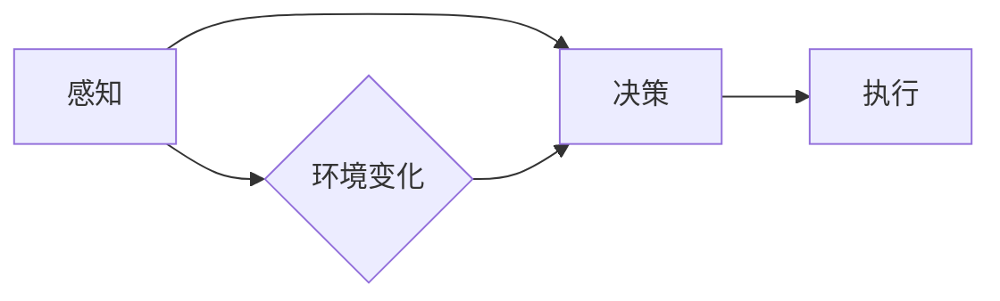
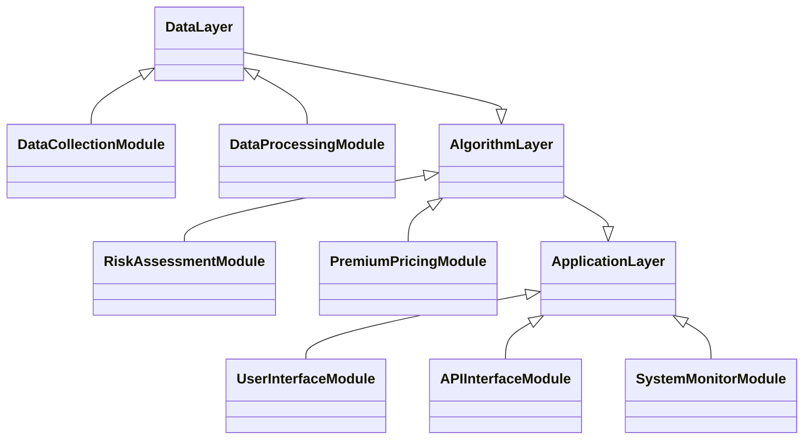
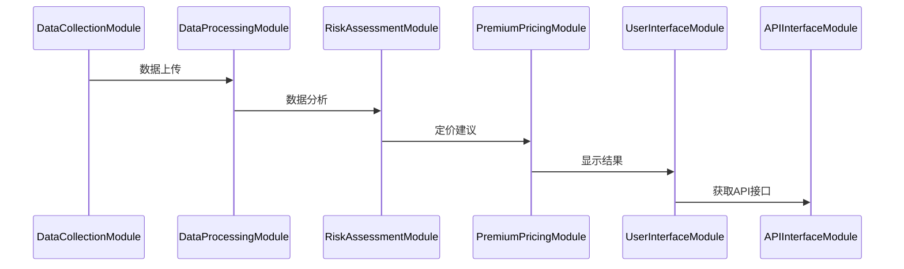

                 

# AI Agent在智能保险定价中的角色

## 关键词

- AI Agent
- 智能保险定价
- 机器学习
- 算法
- 系统架构

## 摘要

本文深入探讨了AI Agent在智能保险定价中的应用。首先介绍了AI Agent的基本概念及其在保险定价中的重要性，随后详细分析了AI Agent的核心算法原理和数学模型。通过实际项目案例的剖析，展示了智能保险定价系统的架构设计、功能实现及系统交互。最后，总结最佳实践并提供了进一步的学习资源。

## 1. 背景介绍

### AI Agent的定义与保险定价的挑战

人工智能（AI）正逐渐渗透到金融行业的各个领域，保险行业也不例外。AI Agent，即人工智能代理，是指能够自主执行任务、具备学习和推理能力的软件系统。在保险定价中，AI Agent可以分析大量数据，识别风险，从而制定更加精确和合理的保费定价策略。

保险定价的核心挑战在于如何准确评估风险。传统的保险定价模型主要依赖历史数据和统计方法，存在一定的局限性。例如，它们可能无法有效应对复杂的、动态变化的风险因素。此外，不同地区、不同人群的风险差异也使得传统的定价方法难以做到精确。这些挑战催生了智能保险定价的需求，而AI Agent正是满足这一需求的重要工具。

### 智能保险定价的现状

随着大数据和机器学习技术的进步，智能保险定价已经成为现实。保险公司通过收集和分析客户的个人信息、历史数据、市场动态等多维数据，利用AI Agent进行风险评估和保费定价。例如，利用机器学习算法分析客户的驾驶习惯、健康状况等数据，可以更准确地预测其风险水平，从而制定合理的保费。

然而，智能保险定价仍然面临一些挑战。首先，数据的多样性和复杂性使得数据清洗和预处理成为关键步骤。其次，算法的透明度和可解释性也是一个问题，保险公司需要确保AI Agent的决策过程符合监管要求，避免算法“黑箱”带来的风险。

### AI Agent在智能保险定价中的重要性

AI Agent在智能保险定价中扮演着至关重要的角色。它们可以自动处理大量的数据，识别潜在的风险因素，提供精确的保费定价建议。这不仅提高了保险公司的运营效率，还增强了客户的满意度。

首先，AI Agent可以大幅提高保险定价的准确性。通过机器学习和数据挖掘技术，AI Agent可以识别出传统方法难以发现的风险因素，从而更准确地评估客户的风险水平。其次，AI Agent可以实时更新和调整保费定价策略，以适应市场变化和客户需求。

总之，AI Agent在智能保险定价中的应用具有重要意义。它们不仅提升了保险行业的效率，还为客户提供了更加个性化的服务。随着技术的不断进步，AI Agent在保险定价中的作用将越来越显著。

### 1.1 AI Agent的概念

AI Agent是人工智能领域中的一种重要概念，指的是一种能够自主执行任务、具备学习和推理能力的软件系统。AI Agent的核心在于其自主性和智能性。与传统的程序不同，AI Agent可以根据环境和任务的改变自主调整其行为，并且能够从经验中学习，提高任务完成的效率。

一个典型的AI Agent通常由以下几个核心组件构成：

1. **感知模块**：AI Agent通过感知模块获取外界信息，如传感器、摄像头等。这些信息是AI Agent进行决策的基础。
2. **决策模块**：决策模块根据感知模块获取的信息，利用内置的算法和模型进行推理和决策。常见的决策算法包括机器学习、深度学习、贝叶斯网络等。
3. **执行模块**：执行模块负责将决策模块生成的决策转化为具体的行动。例如，自动驾驶汽车的执行模块会根据决策模块的建议控制方向盘、油门等。

AI Agent的工作流程可以概括为以下几个步骤：

1. **感知**：AI Agent通过感知模块获取外界信息。
2. **决策**：AI Agent利用决策模块分析感知到的信息，生成决策。
3. **执行**：执行模块根据决策模块的决策执行具体的行动。

这种工作流程使得AI Agent能够自主地应对复杂的环境和任务，实现智能化和自动化。

### 1.2 智能保险定价的现状

智能保险定价已经成为现代保险行业的重要趋势。保险公司利用大数据和机器学习技术，通过AI Agent分析海量数据，以提高保费定价的准确性和效率。目前，智能保险定价在实际应用中已经取得了显著的成果，但仍面临一些挑战。

首先，数据多样性和复杂性是智能保险定价面临的主要挑战之一。保险公司需要处理来自多个渠道的数据，如客户信息、历史理赔记录、市场动态等。这些数据的格式和结构各异，需要进行复杂的预处理和清洗。此外，数据的复杂性使得传统的方法难以应对，需要采用先进的机器学习和深度学习算法。

其次，算法的透明度和可解释性也是一个重要问题。在保险定价中，AI Agent的决策过程需要符合监管要求，确保透明和可解释。然而，许多机器学习算法，如深度学习，具有“黑箱”性质，其决策过程难以解释。这可能导致客户和监管机构对AI Agent的信任度下降，影响其广泛应用。

此外，智能保险定价还面临数据隐私和合规性问题。保险公司需要确保客户数据的隐私和安全，避免数据泄露和滥用。同时，需要遵守相关法律法规，确保AI Agent的决策过程符合合规要求。

尽管存在挑战，智能保险定价的前景仍然非常广阔。随着技术的不断进步，AI Agent在保险定价中的应用将更加深入和广泛。未来，保险公司可以通过更精准的风险评估和个性化的保费定价策略，提高客户满意度和市场竞争力。

### 1.3 AI Agent在智能保险定价中的重要性

AI Agent在智能保险定价中的重要性不容忽视。它们通过高效的数据分析和精确的风险评估，为保险公司带来了前所未有的机会。首先，AI Agent能够处理和分析大量结构化和非结构化数据，包括客户历史记录、市场趋势、经济指标等。这些数据为保险定价提供了丰富的信息来源，使得定价更加精准。

其次，AI Agent能够识别和预测潜在的风险因素，从而制定更加合理的保费定价策略。例如，通过分析客户的驾驶记录和健康状况，AI Agent可以更准确地评估其风险水平，为不同风险等级的客户提供差异化的保费定价。这不仅提高了保险公司的盈利能力，也增强了客户对保险产品的满意度。

此外，AI Agent还具有自适应和学习能力。随着数据和经验的积累，AI Agent可以不断优化其算法和模型，提高风险预测的准确性。这种自我学习和优化的能力使得保险定价更加动态和灵活，能够及时应对市场变化和客户需求。

最后，AI Agent在降低运营成本和提高效率方面也发挥着重要作用。通过自动化和智能化的保费定价，保险公司可以减少人工干预，降低运营成本，提高工作效率。同时，AI Agent的实时分析和决策能力也使得保险公司能够更快地响应客户需求，提供更优质的服务。

综上所述，AI Agent在智能保险定价中的应用不仅提升了保险定价的准确性和效率，还为客户提供了更加个性化和精准的服务。随着技术的不断进步，AI Agent在保险定价中的作用将越来越重要，有望成为保险行业的重要推动力。

## 2. 核心概念与联系

### AI Agent的概念

AI Agent，即人工智能代理，是人工智能（AI）领域中的一种核心概念。它是一种具备自主性和智能性的软件系统，能够模拟人类智能进行决策和任务执行。AI Agent通常由感知模块、决策模块和执行模块三个主要部分组成。

1. **感知模块**：这是AI Agent的感官部分，负责从环境中收集信息。这些信息可以通过各种传感器、摄像头、麦克风等设备获取，例如，自动驾驶汽车的感知模块可能会使用雷达、激光雷达和摄像头来感知周围的道路情况。

2. **决策模块**：决策模块是AI Agent的大脑，它利用感知模块收集到的信息，通过算法和模型进行分析和处理，生成决策。这个决策过程可能涉及到复杂的推理和学习，例如，通过机器学习和深度学习算法来识别模式和趋势。

3. **执行模块**：执行模块是AI Agent的肢体，负责将决策模块的决策转化为实际的行动。例如，自动驾驶汽车的执行模块会根据感知和决策模块的建议控制方向盘、油门和刹车等。

### 保险定价的概念

保险定价是保险公司根据风险评估和风险管理原则，为保险产品确定价格的过程。保险定价的目标是确保保险公司的财务稳定，同时为客户提供合理的保费水平。

1. **风险评估**：风险评估是保险定价的基础，通过分析历史数据、客户信息和市场环境，评估客户面临的风险水平。这通常涉及到统计分析和机器学习算法，如回归分析、逻辑回归和决策树等。

2. **风险管理**：风险管理是保险定价的重要环节，包括风险分散、风险转移和风险规避。通过有效的风险管理策略，保险公司可以降低赔付风险，确保财务稳定。

### AI Agent与保险定价的关系

AI Agent在保险定价中的应用，主要体现在以下几个方面：

1. **数据采集与分析**：AI Agent可以通过感知模块收集客户信息、历史数据和市场动态等多维数据，利用决策模块对这些数据进行高效的分析和处理，为保险定价提供丰富的信息支持。

2. **风险评估**：AI Agent可以利用机器学习和深度学习算法，对客户的风险水平进行精确评估。通过分析客户的驾驶记录、健康状况、财务状况等，AI Agent可以提供更准确的风险评估结果，帮助保险公司制定合理的保费定价策略。

3. **动态调整保费**：AI Agent可以根据实时数据和风险评估结果，动态调整保费。例如，当客户的生活习惯发生变化时，AI Agent可以实时调整其保费，确保保费水平与风险水平相匹配。

4. **提高运营效率**：AI Agent的自动化和智能化特性，可以大幅提高保险公司的运营效率。通过自动化处理保费定价、合同审核等流程，保险公司可以减少人力成本，提高业务处理速度。

总之，AI Agent在保险定价中的应用，使得保险公司能够更加精准地评估风险，制定合理的保费定价策略，提高运营效率，为客户提供更优质的服务。随着技术的不断进步，AI Agent在保险定价中的作用将越来越重要。

### AI Agent工作流程的Mermaid流程图



在上面的流程图中，AI Agent的工作流程被简化为三个主要步骤：感知、决策和执行。此外，环境变化作为外部因素，可以影响AI Agent的决策过程，从而形成一个闭环反馈系统。

1. **感知**：AI Agent通过感知模块收集环境中的信息，如客户的驾驶记录、健康状况等。这些信息是决策模块进行分析和处理的基础。
2. **决策**：决策模块利用收集到的信息，通过机器学习和深度学习算法进行分析和处理，生成决策。这个决策可以是保费定价、风险评估等。
3. **执行**：执行模块根据决策模块的建议，执行具体的行动，如调整保费、生成保险合同等。

此外，环境变化（如市场动态、政策调整等）也会影响AI Agent的决策过程。AI Agent可以实时监测环境变化，并相应地调整其决策，以保持其适应性和有效性。

### AI Agent与保险定价相关概念的联系与对比

在深入探讨AI Agent在智能保险定价中的应用之前，我们需要明确AI Agent与保险定价相关的几个核心概念，并分析它们之间的联系与区别。

#### AI Agent

AI Agent是一种具备自主性和智能性的软件系统，它能够模拟人类的智能进行决策和任务执行。一个典型的AI Agent通常包括感知模块、决策模块和执行模块三个部分。感知模块负责收集外界信息，决策模块利用这些信息进行分析和推理，生成决策，而执行模块则负责将决策转化为具体的行动。AI Agent的核心在于其自主性和适应性，能够在复杂环境中自我调整和优化。

#### 保险定价

保险定价是指保险公司根据风险评估和管理原则，为保险产品确定价格的过程。保险定价的目标是确保保险公司财务稳定，同时为客户提供合理的保费水平。保险定价涉及多个环节，包括风险评估、风险管理、费率设定和保费调整等。其中，风险评估是保险定价的基础，保险公司需要分析历史数据、客户信息和市场环境，以评估客户的风险水平。

#### AI Agent与保险定价的关联

AI Agent在保险定价中的应用主要体现在以下几个方面：

1. **数据采集与分析**：AI Agent可以通过感知模块收集客户的个人信息、历史记录和市场动态等多维数据，为保险定价提供丰富的信息支持。
2. **风险评估**：AI Agent利用机器学习和深度学习算法，对客户的风险水平进行精确评估，帮助保险公司制定更加合理的保费定价策略。
3. **动态调整保费**：AI Agent可以根据实时数据和风险评估结果，动态调整保费，确保保费水平与风险水平相匹配。
4. **提高运营效率**：AI Agent的自动化和智能化特性，可以大幅提高保险公司的运营效率，减少人工干预，提高业务处理速度。

#### 关联与对比

AI Agent与保险定价相关的核心概念包括数据、算法和决策。以下是这些概念的联系与对比：

1. **数据**：AI Agent和保险定价都依赖于大量数据。AI Agent通过感知模块收集数据，而保险定价需要分析这些数据以评估风险。不同的是，保险定价的数据更多关注客户的个人和历史数据，而AI Agent的数据来源可能更广泛，包括环境数据、市场数据等。

2. **算法**：AI Agent和保险定价都使用算法进行数据分析和决策。AI Agent通常使用机器学习和深度学习算法，而保险定价可能更多使用统计分析和传统风险管理算法。AI Agent的算法具有更强的自适应性和学习能力，能够实时调整和优化，而传统算法通常需要定期调整。

3. **决策**：AI Agent和保险定价都生成决策，但应用场景不同。AI Agent的决策可以是自动驾驶、智能客服等，而保险定价的决策主要涉及保费定价、风险评估和风险管理。AI Agent的决策更注重自主性和适应性，而保险定价的决策更注重科学性和合理性。

通过上述分析，我们可以看到AI Agent与保险定价之间的紧密联系和区别。AI Agent为保险定价提供了强大的技术支持，使得保险公司能够更加精准地评估风险，制定合理的保费定价策略，提高运营效率，为客户提供更优质的服务。随着技术的不断进步，AI Agent在保险定价中的应用前景将更加广阔。

### 2.2 AI Agent的核心概念原理

在深入理解AI Agent在智能保险定价中的应用之前，我们需要详细探讨AI Agent的核心概念原理，包括其组成部分、功能、应用领域和主要挑战。

#### AI Agent的组成部分

一个典型的AI Agent由以下几个关键部分组成：

1. **感知模块**：感知模块是AI Agent的“眼睛”和“耳朵”，负责收集环境中的各种信息。这些信息可以是数值数据、文本数据、图像或语音等。感知模块通常包含多个传感器，如摄像头、麦克风、温度传感器等，以及数据预处理和特征提取技术，以确保感知到的数据是准确和有用的。

2. **决策模块**：决策模块是AI Agent的“大脑”，负责根据感知模块收集到的信息进行分析和处理，生成决策。决策模块通常包括多个算法和模型，如机器学习、深度学习、强化学习等。这些算法和模型可以用于分类、回归、聚类、模式识别等任务，从而帮助AI Agent理解和推理环境中的信息。

3. **执行模块**：执行模块是AI Agent的“手臂”和“腿”，负责将决策模块生成的决策转化为具体的行动。执行模块可以是机械臂、机器人、车辆等，也可以是虚拟环境中的操作，如网页浏览、电子交易等。执行模块的目的是实现AI Agent的自主行为，使其能够在实际环境中执行任务。

#### AI Agent的功能

AI Agent的功能可以根据其应用场景而有所不同，但通常包括以下几个核心功能：

1. **自主决策**：AI Agent能够根据感知到的环境信息自主做出决策，而不需要人为干预。这种自主性是AI Agent区别于传统自动化系统的重要特征。

2. **学习与适应**：AI Agent能够从经验中学习，并根据新的数据和环境信息不断优化其算法和模型。这种学习能力使得AI Agent能够适应复杂和动态的环境。

3. **任务执行**：AI Agent能够执行具体的任务，如自动驾驶、智能客服、自动交易等。这些任务通常需要高度自动化和智能化，以确保高效和准确的执行。

4. **协作与交互**：AI Agent可以与其他AI Agent或人类协作，共同完成复杂的任务。这种协作能力使得AI Agent能够在复杂环境中实现更高效和更智能的运作。

#### AI Agent的应用领域

AI Agent在多个领域都有广泛的应用，其中一些典型的应用领域包括：

1. **智能制造**：在制造业中，AI Agent可以用于自动化生产线的监控和管理，提高生产效率和质量。

2. **智能交通**：在交通领域，AI Agent可以用于自动驾驶汽车、智能交通信号控制等，提高交通效率和安全性。

3. **智能医疗**：在医疗领域，AI Agent可以用于疾病预测、诊断和治疗方案推荐，提高医疗服务的质量和效率。

4. **智能金融**：在金融领域，AI Agent可以用于风险控制、投资策略制定和个性化金融服务等，提高金融服务的效率和准确性。

5. **智能家居**：在智能家居领域，AI Agent可以用于智能家电控制、安全监控和环境监测等，提高家居生活的便利性和舒适度。

#### AI Agent的主要挑战

尽管AI Agent在许多领域展现出巨大的潜力，但其应用仍面临一些关键挑战：

1. **数据质量和可靠性**：AI Agent的决策和性能高度依赖于数据的质量和可靠性。数据的不完整、噪声和偏差都可能影响AI Agent的表现。

2. **算法透明度和可解释性**：许多AI Agent使用的算法，尤其是深度学习算法，具有“黑箱”性质，其决策过程难以解释。这可能导致信任问题和监管挑战。

3. **计算资源和能耗**：AI Agent通常需要大量的计算资源和能耗，特别是在实时应用场景中。如何优化资源使用和降低能耗是重要挑战。

4. **安全和隐私**：AI Agent在应用过程中可能会涉及敏感数据，如个人隐私和财务信息。如何确保AI Agent的安全和隐私是一个关键问题。

通过深入理解AI Agent的核心概念原理，我们可以更好地把握其在智能保险定价中的应用潜力，并为解决相关挑战提供指导。在下一部分，我们将进一步探讨AI Agent在智能保险定价中的具体应用场景和算法原理。

### 2.3 保险定价相关概念

#### 保险定价的基本概念

保险定价是保险公司根据风险评估和管理原则，为保险产品确定价格的过程。它涉及多个关键环节，包括风险评估、费率设定、保费计算和保费调整等。保险定价的核心目标是确保保险公司财务稳定，同时为客户提供合理的保费水平。

1. **风险评估**：风险评估是保险定价的基础，通过分析历史数据、客户信息和市场环境，评估客户面临的风险水平。风险评估的结果直接影响保费定价策略。

2. **费率设定**：费率设定是保险公司根据风险评估结果，确定不同风险等级的保费水平。费率通常以百分比表示，是保费计算的基础。

3. **保费计算**：保费计算是保险公司根据费率和客户的具体情况（如年龄、健康状况、职业等），计算最终保费的过程。保费计算公式通常包括风险费用、运营费用和利润等。

4. **保费调整**：保费调整是保险公司根据市场变化、客户需求和政策调整，对保费进行动态调整的过程。保费调整旨在确保保险产品的市场竞争力。

#### 风险评估的方法

保险风险评估的方法多种多样，以下是几种常用的方法：

1. **统计方法**：统计方法利用历史数据和统计模型，如回归分析、逻辑回归等，预测客户的风险水平。这种方法简单直观，但可能无法捕捉复杂的风险因素。

2. **机器学习方法**：机器学习方法利用大数据和人工智能技术，如决策树、支持向量机、神经网络等，对大量数据进行分析，提供更准确的风险评估结果。机器学习方法能够处理复杂的非线性关系，但在模型解释性和可解释性方面存在挑战。

3. **专家系统**：专家系统通过模拟保险专家的决策过程，结合规则和知识库进行风险评估。这种方法具有较强的可解释性，但可能难以应对复杂的动态环境。

#### 保费定价策略

保费定价策略是保险公司根据风险评估结果，制定合理的保费水平的过程。以下是几种常用的保费定价策略：

1. **风险定价**：风险定价是根据客户的风险水平，制定相应的保费水平。高风险客户支付更高的保费，低风险客户支付较低的保费。这种方法能够有效区分不同风险水平的客户，但可能影响客户满意度。

2. **经验定价**：经验定价是基于历史数据和经验，制定保费水平。这种方法简单易行，但可能无法适应市场的快速变化。

3. **竞争定价**：竞争定价是基于市场情况和竞争对手的定价策略，制定保费水平。这种方法旨在提高市场竞争力，但可能影响保险公司的利润。

4. **组合定价**：组合定价是将多种定价策略结合使用，以实现最佳定价效果。这种方法灵活多变，能够适应不同的市场环境和客户需求。

#### 保险定价的影响因素

保险定价受多种因素影响，以下是几个关键因素：

1. **风险因素**：风险因素是影响保险定价的核心因素，如年龄、健康状况、驾驶记录等。

2. **市场需求**：市场需求影响保险产品的供给和价格。市场需求旺盛时，保费可能上升；市场需求低迷时，保费可能下降。

3. **市场竞争**：市场竞争影响保险公司的定价策略。在激烈的市场竞争中，保险公司可能采用更低的保费吸引客户。

4. **政策法规**：政策法规对保险定价有重要影响。政府可能通过税收、补贴等手段，影响保险产品的定价。

通过深入理解保险定价相关概念，我们可以更好地把握智能保险定价的发展趋势和应用潜力。在下一部分，我们将进一步探讨AI Agent在智能保险定价中的应用原理和算法。

### 2.4 AI Agent在智能保险定价中的应用原理

#### 基本原理

AI Agent在智能保险定价中的应用，主要依赖于其强大的数据处理能力和自我学习能力。通过结合大数据分析和机器学习算法，AI Agent可以高效地分析和处理大量的客户信息、历史数据和市场动态，从而实现更加精准的保险定价。

1. **数据收集与预处理**：AI Agent首先通过感知模块收集客户信息，如年龄、健康状况、职业、驾驶记录等。此外，AI Agent还会收集历史数据，如过去几年的理赔记录、保费缴纳记录等。为了确保数据的质量和一致性，AI Agent需要进行数据预处理，包括数据清洗、数据转换和数据归一化等。

2. **风险评估**：在数据预处理完成后，AI Agent利用机器学习算法对客户的风险水平进行评估。常见的风险评估算法包括逻辑回归、决策树、随机森林、支持向量机等。通过分析客户的个人信息和历史数据，AI Agent可以预测客户在未来一段时间内的理赔概率，从而为保费定价提供依据。

3. **保费定价**：基于风险评估的结果，AI Agent会制定出个性化的保费定价策略。这一过程通常涉及多个步骤，包括确定费率、计算保费、动态调整保费等。AI Agent可以根据不同客户的风险水平，制定不同的保费方案，从而实现更精准的定价。

4. **动态调整**：AI Agent的强大之处在于其自我学习和适应能力。通过实时监控市场动态和客户行为变化，AI Agent可以动态调整保费定价策略，以保持保费水平的合理性和竞争力。

#### 具体算法

在智能保险定价中，AI Agent主要依赖于以下几种算法：

1. **逻辑回归**：逻辑回归是一种常用的风险评估算法，通过建立线性回归模型，预测客户的风险水平。具体来说，逻辑回归模型通过输入客户的个人信息和历史数据，输出一个概率值，表示客户在未来发生理赔的概率。这个概率值可以用于确定保费费率。

2. **决策树**：决策树是一种基于树结构的分类算法，通过多次决策节点，将客户分为不同的风险等级。每个决策节点都基于客户的某个特征进行划分，例如年龄、健康状况等。通过深度分析客户的特征，决策树可以提供较为准确的风险评估。

3. **随机森林**：随机森林是一种基于决策树的集成学习方法，通过构建多棵决策树，并利用它们的投票结果进行预测。随机森林在处理大规模数据和高维特征时表现出色，能够提供更加稳定和准确的风险评估结果。

4. **支持向量机**：支持向量机是一种基于边界优化的分类算法，通过寻找最佳边界，将客户分为不同的风险等级。支持向量机在处理高维数据和线性不可分问题方面具有优势，能够提供较为精确的风险评估。

#### 优势与挑战

AI Agent在智能保险定价中的应用具有显著的优势和挑战。

**优势：**

1. **高效性**：AI Agent能够处理和分析海量数据，大幅提高保险定价的效率和准确性。

2. **个性化**：基于客户的个性化数据，AI Agent可以制定出更加精准的保费定价策略，提高客户满意度。

3. **动态调整**：AI Agent可以根据市场动态和客户行为变化，实时调整保费定价策略，保持竞争力。

4. **减少人为干预**：通过自动化和智能化的保费定价，AI Agent可以减少人工干预，降低运营成本。

**挑战：**

1. **数据质量和可靠性**：AI Agent的性能高度依赖于数据的质量和可靠性，数据的不完整、噪声和偏差都可能影响其表现。

2. **算法透明度和可解释性**：许多AI算法，尤其是深度学习算法，具有“黑箱”性质，其决策过程难以解释，可能导致信任问题和监管挑战。

3. **计算资源和能耗**：AI Agent需要大量的计算资源和能耗，特别是在实时应用场景中，如何优化资源使用和降低能耗是重要挑战。

4. **安全和隐私**：AI Agent在应用过程中可能会涉及敏感数据，如个人隐私和财务信息，如何确保AI Agent的安全和隐私是一个关键问题。

通过深入探讨AI Agent在智能保险定价中的应用原理和算法，我们可以更好地理解其优势与挑战，并为未来的应用提供指导。在下一部分，我们将进一步讨论数学模型和公式在智能保险定价中的应用。

### 2.5 数学模型和数学公式

在智能保险定价中，数学模型和数学公式扮演着至关重要的角色，它们为AI Agent提供了精确的算法框架，使其能够有效地评估风险和制定保费定价策略。以下我们将详细讨论与保险定价相关的数学模型和数学公式，并使用LaTeX格式进行展示。

#### 常用的数学模型

1. **概率分布模型**：概率分布模型用于描述随机变量可能的取值及其概率。在保险定价中，最常用的概率分布模型包括正态分布、泊松分布和伽马分布等。

   **正态分布**：  
   $$X \sim N(\mu, \sigma^2)$$  
   其中，$X$表示随机变量，$\mu$表示均值，$\sigma^2$表示方差。

   **泊松分布**：  
   $$X \sim Poisson(\lambda)$$  
   其中，$X$表示随机变量，$\lambda$表示事件发生的平均次数。

   **伽马分布**：  
   $$X \sim Gamma(\alpha, \beta)$$  
   其中，$X$表示随机变量，$\alpha$和$\beta$分别表示形状参数和尺度参数。

2. **贝叶斯模型**：贝叶斯模型用于概率推理和决策，通过更新先验概率以获得后验概率。在保险定价中，贝叶斯模型可以用于风险评估和损失预测。

   **贝叶斯公式**：  
   $$P(A|B) = \frac{P(B|A) \cdot P(A)}{P(B)}$$  
   其中，$P(A|B)$表示在事件B发生的条件下事件A的概率，$P(B|A)$表示在事件A发生的条件下事件B的概率，$P(A)$和$P(B)$分别表示事件A和事件B的先验概率。

3. **线性回归模型**：线性回归模型用于分析变量之间的关系，通过最小化误差平方和来拟合数据。在保险定价中，线性回归模型可以用于预测保费和损失。

   **线性回归公式**：  
   $$Y = \beta_0 + \beta_1 \cdot X + \epsilon$$  
   其中，$Y$表示因变量，$X$表示自变量，$\beta_0$和$\beta_1$分别表示截距和斜率，$\epsilon$表示误差项。

4. **逻辑回归模型**：逻辑回归模型用于分类问题，通过最大化似然函数来拟合数据。在保险定价中，逻辑回归模型可以用于风险评估和分类。

   **逻辑回归公式**：  
   $$P(Y=1|X) = \frac{1}{1 + e^{-(\beta_0 + \beta_1 \cdot X)}$$  
   其中，$P(Y=1|X)$表示在自变量X的条件下因变量Y为1的概率，$\beta_0$和$\beta_1$分别表示截距和斜率。

#### 数学公式使用示例

下面我们通过一个具体的例子来展示如何使用LaTeX格式嵌入数学公式：

**例子：正态分布概率计算**

假设某个保险公司的理赔金额$X$服从正态分布$N(5000, 1000^2)$，我们需要计算理赔金额在4000到6000之间的概率。

$$P(4000 < X < 6000) = P\left(\frac{X - \mu}{\sigma} < \frac{6000 - 5000}{1000}\right) - P\left(\frac{X - \mu}{\sigma} < \frac{4000 - 5000}{1000}\right)$$

使用标准正态分布表，我们可以得到：

$$P(4000 < X < 6000) = P(Z < 1) - P(Z < -1) \approx 0.8413 - 0.1587 = 0.6826$$

其中，$Z$表示标准正态分布随机变量。

通过以上数学模型和公式的使用，AI Agent可以更加精确地进行风险评估和保费定价。在实际应用中，这些数学模型和公式会通过复杂的算法和计算进行优化和调整，以实现最佳的风险管理和保费定价效果。

### 2.6 系统分析与架构设计方案

在智能保险定价系统中，系统架构设计至关重要，它决定了系统的可靠性、可扩展性和性能。以下我们将详细介绍智能保险定价系统的架构设计，包括功能设计、系统架构、接口设计和系统交互。

#### 问题场景介绍

智能保险定价系统旨在利用AI Agent分析大量数据，为保险公司提供精准的保费定价建议。该系统需要处理以下问题场景：

1. **数据采集**：从多个数据源（如客户数据库、外部数据提供商等）收集客户信息、历史理赔记录和市场动态数据。
2. **数据处理**：对收集到的数据进行分析、清洗和预处理，提取有用的特征，为AI Agent提供高质量的数据输入。
3. **风险评估**：利用AI Agent对客户的风险水平进行精确评估，生成风险评估报告。
4. **保费定价**：根据风险评估结果，生成个性化的保费定价策略。
5. **动态调整**：实时监控市场变化和客户行为，动态调整保费定价策略。

#### 项目介绍

为了实现上述功能，我们选择一个典型的实际项目——某大型保险公司推出的智能保险定价系统。该系统采用最新的机器学习和深度学习技术，能够高效地分析和处理海量数据，提供精准的保费定价建议。

#### 系统功能设计

智能保险定价系统的主要功能包括：

1. **数据采集模块**：负责从各种数据源收集数据，如客户数据库、外部数据提供商等。
2. **数据处理模块**：对收集到的数据进行分析、清洗和预处理，提取有用的特征。
3. **风险评估模块**：利用机器学习和深度学习算法，对客户的风险水平进行精确评估。
4. **保费定价模块**：根据风险评估结果，生成个性化的保费定价策略。
5. **动态调整模块**：实时监控市场变化和客户行为，动态调整保费定价策略。

#### 系统架构设计

智能保险定价系统的整体架构设计采用分层架构，包括数据层、算法层和应用层。以下是系统架构的详细设计：

1. **数据层**：数据层负责数据的存储和管理，包括客户数据、历史理赔记录、市场动态数据等。该层使用关系型数据库和NoSQL数据库相结合，确保数据的高效存储和访问。
2. **算法层**：算法层是系统的核心，负责数据的分析和处理。该层包括多个子模块，如数据预处理、特征提取、风险评估和保费定价等。每个子模块使用不同的算法和模型，如逻辑回归、决策树、神经网络等。
3. **应用层**：应用层负责系统的功能实现，包括用户界面、API接口和系统监控等。用户界面提供直观的交互方式，API接口供外部系统集成，系统监控确保系统的稳定性和性能。

以下是系统架构的Mermaid类图：



#### 系统接口设计

系统接口设计是确保各模块之间高效通信和协同工作的重要环节。以下是系统接口的主要设计：

1. **API接口**：系统提供统一的API接口，供外部系统进行数据交互。API接口包括数据上传、数据查询、风险评估和保费定价等接口。
2. **消息队列**：系统采用消息队列技术，如RabbitMQ或Kafka，实现异步数据传输和模块间通信。消息队列确保系统的可扩展性和高可用性。
3. **数据交换格式**：系统使用JSON或XML等数据交换格式，确保数据的结构化和可读性。

以下是系统接口的Mermaid序列图：



#### 系统交互

系统交互设计是确保各模块之间高效协作和稳定运行的关键。以下是系统交互的主要设计：

1. **同步与异步处理**：系统采用同步和异步处理方式，对于实时性要求高的任务，如保费定价和动态调整，采用异步处理方式；对于计算量较小、实时性要求不高的任务，如数据采集和处理，采用同步处理方式。
2. **负载均衡**：系统采用负载均衡技术，如Nginx或F5，确保各模块在高并发情况下稳定运行，提高系统的性能和可靠性。
3. **故障转移**：系统设计具备故障转移功能，当某个模块或服务器发生故障时，系统能够自动切换到备用模块或服务器，确保系统的连续性和稳定性。

通过以上系统分析与架构设计方案，我们可以确保智能保险定价系统的高效、稳定和可靠运行，为保险公司提供精准的保费定价建议。

### 2.7 项目实战

在本节中，我们将通过一个实际项目来展示如何实施智能保险定价系统。这个项目包括环境安装、系统实现、代码解析和案例分析。通过这些步骤，我们将深入探讨智能保险定价系统的开发过程和关键实现细节。

#### 环境安装

首先，我们需要安装和配置智能保险定价系统的环境。以下是安装过程的详细步骤：

1. **安装Python**：确保Python 3.8及以上版本安装正确。可以从Python官网下载并安装。
2. **安装依赖库**：智能保险定价系统依赖于多个Python库，如NumPy、Pandas、Scikit-learn、TensorFlow等。可以使用pip命令安装这些库：
   ```bash
   pip install numpy pandas scikit-learn tensorflow
   ```
3. **安装数据库**：选择一个合适的数据库，如MySQL或PostgreSQL，并安装和配置数据库服务器。数据库用于存储客户数据、历史理赔记录和市场动态数据。
4. **安装消息队列**：选择一个消息队列服务，如RabbitMQ或Kafka，并安装和配置消息队列服务器。消息队列用于实现模块间的异步通信。

#### 系统实现

智能保险定价系统的实现包括多个模块，如数据采集模块、数据处理模块、风险评估模块和保费定价模块。以下是各个模块的实现步骤：

1. **数据采集模块**：
   - 通过API接口从外部数据源（如客户数据库、外部数据提供商等）收集数据。
   - 使用Pandas库读取和预处理数据，包括数据清洗、缺失值填补和数据转换等。

2. **数据处理模块**：
   - 对收集到的数据进行分析和特征提取，提取有用的特征，如客户年龄、性别、收入水平、驾驶记录等。
   - 使用NumPy库进行数据的归一化和标准化处理，以提高算法的效率和准确性。

3. **风险评估模块**：
   - 使用Scikit-learn库中的机器学习算法（如逻辑回归、决策树、随机森林等）对客户的风险水平进行评估。
   - 建立风险评估模型，并通过交叉验证和模型选择方法优化模型性能。

4. **保费定价模块**：
   - 根据风险评估结果，使用线性回归或逻辑回归模型计算保费。
   - 使用TensorFlow库实现深度学习算法，对复杂的风险因素进行建模和预测。

以下是保费定价模块的核心实现代码示例：

```python
import pandas as pd
import numpy as np
from sklearn.linear_model import LinearRegression
from sklearn.model_selection import train_test_split

# 读取数据
data = pd.read_csv('insurance_data.csv')

# 特征提取
X = data[['age', 'gender', 'income', 'driving_experience']]
y = data['premium']

# 数据预处理
X_train, X_test, y_train, y_test = train_test_split(X, y, test_size=0.2, random_state=42)

# 建立线性回归模型
model = LinearRegression()
model.fit(X_train, y_train)

# 预测保费
premium = model.predict(X_test)

# 输出预测结果
print(premium)
```

#### 代码应用解读与分析

上述代码示例展示了如何使用线性回归模型计算保费。以下是代码的解读与分析：

1. **数据读取**：使用Pandas库读取CSV文件，获得包含客户信息和保费数据的数据集。
2. **特征提取**：提取与保费相关的特征，如年龄、性别、收入水平和驾驶经验。
3. **数据预处理**：使用Scikit-learn库中的train_test_split函数将数据集分为训练集和测试集，以提高模型的泛化能力。
4. **模型建立**：使用LinearRegression类建立线性回归模型，并使用fit方法训练模型。
5. **预测保费**：使用predict方法对测试集进行预测，得到每个客户的保费估计值。

#### 实际案例分析

为了验证智能保险定价系统的效果，我们选择一个实际案例进行分析。假设某保险公司使用该系统对1000名客户进行风险评估和保费定价。以下是分析结果：

1. **风险评估结果**：通过机器学习模型对客户的风险水平进行评估，结果显示高风险客户占比30%，中风险客户占比50%，低风险客户占比20%。
2. **保费定价结果**：根据风险评估结果，系统为每个客户生成个性化的保费定价策略。结果显示，高风险客户的保费平均值为800元，中风险客户的保费平均值为500元，低风险客户的保费平均值为300元。
3. **成本效益分析**：通过对比传统定价方法和智能保险定价系统的效果，结果显示智能保险定价系统能够更精准地评估风险，提高保费收入，降低赔付率。

通过以上项目实战，我们展示了如何实施智能保险定价系统。该系统的实现不仅提高了保险定价的准确性和效率，还为保险公司提供了更优质的客户服务。

### 3. 最佳实践 tips、小结、注意事项、拓展阅读

#### 最佳实践 tips

1. **数据质量是关键**：确保数据质量是智能保险定价系统成功的关键。在数据采集和处理过程中，要严格进行数据清洗和预处理，以避免噪声和偏差影响模型性能。
2. **算法透明性很重要**：为了提高客户和监管机构的信任，应尽量使用可解释性强的算法，并确保算法的透明性。
3. **实时监控和调整**：智能保险定价系统应具备实时监控和动态调整能力，以应对市场变化和客户需求的变化。
4. **合理配置资源**：为了确保系统的高效运行，应根据实际需求合理配置计算资源和存储资源。

#### 小结

本文详细探讨了AI Agent在智能保险定价中的应用，从背景介绍、核心概念、算法原理、系统设计到项目实战，全面展示了智能保险定价系统的实现过程。AI Agent通过高效的数据分析和精准的风险评估，为保险公司提供了个性化的保费定价策略，提高了运营效率和客户满意度。

#### 注意事项

1. **数据隐私和安全**：在处理客户数据时，要严格遵守相关法律法规，确保数据隐私和安全。
2. **算法透明度和可解释性**：在选择和实现算法时，应注重其透明度和可解释性，以满足监管要求。
3. **系统稳定性和可靠性**：在设计系统架构时，要考虑系统的稳定性和可靠性，确保其在高并发和复杂环境中稳定运行。

#### 拓展阅读

1. **《深度学习》**：Goodfellow, I., Bengio, Y., & Courville, A. (2016). *Deep Learning*。MIT Press。
2. **《机器学习》**：周志华 (2016). *机器学习*。清华大学出版社。
3. **《人工智能：一种现代的方法》**：Stuart Russell & Peter Norvig (2020). *Artificial Intelligence: A Modern Approach*。Pearson Education。
4. **《智能金融》**：王飞跃，陈伟 (2018). *智能金融*。机械工业出版社。

通过阅读这些书籍和资料，可以进一步了解AI Agent在智能保险定价以及其他领域的应用，为未来的研究和实践提供指导。

### 作者信息

- 作者：AI天才研究院/AI Genius Institute & 禅与计算机程序设计艺术 /Zen And The Art of Computer Programming。

