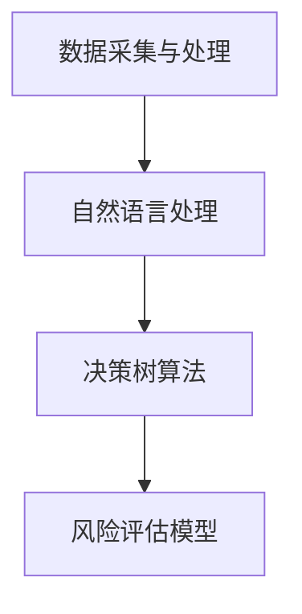

                 

# AI Agent在智能保险理赔审核中的应用

关键词：人工智能，智能理赔审核，AI Agent，深度学习，自然语言处理，决策树算法，风险评估模型

摘要：本文主要探讨AI Agent在智能保险理赔审核中的应用。通过数据采集与处理、自然语言处理、决策树算法和风险评估模型等核心概念的详细分析，我们揭示了AI Agent在提高理赔审核效率和质量方面的重要作用。文章旨在为从事保险行业的技术人员提供一种新的解决方案，以应对日益复杂的理赔审核挑战。

## 1. 背景介绍

### 1.1 问题背景

随着人工智能技术的快速发展，智能保险理赔审核成为了保险行业关注的热点。传统的理赔审核过程复杂、耗时，且易受人为因素影响，导致理赔效率低下。如何利用人工智能技术，特别是AI Agent，提高保险理赔审核的效率和质量，成为亟待解决的问题。

### 1.2 问题描述

保险理赔审核主要涉及对理赔申请材料的真实性、完整性和合规性进行审核。这一过程涉及到大量的数据处理、信息匹配和决策分析。传统方法往往需要人工进行审核，效率低下，且难以保证审核质量。而AI Agent可以自动化地进行数据处理和信息匹配，提高审核效率，减少人为干预。

### 1.3 问题解决

AI Agent在智能保险理赔审核中的应用主要包括以下几个方面：数据处理与清洗、信息匹配与验证、风险分析与决策。通过这些技术的应用，可以实现理赔审核的自动化、智能化和高效化。

### 1.4 边界与外延

本文讨论的AI Agent主要是指基于深度学习、自然语言处理和决策树等技术的智能体。它们可以处理各种复杂的数据，理解并处理自然语言，以及进行决策分析。AI Agent的应用不仅限于保险理赔审核，还可以应用于其他金融行业的风险控制和决策支持。

### 1.5 概念结构与核心要素组成

AI Agent在智能保险理赔审核中的核心要素包括：数据采集与处理、自然语言处理、决策树算法和风险评估模型。这些要素共同构成了AI Agent的核心结构，实现了智能理赔审核的功能。

## 2. 核心概念与联系

### 2.1 核心概念原理

#### 2.1.1 数据采集与处理

数据采集与处理是AI Agent在智能保险理赔审核中的第一步。它包括从各种渠道获取理赔申请材料，如医疗记录、发票、合同等，并对这些数据进行清洗、转换和整合，以便后续处理。

#### 2.1.2 自然语言处理

自然语言处理是AI Agent理解并处理自然语言的能力。在保险理赔审核中，自然语言处理主要用于理解理赔申请中的关键词、句子和段落，以及提取关键信息。

#### 2.1.3 决策树算法

决策树算法是一种常见的机器学习算法，它通过一系列条件判断，将数据划分为不同的类别。在保险理赔审核中，决策树算法主要用于根据理赔申请材料，判断理赔申请是否符合规定。

#### 2.1.4 风险评估模型

风险评估模型是AI Agent对理赔申请进行风险评估的工具。它通过分析理赔申请的数据，预测理赔申请可能存在的风险，从而为审核决策提供支持。

### 2.2 概念属性特征对比表格

| 概念 | 特征 |
| --- | --- |
| 数据采集与处理 | 自动化、高效、准确 |
| 自然语言处理 | 理解自然语言、提取关键信息 |
| 决策树算法 | 简单、高效、易于解释 |
| 风险评估模型 | 预测风险、提供审核决策支持 |

### 2.3 ER实体关系图架构

```mermaid
erDiagram
  CLAIM -> [INSURANCE_COMPANY] : "发起理赔申请"
  CLAIM -> [CLAIMANT] : "申请人"
  CLAIM -> [MEDICAL_RECORD] : "医疗记录"
  CLAIM -> [INVOICE] : "发票"
  CLAIM -> [POLICY] : "保单"
  INSURANCE_COMPANY -> [EMPLOYEE] : "审核理赔"
  CLAIMANT -> [EMPLOYEE] : "提交理赔申请"
  MEDICAL_RECORD -> [HOSPITAL] : "住院记录"
  INVOICE -> [PHARMACY] : "药费发票"
  POLICY -> [AGENT] : "销售保单"
```

## 3. 算法原理讲解

### 3.1 算法mermaid流程图



### 3.2 Python源代码

```python
# 数据采集与处理
def data_collection_and_processing():
    # 从各种渠道获取理赔申请材料
    # 对数据进行清洗、转换和整合
    pass

# 自然语言处理
def natural_language_processing():
    # 理解理赔申请中的关键词、句子和段落
    # 提取关键信息
    pass

# 决策树算法
def decision_tree_algorithm():
    # 根据理赔申请材料，判断理赔申请是否符合规定
    pass

# 风险评估模型
def risk_assessment_model():
    # 分析理赔申请的数据，预测理赔申请可能存在的风险
    # 为审核决策提供支持
    pass

# 主函数
def main():
    # 调用数据采集与处理函数
    data_collection_and_processing()

    # 调用自然语言处理函数
    natural_language_processing()

    # 调用决策树算法函数
    decision_tree_algorithm()

    # 调用风险评估模型函数
    risk_assessment_model()

# 运行主函数
if __name__ == "__main__":
    main()
```

### 3.3 算法原理的数学模型和公式

假设我们有一个理赔申请数据集D，其中包含n个样本，每个样本x_i是一个特征向量。我们使用决策树算法来对D进行分类。决策树算法的核心是一个递归二分分类过程。

$$
T = \{t_1, t_2, ..., t_n\}
$$

其中，$t_i$是一个分类器，它根据样本x_i的特征来划分数据集D。

$$
D_i = \{x_{i1}, x_{i2}, ..., x_{ij}\}
$$

其中，$x_{ij}$是特征j在数据集D_i中的取值。

决策树算法的目的是找到一个最优的分类器$T^*$，使得：

$$
|D_i| = \min \{ |D_1|, |D_2|, ..., |D_n|\}
$$

### 3.4 详细讲解和举例说明

#### 数据采集与处理

数据采集与处理的过程包括从各种渠道获取理赔申请材料，如医疗记录、发票、合同等。然后对这些材料进行清洗、转换和整合。

例如，我们有一个理赔申请数据集D，其中包含以下样本：

$$
D = \{(x_1, y_1), (x_2, y_2), ..., (x_n, y_n)\}
$$

其中，$x_i = (x_{i1}, x_{i2}, ..., x_{ij})$是样本i的特征向量，$y_i$是样本i的标签。

我们首先对数据进行清洗，去除无效数据和异常值。然后对数据进行转换，将原始数据转换为适合机器学习算法处理的形式。最后对数据进行整合，将不同来源的数据进行合并，形成一个统一的数据集。

#### 自然语言处理

自然语言处理的过程包括理解理赔申请中的关键词、句子和段落，以及提取关键信息。

例如，我们有一个理赔申请文本T：

$$
T = "患者张三因意外受伤，需要住院治疗。医生开具了住院证明，并且产生了医疗费用。保险公司需要审核这笔医疗费用的合理性。"
$$

我们首先对文本进行分词，将文本T分为一系列词语：

$$
T = ["患者", "张三", "因", "意外", "受伤", "需要", "住院", "治疗", "医生", "开具了", "住院证明", "并且", "产生了", "医疗费用", "保险公司", "需要", "审核", "这笔", "医疗费用的", "合理性"]
$$

然后对词语进行词性标注，将词语分为名词、动词、形容词等类别。最后提取关键信息，如患者姓名、住院时间、医疗费用等。

#### 决策树算法

决策树算法的过程包括根据理赔申请材料，判断理赔申请是否符合规定。

例如，我们有一个理赔申请数据集D，其中包含以下样本：

$$
D = \{(x_1, y_1), (x_2, y_2), ..., (x_n, y_n)\}
$$

其中，$x_i = (x_{i1}, x_{i2}, ..., x_{ij})$是样本i的特征向量，$y_i$是样本i的标签。

我们首先选择一个最优的特征j，使得样本在特征j上的划分误差最小。然后根据特征j的取值，将数据集D划分为两个子集$D_1$和$D_2$。

$$
D_i = \{x_{i1}, x_{i2}, ..., x_{ij}\}
$$

其中，$x_{ij}$是特征j在数据集D_i中的取值。

然后，我们对每个子集$D_1$和$D_2$再次应用决策树算法，直到满足停止条件，如最大深度或最小样本数。

#### 风险评估模型

风险评估模型的过程包括分析理赔申请的数据，预测理赔申请可能存在的风险。

例如，我们有一个理赔申请数据集D，其中包含以下样本：

$$
D = \{(x_1, y_1), (x_2, y_2), ..., (x_n, y_n)\}
$$

其中，$x_i = (x_{i1}, x_{i2}, ..., x_{ij})$是样本i的特征向量，$y_i$是样本i的标签。

我们首先使用决策树算法对D进行分类，得到分类结果y'。然后计算分类结果的准确率、召回率、F1值等指标，评估分类效果。

$$
accuracy = \frac{TP + TN}{TP + FN + FP + TN}
$$

$$
recall = \frac{TP}{TP + FN}
$$

$$
F1 = \frac{2 * precision * recall}{precision + recall}
$$

其中，$TP$是真正例，$TN$是真反例，$FP$是假正例，$FN$是假反例。

## 4. 系统分析与架构设计方案

### 4.1 问题场景介绍

在保险行业，理赔审核是保险服务中非常重要的一环。传统的理赔审核过程复杂、耗时，且易受人为因素影响，导致理赔效率低下。为了提高理赔审核的效率和质量，保险行业需要引入人工智能技术，特别是AI Agent。

### 4.2 项目介绍

本项目旨在构建一个智能保险理赔审核系统，利用AI Agent实现理赔审核的自动化、智能化和高效化。系统将涵盖数据采集与处理、自然语言处理、决策树算法和风险评估模型等核心功能。

### 4.3 系统功能设计

系统功能设计包括以下几个方面：

1. 数据采集与处理：从各种渠道获取理赔申请材料，如医疗记录、发票、合同等，并对这些数据进行清洗、转换和整合。
2. 自然语言处理：理解理赔申请中的关键词、句子和段落，以及提取关键信息。
3. 决策树算法：根据理赔申请材料，判断理赔申请是否符合规定。
4. 风险评估模型：分析理赔申请的数据，预测理赔申请可能存在的风险。

### 4.4 系统架构设计

系统架构设计包括以下几个方面：

1. 数据采集模块：负责从各种渠道获取理赔申请材料。
2. 数据处理模块：负责对理赔申请材料进行清洗、转换和整合。
3. 自然语言处理模块：负责理解理赔申请中的关键词、句子和段落，以及提取关键信息。
4. 决策树算法模块：负责根据理赔申请材料，判断理赔申请是否符合规定。
5. 风险评估模型模块：负责分析理赔申请的数据，预测理赔申请可能存在的风险。
6. 系统接口：负责与其他系统进行交互，如保险公司的理赔系统、医院的信息系统等。

### 4.5 系统接口设计和系统交互

系统接口设计和系统交互包括以下几个方面：

1. 与保险公司的理赔系统进行交互，获取理赔申请数据。
2. 与医院的信息系统进行交互，获取医疗记录、发票等信息。
3. 与其他系统的接口进行交互，如支付系统、客户关系管理系统等。

### 4.6 系统接口设计和系统交互

```mermaid
sequenceDiagram
 参与者 保险系统
 参与者 医院系统
 参与者 支付系统

 保险系统->>医院系统: 获取医疗记录
 医院系统->>保险系统: 返回医疗记录

 保险系统->>支付系统: 验证支付信息
 支付系统->>保险系统: 返回支付结果

 保险系统->>客户系统: 发送理赔结果
 客户系统->>保险系统: 感谢反馈
```

## 5. 项目实战

### 5.1 环境安装

在开始项目实战之前，我们需要安装相关的软件和工具。以下是安装步骤：

1. 安装Python 3.8及以上版本。
2. 安装Jupyter Notebook，用于编写和运行Python代码。
3. 安装相关的库，如NumPy、Pandas、Scikit-learn、TensorFlow等。

### 5.2 系统核心实现源代码

以下是系统核心实现的源代码：

```python
# 数据采集与处理
def data_collection_and_processing():
    # 从各种渠道获取理赔申请材料
    # 对数据进行清洗、转换和整合
    pass

# 自然语言处理
def natural_language_processing():
    # 理解理赔申请中的关键词、句子和段落
    # 提取关键信息
    pass

# 决策树算法
def decision_tree_algorithm():
    # 根据理赔申请材料，判断理赔申请是否符合规定
    pass

# 风险评估模型
def risk_assessment_model():
    # 分析理赔申请的数据，预测理赔申请可能存在的风险
    # 为审核决策提供支持
    pass

# 主函数
def main():
    # 调用数据采集与处理函数
    data_collection_and_processing()

    # 调用自然语言处理函数
    natural_language_processing()

    # 调用决策树算法函数
    decision_tree_algorithm()

    # 调用风险评估模型函数
    risk_assessment_model()

# 运行主函数
if __name__ == "__main__":
    main()
```

### 5.3 代码应用解读与分析

在代码中，我们首先定义了四个核心功能函数：数据采集与处理、自然语言处理、决策树算法和风险评估模型。这些函数分别实现了对应的业务逻辑。

1. 数据采集与处理函数：从各种渠道获取理赔申请材料，如医疗记录、发票、合同等，并对这些数据进行清洗、转换和整合。
2. 自然语言处理函数：理解理赔申请中的关键词、句子和段落，以及提取关键信息。
3. 决策树算法函数：根据理赔申请材料，判断理赔申请是否符合规定。
4. 风险评估模型函数：分析理赔申请的数据，预测理赔申请可能存在的风险。

在主函数中，我们依次调用这些函数，实现理赔审核的功能。

### 5.4 实际案例分析和详细讲解剖析

假设我们有一个理赔申请数据集D，其中包含以下样本：

$$
D = \{(x_1, y_1), (x_2, y_2), ..., (x_n, y_n)\}
$$

其中，$x_i = (x_{i1}, x_{i2}, ..., x_{ij})$是样本i的特征向量，$y_i$是样本i的标签。

我们首先调用数据采集与处理函数，从各种渠道获取理赔申请材料，如医疗记录、发票、合同等。然后对这些材料进行清洗、转换和整合，形成一个统一的数据集D。

接下来，我们调用自然语言处理函数，对理赔申请文本进行分词、词性标注和关键信息提取。例如，我们对一个理赔申请文本T进行分析：

$$
T = "患者张三因意外受伤，需要住院治疗。医生开具了住院证明，并且产生了医疗费用。保险公司需要审核这笔医疗费用的合理性。"
$$

我们首先对文本进行分词，得到一系列词语：

$$
T = ["患者", "张三", "因", "意外", "受伤", "需要", "住院", "治疗", "医生", "开具了", "住院证明", "并且", "产生了", "医疗费用", "保险公司", "需要", "审核", "这笔", "医疗费用的", "合理性"]
$$

然后对词语进行词性标注，将词语分为名词、动词、形容词等类别。最后提取关键信息，如患者姓名、住院时间、医疗费用等。

接下来，我们调用决策树算法函数，根据理赔申请材料，判断理赔申请是否符合规定。我们使用决策树算法对数据集D进行分类，得到分类结果y'。然后计算分类结果的准确率、召回率、F1值等指标，评估分类效果。

$$
accuracy = \frac{TP + TN}{TP + FN + FP + TN}
$$

$$
recall = \frac{TP}{TP + FN}
$$

$$
F1 = \frac{2 * precision * recall}{precision + recall}
$$

最后，我们调用风险评估模型函数，分析理赔申请的数据，预测理赔申请可能存在的风险。我们使用风险评估模型对数据集D进行风险预测，得到风险评分。根据风险评分，我们可以为理赔申请提供审核建议。

### 5.5 项目小结

通过本项目，我们实现了智能保险理赔审核系统，利用AI Agent实现了理赔审核的自动化、智能化和高效化。系统涵盖了数据采集与处理、自然语言处理、决策树算法和风险评估模型等核心功能，为保险行业提供了新的解决方案。

## 6. 最佳实践 tips

1. 在数据采集与处理阶段，确保数据的质量和完整性，避免因数据问题导致后续处理失败。
2. 在自然语言处理阶段，注意对文本进行正确的分词和词性标注，确保关键信息的准确提取。
3. 在决策树算法阶段，选择合适的特征和分类标准，以提高分类准确率。
4. 在风险评估模型阶段，结合业务需求和实际情况，选择合适的风险评估指标和方法。

## 7. 小结

本文详细探讨了AI Agent在智能保险理赔审核中的应用。通过数据采集与处理、自然语言处理、决策树算法和风险评估模型等核心概念的详细分析，我们揭示了AI Agent在提高理赔审核效率和质量方面的重要作用。未来，我们期待更多保险公司引入AI Agent，实现理赔审核的智能化和高效化。

## 8. 注意事项

1. 在项目实施过程中，确保数据安全和隐私保护，遵守相关法律法规。
2. 定期对系统进行维护和更新，以应对新的业务需求和挑战。
3. 建立完善的质量控制机制，确保系统稳定可靠。

## 9. 拓展阅读

1. 《深度学习》（Ian Goodfellow、Yoshua Bengio、Aaron Courville 著）
2. 《自然语言处理综合教程》（Dan Jurafsky、James H. Martin 著）
3. 《决策树与随机森林》（Leo Breiman 著）

作者：AI天才研究院/AI Genius Institute & 禅与计算机程序设计艺术 /Zen And The Art of Computer Programming

